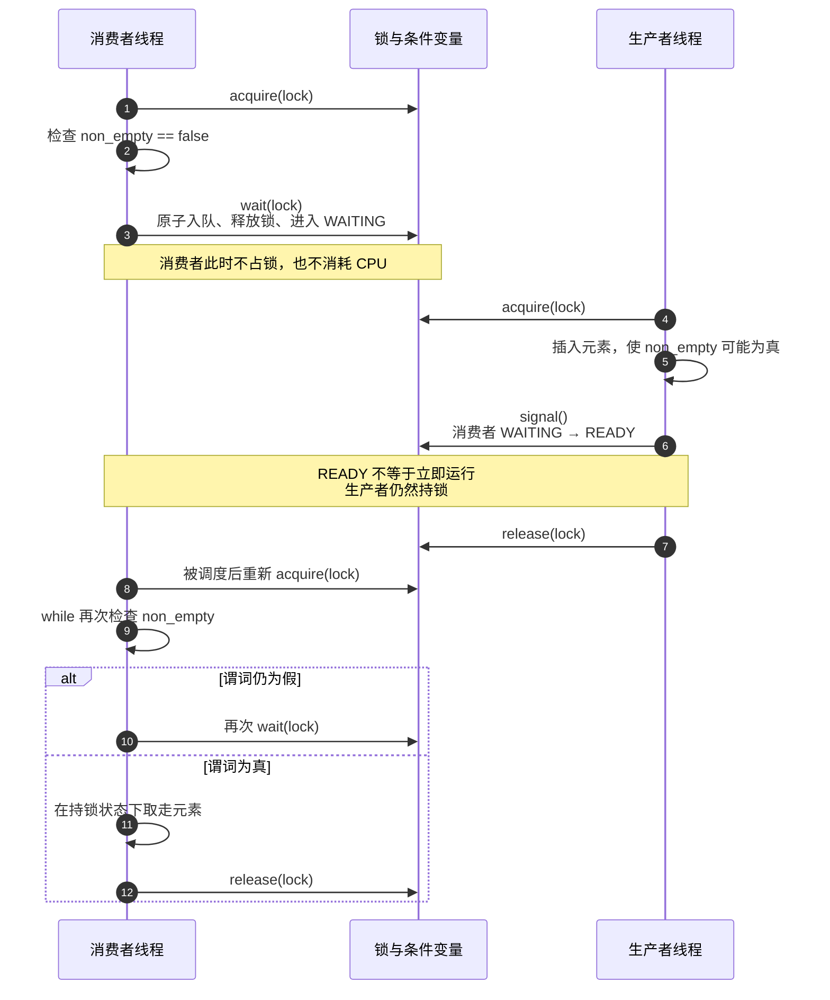

> 书名：*Operating Systems: Principles and Practice*（第二版）<br>
> 卷名：Volume II: *Concurrency*<br>
> 作者：Thomas Anderson、Michael Dahlin<br>
> 笔记范围：第 5 章 `Synchronizing Access to Shared Objects`，包括 5.1～5.9 节及 17 道章末练习<br>
> 原文位置：osppv2.md 的 “5 Synchronizing Access to Shared Objects” 部分

## 全章主线

### 本章要解决的问题

独立线程访问完全不同的内存时，可分别按顺序程序推理。现实中的协作线程却要共享堆对象、全局状态和设备队列；共享带来通信能力，也让结果依赖线程交错。

困难来自三方面：

1. 可能交错数量组合爆炸；
2. 同一输入的运行结果可能不同，调试又会改变时序；
3. 编译器和处理器会在不破坏单线程语义的前提下重排指令。

作者不主张枚举所有机器指令交错，而是建立结构化方法：

```text
把所有共享状态封装进共享对象
        ↓
用对象锁保护状态与不变量
        ↓
每次只允许一条线程执行对象临界区
        ↓
用条件变量等待“状态谓词变为真”
        ↓
按统一规则设计、实现和审查对象
        ↓
用原子读—改—写指令实现底层同步变量
```

这牺牲一部分随意性，却把证明单位从“所有 load/store 的交错”提升为“对象方法之间的原子顺序”。

### 阅读方式

笔记按 `5.1 → 5.9 → Exercises` 的原书顺序推进。伪代码、证明、C/C++ 实现、内存模型与公式直接嵌入锁、条件变量和案例的论证过程，使“竞态为何出现、同步怎样缩小交错空间、对象不变量如何证明”连续呈现。编译命令面向 Linux、macOS 或 WSL；当前环境没有 C/C++ 编译器，因此未做本地编译验证。

### 三类正确性性质

- **安全性（safety）**：“坏事永不发生”，如临界区最多一条线程、队列不越界。
- **活性（liveness）**：“好事最终发生”，如 FREE 锁最终被某个等待者取得。
- **公平/有界等待**：特定等待者不能被无限次超越。

安全性通常通过不变量证明；活性还依赖调度公平、持锁者最终释放等环境假设。

---

## 开篇：共享状态为何困难

### 交错决定结果

两线程写同一变量 `1` 和 `2`，最终值取决于最后完成的写。程序必须对所有允许调度正确，不能假设某线程更快。

若线程 A、B 各有 $m,n$ 个不可分步骤，仅保持各自内部顺序，交错数量已经是：

$$
\binom{m+n}{m}=\frac{(m+n)!}{m!n!}.
$$

三条以上线程、循环和机器指令拆分使状态空间进一步爆炸。

### 非确定性、Heisenbug 与 Bohrbug

调度、频率、缓存和其他程序负载每次不同，同一程序可产生不同结果。加日志、开启 `-g`、降低优化或单步调试又改变时序，使 bug 消失或变形，这类问题称 **Heisenbug**。

确定、稳定复现的 bug 称 **Bohrbug**，通常更容易定位。并发竞态是 Heisenbug 的主要来源。

测试一百万次通过只能说明所执行的交错没有暴露错误，不能证明所有交错安全。

### 编译器与硬件重排

考虑：

```c
/* 线程 1 */
p = some_computation();
p_initialized = true;

/* 线程 2 */
while (!p_initialized) {
}
q = another_computation(p);
```

直观看似先写 `p` 再发布标志。但无同步时：

- 编译器可重排独立语句，甚至把循环读取缓存到寄存器；
- CPU 写缓冲、乱序执行和缓存传播可让另一核心先看到标志，再看到旧 `p`；
- 在 C/C++ 中，非原子共享读写构成数据竞争，行为未定义，不能只按某种汇编顺序推理。

同步操作同时提供互斥/等待语义和内存顺序边界。编译器与硬件不得把受保护访问任意越过正确同步边界。

**为什么系统要重排。**

深流水 CPU 同时取指、解码、访存和计算。若后一条独立指令可先执行，就能覆盖前一条等待内存的停顿。编译器通过重排减少依赖停顿，CPU 通过写缓冲与乱序完成提高吞吐。

要求所有普通内存访问始终全局按程序顺序完成会显著损失性能。现代模型把责任分工为：普通单线程代码可优化；跨线程共享必须使用标准同步。

### 结构化同步的四层计划

1. 封装共享状态为共享对象；
2. 用锁和条件变量协调对象内部；
3. 遵循统一实现规则，围绕对象不变量推理；
4. 用硬件原子指令构造同步变量。

---

## 5.1 挑战（Challenges）

本节先展示不用高层同步、只分析读写交错为何迅速失控，再通过 Too Much Milk 区分安全与活性。

---

### 5.1.1 竞态条件

**严格定义。**

当程序行为依赖不同线程操作的交错顺序时，就存在竞态条件（race condition）。线程仿佛在赛跑，谁先/后完成决定结果。

> **Race condition 与 data race。** “竞态条件”是语义概念；C/C++ **data race** 是语言内存模型中的特定错误：不同线程无同步访问同一内存位置，至少一次写，且访问非原子。data race 往往造成竞态和未定义行为；使用原子变量仍可能有高层 check-then-act 竞态。

#### 最简单程序：两个写者

```text
线程 A: x = 1
线程 B: x = 2
```

若两个写都是原子，最终 $x\in\{1,2\}$。最后发生的写覆盖此前值。

#### 第二个程序：读写先后

初始 $y=12$：

```text
线程 A: x = y + 1
线程 B: y = y * 2
```

- A 先读取 $y$：$x=13$；
- B 先把 $y$ 改为 24：$x=25$。

关键线性化点是 A 对 $y$ 的读取，不是整条高级语言语句“开始”的时间。

#### 第三个程序：丢失更新

初始 $x=0$：

```text
线程 A: x = x + 1
线程 B: x = x + 2
```

高级语句通常拆为 load、add、store。

**串行交错。**

A 完整执行后 B：

$$
x=(0+1)+2=3.
$$

反向也得到 3。

**两线程都读到 0，A 后写。**

```text
A: load 0
B: load 0
B: store 2
A: store 1
```

最终 $x=1$。

**两线程都读到 0，B 后写。**

最终 $x=2$。

因此 $x\in\{1,2,3\}$。值 1 或 2 表示一项更新丢失。

在标准 C/C++ 中直接这样写是 data race，行为未定义；上述集合是假设机器提供原子字长 load/store 且按书中低层模型分析的结果。

#### Therac-25 的教训

Therac-25 放疗设备的软件检查剂量安全，同时 UI 可并发修改剂量，二者没有锁。罕见时序使剂量在“检查后、使用前”改变，加上 UI 缺陷导致约百倍过量辐射，患者死亡或重伤。

事故难识别，是因为竞态需要罕见事件序列，绝大多数治疗正常；厂商长期认为软件不可能过量。它说明：

- 安全关键检查与使用必须构成原子事务；
- 罕见不能视为不可能；
- 无法复现不表示不存在；
- 安全论证必须覆盖并发状态，而非只测试常见路径。

---

### 5.1.2 原子操作

**定义。**

原子操作不可被其他操作从中间观察或交错；其他线程的冲突操作只能完整发生在它之前或之后。

许多架构上，对齐的 32 位字 load/store 是原子的，因此不会读到“一半旧、一半新”。但原子读 + 原子写不使复合 `x=x+1` 原子。

**原子性依赖条件。**

- 数据宽度与对齐；
- 处理器架构；
- 是否跨缓存行/总线边界；
- 语言内存模型和类型；
- 设备内存的特殊规则。

书中指出 64 位浮点存储在某些实现上可能撕裂，读到两个值的混合。可移植 C/C++ 应使用 `std::atomic<T>`/`_Atomic` 或锁，而非猜测机器字原子性。

**原子性不等于有序性。**

一个原子写不会撕裂，但它与其他地址访问的可见顺序仍需内存序约束。发布对象需要 release/acquire 或锁，不能只把标志写声明成“单次原子”。

---

### 5.1.3 Too Much Milk

**问题模型。**

两位室友都负责保持冰箱有牛奶。若二人先后查看空冰箱并都去商店，会买两份。

目标：

- **安全性**：最多一人买牛奶；
- **活性**：缺奶时最终有人买。

本节暂按原书简化假设：共享 load/store 原子，编译器与硬件严格按代码顺序执行。现代 C/C++/CPU 不自动满足，后面讨论内存屏障。

#### 方案 1：单个便条标志

```c
if (milk == 0) {
    if (note == 0) {
        note = 1;
        milk++;
        note = 0;
    }
}
```

失败交错：A 检查 `milk==0` 后被抢占；B 完整买奶并清便条；A 恢复看到 `note==0`，再次购买。最终 `milk==2`，违反安全。

问题是检查 `milk` 与声明意图 `note=1` 不是原子整体。

#### 方案 2：每人先留自己的便条

线程 A：

```c
note_a = 1;
if (note_b == 0) {
    if (milk == 0) {
        milk++;
    }
}
note_a = 0;
```

线程 B 对称。

**方案 2 的安全性证明。**

反证假设 A、B 都买奶。考察 A 在读取 `note_b` 的原子时刻：

1. `note_b==1`：A 外层条件失败，不买，与假设矛盾；
2. `note_b==0 && milk>0`：牛奶在该简化程序中一旦大于 0 不再减少，是稳定性质；A 读 milk 时也会看到大于 0，不买，矛盾；
3. `note_b==0 && milk==0`：B 当前不在其声明意图到撤销便条的关键区间。此后 `note_a==1` 或 `milk>0` 至少一个保持为真，B 将在检查 A 便条或 milk 时失败，不能买，矛盾。

所有情况都与“两人都买”矛盾，所以最多一人购买。

**方案 2 为什么不活。**

A、B 可都先写自己的便条，然后各自看到对方便条为 1，于是都不买，随后都清便条。冰箱仍空且本次执行结束。

安全不蕴含活性：什么都不做常常非常“安全”，却没有用。

#### 方案 3：打破对称性

线程 A：

```c
note_a = 1;
while (note_b == 1) {
    /* 自旋等待。 */
}
if (milk == 0) {
    milk++;
}
note_a = 0;
```

线程 B：

```c
note_b = 1;
if (note_a == 0) {
    if (milk == 0) {
        milk++;
    }
}
note_b = 0;
```

A 在冲突时等待 B；B 不等待 A，形成不对称优先级，避免双方同时退让。

**方案 3 的安全性。**

若 B 买奶，则它读取 `note_a==0` 且 milk 为空。A 若尚未声明，之后声明并等待 `note_b`；B 买完清 `note_b`，A 继续时看到 milk 已有，不买。

若 A 买奶，则它已等到 `note_b==0`。B 不可能仍处于会买奶的区间；以后 B 若再运行，会看到 `note_a==1` 或 milk 已有，不买。

两种线性化顺序均最多一次购买。

**方案 3 的活性。**

B 的代码没有循环；在假设调度器最终让 B 运行、每条指令最终完成的前提下，B 最终清除 `note_b`。

于是 A 的 while 最终结束并检查 milk：

- 若为 1，说明 B 已买；
- 若为 0，A 买。

因此缺奶时最终有奶。

活性证明依赖弱公平调度：若 B 永远得不到 CPU，A 可永远自旋。

---

### 5.1.4 讨论

**为什么 load/store 方案不令人满意。**

1. 代码复杂，证明微妙；
2. A 忙等浪费 CPU；
3. 抢占系统中 A 可能占着 CPU 等待已被抢占的 B；
4. 只适合固定少量参与者；
5. 编译器/硬件重排会破坏证明；
6. 稍微修改需求就需重新证明。

Peterson 算法把类似思想用于互斥，但同样依赖精确内存顺序，不应在现代应用中手写替代标准锁。

#### 内存屏障

内存屏障禁止编译器和硬件把屏障前的内存访问移到屏障后，或反向移动。

抽象顺序：

```text
屏障前访问
──────── memory barrier ────────
屏障后访问
```

原书举 GCC `__sync_synchronize()`，它同时约束编译器并发出架构屏障。现代 C/C++ 更推荐标准原子及 memory order，而不是直接使用旧内建。

屏障只解决可见顺序，不解决忙等、公平、可维护性和复合状态设计；加入屏障会让手写算法更难审查。

---

### 5.1.5 更好的方案

若有同一时刻只能一线程持有的锁：

```cpp
void Kitchen::buyIfNeeded() {
    lock.acquire();
    if (milk == 0) {
        milk++;
    }
    lock.release();
}
```

检查与购买都在同一临界区，其他线程只能观察操作前或操作后，不会观察中间态。证明从机器指令交错缩减为：锁保证方法串行，单线程方法保持 `milk<=1`。

---

## 5.2 结构化共享对象

### 定义

共享对象是可被多线程安全调用的对象。它封装：

- 共享状态；
- 操作状态的公共方法；
- 锁与条件变量等同步状态；
- 对象不变量。

线程的主循环只调用公共方法，不直接散乱访问内部字段。同步细节隐藏在对象内部。

### 为什么沿用面向对象思想

单线程对象隐藏表示细节；共享对象进一步隐藏并发访问规则。调用者只需理解接口的前置/后置条件，不需知道内部锁顺序。

C 也可使用 `struct + 固定函数集` 实现同样思想；语言内建 monitor（如 Java `synchronized`）只是语法支持。原书把共享对象与 monitor 广义等同，关键是封装与同步纪律，不是语法。

### 共享对象的生命周期

共享对象常放堆或全局区，确保比所有使用线程活得久。把局部栈对象指针交给线程，函数返回后会悬空。

即使当前代码通过 join 保证函数不提前返回，未来维护可能破坏隐含约束。作者建议形成习惯：跨线程共享动态对象放堆，并用清晰所有权/回收协议。

---

### 5.2.1 共享对象的分层实现

**共享对象层。**

定义业务逻辑与接口，如队列、账户、资源管理器。外观看起来接近单线程类。

**同步变量层。**

对象成员包含锁和条件变量：

- 锁控制谁可访问状态；
- 条件变量让线程等待状态谓词变化。

普通整数、数组、指针仍是状态变量，由同步变量保护。

**原子指令层。**

锁/CV 内部不能再依赖自己。现代硬件提供原子读—改—写指令：对同一内存字的“读取、计算、写回”作为不可分整体；其他处理器操作只能全部在前或全部在后。

典型原语有 test-and-set、exchange、compare-and-swap、fetch-add。它们通常还带内存顺序语义。

**为什么不直接让业务代码使用原子指令。**

原子指令只保证单个内存操作，业务不变量常跨多个字段。例如队列要同时更新数组槽、`front`、`nextEmpty`；账户要同时更新交易列表和余额。高层锁把一组操作线性化，更接近业务语义。

---

### 5.2.2 范围与路线

本章中段研究如何用锁/CV 建共享对象，后段研究用禁中断和原子读—改—写实现锁/CV。第 6 章再处理跨多个共享对象的原子性、争用和死锁。

---

## 5.3 锁：互斥（Locks: Mutual Exclusion）

### 锁要解决什么问题

锁（lock）是提供互斥的同步变量：一条线程持锁时，其他线程不能同时持有。

程序把锁与一组共享状态关联，并规定：访问这些状态必须持锁。于是持锁线程可完成任意多步更新，其他线程只能看到临界区之前或之后的状态，看不到中间不一致状态。

### 银行账户例子

账户同时维护交易列表和总余额。新增交易必须：追加记录、读旧余额、计算并写新余额。若查询在线程更新中间运行，可能看到“列表已有交易但余额未变”。

同一锁覆盖更新和查询后，每个方法整体线性化，查询总能看到相互一致的列表与余额。

### 原子组为何简化推理

若线程 A 有 $m$ 个原子步骤、B 有 $n$ 个，需考虑 $\binom{m+n}{m}$ 种交错。若每个方法被锁压缩为一个原子组，两方法只有 A→B 或 B→A 两种顺序。

更重要的是，可围绕**不变量**推理：方法入口假定对象不变量成立，方法退出前恢复它。无需枚举方法内部机器指令。

---

### 5.3.1 锁的 API 与性质

**两种状态与操作。**

- 初始 `FREE`；
- `acquire()` 等待 FREE，然后原子地改为 BUSY；
- `release()` 改为 FREE，并使等待者之一有机会继续。

“检查 FREE + 设置 BUSY”必须原子。否则两线程都可能读到 FREE 并都认为自己持锁。

**持有与尝试的严格定义。**

线程持锁：它从 `acquire` 成功返回的次数，比从 `release` 返回的次数多一次。

线程正在尝试：已调用 `acquire` 但尚未返回。

非递归锁中，同线程重复 acquire 通常死锁；未持有者 release 是错误/未定义行为。

#### 三项形式性质

**互斥。**

任意时刻最多一个线程持锁。这是安全性质。

**进展。**

若无人持锁且至少一个线程尝试 acquire，最终有某线程成功。这是系统级活性。

**有界等待。**

线程 $T$ 开始尝试后，在 $T$ 成功前，其他线程成功 acquire 的次数存在有限上界。它保证单个线程不饿死。

定义不要求持锁线程最终 release；若持有者永不释放，任何锁都无法让别人前进。因此性质用“其他线程成功 acquire 次数”表述。

**不保证 FIFO。**

有界等待不等于等待者按到达顺序取得。POSIX 普通 mutex 通常不承诺 FIFO；具体公平性由实现和调度策略决定。

#### Too Much Milk 的锁解法

```cpp
lock.acquire();
if (milk == 0) {
    milk++;
}
lock.release();
```

持锁期间只有一线程检查和购买。第一条线程若买奶，第二条进入后看到 1；因此安全。假设持锁者释放且锁有进展，缺奶时某线程最终进入并购买，因此活。

**锁保护的是数据约定，不是代码行。**

`malloc` 和 `free` 都修改同一堆元数据，必须使用同一 `heap_lock`。若每个方法各用不同锁，形式上都“加了锁”，却没有互斥。

锁与不变量的映射必须明确：“字段 X、Y、Z 由 lock L 保护”。

---

### 5.3.2 案例：线程安全有界队列

**状态表示。**

容量 `MAX` 的环形队列：

- `items[MAX]`：存储槽；
- `front`：历史累计移除数量，也是下一待移除逻辑索引；
- `nextEmpty`：历史累计插入数量，也是下一插入逻辑索引。

物理槽：

$$
insert\_slot=nextEmpty\bmod MAX,
$$

$$
remove\_slot=front\bmod MAX.
$$

**对象不变量。**

持锁方法入口与退出处：

$$
0\le front\le nextEmpty,
$$

$$
0\le nextEmpty-front\le MAX.
$$

队列当前元素数：

$$
count=nextEmpty-front.
$$

`nextEmpty` 是累计插入数，`front` 是累计移除数。书中假设总次数不溢出 64 位；实际无限运行系统应处理计数回绕或保存独立 `count`。

#### C++ 实现

```cpp
#include <array>
#include <cstddef>
#include <mutex>

class ThreadSafeQueue {
public:
    static constexpr std::size_t capacity = 10;

    bool tryInsert(int item) {
        std::lock_guard<std::mutex> guard(lock_);
        if (next_empty_ - front_ == capacity) {
            return false;
        }

        items_[next_empty_ % capacity] = item;
        ++next_empty_;
        return true;
    }

    bool tryRemove(int &item) {
        std::lock_guard<std::mutex> guard(lock_);
        if (front_ == next_empty_) {
            return false;
        }

        item = items_[front_ % capacity];
        ++front_;
        return true;
    }

private:
    std::mutex lock_;
    std::array<int, capacity> items_{};
    std::size_t front_ = 0;
    std::size_t next_empty_ = 0;
};
```

`std::lock_guard` 在作用域结束（包括提前 return/异常）时释放 mutex，降低漏释放风险。

**为什么不变量只在持锁时可依赖。**

刚 acquire 后，状态是初始值或上一持锁者 release 前留下的完整值，不变量成立。当前方法可暂时打破字段间关系，但必须在 release 前恢复。

不持锁时，另一线程可能正执行更新中间步骤，观察者不能读取字段并声称不变量成立。即使“不变量在 release 前成立”，release 后下一线程立刻可改字段。

**临界区。**

临界区是原子访问共享状态的一段代码。一个类可有多个临界区（多个方法），但同一对象只有一条线程执行其中任一临界区。

不同对象各有自己的锁，因此 `queue1.tryInsert`、`queue2.tryRemove` 可并行。若错误地使用一个全局锁，正确但无谓串行；若每个方法使用不同锁，同对象可能损坏。

**共享对象应放堆。**

把 `ThreadSafeQueue *` 作为线程参数传递很自然。对象必须活到所有使用线程结束。栈对象虽在严格 join 作用域内可安全，但维护时极易引入提前返回；原书建议跨线程共享对象统一放堆。

---

## 5.4 条件变量：等待状态变化

### 锁不能解决“现在无法继续”

空队列上的 remove 即使取得锁，也没有数据。反复调用 `tryRemove` 是忙等，消耗 CPU，还可能阻碍生产者运行。

每次失败后 `sleep(100ms)` 仍有两问题：

- 周期唤醒与切换浪费资源；
- 新数据到达后最多额外等近 100 ms，多层流水线延迟叠加。

一个五层处理流水线若每层各轮询 100 ms，请求就会由预期几毫秒变成约半秒。

### 条件变量的目标

高效地让线程睡眠，直到另一线程改变锁保护的共享状态，使某个谓词可能成立。

条件变量不代表谓词本身；谓词由对象字段计算，例如：

```text
队列非空：front < nextEmpty
队列非满：nextEmpty - front < MAX
```

---

### 5.4.1 条件变量定义

#### 三个操作

**`wait(lock)`。**

原子地：

1. 把调用线程加入 CV 等待队列；
2. 释放关联锁；
3. 将线程置 WAITING。

被唤醒后，在返回前重新 acquire 同一锁。

**`signal()`。**

若有等待者，移出一个并使其 READY；若无人等待，无效果。

**`broadcast()`。**

把全部等待者变 READY；无人等待时无效果。

三者都应在持有关联锁时调用，使“共享状态变化”和“通知”处在同一临界区。

#### 标准等待模式

```cpp
lock.acquire();
while (!predicate()) {
    condition.wait(&lock);
}
/* 此处持锁且 predicate() 为真。 */
operate_on_shared_state();
lock.release();
```

状态改变者：

```cpp
lock.acquire();
change_shared_state();
condition.signal();  // 或 broadcast
lock.release();
```

下面用一个消费者等待“队列非空”、生产者插入元素的过程串起完整 Mesa 语义：



这张图同时解释了三个规则：`wait` 必须原子地“入队并解锁”以免丢失唤醒；`signal` 只发出状态可能变化的提示；消费者恢复后必须重新拿锁并用 `while` 检查真实谓词。

**条件变量没有记忆。**

CV 内部只有当前等待队列。无等待者时 signal 丢失；以后新 waiter 仍会睡到下一次 signal。

这是设计而非缺陷：真实条件保存在共享对象字段，线程持锁检查字段后才决定是否 wait。CV 只是“状态可能变了”的提示。

与信号量不同，连续 1000 次无人接收的 signal 不会积累 1000 个许可。

**wait 为何必须原子释放锁并睡眠。**

若手写：

```text
检查谓词为假
unlock
（尚未入等待队列）
wait
```

在 unlock 与 wait 之间，另一线程可改变状态并 signal；等待队列为空，通知丢失；原线程随后睡眠，可能永远不醒。

`wait(lock)` 把“入队 + unlock + suspend”作为相对 signal 不可分步骤，封住 lost wakeup 窗口。

**被 signal 不等于立即运行。**

Mesa 语义下 signal 仅 WAITING→READY。等该线程真正获得 CPU，还要重新竞争锁；期间其他线程可取得锁并再次改变状态。

所以 signal 时谓词为真，不保证 wait 返回时仍为真。

#### 为什么必须 `while`，不能 `if`

```cpp
while (!predicate()) {
    condition.wait(lock);
}
```

原因：

1. signal 到恢复之间状态可能变化；
2. broadcast 唤醒多个线程，只有部分资源够用；
3. POSIX/Java 允许虚假唤醒；
4. signal 可能只是保守提示，与当前线程谓词无关。

`while` 返回点局部保证 `predicate()==true`，无需检查所有 signal 调用位置，提高模块化。多余 signal/broadcast 最多损失性能，不破坏安全。

#### Mesa 与 Hoare 语义

**Mesa。**

signal 把 waiter 放 READY；signaler 继续持锁运行；waiter 日后重新 acquire。必须 while 重检。POSIX、Java 等主流系统采用。

**Hoare。**

signal 时立即把锁和执行权交给 waiter；signaler 暂停，等 waiter 释放后再继续。waiter 可假定 signal 时状态未被其他线程改变，理论上可用 if。

**为什么更适合使用 Mesa。**

- 实现简单，复用普通调度与 acquire；
- signal 是提示，模块间耦合低；
- while 局部证明安全；
- 多余 signal/broadcast 不改语义。

Hoare 对某些活性/FIFO 证明更直接，但锁的即时交接和调度复杂。写 Mesa 风格 while 的代码在两种语义下都安全。

---

### 5.4.2 重新审视线程生命周期

**CV wait。**

RUNNING 线程调用 wait，TCB 从运行位置移到该 CV 等待队列，状态 WAITING。

**signal/broadcast。**

其他 RUNNING 线程把一个/全部 TCB 移到调度器 ready 集合，状态 READY。之后调度器选择，才变 RUNNING。

**忙锁 acquire。**

类似：TCB 放到该锁等待队列。release 使一个 waiter READY。

**WAITING 状态为何分散存放。**

RUNNING 位于 CPU，READY 位于全局/每 CPU ready 队列；WAITING 按等待原因放在具体锁/CV 队列。事件发生时可直接找到该批线程，无需扫描所有线程。

---

### 5.4.3 案例：阻塞有界队列

**两个谓词与条件变量。**

- `not_empty`：remove 等待 $front<nextEmpty$；insert 后 signal；
- `not_full`：insert 等待 $nextEmpty-front<capacity$；remove 后 signal。

一次 insert 最多新增一个可移除项，所以 signal 一个 remover；一次 remove 最多释放一个槽，所以 signal 一个 inserter。

#### 可运行 C++ 实现

```cpp
#include <array>
#include <condition_variable>
#include <cstddef>
#include <iostream>
#include <mutex>
#include <thread>

class BlockingQueue {
public:
    static constexpr std::size_t capacity = 3;

    void insert(int item) {
        std::unique_lock<std::mutex> guard(lock_);
        not_full_.wait(guard, [this] {
            return next_empty_ - front_ < capacity;
        });

        items_[next_empty_ % capacity] = item;
        ++next_empty_;
        not_empty_.notify_one();
    }

    int remove() {
        std::unique_lock<std::mutex> guard(lock_);
        not_empty_.wait(guard, [this] {
            return front_ < next_empty_;
        });

        int item = items_[front_ % capacity];
        ++front_;
        not_full_.notify_one();
        return item;
    }

private:
    std::mutex lock_;
    std::condition_variable not_empty_;
    std::condition_variable not_full_;
    std::array<int, capacity> items_{};
    std::size_t front_ = 0;
    std::size_t next_empty_ = 0;
};

int main() {
    BlockingQueue queue;

    std::thread producer([&queue] {
        for (int value = 1; value <= 5; ++value) {
            queue.insert(value);
        }
    });

    std::thread consumer([&queue] {
        for (int count = 0; count < 5; ++count) {
            std::cout << queue.remove() << ' ';
        }
        std::cout << '\n';
    });

    producer.join();
    consumer.join();
}
```

编译：

```text
c++ blocking_queue.cpp -std=c++17 -pthread -O2 -o blocking_queue
```

示例输出：

```text
1 2 3 4 5
```

C++ `condition_variable::wait(lock,predicate)` 等价于 `while(!predicate) wait(lock)`，能处理 Mesa 竞争与虚假唤醒。

**wait 返回时保证什么。**

底层 `wait` 本身只保证已重新持锁，对象普通不变量成立；不保证队列非空。包装的 predicate wait/while 再次检查后，离开循环才保证非空。

即使 insert signal 时有一项，另一个 remover 可先取走；这正是必须 while 的具体反例。

---

## 5.5 设计与实现共享对象

作者强调：并发代码不仅要“碰巧正确”，还必须简单到下一位维护者能看懂为何正确。并发测试无法穷举调度，因此设计清晰度本身是可靠性机制。

### 高层设计仍从普通对象开始

1. 把问题分解为对象；
2. 为每个对象定义干净接口；
3. 选择内部状态与不变量；
4. 用合适算法实现方法。

多线程新增部分应尽量机械，而不是重新发明整个业务模型。

### 简单性的三个层次

- 任何人都能理解：最佳状态，应视为赞美；
- 只有作者能理解：短期可能运行，长期难维护；
- 连作者也无法理解：复杂并发代码常落入此处。

复杂性只有在测量证明必要且有清晰不变量时才值得引入。

---

### 5.5.1 高层方法

**第一步：添加一把锁。**

每个共享对象先用一把成员锁保护全部共享状态。单锁降低并行度，却最容易证明。第 6 章才讨论细粒度锁和所有权模式。

**第二步：所有状态访问都持锁。**

最简单规则：公共方法入口 acquire，所有 return/异常出口前 release；私有方法假定调用者已持锁，不重复 acquire 非递归 mutex。

不要在未经 profiling 时“优化掉只读方法的锁”。无锁读不仅可能看到中间状态，还涉及编译器/硬件重排和对象生命周期。

**第三步：识别条件变量。**

逐个方法问：**它什么时候必须等待？** 每种自然等待原因可对应一条 CV。

有界队列：

- insert 等待有空间：`itemRemoved/notFull`；
- remove 等待有元素：`itemAdded/notEmpty`。

也可用单一 `somethingChanged`，但不同谓词共享 CV 时通常要 broadcast，让所有等待者重检。

条件变量数量是可读性与唤醒效率权衡：每谓词一条 CV 通常更清晰；资源组合很多时，为每组合建 CV 可能指数增长，单 CV + broadcast 更简单。

**第四步：加入 while wait 循环。**

每个等待点写：

```cpp
while (!workAvailable()) {
    condition.wait(&lock);
}
assert(workAvailable());
```

可先给谓词起私有方法名，再实现细节，这是一种自顶向下设计。局部代码足以证明 assert，不需寻找谁 signal。

**第五步：加入 signal/broadcast。**

对每个方法问：**它是否让其他等待者可能前进？** 若是，在状态改变后通知。

使用 `signal` 的条件：

1. 最多一个 waiter 能前进；
2. 该 CV 上任意 waiter 都满足同类谓词。

使用 `broadcast`：

1. 多个 waiter 都可能前进；或
2. 同一 CV 上等待不同谓词，不知道该唤醒谁。

`broadcast` 对正确性总是安全，因为 while 会过滤；可能产生“惊群”性能成本。

#### 资源管理器例子

若线程可请求 $n$ 个资源任意子集，理论上有 $2^n$ 种组合。每组合一条 CV 精确但复杂；单 CV 在任一资源释放时 broadcast，代码简单但唤醒更多无关线程。

设计应根据资源数、等待者数量、争用频率和维护性选择。

---

### 5.5.2 实现最佳实践：六条规则

**规则 1：始终使用一致结构。**

一致模式减少每次重新推理，也让审查者一眼定位锁边界、等待谓词与通知。并发中的“少写两行”可能换来数周调试。

**规则 2：统一使用锁和条件变量。**

信号量等原语同样强大，但一个 `P/V` 既可能表示互斥又可能表示事件计数，意图不清。锁明确表示互斥，CV 明确表示等待状态变化，代码更自说明。

需要读懂遗留信号量代码，但新共享对象优先 monitor 风格。

**规则 3：方法开头 acquire，返回前 release。**

收益：

- 锁边界肉眼可见；
- 共享字段与保护锁映射明确；
- 私有方法在持锁上下文调用；
- 锁操作形成编译器/硬件内存边界；
- 不允许一个方法 acquire、另一个方法或线程 release。

若只有方法中间一段需锁，通常提示这段逻辑应抽成独立方法。

POSIX 中由非持有线程 unlock 常为未定义行为；Java 直接禁止。锁所有权不能当作线程间令牌传递。

> **C++ RAII。** `std::lock_guard`/`std::unique_lock` 让所有控制流出口自动 release，符合规则且处理异常。

**规则 4：操作条件变量时始终持锁。**

CV 的意义来自锁保护的谓词。持锁检查、改变状态并 signal，才能让状态与等待队列之间没有 lost wakeup 窗口。

某些库允许不持锁 notify，但本书规范更保守、更易局部推理。底层特殊模式（如硬件中断）应单独封装，不能扩散成普通编码习惯。

**规则 5：始终在 while 中 wait。**

`while` 适用于所有 `if` 能工作的情况，还处理 Mesa 延迟、broadcast 竞争和虚假唤醒。

它提高模块化：等待者只相信字段谓词，不相信“是谁在何处 signal”；signal 可作为保守提示。

**规则 6：几乎永远不要用 `thread_sleep`。**

不能用 sleep 等另一线程改变对象：

```cpp
while (!predicate()) {
    sleep_for(...);  // 错误的轮询设计
}
```

它既浪费资源又增加响应延迟。应使用 CV。

sleep 适合真实时间语义，如网络请求超时、周期任务下一截止时刻。`yield` 也不能替代 CV；它不保证目标线程运行或谓词变化。

**六条规则的统一目的。**

| 规则 | 封住的主要错误 |
|---|---|
| 一致结构 | 隐藏控制流、维护误解 |
| 锁 + CV | 原语角色混淆 |
| 方法边界持锁 | 未保护访问、跨函数所有权 |
| 持锁操作 CV | 状态/通知竞态 |
| while wait | Mesa 竞争、虚假唤醒 |
| 不用 sleep 等状态 | 忙等、额外延迟、偶然时序依赖 |

---

### 5.5.3 三个陷阱

#### 陷阱 1：双重检查锁（Double-Checked Locking）

错误的惰性单例：

```cpp
if (instance == nullptr) {
    lock.acquire();
    if (instance == nullptr) {
        instance = new Singleton();
    }
    lock.release();
}
return instance;
```

`new Singleton()` 至少包含：

1. 分配内存；
2. 执行构造初始化；
3. 把地址发布到 `instance`。

无正确原子内存序时，步骤 3 可先于步骤 2 对另一线程可见。线程 B 看到非空指针后读取尚未完成构造的对象。

`volatile` 不等于跨线程发布屏障，普通临时变量也不修复。

**正确替代。**

最简单：每次都持锁。惰性初始化通常只发生一次，锁快路径很便宜。

现代 C++ 可用：

```cpp
#include <mutex>

Singleton &instance() {
    static Singleton singleton;  // C++11 起初始化线程安全
    return singleton;
}
```

或 `std::call_once`。若必须手写双重检查，需要 `std::atomic<Singleton*>` 的 acquire/release 及正确对象生命周期，复杂且只有 profiling 证明必要时才考虑。

#### 陷阱 2：方法中间的同步块

Java 允许方法中间 `synchronized { ... }`。这隐藏“何时持锁”，违反规则 3。应把逻辑块抽为单独同步方法，让接口边界就是临界区边界。

C++ 同样不应随意在长函数中间散布 lock/unlock；用小方法和 RAII。

#### 陷阱 3：线程类与共享状态类混在一起

Java `Thread/Runnable` 类应表达线程主循环，不应同时承载多线程共享状态、锁和 CV。例如 BBQ 与 WorkerThread 应是两个类。

混合后难以回答：对象是一条线程还是一个队列？哪个实例被共享？锁保护什么？

通用规则：

- 线程/任务对象描述控制流与私有状态；
- monitor/shared object 描述共享状态及同步；
- 通过引用把共享对象传给线程。

---

## 5.6 三个案例

案例目的不是背代码，而是练习同一流程：定义接口 → 选择状态/不变量 → 问何时等待 → 加 CV/while → 问何时通知。

---

### 5.6.1 读写锁

**要解决的问题。**

普通 mutex 把所有访问串行。若数据大多只读，多名读者同时访问不会互相破坏；只需保证写者与任何其他访问互斥。

读写锁规则：

- 可有任意多个并发读者；
- 最多一个写者；
- 写者存在时无读者；
- 写者可读写，读者只读。

适用前提：普通锁有显著争用，且绝大多数访问只读。否则额外计数、CV 和缓存争用可能比并行读收益更大。

**接口。**

```text
startRead();  读取共享数据; doneRead();
startWrite(); 读写共享数据; doneWrite();
```

RWLock 本身是一个 shared object，用内部普通 mutex + CV 实现。

#### 状态与不变量

- `activeReaders >= 0`；
- `activeWriters ∈ {0,1}`；
- `waitingReaders, waitingWriters >= 0`；
- 核心互斥不变量：

$$
activeWriters=1\Rightarrow activeReaders=0.
$$

写者优先策略：只要有活动或等待写者，新读者等待，防止读流量让写者永久饥饿。

**等待谓词。**

读者应等待：

$$
readShouldWait=(activeWriters>0)\lor(waitingWriters>0).
$$

写者应等待：

$$
writeShouldWait=(activeWriters>0)\lor(activeReaders>0).
$$

私有谓词只在持内部 mutex 时调用，不另加锁。

#### C++ 实现

```cpp
#include <cassert>
#include <condition_variable>
#include <mutex>

class WriterPreferredRWLock {
public:
    void startRead() {
        std::unique_lock<std::mutex> guard(lock_);
        ++waiting_readers_;
        read_go_.wait(guard, [this] {
            return active_writers_ == 0 && waiting_writers_ == 0;
        });
        --waiting_readers_;
        ++active_readers_;
    }

    void doneRead() {
        std::lock_guard<std::mutex> guard(lock_);
        assert(active_readers_ > 0);
        --active_readers_;
        if (active_readers_ == 0 && waiting_writers_ > 0) {
            write_go_.notify_one();
        }
    }

    void startWrite() {
        std::unique_lock<std::mutex> guard(lock_);
        ++waiting_writers_;
        write_go_.wait(guard, [this] {
            return active_writers_ == 0 && active_readers_ == 0;
        });
        --waiting_writers_;
        ++active_writers_;
        assert(active_writers_ == 1);
    }

    void doneWrite() {
        std::lock_guard<std::mutex> guard(lock_);
        assert(active_writers_ == 1);
        --active_writers_;

        if (waiting_writers_ > 0) {
            write_go_.notify_one();
        } else {
            read_go_.notify_all();
        }
    }

private:
    std::mutex lock_;
    std::condition_variable read_go_;
    std::condition_variable write_go_;
    int active_readers_ = 0;
    int active_writers_ = 0;
    int waiting_readers_ = 0;
    int waiting_writers_ = 0;
};
```

**通知为何这样选择。**

`doneRead`：只有最后一个活动读者离开时写者才可能前进；最多一个写者可活动，且任意等待写者都满足同谓词，所以 `notify_one`。

`doneWrite`：若有等待写者，写者优先，只唤醒一个；否则所有等待读者都可一起进入，`notify_all`。

**活性边界。**

写者优先防止持续新读者饿死写者；持续不断的写者可能饿死读者。要双向公平需票号、交替阶段或公平队列，复杂度更高。

**如何手工/模型检查。**

应检查：单读者、单写者、写者后读者、读者后写者再读者、多写者等序列；每步验证计数和互斥不变量。

模型检查可先验证共享字段无未加锁访问，再枚举同步操作顺序，而不必在持锁临界区每条指令处抢占。状态空间仍可能很大，但比任意 load/store 交错小得多。

---

### 5.6.2 同步屏障（Barrier）

**定义。**

$n$ 条线程各自完成一个并行阶段后调用 `checkin`；在全部 $n$ 条到达前，无线程返回。全部到达后可进入下一阶段并安全使用前阶段结果。

MapReduce 可在 map、shuffle、reduce 阶段之间各放 barrier。

**与内存屏障区别。**

- **同步 barrier**：多线程会合，控制线程进度；
- **memory barrier**：单线程发出内存顺序约束，保证此前访问可见。

同步 barrier 的实现通常隐含必要内存同步，但两个术语不可互换。

**为什么不每阶段重新创建线程。**

每阶段 create/join 正确，却重复线程创建和数据分区。长期保留工作线程可复用缓存中的同一数据分区，降低启动成本。

#### 单次 barrier

状态：`numEntered` 和固定 `numThreads=n`。第 $n$ 条线程 broadcast；其他线程 while 等 `numEntered==n`。

```cpp
void checkin() {
    std::unique_lock<std::mutex> guard(lock_);
    ++num_entered_;
    if (num_entered_ == num_threads_) {
        all_checked_in_.notify_all();
    } else {
        all_checked_in_.wait(guard, [this] {
            return num_entered_ == num_threads_;
        });
    }
}
```

它不能直接重用，因为 `numEntered` 不回到 0；过早重置又会让尚未醒来的旧一代 waiter 重新看到假谓词。

**为什么简单重置有竞态。**

- 第一条离开线程若设 0，其他旧 waiter 醒来后看到 0，又睡回去；
- 最后一条离开线程才重置，但快速线程可能已进入下一轮并看到旧值 $n$，错误越过 barrier。

必须区分“本代全部到达”和“本代全部离开”。

#### 两阶段可复用 barrier

第一阶段计 `numEntered`，第二阶段计 `numLeaving`：

1. 第 $n$ 个到达者把 `numLeaving=0` 并 broadcast `allCheckedIn`；
2. 每个离开第一阶段者 `numLeaving++`；
3. 第 $n$ 个离开者安全把 `numEntered=0`，broadcast `allLeaving`；
4. 下一代才开始累积。

#### C++ 实现

```cpp
#include <cassert>
#include <condition_variable>
#include <mutex>

class ReusableBarrier {
public:
    explicit ReusableBarrier(int thread_count)
        : thread_count_(thread_count) {
        assert(thread_count > 0);
    }

    void checkin() {
        std::unique_lock<std::mutex> guard(lock_);

        ++num_entered_;
        if (num_entered_ < thread_count_) {
            all_checked_in_.wait(guard, [this] {
                return num_entered_ == thread_count_;
            });
        } else {
            num_leaving_ = 0;
            all_checked_in_.notify_all();
        }

        ++num_leaving_;
        if (num_leaving_ < thread_count_) {
            all_leaving_.wait(guard, [this] {
                return num_leaving_ == thread_count_;
            });
        } else {
            num_entered_ = 0;
            all_leaving_.notify_all();
        }
    }

private:
    std::mutex lock_;
    std::condition_variable all_checked_in_;
    std::condition_variable all_leaving_;
    const int thread_count_;
    int num_entered_ = 0;
    int num_leaving_ = 0;
};
```

**不变量与适用边界。**

持锁时：

$$
0\le numEntered\le n,\quad 0\le numLeaving\le n.
$$

只有全部到达后才增加离开阶段；只有全部离开后才清入场计数。

固定 $n$ 的 barrier 假设每一代所有线程都调用一次。某线程崩溃、提前返回或漏调用，会让其他线程永久等待；健壮实现需超时、取消或动态参与者协议。

---

### 5.6.3 FIFO 阻塞有界队列

**普通 Mesa 队列为何可能饿死。**

等待 remover 被 signal 后只变 READY。它重新运行前，新来的 remover 可先获得锁并取走唯一元素；旧 waiter 回来发现仍空，再次等待。该序列可无限重复。

很多工作池中线程等价，实际不在乎谁先；若接口要求每位调用者有界前进，就需更强协议。

**两种活性约束。**

**无饥饿**：insert waiter 在有限次 remove 完成后必前进，反之亦然。

**FIFO**：第 $n$ 个获得锁并调用 remove 的线程取得第 $n$ 个对应可用项；FIFO 蕴含无饥饿（在持续有对偶操作和公平调度前提下）。

**为什么 Hoare 更容易保证。**

若 signal 唤醒最长等待者并立即把锁交给它，新来线程无法插队；普通 BBQ 就是 FIFO。

Mesa 下唤醒与运行之间有窗口，必须把“轮到谁”编码进共享状态。

#### 每 waiter 一条 CV + 票号

方案：

1. 每次调用取得单调票号 `myPosition`；
2. 为本次等待创建私有 CV；
3. 私有 CV 按 FIFO 放入等待队列；
4. while 同时检查“轮到我的票号”和“资源可用”；
5. 操作完成后精准 signal 对侧队首 waiter。

remove 的关键谓词：

```text
front == myPosition && front < nextEmpty
```

即本调用是下一应服务 remover，且有元素。

insert 对称地检查自己的插入服务位置及队列不满。

#### 伪代码

```cpp
int remove() {
    lock.acquire();

    long long my_position = num_remove_called++;
    CV my_cv;
    remove_queue.push_back(&my_cv);

    while (front < my_position || front == next_empty) {
        my_cv.wait(&lock);
    }

    remove_queue.pop_front();
    int item = items[front % capacity];
    ++front;

    if (!insert_queue.empty()) {
        insert_queue.front()->signal();
    }
    lock.release();
    return item;
}
```

**为什么私有 CV 仍要 while。**

虚假唤醒仍可能发生；也可能被保守通知。票号谓词确保只有当前队首继续。不能因为“只 signal 指定 CV”就改用 if。

**生命周期与存储。**

伪代码中的 `my_cv` 必须在 wait 期间存在；函数栈帧在阻塞时仍存在，所以局部 CV 可行，但等待队列必须在函数返回前移除。实际实现需处理取消、异常和线程终止，常用堆节点/RAII。

CV 只占少量字，通常远小于线程 TCB/栈；为严格顺序付出此空间可接受。

**可推广性。**

把等待节点按栈组织可得 LIFO；按优先级队列可得优先调度。Mesa 语义把顺序策略放在共享对象中，比为每种顺序重写 CV 底层实现更灵活。

---

## 5.7 实现同步对象

### 底层状态

锁包含 FREE/BUSY 与等待线程队列；CV 包含等待队列。实现必须原子修改这些状态，否则可能出现两持有者、丢失 waiter 或重复调度。

### 两类硬件基础

1. **单核禁中断**：阻止当前线程在关键序列中被切走；
2. **多核原子读—改—写**：对所有 CPU 全局不可分地更新一个内存字。

二者通常也作为内存屏障，防止关键状态访问跨越原子操作重排。精确内存序依架构/API。

---

### 5.7.1 单处理器：禁中断实现锁

**最简单实现。**

```text
acquire: disableInterrupts()
release: enableInterrupts()
```

单核上不发生上下文切换，就没有另一线程并发执行临界区，因此互斥成立。

**严重局限。**

- 持锁多久就关闭中断多久；
- 定时器、I/O 和用户输入响应被延迟；
- 长临界区破坏实时性并可能丢设备事件；
- 不能授予不可信用户代码，否则它可永远不启用中断；
- 多核上其他 CPU 不受影响，互斥失效。

它只适合可信内核中的极短、严格受控区间，不是通用 mutex。

---

### 5.7.2 单处理器排队锁

**核心改进。**

只短暂禁中断以保护锁元数据。若 BUSY，当前线程没有继续运行价值，把 TCB 放锁等待队列并切换到 ready 线程；release 再唤醒。

#### acquire 状态转移

```text
禁中断
if FREE:
    value = BUSY
    启中断并返回
else:
    当前 TCB → lock.waiting
    当前状态 = WAITING
    切到 ready 线程
    日后恢复时启中断并返回
```

#### release 的直接交接

若无 waiter，设 FREE。若有 waiter，不设 FREE，而把队首变 READY，锁仍逻辑 BUSY并直接交给它。

这样新到线程不能在被唤醒 waiter 前抢走锁，FIFO 等待队列可实现无饥饿。用户不应依赖该顺序，因为锁接口未承诺 FIFO。

**谁重新启用中断。**

上下文切换前中断关闭。切换后运行的新线程从自己过去的切换点恢复，并执行其“切换后启中断”代码。

线程系统保持不变量：进入 `thread_switch` 前中断关闭，任一线程从 switch 返回后负责重新开启。否则新线程可能一直在关中断状态运行。

---

### 5.7.3 多处理器自旋锁

**为什么禁中断不够。**

CPU 0 关中断只阻止 CPU 0 切换；CPU 1 仍可同时读写锁字段。需要所有处理器共同尊重的原子操作。

#### test-and-set

`test_and_set(&value)` 原子地读取旧值并写 1：

$$
old\leftarrow value,\quad value\leftarrow1
$$

整体不可被其他 CPU 插入。旧值 0 的唯一线程取得锁；其他看到 1 并重试。

```cpp
class SpinLock {
public:
    void acquire() {
        while (test_and_set(&value_)) {
            /* 忙等。 */
        }
    }

    void release() {
        store_release(&value_, 0);
    }

private:
    int value_ = 0;
};
```

现代 C++ 对应 `std::atomic_flag::test_and_set(std::memory_order_acquire)` 与 `clear(std::memory_order_release)`。

**硬件如何原子。**

缓存一致性协议要求写某缓存行前取得独占状态，并使其他缓存副本失效。原子 RMW 先取得独占缓存行，在本地不可分更新；其他 CPU 的冲突访问必须等待并读取新值。

这不表示“整个总线永远锁住”；现代实现主要依赖缓存行所有权协议，细节依架构。

**自旋何时合理。**

等待时间 $H$ 小于睡眠/唤醒与两次上下文切换成本 $C$ 时，自旋可能更快：

$$
H<C.
$$

若锁持有时间长，spin 消耗整个 CPU，还反复争夺缓存行。单核上持锁者若被抢占，等待者自旋毫无意义。

实际 mutex 可先短暂自旋再睡眠，阈值依核心数、持锁统计和拓扑。

**中断处理程序与 spinlock。**

中断 handler 不能睡眠等待 queueing mutex，通常用 spinlock 保护共享状态，并把重工作交给线程。

普通线程取得“handler 也会用”的 spinlock 前必须在本 CPU 禁中断。否则：

1. 线程持 spinlock；
2. 同 CPU 中断；
3. handler 自旋等同一锁；
4. 持锁线程无法恢复释放，永久死锁。

常见内核 API 把 `spin_lock_irqsave` 等操作封装为“保存中断状态 + 禁中断 + 加锁”，释放时恢复。

---

### 5.7.4 多处理器排队锁

**目标。**

支持任意长度临界区：争用时 waiter 睡眠，而不是一直自旋；只在修改极短的锁/调度器元数据时自旋。

**两层保护。**

- 每个 mutex 有内部 spinlock，保护其 `value` 与 waiting 队列；
- 调度器有 scheduler spinlock，保护 ready 队列和线程状态。

不同 mutex 使用不同内部 spinlock，减少全局争用。

#### acquire 快/慢路径

```text
取得 mutex.spin
if FREE:
    value=BUSY
    释放 mutex.spin
else:
    加入 mutex.waiting
    scheduler.suspend(&mutex.spin)
```

`suspend` 必须以精心顺序：

1. 本 CPU 禁中断；
2. 取得 scheduler spinlock；
3. 释放 mutex 内部 spinlock；
4. 当前线程标 WAITING；
5. 完成上下文切换；
6. 新线程释放 scheduler spinlock 并启中断。

**为什么不能过早释放 mutex spinlock。**

若在调用 suspend 前释放：

1. release 线程可取得内部 spinlock；
2. 它把当前线程 makeReady，状态 READY；
3. 当前线程随后继续 suspend，把自己改 WAITING；
4. 它已不在任何可再次唤醒的正确位置，永久丢失。

先持 scheduler spinlock 再释放 mutex spinlock，使唤醒者最多卡在 scheduler 锁，直到 waiter 完成切换。

#### release

取得 mutex spinlock。若 waiting 非空，移一 TCB 并通过 scheduler.makeReady 入 ready；否则设 FREE。最后释放 spinlock。

**单一 scheduler 锁的扩展瓶颈。**

CPU 增多时，全局 ready 锁争用。现代系统常每 CPU 一个 ready 队列/锁；唤醒线程优先回原 CPU，利用热缓存并避免切换未完成前被另一 CPU 提前运行。负载均衡再按需要迁移。

---

### 5.7.5 案例：Linux 2.6 内核 mutex

**优化常见情况。**

大多数 acquire 遇到 FREE，大多数 release 无 waiter。Linux 把这两种路径压成少量原子指令；争用才进入含 spinlock 和等待队列的慢路径。

**三态计数。**

书中 Linux 2.6 模型：

- `count=1`：未锁；
- `count=0`：已锁，无已知 waiter；
- `count<0`：已锁，可能有 waiter。

另有 `wait_lock` spinlock 与 `wait_list`。

#### acquire 快路径

原子 decrement：

```text
1 → 0：成功，直接返回
0/负数 → 负数：进入 slowpath_acquire
```

x86 `lock decl` 原子减，`jns` 检查结果非负。无争用只需约两条关键指令，说明盲目绕锁未必带来可测收益。

#### acquire 慢路径

禁抢占、取得 wait spinlock、入队，并循环 `atomic_xchg(count,-1)`：

- 若旧值 1，成功取得锁；
- 否则释放 spinlock 并睡眠；
- 唤醒后必须再次尝试，因为 Mesa 式唤醒/竞争允许别人先取得。

取得后若等待队列空，可把 count 规范为 0。

#### release 快路径

原子 increment：

```text
0 → 1：无 waiter，直接完成
负数 → <=0：进入 slowpath_release
```

#### release 慢路径与 barging

慢路径取得 wait spinlock，把 count 设 1，唤醒一个 waiter。

设 1 后，新到线程可能先走快路径把它改 0，抢在 waiter 前获得锁。waiter 醒后循环再竞争。这不承诺 FIFO，但保持互斥；是否饿死取决于实现与调度公平。

**时代与边界。**

这是原书针对 Linux 2.6 的案例，不代表当前内核源码结构。其持久思想是：原子字编码快路径状态，复杂队列只在争用时使用。

---

### 5.7.6 实现条件变量

**为什么比 mutex 少一层锁。**

调用 `wait/signal/broadcast` 时 monitor lock 已持有，因此 CV waiting 队列已有互斥保护，无需再为它单独加普通锁。

#### wait

```text
assert monitor lock held
当前 TCB 加入 cv.waiting
scheduler.suspend(&monitor_lock)
monitor_lock.acquire()
return
```

`scheduler.suspend` 原子完成“线程 WAITING + 释放 monitor lock + 切换”，其内部用 scheduler spinlock 防止 signal 在切换完成前让线程运行。

恢复后必须重新 acquire monitor lock，符合 Mesa 语义。

#### signal/broadcast

signal 从 CV 队列移一 TCB，`makeReady`；broadcast 全部移动。它们不直接转交 CPU/锁。

**正确性关键。**

- 入 CV 队列必须先于释放 monitor lock 对 signal 可见；
- 被唤醒线程不能在旧线程尚未完成 switch 时运行；
- wait 返回前重新持锁；
- 用户代码仍用 while 重检谓词。

---

### 5.7.7 应用级同步实现

**内核管理线程：全内核方案。**

锁/CV 结构和 waiting 队列全部在内核。每个 acquire/release/wait/signal 都系统调用，直接复用内核锁实现。简单但无争用也跨边界，成本高。

**内核管理线程：用户快路径 + 内核慢路径。**

把原子状态字放用户地址空间，等待队列/调度在内核：

- FREE acquire：用户原子指令完成；
- 无 waiter release：用户完成；
- 争用/睡眠/唤醒：系统调用进入内核。

Linux futex 是典型基础。用户状态必须与内核等待协议原子协调，防止 lost wakeup。

**用户管理线程。**

TCB、ready 队列、锁/CV 都在进程地址空间，算法与内核类似。用户库不能关硬件中断，否则不可信程序可垄断机器。

它只需暂时屏蔽内核向该进程投递的调度 upcall/signal，防止用户调度器在修改队列中间重入。安全后解除屏蔽并处理待决 upcall。

**多核用户调度器仍需原子指令。**

屏蔽当前线程 upcall 不阻止同进程另一内核线程在别的 CPU 运行；共享用户 ready/锁队列仍需 atomic/spinlock。与内核实现的结构差异比直觉小。

---

## 5.8 “信号量有害论”

标题不是说信号量无法正确使用，而是作者认为新共享对象用锁 + CV 更清晰、更可维护。操作系统遗留代码广泛使用 semaphore，仍必须理解。

### 定义

信号量有非负整数值 $S\ge0$，初始化为任意非负数。

**`P()`（wait/down）。**

等待 $S>0$，然后原子执行：

$$
S\leftarrow S-1.
$$

**`V()`（signal/up）。**

原子执行：

$$
S\leftarrow S+1.
$$

若有 P waiter，使其中一个可继续并消耗许可。用户不能直接读取 $S$。

P 的“观察正值 + 减一”不可分，所以值不为负。

**用作 mutex。**

初始化 $S=1$：

- `P` 等价 acquire；
- `V` 等价 release。

但 semaphore 通常不追踪所有权，错误线程 V 可能增加许可，导致两个线程进入；普通 mutex 可检测/禁止非持有者 unlock。

**用作事件/资源计数。**

初始化 $S=0$。每个 V 记录一个已发生事件/可用资源；每个 P 消耗一个。V 先发生，未来 P 立即返回；P 先发生，则等待 V。

这类似 join：完成先于等待时，完成状态仍被记住。

### semaphore 与 CV 的本质区别

| 属性 | Semaphore | Condition Variable |
|---|---|---|
| 自身状态 | 有整数许可 | 只有当前等待队列，无历史记忆 |
| 无 waiter 的通知 | V 累积 | signal 丢弃 |
| 等待与对象锁 | P 不自动释放某锁 | wait 原子释放关联锁并重获 |
| 等待依据 | semaphore 值 | 锁保护的任意状态谓词 |
| 顺序可交换性 | P/V 在许可意义上可交换 | 早期 signal 不能满足后来的 wait |

**为什么锁 + CV 更自说明。**

锁类型明确互斥，CV 明确等待对象状态。看到 `P/V` 必须先推断该 semaphore 表示 mutex、资源数、事件数还是顺序约束。

CV 无状态且绑定锁，可等待任意复杂谓词；semaphore 要把完整业务状态准确编码进一个计数，需求变化后容易失配。

**中断处理的合理例外。**

设备硬件更新共享描述符后触发中断，handler 只需唤醒工作线程。普通“裸 signal”有 lost wakeup：

1. 线程检查设备暂无工作；
2. 尚未调用 CV wait；
3. 设备完成，handler signal，但队列空；
4. 线程 wait，通知已丢失。

handler 无法像普通 monitor 方法一样取得可能睡眠的锁。semaphore V 记住事件；无论 P/V 谁先，工作线程都能消费许可。因此硬件事件计数是 semaphore/专用完成量的自然场景。

#### 错误候选 1：直接 release → P

```cpp
void wait(Lock *lock) {
    lock->release();
    semaphore.P();
    lock->acquire();
}

void signal() {
    semaphore.V();
}
```

错误：signal 无 waiter 时累积许可。1000 次旧 signal 会让未来 1000 次 wait 立即返回；CV 应忽略旧 signal。

#### 错误候选 2：signal 先看 semaphore 等待队列

即使允许查看内部队列，wait 在 release 锁后、调用 P 前有窗口。signaler 看到队列空而不 V；waiter 随后 P 永久睡眠。wait 必须原子释放锁并登记等待。

#### 错误候选 3：先加入外部 waitQueue

```text
wait: 入外部队列 → release lock → P
signal: 若外部队列非空则 V
```

仍错误：第一 waiter release 后被 signal；第三线程抢先调用 wait/P，消费了本应唤醒第一 waiter 的 semaphore 许可。通知没有绑定特定 waiter。

### 正确实现：每 waiter 一只 semaphore

```cpp
void CV::wait(Lock *lock) {
    Semaphore mine(0);
    wait_queue.push_back(&mine);
    lock->release();
    mine.P();
    lock->acquire();
}

void CV::signal() {
    if (!wait_queue.empty()) {
        Semaphore *target = wait_queue.front();
        wait_queue.pop_front();
        target->V();
    }
}
```

monitor lock 保护队列。signal 精确选择登记在先的 waiter，后来的线程不能偷走许可。真实代码要保证局部 semaphore 生命周期跨越等待，并处理取消/异常。

**“等价能力”不等于“同样好用”。**

semaphore 可构造 CV，CV/锁也可构造 semaphore。表达能力等价，不代表可读性、错误概率和模块化相同。作者建议：读懂 semaphore，默认写 monitor。

---

## 5.9 总结与未来方向

### 本章核心能力

1. 识别竞态、非确定性和重排；
2. 用共享对象封装状态与同步；
3. 用锁把方法临界区原子化；
4. 用 Mesa CV 在 while 中等待谓词；
5. 用统一五步流程和六条规范设计对象；
6. 用原子 RMW/短暂禁中断实现同步变量；
7. 理解 semaphore 的状态语义和硬件事件用途。

**无争用锁可以很便宜。**

Linux 案例展示 acquire/release 快路径可各约两条关键指令，合计约四条。为避免锁而写脆弱双检/无锁代码，若没有争用和 profiling 证据，往往收益极小、风险巨大。

**下一章的新问题。**

单个共享对象正确不代表系统整体正确。多对象操作带来：

- 跨对象原子性；
- 多锁顺序与死锁；
- 高争用性能；
- 大量线程竞争同一对象。

第 6 章处理这些组合问题。

---

### 5.9.1 历史注记

**Monitor 的提出。**

Hoare 与 Brinch Hansen 在 1970 年代初分别提出 monitor：用锁和条件变量管理共享数据。早期优势之一是可形式证明并发性质。

Hoare 语义让 signal 前为真的性质在 waiter 恢复时仍真；Mesa 后来用 while + 弱通知换取实现和模块化优势。

**Xerox PARC Alto。**

1980 年代初，Alto 系统软件全面使用线程（当时称轻量进程）和 monitor；本章方法源自其大规模实践。当时主流 UNIX 仍大量使用 semaphore，这种结构化方法很激进。

**CSP 与消息传递。**

Hoare 的 Communicating Sequential Processes（CSP）禁止线程直接共享数据，改用消息传递；Go 现代地同时支持 monitor 和 CSP 风格 channel。

**Monitor 与消息传递的转换。**

Lauer 与 Needham 指出两种模型可相互转换：

- monitor 中持锁执行一个方法，等价于单线程服务器处理一条请求消息；
- method call/return 对应 request/reply；
- CV wait 对应挂起请求直到状态允许。

因此表达能力没有绝对高下，选择更多关乎惯例、所有权结构、故障边界和可维护性。共享内存适合同地址空间紧密数据结构；消息传递适合明确所有权与分布式边界。

---

## 章末练习详解

> 以下按章末题目顺序给出证明、反例与实现。代码面向 C11/C++17 POSIX 环境；当前环境没有 C/C++ 编译器，因此未做本地运行验证。

### 练习 1：单核所有调度正确，能否推出共享内存多核正确

**False。** 至少有两类原因。

**真正同时执行带来单核不存在的交错。**

单核时间片中某些操作可能因为不可抢占区、禁中断或调度点限制而不会交错；多核可同时执行。单核“测试所有调度”若只在高级语句边界切换，无法覆盖两个 CPU 的机器指令并发。

**内存模型不同。**

单核即使有重排，单线程常通过 store forwarding 看到自己的写；共享多核中，写缓冲和缓存传播可使另一 CPU 以不同顺序看到两个地址。

经典 store-buffering：初始 $x=y=0$：

```text
CPU 0: x=1; r0=y;
CPU 1: y=1; r1=x;
```

弱内存多核可能得到 $r0=r1=0$：两次 store 都暂留各自写缓冲，两个 load 先读到对方旧值。单核不存在两个独立写缓冲同时执行此模式。

只有程序按语言内存模型无 data race，并使用锁/原子建立 happens-before，才可期待跨单核/多核保持正确；还需同步实现本身在目标架构正确。

### 练习 2：严格证明 Too Much Milk 方案 3 安全

要证不可能 A、B 都执行 `milk++`。反证假设二者都买。

A 只有在：

1. 写 `noteA=1`；
2. 观察 `noteB==0`；
3. 观察 `milk==0`

后才买。

B 只有在观察 `noteA==0` 且 `milk==0` 后才买。

分两种先后：

**情形 1：B 在 A 写 `noteA=1` 之前通过 `noteA==0`。**

B 接着若看到 milk 0 就买。在 B 清 `noteB=0` 前，A 的 while 不能结束；A 结束等待后读取 milk 时，B 的购买已按程序顺序发生，所以看到 milk>0，不买。矛盾。

**情形 2：B 在 A 写 `noteA=1` 之后检查。**

B 看到 `noteA==1`，外层条件失败，不买。矛盾。

所有执行都属于二者之一，因此不能都买，安全成立。

该证明依赖原书假设：load/store 原子且按程序顺序可见。现代实现必须用符合内存模型的原子/屏障，否则“写 noteA 在前”未必是另一 CPU 的观察顺序。

### 练习 3：图 5.5 的可能输出

先指出原书代码存在两处明显排印问题：`testRemoval(&queues[i])` 应传 `queues[i]`；循环增量 `j++` 应为 `i++`。以下按作者意图分析。

三个 worker 分别向独立容量 10 的 TSQueue 尝试插入 0～49。因为 `tryInsert` 满时返回 false、没有消费者并发清空，每个队列最终只含 0～9；其余 40 次失败。

主线程只 `join(workers[0])`，随后依次移除每个队列 20 次。

**Queue 0。**

worker 0 已完成，因此确定输出：

```text
Removed 0
Removed 1
...
Removed 9
Nothing there.   （共 10 次）
```

**Queue 1 与 Queue 2。**

主线程未 join 对应 worker。对每个队列，worker 插入与主线程 remove 可交错。输出满足：

- 成功移除值严格递增且来自 $0,1,\ldots,19$ 的某个前缀/带并发扩展序列；
- 每个成功值恰为该队列第几次成功插入的值；
- 20 次调用中其余打印 `Nothing there.`；
- worker 最终可能继续插入，但主线程已经不再打印。

由于主线程一边 remove 可释放槽，worker 可能成功插入超过最初 10 项，最多在 20 次 remove 中成功返回 20 个值，即可能打印 0～19；也可能主线程在 worker 运行前完成 20 次尝试，全部 `Nothing there.`。

Queue 1 的打印阶段完成后才开始 Queue 2，所以两个标题顺序固定；各 worker 的运行与标题/行仍可交错，但 worker 不打印。

### 练习 4：线程 t1 写其他变量能否改变 t2 观察的局部 v

**可能。** t2 持有 t1 栈上 `v` 的地址。若 t1 的定义 `v` 的函数返回，该栈槽可被后续调用帧复用；t1 写另一个局部变量 `w`，编译器可能把 `w` 放在同一地址。

```c
int *published;

void first(void) {
    int v = 42;
    published = &v;
    /* 返回后 v 生命周期结束。 */
}

void second(void) {
    int w = 99;  /* 可能复用 v 的栈槽。 */
    use(w);
}
```

t2 稍后读 `*published` 可能看到 99 或任意结果；在标准 C 中解引用已结束生命周期对象是未定义行为。

即使函数未返回，编译器布局、数组越界或另一个局部缓冲写越界也可覆盖 v。正确做法是把共享对象放堆并建立所有权/同步，直到 t2 完成后再释放。

### 练习 5：t2 写 v 能否让 t1 执行错误代码

**可能。** 若 v 生命周期结束、栈槽后来存放返回地址、函数指针、保存寄存器或栈保护值，t2 通过陈旧指针写入会破坏控制状态。

例如 t1 返回 `v` 所在函数后，该地址被更深调用帧复用为局部函数指针：

```c
void (*callback)(void) = safe_function;
```

t2 写旧 `v` 地址可能改 callback；t1 间接调用时跳错位置。或者栈布局下越界写覆盖返回地址，函数 return 后控制流错误。

标准语言层面这是未定义行为，不能保证具体覆盖模式；这正说明跨线程发布栈地址危险。

### 练习 6：Hoare 语义下 BBQ 为何无饥饿

假设：

1. signal 唤醒等待最久线程；
2. Hoare 语义立即把锁交给被唤醒者；
3. 调用方法的线程最终完成临界区；
4. 对偶操作持续发生。

考虑一个因队列满而在 insert 等待队列排第 $k$ 位的线程 $T$。

每次 remove：

- 释放一个槽；
- signal 最老 inserter；
- Hoare 立即交锁，该 inserter 在任何新来 inserter 前占用该槽并返回。

所以每次 remove 至少让等待队列头部一个 inserter 完成。$T$ 前面有 $k-1$ 人，至多第 $k$ 次 remove 后轮到 $T$。上界为其入队位置 $k$，故有界等待。

remove waiter 对称：每次 insert 新增一个元素并立即交给最老 remover；排第 $k$ 的 remover 至多第 $k$ 次 insert 后完成。

Hoare 的即时锁交接是关键。Mesa 中新调用者可在被 signal waiter 重获锁前抢槽/元素，破坏上述“一次对偶操作必服务队首”的对应。

### 练习 7：Mesa 下实现无饥饿 BBQ

采用 5.6.3 的每 waiter 私有 CV 和 FIFO 票号。下面给 C++ 结构化框架，insert/remove 对称。

```cpp
#include <condition_variable>
#include <cstddef>
#include <deque>
#include <memory>
#include <mutex>
#include <vector>

class FairBlockingQueue {
    struct Waiter {
        std::condition_variable cv;
        bool selected = false;
    };

public:
    explicit FairBlockingQueue(std::size_t capacity)
        : items_(capacity), capacity_(capacity) {}

    void insert(int item) {
        std::unique_lock<std::mutex> guard(lock_);
        auto waiter = std::make_shared<Waiter>();
        insert_waiters_.push_back(waiter);

        waiter->cv.wait(guard, [&] {
            return insert_waiters_.front() == waiter && count_ < capacity_;
        });

        insert_waiters_.pop_front();
        items_[tail_] = item;
        tail_ = (tail_ + 1) % capacity_;
        ++count_;

        wakeFront(remove_waiters_);
        if (count_ < capacity_) {
            wakeFront(insert_waiters_);
        }
    }

    int remove() {
        std::unique_lock<std::mutex> guard(lock_);
        auto waiter = std::make_shared<Waiter>();
        remove_waiters_.push_back(waiter);

        waiter->cv.wait(guard, [&] {
            return remove_waiters_.front() == waiter && count_ > 0;
        });

        remove_waiters_.pop_front();
        int item = items_[head_];
        head_ = (head_ + 1) % capacity_;
        --count_;

        wakeFront(insert_waiters_);
        if (count_ > 0) {
            wakeFront(remove_waiters_);
        }
        return item;
    }

private:
    static void wakeFront(
        std::deque<std::shared_ptr<Waiter>> &waiters
    ) {
        if (!waiters.empty()) {
            waiters.front()->cv.notify_one();
        }
    }

    std::mutex lock_;
    std::vector<int> items_;
    const std::size_t capacity_;
    std::size_t head_ = 0;
    std::size_t tail_ = 0;
    std::size_t count_ = 0;
    std::deque<std::shared_ptr<Waiter>> insert_waiters_;
    std::deque<std::shared_ptr<Waiter>> remove_waiters_;
};
```

每次调用即使资源当前可用也先进入 FIFO 队列，防止新调用越过已等待者。predicate 同时检查自己是队首和资源可用；虚假唤醒无害。

`selected` 字段在此实现未使用，可删除；保留只是提示另一种“显式授权”设计。生产代码还要处理异常/取消，确保 waiter 从队列移除。

无饥饿证明：对偶操作每产生一个资源，就通知当前队首；非队首 predicate 恒假；队首完成后弹出并通知下一可前进者。入队位置有限，所以在有限对偶操作后成为队首并完成。

### 练习 8：为 Peterson 算法加入必要内存顺序

两线程 Peterson：每线程声明意图 `flag[i]=true`，再把优先权让给对方 `turn=other`，等待“对方无意图或轮到自己”。

用现代 C11 原子最清晰：

```c
#include <stdatomic.h>

static atomic_bool interested[2] = {
    ATOMIC_VAR_INIT(false),
    ATOMIC_VAR_INIT(false)
};
static atomic_int turn = ATOMIC_VAR_INIT(0);

static void peterson_lock(int self) {
    int other = 1 - self;

    atomic_store_explicit(
        &interested[self], true, memory_order_seq_cst
    );
    atomic_store_explicit(
        &turn, other, memory_order_seq_cst
    );

    while (atomic_load_explicit(
               &interested[other], memory_order_seq_cst) &&
           atomic_load_explicit(
               &turn, memory_order_seq_cst) == other) {
        /* 忙等；可加入处理器 pause/yield 提示。 */
    }
}

static void peterson_unlock(int self) {
    atomic_store_explicit(
        &interested[self], false, memory_order_seq_cst
    );
}
```

`seq_cst` 为所有这些原子操作建立与程序顺序一致的单一全局顺序，直接恢复原始证明所需假设。

**屏障放在哪里。**

若用原书风格普通变量 + 平台 full fence，至少要保证：

```text
flag[self] = true;
turn = other;
FULL_MEMORY_BARRIER;
while (flag[other] && turn == other) ...
```

并在 unlock 发布前后满足可见性。但在 C/C++ 中普通并发读写本身 data race，即便插硬件屏障也未必让语言层合法，因此应使用标准原子。

**能否用更弱内存序。**

可以针对特定算法与语言模型精细推导 acquire/release/fence 组合，但 Peterson 的两个不同原子位置需要跨位置全序，弱序写法很容易错。题目要求“只在必要处加 barrier”，上述每次进入只用建立顺序的原子操作，没有在每条普通指令前后滥加屏障；优先正确与可移植。

Peterson 仍忙等、仅两线程，不应用于生产替代 mutex。

### 练习 9：`TooSimpleFutexLock` 的三个问题

代码用 `val=0` 表示 FREE，每次失败 acquire 都 `atomic_inc(val)`，再对刚写入的值 futex_wait。

**a. 无争用 release 仍系统调用**

FREE acquire 的 `atomic_inc` 旧值为 0，可直接成功，不陷核。但 `release` 无条件调用 `futex_wake`，即使从未有 waiter，也执行昂贵系统调用。

要有用户态快路径，状态字必须区分“locked, no waiter”和“locked, possible waiter”。release 只有后者才 wake，类似 Linux mutex 的 1/0/负数状态。

**b. 多争用者导致值膨胀和 CPU burst**

假设持锁时 `val=1`。多个线程几乎同时：

```text
T1 atomic_inc: 1→2，准备 wait(expected=2)
T2 atomic_inc: 2→3，准备 wait(expected=3)
```

T1 进入内核时值已是 3，不等于 2，`FUTEX_WAIT` 返回 `EWOULDBLOCK`；T1 循环又 increment，使 T2 的期望也过期。竞争者彼此改变 futex word，造成一串 wait 失败、用户态重试和原子增量，表现为偶发 CPU 峰值与慢延迟。

正确状态机不应让每次重试都产生不同等待值；争用者应把状态稳定标为“有 waiter”，然后在同一预期值上睡眠。

**c. 计数回绕可让两线程都认为持锁**

上述失败重试不断增加有限宽度 `int val`。足够多次后整数回绕到 0（有符号溢出在 C/C++ 还可能未定义）。此时原持锁线程尚未 release，但另一 acquire 的 `atomic_inc` 读取旧值 0，错误认为 FREE 并返回。两线程同时进入临界区，违反互斥。

即使认为 32 位回绕罕见，攻击者可制造竞争与信号中断加速；同步算法不能以“计数大概不会溢出”为安全前提。

此外，`release` 的普通 `val=0` 必须具有原子 release 语义，不能与 RMW 构成 C/C++ data race，也必须保证临界区写在解锁前可见。

### 练习 10：`doneRead` 为什么 signal 而非 broadcast

当最后一个读者离开且有等待写者时：

- 共享状态允许**最多一个**写者前进；
- `writeGo` 上所有 waiter 等待同一谓词“无活动读者/写者”；
- 唤醒任意一个即可占有写访问。

broadcast 会让所有写者 READY 并争同一内部 mutex；只有一个通过谓词，其余再次睡眠，产生惊群、调度和缓存开销，但不增加并行度。

signal 足够正确。若接口要求特定写者顺序，还需公平等待队列；普通 signal 本身不保证 FIFO。

### 练习 11：把多核排队锁推广成 semaphore

把二值 `value` 推广为非负许可数 `count`，保留内部 spinlock 与等待队列。

```cpp
class Semaphore {
public:
    explicit Semaphore(unsigned initial) : count_(initial) {}

    void P() {
        spin_lock_.acquire();
        if (count_ > 0) {
            --count_;
            spin_lock_.release();
            return;
        }

        waiting_.push_back(running_thread());
        scheduler.suspend(&spin_lock_);
        /* 被 V 直接授予一个许可后从这里返回。 */
    }

    void V() {
        spin_lock_.acquire();
        if (!waiting_.empty()) {
            TCB *thread = waiting_.pop_front();
            scheduler.makeReady(thread);
            /* 许可直接交给 waiter，不增加 count_。 */
        } else {
            ++count_;
        }
        spin_lock_.release();
    }

private:
    unsigned count_;
    SpinLock spin_lock_;
    Queue<TCB *> waiting_;
};
```

**不变量。**

在内部 spinlock 下：

$$
count\ge0.
$$

若 waiting 非空，通常保持 `count==0`；V 将许可直接交给队首，避免新来 P 抢走。

总许可守恒可表达为：

$$
initial+V_{completed}=P_{completed}+count.
$$

直接授权给被唤醒 waiter 时，该 P 被视为在恢复后完成，许可不进入公开 count。

**原子挂起。**

与 mutex 一样，`scheduler.suspend(&spin_lock_)` 必须在 waiter 完成状态切换前阻止 V 让它提前运行。内部调度器 spinlock 负责交接。

**溢出与取消。**

生产实现要定义最大 count、防整数溢出，并处理等待线程取消/信号。若允许超时，必须在内部锁下从等待队列安全移除，避免 V 同时授权同一 waiter。

### 练习 12：全程持锁的 `Kitchen`

题意：每次调用有 20% 概率把 `milk` 从 1 喝到 0；若刚变 0，立即买回 1；返回是否购买。

```cpp
#include <atomic>
#include <iostream>
#include <mutex>
#include <random>
#include <thread>
#include <vector>

class Kitchen {
public:
    int drinkMilkAndBuyIfNeeded(std::mt19937 &generator) {
        std::lock_guard<std::mutex> guard(lock_);
        std::bernoulli_distribution drink(0.20);

        if (milk_ == 1 && drink(generator)) {
            milk_ = 0;
        }

        if (milk_ == 0) {
            ++milk_;
            return 1;
        }
        return 0;
    }

    int milk() const {
        std::lock_guard<std::mutex> guard(lock_);
        return milk_;
    }

private:
    mutable std::mutex lock_;
    int milk_ = 1;
};

int main() {
    constexpr int iterations = 10000;

    for (int roommate_count : {1, 2, 4, 8}) {
        Kitchen kitchen;
        std::atomic<int> purchases{0};
        std::vector<std::thread> roommates;

        for (int id = 0; id < roommate_count; ++id) {
            roommates.emplace_back([&, id] {
                std::mt19937 generator(12345U + (unsigned)id);
                for (int i = 0; i < iterations; ++i) {
                    purchases.fetch_add(
                        kitchen.drinkMilkAndBuyIfNeeded(generator),
                        std::memory_order_relaxed
                    );
                }
            });
        }

        for (auto &thread : roommates) {
            thread.join();
        }

        std::cout << roommate_count << " roommates: purchases="
                  << purchases.load() << ", milk=" << kitchen.milk()
                  << '\n';
    }
}
```

编译：

```text
c++ kitchen_lock.cpp -std=c++17 -pthread -O2 -o kitchen_lock
```

**正确性。**

整个方法持同一 mutex，所以调用线性化。入口假定 $milk=1$，喝后为 0 或 1，若为 0 本调用立即恢复到 1；出口总有：

$$
milk=1.
$$

只有把 0 恢复 1 的调用返回 1，故每次喝空对应恰好一次购买。

随机生成器为每线程私有，避免共享 PRNG data race。购买总数用 atomic 统计，不属于 Kitchen 不变量。

**局限。**

“去商店”也在锁内意味着所有室友被挡在厨房外；若购买耗时很长，锁粒度不现实。下一题释放锁并用状态协调。

### 练习 13：去商店时释放锁

需要额外状态 `shopping_`，表示已有室友承担购买。对象不变量：

$$
milk\in\{0,1\},
$$

$$
shopping=true\Rightarrow milk=0.
$$

没有 milk 且有人购物时，其他室友等待；没有 milk 且无人购物时，当前调用者认领购买责任并在锁外去商店。

```cpp
#include <atomic>
#include <chrono>
#include <condition_variable>
#include <iostream>
#include <mutex>
#include <random>
#include <thread>
#include <vector>

class BetterKitchen {
public:
    int drinkMilkAndBuyIfNeeded(std::mt19937 &generator) {
        bool should_buy = waitThenDrink(generator);
        if (should_buy) {
            /* 模拟去商店；此时不持厨房锁。 */
            std::this_thread::sleep_for(std::chrono::microseconds(50));
            buyMilk();
            return 1;
        }
        return 0;
    }

    int milk() const {
        std::lock_guard<std::mutex> guard(lock_);
        return milk_;
    }

private:
    bool waitThenDrink(std::mt19937 &generator) {
        std::unique_lock<std::mutex> guard(lock_);

        /* 若缺奶但已有购物者，等待买奶完成。 */
        milk_available_.wait(guard, [this] {
            return milk_ == 1 || !shopping_;
        });

        if (milk_ == 0) {
            /* 无人购物且缺奶：当前线程认领购买。 */
            shopping_ = true;
            return true;
        }

        std::bernoulli_distribution drink(0.20);
        if (!drink(generator)) {
            return false;
        }

        milk_ = 0;
        shopping_ = true;
        return true;
    }

    void buyMilk() {
        std::lock_guard<std::mutex> guard(lock_);
        milk_ = 1;
        shopping_ = false;
        milk_available_.notify_all();
    }

    mutable std::mutex lock_;
    std::condition_variable milk_available_;
    int milk_ = 1;
    bool shopping_ = false;
};

int main() {
    constexpr int roommate_count = 8;
    constexpr int iterations = 2000;
    BetterKitchen kitchen;
    std::atomic<int> purchases{0};
    std::vector<std::thread> roommates;

    for (int id = 0; id < roommate_count; ++id) {
        roommates.emplace_back([&, id] {
            std::mt19937 generator(98765U + (unsigned)id);
            for (int i = 0; i < iterations; ++i) {
                purchases.fetch_add(
                    kitchen.drinkMilkAndBuyIfNeeded(generator),
                    std::memory_order_relaxed
                );
            }
        });
    }

    for (auto &thread : roommates) {
        thread.join();
    }

    std::cout << "purchases=" << purchases.load()
              << ", final milk=" << kitchen.milk() << '\n';
}
```

**为什么不会两人买。**

认领购物发生在持锁的 `waitThenDrink` 中。第一线程把 `shopping=true` 后释放；其他线程进入时谓词 `milk==1 || !shopping` 为假，等待。只有 `buyMilk` 同时设 milk=1、shopping=false 后 broadcast。

所以任意时刻最多一个已认领购物者。

**为什么 broadcast。**

买奶后所有等待室友的谓词都变真（milk==1），可重新竞争并决定是否喝。使用 Mesa while/predicate wait，即使多个醒来，状态修改仍串行。

**初始缺奶状态的处理。**

题目说“wait if there is no milk until there is milk；喝空者返回买奶”。若系统初始或异常恢复时出现 `milk=0, shopping=false`，严格等待会无人购买而死锁。实现让此时第一个线程认领购物，提高健壮性；正常路径中喝空者立即认领。

若购物线程被取消/崩溃，`shopping` 会永久为真；生产代码需取消清理、超时或责任转移协议。

### 练习 14：PriorityLock

要求：临界区一次一个线程；等待者中数值最高优先级下一位进入；同优先级采用 FIFO 作为明确规则。

**a. 状态与同步变量**

```cpp
struct Waiter {
    int priority;
    unsigned long long sequence;
    bool selected;
    std::condition_variable cv;
};
```

PriorityLock 状态：

- `std::mutex lock_`：保护内部状态；
- `bool busy_`：临界区是否占用/已直接授权；
- `sequence_`：单调到达序号；
- `waiters_`：等待节点集合。

每 waiter 独立 CV，可精准唤醒。`selected` 是显式授权，防 Mesa 延迟期间新来高优先级线程抢走已发出的许可。

比较规则：优先级更高者先；相同则序号更小者先。

**b/c. 完整实现**

```cpp
#include <algorithm>
#include <cassert>
#include <condition_variable>
#include <cstdint>
#include <memory>
#include <mutex>
#include <vector>

class PriorityLock {
    struct Waiter {
        int priority;
        std::uint64_t sequence;
        bool selected = false;
        std::condition_variable cv;
    };

public:
    void enter(int priority) {
        std::unique_lock<std::mutex> guard(lock_);

        if (!busy_ && waiters_.empty()) {
            busy_ = true;
            return;
        }

        auto waiter = std::make_shared<Waiter>();
        waiter->priority = priority;
        waiter->sequence = next_sequence_++;
        waiters_.push_back(waiter);

        waiter->cv.wait(guard, [&] {
            return waiter->selected;
        });
        /* exit 已把锁所有权直接授权给本 waiter，busy_ 保持 true。 */
    }

    void exit() {
        std::lock_guard<std::mutex> guard(lock_);
        assert(busy_);

        if (waiters_.empty()) {
            busy_ = false;
            return;
        }

        auto best = std::max_element(
            waiters_.begin(), waiters_.end(),
            [](const auto &left, const auto &right) {
                if (left->priority != right->priority) {
                    return left->priority < right->priority;
                }
                /* 序号更小者应视为“更大/更优”。 */
                return left->sequence > right->sequence;
            }
        );

        auto selected = *best;
        waiters_.erase(best);
        selected->selected = true;
        /* busy_ 不清零：所有权直接交接，防止新来线程插队。 */
        selected->cv.notify_one();
    }

private:
    std::mutex lock_;
    bool busy_ = false;
    std::uint64_t next_sequence_ = 0;
    std::vector<std::shared_ptr<Waiter>> waiters_;
};
```

**不变量。**

- `busy=false` 时无已授权/活动线程；
- `busy=true` 时恰有一个活动持有者，或一个已 selected 正在从 wait 恢复的直接受让者；
- 等待集合中节点 `selected=false`；
- exit 总选择当前最高优先级，平级最早序号。

**优先级饥饿。**

持续到来的高优先级线程可让低优先级永远等待。这符合题目优先策略，但不满足全局有界等待。可用 aging（等待越久动态提升优先级）缓解。

### 练习 15：优先条件变量 PCV

要求：

- `wait(lock,priority)` 登记等待并原子释放 enclosing lock；
- `signal` 唤醒最高优先级、同级最早 waiter；
- `broadcast(lock,threshold)` 唤醒所有优先级 $\ge threshold$ waiter。

下面用对象内部 mutex 保护 PCV 元数据；wait 必须与 enclosing lock 做无丢失通知的交接。用标准 C++ 很难原子持两把任意锁且挂起，因此 monitor 层通常要求 PCV 队列也由 enclosing lock 保护。下面实现采用这个更清晰的约定：**所有 PCV 方法调用时调用者已持有同一 enclosing mutex，PCV 不另设 mutex。**

```cpp
#include <algorithm>
#include <condition_variable>
#include <cstdint>
#include <list>
#include <memory>
#include <mutex>
#include <vector>

class PriorityConditionVariable {
    struct Waiter {
        int priority;
        std::uint64_t sequence;
        bool selected = false;
        std::condition_variable cv;
    };

public:
    /* enclosing_lock 必须当前持有；wait 返回时仍持有。 */
    void wait(std::unique_lock<std::mutex> &enclosing_lock, int priority) {
        auto waiter = std::make_shared<Waiter>();
        waiter->priority = priority;
        waiter->sequence = next_sequence_++;
        waiters_.push_back(waiter);

        waiter->cv.wait(enclosing_lock, [&] {
            return waiter->selected;
        });
    }

    /* 调用者必须持有 enclosing lock。 */
    void signal() {
        if (waiters_.empty()) {
            return;
        }

        auto best = bestWaiter();
        auto selected = *best;
        waiters_.erase(best);
        selected->selected = true;
        selected->cv.notify_one();
    }

    /* 唤醒当前所有 priority >= threshold 的等待者。 */
    void broadcast(int threshold) {
        std::vector<std::shared_ptr<Waiter>> selected;

        for (auto iterator = waiters_.begin(); iterator != waiters_.end();) {
            if ((*iterator)->priority >= threshold) {
                (*iterator)->selected = true;
                selected.push_back(*iterator);
                iterator = waiters_.erase(iterator);
            } else {
                ++iterator;
            }
        }

        for (const auto &waiter : selected) {
            waiter->cv.notify_one();
        }
    }

private:
    using Iterator = std::list<std::shared_ptr<Waiter>>::iterator;

    Iterator bestWaiter() {
        return std::max_element(
            waiters_.begin(), waiters_.end(),
            [](const auto &left, const auto &right) {
                if (left->priority != right->priority) {
                    return left->priority < right->priority;
                }
                return left->sequence > right->sequence;
            }
        );
    }

    std::uint64_t next_sequence_ = 0;
    std::list<std::shared_ptr<Waiter>> waiters_;
};
```

**为什么满足 Mesa。**

signal 设置 `selected=true` 并移出等待集合；wait 用 while/predicate 处理虚假唤醒。即使它晚些才重新取得 enclosing lock，授权仍保存在自己的节点，不会被别人偷走。

**broadcast 的顺序含义。**

broadcast 让符合阈值者全部 READY，但它们重新取得 enclosing lock 的先后由 mutex 调度，不保证按优先级执行。题目只要求哪些线程“return from wait”；若要求 broadcast 后也严格按优先级逐个返回，需要额外授权链，每个完成者再通知下一位。

**生命周期和取消。**

`shared_ptr` 让节点存活到 waiter 返回。生产实现要处理线程取消：在持 enclosing lock 时移除节点，若已 selected 则不能丢失授权。

### 练习 16：同步缓冲（零容量 rendezvous）

同步缓冲没有可积压队列：put 放入一项后，必须等某个 get 确认取走才返回。多个 put/get 可并发，但每项恰好交付一次。

**状态与不变量。**

- `item_present_`：槽中是否有待取 item；
- `item_`：当前 item；
- `placed_sequence_`：累计放入序号；
- `consumed_sequence_`：最后已消费序号。

不变量：

$$
consumedSequence\le placedSequence,
$$

$$
placedSequence-consumedSequence\in\{0,1\}.
$$

差为 1 表示当前 item 尚未取走；差为 0 表示空。

需要三个 CV：有 item、槽空、某序号已消费。

**C++ 实现。**

```cpp
#include <condition_variable>
#include <cstdint>
#include <mutex>

template <typename T>
class SynchronousBuffer {
public:
    void put(const T &item) {
        std::unique_lock<std::mutex> guard(lock_);

        slot_empty_.wait(guard, [this] {
            return !item_present_;
        });

        item_ = item;
        item_present_ = true;
        const std::uint64_t my_sequence = ++placed_sequence_;
        item_available_.notify_one();

        /* 等待“我的序号”已被 get 确认，而不是只等槽为空。 */
        item_consumed_.wait(guard, [this, my_sequence] {
            return consumed_sequence_ >= my_sequence;
        });
    }

    T get() {
        std::unique_lock<std::mutex> guard(lock_);

        item_available_.wait(guard, [this] {
            return item_present_;
        });

        T result = item_;
        item_present_ = false;
        consumed_sequence_ = placed_sequence_;

        item_consumed_.notify_all();
        slot_empty_.notify_one();
        return result;
    }

private:
    std::mutex lock_;
    std::condition_variable item_available_;
    std::condition_variable slot_empty_;
    std::condition_variable item_consumed_;

    T item_{};
    bool item_present_ = false;
    std::uint64_t placed_sequence_ = 0;
    std::uint64_t consumed_sequence_ = 0;
};
```

**为什么不能让 put 只等 `!item_present`。**

get 取走旧 item 后会释放锁；新 put 可能先获得锁并放入新 item；旧 put 随后恢复，看到 `item_present==true`，误以为自己的 item 尚未消费并继续等待。

序号谓词 `consumed_sequence >= my_sequence` 精确确认自己的 item，不受后续 item 影响。

**恰好一次与无无谓等待。**

- 锁下只有一个 `item_present`，每次 get 将它从 true 改 false，所以一项最多取一次；
- put 只有在空时放，序号加一，所以每项有唯一序号；
- 空时 get 必须等待；满时其他 put 必须等待；除此之外无业务上必要的等待；
- 原 put 仅在对应 consumed 序号出现后返回。

普通 mutex/CV 不保证 put/get 调用者 FIFO；题目只要求配对与一次交付。计数达到 `uint64_t` 上限前要处理回绕，生产代码可使用更宽逻辑代数或安全比较。

### 练习 17：按化学计量组装分子

三个问题具有同一结构：线程代表原子，只有凑齐配比才能选择一组；恰好一条组内线程调用 Make；其他组员等待 Make 完成后一起离开；后来原子不能混入已完成组。

下面给通用 monitor，可实例化：

- 水 H₂O：C=0、H=2、O=1；
- 臭氧 O₃：C=0、H=0、O=3；
- 酒精 C₂H₆O：C=2、H=6、O=1。

**状态设计。**

- `waiting_[s]`：尚未被选入组的第 $s$ 类原子数；
- `required_[s]`：每个分子所需数量；
- `slots_[s]`：当前组尚可认领的该类名额；
- `active_`：当前是否有组正在认领/制造/离开；
- `generation_`：组代号；
- `claimed_`：当前组已认领原子数；
- `departing_`：Make 后尚未离开的组员数；
- `made_`：当前组是否已 Make 完成。

一条 `changed_` CV 通知新组/名额，`group_done_` 通知 Make 完成。

**通用 C++ monitor。**

```cpp
#include <array>
#include <cassert>
#include <condition_variable>
#include <cstdint>
#include <functional>
#include <mutex>

class MoleculeAssembler {
public:
    enum Species { Carbon = 0, Hydrogen = 1, Oxygen = 2, SpeciesCount = 3 };

    MoleculeAssembler(
        std::array<int, SpeciesCount> required,
        std::function<void()> make_molecule
    ) : required_(required), make_molecule_(make_molecule) {
        for (int amount : required_) {
            assert(amount >= 0);
            molecule_size_ += amount;
        }
        assert(molecule_size_ > 0);
    }

    void arrive(Species species) {
        std::unique_lock<std::mutex> guard(lock_);
        ++waiting_[species];

        std::uint64_t my_generation = 0;
        bool leader = false;

        while (true) {
            startGroupIfPossible();

            if (active_ && slots_[species] > 0) {
                --slots_[species];
                --waiting_[species];
                ++claimed_;
                my_generation = generation_;
                leader = claimed_ == molecule_size_;
                break;
            }

            changed_.wait(guard);
        }

        if (leader) {
            /* Make 可能耗时；不持 monitor 锁，但 active_ 阻止下一组启动。 */
            guard.unlock();
            make_molecule_();
            guard.lock();

            made_ = true;
            group_done_.notify_all();
        } else {
            group_done_.wait(guard, [this, my_generation] {
                return made_ && generation_ == my_generation;
            });
        }

        /* 所有组员都只能在 Make 完成后执行到这里。 */
        assert(made_ && generation_ == my_generation);
        --departing_;

        if (departing_ == 0) {
            active_ = false;
            made_ = false;
            claimed_ = 0;
            startGroupIfPossible();
            changed_.notify_all();
        }
    }

private:
    bool enoughAtoms() const {
        for (int species = 0; species < SpeciesCount; ++species) {
            if (waiting_[species] < required_[species]) {
                return false;
            }
        }
        return true;
    }

    void startGroupIfPossible() {
        if (active_ || !enoughAtoms()) {
            return;
        }

        active_ = true;
        made_ = false;
        claimed_ = 0;
        departing_ = molecule_size_;
        slots_ = required_;
        ++generation_;
        changed_.notify_all();
    }

    std::mutex lock_;
    std::condition_variable changed_;
    std::condition_variable group_done_;

    const std::array<int, SpeciesCount> required_;
    const std::function<void()> make_molecule_;
    std::array<int, SpeciesCount> waiting_{};
    std::array<int, SpeciesCount> slots_{};

    int molecule_size_ = 0;
    int claimed_ = 0;
    int departing_ = 0;
    bool active_ = false;
    bool made_ = false;
    std::uint64_t generation_ = 0;
};
```

**H₂O 接口。**

```cpp
void MakeWater();

MoleculeAssembler water(
    {0, 2, 1},
    [] { MakeWater(); }
);

void HArrives() {
    water.arrive(MoleculeAssembler::Hydrogen);
}

void OArrives() {
    water.arrive(MoleculeAssembler::Oxygen);
}
```

**O₃ 接口。**

```cpp
void MakeOzone();

MoleculeAssembler ozone(
    {0, 0, 3},
    [] { MakeOzone(); }
);

void OArrivesForOzone() {
    ozone.arrive(MoleculeAssembler::Oxygen);
}
```

**C₂H₆O 接口。**

```cpp
void MakeAlcohol();

MoleculeAssembler alcohol(
    {2, 6, 1},
    [] { MakeAlcohol(); }
);

void CArrivesForAlcohol() {
    alcohol.arrive(MoleculeAssembler::Carbon);
}

void HArrivesForAlcohol() {
    alcohol.arrive(MoleculeAssembler::Hydrogen);
}

void OArrivesForAlcohol() {
    alcohol.arrive(MoleculeAssembler::Oxygen);
}
```

**安全性证明。**

**配比恰好。**

新组仅在 `waiting[s] >= required[s]` 对所有 $s$ 成立时开始；`slots=required`。每次认领原子地减一个对应 slot，slot 不会小于 0。因此每组恰好选所需数量。

**Make 恰好一次。**

`claimed` 在锁下从 0 增加到 `molecule_size`，只有唯一使其达到总数的最后认领者得到 `leader=true`，故只调用一次。

**Make 前无人离开。**

非 leader 等 `made && generation==my_generation`；leader 先调用 Make，再设 made。所有线程执行 departure 前都 assert made。

**后来原子不混入旧组。**

Make 开始前所有 slots 已被认领为 0；`active` 保持 true 直到所有组选原子离开。新到原子只能增加 waiting，不能加入旧代。下一组 generation 只在旧组 `departing==0` 后开始。

**活性与公平边界。**

只要凑齐配比、等待线程最终被调度且 Make 返回，组会完成。`notify_all + slots` 不保证同类原子 FIFO，某旧原子理论上可能被后来原子抢名额；若要求无饥饿，应给每种原子维护 FIFO waiter 队列/票号并精准授权。

若 Make 抛异常、线程取消或死亡，active 组可能永久卡住。生产实现需要异常转状态、取消清理或故障恢复。generation 达 `uint64_t` 上限也需处理。

---

## 易混淆概念与常见误解

**原子 load/store 不等于原子复合操作。**

`x++` 包含读、算、写；每步不撕裂也会丢失更新。需要原子 RMW 或锁。

**`volatile` 不等于线程同步。**

C/C++ volatile 主要约束特定优化/设备访问，不建立原子性或 happens-before。线程共享使用 mutex/atomic。

**互斥正确不等于有活性。**

所有线程都不进入临界区绝不会冲突，却没有进展。证明需分别覆盖安全、进展和有界等待。

**锁保护对象状态，不是某一行代码。**

访问同一不变量的所有方法必须用同一锁。不同锁各自正确 acquire 仍可能数据竞争。

**临界区原子不等于硬件一条指令。**

它对其他遵守同一锁的线程表现为不可分；持锁线程仍可被调度器抢占，只是别人无法进入同对象临界区。

**signal 不传递“条件为真”。**

它只提示状态可能改变。条件是字段谓词；waiter 必须重检。

**signal 不积累。**

CV 无记忆。需要积累事件数时使用状态计数 + CV，或 semaphore/事件队列。

**被 signal 不等于立即运行或持锁。**

Mesa 下只变 READY，之后还要调度和竞争锁。任何其他线程都可能先修改状态。

**`if(wait)` 在“我确定只有一个 waiter”时也不推荐。**

虚假唤醒、未来维护和新 signal 都会破坏隐含全局假设。while 更局部、可移植。

**sleep/yield 不是同步。**

延迟无法证明另一线程已完成；机器变快/慢、调度变化就失效。用谓词 + CV。

**spinlock 与 mutex 不是同义词。**

spinlock 等待时占 CPU，适合极短不可睡眠区；mutex 争用时通常挂起线程，适合一般临界区。

**禁中断不是多核锁。**

只影响当前 CPU。其他 CPU 仍运行，必须用全局原子/锁。

**读写锁不总比 mutex 快。**

只有读多、锁争用显著且读临界区足够长时可能获益。否则额外状态与缓存争用更慢。

**memory barrier 与 synchronization barrier 不同。**

前者约束内存访问顺序；后者让多线程会合进入下一阶段。

**semaphore 与 CV 不可机械一一替换。**

semaphore 有许可记忆，CV 无历史。把 V 当 signal 会让旧通知错误满足未来 wait。

**无 data race 仍可能有逻辑竞态。**

全部字段用 atomic 不代表 check-then-act 跨多个字段正确。高层不变量仍需事务式锁或经过证明的无锁算法。

---

## 全章方法论总结

**不枚举机器交错，先改变程序结构。**

任意 load/store 交错不可扩展。把共享状态封装为对象，用方法和锁形成粗粒度线性化点。

**以不变量为中心。**

每个公共方法：持锁入口假设不变量 → 可暂时打破 → 返回前恢复。等待谓词描述何时允许继续。

**区分互斥与等待。**

锁回答“谁能看/改状态”；CV 回答“状态不满足时怎样睡眠并在可能变化后重试”。把两种职责混为一个 semaphore 值会降低可读性。

**把通知视为提示。**

Mesa signal 不承诺立即执行或谓词仍真。while 让正确性只依赖当前锁内状态，不依赖通知历史和调度时机。

**先简单正确，再按测量优化。**

一对象一锁、方法边界持锁、broadcast 保守唤醒通常容易证明。只有 profiling 显示争用后才引入 RWLock、细粒度锁、快路径或自旋。

**底层实现也是同样的状态机问题。**

锁/CV 实现必须原子协调对象等待队列和调度器 ready 队列。单核短暂禁中断，多核用原子 RMW + spinlock；复杂等待移到 queueing mutex。

---

## 复习检查清单

- [ ] 能区分 race condition、C/C++ data race 与逻辑竞态；
- [ ] 能列出 `x=x+1` / `x=x+2` 的 1、2、3 三种结果及交错；
- [ ] 能解释 Heisenbug、重排和同步内存边界；
- [ ] 能分别证明 Too Much Milk 三方案的安全/活性或反例；
- [ ] 能说明内存屏障解决什么、不解决什么；
- [ ] 能画出共享对象、同步变量、原子指令三层结构；
- [ ] 能定义锁的互斥、进展、有界等待；
- [ ] 能写出环形有界队列的五个不变量；
- [ ] 能解释为何不持锁不能读取对象不变量；
- [ ] 能定义 CV wait/signal/broadcast 和“无记忆”；
- [ ] 能构造 unlock 后 wait 的 lost wakeup 反例；
- [ ] 能解释 Mesa 下必须 while、不能 if；
- [ ] 能比较 Mesa 与 Hoare 语义；
- [ ] 能按五步法为新对象添加 lock/CV；
- [ ] 能复述六条共享对象编码规范；
- [ ] 能解释双重检查锁为何会发布半初始化对象；
- [ ] 能推导写者优先 RWLock 的等待谓词与通知选择；
- [ ] 能说明可复用 barrier 为何需要到达/离开两阶段；
- [ ] 能用票号和私有 CV 在 Mesa 下实现 FIFO 等待；
- [ ] 能比较禁中断、spinlock 和 queueing mutex 的适用范围；
- [ ] 能解释排队锁中为何必须先锁调度器再释放对象内部 spinlock；
- [ ] 能解释 Linux mutex 快路径三态与慢路径重试；
- [ ] 能说明用户态同步为何需要原子快路径与 futex 慢路径；
- [ ] 能比较 semaphore 的有状态许可与 CV 的无状态提示；
- [ ] 能逐个反驳三个错误 CV-on-semaphore 实现；
- [ ] 能为优先锁、同步缓冲和分子组装写出状态、不变量与 Mesa 谓词。
