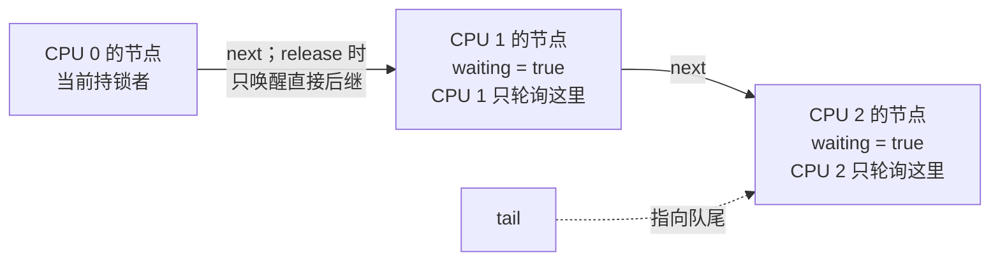
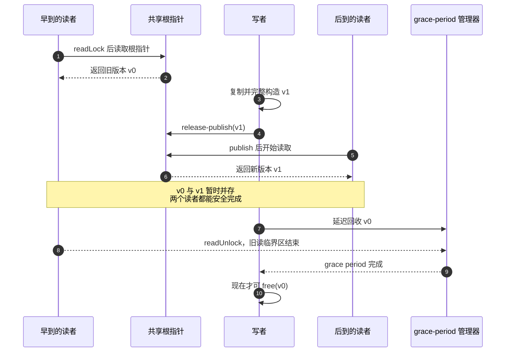
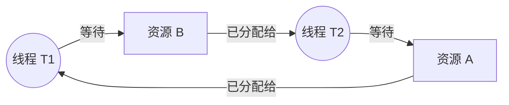
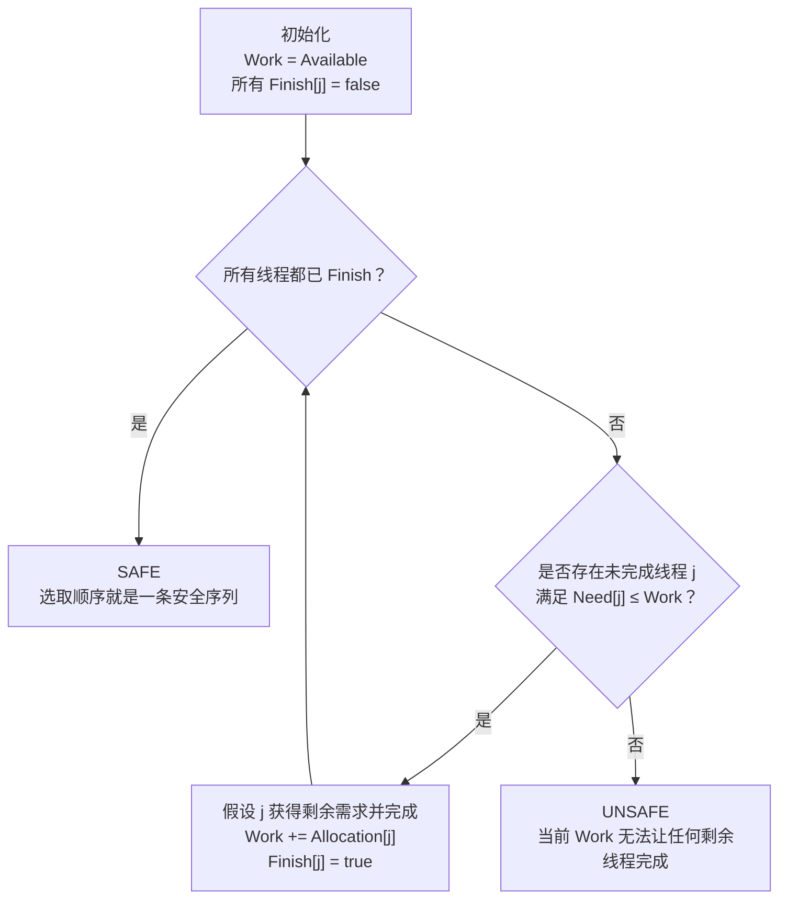

> 书名：*Operating Systems: Principles and Practice*（第二版）<br>
> 卷名：Volume II: *Concurrency*<br>
> 作者：Thomas Anderson、Michael Dahlin<br>
> 笔记范围：第 6 章 `Multi-Object Synchronization`，包括 6.1～6.7 节及 9 道章末练习<br>
> 原文位置：osppv2.md 的 “6 Multi-Object Synchronization” 部分

## 全章主线

### 本章从哪里继续

第 5 章解决单个共享对象：一把锁保护对象不变量，条件变量等待状态变化。复杂系统却有许多对象与锁。为提高并行度，人们会拆分对象和锁，但随之出现三类问题：

1. **多核性能**：热点锁串行化请求，缓存行在 CPU 间迁移；
2. **跨对象正确性**：每个方法原子，不代表一串方法调用原子；
3. **死锁**：线程各持部分资源并循环等待。

本章的分析路线：

```text
先量化锁是否真是瓶颈
        ↓
优先重构数据与所有权以减少共享
        ↓
热点仍存在时改进锁算法（MCS/RCU）
        ↓
跨对象请求用可串行化锁协议
        ↓
分析并破坏死锁必要条件
        ↓
必要时用 Banker、检测/回滚或无阻塞算法
```

作者反复强调：没有通用食谱。一般方案可能复杂昂贵；简单方案可能不扩展；不少方法还破坏模块化，需要知道全局锁关系。

### 阅读方式

笔记沿 `6.1 → 6.7 → Exercises` 的原书顺序展开。背景知识、公式推导、数值演算和现代 C++ 示例直接放在它们所解释的概念之后，使“问题从何而来、方法为何有效、边界在哪里”形成连续的阅读链条。代码编译命令面向 Linux、macOS 或 WSL；当前环境没有 C/C++ 编译器，因此未做本地编译验证。

### 三个分析层次

- **对象层**：字段、不变量、方法；
- **请求层**：一次业务操作跨越哪些对象；
- **系统层**：锁图、资源总量、调度与故障恢复。

只证明对象层正确，仍可能在请求层看到半完成转账，在系统层发生循环等待。

---

## 开篇：多对象为何改变问题性质

### 性能与正确性的张力

单一大锁容易证明，却把所有请求串行。拆成细锁允许无关请求并行，但需要：

- 判断一次请求需要哪些锁；
- 维护跨分区不变量；
- 规定锁顺序；
- 处理部分完成与失败；
- 分析缓存和争用。

所以合理工程顺序是：先用简单锁得到可工作的基线，再用测量找瓶颈，最后只重构热点。

### 死锁不是锁独有

任何有限、不可抢占资源都可能进入循环等待：锁、内存页、磁盘块、缓冲区空间、连接或筷子。解决死锁必须抽象成资源分配问题，而不只检查 mutex API。

---

## 6.1 多处理器锁性能

### 请求并行仍可能扩展失败

服务器可为不同客户在不同 CPU 上处理请求，内核也可并发执行大量系统调用。但 50 核机器吞吐可能只比单核略高，常见原因：

1. 锁导致临界区串行；
2. 共享数据在缓存间通信；
3. false sharing 让无关字段共用缓存行。

### 锁的串行上限

设单核处理一次请求时间为 $T$，其中比例 $s$ 在同一互斥锁临界区，其余 $1-s$ 可完美并行。使用 $p$ 个 CPU：

$$
T_p\ge sT+\frac{(1-s)T}{p}.
$$

加速上界（Amdahl 定律）：

$$
S(p)=\frac{T}{T_p}
\le\frac{1}{s+(1-s)/p}.
$$

当 $p\to\infty$：

$$
S_{max}\le\frac1s.
$$

原书 Web cache 例子 $s=0.05$：

$$
S_{max}\le\frac{1}{0.05}=20.
$$

无论再加多少 CPU，单锁使吞吐最多约 20 倍。公式假设固定工作量、其余部分完美并行且临界区速度不变，因此是乐观上界。

### 多核临界区变慢后的上限

设共享数据迁移使临界区在多核上慢 $k$ 倍，则串行时间变为 $ksT$：

$$
T_p\ge ksT+\frac{(1-s)T}{p},
$$

$$
S(p)\le\frac{1}{ks+(1-s)/p}.
$$

当 $p\to\infty$：

$$
S_{max}\le\frac{1}{ks}.
$$

原书 $s=0.05,k=4$：

$$
S_{max}\le\frac{1}{4\times0.05}=5.
$$

这解释原文排版中的 “$1/(4\times0.05)=5$”：临界区从 5% 放大为等效 20%，总加速只剩 5 倍。

### 缓存行迁移

一个 CPU 最后持锁并修改数据后，相关缓存行常处于它的独占/已修改状态。下一个 CPU 获取锁和数据时，一致性协议必须转移所有权、失效旧副本。延迟远高于读取本地 L1/L2。

锁字本身和受保护数据都可能迁移；若等待者反复写锁字，还会制造额外一致性流量。

### False sharing

硬件以缓存行（常见 32/64 字节）追踪一致性。两个线程修改不同变量，但变量位于同一缓存行，整行仍在核心间来回失效，这称 false sharing。

```cpp
struct Counters {
    std::atomic<long> cpu0;
    std::atomic<long> cpu1;
};
```

逻辑无共享不代表硬件无共享。可按 cache line 对齐/填充：

```cpp
#include <atomic>
#include <new>

struct alignas(std::hardware_destructive_interference_size) PaddedCounter {
    std::atomic<long> value{0};
};
```

该标准常量并非所有编译器都可用；也可按目标平台明确 `alignas(64)`。填充增加内存占用，必须测量后使用。

### 实验数据说明了什么

AMD Opteron 6262、跨不共享缓存核心，简单计数临界区平均周期：

| 场景 | 周期 |
|---|---:|
| 单线程、单数组 | 51.2 |
| 双线程、两个独立数组 | 52.5 |
| 双线程、同一数组 | 197.4 |
| 双线程、同数组奇偶元素 | 127.3 |

同一共享对象相对单线程放慢：

$$
197.4/51.2\approx3.86.
$$

仅 false sharing：

$$
127.3/52.5\approx2.42.
$$

这是特定机器、线程绑核与微基准结果，不应当作现代 CPU 固定倍数；它证明缓存拓扑可主导锁性能。

### Linux Big Kernel Lock 的演化

Linux 2.0 为多核引入单一 BKL，先保证正确；随后逐子系统/数据结构拆锁提高并发，到 2.6 已有数千把锁并在 48 核基准扩展。少量低频路径仍保留 BKL。

案例体现正确工程顺序：“大锁工作版本 → profiling → 局部拆分”，而不是一开始设计数千把锁。

### 性能诊断步骤

1. 测整体吞吐/延迟随核心数曲线；
2. 记录锁等待时间、持有时间、争用次数；
3. 使用硬件计数器观察 cache miss、cache-to-cache transfer；
4. 检查数据布局和 false sharing；
5. 分离算法串行比例与同步实现开销；
6. 优化后重复同一工作负载，避免只测微基准。

---

## 6.2 锁设计模式

若测量确认锁是瓶颈，优先改变共享结构，通常比发明更复杂锁更有效。下面介绍四种模式。

---

### 6.2.1 细粒度锁

**定义与直觉。**

把对象状态分成多个子集，每个子集独立锁。访问不同子集的线程可并行。

Web cache hash table 可每 bucket 一把锁。若 key 分布均匀且 bucket 足够多，冲突概率下降。

**用概率理解冲突。**

假设 $p$ 个并发请求独立均匀落到 $b$ 个 bucket。任意一对碰撞概率 $1/b$，期望碰撞对数：

$$
E[collisions]=\binom{p}{2}\frac1b
=\frac{p(p-1)}{2b}.
$$

模型忽略热点和持锁时长；若一个热门 key 集中到单 bucket，该锁仍是瓶颈。

#### resize 的三种方案

**全表读写锁 + bucket mutex。**

get/put 以读模式持结构锁，再持 bucket 锁；resize 以写模式独占结构。简单，但每次普通操作都更新 RWLock 控制状态，可能形成新热点。

**resize 获取所有 bucket 锁。**

普通操作只持一个 bucket 锁；罕见 resize 依固定顺序获取全部。resize 昂贵，但若极少发生可接受；顺序不一致会死锁。

**key 空间分区。**

把 key 分为 $r$ 个 region，每 region 一锁并独立 resize。平衡普通并发和 resize 范围，但实现、调参、跨 region 操作更复杂。

**额外共享计数。**

触发 resize 常需全表 `nObjects`。若每次 put/remove 更新单一原子计数，它本身可能 cache-line 热点。可使用 per-region 计数，resize 时汇总，接受近似或延迟。

**内存堆例子。**

按大小类别 $2^i$ 分 bucket，每 bucket 独立锁。相同大小请求争同锁，不同大小并行。块拆分/合并跨 bucket 时又需要多锁协议。

**局限。**

- 锁更多、状态映射更复杂；
- 跨分区不变量需要多锁；
- 内存占用和 lock metadata 增加；
- lock ordering 难；
- 粒度过细会让锁开销超过工作。

---

### 6.2.2 每处理器数据结构

**定义。**

按 CPU 数 $N$ 复制/分区状态。当前线程主要访问所在 CPU 的本地结构，减少跨 CPU 锁争用与缓存迁移。

例如每 CPU 一份网页 cache 或 ready queue；线程亲和性让同一线程尽量回原 CPU，保持热缓存。

**为什么仍可能需要锁。**

同一 CPU 上线程可被抢占交错；中断 handler 也可能访问；负载均衡/远程释放可跨 CPU。因此本地结构通常仍有锁，只是常见路径几乎无跨核竞争。

**cache 命中与重复数据权衡。**

网页已缓存于 CPU 0，本次请求在 CPU 1，可能重复生成/存储。收益取决于：

- 降低跨核通信的价值；
- cache 命中率因分片下降的损失；
- 跨 CPU 查找/窃取成本；
- 数据是否可重复。

**每 CPU heap。**

分配从本地 heap；free 返回原分配 heap。适合：

1. heap 重平衡罕见；
2. 多数对象由同一线程/CPU 释放；
3. 远程 free 可批量转交。

线程迁移和生产者/消费者跨核释放会增加远程队列与不平衡。

**聚合一致性。**

per-CPU 计数读取全局精确值需扫描所有 CPU 并处理并发更新；可选择最终一致、近似值或昂贵全局快照。设计必须明确接口是否要求瞬时精确。

---

### 6.2.3 所有权设计模式

**核心思想。**

线程从同步容器取出对象后获得独占所有权，可无锁访问；处理完放入下一容器并停止访问，所有权随消息/队列转移。

同步集中在队列边界，而非对象每个字段。

**浏览器流水线。**

```text
网络接收线程 → [队列] → 解析线程池 → [队列] → 渲染线程池
```

对象在队列中无人访问；某 worker 取出后唯一拥有；放入下一队列即交权。每阶段队列负责安全发布和生命周期。

**正确性约定。**

- 任一时刻对象至多一个 owner；
- owner 才能读写；
- enqueue 后旧 owner 不再访问；
- dequeue 建立内存可见性，接收者看到发送者此前写；
- 共享只读对象可特殊处理。

若旧 owner enqueue 后继续使用，就是 use-after-handoff 逻辑竞态。

**每线程 heap。**

每线程拥有本地 heap，无锁分配/释放；缺空间才访问全局 heap。仅在对象通常由分配线程释放时有效；跨线程 free 要把块消息发回 owner 或采用远程释放队列。

**可交换接口设计。**

若两个 API 调用次序不同但结果等价，称 commutative，容易分片执行。

UNIX `open` 传统返回最小可用连续 fd，两个并发 open 的返回值取决于先后，必须协调全局描述符表。若接口只要求“任意唯一句柄”，可从每 CPU 池分配，普通路径无需全局锁；stdin/stdout 等指定编号走特殊路径。

API 语义会永久约束实现可扩展性。设计新接口时避免无必要的全局顺序、连续编号和精确即时计数。

---

### 6.2.4 分阶段架构

**定义。**

系统拆成 stages。每阶段有私有状态和一个/多个 worker；阶段间只通过有界生产者—消费者队列传消息。

Web server 可拆为：连接 → 读/解析/cache → 静态读盘或动态生成 → 发送。

**模块化收益。**

阶段内部独立设计测试，团队/公司间通过消息接口组合。私有状态减少跨阶段锁；每阶段可独立扩缩 worker。

**cache locality 权衡。**

同一 worker 重复执行某阶段代码/数据，指令和状态局部性好；但请求跨 stage/CPU 移动，工作集可能反复冷却。每阶段工作量必须足够大以摊销消息和调度成本。

**单线程 stage。**

每 stage 恰一 worker 就是事件驱动：阶段内无并发，无需锁；每条消息相对阶段状态原子处理。瓶颈 stage 仍限制总体吞吐。

**过载与背压。**

系统吞吐由最慢 stage 决定：

$$
X_{system}\le\min_i X_i.
$$

若到达率 $\lambda$ 超过 stage 服务率 $\mu$，队列平均增长率约：

$$
\frac{dQ}{dt}=\lambda-\mu>0.
$$

无界队列最终耗尽内存；有界队列满后上游阻塞或丢弃，背压向前传播，可能让所有 stage 停住甚至形成死锁（练习讨论）。

**动态调节 worker。**

观察队列增长，把线程从轻载 stage 移到瓶颈 stage。限制因素：

- stage 可能受磁盘/网络而非 CPU 限制；
- 线程增加会争同一锁/设备；
- 频繁调节造成震荡；
- 总线程数和优先级需全局控制。

应以吞吐、队列长度、服务时间反馈调节，而非只看某次瞬时长度。

---

## 6.3 锁争用

结构重构后仍可能有热点，例如热门网页集中到某 hash bucket。此时才考虑改变同步实现：

- MCS：锁通常 BUSY、等待者很多；
- RCU：读极多、写极少且能接受多版本语义。

二者都不是通用替代 mutex，必须由 profiling 证明需要。

---

### 6.3.1 MCS 锁

**test-and-set 为什么随等待者线性变慢。**

普通 spinlock 所有 waiter 反复对同一锁字执行 RMW。每次 RMW 要独占缓存行，$p$ 个 CPU 争夺所有权；解锁 store 也需同一所有权，却不能被硬件自动优先。

等待者越多，一致性请求越密集，连持锁者 release 都被拖慢，临界区时间近似随争用 CPU 数增长，形成正反馈。

**test-and-test-and-set 为何仍不足。**

先普通读 BUSY，只有看见 FREE 才 test-and-set，可减少锁保持期间 RMW。但 release 后 FREE 必须广播到所有 waiter 缓存；所有核心几乎同时醒来并争独占，形成 thundering herd。临界区短时，上一次争抢尚未平息，下次 release 已来。

退避可降低轮询频率，却要调参且不保证 FIFO。

#### MCS 核心思想

每个 waiter 提供独立队列节点，原子追加到尾部，然后只在自己节点的布尔位上自旋。前驱 release 只写直接后继的位。

收益：

- waiter 在不同缓存行上本地自旋；
- 每次 release 仅一次定向缓存通信；
- FIFO 排队，有界等待；
- 每次 acquire/release 的远程操作近似 $O(1)$，而非所有 waiter 争一个字。



与所有 CPU 反复读写同一个锁字不同，MCS 把等待状态分散到每个线程自己的节点。等待期间缓存行大多留在本地；交接时只需让前驱写一次后继的 `waiting`，缓存通信随一次交接保持近似常数。

**compare-and-swap。**

CAS 语义：

```text
if (*address == expected) {
        *address = desired;
        return success;
}
expected = *address;
return failure;
```

比较与写入不可分。标准 MCS 常用原子 exchange 入队、CAS 在无后继时把 tail 清空。

#### C++ 原子实现

```cpp
#include <atomic>

class MCSLock {
public:
        struct Node {
                std::atomic<Node *> next{nullptr};
                std::atomic<bool> waiting{false};
        };

        void lock(Node &mine) {
                mine.next.store(nullptr, std::memory_order_relaxed);
                mine.waiting.store(true, std::memory_order_relaxed);

                Node *predecessor = tail_.exchange(
                        &mine, std::memory_order_acq_rel
                );

                if (predecessor == nullptr) {
                        /* 队列原为空，直接取得锁。 */
                        return;
                }

                predecessor->next.store(&mine, std::memory_order_release);
                while (mine.waiting.load(std::memory_order_acquire)) {
                        /* 可在 x86 使用 pause 指令降低资源争用。 */
                }
        }

        void unlock(Node &mine) {
                Node *successor = mine.next.load(std::memory_order_acquire);

                if (successor == nullptr) {
                        Node *expected = &mine;
                        if (tail_.compare_exchange_strong(
                                        expected, nullptr,
                                        std::memory_order_release,
                                        std::memory_order_relaxed)) {
                                /* 没有后继，锁变 FREE。 */
                                return;
                        }

                        /* 后继已交换 tail，但尚未来得及链接 predecessor->next。 */
                        do {
                                successor = mine.next.load(std::memory_order_acquire);
                        } while (successor == nullptr);
                }

                /* 把锁直接交给 FIFO 后继。 */
                successor->waiting.store(false, std::memory_order_release);
        }

private:
        std::atomic<Node *> tail_{nullptr};
};
```

**关键竞态：tail 已更新但 next 未链接。**

新 waiter 先 `tail.exchange`，再写前驱 `next`。前驱此时 unlock：看到 `next==NULL`，但 CAS tail 失败，说明有人已入队；它必须等 next 链接完成，不能把锁误判为空。

**内存顺序。**

- 前驱 unlock 的 release store 发布临界区写；
- 后继 acquire load 看到 false 后取得这些写；
- 入队链指针用 release/acquire 保证节点初始化可见。

更弱顺序可按架构优化，但必须保持锁的 acquire/release happens-before。

**使用约束与成本。**

每条参与线程/每次尚未完成的 acquire 需要唯一 Node；节点通常放 TCB。不能在仍排队/持锁时复用。

无争用时，MCS 要初始化节点并操作 tail，通常比简单 test-and-set 慢；只有等待者较多时获益。若等待可能长，仍应使用睡眠排队 mutex，而非占满 CPU 自旋。

---

### 6.3.2 Read-Copy-Update（RCU）

**适用工作负载。**

RCU 面向“读极频繁、写偶尔”的结构。目标是让大量并发读者不更新同一同步计数，不在读入口/出口争缓存行。

标准 RWLock 即使只有读者，每个读者也需原子更新 reader count 两次；短读临界区与数十 CPU 下，控制字本身成为串行热点。

#### 三项语义改变

**受限发布。**

写者先构造新版本/修改副本，再用**一次原子指针写**发布。读者永远不能看到半初始化对象。

**多版本并存。**

读者可与 writer 并发：有的看到旧版本，有的看到新版本；跨 publish 的读可能看到任一允许版本。RCU 不提供普通 RWLock 的“写时无读”。

**延迟回收。**

publish 后旧读者可能仍持旧指针。旧版本必须保留到所有“可能见旧版本”的读临界区结束，这段时间称 **grace period**。



原子发布只解决“新版本何时可见”，grace period 才解决“旧版本何时无人再用”。把二者混为一谈，最典型的后果就是 use-after-free。

**API。**

读者：`readLock/readUnlock`。

写者：

1. `writeLock` 串行 writers；
2. 构造新版本；
3. `publish` 原子发布；
4. `writeUnlock` 允许下一 writer；
5. `synchronize` 等 grace period 后回收旧版本。

多个 writer 的 grace period 可重叠，因此同时存在 v0、v1、v2 等多个版本。

**版本观察规则。**

- 读完全早于 publish：旧版本；
- 读完全晚于 publish：新版本；
- 与一次 publish 重叠：旧或新；
- 与多次 publish 重叠：可能观察多个相邻版本，尤其代码多次重新读共享指针。

读者通常在入口只取一次根指针并沿该快照遍历，避免一次操作混合版本。

#### RCU 链表搜索

```cpp
bool search(int key, int *value) {
        rcu.readLock();
        Element *current = atomic_load_acquire(&head);
        while (current != nullptr) {
                if (current->key == key) {
                        *value = current->value;
                        rcu.readUnlock();
                        return true;
                }
                current = atomic_load_acquire(&current->next);
        }
        rcu.readUnlock();
        return false;
}
```

节点一旦发布，在被任何 reader 访问期间不能原地破坏其只读字段。

**insert 发布顺序。**

```text
writeLock
分配 item
初始化 key/value/next（next 指向旧 head）
release-publish head=item
writeUnlock
synchronize（若有旧对象需回收；纯 insert 通常无）
```

release publish 保证读者 acquire 看到新 head 时，也看到完整字段。

#### remove 与回收

writer 找到节点，原子改变 `head` 或 `prev->next` 跳过它；新读者不再找到，旧读者仍可能持指针。writer 解锁后 `synchronize`，grace period 完成才 `free(current)`。

过早 free 会造成 use-after-free；这是 RCU 最危险的错误之一。

#### Copy-update 的可运行 C++ 类比

下面用 C++20 `atomic<shared_ptr>` 自动引用计数回收。它展示 copy + atomic publish + 多版本，但每次 reader 增减引用计数，**不是经典零开销 RCU**。

```cpp
#include <atomic>
#include <iostream>
#include <memory>
#include <mutex>
#include <vector>

class CopyUpdateList {
public:
        bool contains(int value) const {
                std::shared_ptr<const std::vector<int>> snapshot =
                        data_.load(std::memory_order_acquire);
                for (int current : *snapshot) {
                        if (current == value) {
                                return true;
                        }
                }
                return false;
        }

        void insert(int value) {
                std::lock_guard<std::mutex> writer_guard(writer_lock_);
                auto old_version = data_.load(std::memory_order_acquire);
                auto new_version =
                        std::make_shared<std::vector<int>>(*old_version);
                new_version->push_back(value);
                data_.store(new_version, std::memory_order_release);
                /* old_version 在最后一个 reader 释放 shared_ptr 后自动回收。 */
        }

private:
        std::mutex writer_lock_;
        std::atomic<std::shared_ptr<const std::vector<int>>> data_{
                std::make_shared<const std::vector<int>>()
        };
};

int main() {
        CopyUpdateList values;
        values.insert(42);
        std::cout << std::boolalpha << values.contains(42) << '\n';
}
```

编译：

```text
c++ copy_update.cpp -std=c++20 -pthread -O2 -o copy_update
```

输出：`true`。

**quiescent-state 实现。**

原书内核模型要求：

1. read 临界区不可被中断；`readLock` 禁中断，`readUnlock` 启中断；
2. 每 CPU 被调度/中断时调用 `quiescentState`；
3. writer publish 前后 memory barrier；
4. `synchronize` 增加 global generation，并等每 CPU quiescent counter 达到它。

一旦每个 CPU 至少经历一次 quiescent state，publish 前可能持旧指针的读者都已结束。

**为什么读路径便宜。**

读者不更新全局 reader count，不争共享缓存行；在原书内核实现中只改变本 CPU 中断状态。writer spinlock 只串行写者。

代价转到 writer：复制、publish、维护旧版本、等待所有 CPU。grace period 可达数十毫秒。

**适用边界。**

- 更新必须可用单一原子发布点表达；
- reader 接受旧或新快照，不要求最新；
- reader 临界区必须受 RCU 规则约束，不能无限阻塞；
- 回收协议必须正确；
- 写较多或对象复制很大时不划算；
- 原书“禁中断”实现面向内核，用户态 RCU 使用 epoch、hazard pointer、QSBR 等其他机制。

RCU 改变接口语义，不能无脑把 RWLock 换成 RCU。

---

## 6.4 多对象原子性

### 单对象原子为何不足

转账：

```cpp
account_a.subtract(100);
account_b.add(100);
```

两个方法各自原子，二者之间仍有窗口：总余额暂少 100；并发汇总会漏算，收款方也可能尚未看到钱。反向顺序则可能暂时双算。

业务不变量：

$$
balance_A+balance_B=constant
$$

需要整个请求级别原子，而非每个对象方法单独原子。

### Serializability

并发执行可串行化：其最终结果和可观察行为等价于把完整请求按某个顺序逐个执行。

若请求 $R_1,R_2,R_3$ 并行，只要等价于某排列（如 $R_2,R_1,R_3$）的串行执行，就可用顺序程序推理。可串行化不要求实际无重叠，只要求冲突操作顺序一致。

---

### 6.4.1 谨慎的类设计

**把原子边界放到正确对象。**

Too Much Milk 若拆成 `Note.read/write` 与 `Fridge.check/add`，每方法原子仍难组合。可把业务原子动作封装：

```text
Fridge::checkForMilkAndSetNoteIfNeeded()
Fridge::addMilk()
```

更进一步，若允许，直接 `buyIfNeeded` 在一个对象/锁内完成。

**架构与接口决定同步难度。**

干净分层、拥有业务不变量的对象应提供足够高层方法。暴露过细 get/set 迫使调用者跨对象拼事务，泄漏锁细节。

但超大对象/大锁损失并行；接口设计要在原子语义与并发粒度间平衡。

---

### 6.4.2 Acquire-All/Release-All

**算法。**

处理请求前获取它可能需要的全部锁；全部成功后执行；末尾释放全部。

hash `changeKey(k1,k2)`：先持两个 bucket 锁，再 remove/insert，最后释放。

#### 可串行化证明

考虑两请求 $A,B$：

- 若锁集合不交叠，操作作用于独立数据，二者可交换，等价于任一串行顺序；
- 若共享至少一把锁 $L$，A 与 B 不可能同时持有全部所需锁。一个先获得 $L$ 并完成整个请求后才释放，另一个之后执行冲突部分。因此所有冲突操作具有一致先后。

推广到多个请求，可按每请求“获得最后一把所需锁”的线性化顺序构造等价串行历史。

**并行度。**

访问不相交子集的请求仍并行；冲突请求串行。这是细粒度锁比全局锁的收益。

**难点。**

开始前可能不知道将访问哪些对象。保守获取“可能需要”的锁降低并行，且依赖内部实现，破坏模块化。

“逐把 acquire 全部锁”如果顺序不统一仍可能在获取阶段死锁；真正原子 acquire-all 需要中央资源管理器、try-lock 回退或全局顺序。

---

### 6.4.3 两阶段锁（Two-Phase Locking, 2PL）

**两阶段规则。**

1. **扩张阶段（growing）**：按需 acquire/升级锁，不 release/降级；
2. **收缩阶段（shrinking）**：可 release/降级，但不再 acquire/升级。

常见严格 2PL 把所有 release 推迟到请求/事务结束。

**优势。**

无需预知所有锁；只获取实际访问对象；较晚获取可减少部分持锁时间。

`changeKey` 可：锁 k1 → remove → 锁 k2 → insert → 统一释放。

#### 可串行化证明

每个请求有一个 **lock point**：成功获得其最后一把锁的时刻。

按 lock point 排序请求。若 A、B 冲突于对象 X，二者需冲突锁。假设 A 的 lock point 在 B 前：A 在收缩前已获得全部锁，且在获得最后锁前没有释放；B 不可能在 A 释放 X 前完成冲突锁获取。因此冲突访问顺序与 lock point 顺序一致。

所有冲突边都遵守同一全序，执行冲突可串行化。

**2PL 为什么会死锁。**

线程 1 锁 k1 后等 k2；线程 2 锁 k2 后等 k1。扩张阶段允许“持有并继续请求”，形成环。

可串行化与无死锁是独立性质：2PL 保证前者，不保证后者。

---

## 6.5 死锁

### 定义

死锁是线程等待环：集合中每条线程都等待环内另一线程采取行动，因而没有任何线程能先行动。

### 两锁例子

```text
T1: acquire A → wait B
T2: acquire B → wait A
```

双方持有对方需要的资源，且锁不可抢占，永久等待。

**嵌套 monitor + CV。**

线程在持外层 `lock1` 时进入内层对象，并在内层 CV wait。wait 只释放内层 `lock2`，不释放 `lock1`。负责 signal 的线程若先需 `lock1`，就无法进入，形成环。

条件变量本身不是罪魁；问题是 wait while holding 其他资源。

**有界缓冲死锁。**

T1 向 buffer1 连续 put，之后从 buffer2 get；T2 反向。两个有限 buffer 同时满时，双方都阻塞在 put，永远到不了释放对方空间的 get。

即使每个队列内部无死锁，组合协议仍死锁。

### Dining Philosophers

$n$ 位哲学家、$n$ 支筷子，每人先拿左再拿右。所有人各拿左筷后，都等待右邻持有的右筷，形成长度 $n$ 的环。

$n=2$ 与两个对象互递归锁等价。

**现实交叉路口。**

车辆驶入但无法驶出，占住路口并等待其他车移动。交通规则“只有能穿过时才进入”相当于 acquire-all/资源预留。

---

### 6.5.1 死锁与饥饿

二者都是活性失败。

- 饥饿：某线程无限期无进展；系统中其他线程可能持续工作；
- 死锁：一组线程形成等待环，组内全部无法进展。

死锁蕴含组内饥饿；饥饿不蕴含死锁。例如写者优先 RWLock 中持续写者可饿死 reader，但活动 writer 不等待 reader，没有环。

系统“可能死锁”不表示每次死锁；需要特定负载和倒霉交错。测试长期正常不能证明无死锁，应按设计排除。

---

### 6.5.2 死锁的四个必要条件

**有限资源（Bounded resources / mutual exclusion）。**

资源实例有限，同时使用者数量受限，例如一支筷子一次一人。

**不可抢占（No preemption）。**

资源授予后，系统不能强制收回，只能持有者主动释放。

**持有并等待（Wait while holding）。**

线程持至少一项资源，同时等待另一项。

**循环等待（Circular waiting）。**

存在 $T_1\to R_1\to T_2\to R_2\to\cdots\to T_1$ 的等待/占有环。

只要系统保证任一条件永不成立，就不可能死锁。

#### 资源分配图

- 线程节点：圆；资源节点：方框；
- $R\to T$：T 持有 R；
- $T\to R$：T 等待 R。



沿箭头走一圈就回到起点：T1 必须等 T2 释放 B，T2 又必须等 T1 释放 A。若资源单实例且不可抢占，环内没有任何参与者能成为第一个行动者。

每种资源只有一个实例时，环在不可抢占等假设下意味着死锁。

**多实例时环不充分。**

若资源类型有多个实例，环内线程之外的持有者可能完成并释放，打破环。原书中央筷子池例：哲学家 1 持两支能完成，释放后环中其他人继续。

因此四条件是必要但一般不充分；系统仍处于“可能死锁”的危险状态。

---

### 6.5.3 防止死锁

一般策略：限制程序行为、预测未来、或允许发生后检测恢复。本节先通过破坏四条件预防。

**消除有限不足：提供足够资源。**

若资源总数可满足最坏需求，不必等待。Dining Philosophers 增加一支筷子即可破坏“所有人各持一支且无剩余”的死锁状态。

线程 TCB 预留 ready/wait 链表节点，避免在最需要挂起时动态分配失败。

代价是资源昂贵或最坏需求巨大时浪费。

**消除不可抢占：强制回收资源。**

OS 可把进程内存页换出磁盘，回收物理页。CPU 可被抢占。锁保护的半完成对象通常不能安全强收，除非事务可回滚。

资源是否可抢占取决于状态能否保存/恢复；打印机正在输出、外部副作用等很难撤销。

**消除持有并等待：调用外部模块前释放锁。**

把：

```text
持本模块锁 → 调其他模块 → 继续修改
```

改为多个独立持锁方法，调用外部模块时不持锁。

代价：原本整体原子操作被拆开，其他线程可在中间观察/修改，必须重新设计状态机、预留或补偿。额外 acquire/release 也有成本。

因此实践中常对“外调是否可能反向依赖本锁”做全局分析，牺牲模块化。

**内核 paging 的教训。**

早期内核代码/数据可换出。换页路径自身及其所有潜在依赖必须常驻，否则缺页处理又缺页，形成资源循环。依赖极难穷尽，所以现代内核通常保持全部代码和大部分数据常驻。

#### 消除循环等待：全局锁序

给锁定义严格全序 $L_1<L_2<\cdots<L_n$，线程只按递增顺序 acquire。

**无环证明。**

若存在等待环，每条边表示线程持较小锁、等待较大锁，所以沿环锁编号严格递增：

$$
L_{i_1}<L_{i_2}<\cdots<L_{i_k}<L_{i_1},
$$

与严格序不可循环矛盾。因此无环、无死锁。

hash move 始终先锁较小 bucket；哲学家先拿编号较小筷子。

**锁序的模块化问题。**

全局排序要求所有模块知道锁层级。动态对象可按稳定 ID/地址排序，但地址复用、相同对象、锁升级等需处理。

调用图变化后必须维护层级；自动 lock-order checker 可在运行时记录获得顺序并报告反向边。

**`printf` 何时可在持锁时调用。**

printf 内部锁若不会反向调用持有当前内核锁的路径，就不会形成环。判断仍依全局调用关系，说明嵌套模块锁的非模块化本质。

---

### 6.5.4 Banker 算法：避免死锁

**从 acquire-all 到增量请求。**

Acquire-all 要预分配最坏资源，安全但浪费。Banker 让线程声明最大需求 `max`，运行中增量申请；资源管理器只批准仍保持 safe 的请求。

它不是“发生死锁后修复”，而是 **avoidance**：根据未来最大需求，拒绝进入可能无法保证完成的状态。

#### Safe、Unsafe、Deadlocked

**Safe。**

存在至少一条线程完成顺序，使每条线程都能先获得其剩余最大需求、完成并归还资源。系统可通过延迟某些请求沿该顺序避免任意合法最大需求带来的死锁。

**Unsafe。**

不存在可证明所有线程完成的安全序列。它尚未必死锁：线程可能不再申请最大量、提前释放或以幸运顺序完成；但某种合法未来需求可迫使死锁。

**Deadlocked。**

当前已有至少一组线程循环等待，按现状不能进展。

关系：

```text
deadlocked ⊂ unsafe
safe 与 unsafe 互斥
```

unsafe 不等于已经 deadlocked。

#### 状态矩阵

有 $r$ 类资源、$t$ 条线程：

- $Available_i$：第 $i$ 类当前空闲数；
- $Max_{i,j}$：线程 $j$ 声明的第 $i$ 类最大需求；
- $Allocation_{i,j}$：当前分给线程 $j$ 的数量；
- $Need_{i,j}=Max_{i,j}-Allocation_{i,j}$。

基本约束：

$$
0\le Allocation_{i,j}\le Max_{i,j},
$$

$$
Available_i+\sum_j Allocation_{i,j}=Total_i.
$$

#### 安全性检测算法

1. `Work = Available`；
2. 所有 `Finish[j]=false`；
3. 找未完成线程 $j$，满足对所有资源 $i$：

$$
Need_{i,j}\le Work_i.
$$

4. 假设满足其剩余需求并完成，它会归还**当前 allocation + 临时获得 need**。由于临时 need 来自 Work，完成后净增加的是原先持有 allocation，因此：

$$
Work_i\leftarrow Work_i+Allocation_{i,j}.
$$

5. 标记 Finish，重复；全部标记则 safe，无可选线程且仍有未完成则 unsafe。



这张图中的“假设完成”并不真的执行线程，而是在做可行性推演。每找到一个可完成线程，就把它当前占用的资源加入 `Work`，再看这些资源能否让更多线程完成。

#### 为什么算法正确

每次选择的线程剩余需求不超过当前 Work，所以可让它得到最大需求并完成。完成归还所有资源后，系统可用资源至少增加它原先 allocation。按选择顺序逐一完成，构成 safe sequence。

反之，若找不到任何 Need≤Work 的未完成线程，当前空闲资源不足以让任何剩余线程达到其承诺完成点；在“只有完成才归还当前 allocation”的模型下不存在安全序列。

**请求处理。**

线程请求向量 `Request_j` 时先检查：

$$
Request_{i,j}\le Need_{i,j},
$$

$$
Request_{i,j}\le Available_i.
$$

然后**假设授予**：减 Available、加 Allocation、减 Need；运行安全检测。若 safe，正式批准；否则回滚假设并让线程在 CV 等待资源变化。

#### 8 页数值例子

总 8 页，A/B/C 最大需求分别 4、5、5。

若轮流批准，达到：

$$
Allocation=(3,3,2),\quad Available=0,
$$

$$
Need=(1,2,3).
$$

无人剩余需求 ≤0；若都继续请求，就死锁。

Banker 在接近该状态前延迟 B、C，让 A 取得第 4 页完成并归还 4 页。之后可满足 B 至 5，B 归还，再满足 C。总信用线 $4+5+5=14>8$，仍可安全超额承诺，因为不是所有最大需求同时兑现。

#### C++ 安全检测实现

```cpp
#include <cstddef>
#include <vector>

using Vector = std::vector<int>;
using Matrix = std::vector<Vector>;  // [thread][resource]

bool isSafe(
        const Vector &available,
        const Matrix &maximum,
        const Matrix &allocation
) {
        const std::size_t thread_count = maximum.size();
        const std::size_t resource_count = available.size();
        Vector work = available;
        std::vector<bool> finished(thread_count, false);
        std::size_t completed = 0;

        while (completed < thread_count) {
                bool found = false;

                for (std::size_t thread = 0; thread < thread_count; ++thread) {
                        if (finished[thread]) {
                                continue;
                        }

                        bool can_finish = true;
                        for (std::size_t resource = 0;
                                 resource < resource_count; ++resource) {
                                int need = maximum[thread][resource] -
                                                   allocation[thread][resource];
                                if (need > work[resource]) {
                                        can_finish = false;
                                        break;
                                }
                        }

                        if (!can_finish) {
                                continue;
                        }

                        for (std::size_t resource = 0;
                                 resource < resource_count; ++resource) {
                                work[resource] += allocation[thread][resource];
                        }
                        finished[thread] = true;
                        ++completed;
                        found = true;
                }

                if (!found) {
                        return false;
                }
        }
        return true;
}
```

复杂度：外层最多完成 $t$ 轮，每轮扫描 $t$ 线程和 $r$ 资源：

$$
O(t^2r).
$$

可在一次扫描中完成多个线程，实际常较少，但最坏界不变。

**Dining Philosophers 的 Banker 规则。**

中央筷子池、每人最多需 2 支。批准一次拿筷后若：

- 有某人已持 2 支，可完成归还；或
- 池中仍留至少 1 支，使未来能凑出一位完成者，

则状态 safe。该规则来自安全检测的“至少一线程 Need≤Available”。

**两锁互递归规则。**

两线程分别 A→B 和 B→A。第二把锁总可取得（取得后可完成）；第一把锁只有在对方未持其第一把时批准。避免两人各持一把。

**强假设与局限。**

- 最大需求必须提前准确声明；
- 资源实例可计数且同类可互换；
- 获得最大需求后线程最终完成并释放；
- 资源请求/释放由中央管理器可延迟；
- 每次请求运行安全检测有成本；
- 保守 max 降低利用率；低估 max 破坏保证；
- 锁、回调和动态依赖很难完整申报。

因此完整 Banker 少用，但“预留资源”“准入控制”“保持安全余量”很常见。

---

### 6.5.5 检测并从死锁恢复

当预防结构太昂贵、死锁罕见且有回滚能力时，可允许发生后检测恢复。

**恢复方案 1：没有资源也继续/快速失败。**

Web 前端依赖库存服务超时时，可先完成订单、后台核对，缺货再道歉。对用户而言，快速降级可能优于无限等待。

设计要求每层统一处理 timeout/不可用，不能只在顶层临时补丁。结果可能降低一致性或用户体验，需业务允许。

**乐观并发控制（OCC）。**

事务不锁数据，记录读取版本，在本地副本修改；提交时验证访问对象未变化：

- 无冲突：原子提交；
- 有冲突：abort 并 retry。

低冲突时并行高且无锁死锁；高冲突时反复回滚浪费 CPU，可能活锁/饥饿。

**事务 rollback/restart。**

事务 `begin` 到 `commit` 的修改在提交前不对其他线程可见；维护 undo log 或私有副本。检测死锁后选择 victim：

1. 停止 victim；
2. 撤销到 begin；
3. 释放锁/资源；
4. 其他事务前进；
5. victim 稍后重启。

不能简单杀持内核锁线程并把锁标 FREE，因为对象可能停在不变量被打破的中间状态。事务定义了安全回滚点。

**选择 victim 与 wound-wait。**

为避免同一事务反复被杀，可按时间戳优先旧事务。

- 年轻事务请求老事务资源：年轻等待；
- 老事务请求年轻事务资源：老事务 wound 年轻事务，后者 abort/restart。

等待边只从年轻指向更老，时间戳严格递减，不可能成环。最老事务不会被更老者 wound，最终完成；重启事务保留原时间戳可防饥饿。

**保守检测：timeout。**

等待超过阈值就触发恢复，可能误杀只是很慢的线程（false positive）。若恢复便宜，简单 timeout 可能优于精确全局图。

电话网络连接失败直接返回“线路忙”、Internet router 缓冲满直接丢包，都是放弃等待以避免复杂资源环。

#### 单实例资源：等待图环 iff 死锁

资源分配图：资源→持有线程，线程→等待资源。每资源单实例、不可抢占时：

- 死锁必形成环；
- 环上每线程等待下一线程唯一持有资源，无外部实例可释放，故环即死锁。

可用 DFS/Tarjan 检测环，复杂度 $O(V+E)$。

#### 多实例资源检测

环仅必要不充分。Coffman 检测算法不需要未来 `Max`，只看当前 `Available`、`Allocation` 和**当前阻塞请求** `Request`：

1. `Work=Available`，Finish=false；
2. 找未完成 $j$，满足：

$$
Request_{i,j}\le Work_i\quad\forall i;
$$

3. 假设当前请求获批且线程最终完成，净归还当前 allocation：

$$
Work_i\leftarrow Work_i+Allocation_{i,j};
$$

4. 标记并重复；若无法继续且有人未标记，则这些线程 deadlocked。

与 Banker 的区别：Banker 用未来最大 Need 判断 safe/unsafe；检测算法用当前 Request 判断是否已经死锁。

**为什么不能只拒绝“会立即死锁”的 grant。**

触发 circular wait 的最后请求通常是**等待**而非被批准。只检查“批准此请求后是否 deadlocked”会漏掉：请求无法批准，被挂起后才补上等待图最后一条边。

**恢复代价。**

需权衡 victim 已完成工作、持有资源、优先级、用户影响和回滚成本。精确检测也需维护全局依赖，可能成为性能/模块化负担。

---

## 6.6 无阻塞同步

### 动机与警告

锁争用、跨对象语义和死锁会穿透模块边界。无阻塞算法试图消除锁，使某线程暂停/崩溃不阻塞其他线程。

代价是算法与内存回收极复杂。只有在已经掌握锁方法、profiling 证明收益并经过额外审查后，才应使用。无争用 mutex 通常极便宜；提前“无锁优化”常得到更慢、更错的代码。

### 进展等级

**Blocking。**

线程可能必须等另一特定线程。例如持锁者暂停，所有 waiter 停止。

**Lock-free。**

系统级保证：有限步内**至少某条线程**完成操作。某一线程可反复失败而饥饿。

**Wait-free。**

线程级保证：每条线程的每次方法调用都在有限自身步骤内完成，不依赖其他线程速度。强于 lock-free。

**Obstruction-free**：若线程独占运行足够久就会完成；持续冲突时可能无人完成。它弱于 lock-free。

### CAS copy-update

以 bucket 指针为原子：

1. load 旧 bucket；
2. 复制并在副本修改；
3. CAS(pointer, old, new)；
4. 成功发布；失败说明别人先更新，丢弃副本并重试。

```cpp
#include <atomic>
#include <memory>
#include <vector>

class LockFreeBucket {
public:
        void insert(int value) {
                std::shared_ptr<const std::vector<int>> old_version =
                        data_.load(std::memory_order_acquire);

                while (true) {
                        auto mutable_copy =
                                std::make_shared<std::vector<int>>(*old_version);
                        mutable_copy->push_back(value);
                        std::shared_ptr<const std::vector<int>> new_version = mutable_copy;

                        if (data_.compare_exchange_weak(
                                        old_version, new_version,
                                        std::memory_order_release,
                                        std::memory_order_acquire)) {
                                return;
                        }
                        /* CAS 失败时 old_version 已更新为当前值，重新复制。 */
                }
        }

        bool contains(int value) const {
                auto snapshot = data_.load(std::memory_order_acquire);
                for (int current : *snapshot) {
                        if (current == value) {
                                return true;
                        }
                }
                return false;
        }

private:
        std::atomic<std::shared_ptr<const std::vector<int>>> data_{
                std::make_shared<const std::vector<int>>()
        };
};
```

需要 C++20。`shared_ptr` 解决示例生命周期，但原子引用计数本身可能使用内部同步且成本高；是否严格 lock-free 应查询 `is_lock_free()`，这段主要展示 CAS 重试模式。

**为什么 CAS 循环通常 lock-free。**

若线程 A CAS 失败，说明某个其他线程在 A 的 load 与 CAS 之间成功改变指针，即系统取得进展。持续失败意味着持续有人成功，因此整体 lock-free。

A 自身可能永远被抢先，所以非 wait-free。要 wait-free 需 helping、操作描述符或有界仲裁，让其他线程帮助完成 A 的操作。

### ABA 问题

线程读指针值 A；别人改 A→B→A；CAS 只看位值相同而误认“未变化”，但对象内容/生命周期已改变。

解决：带版本号 tagged pointer、单调 generation、hazard pointers、epoch/RCU 回收，或不复用地址。`shared_ptr` 示例通过对象身份与引用生命周期缓解回收，但复杂结构仍需正确版本语义。

### 内存回收比更新更难

从无锁链表摘除节点后，其他 reader 可能仍持指针。不能立即 free。常用：

- hazard pointer：reader 公布正在访问节点；
- epoch reclamation：等所有线程越过 epoch；
- RCU grace period；
- 引用计数。

错误回收会 use-after-free，即使 CAS 更新本身正确。

**乐观事务的进展性质。**

两个冲突事务并发，第一个 commit 成功，另一个 abort，因此整体至少一个完成：lock-free。

若没有公平/年龄机制，同一事务可无限 abort，不是 wait-free。使用 wound-wait、优先级 helping 或重试上界，使每事务最终成为不可被更年轻者击败者，才可能提供 wait-free/无饥饿保证。

### 软件事务内存（STM）

STM 让内存操作成为事务，运行时记录 read/write set、检测冲突、提交或回滚，理论上改善跨模块组合并避免 lock ordering。

成本：元数据、版本验证、日志/副本、abort 重做、不可回滚 I/O、长事务冲突。原书认为是否能低成本普及仍是开放问题。

**无锁不等于无同步。**

CAS、原子内存序、版本和回收协议仍是同步。它只消除阻塞锁，不消除共享状态推理。

---

## 6.7 总结与未来方向

### 工程优先级

1. 先用一把大锁得到正确系统；
2. 设计清晰层次和对象边界；
3. 测量吞吐、等待与缓存；
4. 只优化确认的热点；
5. 优化后重新验证正确性和性能。

从工作系统到快速工作系统，通常比从复杂快速设想到正确系统容易。

### 本章工具箱

- 估算锁串行上限与缓存代价；
- 细粒度、per-CPU、ownership、staged 重构；
- MCS 高争用 FIFO 自旋；
- RCU 读多写少多版本；
- acquire-all/2PL 保证请求可串行化；
- 四条件分析死锁；
- lock ordering、Banker、检测/回滚；
- lock-free/wait-free CAS 算法。

**模块化是主要难点。**

多锁顺序、调用外持锁、最大资源需求和回滚边界都要求跨模块知识。严格层次/所有权与消息接口可减少全局推理。

**自动工具方向。**

未来工具应：

- 检测未持保护锁的共享访问；
- 动态/静态发现 lock-order 环；
- 记录锁争用与 cache-line sharing；
- race detector；
- 对同步操作进行模型检查；
- 验证无锁算法内存序与回收。

先证明无数据竞争，再枚举同步操作交错，比枚举所有机器指令可行，但大型系统状态空间仍巨大。

---

## 章末练习详解

以下按题目顺序给出分析、证明与实现。涉及开放设计的问题会明确说明采用的假设和可替代方案。

### 练习 1：图 6.13 的其他串行顺序

图中：

- 请求 1 锁 A/B；
- 请求 2 锁 C/D；
- 请求 3 锁 A/B；
- 请求 1 对 A/B 的临界区先于请求 3；
- 请求 2 与二者数据不交叠，可交换。

必须保持 $R_1<R_3$，而 $R_2$ 可放三处。图已给：

$$
R_1,R_2,R_3.
$$

另外两种：

$$
R_2,R_1,R_3,
$$

$$
R_1,R_3,R_2.
$$

$R_3,R_1,R_2$ 等不等价，因为会反转 A/B 上冲突更新的先后。

### 练习 2：推广 2PL 到 mutex 与 RWLock

把操作分为扩张与收缩。

**扩张阶段允许。**

- acquire mutex；
- acquire RWLock read；
- acquire RWLock write；
- 将已持 read **升级**为 write（增加排他性）；
- 不允许任何 release；
- 不允许 write→read 降级。

**收缩阶段允许。**

- release mutex/read/write；
- write→read **降级**（减少权限）；
- 不允许新 acquire；
- 不允许 read→write 升级。

升级等价于获得更强新锁，必须在 growing；降级等价于释放写权限，进入/属于 shrinking。一旦首次 release/降级，不能再 acquire/升级。

可串行化证明仍按 lock point：请求获得最后一项锁或完成最后一次升级的时刻。所有冲突访问权限在此之前取得，任何释放/降级在此之后；冲突顺序可按 lock point 排列。

注意：2PL 不保证无死锁，两个 reader 同时尝试 upgrade 到 writer 可互等。

### 练习 3：中央筷子池需要多少筷子

$n$ 位哲学家，每人需 2 支，任意筷子等价。

有 $n$ 支时可死锁：每人各持 1 支，池空，所有人等第二支。

有 $n+1$ 支时：即使每人已各持 1 支，仍至少剩 1 支；某人可取得第二支、吃完并归还 2 支，之后其他人继续。因此不会所有人同时卡住。

所以最小保证：

$$
n+1.
$$

证明最小性：$n$ 有反例；$n+1$ 总能让至少一人凑齐。

### 练习 4：有限 stage 队列能否造成系统死锁

**能。** 两 stage A、B，A→B 和 B→A 各有容量 1 的队列。

1. 两队列都已满；
2. A 正处理一个输入，完成后阻塞地向 A→B put，但该队列满；
3. B 同样阻塞向 B→A put；
4. A 只有完成 put 后才从 B→A 取下一项；B 对称；
5. 无人消费两个满队列，永久等待。

每个 stage 内部可能没有锁环，每个 queue 自身也正确；死锁来自跨 stage 协议中的 bounded resource + wait while holding + cycle。

更大环 A→B→C→A 同理。背压在有环 stage graph 中可能变成死锁。

### 练习 5：两种全系统无死锁保证

**方法 1：消除循环等待。**

要求 stage 通信图为 DAG，消息只按拓扑序向后流。等待边也只能指向更后 stage，不可能回到起点。

证明：沿等待环拓扑编号必须严格增加，有限 DAG 不可能回到原编号。

**方法 2：消除持有并等待。**

worker 在可能阻塞输出前，不继续持有输入槽/阶段资源：

- 使用非阻塞 `try_put`；失败时把当前任务存入可重试状态并释放其他资源；或
- 在取输入前原子预留下游队列空间；或
- 把输出交给永不等待下游的独立 spool/可回滚存储。

这样线程等待下游时不占有上游有限槽，不能形成资源占有环。

另一种不同条件方案是为所有最大在途消息提供足够队列容量（破坏有限资源），但内存成本高且需已知上界。

### 练习 6：给定 A～E 规则的 serializability 与 deadlock

**Serializability：是。**

规则正是 generalized 2PL：

- Part 1 只 acquire/upgrade，不 release/downgrade；
- Part 2 只 release/downgrade，不 acquire/upgrade。

mutex 与 RWLock 冲突模式：write 与 read/write 冲突，read 与 read 不冲突。每请求存在最后 acquire/upgrade 的 lock point；冲突操作按 lock point 可序列化。

**普通 mutex 的锁序。**

限制蕴含获取顺序：

$$
A<B<C<D<E.
$$

A 不能在持 B～E 时取，B 不能在持 C～E 时取，以此类推。普通 acquire 不形成反向环。

**Deadlock freedom：否。**

E 允许多个 read holder，并允许 read→write upgrade。反例：

1. T1 以 read 持 E；
2. T2 以 read 持 E；
3. T1 请求升级 write，等待 T2 释放 read；
4. T2 请求升级 write，等待 T1 释放 read；
5. Part 1 禁止释放/降级，双方死锁。

锁序无法解决“同一 RWLock 多 reader 同时升级”。修复：只允许一个 upgrade contender（upgrade mutex）、释放 read 后重新竞争 write（牺牲原子性），或从开始直接申请 write。

### 练习 7：RCU remove 先 read 搜索、找到后再 write 能否工作

**不能直接工作。** RCU `writeLock` 只排斥其他 writers，不等待 readers；在 read section 内取得 writer lock 本身未必阻塞，但搜索结果可能陈旧。

反例：

1. W1 在 read section 找到 `prev→current`；
2. W2 取得 writer lock，删除/插入节点并 publish 新链接；
3. W1 之后取得 writer lock；
4. W1 使用旧 `prev/current` 写 `prev->next=current->next`，可能覆盖 W2 的新更新、操作已移除节点，或发布不再属于当前 list 的路径。

RCU read lock/grace period只保证节点暂不释放，不保证链表自搜索后未改变。

正确方案：

- 先取得 writer lock，再搜索并更新（原书方案）；或
- read 阶段先定位候选，取得 writer lock 后从受信根重新搜索/验证版本，验证失败则重试；或
- 用 CAS 对具体链接做条件更新，并处理失败重试与回收。

简单“锁升级”不建立从搜索到更新的原子性。

### 练习 8：高并发多线程文件 buffer cache

**设计目标。**

- 不同 block 的 hit 并行；
- 同一 block 的读可并行，写互斥；
- 同一 miss 只发一次 disk read；
- 慢磁盘 I/O 时不持全局 metadata 锁；
- 被使用（pinned）entry 不可驱逐；
- dirty victim 先写回，再复用；
- old block 写回完成前，新请求不能从磁盘读到旧数据。

**两层锁。**

1. `metadata_lock`：短暂保护 block→entry 映射、pending miss、状态、pin、LRU；
2. 每 entry `shared_mutex data_lock`：允许同块多读，写独占。

磁盘 I/O 在两者的**全局 metadata 锁之外**执行；entry 已 pin/reserve，其他线程不能驱逐。

**Entry 状态。**

```text
FREE      未映射
LOADING   正为新 block 读盘/初始化
VALID     可供读写
EVICTING  dirty 旧 block 正写回，旧映射仍保留
```

`pending[newBlock]` 在 victim 写回和新块 load 期间登记目标，其他同块 miss 等待同一 entry，避免重复 I/O。

**C++ 实现骨架。**

```cpp
#include <algorithm>
#include <array>
#include <condition_variable>
#include <cstdint>
#include <cstring>
#include <limits>
#include <mutex>
#include <shared_mutex>
#include <unordered_map>

constexpr std::size_t BLOCK_SIZE = 4096;
constexpr std::size_t CACHE_ENTRIES = 64;

/* 题目假定驱动已实现，失败处理为简化而省略。 */
extern void diskblockread(char *data, int block_number);
extern void diskblockwrite(const char *data, int block_number);

class BufferCache {
        enum class State { FREE, LOADING, VALID, EVICTING };

        struct Entry {
                std::shared_mutex data_lock;
                std::array<char, BLOCK_SIZE> data{};
                State state = State::FREE;
                int block_number = -1;
                bool dirty = false;
                std::size_t pins = 0;
                std::uint64_t last_use = 0;
        };

public:
        void blockread(char *output, int block_number) {
                Entry *entry = pin(block_number, nullptr);
                {
                        std::shared_lock<std::shared_mutex> guard(entry->data_lock);
                        std::memcpy(output, entry->data.data(), BLOCK_SIZE);
                }
                unpin(entry);
        }

        void blockwrite(const char *input, int block_number) {
                /* 若 block 不在 cache，完整块写无需先从磁盘读取。 */
                Entry *entry = pin(block_number, input);
                {
                        std::unique_lock<std::shared_mutex> guard(entry->data_lock);
                        std::memcpy(entry->data.data(), input, BLOCK_SIZE);
                }
                {
                        std::lock_guard<std::mutex> guard(metadata_lock_);
                        entry->dirty = true;
                        entry->last_use = ++clock_;
                }
                unpin(entry);
        }

private:
        Entry *chooseVictimLocked() {
                for (Entry &entry : entries_) {
                        if (entry.state == State::FREE) {
                                return &entry;
                        }
                }

                Entry *victim = nullptr;
                for (Entry &entry : entries_) {
                        if (entry.state == State::VALID && entry.pins == 0 &&
                                (victim == nullptr || entry.last_use < victim->last_use)) {
                                victim = &entry;
                        }
                }
                return victim;
        }

        /* initial_write 非空表示完整块写 miss，可跳过 disk read。 */
        Entry *pin(int block_number, const char *initial_write) {
                std::unique_lock<std::mutex> metadata(metadata_lock_);

                while (true) {
                        auto hit = blocks_.find(block_number);
                        if (hit != blocks_.end()) {
                                Entry *entry = hit->second;
                                if (entry->state == State::EVICTING) {
                                        state_changed_.wait(metadata);
                                        continue;
                                }
                                ++entry->pins;
                                entry->last_use = ++clock_;
                                return entry;
                        }

                        auto in_flight = pending_.find(block_number);
                        if (in_flight != pending_.end()) {
                                Entry *entry = in_flight->second;
                                ++entry->pins;
                                state_changed_.wait(metadata, [entry] {
                                        return entry->state == State::VALID;
                                });
                                entry->last_use = ++clock_;
                                return entry;
                        }

                        Entry *entry = chooseVictimLocked();
                        if (entry == nullptr) {
                                state_changed_.wait(metadata);
                                continue;
                        }

                        ++entry->pins;  // 当前 miss 的 reservation pin
                        const bool had_old_block = entry->state == State::VALID;
                        const int old_block = entry->block_number;
                        const bool old_dirty = entry->dirty;

                        entry->state = had_old_block
                                ? State::EVICTING
                                : State::LOADING;
                        pending_[block_number] = entry;

                        /* I/O 慢路径在全局 metadata 锁外执行。 */
                        metadata.unlock();
                        {
                                std::unique_lock<std::shared_mutex> data(entry->data_lock);
                                if (had_old_block && old_dirty) {
                                        diskblockwrite(entry->data.data(), old_block);
                                }

                                if (initial_write == nullptr) {
                                        diskblockread(entry->data.data(), block_number);
                                } else {
                                        std::memcpy(entry->data.data(),
                                                                initial_write, BLOCK_SIZE);
                                }
                        }
                        metadata.lock();

                        if (had_old_block) {
                                blocks_.erase(old_block);
                        }
                        pending_.erase(block_number);
                        entry->block_number = block_number;
                        entry->dirty = initial_write != nullptr;
                        entry->state = State::VALID;
                        entry->last_use = ++clock_;
                        blocks_[block_number] = entry;
                        state_changed_.notify_all();
                        return entry;
                }
        }

        void unpin(Entry *entry) {
                std::lock_guard<std::mutex> guard(metadata_lock_);
                --entry->pins;
                entry->last_use = ++clock_;
                state_changed_.notify_all();
        }

        std::mutex metadata_lock_;
        std::condition_variable state_changed_;
        std::array<Entry, CACHE_ENTRIES> entries_;
        std::unordered_map<int, Entry *> blocks_;
        std::unordered_map<int, Entry *> pending_;
        std::uint64_t clock_ = 0;
};
```

**并发行为。**

- 不同 cached block：只短暂共享 metadata，数据复制并行；
- 同 block 多 read：`shared_lock` 并行；
- 同 block write/read：per-entry exclusive lock 排序；
- 同 miss：第一个 pending，后来 pin 并 CV 等，只有一次 disk I/O；
- cache 全 pinned：miss 等待 `unpin`，而非驱逐在用数据；
- dirty eviction：旧映射保持 EVICTING，旧 block 请求等待；写回后才移除，避免从磁盘读到写回前旧内容。

**不变量。**

- `blocks_` 中每 block 至多一个 entry；
- `pending_` 中每目标 block 至多一个 reservation；
- `pins>0` 的 entry 不可选 victim；
- VALID 映射的数据要么 clean 等于磁盘，要么 dirty 是最新 cache 版本；
- EVICTING 旧映射在 dirty writeback 完成前不可重新加载；
- entry 从旧 block 复用到新 block 时，映射切换在 metadata 锁下原子完成。

**省略与生产改进。**

- 磁盘错误、取消、线程异常要把 pending 转失败并唤醒 waiter；
- `uint64_t` LRU clock 回绕；
- 全局 metadata lock 可按 hash shard 拆分，但 eviction 又跨 shard；
- writeback 可由后台线程异步完成；
- eviction 可用 CLOCK/2Q/ARC，不必精确 LRU；
- 多次 `blockwrite` 的持久顺序、flush/fsync 语义需另定义；
- 代码假设 disk driver 对不同请求可重入且 block 操作完整原子语义由下层处理。

这体现“短 metadata 锁 + 每对象锁 + 状态机 + I/O 锁外执行”，而非简单给整个 cache 一把大锁。

### 练习 9：每位哲学家需要 $k$ 支筷子的 Banker 规则

设中央池当前可用 $A$ 支，第 $i$ 位已持 $a_i$ 支，每人最大需要 $k$。

剩余需求：

$$
Need_i=k-a_i.
$$

单资源类型 Banker safe 的充分必要判定起点是：至少一人能用现有筷子凑齐：

$$
\exists i: Need_i\le A,
$$

等价于：

$$
A+\max_i a_i\ge k.
$$

一旦该人凑齐并吃完，会归还 $k$ 支；此后 $A\ge k$，可依次满足所有其他人。因此对同质最大需求，该局部条件也足以构造完整 safe sequence。

**a. 每人需要 3 支**

考虑批准某人再拿 1 支后的状态 $A'=A-1$、申请者 $a'_j=a_j+1$。只有满足：

$$
A'+\max_i a'_i\ge3
$$

才批准。

直觉：批准后必须有人已拿到 3 支，或池中剩余数足以让当前持有最多者凑到 3。

**b. 每人需要任意 $k>3$**

同理，批准后检查：

$$
A'+\max_i a'_i\ge k.
$$

若真，先满足持有最多者，使其完成归还 $k$，再满足其他人；若假，无人能完成，所有现有 allocation 都无法释放，进入 unsafe 状态。

该规则假设筷子完全可互换、每人最大恰为 $k$、拿满后最终吃完归还、中央管理器可延迟请求。

---

## 易混淆概念与常见误解

**锁无争用快，不表示锁扩展性一定好。**

单核快路径几条指令；热点下串行比例、缓存迁移和 waiter 一致性风暴完全不同。必须测争用负载。

**False sharing 不是 data race。**

线程访问不同变量，逻辑正确，却因同缓存行变慢。对齐优化性能，不修复同步错误。

**细粒度锁不自动提高并行度。**

热点分布不均、全局计数和 resize 仍可串行；锁管理成本也可能更高。

**Per-CPU 不等于无锁。**

本 CPU 仍有抢占/中断，多线程也可能访问本地结构；跨 CPU 合并/释放仍需同步。

**Ownership 不等于对象永远属于一个线程。**

所有权可经队列转移，但旧 owner 交出后必须停止访问，队列操作必须建立内存可见性。

**MCS 是自旋锁，不是睡眠 mutex。**

它减少高争用一致性流量并 FIFO，但 waiter 仍占 CPU。长等待应挂起。

**RCU 不是“更快的 RWLock”。**

读者可与 writer 并发并看到旧版本；writer 受限为原子发布且延迟回收。语义不同。

**每个对象方法原子不等于请求原子。**

转账、移动 key、全局统计跨对象，需要请求级锁协议/事务。

**可串行化不等于真实串行。**

无冲突请求可并行；只要求结果等价于某串行顺序。

**2PL 不防死锁。**

它保证 serializability；扩张阶段持锁再请求正满足死锁条件。还需锁序/Banker/检测。

**Unsafe 不等于 deadlocked。**

unsafe 表示无法保证未来避免；当前仍可能完成并回 safe。deadlocked 已有无法推进组。

**环不总等于死锁。**

单实例资源下环 iff；多实例时环外实例/持有者可能释放，环仅必要。

**Lock-free 不等于每线程无等待。**

只保证系统整体进展；某线程可无限 CAS 失败。Wait-free 才保证每调用有限步。

**无锁不等于无 ABA/回收问题。**

删除节点后 reader 生命周期往往比 CAS 本身更难正确。

---

## 全章方法论总结

**先量化，再复杂化。**

用串行比例、锁等待、cache transfer 证明瓶颈；不要凭“多核需要细锁”猜测。

**优先减少共享，而不是只换锁。**

数据分区、per-CPU、ownership、stage 改变通信拓扑，常比优化同一热点锁效果更大。

**跨对象必须定义请求原子边界。**

谨慎接口设计最好；无法封装时用 acquire-all/2PL/事务，并明确 serializability。

**死锁按四条件分析。**

逐项问：资源有限吗？能抢占吗？是否持有并等待？等待图会成环吗？选择最符合领域的条件破坏。

**预防、避免、检测恢复是不同策略。**

- prevention：结构上破坏必要条件；
- avoidance：Banker 用最大需求保持 safe；
- detection/recovery：允许发生，图检测后降级/回滚/杀 victim。

**无阻塞是最后手段。**

它避免持锁者阻塞别人，却把复杂度转到 CAS 重试、版本、内存序和回收。只有专家与测量支持时采用。

---

## 复习检查清单

- [ ] 能推导含锁串行比例 $s$ 的 Amdahl 上限 $1/s$；
- [ ] 能加入多核临界区慢化因子 $k$ 得到 $1/(ks)$；
- [ ] 能区分锁串行、缓存迁移和 false sharing；
- [ ] 能说明 Linux 从 BKL 到多锁的工程顺序；
- [ ] 能比较细粒度、per-CPU、ownership、staged 四模式；
- [ ] 能解释 commutative API 为什么更易分片；
- [ ] 能说明 stage 过载、背压和跨队列死锁；
- [ ] 能解释 test-and-set 高争用一致性风暴；
- [ ] 能逐步说明 MCS 入队、handoff 和 tail/next 竞态；
- [ ] 能列出 RCU 的受限发布、多版本、grace period；
- [ ] 能说明 RCU remove 为何必须延迟 free；
- [ ] 能定义 serializability 和请求 lock point；
- [ ] 能证明 acquire-all/2PL 可串行化；
- [ ] 能说明 2PL 为何仍会死锁；
- [ ] 能区分 deadlock 与 starvation；
- [ ] 能列出 Coffman 四必要条件并给出破坏方式；
- [ ] 能证明全局递增锁序无环；
- [ ] 能区分 safe、unsafe、deadlocked；
- [ ] 能手工执行 Banker 安全序列算法；
- [ ] 能说明 Banker 与 Coffman 检测算法的 Max/Request 区别；
- [ ] 能解释事务 rollback、wound-wait 与 timeout 恢复；
- [ ] 能区分 blocking、lock-free、wait-free；
- [ ] 能说明 CAS 失败为何表示系统进展，以及 ABA/回收风险；
- [ ] 能设计短 metadata 锁 + per-entry 锁的并发 cache。
