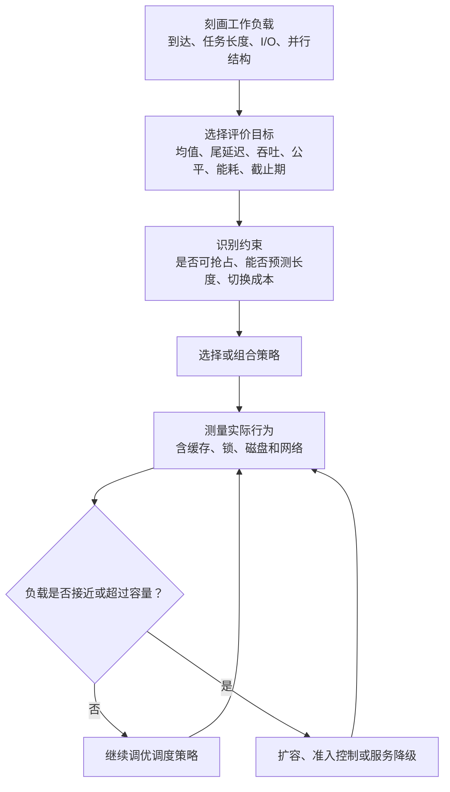
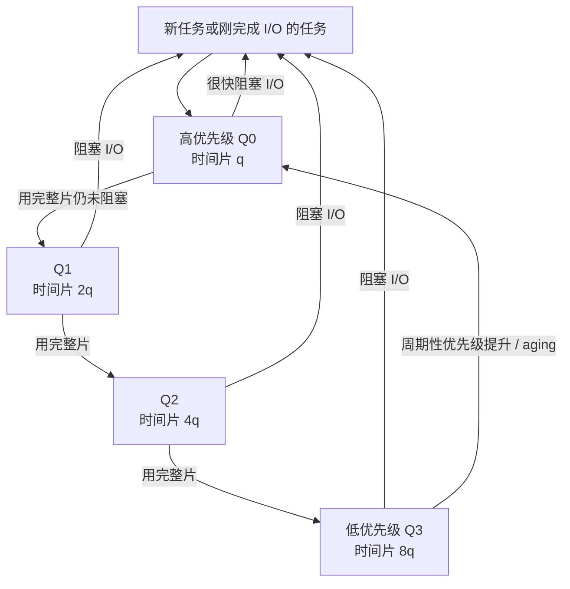
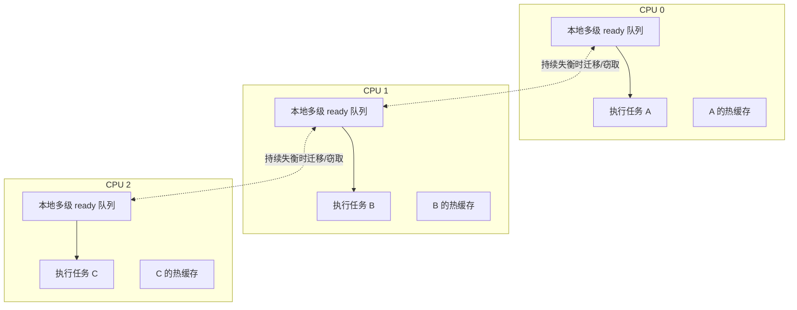
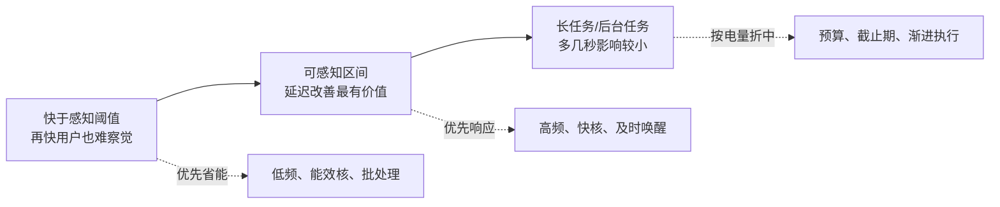
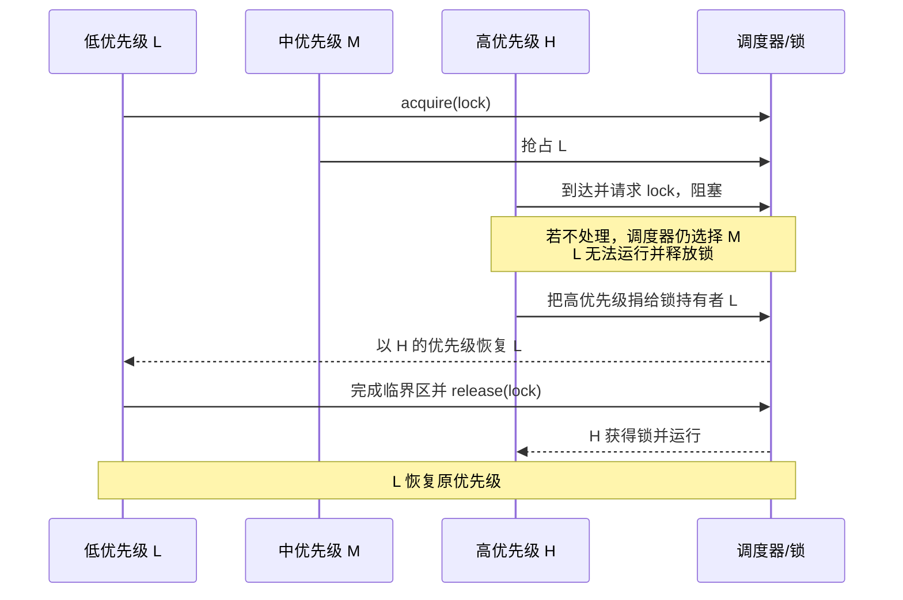
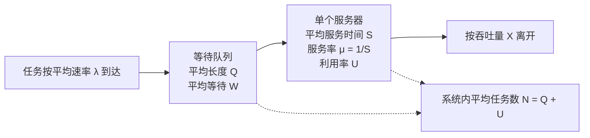
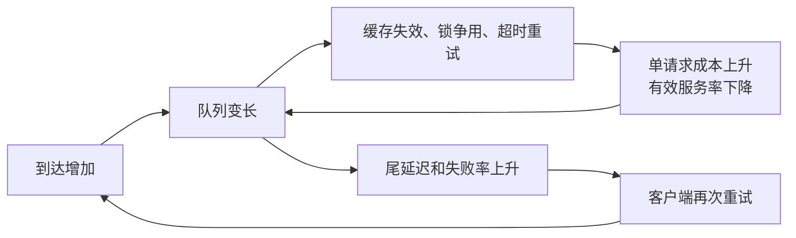
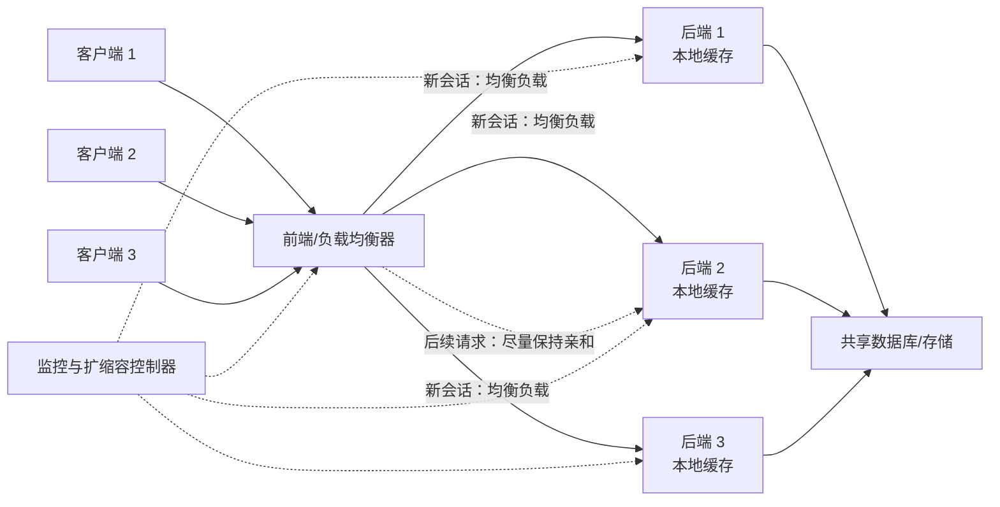

> 书名：*Operating Systems: Principles and Practice*（第二版）<br>
> 卷名：Volume II: *Concurrency*<br>
> 作者：Thomas Anderson、Michael Dahlin<br>
> 笔记范围：第 7 章 `Scheduling`，包括 7.1～7.8 节及章末练习<br>
> 原文位置：osppv2.md 的 “7 Scheduling” 部分

## 全章主线

前几章已经解决了三个机制问题：怎样创建线程、怎样在它们之间切换、怎样同步共享状态。本章转向**策略问题**：当可运行任务多于处理器时，下一刻究竟运行谁？

这个问题看似只是“排队”，实际同时影响五类目标：

| 目标 | 要回答的问题 | 常见陷阱 |
|---|---|---|
| 响应时间 | 一个请求从到达到完成要多久 | 平均值很好，长任务却可能饿死 |
| 吞吐量 | 单位时间能完成多少任务 | 频繁切换会消耗处理器和缓存 |
| 可预测性 | 同类请求的延迟是否稳定 | 平均延迟低不代表尾延迟低 |
| 公平性 | 谁获得多少资源、要等多久 | “每线程公平”可被创建大量线程钻空子 |
| 能耗与截止期 | 何时必须完成，值得花多少能量 | 最快方案未必最省电，最高优先级也未必按时完成 |

因此不存在对所有工作负载都最好的调度器。正确的分析顺序是：



图中最后一个分支很重要：**调度只能决定先做谁，不能凭空创造容量。** 当到达速率持续高于服务速率时，再精巧的队列顺序也无法阻止队列无限增长，必须减少工作或增加资源。

### 本章统一使用的性能术语

- **任务（task/job）**：一次用户请求，而不一定等同于线程或进程。一个线程可以依次处理许多任务，一次任务也可能跨越多个线程。
- **响应时间（response time/delay）**：任务从到达到完成的用户可见时间。
- **吞吐量（throughput）**：单位时间完成的任务数。
- **可预测性（predictability）**：重复请求响应时间的方差或尾部是否足够小。
- **调度开销（scheduling overhead）**：选择、切换任务以及重新填充缓存所花的时间。
- **公平性（fairness）**：不同任务或用户得到资源的数量与及时性是否符合约定。
- **饥饿（starvation）**：系统仍在完成其他工作，但某个任务长期得不到资源。

响应时间需要同时包含执行和等待。设任务 $i$ 的到达时刻为 $a_i$，完成时刻为 $C_i$，不受等待影响的服务时间为 $S_i$，则

$$
R_i=C_i-a_i,
$$

$$
W_i=R_i-S_i,
$$

其中 $R_i$ 是响应时间，$W_i$ 是累计排队时间。若任务会多次运行、阻塞、再运行，$S_i$ 是所有实际服务片段之和，$W_i$ 则包含它每一次等待。

全章路线是：先用单处理器策略揭示基本权衡，再讨论多核上的缓存亲和与并行应用，随后加入能耗和截止期，最后用排队论判断容量、用过载管理避免系统失控，并在数据中心案例中组合这些工具。

## 7.1 单处理器调度（Uniprocessor Scheduling）

### 工作负载、调度器与基本假设

**工作负载（workload）**是一组任务及其到达时间、服务需求和阻塞行为。对纯 CPU 任务，可写成

$$
\mathcal W=\{(a_i,S_i)\mid i=1,\ldots,n\}.
$$

调度器接收工作负载随时间暴露出的 ready 任务，决定每一时刻处理器属于谁。算法是否“好”必须连同工作负载和指标一起说；脱离二者谈最优没有意义。

本节比较算法时主要采用两个共同前提：

1. **工作保持（work-conserving）**：ready 队列非空时绝不故意让 CPU 空闲。否则只要人为停机，就能构造任意差的算法，比较失去意义。
2. **允许抢占（preemption）**：定时器中断或更高优先级任务到达时，内核能保存当前上下文并切换任务。

有些结论还会额外假设任务只使用 CPU、任务长度已知、切换开销为零或到达过程满足某种分布。每次使用结论时都必须检查这些条件。

### 7.1.1 先进先出（First-In-First-Out, FIFO）

**要解决的问题。** 最自然的排队规则是按到达顺序服务，像办事大厅取号一样。FIFO（也称 FCFS）选最早到达的 ready 任务，并让它一直运行到完成或主动阻塞。

**为什么有吸引力。**

- 实现只需一个队列，入队 $O(1)$、出队 $O(1)$；
- 纯 CPU 任务只在任务完成时切换，上下文和缓存开销低；
- 不会被后来到达的任务无限插队，顺序容易解释；
- 当任务长度近似相等时，复杂策略没有明显收益。

若有固定的 $n$ 个纯 CPU 任务，总有用工作量为 $\sum_i S_i$，每次切换成本为 $h$。非抢占 FIFO 只需约 $n$ 次装入/切换，总时间近似

$$
T_{FIFO}=\sum_{i=1}^{n}S_i+n h.
$$

任何把任务切成更多片段的策略都不会减少有用工作量，却可能增加 $h$，所以在这些严格假设下 FIFO 有利于吞吐量。若任务会阻塞 I/O，这个论证就不成立：让一个任务运行到阻塞后切走，反而可以把 CPU 与设备重叠。

**车队效应（convoy effect）。** 一个长任务排在队首，会让后面许多短任务一起等待。假设所有任务在时刻 0 到达，FIFO 顺序中的服务时间为 $S_1,S_2,\ldots,S_n$，忽略切换开销，则

$$
C_i=\sum_{j=1}^{i}S_j.
$$

平均响应时间为

$$
\bar R
=\frac1n\sum_{i=1}^{n}C_i
=\frac1n\sum_{i=1}^{n}\sum_{j=1}^{i}S_j
=\frac1n\sum_{j=1}^{n}(n-j+1)S_j.
$$

最后一步把求和顺序交换了：$S_j$ 会出现在任务 $j,j+1,\ldots,n$ 的完成时间里，共出现 $n-j+1$ 次。越靠前的任务权重越大，因此把长任务放前面会同时拖慢大量任务。

例如服务时间为 $1000,1,1,1,1$ ms：

| 顺序 | 完成时刻（ms） | 平均响应时间 |
|---|---|---:|
| 长任务在前 | 1000, 1001, 1002, 1003, 1004 | 1002 ms |
| 四个短任务在前 | 1, 2, 3, 4, 1004 | 202.8 ms |

总工作量和最终完成时刻完全相同，平均响应却相差近五倍。这说明吞吐量、最后完成时间和平均响应时间是不同指标。

**什么时候 FIFO 恰好合适。** memcached 的请求通常短且大小接近。此时重新排序和时间片切换没有足够收益，FIFO 既简单、缓存友好，也能得到很好的平均响应与吞吐量。

**适用边界。** FIFO 不等于普遍公平。它只保证到达顺序，不保证不同用户获得相同 CPU 份额，也不保证交互任务及时响应。任务长度差异越大、长任务越可能先到，车队效应越严重。

### 7.1.2 最短作业优先（Shortest Job First, SJF）

**目标与定义。** 如果已知每个 ready 任务还需要多少服务时间，选择**剩余时间最短**的任务可以最小化平均响应时间。允许新短任务到达后抢占当前任务时，更准确的名称是最短剩余时间优先（Shortest Remaining Time First, SRTF）。本书把这种抢占版本也统称 SJF。

注意比较的是剩余时间而非原始长度：一个执行了 59 分 59 秒、只剩 1 秒的长任务，应当排在一个新到达的 1 分钟任务之前。

**为什么能最小化平均响应时间：交换论证。** 先看同一时刻 ready 的两个任务，剩余时间分别为 $x$ 和 $y$，且 $x>y$。设它们开始前的共同时间为 $t$。

若先做长任务 $x$：

$$
C_x=t+x,\qquad C_y=t+x+y,
$$

两者完成时间之和为

$$
C_x+C_y=2t+2x+y.
$$

若交换顺序，先做短任务 $y$：

$$
C'_y=t+y,\qquad C'_x=t+y+x,
$$

$$
C'_x+C'_y=2t+2y+x.
$$

前者减后者得到

$$
(2t+2x+y)-(2t+2y+x)=x-y>0.
$$

交换后，两项完成时间之和严格下降，其他任务的开始时刻不变。因此任何存在“长任务排在短任务前”的候选最优顺序都能继续改进；反复交换，最终得到按长度升序的 SJF。对动态到达和抢占，可以对每个决策点的**剩余工作片段**做同样论证，于是 SRTF 在以下条件下最小化平均完成/响应时间：

- 单个可抢占服务器；
- 任务只竞争该服务器，不因锁或 I/O 产生额外依赖；
- 剩余服务时间准确已知；
- 抢占和切换开销忽略不计；
- 目标是所有任务的无权平均响应时间。

任一条件改变，最优性都可能消失。

**现实难点：未来不可知。** 通用 CPU 调度器通常不知道一次 CPU burst 会持续多久，只能根据历史估计。常见指数平滑预测为

$$
\hat S_{k+1}=\alpha S_k+(1-\alpha)\hat S_k,\qquad 0\le\alpha\le1,
$$

其中 $S_k$ 是刚结束的实际 CPU burst，$\hat S_k$ 是此前预测。较大的 $\alpha$ 更快跟随变化但更易受噪声影响；较小的 $\alpha$ 更平滑但反应慢。MLFQ 则不直接估计数值，而是用“是否很快阻塞”作为短任务信号。

**三个代价。**

1. **长任务饥饿**：短任务持续到达时，长任务可能永远无法完成。
2. **方差增大**：短任务被尽量提前，代价必然由长任务承担；SJF 对均值最佳，却可能让响应时间分布最不均匀。
3. **频繁抢占**：每次更短任务到达都可能触发切换，真实缓存开销会侵蚀理论收益。

**测量中的样本偏差。** 若在固定时刻停止实验，只统计已完成任务，SJF 下被饿死的长任务根本不会进入样本，平均值会显得异常漂亮。有效比较必须给两种策略同一有限工作集，停止继续到达并等待全部任务完成；或者把未完成任务作为删失数据单独报告，同时给出完成率和尾延迟。

**适合的真实例子。** 静态 Web 服务可从文件大小预测网络传输量。在带宽受限、短页面很多而大页面较少时，先传短页面可显著降低平均响应；但过载时必须配合老化、配额或准入控制，防止大文件永久饥饿。

### 7.1.3 时间片轮转（Round Robin）

**要解决的问题。** SJF 可能饿死长任务，FIFO 又会让短任务被长任务堵住。Round Robin（RR）让 ready 任务依次获得一个最长为 $q$ 的**时间片/时间量子（quantum）**：

1. 取 ready 队首任务运行；
2. 设置 $q$ 后触发的定时器；
3. 若任务先完成或阻塞，立刻选择下一个；
4. 若用完整个 $q$ 仍未完成，抢占并放回队尾。

只要 ready 队列有限、调度器公平且任务不会禁用抢占，每个任务最终都会轮到，因此 RR 避免饥饿。

**时间片为什么不能太短。** 设每片有效执行 $q$，一次切换及其平均缓存代价为 $h$，则一个完整周期中开销比例近似

$$
O=\frac{h}{q+h}.
$$

若要求 $O\le\varepsilon$，则

$$
\frac{h}{q+h}\le\varepsilon
\Longrightarrow h\le\varepsilon q+\varepsilon h
\Longrightarrow q\ge\frac{1-\varepsilon}{\varepsilon}h.
$$

例如仅计显式切换 $h=10\ \mu s$，希望开销不超过 1%，需 $q\ge990\ \mu s$。但缓存、TLB 和分支预测器的重新热身可能达到毫秒级，真实系统通常取约 10–100 ms，而不是只按寄存器保存时间选取。

**时间片为什么不能太长。** 假设有 $n$ 个持续 ready 任务，忽略新到达和切换开销，一个任务刚用完时间片后，再次运行前最多要等其他 $n-1$ 个任务各运行一片：

$$
W_{turn}\le(n-1)q.
$$

计入每次开销 $h$，上界近似 $(n-1)(q+h)$。$q$ 越大，交互任务按键后获得 CPU 的最坏等待越长。

**两个极端。**

- $q$ 大于所有任务长度时，RR 退化为 FIFO；
- 若切换完全免费且 $q$ 趋近一条指令，所有任务近似同时按比例推进，短任务自然先结束，行为接近处理器共享和 SJF，但每个任务会被其他 ready 任务按比例放慢。

**等长任务反例。** $n$ 个长度均为 $L$ 的任务同时到达。FIFO 的完成时间为 $L,2L,\ldots,nL$，平均为

$$
\bar R_{FIFO}=\frac{n+1}{2}L.
$$

极细 RR 会让所有任务到接近 $nL$ 时才陆续完成，平均接近 $nL$。它没有让任何任务更早完成，却增加了切换。这说明“每个人同时进步”不等于“用户更快看到完成结果”。

**CPU 与 I/O 混合反例。** 一个磁盘任务每次只需 1 ms CPU 就发起 10 ms I/O，旁边有两个计算任务。若 $q=100$ ms，磁盘任务每次 I/O 完成后可能等近 200 ms 才再次运行，原本约 11 ms 的循环被放大到约 211 ms，磁盘大部分时间空闲。近似 SJF/高优先级调度只需让这个 1 ms burst 及时执行，对两个计算任务影响很小，却能维持整机 I/O 吞吐。

**适合的例子。** 流媒体更重视持续、可预测的进度，而不是整个视频何时下载完。只要每条流获得的稳定带宽不低于播放码率，RR 或加权 RR 很合适。

**与 SMT 的区别。** 同时多线程（SMT/Hyper-Threading）让一个物理核心的多个硬件线程在指令周期级共享执行单元，切换几乎没有传统软件上下文开销；但硬件线程会竞争执行端口和缓存。软件 RR 则以毫秒级在更多任务间切换，两者可以同时存在。

### 7.1.4 最大最小公平（Max-Min Fairness）

**问题从哪里来。** “每线程一份”并不一定公平：应用可创建几百个线程抢占大部分份额；I/O 任务只需 10% CPU 就能保持设备繁忙，机械 RR 却可能让它等待很久，而两个计算任务各拿近 50%。公平单位必须先定义为用户、应用、进程还是线程，通常还需分层计费。

**严格定义。** 总资源容量为 $C$，参与者 $i$ 的最大需求为 $d_i$，分配为 $x_i$。可行分配满足

$$
0\le x_i\le d_i,\qquad \sum_i x_i\le C.
$$

最大最小公平要求：若想增加某个 $x_i$，必须减少另一个分配不大于它的参与者。等价地，把所有分配从 0 同速“注水”，需求较小者装满后退出，剩余容量继续在未满足者之间均分；它按字典序最大化排序后分配向量的最小项、次小项，依此类推。

**水位算法。** 对未满足集合 $A$ 和剩余容量 $C_r$：

1. 计算暂定均分水位 $f=C_r/|A|$；
2. 若某参与者剩余需求不超过 $f$，完整满足它并从 $A$ 删除；
3. 从 $C_r$ 扣除其需求，重新计算水位；
4. 无人能被完整满足时，把剩余容量在 $A$ 中均分。

例如三个进程的 CPU 需求分别为 $10\%,100\%,100\%$，总容量 100%。第一轮均分 33.3%，第一个只用 10%，余下 90% 在另外两个之间均分，得到

$$
(x_1,x_2,x_3)=(10\%,45\%,45\%).
$$

这比三者轮流各 33.3% 更有效：I/O 任务得到足以维持设备繁忙的 10%，并没有浪费拿不到的份额；剩余 CPU 全部用于计算任务。

**处理器上的近似实现。** 理想实现每一瞬间都运行累计 CPU 最少的进程，会在每条指令后切换。实际调度器允许最多一个时间片误差：每次需要选择时，运行累计服务量最少者，当前任务可完整用完一片。长期分配趋近公平，同时控制切换次数。

维护精确最小值需要优先队列，选择和更新通常为 $O(\log n)$。高频调度器常用虚拟运行时间、分层队列或近似桶降低成本。Linux CFS 的虚拟运行时间思想与此相近，但具体实现和版本会变化。

**边界与替代方案。**

- 最大最小公平保护最小份额，却不直接最小化平均响应时间；
- 单资源公平无法处理 CPU、内存、磁盘、网络的联合需求，可考虑主导资源公平（DRF）等多资源方案；
- 无法使用份额和暂时不想使用份额不同，是否允许积累“信用”是额外策略；
- 公平必须按可信身份计费，否则拆进程/线程即可放大份额。

### 7.1.5 案例：多级反馈队列（Multi-Level Feedback）

现实调度器既不知道任务长度，又想同时获得 SJF 的响应性、FIFO 的低开销、RR 的无饥饿和最大最小公平。多级反馈队列（Multi-Level Feedback Queue, MLFQ/MFQ）用任务过去的行为预测未来，把这些目标做成工程折中。



**基本规则。**

- 多个优先级队列，每层内部使用 RR；
- 总是先运行最高非空层，高层任务可抢占低层；
- 高层时间片短，低层时间片长；
- 新任务从高层开始；
- 用完整片说明它更像计算密集长任务，于是降低一级；
- 很快因 I/O 阻塞说明 CPU burst 短，可保留或提升优先级；
- 周期性提升长期等待者，防止低层饥饿。

**为什么有效。** 真实交互和 I/O 任务通常只需短 CPU burst 就阻塞，高优先级让它们迅速发出下一次 I/O，改善用户响应和设备利用率。计算任务很快下降到长时间片层，减少切换和缓存抖动。调度器以行为反馈近似未知的 SJF，而不要求应用诚实申报长度。

**公平性修补。** 仅按行为分层仍可能让大量 I/O 任务饿死计算任务。商业系统会记录每个进程/用户累计资源：低于公平份额者提升，超过份额者降低；同一层还可区分“尚未得到份额”和“已得到份额”的队列。

**策略操纵。** 自私任务可在时间片结束前主动做一次极短 I/O，伪装成交互任务。对策是不只看一次是否阻塞，而按较长窗口累计 CPU 消耗、按用户或进程组计费，并限制优先级提升速度。

**局限。** MLFQ 参数很多：层数、各层时间片、提升周期、I/O 返回层级都会影响结果；它不严格最优，负载变化时还可能震荡。现代实现通常吸收其思想，而不必严格使用图中的四条队列。

### 7.1.6 小结

| 策略 | 主要优势 | 典型失败 | 更适合的负载 |
|---|---|---|---|
| FIFO | 简单、切换少、缓存友好 | 长任务造成车队效应 | 长度接近、短小请求 |
| SJF/SRTF | 已知长度时平均响应最优 | 不可知未来、长任务饥饿、方差大 | 长度可预测且需优化均值 |
| RR | 无饥饿、进度平滑 | 时间片过短开销大；等长任务完成晚 | 流式、公平分享 |
| 最大最小公平 | 未使用份额可再分配，保护小需求者 | 不直接优化均值，精确实现昂贵 | 多用户或多租户资源分配 |
| MLFQ | 无需预知长度，兼顾响应与开销 | 参数复杂、可被操纵、只是近似 | 通用操作系统混合负载 |

选择策略的核心不是背表，而是先问：任务长度是否可预测？任务会不会阻塞？要优化均值还是尾延迟？公平单位是谁？切换与缓存成本多大？后续多处理器、实时和过载调度仍是在回答这些问题，只是约束更多。

## 7.2 多处理器调度（Multiprocessor Scheduling）

单处理器只需决定“下一任务是谁”；多处理器还要决定“放在哪个核心、是否与同一应用的其他线程同时运行、何时值得迁移”。核心越多，调度器本身的共享状态和缓存通信越可能成为瓶颈。

本节区分两类工作负载：

1. 大量彼此独立的顺序任务，例如每连接一个线程的 Web 服务器；
2. 一个任务内部包含相互协作的并行线程，例如图像处理、数据库查询或 MapReduce 阶段。

把第二类误当成第一类，虽然每条线程都能得到“公平”时间，却可能让整个应用大幅变慢。

### 7.2.1 在多处理器上调度顺序应用

**最直接方案：中央 ready 队列。** 所有核心从同一个 MLFQ 取任务，I/O 完成后也放回同一队列。它容易维持全局优先级和负载均衡，但有三个扩展性问题。

**一、队列锁争用。** 每次调度、唤醒、抢占都修改同一数据结构。任务 CPU burst 越短，调度操作越频繁；核心数越多，锁竞争越严重，最终“选择工作”的成本可能接近“完成工作”的成本。

**二、缓存一致性通信。** 即使临界区只有几十条指令，队列头、锁字和统计字段也要在核心缓存间迁移。远程缓存行访问可比本地缓存慢几个数量级，而且延迟发生在持锁期间，会进一步放大争用。

**三、任务缓存失温。** 线程每次被任意空闲核心取走，先前的栈、代码和工作集很可能仍在另一个核心的缓存中。迁移后既要从远程缓存/内存取数据，又会挤掉新核心上其他任务的数据。

**常用方案：每处理器队列与亲和调度。**



线程阻塞后再次 ready，优先回到上次运行的 CPU，这称为**软亲和（affinity）**。常见路径只访问本地队列，锁和任务工作集都更可能在本地缓存中。

代价是瞬时不均衡：CPU 0 可能空闲，CPU 1 队列仍有任务。系统通常只在不均衡持续到足以补偿迁移成本时重平衡。粗略地，若迁移后预计减少等待 $B$，迁移和缓存重热成本为 $M$，只有

$$
B>M
$$

时迁移才有净收益。现实中的 $B$ 和 $M$ 无法精确预知，因此系统使用队列长度、负载平均值、NUMA 距离、缓存共享拓扑等启发式指标。

**工作窃取与主动推送。** 空闲 CPU 可从繁忙 CPU 队尾偷任务，也可由周期性均衡器把任务推走。窃取响应快、只在需要时发生；主动均衡能处理“所有 CPU 都忙但负载差异很大”的情况。两者都要按固定锁序访问两个队列，避免死锁。

**硬亲和与 NUMA。** 应用还可把线程固定到某 CPU/CPU 集合。数据库和实时程序可由此控制缓存、内存与中断位置；但错误固定会让空闲核心无法帮助。NUMA 系统中，迁移 CPU 而不迁移内存页可能把大量访问变成远程内存访问，调度和内存放置必须协同。

### 7.2.2 调度并行应用

并行应用的线程不是独立客户，它们之间可能有 barrier、流水线、锁和关键路径。操作系统若完全不知道这些关系，称为**无感知调度（oblivious scheduling）**：每条线程像独立任务一样参与普通时间片和公平分配。

#### 无感知调度的五类失败

1. **批同步延迟。** 一阶段拆成 $p$ 份，所有线程在 barrier 等最慢者。任一线程被抢占，其他 $p-1$ 个核心即使已经完成也只能空等。
2. **生产者—消费者断链。** 流水线中间阶段被抢占，上游很快填满缓冲而阻塞，下游又因无输入而空闲。
3. **关键路径延迟。** 并行图中决定最终完成时刻的最长依赖链被抢占，非关键工作再快也无法补偿。
4. **锁持有者被抢占。** 持锁线程停在临界区，其他核心先自旋再睡眠；调度器却可能继续运行不相关的中优先级任务。
5. **I/O 与线程数矛盾。** 多建线程可在一个线程阻塞 I/O 时填补核心；若 I/O 命中缓存不阻塞，多出的线程又造成无谓时间片切换。

用工作—跨度模型可看清关键路径。设单处理器完成全部操作所需总工作为 $T_1$，无限处理器下仍无法缩短的关键路径为 $T_\infty$，使用 $p$ 个处理器的时间满足两个下界：

$$
T_p\ge\frac{T_1}{p},\qquad T_p\ge T_\infty,
$$

所以

$$
T_p\ge\max\left(\frac{T_1}{p},T_\infty\right).
$$

$T_1/T_\infty$ 是平均并行度。给应用的处理器数远超这一值，不可能继续线性加速；若抢占关键路径上的线程，$T_\infty$ 反而被拉长。

#### Gang scheduling：一起运行或一起暂停

Gang scheduling 把同一并行应用的线程当作一个整体：有足够核心时同时运行；需要让出资源时一起抢占。这样 barrier 两侧和流水线各阶段能同时前进，也减少锁持有者独自被停掉的概率。

它适合紧密耦合、同步频繁的并行程序。数据库可把一组核心专门留给主实例，并把少量核心留给系统服务。

局限是浪费：若一个 16 线程 gang 中有线程阻塞，保留给它的核心可能空闲；两个应用都要求全机 gang 时，只能轮流占用所有核心，切换和缓存代价很大。

#### Space sharing：分核心而不是分时间

若应用加速曲线存在收益递减，通常把 16 核分成两组，各给两个应用 8 核，比让每个应用轮流占 16 核更高效。前者称**空间共享（space sharing）**，后者称时间共享。

设应用 $i$ 分到 $p_i$ 个核心时吞吐/速度为 $g_i(p_i)$，容量约束为

$$
\sum_i p_i\le P.
$$

如果 $g_i$ 是凹函数，即每增加一个核心的边际收益递减，就应优先把下一个核心分给当前边际收益 $g_i(p_i+1)-g_i(p_i)$ 最大的应用，而不是无条件把所有核心交给一个应用。这只是理想原则；系统往往不知道真实加速曲线，还要兼顾公平和优先级。

#### Scheduler activations：让应用知道资源变化

静态空间分配无法应对应用动态开始、结束和 I/O 阻塞。Scheduler activation 在内核与用户级运行时之间建立协议：

- 内核决定一个进程当前获得几个虚拟处理器；
- 每个虚拟处理器对应一个 activation；
- 增加/收回核心、线程在内核阻塞或重新 ready 时，内核用 upcall 通知运行时；
- 用户运行时把自己的细粒度任务重新映射到现有 activation。

这样内核负责跨应用公平，应用负责利用内部依赖、关键路径和任务粒度。机制解决“怎样告知”，却没有自动回答“每个应用该分几个核心”；平均响应、公平和吞吐之间的政策权衡仍然存在。

现代任务运行时、线程池和协程调度器都在不同程度上面对同一问题：内核与应用是两级资源管理者，若彼此看不见对方状态，就可能过度订阅或留下核心空闲。

## 7.3 能耗感知调度（Energy-Aware Scheduling）

**问题从哪里来。** 任务的计算量不是唯一成本。手机和笔记本受电池限制，服务器的电费与散热也是总成本的重要部分；同一任务在不同核心、频率和设备状态下，执行时间和能耗都会变化。

先区分两个量：

- **功率 $P$**：单位时间消耗的能量，单位瓦特（W = J/s）；
- **能量 $E$**：完成任务累计消耗，$E=\int P(t)dt$，近似恒功率时 $E=Pt$。

处理器动态功率常用近似模型

$$
P_{dyn}\approx\alpha C V^2 f,
$$

其中 $\alpha$ 是翻转活动因子，$C$ 是等效电容，$V$ 是电压，$f$ 是时钟频率。提高频率通常还需提高电压，因此功率可能比频率增长更快。模型未包含漏电、内存、屏幕和 I/O 功率，只用于建立直觉。

### 操作系统可利用的硬件手段

**异构处理器。** 高性能核心有乱序执行、大缓存和高频率，响应快但耗电；能效核心结构简单，适合后台任务。调度器需根据延迟价值和负载选择核心，而不是永远“快核给前台、慢核给后台”这么简单，任务阶段也会变化。

**核心停用与整合。** 轻载时把任务集中到少数核心，让其他核心进入深度睡眠，可降低静态功耗；把任务铺开则可能降低单核排队、改善响应。唤醒深睡核心本身有延迟和能量成本。

**DVFS。** 动态调节电压/频率能用更长执行时间换取较低瞬时功率。是否节能要看总能量。例如：

| 模式 | 功率 | 时间 | 能量 |
|---|---:|---:|---:|
| 快速 | 20 W | 1 s | 20 J |
| 慢速 | 8 W | 3 s | 24 J |

慢模式功率更低，却因运行更久反而多耗 4 J。这说明“降频必然省电”是误解；有时快速完成并让整机进入深睡，即 **race to idle**，更节能。

**I/O 设备电源。** 屏幕、Wi-Fi、蜂窝网络和磁盘都可能比 CPU 更耗电。把分散的小请求批量化，可延长设备连续休眠时间；但批处理会增加等待。传感器网络还要求发送方与接收方同步唤醒窗口，否则双方永远错过。

**热约束。** 芯片可短时高频运行，但温度达到阈值后必须降频或停顿。调度器应把“当前可用性能”视为随温度变化的资源；持续负载的长期性能可能低于冷机短跑性能。

### 用用户价值决定能量花在哪里

响应时间越短通常越有价值，但关系不是线性的：



高频交易的价值可能在几毫秒后骤降，视频则更重视稳定性：平均码率稍低但连续播放，通常优于平均质量高却每分钟卡顿。能耗策略必须理解应用价值，而非只看 CPU 利用率。

### 能量是一种难以虚拟化的共享资源

CPU 时间用完后可把处理器交给别人，电池能量一旦消耗就永久减少。恶意或低效应用会缩短所有应用的可用时间。系统可：

- 按应用统计 CPU、网络、定位等活动对应的能耗；
- 向用户展示责任归属；
- 给后台应用设置能量/唤醒配额；
- 对异常耗电应用降级、暂停或撤销能力。

准确归因并不容易：一次网络唤醒的固定成本由谁承担？共享缓存和后台合并任务又该怎样分账？这些是调度、计费与安全策略共同面对的问题。

## 7.4 实时调度（Real-Time Scheduling）

实时系统的正确性不仅取决于计算结果，还取决于结果**何时**产生。飞机控制、ABS 制动等任务错过时刻可能造成危险；视频帧晚到则降低体验。

- **截止期（deadline）$d_i$**：任务 $i$ 必须完成的时刻；
- **硬实时**：错过截止期被视为系统失败；
- **软实时**：偶尔错过可接受，但价值或质量下降；
- **周期任务**常用 $(C_i,T_i,D_i)$ 描述：每周期 $T_i$ 到达一次，每次最坏 CPU 需求 $C_i$，相对截止期 $D_i$。

“测试很多次都按时”不能证明硬实时正确。锁竞争、中断、缓存失效和罕见错误路径会改变最坏执行时间；需要静态上界、可调度性分析和运行时隔离共同保证。

### 三种提高按时完成概率的方法

**一、过度配置（over-provisioning）。** 让实时任务最坏总需求只占容量一部分，留出抖动余量。若系统长期接近 100% 使用，任何小波动都可能导致连锁超期。它简单稳健，但硬件成本高，且“留多少”仍需分析。

**二、最早截止期优先（Earliest Deadline First, EDF）。** 每次运行绝对截止期最早的 ready 任务，新任务有更早截止期时立即抢占。

> **EDF 最优性。** 对单处理器、相互独立、可抢占、只需要 CPU、执行时间和截止期已知、切换无开销的任务集合：若存在任何能满足全部截止期的调度，EDF 也能满足。

交换论证如下。取任一可行但不按 EDF 的调度，找到最早一个时刻：它运行截止期较晚的任务 $B$，而更早截止的 ready 任务 $A$ 在等待。把该小段 $B$ 与之后等长的一段 $A$ 交换：

- $A$ 更早执行，不会更晚完成；
- $B$ 被移到原来 $A$ 的位置，而 $d_B\ge d_A$，原调度能让 $A$ 在 $d_A$ 前完成，故这次局部交换不会让 $B$ 越过更早的 $d_A$；
- 其他任务不变。

反复消除逆序即可得到 EDF，且不破坏可行性。

对独立周期任务且隐式截止期 $D_i=T_i$，理想抢占 EDF 的可调度条件为

$$
U=\sum_i\frac{C_i}{T_i}\le1.
$$

$C_i/T_i$ 是任务 $i$ 的长期 CPU 需求比例。$U>1$ 时平均需求已超容量，必不可能；在上述严格模型中 $U\le1$ 也充分。若 $D_i<T_i$、任务共享锁、含不可抢占区、I/O 或切换开销，该简单条件不再充分，需需求边界分析等更完整方法。

**EDF 的 I/O 反例。**

- A：截止 12 ms，需要先算 1 ms，再做 10 ms I/O；
- B：截止 10 ms，需要纯计算 5 ms。

EDF 看到 $d_B<d_A$，先运行 B（0–5），再让 A 算到 6 ms、I/O 到 16 ms，A 超期。但可行顺序是 A 先算（0–1）并发起 I/O（1–11），同时 B 在 1–6 完成，两者都按时。

问题不是 EDF 逻辑错误，而是把“任务整体截止期”错误地当成每一步的截止期。A 的 CPU 前驱必须在 2 ms 前完成，才能给 10 ms I/O 留时间。把复杂任务分成带局部截止期的阶段，才能正确暴露依赖。

**三、优先级捐赠（priority donation/inheritance）。** 高优先级任务 H 等待低优先级任务 L 持有的锁时，中优先级 M 可能不断抢占 L，导致 H 间接被 M 阻塞，这叫**优先级反转**。



捐赠必须沿等待链传播：H 等 L，L 又等另一个任务时，优先级要递归传递；释放相关锁后再撤销。它限制了由中优先级任务造成的无界反转，但不能消除临界区本身的执行时间，也不能修复死锁。替代方案包括优先级上限协议、避免实时路径使用共享锁、使用非阻塞结构或静态循环调度。

实时调度的核心不是“给高优先级就行”，而是把最坏执行时间、依赖、不可抢占区、资源等待和容量全部纳入模型。

## 7.5 排队论（Queueing Theory）

调度策略回答“队列里先做谁”，排队论先问一个更根本的问题：**任务以多快速度到达，服务器以多快速度完成，它们会造成多长的队列？**

当负载很低时，链表换哈希表或 FIFO 换 SJF 可能明显改善延迟；接近容量时，到达率的小幅上升就可能让等待非线性暴涨，算法微调会被容量效应淹没。排队论的价值不是精确预测每个请求，而是用数量级判断时间花在服务还是等待、该优化代码还是扩容。

本节先采用最简单模型：单队列、单服务器、工作保持、FIFO、无限缓冲。随后再讨论随机到达、多服务器和多个串联系统。

### 7.5.1 基本定义



**服务器（server）。** 任何一次只能提供有限服务能力的资源：CPU、磁盘、网络链路、Web 后端、银行柜员都可以抽象为服务器。

**服务时间 $S$。** 假设无需排队，服务器完成一个任务所需的平均时间。服务率为

$$
\mu=\frac1S.
$$

例如 $S=5$ ms/request，则

$$
\mu=\frac{1}{0.005\ \text{s/request}}=200\ \text{requests/s}.
$$

**到达率 $\lambda$ 与到达过程。** $\lambda$ 是单位时间平均到达数；到达过程还描述请求是否均匀、随机或成批。相同平均 $\lambda$ 的两个系统可能因突发程度不同而有完全不同的延迟。

**排队延迟 $W$ 与队列长度 $Q$。** $W$ 是一个任务累计等待服务器的时间；时间片系统中多次等待要全部相加。$Q$ 是长期平均等待任务数。

**响应时间 $R$。**

$$
R=W+S.
$$

这条式子只是按时间组成分类，不需要随机分布假设。优化 $S$ 要加速实现/硬件；优化 $W$ 则要降低负载、增加服务器或改变调度。

**利用率 $U$。** 单服务器忙碌时间占比，$0\le U\le1$。若系统稳定，每个到达任务最终都完成，长期吞吐 $X=\lambda$。每秒有 $\lambda$ 个任务、每个占用服务器 $S$ 秒，因此每秒忙碌时间为 $\lambda S$：

$$
U=\lambda S=\frac{\lambda}{\mu},\qquad \lambda<\mu.
$$

若 $\lambda\ge\mu$，服务器最多 100% 忙：

$$
U=1.
$$

当 $\lambda>\mu$ 时，每秒净积压约 $\lambda-\mu$ 个任务，队列随时间线性增长，不存在有限稳态平均等待。不能把 $U=1$ 误读为“系统运行得完美”；它可能已经不稳定。

**吞吐量 $X$。** 服务器忙时每秒完成 $\mu$ 个，忙碌比例为 $U$，故

$$
X=U\mu.
$$

稳定时 $U=\lambda/\mu$，所以 $X=\lambda$；饱和后即使继续增加到达，长期完成率上限仍为 $\mu$：

$$
X=\min(\lambda,\mu)
$$

只适合作为容量上限表达。$\lambda>\mu$ 时系统不在稳态，不能继续使用要求稳定性的平均公式。

**系统内任务数 $N$。** 单服务器要么空闲，要么服务一个任务，所以服务器中的平均任务数正好是忙碌概率 $U$；加上队列：

$$
N=Q+U.
$$

### 7.5.2 Little 定律

Little 定律适用于任何长期稳定、到达率等于离开率的系统：

$$
\boxed{N=XR}
$$

其中 $N$ 是系统内平均任务数，$X$ 是吞吐量，$R$ 是平均响应时间。它不要求 FIFO、不要求一个服务器，也不要求指数分布。

#### 为什么成立：任务—时间面积守恒

观察长度为 $T$ 的时间窗口。令 $N(t)$ 为时刻 $t$ 系统内任务数，则曲线下的面积

$$
A=\int_0^T N(t)\,dt
$$

单位是“任务·秒”。从另一角度，每个在窗口内完成的任务 $k$ 在系统中停留 $R_k$ 秒，它对面积贡献 $R_k$。忽略窗口开始前已经存在、结束时尚未离开的边界项（当 $T$ 很大且系统稳定时，它们占比趋零）：

$$
A\approx\sum_{k=1}^{m}R_k,
$$

其中 $m$ 是窗口内完成任务数。两边除以 $T$：

$$
\frac1T\int_0^T N(t)dt
=\frac{m}{T}\cdot\frac1m\sum_{k=1}^{m}R_k.
$$

令 $T\to\infty$，左边是平均 $N$，第一项 $m/T$ 是吞吐 $X$，第二项是平均响应 $R$，因此

$$
N=XR.
$$

证明本质是守恒，不依赖任务怎样排队。成立边界是：长期平均存在、系统稳定、统计的“进入/离开边界”和“系统内数量”必须针对同一个系统。

#### 例一：由吞吐与响应求并发数

系统每秒完成 100 个请求，平均响应 50 ms：

$$
X=100\ \text{s}^{-1},\qquad R=0.05\ \text{s},
$$

$$
N=XR=100\times0.05=5.
$$

平均有 5 个请求正在排队或被服务。单位检查也能防错：$(\text{request}/\text{s})\times\text{s}=\text{request}$。

#### 例二：只观察服务器得到利用率

单服务器每秒完成 100 个请求，每个在服务器中实际处理 5 ms。把“服务器内部”单独视为系统：它同时最多容纳一个任务，所以平均任务数就是利用率 $U$：

$$
U=XS=100\times0.005=0.5=50\%.
$$

这也重新得到 $U=\lambda S$。

#### 例三：只观察队列

总响应 50 ms，服务 5 ms，所以

$$
W=R-S=45\ \text{ms}.
$$

对“只含等待区”的子系统应用 Little 定律：

$$
Q=XW=100\times0.045=4.5.
$$

于是

$$
N=Q+U=4.5+0.5=5,
$$

与例一一致。三组常用关系因此连成一体：

$$
N=XR,\qquad Q=XW,\qquad U=XS,
$$

$$
R=W+S\Longrightarrow N=Q+U.
$$

#### 为什么 4.5 个排队任务不意味着只等 $4.5\times5=22.5$ ms

$Q=4.5$ 是**随机时刻看到的时间平均**；$W$ 是**每个到达请求经历的平均**。队列一半时间可能为空，另一半时间很长。长队期间到达的请求更多，因此“一个随机到达”比“一个随机时刻”更容易撞上繁忙期，这属于观察者偏差/检查悖论的直觉。

在 Poisson 到达下，PASTA 性质说明到达者看到的状态分布等于时间分布，但它看到队列后还要等待队首任务和后续服务，不能简单把时间平均队列长度乘一次服务时间。可靠做法是直接使用 $Q=XW$。

#### 例四：无需知道内部结构的数据中心

复杂服务每秒完成 10,000 次查询，平均响应 100 ms：

$$
N=10{,}000\times0.1=1000.
$$

无论内部有多少负载均衡器、缓存、CPU、磁盘和网络队列，稳态下平均约有 1000 个请求在整个系统中。这使 Little 定律很适合做容量和并发上限的数量级检查。

### 7.5.3 响应时间与利用率

提高利用率可以少买机器，却会增加排队和过载风险。关键关系不是线性的：低负载增加 5 个百分点可能几乎无感，高负载同样增加 5 个百分点却可能让响应翻倍。

#### 最好情况：固定任务、均匀到达

服务时间固定为 $S=1/\mu$，请求严格每 $1/\lambda$ 秒到达一次。

- $\lambda<\mu$：前一个任务在下一个到达前完成，$W=0,R=S$；
- $\lambda=\mu$：若初始空队列，可恰好无缝衔接，$R=S$、$U=1$，但一次额外请求就会让此后每个请求都背上等待；
- $\lambda>\mu$：每单位时间净增加 $\lambda-\mu$ 个请求，队列无界增长。

这说明“100% 利用且有限响应”在完全确定、无扰动的特殊系统中可能存在，但它是脆弱平衡；只要到达或服务有一点随机性，就无法长期维持。

#### 突发到达：平均负载低也会等待

服务器每个任务用时 $S$，一次同时到达 $b$ 个任务。FIFO 下第 $k$ 个任务在 $kS$ 完成，批次平均响应为

$$
\bar R_{batch}
=\frac1b\sum_{k=1}^{b}kS
=\frac{S}{b}\cdot\frac{b(b+1)}2
=\frac{b+1}{2}S.
$$

若服务器每秒处理 10 个，$S=0.1$ s：

- 每秒开头同时来 5 个，平均响应 $\frac{6}{2}\times0.1=0.3$ s；
- 同时来 10 个，平均响应 $\frac{11}{2}\times0.1=0.55$ s。

相同请求若均匀分散，响应都只有 0.1 s。平均到达率相同，突发性本身就制造排队。

#### 指数分布为何常被用作基准

若事件间隔 $X$ 服从参数 $\lambda$ 的指数分布，概率密度为

$$
f_X(x)=\lambda e^{-\lambda x},\qquad x\ge0.
$$

它确实是概率密度，因为

$$
\int_0^\infty\lambda e^{-\lambda x}dx
=\left[-e^{-\lambda x}\right]_0^\infty=1.
$$

其均值为

$$
E[X]=\int_0^\infty x\lambda e^{-\lambda x}dx=\frac1\lambda,
$$

可由分部积分得到。更关键的是**无记忆性**。指数分布尾概率为

$$
P(X>t)=e^{-\lambda t},
$$

所以

$$
P(X>s+t\mid X>s)
=\frac{P(X>s+t)}{P(X>s)}
=\frac{e^{-\lambda(s+t)}}{e^{-\lambda s}}
=e^{-\lambda t}
=P(X>t).
$$

已经等了多久不改变还需等待多久的分布。这让队列状态只需记录“当前有几个任务”，不必记录每个到达/服务已经持续多久。

现实不必严格指数分布：定时任务更平滑，演唱会开票、热点新闻和文件大小常呈重尾。指数模型的用途是提供可解释基线；若实测比它差很多，应检查突发、相关性、热点和长尾。

#### $M/M/1$ 模型与 $R=S/(1-U)$ 的完整推导

$M/M/1$ 表示：

- 第一个 M：Poisson 到达，间隔指数分布，平均率 $\lambda$；
- 第二个 M：服务时间独立且指数分布，平均率 $\mu$；
- 1：单服务器；
- 另假设 FIFO、无限队列、工作保持，且 $\rho=\lambda/\mu<1$。

把系统内任务数记为状态 $n=0,1,2,\ldots$。到达使 $n\to n+1$，速率为 $\lambda$；当 $n>0$ 时完成使 $n\to n-1$，速率为 $\mu$。

稳态下，相邻状态的概率流量平衡：

$$
p_n\lambda=p_{n+1}\mu,
$$

故

$$
p_{n+1}=\rho p_n,\qquad p_n=\rho^n p_0.
$$

所有状态概率和为 1：

$$
1=\sum_{n=0}^\infty p_n
=p_0\sum_{n=0}^\infty\rho^n
=\frac{p_0}{1-\rho},
$$

其中几何级数收敛依赖 $\rho<1$。所以

$$
p_0=1-\rho,
$$

$$
p_n=(1-\rho)\rho^n.
$$

系统平均任务数为

$$
N=\sum_{n=0}^\infty n(1-\rho)\rho^n.
$$

利用

$$
\sum_{n=0}^\infty n\rho^n=\frac{\rho}{(1-\rho)^2},
$$

得到

$$
N=\frac{\rho}{1-\rho}.
$$

稳定时 $X=\lambda$。由 Little 定律：

$$
R=\frac{N}{\lambda}
=\frac{\rho}{\lambda(1-\rho)}
=\frac{1}{\mu(1-\rho)}
=\frac{1}{\mu-\lambda}.
$$

又因为 $S=1/\mu$、$U=\rho$：

$$
\boxed{R=\frac{S}{1-U}}.
$$

排队时间为

$$
W=R-S
=\frac{S}{1-U}-S
=\frac{US}{1-U},
$$

平均排队任务数为

$$
Q=\lambda W
=\frac{U^2}{1-U}.
$$

这些漂亮公式不是 Little 定律本身，而是 Little 定律加上 $M/M/1$ 分布假设的结果。不能把它们直接套到多服务器、有限缓冲、非指数或反馈负载。

#### 数值演算：同样增加 5%，后果为何不同

由 $R/S=1/(1-U)$：

| 利用率 | $R/S$ |
|---:|---:|
| 20% | 1.25 |
| 25% | 1.333… |
| 90% | 10 |
| 95% | 20 |

20%→25% 时响应倍率增加约

$$
\frac{1.333}{1.25}-1\approx6.67\%,
$$

若把“负载提高 5%”理解为相对提高 5%，数值会不同；原书口语化地称约 8%，核心结论不变。90%→95% 则从 $10S$ 变成 $20S$，直接翻倍。

当 $U\to1^-$，分母趋 0，$R\to\infty$。$M/M/1$ 中响应时间方差也按

$$
\operatorname{Var}(R)=\frac{1}{(\mu-\lambda)^2}
=\frac{S^2}{(1-U)^2}
$$

增长，因此高利用率不仅平均慢，尾延迟和不可预测性也更糟。

### 7.5.4 “如果……会怎样”分析

排队模型最有价值的用法不是背一个公式，而是改变参数并判断方向、数量级和新瓶颈。

#### 改调度策略会怎样

- 到达平滑、任务等长时，FIFO 近似最优，RR 只增加切换；
- 任务长度指数分布且无法预测时，无记忆性意味着所有已运行/未运行任务的期望剩余时间相同，FIFO 与理想处理器共享的平均响应可相同，RR 只多开销；
- 长度可预测且差异大时，SJF 降低均值，尤其适合重尾负载；
- SJF 的收益由长任务承担，高利用率下长任务可能要等到罕见的队列清空时刻，饥饿风险急剧上升。

策略不会改变“服务器何时忙/闲”所形成的 busy period 总工作量，只改变 busy period 内谁先完成。它可以重分配延迟，却不能让 $\lambda>\mu$ 的系统稳定。

#### 服务时间方差会怎样

原书指出随机服务会制造排队。对 Poisson 到达、单服务器、FIFO、独立同分布的一般服务时间，即 $M/G/1$，Pollaczek–Khinchine 公式把这个关系写得更精确：

$$
W=\frac{\lambda E[S^2]}{2(1-U)},\qquad U=\lambda E[S].
$$

因为

$$
E[S^2]=\operatorname{Var}(S)+(E[S])^2,
$$

在平均服务时间和利用率不变时，方差越大，等待 $W$ 越长。直觉是偶发超长任务会在身后积累整队请求；它造成的剩余服务时间更容易被随机到达者撞见。

该公式依赖 Poisson 到达和 FIFO 单服务器，不可直接用于 SJF、多服务器或相关服务时间，但能严谨回答“只看平均服务时间为什么不够”。

#### 到达率会不会受等待反向影响

开放系统常把 $\lambda$ 当外生变量；封闭系统中有固定用户，每人“发请求→等结果→思考→再请求”，等待变长会自动降低新到达率。购物网站变慢也会让用户离开，有限队列满后则直接拒绝到达。

此时到达率是状态函数 $\lambda(N)$，不能用固定 $\lambda$ 的开放模型机械外推。建模时要说明被拒请求算未到达、快速失败还是已完成的特殊任务。

#### 多服务器：一条公共队列还是各排各的

在服务器同质、无亲和成本、任务长度不可知、客户不能换队的理想条件下，一条公共 FIFO 队列平均响应不劣于每服务器一队：公共队列不会出现“服务器 A 空闲，服务器 B 前仍排多人”的资源碎片。

同样总服务能力下，一个快服务器在理想模型中也通常比多个慢服务器平均响应更好：任务少时它能以全速完成，而慢服务器无法合并能力。但现实还要考虑并行吞吐、故障隔离、缓存亲和、地理位置和单点故障，因此银行式公共队列不是所有计算机系统的唯一答案。

多核调度采用每 CPU 队列，正是在牺牲一点理想池化收益，换取更低锁争用和更高缓存亲和；周期性重平衡负责控制这项代价。

#### 加速一个组件后会怎样

请求往往依次经过 CPU、磁盘和网络。若各阶段可近似独立 $M/M/1$，每个请求访问阶段 $i$ 一次，则总响应近似各阶段之和：

$$
R_{total}=\sum_i R_i
=\sum_i\frac{S_i}{1-U_i}.
$$

这个近似需要稳定、指数/独立到达服务及可相加路径；现实中的并行请求、缓存命中和相关突发会破坏条件。

若 CPU 利用率 90%，简单看似增加一颗同等 CPU 可把每颗降到 45%，其响应项从 $10S$ 降到约 $1.82S$。但若磁盘原本已 80%，CPU 加速后更多请求更快压到磁盘，磁盘会成为新瓶颈。系统优化必须追踪端到端关键路径，而不是只看当前最高的一个数字。

### 7.5.5 排队论的经验教训

1. **先判断服务慢还是等待慢。** 用 $R=W+S$ 分解；优化错一边不会解决问题。
2. **Little 定律是守恒关系。** $N=XR$ 适用广，但只给平均值，不描述方差和尾延迟。
3. **利用率与响应通常非线性。** 随机系统接近饱和时，小负载变化也会造成巨大延迟变化。
4. **突发和方差都制造队列。** 平均到达率、平均服务时间相同并不意味着体验相同。
5. **模型必须写明假设。** $R=S/(1-U)$ 属于稳定 $M/M/1$；模型不是“真或假”，而是对某个问题是否足够有用。
6. **简单负载适合找 bug。** 先用可预测的均匀、固定长度工作负载验证实现；再用真实 trace 检查模型遗漏的热点、相关性和重尾。
7. **优化会移动瓶颈。** 加速 CPU 后可能暴露磁盘或网络，必须重新测量端到端系统。

## 7.6 过载管理（Overload Management）

**过载的定义。** 提供负载持续超过可用服务能力，即 $\lambda>\mu$（多服务器时超过总能力）。此时队列顺序最多决定谁先受苦，无法让所有请求都获得正常服务。

过载管理的核心看似反直觉：**系统必须主动少做工作，才能继续完成有价值的工作。** 若什么都不舍弃，内存、超时、重试、缓存抖动会替设计者随机决定失败方式，往往使所有人都得到极差服务。

### 准入控制与负载丢弃

若提供到达率为 $\lambda$，单机服务率为 $\mu$，只接受比例 $p$，稳定至少需要

$$
p\lambda<\mu.
$$

为了把利用率控制在目标 $U^*<1$、保留延迟和突发余量，应满足

$$
\frac{p\lambda}{\mu}\le U^*,
$$

$$
p\le\frac{U^*\mu}{\lambda}.
$$

例如 $\lambda=1500$/s，$\mu=1000$/s，希望 $U^*=0.8$，最多接受

$$
p\le\frac{0.8\times1000}{1500}=0.5333.
$$

即约接受 53.3%、快速拒绝 46.7%。这很残酷，却能让被接受者维持可用延迟；全收只会让队列和超时不断增长。

拒绝策略也属于公平政策：可随机抽样、按用户配额、优先已开始的流、保留付费/关键请求，或对单一来源限速。面对拒绝服务攻击，必须按可信身份与成本计费，否则攻击者能用大量廉价请求挤掉正常用户。

### 降低每个请求的服务成本

不一定要整项拒绝，也可降低 $S$、提高有效 $\mu$：

- CNN 在极端新闻流量下改为静态、少个性化页面；
- 拍卖网站降低列表刷新频率；
- 视频降低码率或分辨率；
- 后端结果未及时返回时使用缓存、默认值或局部结果；
- 暂停索引、压缩、软件升级等后台任务。

服务降级必须定义语义边界。购物库存未知时返回“稍后确认”比伪装成确定库存更诚实；金融扣款等强一致操作则不能随意用旧值代替。快速近似和正确最终结果之间需要明确补偿、重试或状态提示。

### 防止正反馈与吞吐崩塌

危险系统会随负载增加而让每个请求更贵：

- 用链表扫描越来越长的请求队列；
- 过多线程造成缓存/TLB 抖动；
- 超时客户端同时重试，制造更多请求；
- 网络丢包触发无节制重传；
- 锁竞争使持锁时间和唤醒风暴增加。

此时服务率 $\mu$ 会随队列长度下降，系统进入正反馈：



公路在低密度时车辆越多、单位时间通过越多；超过临界密度后进入走走停停，增加车辆反而降低吞吐。匝道限流对应服务器准入控制：把等待留在系统外，保护内部运行区间。

### 一套可操作的过载控制循环

1. **测量**：到达率、队列长度、利用率、响应分位数、超时与重试率；
2. **设定目标**：例如 CPU 70%、p99 延迟 200 ms，而不是追求 100% 利用；
3. **限制队列**：有界队列使内存和最坏等待可控，满时快速失败；
4. **传播背压**：下游变慢时让上游减速，避免只在最深处堆积；
5. **按价值丢弃/降级**：保护已建立流、关键事务与公平份额；
6. **抑制重试**：指数退避、随机抖动、重试预算和熔断；
7. **扩容但不依赖即时扩容**：启动实例需要时间，降级方案必须先存在。

调度策略在中低负载下优化谁先完成；过载策略在高负载下决定哪些工作根本不进入正常路径。两者不可互相替代。

## 7.7 案例：数据中心中的服务器调度

大型 Web 服务通常由前端接收连接，再把请求分发到大量后端。前端隐藏后端拓扑，使实例扩缩容、升级和故障替换对客户端透明。



### 初次均衡与后续亲和

新客户可轮询分配，也可发给当前连接数、估计剩余工作或资源压力最低的后端。仅看连接数可能误判：一个连接在下载大文件，另一个已空闲；更好指标应接近预计工作量，但预测本身有成本和误差。

同一客户后续请求尽量回到原后端，可复用会话、用户数据和缓存，这相当于 CPU 亲和。若原后端过载或故障，必须允许迁移；会话状态放在共享存储或可重建缓存中，能减少亲和对可用性的束缚。

### 后端内部的调度

- 近似 SJF/MLFQ 优先短请求，降低平均响应；
- 按用户累计 CPU、磁盘和网络使用量实施分层最大最小公平，防止单客户垄断；
- 已经消耗大量资源的长请求需 aging 或保底份额，避免永远被短请求插队；
- 背景压缩、索引和备份在前台低负载时运行，过载时暂停。

公平单位应是认证用户/租户，而不是连接或线程，否则创建更多连接即可扩大份额。

### 容量规划

若每台后端稳定服务率为 $\mu$，有 $m$ 台，目标平均利用率为 $U^*$，简单容量条件为

$$
\lambda\le mU^*\mu,
$$

所以

$$
m\ge\left\lceil\frac{\lambda}{U^*\mu}\right\rceil.
$$

例如预计峰值 $\lambda=8000$/s，每台极限 $\mu=1000$/s，希望不超过 70% 利用：

$$
m\ge\left\lceil\frac{8000}{0.7\times1000}\right\rceil
=\lceil11.43\rceil=12.
$$

只部署 8 台虽然理论吞吐刚好等于峰值，却没有随机波动、故障、滚动升级和尾延迟余量。实际还应按 CPU、磁盘、网络和下游数据库分别估算，容量由最先饱和的资源决定。

### 扩容滞后与过载预案

监控需同时观察到达率和每请求资源需求；请求变贵时，即使 $\lambda$ 不变也会过载。新实例从申请到加载软件、预热缓存、通过健康检查可能需要数分钟，所以应预测趋势，在利用率进入非线性陡升区之前扩容。

扩容期间仍需有界队列、准入控制和降级接口。自动扩容若只看到 CPU 高就加实例，也可能把更多流量压向已饱和数据库；每次动作后必须重新寻找瓶颈。

### 扇出与尾延迟

现代前端一次请求可能并行查询许多分片，整体完成时间由最慢分支决定。即使单分片只有 1% 的慢请求，查询 100 个独立分片时至少一个慢请求的概率约为

$$
1-(1-0.01)^{100}\approx63.4\%.
$$

因此数据中心不仅要优化平均值，还要控制 p95/p99：副本竞速、慢分支取消、截止期传播和返回部分结果都可能有用，但会增加资源消耗，过载时尤其要谨慎。

这个案例把全章方法组合起来：前端做负载均衡与亲和，后端做短任务优先和公平，排队模型决定扩容阈值，过载机制负责拒绝与降级，监控闭环持续修正预测。

## 7.8 总结与未来方向

本章没有寻找“最佳调度算法”，而是建立一套选择方法：

1. FIFO、SJF 和 RR 分别突出低开销、平均响应与无饥饿；任一目标做到极致都会牺牲其他目标。
2. 最大最小公平处理需求不同的参与者，MLFQ 用历史行为近似未知任务长度并折中多项目标。
3. 多核使调度器自身的共享队列、缓存迁移和 NUMA 位置成为成本；亲和与负载均衡必须权衡。
4. 并行应用有 barrier、流水线、关键路径和锁，逐线程公平不等于应用高效；gang、空间共享和 scheduler activations 暴露协作结构。
5. 能耗调度按用户价值分配能量，低功率不一定低总能耗；热和设备睡眠也属于调度约束。
6. 实时调度必须分析最坏情况。EDF 的最优性有严格前提，优先级捐赠只解决锁导致的反转。
7. Little 定律提供稳定系统的守恒关系，$M/M/1$ 揭示随机负载下响应随利用率非线性上升。
8. 过载时必须少做工作：限流、背压、降级与扩容比继续堆队列更可靠。

未来挑战集中在三方面：

- **更多核心与层级缓存**：何时尊重亲和、何时迁移，如何在共享缓存和 NUMA 拓扑上摆放线程仍需持续优化；
- **应用与内核协同**：并行运行时比内核更懂关键路径，内核又掌握全局资源，需要更清晰、低开销的资源通知接口；
- **能量隔离**：移动设备数量远超固定供电设备，系统需要像隔离 CPU/内存一样测量、配额化并约束应用能耗。

最值得带走的结论是：调度问题必须同时看工作负载、目标和容量。策略负责排序，机制负责执行，排队论负责判断系统是否还有可调度空间，过载控制负责在空间耗尽时保持系统可用。

## 用 C++ 验证关键算法

下面程序均以 C++17 编写，适合 Linux、macOS 或 WSL。当前环境没有 C/C++ 编译器，因此未做本地编译；算法结果另用离散事件计算复核。

### 实验一：FIFO、RR 与 SRTF 调度模拟

程序使用章末练习 4 的五个纯 CPU 任务。时间单位为毫秒，SRTF 以 1 ms 为离散抢占点；RR 约定在时间片结束时到达的任务先入队，再把未完成的当前任务放回队尾。

```cpp
#include <algorithm>
#include <deque>
#include <iomanip>
#include <iostream>
#include <limits>
#include <string>
#include <vector>

struct Task {
	int id;
	int service_time;
	int arrival_time;
	int remaining_time;
	int completion_time;
};

std::vector<Task> resetTasks(const std::vector<Task>& original) {
	std::vector<Task> tasks = original;
	for (Task& task : tasks) {
		task.remaining_time = task.service_time;
		task.completion_time = -1;
	}
	return tasks;
}

std::vector<Task> runFifo(const std::vector<Task>& original) {
	std::vector<Task> tasks = resetTasks(original);
	std::vector<int> order(tasks.size());
	for (std::size_t index = 0; index < tasks.size(); ++index) {
		order[index] = static_cast<int>(index);
	}

	std::stable_sort(order.begin(), order.end(), [&](int left, int right) {
		if (tasks[left].arrival_time != tasks[right].arrival_time) {
			return tasks[left].arrival_time < tasks[right].arrival_time;
		}
		return tasks[left].id < tasks[right].id;
	});

	int now = 0;
	for (int task_index : order) {
		now = std::max(now, tasks[task_index].arrival_time);
		now += tasks[task_index].service_time;
		tasks[task_index].remaining_time = 0;
		tasks[task_index].completion_time = now;
	}
	return tasks;
}

std::vector<Task> runRoundRobin(
	const std::vector<Task>& original,
	int quantum
) {
	std::vector<Task> tasks = resetTasks(original);
	std::vector<int> arrival_order(tasks.size());
	for (std::size_t index = 0; index < tasks.size(); ++index) {
		arrival_order[index] = static_cast<int>(index);
	}
	std::stable_sort(
		arrival_order.begin(), arrival_order.end(),
		[&](int left, int right) {
			if (tasks[left].arrival_time != tasks[right].arrival_time) {
				return tasks[left].arrival_time < tasks[right].arrival_time;
			}
			return tasks[left].id < tasks[right].id;
		}
	);

	std::deque<int> ready;
	std::size_t next_arrival = 0;
	int completed = 0;
	int now = 0;

	while (completed < static_cast<int>(tasks.size())) {
		while (next_arrival < arrival_order.size() &&
			   tasks[arrival_order[next_arrival]].arrival_time <= now) {
			ready.push_back(arrival_order[next_arrival]);
			++next_arrival;
		}

		if (ready.empty()) {
			now = tasks[arrival_order[next_arrival]].arrival_time;
			continue;
		}

		int task_index = ready.front();
		ready.pop_front();
		int run_time = std::min(quantum, tasks[task_index].remaining_time);
		int end_time = now + run_time;

		/* 运行期间（含结束边界）到达的任务先进入队列。 */
		while (next_arrival < arrival_order.size() &&
			   tasks[arrival_order[next_arrival]].arrival_time <= end_time) {
			ready.push_back(arrival_order[next_arrival]);
			++next_arrival;
		}

		tasks[task_index].remaining_time -= run_time;
		now = end_time;
		if (tasks[task_index].remaining_time == 0) {
			tasks[task_index].completion_time = now;
			++completed;
		} else {
			ready.push_back(task_index);
		}
	}
	return tasks;
}

std::vector<Task> runSrtf(const std::vector<Task>& original) {
	std::vector<Task> tasks = resetTasks(original);
	int completed = 0;
	int now = 0;

	while (completed < static_cast<int>(tasks.size())) {
		int selected = -1;
		for (std::size_t index = 0; index < tasks.size(); ++index) {
			const Task& candidate = tasks[index];
			if (candidate.arrival_time > now || candidate.remaining_time == 0) {
				continue;
			}
			if (selected == -1 ||
				candidate.remaining_time < tasks[selected].remaining_time ||
				(candidate.remaining_time == tasks[selected].remaining_time &&
				 candidate.id < tasks[selected].id)) {
				selected = static_cast<int>(index);
			}
		}

		if (selected == -1) {
			++now;
			continue;
		}

		/* 所有时间均为整数，逐毫秒检查是否出现更短任务。 */
		--tasks[selected].remaining_time;
		++now;
		if (tasks[selected].remaining_time == 0) {
			tasks[selected].completion_time = now;
			++completed;
		}
	}
	return tasks;
}

void printResult(const std::string& name, const std::vector<Task>& tasks) {
	double total_response = 0.0;
	std::cout << name << "\n"
			  << "task  completion  response\n";
	for (const Task& task : tasks) {
		int response = task.completion_time - task.arrival_time;
		total_response += response;
		std::cout << std::setw(4) << task.id
				  << std::setw(12) << task.completion_time
				  << std::setw(10) << response << '\n';
	}
	std::cout << "average response = " << std::fixed
			  << std::setprecision(2)
			  << total_response / tasks.size() << " ms\n\n";
}

int main() {
	const std::vector<Task> workload{
		{0, 85, 0, 0, 0},
		{1, 30, 10, 0, 0},
		{2, 35, 15, 0, 0},
		{3, 20, 80, 0, 0},
		{4, 50, 85, 0, 0},
	};

	printResult("FIFO", runFifo(workload));
	printResult("Round Robin (q = 10 ms)", runRoundRobin(workload, 10));
	printResult("SRTF", runSrtf(workload));
}
```

编译运行：

```bash
c++ -std=c++17 -O2 scheduler_sim.cpp -o scheduler_sim
./scheduler_sim
```

示例输出：

```text
FIFO
task  completion  response
   0          85        85
   1         115       105
   2         150       135
   3         170        90
   4         220       135
average response = 110.00 ms

Round Robin (q = 10 ms)
task  completion  response
   0         220       220
   1          80        70
   2         135       120
   3         145        65
   4         215       130
average response = 121.00 ms

SRTF
task  completion  response
   0         220       220
   1          40        30
   2          75        60
   3         100        20
   4         150        65
average response = 79.00 ms
```

这里的 response 对应书中“到达到完成”，即 $R_i=C_i-a_i$，不是有些教材所称的“首次得到 CPU 前的时间”。RR 让任务 1、3 更早，却延迟任务 0、2、4；这个工作负载下切片后平均值反而比 FIFO 差，说明 RR 并不普遍优化响应。

### 实验二：最大最小公平的水位分配

```cpp
#include <algorithm>
#include <iomanip>
#include <iostream>
#include <numeric>
#include <vector>

std::vector<double> maxMinAllocate(
	double capacity,
	const std::vector<double>& demands
) {
	std::vector<int> order(demands.size());
	std::iota(order.begin(), order.end(), 0);
	std::sort(order.begin(), order.end(), [&](int left, int right) {
		return demands[left] < demands[right];
	});

	std::vector<double> allocation(demands.size(), 0.0);
	double remaining_capacity = capacity;

	for (std::size_t position = 0; position < order.size(); ++position) {
		std::size_t remaining_users = order.size() - position;
		double fair_share = remaining_capacity / remaining_users;
		int user = order[position];

		if (demands[user] <= fair_share) {
			allocation[user] = demands[user];
			remaining_capacity -= demands[user];
			continue;
		}

		/* 当前最小需求也超过水位，余下参与者全部均分。 */
		for (std::size_t rest = position; rest < order.size(); ++rest) {
			allocation[order[rest]] = fair_share;
		}
		remaining_capacity = 0.0;
		break;
	}
	return allocation;
}

int main() {
	const std::vector<double> demands{0.10, 1.00, 1.00};
	std::vector<double> allocation = maxMinAllocate(1.0, demands);

	std::cout << std::fixed << std::setprecision(1);
	for (std::size_t user = 0; user < allocation.size(); ++user) {
		std::cout << "process " << user << ": "
				  << allocation[user] * 100.0 << "%\n";
	}
}
```

示例输出：

```text
process 0: 10.0%
process 1: 45.0%
process 2: 45.0%
```

程序直接实现 7.1.4 的水位过程：先完整满足只能使用 10% 的 I/O 任务，再把余下 90% 均分。

### 实验三：用随机模拟检验 $M/M/1$

不必显式维护队列。对 FIFO 单服务器，第 $k$ 个任务的开始时刻为

$$
start_k=\max(arrival_k,completion_{k-1}),
$$

再令 $completion_k=start_k+service_k$ 即可。

```cpp
#include <algorithm>
#include <iomanip>
#include <iostream>
#include <random>

int main() {
	const double arrival_rate = 0.8;  // lambda
	const double service_rate = 1.0;  // mu
	const int warmup_tasks = 10000;
	const int measured_tasks = 1000000;

	std::mt19937_64 generator(7);
	std::exponential_distribution<double> interarrival(arrival_rate);
	std::exponential_distribution<double> service(service_rate);

	double arrival_time = 0.0;
	double server_free_time = 0.0;
	double total_response = 0.0;
	double total_wait = 0.0;

	for (int task = 0; task < warmup_tasks + measured_tasks; ++task) {
		arrival_time += interarrival(generator);
		double service_time = service(generator);
		double start_time = std::max(arrival_time, server_free_time);
		double completion_time = start_time + service_time;
		server_free_time = completion_time;

		if (task >= warmup_tasks) {
			total_wait += start_time - arrival_time;
			total_response += completion_time - arrival_time;
		}
	}

	double simulated_response = total_response / measured_tasks;
	double simulated_wait = total_wait / measured_tasks;
	double utilization = arrival_rate / service_rate;
	double mean_service = 1.0 / service_rate;
	double theoretical_response = mean_service / (1.0 - utilization);
	double theoretical_wait = utilization * mean_service / (1.0 - utilization);

	std::cout << std::fixed << std::setprecision(3)
			  << "simulated R = " << simulated_response << '\n'
			  << "theoretical R = " << theoretical_response << '\n'
			  << "simulated W = " << simulated_wait << '\n'
			  << "theoretical W = " << theoretical_wait << '\n'
			  << "Little N (simulated) = "
			  << arrival_rate * simulated_response << '\n';
}
```

一组典型输出如下；随机数库实现不同会有小幅波动：

```text
simulated R = 4.98
theoretical R = 5.000
simulated W = 3.98
theoretical W = 4.000
Little N (simulated) = 3.98
```

参数对应 $U=\lambda/\mu=0.8$、$S=1/\mu=1$，故

$$
R=\frac{1}{1-0.8}=5,
\qquad
W=R-S=4,
\qquad
N=\lambda R=4.
$$

模拟接近理论但不完全相等，因为只观察有限样本；`warmup_tasks` 用来减小初始空队列对稳态平均的偏差。

## 章末练习详解

以下回答沿原书 21 道题顺序。涉及时间片边界时采用与前面 C++ 模拟器一致的约定：边界时刻新到达的任务先进入 ready 队列，再把时间片耗尽的任务放回队尾。

### 练习 1：没有新任务变为 ready 时，SJF 会不会抢占当前任务

不会因为 SJF 自身而抢占。

设当前任务被选中时剩余时间为 $r$，其他 ready 任务剩余时间都满足 $r_j\ge r$。当前任务执行 $\Delta t$ 后，剩余变为 $r-\Delta t$，其他任务没有运行，仍为 $r_j$，所以

$$
r-\Delta t<r\le r_j.
$$

它只会变得“更短”，仍是 SRTF 的首选。只有更短的新任务到达/从 I/O 唤醒，或与调度策略无关的中断、阻塞事件发生时，才有理由切走。

### 练习 2：构造 FIFO 对平均响应最差的工作负载

让所有任务同时 ready，并按服务时间从长到短进入 FIFO。例如

$$
(S_1,S_2,S_3,S_4)=(100,3,2,1).
$$

FIFO 完成时刻为

$$
(100,103,105,106),
$$

平均响应

$$
\bar R_{FIFO}=\frac{100+103+105+106}{4}=103.5.
$$

SJF 顺序为 $1,2,3,100$，完成时刻

$$
(1,3,6,106),
$$

平均为

$$
\bar R_{SJF}=\frac{1+3+6+106}{4}=29.
$$

为什么称“最差”而不只是“很差”？7.1.2 的交换论证说明，只要相邻两任务为短在前，交换成长在前就使完成时间和增加长度差。反复交换后，服务时间降序（Longest Job First）使平均完成时间最大；FIFO 只要恰好收到这个到达顺序，就作出所有最差选择。

### 练习 3：按 SJF 顺序做作业会怎样

短作业不断被划掉会制造“进展很多”的感觉，但可能出现：

1. **忽略截止期**：明天截止的长报告被后天截止的小题不断插队；
2. **长任务饥饿**：总有新的短作业时，大项目永远不开工；
3. **错误估时**：学生通常不知道真实剩余时间，最难部分可能隐藏在后面；
4. **忽略价值/权重**：一项占总成绩 40% 的作业不应与 1% 小测等权；
5. **切换成本**：为寻找“最短”频繁换科目会重新加载上下文。

更合理的是用截止期和价值先保证可行性，再在同一紧迫度内优先短任务；给长期项目保留固定时间或 aging，类似 EDF + 公平份额，而非纯 SJF。

### 练习 4：计算 FIFO、RR 和 SJF 的完成/响应时间

工作负载：

| 任务 | 服务长度 | 到达时刻 |
|---:|---:|---:|
| 0 | 85 | 0 |
| 1 | 30 | 10 |
| 2 | 35 | 15 |
| 3 | 20 | 80 |
| 4 | 50 | 85 |

响应时间统一按 $R_i=C_i-a_i$。

**FIFO。** 任务 0 运行到 85，之后按到达顺序 1、2、3、4：

```text
0: [0,85)
1: [85,115)
2: [115,150)
3: [150,170)
4: [170,220)
```

**RR，$q=10$ ms。** 非空执行片段依次为：

```text
0:[0,10)  1:[10,20) 0:[20,30) 2:[30,40) 1:[40,50)
0:[50,60) 2:[60,70) 1:[70,80 完成)
0:[80,90) 2:[90,100) 3:[100,110) 4:[110,120)
0:[120,130) 2:[130,135 完成) 3:[135,145 完成)
4:[145,155) 0:[155,165) 4:[165,175) 0:[175,185)
4:[185,195) 0:[195,205) 4:[205,215 完成)
0:[215,220 完成)
```

**SJF/SRTF。** 任务 1 在 10 ms 到达时比任务 0 的剩余 75 ms 短；任务 3 在 80 ms 到达时又抢占任务 0：

```text
0:[0,10) → 1:[10,40 完成) → 2:[40,75 完成)
→ 0:[75,80) → 3:[80,100 完成)
→ 4:[100,150 完成) → 0:[150,220 完成)
```

汇总：

| 算法 | 任务 0 $C/R$ | 任务 1 $C/R$ | 任务 2 $C/R$ | 任务 3 $C/R$ | 任务 4 $C/R$ | 平均 $R$ |
|---|---:|---:|---:|---:|---:|---:|
| FIFO | 85/85 | 115/105 | 150/135 | 170/90 | 220/135 | 110 |
| RR(10) | 220/220 | 80/70 | 135/120 | 145/65 | 215/130 | 121 |
| SRTF | 220/220 | 40/30 | 75/60 | 100/20 | 150/65 | 79 |

三者最终都在 220 ms 完成全部工作，因为总 CPU 工作相同且没有切换开销；差异完全来自完成顺序。SRTF 以任务 0 的巨大延迟换取四个短任务提前，故均值最低。

### 练习 5：分到 10 个处理器能否比 8 个更慢

完全可能。增加处理器不保证单调加速，原因包括：

- 工作分片更细，边界通信和 barrier 增多；
- 更多线程争用同一锁、原子变量或内存带宽；
- 数据在更多缓存间迁移，局部性下降；
- 跨 NUMA 节点访问远程内存；
- 负载不均，新增线程仍位于关键路径之外；
- 运行时管理、归并结果和调度开销增加。

可写成

$$
T_p=\frac{T_{parallel}}{p}+T_{serial}+T_{communication}(p)+T_{sync}(p).
$$

前一项随 $p$ 下降，后两项可能随 $p$ 上升；从 8 到 10 时新增成本若超过并行部分节省，$T_{10}>T_8$。这也是 space sharing 不应盲目给一个应用全部核心的原因。

### 练习 6：1% 开销 RR 与 10% 开销预测 SJF 怎样选择

预测 SJF 只有在排序收益超过额外 9% 容量损失时才值得。

**RR 更可能胜出的条件：**

- 到达平滑、任务长度接近，FIFO/RR 本就接近最优；
- 任务长度不可预测，预测误差抵消 SJF 优势；
- 负载较高，提供负载处于原始容量的 90%～99%：SJF 实现因只剩 90% 有效容量可能已过载，而 RR 的 99% 容量仍稳定；
- 目标重视公平、长任务尾延迟或稳定流速，而非无权平均响应。

**预测 SJF 更可能胜出的条件：**

- 负载明显低于 90%，两者都稳定；
- 任务长度差异大或重尾，且预测准确；
- 到达突发，短任务容易排在长任务后；
- 主要目标是短请求和总体平均响应。

应在同一有限工作集上测量端到端响应、完成率和尾延迟，并把调度器消耗算进服务时间，不能只比较理想排序。

### 练习 7：MLFQ 是否存在非平凡最优工作负载

存在，但这不表示它普遍最优。构造许多同时到达、长度都不超过最高层时间片 $q$ 的任务，并让它们按长度非递减顺序进入最高队列。例如 $q=10$ ms，任务长度为

$$
1,2,3,4,5,6,7,8,9,10\ \text{ms}.
$$

每个任务首次轮到时就完成，MLFQ 的执行顺序与 SJF 完全相同，因此对平均响应最优。这不是单任务或单指令的平凡负载。

更一般地，只要 MLFQ 的优先级反馈恰好使每个决策都选择剩余时间最短者，它就与 SRTF 等价。反过来，如果长任务通过频繁短 I/O 保持高优先级，而真正较短的 CPU 密集任务因耗尽时间片被降级，反馈与剩余长度负相关，MLFQ 可远离最优。它是根据行为做预测的工程策略，而非具有普遍最优性定理的算法。

### 练习 8：由吞吐和系统内任务数求响应时间

已知

$$
X=1000\ \text{tasks/s},\qquad N=5\ \text{tasks}.
$$

Little 定律 $N=XR$ 给出

$$
R=\frac{N}{X}
=\frac{5\ \text{tasks}}{1000\ \text{tasks/s}}
=0.005\ \text{s}=5\ \text{ms}.
$$

这是从到达到完成的平均响应，包含等待与服务。使用 Little 定律隐含系统处于长期稳定状态、统计边界一致。

### 练习 9：平衡系统能否同时具有有限响应和 100% 利用率

**理论上可能，但只在非常特殊的确定性条件下。** 若每个任务服务时间严格为 1 ms，也严格每 1 ms 到达一个，初始队列为空，则服务器无缝衔接：$U=100\%$、$W=0$、$R=1$ ms，系统处于平衡。

但这个状态极不稳健：一次额外到达或一次服务稍慢，就产生永远无法清除的积压。对具有随机到达/服务的 $M/M/1$，必须 $\lambda<\mu$ 才有稳态；当 $U\to1^-$：

$$
R=\frac{S}{1-U}\to\infty.
$$

所以工程答案通常是“不能把随机服务长期设计在 100% 利用并期待有界延迟”；必须留容量余量。

### 练习 10：服务时间方差如何影响响应时间

在平均服务时间不变时，方差越大，平均响应通常越差。长服务偶发出现时，它身后会积累一批任务；随机到达者也更容易撞上长任务尚未完成的时刻。

对 $M/G/1$ FIFO 队列，Pollaczek–Khinchine 公式为

$$
W=\frac{\lambda E[S^2]}{2(1-U)},
$$

$$
E[S^2]=\operatorname{Var}(S)+(E[S])^2.
$$

固定 $E[S]$、$\lambda$ 和 $U=\lambda E[S]$ 后，增大 $\operatorname{Var}(S)$ 会线性增大 $W$，进而增大 $R=W+E[S]$。该严格式依赖 Poisson 到达、单服务器、FIFO 和独立服务；其他模型下数值公式可变，但“高方差制造长队”的方向通常仍成立。SJF 可保护短任务，却把代价集中到长任务。

### 练习 11：固定 RR 使用小时间片的利与弊

**支持小时间片：**

- ready 任务更快轮到，交互响应和公平误差更小；
- 长短任务混合时更接近处理器共享，短任务无需等完整长片；
- 高优先级/新任务的抢占延迟上界更小。

**反对小时间片：**

- 定时器、调度器、寄存器保存频率上升；
- 缓存、TLB、分支预测状态频繁被替换；
- 多个等长 CPU 任务都迟迟不能完成，平均响应变坏；
- 能耗增加，吞吐下降。

设切换成本 $h$、时间片 $q$，开销比例约 $h/(q+h)$。选择 $q$ 是响应上界与效率之间的折中，不能只看显式上下文切换的微秒成本，还要测缓存重热。

### 练习 12：多个服务器用公共 FIFO 还是每服务器一队

在题目假设下，**一条公共 FIFO 队列平均响应更好或相等**。

每服务器独立排队时，服务时间随机变化可能让 A 柜台空闲，而 B 柜台仍有多名客户；已经选 B 的客户不能转队，空闲能力被浪费。公共队列中任何空闲服务器都取队首，不会出现这种不平衡。

成立条件包括服务器同质、派发无成本、无缓存/数据亲和、客户不可换队且任务时长不可预测。计算机采用 per-CPU 队列，是因为它能降低队列锁争用和迁移缓存成本；这说明理想平均排队与真实执行成本需要共同考虑。

### 练习 13：A、B、C 在五种策略下何时完成

设 A 使用 100 ms CPU。B、C 各做 10 轮，每轮 CPU 2 ms 后 I/O 8 ms；最后一次 I/O 完成才算任务完成。三者均在 0 到达，顺序 A、B、C；切换无开销。

**a. FIFO。** A 先独占 CPU 到 100。随后 B、C 每次 CPU burst 后阻塞，互相交替：

- A：100 ms 完成；
- B 首次 CPU 为 100–102，之后每 10 ms 一轮，最后 I/O 在 200 完成；
- C 首次 CPU 为 102–104，最后 I/O 在 202 完成。

**b. RR，$q=1$ ms。** A、B、C 开始逐毫秒轮换。B/C 的每个 2 ms burst 被拆成两次，I/O 完成后回队尾。离散事件结果：

$$
C_B=122,\qquad C_C=126,\qquad C_A=140\ \text{ms}.
$$

CPU 总工作恰为 $100+20+20=140$ ms，A 始终 ready，故 CPU 不空闲且最后在 140 完成。

**c. RR，$q=100$ ms。** A 一片内跑完到 100。B、C 的 CPU burst 只有 2 ms，会主动阻塞而不会用完整片，之后行为与 FIFO 相同：

$$
C_A=100,\qquad C_B=200,\qquad C_C=202\ \text{ms}.
$$

**d. 四级 MLFQ，最高层 $q=1$ ms。** 按图 7.5 的倍增规则使用 $1,2,4,8$ ms；用满一片降级，I/O 返回最高层，高层抢占低层。B/C 每次只需 2 ms CPU，因此长期保持高优先；A 很快下降到底层，在它们 I/O 时填补空档。采用上述边界约定：

$$
C_B=113,\qquad C_C=114,\qquad C_A=140\ \text{ms}.
$$

不同实现若规定“恰在同一毫秒发生的唤醒与时间片到期”顺序不同，B/C 可相差少量边界时间，但结论不变：交互/I/O 任务更早，A 利用空档完成。

**e. SJF/SRTF。** 每次优先 B/C 的 2 ms CPU burst；它们阻塞时 A 运行：

```text
B CPU [0,2), I/O [2,10)
C CPU [2,4), I/O [4,12)
A CPU [4,10)
B CPU [10,12), C CPU [12,14), A CPU [14,20), ...
```

B 的第十次 CPU 在 90–92、I/O 到 100；C 对应在 92–94、I/O 到 102。A 填满其余 CPU 空档并在总 CPU 工作达到 140 时完成：

$$
C_B=100,\qquad C_C=102,\qquad C_A=140\ \text{ms}.
$$

汇总：

| 策略 | A 完成 | B 完成 | C 完成 |
|---|---:|---:|---:|
| FIFO | 100 | 200 | 202 |
| RR 1 ms | 140 | 122 | 126 |
| RR 100 ms | 100 | 200 | 202 |
| MLFQ | 140 | 113 | 114 |
| SRTF | 140 | 100 | 102 |

### 练习 14：各策略何时对平均响应最优或最差

**a. FIFO。**

- 最优：FIFO 到达顺序与 SRTF 完成顺序一致。例如所有任务同时到达且长度非递减，或后到任务从不短于当前剩余时间。
- 最差：所有任务同时到达且长度非递增，使 FIFO 恰好成为 LJF。交换论证证明这是平均完成时间的最大顺序。

**b. Round Robin。**

- 最优：时间片大到每个任务首次运行即完成，且队列顺序与 SJF 一致；或任意时刻至多一个 ready 任务。此时 RR 退化为最优 FIFO/SJF。
- 与 LJF 相同的最差构造：时间片大于所有任务，初始顺序按长度递减，RR 退化为 FIFO/LJF。
- 还存在不是 LJF 却近乎最差的负载：大量等长、远大于 $q$ 的任务同时到达，RR 让所有任务到总工作末尾才完成，而逐个做完会更早产生完成结果。

**c. MLFQ。**

- 最优：行为反馈与剩余长度完全一致，例如许多长度不超过顶层时间片、并按长度升序到达的任务；或短 CPU burst 始终高优先，决策恰与 SRTF 相同。
- 最差：反馈与真实剩余工作相反。可让长任务每次在时间片结束前做短 I/O、反复回到高层，同时让较短但连续计算的任务耗尽时间片后降到底层；若由此形成长任务优先顺序，就近似 LJF。

结论不是给算法贴永久标签，而是比较“该策略在特定负载上生成的次序”是否与 SJF/LJF 相同。

### 练习 15：怎样公平比较可能饿死任务的策略

不能在固定墙钟时刻只统计已完成任务，因为会把被饿死的长任务从样本中删掉。有效设计应：

1. 生成同一个有限工作集，记录每项到达和真实服务需求；
2. 对两个策略回放完全相同的到达序列；
3. 到达阶段结束后停止注入新任务，让系统排空并统计全部任务；
4. 同时报平均、分位数、最大响应、完成率、吞吐和上下文开销；
5. 若实验必须在截止时刻终止，把未完成任务作为删失数据并报告其已等待下界，不能丢弃；
6. 多次更换随机种子并给出置信区间。

若一个策略在持续开放负载下确实可永久饥饿，还应单独报告饥饿概率/数量，而不是试图用一个看似漂亮的平均值掩盖。

### 练习 16：为三类社交网站用户提供不同响应等级

要求是 level 1 优于 level 2、level 2 优于 level 3，同时每级都持续有进展。

**a. 纯固定抢占优先级不能保证。** 若 level 1 持续有足够请求，处理器永远不会运行 level 2/3；若 level 2 也持续繁忙，level 3 会饥饿。固定优先级只表达偏好，没有保底份额。

可把它改成分层加权公平，例如三类权重 $w_1>w_2>w_3>0$，每个窗口按

$$
x_i=\frac{w_i}{w_1+w_2+w_3}C
$$

分配最低份额，未使用份额再按最大最小公平借给其他等级。正权重保证每级有进展，较大权重带来更短平均等待。

**b. 未修改的 UNIX 风格 MLFQ 也不能直接满足。** MLFQ 根据 CPU/I/O 行为调整优先级，而题目等级来自业务身份。一个 level 3 的交互短任务可能长期位于高层，反而超过 level 1 的计算任务；它也不天然保证每个业务等级的固定比例。

可采用两级调度：先在用户等级之间做加权公平/配额和 aging，再在每个等级内部用 MLFQ 优化交互响应。这样把“谁应得到多少”与“同一类里谁先运行”分离。

### 练习 17：动态优先级公式对应什么算法

等待时

$$
P(t)=P_0+a(t-t_0),
$$

运行时优先级以斜率 $b$ 变化，数值越大优先级越高。

**a. $P_0=0$ 且 $b>a>0$：FIFO/运行到完成。** 最早等待的任务优先级最高而先运行；一旦运行，它的优先级以更快斜率 $b$ 增长，等待者以较慢 $a$ 增长，永远追不上。新任务从 0 开始也不能抢占，于是当前任务运行到完成。下次仍选等待最久者，整体为 FIFO。

**b. $P_0=0$ 且 $a<b<0$：抢占式 LIFO。** 等待任务优先级以更负的 $a$ 快速下降，越晚到达者越接近 0、优先级越高；新任务以 0 到达，可抢占已经变成负优先级的当前任务。最近到达者先运行，形成 last-in-first-out。

**c. 到达时为 0、被抢占后保留优先级，且 $a>0>b$：零时间抖动。** 任务 A 运行时优先级下降，B 等待时上升；两者相交时 B 抢占 A。交点上它们优先级相等，交换状态后 B 立即下降、A 立即上升，于是 A 又应立刻抢回；如此可能在同一时刻无限来回，形成 Zeno 式抢占风暴，几乎没有有用执行。

**d. 消除病态。** 被抢占任务重新入队时把优先级重置为 $P_0$（题干最初版本的规则），或加入最小时间片/抢占滞回：新任务必须高出阈值 $\Delta P$ 并且当前任务至少运行 $q_{min}$ 才能抢占。重置恢复离散进展，滞回则避免微小优先级差触发高成本切换。

### 练习 18：双核、每核 2-way SMT 时目标任务的进度图

机器有 2 个物理核心、4 个硬件上下文。设目标任务独占物理核心时进度斜率为 $r$，与另一个计算密集线程共享 SMT 时斜率为 $r_h$，通常 $0<r_h<r$，具体取决于执行单元和缓存竞争。

| 其他任务数 | 总任务数 | 目标任务的典型进度 |
|---:|---:|---|
| 0 | 1 | 独占一核，连续斜率 $r$ |
| 1 | 2 | 通常各占一个物理核，连续斜率 $r$ |
| 2 | 3 | 一个核心需 SMT；目标若在共享核则约 $r_h$，否则约 $r$，调度器可能轮换 |
| 3 | 4 | 填满 4 个硬件上下文，连续但较低、近似均匀的斜率 $r_h$ |
| 4 | 5 | 超过硬件上下文数，软件时间片使进度呈“运行一段、停一段”的阶梯状 |

概念图（纵轴为累计工作）：

```text
累计进度
  ^          0/1 个其他任务： / / / /  （陡且连续）
  |        2/3 个其他任务：  / / /    （较缓但连续）
  |       4 个其他任务：    __/‾‾__ /‾（时间片造成平台）
  +------------------------------------> 时间
```

不能只凭“4 个逻辑 CPU”断言每线程恰为一半速度。两个 SMT 兄弟是否争用整数流水线、浮点单元、内存带宽或缓存，决定 $r_h$；调度器是否把目标放在空物理核也会改变曲线。

### 练习 19：实测上一题

下面程序同时启动目标线程和 0～4 个竞争线程，每轮运行 2 秒，报告目标线程循环次数。它不绑定 CPU，适合先观察操作系统默认调度；精确研究 SMT 时应再用 Linux `taskset` 或 `pthread_setaffinity_np` 固定到已知的物理核/兄弟上下文。

```cpp
#include <atomic>
#include <chrono>
#include <cstdint>
#include <functional>
#include <iomanip>
#include <iostream>
#include <thread>
#include <vector>

struct SharedStart {
	std::atomic<int> ready{0};
	std::atomic<bool> start{false};
	std::atomic<bool> stop{false};
};

void busyWorker(
	SharedStart& control,
	std::uint64_t& result
) {
	control.ready.fetch_add(1, std::memory_order_release);
	while (!control.start.load(std::memory_order_acquire)) {
		std::this_thread::yield();
	}

	std::uint64_t iterations = 0;
	while (!control.stop.load(std::memory_order_relaxed)) {
		/* 最终会输出 iterations，编译器不能删除整个循环。 */
		++iterations;
	}
	result = iterations;
}

double runTrial(int other_tasks, double seconds) {
	int worker_count = other_tasks + 1;
	SharedStart control;
	std::vector<std::uint64_t> counts(worker_count, 0);
	std::vector<std::thread> workers;

	for (int worker = 0; worker < worker_count; ++worker) {
		workers.emplace_back(
			busyWorker,
			std::ref(control),
			std::ref(counts[worker])
		);
	}

	while (control.ready.load(std::memory_order_acquire) < worker_count) {
		std::this_thread::yield();
	}
	control.start.store(true, std::memory_order_release);
	std::this_thread::sleep_for(std::chrono::duration<double>(seconds));
	control.stop.store(true, std::memory_order_release);

	for (std::thread& worker : workers) {
		worker.join();
	}
	return static_cast<double>(counts[0]) / seconds;
}

int main() {
	std::cout << "logical CPUs reported = "
			  << std::thread::hardware_concurrency() << "\n\n";
	std::cout << std::fixed << std::setprecision(2);
	for (int other_tasks = 0; other_tasks <= 4; ++other_tasks) {
		double target_rate = runTrial(other_tasks, 2.0);
		std::cout << "other tasks = " << other_tasks
				  << ", target iterations/s = "
				  << target_rate / 1e6 << " million\n";
	}
}
```

编译：

```bash
c++ -std=c++17 -O2 -pthread smt_probe.cpp -o smt_probe
./smt_probe
```

示意输出格式（具体数字必须以本机实测为准）：

```text
logical CPUs reported = 4

other tasks = 0, target iterations/s = 1450.20 million
other tasks = 1, target iterations/s = 1438.71 million
other tasks = 2, target iterations/s = 1012.44 million
other tasks = 3, target iterations/s = 790.18 million
other tasks = 4, target iterations/s = 635.52 million
```

这个程序只能测平均速率。要看“阶梯状”进度，可每 10 ms 采样一次目标计数并画累计曲线；采样本身会扰动结果，运行多轮并报告方差。

### 练习 20：怎样针对三种调度策略钻空子

对抗策略利用“调度单位”和“身份计费”之间的缝隙。

**a. LIFO。** 把应用拆成一串新任务：当前片段快结束或预计调度点到来前，创建/唤醒承接后续工作的最新任务。LIFO 总选最后 ready 者，新片段就能插到所有旧任务之前。若当前应用正在运行且无竞争，则不必拆分，满足题目要求的鲁棒性。对策是按用户/进程组计费、限制任务创建率和使用 aging。

**b. RR，ready 时放队尾。** 创建许多同时 runnable 的线程/进程。若调度器按线程轮转，一个应用有 $k$ 个线程、其他应用合计 $m$ 个，它可近似取得

$$
\frac{k}{k+m}
$$

的 CPU，而不是每应用公平。对策是分层调度：先在应用/用户间分份额，再在应用内部轮转；还应限制线程风暴。

**c. MLFQ，ready 时进最高层。** 在时间片耗尽前主动 `sleep`、发起微小 I/O 或等待短定时器，随后重新 ready 回到最高层。应用牺牲极短等待换取持续抢占低层计算任务。对策是按较长窗口累计 CPU、把“主动短睡眠”计入预算、限制提升频率，并结合公平份额。

不存在只靠任务自报信息而完全防作弊的策略；资源分配必须绑定可信身份和内核可测量的实际消耗。

### 练习 21：CPU 20%、磁盘 99.7%、网络 5% 时改硬件会怎样

当前瓶颈几乎肯定是磁盘。CPU 大量时间在等待 I/O，网络很空闲。

**a. 换更快 CPU：CPU 利用率显著下降（吞吐通常不变）。** 磁盘仍限制完成率，同样数量请求需要的 CPU 时间变短，所以忙碌比例下降。除非原 workload 有未显示的 CPU 阶段会改变磁盘请求模式，否则不会显著提高总吞吐。

**b. 换更快磁盘：CPU 利用率显著上升。** I/O 更快完成，更多线程变 ready，系统单位时间完成更多任务并执行更多 CPU 阶段。CPU 可能成为下一个瓶颈。

**c. 增加多道程序程度：大致无影响，最多边际变化。** 磁盘已经 99.7% 忙，说明现有任务足以覆盖其空闲；再加任务主要增长磁盘队列，不能提高磁盘完成率，也不能给 CPU 带来更多完成的 I/O。额外调度/缓存开销甚至可能略降有效性能。

**d. 换更快网络：大致无影响。** 网络只有 5%，不是关键路径瓶颈；加速它只让网络更快回到空闲，磁盘吞吐仍限制 CPU 可获得的工作。

判断依据是瓶颈与流量守恒，而不是“硬件更快总会让所有利用率上升”。加速一个非瓶颈通常降低该资源利用率；加速瓶颈才会把更多工作推给下游并移动瓶颈。

## 易混淆概念与常见误解

**任务不等于线程。** 调度分析中的 task 是一次请求；一个线程可连续处理多个请求，一个请求也可扇出到多个线程。公平单位若选错，会让应用靠多建线程扩大份额。

**响应时间不一定指首次运行前等待。** 本书使用“到达到完成”的时间 $R=C-a$，有些资料把首次获得 CPU 前的时间称 response、把到完成称 turnaround。做题前必须对齐定义。

**工作保持不等于高效。** CPU 不空闲只能说明有工作就运行；如果时间都花在锁争用、重试和缓存抖动上，仍可能吞吐崩塌。

**公平不等于每线程等份。** 每线程 RR 会奖励创建大量线程。公平可按线程、进程、应用、用户或租户定义，也可使用权重。

**SJF 不等于 EDF。** SJF 优先剩余服务最短，目标是平均响应；EDF 优先绝对截止期最早，目标是在严格条件下满足截止期。短任务未必更紧急。

**SJF 最优不表示实际总是最好。** 定理要求剩余时间已知、任务只用一个可抢占服务器、切换免费且目标是无权均值。预测误差、锁、I/O、公平和缓存成本都会改变结论。

**RR 不自动改善平均响应。** 对等长任务，细粒度 RR 让所有任务都到末尾才完成，可能比 FIFO 更差；它主要提供无饥饿和进度平滑。

**MLFQ 不是一种精确的 SJF。** 它用历史 CPU/I/O 行为预测短 burst，是可被操纵的启发式折中；层数和提升规则属于策略参数。

**抢占不等于一定切换进程。** 内核可在同进程线程间切换，也可能检查后继续当前任务；抢占只是调度器获得重新选择机会。

**亲和不等于永久绑定。** 软亲和偏好回到旧 CPU但允许迁移；硬 affinity/pinning 限制可运行 CPU 集合，错误固定会造成负载不均。

**实时不等于“很快”。** 实时强调可证明的截止期和最坏情况。平均 1 ms、偶尔 1 s 的系统可能很快却不实时。

**优先级捐赠不解决死锁。** 它让锁持有者尽快运行，限制优先级反转；若等待图本身有环，提升优先级不会产生能先释放资源的线程。

**功率低不等于能耗低。** 能量是功率对时间积分。低频运行更久可能比高频快速完成后睡眠消耗更多。

**高利用率不等于高吞吐体验。** 饱和前吞吐接近到达率；饱和后增加负载只增长队列，若产生重试和缓存抖动，实际吞吐还可能下降。

**Little 定律不等于 $M/M/1$ 公式。** $N=XR$ 是稳定系统的通用守恒关系；$R=S/(1-U)$ 还要求单服务器、Poisson 到达、指数服务等假设。

**Unsafe load 不等于已经过载。** 接近容量意味着对突发很脆弱；真正持续 $\lambda>\mu$ 才是不稳定。工程上通常在数学过载之前就因尾延迟超标而启动扩容/限流。

### 公式速查与适用条件

| 公式 | 含义 | 关键条件 |
|---|---|---|
| $R_i=C_i-a_i$ | 单任务响应时间 | 定义 |
| $W_i=R_i-S_i$ | 累计等待 | 服务与等待可分 |
| $O=h/(q+h)$ | RR 单片开销比例 | 固定片、平均切换成本 |
| $U=\lambda S=\lambda/\mu$ | 单服务器利用率 | 稳定、工作保持 |
| $X=U\mu$ | 吞吐 | 长期平均 |
| $N=XR$ | Little 定律 | 稳定、边界一致 |
| $Q=XW$ | 队列 Little 定律 | 稳定 |
| $R=S/(1-U)$ | $M/M/1$ 响应 | Poisson/指数、单服务器、$U<1$ |
| $W=US/(1-U)$ | $M/M/1$ 等待 | 同上 |
| $W=\lambda E[S^2]/(2(1-U))$ | $M/G/1$ FIFO 等待 | Poisson、一般独立服务、单服务器 |
| $\sum_i C_i/T_i\le1$ | 隐式截止期 EDF 可调度 | 独立、可抢占、单核、无开销、$D_i=T_i$ |
| $T_p\ge\max(T_1/p,T_\infty)$ | 并行执行下界 | 工作—跨度模型 |

使用公式时先写单位和假设，再代数值。若实测偏离，不要立刻判定公式“错误”；先找分布、反馈、并行、缓存或新瓶颈是否破坏了模型。

## 全章方法论总结

作者不是按操作系统名称罗列调度器，而是用几个极端策略逐步暴露冲突，再把它们组合为现实方法。

**一、先用反例拆掉“显然公平”。** FIFO 看似最公平，却可让四个 1 ms 请求在 1 s 长任务后等待；由此明确公平、均值和吞吐不是一个目标。

**二、先求理想最优，再研究为何不可实现。** SJF 的交换论证给出平均响应下界；它要求知道未来且会饥饿，于是 MLFQ 用历史反馈近似，公平机制负责修补。

**三、把机制成本放回模型。** RR 理论上能细粒度分享，但上下文、缓存和 TLB 使时间片不能无限缩小；多核中央队列也因缓存一致性而失效。

**四、从独立任务推进到依赖结构。** 单线程公平推广到并行程序后，会遇到 barrier、关键路径和锁持有者被抢占；gang、space sharing 和 scheduler activations用于暴露这些关系。

**五、用守恒与随机模型区分策略问题和容量问题。** Little 定律从守恒出发，$M/M/1$ 再引入分布推导非线性延迟；当 $\lambda>\mu$ 时，正确答案不是继续换调度器，而是少做工作或扩容。

**六、始终追问策略是否可被操纵。** 自报长度、创建线程、短睡眠都能钻空子；公平必须绑定可信身份和实际消耗，调度器自身也是安全边界的一部分。

**七、把单点优化放回端到端系统。** CPU 加速可能暴露磁盘，负载均衡可能损害缓存亲和，扩后端可能压垮数据库。每次改变后都要重新测量瓶颈和尾延迟。

可以把本章的方法压缩成五问：工作从何而来？谁在竞争哪种资源？优化哪个指标？结论依赖什么假设？负载超过容量后准备舍弃什么？

## 复习检查清单

- [ ] 能区分任务、线程、进程和调度公平单位。
- [ ] 能由 $a_i,S_i,C_i$ 计算响应与等待时间。
- [ ] 能说明 work-conserving 与 preemptive 各自是什么意思。
- [ ] 能用交换论证证明 SJF/SRTF 的平均响应最优性。
- [ ] 能构造 FIFO、RR 和 MLFQ 的优势与反例工作负载。
- [ ] 能由切换成本推导 RR 时间片开销比例。
- [ ] 能执行最大最小公平的水位算法。
- [ ] 能解释 MLFQ 如何识别 I/O/交互任务及如何防饥饿、反作弊。
- [ ] 能说明中央多核队列的锁、缓存一致性和迁移问题。
- [ ] 能权衡每 CPU 队列的亲和收益与负载不均。
- [ ] 能识别 barrier、流水线、关键路径和锁持有者抢占问题。
- [ ] 能比较 oblivious、gang、space sharing 与 scheduler activation。
- [ ] 能区分功率和能量，并解释 race to idle 不一定更耗电。
- [ ] 能写出实时任务 $(C,T,D)$ 模型及 EDF 的适用条件。
- [ ] 能解释 EDF 的 I/O 反例和优先级捐赠过程。
- [ ] 能定义 $\lambda,\mu,S,W,R,U,X,Q,N$ 并检查单位。
- [ ] 能从任务—时间面积推导 Little 定律。
- [ ] 能证明指数分布无记忆性。
- [ ] 能从 birth–death 平衡推出 $M/M/1$ 的 $R=S/(1-U)$。
- [ ] 能解释服务时间方差为何增大 FIFO 等待。
- [ ] 能判断 100% 利用何时可能、为何通常不可取。
- [ ] 能比较公共队列和每服务器队列的理想与现实权衡。
- [ ] 能识别端到端系统的次级瓶颈。
- [ ] 能按目标利用率计算准入比例和实例数量。
- [ ] 能设计有界队列、背压、重试预算和服务降级方案。
- [ ] 能说明平均延迟、尾延迟、公平、吞吐和能耗之间为何不存在单一最优点。
