> 书名：*Operating Systems: Principles and Practice*（第二版）<br>
> 卷名：Volume III: *Memory Management*<br>
> 作者：Thomas Anderson、Michael Dahlin<br>
> 笔记范围：第 8 章 `Address Translation`，包括 8.1～8.5 节及章末练习<br>
> 原文位置：osppv3.md 的 “8 Address Translation” 部分

## 全章主线

程序员写下一个指针时，通常把它当成“内存中的真实位置”。这是一种极其有用的幻象。真实机器上，程序产生的是**虚拟地址**，内存芯片只接受**物理地址**；处理器和操作系统在两者之间插入一个受控的转换层。

这个间接层看似只做“地址改写”，却是许多系统能力的共同支点：

- 不同进程可使用相同虚拟地址而互不干扰；
- 多个进程可把某些虚拟页映射到同一物理页，实现共享代码或共享内存；
- 堆、栈和映射文件可拥有宽松的虚拟增长空间，却只在实际使用时分配物理内存；
- 页权限可捕获写时复制、按需装入、数据断点和非法访问；
- 改变映射而非复制字节，可实现零拷贝 I/O、检查点、迁移和虚拟机。

本章的分析路线是“先正确和灵活，再恢复性能”：

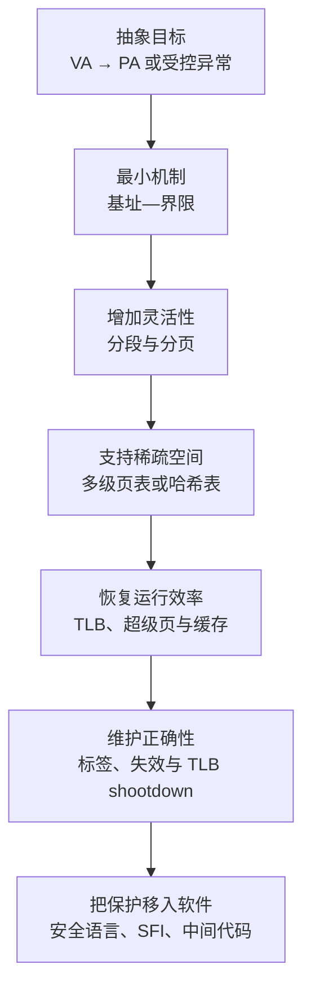

全章始终围绕七个评价目标：

| 目标 | 需要解决的问题 |
|---|---|
| 内存保护 | 阻止进程读取、写入或执行未获授权的区域 |
| 选择性共享 | 只让指定进程共享指定区域，并赋予适当权限 |
| 灵活放置 | 虚拟上连续的数据不必在物理内存中连续 |
| 稀疏地址空间 | 64 位空间绝大部分未使用，转换表不能为每个地址都付费 |
| 运行时效率 | 每次取指、load、store 都要转换，常见路径必须接近普通访存速度 |
| 空间效率 | 页表等元数据不能大到吞噬物理内存 |
| 可移植性 | 内核的逻辑内存模型不能被某一种处理器页表格式完全绑死 |

这些目标彼此冲突：页越小，保护和共享越精细，但页表和 TLB 压力越大；层级越深，稀疏空间越省页表，却让一次未缓存转换需要更多访存；缓存转换越快，修改映射时的一致性协议越昂贵。

### 阅读所需的位运算基础

若页大小为 $P=2^p$ 字节，则地址低 $p$ 位表示页内偏移。对无符号虚拟地址 $v$：

$$
VPN=\left\lfloor\frac{v}{P}\right\rfloor=v\gg p,
$$

$$
offset=v\bmod P=v\ \&\ (P-1).
$$

若页表把 $VPN$ 映射到物理页框号 $PFN$，则

$$
PA=PFN\times P+offset=(PFN\ll p)\mathbin{|}offset.
$$

乘法形式强调“物理页框起点 + 页内偏移”，位拼接形式强调页对齐使低 $p$ 位必为 0。后文所有分页公式都建立在页大小为 2 的幂、页框按页大小对齐这一假设上。

## 8.1 地址转换概念（Address Translation Concept）

### 黑盒定义：转换的是地址，不是数据

对进程标识 $ASID$、虚拟地址 $v$ 和访问类型 $op\in\{read,write,execute\}$，地址转换器可抽象为部分函数：

$$
T(ASID,v,op)=
\begin{cases}
PA, & \text{映射存在且权限允许},\\
	ext{exception}, & \text{映射不存在或权限不允许}.
\end{cases}
$$

转换器检查地址和权限，生成物理地址，随后内存系统才按该物理地址读写原始字节。它不会加密、压缩或改变数据内容。

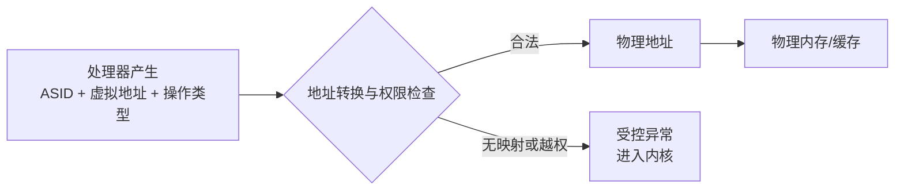

“异常”不一定表示程序有 bug。同一硬件结果可被内核解释为：真正非法访问、页面尚未装入、写时复制的首次写、栈需要增长，或调试器设置的数据断点。硬件只报告事实，软件决定语义。

### 两个地址世界

- **虚拟地址（virtual address, VA）**：进程看到的地址。不同进程的 `0x400000` 可表示完全不同的物理数据。
- **物理地址（physical address, PA）**：内存总线和物理页框使用的真实位置。
- **地址空间（address space）**：某执行上下文可以产生并获准访问的虚拟地址集合及其权限。

同一 VA 可因进程不同映射到不同 PA；不同 VA 也可映射到同一 PA，形成别名或共享。地址转换因此不是一一对应函数，而是带执行上下文和权限的受控关系。

### 设计目标为何都需要转换层

**保护。** 页表权限可令代码页只读/可执行、栈不可执行、内核页用户不可访问。越权操作在真正触碰物理内存前被拦截。

**共享。** 两个页表项可指向同一物理页框：共享代码设为只读执行，共享数据按协议设为读写。共享的是物理表示，不要求两个进程使用相同 VA。

**灵活放置。** 进程看到连续的虚拟矩阵，底层各页可散落在任意空闲页框；内核不再寻找一整块连续物理内存。

**稀疏空间。** 64 位进程可给每条线程预留大栈区、给堆和映射文件留下增长间隔；没有映射的洞不消耗数据页。

**受控介入。** 把映射暂设为 invalid 或只读，内核就能在特定首次访问上获得控制权，而不影响其他地址。这是按需分配、写时复制和断点的共同模式。

### 为什么不能只在编译时确定地址

编译器生成程序时不知道运行时哪块物理内存空闲。相对分支只记录“向前/向后多少”，程序整体移动后仍有效；绝对地址若写死，装到别处就会访问错误位置。

早期系统使用**重定位装载器**：可执行文件带重定位/符号信息，装载器选定物理区域后，逐个修正绝对地址。这解决“放在哪里”，却有局限：

- 程序开始后再移动要重新改写代码和数据；
- 不能在每次访问时检查权限；
- 难以让两个进程选择性共享小区域；
- 无法透明地让某些地址暂时无物理内存。

现代链接仍使用符号与重定位。动态链接库还通过入口表、GOT/PLT 等间接结构在运行时解析地址。区别在于：链接/装载重定位主要解决代码组织，硬件地址转换则持续参与每一次取指和数据访问。

## 8.2 走向灵活的地址转换（Towards Flexible Address Translation）

本节暂时忽略“每次转换会不会太慢”，先逐步增加表达能力。起点是第 2 章的基址—界限。

### 基址—界限：最小可用转换器

每个进程有两个受保护寄存器：`base` 是物理起点，`bound` 是虚拟区域长度。对单字节访问：

$$
PA=base+VA\quad\text{if}\quad 0\le VA<bound.
$$

否则触发异常。若访问长度为 $L$，安全检查不能写成 `VA + L <= bound`，因为无符号加法可能溢出；应检查

$$
VA\le bound\quad\land\quad L\le bound-VA.
$$

假设 `base=0x3000`、`bound=0x1000`：虚拟 `0x0120` 映射到物理 `0x3120`；虚拟 `0x1000` 已越界，因为合法范围是半开区间 $[0,0x1000)$。

上下文切换时，内核装入新进程的 base/bound。用户态必须不能修改它们，否则进程可把 base 指向内核或其他进程。

优点是硬件极简、转换快速；缺点也来自“只有一个区间”：整个进程必须占连续物理内存，代码/数据不能设不同权限，堆栈难以独立增长，共享只能粗粒度进行。

### 8.2.1 分段内存（Segmented Memory）

分段把“一对 base/bound”推广为表。虚拟地址被拆为段号 $s$ 和段内偏移 $d$；段表项包含：

```text
SegmentEntry = {
	valid,
	base,
	bound,
	permissions
}
```

转换规则为

$$
PA=SegmentTable[s].base+d,
$$

前提是表项有效、$d<bound$ 且访问类型满足权限。段号越界、洞、越过段界限或权限不符都会触发异常。

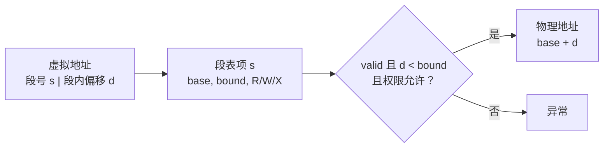

#### 为什么分段比单一基址—界限灵活

代码、只读数据、可写数据、堆和各线程栈可成为独立段：

- 代码段设为读/执行，阻止指针错误改写指令；
- 数据段读写但不可执行；
- 堆与栈可分别拥有增长空间；
- 不存在的段号自然形成虚拟地址洞。

段在物理内存中各自连续，但不同段可放在不同位置。移动一个段只需改它的 base，进程中的相对地址不变。

#### 共享代码与私有数据

两个进程可让代码段表项指向同一只读物理区，让数据/栈段指向不同物理区：

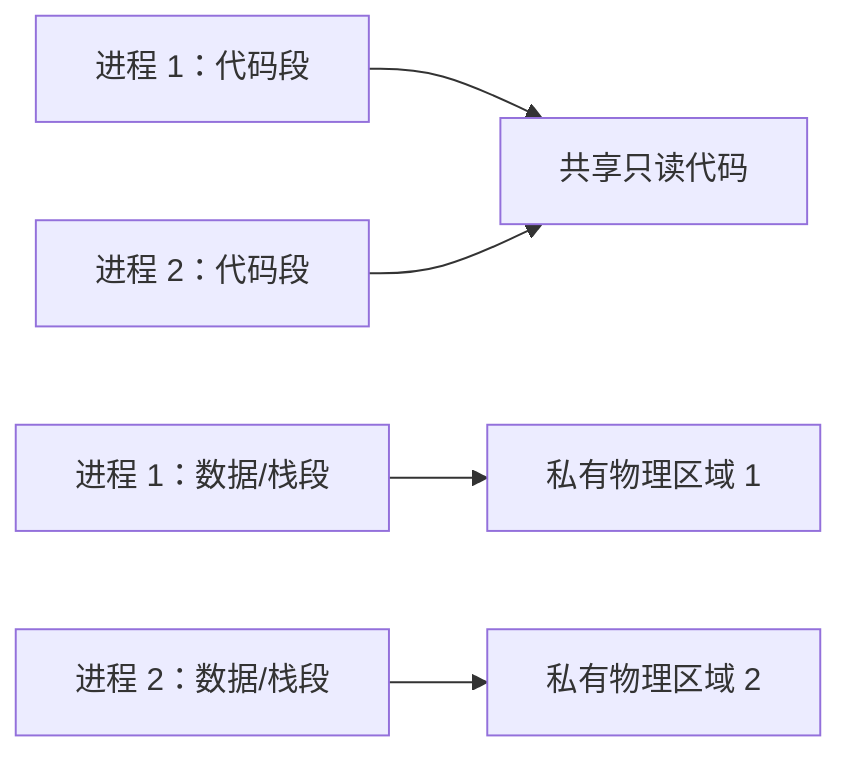

动态库也可用同一思想共享指令，库的可变数据仍按进程私有。若不同进程把库放在不同段号，库代码应使用段内相对地址或通过间接入口定位。

#### 写时复制（copy-on-write）

`fork` 可先复制段表而不复制段内容，并把父子对应段都标为只读。任一方首次写入时：

1. 硬件因写只读段触发异常；
2. 内核判断它是 COW 而非真正只读；
3. 分配新物理区域并复制旧段；
4. 让写入者段表指向新副本并恢复写权限；
5. 重试原指令。

这在语义上产生两个独立副本，成本推迟到真正写入。段级 COW 的问题是粒度太粗：改一个字节可能复制整个大段；分页可把复制缩小到一页。

#### 按引用清零（zero-on-reference）

内核把回收自其他进程的内存交给新进程前必须清零，否则可能泄漏密码等旧数据。与其预先清零进程可能永远不用的巨大堆，内核只开放已清零前缀，把 bound 设在边界。程序首次越过边界时异常，内核清零下一块、扩大 bound，再重试。

它体现共同方法：**先收紧权限制造安全异常，再在慢路径补齐资源。** 前提是异常处理前绝不能让用户读到未清零物理字节。

#### 外部碎片：分段的根本代价

段大小可变，进程创建、增长和退出后，物理内存会形成许多不连续空洞。即使空闲总量足够，也可能找不到一个足够大的连续区域，这叫**外部碎片**。

例如空洞为 4、6、5 MB，总空闲 15 MB，却无法放入 10 MB 段。内核可压缩：移动现有段并修改 base，把空洞合并；但搬运大量内存会暂停或消耗带宽。

预留增长空间会造成浪费，不预留则增长时要整体搬迁。first-fit、best-fit、worst-fit 只能改变碎片模式，不能从根本上消除可变连续分配的问题。

> **版本边界。** x86 历史上支持丰富分段；现代主流 x86-64 用户空间通常采用近似“平坦地址空间”，主要依靠分页保护，分段功能大幅弱化。这里学习分段，是为了理解抽象和组合设计，不应据此推断现代系统仍按每个逻辑对象大量使用硬件段。

### 8.2.2 分页内存（Paged Memory）

分页把虚拟空间切成固定大小的**虚拟页（page）**，把物理内存切成同样大小且对齐的**页框（page frame）**。页表按虚拟页号索引，每个页表项（PTE）记录物理页框号、有效位和权限。

设虚拟地址宽 $v$ 位、物理地址宽 $m$ 位、页大小 $P=2^p$ 字节：

- 页内偏移：$p$ 位；
- 虚拟页号：$v-p$ 位；
- 物理页框号：$m-p$ 位。

转换为

$$
VPN=VA\gg p,
$$

$$
offset=VA\ \&\ (2^p-1),
$$

$$
PA=(PTE[VPN].PFN\ll p)\mathbin{|}offset.
$$

页内偏移原样保留，因为虚拟页和物理页框同样大小、同样对齐。

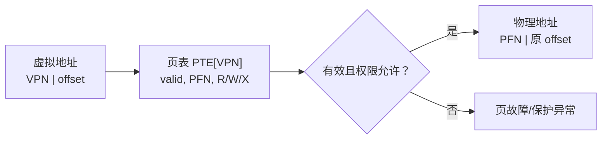

#### 数值例子：32 位地址与 4 KiB 页

$4\ \text{KiB}=4096=2^{12}$ 字节，所以 offset 为 12 位，VPN 为 $32-12=20$ 位。虚拟地址 `0x12345ABC`：

$$
VPN=0x12345,\qquad offset=0xABC.
$$

若 PTE 把 `VPN 0x12345` 映射到 `PFN 0x00FED`，则

$$
PA=(0x00FED\ll12)+0xABC=0x00FEDABC.
$$

地址只决定页表索引和偏移，PTE 才决定物理位置；不能直接从 VPN 猜 PFN。

#### 为什么固定页框消除外部碎片

任何空闲页框都能容纳任何虚拟页，内核只需位图记录每个页框是否空闲。不需要寻找可变大小连续洞，也无需为普通页做物理压缩，因此分页分配不受外部碎片影响。

但会产生**内部碎片**：一个对象最后一页未用满，剩余空间不能直接给另一个独立映射。若对象末端在页内均匀分布，最后一页平均浪费约

$$
E[F]\approx\frac{P}{2}.
$$

这是近似：它假设分配大小对页边界均匀，且每个对象各自占用完整尾页。共享分配器可在同一页放多个小对象，从而改变结论。

#### 页表大小与页大小的冲突

单级页表项数为

$$
N_{PTE}=2^{v-p}.
$$

若每项 $e$ 字节，表大小为

$$
M_{PT}=e\cdot2^{v-p}.
$$

32 位、4 KiB 页、4 字节 PTE：

$$
M_{PT}=4\times2^{20}=4\ \text{MiB/进程}.
$$

64 位、16 KiB 页时，VPN 有 $64-14=50$ 位，平坦页表需要 $2^{50}$ 项。原书排版中的“250 entries”应理解为 $2^{50}$，不是 250 项。即使每项 8 字节，也要

$$
2^{50}\times8=2^{53}\ \text{bytes}=8\ \text{PiB},
$$

显然不可行。增大页可减少 PTE，却增加内部碎片、无用 I/O 和粗粒度保护；多级页表则只为实际使用的稀疏区域分配低层表。

#### 共享、反向映射与按需机制

多个 PTE 指向同一 PFN 即可共享。内核还需要**core map/页框数据库**，从物理页框反查哪些进程、哪些 PTE 映射它，以便回收、修改权限和维护引用计数。

分页可更细粒度地实现：

- **COW**：父子共享只读页，首次写只复制该页；
- **zero-on-reference**：栈/堆未分配页设 invalid，首次访问时分配并清零；
- **fill-on-reference**：程序先运行，缺失代码页首次取指时从文件装入；
- **数据断点**：目标页设只读，写异常后内核/调试器检查具体地址。

这些机制都依赖异常可精确重启：内核处理后，原 load/store/取指必须能安全重新执行。

#### 分页的局限

分页简化物理分配，却引入大而稀疏的页表、每次访存的转换成本、页内浪费、TLB 覆盖限制和共享页的反向映射成本。它不是“比分段绝对更好”，而是把可变连续分配问题换成固定粒度和转换元数据问题。

### 8.2.3 多级转换（Multi-Level Translation）

平坦页表像为整个 64 位编号空间预建一个巨大数组，即使只映射几 MiB，也要为无数 invalid 项付费。稀疏键空间更适合树或哈希表：高层先判断一大片区域是否存在，只有实际使用时才分配低层节点。

现代设计通常在叶层使用固定页框，原因包括：

- 物理空闲空间可用位图管理；
- 页大小是磁盘扇区/块大小的倍数，便于整页传输；
- TLB 可按页缓存转换；
- core map 可按 PFN 建数组并反向查映射；
- 每个叶 PTE 可独立控制保护和共享。

差别主要在于怎样到达叶 PTE：分段后接一层分页、纯多级分页，或分段后再接多级分页。

#### 分页分段（paged segmentation）

虚拟地址分为段号 $s$、段内页号 $q$ 和偏移 $d$：

$$
VA=[s\mid q\mid d].
$$

段表项不再直接给物理段 base，而是给该段页表的物理地址、页表长度和段级权限；页表项再给 PFN 和页级权限：

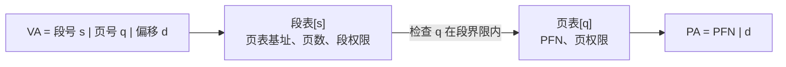

有效权限是沿路径所有权限的交集：即使叶页可写，只读代码段仍不允许写。这允许段级粗保护与页级 COW 同时存在。

假设 32 位 VA、4 KiB 页、4 字节 PTE，把地址拆为 $10+10+12$：高 10 位可作为段号，中 10 位索引该段页表，低 12 位为偏移。每个页表有

$$
2^{10}=1024\ \text{entries},
$$

占用

$$
1024\times4=4096\ \text{bytes}=1\ \text{page}.
$$

一张表恰好一页不是巧合，而是设计时根据页大小和 PTE 大小选择每级索引位数，简化页表分配。

#### 纯多级分页（multi-level paging）

把 VPN 再拆为多段索引。若有 $L$ 级：

$$
VA=[i_1\mid i_2\mid\cdots\mid i_L\mid offset].
$$

页表根寄存器给第 1 级表物理地址；每级表项给下一张表的 PFN，最后一级才给数据 PFN。


只有根表必须存在。若某个高层表项 invalid，它覆盖的整片虚拟空间都不需要低层页表。设一张页表大小 $P$ 字节、PTE 大小 $e$ 字节，则每表项数

$$
E=\frac{P}{e},
$$

每级可贡献的索引位数（当 $E$ 为 2 的幂）为

$$
b=\log_2 E=\log_2\frac{P}{e}.
$$

虚拟地址宽 $v$、页偏移 $p=\log_2 P$ 位，需要覆盖 $v-p$ 个 VPN 位，所以最少层数

$$
L=\left\lceil\frac{v-p}{b}\right\rceil.
$$

这条公式将在练习 5、10 中直接使用。若最高层不满，可只使用少于 $b$ 位；若硬件只实现 64 位地址中的一部分，也应以**实际实现的虚拟地址位数**代入。

#### 多级页表为何节省稀疏空间

32 位、4 KiB 页、4 字节 PTE 的两级页表采用 $10+10+12$。根表固定 4 KiB；每张叶表映射

$$
1024\times4\ \text{KiB}=4\ \text{MiB}
$$

连续虚拟空间。一个只在地址 0 使用 64 KiB 的进程只需根表 4 KiB 加一张叶表 4 KiB，总 8 KiB，而非平坦页表的 4 MiB。

节省来自不为未使用的 4 MiB 区域分配叶表。代价是一次 TLB miss 要依次读根表、叶表，再读数据；层级越深，未缓存 page walk 越贵。

#### 分页分段与多级分页的关系

两者都形成树。分页分段的顶层条目带有明确逻辑对象语义和可变界限；纯多级分页的顶层通常只按地址位均匀划分。前者便于按代码/堆/栈管理，后者结构规则、硬件遍历简单。内核即使运行在纯分页硬件上，也常在软件中保留“内存对象/区域”这一逻辑分段视图。

#### x86 32 位示例

本书把 x86 描述为分段加两级分页：段选择子先经描述符表得到线性地址空间和段权限，32 位线性地址再拆为：

```text
31            22 21            12 11             0
+----------------+----------------+----------------+
| 目录索引 10 位 | 页表索引 10 位 | 页内偏移 12 位 |
+----------------+----------------+----------------+
```

- 目录 1024 项 × 4 B = 4 KiB；
- 每张叶页表 1024 项 × 4 B = 4 KiB；
- 每个叶 PTE 映射 4 KiB；
- 每个目录项覆盖 4 MiB；
- 整张目录覆盖 $1024\times4$ MiB = 4 GiB。

上下文切换需要换当前地址空间的页表根（以及实际使用的段状态），TLB 还必须 flush 或按 ASID/PCID 区分。

> **术语边界。** x86 有 GDT 和 LDT；GDT 通常是系统范围的描述符表，LDT 可提供进程特有描述符。不同操作系统的使用方式不同。理解重点是“段选择子 → 描述符 → 线性地址 → 多级页表 → 物理地址”，不应把某个历史实现的 GDT/LDT 组织当作永恒规定。

#### x86-64 与超级页入口

本书所处时代常见 x86-64 实现使用 48 位 canonical VA、4 KiB 页和四级页表。典型拆分为

$$
9+9+9+9+12=48\ \text{bits}.
$$

8 字节 PTE、一页 4096 字节，故每表

$$
4096/8=512=2^9
$$

项，恰好每级 9 位。一个叶表页映射

$$
512\times4\ \text{KiB}=2\ \text{MiB},
$$

再上一级条目覆盖

$$
512\times2\ \text{MiB}=1\ \text{GiB}.
$$

若 2 MiB 或 1 GiB 虚拟区间在物理上连续且对齐，中间表项可直接成为大页叶节点，跳过后续层级。

48 位共有 $2^{48}=256$ TiB canonical 地址编码范围；传统实现把低/高 canonical 半区各留约 128 TiB 给用户/内核等用途。新处理器可支持更多级和更多 VA 位，因此“四级、48 位”是具体代际方案，不是 x86-64 的永久上限。

#### 多级转换的适用边界

多级页表特别适合**地址空间大但映射稀疏**的进程。若几乎整个空间都密集映射，所有低层表最终都要存在，树指针还增加额外开销；反向页表或其他结构可能更省空间。树还要求硬件固定理解表格式，给跨架构内核带来可移植性问题。

### 8.2.4 可移植性（Portability）

内核通常要维护两种不同但相关的视图：

1. **硬件视图**：处理器能快速遍历的特定格式页表，只含 PFN、valid、权限、use/dirty 等架构字段；
2. **软件语义视图**：某区域来自可执行文件、共享库、匿名堆、COW、映射文件，invalid 是真正非法还是尚未装入，read-only 是永久限制还是临时捕获写入。

若把所有语义硬塞进硬件 PTE，既可能没有足够软件位，也会让内核绑定某一架构。较稳妥的设计是让软件结构成为真相，按需生成硬件可执行的保守映射。

### 软件内存管理的三组数据

**内存对象/区域列表。** 记录虚拟区间、后备对象、权限和策略。例如：代码来自哪个文件偏移，匿名页是否 COW，映射文件是否共享。它回答“这段地址是什么”。

**虚拟到物理映射。** 页故障和系统调用复制用户缓冲时，内核要从 `(进程, VA)` 找到 PFN 及软件状态。invalid PTE 可能对应：

- 真正非法洞；
- 页面在磁盘、尚未装入；
- zero-on-reference 尚未分配；
- guard page；
- 暂时撤权以模拟 use/dirty 位。

**物理到虚拟反向映射（core map）。** 从 PFN 找到所有 `(进程, VPN, PTE)`。共享页被回收或降权时，内核必须更新所有引用并让相关 TLB 失效。

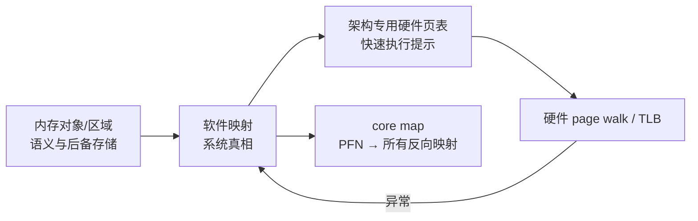

### 软件表不必长得像硬件表

一种策略是让内核软件结构模仿主要目标架构的多级树，生成硬件表简单，但移植到结构差异大的处理器更麻烦。另一种策略是使用架构无关的树、区间结构或哈希表，再由硬件抽象层填充目标页表。

**反向页表（inverted page table）**按 `(ASID/内存对象 ID, VPN)` 哈希，表大小主要与物理页框数而非虚拟页数成比例：

```text
InvertedEntry = {
	address_space_or_object_id,
	virtual_page_number,
	physical_frame_number,
	permissions
}
```

查询必须同时匹配身份和 VPN；只匹配 VPN 会把另一进程同地址的页当成本进程页。哈希冲突可链式或再哈希解决。

优势是超大稀疏 VA 下空间近似 $O(物理页框数)$；局限是：

- 哈希冲突使查找不再固定步数；
- 从一段连续 VA 枚举映射不如树自然；
- 共享、别名和每页多个反向引用需要额外结构；
- 不适合直接把哈希槽强行等同物理页框，否则两个常用 VPN 冲突时只能来回搬页，形成严重抖动。

### 硬件页表为何可以是“提示”

若软件映射是真相，硬件页表可只缓存其**保守子集**。形式上，令软件允许的访问关系为 $A_S$，硬件当前允许关系为 $A_H$，安全条件是

$$
A_H\subseteq A_S.
$$

硬件少给权限最多引发一次异常，内核查软件真相后补上；硬件多给权限则可能直接越过保护，无法靠异常纠正。因此：

- 软件允许、硬件暂不允许：安全但可能慢；
- 软件不允许、硬件仍允许：安全漏洞或正确性错误。

这解释了后文的不对称规则：增加权限时旧 TLB 更严格，可暂不失效；减少权限时旧 TLB 更宽松，必须先清除。

### 可移植层的代价

两套结构会增加内存、更新同步和调试复杂度。每次映射变化要维护软件对象、硬件表、core map 和 TLB 一致性。软件加载 TLB 的架构可只维护一套便携结构，却把 TLB miss 变成内核 trap；硬件 page walk 更快，却要求内核生成处理器规定的表。没有零代价方案，选择取决于 miss 频率、硬件复杂度和可移植目标。

## 8.3 走向高效的地址转换（Towards Efficient Address Translation）

多级页表节省了空间，却使一次未缓存转换需要读多级表。四级页表若每级都访问 DRAM，再加最终数据访问，一条 load 可能产生 5 次内存访问；取指也有同样问题。逻辑上再灵活的方案，若每条指令都慢数倍就不可用。

作者的策略不是放弃多级表，而是利用局部性建立快路径：绝大多数访问命中 TLB/缓存，只有少数 miss 执行完整转换。优化必须保持**语义透明**：命中和不命中应得到相同 PA 与权限，非法访问仍必须异常。

### 8.3.1 转换后备缓冲器（Translation Lookaside Buffer, TLB）

TLB 是处理器附近的小型转换缓存。典型条目为：

```text
TLBEntry = {
	ASID/PCID,
	virtual_page_number,
	physical_frame_number,
	permissions,
	page_size,
	valid
}
```

给定 VA，硬件并行/组相联匹配 `(当前 ASID, VPN)`：

- **TLB hit**：直接取得 PFN 和权限，拼接 offset；
- **TLB miss**：执行硬件 page walk 或陷入软件 miss handler，取得 PTE 后填入 TLB；
- **保护异常**：即使 VPN 命中，访问类型仍需通过权限检查。TLB 不是绕过保护，而是缓存保护决定。

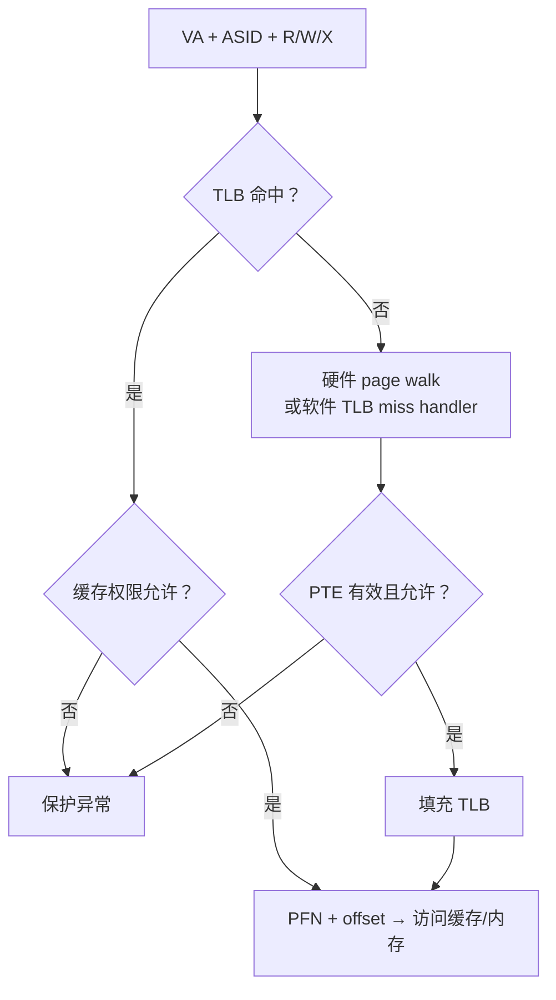

#### 为什么 TLB 命中率通常很高

一条 4 KiB 页内可容纳上千条短指令或许多数据元素。顺序执行、循环和连续数组访问会对同一 VPN 连续产生大量引用。TLB 缓存的是整页转换，不是单字节地址；一次 miss 的 page walk 成本可由后续数百次 hit 摊销。

TLB 常有多级并拆成指令/数据 TLB。一级小而快，二级较大；全相联匹配灵活但比较器多，组相联用较少比较器换取可能的冲突 miss。

#### 平均转换成本

设：

- $t_{TLB}$：每次必付的 TLB 查找成本；
- $t_{walk}$：TLB miss 后完整转换的额外成本；
- $h=P(hit)$：TLB 命中率。

则平均**转换本身**成本为

$$
E[T_{translate}]
=h\,t_{TLB}+(1-h)(t_{TLB}+t_{walk})
=t_{TLB}+(1-h)t_{walk}.
$$

若还要计算最终数据访存 $t_{data}$，且它不能与转换并行：

$$
E[T_{access}]=t_{TLB}+t_{data}+(1-h)t_{walk}.
$$

不同教材对 $t_{walk}$ 是否包含最终数据访问定义不同，代入前必须先对齐口径。

例如 TLB 查找 1 ns、完整页表查找额外 40 ns，希望平均转换不超过 2 ns：

$$
1+(1-h)40\le2,
$$

$$
1-h\le\frac1{40}=0.025,
$$

$$
h\ge0.975=97.5\%.
$$

这正是练习 1 的计算。若把 40 ns 定义为“miss 的总成本而非额外成本”，公式会改成 $h\cdot1+(1-h)40$；题目明确说 full lookup overhead，采用前一种解释更自然。

#### TLB reach（覆盖范围）

若有 $n$ 个普通页条目、页大小 $P$，TLB 同时直接覆盖的虚拟内存约为

$$
Reach=nP.
$$

256 项、4 KiB 页只能覆盖

$$
256\times4\ \text{KiB}=1\ \text{MiB}.
$$

工作集远大于 TLB reach 且跨页访问时，即使数据缓存足够大，也会频繁发生转换 miss。增大 TLB、使用超级页或改善数据布局都可提高 reach。

#### 硬件 page walk 与软件加载 TLB

**硬件加载。** TLB miss 时，处理器按固定格式遍历页表。优点是无内核模式切换，且页表本身可命中 L1/L2/L3 缓存；缺点是硬件复杂、内核必须维护架构规定格式。

**软件加载。** TLB miss 触发快速异常，内核按自己的便携结构查映射并写 TLB。优点是页表结构自由、软件真相与硬件表不必双重维护；缺点是 trap、保存状态和 handler 通常比硬件 walk 贵得多。

选择取决于 miss 率与硬件/软件复杂度。TLB hit 路径对两者完全相同；只有稀有 miss 路径不同。

#### TLB 不是普通数据缓存

TLB 缓存的是“地址与权限”，陈旧条目可能让进程写本应只读的页或访问已分给别人的页，属于安全错误。因此页表更新不仅要改内存中的 PTE，还要显式处理所有可能缓存旧转换的 TLB。

### 8.3.2 超级页（Superpages）

超级页/大页把一段连续、对齐的虚拟页映射到同样连续、对齐的物理页框，并用一个 TLB 条目覆盖整段。

若大页大小 $P_s=2^s$，地址低 $s$ 位都是大页内偏移；TLB 只匹配高位大页号。2 MiB 页有 21 位 offset，1 GiB 页有 30 位 offset。

#### 覆盖收益

同样 256 个 TLB 条目：

| 页大小 | TLB reach |
|---:|---:|
| 4 KiB | 1 MiB |
| 2 MiB | 512 MiB |
| 1 GiB | 256 GiB |

一个 8 MiB 帧缓冲用 4 KiB 页需 2048 个转换，用 2 MiB 页只需 4 个。按行存储的图像画竖线时，每次像素可能落在不同 4 KiB 页；大页可避免 TLB 持续抖动。大型矩阵、数据库内存池和虚拟机内存也常受益。

#### 为什么必须虚拟和物理都连续对齐

一个 TLB 条目只保存大页基址并原样保留低 $s$ 位。若物理页框不连续，低位不能直接复用；若基址未按 $2^s$ 对齐，基址与 offset 会重叠。大页因此要求：

$$
VA_{base}\bmod P_s=0,
$$

$$
PA_{base}\bmod P_s=0,
$$

并且整段物理连续。

#### 大页的代价

- **内部碎片**：只用大页中很小部分也占完整页框；
- **外部连续性压力**：运行一段时间后很难找到连续 1 GiB 物理区域，可能需内存压缩/迁移；
- **I/O 放大**：按需换入/清零可能处理大量不会使用的数据；
- **保护粒度变粗**：大页内不能给不同 4 KiB 子页不同权限，COW 一次可能复制更大区域；
- **延迟抖动**：后台合并/拆分大页、清零大页会产生暂停。

因此现代系统常混合页大小：热点连续大区域使用大页，稀疏、细粒度保护或小对象使用普通页。大页不是“页越大越好”，而是用物理连续性和粒度换 TLB reach。

### 8.3.3 TLB 一致性（TLB Consistency）

页表是真相，TLB 是副本。内核修改 PTE 后，旧 TLB 可能继续被处理器使用。要维持保护，必须处理三类变化：地址空间切换、权限/映射更新、多核副本。

#### 进程上下文切换：同一 VPN 不同含义

进程 A 和 B 都可能使用 `VPN 0x123`，却映射不同 PFN。若切换后仍误用 A 的无标签 TLB 条目，B 会读取 A 的数据。

两种方案：

1. **切换时 flush TLB**：简单安全，但新进程要重新 warm up；
2. **tagged TLB**：条目带 ASID/PCID，匹配时同时比较当前地址空间 ID，旧进程条目可保留待下次复用。

ASID 数量有限并会回绕。重用某 ASID 给新地址空间前，内核必须确保旧同标签条目已清除；标签减少 flush，不能消除生命周期管理。

#### 增加权限与减少权限为何不对称

设软件允许集合为 $A_S$，TLB 缓存允许集合为 $A_T$。安全要求 $A_T\subseteq A_S$。

**增加权限**，如 invalid→read 或 read→read/write：旧 TLB 只会更严格。访问新权限时可能多触发一次异常/miss，内核重新填充即可；不会让不允许的操作成功。因此可延迟失效（具体架构和并发协议仍可能要求同步）。

**减少权限或改变 PFN**，如 read/write→read、valid→invalid、旧 PFN→新 PFN：旧 TLB 比新政策更宽松或指向错误数据。必须在相关执行继续前清除，否则用户可绕过 COW、写只读页或访问已回收页。

典型安全顺序为：

1. 在页表中发布更严格的新 PTE；
2. 执行架构要求的内存屏障；
3. 让所有可能使用旧条目的 CPU 失效该 `(ASID, VPN)`；
4. 等待确认；
5. 之后才能复用物理页框或依赖新权限。

如果先复用页框再 shootdown，另一 CPU 可通过旧 TLB 写入新所有者的数据，形成 use-after-free 型安全漏洞。

#### 多核 TLB shootdown

每个核心通常只能直接失效自己的 TLB。修改共享地址空间的 CPU 必须向其他可能运行该地址空间的 CPU 发送核间中断（IPI）：

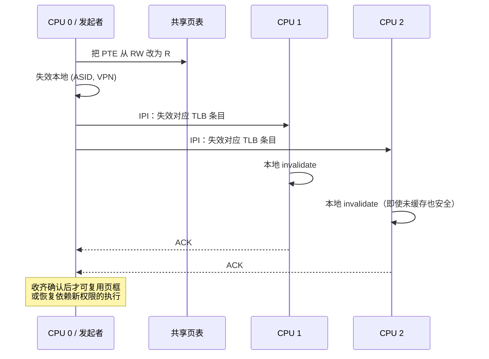

发起者通常不知道哪个远端 TLB 真含条目，只能根据“哪些 CPU 可能运行过该地址空间”的掩码发送。成本随目标 CPU 数增长，包含 IPI、流水线打断、锁/屏障和后续 TLB miss。

优化包括批量失效多个页、只通知相关 CPU、按地址失效而非全 flush、延迟回收（在确认前不复用页框），以及硬件辅助一致性。批处理降低 IPI 次数，却延长权限变化完成时间，是吞吐和延迟的权衡。

#### TLB shootdown 与普通缓存一致性不同

数据缓存通常由硬件一致性协议监测物理地址读写；TLB 条目不一定记录“它来自哪一个 PTE 的物理地址”，绝大多数普通 store 又不是改页表。让每次 store 都检查是否影响转换会非常昂贵，所以操作系统显式维护 TLB 一致性。

### 8.3.4 虚拟地址缓存（Virtually Addressed Caches）

若先等 TLB 生成 PA 再查一级数据缓存，转换延迟会落在关键路径上。虚拟地址缓存可直接用 VA 索引，在 TLB 查找同时取数据；TLB 并行提供权限和物理身份验证。

现代常见折中是 **VIPT（virtually indexed, physically tagged）**：页内低位在 VA 与 PA 中相同，可立即索引 cache set；TLB 同时产生物理 tag，返回时比较物理 tag 并检查权限。这兼得低延迟与物理一致性。

#### homonym：同一 VA、不同物理页

两个进程都有 VA `0x4000`，但映射不同 PFN。纯虚拟 tag 缓存若不区分进程，切换后可能返回前一进程数据。解决方式是：

- cache tag 加 ASID；
- 切换时 flush；
- 使用物理 tag 验证。

这与 TLB 上下文切换问题本质相同。

#### synonym/alias：不同 VA、同一物理页

共享内存可在进程 A 的 `0x4000` 和进程 B 的 `0x9000` 指向同一 PFN。纯 VA 缓存可能保存两份副本；A 修改自己的副本后，B 的别名仍旧，产生不一致。

解决思路包括：

- 使用物理 tag，写入时按 PA 参与硬件一致性；
- 限制共享页的虚拟地址“颜色”，使别名落入兼容 set；
- OS 在建立/拆除别名时显式 flush；
- 设计 cache 容量、组相联度和页内索引位，使索引不使用 VPN 位。

#### VIPT 无别名容量约束

设页大小 $P$、cache 为 $A$ 路组相联、总容量 $C$、cache line 大小 $B$。set 数为

$$
Sets=\frac{C}{AB}.
$$

索引需要 $\log_2 Sets$ 位，line offset 需要 $\log_2 B$ 位。若两者全部位于页内 offset，则

$$
\log_2 Sets+\log_2 B\le\log_2 P,
$$

等价于

$$
\frac{C}{A}\le P,
$$

或

$$
C\le AP.
$$

例如 4 KiB 页、8 路 cache，天然无 synonym set 歧义的 VIPT 容量上限为 32 KiB。这解释为什么一级 cache 常为几十 KiB，而更大二/三级 cache 改用物理地址。

#### 权限为何仍由 TLB 决定

即使虚拟 cache 命中并提前读出数据，也必须等 TLB 确认当前 ASID 的映射和权限。cache hit 不能让写只读页或执行 NX 页成功。硬件可投机取数，但越权结果不能提交或对架构状态可见。

### 8.3.5 物理地址缓存（Physically Addressed Caches）

物理地址缓存先取得 PA，再用它索引/匹配。不同 VA 指向同一 PA 时自然归并为一份缓存身份，避免 synonym；进程切换也不需因 VA 重用而 flush 普通物理 cache。

典型层级：

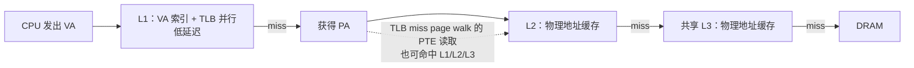

物理 cache 有双重收益：普通数据访问比 DRAM 快；TLB miss 时，页表本身也在物理内存中，page walker 读取的各级 PTE 很可能命中 cache，因此“四级页表”不等于每次 miss 都真的访问 DRAM 四次。

### 虚拟与物理缓存对比

| 维度 | 虚拟地址缓存 | 物理地址缓存 |
|---|---|---|
| 查找时机 | 可与 TLB 并行，延迟低 | 通常需先得到 PA |
| 进程同 VA | 需 ASID/flush/物理 tag | PA 不同自然区分 |
| 多 VA 别名 | 可能产生重复副本 | 同 PA 自然统一 |
| 容量 | 通常较小、靠近核心 | 可做得较大、多级共享 |
| 权限 | 必须与 TLB 协同 | 仍由 TLB/页表决定 |

真实处理器是组合设计，不宜简单说“L1 就是纯虚拟、L2 就是纯物理”。关键分析问题是：索引用哪些位、tag 用哪种地址、TLB 与 cache 是否并行、别名和权限怎样保持正确。

## 8.4 软件保护（Software Protection）

硬件地址转换几乎无处不在，但它通常只在进程/虚拟机等较粗边界上工作。浏览器进程内部要运行网页脚本，内核内部可能运行包过滤器或可扩展模块，数据库和编辑器要加载插件；若每个小扩展都新建进程，IPC、状态共享和切换成本可能太高。

软件保护要解决的问题是：**让不可信代码在同一硬件地址空间中接近原生速度运行，同时不能读写可信区域、跳过检查或执行特权操作。**

最通用但最慢的方法是解释每条机器指令：取指、解码、检查地址、模拟执行。实用方案尝试把检查静态化、批量化或只保留无法证明安全的运行时检查。

### 为什么已有硬件保护还需要软件层

- **应用内部隔离**：网页、插件和扩展共享宿主进程，但彼此与宿主需要边界；
- **内核内部隔离**：驱动/过滤器在内核态运行，传统用户/内核页权限不能限制同特权级代码；
- **可移植执行环境**：统一运行时可屏蔽底层 OS/ISA 差异；
- **更细粒度策略**：语言的对象、模块、能力可比页粒度更精细；
- **硬件/软件权衡**：研究哪些保护必须硬件完成，哪些可由编译器和验证器承担。

它通常与硬件形成纵深防御，而非替代关系：脚本运行时限制脚本；浏览器进程的硬件沙箱再限制整个浏览器；虚拟机还可继续包住操作系统。

### 8.4.1 单一语言操作系统（Single Language Operating Systems）

如果系统只执行一种经过精心设计的安全语言，语言本身可禁止表达危险行为：没有任意整数转指针、数组访问检查边界、控制流只能到合法函数/基本块、对象引用不能伪造。若编译器、解释器和运行时正确，不可信程序就无法产生越界地址。

严格地说，语言安全要建立以下不变量：

1. 每个运行时引用都指向当前存活、类型兼容且获准访问的对象；
2. 每次控制转移只到合法入口，不能跳入指令中间或可信函数检查之后；
3. 非可信代码不能直接执行特权指令；
4. 调用可信库时，参数和返回值满足边界协议。

#### 小型受限语言：内核包过滤器

内核允许用户下载过滤程序检查网络包，但过滤器与内核同处特权态。可通过限制语言保证：

- 只能读取当前包范围内字段；
- 只能调用白名单 helper；
- 禁止任意指针和特权指令；
- 禁止循环或证明循环有界，确保一定终止；
- 指令数和栈空间有上限。

程序短、指令集简单时，解释或验证成本可接受。现代 eBPF 等系统扩展了这一思路，但具体 verifier 和 JIT 规则随版本变化；核心仍是“先验证安全，再以内核上下文高效执行”。

#### JavaScript 与浏览器

网页提供脚本，浏览器解释/JIT 执行，并只暴露受控 DOM、网络和存储 API。脚本不能直接构造裸指针或任意调用浏览器内部函数；非法操作应抛出语言异常。

真正的攻击面不只在脚本语言：

- 解释器/JIT 自身可能有内存安全漏洞；
- 可信原生库接收恶意参数，边界检查不完整；
- API 策略可能过宽，如错误允许跨站读取凭据；
- 推测执行、侧信道和资源耗尽不一定被类型安全阻止。

因此“脚本是内存安全语言”不等于浏览器绝对安全。浏览器还会用进程隔离、站点沙箱、最小权限和操作系统硬件保护缩小逃逸后果。

#### 垃圾回收为何与软件保护相关

移动/压缩式 GC 会把对象从地址 $x$ 搬到 $y$，并更新所有合法引用。若程序可隐藏、伪造或对指针做任意算术，GC 无法知道所有引用，移动后程序会崩溃。

反过来，能进行精确移动 GC 的语言运行时已经掌握“哪些值是合法引用、它们指向哪个对象”，这正是隔离任意内存访问所需的信息。类型安全引用同时服务内存管理和保护。

但 GC 主要防 use-after-free/dangling pointer，不自动保证授权：一个合法引用若被错误传给不应访问该对象的模块，仍是逻辑安全漏洞。

#### 单语言系统与可信计算基

Xerox Alto 的 Mesa、Lisp Machine、Smalltalk 系统探索了用安全语言编写应用乃至 OS。编译为原生机器码可比解释更快，库也可用安全语言实现。

代价是必须信任：

- 语言规范没有允许危险行为；
- 编译器/JIT 正确保持类型和控制流；
- 运行时、GC 和可信库没有漏洞；
- 外部设备、汇编和 FFI 边界做防御性检查。

“同一种安全语言”也不会消除信任边界：用户模块调用内核服务时，内核仍不能因类型相同就相信业务权限。后继系统同时使用硬件隔离，体现纵深防御。

#### 跨站脚本不是简单的内存越界

XSS 常利用网站把攻击者输入当脚本返回给其他用户。恶意脚本在浏览器看来可能完全符合 JavaScript 类型规则，却在被信任站点的来源权限下读取 cookie/令牌并发送出去。

这说明：

- 内存安全解决“代码能否越过对象/地址边界”；
- 同源策略、CSP、输出编码解决“脚本获得什么 Web 权限”；
- 安全策略错误不能仅靠地址检查修复。

### 8.4.2 语言无关的软件故障隔离（Software Fault Isolation）

程序员希望使用 C、C++、Rust、Fortran 等不同语言，操作系统又不可能信任所有编译器。软件故障隔离（SFI）直接约束最终机器码：无论源语言是什么，只要经过重写和验证，就只能在指定代码/数据沙箱内行动。

为便于说明，设沙箱数据合法半开区间为

$$
[D_{base},D_{limit}),
$$

代码合法区间为

$$
[C_{base},C_{limit}).
$$

#### 数据访问检查

每个 load/store 的地址 $a$、长度 $L$ 必须满足

$$
a\ge D_{base},
$$

$$
L\le D_{limit}-a.
$$

第二式避免检查 `a+L` 时整数溢出。概念化重写为：

```text
if a < data_base: trap
if length > data_limit - a: trap
store/load [a]
```

检查和访存之间必须不可被不可信控制流跳过，地址寄存器也不能在检查后被异步修改。单线程指令序列中寄存器不会自己改变，但信号、共享内存和 JIT 自修改代码都会扩大威胁模型。

另一类实现用地址掩码强制归入沙箱，例如沙箱大小为 $2^k$ 且对齐：

$$
a' = D_{base}\mathbin{|}(a\ \&\ (2^k-1)).
$$

这样任何 $a$ 都落在沙箱内，分支更少；代价是越界被静默回绕而非异常，且要求幂次大小与对齐。

#### 控制流检查为何更难

直接相对跳转和静态函数调用可在加载时验证目标。间接跳转、函数指针和 `return` 的目标来自寄存器/内存，必须确保：

1. 位于代码沙箱；
2. 是合法指令边界；
3. 不能落在某段 load/store 检查之后、危险指令之前；
4. 只能进入允许的可信调用门。

x86 指令变长，跳进一条指令中间可能把后半字节解码成完全不同指令。常见方案把代码按固定大小 bundle 对齐，所有间接目标必须是 bundle 起点；验证器线性反汇编，确认不存在绕过检查或自修改代码。

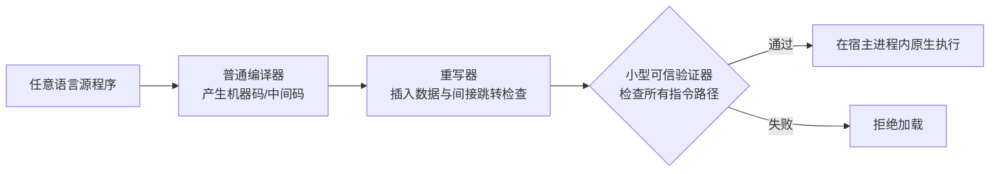

安全不应只信任可能复杂的重写器。更稳妥的是让一个较小验证器检查最终代码；即使重写器有 bug，未满足模式也不能加载。可信计算基因此从“所有源语言编译器”缩小到 ISA、验证器、运行时调用门和宿主。

#### 先保证正确，再消除冗余检查

逐 load/store 插检查正确但昂贵。控制流和数据流分析可证明部分检查多余：

- **循环不变量**：循环前验证整个 `[base, base+n)` 范围，循环体内固定步长访问不再逐次检查；
- **跨过程证明**：调用者已验证参数范围，被调函数可复用前置条件；
- **返回保护**：证明返回地址不可被修改，或用影子栈保护；
- **边界合并**：相邻多次访问由一次覆盖整个区间的检查保护。

删除检查必须以证明为依据。优化失败的后果不只是性能下降，而可能移除安全边界，因此验证器应重新检查最终机器码，而不是盲信编译器注解。

#### 用二进制重写实现用户态虚拟机

没有硬件虚拟化支持时，可扫描/翻译客户内核机器码：

- 把开关中断等敏感指令改为调用用户态 VMM；
- 把客户页表操作改为维护受控影子结构；
- 把客户用户程序放入另一个 SFI 沙箱；
- 系统调用/异常通过受控跳板回到客户内核模拟器。

从客户视角仍像运行在物理机上。局限是动态生成代码、精确异常、自修改代码和难以识别的敏感指令会让二进制翻译复杂；现代硬件虚拟化减少了这些需求，但动态二进制翻译仍用于兼容与优化。

#### SFI 的边界

SFI 主要约束直接内存和控制流，不自动防：

- CPU/内存耗尽；
- 合法 API 的恶意使用；
- 侧信道和微架构泄漏；
- 宿主验证器/JIT 漏洞；
- 共享内存中的高层竞态。

还需资源配额、能力系统、系统调用过滤、硬件进程隔离等补充。

### 8.4.3 基于中间代码的沙箱（Sandboxes Via Intermediate Code）

直接重写每种 ISA 的机器码困难：x86、ARM 的指令编码、寄存器和异常语义都不同。另一条路线是让各语言编译器输出统一中间表示（IR/bytecode），运行时验证 IR，再为当前机器 JIT/AOT 生成受保护代码。

中间代码像一台简化的抽象机器：

- 指令边界明确，不会跳到变长指令中间；
- load/store、调用和类型信息显式；
- 可携带“此指针已证明在对象内”等注解；
- 验证器可独立重新推导/检查证明；
- 后端只需为每种真实 ISA 实现一次。

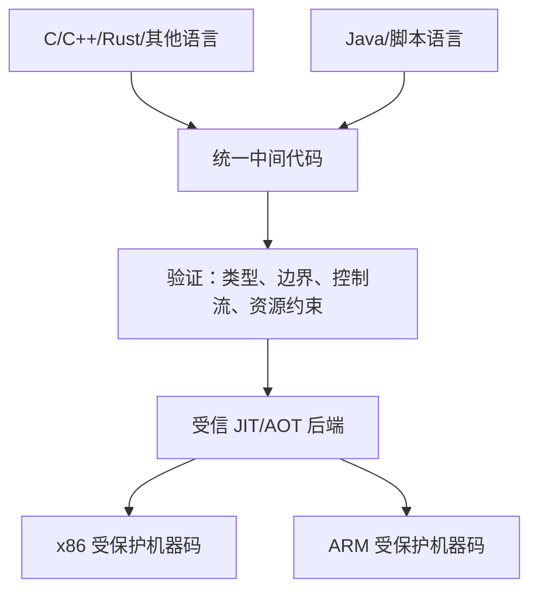

Java bytecode/JVM 是典型思路：加载时验证栈类型、分支目标和对象访问，再解释或 JIT。多个源语言可编译到同一 bytecode，因此它可成为语言无关沙箱；但 IR 的语义若为 Java 对象模型设计，表达 C/Fortran 的裸内存布局和指针算术会不自然或低效。

#### 为什么“验证证明”比“信任产生证明者”更容易

生成优化后的安全代码要搜索复杂数据流，编译器很大；检查一个随代码附带的类型/范围证明，通常只需重放局部规则。类似数学证明：找到证明可能难，逐步核验更简单。

因此可以不信任所有语言前端，只信任较小验证器和代码生成后端。前端注解错了会被拒绝，而不是变成沙箱逃逸。

#### 中间代码方案的代价

- JIT 增加启动延迟、内存与攻击面；
- 统一 IR 可能无法自然表达每种语言/硬件特性；
- FFI 进入原生库重新跨越信任边界；
- 验证保证取决于 IR 类型系统和规则覆盖范围；
- 动态语言需要运行时检查，不能全靠静态验证。

硬件页表、SFI 和 bytecode 的共同本质都是**地址与控制流的中介**。差别在于检查发生在硬件每次访问、重写后的机器指令，还是加载/JIT 阶段。

## 8.5 总结与未来方向

地址转换把程序的地址世界与物理内存解耦。最初目的是隔离内核和进程，后来同一机制支撑共享库、IPC、按需装入、COW、映射文件、虚拟内存、零拷贝、检查点和虚拟机。

本章的核心设计演进是：

1. **基址—界限**用最小硬件提供整体重定位和粗保护；
2. **分段**给逻辑区域独立 base/bound/权限，却产生可变连续分配和外部碎片；
3. **分页**用固定页框消除外部碎片，换来内部碎片和巨大平坦页表；
4. **多级转换**只为稀疏空间的已用分支分配页表，换来更长 page walk；
5. **TLB 与多级 cache**把常见转换变成片上命中，超级页扩大覆盖；
6. **标签与 shootdown**负责缓存转换的安全一致性；
7. **软件保护**证明同类约束可由语言、机器码重写或 IR 验证实现。

没有一项机制单独满足全部目标。现代系统通常是两层结构：灵活但较慢的多级转换作为真相/后备，快速 TLB 处理常见路径；软件语义结构再位于硬件页表之上，解释每个异常为何发生。

未来趋势会继续放大三组矛盾：

- **更大地址空间**需要更深页表，也促使更大 TLB 和大页；
- **更多处理器**使 TLB shootdown 成本上升，批处理、硬件一致性或软件边界更有吸引力；
- **应用内不可信代码**推动更细粒度用户级沙箱和硬件/软件协同保护。

最重要的方法论是：先定义允许的访问关系，再选表示；先建立正确的慢路径，再用缓存/证明创造快路径；每引入一个缓存或提示，都必须回答它何时失效、失效前谁还能看到旧权限。

## 用 C++ 验证关键机制

下面程序使用 C++17。当前环境没有 C/C++ 编译器，因此未做本地编译；公式和输出已用独立计算复核。示例只模拟地址元数据，不读取真实物理内存。

### 实验一：分页分段地址转换器

采用练习 12 的格式：32 位 VA = 4 位段号 + 12 位页号 + 16 位偏移。物理页框大小因此是 $2^{16}=64$ KiB。

```cpp
#include <cstdint>
#include <iomanip>
#include <iostream>
#include <optional>
#include <string>
#include <vector>

struct PageTableEntry {
	bool valid = false;
	std::uint16_t frame = 0;
	bool readable = false;
	bool writable = false;
	bool executable = false;
};

struct SegmentEntry {
	bool valid = false;
	std::vector<PageTableEntry> pages;
	bool readable = false;
	bool writable = false;
	bool executable = false;
};

enum class Access { Read, Write, Execute };

bool allows(bool read, bool write, bool execute, Access access) {
	switch (access) {
		case Access::Read: return read;
		case Access::Write: return write;
		case Access::Execute: return execute;
	}
	return false;
}

std::optional<std::uint32_t> translate(
	const std::vector<SegmentEntry>& segments,
	std::uint32_t virtual_address,
	Access access,
	std::string& error
) {
	constexpr std::uint32_t OFFSET_BITS = 16;
	constexpr std::uint32_t PAGE_BITS = 12;
	constexpr std::uint32_t OFFSET_MASK = (1u << OFFSET_BITS) - 1;
	constexpr std::uint32_t PAGE_MASK = (1u << PAGE_BITS) - 1;

	std::uint32_t segment_number = virtual_address >> 28;
	std::uint32_t page_number =
		(virtual_address >> OFFSET_BITS) & PAGE_MASK;
	std::uint32_t offset = virtual_address & OFFSET_MASK;

	if (segment_number >= segments.size() ||
		!segments[segment_number].valid) {
		error = "invalid segment";
		return std::nullopt;
	}

	const SegmentEntry& segment = segments[segment_number];
	if (!allows(segment.readable, segment.writable,
				segment.executable, access)) {
		error = "segment permission denied";
		return std::nullopt;
	}

	if (page_number >= segment.pages.size() ||
		!segment.pages[page_number].valid) {
		error = "invalid page";
		return std::nullopt;
	}

	const PageTableEntry& page = segment.pages[page_number];
	if (!allows(page.readable, page.writable, page.executable, access)) {
		error = "page permission denied";
		return std::nullopt;
	}

	/* PA = (PFN << 16) | offset。 */
	return (static_cast<std::uint32_t>(page.frame) << OFFSET_BITS) |
		   offset;
}

PageTableEntry rwPage(std::uint16_t frame) {
	return PageTableEntry{true, frame, true, true, false};
}

void test(
	const std::vector<SegmentEntry>& segments,
	std::uint32_t virtual_address
) {
	std::string error;
	auto physical = translate(
		segments, virtual_address, Access::Read, error
	);

	std::cout << "VA 0x" << std::hex << std::setw(8)
			  << std::setfill('0') << virtual_address << " -> ";
	if (physical.has_value()) {
		std::cout << "PA 0x" << std::setw(8) << *physical << '\n';
	} else {
		std::cout << error << '\n';
	}
}

int main() {
	std::vector<SegmentEntry> segments(16);

	segments[0].valid = true;
	segments[0].readable = segments[0].writable = true;
	segments[0].pages = {
		rwPage(0xCAFE), rwPage(0xDEAD),
		rwPage(0xBEEF), rwPage(0xBA11)
	};

	segments[1].valid = true;
	segments[1].readable = segments[1].writable = true;
	segments[1].pages = {
		rwPage(0xF000), rwPage(0xD8BF), rwPage(0x3333)
	};

	test(segments, 0x00000000);
	test(segments, 0x20022002);
	test(segments, 0x10015555);
}
```

编译运行：

```bash
c++ -std=c++17 -O2 address_translate.cpp -o address_translate
./address_translate
```

示例输出：

```text
VA 0x00000000 -> PA 0xcafe0000
VA 0x20022002 -> invalid segment
VA 0x10015555 -> PA 0xd8bf5555
```

程序严格对应

$$
segment=VA[31:28],\quad page=VA[27:16],\quad offset=VA[15:0],
$$

以及

$$
PA=(PFN\ll16)\mathbin{|}offset.
$$

它还展示段权限与页权限的交集，而不仅是查表算地址。

### 实验二：页表几何、最优页大小与矩阵 TLB miss

```cpp
#include <cmath>
#include <cstdint>
#include <iomanip>
#include <iostream>

std::uint64_t ceilDivide(std::uint64_t numerator,
						 std::uint64_t denominator) {
	return (numerator + denominator - 1) / denominator;
}

int ceilLog2(std::uint64_t value) {
	int bits = 0;
	std::uint64_t power = 1;
	while (power < value) {
		power <<= 1;
		++bits;
	}
	return bits;
}

int main() {
	constexpr std::uint64_t PAGE_SIZE = 4096;
	constexpr std::uint64_t PTE_SIZE = 8;
	constexpr int VIRTUAL_BITS = 64;

	int offset_bits = ceilLog2(PAGE_SIZE);          // 12
	std::uint64_t entries_per_table = PAGE_SIZE / PTE_SIZE;
	int index_bits = ceilLog2(entries_per_table);   // 9
	int vpn_bits = VIRTUAL_BITS - offset_bits;      // 52
	int levels = static_cast<int>(
		ceilDivide(vpn_bits, index_bits)
	);

	std::cout << "entries/table = " << entries_per_table << '\n'
			  << "index bits/level = " << index_bits << '\n'
			  << "VPN bits = " << vpn_bits << '\n'
			  << "levels = " << levels << "\n\n";

	/* 练习 11：H(P)=P/2 + 4*E[S]/P，E[S]=2 GiB。 */
	long double mean_segment = std::ldexp(1.0L, 31);
	long double optimal_page = std::sqrt(8.0L * mean_segment);
	std::cout << "optimal page size = "
			  << static_cast<std::uint64_t>(optimal_page) / 1024
			  << " KiB\n\n";

	/* 练习 6 的解析计数，避免真的执行 1024^3 次模拟。 */
	constexpr std::uint64_t N = 1024;
	std::uint64_t b_misses = N * N * N;
	std::uint64_t a_misses = N;
	std::uint64_t c_misses = N;
	std::uint64_t code_and_stack_misses = 2;
	std::uint64_t total = b_misses + a_misses +
						  c_misses + code_and_stack_misses;

	std::cout << "matrix TLB misses = " << total << '\n';
}
```

示例输出：

```text
entries/table = 512
index bits/level = 9
VPN bits = 52
levels = 6

optimal page size = 128 KiB

matrix TLB misses = 1073743874
```

`levels=ceil((64-12)/9)=6` 对应练习 5/10；128 KiB 对应练习 11；最后一项对应练习 6 的

$$
1024^3+1024+1024+2.
$$

### 实验三：溢出安全的软件沙箱范围检查

```cpp
#include <cstddef>
#include <cstdint>
#include <iomanip>
#include <iostream>
#include <limits>

bool isInsideSandbox(
	std::uintptr_t address,
	std::size_t length,
	std::uintptr_t base,
	std::uintptr_t limit
) {
	if (base > limit || address < base || address > limit) {
		return false;
	}

	/* 不计算 address + length，避免在最大地址附近溢出回绕。 */
	return length <= limit - address;
}

void show(std::uintptr_t address, std::size_t length) {
	constexpr std::uintptr_t BASE = 0x1000;
	constexpr std::uintptr_t LIMIT = 0x2000;  // 合法区间 [1000, 2000)
	std::cout << "address=0x" << std::hex << address
			  << ", length=0x" << length << " -> "
			  << (isInsideSandbox(address, length, BASE, LIMIT)
					  ? "allowed" : "rejected")
			  << '\n';
}

int main() {
	show(0x1800, 0x100);
	show(0x1F80, 0x100);

	std::uintptr_t near_max =
		std::numeric_limits<std::uintptr_t>::max() - 7;
	show(near_max, 16);
}
```

示例输出：

```text
address=0x1800, length=0x100 -> allowed
address=0x1f80, length=0x100 -> rejected
address=0xfffffffffffffff8, length=0x10 -> rejected
```

第三例专门说明为什么不能只检查 `address + length <= limit`：该加法可能越过无符号最大值后回绕成小数，错误通过检查。

## 章末练习详解

### 练习 1：分页是否会遭受外部碎片

**错误。** 纯分页把物理内存划成等大的页框，任何虚拟页都能放入任何空闲页框。只要空闲页框数量足够，就无需寻找一段连续的大空洞，因此不存在分段式外部碎片。

分页仍可能有：

- **内部碎片**：对象尾页没有用满；
- **页表空间开销**：为映射和权限保存 PTE；
- **大页连续性问题**：若请求 2 MiB/1 GiB 超级页，确实可能找不到连续对齐页框，但这是大页分配的连续性压力，不是普通固定 4 KiB 页的外部碎片。

### 练习 2：分页分段系统在进程切换时改什么

内核不需要复制或逐项改写页表，只需切换“当前地址空间的根”：

1. 当前段表的基址与长度寄存器，或架构中的段描述符上下文；
2. 若段表项指向该进程各段的页表，换段表根就间接换了所有页表；
3. TLB 必须全 flush，或把当前 ASID/PCID 改为新进程标签；
4. 若架构缓存了当前段描述符，也要装入新进程对应缓存状态。

逻辑上要切的是“地址空间身份 + 根指针”，而不是把物理页框内容换掉。实际 x86 上段表、CR3 页表根和 PCID 的组织比书中抽象更具体，答案应以目标架构为准。

### 练习 3：三级 SPARC 页表在进程切换时改什么

纯多级分页只需：

- 把硬件页表根寄存器改为新进程的第一级页表物理地址；
- flush 无标签 TLB，或切换到新 ASID；
- 恢复该进程其他普通执行状态。

二、三级页表由根表可达，不需要分别写硬件寄存器。与分页分段相比，没有额外段表根要换。

### 练习 4：分段 + 分页相对两种纯方案的优势

**相对纯分页的优势：**

1. 段直接对应代码、堆、栈、共享库等逻辑对象，内核更容易按对象管理生命周期；
2. 段级 bound 可精确表达对象长度，不必只靠一串 valid PTE 表示边界；
3. 段级权限/共享可一次覆盖整个区域，再由页级权限细化；
4. 整段共享、独立增长或撤销时，可操作较少的高层元数据；
5. 段内相对地址便于同一对象放到不同虚拟位置。

纯多级分页也能用软件 VMA 模拟这些语义，因此这里主要是硬件/表示上的直接性，而非不可替代能力。

**相对纯分段的优势：**

1. 段不必占连续物理内存，消除普通段分配的外部碎片和压缩；
2. 固定页框可用位图快速分配与回收；
3. 页大小适合磁盘块传输和 demand paging；
4. 可按页 COW、共享、装入、换出，只修改一页不必复制整段；
5. 页级权限提供更细保护和数据断点；
6. core map 可按 PFN 建数组，高效反向查找。

组合方案仍有多级查表和页表空间成本，因此后续必须依靠 TLB。

### 练习 5：64 位物理/虚拟地址、4 KiB 页的 PTE 与层数

**a. 字段位宽。**

$4$ KiB $=2^{12}$，64 位物理地址中低 12 位是 offset，所以 PFN 需要

$$
64-12=52\ \text{bits}.
$$

概念模型的最小控制字段可取：

| 字段 | 位数 | 必要性 |
|---|---:|---|
| 物理页框号 PFN | 52 | 必需 |
| valid/present | 1 | 必需，区分映射与无映射 |
| readable | 1 | 逻辑权限；有些 ISA 由 present 隐含 |
| writable | 1 | 必需于读写保护 |
| executable | 1 | 必需于 W^X/NX 等保护，可编码为 execute-disable |
| accessed/use | 1 | 可选；用于近似 LRU，可由异常模拟 |
| dirty/modified | 1 | 可选；用于判断是否写回，可由只读异常模拟 |

具体 ISA 还可能有 cache 模式、global、用户/内核、页大小、软件自用位等。题目没有规定编码，不能把某款 x86 的全部位当作唯一答案。

**b. 最小项大小。** 按 52 位 PFN + 4 位基本 valid/R/W/X，共

$$
52+4=56\ \text{bits}=7\ \text{bytes}.
$$

若按题目要求向上取**偶数字节数**，得到 8 bytes。若只问紧凑无对齐编码，原始下界是 7 bytes；真实硬件通常采用 8 字节，便于幂次索引和原子读写。

**c. 页表层数。** 8 字节 PTE 时，每张 4 KiB 页表有

$$
4096/8=512=2^9
$$

项，每级索引 9 位。VPN 一共

$$
64-12=52\ \text{bits},
$$

所以

$$
L=\left\lceil\frac{52}{9}\right\rceil=6.
$$

五级只能覆盖 $45$ 个 VPN 位，不够；六级可覆盖 54 位，最高层实际只需 7 位。即便把 7 字节 PTE 紧凑塞表，为保持 2 的幂索引，一页最多方便地放 512 项，结论仍为 6 级。

### 练习 6：矩阵乘法的 TLB miss 数

数组是 C 行优先布局，每个 `float` 4 bytes，一行有 1024 个元素：

$$
1024\times4=4096\ \text{bytes}=1\ \text{page}.
$$

假设 `a[i,k]` 表示 `a[i][k]`，并按源代码内存访问分析，不考虑编译器把值长期留在寄存器。

对固定 $(i,j)$，内层 $k=0\ldots1023$：

- `a[i][k]` 顺序访问 A 的第 $i$ 行，始终同一页；
- `c[i][j]` 始终位于 C 的第 $i$ 行同一页；
- `b[k][j]` 每次换到 B 的第 $k$ 行，因此依次访问 1024 个不同页；
- 代码一页、栈一页，并在循环中频繁使用。

TLB 8 项中，代码、栈、当前 A 行、当前 C 行占 4 项，只剩约 4 项保存 B 行。B 的循环长度 1024，LRU 在下一次回到 B 第 0 行前早已将它淘汰，所以**每次 B 访问都 miss**：

$$
Miss_B=1024\times1024\times1024=1024^3=2^{30}.
$$

A 每换一个 $i$ 才换页，共

$$
Miss_A=1024.
$$

C 同理：

$$
Miss_C=1024.
$$

初始代码和栈各 miss 一次，之后因频繁访问保持热：

$$
Miss_{code+stack}=2.
$$

总计

$$
Miss_{total}=2^{30}+2\times1024+2
=1{,}073{,}743{,}874.
$$

难点在 `b[k][j]`：矩阵按行存储，固定列、改变行会以 4 KiB 步长跳页。若改循环顺序、转置 B 或分块矩阵乘法，使小块工作集适合 TLB/cache，miss 可大幅下降。若编译器把 `c[i][j]` 累加值保存在寄存器，具体 C 访问次数变化，但 B 的主导 $2^{30}$ miss 结论不变。

### 练习 7：哪些状态属于 TCB、PCB 或两者都不是

| 项目 | 归属 | 原因 |
|---|---|---|
| a. 页表指针 | PCB | 同进程线程共享地址空间；切进程时换根 |
| b. 页表本体 | 两者都不是（由 PCB 引用） | 通常是独立的内核内存结构，不内嵌在 PCB |
| c. 栈指针 | TCB | 每线程有自己的调用栈和 SP |
| d. 段表本体 | 两者都不是（逻辑上属进程） | 独立地址空间结构，PCB 保存引用/根 |
| e. ready list | 两者都不是 | 它是调度器全局/每 CPU 数据结构；TCB 可含链表节点 |
| f. CPU 寄存器 | TCB | 暂停线程时保存其执行上下文 |
| g. 程序计数器 | TCB | 每线程独立执行位置 |

这里区分“对象逻辑属于谁”和“字节是否直接嵌在控制块”。某些内核可能把小段表或部分架构状态内嵌，具体布局可变；抽象上，地址空间由进程共享，执行寄存器由线程独有。

### 练习 8：画出 32 位 Intel 的段表和页表

按本书抽象，转换分两阶段：段选择子查描述符得到段 base/limit/权限，再用 32 位段内/线性地址走两级页表。

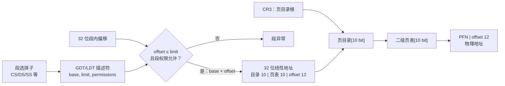

位图：

```text
段阶段： selector ──> descriptor(base, limit, R/W/X)

分页阶段（32 位线性地址）：
31            22 21            12 11             0
+----------------+----------------+----------------+
| 页目录索引 10  | 二级表索引 10  | 页内偏移 12   |
+----------------+----------------+----------------+
```

每张表 1024 项，每项 4 bytes，恰好 4 KiB。一个目录项覆盖 4 MiB，整张目录覆盖 4 GiB。

> **架构精确性说明。** 真实 IA-32 中段描述符产生线性地址，CR3 是独立页目录根；描述符本身通常不直接“指向该段专属页表”。上图将本书“多级分页分段”的逻辑与真实寄存器关系结合表达。现代 OS 常采用平坦段，让主要隔离由分页完成。

### 练习 9：画出 64 位 Intel 的段表和页表

按本书时代常见 48 位 canonical 地址、4 KiB 页和四级分页：

```text
47        39 38        30 29        21 20        12 11       0
+-----------+-----------+-----------+-----------+------------+
| L4 9 bit  | L3 9 bit  | L2 9 bit  | L1 9 bit  | offset 12  |
+-----------+-----------+-----------+-----------+------------+
```

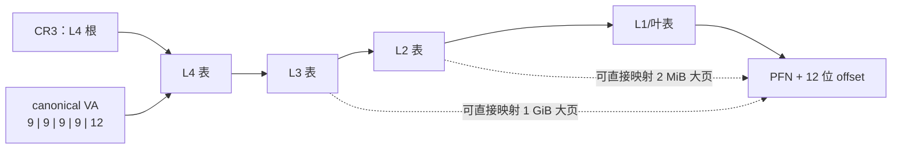

每张表 512 项、PTE 8 bytes，仍恰好 4 KiB。段机制在 64 位长模式下大幅弱化，常用近似平坦段；FS/GS base 等仍有用途。处理器代际可支持五级分页和更多 VA 位，四级图是本书所讨论配置。

### 练习 10：PTE 向上取 2 的幂时的大小与层数

练习 5 得到最小概念字段共 56 bits = 7 bytes。向上取 2 的幂字节数：

$$
PTEsize=8\ \text{bytes}.
$$

于是每页表 $4096/8=512=2^9$ 项，每级 9 位；VPN 为 52 位：

$$
L=\left\lceil\frac{52}{9}\right\rceil=6.
$$

最高一级只用 7 位，其余五级各 9 位：

$$
7+5\times9+12=64.
$$

注意这是“完整覆盖全部 64 位 VA”的理论答案。实际 x86-64 若只实现 48 或 57 位 VA，所需层数分别更少。

### 练习 11：什么页大小使平均总开销最小

设：

- 段最大长度 $M=4$ GiB $=2^{32}$ bytes；
- 实际段长 $S\sim Uniform(0,M)$，所以 $E[S]=M/2$；
- 页大小为 $P$ bytes；
- 每个 PTE 为 $e=4$ bytes。

**平均内部碎片。** 段末尾在页内位置近似均匀，平均尾页浪费

$$
F(P)\approx\frac{P}{2}.
$$

**平均页表空间。** 映射 $S$ 字节需约 $S/P$ 个 PTE，故

$$
T(P)\approx e\frac{E[S]}{P}
=4\frac{M/2}{P}
=\frac{2M}{P}.
$$

若精确使用 $\lceil S/P\rceil$，在 $M$ 是 $P$ 整数倍时只多一个与优化位置几乎无关的常数约 2 bytes；连续近似足够。

总平均开销：

$$
H(P)=\frac{P}{2}+\frac{2M}{P}.
$$

求导：

$$
H'(P)=\frac12-\frac{2M}{P^2}.
$$

令 $H'(P)=0$：

$$
\frac12=\frac{2M}{P^2},
$$

$$
P^2=4M=4\times2^{32}=2^{34},
$$

$$
P=2^{17}\ \text{bytes}=128\ \text{KiB}.
$$

二阶导

$$
H''(P)=\frac{4M}{P^3}>0,
$$

因此是最小值。此时两类开销相等：

$$
P/2=64\ \text{KiB},\qquad 2M/P=64\ \text{KiB},
$$

总平均约 128 KiB。

这个答案只优化题目给出的“尾页浪费 + PTE 空间”。真实页大小还受 TLB reach、page fault I/O、COW 放大、缓存、页表层级和物理连续性影响，所以现代普通页并不因此都应设为 128 KiB。

### 练习 12：4/12/16 位分页分段的地址翻译

格式为：

```text
31        28 27                  16 15                 0
+-----------+----------------------+--------------------+
| segment 4 | page number 12       | offset 16          |
+-----------+----------------------+--------------------+
```

所以

$$
s=VA[31:28],\quad q=VA[27:16],\quad d=VA[15:0],
$$

$$
PA=(PFN\ll16)\mathbin{|}d.
$$

**a. `0x00000000`。**

$$
s=0,\quad q=0x000,\quad d=0x0000.
$$

段 0 指向 Page Table A，A[0] = `0xCAFE`：

$$
PA=0xCAFE0000.
$$

**b. `0x20022002`。** 高 4 位 $s=2$，段表只有 0、1 有效，因此：

```text
invalid virtual address
```

无需继续查看 page/offset；高层 invalid 已覆盖整片地址。

**c. `0x10015555`。**

$$
s=1,\quad q=0x001,\quad d=0x5555.
$$

段 1 指向 Page Table B，B[1] = `0xD8BF`：

$$
PA=0xD8BF5555.
$$

结果与前面的 C++ 转换器示例一致。

### 练习 13：10/10/12 两级页表的空间核算

物理地址 40 位，页内 offset 12 位，所以 PFN 需要 28 位；再加 4 个保护位刚好 32 位 = 4 bytes，符合题设。

**a. 页大小。**

$$
P=2^{12}=4096\ \text{bytes}=4\ \text{KiB}.
$$

每张页表：

$$
2^{10}\times4=4096\ \text{bytes}=4\ \text{KiB}.
$$

每张二级表映射

$$
2^{10}\times4\ \text{KiB}=4\ \text{MiB}.
$$

**b. 地址 0 起的 64 KiB。** 需要

$$
64\ \text{KiB}/4\ \text{KiB}=16
$$

个数据页，全部位于同一个 4 MiB 顶层区间。因此页表空间为：

- 一级根表：4 KiB，使用 1 个目录项；
- 一张二级表：4 KiB，使用 16 个 PTE；
- 总分配：8 KiB。

64 KiB 恰好是页大小整数倍，**数据尾页内部碎片为 0**。

若题目把“已分配页表中未用的槽”也称内部浪费：

$$
root\ unused=(1024-1)\times4=4092\ \text{bytes},
$$

$$
leaf\ unused=(1024-16)\times4=4032\ \text{bytes},
$$

共 8124 bytes。也就是说 8192 bytes 页表空间中只有 $(1+16)\times4=68$ bytes 是有效条目。

**c. 三个稀疏段。**

- code：48 KiB = 12 pages，起点 `0x01000000`，目录索引 $0x01000000/4\text{ MiB}=4$；
- data：600 KiB = 150 pages，起点 `0x80000000`，目录索引 512；
- stack：64 KiB = 16 pages，起点 `0xF0000000`，目录索引 960。

三者落在不同 4 MiB 区间，需要三张二级表：

$$
M_{tables}=4\ \text{KiB}+3\times4\ \text{KiB}=16\ \text{KiB}.
$$

三个段大小都正好为 4 KiB 的倍数，因此数据尾页内部碎片仍为 0。

若计页表槽浪费：根表用 3 项，三张叶表共用

$$
12+150+16=178
$$

项：

$$
root\ unused=(1024-3)\times4=4084\ \text{bytes},
$$

$$
leaf\ unused=(3\times1024-178)\times4=11576\ \text{bytes},
$$

总未使用 15660 bytes；16 KiB 页表中有效条目只占 $(3+178)\times4=724$ bytes。这个例子正说明多级页表虽避免为整个 4 GiB 分配平坦表，稀疏小段仍会各自占一整张叶表。

### 练习 14：两级分页分段翻译伪代码

下面选择与练习 12 相同的 4/12/16 格式，并显式处理长度和权限。`physicalRead` 表示内核/硬件按物理地址读取表项。

```text
constants:
	SEGMENT_BITS = 4
	PAGE_BITS = 12
	OFFSET_BITS = 16
	PAGE_SIZE = 1 << OFFSET_BITS
	PAGE_MASK = (1 << PAGE_BITS) - 1
	OFFSET_MASK = PAGE_SIZE - 1

enum Access { READ, WRITE, EXECUTE }

SegmentEntry:
	valid: bool
	pageTableBase: physical address
	pageCount: unsigned integer
	permissions: bitset {R, W, X}

PageEntry:
	valid: bool
	frameNumber: 16-bit unsigned integer
	permissions: bitset {R, W, X}

function translate(virtualAddress, length, access):
	segment = virtualAddress >> (PAGE_BITS + OFFSET_BITS)
	page = (virtualAddress >> OFFSET_BITS) & PAGE_MASK
	offset = virtualAddress & OFFSET_MASK

	# 范围不能跨出当前页；跨页请求应逐页翻译。
	if length > PAGE_SIZE - offset:
		raise CROSS_PAGE_ACCESS

	segmentEntry = currentSegmentTable[segment]
	if not segmentEntry.valid:
		raise INVALID_SEGMENT
	if access not allowed by segmentEntry.permissions:
		raise SEGMENT_PROTECTION_FAULT
	if page >= segmentEntry.pageCount:
		raise SEGMENT_BOUND_FAULT

	pteAddress = segmentEntry.pageTableBase +
				 page * sizeof(PageEntry)
	pageEntry = physicalRead(pteAddress)

	if not pageEntry.valid:
		raise PAGE_FAULT
	if access not allowed by pageEntry.permissions:
		raise PAGE_PROTECTION_FAULT

	physicalAddress = (pageEntry.frameNumber << OFFSET_BITS) |
					  offset
	return physicalAddress
```

若一次系统调用缓冲跨页，不能只翻译首地址；必须把 `[VA, VA+length)` 按页切分，逐页检查映射和权限，并使用 `length <= limit-address` 形式避免溢出。真实硬件通常每条 load/store 自己处理跨 cache line/page 的细节，内核复制用户缓冲则必须显式处理整段范围。

## 易混淆概念与常见误解

**虚拟地址不是“假的、不能用的地址”。** 它是进程指令实际产生的架构地址，只是必须结合地址空间上下文转换后才能访问物理内存。

**页（page）与页框（page frame）不同。** 页属于虚拟地址空间，页框属于物理内存；PTE 建立两者映射。日常资料常把两者都简称 page，推导时必须区分 VPN 与 PFN。

**分页不等于虚拟内存。** 分页是一种地址转换与固定粒度分配机制；虚拟内存通常特指把不驻留页放在磁盘/其他后备存储、按需换入的抽象。系统可分页但不换页。

**TLB miss 不等于 page fault。** TLB miss 只表示转换缓存未命中；page walk 若找到有效 PTE，填 TLB 后继续。只有 PTE invalid/权限不符等才进入异常路径。

**page fault 不一定是错误。** 它可能表示按需装入、COW、栈增长或 use/dirty 位模拟；只有软件语义判断真正非法时才向进程报告崩溃。

**“segmentation fault” 不证明机器使用硬件分段。** UNIX 名称沿用至今，现代系统中它通常泛指非法虚拟内存访问，底层可能完全由分页检测。

**分页消除外部碎片，不消除所有浪费。** 固定页框避免寻找连续洞，却有尾页内部碎片、页表空间和大页连续性成本。

**页越大不一定越快。** 大页扩大 TLB reach、减少页表层级和 I/O 次数，却增加内部碎片、清零/换入/COW 放大并降低保护粒度。

**多级页表不让页表“免费”。** 根表始终存在；每个相隔很远的小映射可能额外占一整张叶表。它将成本从“整个 VA 大小”降到“已使用树分支数量”。

**虚拟连续不代表物理连续。** 跨虚拟页边界的数据结构可落在完全不同的 PFN；DMA 或超级页若要求物理连续，需要额外分配/IOMMU机制。

**同一虚拟地址不表示共享。** 两个进程的同一 VPN 可指向不同 PFN；反之，不同 VA 可指同一 PFN，形成共享别名。

**PTE 不是 TLB 条目。** PTE 位于页表内存中，是后备/真相的一部分；TLB 条目是处理器缓存的转换副本。改 PTE 后旧 TLB 不会自动消失。

**ASID 不能消除所有 TLB flush/shootdown。** 它避免进程切换时清空其他标签，却仍需在映射撤销、权限收紧和 ASID 回绕复用时失效相关条目。

**增加权限无需立即 shootdown 是一种保守提示原则，不是无条件 API。** 从安全集合看，旧条目更严格不会越权；具体架构的 page-walk cache、同步顺序和并发约定仍必须遵守。

**COW 不是一开始就复制。** `fork` 时共享物理页并降为只读；首次写才异常、分配和复制。未写页可一直共享。

**read-only 不说明软件意图唯一。** 它可能是真正常量、COW、数据断点或 dirty 位模拟。硬件 PTE 不足以解释异常，内核要查软件映射状态。

**虚拟地址 cache 命中不能绕过 TLB 权限。** 数据可并行读出，但在 TLB 确认当前地址空间映射与权限前，结果不能提交。

**软件保护不等于没有可信代码。** 它把信任集中到编译器/验证器/JIT/运行时与调用门；这些组件的 bug 仍可造成逃逸。通常还要用硬件进程隔离作第二层。

**内存安全不等于完整安全策略。** 安全语言可阻止越界指针，却不能自动阻止合法 API 窃取数据、资源耗尽、XSS 权限滥用或侧信道。

### 公式速查与成立条件

| 公式 | 含义 | 成立条件 |
|---|---|---|
| $VPN=VA\gg p$ | 取虚拟页号 | 页大小 $2^p$ |
| $offset=VA\ \&\ (2^p-1)$ | 取页内偏移 | 页大小/页框按 $2^p$ 对齐 |
| $PA=(PFN\ll p)\mathbin{|}offset$ | 拼物理地址 | PTE 有效且权限允许 |
| $N_{PTE}=2^{v-p}$ | 平坦页表项数 | $v$ 位完整 VA、页大小 $2^p$ |
| $M_{PT}=e2^{v-p}$ | 平坦页表空间 | 每项固定 $e$ bytes |
| $b=\log_2(P/e)$ | 一页页表的索引位数 | $P/e$ 为 2 的幂 |
| $L=\lceil(v-p)/b\rceil$ | 覆盖完整 VA 的最少层数 | 每级一页、每项同尺寸 |
| $E[T]=t_{TLB}+(1-h)t_{walk}$ | 平均转换成本 | $t_{walk}$ 是 miss 额外成本 |
| $Reach=nP$ | 普通页 TLB 覆盖 | $n$ 项、统一页大小 $P$ |
| $C\le AP$ | VIPT 索引不越过页内位的容量约束 | cache 容量 $C$、$A$ 路、页大小 $P$ |
| $H(P)\approx P/2+eE[S]/P$ | 尾页 + 页表平均开销 | 段尾在页内近似均匀、平坦段页表 |

任何地址公式前都应先写位宽、页大小、PTE 大小和字段定义。相同“64 位机器”可只实现 48/57 位 VA，也可有不同页大小和层数，不能脱离配置背答案。

## 全章方法论总结

本章的价值不只是记住“分段、分页、TLB”三个名词，而是展示怎样从一个简单抽象逐层解决冲突。

**一、先把机制当黑盒定义语义。** 地址转换只承诺合法访问得到指定 PA、非法访问触发异常。数组、树、哈希、硬件或软件都只是实现选择。

**二、从最小机制出发，用反例增加复杂度。** 基址—界限不能独立保护/共享区域，于是加入分段；分段有外部碎片，于是固定页框；平坦分页表在 64 位空间爆炸，于是引入多级稀疏树。

**三、先追求表达能力，再单独恢复性能。** 多级页表的 page walk 很贵，但直接删掉层级会失去稀疏能力。TLB 用局部性缓存结果，让复杂慢路径和简单快路径同时存在。

**四、每加一层缓存，都立即追问一致性。** tagged TLB 解决地址空间同名，shootdown 解决权限/映射变化，多核确认保证旧权限不再被任何核心使用。

**五、把“更严格的提示”与“更宽松的漏洞”区分。** 硬件表/TLB 比软件真相更严格时只会多异常；更宽松会直接越权。因此权限增加和减少有不对称更新成本。

**六、将硬件视图与软件语义解耦。** PTE 的 invalid/read-only 不足以说明意图，内存对象和软件映射才知道它是非法、未装入、COW 还是断点。可移植层让硬件表成为可重建提示。

**七、用同一思想比较硬件和软件保护。** 页表在每次访存前检查；SFI 把检查插入机器码；安全语言/IR 则限制可表达程序并在加载时验证。它们都在维护“数据地址和控制流只能落在授权集合”的不变量。

**八、始终明确优化的交换条件。** 大页以粒度换 reach，软件 TLB 以 miss trap 换页表自由，虚拟 cache 以别名复杂度换低延迟，SFI 以代码膨胀/验证换进程内隔离。

阅读后续内存章节时，可以继续追问：谁拥有真相？谁只是缓存？怎样制造异常获得控制？旧映射何时才真正无人使用？这四个问题会反复出现在 demand paging、映射文件、零拷贝、虚拟机和检查点中。

## 复习检查清单

- [ ] 能用 $T(ASID,VA,op)$ 描述地址转换与异常。
- [ ] 能区分虚拟地址、物理地址、VPN、PFN 和 offset。
- [ ] 能写出溢出安全的半开区间范围检查。
- [ ] 能解释基址—界限的公式、优点和粗粒度局限。
- [ ] 能按段号/偏移完成分段翻译并检查 bound/权限。
- [ ] 能解释段共享、段级 COW、zero-on-reference 和外部碎片。
- [ ] 能由页大小推导 offset、VPN、PFN 位数。
- [ ] 能手算 PTE 查表与物理地址拼接。
- [ ] 能区分内部碎片与外部碎片。
- [ ] 能推导平坦页表项数与空间。
- [ ] 能由页大小/PTE 大小推导每级索引位数和页表层数。
- [ ] 能画出分页分段、纯多级分页和 x86 32/64 位路径。
- [ ] 能说明多级页表为何节省稀疏空间、何时仍浪费叶表。
- [ ] 能区分软件内存对象、硬件页表和 core map。
- [ ] 能解释反向页表的键、空间优势和哈希冲突问题。
- [ ] 能说明为何硬件允许关系必须是软件真相的子集。
- [ ] 能推导 TLB 平均转换成本和要求的命中率。
- [ ] 能计算 TLB reach，并分析超级页的收益与代价。
- [ ] 能区分 TLB miss、page fault 和保护异常。
- [ ] 能解释 ASID/tagged TLB 如何支持上下文切换。
- [ ] 能说明权限增加与减少为何失效要求不同。
- [ ] 能画出多核 TLB shootdown 的更新、IPI、ACK 顺序。
- [ ] 能解释 homonym、synonym/alias 和 VIPT 容量约束。
- [ ] 能比较虚拟地址 cache 与物理地址 cache。
- [ ] 能说明页表自身为何也能被物理 cache 加速。
- [ ] 能比较安全语言、SFI 和中间代码沙箱的可信边界。
- [ ] 能说明 SFI 为什么既检查数据地址又检查间接控制流。
- [ ] 能解释固定 bundle、验证器和溢出安全边界检查。
- [ ] 能完成 4/12/16 分页分段的十六进制地址翻译。
- [ ] 能推导练习中的 128 KiB 最优页大小。
- [ ] 能解释矩阵访问顺序为何造成约 $2^{30}$ 次 TLB miss。
- [ ] 能把页表指针归入 PCB、寄存器/PC/SP 归入 TCB。
- [ ] 能在任何结论后列出页大小、位宽、权限和架构版本边界。
