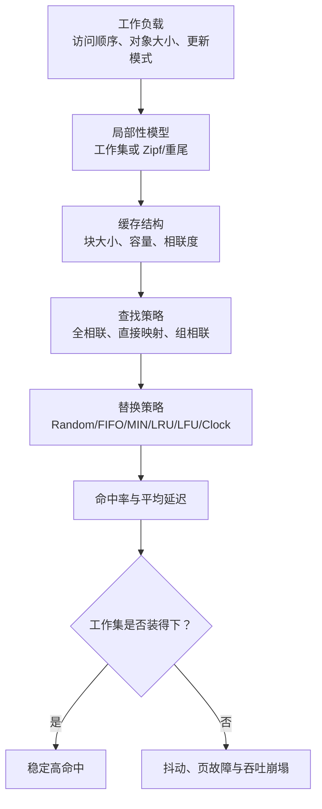
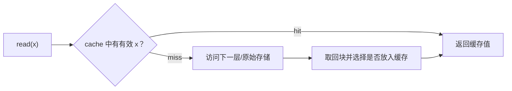
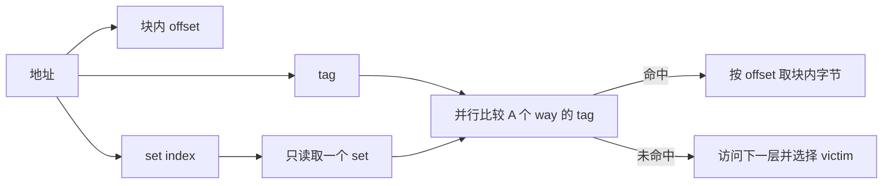
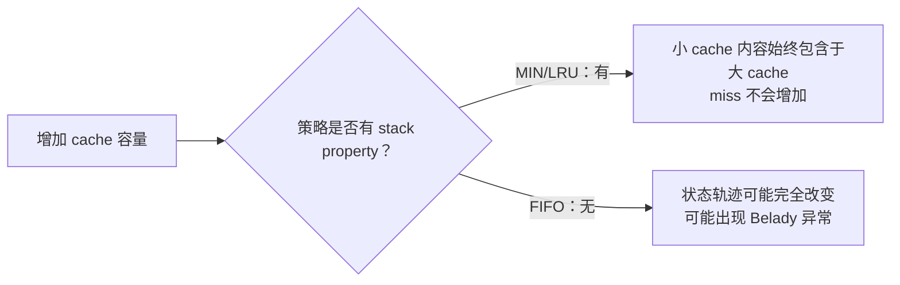
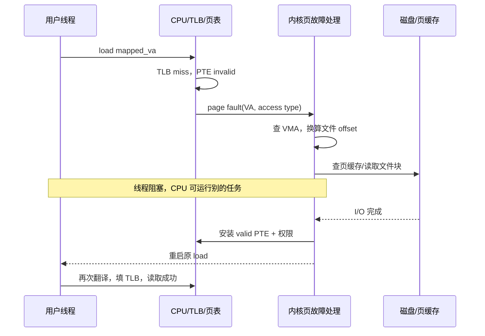
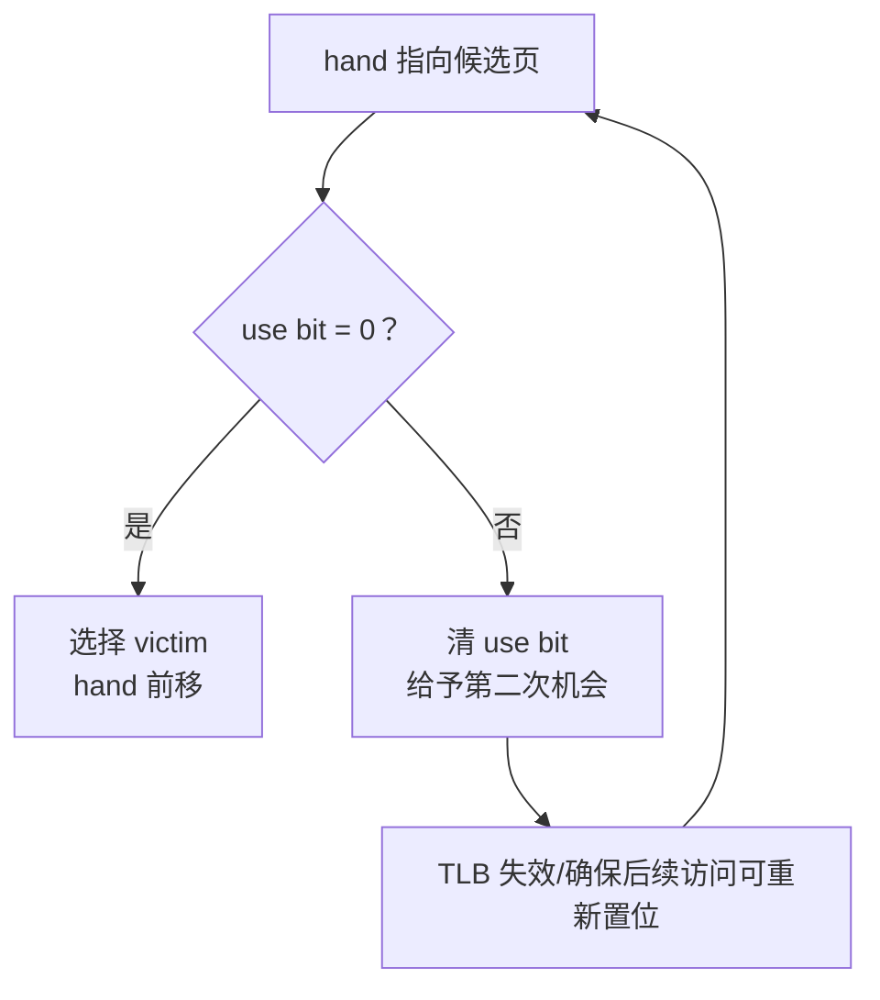

> 书名：*Operating Systems: Principles and Practice*（第二版）<br>
> 卷名：Volume III: *Memory Management*<br>
> 作者：Thomas Anderson、Michael Dahlin<br>
> 笔记范围：第 9 章 `Caching and Virtual Memory`，包括 9.1～9.8 节及章末练习<br>
> 原文位置：osppv3.md 的 “9 Caching and Virtual Memory” 部分

## 全章主线

缓存是“用小而快的副本遮蔽大而慢的原始数据”。它出现在处理器、TLB、文件系统、DNS、浏览器、编译器、数据库和数据中心中。第 8 章把 TLB 当作地址转换缓存；本章进一步回答四个普遍问题：

1. 为什么一个只能容纳极少数据的缓存仍可能命中绝大多数请求？
2. 怎样快速判断目标是否已在缓存中？
3. 空间满时应该淘汰谁？
4. 当主存成为磁盘的缓存时，怎样用页故障透明地实现映射文件和虚拟内存？



缓存性能不是缓存自身的固有属性，而是**缓存设计与工作负载的交互结果**。同一个哈希表，能放进 L1 时每次纳秒级，超出 DRAM 后每次可能触发毫秒级磁盘访问；同一条替换规则，在有时间局部性的负载上很好，在循环扫描上可能每次都错。

本章采用两个层次展开：9.1–9.5 抽象出所有缓存共有的概念、模型、查找和替换；9.6–9.7 把物理内存看成磁盘页的缓存，具体解释页故障、脏页、Clock、自分页与 swapping。

### 三个不可回避的设计问题

| 问题 | 核心矛盾 | 本章重点 |
|---|---|---|
| 定位副本 | 查找越灵活，比较/索引越慢 | 全相联、直接映射、组相联、page coloring |
| 选择替换对象 | 未来未知，只能用过去预测 | MIN 理想基准，LRU/LFU/Clock 近似 |
| 保持一致 | 副本可能落后原始数据 | 本书仅触及 write-through/back、dirty；完整 coherence 超出范围 |

缓存不能创造容量，也不能保证一致性或性能。它只在“未来访问可由过去预测”且 miss 成本能被足够高的 hit rate 摊薄时有效。

## 9.1 缓存概念（Cache Concept）

### 严格定义与读路径

缓存保存一部分 `(key, value/version)` 副本。读取键 $x$ 时：



- **cache hit**：缓存持有可用副本；
- **cache miss**：缓存无副本、条目冲突被淘汰，或副本失效；
- **hit rate $h$**：命中请求比例；miss rate 为 $1-h$。

缓存有用至少需要：

1. 命中成本 $L_h$ 显著小于 miss 总成本 $L_m$；
2. 命中率足够高，能抵消查缓存、维护元数据、装入和一致性的开销。

### 平均读取延迟

若 $L_m$ 已包含“查缓存失败 + 访问后备层 + 返回”的总延迟：

$$
E[L]=hL_h+(1-h)L_m.
$$

若把每次必付的 cache lookup 成本记为 $t_c$，miss 后**额外**代价为 $P_m$：

$$
E[L]=t_c+(1-h)P_m.
$$

两式等价，但参数口径不同，不能把“总 miss latency”再加一次 lookup。

例如命中 1 ns、miss 总成本 100 ns、$h=99\%$：

$$
E[L]=0.99\times1+0.01\times100=1.99\ \text{ns}.
$$

看似只有 1% miss，却贡献了超过一半平均延迟。若 miss 是 10 ms 磁盘而 hit 是 100 ns DRAM，要让 miss 对平均延迟贡献不超过 hit，需要

$$
(1-h)10^{-2}\lesssim10^{-7},
$$

$$
1-h\lesssim10^{-5},\qquad h\gtrsim99.999\%.
$$

这解释了虚拟内存为何“少量 page fault 可接受，持续 page fault 灾难性”。

### 时间局部性与空间局部性

**时间局部性（temporal locality）**：最近访问的对象更可能很快再次访问。循环指令、热点哈希桶、栈顶和当前文档都具有时间局部性。

**空间局部性（spatial locality）**：访问某地址后，附近地址更可能很快访问。顺序取指、数组扫描和结构体相邻字段是典型例子。

缓存按**块（block/cache line/page）**装入而非单字节，正是利用空间局部性。若块大小为 $B$，一次 miss 把包含目标的整个 $B$ 字节带入；后续邻近访问可 hit。

块过小：元数据多、不能摊薄固定 miss 延迟；块过大：带入无用字节、污染缓存、增加传输和内部碎片。预取则更激进地在请求前装入预测块，预测对时隐藏延迟，错时浪费带宽和容量。

### 写缓冲、write-through 与 write-back

写操作常先进入 write buffer，使 CPU 暂时继续；后续读必须先检查 buffer，以返回最新值。

**write-through。** 每次修改同时向下一层传播。恢复/一致性简单，但写流量大、延迟隐藏依赖缓冲。

**write-back。** 先只改缓存并标记 dirty，淘汰/刷写时再更新下一层。可合并多次写、减少流量，但 dirty 淘汰更慢，崩溃前未写回数据可能丢失。

若 write miss，还要决定：

- **write-allocate**：先把整块读入缓存再修改，适合后续复用；
- **no-write-allocate/write-around**：直接写下一层，不污染缓存，适合流式一次写。

本章主要分析读命中与页替换；多处理器 cache coherence 和持久性顺序是独立的更大主题。

### 缓存的适用边界

完全随机、均匀访问远大于缓存的数据集时，历史几乎不能预测未来，命中率约等于容量占全集比例；持续写且每次立刻失效的副本也无法复用。此时缓存可能只增加查找和一致性成本。是否采用缓存应由测量和负载模型决定，而不是“缓存总会更快”的信念。

## 9.2 存储层次（Memory Hierarchy）

存储技术存在速度、容量、成本与持久性的权衡：越靠近 CPU 的 SRAM 越快但昂贵、容量小；DRAM 更大更慢；网络内存、闪存、磁盘和远程数据中心进一步扩大容量，同时延迟跨越多个数量级。

原书给出的时代快照如下，数字用于建立数量级直觉，不应当作 2026 年所有机器的固定参数：

| 层级 | 典型延迟 | 典型容量 | 常作为谁的缓存 |
|---|---:|---:|---|
| L1 cache / L1 TLB | 1 ns | 64 KiB | L2/更深层 |
| L2 cache / L2 TLB | 4 ns | 256 KiB | L3/DRAM |
| L3 cache | 12 ns | 2 MiB | DRAM |
| 本机 DRAM | 100 ns | 10 GiB | 本机/远端持久存储 |
| 数据中心远端 DRAM | 100 μs | 100 TiB | 磁盘 |
| 本地非易失存储 | 100 μs | 100 GiB | 更慢存储 |
| 本地磁盘 | 10 ms | 1 TiB | 数据中心存储 |
| 远端数据中心磁盘 | 200 ms | 极大 | 更远副本/归档 |

现代机器容量与延迟已变化，但层级规律仍在：容量相差可达十余个数量级，延迟相差可达八个数量级。缓存层级试图向上提供“接近小存储的速度、接近大存储的容量与成本”。

### 多级缓存平均延迟

设 L1 命中率 $h_1$、延迟 $L_1$；在 L1 miss 的条件下，L2 局部命中率 $h_2$、额外访问延迟 $L_2$；最终内存额外延迟 $L_M$。若查询串行：

$$
E[L]=L_1+(1-h_1)\left[L_2+(1-h_2)L_M\right].
$$

注意 $h_2$ 是**局部命中率** $P(L2\ hit\mid L1\ miss)$。全局 L2 命中比例是 $(1-h_1)h_2$。若把全局命中率直接代入括号，会重复加权。

例如 $h_1=0.95,L_1=1$ ns，$h_2=0.9,L_2=4$ ns，$L_M=100$ ns：

$$
E[L]=1+0.05(4+0.1\times100)=1.7\ \text{ns}.
$$

高层 hit rate 极其重要，因为每个高层 miss 都会暴露后续巨大延迟。

### 各层的系统意义

**L1/L2/L3。** 缓存指令和数据；L1 追求低延迟，L3 常跨核心共享并追求容量。TLB 也按同样方式多级化。

**DRAM。** 对硬件 cache 是后备内存；对 OS 来说，DRAM 又是文件和匿名页的缓存。

**协作缓存（cooperative caching）。** 数据中心内其他节点的 DRAM 虽远于本机 DRAM，却可能比磁盘快，聚合容量还更大。节点需要协调副本、故障与网络拥塞。

**本地磁盘/闪存。** 可缓存远端网页、对象或文件，也可作为 DRAM 的后备。浏览器磁盘缓存命中后仍可能需向服务端验证版本。

**远端数据中心。** 容量与容灾能力大，但 WAN 延迟、带宽和一致性成本高。

一份数据可能同时存在 L1、L2、L3、DRAM、磁盘和远端副本。越多层越能隐藏延迟，也越难解释性能与维护一致性。

### 为什么微小缓存可能有效

缓存容量相对全集虽小，但访问分布通常极不均匀。程序在一个阶段反复使用有限代码/数据，用户集中访问热门页面。有效性取决于**活跃集合**而非理论全集。下一节的工作集与 Zipf 模型分别描述“有明显活跃核心”和“热门度连续重尾”两类行为。

## 9.3 缓存何时有效、何时失效

判断缓存不能只看程序，也不能只看容量。同一程序在不同输入/阶段有不同活跃数据；同一容量对小工作集足够，对大工作集会抖动。最有用的分析图是“缓存大小 $C$ → 命中率/进度”。

### 9.3.1 工作集模型（Working Set Model）

#### 定义

对引用序列 $r_1,r_2,\ldots$，给定回看窗口 $\Delta$，时刻 $t$ 的工作集定义为最近 $\Delta$ 次（或最近 $\Delta$ 时间）内访问的不同块集合：

$$
WS(t,\Delta)=\{r_j\mid t-\Delta<j\le t\}.
$$

工作集大小为

$$
w(t,\Delta)=|WS(t,\Delta)|.
$$

原书更直觉地把 hit-rate 曲线的“膝点”称为工作集：当缓存刚好能容纳当前关键代码/数据后，命中率迅速跃升，再增加容量收益变小。两种定义都表达“近期活跃、需要同时驻留的最小集合”。


#### Thrashing（抖动）为何发生

若 $C<w(t,\Delta)$，程序重用某块前，它可能已被其他活跃块挤出。每次 miss 带入的新块又淘汰即将使用的旧块，系统大量搬运却很少前进，这叫 thrashing。

对循环扫描 $N$ 页、缓存 $m<N$ 页，FIFO/LRU 在稳定扫描中可能每次引用都 miss：访问第 $m+1$ 页时淘汰最早页，而它恰是下一轮最先需要的页。miss rate 接近 1，磁盘 paging 时性能可下降 5 个数量级。

抖动不是“缓存忙”这么简单，而是缓存容量与重用距离不匹配。**重用距离（reuse distance）**是两次访问同一块之间出现的不同块数；全相联 LRU 容量 $C$ 下，一次引用 hit 当且仅当其重用距离 $<C$（首次引用为 compulsory miss）。

#### 阶段变化与上下文切换

编译器解析、优化、代码生成各有不同工作集；编辑器切换文件也改变活跃页。阶段切换时，新工作集尚未装入，miss 形成短暂尖峰，随后稳定。

线程/进程切换同样使 cache 从旧工作集转向新工作集。这解释亲和调度的价值：回到原 CPU，部分旧工作集可能仍在本地 cache，减少冷启动。

#### 面向层级调整算法

若大数组不适合 DRAM，可分成能放进内存的块，各块内部再分成能放进 L2/L1 的小块；排序可先独立排序各块，再多路归并。矩阵分块也用同一思想。

这种算法称 cache-aware（显式按层级调块）或 cache-oblivious（递归分治，不写死具体层级却自动产生多尺度局部性）。关键不是减少总算术，而是让一块数据在被淘汰前完成足够多工作。

#### 模型边界

工作集不是固定常数，依赖窗口 $\Delta$ 和程序阶段。窗口太短漏掉即将复用的数据，太长混合多个阶段。它适合有明显局部活跃集合的程序；Web 热门度没有清晰膝点时，Zipf 模型更贴切。

### 9.3.2 Zipf 模型（Zipf Model）

Web 页面、词频、城市规模和社交连接常呈重尾：少数对象极热门，但长尾中仍有大量偶尔访问对象，没有一个小工作集能囊括几乎全部引用。

将 $N$ 个对象按热门度排序，秩为 $k$ 的对象访问概率定义为

$$
p_k=\frac{k^{-\alpha}}{H_{N,\alpha}},
$$

其中

$$
H_{N,\alpha}=\sum_{j=1}^{N}j^{-\alpha}
$$

是归一化常数，确保 $\sum_k p_k=1$。原书取 $1\le\alpha\le2$；$\alpha$ 越大，流量越集中在头部。

若缓存能准确保留最热门的前 $C$ 个对象，理想静态命中率为

$$
h(C)=\sum_{k=1}^{C}p_k
=\frac{H_{C,\alpha}}{H_{N,\alpha}}.
$$

这条公式说明小缓存已有价值，因为头部概率高；但长尾使命中率随容量缓慢、持续上升，没有工作集模型那样“一过膝点就接近 100%”。

#### $\alpha=1$ 时的近似

调和数满足

$$
H_{n,1}\approx\ln n+\gamma,
$$

所以

$$
h(C)\approx\frac{\ln C+\gamma}{\ln N+\gamma}.
$$

若 $N=10^6,C=10^3$，忽略 $\gamma$ 粗估：

$$
h\approx\frac{\ln10^3}{\ln10^6}=\frac{3}{6}=50\%.
$$

只缓存千分之一对象却覆盖约一半访问；但要继续从 50% 提升到更高命中，需要成数量级增加容量。这就是“头部价值高、边际收益递减”。

#### 与工作集模型对比

| 特征 | 工作集 | Zipf |
|---|---|---|
| 热点结构 | 一组近期活跃块 | 热门度按排名连续下降 |
| 容量曲线 | 有明显膝点 | 平滑、重尾、边际递减 |
| 合适策略 | 近期性 LRU/Clock | 频率 LFU/带衰减频率 |
| 主要风险 | 阶段切换、容量略小即抖动 | 旧热门固化、新内容冷启动 |

#### 新内容与变化

纯 LFU 会让历史热门对象永久占据缓存，即使流行趋势已变。实践中需计数衰减、滑动窗口、TinyLFU/ARC 等近期性与频率混合机制。Web 副本还会过期，命中不等于有效：必须用 TTL、版本号或条件请求验证 freshness。

Zipf 是近似模型，不代表每个现实访问独立同分布。热点新闻会制造相关突发，推荐系统会改变热门度，攻击者还能刻意污染缓存。模型用于预测方向与数量级，最终仍要用实际 trace 验证。

## 9.4 内存缓存查找（Memory Cache Lookup）

缓存可看成稀疏映射 `block address → block data`。为利用空间局部性，一个条目保存整块而非一个字。硬件 cache line 常为几十字节，OS 页缓存通常以 4 KiB 页或更大块为单位。

查找设计要在两件事之间权衡：允许地址放在越多位置，替换越灵活、冲突 miss 越少；但查找时要比较越多候选，延迟、面积和能耗越高。

设：

- 总容量 $C$ bytes；
- 块大小 $B$ bytes；
- $A$ 路组相联（associativity）；
- 总条目数 $E=C/B$；
- set 数 $S=C/(AB)$。

若各量为 2 的幂，物理块地址拆成：

$$
offset\ bits=\log_2B,
$$

$$
set\ bits=\log_2S,
$$

其余高位为 tag。查找先用 set 位选一组，再并行比较该组 $A$ 个 tag。



### 全相联（fully associative）

任意块可放任意条目，等价于只有一个 set、$A=E$。所有 tag 并行比较，替换自由度最大、不会发生位置冲突；代价是每项比较器和全局选择逻辑。小型 TLB 可采用，数万条目的大 cache 难以全相联。

物理内存从抽象上也是全相联缓存：任何虚拟页可放任何物理页框，页表负责定位；不过查找不是并行比较所有页框，而是由页表间接索引。

### 直接映射（direct mapped）

$A=1$，每个内存块只能放到

$$
set=blockNumber\bmod S
$$

唯一位置。只查一个 tag，硬件最简单、延迟低；但两个活跃地址若映射同 set，会交替驱逐，即使其他 set 全空也无用，形成**冲突 miss**。

例如 cache 有 4 个 set，访问块 0、4、0、4……，两者都映射 set 0，除首次外仍每次 miss。加入日志可能改变代码地址，使冲突消失，这类性能问题会像 Heisenbug 一样难定位。

### 组相联（set associative）

每个块可放所属 set 的 $A$ 个 way。$A=1$ 是直接映射，$A=E$ 是全相联。8-way 是常见折中：只并行比较 8 个 tag，却能容忍同 set 的多个活跃块。

miss 可分三类：

- **compulsory/cold miss**：第一次访问，无论容量多大都缺失（不考虑预取）；
- **capacity miss**：全相联同容量也装不下活跃集合；
- **conflict miss**：总容量够，但相联限制让某 set 装不下。

提高容量解决 capacity，增加相联度解决 conflict；两者不能混为一谈。

### Page coloring：OS 如何影响物理 cache

物理地址 cache 的 set index 可能使用 PFN 中的若干低位。若 OS 恰好分配一组“颜色相同”的页框，进程所有页都落到同一组 cache set 子集，有效容量远小于标称值。

每一物理页覆盖的 cache 容量为 $A\times P$，其中 $P$ 是页大小，因为同一页内 offset 能遍历一组 set，每 set 有 $A$ 个 way。需要的颜色数：

$$
Colors=\frac{C}{A\times P}.
$$

若结果小于 1 则至少 1；一般配置应取能区分 set-index 中超出页 offset 的位数，常写

$$
Colors=\max\left(1,\frac{C}{AP}\right)
$$

（假设整除与 2 的幂）。

原书例：2 MiB cache、8-way、4 KiB 页：

$$
Colors=\frac{2\ \text{MiB}}{8\times4\ \text{KiB}}=64.
$$

若进程只获同一颜色页框，其有效 cache 最多约 $8\times4$ KiB = 32 KiB。Page coloring 按这些索引位把页框分组，轮换颜色分配，使物理页覆盖各组 set。

代价是物理分配受约束，可能加剧大页/NUMA/连续 DMA 的冲突；现代复杂 cache 的 slice 哈希也可能不公开，颜色控制未必精确。

## 9.5 替换策略（Replacement Policies）

cache miss 且候选位置已满时，要选一个 victim。理想目标是最小化未来 miss 成本，而不是机械最小化 miss 数：脏页写回比干净页贵，远端对象比本地对象贵，大对象占更多空间，关键路径上的 miss 比非关键路径重要。

为建立基础，本节先假设：块等大、miss 成本相同、未来引用序列固定，比较 miss 数。硬件只能在一个 set 内选 victim；OS 页替换则近似在大量物理页框中选择，但维护精确信息更昂贵。

### 9.5.1 随机替换（Random）

满时在候选条目中均匀随机选 victim。优点是元数据少、决策快，不容易被某个确定访问模式稳定地击中最坏选择；硬件 cache 中，复杂 LRU 元数据占用的面积可能不如多放数据。

缺点是方差和不可预测性：可能淘汰马上使用的热点，无法让精心布局的应用获得确定行为。Random 在期望上通常不会持续作出最坏选择，但对单次运行没有保证，也不是任何普遍意义上的最优。

### 9.5.2 先进先出（FIFO）

淘汰进入 cache 最久的块。只需入队顺序，不在 hit 时更新，因此比 LRU 便宜；直觉上每页获得相似驻留时间。

但“进来最久”与“未来最不需要”没有必然关系。循环扫描 $A,B,C,D,E$，cache 只有 4 页：装入 E 时淘汰 A，而下一次正好访问 A；随后淘汰 B，而下一次正好访问 B，稳定后每次 miss。

FIFO 忽略 hit：即使 A 在驻留期间被访问一百万次，它仍可能因最老被淘汰。它适合访问近似一次性流、或元数据成本必须极低的场景，不适合典型时间局部性。

### 9.5.3 最优替换（MIN）

MIN（又称 Belady optimal）在 miss 时淘汰**下一次使用距离现在最远**的缓存块；永远不再使用视为距离 $\infty$。它需要未来，因此不能在线实现，但提供给定引用序列和容量下的最少 miss 下界，可评估实际算法离理想多远。

#### 最优性的交换论证

假设存在一个比 MIN 更好的最优策略 ALT。选择所有最优策略中，与 MIN 保持相同决策前缀最长的 ALT。考虑它们第一次分歧：

- MIN 淘汰 $y$，其下一次使用最远；
- ALT 淘汰 $x$，所以 $x$ 的下一次使用不晚于 $y$。

构造 ALT′：分歧点改为像 MIN 一样淘汰 $y$，其后尽量模仿 ALT。此后两者 cache 只可能在 $x/y$ 上不同：ALT 有 $y$，ALT′ 有 $x$。

在下一次访问 $x$ 前：

- 若 ALT 先主动淘汰 $y$，ALT′ 可在同点淘汰 $x$，两者状态合并且 miss 不更多；
- 否则先访问的是 $x$。ALT miss，ALT′ hit。ALT 装入 $x$ 并淘汰某块 $q$；ALT′ 可保留 $q$。

直到之后访问 $y$ 时，ALT′ 至多补一次 miss；它此前在 $x$ 处少了一次，所以总 miss 不多于 ALT。此后可选择 victim 使状态再次合并。

于是 ALT′ 至少同样好，却在第一次分歧处与 MIN 相同，比 ALT 的共同前缀更长，矛盾。故 MIN 最优。

证明依赖已知固定引用序列、等价 miss 成本和同容量。若可预取且带宽足够，甚至能在需要前把块带入，消除表面 miss；若块大小/代价不同，目标应改成加权成本。

### 9.5.4 最近最少使用（LRU）

LRU 淘汰“向过去看最久没被访问”的块，用近期性预测未来。软件精确实现可用哈希表 + 双向链表：hit 时移到链首，miss 时淘汰链尾，操作均摊 $O(1)$。

它适合工作集与时间局部性：当前阶段反复访问的块持续靠前，旧阶段块逐渐淘汰。全相联 LRU 的关键性质是：一次访问 hit 当且仅当重用距离小于容量。

#### LRU 何时失败

循环扫描 $N$ 页、容量 $m<N$ 时，重用距离为 $N-1\ge m$，每页再次访问前已被淘汰，LRU 与 FIFO 一样每次 miss。此时最优策略反而可能淘汰刚访问过的页，因为它要等完整一圈才再用。

硬件或 OS 无法在每次 load/store 上维护百万页精确链表，因此常用 pseudo-LRU、use bit、Clock 或采样近似。近似降低元数据成本，也会偏离理想 LRU。

#### Stack property

对同一引用前缀，LRU 容量 $m$ 的内容是最近使用的 $m$ 个不同块；容量 $m+1$ 则是最近 $m+1$ 个，因此

$$
Cache_m(t)\subseteq Cache_{m+1}(t).
$$

大 cache 包含小 cache 的所有块，所以小 cache 的 hit 在大 cache 中也一定 hit；增加容量不会增加 miss。MIN 也具有类似包含性质。这类算法称 stack algorithm。

### 9.5.5 最不经常使用（LFU）

LFU 淘汰统计窗口内访问次数最少的块。它适合对象热门度长期稳定的 Zipf 负载：一次偶然访问不会把冷门页面提升到长期热点之上。

纯累计 LFU 有**历史污染**：曾经热门但已过时的对象计数巨大，新热点很久无法进入。常见修补：

- 定期计数减半/指数衰减；
- 只统计滑动窗口；
- admission policy 先判断新对象是否值得挤入；
- 与 LRU 结合，同时考虑近期性和频率。

如果对象大小 $s_i$、miss 重取成本 $c_i$ 不同，只按次数 $f_i$ 不合理。可近似比较单位容量收益

$$
score_i\propto\frac{f_i c_i}{s_i},
$$

保留高访问频率、高重取成本、小尺寸对象。但真正最优会变成带动态未来的 knapsack 问题，还要考虑更新失效和关键路径。

并行程序中，只有关键路径上的 miss 直接延长完成时间；缓存一批非关键块可能不如保住一个关键文件。替换策略最终服务于系统目标，而非抽象 hit rate 本身。

### 9.5.6 Belady 异常

直觉认为 cache 更大不应更差，但某些非 stack 策略会因容量改变而形成完全不同状态，使 miss 反而增加，这叫 Belady anomaly。

经典 FIFO 引用串：

$$
A,B,C,D,A,B,E,A,B,C,D,E.
$$

容量 3 的 FIFO 有 9 次 miss，容量 4 却有 10 次。容量变化改变淘汰节奏：4 槽在后半段恰好保留了不利组合。



MIN：容量 $m+1$ 可保留容量 $m$ 中“未来最近的 $m$ 块”再加一块；LRU：保留最近 $m+1$ 个不同块，天然包含最近 $m$ 个。LFU 若 tie-breaking 和频率状态定义一致，也可设计成包含，但实际带 aging/admission 的混合算法未必保持简单 stack property。

Belady 异常不是“cache 总体无用”，而是提醒：替换算法与容量共同决定状态，不能只靠容量单调性直觉。

## 9.6 案例：内存映射文件（Memory-Mapped Files）

显式 `read` 把文件字节复制到用户 buffer，程序操作副本；`write` 再把修改复制回内核/存储。内存映射文件则把文件区间直接作为进程虚拟内存区域：普通 load/store 访问文件内容，DRAM 页框成为磁盘块的 write-back cache。

建立映射时无需读完整文件。内核记录“VA 区间 ↔ 文件与偏移”，PTE 初始 invalid；首次访问用 page fault 触发按需装入。这与可执行程序按需加载完全相同。

### 9.6.1 优势

**透明性。** 程序可持有指向文件结构的普通指针，不必在每次访问前判断块是否已读入。缺页由硬件和内核透明处理。

**减少复制。** 磁盘/DMA 填充的物理页框直接映射到用户页表，不必再从内核 buffer 复制一份到用户 buffer。严格“零拷贝”还取决于设备、对齐和 cache coherence，但至少省掉内核—用户内存复制。

**流水线。** 程序在第一页到达后即可开始处理，后续页按需/预取；不必等待整个大文件装入。

**共享与 IPC。** 多进程把同一文件页映射到同一物理页框，可立即看到共享修改（可见性和同步仍需锁/原子协议）。

**超大文件。** 只要 VA 和页表表示得下，文件可远大于 DRAM；OS 自动决定驻留页。应用无需自己维护“哪个树节点在内存、哪个在磁盘”。

### 与显式 I/O 的权衡

| 维度 | `read/write` | `mmap` |
|---|---|---|
| 数据表示 | 用户 buffer 副本 | 文件页直接映射 |
| 错误时机 | 系统调用返回错误 | 任意 load/store 可能触发异常 |
| I/O 控制 | 应用显式批量、预取 | OS 按页策略，应用可给 hint |
| 地址稳定 | buffer 生命周期由应用控制 | 文件截断/映射变化需谨慎 |
| 小/顺序 I/O | 接口直观、易控制 | page fault/页表开销可能更大 |
| 随机大型结构 | 应用自行缓存 | 指针式访问方便 |

映射文件不是普遍更快。顺序流式 I/O 用大 buffer 和异步 `read` 可更可预测；`mmap` 的首次访问延迟隐藏在指令中，异常处理和随机缺页会制造尾延迟。

### 9.6.2 实现

#### 映射与首次 page fault

1. `mmap`/等价调用建立虚拟区域，记录文件、映射起点、文件偏移、长度和权限；PTE 设 invalid。
2. CPU 访问 VA，TLB miss 后 page walk 发现 invalid，触发精确 page fault。
3. 内核在区域表中确认 VA 合法，计算

$$
fileOffset=mappingFileOffset+(VA-mappingBase).
$$

4. 查页缓存；若已驻留，增加映射并直接使用；否则分配空页框并提交磁盘读取。
5. faulting 线程 WAITING，调度器运行其他线程。
6. I/O 完成中断唤醒处理线程；内核安装有效 PTE、设置权限。
7. 重启原指令。它再次 TLB miss，但这次 page walk 成功并填入 TLB，load/store 完成。



如果 VA 不在合法映射、访问越权，内核应报告错误而非装入页。硬件只看到 invalid，软件区域元数据决定“按需装入还是非法”。

#### 没有空页框时怎样淘汰

1. 替换策略选择 victim PFN；
2. core map 找出所有映射它的 PTE；
3. 将这些 PTE 设 invalid/不可访问；
4. 对可能缓存旧转换的 CPU 做 TLB shootdown，并等待完成；
5. 若 dirty，先把旧内容写回对应文件块；
6. 旧映射安全失效、必要写回完成后，才可用该页框接收新数据；
7. 更新 core map 和新 PTE。

顺序不能颠倒。读盘期间页框可能一半旧、一半新；若旧 TLB 仍可访问，进程会读到混合数据或写坏新页。

#### Dirty bit

dirty=0 表示 DRAM 与后备文件一致，淘汰可直接丢弃；首次 store 后 dirty=1，淘汰前必须写回。硬件通常在 PTE/TLB 记录，多个别名映射同一 PFN 时，只要任一映射写过，物理页就应视为 dirty。

若无硬件 dirty bit，可把逻辑可写的干净页暂设只读：

1. 首次写触发保护异常；
2. 内核标记软件 dirty；
3. PTE 升为可写并重试；
4. 后续写全速执行。

后台 cleaner 可提前写回候选脏页，使真正内存紧张时有 clean 页可立即回收。开始写回前清 dirty/降为只读并 shootdown；写回期间若程序再次写，会重新置 dirty，说明刚写到磁盘的副本又过期。具体内核会使用 writeback 状态和锁避免竞态。

#### 为什么写缓冲与 CPU cache 也要参与

dirty 页最新字节可能尚在 CPU write buffer/cache，而不在 DRAM。设备 DMA 从 DRAM 读出写盘前，硬件 cache coherence 或内核显式 flush 必须保证设备看到最新值。页表 dirty bit 只说明“曾写过”，不自动搬运数据。

### 9.6.3 近似 LRU

精确 LRU 要在每次取指/load/store 上修改百万页链表，硬件和同步成本不可接受。多数架构只提供每页一位 **use/accessed/reference bit**：页面被访问/转换装入 TLB 时硬件置 1，内核周期性采样并清 0。

#### Clock/Second Chance

所有页框排成环，clock hand 指向候选：

```text
需要 victim 时循环：
	若 frame.use == 0：选它并前移 hand
	若 frame.use == 1：清零，给第二次机会，前移 hand
```



如果页在 hand 再次到达前被访问，use 又变 1，继续保留；长期未访问页保持 0，被选中。它只粗略区分“自上次扫描以来用过/没用过”，是 NRU/LRU 近似。

#### 为什么清 use bit 需要处理 TLB

若 TLB 条目内 use=1，而内核只清内存 PTE，后续访问可能持续命中 TLB，不再把 PTE 置 1；内核会误判页面未使用。清位时需架构规定的同步/失效，让后续访问重新 page walk 或回写 accessed 状态。

若 PTE use 本来为 0，通常说明无可继续隐藏访问的有效 TLB 状态（依架构协议），可减少不必要 shootdown；具体规则需服从 ISA。

#### k-th chance / aging

记录连续 $k$ 次扫描未使用才淘汰：每轮 use=1 时清零并重置“未用次数”，use=0 时计数加一，达到 $k$ 才 victim。$k$ 越大越接近长期近期性，但扫描/元数据更多。

也可维护 aging counter：周期性右移，并把当前 use bit 放最高位：

$$
age\leftarrow(age\gg1)\mathbin{|}(use\ll(w-1)).
$$

数值越小表示较久未用。这近似多位访问历史，但窗口和扫描周期决定精度。

#### 无硬件 use bit 的模拟

把逻辑 valid 页暂设 invalid，首次访问异常后记录 use=1，再恢复映射。下一轮采样再次撤销。正确但昂贵：每轮首次访问都 trap，且需 TLB shootdown。

软件管理 TLB 的系统可在 TLB miss handler 顺便记录引用，避免额外异常，但只观察 TLB miss 而非每次访问，仍是采样。

#### Clean free pool

OS 常保留一批“已从进程撤销、干净、尚未覆写”的页框。新请求可立即复用；若原进程在复用前再次访问，仍可快速从 pool 取回而无需磁盘。这把淘汰决策与真正覆写分开，给错误预测一次挽回机会。

Clock 在 phase change/page-fault storm 中若所有 use 都为 1，第一次扫一整圈只清位，第二圈才找到 victim，行为可退化近似 FIFO，扫描成本显著。

## 9.7 案例：虚拟内存（Virtual Memory）

将“文件页按需缓存到 DRAM”推广到所有进程段，就得到本章语境的 demand-paged virtual memory：代码/库由可执行文件后备，匿名堆栈由 swap/pagefile 或零页后备。未驻留页 PTE invalid，访问时内核换入。

匿名页与映射文件不同：进程退出后匿名内容无需保留；干净文件页可丢弃后从文件重读；脏共享映射要写回原文件；脏私有匿名页通常写到交换空间。统一页缓存可让文件 I/O 和进程页竞争同一 DRAM 池。

虚拟内存允许所有进程承诺的 VA 总量超过 DRAM，但**承诺地址不等于能让所有工作集同时驻留**。磁盘 page fault 与 CPU 的速度差巨大：原书数量级中，磁盘约 100 faults/s，CPU 可执行 $10^{10}$ instructions/s。page fault 必须极其稀少。

### 9.7.1 自分页（Self-Paging）

全局 Clock 可能被“勤触页”程序操纵：恶意/贪婪进程用后台线程不断触摸自己的所有页，使 use bit 始终为 1；当它再 fault 新页时，替换器更可能淘汰正常进程较久未碰的页。正常进程失去工作集后 fault 更多、前进更慢，于是页更显得“不常用”，形成正反馈。

**自分页**先按进程/用户以最大最小公平分配页框配额；进程超过份额后，其 page fault 优先从自己的页中淘汰。它把替换责任和需求来源绑定，阻止一个租户用访问模式夺走全部内存。

若总页框 $M$，进程需求上限 $d_i$，max-min 分配 $x_i$ 满足

$$
0\le x_i\le d_i,\qquad\sum_i x_i\le M,
$$

并把无法使用的份额再分给其他进程。实际还会保留内核、共享页和最低保障。

#### 隔离与利用率的冲突

进程 A 工作集为 $2M/3$、B 为 $M/3$，二者正好装下。严格各分 $M/2$ 时，A 缺 $M/6$ 而 thrash，B 却有多余 $M/6$。全局协作能高效使用，严格隔离防攻击但浪费。

折中包括工作集估计、动态借用、memory pressure 时收回、容器配额与最低/最高边界。借用者必须能被及时回收，且不能靠刷新页永久占用。

共享页归属也复杂：一页由 100 个进程映射，应向谁计费？按比例、首次映射者或共享池计费会影响公平策略。

### 9.7.2 交换（Swapping）

当活跃进程工作集总和超过 DRAM：

$$
\sum_i |WS_i|>M,
$$

即使页框公平分配，每个进程也可能低于工作集并同时 thrash。增加多道程序度先提高 CPU/I/O 重叠，之后 page fault 上升，最终吞吐“跌下悬崖”：更多任务反而完成更少工作。


此时公平地让所有进程都极慢，不如暂时让少数进程完全不运行，把其全部页换出，释放足够内存让其余进程工作集驻留。**Swapping** 是整进程/大部分进程工作集的换出与暂停；待其他进程完成或内存释放后再换入。

这与第 7 章过载控制同构：系统容量不足时，少做工作可提高总吞吐和已接纳任务响应。选择 swap victim 要考虑：

- 优先级与交互性；
- 换出页数和 dirty 写回成本；
- 预计睡眠/空闲时间；
- 恢复时重新装入成本；
- 公平，防止同一进程永久饥饿。

现代系统更常逐页回收、压缩内存、限制容器或终止进程，传统整进程 swapping 使用程度依平台而异；原理仍是降低活跃工作集总量。

#### 如何检测 thrashing

可监控 page-fault frequency、paging disk 利用率、CPU idle-while-I/O、每进程驻留集和 refault distance。若 page fault 持续高、paging device 接近饱和、CPU 利用低，继续增加进程不会帮助；应降低 multiprogramming、扩容 DRAM或调整工作集。

## 9.8 总结与未来方向

本章把缓存从“硬件小技巧”提升为通用系统方法：缓存利用访问可预测性，用小容量保存高价值副本；其效果由命中成本、miss 成本、命中率与维护开销共同决定。

核心结论：

1. 时间/空间局部性让小 cache 有机会覆盖大部分请求；工作集装不下会 thrash。
2. Zipf 重尾没有清晰工作集，频率策略有价值但需衰减适应新热点。
3. 全相联、直接映射和组相联在查找延迟与冲突 miss 间权衡；OS 通过 page coloring 影响物理 cache 利用。
4. MIN 用未来给出最少 miss 基准；LRU/LFU 用过去预测，FIFO/Random 降低元数据成本。没有策略对所有负载最好。
5. Stack property 保证 MIN/LRU 增大容量不增加 miss；FIFO 可出现 Belady anomaly。
6. 映射文件用 invalid PTE 与精确异常按需把文件页装入 DRAM，dirty bit 控制写回，Clock 用 use bit 近似 LRU。
7. 虚拟内存把 DRAM作为所有进程页的 cache；公平和效率冲突，工作集总和超容量时必须降低活跃负载。

未来变化会重新调整参数但不会消除问题：更快 SSD/远端 DRAM降低 miss 成本，可能让 paging 更可用；页大小会在内部碎片、TLB、传输和 tracking 开销间重新平衡；应用越来越了解自己的工作集，OS 需要向数据库、GC、VM 等运行时暴露资源压力和控制接口。

最重要的方法是：先刻画访问分布，再选 cache 和策略；先看 miss 是否 compulsory/capacity/conflict，再决定扩容、增加相联或改布局；若系统已经 thrash，替换策略微调通常不如减少活跃工作集。

## 用 C++ 验证关键机制

以下示例使用 C++17；`mmap` 示例面向 Linux、macOS 或 WSL。当前环境没有 C/C++ 编译器，因此未做本地编译，输出已用独立脚本复核。

### 实验一：比较 FIFO、LRU、MIN 与 Clock

```cpp
#include <algorithm>
#include <deque>
#include <iostream>
#include <limits>
#include <list>
#include <string>
#include <unordered_map>
#include <vector>

int simulateFifo(const std::string& references, std::size_t capacity) {
	std::deque<char> queue;
	int faults = 0;
	for (char page : references) {
		if (std::find(queue.begin(), queue.end(), page) != queue.end()) {
			continue;
		}
		++faults;
		if (queue.size() == capacity) {
			queue.pop_front();
		}
		queue.push_back(page);
	}
	return faults;
}

int simulateLru(const std::string& references, std::size_t capacity) {
	std::list<char> recency;  // 链首最近使用，链尾最久未用。
	std::unordered_map<char, std::list<char>::iterator> positions;
	int faults = 0;

	for (char page : references) {
		auto found = positions.find(page);
		if (found != positions.end()) {
			recency.erase(found->second);
			recency.push_front(page);
			positions[page] = recency.begin();
			continue;
		}

		++faults;
		if (recency.size() == capacity) {
			char victim = recency.back();
			recency.pop_back();
			positions.erase(victim);
		}
		recency.push_front(page);
		positions[page] = recency.begin();
	}
	return faults;
}

int simulateMin(const std::string& references, std::size_t capacity) {
	std::vector<char> frames;
	int faults = 0;

	for (std::size_t current = 0; current < references.size(); ++current) {
		char page = references[current];
		if (std::find(frames.begin(), frames.end(), page) != frames.end()) {
			continue;
		}

		++faults;
		if (frames.size() < capacity) {
			frames.push_back(page);
			continue;
		}

		std::size_t victim_index = 0;
		std::size_t farthest_use = 0;
		for (std::size_t frame = 0; frame < frames.size(); ++frame) {
			std::size_t next = references.find(frames[frame], current + 1);
			if (next == std::string::npos) {
				victim_index = frame;
				farthest_use = std::numeric_limits<std::size_t>::max();
				break;
			}
			if (next > farthest_use) {
				farthest_use = next;
				victim_index = frame;
			}
		}
		frames[victim_index] = page;
	}
	return faults;
}

int simulateClock(const std::string& references, std::size_t capacity) {
	std::vector<char> frames(capacity, '\0');
	std::vector<bool> used(capacity, false);
	std::size_t hand = 0;
	int faults = 0;

	for (char page : references) {
		auto found = std::find(frames.begin(), frames.end(), page);
		if (found != frames.end()) {
			used[static_cast<std::size_t>(found - frames.begin())] = true;
			continue;
		}

		++faults;
		while (frames[hand] != '\0' && used[hand]) {
			used[hand] = false;  // 第二次机会已经用掉。
			hand = (hand + 1) % capacity;
		}
		frames[hand] = page;
		used[hand] = true;       // faulting 引用立即访问新页。
		hand = (hand + 1) % capacity;
	}
	return faults;
}

int main() {
	const std::string exercise = "ACBDBAEFBFAGEFA";
	std::cout << "LRU faults   = " << simulateLru(exercise, 4) << '\n'
			  << "MIN faults   = " << simulateMin(exercise, 4) << '\n'
			  << "Clock faults = " << simulateClock(exercise, 4) << "\n\n";

	const std::string belady = "ABCDABEABCDE";
	std::cout << "FIFO, 3 frames = " << simulateFifo(belady, 3) << '\n'
			  << "FIFO, 4 frames = " << simulateFifo(belady, 4) << '\n';
}
```

编译运行：

```bash
c++ -std=c++17 -O2 replacement.cpp -o replacement
./replacement
```

示例输出：

```text
LRU faults   = 8
MIN faults   = 7
Clock faults = 8

FIFO, 3 frames = 9
FIFO, 4 frames = 10
```

前三项对应练习 4；后两项重现 Belady 异常。MIN 每次用 `find` 查询未来，仅用于离线基准，不能作为在线 OS 替换器。

### 实验二：平均内存访问时间与升级选择

```cpp
#include <iomanip>
#include <iostream>

double averageAccessMicroseconds(
	double disk_time,
	double page_fault_probability,
	bool use_remote_memory,
	double remote_time = 0.0,
	double remote_miss_probability = 0.5
) {
	constexpr double CACHE_MISS = 0.01;
	constexpr double TLB_MISS = 0.01;
	constexpr double T_CACHE = 0.001;  // 1 ns = 0.001 us
	constexpr double T_TLB = 0.001;
	constexpr double T_DRAM = 0.1;

	double page_fault_cost = disk_time;
	if (use_remote_memory) {
		page_fault_cost = remote_time +
						  remote_miss_probability * disk_time;
	}

	/* 两级页表不缓存：一次 TLB miss 额外读 DRAM 两次。 */
	return T_TLB + T_CACHE + CACHE_MISS * T_DRAM +
		   TLB_MISS * (2.0 * T_DRAM +
					   page_fault_probability * page_fault_cost);
}

int main() {
	std::cout << std::fixed << std::setprecision(2);
	std::cout << "base = "
			  << averageAccessMicroseconds(10000.0, 0.00002, false) * 1000
			  << " ns\n";
	std::cout << "faster disk + more DRAM = "
			  << averageAccessMicroseconds(7000.0, 0.00001, false) * 1000
			  << " ns\n";
	std::cout << "faster disk + remote (literal 500 ms) = "
			  << averageAccessMicroseconds(
					 7000.0, 0.00002, true, 500000.0) * 1000
			  << " ns\n";
	std::cout << "more DRAM + remote (literal 500 ms) = "
			  << averageAccessMicroseconds(
					 10000.0, 0.00001, true, 500000.0) * 1000
			  << " ns\n";
}
```

示例输出：

```text
base = 7.00 ns
faster disk + more DRAM = 5.70 ns
faster disk + remote (literal 500 ms) = 105.70 ns
more DRAM + remote (literal 500 ms) = 55.50 ns
```

程序对应练习 12，明确把 TLB/cache 的必付成本、cache miss、两级 page walk 和条件 page fault 分开。

### 实验三：POSIX 内存映射文件

```cpp
#include <cerrno>
#include <cstring>
#include <fcntl.h>
#include <iostream>
#include <sys/mman.h>
#include <unistd.h>

int main() {
	constexpr std::size_t MAP_SIZE = 4096;
	const char* path = "mapped_demo.bin";
	const char* message = "cache via mmap";

	int file = open(path, O_RDWR | O_CREAT | O_TRUNC, 0600);
	if (file == -1) {
		std::cerr << "open: " << std::strerror(errno) << '\n';
		return 1;
	}
	if (ftruncate(file, static_cast<off_t>(MAP_SIZE)) == -1) {
		std::cerr << "ftruncate: " << std::strerror(errno) << '\n';
		close(file);
		return 1;
	}

	void* region = mmap(
		nullptr, MAP_SIZE, PROT_READ | PROT_WRITE, MAP_SHARED, file, 0
	);
	if (region == MAP_FAILED) {
		std::cerr << "mmap: " << std::strerror(errno) << '\n';
		close(file);
		return 1;
	}

	/* 普通内存写实际修改文件映射页；首次触页可能 page fault。 */
	std::memcpy(region, message, std::strlen(message) + 1);

	/* MAP_SHARED 的脏页最终会写回；msync 在示例中显式等待。 */
	if (msync(region, MAP_SIZE, MS_SYNC) == -1) {
		std::cerr << "msync: " << std::strerror(errno) << '\n';
	}

	std::cout << "mapped memory: "
			  << static_cast<const char*>(region) << '\n';

	munmap(region, MAP_SIZE);
	lseek(file, 0, SEEK_SET);
	char buffer[64]{};
	read(file, buffer, sizeof(buffer) - 1);
	std::cout << "file contains: " << buffer << '\n';
	close(file);
	unlink(path);
}
```

编译运行：

```bash
c++ -std=c++17 -O2 mmap_demo.cpp -o mmap_demo
./mmap_demo
```

示例输出：

```text
mapped memory: cache via mmap
file contains: cache via mmap
```

代码展示 `MAP_SHARED` 下 store 修改页缓存、`msync` 等待脏页写回。真实系统可在 unmap/后台 writeback 时写回，不能把“store 指令完成”理解成数据已经持久落盘。

## 章末练习详解

### 练习 1：平均转换 2 ns 需要多高 TLB 命中率

每次必付 TLB 查找 1 ns；miss 时额外完整页表查找 40 ns。设命中率为 $h$：

$$
E[T]=1+(1-h)40\le2\ \text{ns}.
$$

移项：

$$
(1-h)40\le1,
$$

$$
1-h\le0.025,
$$

$$
\boxed{h\ge0.975=97.5\%}.
$$

这里把题目的“full page table lookup overhead 40 ns”理解为 miss 的**额外**开销。若 40 ns 是包含 TLB 查找的 miss 总延迟，公式应为 $h\times1+(1-h)\times40=2$，答案约 97.44%；先明确口径比机械代数更重要。

### 练习 2：页大小从 4 KiB 翻倍到 8 KiB 的利弊

**可能提高性能的原因：**

1. 同样 VA 范围的 PTE 数减半，页表更小；
2. 同样 TLB 项数的 reach 翻倍，TLB miss 减少；
3. 顺序/空间局部性强时，一次 page fault 带入更多即将使用数据；
4. 磁盘/网络每次 I/O 的固定寻址和中断开销被更多字节摊薄；
5. use/dirty 位、core map、替换队列等每字节元数据减少；
6. page walk 叶表覆盖范围扩大，可能少分配低层页表。

**可能降低性能的原因：**

1. 尾页平均内部碎片从约 2 KiB 增至约 4 KiB；
2. 随机访问只需少量字节，却搬入 8 KiB，浪费 I/O 和 cache；
3. page fault 单次延迟、清零成本和脏页写回量增大；
4. COW 修改一个字节可能复制 8 KiB，放大成本；
5. 保护、共享、mmap 和回收粒度变粗；
6. 相同 DRAM 容量能保留的独立热点块变少，可能污染 cache；
7. 大块物理连续/对齐要求更难满足。

最佳页大小由访问空间局部性、TLB、后备存储、内存容量和保护粒度共同决定，不存在只由处理器位宽决定的答案。

### 练习 3：两条缓存判断

**a. “直接映射 cache 有时比全相联 cache 命中率高。”有条件地为真。**

若全相联 cache 使用理想 MIN，它能模拟直接映射的所有放置，绝不会更差；所以“相联度本身导致更差”是错误的。但现实全相联还要指定替换策略，例如全相联 LRU 可能淘汰一个被直接映射分区保护的块。

容量 2、块号按 `block mod 2` 直接映射，引用

$$
0,1,3,0
$$

时：

- direct mapped：0 miss，1 miss，3 与 1 冲突 miss，最后 0 仍在 set 0 而 hit，共 3 miss；
- fully associative LRU：装 0、1，访问 3 淘汰最久未用 0，最后 0 再 miss，共 4 miss。

所以在指定实际替换策略后，命题可为真；若比较最优全相联，则为假。题目提醒“查找组织”和“替换政策”不能混为一谈。

**b. “增加 cache 永远不会伤害性能。”错误。**

cache 每次都有查找、tag、能耗和一致性成本；命中率低时这层只增加延迟。错误预取会占带宽和污染已有热点；write-back 增加脏数据风险与淘汰延迟；多核一致性会产生通信。某些替换算法还会出现 Belady 异常，容量增加反而多 miss。

若 cache 可被完全旁路且旁路无成本，系统可以选择不使用而“不比原来差”；现实硬件/软件通常并非零成本可旁路。

### 练习 4：4 个页框下的 LRU、MIN 与 Clock

引用串：

```text
A C B D B A E F B F A G E F A
```

`*` 表示 fault，`+` 表示 hit。cache 状态按固定页框位置显示；LRU/MIN 的顺序本身不表示新旧程度。

| 引用 | LRU 状态 | LRU | MIN 状态 | MIN | Clock 状态/使用位 | Clock |
|---|---|---:|---|---:|---|---:|
| A | A--- | * | A--- | * | A--- / 1000 | * |
| C | AC-- | * | AC-- | * | AC-- / 1100 | * |
| B | ACB- | * | ACB- | * | ACB- / 1110 | * |
| D | ACBD | * | ACBD | * | ACBD / 1111 | * |
| B | ACBD | + | ACBD | + | ACBD / 1111 | + |
| A | ACBD | + | ACBD | + | ACBD / 1111 | + |
| E | AEBD | * | AEBD | * | ECBD / 1000 | * |
| F | AEBF | * | AEBF | * | EFBD / 1100 | * |
| B | AEBF | + | AEBF | + | EFBD / 1110 | + |
| F | AEBF | + | AEBF | + | EFBD / 1110 | + |
| A | AEBF | + | AEBF | + | EFBA / 1101 | * |
| G | AGBF | * | AEGF | * | EFGA / 0011 | * |
| E | AGEF | * | AEGF | + | EFGA / 1011 | + |
| F | AGEF | + | AEGF | + | EFGA / 1111 | + |
| A | AGEF | + | AEGF | + | EFGA / 1111 | + |

总 fault：

$$
LRU=8,\qquad MIN=7,\qquad Clock=8.
$$

**MIN 的关键选择。** 装 E 时 C、D 未来都不再使用，可任淘汰一个；装 F 时淘汰另一个。装 G 时，B 未来不再使用而 A/E/F 都会再用，所以淘汰 B，此后 E/F/A 全 hit。

**Clock 约定。** hand 初始指 frame 0；hit 置 use=1；fault 时跳过 use=1 并清零，遇到空位/use=0 时替换，新页 use=1，hand 前移。采用不同初始 hand 或空框填充顺序，具体页框排列可能不同，fault 数在本序列中仍可相同。

### 练习 5：LRU 是否适合 Zipf 负载

LRU 可以利用短期热点，通常比 FIFO 好，但**纯 LRU 不是 Zipf 稳定热门度的最佳匹配**。一次访问冷门页面就会把它提升到最“新”，挤掉稍久未访问但长期非常热门的页面；LFU 更直接保留高频头部。

反过来，纯 LFU 会固化历史热点，无法迅速适应趋势变化。实用方案常结合：LRU 维护当前工作集，带衰减 LFU 决定长期 admission/保留。还要处理对象大小、重取成本和副本过期。

### 练习 6：没有硬件 modify/dirty bit 时怎样模拟

对逻辑可写但当前干净的页，内核把 PTE 暂设为**只读**并清软件 dirty：

1. 读访问正常执行；
2. 首次 store 触发保护异常；
3. handler 确认该页逻辑可写，将软件 dirty 置 1；
4. PTE 改为可写并使旧 TLB 条目失效；
5. 重启原 store，后续写无需再 trap。

后台写回完成后，要重新收集修改状态：再次把页降为只读、shootdown，然后清软件 dirty。若之后再写，会再次异常并置脏。

该方法正确但首次写和每次重新监控都要 trap/TLB 操作，硬件 dirty bit 可显著降低开销。

### 练习 7：四类程序的“物理内存—进度”曲线

设分配物理页框数为 $m\in[0,N]$，hit 延迟 $L_h$、page fault 平均延迟 $L_f\gg L_h$，稳态 fault rate 为 $f(m)$。若每条指令平均一次相关页引用，进度可粗略写成

$$
Progress(m)\propto\frac{1}{(1-f(m))L_h+f(m)L_f}.
$$

因此很小的 fault rate 也会主导速度。

**a. 同时具有时间与空间局部性。** 设工作集 $W<N$。当 $m<W$，频繁 miss、进度低；接近 $W$ 时出现膝点并陡升；$m\ge W$ 后只剩冷 miss/阶段变化，进度接近平台。增加到 $N$ 通常收益很小。

```text
进度 ^                 ─────────
	|              __/
	|________ ____/
	+--------W-----------------> m
```

**b. 顺序扫描全部 $N$ 页并循环。** 对 LRU，若 $m<N$，每页重用前已有 $N-1\ge m$ 个不同页出现，稳定后几乎每次 fault；只有 $m=N$ 才在首轮后全 hit。曲线在 $N$ 处出现悬崖式跳升。

```text
进度 ^                         ┌──
	|                         │
	|_________________________│
	+-------------------------N--> m
```

**c. Zipf。** 最热门的前 $m$ 页被保留时

$$
h(m)=\frac{H_{m,\alpha}}{H_{N,\alpha}}.
$$

进度从很小 cache 起就提高，但随 $m$ 平滑上升、边际收益递减；没有清晰工作集膝点。LRU 只能近似追随热门度，带衰减 LFU 通常更贴合，因此实际曲线略低于理想热门前缀。

**d. 均匀随机。** 下一页与历史无关，任意时刻 cache 中 $m$ 个页，命中概率

$$
h(m)=\frac{m}{N},\qquad f(m)=1-\frac{m}{N}.
$$

命中率线性增长，无局部性膝点。进度是上述延迟公式的倒数；因 $L_f\gg L_h$，视觉上可能直到 $m$ 非常接近 $N$ 才明显变快。

这些图都描述稳态并忽略首轮 compulsory fault；页面替换、预取和磁盘并行会改变细节，但不会改变模型形状。

### 练习 8：循环扫描时五种算法的进度曲线

数组占 $N$ 页，按 $1,2,\ldots,N,1,2,\ldots$ 循环，分配 $m$ 页框。

| 策略 | $m<N$ 的稳态行为 | $m=N$ |
|---|---|---|
| FIFO | 每次 fault；总淘汰下一轮即将需要的旧页 | 首轮后全 hit |
| LRU | 重用距离 $N-1\ge m$，每次 fault | 首轮后全 hit |
| Clock | 在持续扫描下近似 FIFO/LRU，每页获得机会后仍在重用前淘汰 | 首轮后全 hit |
| Nth chance | 多给几轮也无法创造容量，稳定扫描最终仍逐页 fault | 首轮后全 hit |
| MIN | 保留未来最早使用的页，随 $m$ 增加平滑降低 fault | 首轮后全 hit |

前四条进度曲线都在 $m=N$ 处从 paging 低速区陡升到内存速度。Nth chance 可能延长个别页寿命，却因所有页同样周期访问，无法区分真正冷页。

对无限循环扫描，MIN 在 $1\le m<N$ 时的稳态 fault rate 为

$$
f_{MIN}(m)=\frac{N-m}{N-1}.
$$

直觉是 MIN 可在一轮跨越边界中保住 $m-1$ 个最早将再次访问的页；每增加一个页框，就把每 $N-1$ 次稳态机会中的一次 miss 变成 hit。边界检查：

$$
m=1\Rightarrow f=1,
$$

$$
m=N-1\Rightarrow f=\frac1{N-1},
$$

而 $m=N$ 时经过首轮后 $f=0$。因此 MIN 曲线随内存平滑上升，不像在线近期性策略在 $N$ 处才突然跃升。

“进度”仍需通过

$$
Progress\propto\frac1{(1-f)L_h+fL_f}
$$

从 fault rate 转换；即使 MIN 的 $f=1/(N-1)$ 很小，磁盘 miss 极贵时仍可能显著变慢。

### 练习 9：CPU 20%、paging disk 99.7% 时的改动

当前主瓶颈是 paging disk；CPU 多数时间等待换页，文件盘和网络都很空闲。

**a. 更快 CPU：CPU 利用率显著下降，总吞吐几乎不变。** 同样磁盘完成率只释放同样数量的可运行工作，更快 CPU 用更少忙碌时间做完；paging disk 仍限制系统。若 CPU 加速改变页面产生速率，细节可不同，但不会修复根本 thrashing。

**b. 更快 paging disk：CPU 利用率显著上升。** page fault 更快完成，线程更早 ready，单位时间可执行更多指令；paging disk 利用可能下降或吞吐提高，CPU/其他资源可能成为新瓶颈。

**c. 增加多道程序度：大致无改善，可能显著恶化。** paging disk 已 99.7% 忙，没有可隐藏的 I/O 空档；更多进程增大工作集总和、触发更多互相淘汰，可能让每项工作需要更多 faults，使 CPU 利用和有效吞吐进一步下降。正确动作是减少活跃进程/交换出进程或增加 DRAM。

利用率不是“越高越值得升级”。低 CPU 利用可能是下游磁盘堵塞的结果，必须沿等待链寻找瓶颈。

### 练习 10：Page coloring 的颜色数

**a. 数值。** cache 容量 $C=8$ MiB，$A=4$ 路，页大小 $P=4$ KiB：

$$
Colors=\frac{C}{AP}
=\frac{8\times2^{20}}{4\times4\times2^{10}}
=\frac{2^{23}}{2^{14}}
=2^9=512.
$$

所以需要 **512 种颜色**。1 TiB 主存不改变颜色数量，只决定每种颜色有多少页框：

$$
\frac{1\ \text{TiB}/4\ \text{KiB}}{512}
=\frac{2^{28}}{2^9}=2^{19}
$$

个页框/颜色（理想均匀划分）。

**b. 通式。** 对 cache 容量 $C$ bytes、$A$ 路、页大小 $P$ bytes：

$$
\boxed{Colors=\max\left(1,\frac{C}{AP}\right)}.
$$

更一般若不整除，取与实际 set-index 位对应的整数分区；标准 2 的幂配置下恰好整除。推导：一页内 offset 覆盖的 set × 每 set 的 $A$ 个 way，共对应 $AP$ bytes cache 容量；cache 总容量与之比就是 PFN 中额外参与 set 索引的组合数。

### 练习 11：长度 $p$、含 $n$ 个不同页、只有 $m<n$ 页框时的 fault 界

**下界为 $n$。** 页框初始空，每个不同页第一次出现必然 compulsory fault，因此任何策略：

$$
Faults\ge n.
$$

该下界可达到：先各访问 $n$ 个不同页一次，然后余下 $p-n$ 次只重复最后仍驻留的一页，总 fault 恰为 $n$。

**上界为 $p$。** 每次引用最多产生一次 page fault：

$$
Faults\le p.
$$

循环访问超过容量的页并使用不利策略时，可让每次引用都 miss，所以上界可达到。故最一般范围：

$$
\boxed{n\le Faults\le p}.
$$

若指定某个策略、具体顺序或预取，界可以收紧；只知道 $p,n,m$ 且 $n>m$ 时不能推出更多。

### 练习 12：Netbook 的平均内存访问时间与升级选择

统一使用微秒：

$$
T_{cache}=T_{TLB}=0.001\ \mu s,
$$

$$
T_{DRAM}=0.1\ \mu s,
$$

$$
T_{disk}=10\ ms=10{,}000\ \mu s.
$$

概率：

$$
P_c=0.01,\quad P_t=0.01,\quad P_f=0.00002,
$$

其中 $P_f$ 是在 TLB miss 条件下发生 page fault 的概率。

**a. AMAT。** 物理 cache 需要先得到翻译；每次支付 TLB 与 cache 查找。cache miss 多一次 DRAM；TLB miss 的两级页表不缓存，多两次 DRAM；其中 page fault 再支付磁盘：

$$
\begin{aligned}
AMAT={}&T_{TLB}+T_{cache}
+P_cT_{DRAM}\\
&+P_t(2T_{DRAM}+P_fT_{disk}).
\end{aligned}
$$

代入：

$$
\begin{aligned}
AMAT={}&0.001+0.001+0.01\times0.1\\
&+0.01(2\times0.1+0.00002\times10{,}000)\\
={}&0.002+0.001+0.01(0.2+0.2)\\
={}&0.007\ \mu s=\boxed{7\ ns}.
\end{aligned}
$$

分解贡献：基础 TLB/cache 2 ns，cache miss 1 ns，两级 page walk 2 ns，极少 page fault 仍贡献 2 ns。这说明概率仅 $2\times10^{-7}$ 的磁盘事件也不可忽略。

公式近似假设给定概率可按线性期望相加，忽略 page fault 后重启指令的少量额外查找和硬件并行；题目数量级下这些不改变两位有效数字。

**b. 用 200 美元选择升级。** 不含 page fault 的固定部分为

$$
0.001+0.001+0.001+0.002=0.005\ \mu s=5\ ns.
$$

按原文**字面值 remote memory = 500 ms = 500,000 μs**计算：

| 组合 | page-fault 路径 | AMAT |
|---|---:|---:|
| 快磁盘 7 ms + 更多 DRAM（$P_f=10^{-5}$） | $7000\ \mu s$ | 5.70 ns |
| 快磁盘 + remote | $500000+0.5\times7000$ | 105.70 ns |
| 更多 DRAM + remote | $500000+0.5\times10000$ | 55.50 ns |

因此按题面应买：

$$
\boxed{\text{更快磁盘 + 500 MB DRAM}},
$$

AMAT 约 5.7 ns。500 ms 远端内存比 10 ms 本地磁盘慢 50 倍，所谓升级反而严重退化。

但这一单位与本章前文“数据中心 DRAM 约 100 μs”明显冲突，很可能原排版想写 **500 μs**。若按 500 μs：

| 组合 | AMAT |
|---|---:|
| 快磁盘 + 更多 DRAM | 5.70 ns |
| 快磁盘 + remote | 5.80 ns |
| 更多 DRAM + remote | **5.55 ns** |

此解释下最佳变为“更多 DRAM + 快网络”。笔记保留两种结论，是因为单位差三阶会直接改变决策；实际工程必须先核对测量单位。

### 练习 13：循环扫描数组时的 fault rate 曲线

固定物理页框数为 $M$，数组大小为 $N$ 页，纵轴为稳态 faults/reference；忽略首轮 compulsory faults。

**FIFO、LRU、Clock。**

$$
f(N)=
\begin{cases}
0, & N\le M,\\
1, & N>M.
\end{cases}
$$

当数组装得下，首轮后全 hit；只多一页时，稳定循环也让每页在重用前被淘汰。Clock 的 use bit 会先给第二次机会，但所有页同样被周期访问，容量不足时仍退化为每次 fault。

```text
faults/reference
1 ^                  ┌──────── FIFO/LRU/Clock
	|                  │
0 +──────────────────┘
	+------------------M----------------> array pages N
```

**MIN。** 当 $N\le M$，仍为 0；当 $N>M$：

$$
f_{MIN}(N)=\frac{N-M}{N-1}.
$$

在 $N=M+1$ 时仅 $1/M$，然后随数组远大于内存而趋近 1。MIN 知道未来，可保住即将使用的页，曲线平滑上升：

```text
faults/reference
1 ^                             ......→1
	|                       ...../
	|                  ..../    MIN
0 +─────────────────●
	+-----------------M-----------------> array pages N
```

公式描述无限循环的稳态；有限运行要加首次装入，每种算法至少有 $\min(N,M)$ 等冷 miss。

### 练习 14：有局部性与无局部性程序在 Clock 下的进度

设两程序都可触及 $N$ 个不同页。

**a. 有局部性程序单独运行。** 实际工作集 $W<N$。分配 $m<W$ 时频繁 fault；$m\approx W$ 时进度陡升；$m>W$ 后平台。Clock 能以 use bit 近似保住近期工作集。

**b. 无局部性程序单独运行。** 若每次在 $N$ 页中均匀随机选择，命中率约 $m/N$，进度平滑上升，无膝点；因磁盘极慢，通常到 $m$ 接近 $N$ 才明显变快。

**c. 有局部性程序与无局部性程序共同运行。** 全局 Clock 中，随机程序持续触碰大量页、把 use 位置 1，并不断 fault 新页，可能淘汰局部性程序的工作集。局部程序的膝点向右移动、进度下降并出现抖动；若其页被压到 $W$ 以下，会由快变慢形成悬崖。

**d. 无局部性程序与局部性程序共同运行。** 随机程序本来就无工作集，获得更多页只线性提高命中；它可能通过高触碰率从全局 Clock 获得不成比例的页，却仍有大量 fault。局部程序一旦装下 $W$，额外页对它价值低，理论上可借给随机程序；但 Clock 只看近期 bit，不知道边际价值，分配未必最优。

```text
进度
 ^             local alone:       ___/────────
 |             local + random:  __/────（右移且更低）
 |             random:         / （平滑缓升）
 +------------------------------------------> memory
```

精确曲线还依赖两程序访问速率、调度交错、工作集 $W$ 和 fault 并行度，题目只能要求定性形状。Self-paging/每进程配额可防随机程序夺走全部页，但固定均分又可能浪费局部程序工作集之外的页。

### 练习 15：First-chance Clock 每次 fault 扫描多少页

先采用标准假设：环中 $P$ 个页框都已占用；处理一次 fault 时，每检查一个页框计 1；若 use=1，清零并前移；若 use=0，选择并停止；新装页 use=1。

**a. 最小值。** 每次 hand 恰好指向 use=0 的页，只检查 1 个：

$$
\boxed{C_{min}(F,P)=F}.
$$

**b. 最大值。** 每次 fault 前所有 $P$ 个 use bit 都为 1。算法先检查整圈并清零，共 $P$ 次；回到起点后再次检查已为 0 的页并替换，多 1 次：

$$
\boxed{C_{max}(F,P)=F(P+1)}.
$$

最大场景可由 fault 之间访问所有驻留页构造，使它们再次置 1。题目特别说明重复扫同一页也计数，因此必须有额外的“+1”，不能只写 $FP$。

若题目另假设页框**初始全空**，且把选择空框也算一次检查：前 $\min(F,P)$ 个 fault 各检查一个空框；之后才适用满环上界。因此

$$
C_{max}=
\begin{cases}
F, & F\le P,\\
P+(F-P)(P+1), & F>P.
\end{cases}
$$

若 free-list 分配不经过 Clock，初始填充甚至不计入 $C$。原题未明确初态，通常默认讨论内存已满的替换阶段，主答案为 $F$ 与 $F(P+1)$。

## 易混淆概念与常见误解

**缓存不等于缓冲区。** 缓存保存可从别处重建的副本，目标是复用；buffer 暂存生产者/消费者之间的数据，目标是解耦速率。一个结构可同时承担两者，但淘汰缓存副本和丢弃唯一缓冲数据的语义不同。

**Cache hit 不等于副本一定正确。** 条目可能过期或权限已变化；命中还需版本、coherence 或验证协议。只讨论 hit rate 隐含副本有效。

**局部命中率不等于全局命中率。** L2 的 90% 常指“在 L1 miss 条件下 90% 命中”；它对全部请求的贡献是 $(1-h_1)h_2$。

**空间局部性不等于块越大越好。** 大块可带入邻近数据，也会搬入无用字节、污染 cache、放大 fault/COW/写回。

**工作集不等于程序全部地址空间。** 它是某阶段近期活跃集合；一个 100 GiB 映射程序可能只有 100 MiB 工作集。

**工作集不是永恒固定值。** 它依赖窗口和阶段。上下文切换、函数阶段和用户焦点变化都会移动工作集。

**Thrashing 不只是“内存使用率高”。** 关键是活跃重用距离超过可用容量，导致新块在复用前被淘汰；100% DRAM 占用本身可能完全正常。

**Zipf 不等于一个固定热门集合。** 它是从头部到长尾连续下降的概率分布，容量收益平滑递减；热点还会随时间变化。

**全相联不自动保证比直接映射命中高。** 全相联提供更大选择空间；是否利用好取决于 replacement。全相联 MIN 不会更差，但全相联 LRU 在特定序列可输给直接映射的分区保护。

**容量 miss 与冲突 miss 不同。** 全相联同容量也装不下是 capacity；总容量够但某 set way 不够是 conflict。前者加容量，后者加相联度/改布局/page coloring。

**LRU 不是最优算法。** 它用过去预测未来；循环扫描时 LRU 可每次 miss，而 MIN 能保留未来最近页。

**LFU 不是“计数越久越准”。** 无衰减累计会保留过时热点，阻碍新热点进入。频率必须有时间尺度。

**Clock 不等于精确 LRU。** 它只知道自上次清位以来是否访问，多个 use=1 页之间没有精确顺序；page-fault storm 时可退化近似 FIFO。

**更多 cache 不保证更快。** 查找/一致性成本、污染、预取带宽和 Belady anomaly 都可能使性能变差；stack property 只保证特定策略的 miss 数单调。

**Page fault 不等于 TLB miss。** TLB miss 通常由 page walk 在内存中解决；page fault 表示 PTE/软件映射需要内核介入，可能访问磁盘。

**Mapped store 完成不等于文件已持久化。** write-back 页可能仍只在 CPU cache/DRAM；需要 `msync`/`fsync` 等语义和存储协议，且系统崩溃一致性是更深问题。

**Dirty bit 不代表磁盘正在写。** 它只表示内存副本与后备存储不同；writeback/in-flight/clean 是额外状态。

**虚拟内存不等于“无限内存”。** VA 可很大，但活跃工作集必须由 DRAM/后备带宽支撑。工作集总和超容量会 thrash，磁盘容量不能替代 DRAM 延迟。

**公平分内存不一定效率最高。** 严格各半可能让大工作集进程 thrash、另一进程空余；全局共享高效但可被贪婪程序操纵。Self-paging 在隔离与利用率间折中。

**Swapping 不等于普通逐页 paging。** Paging 可淘汰单页且进程继续运行；swapping 主动撤出一个进程的大部分/全部驻留集并暂停它，以让其他工作集装下。

### 公式速查与适用条件

| 公式 | 含义 | 关键条件 |
|---|---|---|
| $E[L]=hL_h+(1-h)L_m$ | 单层平均读取延迟 | $L_m$ 为 miss 总延迟 |
| $E[L]=t_c+(1-h)P_m$ | lookup + miss penalty | $P_m$ 不含必付 lookup |
| $E[L]=L_1+(1-h_1)[L_2+(1-h_2)L_M]$ | 两级 cache AMAT | $h_2$ 是 L1 miss 条件下局部命中率 |
| $WS(t,\Delta)=\{r_j:t-\Delta<j\le t\}$ | 窗口工作集 | 窗口定义明确 |
| $p_k=k^{-\alpha}/H_{N,\alpha}$ | Zipf 第 $k$ 名概率 | 排名稳定、归一化到 $N$ 项 |
| $h(C)=H_{C,\alpha}/H_{N,\alpha}$ | 缓存热门前 $C$ 项的理想命中 | 静态热门度、等大对象 |
| $S=C/(AB)$ | cache set 数 | 容量 $C$、块 $B$、$A$ 路 |
| $Colors=C/(AP)$ | page colors | 物理索引、2 的幂且整除 |
| $f_{random}=1-m/N$ | 均匀随机页 fault rate | 全相联、稳态、独立均匀访问 |
| $f_{MIN}=(N-m)/(N-1)$ | 循环扫描 MIN 稳态 fault rate | $1\le m<N$、无限周期 |
| $n\le Faults\le p$ | 长度 $p$、$n$ 个不同页的通用界 | 初始页框空、无预取 |
| $C_{Clock,min}=F$ | Clock 最少检查数 | 满环、每 fault 首候选 use=0 |
| $C_{Clock,max}=F(P+1)$ | Clock 最多检查数 | 满环、每 fault 前所有 use=1 |

使用 AMAT 时必须明确哪些延迟可并行、miss penalty 是否含 lookup、fault 概率是无条件还是以 TLB miss 为条件。单位错误可直接改变硬件购买结论。

## 全章方法论总结

作者通过“先抽象，再反例，再落到虚拟内存”建立缓存推理方法。

**一、先写期望成本，不只看 hit rate。** 1% DRAM miss 与 $10^{-5}$ 磁盘 fault 都可能贡献主要延迟；概率必须与代价相乘。

**二、把负载模型与机制分开。** 工作集解释阶段型局部性，Zipf 解释热门度重尾；同一替换策略在两种模型中的价值不同。

**三、通过极端序列暴露策略边界。** 循环扫描让 FIFO/LRU 每次作错，MIN 提供不可实现的理想下界；Belady 序列打破“容量必然更好”的直觉。

**四、先找 miss 类型，再选择修复。** Cold miss 可预取，capacity miss 需容量/缩工作集，conflict miss 需相联度/布局/page coloring。只加容量不一定解决冲突。

**五、让硬件只收集最低成本信息。** 精确 LRU 太贵，于是 PTE 只保留 use/dirty bit，OS 用 Clock、采样和后台清理近似复杂政策。

**六、用异常把透明抽象和慢路径连接。** 映射文件平时是普通 load/store；缺页时才陷入内核、查文件、I/O、更新 PTE并重启。常见路径快，稀有路径恢复抽象。

**七、把内存分配视为资源调度。** 全局替换最大化利用率，却可被贪婪进程操纵；self-paging 提供隔离却可能浪费。它与 CPU 最大最小公平是同一个资源分配问题。

**八、识别过载后停止微调策略。** 当工作集总和超过 DRAM，所有进程同时 paging 会吞吐崩塌。此时 swapping、限制并发或扩容比把 Clock 调得更精细有效。

面对任何新 cache，可固定追问：原始数据在哪里？命中/失效怎样判断？访问分布是什么？块大小和相联度如何？谁被替换？脏副本何时写回？容量不足时系统是否会正反馈崩塌？

## 复习检查清单

- [ ] 能区分 cache、buffer、原始数据与可重建副本。
- [ ] 能用两种口径写出单层平均访问延迟并检查单位。
- [ ] 能区分多级 cache 的局部命中率与全局命中率。
- [ ] 能解释时间局部性、空间局部性、块大小和预取。
- [ ] 能比较 write-through、write-back、write-allocate 与 write-around。
- [ ] 能说明每一层存储既可作后备，也可作更慢层的 cache。
- [ ] 能定义窗口工作集和重用距离。
- [ ] 能解释工作集膝点、阶段变化和 thrashing。
- [ ] 能写出 Zipf 概率、归一化常数和热门前缀命中率。
- [ ] 能比较工作集模型与 Zipf 模型的曲线及合适策略。
- [ ] 能由容量、块大小、相联度推导条目数、set 数和地址字段。
- [ ] 能比较全相联、直接映射和组相联。
- [ ] 能区分 compulsory、capacity 与 conflict miss。
- [ ] 能推导 page color 数，并解释 OS 分配 PFN 为何影响物理 cache。
- [ ] 能说明 Random 与 FIFO 的低元数据优势和典型失败。
- [ ] 能用交换论证说明 MIN 最优。
- [ ] 能解释 LRU 的 $O(1)$ 软件实现和循环扫描反例。
- [ ] 能解释 LFU 为何适合 Zipf、为何必须衰减。
- [ ] 能定义 stack property 并说明 LRU/MIN 无 Belady 异常。
- [ ] 能手工模拟 LRU、MIN、Clock 的页框变化。
- [ ] 能画出 `mmap` 首次访问从 TLB miss 到 I/O、重启的完整路径。
- [ ] 能说明 victim 页为何要先撤销 PTE、shootdown、写回，再复用页框。
- [ ] 能解释 dirty bit、后台 cleaner 及软件模拟 dirty 的方法。
- [ ] 能写出 Clock/Second Chance，并解释 use bit 清零为何涉及 TLB。
- [ ] 能比较 first chance、k-th chance、aging 和精确 LRU。
- [ ] 能区分映射文件页、匿名页和交换空间的后备语义。
- [ ] 能解释全局 Clock 如何被勤触页进程操纵。
- [ ] 能分析 self-paging 的公平隔离与内存利用率冲突。
- [ ] 能用 $\sum|WS_i|>M$ 判断系统性 thrashing 风险。
- [ ] 能解释 swapping 为什么可能同时改善吞吐和已运行任务响应。
- [ ] 能完成 7 ns AMAT 计算，并识别 500 ms/μs 单位歧义。
- [ ] 能推导循环扫描下 FIFO/LRU/Clock 与 MIN 的 fault-rate 曲线。
- [ ] 能给出 Clock 扫描页数的最小/最大公式及初始空页框变体。
