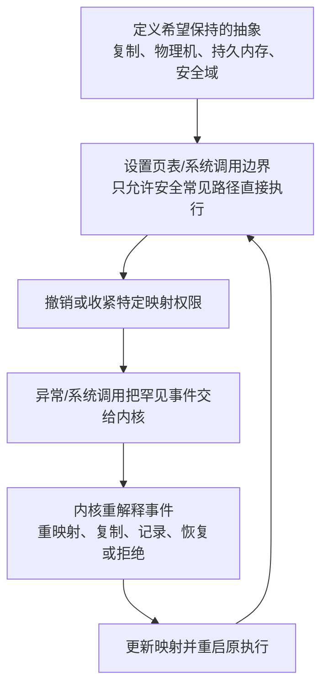
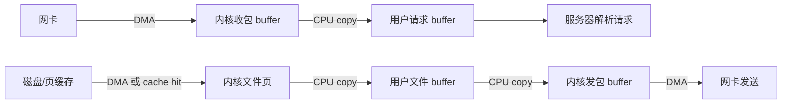
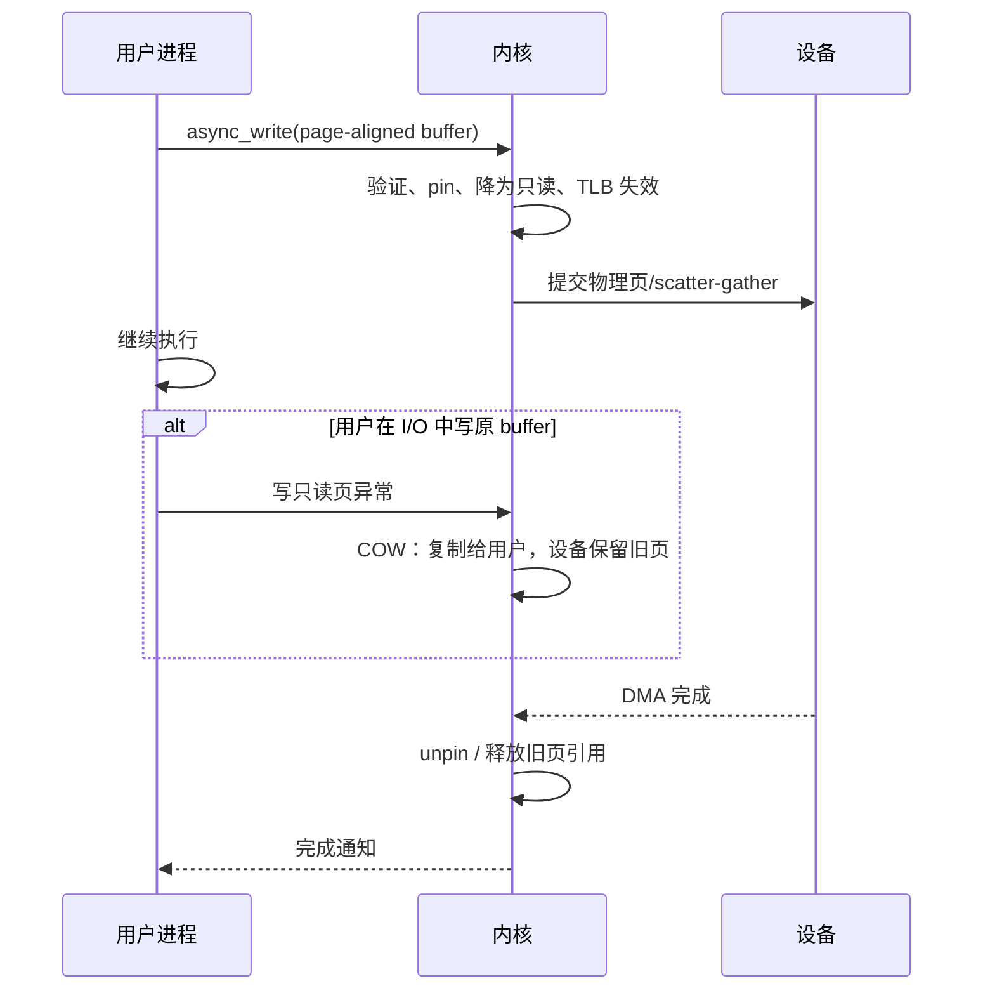
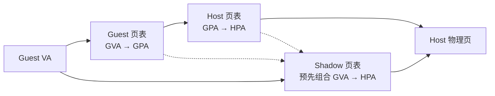
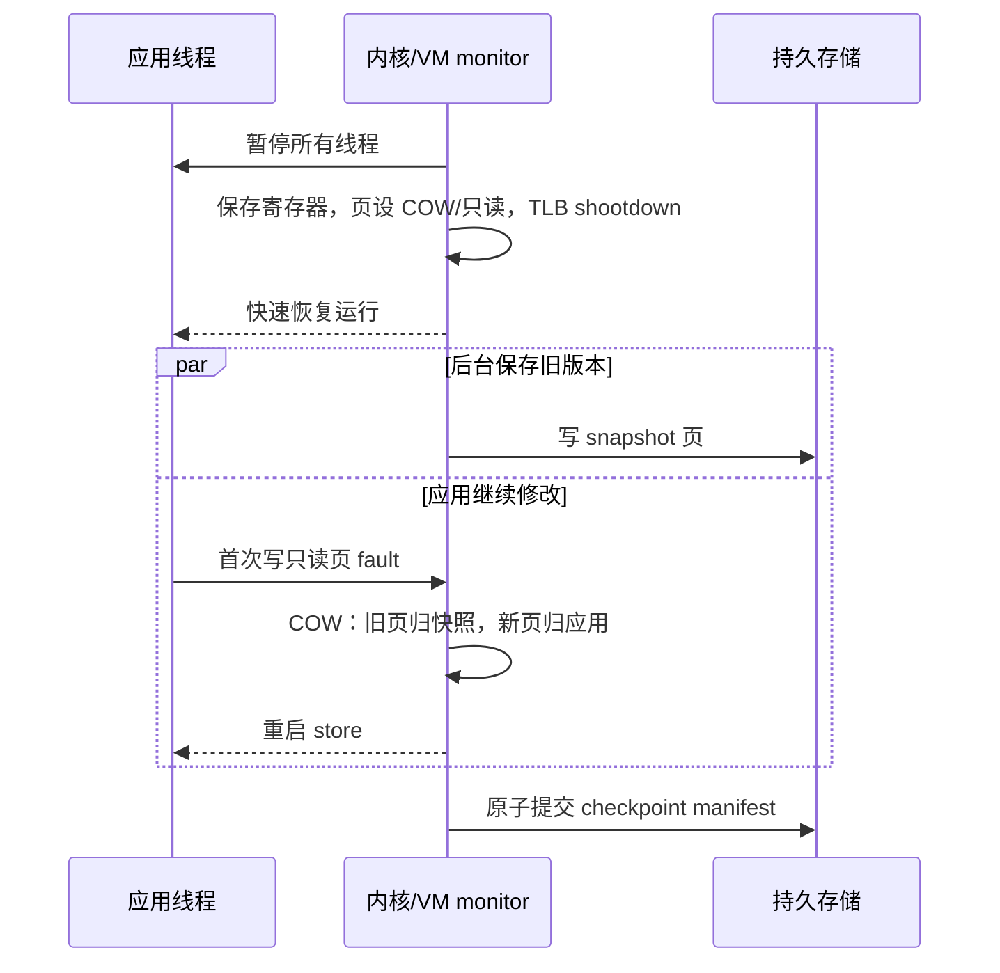
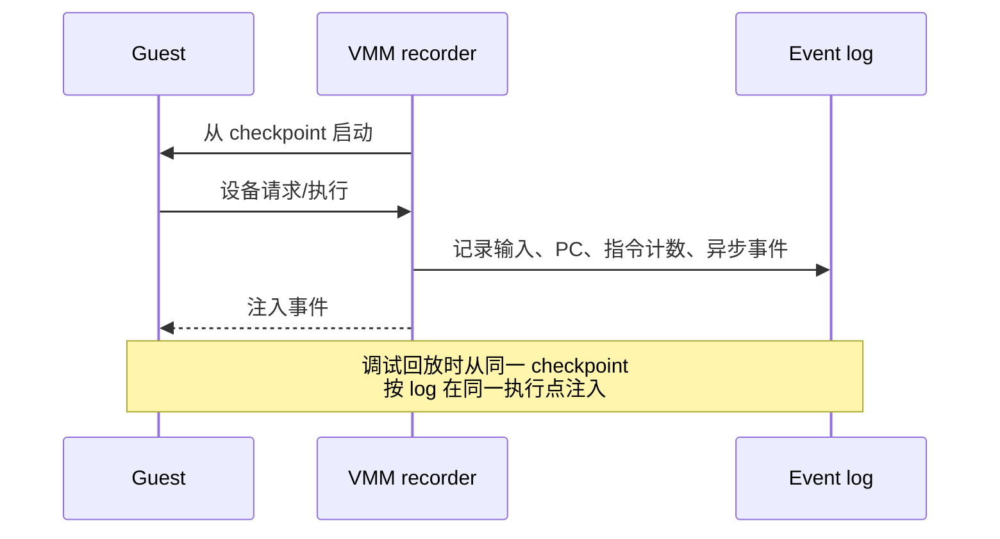
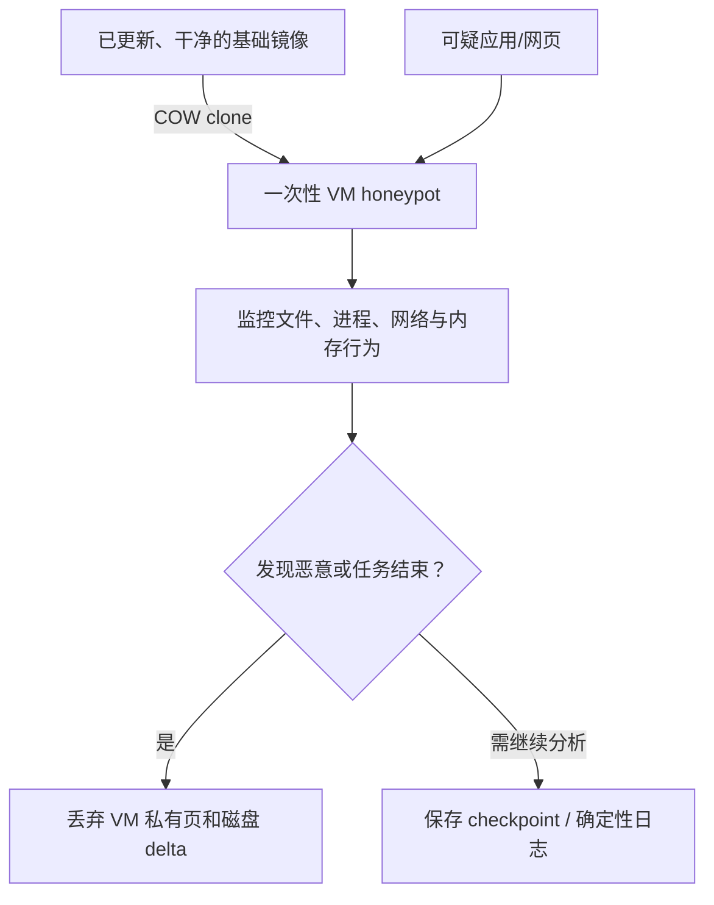
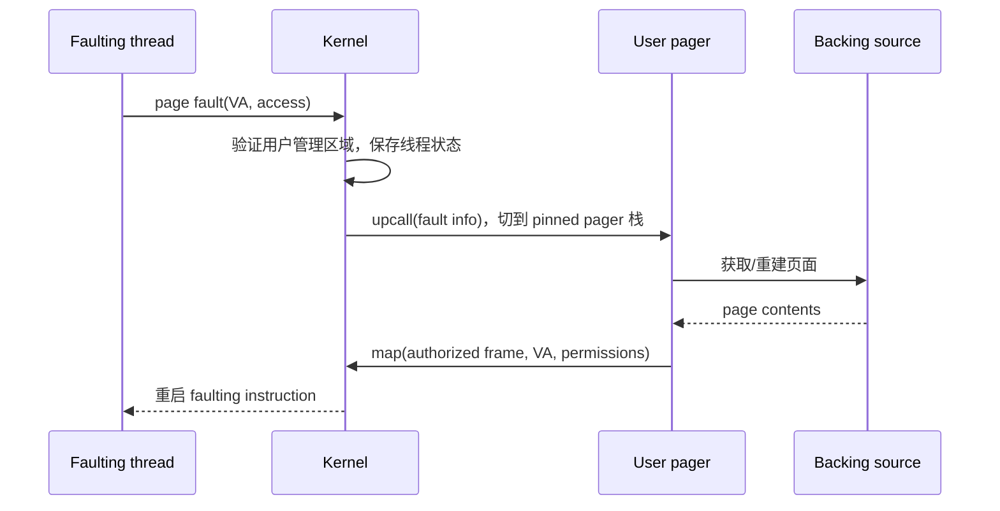

> 书名：*Operating Systems: Principles and Practice*（第二版）<br>
> 卷名：Volume III: *Memory Management*<br>
> 作者：Thomas Anderson、Michael Dahlin<br>
> 笔记范围：第 10 章 `Advanced Memory Management`，包括 10.1～10.6 节及章末练习<br>
> 原文位置：osppv3.md 的 “10 Advanced Memory Management” 部分

## 全章主线

第 8 章建立地址转换机制，第 9 章用它实现按需分页。本章进一步把地址转换当成一种**可编程的介入点（interposition point）**：内核不必检查每次正常访问，只需通过页表权限让特定、少见的访问触发异常，再在异常处理程序中重新解释它。

这一方法反复出现：



它与此前机制一脉相承：

- **保护**：未授权页不可访问；
- **fill/zero-on-demand**：invalid 页首次访问时装入或清零；
- **copy-on-write**：共享页首次写时才复制；
- **映射文件**：文件页首次访问时读入；
- **虚拟内存**：不驻留页 fault 后从后备存储恢复。

本章的新应用是：

| 服务 | 地址转换扮演的角色 |
|---|---|
| 零拷贝 I/O | 改 PTE 指针模拟大块复制，或让 DMA 直接访问用户页 |
| 虚拟机 | 组合 guest 与 host 两级映射，隔离多个“操作系统” |
| 内存去重/压缩 | 多个逻辑页共享物理表示，首次写/访问时展开 |
| 检查点 | COW 冻结某一时刻的内存版本，同时让程序继续运行 |
| 可恢复内存 | 用首次写异常追踪脏页，保存增量快照 |
| 确定性调试 | 快照初态并记录所有非确定输入，随后精确回放 |
| 安全 honeypot | 在可丢弃 VM 克隆中运行可疑代码 |
| 用户级分页 | 内核将特定页故障 upcall 给应用自己的 pager |

难点不在“再加一层间接”本身，而在维持生命周期和一致性：谁拥有物理页？异步 I/O 期间谁能改它？两级页表谁是真相？快照过程中程序继续写怎么办？用户 pager 自己 fault 又怎么办？每一节都围绕这些问题展开。

## 10.1 零拷贝 I/O（Zero-Copy I/O）

### 问题：保护边界制造了额外内存复制

用户态 Web 服务器处理请求时，典型数据路径是：



DMA 负责设备与内存之间搬运，CPU copy 则在内核/用户 buffer 之间读写同一批字节。把 Web 服务器移入内核能省复制，却把庞大、可配置、易出 bug 的应用加入可信计算基，不值得。

**零拷贝（zero-copy）**不是绝对没有任何数据移动：磁盘到 DRAM、DRAM 到网卡仍要传输。它通常指消除保护域之间不必要的 CPU 内存到内存复制，让同一物理页通过映射/描述符在各阶段传递。

### 复制成本模型

设传输数据量为 $N$ bytes，跨边界 CPU copy 次数为 $k$，可持续内存流量带宽为 $B$ bytes/s。一次 copy 要从源读 $N$、向目标写 $N$，最低内存流量是 $2N$，所以

$$
T_{copy}\gtrsim\frac{2kN}{B}.
$$

这只是下界，未含 cache 污染、分配、NUMA、系统调用和协议处理。

例如发送 64 MiB 文件，用户/内核间有两次 copy，内存带宽 20 GiB/s：

$$
Traffic=2\times2\times64\ \text{MiB}=256\ \text{MiB},
$$

$$
T_{copy}\gtrsim\frac{256\ \text{MiB}}{20\ \text{GiB/s}}=12.5\ \text{ms}.
$$

零拷贝把字节级 $O(N)$ copy 换成页级元数据操作，页数

$$
n=\left\lceil\frac{N}{P}\right\rceil,
$$

成本近似

$$
T_{map}\approx nC_{PTE}+C_{pin}+C_{shootdown}+C_{setup}.
$$

仍是 $O(N/P)$，但常数和内存流量小得多。对很小消息，系统调用、PTE、pin 和 shootdown 的固定成本可能高于 `memcpy`，所以原书强调大块数据才值得。

### 用户到内核/设备：借用用户页

应用把页对齐 buffer 交给 `write`/异步 I/O：

1. 内核验证完整用户范围和权限；
2. pin 对应页框，防止 I/O 中途被换出、迁移或释放；
3. 给设备/网络栈建立 scatter-gather 描述符；
4. 为保证异步发送的是调用时数据，暂时把用户映射降为只读；
5. 设备 DMA 直接从这些页框读取；
6. 完成后解除 pin、恢复权限并通知应用。

若应用在 I/O 完成前写该页，硬件触发异常。内核可用 COW 给应用新页：设备继续读旧快照，应用在新副本上修改，二者语义不冲突。



pin 过多会让 VM 无法回收页，造成内存压力；内核必须限制数量、校验生命周期，并在进程退出/取消 I/O 时安全撤销。

### 内核到用户：重映射而不是复制

设备已把数据填入内核整页 buffer，而应用提供一个页对齐空 buffer。传统实现把字节复制过去；重映射实现可：

1. 解除用户空页的 PTE，回收其旧页框；
2. 把用户 PTE 指向装有数据的内核页框；
3. 设置用户权限并更新引用计数；
4. 失效旧 TLB；
5. 用户在原 VA 看见新数据。

这在虚拟地址层“看起来像 copy”，物理上只是交换指针。必须确保页内没有属于其他内核对象的秘密字节；头尾不满整页时通常仍需复制或特殊切片。页所有权、共享引用和释放协议必须明确，避免内核与用户同时把同一页当作可复用空闲页。

### 设备直接使用虚拟地址：IOMMU

现代设备通常使用 I/O 虚拟地址（IOVA），由 IOMMU 把设备访问映射到获准物理页。内核可把用户 buffer 的页框映射到设备地址空间，设备 DMA 直接读写用户页。

这与 CPU 页表类似，但隔离主体是设备：恶意/故障设备只能 DMA 到 IOMMU 授权页。设备页表、IOTLB 和 CPU cache coherence 仍需维护；不能简单把任意用户指针交给设备。

收包更复杂：数据到达前要决定属于哪个进程/队列。网卡可按连接五元组、虚拟功能或队列规则分类，把包 DMA 到预先注册的用户 buffer；错误分类会破坏隔离。

### 其他零拷贝路径与边界

静态文件服务器可用 `sendfile`/splice 类接口，让内核把页缓存直接交给网络栈，用户进程只控制元数据，文件字节不必进入用户地址空间。若应用要压缩、加密或修改每个字节，就不能完全跳过处理；可用 in-place、分段或硬件卸载减少复制。

零拷贝的主要约束：页对齐/整页粒度、pin 压力、异步生命周期、COW、TLB/IOTLB 失效、cache coherence、设备 scatter-gather 上限、安全清零与小消息固定开销。它是性能优化，不改变保护和所有权要求。

## 10.2 虚拟机（Virtual Machines）

虚拟机让 host OS/VMM 把一台“物理机幻象”作为普通执行上下文提供给 guest OS。guest 以为自己控制 CPU、物理内存和设备，host 实际在多个 guest 间复用并隔离真实硬件。

虚拟机常用于运行非本机 OS 应用、数据中心多租户、测试和迁移。内存难点是出现三个地址世界：

- **GVA（guest virtual address）**：guest 用户进程看到；
- **GPA（guest physical address）**：guest 内核以为的物理地址；
- **HPA（host physical address）**：真实 DRAM 地址。

转换组合为

$$
GVA\xrightarrow{G}GPA\xrightarrow{H}HPA,
$$

$$
T_{effective}=H\circ G.
$$

有效权限是 guest 与 host 权限的交集：

$$
Perm_{effective}=Perm_G\cap Perm_H.
$$

guest 允许写、host 只读时仍不能写；host 不能因 guest 错误配置而让它触碰其他 VM/host 内存。

### 10.2.1 虚拟机页表（Virtual Machine Page Tables）

### 为什么不能只用任意一张页表

host 页表只知道 GPA→HPA；若直接给 guest 用户进程使用，它可能访问 guest 内核全部内存。guest 页表只知道 GVA→GPA；GPA 并非真实地址，硬件拿它访问 DRAM 会错。

因此运行 guest 用户进程需要两级转换的组合，同时保持 guest 用户/内核边界和 VM/host 边界。

### Shadow page table

没有硬件嵌套页表时，host 构造影子页表，直接缓存组合结果：

$$
Shadow[v].PFN=Host[Guest[v].GPFN].HPFN,
$$

$$
Shadow[v].perm=Guest[v].perm\cap Host[Guest[v].GPFN].perm.
$$



运行 guest 用户进程时，硬件只遍历 shadow，看起来像普通单层地址空间。host 必须维护其正确性：

- host 改 GPA→HPA 时，更新/失效所有相关 shadow；
- guest 改 GVA→GPA 时，也更新 shadow；
- 任何权限收紧后，相关 TLB 必须失效。

host 可把 guest 页表所在 GPA 映射为只读。guest 内核写 PTE 时 trap 到 host，host 验证、更新 guest 的逻辑 PTE 和 shadow，再恢复只读并重启。这样 guest 仍“认为自己改了页表”，实际每次敏感更新由 host 中介。

代价是写页表频繁 trap、维护反向依赖和 shadow 内存。若 host 迁移/换出 GPA，还要找到所有受影响 GVA。

### Paravirtualization

半虚拟化修改 guest 的硬件依赖层，让它知道自己在 VM 中：

- idle loop 主动 hypercall/yield，不在虚拟 CPU 上空转；
- 页表更新显式 hypercall，不靠 host 抓取只读写异常；
- 批量提交敏感操作，减少 trap。

它提高效率，却要求修改 guest，不能透明运行任意未适配 OS。现代系统常混合：硬件虚拟化处理核心隔离，paravirtual 驱动加速 I/O/时钟等高频路径。

### 硬件嵌套页表

Intel EPT、AMD NPT 等允许硬件同时持有 guest 与 host 根。TLB miss 时自动先走 guest 表得 GPA，再走 host 表得 HPA；TLB 最终缓存 GVA→HPA 组合。guest 改自己页表不必每次由 host 构造 shadow，但嵌套 page walk 更深。

设 guest 页表 $g$ 级、host 页表 $h$ 级，所有 PTE 都不命中 cache/TLB：读取每个 guest PTE 的 GPA 需一次 host 转换（$h$ 次 PTE 读取）再读该 guest PTE，共 $h+1$ 次；$g$ 级需要 $g(h+1)$。得到最终数据 GPA 后，还需 $h$ 级 host walk 加一次数据读取，即 $h+1$。总内存引用上界：

$$
N_{mem}=(g+1)(h+1).
$$

若 $g=h=4$：

$$
N_{mem}=5\times5=25.
$$

其中 24 次用于转换、1 次访问目标数据。真实 page-walk cache、普通 cache、大页和 TLB 会大幅降低平均值；公式展示最坏未缓存放大。

| 方案 | TLB miss | Guest PTE 更新 | 主要复杂度 |
|---|---|---|---|
| Shadow | 一套组合页表，walk 较浅 | host trap/同步 shadow | 软件维护映射依赖 |
| 硬件 nested | 两级组合 walk，miss 较贵 | guest 可更直接更新 | 硬件 walker 与缓存复杂 |
| Paravirtual | 可批量/显式优化 | hypercall | 需修改 guest |

嵌套虚拟机还会再加地址层级；系统通常通过硬件扩展、shadow 组合和大页混合控制成本。

### 10.2.2 透明内存压缩（Transparent Memory Compression）

虚拟机体现“复用复用器”的困难：guest 认为自己分配真实页框并在进程间共享，host 又在 VM 间复用 guest“物理”页。guest 知道哪些页空闲、哪些应用共享；host 能看到字节和访问，却不知道语义。

例如 guest 进程退出后把页放入 guest free list，host 不知道这些页已无价值，可能先换出仍活跃页。多个 VM 都运行相同 OS、库和 Web server，也会保存大量内容相同的页，host 若不识别就浪费 DRAM。

### 相同页合并（page deduplication）

后台 scavenger 对候选页计算哈希；哈希相同后必须逐字节验证（哈希碰撞不能当相等）。确认相同后：

1. 选择一个物理页作为共享基页；
2. 把多个 VM 的二级映射都指向它；
3. 映射降为只读并更新引用计数；
4. shootdown 旧可写 TLB；
5. 回收重复页；
6. 任一 VM 首次写时 COW，恢复自己的副本。

若有 $n$ 份相同页、页大小 $P$，忽略元数据，节省

$$
Saving=(n-1)P.
$$

100 个 VM 各有一个 4 KiB 零页，合并后从 400 KiB 降到 4 KiB，节省 396 KiB。真实收益扣除哈希、反向映射和扫描 CPU。

零页最容易合并；相同 OS/库代码也常重复。现代多租户系统需警惕 dedup 侧信道：攻击者可通过 COW 延迟判断其他 VM 是否有相同内容，因此跨安全域去重常被禁用或限制。

### 差量/压缩页

两页不完全相同但很接近时，可保留一个完整基页和另一个 delta/压缩表示：

- 基页只读，防修改后让 delta 失效；
- delta 对应映射设 invalid；
- 访问 delta 页触发 fault，host 解压/应用差量得到完整页；
- 若基页要修改，先 COW 或重新选择基页/压缩。

若完整页 $P$ bytes、压缩表示 $d<P$，每页毛节省 $P-d$；但多了压缩 CPU、元数据和首次访问重构延迟。它在 DRAM 与磁盘间增加一层：比驻留完整页慢，比磁盘 page-in 快。

### 透明扫描与显式协作

透明 scavenger 无需改 guest，但要耗 CPU/内存带宽，且只能从字节猜语义。显式协作如 balloon driver、free-page reporting：guest 告诉 host 哪些页可收回，host 增减 guest 内存配额。协作更准确，却要求 guest 支持并处理“host 收走页框”的资源变化。

最佳系统常组合：显式报告空闲页，COW 合并可信域中的相同只读页，压缩冷页，真正内存压力下再换出磁盘。

## 10.3 容错（Fault Tolerance）

硬件、内核和应用都会失败。普通应用把用户文档写入文件；长时间模拟、VM 和复杂内存数据结构还希望恢复**执行状态**，避免从头重算。

容错设计必须先定义故障模型：这里只主要讨论 fail-stop/崩溃与断电，假设持久存储上已确认写入的数据可在重启后读取。内存随机损坏、恶意篡改、存储同时丢失需校验、复制等额外机制。

三个相关但不同目标：

- **Checkpoint/restart**：保存某一时刻完整一致状态，崩溃后回到该点；
- **Recoverable virtual memory**：频繁保存指定内存段的增量，减少丢失工作；
- **Deterministic replay**：保存初态与非确定事件，让同一执行轨迹可重现以调试。

### 10.3.1 检查点与重启（Checkpoint and Restart）

### 检查点必须包含什么

进程 checkpoint 至少包括：

- 所有线程 PC、SP、通用/浮点/SIMD 寄存器与信号状态；
- 地址空间布局、页内容、权限和共享关系；
- 进程元数据，如打开文件、当前位置、凭据、计时器；
- 需要恢复的 IPC、设备和内核中系统调用状态。

恢复时重建这些状态并从保存 PC 继续。只复制用户内存不一定够：线程正在 `read`、socket 对端已收到消息、文件 offset 已推进，都会使重启后语义不同。

### 为什么边复制边运行会得到不一致快照

假设共享不变量 $x=y$。复制线程先保存旧 $x=0$；应用随后原子地把内存中 $x,y$ 都改为 1；复制线程再保存新 $y=1$。磁盘快照得到 $(x=0,y=1)$，这个状态从未在真实执行中存在，恢复后不变量破坏。

最简单正确方法是停止所有线程、复制全部状态、再恢复，但 pause 与内存大小成正比。

### COW 快照算法

1. 暂停进程所有线程，到达一致边界；
2. 保存各线程寄存器和地址空间元数据；
3. 给当前每个物理页增加 snapshot 引用，将运行映射降为只读/COW；
4. TLB shootdown，保证所有 CPU 不再持有旧可写权限；
5. 恢复线程；
6. 后台把 snapshot 所引用的页写入持久存储；
7. 应用首次写某页时 fault，内核复制：旧页留给 snapshot，新页给应用写；
8. 页面写入 checkpoint 后释放 snapshot 引用；全部写完后原子提交 manifest。



**一致性论证。** 在暂停边界 $t_0$，每个逻辑页指向一个确定物理版本。恢复运行前这些版本都被 COW 保护：应用写入只能获得新副本，不能改变 snapshot 引用的旧版本。因此后台无论以何种顺序写页，所有字节都来自同一逻辑时刻 $t_0$。寄存器也保存于 $t_0$，恢复状态一致。

COW 只缩短 stop-the-world pause，不减少总写入量。若应用修改速度快，COW 会暂时保留很多双版本页，内存压力可能很大；快照写带宽必须足以完成。

### 检查点、系统调用与外部副作用

VM 层更容易 checkpoint：host 可把整个 guest 内存、vCPU 和虚拟设备状态视为一体；guest 正在 trap handler 中也可从保存机器状态继续。

普通进程更难：打开 socket 的远端状态不随本机回滚，已发送支付请求不能因恢复而“撤销”。重启可能重复外部操作。解决方法包括：

- 只 checkpoint 可重开文件，记录 path/offset；
- 对外部请求使用唯一 ID、幂等语义和去重；
- 与远端协调分布式 checkpoint；
- 明确不支持某些设备/连接；
- 在应用安全点 checkpoint，而非任意指令。

地址转换只能保证内存快照一致，不能自动回滚现实世界副作用。

### 进程/虚拟机迁移

Checkpoint 是迁移基础：目标机恢复保存状态。为降低停机，可 pre-copy：运行时先复制大部分页，反复复制上轮弄脏的页，最后短暂停机复制剩余 dirty 页和寄存器，再切换网络路由。

若应用脏页产生速率 $D$ bytes/s、网络可用复制带宽 $B$，只有 $D<B$ 时 dirty 集合期望收敛；否则每轮新脏数据不小于传输能力，需要停止更久、限速应用或 post-copy（先迁执行，缺页再从源拉取）。

### 检查点间隔的成本权衡

设 checkpoint 等效暂停/资源成本为 $C$ 秒，每隔 $I$ 秒一次；故障为 Poisson，平均无故障时间 $M$，故障率 $\lambda=1/M$。每单位时间 checkpoint 开销约

$$
\frac{C}{I}.
$$

故障随机落在周期内，平均丢失工作 $I/2$，每单位时间损失

$$
\lambda\frac{I}{2}=\frac{I}{2M}.
$$

总开销近似

$$
O(I)=\frac{C}{I}+\frac{I}{2M}.
$$

求导：

$$
O'(I)=-\frac{C}{I^2}+\frac{1}{2M}=0,
$$

得到 Young 近似：

$$
\boxed{I^*=\sqrt{2CM}}.
$$

二阶导 $2C/I^3>0$，故为最小。它假设 checkpoint 成本小于间隔、故障独立、恢复成本/连续故障忽略；实际还要考虑写带宽、RPO、RTO 和故障相关性。

### 10.3.2 可恢复虚拟内存（Recoverable Virtual Memory）

完整 checkpoint 太大，无法每几百毫秒写一次。理想日志记录每个 store 的地址和值，但每次 store 都 trap/持久化会把程序降到异常处理速度。

页保护提供折中：只捕获每个 checkpoint 周期内**每页第一次写**。第一次写时置软件 dirty 并恢复可写；同页后续写全速。周期结束只保存 dirty 页，形成 incremental checkpoint。

### 增量检查点协议

假设已有完整基线 $C_0$：

1. 正常运行期间，首次写只读页 fault，将页加入 `dirty_set`，恢复 RW；
2. 到 checkpoint 边界，短暂停所有线程；
3. 保存寄存器/元数据；
4. 对 `dirty_set` 中页面建立 COW snapshot；
5. 将这些运行映射重新设为只读，清空下一周期 dirty 集；
6. shootdown 后恢复线程；
7. 后台把本次页面版本写成增量 $\Delta_i$；
8. 所有数据持久后原子提交 $\Delta_i$ 的索引/校验和；未完整提交的增量在恢复时忽略。

恢复：

$$
State_i=C_0\oplus\Delta_1\oplus\Delta_2\oplus\cdots\oplus\Delta_i,
$$

其中 $\oplus$ 表示按顺序用较新页版本覆盖旧版本，不是按位 XOR。


周期边界暂停 + COW 保证同一 $\Delta_i$ 的各页来自一个逻辑时刻；原子 manifest 保证崩溃时不会应用半写增量。

### 带宽、RPO 与 RTO

每周期新增 dirty 页数 $d$，页大小 $P$，间隔 $I$，持久写带宽 $B$。增量必须在下一周期前写完，必要条件：

$$
dP\le BI,
$$

等价于新脏页速率

$$
\frac{d}{I}\le\frac{B}{P}.
$$

更短间隔降低恢复点目标（RPO，最多丢多少工作），却增加保护切换、manifest 和小 I/O 开销。增量链太长又增加恢复时间目标（RTO）：恢复要应用很多 delta。系统应周期性合并/生成新完整基线。

只把真正需要持久恢复的数据放入专门 segment，可减少扫描和写带宽；临时 cache、可重建索引和栈未必都值得保存。

### 页粒度的浪费与更细增量

只改 8 bytes 也要保存 4 KiB 页。改进有两类：

- snapshot 后把新旧页按 cache line/小块比较，仅编码差异；
- 编译器/SFI 写屏障记录被写地址或小块 bitmap，周期内每块只记一次。

前者无需改应用但要扫描/比较；后者精确但每次 store 增加检查，可信运行时更复杂。练习 2 会详细设计。

### 信息泄漏与崩溃边界

旧 checkpoint/delta 会保留用户已删除或改写的敏感内容。发送文档、销毁账号或加密密钥轮换时，要考虑历史版本、备份和日志擦除；“当前版本看不见”不等于存储上不存在。

可恢复虚拟内存保证的是内存快照恢复，不自动保证外部文件、数据库或网络与其处于同一事务。跨资源一致性需要日志、事务或协调协议。

### 10.3.3 确定性调试（Deterministic Debugging）

并发 bug 依赖罕见调度，加入日志/断点又改变时序。确定性回放希望第一次发生时记录足够信息，之后从同一初态精确重现。

### 单处理器需要记录什么

单核 guest 的执行由三类输入决定：

1. 初始内存和寄存器状态（checkpoint）；
2. 设备/用户输入数据；
3. 异步中断发生的精确执行点。

host/VMM 中介虚拟设备和中断，可记录事件：

```text
Event = {
	retired_instruction_count,
	guest_program_counter,
	event_type,
	input_payload
}
```

只记 PC 不够：循环会多次经过同一 PC；只记墙钟时间也不够：主频、cache 和 host 调度会变化。退役指令计数加 PC 可定位“第几次到达这个指令”。回放时在相同计数/PC 注入相同中断与输入。



长时间运行可周期 checkpoint；调试时从接近 bug 的快照开始，重放后续日志，避免从开机重跑数周。

### 多核为什么困难

多个核心的共享内存操作可真正同时发生，结果受 cache coherence、弱内存序和原子操作全序影响。仅记录外部中断不足。

若程序 data-race-free，普通共享访问都由锁/原子同步，记录“每个同步对象由哪条线程按什么顺序获得”可能足以重现高层行为，再配合外部输入与中断。若存在 data race（往往正是待调 bug），必须记录更细的共享内存顺序，日志量和运行扰动巨大。

还需处理 DMA、设备完成、随机数、时间读取、性能计数器和非确定系统调用。回放系统必须虚拟化或记录所有能被 guest 观察的非确定源。

确定性调试不等于程序本身正确，也不保证跨不同 CPU 型号完全重放。它把“一次不可复现失败”变成可反复分析的轨迹，代价是记录、存储和执行减速。

## 10.4 安全（Security）

硬件/软件地址转换把普通应用隔离在进程内，但攻击者会利用浏览器、应用或内核中的未知漏洞逃出边界。用户又不可能在安装前证明几十万个应用都可信。本节用 VM 克隆构造额外隔离层。

### 虚拟机 honeypot

运行可疑程序前：

1. 从干净 OS checkpoint 创建 VM 克隆；
2. 内存和磁盘页最初 COW 共享，只在修改时分配，创建成本低；
3. 给克隆受限网络、设备和凭据；
4. 在克隆中运行程序/访问网站并监控行为；
5. 若恶意或测试结束，丢弃克隆及所有私有页；
6. 必要时把检测结果/日志送出，不把克隆状态合回主系统。



地址转换让克隆经济可行：相同 OS 页共享，修改页 COW，冷页可压缩，checkpoint 可快速恢复。杀掉 VM 比重装被感染主系统便宜。

### 纵深防御

网页攻击要完全接管物理主机，可能需连续突破：

$$
	ext{脚本运行时/浏览器}\rightarrow
	ext{guest OS}\rightarrow
	ext{VMM/host}.
$$

每层使用独立代码和权限，攻击者需要多个不同漏洞，降低联合成功概率。若简单假设各层独立、突破概率 $p_i$，全链概率为

$$
P_{escape}=\prod_i p_i.
$$

现实漏洞并不独立，公共库、配置错误和侧信道会相关，所以公式只表达直觉，不能当安全证明。

### Honeypot 的局限

**检测困难。** 恶意程序可潜伏、等待日期/用户动作或识别自己在 VM 中，短时无异常不证明安全。

**外部副作用。** 即使 VM 最终丢弃，恶意软件已发出的网络数据、垃圾邮件或攻击不能回滚。honeypot 必须限制网络和真实凭据。

**VM escape。** guest 漏洞与 VMM/设备仿真漏洞组合仍可突破 host；虚拟设备接口越复杂，攻击面越大。host 与固件必须及时更新、最小权限运行。

**侧信道与共享资源。** 共享 cache、dedup、分支预测器和内存总线可能泄漏其他租户信息；“页表隔离”不等于微架构完全隔离。

**持久化污染。** 若基础镜像本身已感染，所有克隆继承；checkpoint/快照也可能保存恶意状态。必须有可信构建、签名和独立更新链。

安全 honeypot 是降低后果、收集证据的工具，不替代漏洞修复、代码签名、权限最小化和备份。

## 10.5 用户级内存管理（User-Level Memory Management）

通用内核只看到页的访问/脏位，应用往往知道更多：数据库知道下一轮扫描哪些页，GC 知道哪些页已清空，VM guest 知道哪些“物理页”其实在 free list，浏览器知道不同沙箱的对象边界。

目标是分离：

- **内核机制与全局政策**：分配物理页框、隔离进程、控制总配额、处理中断；
- **应用局部政策**：页从哪里取、哪些页可访问、淘汰谁、怎样压缩或重建。

内核不能把任意物理内存权力交给应用；应用只能管理已授权页框和虚拟区域。

### 为什么两级资源管理会冲突

**GC。** GC 扫描整个 heap 会把所有页 use bit 置 1，内核误认为都热；但 GC 知道刚清空页最适合淘汰。heap 太小会频繁 GC，太大则内核偷偷 paging，双方都作出错误决策。

**数据库。** 数据库按可用 DRAM 选择 join/sort 分块并维护自己的 buffer pool；内核若再把其预期驻留页换出，就形成双重缓存和不可预测 page fault。

**虚拟机。** guest 以为有固定 GPA 页框，host 又可把它们换出。host 若通知内存配额增减，guest 可选择牺牲真正冷页，而不是被 host 盲选。

解决原则与 scheduler activations 相似：资源数量变化要显式通知上层资源管理器。

### 模型一：Pinned pages

应用请求把一组 VA 固定到物理页框，内核不正常换出/迁移。应用可自行用这些页做 buffer pool、DMA 或用户级 cache。

优点：接口简单、性能可预测、避免双重 paging。代价：pin 页减少全局可回收内存；恶意应用可耗尽页框。内核必须设权限、配额和进程退出清理，极端内存压力下是否允许强制撤销也要明确。

pin 只保证驻留，不保证 CPU cache、NUMA 位置或数据持久化；设备 DMA 还需 IOMMU 映射。

### 模型二：用户级 pager

应用给某个虚拟段注册 page-fault handler：

1. 线程访问 invalid/受保护页，CPU trap 到内核；
2. 内核验证该地址属于用户管理段；
3. 内核保存 faulting 线程状态，在专用栈上 upcall pager；
4. pager 决定从本地文件、远端内存、压缩区或其他对象获取数据；
5. pager 请求内核把其获准页框映射到 fault VA、设置权限；
6. pager 返回，内核重启 faulting 指令。



### 为什么 pager 必须 pinned

若 pager 代码、栈、页表元数据或取页所需 buffer 自己不驻留，处理 fault 时又 fault，需要再次调用同一个 pager，形成无限递归/死锁。最小可信工作集必须 pinned：

- handler 代码和专用栈；
- fault 队列与映射元数据；
- 与内核通信所需页面；
- 至少一部分 I/O buffer；
- pager 依赖的锁持有者也必须能运行。

更稳健的设计把 pager 放在独立进程/线程，使用预留 emergency pages；即使被管理进程所有普通线程阻塞，pager 仍可前进。

### 并发、安全与活性

多个线程可同时 fault 同一页。pager 要合并请求：第一个发起 I/O，其余等待；否则重复读取、安装不同页框或丢失写入。

内核必须检查 pager 只能映射自己拥有/被授予的页框，不能伪造 PFN 指向内核或其他进程。权限提升、共享和可执行映射仍受 W^X、凭据和全局安全策略约束。

pager 本身出错可能让所属应用死锁或数据损坏，但不应破坏内核/其他应用。内核还需处理 pager 退出、超时、取消、进程 fork/exec 和内存配额收回。

### 可实现的高级服务

- 应用自定义远端内存层级；
- 数据库按查询计划决定 eviction；
- GC 在内存压力时先压缩而非被内核换页；
- 用户态 COW、快照和持久对象；
- 浏览器/运行时为插件建立细粒度沙箱；
- VM guest 接收 host 的页框 donation/revocation。

Linux `userfaultfd`、用户态文件系统/运行时 pager 等现代机制体现类似思想，但具体 API、安全限制和支持事件随版本变化。本章关注的是机制—策略边界，而非某一 API 手册。

### 用户级管理并非总是更好

应用需实现复杂异常、并发和恢复逻辑；每次 user/kernel 往返有成本；全局内核仍比单应用更了解跨进程公平、NUMA 与系统压力。简单应用用内核默认策略更安全。适合用户级 pager 的是数据库、VM、语言运行时等已经承担资源管理职责的大型系统。

## 10.6 总结与未来方向

第 8–10 章形成完整递进：地址转换提供保护与可控异常；缓存/虚拟内存把 DRAM当作后备存储 cache；本章再用同一介入点构造性能、虚拟化、可靠性和安全服务。

核心结论：

1. 零拷贝通过页重映射、pin、COW 或 IOMMU 消除保护域间 CPU copy，但设备传输和所有权管理仍存在。
2. 虚拟机地址是 $GVA\to GPA\to HPA$ 两级组合；shadow 预先合成，nested paging 由硬件实时组合，TLB 缓存最终结果。
3. Host 与 guest 都管理内存会互相误导；去重、压缩和 balloon/free-page reporting 分别用透明推断或显式协作减少浪费。
4. COW checkpoint 在短暂停顿边界冻结一致页版本，让应用与后台写盘并行；它减少 pause，不减少总 I/O。
5. 增量 checkpoint 用首次写 fault 追踪 dirty 页，以页粒度换运行速度；恢复需基线、按序 delta 和原子提交元数据。
6. 确定性回放保存初态、输入和异步时机；多核还需同步/共享内存顺序。
7. VM honeypot 提供可丢弃安全层和纵深防御，但无法回滚外部泄漏，也可能遭 VM escape/侧信道。
8. 用户级 pager 把局部策略交给更懂语义的应用，内核仍保留物理分配和隔离权力；handler 的 pinned 工作集是活性根基。

未来内存层级和服务会更复杂，内核不可能内建每个数据库、GC、浏览器和 VM 所需策略。趋势可能是内核提供更少但更强的机制：安全页表控制、fault upcall、资源配额、IOMMU 和通知；应用运行时成为“小型操作系统”。

贯穿本章的方法是：用一层间接把逻辑状态与物理表示分开；用权限制造精确、稀有的控制转移；用 COW/压缩/组合避免立即复制；最后严格管理旧版本、异步操作和资源回收。

## 用 C++ 验证关键机制

下面示例使用 C++17。`sendfile` 示例仅适用于 Linux；当前环境没有 C/C++ 编译器，因此未做本地编译，算法输出已用独立计算复核。

### 实验一：用 Linux `sendfile` 避免用户态中转 buffer

示例创建本地文件和 UNIX socket pair。关键传输调用 `sendfile(socket, file, ...)` 让内核把文件页缓存直接送入 socket，不先 `read` 到用户 buffer 再 `write` 回内核。接收端为展示结果仍需读取数据。

```cpp
#include <cerrno>
#include <cstring>
#include <fcntl.h>
#include <iostream>
#include <sys/sendfile.h>
#include <sys/socket.h>
#include <unistd.h>

int main() {
	const char* path = "sendfile_demo.txt";
	const char* message = "zero-copy page transfer";
	const std::size_t length = std::strlen(message);

	int file = open(path, O_RDWR | O_CREAT | O_TRUNC, 0600);
	if (file == -1 || write(file, message, length) !=
						  static_cast<ssize_t>(length)) {
		std::cerr << "create/write failed: " << std::strerror(errno) << '\n';
		return 1;
	}

	int sockets[2];
	if (socketpair(AF_UNIX, SOCK_STREAM, 0, sockets) == -1) {
		std::cerr << "socketpair failed: " << std::strerror(errno) << '\n';
		close(file);
		unlink(path);
		return 1;
	}

	off_t file_offset = 0;
	ssize_t sent = sendfile(sockets[0], file, &file_offset, length);
	if (sent != static_cast<ssize_t>(length)) {
		std::cerr << "sendfile failed/short: " << std::strerror(errno) << '\n';
		return 1;
	}

	char received[128]{};
	std::size_t total = 0;
	while (total < length) {
		ssize_t count = read(
			sockets[1], received + total, length - total
		);
		if (count <= 0) {
			std::cerr << "read failed/closed\n";
			return 1;
		}
		total += static_cast<std::size_t>(count);
	}

	std::cout << "sent " << sent << " bytes: " << received << '\n';

	close(sockets[0]);
	close(sockets[1]);
	close(file);
	unlink(path);
}
```

编译运行：

```bash
c++ -std=c++17 -O2 sendfile_demo.cpp -o sendfile_demo
./sendfile_demo
```

示例输出：

```text
sent 23 bytes: zero-copy page transfer
```

这只证明接口语义，不直接测得 DMA/copy 次数。可用性能计数器、CPU 使用率和不同数据大小比较 `read+write` 与 `sendfile`；小文件可能因固定开销看不到收益。

### 实验二：组合 guest/host 页表生成 shadow 翻译

使用章末练习 1 的表。数组元素是下一层页框号，`-1` 表示 invalid。

```cpp
#include <cstdint>
#include <iomanip>
#include <iostream>
#include <string>
#include <vector>

struct Result {
	bool valid = false;
	std::uint32_t physical_address = 0;
	std::string error;
};

Result translate(
	std::uint32_t guest_virtual_address,
	const std::vector<std::vector<int>>& guest_tables,
	const std::vector<int>& host_table
) {
	unsigned segment = guest_virtual_address >> 28;
	unsigned page = (guest_virtual_address >> 16) & 0xFFFu;
	unsigned offset = guest_virtual_address & 0xFFFFu;

	if (segment >= guest_tables.size() ||
		page >= guest_tables[segment].size() ||
		guest_tables[segment][page] < 0) {
		return {false, 0, "invalid guest virtual address"};
	}

	unsigned guest_frame =
		static_cast<unsigned>(guest_tables[segment][page]);
	if (guest_frame >= host_table.size() ||
		host_table[guest_frame] < 0) {
		return {false, 0, "invalid guest physical address"};
	}

	unsigned host_frame =
		static_cast<unsigned>(host_table[guest_frame]);
	return {
		true,
		static_cast<std::uint32_t>((host_frame << 16) | offset),
		""
	};
}

int main() {
	const std::vector<std::vector<int>> guest_tables{
		{0x0002, 0x0006, 0x0000, 0x0005},  // Page Table A
		{0x0001, 0x0004, 0x0003}           // Page Table B
	};
	const std::vector<int> host_table{
		0xBEEF, 0xF000, 0xCAFE, 0x3333,
		-1, 0xBA11, 0xDEAD, 0x5555
	};
	const std::vector<std::uint32_t> addresses{
		0x00000000, 0x20021111, 0x10012222,
		0x00023333, 0x10024444
	};

	for (std::uint32_t address : addresses) {
		Result result = translate(address, guest_tables, host_table);
		std::cout << "GVA 0x" << std::hex << std::setw(8)
				  << std::setfill('0') << address << " -> ";
		if (result.valid) {
			std::cout << "HPA 0x" << std::setw(8)
					  << result.physical_address << '\n';
		} else {
			std::cout << result.error << '\n';
		}
	}
}
```

示例输出：

```text
GVA 0x00000000 -> HPA 0xcafe0000
GVA 0x20021111 -> invalid guest virtual address
GVA 0x10012222 -> invalid guest physical address
GVA 0x00023333 -> HPA 0xbeef3333
GVA 0x10024444 -> HPA 0x33334444
```

代码实现

$$
HPA=(HostPFN[GuestPFN[GVA]]\ll16)\mathbin{|}offset.
$$

真实 shadow PTE 还要组合权限、use/dirty、大页和 ASID，并在任一层变化时失效 TLB。

### 实验三：页级增量检查点与恢复

为便于观察，每个“页”只用一个整数表示；算法与 4 KiB 页相同：完整基线后，每轮只保存 dirty 页，崩溃恢复时顺序覆盖。

```cpp
#include <iostream>
#include <map>
#include <set>
#include <vector>

class RecoverableMemory {
public:
	explicit RecoverableMemory(std::size_t page_count)
		: live_(page_count, 0), base_(page_count, 0) {}

	void writePage(std::size_t page, int value) {
		live_.at(page) = value;
		dirty_.insert(page);  // 模拟“本周期首次写被页保护捕获”。
	}

	void fullCheckpoint() {
		base_ = live_;
		deltas_.clear();
		dirty_.clear();
	}

	void incrementalCheckpoint() {
		std::map<std::size_t, int> delta;
		for (std::size_t page : dirty_) {
			delta[page] = live_[page];
		}
		deltas_.push_back(std::move(delta));
		dirty_.clear();
	}

	std::vector<int> recover() const {
		std::vector<int> restored = base_;
		for (const auto& delta : deltas_) {
			for (const auto& [page, value] : delta) {
				restored[page] = value;
			}
		}
		return restored;
	}

private:
	std::vector<int> live_;
	std::vector<int> base_;
	std::set<std::size_t> dirty_;
	std::vector<std::map<std::size_t, int>> deltas_;
};

int main() {
	RecoverableMemory memory(4);
	memory.fullCheckpoint();              // C0 = [0, 0, 0, 0]

	memory.writePage(1, 10);
	memory.writePage(3, 30);
	memory.incrementalCheckpoint();       // delta1

	memory.writePage(1, 11);
	memory.writePage(2, 20);
	memory.incrementalCheckpoint();       // delta2

	memory.writePage(0, 99);              // 尚未 checkpoint，崩溃后丢失

	std::vector<int> restored = memory.recover();
	std::cout << "recovered:";
	for (int value : restored) {
		std::cout << ' ' << value;
	}
	std::cout << '\n';
}
```

示例输出：

```text
recovered: 0 11 20 30
```

页 0 的 99 属于最后一次已提交增量之后的工作，符合 RPO：恢复到最近完整提交的边界，而不是猜测半完成状态。

## 章末练习详解

### 练习 1：分页分段虚拟机的 shadow page table

地址格式：

```text
31        28 27                  16 15                 0
+-----------+----------------------+--------------------+
| segment 4 | page number 12       | offset 16          |
+-----------+----------------------+--------------------+
```

Guest 映射：

| Guest segment | Guest page | Guest physical frame |
|---:|---:|---:|
| 0（Table A） | 0 | `0002` |
| 0 | 1 | `0006` |
| 0 | 2 | `0000` |
| 0 | 3 | `0005` |
| 1（Table B） | 0 | `0001` |
| 1 | 1 | `0004` |
| 1 | 2 | `0003` |

Host 的 guest-physical→host-physical 页表 K：

| GPFN | HPFN |
|---:|---:|
| `0` | `BEEF` |
| `1` | `F000` |
| `2` | `CAFE` |
| `3` | `3333` |
| `4` | invalid |
| `5` | `BA11` |
| `6` | `DEAD` |
| `7` | `5555` |

翻译分两步：

$$
GPA=(GPFN\ll16)\mathbin{|}offset,
$$

$$
HPA=(Host[GPFN].HPFN\ll16)\mathbin{|}offset.
$$

#### a. 五个地址

**i. `0x00000000`**

$$
s=0,\quad page=0,\quad offset=0.
$$

Guest A[0] = `0002`，Host K[2] = `CAFE`：

$$
\boxed{HPA=0xCAFE0000}.
$$

**ii. `0x20021111`**

$s=2$，guest segment table 只有 0、1 有效：

$$
\boxed{invalid\ guest\ virtual\ address}.
$$

高层已 invalid，无需继续解释 page 2。

**iii. `0x10012222`**

$$
s=1,\quad page=1,\quad offset=0x2222.
$$

Guest B[1] = `0004`，但 Host K[4] invalid：

$$
\boxed{invalid\ guest\ physical\ address}.
$$

这说明 guest 认为 GPA 存在，不代表 host 当前有可执行 HPA 映射。

**iv. `0x00023333`**

$$
s=0,\quad page=2,\quad offset=0x3333.
$$

Guest A[2] = `0000`，Host K[0] = `BEEF`：

$$
\boxed{HPA=0xBEEF3333}.
$$

**v. `0x10024444`**

$$
s=1,\quad page=2,\quad offset=0x4444.
$$

Guest B[2] = `0003`，Host K[3] = `3333`：

$$
\boxed{HPA=0x33334444}.
$$

汇总：

| GVA | 结果 |
|---|---|
| `00000000` | `CAFE0000` |
| `20021111` | invalid guest virtual address |
| `10012222` | invalid guest physical address |
| `00023333` | `BEEF3333` |
| `10024444` | `33334444` |

#### b. Shadow 段表与页表

Shadow 直接把每个有效 GVA 页组合到 HPFN：

```text
Shadow Segment Table
	0 -> Shadow Page Table A'
	1 -> Shadow Page Table B'
	其他 invalid

Shadow Page Table A'
	0 -> CAFE   (Guest A[0]=2, Host K[2]=CAFE)
	1 -> DEAD   (Guest A[1]=6, Host K[6]=DEAD)
	2 -> BEEF   (Guest A[2]=0, Host K[0]=BEEF)
	3 -> BA11   (Guest A[3]=5, Host K[5]=BA11)
	其他 invalid

Shadow Page Table B'
	0 -> F000   (Guest B[0]=1, Host K[1]=F000)
	1 -> invalid(Guest B[1]=4, Host K[4] invalid)
	2 -> 3333   (Guest B[2]=3, Host K[3]=3333)
	其他 invalid
```

若表中还给出权限，则每个 shadow 权限必须为两层交集：

$$
Perm_{shadow}=Perm_{guest}\cap Perm_{host}.
$$

不能因组合而扩大任一层权限。

#### c. 连续 guest physical memory 中间为何可有 host invalid

“Guest 物理地址连续”只是 guest 的抽象，不要求每个 GPA 当前都有普通 HPA 映射。中间 invalid 的原因包括：

1. **Host demand paging/压缩**：该 GPA 被换到磁盘或压缩池，访问时 fault 后恢复；
2. **Balloon/free-page reporting/未承诺页**：guest 已把页归还，host 回收其 HPA，但 GPA 编号空间仍连续；
3. **MMIO/保留洞/guard**：该 GPA 表示设备寄存器或故意不可访问区域，访问需由 VMM 模拟/拒绝；
4. **透明 COW、去重或追踪**：host 故意撤销映射，以捕获首次写、use/dirty 或快照事件；
5. **尚未按需分配**：guest 被承诺一段 GPA，但 host 只在首次触碰时真正提供页框。

valid 邻居不要求中间条目 valid；页表本来就支持稀疏物理幻象。

### 练习 2：增量检查点的最大更新率与子页差量

#### a. 最大新脏页速率

页大小

$$
P=4\ \text{KiB}=4096\ \text{bytes}.
$$

若磁盘带宽按教材常用二进制口径

$$
B=10\ \text{MiB/s}=10\times2^{20}\ \text{bytes/s},
$$

每个新脏页必须整页写一次，且上一 checkpoint 必须完成才能开始下一个，所以稳定新脏页率上限：

$$
r_{max}=\frac{B}{P}
=\frac{10\times2^{20}}{2^{12}}
=10\times2^8
=\boxed{2560\ \text{pages/s}}.
$$

等价地，每页可分到

$$
1/2560\ s\approx0.390625\ ms.
$$

真实还要写索引、校验和并支付寻址/同步，安全上限应低于 2560。

若“10 MB”严格按十进制 10,000,000 bytes/s 而页仍为 4096 bytes：

$$
r\approx2441.4\ \text{pages/s}.
$$

主答案采用 OS 教材常见 MiB/KiB 口径。

#### b. 只保存页内被修改部分

页保护只能告诉内核“这一页至少写过一次”，无法知道哪些字节改变。要做子页增量，可选两条路线。

**方案一：COW 快照 + 块级比较。**

1. checkpoint 边界暂停线程，为脏页建立 COW snapshot；
2. 运行版本继续写，snapshot 版本保持边界状态不变；
3. 把 snapshot 页与上一已提交版本按 64 B/256 B 等小块比较；
4. 对不同块写记录 `(page_id, block_offset, length, data, checksum)`；
5. 全部记录持久后原子提交 delta manifest；
6. 恢复时从基线开始按 checkpoint 顺序、页内 offset 应用 patch。

优点是不改应用 store；缺点是每个脏页仍要读/比较 4 KiB，少量修改时 CPU 扫描可能成为成本。

**方案二：写屏障 + 子块 dirty bitmap。**

编译器、JIT 或 SFI 在 store 前计算页内块号，原子置 bitmap。每个块周期内第一次置位后，后续写只付很小检查；checkpoint 只复制置位块。若每页分成 64 个 64 B 块，dirty bitmap 只需 64 bits = 8 bytes/页。

优点是直接知道修改范围；缺点是每次 store 有指令开销，原生未插桩代码可绕过，bitmap 并发更新也需正确同步。

若平均每个脏页只有比例 $f$ 的字节改变，忽略元数据，理论可支持逻辑新脏页率

$$
r\lesssim\frac{B}{fP}.
$$

例如 $f=1/16$，数据带宽上限可提高约 16 倍；实际受 patch header、小随机写、比较/屏障 CPU 与恢复时间限制。

无论哪种方案，都必须保留 checkpoint 边界的一致版本，不能一边比较同一可写页、一边让应用继续改；否则 patch 仍会混合不同时刻状态。还必须让未完整提交的 delta 在崩溃恢复时可检测并忽略。

## 易混淆概念与常见误解

**零拷贝不等于数据完全不移动。** 设备仍通过 DMA 在存储/网络与 DRAM 间传输；“zero-copy”通常指省去 CPU 在内核/用户 buffer 间的额外内存复制。

**DMA 不等于零成本。** 仍需描述符、pin、IOMMU 映射、cache coherence、中断/轮询和完成处理；小消息可能 `memcpy` 更便宜。

**Pin 页不等于锁住数据内容。** Pin 只保证物理页框不被正常换出/迁移；应用仍可写，若异步 I/O 需要快照语义还要降权/COW 或协议禁止修改。

**页重映射不适合任意 buffer。** 头尾不对齐、共享一页中的无关秘密、部分页所有权都会迫使复制或复杂切片。它主要适合页对齐大块数据。

**IOMMU 不等于把用户指针原样交给设备。** 内核必须验证范围、建立设备专用 IOVA→HPA 权限并管理 IOTLB；设备不能访问任意进程地址。

**Guest physical address 不是 host 真实物理地址。** GPA 是 guest 的虚拟化“物理”空间，还要经 host/nested 页表得到 HPA。

**Shadow page table 不是 guest 页表的简单副本。** 它是 guest 与 host 两层映射及权限的组合，直接从 GVA 到 HPA。

**硬件 nested paging 不一定所有场景都更快。** Guest PTE 更新更直接，但未缓存 TLB miss 可能放大到 $(g+1)(h+1)$ 次内存访问；shadow 则把成本移到更新维护。

**Paravirtualization 不等于完整模拟。** 它修改 guest 使其主动调用 host；性能好但不透明，需 guest 配合。

**内存去重不等于免费压缩。** 扫描、哈希、逐字节验证、反向映射、COW fault 和侧信道都有成本；跨租户 dedup 可能泄漏内容相等性。

**Guest free page 不等于 host 知道它空闲。** Host 只看到 GPA 页字节和访问；需 balloon/free-page reporting 等协议传递语义。

**Checkpoint 不等于普通文件备份。** 执行 checkpoint 还要保存线程寄存器、地址空间和必要内核/设备状态，并保证各部分来自同一逻辑时刻。

**COW checkpoint 不减少总快照数据量。** 它缩短暂停并让写盘与运行重叠；完整快照仍要把所有需保存页写出，快速修改还会增加双版本内存。

**Snapshot 成功不等于外部世界回滚。** 已发网络消息、打印、支付和远端数据库更新不会随本机内存恢复撤销；需幂等 ID、事务或协调。

**Incremental checkpoint 不等于每条 store 日志。** 页保护通常只捕获周期内每页首次写，之后整页作为 delta；粒度粗但开销低。

**Dirty 页不说明所有字节都变化。** Dirty 只有一位；只改一个字节也会让整页纳入增量，除非比较或插入更细写屏障。

**可恢复虚拟内存不自动提供事务。** 它恢复某一一致 checkpoint；跨多个对象/外部存储的原子性、隔离和持久顺序仍需事务协议。

**确定性回放不等于程序无竞态。** 它可重现某一次竞态轨迹；多核 data race 可能要求记录极细内存顺序，正是最难情形。

**PC 相同不表示异步事件位置相同。** 循环会多次经过 PC；需结合退役指令计数或其他确定进度指标。

**VM honeypot 不保证恶意软件无害。** 网络泄漏与外部攻击已发生就不能靠丢弃 VM 回滚；攻击还可能潜伏、识别 VM 或利用 VMM 漏洞。

**Pinned pager 不等于不会死锁。** Pager 代码/栈驻留只是必要条件；它依赖的锁、I/O buffer、服务线程和 emergency memory 也必须能取得进展。

**用户级 pager 不能任意映射物理内存。** 内核仍验证页框所有权、权限和配额；用户只决定已授权资源的局部策略。

**把策略移到应用不总是更好。** 简单应用不值得承担 fault、并发、取消和恢复复杂度；内核更了解全局公平、NUMA 与系统压力。

### 公式速查与适用条件

| 公式 | 含义 | 关键条件 |
|---|---|---|
| $T_{copy}\gtrsim2kN/B$ | $k$ 次 CPU copy 的内存流量下界 | 每次 copy 读写 $N$，$B$ 为内存流量带宽 |
| $n=\lceil N/P\rceil$ | 大块数据涉及页数 | 页大小 $P$ |
| $T_{map}\approx nC_{PTE}+C_{pin}+C_{shootdown}+C_{setup}$ | 页重映射成本模型 | 大块、元数据成本可加 |
| $T_{effective}=H\circ G$ | GVA→GPA→HPA 组合 | Guest/host 映射均有效 |
| $Perm_{eff}=Perm_G\cap Perm_H$ | VM 最终权限 | 任一层收紧均生效 |
| $N_{mem}=(g+1)(h+1)$ | Nested walk 最坏内存引用数（含数据） | guest $g$ 级、host $h$ 级、全部未缓存 |
| $Saving=(n-1)P$ | 合并 $n$ 个相同页的毛节省 | 忽略元数据、页大小 $P$ |
| $O(I)=C/I+I/(2M)$ | Checkpoint 平均损失近似 | Poisson 故障、间隔 $I$、MTTF $M$ |
| $I^*=\sqrt{2CM}$ | Young 最优 checkpoint 间隔 | 上述模型、忽略恢复/二次故障 |
| $dP\le BI$ | 增量在下一周期前写完 | 周期脏页 $d$、带宽 $B$、间隔 $I$ |
| $r_{dirty}\le B/P$ | 整页增量最大新脏页率 | 每脏页写一整页、无额外开销 |
| $State_i=C_0\oplus\Delta_1\cdots\oplus\Delta_i$ | 基线加顺序增量恢复 | 每个 delta 完整原子提交 |

这些是分析模型而非 API 保证。Copy、压缩、I/O 与 checkpoint 可并行，cache/NUMA 会改变常数；安全与一致性不能从性能公式直接推出。

## 全章方法论总结

**一、把间接层视为可编程钩子。** 系统调用表可重定向 API，页表权限可重定向特定内存访问；不必为每次正常操作支付内核检查。

**二、先保持逻辑抽象，再优化物理表示。** 零拷贝仍表现为数据已复制，shadow/nested 仍表现为真实物理机，压缩页仍表现为完整页，checkpoint 仍表现为同一时刻状态。

**三、用 COW 分离“旧版本必须稳定”和“新版本继续变化”。** 异步 I/O 快照、内存去重、checkpoint、VM clone 都复用首次写异常与版本分叉。

**四、显式组合多层权限。** Guest 允许不代表 host 允许，用户 pager 请求不代表内核必须批准，设备 DMA 也受 IOMMU。最终能力只能是各层授权交集。

**五、识别“复用复用器”的信息缺失。** Host 与 guest、内核与 GC、内核与数据库都在管理同一资源，却看到不同语义。透明推断灵活但不准，显式通知准确但需接口与协作。

**六、缩短暂停不等于减少工作。** COW checkpoint 和 pre-copy migration 把工作移到后台；若脏页率超过写/网络带宽，系统仍无法收敛。必须做带宽守恒分析。

**七、把恢复边界扩展到外部状态。** 内存可回滚，网络/支付/设备不能自动回滚。可靠系统需要幂等、日志、事务和明确不支持范围。

**八、用记录非确定性而非记录全部执行。** 确定性回放保存初态、输入、中断和同步顺序，依靠确定计算重建其余轨迹；多核 data race 破坏这一压缩假设。

**九、每个 fault handler 都要证明自身可前进。** 用户 pager、COW、压缩页恢复都不能依赖正在 fault 的未驻留资源；pinned emergency path 是递归异常的终点。

面对类似设计，可固定追问：逻辑幻象是什么？常见路径为什么无需介入？什么事件触发慢路径？旧版本由谁持有？异步完成前谁能修改/释放？发生崩溃或 handler 自己 fault 时还能恢复吗？

## 复习检查清单

- [ ] 能区分设备 DMA、CPU copy 和“零拷贝”的真实含义。
- [ ] 能画出传统 Web I/O 数据路径并指出可消除的跨边界复制。
- [ ] 能由数据量、copy 次数和内存带宽估算复制下界。
- [ ] 能说明用户页 pin、降权、COW 和异步完成的生命周期。
- [ ] 能解释内核页重映射到用户 buffer 的所有权与安全条件。
- [ ] 能说明 IOMMU/IOVA 如何限制设备 DMA。
- [ ] 能列出零拷贝不适合小消息、非对齐和频繁修改 buffer 的原因。
- [ ] 能区分 GVA、GPA、HPA 并写出 $H\circ G$。
- [ ] 能按 guest/host PFN 表手算最终 HPA。
- [ ] 能构造 shadow PTE 并组合权限。
- [ ] 能解释 guest PTE 写为何需 trap/同步 shadow。
- [ ] 能比较 shadow、nested paging 与 paravirtualization。
- [ ] 能推导 $(g+1)(h+1)$ nested page-walk 最坏引用数。
- [ ] 能说明 guest/host 两级内存管理为何互相误导。
- [ ] 能描述相同页哈希验证、只读合并、首次写 COW 流程。
- [ ] 能分析页去重的空间收益、扫描成本和跨租户侧信道。
- [ ] 能比较完整页、delta/压缩页和磁盘后备的成本。
- [ ] 能说明 balloon/free-page reporting 相比透明扫描的优势。
- [ ] 能列出进程 checkpoint 所需内存外状态。
- [ ] 能构造“边复制边运行”产生不可能混合状态的反例。
- [ ] 能证明暂停边界 + COW 后台快照的一致性。
- [ ] 能说明 checkpoint 系统调用/网络副作用为何难恢复。
- [ ] 能推导 pre-copy 迁移收敛条件 $D<B$。
- [ ] 能推导 $I^*=\sqrt{2CM}$ 并列出假设。
- [ ] 能说明增量 checkpoint 如何捕获首次写、提交 manifest 与恢复。
- [ ] 能用 $dP\le BI$ 判断 dirty 速率是否可持续。
- [ ] 能比较块级 diff 与写屏障的子页增量方案。
- [ ] 能区分 RPO、RTO、完整 checkpoint 与增量链。
- [ ] 能列出单核确定性回放所需初态、输入和中断位置。
- [ ] 能说明 PC 为什么需配合指令计数。
- [ ] 能解释多核为何还需同步顺序，data race 为何困难。
- [ ] 能说明 VM honeypot 的 COW 创建、监控和丢弃流程。
- [ ] 能列出 honeypot 无法回滚外部副作用及 VM escape 风险。
- [ ] 能解释 GC、数据库和 VM 为什么比内核更懂局部换页策略。
- [ ] 能比较 pinned pages 与用户级 pager。
- [ ] 能画出 page fault→内核→pager upcall→映射→重启路径。
- [ ] 能解释 pager 代码、栈、元数据和 emergency pages 为何必须驻留。
- [ ] 能分析并发 fault 合并、页框所有权验证和 pager 退出处理。
- [ ] 能完整解答 shadow 页表练习及 2560 pages/s 增量上限。
