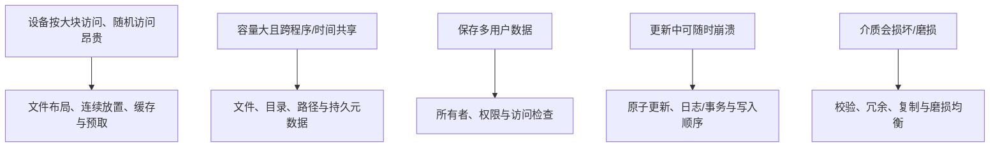
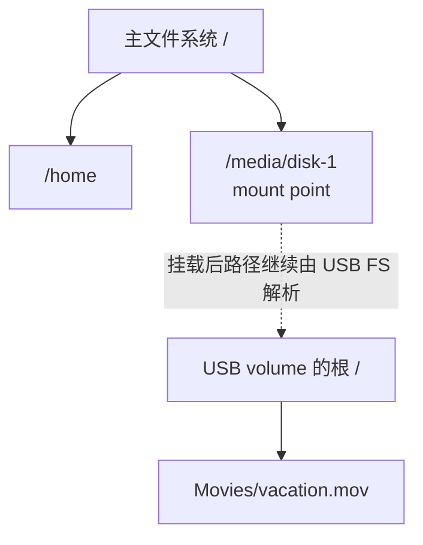
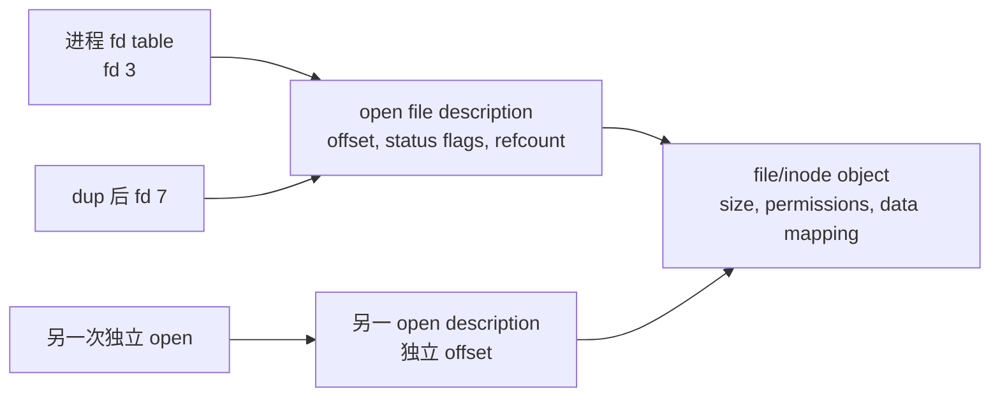
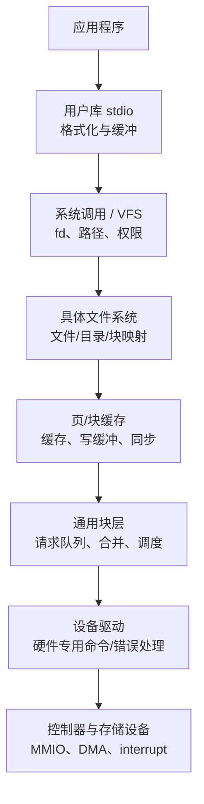
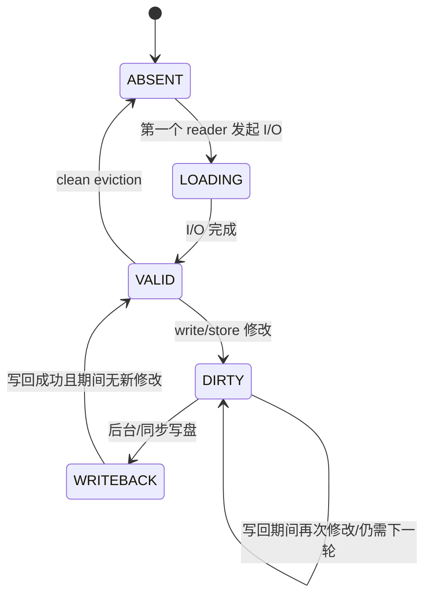
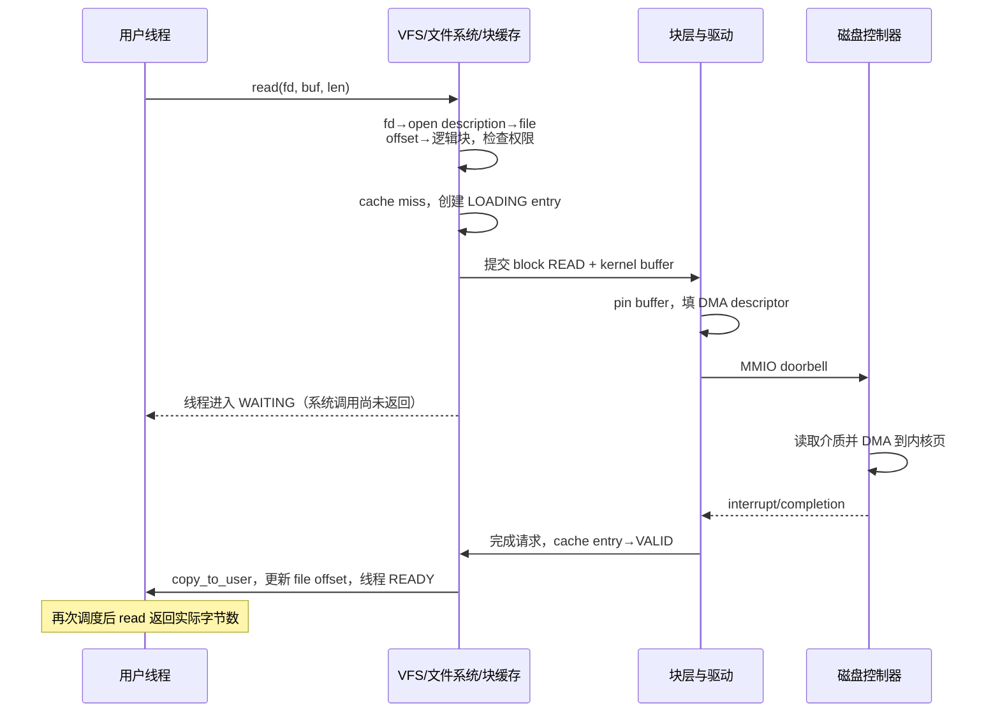

> 书名：*Operating Systems: Principles and Practice*（第二版）<br>
> 卷名：Volume IV: *Persistent Storage*<br>
> 作者：Thomas Anderson、Michael Dahlin<br>
> 笔记范围：第 11 章 `File Systems: Introduction and Overview`，包括 11.1～11.4 节及章末练习<br>
> 原文位置：osppv4.md 的 “11 File Systems: Introduction and Overview” 部分

## 全章主线

计算机必须在进程退出、操作系统崩溃和断电后仍能找到用户数据。裸存储设备只提供编号块；用户需要的是有意义的名字、任意长度文件、目录层次、共享权限和故障后的可靠状态。文件系统正是把前者变成后者的操作系统抽象。

用户同时提出五类要求：

| 目标 | 用户期望 | 底层困难 |
|---|---|---|
| 可靠性 | 断电、崩溃甚至设备损坏后仍能恢复 | 多块更新可能只完成一半，介质会损坏 |
| 大容量与低成本 | 保存 TB/PB 级数据 | 快速存储昂贵，持久介质延迟高 |
| 高性能 | 启动、查询、流媒体足够快 | 随机 I/O 有固定启动/寻址成本 |
| 持久命名 | 程序退出后仍可按人类名字找到数据 | 设备只认识块号，名字与块映射也要持久保存 |
| 受控共享 | 可按用户/组授予读写执行权限 | 多用户、并发和恶意输入会破坏隔离 |

以原书数量级为例，磁盘随机访问约 10 ms，DRAM 约 100 ns：

$$
\frac{10\ \text{ms}}{100\ \text{ns}}
=\frac{10^{-2}}{10^{-7}}=10^5.
$$

一次随机磁盘访问可慢五个数量级。因此文件系统不能把“每个字节操作”直接变成设备操作，而要布局连续块、缓存、预取和写缓冲。同时，缓存又使 `write()` 返回与真正持久化分离，应用若不理解这一点就会在断电时丢数据。

物理性质推动设计：



本章从上到下建立地图：11.1 定义文件、目录、链接、卷和挂载；11.2 解释 create/open/read/write/mmap/fsync 等接口语义；11.3 沿用户库、文件系统、块缓存、块层、驱动、MMIO/DMA/中断追踪一次请求；后续三章分别深入设备、磁盘布局和可靠更新。

### 为什么应用程序员也必须理解文件系统

抽象并不完美。文字处理器自动保存一个含图片的大文档时，简单做法可能出现：

- **慢**：文件是字节序列，不能低成本在中间“插入”字节，可能重写后半段甚至全文；
- **损坏**：原地覆盖到一半崩溃，文件混合新旧版本；
- **丢失**：先删旧文件、再把新文件移到原名，步骤间崩溃可能两者都没有；
- **假保存**：`write()` 只进入 DRAM 缓存，按钮显示完成后立即断电，更新尚未持久。

常用方案是写临时文件、同步数据、原子 `rename` 替换并同步父目录；或采用追加式文档格式、小型日志/数据库。具体 crash 保证依文件系统和 API，不能只凭“系统调用成功”推断。

## 11.1 文件系统抽象（The File System Abstraction）

### 严格定义

**文件系统（file system）**是提供**持久、命名数据**的操作系统抽象：

- **持久**：直到显式删除，数据应跨进程退出、重启和正常断电保留；
- **命名**：人类可读路径映射到文件对象，使不同程序和不同时刻能再次找到它。

持久不等于任何时刻都已 durable：写缓冲中的最新修改可能尚未到稳定介质；也不等于能承受任意设备毁坏，后者还需备份/复制。抽象承诺必须结合同步与故障模型解释。

文件系统的两个核心对象：

1. **文件**保存系统管理的元数据和应用定义的数据；
2. **目录**把名字映射到文件或其他目录。


路径只是查找方式，文件对象不是路径字符串本身；多个路径可到达同一文件。

### 文件：有类型的元数据 + 无类型的字节

**文件（file）**是文件系统中的命名数据集合。它把几乎任意长度的逻辑字节序列隐藏在一组离散设备块之后。

文件包含两部分：

**元数据（metadata）。** OS 理解并管理的信息，例如：

- 文件 ID/inode number；
- 类型（普通文件、目录、设备等）；
- 逻辑大小；
- 所有者、组和读/写/执行权限；
- 创建/修改/访问时间；
- 硬链接计数；
- 指向数据块/extent 的索引。

**数据（data）。** 应用解释的字节数组。文件系统通常不知道 `.docx`、数据库页或图片内部结构，只保证按 offset 读写字节。逻辑范围为

$$
0\le offset<size.
$$

应用负责格式版本、校验和、内部索引和兼容性。文件系统“无类型”带来通用性，也意味着它不会自动阻止应用写出逻辑损坏格式。

### OS 何时必须理解文件内容

执行文件是例外。`exec` 必须识别格式，知道代码/数据映射、入口和解释器。

- ELF 通常以字节 `0x7f 45 4c 46`（DEL + `ELF`）开头；
- 脚本以 `#! interpreter` 指定解释器；
- 某些系统用扩展名或文件元数据关联应用。

**Magic number** 比扩展名更接近内容事实，但恶意/损坏文件仍需完整边界检查；识别头不等于文件可信。

### 单字节流与多数据流

传统文件只有一条按 offset 编号的字节流。某些文件系统允许同一文件有 data fork、resource fork 或命名 alternate data streams。打开时需要指定流。

多流可把扩展属性与主要数据绑定，但也增加复制、备份和安全工具遗漏隐藏流的风险。跨文件系统传输时，目标若不支持多流，附加数据可能丢失。

### 目录：名字到对象的映射

目录不是“装着文件字节的盒子”，而是持久映射：

$$
Directory:\ name\longrightarrow file\ or\ directory\ identifier.
$$

目录可包含子目录，形成层次。路径 `/home/tom/Work/hw1.txt` 被拆成组件并逐级查找；若有 $k$ 个组件，至少需要 $k$ 次目录查找（cache 命中可避免设备 I/O）。

**绝对路径**从根 `/` 开始；**相对路径**从进程 current working directory 开始。`chdir` 改变当前目录，因此同一相对字符串在不同进程/时刻可指向不同对象。

路径中还有几种常见特殊形式：

- `.` 表示当前目录；
- `..` 表示父目录；
- `~` 和 `~name` 通常由 shell 展开为 home path，不是 POSIX 内核 path resolver 的特殊目录名。

路径解析还要处理权限、mount point、符号链接、`..` 和并发 rename。安全代码应避免先检查字符串再打开产生 TOCTOU，优先使用 `openat` 或目录 fd 等基于已打开目录的接口。

### Hard link：名字与文件生命周期分离

**硬链接（hard link）**是目录中 `name → file ID` 的直接映射。新建文件时创建第一个硬链接；`link(old,new)` 再创建一个同等名字。删除一个名字不影响其他名字。

令 `nlink` 为持久目录硬链接数，`nopen` 为当前打开引用数。Unix 式生命周期可概括为：

$$
	ext{reclaim file only if }nlink=0\land nopen=0.
$$

`unlink(path)` 只删除指定目录项并减少 `nlink`；已经 `open` 的 fd 仍引用文件对象，后续 `read` 可继续。最后 fd 关闭后，若 `nlink=0`，才回收 inode 与数据块。这支持安全临时文件和无竞态替换。

### 为什么通常禁止目录 hard link

若目录只能有一个父目录，结构是树；普通文件多硬链接后成为 DAG。允许任意目录 hard link 会产生环：递归遍历可能永不结束，`..` 的父亲不唯一，引用计数无法简单判断不可达目录。

因此 Unix 通常禁止普通用户给目录创建新 hard link，保留 `.`/`..` 等受控结构。普通文件 hard link 通常也不能跨文件系统，因为 file ID 只在所属 volume 内有意义。

### Symbolic link、shortcut 与 alias

| 机制 | 存储内容 | 目标删除/移动后 | 可跨文件系统 | 可指目录 |
|---|---|---|---|---|
| Hard link | 直接 file ID | 其他硬链接仍有效 | 通常否 | 通常禁止新增 |
| Symbolic/soft link | 目标路径字符串 | 可能 dangling | 是 | 是 |
| Windows shortcut | 普通文件，由 GUI 解释 | 依 GUI 逻辑 | 可 | 可 |
| macOS alias | 目标身份与路径等 | 常可追踪移动 | 可 | 可 |

符号链接解析会重新开始或继续路径查找，可能形成环；内核设置最大跟随次数。它保存的是名字，不增加目标 `nlink`。

### Volume 与 mount

**Volume** 是形成一个逻辑块设备的物理存储集合：可以是一整块盘、一个分区、跨多盘 RAID/逻辑卷或云块设备。每个文件系统实例管理一个 volume 上的文件和目录。

**Mount** 把某文件系统的根接到已有命名空间某路径：



同一个 USB 文件在 Alice 机器可能是 `/Volumes/usb1/Movies/...`，在 Bob 机器可能是 `/media/disk-1/Movies/...`；文件内容与 volume 内部路径相同，外部绝对路径取决于挂载命名空间。

挂载会遮住 mount point 原目录下的条目（卸载后重新可见）。跨 mount 的 `rename` 往往不能作为同一文件系统内原子重命名，需要复制再删除。

## 11.2 文件系统 API

文件 API 把“查名字”“建立访问上下文”“传输字节”“要求持久化”分开。简化接口如下；真实 POSIX 还有 flags、mode、错误码和更多调用。

| 类别 | 调用 | 核心语义 |
|---|---|---|
| 创建/删除 | `create(path)`, `unlink(path)` | 创建文件与首个名字；移除一个名字 |
| 链接 | `link(old,new)` | 给同一文件对象增加 hard link |
| 目录 | `mkdir(path)`, `rmdir(path)` | 创建/删除目录（删除通常要求为空） |
| 打开/关闭 | `open(path, flags, mode)`, `close(fd)` | 路径解析与授权，建立/释放打开引用 |
| 字节 I/O | `read(fd,buf,len)`, `write(fd,buf,len)` | 从当前 offset 读写并推进 offset |
| 定位 | `lseek(fd,offset,whence)` | 改变当前 offset，不搬数据 |
| 映射 | `mmap`, `munmap` | 文件区间映射为虚拟内存 |
| 持久化 | `fsync(fd)` | 等待该文件所需脏状态到持久存储 |

### 创建、链接与删除

`create(path)` 在父目录增加 `name → 新 file ID`，并初始化 metadata；文件数据初始为空。真实 POSIX 的 `creat(path,mode)` 近似 `open(path,O_CREAT|O_WRONLY|O_TRUNC,mode)`，会截断已存在文件，使用时须谨慎。

`link(existing,new)` 解析已有文件并在新父目录增加指向同一 file ID 的目录项，增加 `nlink`。两条路径地位相同，没有“原件/快捷方式”之分。

`unlink(path)` 删除一个目录项。它不是“擦除路径字符串对应全部内容”：

- 还有其他 hard link 时，文件继续可命名；
- 已打开 fd 仍可访问；
- 只有 `nlink=0` 且无打开/内核引用时才回收块。

`mkdir` 创建目录及必要元数据；`rmdir` 通常只允许删除空目录，避免一条调用让整棵子树突然不可达。

### 为什么要先 open 再 read/write

若每次 `read(path,...)` 都传路径，内核要重复逐级查目录和权限检查。`open` 一次完成这些工作，并创建 per-open 状态：访问模式、当前 offset、状态 flags 和文件对象引用。后续 fd 是小整数索引，查找快且避免路径在操作间被 rename/unlink 的竞态。

更准确的 Unix 模型是三层：



- `dup` 和通常的 `fork` 复制 fd 引用，指向同一 open file description，因而共享 offset；
- 对同一路径分别调用两次 `open`，得到不同 open description，offset 独立，但指向同一底层文件；
- `close(fd)` 只释放一个 fd 引用；最后 open reference 消失后才释放 open description。

fd 是受内核检查的 capability-like handle，不是用户可伪造的内核指针。路径 unlink 后，fd 仍稳定指向原文件对象，这正是练习 1/2 的核心。

### `read`、`write` 与 partial I/O

真实 POSIX 原型顺序为：

```c
ssize_t read(int fd, void *buf, size_t count);
ssize_t write(int fd, const void *buf, size_t count);
```

成功返回实际传输字节数 $n$，满足

$$
0\le n\le count.
$$

`read` 返回 0 通常表示普通文件 EOF；`write`/`read` 都可能因信号、设备、空间不足等只完成一部分。健壮程序必须循环处理 short I/O，而不能假设一次调用传满。

若调用从当前 offset $o$ 成功传输 $n$ 字节，通常：

$$
o_{new}=o+n.
$$

`lseek` 只修改 offset。寻址超过文件末尾再写可创建 sparse hole：逻辑中间字节读取为零，文件系统不一定为洞分配物理块。设备/管道/socket 等并非都支持 seek。

并发线程共享同一 open description 时会竞争同一 offset。需要独立位置可使用独立 `open`，或 `pread/pwrite` 这类显式 offset、不会修改共享 offset 的接口。追加写应使用 `O_APPEND` 让“选择 EOF + 写入”由内核原子完成，而不是用户先 seek 到末尾。

### `mmap` 与普通 I/O

`mmap(fd,off,len,...)` 建立文件 offset 区间与 VA 区间的映射。之后 load/store 经页缓存或 page fault 访问文件；`munmap` 撤销映射。

优势是随机大结构可用指针、减少显式 copy、按需装页和多进程共享。边界包括：

- store 只修改脏页，不表示持久落盘；
- 文件被截断后访问超出新末尾可能触发异常；
- `MAP_PRIVATE` 修改走 COW，不写回原文件；`MAP_SHARED` 才共享/可写回；
- 映射并发修改仍需应用同步；
- 随机 page fault 会隐藏高尾延迟。

`read/write` 与 `mmap` 通常共享内核 page cache，但具体一致性和 direct I/O 交互要看平台。

### `fsync`：完成写入与持久化不是一回事

`write()` 成功通常只说明字节已被内核接受到 DRAM page cache；后台稍后写回。正常关机或周期 flush 能最终持久化，但立即断电可能丢失。

`fsync(fd)` 要求与该文件相关、保证恢复所需的数据/元数据到持久存储后再返回。`fdatasync` 可弱化不影响数据读取的 metadata 同步。C 库 `fflush(FILE*)` 只把用户态 stdio buffer 推给内核，**不等于 `fsync`**。

持久顺序也重要。若要求 A 必须在 B 前 durable：

```text
write(A)
fsync(fdA)
write(B)
fsync(fdB)
```

第二步形成持久屏障。但磁盘 volatile write cache、文件系统日志和设备 flush 语义必须正确实现，应用才能依赖。

### 崩溃安全地替换整个文件

避免原地写出“半旧半新”文档的常见协议：

1. 在目标文件**同一目录/同一文件系统**创建唯一临时文件；
2. 循环写完整新内容并检查错误；
3. `fsync(temp_fd)`，确保新文件数据可恢复；
4. 设置所需 owner/mode 等 metadata；
5. `rename(temp,target)` 原子切换目录名字；
6. 打开父目录并 `fsync(dir_fd)`，确保目录项变更 durable。

在支持原子覆盖 rename 的系统中，观察者应看到旧或新名字映射，不看到“无目标”的中间命名状态。**原子可见性不等于崩溃持久性**：缺少文件/目录 fsync 时，重启后可能回到旧版本或丢失最新目录更新，细节依文件系统保证。

跨文件系统 rename 通常返回 `EXDEV`，不能用同一元数据事务完成；必须 copy+fsync+rename+unlink，期间语义更复杂。

### 现代 API 为什么更大

真实接口还需处理：目录枚举、扩展属性、锁、加密、ACL、异步 I/O、direct I/O、稀疏文件、事件通知和模式匹配。Windows 等 API 有数十调用。核心抽象仍稳定，但每个附加能力都会增加错误处理和安全边界。

## 11.3 软件分层（Software Layers）

文件系统不是一个函数，而是一条分层路径：



上层提供人类/应用抽象并优化访问，下层隐藏成千上万硬件差异。分层降低复杂度和促进可移植性，但每层都可能缓存、排队和重排，性能与持久顺序不能只看某一层。

### 11.3.1 API 与性能（API and Performance）

### 系统调用与用户库缓冲

应用可直接调用 `open/read/write/close`，每次跨用户/内核边界。`stdio` 的 `fopen/fread/fwrite/fclose` 在用户态再加 buffer，把许多小操作合并成少量大系统调用。

设写 $N$ 个 1-byte 项，单次 syscall 固定成本 $C_s$，库 buffer 大小 $B$：

直接调用数

$$
K_{direct}=N,
$$

缓冲调用数近似

$$
K_{buffered}=\left\lceil\frac{N}{B}\right\rceil.
$$

仅系统调用固定开销从 $NC_s$ 降到约 $\lceil N/B\rceil C_s$。若 $N=100000,B=4096$，调用数由 100000 降到约 25。库还付一次内存 copy，但通常远低于十万次模式切换。

`fwrite` 成功可能只到用户 buffer；`fflush` 才推到内核；`fsync(fileno(stream))` 才请求持久化。程序崩溃时未 `fflush` 的库数据会丢，机器断电时已 `fflush` 但未 `fsync` 的内核缓存也可能丢。

### 文件系统、VFS 与路径

系统调用层用 fd 找 open description；`open` 的 path 则经 VFS/命名层逐组件解析，跨 mount 选择具体文件系统。具体文件系统把 file ID 与 offset 转成逻辑块、extent 或树索引，再提交块请求。

VFS 使同一 `read` API 可访问 ext4、NTFS、网络文件系统或内存文件系统；公共接口隐藏布局差异，但远端/本地、持久/临时的性能和故障特性仍不同。

### Block/page cache

存储远慢于 DRAM，内核缓存最近读块并缓冲写。所有对同一 `(volume, block)` 的访问汇聚到同一 cache entry，它不仅优化性能，也是同步点。

典型状态：



当多个线程同时读一个 absent block：第一个创建 `LOADING` 并发 I/O，其余等待同一 entry，不能重复读出多份并竞态安装。写者与读者需锁/版本规则，避免读到半更新块。

写缓冲让 `write` 快速返回、合并多次修改并调度顺序写；代价是 dirty 数据存在 DRAM 失效窗口，`fsync` 和后台 writeback 负责缩短/结束窗口。

### Prefetch

检测到顺序读前两块后，OS 可提前读后续块。收益：

1. 未来需求命中 DRAM，降低延迟；
2. 一次大顺序请求摊薄磁盘寻址/命令开销；
3. 给 RAID/SSD 多队列提供并行请求。

风险：错误预测占 cache、I/O 带宽和 CPU，可能把真正热点淘汰或让需求请求排在 speculative I/O 后面。

设预取正确概率 $p$，正确时节省需求延迟 $L$；每次预取固定成本 $C$，错误时额外污染/带宽损失 $W$。期望净收益为正要求

$$
pL>C+(1-p)W,
$$

$$
p>\frac{C+W}{L+W}.
$$

它是简化模型：真实预取可与计算并行，成本还依队列负载。系统应自适应窗口并让需求 I/O 优先。

### API 与性能抽象的边界

同一个 `read` 可能 100 ns 级 cache hit，也可能 10 ms 级设备 miss；相同源码性能差五阶。应用可通过顺序布局、批量 I/O、异步接口、`mmap`/`sendfile`、预取 hint 和合理 `fsync` 降低风险，但不能假设文件系统永远隐藏设备物理特性。

### 11.3.2 设备驱动：公共抽象

操作系统可能支持成千上万种键盘、网卡、磁盘、SSD、RAID 和云块设备。若文件系统理解每个控制器寄存器，代码无法维护。驱动把硬件专用协议封装成设备类别公共接口。

存储常暴露**块设备接口**：

```text
BlockRequest = {
	operation: READ | WRITE | FLUSH | DISCARD,
	logical_block_address,
	block_count,
	memory/scatter-gather buffers,
	flags and ordering constraints,
	completion callback/status
}
```

文件系统只看到编号逻辑块，可运行在旋转磁盘、SSD、RAID 或远程云盘上。驱动负责把请求转为设备命令、队列描述符和错误码。

公共抽象还允许块层做通用优化：合并相邻请求、排序、限流、统计和公平调度。设备差异并未消失：SSD 擅长并行随机读，磁盘偏好顺序，远程盘会超时；驱动/块层用能力和 hint 暴露必要差异。

### 驱动可靠性为何关键

驱动通常由不同厂商编写、数量巨大、紧贴复杂硬件，并在内核态执行。历史报告中，2003 年 Windows XP 约 85% 故障归因于驱动；这是特定时代数据，不代表现代系统比例，但说明 blast radius。

改进方法：

- 把驱动移到用户态/隔离域，崩溃可重启；
- IOMMU 限制 DMA 地址，防驱动/设备覆盖任意内存；
- 语言安全、静态分析、签名和接口验证；
- 缩小驱动权限和可访问内核 API；
- 超时、reset、错误恢复与故障注入测试；
- 虚拟机/微内核隔离第三方驱动。

隔离会增加 IPC、上下文切换和复杂恢复；高性能与可靠性仍需权衡。

### 11.3.3 设备访问（Device Access）

设备控制器有命令、状态、队列和 doorbell 寄存器。CPU 需要配置请求，设备需要大块搬数据，完成后还要通知内核；三种基础机制是 MMIO、DMA 和 interrupt。

### Memory-mapped I/O（MMIO）

系统把设备寄存器分配到物理地址范围。CPU 对这些地址执行 load/store，内存总线把访问路由到控制器而非 DRAM。

例如 32 位物理空间共 4 GiB，机器有 2 GiB DRAM（`0x00000000–0x7fffffff`），磁盘控制器可映射在 `0xc0001000–0xc0001fff`。该范围消耗地址空间，不等于占用 DRAM 字节。

驱动不能把 MMIO 当普通内存：读可能清状态，写可能启动设备，访问不能被编译器随意删除/合并/重排。内核使用架构专用 `readl/writel` 等 accessor 和内存屏障；C `volatile` 最多限制部分编译器优化，不自动提供 CPU/设备完整顺序或原子性。

### Port-mapped I/O

x86 等也有独立 I/O 地址空间与 `in/out` 指令。优点是不占物理内存地址，适合地址空间小的架构；缺点是需要专用指令和接口。MMIO 使用统一 load/store，更易与 DMA/IOMMU 和通用地址机制结合，现代系统更常见。

### DMA：设备直接搬运大块数据

若 CPU 逐字从设备寄存器复制数 KiB，会浪费大量周期。DMA 让设备在控制器 buffer 与 DRAM 间直接传输。

简单流程：

1. 内核分配并 pin 目标页；
2. 驱动通过 MMIO 写物理地址/IOVA、长度、方向和命令；
3. 执行内存屏障，确保描述符内容先于 doorbell 对设备可见；
4. 设备作为总线 master 读写 DRAM；
5. 设备写 completion 状态并中断；
6. 驱动同步 cache/读取状态、unpin 并完成请求。

Pin 保证 DMA 期间页框不被换出后重新分给别人。IOMMU 把设备 IOVA 转成获准 HPA，可将散落物理页呈现成连续设备地址并限制 buggy device 的破坏范围。

**Scatter-gather** 描述多个不连续页段，避免先复制到连续 buffer。高级设备使用提交队列和完成队列：CPU 批量填描述符，只敲一次 doorbell；设备批量处理，减少 MMIO 和中断。

设备与 CPU 并发访问描述符/数据，需要 release/acquire 屏障和 cache coherence。不能在描述符写完前通知设备，也不能在确认 DMA 完成前读取结果。

### Interrupt、polling 与混合模式

**Polling** 循环读状态寄存器：响应确定、适合高请求率，低负载时浪费 CPU。

**Interrupt** 设备有事件才通知：空闲时 CPU 可做其他事，事件极高时每包中断形成 interrupt storm。

现代高速设备常混合：首个中断唤醒驱动，驱动短时间轮询并批量处理队列，清空后重新启用中断。这样低负载省 CPU，高负载摊薄通知成本。

### 11.3.4 串起全流程：一次简单磁盘读取

假设进程执行 `read(fd,user_buf,len)`，目标块不在 cache：



逐步解释：

1. 系统调用验证用户 buffer，查 fd/open description 和访问模式；
2. 根据当前 offset 与文件索引找逻辑块；
3. block cache miss，分配/锁定 entry；并发读者加入等待而不重复 I/O；
4. 块层可能合并/排序请求，驱动构造设备命令；
5. pin 内核目标页，通过 MMIO/队列提交 DMA；
6. 调用线程 WAITING，CPU 运行其他任务；
7. 设备读介质并 DMA；
8. interrupt handler 确认完成，通常只做必要工作，把后续处理延后；
9. cache 标记 VALID，唤醒等待线程；
10. 内核安全复制到用户 buffer（或零拷贝重映射），成功字节数推进 offset；
11. 线程 READY→RUNNING，系统调用返回。

若 cache hit，步骤 4–9 消失；若短读、I/O error、进程被 signal 或文件到 EOF，返回值不同。写请求还涉及 DIRTY、writeback、顺序和 `fsync`。

粗略延迟分解：

$$
T_{hit}=T_{syscall}+T_{lookup}+T_{copy},
$$

$$
T_{miss}=T_{hit}+T_{queue}+T_{device}+T_{DMA}+T_{interrupt}.
$$

$T_{device}$ 对旋转盘可达毫秒，远大于其他项；cache hit 则可能由 copy/系统调用主导，因此同一 API 延迟差异巨大。

## 11.4 总结与未来方向

文件系统用持久命名把设备块变成文件/目录，用 metadata 实施共享控制，用缓存和布局隐藏 I/O 延迟，并通过后续章节的事务、校验和与复制增强可靠性。

本章核心结论：

1. 文件对象由 metadata 与应用字节组成；目录是名字到对象 ID 的映射，路径逐级解析。
2. 名字、打开引用和文件对象生命周期分离；hard link 与 fd 都能让文件在某个路径 unlink 后继续存在。
3. `open` 把昂贵路径/权限解析转成 fd，open description 保存 offset；partial I/O 必须循环处理。
4. `write`/`fflush`/`fsync` 分别到用户 buffer、内核和持久介质的边界不同；原子 rename 也不自动等于目录更新已 durable。
5. 用户库、VFS/文件系统、块 cache、块层、驱动和控制器分层合作；每层都有缓存、排队和错误语义。
6. 块设备接口隐藏硬件差异，MMIO 提交控制，DMA 搬数据，interrupt/polling报告完成。
7. 抽象仍有裂缝：设备随机访问慢、更新可半完成、驱动可崩溃，应用必须按真实语义组织 I/O。

未来/改进方向包括更强的事务 API，让应用一次原子更新多个文件/目录，而不是手工安排 `fsync`；以及文件到网络等内核内零拷贝接口，避免把不需修改的数据绕经用户 buffer。新持久内存和异步 I/O 会改变性能常数，但命名、顺序、原子性、驱动隔离和故障恢复仍是核心问题。

## 用 C/C++ 验证关键语义

以下程序面向 Linux/POSIX，使用 C++17 标准库组织输出，同时直接调用本章讨论的 POSIX API。计时结果取决于 CPU、文件系统、挂载选项、虚拟机和存储设备；示例数字只展示结果形态。

### 实验一：文件被 unlink 后，已打开 fd 仍可读取

```cpp
// unlink_open.cpp
#include <cerrno>
#include <cstdio>
#include <cstdlib>
#include <cstring>
#include <string>

#include <unistd.h>

[[noreturn]] void fail(const char* operation) {
	std::fprintf(stderr, "%s: %s\n", operation, std::strerror(errno));
	std::exit(EXIT_FAILURE);
}

void writeAll(int fd, const char* data, std::size_t size) {
	std::size_t written = 0;
	while (written < size) {
		ssize_t result = ::write(fd, data + written, size - written);
		if (result < 0 && errno == EINTR) {
			continue;
		}
		if (result <= 0) {
			fail("write");
		}
		written += static_cast<std::size_t>(result);
	}
}

int main() {
	char path[] = "unlink-demo-XXXXXX";
	int fd = ::mkstemp(path);  // 创建唯一文件，初始 nlink=1、nopen=1
	if (fd < 0) {
		fail("mkstemp");
	}

	constexpr char content[] = "alpha\nbeta\n";
	writeAll(fd, content, sizeof(content) - 1);
	if (::lseek(fd, 0, SEEK_SET) < 0) {
		fail("lseek");
	}

	std::printf("created: %s\n", path);
	if (::unlink(path) < 0) {  // 删除目录项，nlink 变为 0
		fail("unlink");
	}

	errno = 0;
	if (::access(path, F_OK) < 0 && errno == ENOENT) {
		std::puts("path lookup: ENOENT");
	} else {
		std::fprintf(stderr, "unexpected access result\n");
		return EXIT_FAILURE;
	}

	// 名字已经消失，但 fd 仍持有 open reference，因此继续读取成功。
	std::string result;
	char buffer[8];
	for (;;) {
		ssize_t count = ::read(fd, buffer, sizeof(buffer));
		if (count < 0 && errno == EINTR) {
			continue;
		}
		if (count < 0) {
			fail("read");
		}
		if (count == 0) {
			break;
		}
		result.append(buffer, static_cast<std::size_t>(count));
	}

	std::printf("read through fd:\n%s", result.c_str());
	if (::close(fd) < 0) {  // nopen 变为 0，此时文件对象才可回收
		fail("close");
	}
}
```

编译运行：

```bash
g++ -std=c++17 -O2 -Wall -Wextra unlink_open.cpp -o unlink_open
./unlink_open
```

示例输出：

```text
created: unlink-demo-pQ4x7a
path lookup: ENOENT
read through fd:
alpha
beta
```

与生命周期公式对应：`unlink` 后 $nlink=0,nopen=1$，不满足

$$
nlink=0\land nopen=0,
$$

因此不能回收；`close` 后两个条件才同时成立。

### 实验二：计时创建、写 100 KiB、持久化和删除

```cpp
// file_stage_timing.cpp
#include <cerrno>
#include <chrono>
#include <cstdio>
#include <cstdlib>
#include <cstring>
#include <vector>

#include <fcntl.h>
#include <unistd.h>

using Clock = std::chrono::steady_clock;

[[noreturn]] void fail(const char* operation) {
	std::fprintf(stderr, "%s: %s\n", operation, std::strerror(errno));
	std::exit(EXIT_FAILURE);
}

double microseconds(Clock::time_point begin, Clock::time_point end) {
	return std::chrono::duration<double, std::micro>(end - begin).count();
}

void writeAll(int fd, const char* data, std::size_t size) {
	std::size_t written = 0;
	while (written < size) {
		ssize_t result = ::write(fd, data + written, size - written);
		if (result < 0 && errno == EINTR) {
			continue;
		}
		if (result <= 0) {
			fail("write");
		}
		written += static_cast<std::size_t>(result);
	}
}

int main() {
	constexpr std::size_t dataSize = 100 * 1024;  // 100 KiB
	std::vector<char> data(dataSize, 'x');
	char path[] = "timed-file-XXXXXX";

	auto createBegin = Clock::now();
	int fd = ::mkstemp(path);
	auto createEnd = Clock::now();
	if (fd < 0) {
		fail("mkstemp");
	}

	auto writeBegin = Clock::now();
	writeAll(fd, data.data(), data.size());
	auto writeEnd = Clock::now();

	auto syncBegin = Clock::now();
	if (::fsync(fd) < 0) {  // 请求文件数据和必要元数据持久化
		fail("fsync file");
	}
	auto syncEnd = Clock::now();

	auto closeBegin = Clock::now();
	if (::close(fd) < 0) {
		fail("close");
	}
	auto closeEnd = Clock::now();

	auto unlinkBegin = Clock::now();
	if (::unlink(path) < 0) {
		fail("unlink");
	}
	auto unlinkEnd = Clock::now();

	// unlink 改的是父目录；要测试“删除也 durable”，还需同步父目录。
	int directoryFd = ::open(".", O_RDONLY | O_DIRECTORY);
	if (directoryFd < 0) {
		fail("open parent directory");
	}
	auto directorySyncBegin = Clock::now();
	if (::fsync(directoryFd) < 0) {
		fail("fsync parent directory");
	}
	auto directorySyncEnd = Clock::now();
	if (::close(directoryFd) < 0) {
		fail("close parent directory");
	}

	std::printf("create/open:          %9.1f us\n",
				microseconds(createBegin, createEnd));
	std::printf("write 100 KiB:        %9.1f us\n",
				microseconds(writeBegin, writeEnd));
	std::printf("fsync(file):          %9.1f us\n",
				microseconds(syncBegin, syncEnd));
	std::printf("close:                %9.1f us\n",
				microseconds(closeBegin, closeEnd));
	std::printf("unlink:               %9.1f us\n",
				microseconds(unlinkBegin, unlinkEnd));
	std::printf("fsync(parent dir):    %9.1f us\n",
				microseconds(directorySyncBegin, directorySyncEnd));
}
```

编译运行：

```bash
g++ -std=c++17 -O2 -Wall -Wextra file_stage_timing.cpp -o file_stage_timing
./file_stage_timing
```

一次可能的输出：

```text
create/open:              92.4 us
write 100 KiB:            73.1 us
fsync(file):            1846.7 us
close:                     8.6 us
unlink:                   35.2 us
fsync(parent dir):       241.5 us
```

`write` 常只把数据交给 page cache，因此很快；`fsync(file)` 等待设备与文件系统的持久化协议，往往最慢。`unlink` 返回只说明命名空间在内存中的操作完成，父目录 `fsync` 才强化删除跨崩溃保留的保证。原书提示中的 `fflush` 适用于 `FILE*`；本程序直接使用 fd 和 `write`，所以持久化调用应为 `fsync`。

### 实验三：100,000 次单字节写与 stdio 缓冲

```cpp
// one_byte_benchmark.cpp
#include <cerrno>
#include <chrono>
#include <cstdio>
#include <cstdlib>
#include <cstring>

#include <unistd.h>

using Clock = std::chrono::steady_clock;
constexpr int writeCount = 100000;

struct Result {
	double submitMicroseconds;
	double syncMicroseconds;
};

[[noreturn]] void fail(const char* operation) {
	std::fprintf(stderr, "%s: %s\n", operation, std::strerror(errno));
	std::exit(EXIT_FAILURE);
}

double microseconds(Clock::time_point begin, Clock::time_point end) {
	return std::chrono::duration<double, std::micro>(end - begin).count();
}

Result runDirect() {
	char path[] = "direct-write-XXXXXX";
	int fd = ::mkstemp(path);
	if (fd < 0) {
		fail("mkstemp direct");
	}

	const char byte = 'd';
	auto submitBegin = Clock::now();
	for (int index = 0; index < writeCount; ++index) {
		ssize_t result;
		do {
			result = ::write(fd, &byte, 1);  // 每轮一次系统调用
		} while (result < 0 && errno == EINTR);
		if (result != 1) {
			fail("direct write");
		}
	}
	auto submitEnd = Clock::now();

	auto syncBegin = Clock::now();
	if (::fsync(fd) < 0) {
		fail("fsync direct");
	}
	auto syncEnd = Clock::now();

	if (::close(fd) < 0 || ::unlink(path) < 0) {
		fail("cleanup direct");
	}
	return {microseconds(submitBegin, submitEnd),
			microseconds(syncBegin, syncEnd)};
}

Result runBuffered() {
	char path[] = "buffered-write-XXXXXX";
	int fd = ::mkstemp(path);
	if (fd < 0) {
		fail("mkstemp buffered");
	}
	std::FILE* stream = ::fdopen(fd, "wb");
	if (stream == nullptr) {
		fail("fdopen");
	}

	char ioBuffer[4096];
	if (::setvbuf(stream, ioBuffer, _IOFBF, sizeof(ioBuffer)) != 0) {
		std::fprintf(stderr, "setvbuf failed\n");
		std::exit(EXIT_FAILURE);
	}

	const char byte = 'b';
	auto submitBegin = Clock::now();
	for (int index = 0; index < writeCount; ++index) {
		if (std::fwrite(&byte, 1, 1, stream) != 1) {
			std::fprintf(stderr, "fwrite failed\n");
			std::exit(EXIT_FAILURE);
		}
	}
	if (std::fflush(stream) != 0) {  // 把最后不足 4096 B 的数据交给内核
		fail("fflush");
	}
	auto submitEnd = Clock::now();

	auto syncBegin = Clock::now();
	if (::fsync(::fileno(stream)) < 0) {
		fail("fsync buffered");
	}
	auto syncEnd = Clock::now();

	if (std::fclose(stream) != 0 || ::unlink(path) < 0) {
		fail("cleanup buffered");
	}
	return {microseconds(submitBegin, submitEnd),
			microseconds(syncBegin, syncEnd)};
}

int main() {
	Result direct = runDirect();
	Result buffered = runBuffered();

	std::printf("direct:   write phase = %9.1f us, fsync = %9.1f us\n",
				direct.submitMicroseconds, direct.syncMicroseconds);
	std::printf("buffered: write phase = %9.1f us, fsync = %9.1f us\n",
				buffered.submitMicroseconds, buffered.syncMicroseconds);
	std::printf("write-phase speedup: %.1fx\n",
				direct.submitMicroseconds / buffered.submitMicroseconds);
}
```

编译运行：

```bash
g++ -std=c++17 -O2 -Wall -Wextra one_byte_benchmark.cpp -o one_byte_benchmark
./one_byte_benchmark
```

一次可能的输出：

```text
direct:   write phase =   68125.4 us, fsync =   1390.2 us
buffered: write phase =    1544.8 us, fsync =   1127.6 us
write-phase speedup: 44.1x
```

直接版本产生 100,000 次 `write` syscall；4 KiB buffer 版本对内核的 write 次数约为

$$
\left\lceil\frac{100000}{4096}\right\rceil=25.
$$

它仍执行 100,000 次 `fwrite` 库函数并复制字节，所以提速不会达到 $100000/25=4000$ 倍。两版都单独计 `fsync`，避免把“提交到内核快”误写成“已经持久化快”。严谨实验应预热、运行多轮、交换测试顺序并报告中位数与分位数。

## 章末练习详解

### 练习 1：一个进程 unlink，另一个进程后续读取应怎样

**题意。** 文件只有一个 hard link；进程 A 已成功打开并正在读，进程 B 执行 `unlink`。A 后续读应成功还是失败？

**合理语义：unlink 本身不应使 A 的 fd 失效。** 原因有三层：

1. `open` 已完成路径解析、访问检查并取得文件对象引用；后续 `read(fd,...)` 不再查原路径。
2. `unlink` 操作命名空间，只移除一个名字；A 操作的是已建立的 open description。
3. 若删除名字立即让 fd 失败，结果会依线程时序变化，数据库、临时文件和软件更新很难正确实现。

因此 A 应能从当前 offset 继续读取既有内容，直到 EOF；文件占用空间在最后 open reference 关闭后回收。这里说的是“仅发生 unlink”：底层 I/O error、文件被另一路径截断、设备拔出等仍可令读取失败或改变结果。

这种语义还支持安全临时文件：创建后立刻 unlink，进程可通过 fd 使用；进程退出时内核自动关闭 fd 并回收，即使程序崩溃也不遗留名字。

### 练习 2：Linux 的实际行为

Linux 的后续读取**成功**。`unlink(2)` 的语义是移除名字并减少 link count；若 link count 变为 0，但仍有进程打开该文件，文件内容保留到最后一个 fd 关闭。

上面的 `unlink_open.cpp` 给出可重复实验：

- `access(path,F_OK)` 返回 `ENOENT`，证明名字已不可查；
- 同一 fd 的 `read` 仍读出 `alpha\nbeta\n`；
- `close(fd)` 后 open reference 消失，内核才可回收对象与数据块。

在 Linux 上查看 `/proc/<pid>/fd` 时，这种 fd 的符号链接常显示路径后缀 `(deleted)`。若进程长期不关闭大型 deleted file，`du` 看不到路径，但文件系统空闲空间不会恢复；排查磁盘占用时这是重要线索。

### 练习 3：创建、写入、flush、删除各阶段计时

`file_stage_timing.cpp` 对阶段分别计时。应区分两个“flush”：

- 使用 `FILE*`/`fwrite` 时，`fflush` 只清空用户态缓冲；
- 使用 fd/`write` 时没有 stdio buffer，要等待持久介质应调用 `fsync`。

通常预期 `write(100 KiB)` 比 `fsync` 快，因为前者可在数据进入 page cache 后返回，后者必须等待文件系统和设备满足 durability。create/unlink 也可能被日志缓冲，单次结果受 checkpoint、队列和 cache 影响。

实验设计应报告环境、重复多次，并避免以下误判：

- `close` 不是通用的 durability 保证；
- 只同步文件不能证明后续 unlink 已持久化，目录更新还需 `fsync(parent)`；
- 首次运行可能含目录/代码冷 cache，之后运行不同；
- 虚拟机中的 `fsync` 是否真正到物理介质取决于虚拟磁盘栈；
- 平均值会掩盖长尾，应报告中位数、p95/p99。

### 练习 4：按下保存后立即断电可能发生什么

编辑器的“按钮弹起”只证明 `write` 返回，不证明数据 durable。可能结果依保存算法不同：

- 原地覆盖：一部分块是新内容、一部分仍是旧内容；
- 先 truncate 再写：崩溃后可能得到空文件或短文件；
- 数据已写但 size/块映射 metadata 未持久：恢复后可能看不到数据；
- 文件系统日志只保证结构一致，不必保证最新用户数据存在；
- 磁盘 volatile cache 未收到/执行 flush 时，内核以为完成的数据也可能丢失。

更好的“保存成功”协议是：同目录临时文件 → 循环写完 → `fsync(temp)` → atomic `rename(temp,target)` → `fsync(parent directory)`。这样在文件系统承诺范围内，恢复后应得到完整旧版或完整新版，而不是原地覆盖的混合版。若应用只需“最终写回”而不承诺断电安全，可弱化策略，但 UI 不应把该状态描述成 durable save。

### 练习 5：100,000 次单字节写的两种方法

`one_byte_benchmark.cpp` 对比：

- 直接 POSIX：100,000 次 `write(fd,&byte,1)`，约 100,000 次用户/内核切换；
- stdio：100,000 次 `fwrite` 先聚合到 4 KiB buffer，约 25 次大 `write`。

简化成本模型设：

- $N=100000$：字节和 API 调用数；
- $B=4096$：用户 buffer 字节数；
- $C_s$：一次 syscall 固定成本；
- $C_l$：一次 stdio 小写入的库检查与 copy 成本；
- $D$：最终持久化共同成本。

则

$$
T_{direct}\approx NC_s+D,
$$

$$
T_{stdio}\approx NC_l+\left\lceil\frac{N}{B}\right\rceil C_s+D.
$$

假设 $C_s=0.8\ \mu s,C_l=0.02\ \mu s$，忽略共同 $D$：

$$
T_{direct}\approx100000\times0.8=80000\ \mu s=80\ ms,
$$

$$
T_{stdio}\approx100000\times0.02+25\times0.8
=2020\ \mu s\approx2.02\ ms.
$$

预测写入阶段约 $80/2.02\approx39.6$ 倍提速，与示例量级一致。实际比例受 libc 实现、syscall 缓解机制、CPU 频率和文件系统影响。若把同一个慢 `fsync` 纳入总时间，共同项 $D$ 会缩小总耗时比例差异，但不会推翻“批量摊薄固定成本”的原因。

## 易混淆概念与常见误解

| 误解 | 正确理解 |
|---|---|
| 文件名就是文件 | 名字是目录项；文件对象由 ID 标识，可有多个名字，也可暂时没有名字但仍被 fd 引用 |
| `unlink` 立刻擦掉所有内容 | 它移除一个 hard link；最后名字和最后引用都消失后才回收 |
| symbolic link 与 hard link 都增加 `nlink` | symbolic link 是独立文件，内容为目标路径；它不增加目标 hard-link count |
| `write(fd,p,n)` 成功必写满 $n$ 字节 | 返回值是实际字节数，可能 short write；必须循环并处理 `EINTR`/错误 |
| `close`、`fflush`、`fsync` 等价 | `fflush` 清用户 buffer，`close` 释放 fd，`fsync` 才请求文件状态持久化 |
| `fsync(file)` 后 rename 一定跨崩溃保留 | 新名字属于父目录；通常还需 `fsync(parent directory)` |
| atomic rename 意味着所有内容已 durable | atomic 描述可见状态切换；durability 描述断电恢复，两者不同 |
| `mmap` store 立刻写进磁盘 | store 通常先脏化 page-cache page；持久化还需 `msync`/`fsync` 及平台保证 |
| cache 只提升性能 | cache 也统一同一块的并发访问；错误预取会污染 cache、占 I/O 带宽 |
| MMIO 是普通共享内存 | 对寄存器的读写有设备副作用和严格顺序要求，须用专用 accessor/barrier |
| 有 DMA 就完全不需要 CPU | CPU/驱动仍负责分配、pin、描述符、doorbell、完成和错误处理 |
| interrupt 后原线程立即运行 | 中断只完成/唤醒并把线程置 READY；何时 RUNNING 由调度器决定 |
| VFS 统一 API 就统一了性能 | API 相同不代表本地盘、SSD、网络盘和内存 FS 延迟/故障语义相同 |

可以用四个问题判断一个 API 的保证边界：

1. **对象是谁？** 路径名、open description、file object 还是缓存块？
2. **完成到哪一层？** 用户 buffer、内核 page cache、控制器 cache 还是非易失介质？
3. **谁能观察到？** 本线程、其他 fd、其他进程还是崩溃后的恢复程序？
4. **原子范围多大？** 一个字节范围、一个目录项、一个文件还是多个对象？

## 全章方法论总结

作者采用“从应用需求逐层落到硬件”的分析路线，而不是从磁盘寄存器开始堆术语：


这条路线可复用于其他 OS 主题：

1. **先找不变量。** 本章是不丢失已承诺的数据、名字解析一致、权限受控、引用存在时对象不被回收。
2. **拆开容易混淆的身份和生命周期。** 路径、fd、open description、inode 不是同一对象；分开后 unlink 语义自然可推导。
3. **把 API 返回值翻译成精确保证。** `write` 的保证停在内核接收，不能凭函数名推断 durable。
4. **沿分层定位成本与故障。** 小写为何慢要看 syscall；miss 为何慢要下钻到队列/设备；数据为何丢要检查所有缓存层。
5. **用完整时间线检验解释。** 一次 cache-miss `read` 必须同时说明线程 WAITING、DMA、interrupt、cache 状态和唤醒。
6. **用反例与故障注入找边界。** unlink-open、断电、short write、错误预取和 buggy driver 都能揭示抽象不完美处。
7. **用可重复实验量化。** 分阶段计时、固定数据量、重复试验、报告分布，并区分吞吐、响应和 durability。

方案的局限也应明确：分层会隐藏设备特性并增加复制/排队；统一 API 难以同时表达事务、异步、零拷贝和设备特有能力。替代方案不是删除抽象，而是保留稳定公共接口，同时增加显式事务、batch/async、hint、direct I/O、IOMMU 隔离等受控逃生口。

## 复习检查清单

- [ ] 能定义文件系统、文件、metadata、目录、路径和 volume。
- [ ] 能解释普通文件为何通常是无类型字节流，以及 magic number 的作用与边界。
- [ ] 能手算绝对/相对路径中 `.`, `..` 的逐级解析过程。
- [ ] 能画出 path name、directory entry、file ID 与 file object 的关系。
- [ ] 能比较 hard link、symbolic link、shortcut 与 shell alias。
- [ ] 能用 $nlink=0\land nopen=0$ 推导文件何时可回收。
- [ ] 能区分 fd table、open file description 与 inode/file object。
- [ ] 能说明 `dup`/`fork` 为什么可能共享 offset，而独立 `open` 不共享。
- [ ] 能正确循环处理 partial `read/write` 和 `EINTR`。
- [ ] 能说明 `lseek`、`pread/pwrite`、`O_APPEND` 和 sparse hole 的语义。
- [ ] 能比较普通 I/O 与 `mmap`，并区分 `MAP_PRIVATE`/`MAP_SHARED`。
- [ ] 能区分 `fwrite`、`fflush`、`write`、`close` 与 `fsync` 到达的层次。
- [ ] 能写出 temp → file fsync → rename → directory fsync 的安全替换协议。
- [ ] 能画出应用、VFS、文件系统、cache、块层、驱动和设备的调用栈。
- [ ] 能解释 block cache 的 `LOADING/VALID/DIRTY/WRITEBACK` 状态。
- [ ] 能推导缓冲后 syscall 次数 $\lceil N/B\rceil$ 与预取收益阈值。
- [ ] 能描述块设备公共请求中的操作、LBA、长度、buffer 和 completion。
- [ ] 能比较 MMIO 与 port I/O，并说明普通 `volatile` 为何不足。
- [ ] 能逐步说明 DMA 的 pin、描述符、barrier、doorbell、传输和完成。
- [ ] 能说明 IOMMU 与 scatter-gather 分别解决什么问题。
- [ ] 能比较 interrupt、polling 和混合模式的适用负载。
- [ ] 能从 `read()` 入口完整追踪到线程 WAITING、DMA、interrupt、READY 和返回。
- [ ] 能解释文件系统结构一致不等于最新应用数据 durable。
- [ ] 能设计并正确解释本章三个实验，而不把 page-cache 速度误当磁盘速度。
