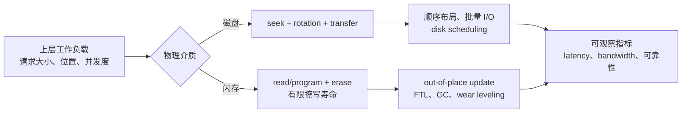
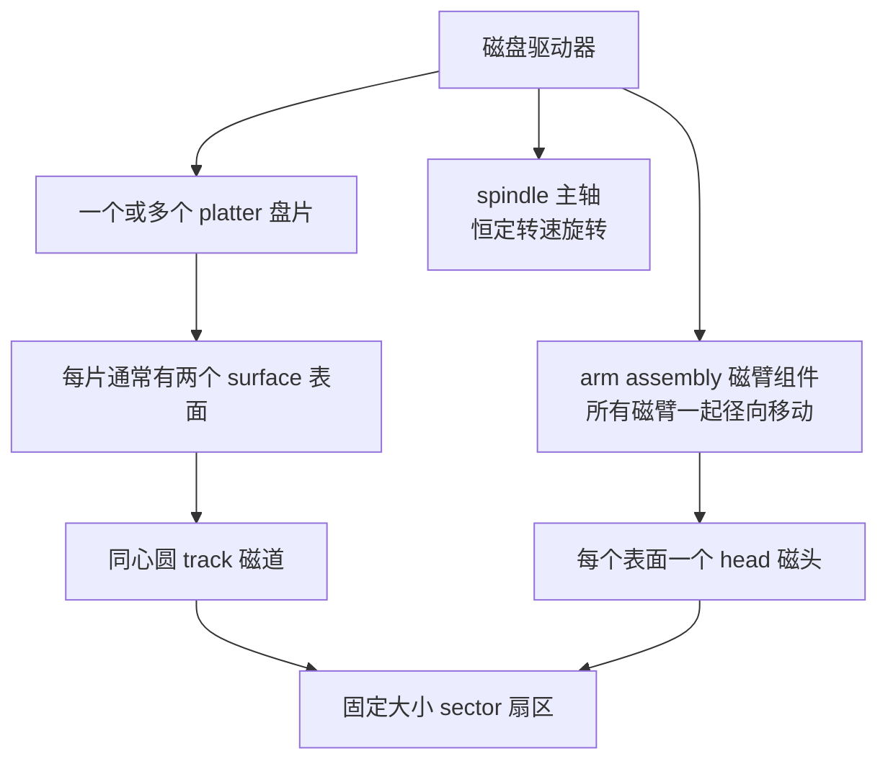
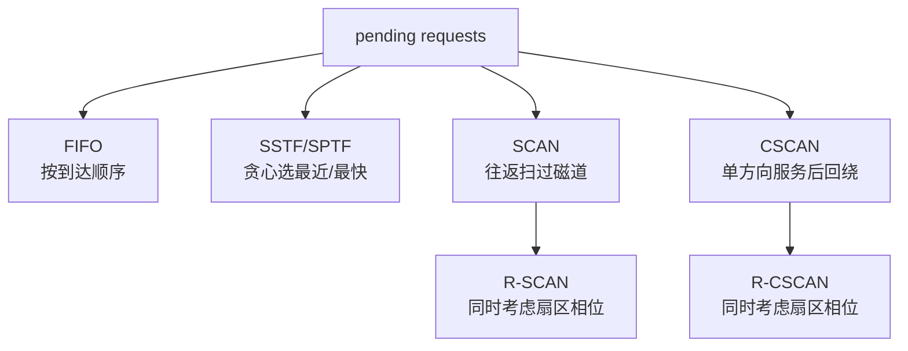
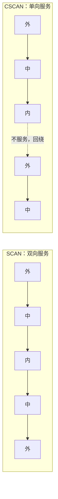
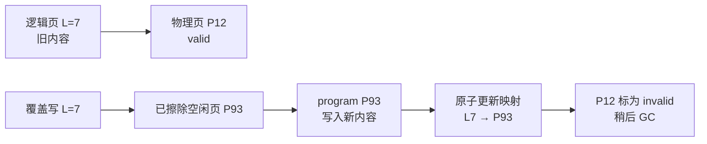
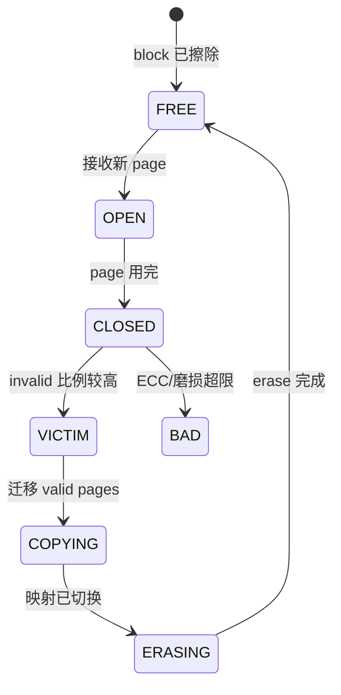

> 原文：Operating Systems: Principles and Practice，第 12 章 Storage Devices
>
> 本章原书使用的磁盘型号和部分容量、带宽数据来自 2008—2011 年前后。具体数字会随硬件演进而变化，但“机械定位远慢于顺序传输”“闪存必须先擦后写、擦除粒度大于读写粒度”等分析方法仍然成立。本文先忠实推导原书模型，再明确补充现代设备的适用边界。

## 全章主线

第 11 章把持久存储抽象成文件、目录和块设备，本章进一步追问：**块设备为什么具有这样的性能和约束？** 如果不了解介质，操作系统虽然能正确发出 `read`/`write`，却可能把本可顺序完成的工作拆成大量随机访问，导致性能下降几个数量级；也可能把磁盘假设照搬到闪存，忽略擦除、磨损和掉电一致性。

作者依次采用三步分析法：

1. **拆开物理动作。** 磁盘访问分为 seek、rotation、transfer；闪存操作分为 read、program、erase。
2. **建立量化模型。** 把一次请求的时间写成可计算的分量，再代入真实设备参数，比较随机与顺序工作负载。
3. **由约束反推系统策略。** 磁盘需要布局、批量传输和请求调度；闪存需要 erase-before-write、wear leveling、garbage collection 和逻辑到物理映射。



本章需要始终区分三个性能概念：

- **Latency（响应时间）**：一个请求从提交到完成经历多久，单位通常为 ms 或 μs。
- **Bandwidth/throughput（带宽/吞吐）**：单位时间完成多少字节或请求，单位可为 MB/s 或 IOPS。
- **Parallelism（并行度）**：设备可同时处理多少独立请求。增加并行度可能提高总吞吐，但排队也可能增大单请求延迟。

“设备标称带宽高”不代表小型随机请求快。若每个请求都先付固定定位成本 $L$，传输 $x$ 字节的带宽为 $B$，则单请求时间近似为

$$
T(x)=L+\frac{x}{B},
$$

有效带宽为

$$
B_{eff}(x)=\frac{x}{T(x)}
=\frac{x}{L+x/B}.
$$

当 $x\ll LB$ 时，$T\approx L$，有效带宽远低于 $B$；只有把大量相邻数据合成大请求，使 $x/B$ 足以摊薄 $L$，才接近介质带宽。这个简单模型贯穿磁盘和闪存分析，但两类设备中固定成本的物理来源不同。

## 12.1 磁盘（Magnetic Disk）

### 要解决的问题：如何低成本、非易失地保存大量数据

磁盘把位编码为盘片表面薄磁性材料的磁化状态。断电后磁化方向仍保留，因此具有非易失性；旋转盘片可用较少读写头覆盖很大面积，因此单位容量成本低。代价是访问任意位置前必须移动机械部件并等待盘片旋转，延迟比 DRAM 高出多个数量级。

### 结构与严格定义



- **Platter（盘片）**：涂有磁性介质的圆盘；一个盘片通常有上下两个可记录表面。
- **Spindle（主轴）**：带动所有盘片以固定 RPM 同步旋转。
- **Head（磁头）**：感知或改变表面磁场以读写位；每个表面对应一个磁头。工作时磁头浮在高速气流上，不应接触盘面。
- **Head crash（磁头碰撞）**：冲击等原因使磁头接触并损伤磁性表面，可能造成永久数据丢失。
- **Arm assembly（磁臂组件）**：所有磁臂共用一个执行机构并一起径向移动，所以传统磁盘通常不能让不同磁头独立寻找不同磁道。
- **Sector（扇区）**：硬件可独立寻址和传输的最小固定大小单元。原书典型值为 512 B；现代 Advanced Format 盘常以 4 KiB 为物理扇区，同时模拟 512 B 逻辑扇区。
- **Track（磁道）**：同一表面、距主轴半径相同的一圈扇区。在同一磁道连续读写不需移动磁臂。
- **Cylinder（柱面）**：所有表面上具有相同磁道编号的一组磁道。现代高密度磁盘切换磁头仍需重新定位，因此柱面不再具有“零定位成本”的旧式优势。

磁盘暴露给 OS 的通常不是 `(surface, track, sector)` 三元组，而是连续编号的 **logical block address（LBA）**。控制器固件负责把 LBA 映射到实际位置，并处理坏扇区重映射。于是“相邻 LBA 往往便于顺序访问”是有用近似，却不是 OS 可依赖的绝对物理承诺。

### 为什么最小单位是整个 sector

磁盘不能只改一个字节。要修改扇区中的一个字节，系统通常经历：

1. 把旧扇区读入内存；
2. 修改内存副本中的目标字节；
3. 重新计算并写入整个扇区及其纠错信息。

原因之一是每个扇区除用户数据外还存放同步标记、地址和 **ECC（error-correcting code）**。ECC 利用冗余位检测甚至纠正有限位错误，使设备能在更高记录密度和噪声下可靠工作。若物理扇区为 $S_p$、应用只改 $u<S_p$ 字节，最简单 read-modify-write 的介质数据搬运至少为

$$
S_p\text{（读）}+S_p\text{（写）}=2S_p,
$$

相对于有用更新量的内部数据放大为

$$
A=\frac{2S_p}{u}.
$$

例如在 4 KiB 物理扇区上更新 1 B，$A=8192$。实际缓存、合并和日志会改变设备 I/O 次数，但结论不变：对齐并批量写比零碎小写更合理。若掉电发生在 read-modify-write 中间，还可能出现 torn sector，因此上层不能仅凭“单字节赋值”假设原子持久更新。

### 转速、周期与位置

RPM 表示每分钟转数。若转速为 $R$ RPM，则每秒转数与一圈时间分别为

$$
f=\frac{R}{60}\quad(\text{rev/s}),
$$

$$
T_{rev}=\frac{1}{f}=\frac{60}{R}\quad(\text{s/rev}).
$$

例如 $R=7200$：

$$
f=\frac{7200}{60}=120\ \text{rev/s},
$$

$$
T_{rev}=\frac{1}{120}\ \text{s}=8.33\ \text{ms}.
$$

假设请求到达时目标扇区相位在一圈内均匀分布，等待角度 $\Theta\sim U(0,2\pi)$，平均旋转等待为

$$
E[T_{rot}]
=E\left[\frac{\Theta}{2\pi}T_{rev}\right]
=\frac{E[\Theta]}{2\pi}T_{rev}
=\frac{\pi}{2\pi}T_{rev}
=\frac{T_{rev}}{2}.
$$

7200 RPM 的平均 rotational latency 因而约为 $4.17$ ms。这个“半圈”结论依赖均匀随机相位；顺序请求、track buffer 命中或调度器有意选择邻近扇区时并不适用。

### Track skewing：用物理布局补偿切换时间

读完磁道末尾后，磁头切到下一磁道或另一表面需要时间 $t_s$。若下一磁道的逻辑起点仍在同一角位置，切换完成时它已经转过磁头，只能再等近一圈。**Track skewing** 把相邻磁道的逻辑 sector 0 向后错开，使切换完成时下一段恰好到达磁头。

若一圈有 $N$ 个扇区，理想错开量为

$$
k=\left\lceil \frac{t_s}{T_{rev}}N\right\rceil
$$

个扇区。这里向上取整是因为错开不足仍会错过起点。例：7200 RPM、$T_{rev}=8.33$ ms、每磁道 800 个扇区、切换需 $0.8$ ms：

$$
k=\left\lceil\frac{0.8}{8.33}\times800\right\rceil
=\lceil76.84\rceil=77.
$$

该公式是理想化静态模型；现代磁盘分区记录、可变扇区数、固件缓存与内部重映射使实际 skew 由厂商固件决定，OS 通常看不到物理几何。

### 坏扇区与 spare sector

提高密度后，制造缺陷和介质老化不可避免。厂商在表面预留 spare sectors，并用两种典型方法保持逻辑地址空间连续：

- **Sector sparing/remapping**：把坏扇区的 LBA 单独映射到某个备用扇区。实现简单，但备用位置可能较远，顺序流会突然产生额外旋转或 seek。
- **Slip sparing**：从坏扇区起把后续逻辑扇区依次“滑动”到下一个物理位置，直到备用扇区。它让逻辑顺序更接近物理顺序，代价是初始格式化或重映射更复杂。

控制器维护映射和 ECC 错误统计。潜在坏扇区若仍可读，可在失效前搬迁；完全不可读时，上层只有副本、校验和、RAID 或备份才能恢复数据，坏块重映射本身不会凭空还原内容。

### 磁盘 buffer、track buffering 与 write acceleration

磁盘控制器通常带 DRAM buffer，作用包括：

1. **Track buffering/read-ahead**：磁头定位后，即使目标扇区尚未来到，也把经过的其他扇区读入 buffer；后续请求若命中可立即返回，避免再等一圈。
2. **速度解耦**：盘面传输与 SATA/SAS/USB 主机链路可流水并行，buffer 吸收两侧速率差。
3. **Write acceleration**：先把写入收进设备 DRAM 就向 OS 报告完成，稍后再写盘，提高表面可见性能并允许重排合并。

第三点带来关键语义风险：普通易失 DRAM 在断电后丢失，若设备提前确认，OS 的 `fsync` 也可能得到虚假的持久化保证。安全方案包括：

- 设备关闭 write-back cache，写到盘面才确认；
- 设备具有电池/电容保护的非易失写缓存；
- OS 发出 cache flush/FUA（force unit access），设备严格遵守顺序；
- 文件系统用日志或 copy-on-write，但它们仍依赖底层正确实现 flush/barrier。

### TCQ/NCQ：把并发请求交给设备重排

Tagged Command Queueing（SCSI/FC 中常称 TCQ，SATA 中称 NCQ）允许 OS 同时提交多个带 tag 的请求，设备按机械位置而非到达顺序执行，再用 tag 对应完成结果。

它为什么有效：若队列中只有一个请求，设备无法选择；有 $q>1$ 个候选时，固件可选当前磁头附近的 LBA，缩短平均 seek/rotation，并把相邻请求合并。局限是重排可能破坏写入顺序和公平性，所以持久化协议必须使用 barrier、flush、FUA 或依赖带顺序标记的命令，不能把“请求先提交”等同于“请求先持久化”。

## 12.1.1 磁盘访问与性能（Disk Access and Performance）

OS 向磁盘发出“从 LBA $l$ 起读/写 $n$ 个连续 sector”的命令。对不在设备 buffer 中的请求，机械磁盘必须依次完成定位磁道、等待目标扇区和传输数据，因此最基本模型是

$$
T_{access}=T_{seek}+T_{rot}+T_{transfer}.
$$

各符号含义如下：

- $T_{seek}$：磁臂移动并稳定在目标磁道的时间；
- $T_{rot}$：目标起始扇区旋转到磁头下的等待时间；
- $T_{transfer}$：连续扇区从盘面经设备 buffer 到主机内存的时间；写入方向相反。

这个式子是**一次独立、cache miss 请求**的近似。若请求命中 track buffer，seek/rotation 可消失；若多个请求流水执行，主机传输可能与机械动作重叠；队列等待 $T_{queue}$ 也不在式中。端到端响应时间更完整地写为

$$
T_{response}=T_{queue}+T_{controller}+T_{access}+T_{software}.
$$

**Seek。** 磁臂先粗略移动，再根据盘面伺服信息细调并等待振动稳定。距离越远通常越慢，但关系不是线性的：启动、加速、减速和 settle 都有固定/非线性成本。

- minimum/track-to-track seek：相邻磁道重定位，原书典型为 $0.3$–$1.5$ ms；
- head-switch time：切到另一表面的同编号磁道。高密度下各面并非完美对齐，也要重新 settle，成本类似短 seek；
- maximum seek：最内到最外磁道，常超过 10 ms，甚至超过 20 ms；
- average seek：对所有可能起止磁道对的 seek 时间取平均，常近似为跨越全盘三分之一距离的时间。

为什么会出现“三分之一”？把磁道位置归一化为相互独立的 $X,Y\sim U(0,1)$，则平均移动距离为

$$
E[|X-Y|]
=2\int_0^1\int_0^x(x-y)\,dy\,dx.
$$

内层积分为

$$
\int_0^x(x-y)\,dy
=\left[xy-\frac{y^2}{2}\right]_0^x
=\frac{x^2}{2},
$$

所以

$$
E[|X-Y|]
=2\int_0^1\frac{x^2}{2}\,dx
=\left[\frac{x^3}{3}\right]_0^1
=\frac13.
$$

该推导假设起止位置独立均匀，只证明**平均距离**是全跨度的 $1/3$。由于 seek time 对距离非线性，“三分之一距离的 seek time”只是工程近似，真正 average seek 应由全部位置对或实测得到。

原书特别警告不要滥用 average seek：它近似假设工作负载毫无 locality，接近常见负载的坏情况。文件系统会把同一文件连续布局、把同目录对象放在附近；此时观测值可能更接近 minimum seek。评估具体工作负载应使用它的距离分布，而不是看到“average”就机械代入厂商指标。

**柱面为何衰落。** 旧文件系统把相关数据放在不同表面但同一 cylinder，期望只切磁头、不移动磁臂。随着磁道窄到微米以下，各表面同编号磁道无法精确对齐；换 head 后仍需伺服重定位，成本与移动到相邻磁道接近。因此现代布局更应关注连续 LBA 和实测性能，而不是虚构几何中的 cylinder。

**Rotation。** 若请求与盘片相位独立均匀，平均等待为半圈，上一节已经推得

$$
E[T_{rot}]=\frac12T_{rev}=\frac{30}{R}\ \text{s}.
$$

例如 7200 RPM 时为 $30/7200$ s $=4.17$ ms。最大等待接近一整圈，最小接近 0。调度、顺序访问和 track buffering 会破坏均匀假设并降低等待。

**Transfer。** 设连续数据量为 $D$ bytes，盘面带宽为 $B_s$，主机接口带宽为 $B_h$。若两段串行，

$$
T_{transfer}=\frac{D}{B_s}+\frac{D}{B_h};
$$

若设备 buffer 允许充分流水，长传输稳态更接近

$$
T_{transfer}\approx\max\left(\frac{D}{B_s},\frac{D}{B_h}\right)
=\frac{D}{\min(B_s,B_h)},
$$

再加很小的启动/收尾成本。读写方向虽相反，瓶颈分析相同。

若 $B_s=100$ MB/s，读 512 B sector 的纯盘面时间为

$$
\frac{512}{100\times10^6}\ \text{s}
=5.12\ \mu s=0.00512\ \text{ms},
$$

远小于数毫秒 seek/rotation。这解释了为何“小随机 I/O 的主要问题不是传 512 B 太慢，而是到达那 512 B 太慢”。

外圈周长比内圈大。现代磁盘通常使用 zone bit recording，让外圈每磁道容纳更多 sector；转速不变时，外圈每圈经过磁头的数据更多，所以外圈 $B_s$ 高于内圈。把整个设备只用一个峰值带宽建模会高估内圈性能。

对一批总数据量 $D$、分成 $m$ 个相互独立请求的工作负载，简化总时间为

$$
T_{total}\approx m(T_{seek}+T_{rot})+\frac{D}{B_s}.
$$

若把相邻请求合并，$D$ 不变而 $m$ 下降，固定定位成本近似按比例下降。这就是顺序布局、大请求、预取和 I/O 调度共同有效的数学原因。

## 12.1.2 案例研究：Toshiba MK3254GSY

原书用 2008 年的 Toshiba MK3254GSY 2.5 英寸磁盘把模型落到数字：

| 参数 | 数值 | 含义 |
|---|---:|---|
| 容量 | 320 GB | 厂商十进制容量 |
| 盘片/磁头 | 2/4 | 4 个记录表面，每面约 80 GB |
| 转速 | 7200 RPM | 每圈约 8.33 ms |
| 平均读/写 seek | 10.5/12.0 ms | 写前需更稳定定位，故稍慢 |
| 最大 seek | 19 ms | 近似跨越全径向范围 |
| track-to-track seek | 1 ms | 相邻磁道/近似 head switch |
| 盘面带宽 | 54–128 MB/s | 内圈慢、外圈快 |
| buffer 到主机 | 375 MB/s | SATA 链路高于盘面带宽，不是长读瓶颈 |
| buffer | 16 MB | track buffering、队列和写缓存 |

盘片直径约 6.3 cm，外缘半径 $r\approx3.15$ cm $=0.0315$ m。外缘线速度为

$$
v=2\pi rf
=2\pi\times0.0315\times120
\approx23.75\ \text{m/s}
\approx85.5\ \text{km/h}.
$$

这个计算说明磁头下介质移动很快，但随机请求仍受“移动磁臂 + 等待正确角位置”支配。

### 500 个随机单 sector 请求

假设每个请求位置独立均匀、FIFO 服务、均不命中 cache：

1. 平均 seek：$10.5$ ms；
2. 平均 rotation：$8.33/2\approx4.17$ ms，原书取 $4.15$ ms；
3. 512 B 在最低 $54$ MB/s 下的 transfer 上界：

$$
T_{transfer}
=\frac{512}{54\times10^6}\ \text{s}
\approx9.48\ \mu s
=0.00948\ \text{ms}.
$$

单请求约为

$$
T_{one}=10.5+4.15+0.0095=14.6595\ \text{ms},
$$

500 个请求串行总计

$$
T_{500}=500\times14.6595\ \text{ms}
=7329.75\ \text{ms}\approx7.33\ \text{s}.
$$

原书后文有一处把该对比写成约 5.5 s，但依本例明确给定的三个分量，结果是 7.33 s；后续与调度结果比较也应使用 7.33 s。真正设备还会受队列、固件重排和缓存影响。

### 一次读取 500 个连续 sector

数据量为

$$
D=500\times512=256000\ \text{B}=250\ \text{KiB}.
$$

在外圈 $128$ MB/s 与内圈 $54$ MB/s 下，传输时间范围为

$$
T_{outer}=\frac{256000}{128\times10^6}\ \text{s}=2.00\ \text{ms},
$$

$$
T_{inner}=\frac{256000}{54\times10^6}\ \text{s}\approx4.74\ \text{ms}.
$$

先忽略 track buffer，随机起点仍付一次平均 seek 与半圈等待：

$$
T_{simple,outer}=10.5+4.15+2.00=16.65\ \text{ms},
$$

$$
T_{simple,inner}=10.5+4.15+4.74=19.39\ \text{ms}.
$$

原书按参数精度写为 16.7–19.5 ms。与 500 个独立请求的 7.33 s 相比，数据量相同，时间却缩短约

$$
\frac{7.33\ \text{s}}{0.0167\text{–}0.0195\ \text{s}}
\approx376\text{–}439
$$

倍，根因是只支付一次 seek/初始 rotation，而不是 500 次。

**加入 track buffer 的精化。** 请求在外圈约占 $2/8.33\approx1/4$ 圈。seek settle 若落在该区间内，控制器会立即把已经经过的目标数据读入 buffer，再等起点绕回并补齐；原书估计平均节省 $1/4\times1/8=1/32$ 圈：

$$
16.7-\frac{1}{32}\times8.3\approx16.4\ \text{ms}.
$$

内圈请求约占半圈，原书估计平均节省 $1/2\times1/4=1/8$ 圈：

$$
19.5-\frac18\times8.3\approx18.5\ \text{ms}.
$$

所以更细估计为 16.4–18.5 ms。这里的概率和平均节省量是几何近似，不是一般定理；真实 track sector 数、seek 后相位和控制器策略不可见时，只能给合理区间。

### 有效带宽为何仍低于盘面带宽

即使是 250 KiB 连续请求，固定定位成本仍占大头。有效带宽范围：

$$
B_{eff,inner}=\frac{0.256\ \text{MB}}{0.0185\ \text{s}}
\approx13.8\ \text{MB/s},
$$

$$
B_{eff,outer}=\frac{0.256\ \text{MB}}{0.0164\ \text{s}}
\approx15.6\ \text{MB/s}.
$$

相对于对应盘面带宽：

$$
\eta_{inner}=\frac{13.8}{54}\approx25.6\%,
\qquad
\eta_{outer}=\frac{15.6}{128}\approx12.2\%.
$$

外圈绝对有效带宽稍高，利用率反而更低，因为峰值带宽提高后，同一个 10.5 ms seek 更难摊薄。

### 要达到 80% 峰值，请求必须多大

原书考虑外圈长顺序读：随机起始 seek 为 $S=10.5$ ms；每读一圈数据花 $R=8.4$ ms；跨到下一磁道还付 minimum seek $M=1$ ms。若读取 $x$ 圈数据，则

$$
T_{total}=S+x(R+M),
$$

其中真正按峰值传数据的时间是 $xR$。带宽效率

$$
\eta=\frac{xR}{S+x(R+M)}.
$$

要求 $\eta=0.8$：

$$
0.8\,[10.5+x(8.4+1)]=8.4x,
$$

$$
8.4+7.52x=8.4x,
$$

$$
0.88x=8.4,
$$

$$
x\approx9.55\ \text{圈}.
$$

对应数据量为

$$
D=xRB
=9.55\times0.0084\ \text{s}\times128\ \text{MB/s}
\approx10.27\ \text{MB},
$$

约 $10.27\times10^6/512\approx20059$ 个 sector。

原书在列出同一方程后给出 $x=9.09$ 圈、9.77 MB、19089 sectors；严格代数计算应为上面的 9.55 圈与约 10.27 MB，原书数值应是小的算术误差。更重要的结论不变：要用一次随机起点访问达到 80% 外圈峰值，需要读取约 10 MB，而不是几 KiB。

一般地，目标效率 $\eta$ 的解为

$$
x=\frac{\eta S}{R-\eta(R+M)}.
$$

成立条件是分母为正，即

$$
\eta<\frac{R}{R+M}.
$$

$R/(R+M)$ 是即使 $x\to\infty$、仍需每圈跨磁道时的渐近效率。本例为 $8.4/9.4\approx89.4\%$，所以这个模型下 95% 峰值根本不可达；增加请求大小只能消除初始 seek，不能消除每磁道的重定位成本。

## 12.1.3 磁盘调度（Disk Scheduling）

当队列里有多个请求时，服务顺序会改变磁头移动与旋转等待。磁盘调度可由 OS 块层、控制器固件或二者共同完成。一个调度器通常同时面对四个目标：

1. **吞吐**：减少空转和长 seek，使单位时间完成更多请求；
2. **平均响应时间**：让所有请求的完成时间平均较小；
3. **尾延迟/公平性**：任何请求都不能无限等待；
4. **正确顺序**：不得越过 flush、barrier、FUA 等持久化约束。

这些目标并不等价。最短总机械时间的顺序可能让早到请求等待很久；平均响应最优也可能牺牲少数请求；纯物理重排若忽视依赖甚至会破坏文件系统恢复协议。



**FIFO。** 按请求到达顺序处理，实现简单、不会因位置而饿死老请求，也保留自然到达顺序。但它完全不利用 locality。若请求在最内、最外磁道间交替，几乎每次都付 maximum seek。

FIFO 不是“无调度”，而是以到达时间作为唯一优先级。低并发或设备内部自行重排时，它可能足够；对暴露物理位置的繁忙磁盘，通常浪费机械运动。

**SSTF/SPTF。** Shortest Seek Time First 从当前磁头位置选择 seek 最短的 pending request；Shortest Positioning Time First 进一步把 rotational latency 也算入，选择估计定位时间最短者：

$$
r^*=\arg\min_{r\in Q}
\bigl(T_{seek}(head,r)+T_{rot}(phase,r)\bigr).
$$

$Q$ 是 pending request 集合，$head$ 是当前磁道，$phase$ 是当前角位置。若只知道 LBA 到大致磁道的映射而不知道相位，只能实现 SSTF 近似。

贪心策略有两个根本局限：

- **不保证全局最优。** 当前最便宜的动作改变下一步磁头/相位，可能把磁头带离大多数请求；局部最小不等于总完成时间或平均响应最小。
- **可能 starvation。** 若内圈附近持续到达新请求，一个较远的外圈请求可能永远不是“最近”，等待无上界。

### SPTF 不最小化平均响应时间的反例

设磁头略靠中间磁道内侧：到内圈 seek 为 $9.9$ ms，到外圈为 $10.1$ ms；内外圈互相 seek 为 $15$ ms；一圈为 $10$ ms。pending request 分两组：内圈 1000 个 sector 请求、外圈 2000 个 sector 请求，恰好各覆盖整条磁道。

处理一组时，sector 在一圈内依次完成，所以该组平均请求在 seek 完成后再等半圈，即 $5$ ms。第二组还要等第一组的一整圈和组间 seek。

SPTF 因 $9.9<10.1$ 先选内圈：

$$
\bar T_{inner}=9.9+5=14.9\ \text{ms},
$$

$$
\bar T_{outer}=9.9+10+15+5=39.9\ \text{ms}.
$$

按请求数加权：

$$
\bar T_{SPTF}
=\frac{1000\times14.9+2000\times39.9}{3000}
=31.57\ \text{ms}.
$$

若先服务稍远的外圈：

$$
\bar T_{outer}=10.1+5=15.1\ \text{ms},
$$

$$
\bar T_{inner}=10.1+10+15+5=40.1\ \text{ms},
$$

$$
\bar T_{outer-first}
=\frac{2000\times15.1+1000\times40.1}{3000}
=23.43\ \text{ms}.
$$

原书将两个结果写为约 31.6 ms 和 23.3 ms；按列出的数字第二项严格为 23.43 ms。外圈优先的最后完成时间略大（初始 seek 多 0.2 ms），但 2/3 的请求更早完成，因此平均响应低约 $8.14$ ms。这个例子证明：**最小化下一次定位时间，既不等于最小化所有请求的平均完成时间，也不等于任何全局最优目标。**

**SCAN（elevator）。** 磁头选定方向，例如从外向内，沿途按位置服务所有同方向 pending request；到边缘后反向，再服务另一方向。每个请求至多等待一次往返 sweep，避免 SSTF 的无限 starvation，并保留大部分 seek locality。

**CSCAN（circular SCAN）。** 只在一个方向服务；到最内端后快速回到最外端，再按同一方向开始新 sweep。也可只回到该方向最远的 pending request，这类“不必走到物理边缘”的实现常称 LOOK/C-LOOK。

CSCAN 相对 SCAN 的直觉是：刚扫过的区域通常请求稀疏，而另一端积累了等待更久的请求。回绕后继续同方向服务，使不同位置经历更一致的 sweep 周期；代价是回绕路程本身不服务请求。



**R-SCAN/R-CSCAN。** 单看磁道距离会忽略相位。调度器可以允许一次很小的“逆方向” seek，以赶上即将到达磁头的 sector，避免目标刚转过后再等一圈。例如当前在 track 0 sector 0，pending request 位于 `(track 0, sector 1000)`、`(track 1, sector 500)`、`(track 10000, sector 0)`；旋转感知调度可能先去 track 1 sector 500，再回 track 0 sector 1000，最后去远处。多出的短 seek 可能小于省下的 rotational latency。

严格选择需要估计每个候选的完成时间：

$$
T_r=T_{seek}(\Delta track_r)
+T_{rot}(phase+\Delta phase_{seek},sector_r)
+T_{transfer}(r).
$$

设备固件通常比 OS 更了解真实 LBA 映射、坏块重映射和当前相位，所以 TCQ/NCQ 设备常在内部做旋转感知调度；OS 则更了解进程优先级、deadline 和写入依赖。两层需要协作，不能各自任意重排。

### 500 个随机请求经 CSCAN 调度

仍使用 MK3254GSY，500 个 sector 均匀散布全盘，磁头从外圈向内扫。排序后相邻请求平均跨越约全盘的

$$
\frac{1}{500}=0.2\%.
$$

四个表面意味着许多请求还需 head switch。原书在 track-to-track 的 1 ms 与三分之一跨度的 10.5 ms 间粗略插值：

$$
T_{seek,0.2\%}
\approx1+10.5\times\frac{0.2}{33.3}
\approx1.06\ \text{ms}.
$$

若按严格的两点线性插值，应写为 $1+(10.5-1)\times0.2/33.3\approx1.057$ ms，仍约 1.06 ms；而真实 seek 曲线本就非线性，所以小数差异没有实际意义。

请求 sector 仍随机，原书保守地保留半圈 rotation $4.15$ ms；传输为 $0.0095$ ms：

$$
T_{one}\approx1.06+4.15+0.0095=5.2195\ \text{ms},
$$

$$
T_{500}\approx500\times5.2195\ \text{ms}
=2.61\ \text{s}.
$$

与 FIFO 的 7.33 s 相比，时间减少约

$$
1-\frac{2.61}{7.33}\approx64.4\%.
$$

seek 从 10.5 ms 降到约 1.06 ms 后，rotation 变成最大分量，说明进一步优化必须考虑相位，而不只是磁道排序。该估算还假设 500 个请求同时可见；若应用一次只提交一个，调度器没有候选可选，无法获得这种收益。

### 算法适用边界与现代替代

- 对 HDD，位置排序有效，但要用 deadline/age 防 starvation，并尊重同步写顺序。
- 对 SSD，没有磁臂和旋转，传统 SCAN 无物理意义；更重要的是队列深度、内部 channel 并行、公平性和尾延迟。
- 虚拟机/云盘中的 LBA 与真实介质位置可能完全脱钩，guest 的“seek 优化”可能无效。
- RAID 把一个逻辑请求拆到多盘，调度目标还包括 stripe 并行与校验写成本。
- 现代 OS 常采用 deadline、fair queueing、批处理和设备感知调度，而不是纯教科书算法；FIFO/SSTF/SCAN 仍是理解权衡的最小模型。

## 12.2 闪存（Flash Storage）

闪存是 solid-state storage：没有磁臂和旋转盘片，利用电路中的电荷状态保存数据。它的随机访问不需机械定位，功耗、抗冲击性和体积通常优于磁盘；但单位容量成本更高，而且写入具有 erase-before-write 和有限寿命约束。

### Floating-gate cell：电荷如何保存位

闪存单元的核心是 floating-gate transistor。浮栅被绝缘层包围，不直接连接导线，电子进入后可在断电状态保持数月或数年。施加足够高电压可通过隧穿效应注入/移除电子；浮栅电荷会改变晶体管导通所需的 threshold voltage。读取时施加选定控制电压并检测是否导通，从而推断存储状态。

严格说，控制器读到的不是抽象的 0/1，而是带噪声的阈值电压区间。不同每单元位数对应不同电平数量：

| 类型 | 每 cell 位数 | 电平数 | 一般权衡 |
|---|---:|---:|---|
| SLC | 1 | $2^1=2$ | 电压间隔大，快且耐久，密度低 |
| MLC | 2 | $2^2=4$ | 原书 Intel 710 使用，密度与可靠性折中 |
| TLC | 3 | $2^3=8$ | 现代消费 SSD 常见，更依赖 ECC/缓存 |
| QLC | 4 | $2^4=16$ | 容量密度高，写入和寿命约束更强 |

每 cell 存 $b$ 位需要区分 $2^b$ 个电压区间。可用总电压窗口近似固定时，$b$ 增大使相邻区间更窄，对泄漏、温度、磨损和噪声更敏感；因此高密度不是免费收益。

**NOR 与 NAND。** NOR 连接方式支持接近按 word 随机读，适合存放可 execute in place 的固件；NAND 以 page 为读/program 单位，布线密度高、单位容量成本低，因而 SSD/存储卡主要使用 NAND。本章后文“flash”默认指 NAND。

### 三种基本操作及不对称粒度

原书时代的典型参数是：

| 操作 | 粒度 | 典型时间 | 语义 |
|---|---:|---:|---|
| read page | 2–4 KiB page | 数十 μs | 感知阈值电压并做 ECC |
| program/write page | 2–4 KiB page | 数十 μs | 只能把 erased 状态逐步 program |
| erase block | 128–512 KiB block | 数 ms | 把整块 cell 恢复为逻辑 1 |

一个 erase block 含多个 page。设 block 大小 $E$、page 大小 $P$，每块页数为

$$
N=\frac{E}{P}.
$$

例如 $E=512$ KiB、$P=4$ KiB，则 $N=128$。最关键约束是：**不能把任意已 program page 原地改成任意新值；复用前要擦除整个 block。** 如果为改 4 KiB 而同步搬动 512 KiB，会产生巨大延迟和写放大。



### FTL：用映射把覆盖写变成异地写

Flash Translation Layer（FTL）在 host LBA/logical page 与 NAND physical page 之间维护映射。覆盖逻辑页时：

1. 从 free-page pool 选择一个已擦除物理页；
2. 把新版本 program 到该页；
3. 可靠地把映射从旧页切换到新页；
4. 旧物理页标记 invalid；
5. 后台 garbage collection 以后按整块回收 invalid pages。

这称为 **out-of-place update**。它把前台一次小写从“读整块 + 擦整块 + 重写整块”降为“写一个空闲页 + 更新映射”。FTL 还需保证掉电后能重建映射；常见方法是映射日志、元数据校验、顺序号与电容保护，具体为设备内部实现。

### 原书重映射例题的完整计算

设 page 为 4 KiB、erase block 为 512 KiB、erase 时间 $T_e=3$ ms、page read/program 都为 $50\ \mu s$。

每块页数：

$$
N=\frac{512}{4}=128.
$$

**朴素原地算法。** 为更新一页，读出整块 128 页、擦除、再写回 128 页：

$$
T_{naive}
=N(T_r+T_p)+T_e,
$$

$$
=128(50+50)\ \mu s+3000\ \mu s,
$$

$$
=12800\ \mu s+3000\ \mu s
=15800\ \mu s=15.8\ \text{ms}.
$$

这里假设所有旧页都需保留，read/program 串行且不并行，因而是清楚但悲观的基线。

**FTL 重映射。** 若始终有空闲已擦除块，并把一次 block erase 摊到 128 次 page write：

$$
T_{remap}\approx T_p+\frac{T_e}{N},
$$

$$
=50\ \mu s+\frac{3000\ \mu s}{128}
=73.4375\ \mu s.
$$

相对朴素方案的理想加速约为

$$
\frac{15.8\ \text{ms}}{73.44\ \mu s}\approx215.
$$

这个结果成立的关键假设是回收块时没有 live page 需要复制，且忽略映射更新、队列和掉电保护成本。设备接近满时假设会失效。

### Garbage collection 与写放大

擦除只能按 block。GC 选择 victim block，把仍 valid 的 page 复制到别处，更新映射，再擦除 victim 得到空闲页。



设每块 $N$ 页，victim 中 live fraction 为 $u$，则复制 $uN$ 页后，擦除能提供 $N$ 个空页；扣除搬迁占用，净供 host 使用的是 $(1-u)N$ 页。在最简单稳态模型中，每轮 physical programs 为 $uN$ 次搬迁加 $(1-u)N$ 次 host write，共 $N$ 次，因此写放大

$$
WA=\frac{\text{physical page programs}}{\text{host page writes}}
=\frac{N}{(1-u)N}
=\frac{1}{1-u}.
$$

例：victim 只有 20% live，$WA=1/0.8=1.25$；若 80% live，$WA=1/0.2=5$。这解释了 SSD 越接近满盘越慢：可选 victim 更少、live fraction 更高，每释放一个页要搬更多数据。

该式是教学模型。真实 WA 还受 workload locality、FTL 映射粒度、metadata、SLC cache、压缩、TRIM、并行和 GC 策略影响。常见改进包括 over-provisioning、把冷热数据分开、后台空闲 GC、选择 invalid 比例高的 victim，以及为延迟敏感写保留紧急 free blocks。

### 内部并行与 queue depth

SSD 可包含多个 channel、die 和 plane，彼此独立执行 NAND 操作。单页 latency 为 $L$ 时，串行吞吐上限约 $1/L$ IOPS；若有 $k$ 条有效并行路径且队列始终有工作，理想上限可接近 $k/L$。

因此 OS 要提交多个并发请求，设备才有机会跨 channel 并行。队列过浅利用率低；过深则排队延迟上升。Little 定律给出平均在途请求数

$$
Q=\lambda W,
$$

其中 $\lambda$ 是完成率（IOPS），$W$ 是平均响应时间。它是稳态平均关系，不告诉我们应盲目增加 $Q$；达到并行饱和后继续加深队列只会增大 $W$。

### 耐久性：P/E 磨损、read disturb 与保护机制

高压 erase/program 会损伤绝缘层。每个 block 只能承受有限 program-erase（P/E）cycles，依 NAND 类型可能从数千到更高数量级。读取次数极多也会扰动邻近 cell 电荷，形成 read disturb。

设备综合使用：

- **ECC**：每页额外冗余检测/纠正逐渐增加的 bit error；纠错次数接近阈值时提前搬迁。
- **Bad-page/block management**：制造缺陷或磨损超限后标坏，不再分配。
- **Dynamic wear leveling**：把反复覆盖的 hot logical page 轮换到不同物理块。
- **Static wear leveling**：偶尔搬迁长期不变的 cold data，释放低磨损块给 hot writes，使全盘 P/E 更均匀。
- **Read scrubbing**：监测高读取/ECC 页面并重写，降低 read disturb 风险。
- **Spare capacity**：预留用户不可见页/块，既供 GC/wear leveling，也替代坏块而不缩小逻辑容量。

“平均每块磨损相同”不自动保证数据永不丢失；控制器、映射元数据、电源保护和 ECC 都可能失败，SSD 仍需端到端校验、冗余和备份。

### Intel 710 案例：latency 与 IOPS 为什么看似矛盾

原书的 2011 年 Intel 710 Series SSD 参数：

| 参数 | 数值 |
|---|---:|
| 容量/page | 300 GB / 4 KiB |
| 顺序读/写 | 270/210 MB/s |
| 单次读/写 latency | 75 μs |
| 随机读 | 38,500 IOPS |
| 满盘随机写 | 2,000 IOPS |
| 预留 20% 空间时随机写 | 2,400 IOPS |
| endurance | 1.1 PB；预留 20% 时 1.5 PB |
| active/idle power | 3.7/0.7 W |

单请求串行、每次等前一个完成时，$75\ \mu s$ 对应

$$
\frac{1}{75\times10^{-6}}\approx13333\ \text{IOPS}.
$$

设备却可达 38,500 random-read IOPS，并不矛盾：多个请求并发后在多条内部路径上重叠，吞吐间隔约 $1/38500\approx26\ \mu s$，但每个请求仍可能经历约 75 μs latency。

写入也标 75 μs，但 sustained random write 只有 2000–2400 IOPS，因为快速确认可利用带电容保护的 DRAM buffer，而长期稳态还要付 NAND program、GC 和 wear leveling。**前台确认 latency、短时 burst bandwidth 与无限期 sustained throughput 是不同指标。**

500 个随机 4 KiB read 在足够并发时：

$$
T=\frac{500}{38500}\ \text{s}\approx12.99\ \text{ms}.
$$

有效带宽：

$$
B_{random-read}
=\frac{500\times4096}{0.01299}\ \text{B/s}
\approx157.7\ \text{MB/s},
$$

约为顺序读的

$$
\frac{157.7}{270}\approx58.4\%.
$$

同样 500 个 random write、满盘 2000 IOPS：

$$
T=\frac{500}{2000}=0.25\ \text{s},
$$

$$
B_{random-write}
=\frac{500\times4096}{0.25}
\approx8.19\ \text{MB/s},
$$

只相当于 210 MB/s 顺序写的

$$
\frac{8.19}{210}\approx3.90\%.
$$

SSD 消除了 seek/rotation，却没有消除“小随机写 + GC”的结构性成本。

### Endurance 的单位如何转成使用寿命

1.1 PB endurance 表示厂商在规定条件下保证的累计 host/介质写入量指标（具体口径以设备规范为准），不是“容量只有 1.1 PB”。若极端地持续以 200 MB/s 写：

$$
T_{life}=\frac{1.1\times10^{15}\ \text{B}}
{200\times10^6\ \text{B/s}}
=5.5\times10^6\ \text{s}.
$$

换算为天：

$$
\frac{5.5\times10^6}{86400}\approx63.7\ \text{days}.
$$

所以原书说约 64 天。普通负载不会 24 小时持续满带宽写，寿命可达多年；高带宽流式写则必须按 daily writes、WA、over-provisioning 和备份策略计算，不能只看读性能。

### TRIM：让跨层的“无效”信息传到底层

文件系统删除文件时，通常只清目录/分配 bitmap；对磁盘而言旧数据留在原 sector 不影响以后覆盖。SSD FTL 却不知道这些 LBA 已无效，会把旧页当 live data 在 GC 时反复复制，浪费带宽和 P/E cycles。

TRIM/DISCARD 让文件系统通知设备：“这些逻辑范围的旧内容不再需要。”FTL 可把对应 physical pages 标 invalid，从而降低 victim live fraction $u$；根据

$$
WA\approx\frac{1}{1-u},
$$

$u$ 下降会减少写放大和 GC 成本。这是“技术改变接口”的典型例子：统一 block API 原本隐藏了介质差异，但要保持闪存性能，必须新增语义 hint。

TRIM 的边界：

- 它通常是性能/回收提示，不承诺立即物理擦除，不能直接当 secure erase；
- TRIM 支持不等于永不降速；盘接近满时仍缺少可选择的低-$u$ victim；
- RAID、加密层、虚拟磁盘必须正确转发，底层才看得到；
- 频繁同步 TRIM 也有成本，OS 可批量或异步下发。

## 12.3 总结与未来方向

磁盘和闪存都提供非易失 block storage，但优势来自不同物理机制。选择设备不能问“谁绝对更快”，而要问 workload 的容量、顺序/随机比例、读写比例、队列深度、功耗、寿命、成本和故障模型。

| 维度 | 旋转磁盘 | NAND SSD | 原因 |
|---|---|---|---|
| 容量/成本 | 通常更优 | 通常较高 | 磁性盘面单位面积成本低 |
| 大块顺序带宽 | 良好 | 良好到优秀 | 两者都能流水，SSD 可多 channel 并行 |
| 小块随机读 | 差 | 优秀 | 磁盘每次付 seek/rotation，SSD 无机械动作 |
| 小块随机写 | 差 | 好但弱于随机读 | SSD 仍有 FTL、GC、erase 和写放大 |
| idle/active 功耗 | 需维持旋转，较高 | 通常更低 | SSD 无马达 |
| 抗冲击、体积 | 有机械脆弱点 | 通常更好 | 固态器件易做成小封装 |
| 有限写寿命 | 机械/介质也会失效 | 明确受 P/E cycles 限制 | 需 wear leveling、spare、ECC |
| 性能随填充率 | 受位置/碎片影响 | GC 压力可显著上升 | free/invalid blocks 减少 |

原书用 2011 年价格说明当时 HDD 的 GB/$ 约有 50 倍优势，SSD 则在随机 IOPS/$、功耗和体积占优。这个具体比值不能用于今天采购，但**按约束做多维比较**的方法仍有效。现实系统也可分层组合：热随机数据放 SSD，冷大对象放 HDD；再用 cache、tiering 或迁移策略连接两层。组合增加一致性、故障恢复和数据放置复杂度，不是免费获得所有优点。

### 容量进步快于机械延迟

原书比较 1984 年约 15 MB、113 美元的磁盘与 2011 年 2 TB、80 美元的磁盘，按通胀折算后单位字节成本约改善 400,000 倍。若把 27 年的复合年改善率记为 $g$：

$$
(1+g)^{27}=400000,
$$

$$
g=400000^{1/27}-1\approx61.2\%.
$$

具体口径受价格和通胀假设影响，结论是单位容量长期呈指数级改善。

性能各分量并不同步。原书给出 1991–2011 年磁盘 bandwidth 约提高 90 倍，而 seek/rotation 仅约 2 倍。对应复合年增长率：

$$
g_{BW}=90^{1/20}-1\approx25.2\%,
$$

$$
g_{latency-improvement}=2^{1/20}-1\approx3.53\%.
$$

密度提高会让每圈经过更多 bits，直接推高带宽和容量；机械臂加速度与转速受功耗、振动、可靠性限制，延迟改善慢。于是长期趋势不是“磁盘所有方面等比例变快”，而是**顺序吞吐与随机访问的鸿沟扩大**。

原书也回顾 IBM 350：1956 年约 3.3 MB、50 个盘片、1200 RPM、平均 seek 600 ms、重约一吨。历史意义不是背数字，而是看到抽象延续：设备形态变化巨大，操作系统仍需在容量、定位成本、队列和可靠性之间权衡。

### 新介质会重新打开哪些抽象问题

原书讨论 phase-change memory（PCM）和 memristor，设想接近 DRAM 延迟、可按字节寻址且非易失的介质。这些内容是当时的研究展望，不应把论文原型参数当成今天已普及产品；它提出的问题却很关键：若持久介质不再像磁盘/flash block device，文件与内存的边界应怎样变化？

即使介质能 byte-addressable，OS 仍要解决：

- CPU cache 中的 store 何时真正持久，需哪些 flush/fence；
- 多个 cache line 更新如何原子提交，崩溃后如何恢复；
- 持久指针在重启、地址空间变化后如何有效；
- 如何做权限、隔离、撤销、分配和泄漏回收；
- 介质是否仍有写寿命、错误率和 NUMA 差异；
- 是否保留 `read/write` 文件接口，还是暴露 load/store、事务或对象接口。

所以“硬件更快”不会自动消灭操作系统问题，只会把瓶颈从 seek/erase 推向 cache consistency、ordering、failure atomicity 和软件开销。

### 本章最终结论

1. 磁盘随机访问慢的根因是 seek 与 rotation；大而连续的请求通过摊薄固定成本获得高带宽。
2. 调度只有在多个请求同时可见时才能优化；贪心 locality 与公平、平均响应、写入顺序之间有冲突。
3. 闪存随机读快，但 erase block 大于 page，必须通过 FTL 异地写、GC 和 over-provisioning 管理。
4. SSD 的 latency、burst、sustained IOPS、顺序带宽和 endurance 是不同指标，不能互相替代。
5. TRIM 说明抽象层不能永久隐藏所有物理差异；性能所需的信息必须以受控接口跨层传递。
6. 设备参数会过时，分解物理动作、明确假设、建立可检验模型的方法不会过时。

## C/C++ 可运行实验

以下程序分别验证“请求顺序改变磁头移动量”和“顺序/随机、一次/逐次 `fsync` 的实际差异”。第一个只需标准 C++17；后两个使用 Linux/POSIX API。示例时间仅展示输出格式，必须以本机多轮实测为准。

### 实验一：FIFO、SSTF、SCAN 与 CSCAN 调度模拟

程序把 track distance 当作 seek cost 的代理，计算服务顺序和总磁头移动量

$$
M=\sum_{i=1}^{n}|x_i-x_{i-1}|,
$$

其中 $x_0$ 为初始磁头位置，$x_i$ 为第 $i$ 个被服务请求的磁道。若粗略假设 seek 与距离成正比，$T_{seek}\approx a+bM$；真实磁盘的非线性 seek、rotation 和 head switch 不在这个简化器中。

```cpp
// disk_schedule_sim.cpp
#include <algorithm>
#include <cstdlib>
#include <iostream>
#include <limits>
#include <string>
#include <vector>

struct Result {
    std::vector<int> order;
    long long movement = 0;
};

void visit(Result& result, int& head, int track) {
    result.movement += std::llabs(static_cast<long long>(track) - head);
    head = track;
    result.order.push_back(track);
}

Result runFifo(const std::vector<int>& requests, int initialHead) {
    Result result;
    int head = initialHead;
    for (int track : requests) {
        visit(result, head, track);
    }
    return result;
}

Result runSstf(const std::vector<int>& requests, int initialHead) {
    Result result;
    int head = initialHead;
    std::vector<bool> used(requests.size(), false);

    for (std::size_t completed = 0; completed < requests.size(); ++completed) {
        std::size_t best = requests.size();
        long long bestDistance = std::numeric_limits<long long>::max();
        for (std::size_t index = 0; index < requests.size(); ++index) {
            if (used[index]) {
                continue;
            }
            long long distance =
                std::llabs(static_cast<long long>(requests[index]) - head);
            if (distance < bestDistance ||
                (distance == bestDistance && requests[index] < requests[best])) {
                best = index;
                bestDistance = distance;
            }
        }
        used[best] = true;
        visit(result, head, requests[best]);
    }
    return result;
}

Result runScan(const std::vector<int>& requests,
               int initialHead,
               int maximumTrack) {
    std::vector<int> lower;
    std::vector<int> upper;
    for (int track : requests) {
        (track < initialHead ? lower : upper).push_back(track);
    }
    std::sort(upper.begin(), upper.end());
    std::sort(lower.rbegin(), lower.rend());

    Result result;
    int head = initialHead;
    for (int track : upper) {
        visit(result, head, track);
    }
    if (!lower.empty()) {
        // SCAN 到达物理边界后反向；边界不是请求，不加入 order。
        result.movement += std::llabs(static_cast<long long>(maximumTrack) - head);
        head = maximumTrack;
        for (int track : lower) {
            visit(result, head, track);
        }
    }
    return result;
}

Result runCscan(const std::vector<int>& requests,
                int initialHead,
                int maximumTrack) {
    std::vector<int> lower;
    std::vector<int> upper;
    for (int track : requests) {
        (track < initialHead ? lower : upper).push_back(track);
    }
    std::sort(upper.begin(), upper.end());
    std::sort(lower.begin(), lower.end());

    Result result;
    int head = initialHead;
    for (int track : upper) {
        visit(result, head, track);
    }
    if (!lower.empty()) {
        // CSCAN 到最大磁道后回绕到 0，回绕途中不服务请求。
        result.movement += std::llabs(static_cast<long long>(maximumTrack) - head);
        result.movement += maximumTrack;
        head = 0;
        for (int track : lower) {
            visit(result, head, track);
        }
    }
    return result;
}

void printResult(const std::string& name, const Result& result) {
    std::cout << name << " order:";
    for (int track : result.order) {
        std::cout << ' ' << track;
    }
    std::cout << "\n" << name << " movement: " << result.movement << " tracks\n";
}

int main() {
    int requestCount;
    int initialHead;
    int maximumTrack;
    if (!(std::cin >> requestCount >> initialHead >> maximumTrack) ||
        requestCount < 0 || initialHead < 0 || initialHead > maximumTrack) {
        std::cerr << "输入格式：请求数 初始磁道 最大磁道，然后给出请求磁道\n";
        return EXIT_FAILURE;
    }

    std::vector<int> requests(static_cast<std::size_t>(requestCount));
    for (int& track : requests) {
        if (!(std::cin >> track) || track < 0 || track > maximumTrack) {
            std::cerr << "请求磁道必须位于 [0, 最大磁道]\n";
            return EXIT_FAILURE;
        }
    }

    printResult("FIFO ", runFifo(requests, initialHead));
    printResult("SSTF ", runSstf(requests, initialHead));
    printResult("SCAN ", runScan(requests, initialHead, maximumTrack));
    printResult("CSCAN", runCscan(requests, initialHead, maximumTrack));
}
```

编译与示例输入：

```bash
g++ -std=c++17 -O2 -Wall -Wextra disk_schedule_sim.cpp -o disk_schedule_sim
printf "8 53 199\n98 183 37 122 14 124 65 67\n" | ./disk_schedule_sim
```

示例输出：

```text
FIFO  order: 98 183 37 122 14 124 65 67
FIFO  movement: 640 tracks
SSTF  order: 65 67 37 14 98 122 124 183
SSTF  movement: 236 tracks
SCAN  order: 65 67 98 122 124 183 37 14
SCAN  movement: 331 tracks
CSCAN order: 65 67 98 122 124 183 14 37
CSCAN movement: 382 tracks
```

本例显示 locality 可显著减少移动，但不能据此宣布 SSTF 总是最好：程序一次给定有限队列，无法展示持续到达导致的 starvation；也没有计算旋转相位和请求 deadline。

### 实验二：100 MiB 文件的四类 I/O 工作负载

该程序对应练习 9：顺序覆盖并同步、50,000 次随机 2 KiB 覆盖后统一同步、每次随机覆盖都同步、50,000 次随机读取。使用固定随机种子，两个随机写阶段采用同一 offset 序列。

```cpp
// storage_workload_benchmark.cpp
#include <cerrno>
#include <chrono>
#include <cstdio>
#include <cstdlib>
#include <cstring>
#include <random>
#include <vector>

#include <fcntl.h>
#include <unistd.h>

using Clock = std::chrono::steady_clock;
constexpr std::size_t fileSize = 100ULL * 1024 * 1024;  // 100 MiB
constexpr std::size_t blockSize = 2 * 1024;             // 2 KiB
constexpr int randomOperations = 50000;

[[noreturn]] void fail(const char* operation) {
    std::fprintf(stderr, "%s: %s\n", operation, std::strerror(errno));
    std::exit(EXIT_FAILURE);
}

template <typename Function>
double measureMilliseconds(Function operation) {
    auto begin = Clock::now();
    operation();
    auto end = Clock::now();
    return std::chrono::duration<double, std::milli>(end - begin).count();
}

void seekTo(int fd, off_t offset) {
    if (::lseek(fd, offset, SEEK_SET) != offset) {
        fail("lseek");
    }
}

void writeAll(int fd, const char* data, std::size_t size) {
    std::size_t completed = 0;
    while (completed < size) {
        ssize_t result = ::write(fd, data + completed, size - completed);
        if (result < 0 && errno == EINTR) {
            continue;
        }
        if (result <= 0) {
            fail("write");
        }
        completed += static_cast<std::size_t>(result);
    }
}

void readAll(int fd, char* data, std::size_t size) {
    std::size_t completed = 0;
    while (completed < size) {
        ssize_t result = ::read(fd, data + completed, size - completed);
        if (result < 0 && errno == EINTR) {
            continue;
        }
        if (result < 0) {
            fail("read");
        }
        if (result == 0) {
            std::fprintf(stderr, "unexpected EOF\n");
            std::exit(EXIT_FAILURE);
        }
        completed += static_cast<std::size_t>(result);
    }
}

int main() {
    char path[] = "storage-benchmark-XXXXXX";
    int fd = ::mkstemp(path);
    if (fd < 0) {
        fail("mkstemp");
    }
    if (::ftruncate(fd, static_cast<off_t>(fileSize)) < 0) {
        fail("ftruncate");
    }

    std::vector<char> sequentialChunk(1024 * 1024, 's');
    std::vector<char> randomBlock(blockSize, 'r');
    std::vector<char> readBuffer(blockSize);

    std::mt19937_64 generator(20260802);  // 固定种子，便于复现实验
    std::uniform_int_distribution<std::size_t> distribution(
        0, fileSize / blockSize - 1);
    std::vector<off_t> offsets;
    offsets.reserve(randomOperations);
    for (int index = 0; index < randomOperations; ++index) {
        offsets.push_back(static_cast<off_t>(distribution(generator) * blockSize));
    }

    double sequential = measureMilliseconds([&] {
        seekTo(fd, 0);
        for (std::size_t completed = 0; completed < fileSize;
             completed += sequentialChunk.size()) {
            writeAll(fd, sequentialChunk.data(), sequentialChunk.size());
        }
        if (::fsync(fd) < 0) {
            fail("fsync sequential");
        }
    });

    double randomBuffered = measureMilliseconds([&] {
        for (off_t offset : offsets) {
            seekTo(fd, offset);
            writeAll(fd, randomBlock.data(), randomBlock.size());
        }
        if (::fsync(fd) < 0) {
            fail("fsync random buffered");
        }
    });

    double randomSynchronous = measureMilliseconds([&] {
        for (off_t offset : offsets) {
            seekTo(fd, offset);
            writeAll(fd, randomBlock.data(), randomBlock.size());
            if (::fsync(fd) < 0) {
                fail("fsync each random write");
            }
        }
    });

    // 尝试丢弃本文件的 clean page cache；POSIX 只把它定义为 hint。
    int advice = ::posix_fadvise(fd, 0, 0, POSIX_FADV_DONTNEED);
    if (advice != 0) {
        std::fprintf(stderr, "posix_fadvise: %s\n", std::strerror(advice));
    }

    double randomRead = measureMilliseconds([&] {
        for (off_t offset : offsets) {
            seekTo(fd, offset);
            readAll(fd, readBuffer.data(), readBuffer.size());
        }
    });

    std::printf("sequential overwrite + fsync:       %10.1f ms\n", sequential);
    std::printf("random writes + one fsync:          %10.1f ms\n", randomBuffered);
    std::printf("random writes + fsync each:         %10.1f ms\n", randomSynchronous);
    std::printf("random reads:                       %10.1f ms\n", randomRead);

    if (::close(fd) < 0 || ::unlink(path) < 0) {
        fail("cleanup");
    }
}
```

编译运行：

```bash
g++ -std=c++17 -O2 -Wall -Wextra storage_workload_benchmark.cpp \
  -o storage_workload_benchmark
./storage_workload_benchmark
```

SSD 上一次可能的输出如下；HDD、虚拟磁盘和不同文件系统可能相差几个数量级：

```text
sequential overwrite + fsync:            94.8 ms
random writes + one fsync:              231.6 ms
random writes + fsync each:           28642.3 ms
random reads:                            73.5 ms
```

每个随机阶段处理的有用数据都是

$$
50000\times2\ \text{KiB}=100000\ \text{KiB}\approx97.66\ \text{MiB},
$$

但位置和同步边界不同。统一 `fsync` 允许 OS/设备合并、排序和并行写；逐次 `fsync` 强制 50,000 个持久化依赖，几乎没有摊薄空间。`posix_fadvise` 不保证真正清空所有缓存，random-read 结果可能仍含 DRAM 命中；严谨设备基准需记录文件系统、mount、内存、queue depth，并用多轮分位数而非单个数字。逐次同步测试很慢且会产生真实写入，不应在重要/寿命敏感设备上反复运行。

### 实验三：`fwrite`、`write` 与 `mmap` 的小写开销

该程序对应练习 10。三个文件都预先扩展为 100 MiB，分别执行 256,000 次连续 4-byte 更新；提交阶段和持久化阶段分开计时，避免把“store 很快”误解为“已落盘”。

```cpp
// file_api_benchmark.cpp
#include <cerrno>
#include <chrono>
#include <cstdint>
#include <cstdio>
#include <cstdlib>
#include <cstring>

#include <fcntl.h>
#include <sys/mman.h>
#include <unistd.h>

using Clock = std::chrono::steady_clock;
constexpr std::size_t fileSize = 100ULL * 1024 * 1024;
constexpr std::size_t operationCount = 256000;
constexpr std::size_t touchedBytes = operationCount * sizeof(std::uint32_t);

struct Result {
    double submitMilliseconds;
    double syncMilliseconds;
};

[[noreturn]] void fail(const char* operation) {
    std::fprintf(stderr, "%s: %s\n", operation, std::strerror(errno));
    std::exit(EXIT_FAILURE);
}

double milliseconds(Clock::time_point begin, Clock::time_point end) {
    return std::chrono::duration<double, std::milli>(end - begin).count();
}

int createSizedFile(char* pathTemplate) {
    int fd = ::mkstemp(pathTemplate);
    if (fd < 0) {
        fail("mkstemp");
    }
    if (::ftruncate(fd, static_cast<off_t>(fileSize)) < 0) {
        fail("ftruncate");
    }
    return fd;
}

void writeWord(int fd, const std::uint32_t& value) {
    const char* data = reinterpret_cast<const char*>(&value);
    std::size_t completed = 0;
    while (completed < sizeof(value)) {
        ssize_t result = ::write(fd, data + completed, sizeof(value) - completed);
        if (result < 0 && errno == EINTR) {
            continue;
        }
        if (result <= 0) {
            fail("write");
        }
        completed += static_cast<std::size_t>(result);
    }
}

Result runStdio() {
    char path[] = "stdio-benchmark-XXXXXX";
    int fd = createSizedFile(path);
    std::FILE* stream = ::fdopen(fd, "r+b");
    if (stream == nullptr) {
        fail("fdopen");
    }

    const std::uint32_t value = 0x12345678U;
    auto submitBegin = Clock::now();
    for (std::size_t index = 0; index < operationCount; ++index) {
        if (std::fwrite(&value, sizeof(value), 1, stream) != 1) {
            std::fprintf(stderr, "fwrite failed\n");
            std::exit(EXIT_FAILURE);
        }
    }
    if (std::fflush(stream) != 0) {  // 将 libc buffer 全部提交给内核
        fail("fflush");
    }
    auto submitEnd = Clock::now();

    auto syncBegin = Clock::now();
    if (::fsync(::fileno(stream)) < 0) {
        fail("fsync stdio");
    }
    auto syncEnd = Clock::now();

    if (std::fclose(stream) != 0 || ::unlink(path) < 0) {
        fail("cleanup stdio");
    }
    return {milliseconds(submitBegin, submitEnd),
            milliseconds(syncBegin, syncEnd)};
}

Result runWrite() {
    char path[] = "write-benchmark-XXXXXX";
    int fd = createSizedFile(path);
    const std::uint32_t value = 0x12345678U;

    auto submitBegin = Clock::now();
    for (std::size_t index = 0; index < operationCount; ++index) {
        writeWord(fd, value);  // 每次通常产生一次 write syscall
    }
    auto submitEnd = Clock::now();

    auto syncBegin = Clock::now();
    if (::fsync(fd) < 0) {
        fail("fsync write");
    }
    auto syncEnd = Clock::now();

    if (::close(fd) < 0 || ::unlink(path) < 0) {
        fail("cleanup write");
    }
    return {milliseconds(submitBegin, submitEnd),
            milliseconds(syncBegin, syncEnd)};
}

Result runMmap() {
    char path[] = "mmap-benchmark-XXXXXX";
    int fd = createSizedFile(path);
    void* mapping = ::mmap(nullptr, fileSize, PROT_READ | PROT_WRITE,
                           MAP_SHARED, fd, 0);
    if (mapping == MAP_FAILED) {
        fail("mmap");
    }
    auto* words = static_cast<std::uint32_t*>(mapping);

    auto submitBegin = Clock::now();
    for (std::size_t index = 0; index < operationCount; ++index) {
        words[index] = 0x12345678U;  // 普通 store；首次触页可能 page fault
    }
    auto submitEnd = Clock::now();

    auto syncBegin = Clock::now();
    if (::msync(mapping, touchedBytes, MS_SYNC) < 0 || ::fsync(fd) < 0) {
        fail("msync/fsync mmap");
    }
    auto syncEnd = Clock::now();

    if (::munmap(mapping, fileSize) < 0 || ::close(fd) < 0 ||
        ::unlink(path) < 0) {
        fail("cleanup mmap");
    }
    return {milliseconds(submitBegin, submitEnd),
            milliseconds(syncBegin, syncEnd)};
}

void printResult(const char* name, const Result& result) {
    std::printf("%-8s submit = %9.3f ms, sync = %9.3f ms, total = %9.3f ms\n",
                name,
                result.submitMilliseconds,
                result.syncMilliseconds,
                result.submitMilliseconds + result.syncMilliseconds);
}

int main() {
    printResult("fwrite", runStdio());
    printResult("write", runWrite());
    printResult("mmap", runMmap());
    std::printf("touched bytes: %zu of %zu\n", touchedBytes, fileSize);
}
```

编译运行：

```bash
g++ -std=c++17 -O2 -Wall -Wextra file_api_benchmark.cpp -o file_api_benchmark
./file_api_benchmark
```

一次可能的输出：

```text
fwrite   submit =     3.842 ms, sync =     1.617 ms, total =     5.459 ms
write    submit =   176.305 ms, sync =     1.204 ms, total =   177.509 ms
mmap     submit =     1.126 ms, sync =     2.083 ms, total =     3.209 ms
touched bytes: 1024000 of 104857600
```

4 KiB stdio buffer 可把 256,000 次 4-byte `fwrite` 合成约

$$
\left\lceil\frac{256000\times4}{4096}\right\rceil=250
$$

次内核写；`write` 版本通常做 256,000 次 syscall；`mmap` 版本以 store 脏化约 $1024000/4096=250$ 个 page，最后批量 `msync`。三者最终都受 page cache 和设备持久化限制，差异主要出现在小操作的用户/内核边界成本。

原题的数字还有一个容易忽略的边界：

$$
256000\times4=1024000\ \text{B}\approx0.977\ \text{MiB},
$$

所以它创建 100 MB 文件，却只改开头约 1 MB。若目标是用 4-byte 操作覆盖完整 100 MiB，应执行

$$
\frac{100\times1024^2}{4}=26214400
$$

次操作，运行时间和 syscall 差异会进一步放大。

## 章末练习详解

### 练习 1：为什么现代磁盘很少采用多个独立磁臂组件

多个 actuator 理论上可并行 seek，让一组磁头服务内圈、另一组服务外圈，提高 IOPS。但它在同一 enclosure 中付出很大工程代价：

1. 多套磁臂需要径向/垂直空间，可能碰撞，减少可放盘片或可用记录面积；
2. 每套 actuator、servo、前置放大和控制通道增加成本、功耗、热量和振动；一套寻道产生的振动会干扰另一套纳米级定位；
3. 各表面磁道并不精确对齐，独立组件需要更复杂校准与固件；
4. 购买两块普通磁盘通常同时得到两个 actuator、两个 spindle、两套 cache/接口和更好的故障隔离，制造规模也更经济；
5. 随机 IOPS 需求后来更多由 SSD 满足，削弱了复杂多 actuator HDD 的市场。

因此经典高性能盘选择一套成熟 actuator，再靠 NCQ、cache、RAID/多盘并行扩展。这个结论不是物理上“不可能”：现代确有 dual-actuator 大容量 HDD，说明当容量密度、带宽瓶颈与产品价格重新平衡时，方案可以回归；它仍是成本/复杂度权衡，而非免费翻倍。

### 练习 2：由 MK3254GSY 参数反推几何

已知转速 7200 RPM，即

$$
f=7200/60=120\ \text{rev/s}.
$$

#### a. 每磁道 sector 数范围

若盘面速率为 $B$ bytes/s，一圈经过磁头的用户字节约 $B/f$，所以

$$
N_{sector/track}=\frac{B}{f\times512}.
$$

内圈 $B=54\times10^6$ B/s：

$$
N_{inner}=\frac{54\times10^6}{120\times512}
\approx878.9.
$$

外圈 $B=128\times10^6$ B/s：

$$
N_{outer}=\frac{128\times10^6}{120\times512}
\approx2083.3.
$$

估计范围约 **879–2083 sectors/track**。实际必须是整数且按 zone 离散变化；标称 transfer rate 还可能经过取整，所以不是精确布局表。

#### b. 磁道数量

假设 sector 数随半径近似线性变化，平均每磁道

$$
\bar N\approx\frac{879+2083}{2}=1481\ \text{sectors}.
$$

320 GB 按厂商十进制计，共

$$
N_{all}=\frac{320\times10^9}{512}=625000000
$$

个 sector。两盘片有四个表面，所以每表面磁道数约

$$
N_{track/surface}
=\frac{625000000}{4\times1481}
\approx105500.
$$

即每面约 **10.6 万条磁道**，四面合计约 42.2 万条物理磁道；从 actuator 径向位置看约有 10.6 万个 track index。估计依赖“各面容量相同、平均值可用”的假设。

#### c. 相邻磁道中心距

原书给盘片直径约 6.3 cm，半径 $31.5$ mm。缺少内圈 hub/guard band 尺寸，只能先假设整个半径都可记录：

$$
p\lesssim\frac{31.5\ \text{mm}}{105500}
\approx2.99\times10^{-4}\ \text{mm}
=0.299\ \mu\text{m}.
$$

真实记录带不覆盖中心，径向宽度小于 31.5 mm，所以实际 pitch 还会更小；若可用宽度约 20 mm，则约 $0.19\ \mu$m。合理结论是**小于 1 μm、约几分之一微米**，也解释了换 head 后为何必须重新 servo settle。

### 练习 3：为什么不让所有磁头同时传输

所有磁臂虽一起移动，但这不代表所有 head 同时精确位于各自目标 track 中心：

- 不同表面的磁道圆心、间距和热膨胀存在微小差异，一套 actuator/servo 通常以当前 active head 的信号闭环定位；
- track 很窄，对一个表面居中时，其他 head 可能偏离到不可靠位置；
- 各面 sector 起点、坏块重映射和 zone 几何未必对齐，难以形成天然宽 stripe；
- 同时读取需每个 head 配独立模拟前端、解码/ECC 和数据通道，增加成本、热量、串扰与功耗；
- 并行写的磁场/振动和掉电原子性更难管理。

如果增加独立定位与电子通道，实质上已接近把多个 drive/actuator 做进一个 enclosure。工程上通常选择 RAID 多盘并行或 SSD 多 channel，获得更模块化的扩展和故障隔离。

### 练习 4：500 个随机请求的 P-CSCAN/R-CSCAN 时间

本章只定义 **R-CSCAN（rotationally-aware CSCAN）**，没有定义 P-CSCAN；原题中的 P-CSCAN 应是排版/录入错误。下面按 R-CSCAN 解。由于题目不给物理 LBA 映射、相位或候选窗口，无法得到唯一值，必须明确估计模型。

普通 CSCAN 已估得相邻 seek $1.06$ ms、平均 rotation $4.15$ ms、transfer $0.0095$ ms，总计 2.61 s。R-CSCAN 从若干邻近请求中选择最早能转到磁头的一个。若有 $k$ 个候选，其相位等待独立均匀分布 $U_i\sim U(0,T_{rev})$，最小等待 $Y=\min U_i$ 满足

$$
P(Y>t)=\left(1-\frac{t}{T_{rev}}\right)^k,
$$

因此

$$
E[Y]=\int_0^{T_{rev}}P(Y>t)\,dt
=\frac{T_{rev}}{k+1}.
$$

取一个可解释的中间估计 $k=4$（每次在数个近邻/表面候选中择优），7200 RPM 的 $T_{rev}=8.33$ ms：

$$
E[T_{rot,min}]\approx\frac{8.33}{5}=1.67\ \text{ms}.
$$

总时间约

$$
T_{500}\approx500(1.06+1.67+0.0095)\ \text{ms}
\approx1.37\ \text{s}.
$$

敏感性分析：$k=2$ 时约 $500(1.06+2.78+0.0095)=1.92$ s；$k=8$ 时约 $0.998$ s。绝对下界（旋转等待为 0）约 $500(1.06+0.0095)=0.535$ s，上界是普通 CSCAN 的 2.61 s。故在上述模型下给出 **约 1.4 s，合理范围约 1.0–1.9 s**；任何更精确答案都需要真实几何与 R-CSCAN 实现。

### 练习 5：Figure 12.9 的 10,000 个 FIFO 随机读

Figure 12.9：5400 RPM、average seek 12 ms、盘面最大 850 Mbit/s、sector 512 B。旋转周期与平均等待：

$$
T_{rev}=\frac{60}{5400}=11.111\ \text{ms},
$$

$$
E[T_{rot}]=5.556\ \text{ms}.
$$

单 sector 传输时间：

$$
T_{transfer}=\frac{512\times8}{850\times10^6}\ \text{s}
\approx4.82\ \mu s=0.00482\ \text{ms}.
$$

随机位置独立、FIFO、cache miss 时：

$$
T_{one}\approx12+5.556+0.00482=17.5608\ \text{ms},
$$

$$
T_{10000}\approx175608\ \text{ms}=175.6\ \text{s}
\approx2.93\ \text{min}.
$$

主机 3 Gbit/s 接口比盘面快，不是瓶颈。模型忽略 queue/软件开销和设备 cache，但机械项已占绝对主导。

### 练习 6：10,000 个连续 sector

数据量为

$$
D=10000\times512=5.12\times10^6\ \text{B}.
$$

按 850 Mbit/s 外圈峰值，纯盘面传输：

$$
T_{surface}=\frac{10000\times512\times8}{850\times10^6}
\approx48.19\ \text{ms}.
$$

一圈可传的 sector 数：

$$
N_{track}=\frac{850\times10^6}{90\times512\times8}
\approx2306,
$$

因为 5400 RPM $=90$ rev/s。10,000 sectors 约跨 4.34 圈，若从磁道边界附近开始，占 5 条磁道并发生约 4 次 track-to-track seek。加入一次平均初始 seek、半圈等待和 4 次 2 ms 短 seek：

$$
T\approx12+5.556+48.19+4\times2
=73.75\ \text{ms}.
$$

若厂商“sustained transfer rate”已经把 track transition 计入，或 skew/buffer 隐藏部分切换，简单下界是

$$
12+5.556+48.19=65.75\ \text{ms}.
$$

所以合理估计为 **约 66–74 ms**，比随机 FIFO 的 175.6 s 快约 2400 倍以上。

### 练习 7：10,000 个全盘随机请求经 SCAN

排序后相邻请求平均跨越全盘约

$$
\frac{1}{10000}=0.01\%.
$$

仿照原书插值，用 2 ms track-to-track seek 和 12 ms 的三分之一跨度 seek：

$$
T_{seek}\approx2+12\times\frac{0.01}{33.3}
\approx2.004\ \text{ms}.
$$

严格两点插值使用 $(12-2)$，结果为 2.003 ms，差异可忽略。SCAN 只按径向位置排序、不利用 sector 相位，仍取半圈 $5.556$ ms：

$$
T_{one}\approx2.004+5.556+0.00482=7.5648\ \text{ms},
$$

$$
T_{10000}\approx75.65\ \text{s}.
$$

它比 FIFO 的 175.6 s 少约 57%，但 rotation 已成为主导。假设 10,000 个请求预先同时可见；若逐个同步提交，SCAN 无法排序。

### 练习 8：100 MB 连续文件内的 10,000 个随机请求经 SCAN

文件物理连续且位于外圈。每条外圈磁道约含

$$
\frac{850\times10^6}{8\times90}
\approx1.1806\ \text{MB},
$$

所以 100 MB 文件跨约

$$
\frac{100}{1.1806}\approx84.7
$$

条磁道，取 85 条。10,000 个请求平均每磁道约 $117.6$ 个，某磁道完全没有请求的概率近似

$$
\left(1-\frac1{85}\right)^{10000}
\approx e^{-117.6},
$$

几乎为零。因此 SCAN 会访问约 85 条磁道；每条上请求随机散布，基本要等待近一整圈才能收齐。估算：

$$
T\approx T_{initial-seek}
+85T_{rev}+84T_{track-to-track},
$$

$$
\approx12+85\times11.111+84\times2
=1124.4\ \text{ms}\approx1.12\ \text{s}.
$$

这可理解为磁头几乎顺序扫过整个 100 MB 区间，而不是为每个 512 B 请求单独等半圈。结果对文件是否真的连续、位于哪个 zone、控制器是否旋转感知很敏感，但数量级约 1 s，远低于全盘随机 SCAN 的 75.6 s。它证明**缩小数据工作集并保持物理 locality，可能比换一个局部调度规则更有效。**

### 练习 9：四类 100 MB 文件访问实验

前面的 `storage_workload_benchmark.cpp` 完整实现题目。四项结果的因果关系应这样解释，而不能只抄计时数字。

**a. Sequential overwrite。** 1 MiB 用户块被内核拆成/合并为大段连续 I/O，只付很少定位或 flash command 固定成本；最后一次 `fsync` 可批量提交全部 dirty pages。它通常有最高有效带宽。

**b. 50,000 次 random buffered overwrite，最后一次 `fsync`。** 调用共写

$$
50000\times2\ \text{KiB}\approx97.66\ \text{MiB},
$$

但 offset 会重复。100 MiB 文件有 $M=51200$ 个 2 KiB slot，均匀有放回抽样 $n=50000$ 次，期望被触及的不同 slot 数是

$$
E[U]=M\left[1-\left(1-\frac1M\right)^n\right]
\approx M(1-e^{-n/M}),
$$

$$
\approx51200(1-e^{-50000/51200})
\approx31900.
$$

后写可覆盖同一 cache block 的旧版本，OS 还可按 LBA 排序/合并后统一持久化。因此设备实际写入请求数可远少于 50,000；但位置仍比顺序写分散，HDD seek 和 SSD FTL/GC 成本更高。

**c. 每个 random overwrite 后 `fsync`。** 每次都建立“这次必须 durable 后才能进行下一次”的依赖，禁止跨操作合并和重排。HDD 若每次约需 17.5 ms，粗上界量级可达

$$
50000\times17.5\ \text{ms}=875\ \text{s}\approx14.6\ \text{min}.
$$

实际可能因 device cache、日志和重复位置更快，SSD 也会快很多，但通常仍是四项中最慢。这项测试测到的主要是 durability barrier latency，不只是 2 KiB 数据传输。

**d. Random read。** 冷 cache HDD 会反复付 seek/rotation；SSD 随机读更擅长。可是该阶段紧跟随机写，目标页很可能仍在 page cache，`posix_fadvise` 又只是 hint，因此结果可能主要测 DRAM。要测冷设备读取，可使用远大于内存的数据集、合适 direct I/O 或受控清 cache；不能在生产机上随意全局 drop cache。

公平实验还应：固定随机序列、交换阶段顺序、每项使用独立新文件、预热后多轮运行、记录中位数/p95/p99，并同时报告 bytes、IOPS、queue depth、文件系统与 `fsync` 语义。

### 练习 10：`fwrite`、`write` 与 `mmap` 的差异

前面的 `file_api_benchmark.cpp` 实现三种方式并把 submit/sync 分开。

- `fwrite`：仍调用 256,000 次 libc 函数，但 4 KiB buffer 把约 1.024 MB 合成约 250 次内核 write，固定 syscall 成本被摊薄。
- `write`：通常产生 256,000 次 syscall；每次只复制 4 B，用户/内核切换、fd 查找和参数检查远大于有效 copy。
- `mmap`：循环是普通 store，首次触及约 250 个 page 时发生 page fault，之后由 `msync`/`fsync` 集中持久化；提交阶段通常最短。

若一次 syscall 固定成本为 $C_s$、libc 小写成本为 $C_l$、page-fault 平均成本为 $C_f$，忽略共同持久化项，可写近似：

$$
T_{write}\approx256000C_s,
$$

$$
T_{fwrite}\approx256000C_l+250C_s,
$$

$$
T_{mmap}\approx256000C_{store}+250C_f.
$$

这不是普适排名：更大块 `write` 可与 `fwrite` 一样高效；mmap page fault、TLB 与 `msync` 可能使随机大映射更差；所有方法若要求同等 durability，必须比较同步完成后的总时间。

题目创建 100 MB 文件但 $256000\times4=1.024$ MB，只修改开头约 1 MB。若有人声称实验测得“完整 100 MB 覆盖带宽”，就是把文件尺寸误当实际 I/O 量。

### 练习 11：支持 TRIM 的 SSD 接近满盘仍变慢

TRIM 只能让设备知道哪些 LBA 无效，不能创造空闲空间。256 GB 盘存有 255 GB 数据，文件系统可释放给 FTL 的逻辑空间只有

$$
f=\frac{1}{256}\approx0.39\%.
$$

随机覆盖会把 invalid pages 分散到许多 erase blocks；GC 选 victim 时大部分 page 仍 live，必须复制。若用极端均匀模型令 live fraction $u\approx255/256$，则

$$
WA\approx\frac{1}{1-u}=256.
$$

真实 SSD 有厂商 over-provisioning，WA 未必真到 256，但方向明确：free pool 小、victim live fraction 高、前台 GC 频繁，latency 与吞吐恶化。TRIM 已经正确工作，只是可报告的 free pages 太少。

缓解方法：

- 保留 10%–20% 或按 workload 测得的未分配/TRIM 空间，相当于增加 over-provisioning；
- 使用更大 SSD，让相同工作集占比下降；
- 批量/顺序写，分离 hot/cold data，使 GC 更容易找到低-$u$ victim；
- 在空闲期让 background GC 建立 free-block reserve；
- 确保文件系统、加密/RAID/虚拟化层都转发 TRIM；
- 对长期稳态写性能做测试，而不是只测空盘短 burst。

### 练习 12：Figure 12.10 的 10,000 个串行随机读

随机散布且逐个等待，假设都是 battery-backed cache miss，单次 read latency 为 $200\ \mu s$：

$$
T=10000\times200\ \mu s
=2,000,000\ \mu s=2\ \text{s}.
$$

若某请求命中 64 GB cache，单次只需 15 μs；题目没有给命中率，而全盘随机冷读应采用 miss 参数。串行依赖使设备内部多 channel 无法并行。

### 练习 13：10,000 个并发随机读

足够多线程维持队列后，使用 sustained random-read rate 100,000 IOPS：

$$
T=\frac{10000}{100000}=0.1\ \text{s}=100\ \text{ms}.
$$

校验其他瓶颈：总数据 $10000\times4$ KiB $=40.96$ MB；按 2048 MB/s 需 20 ms，8 条 4 Gbit/s FC 总接口 4 GB/s 需约 10.24 ms，都小于 IOPS 给出的 100 ms，所以 random IOPS 主导。

与练习 12 的 2 s 相比，并发获得 20 倍加速，不是单页 latency 变成 10 μs，而是多个约 200 μs 操作在独立路径重叠。

### 练习 14：10,000 个串行随机写

逐个等待，write latency 为 15 μs：

$$
T=10000\times15\ \mu s
=150000\ \mu s=0.15\ \text{s}.
$$

15 μs 快于 flash program，是因为写入先进入 64 GB battery-backed RAM；本题仅 40.96 MB，远小于 cache。电池使确认后的数据能在断电后继续保存/排空，因此按设备承诺可视为 durable；若电池失效或协议不可信，语义另当别论。

### 练习 15：10,000 个并发随机写

足够并发时使用 sustained random-write rate 100,000 IOPS：

$$
T=\frac{10000}{100000}=0.1\ \text{s}=100\ \text{ms}.
$$

40.96 MB 按 2048 MB/s flash 带宽下界为 20 ms，所以仍由 IOPS 限制。相对串行 150 ms 只提高 1.5 倍，因为 15 μs 前台写 latency 本已对应约 66,667 serial IOPS，接近设备 100,000 IOPS 的并发上限。

### 练习 16：10,000 个顺序 page 读取

总数据仍为 40.96 MB。若请求能排队、合并并形成顺序流，使用 2048 MB/s：

$$
T=\frac{40.96\ \text{MB}}{2048\ \text{MB/s}}
=0.02\ \text{s}=20\ \text{ms}.
$$

总 FC 接口 4 GB/s 对应约 10.24 ms，不是瓶颈。若应用每发一个 4 KiB 请求都同步等待，而且设备无法预取，则会退化到练习 12 的约 2 s；题目把页面特意设为 sequential，通常意图是假设控制器/OS 能流水并使用顺序带宽。故答案 20 ms 的成立条件是**有足够 queue/readahead 或合并，使工作负载真正成为顺序流**。

## 易混淆概念与常见误解

| 常见误解 | 正确理解 |
|---|---|
| 标称 200 MB/s，所以 4 KiB 随机读也接近 200 MB/s | 小请求先付固定 latency；有效带宽是 $D/(L+D/B)$ |
| 厂商 average seek 就代表我的平均 seek | 它按随机位置对定义；有 locality 的 workload 常接近短 seek |
| 相邻 LBA 一定物理相邻 | 固件有 zone、坏块重映射和 FTL；相邻只是一种性能 hint/常见近似 |
| 同一 cylinder 换 head 无需定位 | 现代高密度盘各面不完全对齐，head switch 也需 settle |
| SSTF 每步最短，所以总时间和平均响应必最优 | 贪心会改变后续位置，可能远离多数请求，还可能 starvation |
| SCAN 一定比 FIFO 快 | 只有队列中同时有多个可重排请求且位置模型有意义时才可能获益 |
| NCQ 可任意重排所有写 | flush、barrier、FUA 和依赖顺序必须保留，否则破坏 crash consistency |
| 设备确认 write 就一定上了非易失介质 | 可能只进 volatile cache；要看 power protection 与 flush 语义 |
| SSD 没有 seek，所以随机与顺序性能相同 | 随机写仍受 page/erase 不对称、FTL、GC 和内部并行粒度影响 |
| Flash page、erase block、文件系统 block 是同一个单位 | 它们属于不同层且大小可不同；映射错配会导致 read-modify-write/WA |
| NAND 可以像 DRAM 一样原地覆盖任意字节 | 已 program page 复用前通常必须整 block erase，所以 FTL 异地写 |
| 75 μs latency 等于每 75 μs 设备最多完成一个请求 | latency 是单请求停留时间；多 channel 并发可使完成间隔更短 |
| 增加 queue depth 总会降低延迟 | 饱和前提高利用率；饱和后通常只增加排队和尾延迟 |
| TRIM 会立即把数据物理清零 | TRIM 通常只声明 LBA 无效，实际 erase 可延后，不能代替 secure erase |
| 支持 TRIM 就不会出现满盘掉速 | 可用空页仍可能太少，GC victim 的 live fraction 很高 |
| Endurance 1.1 PB 表示 SSD 容量为 1.1 PB | 它是累计写入耐久指标；逻辑容量在案例中只有 300 GB |
| `mmap` store 绕过文件系统并立即持久 | 它通常脏化 page-cache page，仍需 `msync`/`fsync` 与设备 flush |
| `fsync` 越频繁越正确，所以每 2 KiB 调一次最好 | correctness 取决于事务边界；批量日志/组提交可保持顺序同时摊薄 barrier |
| MB 与 MiB 可以随意混用 | 厂商常用 $10^6$，内存/代码常用 $2^{20}$；数值推导必须标明口径 |

### 公式使用边界速查

| 公式 | 依赖的关键假设 | 何时会失真 |
|---|---|---|
| $T_{access}=T_{seek}+T_{rot}+T_{transfer}$ | 单个 cache-miss 请求、分量近似串行 | queue、pipeline、cache hit、并行设备 |
| $E[T_{rot}]=T_{rev}/2$ | 请求相位独立均匀 | 顺序流、旋转感知调度、track buffer |
| $T_{transfer}=D/B$ | $B$ 在区间内稳定、启动成本忽略 | 小请求、zone 变化、链路/协议瓶颈 |
| $E|X-Y|=1/3$ | 起止径向位置独立均匀 | 文件 locality、热点、非均匀数据布局 |
| $E[\min U_i]=T/(k+1)$ | $k$ 个相位独立均匀、均可选 | 候选相关、seek 时间不同、deadline |
| $WA\approx1/(1-u)$ | 简化稳态 GC、每轮按一块回收 | metadata、压缩、cache、冷热分离、FTL 策略 |
| $Q=\lambda W$ | 稳态、平均量、系统内请求定义一致 | 瞬时 burst、非稳态启动/结束 |
| $T=N/IOPS$ | 已达到给定 sustained IOPS | 队列过浅、数据量太小、cache/限流变化 |

## 全章方法论总结

本章真正可迁移的知识不是某块 2008 年磁盘的 10.5 ms，而是一套从物理约束推导系统策略的步骤：


1. **先定义 workload，而不是先看峰值。** 请求是 512 B 还是 10 MB、随机还是顺序、串行还是并发，会决定该用 latency、IOPS 还是 bandwidth。
2. **把时间拆成可解释分量。** 对 HDD 拆 seek/rotation/transfer，对 flash 拆 program/erase/GC；只有找到主导项，优化才有方向。
3. **把固定成本和随数据量增长的成本分开。** 公式 $T=L+D/B$ 直接说明 batch 为什么有效，也揭示 batch 会增加等待的代价。
4. **明确概率模型。** “平均半圈”“平均三分之一跨度”都依赖均匀独立假设；有 locality 时必须换分布。
5. **区分局部目标与全局指标。** SSTF 最小化下一步，不保证平均响应；高 queue depth 提高吞吐，不保证尾延迟；快速确认不等于长期 sustained 写入快。
6. **由物理不对称反推间接层。** Flash 的 erase-before-write 不是要求每次同步擦整块，而是促成 FTL、异地写和 GC；抽象通过间接映射把昂贵动作移出前台。
7. **把可靠性与性能一起分析。** Write cache、重排和 group commit 能加速，但必须保留 durability ordering；否则 benchmark 更快只是因为保证变弱。
8. **用上下界和敏感性分析处理缺参。** 练习 4 不给 R-CSCAN 候选数，就不应伪造精确答案；给出下界、普通 CSCAN 上界和不同 $k$ 的结果更严谨。
9. **实验必须端到端且保证等价。** 比较 `write`、`fwrite`、`mmap` 时要统一实际字节数和持久化边界；比较冷设备读时要控制 page cache。

这种方法也指出替代方案的适用位置：HDD locality 不足可用调度/布局或增加磁盘并行；SSD GC 压力可用 over-provisioning、TRIM、冷热分离或 log-structured 写；同步小写过慢可用 WAL、group commit 或批事务；若设备模型被虚拟化隐藏，则应依据实测 SLA 和异步队列，而不是猜物理几何。

## 复习检查清单

- [ ] 能区分 latency、bandwidth/throughput、IOPS 与 queue depth。
- [ ] 能说明 platter、surface、head、arm、track、sector、cylinder 和 LBA 的关系。
- [ ] 能解释 sector ECC、read-modify-write 与 torn write 风险。
- [ ] 能由 RPM 推出 rev/s、rotation period 和随机相位下的半圈等待。
- [ ] 能推导 track skew 的理想 sector 偏移量。
- [ ] 能比较 sector sparing 与 slip sparing。
- [ ] 能说明 track buffer、write acceleration、TCQ/NCQ 的收益及持久化风险。
- [ ] 能写出 $T_{access}=T_{seek}+T_{rot}+T_{transfer}$ 并说明缺失的 queue/cache 项。
- [ ] 能推导随机磁道间平均距离为全跨度 $1/3$，并说明它不是所有 workload 的平均 seek。
- [ ] 能区分 surface bandwidth 与 host-interface bandwidth，并判断流水瓶颈。
- [ ] 能复算 MK3254GSY 的 500 个随机请求约 7.33 s。
- [ ] 能复算 500 个连续 sector 约 16.4–18.5 ms 及有效带宽。
- [ ] 能从效率方程推导达到 80% 峰值所需约 10 MB 请求。
- [ ] 能比较 FIFO、SSTF/SPTF、SCAN、CSCAN 和 R-CSCAN。
- [ ] 能用加权响应时间反例解释 SPTF 为何不保证全局最优。
- [ ] 能说明调度获得收益的前提是有多个请求同时可见。
- [ ] 能解释 floating gate、threshold voltage 以及 SLC/MLC/TLC/QLC 的密度权衡。
- [ ] 能区分 NOR 与 NAND，以及 read/program page 与 erase block 粒度。
- [ ] 能复算朴素 flash 更新 15.8 ms、理想 FTL 重映射 73.4 μs。
- [ ] 能画出 logical page 覆盖写的异地写与映射切换流程。
- [ ] 能说明 GC 如何搬迁 live page，并从 live fraction 推导简化写放大。
- [ ] 能解释 over-provisioning、wear leveling、ECC、bad-block management 和 read scrubbing。
- [ ] 能区分 SSD 单请求 latency、短时 cache 确认和 sustained IOPS。
- [ ] 能复算 Intel 710 的随机读约 158 MB/s、随机写约 8.2 MB/s。
- [ ] 能把 endurance bytes 除以写入速率，估算极端连续写寿命。
- [ ] 能说明 TRIM 传递什么信息、为什么有效，以及为何不等同 secure erase。
- [ ] 能根据 workload 在 HDD/SSD 或分层组合之间做多指标选择。
- [ ] 能识别“容量进步快于机械延迟”对文件系统布局和 batch 的长期影响。
- [ ] 能运行并解释三个 C++ 实验，指出 cache、durability 和样本分布的干扰。
- [ ] 能逐题复算 16 道练习，并为缺少参数的问题给出显式假设和合理区间。
