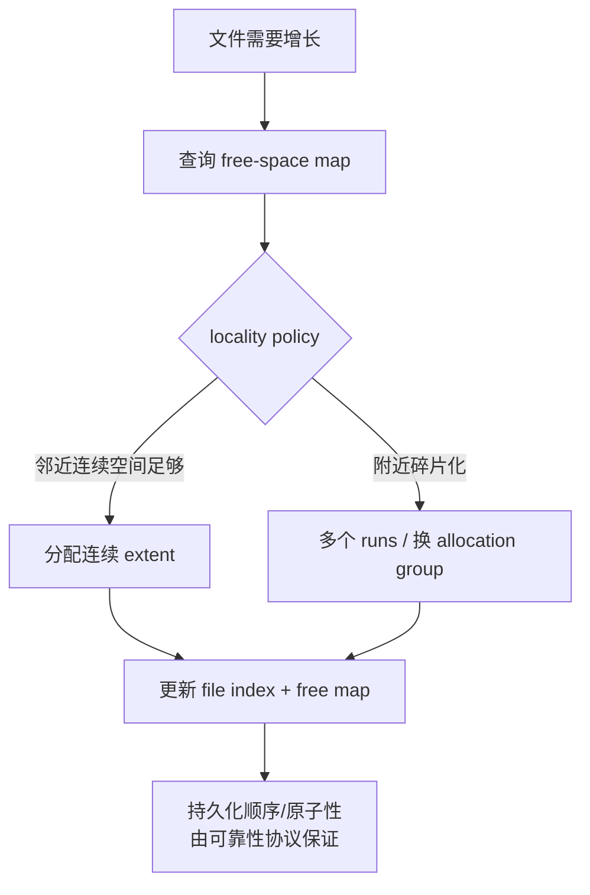
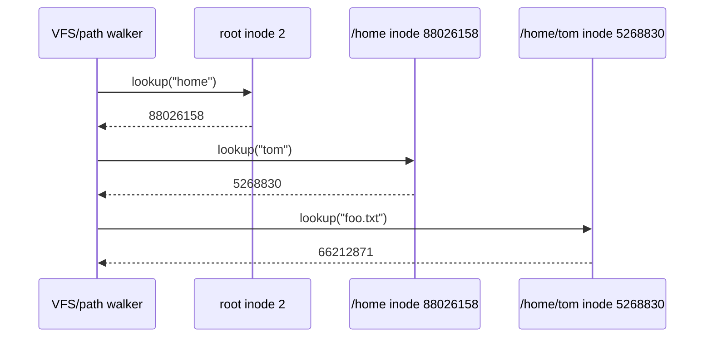
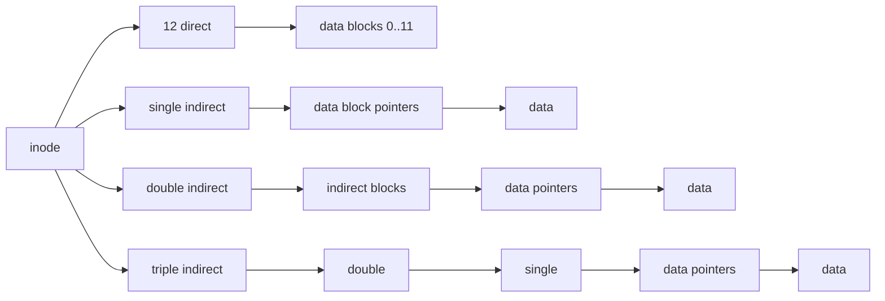
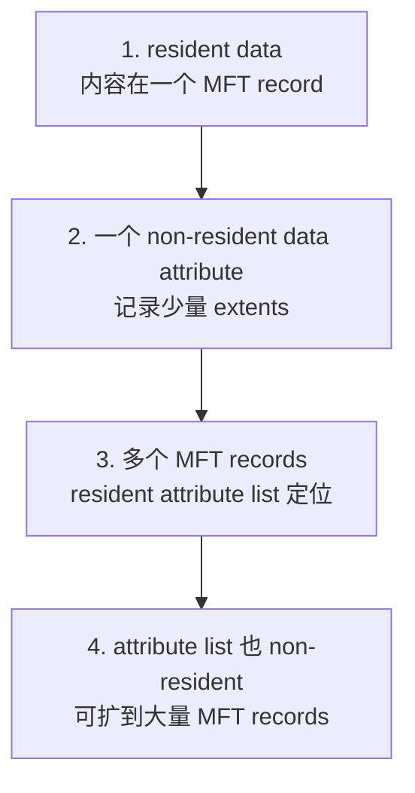
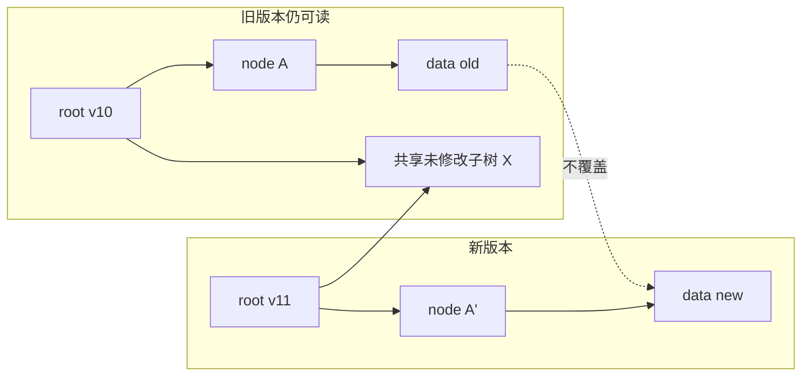
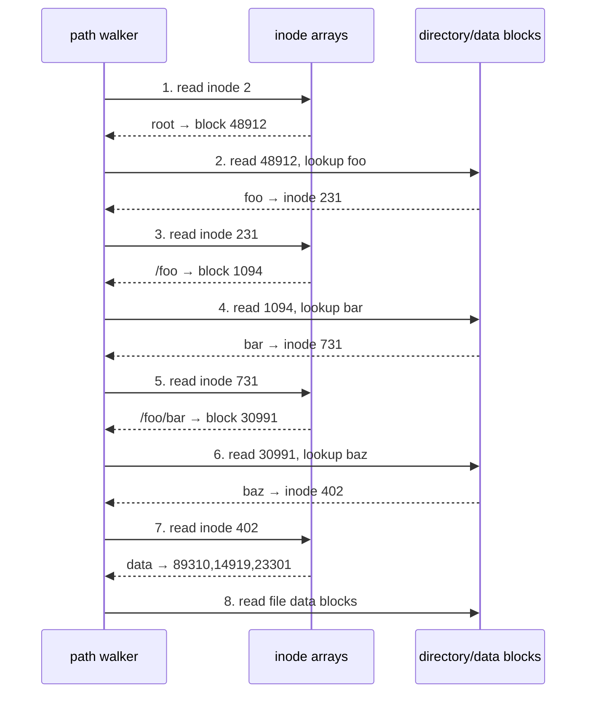
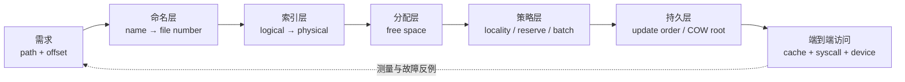

> 原文：Operating Systems: Principles and Practice，第 13 章 Files and Directories
>
> 本章回答“文件系统如何把人类可读路径和文件内 offset 翻译成设备 block”这一实现问题。原书以 FAT、Unix FFS、NTFS 和 copy-on-write 文件系统为代表；本文保留其时代背景与结构，再明确说明哪些结论依赖磁盘、哪些也适用于 SSD。

## 全章主线

第 11 章定义了 file、directory、path 和 API，第 12 章说明存储设备只提供近似“编号 block 数组”的低级接口。本章要跨越两者之间的语义鸿沟：

$$
(\text{path name},\ \text{byte offset})
\longrightarrow \text{device block number}.
$$

表面上，这只是一个 dictionary：key 是名字和 offset，value 是 block number；似乎 hash table 或 tree 就够了。困难在于文件系统还必须同时满足：

1. **Performance**：一起访问的数据尽量物理相邻，避免第 12 章的随机 I/O 成本；
2. **Flexibility**：同一文件系统要兼顾小/大、顺序/随机、短命/长期、读多/写多文件；
3. **Persistence**：用户数据和内部索引都要跨 crash/power loss 存在；
4. **Reliability**：更新中崩溃或设备局部故障时，仍要保护重要数据。可靠性协议是第 14 章主线，本章先建立它要保护的数据结构。

核心翻译分两级：


若文件系统 block 大小为 $B$ bytes，目标 byte offset 为 $o\ge0$，先分解为

$$
i=\left\lfloor\frac{o}{B}\right\rfloor,
\qquad
r=o\bmod B,
$$

其中 $i$ 是文件内 logical block index，$r$ 是该 block 内偏移，且 $0\le r<B$。索引结构负责把 `(file number, i)` 映射到 device block；读出后取第 $r$ 个字节。该分解假设固定 block 大小；extent、压缩文件或 tail packing 会让物理映射更复杂，但逻辑 offset 语义不变。

作者的分析顺序很有意图：先讲 directory 解决**名字**，再比较 file index 解决**位置**，最后把二者串成一次真实访问。这样能把“命名层”和“数据布局层”的不变量分开，再观察它们如何通过 cache 与 locality 相互影响。

## 13.1 实现总览（Implementation Overview）

绝大多数文件系统虽布局不同，却都围绕四类机制组织：directory、index structure、free-space map 与 locality heuristic。

### 目录：把可变长度名字映射为稳定编号

Directory 保存

$$
\text{name}\longrightarrow\text{file number}
$$

的映射。file number 是文件系统内部稳定 ID；Unix 家族常称 inode number。目录本身通常也是一种特殊 file，其 data blocks 存 directory entries。

路径 `/home/tom/foo.txt` 不是一个整体 key，而是从预先约定的 root file number 出发，依次查 `home`、`tom`、`foo.txt`。分层命名允许不同目录重复使用同名，也让移动/链接主要成为 directory mapping 的更新，而非搬动全部 file data。

### 索引结构：把文件内位置映射到存储位置

得到 file number 后，index structure 保存

$$
(\text{file number},\ \text{logical block index})
\longrightarrow \text{device block}.
$$

它还必须容纳 owner、permissions、size、timestamps、link count 等 per-file metadata，或提供找到这些 metadata 的入口。常见方案是 linked list、固定多级树、extent tree、B-tree 与 copy-on-write tree。

设计要同时权衡：

- 小文件 metadata 开销要低；
- 随机访问第 $i$ 块不能从头扫描；
- 大文件能扩展到很大的 $i$；
- 连续 logical blocks 尽量落在连续 device blocks；
- 文件增长时索引可增量扩展；
- crash 中部分更新不能让旧、新索引都不可用。

不存在对所有 workload 都最优的结构：FAT 简单但随机访问线性；FFS 固定树兼顾小文件与大文件；extent 减少连续大文件的索引项；COW 便于原子快照但引入碎片和回收压力。

### Free-space map：知道哪些 block 可以分配

文件增长需要找 free block，截断/删除需要归还 block。Free-space map 至少实现：

$$
\text{allocate}(k,\ \text{near})
\longrightarrow \text{一组未占用 blocks},
$$

并保持“不把同一 block 同时分给两个 live objects”的不变量。

常见 bitmap 用一 bit 表示一个 block。若 volume 有 $N$ 个 blocks，bitmap 空间为

$$
S_{bitmap}=N\ \text{bits}=\frac{N}{8}\ \text{bytes}.
$$

若每 block 为 $B$ bytes，bitmap 相对数据区比例约为

$$
\frac{N/8}{NB}=\frac{1}{8B}.
$$

例如 $B=4096$ B：

$$
\frac{1}{8\times4096}\approx0.00305\%.
$$

1 TiB volume 有 $2^{40}/2^{12}=2^{28}$ 个 4 KiB blocks，bitmap 需

$$
\frac{2^{28}}8=2^{25}\ \text{bytes}=32\ \text{MiB}.
$$

空间很小，但从头逐 bit 找空位会慢。因此实现会按 group/region 分层统计 free counts、维护 run/extent 索引，并从“靠近目标位置”处开始搜索。

### Locality heuristics：机制之上的布局策略

Directory/index 让数据放在哪里都能找到，free-space map 让系统知道哪里可用；真正决定放置位置的是 locality policy。常见启发式包括：

- 同一文件的相邻 logical blocks 连续放；
- 同目录下常一起访问的小文件放近；
- 不同目录/分配组分散，避免单一区域拥塞并保留大段 free runs；
- 延迟分配，先积累写入再一次选择连续 extent；
- 后台 defragment，把文件和 free space 都整理成较长连续区间；
- log-structured/COW 系统优先把新版本顺序写到新位置，以写 locality 换取读碎片和 GC。

这体现 **mechanism 与 policy 分离**：索引结构保证任意合法映射可表示，分配策略尝试让常见映射更快。启发式不可能预知所有未来访问，也会随空闲空间减少而退化，所以它提供经验收益而非正确性定理。



最后一步暴露本章与第 14 章的接口：一次 block 分配至少同时改 free-space map 和 file index。若只持久化一半，会发生 lost block 或 double allocation。第 13 章先讲“正常完成后结构应是什么”，第 14 章再讲如何让多块更新在 crash 下仍一致。

## 13.2 目录：命名数据（Directories: Naming Data）

Directory 的直觉是“文件夹”，严格实现通常是一个受文件系统解释和保护的特殊 file，其内容是一组

$$
(\text{name},\ \text{file number})
$$

records。例：目录 `/home/tom` 中的 `foo.txt → 66212871` 不包含文件数据，只把局部名字连接到 file object。

### 层次路径为何能递归解析

目录也有 file number，所以父目录可像引用普通文件一样引用子目录。递归必须有 base case：文件系统预先约定 root directory 的 file number；FFS 等 Unix 文件系统通常令 root inumber 为 2。

解析 `/home/tom/foo.txt`：

1. 从 root inumber 2 找到 `/` 的 index/data blocks；
2. 在 `/` 中查 `home`，得到 `/home` 的 file number；
3. 读 `/home` 并查 `tom`；
4. 读 `/home/tom` 并查 `foo.txt`；
5. 返回最终 file number，再由文件索引定位数据。



对 relative path，起点改为进程 current working directory；`..` 是到 parent 的特殊 mapping，`.` 指向当前目录。遇到 mount point 时 VFS 切换到另一 volume 的 root；遇到 symbolic link 时把链接中的 path 重新送入解析器，并设置最大跟随次数以防环。

每经过一个目录都要检查 traverse/execute permission，而不只是最终文件权限。否则用户可能借“知道 inode number”绕过不可穿越目录。

若路径有 $d$ 个 components，第 $j$ 个目录有 $n_j$ entries：

- linear directory 的名字比较上界约为 $O(\sum_{j=1}^{d}n_j)$；
- 平衡树、平均 fanout 为 $f$ 时约为 $O(\sum_{j=1}^{d}\log_f n_j)$。

这只是 CPU/索引次数；cold storage I/O 还需读各目录 inode、index node 和 data block。Name cache/dentry cache 能记住 `(parent ID,name)→child ID`，使常用前缀 `/`, `/home`, `/home/tom` 不再反复读盘；也可缓存 negative lookup，避免持续查不存在的名字。

### 为什么目录不能任意 `write`

“目录是文件”不表示应用可把任意 bytes 写进去。文件系统要维护：

1. 每条 live entry 可解析，name 长度与 record 边界合法；
2. 同一目录中名字唯一（按该 FS 的大小写/规范化规则）；
3. 每个 file number 指向存在且类型匹配的 object；
4. link count 与实际 hard links 一致；
5. 删除目录不能留下不可达子树，目录 hard links 不能制造难以回收的 cycle；
6. 创建/删除 object 与增删 directory entry 要按 crash-safe 协议协调。

普通 `write` 只看到 bytes，无法原子维护这些跨对象不变量。因此修改通过 `create`、`mkdir`、`link`、`unlink`、`rmdir`、`rename` 等受控调用完成。

原书用

```c
link("foo.txt", "hw1.txt");
unlink("foo.txt");
```

解释同目录改名的逻辑效果。真实程序应优先调用 `rename`：两个调用之间 crash 会暂时保留两个名字，且并发观察者能看到中间状态；支持的同文件系统 `rename` 可把目录映射切换作为一个原子命名操作。

读目录不破坏不变量，因此可提供 `read` 加格式解析库；Linux 还提供底层 `getdents`，POSIX 程序通常使用 `opendir/readdir/closedir`。应用不应硬编码某文件系统的 on-disk record layout，因为格式、alignment 和并发变化由 OS 封装。

### 线性目录：简单结构何时会变慢

早期 ext2 等把 variable-length directory entries 放在线性链/记录序列：

```text
[inode | record_len | name_len | type | name ... padding]
```

Lookup 从头扫描并比较 name；create 找可容纳 record 的空洞或追加；unlink 标记空闲并可与相邻空洞合并。它的优点是实现简单、紧凑、小目录一次 block read 就能完成。

对 $n$ 个无序 entries，成功 lookup 的平均比较次数（目标均匀）为

$$
E[C]=\frac{1+2+\cdots+n}{n}
=\frac{n(n+1)/2}{n}
=\frac{n+1}{2},
$$

失败 lookup 需比较 $n$ 次。几十个文件没有问题，数千/百万 entries 会让 lookup/create 明显变慢。Directory cache 只能帮助重复查询，第一次或 cache miss 仍要扫描。

### Hash + B+tree：大目录的可扩展查找

XFS、NTFS、ZFS 等用 tree；新版 ext 系列也用 hash-indexed directory。原书的 XFS 风格结构先算

$$
k=h(\text{name}),
$$

再以 hash $k$ 在 B+tree 中查叶子。Internal/leaf nodes 固定大小、按 key 排序；leaf record 指向目录文件前部的 variable-length actual entry。

若每个 node 平均有 $f$ 个 children、目录有 $n$ entries，树高近似

$$
h\approx\lceil\log_f n\rceil.
$$

例如 $f=128,n=10^6$：

$$
128^2=16384<10^6<128^3=2097152,
$$

只需约 3 层。High fanout 让 cold lookup 只读少量 blocks，root/上层常驻 cache 后通常更少。

Hash 不是唯一身份：不同 names 可能 collision。正确算法先定位同一 hash range，再比较完整 name bytes；只比较 hash 会把两个文件混淆。系统还要防 adversarial collision，可使用带随机 seed 的 hash 或有界退化策略。

Tree 的代价是 split/merge、metadata writes 和 crash consistency 更复杂；小目录可能 inline/linear，达到阈值才转换，避免为几个 entries 建整棵树。

### Hard link、symbolic link 与生命周期

Hard link 是另一条 directory entry，直接把不同 path name 映射到**同一 file number**。底层 object 不知道哪个名字是“原名”。每个 file header 保存 link count：

$$
nlink_{new}=nlink_{old}+1\quad\text{on successful link},
$$

$$
nlink_{new}=nlink_{old}-1\quad\text{on successful unlink}.
$$

只有

$$
nlink=0\land nopen=0
$$

时才可回收 data/index blocks；只检查 `nlink=0` 会破坏已打开 fd。普通用户通常不能给 directory 建 hard link，否则可形成 cycle，使引用计数不足以判断可达性，并让 `..`、递归遍历和删除语义复杂化。

Symbolic link 是独立 file object，其 data 是另一个 path。解析时再次查名字，因此 target 被 rename/unlink 后可 dangling；它能跨 volume、也能指向目录。例：`foo.txt` 和 `bar.txt` hard-link 同一 file number，`baz.txt` symlink 到字符串 `foo.txt`；删除 `foo.txt` 后 `bar.txt` 仍可打开，`baz.txt` 则失败。

### Metadata 为什么属于 file header，而非 directory entry

Owner、permissions、size、timestamps、link count 若复制进每个 directory entry，会产生多个事实来源：文件大小变化时必须找到并原子更新所有 hard links；漏一个就得到相互矛盾 metadata，且无法方便维护 link count。

把 metadata 放在由 file number 唯一定位的 inode/MFT record/dnode 中，让所有 names 共享一份状态：

$$
	ext{many directory entries}\longrightarrow
	ext{one file header}\longrightarrow\text{data}.
$$

FAT 把 metadata 放在 directory entry，正因其设计不支持 hard links；这不是单纯格式偏好，而是数据模型选择带来的约束。

## 13.3 文件：定位数据（Files: Finding Data）

Name lookup 得到 file number 后，还要定位该 file 的 blocks。理想设计同时追求五点：

1. 顺序 logical blocks 尽量顺序放置；
2. 任意第 $i$ 块可高效随机访问；
3. 小文件索引和空间开销低；
4. 能扩展到很大文件；
5. 有稳定位置保存 link count、owner、ACL、size、timestamps 等 metadata。

先统一容易混淆的粒度：

| 名称 | 所属层 | 含义 |
|---|---|---|
| sector | 磁盘硬件 | 磁盘最小物理/逻辑传输单位，传统常为 512 B |
| flash page | NAND 硬件 | read/program 单位，erase block 包含很多 pages |
| file-system block | 文件系统 | 分配和索引的固定单位，常把多个 sectors/pages 聚合为 4 KiB 等 |
| cluster | FAT/NTFS 术语 | 本章统一视为 file-system block |
| extent/run | 文件系统索引 | 一段连续 device blocks，由 `(logical start, physical start, length)` 描述 |

若 sector 为 $S$、FS block 为 $B=mS$，索引项数量从按 sector 的 $D/S$ 降至 $D/B$，但文件末尾 internal fragmentation 在“文件长度模 $B$ 近似均匀”时平均约 $B/2$。增大 block 是 metadata 与小文件浪费之间的权衡。

四个案例代表四种思路：

| 文件系统 | Index structure | 索引粒度 | Free space | 主要 locality policy |
|---|---|---|---|---|
| FAT | linked list in FAT array | block | FAT 中值 0 | next fit + 离线 defrag |
| FFS | fixed asymmetric multi-level tree | block | 固定 bitmap | block groups + reserve |
| NTFS | dynamic attribute/extent tree | extent | bitmap metadata file | best fit、预声明大小、defrag |
| ZFS/COW | variable-depth COW tree | block/record | per-group extent tree + log | batch sequential write-anywhere |

它们不是简单的“新一定优于旧”：FAT 的互操作和实现体积有价值；FFS 固定结构易推理；NTFS extent 对连续大文件高效；COW 原子版本与顺序写强，却需处理写放大、碎片和空间回收。

## 13.3.1 FAT：链表（FAT: Linked List）

FAT（File Allocation Table）把每个文件的 blocks 组织成 linked list，但把 `next` pointers 集中存进 volume 保留区的一张数组，而不是写在 data blocks 内。

### 索引结构与映射算法

FAT-32 对每个 device cluster/block 有一个 32-bit table entry：

```text
FAT[i] = 0         → block i free
FAT[i] = j         → 文件链中 block i 的后继是 block j
FAT[i] = EOF       → block i 是该文件最后一块
FAT[i] = BAD/...   → 保留状态
```

Directory entry 保存 first block number，这也是本章语境中的 file number。例：

```mermaid
flowchart LR
    D["foo.txt directory entry<br/>first = 9, size = 5 blocks"] --> B9["data block 9"]
    B9 -->|FAT[9]=16| B16["data block 16"]
    B16 -->|FAT[16]=1| B1["data block 1"]
    B1 -->|FAT[1]=10| B10["data block 10"]
    B10 -->|FAT[10]=25| B25["data block 25"]
    B25 -->|FAT[25]=EOF| END["end"]
```

第 $k$ 个 logical block（从 0 开始）的查找必须执行

$$
b_0=\text{first},
\qquad
b_{t+1}=FAT[b_t],\quad0\le t<k,
$$

最终 physical block 为 $b_k$。时间复杂度为 $O(k)$；即使整张 FAT 在 DRAM 中而没有额外 disk I/O，随机访问文件尾部仍需 pointer chasing，且大 FAT 会占 cache。

顺序访问可在读当前 data block 时预取后续 FAT entries/data；但链中 blocks 若分散，仍会产生随机设备访问。损坏一个 FAT entry 可能截断链、指到别的文件或形成 cycle，检查工具必须用 visited set/上界检测。

### FAT 同时充当 free-space map

`FAT[i]=0` 表示 block $i$ free。最简单分配从头找 0，成本最坏 $O(N)$；常见 next fit 从上次分配位置继续，找到下一个 0 后把它接到文件链末尾。

Next fit 快且状态少，但只找到“下一个空 block”，不保证文件后续 block 连续。反复创建/删除后，free holes 与文件链交错。Defragmenter 读取链、在新连续 extent 重写数据并修 FAT/目录 entry，以离线移动成本恢复 locality。

如果 volume 有 $N$ blocks，FAT 本身占

$$
S_{FAT}=4N\ \text{bytes}.
$$

相对数据容量 $NB$ 的比例是

$$
\frac{4N}{NB}=\frac4B.
$$

$B=4096$ B 时约 $0.0977\%$，比一-bit-per-block bitmap 的 $0.00305\%$ 大 32 倍，因为 FAT entry 还承担 next pointer。

### 容量上限的完整推导

FAT-32 entry 虽为 32 bits，最高 4 bits 保留，最多约 $2^{28}$ 个 addressable blocks。若 $B=4$ KiB $=2^{12}$ B：

$$
V_{max}=2^{28}\times2^{12}=2^{40}\ \text{B}=1\ \text{TiB}.
$$

增大 cluster 可扩 volume；例如 $B=256$ KiB $=2^{18}$ B 时理论范围达 $2^{46}$ B $=64$ TiB。但在“文件大小尾数均匀”假设下，每个文件平均浪费约

$$
E[W]\approx\frac{B}{2}=128\ \text{KiB},
$$

大量小文件会不可接受。因此不能只靠增大 block 无限解决地址位数。

FAT directory entry 用 32-bit unsigned file-size field，所以单文件最大

$$
2^{32}-1\ \text{B}
=4294967295\ \text{B},
$$

即略小于 4 GiB；这与 FAT 链理论能连接多少 blocks 是两个独立限制。

### 为什么 FAT 简单却仍广泛使用

优点：格式小、实现容易、几乎所有 OS/相机/固件都支持，适合互操作优先的移动介质。旧 Microsoft compound document 甚至在单个 `.doc` 内用 FAT-like 结构管理子对象，说明它作为小型容器格式也有价值。

主要局限：

- **Poor locality**：next fit 易产生碎片，需要 defrag；
- **Poor random access**：访问第 $k$ 块要遍历前 $k$ 个 links；
- **有限 metadata/ACL**：传统格式没有 Unix owner/group/完整 ACL；
- **No hard links**：metadata 与 first block 存在每个 directory entry，没有唯一 file header 可共享/保存 link count；
- **容量限制**：约 $2^{28}$ clusters 与 $2^{32}-1$ B file size；
- **可靠性弱**：FAT、directory entry 与 data 的多处更新缺乏现代 transaction protocol，crash 可留下 orphan/cross-link。第 14 章会讨论改进。

因此 FAT 的合理定位是“简单、可移植、受限”，而不是通用服务器文件系统。

## 13.3.2 FFS：固定树（FFS: Fixed Tree）

Unix Fast File System 用 **multi-level index** 解决 FAT 的随机访问问题，并用 block groups 与 reserved space 改善 locality。每个 file 是一棵固定、非对称、高 fanout 树：inode 是 root，data blocks 是 leaves。

### Inode：唯一 file header 与访问控制

FFS 把 inode 放在 inode array 中，inumber 是 array index，因此可由

$$
	ext{inode address}
=\text{inode-array base}+\text{inumber}\times\text{inode size}
$$

直接计算位置；实际 array 分散到 block groups，计算还要先选 group/组内 index。

Inode 保存 file type、size、owner UID、group GID、timestamps、link count、block pointers 和 permission bits。基础 Unix 权限是 owner/group/other 三组，每组 read/write/execute：

```text
          owner   group   other
regular:  rwx     r-x     r--
directory:rwx     r-x     r-x
```

对 regular file，`x` 是执行；对 directory，`x` 是 traverse/search，`r` 是列出 entries，二者不同。`setuid` executable 以 file owner 的 effective UID 运行，`setgid` 类似地切换 effective GID；它们解决普通用户受控执行特权操作的问题，却把安全性压在程序的输入检查和内存安全上，漏洞可能升级为特权执行。现代系统还可叠加 ACL、capability、mount policy 等，九个 bits 不是全部安全模型。

Metadata 放 inode 而不是 directory entry，使 hard links 共享 owner/size/link count，修改一次即可。

### 12 + 1 + 1 + 1 指针构成的非对称树

经典 FFS inode 有 15 个 block pointers：

- 前 12 个 direct pointers：直接指向 data blocks；
- 第 13 个 single-indirect pointer：指向装满 data-block pointers 的 indirect block；
- 第 14 个 double-indirect pointer：指向一层 indirect pointers；
- 第 15 个 triple-indirect pointer：再增加一层。



设 block 大小 $B$、pointer 大小 $P$，一个 indirect block 的 fanout 为

$$
F=\frac{B}{P}.
$$

经典 $B=4096=2^{12}$ B、$P=4=2^2$ B：

$$
F=2^{12-2}=2^{10}=1024.
$$

各层可索引的 data blocks 与 bytes：

| 区域 | Data blocks | 数据容量 |
|---|---:|---:|
| 12 direct | $12$ | $12B=48$ KiB |
| single | $F=2^{10}$ | $2^{22}$ B = 4 MiB |
| double | $F^2=2^{20}$ | $2^{32}$ B = 4 GiB |
| triple | $F^3=2^{30}$ | $2^{42}$ B = 4 TiB |

理论最大文件大小为

$$
S_{max}=B(12+F+F^2+F^3),
$$

略大于 4 TiB。真正上限还可能受 file-size field、block-number width、volume size 和实现规则限制，所以索引表达能力不是唯一约束。

### 随机访问算法与 I/O 深度

给定 logical block index $i$：

1. 若 $i<12$，取 `inode.direct[i]`；
2. 否则令 $j=i-12$，若 $j<F$，用 single block 的第 $j$ 项；
3. 否则令 $j=j-F$，若 $j<F^2$，分解

$$
q=\left\lfloor\frac{j}{F}\right\rfloor,
\qquad r=j\bmod F,
$$

先取 double block 第 $q$ 项指向的 indirect block，再取其第 $r$ 项；
4. Triple 区域把 $j$ 写成 base-$F$ 三位：

$$
a=\left\lfloor\frac{j}{F^2}\right\rfloor,
$$

$$
b=\left\lfloor\frac{j\bmod F^2}{F}\right\rfloor,
\qquad c=j\bmod F,
$$

依次索引 triple、double、single nodes。

算法对任意 block 都是最多常数层，而 FAT 是 $O(i)$。Cold cache 且把 inode read 也计入时，读取 data 分别需 2、3、4、5 个 blocks；inode/indirect cache 命中时只剩 data read。High fanout 的意义是一次 4 KiB indirect read 可服务后续 1024 个 sequential data blocks，metadata I/O 被大量摊薄。

FFS tree 有四个关键特征：

1. **Tree**：按数字分解直接定位，不从文件开头遍历；
2. **High degree**：on-disk node 一次至少读一整 block，高 fanout 降低树高和 seeks；
3. **Fixed structure**：每个 inode 的指针角色预先固定，实现简单；
4. **Asymmetric**：小文件停在 direct 层，大文件才逐级付 indirect overhead。

若所有 data 都强制放在 triple-depth fixed tree，4 KiB 小文件需要 data 加 3 个 indirect blocks（还不含 inode），约 16 KiB，读取也要多层；非对称结构避免绝大多数小文件为极少使用的大文件能力买单。

### BigFS 公式：pointer 与 block 大小如何决定上限

原书设 BigFS 有 12 direct、single、double、triple、quadruple 各一个，$B=4$ KiB、$P=8$ B：

$$
F=\frac{4096}{8}=512=2^9.
$$

各区域容量：

$$
S_{direct}=12\times2^{12}=48\ \text{KiB},
$$

$$
S_{single}=F B=2^9\times2^{12}=2^{21}\ \text{B}=2\ \text{MiB},
$$

$$
S_{double}=F^2B=2^{30}\ \text{B}=1\ \text{GiB},
$$

$$
S_{triple}=F^3B=2^{39}\ \text{B}=512\ \text{GiB},
$$

$$
S_{quad}=F^4B=2^{48}\ \text{B}=256\ \text{TiB}.
$$

总上限

$$
S_{max}=B(12+F+F^2+F^3+F^4),
$$

约为 256.5 TiB。最高层主导总容量；pointer 从 4 B 变 8 B 会减小 fanout，增加 address width 却不自动增加文件上限，必须联合分析。

### Sparse file：logical size 不等于 allocated space

树中 pointer 可以为空，因此文件可有 holes。读 hole 时内核合成 zeros；写 hole 才分配 data block 和通向它的必要 indirect nodes。

原书例：4 KiB blocks，在 offset 0 写 4 KiB，再 seek 到 $2^{30}$ B（1 GiB）写 4 KiB。第二块 logical index 为

$$
i=\frac{2^{30}}{2^{12}}=2^{18}=262144,
$$

它越过 direct 与 single 区域、落在 double-indirect 范围。新增的物理结构是：

- offset 0 的一个 data block；
- offset $2^{30}$ 的一个 data block；
- 一个 double-indirect block；
- 该路径上的一个 single-indirect block。

共 4 blocks，即 16 KiB（inode 已存在且未计），但 logical size 为

$$
2^{30}+4096\ \text{B}\approx1.1\ \text{GB（十进制显示）}.
$$

Sparse file 适合数据库预留地址区间、VM image 和大型数组。边界：不是所有 FS/工具都保留 holes；逐字节复制会把读出的 zeros 真写入目标，使 16 KiB allocated file 膨胀到约 1 GiB。应使用支持 hole detection、`SEEK_HOLE/SEEK_DATA` 或 sparse-aware copy 的工具。

### Bitmap 与 block-group placement

FFS 用固定位置的一-bit-per-block bitmap 管 free space。更关键的是把 volume 切成多个相邻 tracks 的 block groups，并把 inode-array slice、该组 bitmap 和 data blocks 一起分散到每组，避免每次 data/metadata 切换都 seek 到中心化区域。

Placement heuristic 分四步：

1. **Divide**：把设备分 block groups，使组内 seek 短；
2. **Distribute metadata**：每组保存部分 inode 与对应 free bitmap；
3. **Place files**：普通新文件尽量从 parent directory 所在组分 inode，使同目录 files 接近；新 subdirectory 刻意分散到不同组，避免整棵树挤满一组；
4. **Place blocks**：在文件组内使用 first-free，组满才换组。

First-free 看似不如 best-fit 连续：它会先填早期小 holes。但长期直觉是小文件消耗 holes，保留组尾长 free run；大文件前几块可能零散，主体到组尾后可连续增长。它是针对长期分配序列的 heuristic，不保证单个新文件立即最连续。

### 为什么要保留约 10% 空间

Volume 接近 100% 满时，free blocks 稀疏，任何 allocator 都没有选择余地；block-group policy 失效，新写只能散落。FFS 向普通应用少报一部分容量，例如 10%，低于 reserve 后返回 `ENOSPC`；superuser 仍可使用，以便登录、写日志和清理。

若物理容量 $C$、reserve 比例 $r$，普通用户可见容量为

$$
C_{visible}=(1-r)C.
$$

1 TiB、$r=10\%$ 时牺牲约 102.4 GiB。原书的技术经济学是：容量长期快速变便宜，而 seek 改善慢，用一小部分丰富资源换 locality 是合理的。Reserve 不是备份，也不保证一定连续；若 workload 已严重碎片化，仍可能需要重写/defrag。

SSD 没有 seek，但 free-space reserve 仍能帮助 extent 分配、FTL over-provisioning 和降低 write amplification；具体最优比例依 workload，不能机械沿用 10%。

## 13.3.3 NTFS：带 Extent 的灵活树（NTFS: Flexible Tree With Extents）

NTFS 用两项灵活性改进 FAT/FFS：索引 **variable-length extents** 而不是每个 block；用 **variable-depth attribute tree**，结构深度由文件大小与碎片数量决定，而非 inode 中固定 12+3 个槽位。

### Extent：用一个 record 描述一整段连续数据

一个 extent 可抽象为

$$
(v,p,\ell),
$$

其中 $v$ 是文件中的起始 logical block（NTFS 常称 VCN），$p$ 是 volume 上起始 physical block/LCN，$\ell$ 是连续 block 数。若目标 logical block $i$ 满足

$$
v\le i<v+\ell,
$$

则映射为

$$
physical(i)=p+(i-v).
$$

连续 $L$ blocks 在 FFS block-pointer 模型需概念上索引 $L$ 个 addresses，extent 模型只需一个 record；若文件碎成 $e$ 段，metadata 与查找复杂度取决于 $e$ 而非文件总 blocks 数 $L$。

```mermaid
flowchart LR
    V0["logical 0..99"] -->|extent (0, 8000, 100)| P0["physical 8000..8099"]
    V1["logical 100..149"] -->|extent (100, 20000, 50)| P1["physical 20000..20049"]
    V2["logical 150..9999"] -->|extent (150, 50000, 9850)| P2["physical 50000..59849"]
```

一个数十 GiB 但连续的文件仍可能只有几个 extents、tree 很浅；一个较小但高度碎片化的文件反而可能需要很多 records 和更深索引。这是“按实际复杂度付 metadata”的动态结构。

### MFT record 与统一 attribute 模型

Master File Table（MFT）类似 inode array，是一组通常 1 KiB 的 MFT records；file number 指向相应 record。每个 record 含 variable-size attributes，NTFS 把 data 与 metadata 都统一看成 attributes。

Attribute 有两种存放方式：

- **Resident**：内容直接放进 MFT record。小文件的 data 可 inline，无需另读 data block；小 metadata 也适合。
- **Non-resident**：MFT record 只存 extents/run list，内容位于外部 blocks。大文件 data 必然如此。

若小文件 data 能塞进 record，一次 MFT read 同时得到 metadata 和全部内容，既省空间又省 I/O。随着内容变大，系统把 resident data 搬成 non-resident extents；因此“resident”不是永不改变的 file type，而是当前布局状态。

常见 attributes：

1. **Standard information**：creation/modify/access times、owner/security reference、readonly/hidden/system flags 等；
2. **File name**：name 与 parent file number。Hard-linked file 可有多个 file-name attributes；
3. **Data**：可 resident，也可由 extent list 描述；
4. **Attribute list**：当所有 attributes 放不进一个 MFT record 时，指出它们分布在哪些其他 MFT records。

这种统一模型让 stream、ACL reference、索引等都可作为新 attribute types 扩展；代价是 parser、边界检查和 crash consistency 比固定 inode 复杂。

### 文件增长的四个阶段

原书按大小/碎片把成长过程分四级：



1. 极小 file 的 data 直接 resident；
2. 一般 file 的少量 extents 放在一个 non-resident data attribute；
3. 极大/碎片化 file 的 extent records 跨多个 MFT records，首 record 的 resident attribute list 指路；
4. 连 attribute list 都太大时，它也变 non-resident，形成更深动态结构。

FFS 深度主要由 logical file offset 决定；NTFS 深度主要由 extent 数与 attribute metadata 大小决定。Extent 保持良好时，大文件不必深；严重碎片化会让随机 extent lookup 和 metadata I/O 退化，因此 allocator/defrag 是索引性能的一部分。

### Metadata 也做成普通文件

NTFS 不为每种内部结构随意划固定区域，而把大多数 metadata 放进约十几个具有 well-known low file numbers 的 files：

| File number | 特殊文件 | 作用 |
|---:|---|---|
| 0 | `$MFT` | Master File Table 自身 |
| 5 | root directory | 文件系统根目录 |
| 6 | allocation bitmap | free/used clusters |
| 8 | bad-block file | 不可分配 blocks 列表 |
| 9 | `$Secure` | 去重后的 security descriptors/ACLs |

“MFT 自己也是 file 0”似乎循环：找 `$MFT` 需要先读 MFT。Bootstrap base case 是 volume 首 sector/boot metadata 保存 `$MFT` 起始位置；找到 file 0 的首 record 后，就能用其 extents 定位其余 MFT。这与 root inode 号码预先约定、COW root slots 固定位置是同一类递归终止技巧。

把 MFT 做成 file 的优势是可按需增长，不必 format 时静态预留完整 inode array。把 bitmap 等做成 file 也能复用普通 file indexing、allocation 与可靠性机制，减少特殊布局代码。

`$Secure` 还展示 metadata normalization：许多 files 的 ACL 完全相同，若每个都复制一份浪费空间。NTFS 把每个 unique security descriptor 存一次并按 fixed-length key 索引，MFT record 只保存 key：

$$
	ext{many files}\longrightarrow\text{one deduplicated ACL record}.
$$

更新/删除必须维护引用和一致性，但节省重复 metadata。

### Allocation 与 locality policies

NTFS 常用 best-fit 变体：找“能容纳请求的最小 free region”，减少剩余碎片。全盘 bitmap 不必永久驻内存，系统 cache 最近写入区域的 allocation status，先在该 region 搜索，使时间上相近的 writes 也倾向空间聚集。

Best fit 的局限是只知道“现在要多少”时容易为增长文件分配刚够的小 extent，下一次 append 又另开 extent。`SetEndOfFile()` 允许应用预先声明预计 size；若 allocator 知道最终需要 $L$ blocks，就可一次寻找长度 $\ge L$ 的 run。数据库、下载器和 VM image 创建时预分配可显著减少碎片。

MFT 自身若碎片化，每次 metadata lookup 都可能增加 I/O。NTFS 因此在 volume 开头为 `$MFT` expansion 保留例如 12.5% 区域；普通 data 起初不进入。外部空间用尽后 reserve 逐次减半开放，在 MFT 连续增长与用户容量之间动态让步。

系统还提供 defragmenter，把多个 extents 重写为较少连续 extents。Extent tree 能**表示**碎片，不意味着碎片没有性能成本；灵活索引与良好 placement 必须同时存在。

### NTFS 相对 FFS 的权衡

| 问题 | FFS fixed block tree | NTFS flexible extent tree |
|---|---|---|
| 小 file | direct pointers，低开销 | data 可 resident，甚至无需 data block |
| 连续大 file | 每 block 有 pointer 层级 | 少数 extent records，树可很浅 |
| 高度碎片 file | 映射成本仍按 block 规则固定 | extent 数大，attribute list/tree 增长 |
| 结构可预测性 | 高，算术寻址简单 | 格式与转换复杂 |
| Metadata allocation | inode array 分组固定 | MFT 是可增长 file |
| 空间预测 | 写到哪分到哪 | size hint 可提前找大 extent |

Extent 思想也被 ext4、XFS、JFS、HFS+、btrfs 等采用；具体 on-disk tree、reliability 与 allocation policy 不同，不能把“使用 extent”当成 NTFS 独有或实现完全相同。

## 13.3.4 Copy-on-Write 文件系统

Update-in-place 文件系统在原 block 覆盖新版本；Copy-on-Write（COW）从 free space 分配新 block，写入新版本，再让 parent pointer 指向它。旧版本在新 root 提交前保持不变。

### 为什么宁愿多写，也不随机覆盖

Append 一个 data block 可能同时修改 data、indirect node、inode 和 free map。Update-in-place 要在这些分散位置做小随机 writes；COW 可把各新版本集中到一段 free run 顺序写，只把最终 root/commit record 写到固定位置。

原书给出推动 COW 的五个趋势：

1. **小随机写昂贵**：磁盘 bandwidth 提升快于 seek/rotation，顺序与随机差距扩大；
2. **RAID 小写更昂贵**：parity RAID 单-block update 常需 old data read、old parity read、new data write、new parity write，共 4 次 I/O；full-stripe batch 可直接由所有 new data 计算 parity，免两次 reads；
3. **Cache 过滤 reads**：DRAM 能长时间缓存热 reads，writes 却必须及时 durable，write path 更值得优化；
4. **Flash 天然异地写**：FTL 为 erase-before-write 与 wear leveling 已在底层重映射；FS-level COW 采用相同思想，但两层仍同时存在；
5. **容量支持 versioning**：旧 blocks 未被覆盖，保留旧 root 就可形成 snapshot。

COW 用更高 physical write volume 换更好的 write locality、版本原子切换与快照。它是否更快取决于顺序写收益能否覆盖 metadata write amplification 和回收成本。

### Path copying：从叶子一路复制到 root

设 root 到目标 data leaf 的 pointers 为

$$
R\to N_1\to N_2\to\cdots\to D.
$$

更新 $D$：

1. 分配并写新 data block $D'$；
2. 复制 $N_2$ 为 $N_2'$，只把指向 $D$ 的 pointer 改为 $D'$；
3. 逐层复制所有 ancestors；
4. 得到新 root $R'$；
5. 所有新 blocks durable 后，原子发布 $R'$。



若路径有 $h$ 个 metadata levels，各 block 大小近似 $B$，单独更新一个 data block 的直接写量约

$$
W_{single}\approx(h+1)B+W_{global-root/free-space}.
$$

但 batch 中 $m$ 个 updates 共享 ancestors：同一 parent 在内存只形成一个新版本，root 也只写一次，实际 metadata/host-data 比远低于逐更新相加。COW 的关键不是“每次 syscall 立刻复制整条路径”，而是 transaction group 内合并后一次提交。

### Root 如何移动又可被找到

若 root inode 也 COW，它的位置不断变化；需要固定 bootstrap slots。简单协议维护若干 root slots，每个含 monotonically increasing version 与 checksum：

1. 写完并 flush 所有新 children/metadata；
2. 选择最旧 slot，写 `(new root pointer, version, checksum)`；
3. flush root slot；
4. Crash recovery 扫 slots，选择 checksum valid 且 version 最大者。

如果 crash 发生在步骤 1，旧 root 仍引用完整旧树；若 slot torn/corrupt，checksum 使它无效；只有新 root record 完整 durable 才切换。这个论证依赖：

- device 尊重 flush/order；
- checksum 能检测 torn/corrupt root；
- 新 blocks 不会在 root 发布前被误当 free 重用；
- free-space 回收与 root version 协调。

因此 COW 提供原子版本的结构基础，但不是“自动解决所有 crash consistency”；allocation metadata、设备写缓存和丢失写仍要纳入协议，第 14 章继续讨论。

### ZFS 的 uberblock 与 dnode tree

ZFS 固定位置保留 256 个 uberblock slots，轮换写 successive versions。启动时扫描并选 checksum valid、sequence/transaction group 最大者。Uberblock 概念上通向 root dnode；真实结构还经过 meta-object-set/root dnode，允许一个 storage pool 管多个 file systems/snapshots。

Dnode 类似 inode/MFT record，是 variable-depth file tree root：

- 有 3 个 block pointers；
- depth 0 表示 data resident in dnode；
- depth 1 表示 pointers 直接指 data；
- depth 2 指 indirect blocks；依此类推，最多约 6 层；
- data/indirect block 可从 512 B 到 128 KiB；
- block pointer 是约 128 B 的大结构，附带 checksum、compression、copies、位置等信息。

128 KiB indirect block 的最大 fanout约为

$$
F=\frac{128\ \text{KiB}}{128\ \text{B}}=1024,
$$

小于只存 8-byte addresses 时的 16384，但换来了 end-to-end integrity 与多种布局能力。更新一个 leaf 要复制到 file dnode、dnode array 的索引、root dnode，最后到 uberblock；batch 共享高层更新来摊薄成本。

### Snapshot 为什么便宜，删除为何不一定便宜

Snapshot 只需保留旧 root pointer；旧、新 root 共享所有未修改 subtrees，创建复杂度接近 $O(1)$ metadata，而非复制全部数据。后续 update 只复制修改路径。

但 snapshot pin 住旧 blocks：当前版本删除 file 不代表 physical blocks 可回收，只要任一 snapshot 仍可达就必须保留。回收需追踪 block birth/death、引用或按版本可达性；snapshot 删除可能触发大量 deferred space accounting。因此“创建快”不等于全生命周期没有成本。

### ZFS space map：大容量下避免常驻巨型 bitmap

4 KiB blocks 的 1 PiB storage 有

$$
N=\frac{2^{50}}{2^{12}}=2^{38}
$$

个 blocks；一-bit bitmap 为

$$
2^{38}\ \text{bits}=2^{35}\ \text{bytes}=32\ \text{GiB}.
$$

它既占大量 RAM，启动全读也慢；allocations 可只看 cache region，但 frees 位置由 workload 决定，可能毫无 locality。

ZFS space map 采用三层办法：

1. **Per-block-group maps**：只激活少数 allocation groups/metaslabs，并把其 map 放 RAM；
2. **AVL tree of free extents**：按 offset/size 查合适 run，组越满也不必线性扫全部 bits；
3. **Log-structured updates**：on-disk 不原位改每条 free record，而 append allocate/free operations。激活组时读 compact base map 加后续 log 重放，log 太长再 condense 成新 base。

若 group 有 $e$ 个 free extents，平衡 tree 查找/更新约 $O(\log e)$；实际找“指定大小最佳 extent”还需按 size 建辅助索引或在 node 中维护摘要。Log 把随机 metadata writes 变顺序 append，代价是 replay 与周期性 compaction。

### ZFS 如何把 batch 放成顺序 I/O

ZFS 累积数秒 updates 形成 transaction group，再把 data 与各层新 metadata 尽量一起顺序写。一次 batch 中多个 files 共享 dnode-array/root/uberblock 更新，显著摊薄路径复制。

位置选择分三步：

1. **Choose device**：近似 round robin 平衡吞吐，但偏向 free space 多的设备；在一个设备连续放约 512 KiB 再切换，兼顾 locality；
2. **Choose block group**：优先继续最近 group；若最大 free extent 小于约 128 KiB 则换组。新组偏向 free 多、磁盘外圈、近期使用过的位置；
3. **Choose extent**：组内未接近满时 first fit，利于快速聚集；接近满时 best fit，提高空间利用率。

这不是矛盾：不同填充阶段优化目标不同。空间充足时优先顺序/低 CPU，空间紧张时牺牲一定 locality 降低 unusable fragments。

### COW 的局限与替代方案

- **Write amplification**：改一个 leaf 要写 ancestors/free metadata；batch 只能摊薄，不能消除。
- **Fragmentation over time**：同一 file successive versions 写到不同位置，snapshot 又阻止 relocation/reuse；read locality 可退化。
- **Free-space pressure**：必须先有 free blocks 才能更新；接近满盘时 allocation/GC 急剧困难。
- **Double indirection on SSD**：FS COW 上还有 FTL COW，logical sequential 不保证 physical sequential，并可能叠加 WA。
- **Synchronous latency**：若每次小 transaction 都要求立即 durable，无法积累大 batch；需要 intent log、group commit 等辅助机制。
- **Memory/CPU overhead**：checksum、compression、trees 和 space-map accounting 比简单 FAT 高。

Update-in-place + write-ahead journaling 是常见替代：data/metadata 可保持稳定位置，用 log 保证恢复；extent FS 也可 delayed allocation 后顺序放置。选择取决于 snapshot/integrity 需求、read/write 比、free space、device 与 sync workload。

### Partition、format 与 superblock：所有索引的入口

设备可先由 MBR 或 GPT 划成 partitions，每个 partition 对 OS 呈现较小 virtual block device。Partition table 记录 disk ID、各 partition type/ID/name 与起止 blocks，通常在首尾保留冗余副本。

Format 会初始化选定 FS 的 on-disk structures，并写 superblock：FS magic/type、block size、volume size、inode/MFT/uberblock 等关键入口位置与版本。为防单点损坏，superblock 常在预定义位置保存多份。

Boot/mount 的递归基线是：


没有这些 well-known fixed locations，系统无法知道该用 FAT、FFS、NTFS 还是 ZFS 解释同一串 blocks。Magic number 只帮助识别格式，不证明内容可信；mount 仍需校验 bounds、checksums/version，避免损坏 metadata 导致越界访问。

## 13.4 串起全流程：文件与目录访问

原书用 FFS cold-cache 读取 `/foo/bar/baz`，把 directory name lookup 与 inode block lookup 串成 8 步。假设 root inumber 固定为 2：

| 步骤 | 读取 | 得到什么 |
|---:|---|---|
| 1 | inode 2 | root directory data 在 block 48912 |
| 2 | block 48912 | entry `foo → 231` |
| 3 | inode 231 | `/foo` data 在 block 1094 |
| 4 | block 1094 | entry `bar → 731` |
| 5 | inode 731 | `/foo/bar` data 在 block 30991 |
| 6 | block 30991 | entry `baz → 402` |
| 7 | inode 402 | target data pointers 为 89310、14919、23301 |
| 8 | blocks 89310、14919、23301 | 文件内容 |



每个 component 都重复“file number → inode → directory data → next file number”。这说明 directory 自己也是 file：读取它的 entries 也必须先走 FFS multi-level index。

严格实现还会在每层：验证 inode type 是 directory、检查 traverse permission、处理 `.`, `..`, symlink 和 mount、锁定或使用 sequence/version 防并发 rename、检查 record bounds。表中的 8 步是主数据流，不是所有 CPU 操作。

### Cache 如何改变实际 I/O 数

Cold path 看似昂贵，但存在多层 cache：

- dentry/name cache：`(parent,name)→child inumber`；
- inode cache：inumber → parsed metadata/index root；
- page/block cache：directory blocks、indirect blocks 与 file data；
- open-file table：`open` 后 fd 直接引用 inode/open description。

若 `/` 与 `/foo` 的 inode/data 已 cached，步骤 1–4 不产生 device I/O。成功 `open` 后，后续 `read(fd,...)` 不再重走名字，直接从 inode + current offset 定位 data；inode/indirect block cached 时甚至只读目标 data block。

路径深度 $d$ 不必然等于 $2d$ 次磁盘访问：目录可能跨多个 blocks/树层，target data 也可能走 indirect levels；反过来 cache hit 可把大部分降为 0。应把“逻辑步骤数”和“物理 I/O 数”分开。

### Hard link 在访问流程中的表现

原书同一布局中 `/foo/fie` 也映射到 inode 402。因此读取它需要：root inode/data → `/foo` inode/data → inode 402/data；它与 `/foo/bar/baz` 路径不同、深度更浅，却在最终阶段读同一 file object 和 blocks。

这从实现上证明 hard link 不是复制：

$$
/foo/fie\longrightarrow402
\longleftarrow/foo/bar/baz.
$$

修改一个名字打开的内容，另一个名字立即观察同一 inode/data 变化；只有 directory metadata 与路径查找成本不同。

### 写入比读取还多哪些步骤

若向现有 offset 覆盖：需 permission/check、logical-to-physical lookup、page-cache 修改，并最终写 data/metadata timestamps。若 append 跨入新 block，还要：

1. 从 free map 分配 block/extent；
2. 初始化 data；
3. 更新 inode/indirect/extent tree 和 size；
4. 更新 free-space metadata；
5. 按 journaling/COW 协议形成 crash-safe order。

于是 read 主要是“沿稳定 pointers 查找”，grow write 是“同时改变多棵索引并保持不变量”。这正是下一章可靠存储要解决的原子性难点。

## 13.5 总结与未来方向

本章把文件系统还原为两个 persistent dictionaries 加一个 allocator：

$$
	ext{directory}: name\to file\ number,
$$

$$
	ext{file index}: (file\ number,offset)\to block,
$$

$$
	ext{free map}: allocation\ request\to free\ extent.
$$

Locality heuristics 再根据介质与 workload 决定“合法映射中选哪一个”。FAT、FFS、NTFS、ZFS 分别展示链表、固定树、动态 extent tree、COW version tree 的不同答案。

### 存储介质变化

Flash 的随机访问相对磁盘好，使“为少一次 seek 而极端聚集 metadata”的收益下降，可重新考虑 directory/index/block placement；但 erase、有限 endurance、FTL 和 GC 又增加写放大约束。Hybrid FS 可把 metadata/小热文件放 SSD，把大冷文件放 HDD，换取成本与性能折中；代价是跨 tier placement、迁移、一致性和 tier failure 更复杂。

未来 byte-addressable persistent memory 若普及，block tree 可能不再是唯一接口，但 crash ordering、atomic update、权限、allocator 与 persistent pointer 仍存在。介质变快后，software lookup、locks、checksums 和 cache flush 反而更显著。

旋转磁盘也未消失，其 capacity 增长长期快于 seek/rotation 改善，意味着单盘包含更多数据，却不能同比增加 random IOPS。大容量 HDD 上保持 extent、batch 和 sequential transfer 反而更重要。

### Workload 与命名方式变化

Cloud/VM 把许多租户混在同一 storage，要求的不只是平均吞吐，还包括 fairness、tail latency 和 predictable isolation。一个租户的碎片化或 scan 不应让另一个租户延迟失控；allocator 与 I/O scheduler 需要 tenant-aware accounting。

Client apps 越来越自己管理对象，用户看到 photo event、message thread、tag/search，而非 directory path。底层仍可能用 files/directories，用户级 naming 与 locality 却不一定一致。Database/object store、content-addressed storage、key-value API 都是传统 hierarchy 的替代或上层抽象。

目录不会因此立刻无用：它稳定、可组合、具权限继承和跨工具互操作。更合理的问题是哪些对象应暴露 hierarchy，哪些由 application index 管理，以及如何防两套索引在 crash 后不一致。

### 核心结论

1. Path lookup 与 file-block lookup 是两级不同索引，不应混为“打开文件一次查表”。
2. Directory format 必须由专用 API 保护；名字、file number、file metadata 生命周期分离。
3. FAT 的链表简单可移植，但随机访问、metadata 与容量受限。
4. FFS 用固定非对称高 fanout tree 同时照顾小/大文件，block groups/reserve 让机制获得 locality。
5. NTFS extent tree 的成本随碎片数而非文件 block 数增长，resident attribute 又优化极小文件。
6. COW 复制更新路径并原子切换 root，把随机 overwrite 转成 batch sequential writes，也带来 WA、碎片和回收成本。
7. Cache 会大幅减少路径 I/O，但不能替代正确的 on-disk structure；cold start、cache miss 和 recovery 仍依赖它。
8. 所有 grow/delete/rename 都跨 directory、file index 与 free map，多对象一致性是第 14 章的自然下一问。

## C/C++ 可运行实验

以下三个程序分别验证：两级路径/offset 翻译、FFS 多级索引算术和真实 sparse-file 行为。前两个只需标准 C++17；第三个使用 Linux/POSIX API。

### 实验一：从 path 和 byte offset 翻译到 device block

程序复现原书 `/foo/bar/baz` 布局，并同时建立 hard link `/foo/fie → inode 402`。Index 用 extent 表示；输入 path 与 offset，程序逐级输出 directory lookup，再应用

$$
i=\lfloor o/B\rfloor,
\qquad r=o\bmod B,
\qquad physical=p+(i-v).
$$

```cpp
// file_lookup_sim.cpp
#include <cstdint>
#include <cstdlib>
#include <iostream>
#include <sstream>
#include <stdexcept>
#include <string>
#include <unordered_map>
#include <vector>

constexpr std::uint64_t blockSize = 4096;

enum class FileType { directory, regular };

struct Extent {
    std::uint64_t logicalStart;
    std::uint64_t physicalStart;
    std::uint64_t blockCount;
};

struct Node {
    FileType type;
    std::uint64_t sizeBytes = 0;
    std::unordered_map<std::string, std::uint64_t> entries;
    std::vector<Extent> extents;
};

using FileSystem = std::unordered_map<std::uint64_t, Node>;

FileSystem buildExample() {
    FileSystem fs;
    fs.emplace(2, Node{FileType::directory, 0, {{"foo", 231}}, {}});
    fs.emplace(231, Node{FileType::directory,
                         0,
                         {{"bar", 731}, {"fie", 402}},
                         {}});
    fs.emplace(731, Node{FileType::directory, 0, {{"baz", 402}}, {}});

    // 同一个 inode 402 有两个名字；三个文件块在设备上并不连续。
    fs.emplace(402, Node{FileType::regular,
                         3 * blockSize,
                         {},
                         {{0, 89310, 1}, {1, 14919, 1}, {2, 23301, 1}}});
    return fs;
}

std::vector<std::string> splitAbsolutePath(const std::string& path) {
    if (path.empty() || path.front() != '/') {
        throw std::runtime_error("只接受绝对路径");
    }
    std::vector<std::string> components;
    std::stringstream stream(path);
    std::string component;
    while (std::getline(stream, component, '/')) {
        if (!component.empty()) {
            components.push_back(component);
        }
    }
    return components;
}

std::uint64_t resolvePath(const FileSystem& fs, const std::string& path) {
    std::uint64_t current = 2;  // FFS 预先约定 root inumber 为 2
    for (const std::string& component : splitAbsolutePath(path)) {
        const Node& directory = fs.at(current);
        if (directory.type != FileType::directory) {
            throw std::runtime_error("路径中间 component 不是目录");
        }
        auto entry = directory.entries.find(component);
        if (entry == directory.entries.end()) {
            throw std::runtime_error("目录项不存在: " + component);
        }
        std::cout << "directory inode " << current << ": " << component
                  << " -> inode " << entry->second << '\n';
        current = entry->second;
    }
    return current;
}

std::uint64_t mapLogicalBlock(const Node& file, std::uint64_t logicalBlock) {
    for (const Extent& extent : file.extents) {
        if (logicalBlock >= extent.logicalStart &&
            logicalBlock < extent.logicalStart + extent.blockCount) {
            return extent.physicalStart + (logicalBlock - extent.logicalStart);
        }
    }
    throw std::runtime_error("logical block 位于 hole 或超出 extent");
}

int main() {
    FileSystem fs = buildExample();
    std::string path;
    std::uint64_t offset;
    if (!(std::cin >> path >> offset)) {
        std::cerr << "输入格式：绝对路径 byte_offset\n";
        return EXIT_FAILURE;
    }

    try {
        std::uint64_t inumber = resolvePath(fs, path);
        const Node& file = fs.at(inumber);
        if (file.type != FileType::regular || offset >= file.sizeBytes) {
            throw std::runtime_error("目标不是普通文件，或 offset 已到 EOF 之后");
        }

        std::uint64_t logicalBlock = offset / blockSize;
        std::uint64_t offsetInBlock = offset % blockSize;
        std::uint64_t physicalBlock = mapLogicalBlock(file, logicalBlock);

        std::cout << "final inode: " << inumber << '\n'
                  << "logical block: " << logicalBlock << '\n'
                  << "physical block: " << physicalBlock << '\n'
                  << "offset in block: " << offsetInBlock << '\n';
    } catch (const std::exception& error) {
        std::cerr << "lookup failed: " << error.what() << '\n';
        return EXIT_FAILURE;
    }
}
```

编译与示例输入：

```bash
g++ -std=c++17 -O2 -Wall -Wextra file_lookup_sim.cpp -o file_lookup_sim
printf "/foo/bar/baz 5000\n" | ./file_lookup_sim
```

示例输出：

```text
directory inode 2: foo -> inode 231
directory inode 231: bar -> inode 731
directory inode 731: baz -> inode 402
final inode: 402
logical block: 1
physical block: 14919
offset in block: 904
```

把输入改成 `/foo/fie 5000`，路径步骤更少，但 final inode、physical block 与 block 内 offset 完全相同，直接验证 hard link 共享 file object。

### 实验二：计算 FFS direct/single/double/triple 路径

程序不读取磁盘，而是把 logical block number 分解成 inode/indirect arrays 的 indices。它对应本章 base-$F$ 推导，其中 $F=B/P=1024$。

```cpp
// ffs_index_mapper.cpp
#include <cstdint>
#include <cstdlib>
#include <iomanip>
#include <iostream>
#include <stdexcept>
#include <string>
#include <vector>

constexpr std::uint64_t blockSize = 4096;
constexpr std::uint64_t pointerSize = 4;
constexpr std::uint64_t directCount = 12;
constexpr std::uint64_t fanout = blockSize / pointerSize;

struct Location {
    std::string level;
    std::vector<std::uint64_t> indices;
};

Location locate(std::uint64_t logicalBlock) {
    if (logicalBlock < directCount) {
        return {"direct", {logicalBlock}};
    }

    std::uint64_t remaining = logicalBlock - directCount;
    if (remaining < fanout) {
        return {"single", {remaining}};
    }

    remaining -= fanout;
    if (remaining < fanout * fanout) {
        return {"double", {remaining / fanout, remaining % fanout}};
    }

    remaining -= fanout * fanout;
    if (remaining < fanout * fanout * fanout) {
        return {"triple",
                {remaining / (fanout * fanout),
                 (remaining / fanout) % fanout,
                 remaining % fanout}};
    }
    throw std::out_of_range("logical block 超过经典 FFS 索引上限");
}

void printLocation(std::uint64_t logicalBlock, const Location& location) {
    std::cout << std::setw(8) << logicalBlock << " -> " << location.level;
    for (std::uint64_t index : location.indices) {
        std::cout << '[' << index << ']';
    }
    std::cout << '\n';
}

int main() {
    std::size_t count;
    if (!(std::cin >> count)) {
        std::cerr << "输入格式：数量，然后给出 logical block numbers\n";
        return EXIT_FAILURE;
    }

    for (std::size_t index = 0; index < count; ++index) {
        std::uint64_t logicalBlock;
        if (!(std::cin >> logicalBlock)) {
            std::cerr << "缺少 logical block number\n";
            return EXIT_FAILURE;
        }
        try {
            printLocation(logicalBlock, locate(logicalBlock));
        } catch (const std::exception& error) {
            std::cout << logicalBlock << " -> " << error.what() << '\n';
        }
    }

    const std::uint64_t maximumBlocks =
        directCount + fanout + fanout * fanout + fanout * fanout * fanout;
    std::cout << "maximum blocks: " << maximumBlocks << '\n'
              << "maximum bytes:  " << maximumBlocks * blockSize << '\n';
}
```

编译与示例输入：

```bash
g++ -std=c++17 -O2 -Wall -Wextra ffs_index_mapper.cpp -o ffs_index_mapper
printf "6\n0 11 12 1035 1036 1049612\n" | ./ffs_index_mapper
```

示例输出：

```text
       0 -> direct[0]
      11 -> direct[11]
      12 -> single[0]
    1035 -> single[1023]
    1036 -> double[0][0]
 1049612 -> triple[0][0][0]
maximum blocks: 1074791436
maximum bytes:  4402345721856
```

边界值清楚展示非对称树：前 12 块零额外索引，接着 1024 块 single，再接 $1024^2$ 块 double；triple 的第一个 logical block 正是

$$
12+1024+1024^2=1049612.
$$

### 实验三：创建并检查真实 sparse file

程序在 offset 0 和 1 GiB 各写 4 KiB，再用 `fstat` 比较 logical size 与 allocated blocks，并读取中间 hole 验证返回 zeros。

```cpp
// sparse_file_demo.cpp
#define _FILE_OFFSET_BITS 64

#include <algorithm>
#include <cerrno>
#include <cstdio>
#include <cstdlib>
#include <cstring>
#include <vector>

#include <sys/stat.h>
#include <sys/types.h>
#include <unistd.h>

constexpr std::size_t blockSize = 4096;
constexpr off_t farOffset = static_cast<off_t>(1ULL << 30);  // 1 GiB

[[noreturn]] void fail(const char* operation) {
    std::fprintf(stderr, "%s: %s\n", operation, std::strerror(errno));
    std::exit(EXIT_FAILURE);
}

void writeAll(int fd, const char* data, std::size_t size) {
    std::size_t completed = 0;
    while (completed < size) {
        ssize_t result = ::write(fd, data + completed, size - completed);
        if (result < 0 && errno == EINTR) {
            continue;
        }
        if (result <= 0) {
            fail("write");
        }
        completed += static_cast<std::size_t>(result);
    }
}

void preadAll(int fd, char* data, std::size_t size, off_t offset) {
    std::size_t completed = 0;
    while (completed < size) {
        ssize_t result = ::pread(fd,
                                 data + completed,
                                 size - completed,
                                 offset + static_cast<off_t>(completed));
        if (result < 0 && errno == EINTR) {
            continue;
        }
        if (result < 0) {
            fail("pread");
        }
        if (result == 0) {
            std::fprintf(stderr, "unexpected EOF\n");
            std::exit(EXIT_FAILURE);
        }
        completed += static_cast<std::size_t>(result);
    }
}

int main() {
    char path[] = "sparse-demo-XXXXXX";
    int fd = ::mkstemp(path);
    if (fd < 0) {
        fail("mkstemp");
    }

    std::vector<char> first(blockSize, 'A');
    std::vector<char> second(blockSize, 'B');
    writeAll(fd, first.data(), first.size());

    // lseek 只移动 logical offset，不为中间 1 GiB 分配 data blocks。
    if (::lseek(fd, farOffset, SEEK_SET) != farOffset) {
        fail("lseek");
    }
    writeAll(fd, second.data(), second.size());
    if (::fsync(fd) < 0) {
        fail("fsync");
    }

    struct stat information {};
    if (::fstat(fd, &information) < 0) {
        fail("fstat");
    }

    std::vector<char> hole(blockSize, static_cast<char>(0xff));
    preadAll(fd, hole.data(), hole.size(), 10 * static_cast<off_t>(blockSize));
    bool allZero = std::all_of(hole.begin(), hole.end(),
                               [](char value) { return value == 0; });

    // Linux st_blocks 以 512-byte units 计数，不等于 FS block 数。
    long long allocatedBytes =
        static_cast<long long>(information.st_blocks) * 512LL;
    std::printf("logical size:    %lld bytes\n",
                static_cast<long long>(information.st_size));
    std::printf("allocated bytes: %lld bytes\n", allocatedBytes);
    std::printf("hole reads zero: %s\n", allZero ? "yes" : "no");

    if (::close(fd) < 0 || ::unlink(path) < 0) {
        fail("cleanup");
    }
}
```

编译运行（无输入）：

```bash
g++ -std=c++17 -O2 -Wall -Wextra sparse_file_demo.cpp -o sparse_file_demo
./sparse_file_demo
```

在 extent-based Linux 文件系统上一次可能的输出：

```text
logical size:    1073745920 bytes
allocated bytes: 8192 bytes
hole reads zero: yes
```

Logical size 严格为

$$
2^{30}+4096=1073745920\ \text{bytes}.
$$

Allocated bytes 依 host FS：原书假设经典 FFS，需要两个 data blocks 加 double/single indirect blocks，共 16 KiB；ext4 等 extent FS 可能只需两个 4 KiB data blocks，extent metadata 可 resident in inode，于是 `st_blocks` 显示约 8 KiB。程序验证的是 sparse 语义，不应把某次 allocated 值冒充所有文件系统的固定结果。

## 章末练习详解

### 练习 1：为什么 `unlink` 与 `rmdir` 分开

Regular file 与 directory 的删除不变量不同：

- `unlink(file)` 只移除一个 name→file mapping，link count 归零且无 open references 后回收；file 仍可有其他 hard links。
- `rmdir(dir)` 通常要求目录除 `.`、`..` 外为空，还要移除 parent entry、调整 parent/child link counts，并保证当前工作目录/mount 等引用语义。

若允许普通 `unlink` 删除非空目录，子 entries 会突然不可达，形成整棵 orphan subtree；若允许用户随意 hard-link/unlink directories，可能产生 cycle，让引用计数、`..`、递归遍历和回收失效。独立 syscall 让 kernel 先验证 object type，并给出 `EISDIR`、`ENOTEMPTY` 等明确错误。

接口理论上可合成 `remove(path, flags)`，但内部仍必须区分两套检查；分开不是因为两者都不能删 directory bytes，而是为了把不同 invariants 明确放在 API boundary。

### 练习 2：Figure 13.4 创建 `z.txt` 后删除 `work`

原图实际 entries 为：`.`→830、`..`→158、`music`→320、`work`→219、`foo.txt`→871，并有两段 free space。假设新 file 获得 file number 900，allocator 把 `z.txt` record 放进 `work` 后的第一段 free space；随后 `unlink("work")` 把 219 record 标 free。

Physical directory file 可画为：

```text
Name:        .       ..      music   [free]   z.txt   foo.txt   [free]
File No.:   830      158      320              900      871
Next:        └──────→└──────→└───────────────→└──────→└────────→EOF
```

Logical live-entry list 是：


具体 file number、record padding 和是否合并相邻 free space 由 allocator/格式决定；题目能确定的是 `work` 消失、`z.txt` 出现、其余 mappings 不变。Create 还要初始化 file 900 的 header，unlink 还要递减 file 219 的 link count；图只展示 directory contents。

### 练习 3：FFS block size 加倍如何影响最大文件

设 direct count 为 $d$、block size 为 $B$、pointer size 固定为 $P$，fanout $F=B/P$。经典到 triple-indirect 的上限：

$$
S(B)=B(d+F+F^2+F^3).
$$

Block 加倍为 $2B$ 后 fanout 也加倍为 $2F$：

$$
S(2B)=2B[d+2F+(2F)^2+(2F)^3]
=2B(d+2F+4F^2+8F^3).
$$

精确倍率：

$$
\frac{S(2B)}{S(B)}
=2\frac{d+2F+4F^2+8F^3}{d+F+F^2+F^3}.
$$

当 $F$ 很大，$F^3$ 主导：

$$
\frac{S(2B)}{S(B)}\approx2\times8=16.
$$

直觉是 triple 区容量 $BF^3=B(B/P)^3=B^4/P^3$，所以 $B$ 翻倍给出 $2^4=16$ 倍。4 KiB/4-byte pointer 的约 4 TiB index range 变为 8 KiB、fanout 2048 的约 64 TiB。

成立条件：pointer/size fields、volume block count 能表达该范围。若仍是 32-bit physical block number，其他地址限制可能先到；block 变大也增加小文件 internal fragmentation，不能只看最大值。

### 练习 4：Extent-based 文件是否有最大大小

**抽象数据结构层面没有一个由“使用 extent”本身规定的固定上限。** Dynamic tree 可增加 nodes/height，连续数据又可由一个 extent 描述，因此不像固定 15-pointer inode 那样直接给出公式。

**真实实现一定有有限上限**，来自：

- logical offset/file-size field 位宽，例如 signed 64-bit offset；
- physical block number 和 extent-length field 位宽；
- tree key、最大 height/record 数；
- volume 总 blocks 与 implementation limits。

若 logical offset 有 $w$ bits、byte-addressed 且取值 $0\ldots2^w-1$，file size 上界至多约 $2^w$ bytes，即使它是全 sparse。Extent 降低连续文件 metadata，不会把有限字段变成无限。

### 练习 5：6 KiB block、6-byte pointer 的 FFS 变体

结构：12 direct、1 single、1 double、2 triple、1 quadruple。取 $1\ \text{KiB}=1024$ B：

$$
B=6\times1024=6144\ \text{B},
\qquad P=6\ \text{B},
$$

$$
F=\frac{B}{P}=1024=2^{10}.
$$

#### a. 仅 direct pointers

$$
S_{direct}=12\times6144=73728\ \text{B}=72\ \text{KiB}.
$$

#### b. 最大文件大小

Data-block 总数：

$$
N=12+F+F^2+2F^3+F^4.
$$

各项容量：

$$
S_{single}=6144\times2^{10}=6\ \text{MiB},
$$

$$
S_{double}=6144\times2^{20}=6\ \text{GiB},
$$

$$
S_{two\ triple}=2\times6144\times2^{30}=12\ \text{TiB},
$$

$$
S_{quad}=6144\times2^{40}=6\ \text{PiB}.
$$

所以

$$
S_{max}=6\ \text{PiB}+12\ \text{TiB}+6\ \text{GiB}
+6\ \text{MiB}+72\ \text{KiB}.
$$

换算为 PiB：

$$
S_{max}\approx6+\frac{12}{1024}
+\frac{6}{1024^2}+\frac{6}{1024^3}\ \text{PiB}
\approx6.011724\ \text{PiB}.
$$

题目要求 1% 以内，可答约 **6.01 PiB**（约 6.77 decimal PB）。Quadruple 项占绝对主导，但两个 triple 的 12 TiB 仍应在完整推导中保留。

### 练习 6：Directory 的最小与高 link count

传统 Unix/FFS 中，一个空的非 root directory 最小 link count 通常为 **2**：

1. Parent directory 中指向它的 name entry；
2. 它自身的 `.` entry。

每创建一个 immediate child directory，child 的 `..` 又 hard-link 回 parent，所以通常

$$
nlink(directory)=2+\#\{\text{immediate subdirectories}\}.
$$

因此用户虽不能执行 `link()` 给 directory 任意加 hard link，一个包含很多 subdirectories 的目录仍会有很高 link count；这些 links 由 kernel 在 `mkdir/rmdir` 时受控建立/删除。

Root 的 `..` 指向自身，具体计数按实现。某些现代文件系统为避免维护昂贵/不精确的子目录计数，可能报告特殊值（例如 1），所以“最小 2”是传统 Unix on-disk 语义和本题预期，不是所有现代 FS 的跨平台强制值。

### 练习 7：NTFS extent records 顺序扫描为何通常不是问题

NTFS run list 用 variable-length record：header 两个 4-bit fields 分别说明 extent length 与 start delta 各占几 bytes；第一个 start 绝对编码，后续 start 保存相对前一 extent 的 signed delta。题例中从 `0x20000` 到 `0x20050` 的 delta 仅 `0x50`，一 byte 即可；原题后文把首地址写成 `0x200000`，与前述 `0x20000` 多一个零，但二者需 3-byte absolute field，论点不受影响。

随机 offset 看似要从 run list 开头累加 deltas，成本 $O(e)$，其中 $e$ 是 extent 数。实践中通常可接受：

1. 良好 allocation/预分配/defrag 让 $e\ll$ file blocks；连续多 GiB file 可能只有几个 runs。
2. Compact encoding 让整张 run list 常驻一个 1 KiB MFT record/cache line 邻近区域；顺序 CPU scan 比一次 storage I/O 快几个数量级。
3. 若 extents 多到放不下一个 record，attribute list 和多个 MFT records 已形成更高层索引，可按 logical range 定位子记录，不必永远从全文件第一个 extent 扫起。
4. 相对地址减少 metadata size 和额外 MFT I/O；节省一次随机 device read 往往比多比较几十个 records 更重要，尤其原书所处磁盘时代 seek 改善慢、容量增大快。

若 file 极端碎片化、SSD latency 很低且 run list 不 cached，scan 确会成为问题；可用 B+tree/interval tree、更多 range index 或 defrag。Variable encoding 是针对常见低-$e$ workload 的压缩优化，不是随机查找复杂度定理。

### 练习 8：三种文件系统把“是否目录”放在哪里

给定 name 都先查 parent directory，但 file type 的权威位置不同：

#### a. FAT

FAT 没有独立 inode；每条 directory entry 含 attribute bits，其中 directory flag（传统 FAT 的 `0x10` bit）标识子目录。Lookup name 后直接检查该 entry，再决定允许普通 file write 还是仅允许受控 directory API。

#### b. FFS

Directory entry 给出 inumber；读取对应 inode，检查 mode/file-type bits（regular、directory、symlink 等）。Type 与 metadata 属于唯一 inode，所有 hard links 看到一致类型。

#### c. NTFS

Directory index 给出 MFT file reference；MFT record header/standard attributes 标识 directory，并且 directory object 有 `$INDEX_ROOT`/`$INDEX_ALLOCATION` 等索引 attributes，regular file 通常有 `$DATA`。Kernel 以 MFT metadata 为权威，不让应用直接改 directory index bytes。

三者都不能仅由名字后缀或“内容看起来像 entries”猜类型；type 必须是受文件系统保护的 persistent metadata。

### 练习 9：为什么 FAT 很难补 hard links

FAT 的 file identity 分散在 directory entry：first cluster、size、timestamps、attributes 都跟 name 放在一起，没有唯一 inode/file header，也没有 link count。

若两个 entries 指向同一 FAT chain：

- 修改 size/time 要同步更新两份 metadata；
- unlink 一个 entry 不知道是否还有其他 entry，可能过早清空整条 chain；
- 要判断是否最后一个 link，只能扫描 volume 所有 directories，昂贵且 crash 中不可靠；
- 两 entry 若记录不同 first cluster/size，会出现多事实源冲突。

可以新增中央 file table 和 reference count，但需要改变 directory format、更新协议、检查工具与兼容实现，本质上把 FAT 改造成 inode-like 文件系统。难点不是多放一个名字，而是缺少共享 object identity 与生命周期账本。

### 练习 10：创建 `/foo/sparse` 并写 logical blocks 1 与 2,000,000

沿用 Figure 13.25：root inode 2/data block 48912，`/foo` inode 231/data block 1094。假设 cold cache、FFS 有 11 direct、single、double、triple pointers，4 KiB block、4-byte pointer，所以

$$
F=4096/4=1024.
$$

**路径与创建阶段的 reads：**

1. 读 inode 2；
2. 读 directory block 48912，得到 `foo→231`；
3. 读 inode 231；
4. 读 directory block 1094，确认 `sparse` 不存在并找 entry 空间；
5. 读相应 inode bitmap/free-block bitmap blocks 以选择一个新 inode 和 blocks（确切 block IDs 取决于 block group/cache）。

设新 inumber 为 $s$。创建需 writes：初始化 inode $s$；在 block 1094 增 `sparse→s`；更新 inode bitmap，通常也更新 `/foo` inode 的 mtime/ctime。Journaled FFS 变体还会写 log，本题基础 FFS 不计。

**写 logical block 1。** 无论题目把“block 1”理解为 zero-based 第二块还是 one-based 第一块，它都在 11 direct 范围。分配 data block $A$，写 $A$，把相应 direct pointer 写入 inode $s$，并更新 free bitmap。前面的 logical block 若未写就是 hole。

**写 zero-based logical block 2,000,000。** Triple 区起点：

$$
11+F+F^2=11+1024+1048576=1049611.
$$

区内偏移：

$$
j=2000000-1049611=950389.
$$

Base-$F$ indices：

$$
a=\left\lfloor\frac{950389}{1024^2}\right\rfloor=0,
$$

$$
b=\left\lfloor\frac{950389}{1024}\right\rfloor=928,
\qquad
c=950389\bmod1024=117.
$$

文件原本没有这条路径，所以分配并写：一个 triple-indirect block $T$、其 entry 0 指向的 double block $D$、$D[928]$ 指向的 single block $I$、$I[117]$ 指向的 data block $B$；inode triple pointer 指向 $T$。再更新 free bitmap 与 inode size。

新增 FS blocks 共 5 个：direct data $A$，以及 $T,D,I,B$ 四个。中间 holes 不分配。Zero-based size 变为

$$
(2000000+1)\times4096
=8192004096\ \text{B}\approx7.63\ \text{GiB}.
$$

若题目“第 2,000,000 块”按 one-based，则 logical index 为 1,999,999，最后 indices 是 `[0][928][116]`，size 为 8,192,000,000 B；结构和 I/O 数不变。

**最终 writes 汇总：** directory block 1094、parent inode metadata、新 inode 所在 block、5 个新 file/index blocks、inode/free bitmaps；实现可把 inode $s$ 的多次变化合并为一次最终 write。确切次数受一个 bitmap block 是否涵盖多个 allocations、writeback/batching 和 reliability protocol 影响，不能从 Figure 13.25 给出唯一物理 write 次数。

### 练习 11：Cold cache 读取首 block 的最少与最多 I/O

令 canonical absolute path 有 $s$ 个 `/`，且无 trailing slash；例如 `/foo/bar/baz` 有 $s=3$ 个 components。若每个 parent directory 的目标 entry 在第一个 direct data block：每层读一个 directory inode 和一个 directory data block，最后再读 target inode 与首 data block：

$$
R_{min}(s)=2s+2.
$$

例：$s=3$ 得 8，正是 Figure 13.25。

“最大值”不能只由 $s$ 决定，除非再限制 directory 大小/布局。FFS directory 是线性 file；目标 name 可在一个接近最大大小目录的最后 entry，必须扫描所有 data 与 indirect blocks。

若 inode 有 $d$ 个 direct pointers、fanout $F$、最高 triple：最大 data blocks 数

$$
N=d+F+F^2+F^3.
$$

顺序读完整最大文件所需 indirect blocks：single 区 1 个；double 区 $1+F$ 个；triple 区 $1+F+F^2$ 个，因此

$$
I=3+2F+F^2.
$$

把每个 parent directory 都放到该最坏布局，且相关 inode blocks 不重合：

$$
R_{max}(s)=s(1+N+I)+2.
$$

经典 $d=12,F=1024$ 时，每层理论上可达

$$
1+N+I=1075842064
$$

个 block reads，尽管真实 volume/file-size limits 会先约束它。若题目额外假设“所有 directories 恰好一 block”，则最大与最小都退化为 $2s+2$。严谨答案必须说明该额外假设；否则不存在只关于 $s$ 的小常数 maximum。

### 练习 12：同机 Web 请求的一种 user/kernel crossing 时序

选择 FFS，假设 server 已阻塞在 `recv`，client/server 通过 loopback socket 连接；current directory/name entry cached，但 target inode 和一个 data block 都不在 cache。每次 disk miss 让 low-priority background task 运行，设备完成产生 interrupt。下面每一行计一次跨边界：

| # | Crossing | 事件 |
|---:|---|---|
| 1 | client U → K | `send(request)` |
| 2 | K → client U | send 返回，server 被唤醒 |
| 3 | client U → K | `recv(response)`，client 阻塞 |
| 4 | K → server U | server 先前的 recv 返回 request |
| 5 | server U → K | `open(name)`；目录 cached，target inode miss，发 disk read |
| 6 | K → background U | server 等 inode，调度后台任务 |
| 7 | background U → K | disk interrupt：inode 到达 |
| 8 | K → server U | open 完成并返回 fd |
| 9 | server U → K | `read(fd)`；data block miss，发 disk read |
| 10 | K → background U | server 等 data |
| 11 | background U → K | disk interrupt：data 到达 |
| 12 | K → server U | read 返回文件 bytes |
| 13 | server U → K | `send(response)`，loopback 唤醒 client |
| 14 | K → server U | send 返回 |
| 15 | server U → K | server 再次 `recv`，等待下一请求 |
| 16 | K → client U | client 的 recv 返回 response |

因此这一种合法调度有 **16 次 crossings**，其中 #7、#11 是 interrupts。它不是唯一答案：kernel 可在 #13 后直接调度 client，省去 server 的 #14–#15；`sendfile` 可合并 server 的 read/send API；若 target inode 与 data 同时预取，只需一次 interrupt；若走真实 NIC 而非 loopback，还会增加 network interrupts。题目的重点是把 syscall、blocking、scheduler、disk interrupt 和 cache miss 串成自洽时序，而不是背唯一常数。

## 易混淆概念与常见误解

| 常见误解 | 正确理解 |
|---|---|
| Path name 就是 file identity | Directory 把 name 映射到 file number；多个 names 可共享一个 object |
| Inode 中保存文件名 | 经典 FFS inode 不需要 name；name 在 directory entry，inode 保存 metadata/index |
| “目录也是文件”表示应用可任意 `write` | 读取可像 file，修改必须经受控 API 维护跨对象不变量 |
| Hard link 是文件副本 | 它是第二个 name→同一 file number，不复制 data |
| Symlink 与 hard link 只是在 UI 上不同 | Symlink 是存 path 的独立 object，会 dangling、可跨 volume；hard link 直接共享 ID |
| `unlink` 后 blocks 立即释放 | 需 `nlink=0` 且无 open/snapshot 等引用才可回收 |
| File-system block 等于 disk sector/flash page | 它是上层 allocation unit，可聚合多个硬件单位 |
| Block 越大越好 | Index 更小、顺序 I/O 更好，但小文件 internal fragmentation 增大 |
| FAT table 存文件内容 | FAT 只存每个 block 的 next/free 状态；data 在对应 data blocks |
| FAT 在内存后随机访问就是 $O(1)$ | 免 disk I/O 但仍需沿 $k$ 个 links pointer-chase，$O(k)$ |
| FFS 所有 blocks 都在同一树深度 | 它是非对称树：direct、single、double、triple 深度递增 |
| Sparse file 的 `size` 就是占用空间 | `size` 是最大 logical offset+1；holes 不分配 data blocks |
| Extent-based FS 没有最大 file size | Dynamic tree 避免固定槽位上限，但字段位宽/volume/tree 仍有限 |
| 一个文件一定只有一个 extent | 连续时可能一个；碎片化、COW、增长可产生很多 extents |
| NTFS resident data 表示驻留 DRAM | Resident 指内容 inline 在 on-disk MFT record，不是永不换出的内存 |
| MFT 是不可增长的固定数组 | `$MFT` 自己是 file，可增长；boot metadata 提供 bootstrap pointer |
| COW update 只写新 data block | 所有到 root 的 changed ancestors 也需新版本，产生 metadata WA |
| COW snapshot 会立即复制全部数据 | 只保留旧 root 并共享不变 subtrees；后续修改才 path-copy |
| COW 自动保证任何 `write` 已 durable | 还需正确 flush/order/root commit；应用也仍需遵守 `fsync` 语义 |
| Bitmap 总是比 extent map 更可扩展 | Bitmap 简单且空间比例固定；超大 volume 的 RAM/startup 成本可促成分组 extent map |
| SSD 不需要 locality | 没有 seek，但大 extents、batch、channel alignment 和低 FTL WA 仍有收益 |
| Cache 命中后 on-disk 结构不重要 | Cold boot、working-set overflow、recovery 与长期 placement 仍依赖它 |
| Partition、format、mount 是同一步 | Partition 切设备范围，format 初始化 FS，mount 读取/验证并接入 namespace |

### 关键公式的适用边界

| 公式 | 关键假设 | 失真来源 |
|---|---|---|
| $i=\lfloor o/B\rfloor,r=o\bmod B$ | 固定 logical block size | 压缩/tail packing 会改变 physical mapping，但逻辑分解仍可用 |
| Bitmap 比例 $1/(8B)$ | 一 bit 精确对应一 block | 分层摘要、冗余、副本未计 |
| FAT 第 $k$ 块 $O(k)$ | 从 first cluster 沿链、无额外 jump index | 应用顺序 cursor/cache 可摊薄重复遍历 |
| FFS $S=B(d+F+F^2+F^3)$ | 固定层级、$F=B/P$ | size field、block ID、volume limit 可能先到 |
| Extent $p+(i-v)$ | $i$ 落在连续、未压缩 extent | hole、compressed/shared extent 需额外语义 |
| COW 单写约 $(h+1)B$ | 一条 path、各层同大小、未 batch | shared ancestors、variable blocks、global metadata 改变结果 |
| Linear directory 平均 $(n+1)/2$ 次比较 | 成功目标均匀、无 cache | 热点 names、失败 lookup、hash index |
| Path 最少 $2s+2$ reads | Cold cache、每目录一 direct block | cached prefixes、multi-block dirs、tree/indirect levels |

## 全章方法论总结

作者没有从某个文件系统的 struct 定义开始，而是从 translation problem 出发，逐层增加约束：



这套方法可复用于分析陌生文件系统：

1. **先写出映射与不变量。** 谁把 name 映射到 ID，谁把 offset 映射到 block，谁保证 block 不 double-allocate？
2. **拆开 identity。** Name、file number、metadata object、open reference 与 physical blocks 生命周期不同；hard link/unlink 问题由此自然推导。
3. **按 workload 评价结构。** 小/大、顺序/随机、稀疏/连续、读/写、短命/长期，不存在脱离 workload 的“最佳树”。
4. **从 fanout 和字段位宽定量推导。** 不凭“多级树很大”下结论，而算 $F=B/P$、每层容量、I/O depth 和真正先到的 limit。
5. **区分 mechanism 与 policy。** Tree/bitmap 保证可找到；block group、best fit、reserve、batch 决定常见情况下快不快。
6. **寻找 recursion 的 bootstrap。** Root inode number、MFT boot pointer、uberblock slots、superblock fixed locations 都在解决“找索引需要先找到索引”的基线。
7. **把更新看成状态转换。** Allocate 不只是写 data，还同时改变 free map 与 index；COW 也要发布 root。列出所有 changed objects 才能讨论 crash safety。
8. **用完整 access trace 检查解释。** `/foo/bar/baz` 的每一步都必须能落到具体 inode/directory/data block，cache 只能删除步骤，不能补上不存在的映射。
9. **对缺参问题给条件答案。** Directory 最大读数、R-CSCAN 或 extent lookup 都依额外布局；明确上下界/假设比给虚假唯一数更严谨。
10. **最后回到硬件和用户语义。** HDD seek、SSD erase、cloud fairness、app object naming 会改变 policy，但 stable ID、索引、分配和原子更新仍是骨架。

四种设计也展示一条演进路线：

- FAT 用最少机制换互操作；
- FFS 用固定高 fanout tree 和空间 reserve 换普适性能；
- NTFS 用 dynamic extents/attributes 让 metadata 成本跟实际碎片复杂度增长；
- ZFS/COW 用版本 tree 与 batch write 换原子发布、快照和完整性基础。

“演进”不表示后者在所有场景替代前者。Boot firmware/相机卡可能更需要 FAT 的简单；RAM 很小的嵌入式系统未必承担 ZFS metadata；sync-heavy workload 也可能削弱 COW batching。工程选择必须回到约束。

## 复习检查清单

- [ ] 能把 `(path, byte offset)` 拆成 directory lookup 与 file-index lookup。
- [ ] 能由 $o$、$B$ 算 logical block index 和 block 内 offset。
- [ ] 能说出 performance、flexibility、persistence、reliability 四个挑战。
- [ ] 能定义 directory、index structure、free-space map 与 locality heuristic。
- [ ] 能计算一-bit bitmap 的绝对大小和容量占比。
- [ ] 能解释 root file number 为什么是递归 path lookup 的 base case。
- [ ] 能逐 component 解析 absolute/relative path，并说明 traverse permission。
- [ ] 能解释为何 directory 可读但不能由应用任意写。
- [ ] 能比较 linear directory 与 hash+B+tree 的复杂度和碰撞处理。
- [ ] 能区分 hard link、symlink、file number、link count 和 open reference。
- [ ] 能解释 metadata 为什么通常不复制进每个 directory entry。
- [ ] 能区分 sector、flash page、FS block/cluster 与 extent/run。
- [ ] 能画出 FAT entry chain，并说明 free entry、EOF 与 BAD 状态。
- [ ] 能推导 FAT table 开销、1 TiB volume 与 4 GiB file 限制。
- [ ] 能解释 next fit、fragmentation 与 defragmenter 的因果关系。
- [ ] 能描述 FFS inode 中 12 direct、single、double、triple 的角色。
- [ ] 能由 $F=B/P$ 推导各层容量和随机访问 indices。
- [ ] 能解释 FFS tree 的 tree/high-degree/fixed/asymmetric 四个特征。
- [ ] 能复算 BigFS 约 256.5 TiB 和练习 5 约 6.01 PiB。
- [ ] 能区分 sparse logical size 与 allocated blocks，并解释 hole read/write。
- [ ] 能描述 FFS block-group placement 的四步与 first-free 长期直觉。
- [ ] 能说明 reserved space 为什么用容量换 locality/可恢复操作空间。
- [ ] 能用 `(v,p,ℓ)` 映射 NTFS extent 内任意 logical block。
- [ ] 能区分 resident/non-resident attributes 和 MFT 的四阶段扩展。
- [ ] 能解释 `$MFT` 是 file 时如何由 boot sector 完成 bootstrap。
- [ ] 能说明 `$Secure` 去重 ACL 与 metadata-as-files 的收益/代价。
- [ ] 能比较 best fit、size hint、MFT reserve 和 defrag。
- [ ] 能逐步画出 COW leaf update 到 new root 的 path copying。
- [ ] 能说明 version+checksum root slots 的 crash recovery 条件。
- [ ] 能描述 ZFS uberblock、dnode、block pointer 与 variable-depth tree。
- [ ] 能复算 1 PiB/4 KiB blocks 的 bitmap 为 32 GiB。
- [ ] 能解释 per-group extent tree、space-map log 与 condense。
- [ ] 能描述 ZFS 选择 device、block group、extent 的三级 locality policy。
- [ ] 能解释 snapshot 创建快、但删除/空间回收可能昂贵。
- [ ] 能比较 COW 与 update-in-place+journal 的适用条件。
- [ ] 能说明 partition table、format、superblock 和 mount 的关系。
- [ ] 能无遗漏复述 `/foo/bar/baz` 的 8 步 cold-cache 访问。
- [ ] 能解释 dentry/inode/page/open-file caches 各省掉哪些步骤。
- [ ] 能运行并解释三个 C++ 实验及其模型边界。
- [ ] 能独立推导并说明 12 道章末练习的假设、步骤和结论。
