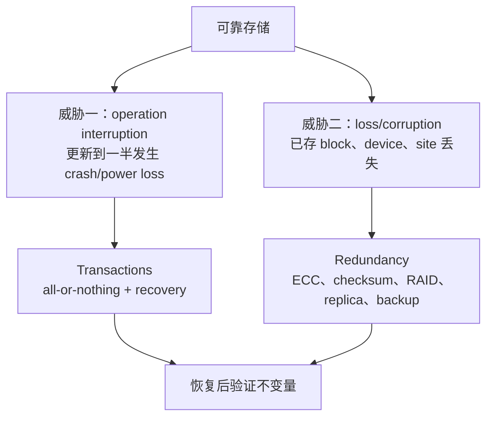
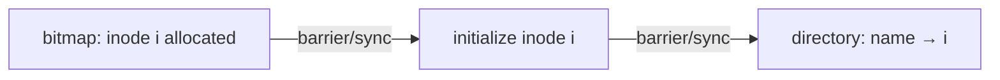
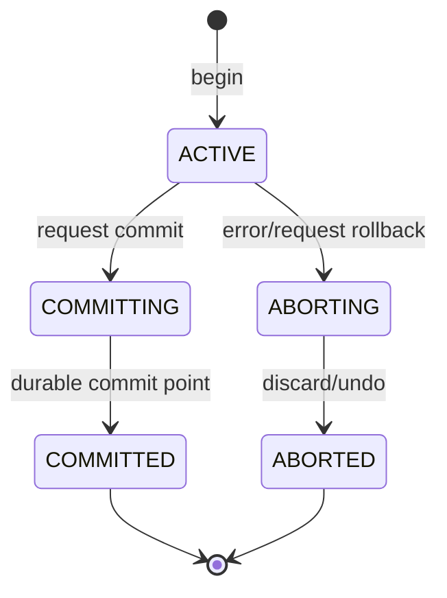
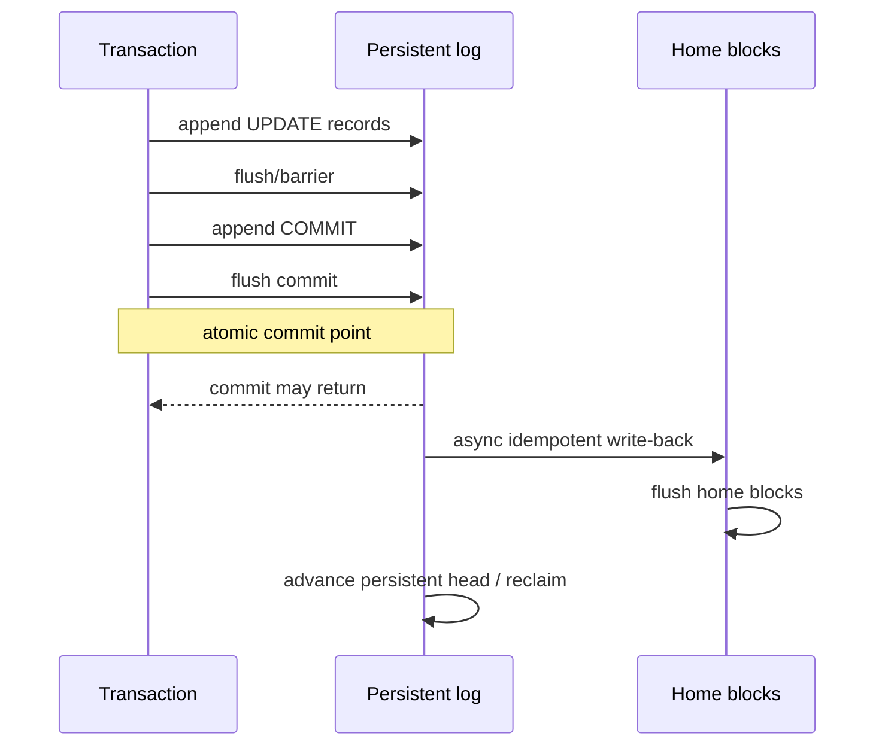
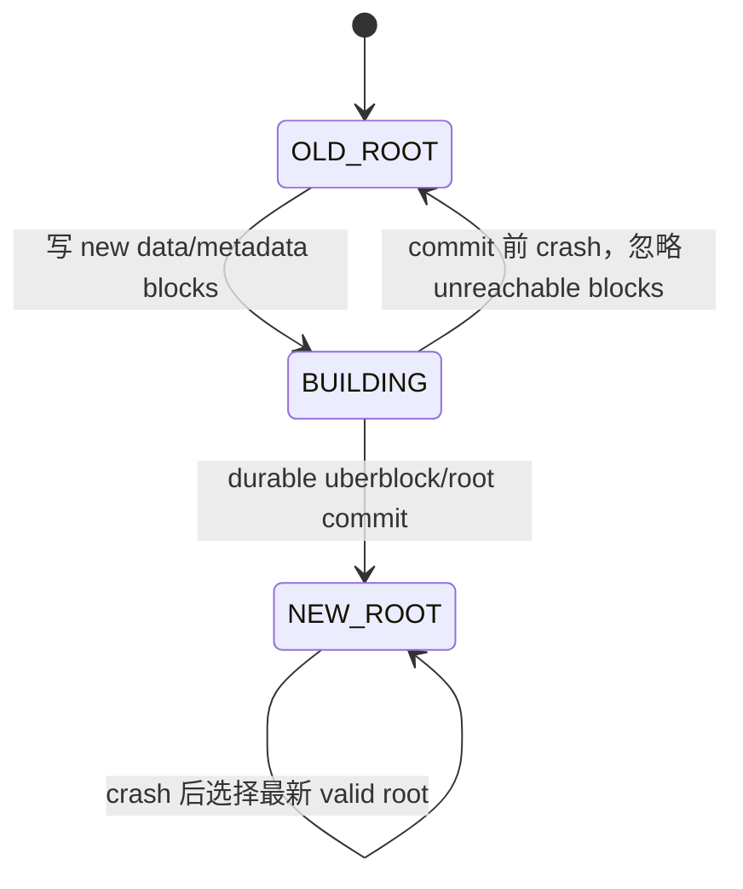
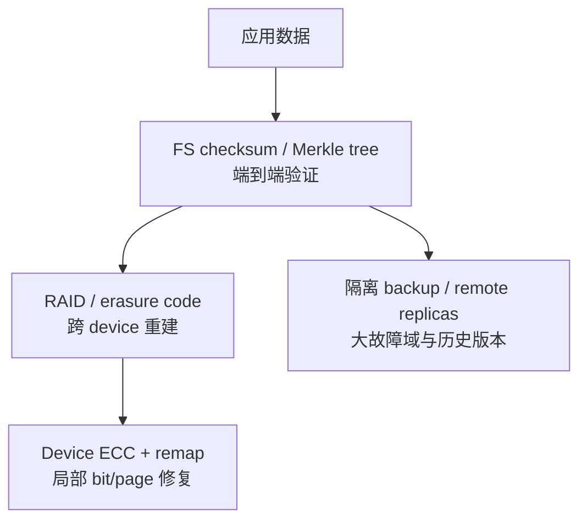
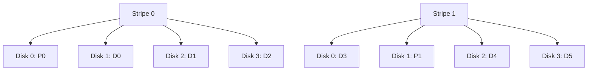
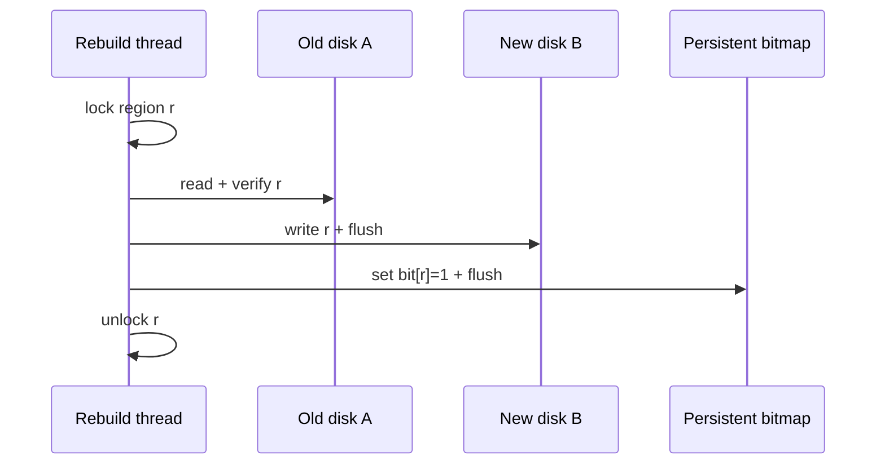
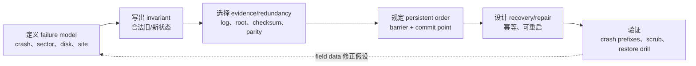

> 原文：Operating Systems: Principles and Practice，第 14 章 Reliable Storage
>
> 本章原书中的磁盘容量、错误率和产品数据多来自 2011 年前后。具体参数会变化，但“先定义故障模型，再用原子提交处理更新中断，用分层冗余处理介质损坏，并验证恢复路径”的方法长期有效。本文忠实覆盖原书结构，同时明确公式成立所需的独立、恒定失效率等强假设。

## 全章主线

此前我们把磁盘与闪存近似成理想的非易失 block array：只要不覆盖，数据就一直存在。真实设备会有制造缺陷、磨损、固件/驱动错误、断电和整机灾害。第 13 章的一次 `rename`、block allocation 或 file growth 又会同时改 directory、inode/index 和 free-space map；任何时刻断电，都可能只留下部分更新。

本章中心问题是：

> **如何用不完美的物理设备构造比单个设备可靠得多的存储系统？**

作者先把问题分为两个正交威胁，再给出两组解法：



事务不能恢复已物理损坏且没有副本的数据；RAID 也不能自动修复一次跨多个 metadata blocks 的半完成逻辑更新。两类机制必须叠加，而不是互相替代。

### Reliability 与 availability 严格区分

**Reliability（可靠性）**：系统在指定时间区间内持续正确保存某份数据，并保持其 components 有能力读取或覆盖该数据的概率。记

$$
R(t)=P(T_{failure}>t),
$$

其中 $T_{failure}$ 是从当前时刻到系统失去预期存储功能的时间。

**Availability（可用性）**：在任一观察时刻，请求能够完成的概率。稳态常写为

$$
A=P(\text{system can serve a request now}).
$$

一个离线异地归档可非常可靠，却暂时不可读；一个无冗余高速盘此刻完全可用，却可能在故障后永久丢数据。Voyager 金唱片预计可保存数万年，几乎无法被地球用户即时访问，正是“高 reliability、低 availability”的直观例子。

复制也展示两者的冲突。若 100 个相互独立节点单节点 availability 为 $a$：

- 读只需任一副本时，

$$
A_{read}=1-(1-a)^{100};
$$

- 写若必须等待全部 100 个节点，

$$
A_{write}=a^{100}.
$$

取 $a=0.99$：$A_{read}=1-10^{-200}$，近乎 1；但

$$
A_{write}=0.99^{100}\approx0.366.
$$

复制极大增强 read availability/reliability，却因过强的“全副本同步”规则把 write availability 降到约 36.6%。Quorum、异步复制等是在一致性、durability 与 availability 间重新设定条件；本章重点仍是单机/RAID 原理。

### 为什么单盘失败率不能忽略

原书引用大型部署中约 2%–4% 的 annual disk failure rate（AFR）。若粗略假设每年失败事件独立且概率固定为 $p$，单盘十年内至少失败一次的概率为

$$
P_{10}=1-(1-p)^{10}.
$$

当 $p=0.02$：

$$
P_{10}=1-0.98^{10}\approx18.3\%;
$$

当 $p=0.04$：

$$
P_{10}=1-0.96^{10}\approx33.5\%.
$$

所以“单盘保存十年”可能有超过 30% 的设备失败机会。该计算不是数据丢失概率的精确预测：设备会更换、失效率随年龄变化、失败相关；它只证明规模与时间会把看似小的年概率放大到不可忽略。

### 两种故障的具体后果

**Operation interruption。** 将 `drafts/really-important.doc` 移到 `final/` 可能修改源目录、目标目录及 inode、目标目录新增 data block、free bitmap、sizes 和 timestamps。若先删源名字、未持久化目标名字就断电，文件不可达；若新目录 block 已引用、free bitmap 仍标 free，该 block 日后可能被第二个文件分配，形成 double allocation 与交叉破坏。

**Loss of stored data。** 磁盘划伤可丢一个 sector，flash read disturb 可改变 page，轴承/控制器故障可丢整盘，火灾/软件误删可同时影响一组设备。故障粒度与相关性决定需要 sector ECC、RAID、跨机复制还是异地 backup。

本章的分析方法始终是：明确 failure unit → 找到可观察错误 → 加最小冗余或原子边界 → 推导恢复算法 → 检查“恢复本身再次失败”与相关故障。

## 14.1 事务：原子更新（Transactions: Atomic Updates）

当一项逻辑操作包含多个 persistent writes 时，系统希望任何 crash 后只观察到旧状态或完整新状态，而不是中间拼接：

$$
S_{recovered}\in\{S_{old},S_{new}\}.
$$

例如银行从 Alice 向 Bob 转 100 元，合法状态是 `(Alice-100, Bob+100)` 或完全未转；只扣不加会破坏总额不变量。软件套件升级要么全旧要么全新，目录移动要么在旧位置要么新位置。

### 与 critical section 的相同点和差异

Concurrency 中 critical section 防其他线程观察内存中间态；transaction 防并发 transaction 与任意 crash 观察 persistent 中间态。二者都需要 atomicity、consistency、isolation，但 transaction 还要求 durability。

锁只存在于 volatile memory：机器重启后锁状态消失，无法告诉恢复代码哪些 storage writes 已完成。设备还可能重排、缓存 writes，persistent atomic unit 通常只是一 sector/page。因而“给保存代码加 mutex”不能实现 crash atomicity；必须把意图/版本本身持久化，并定义 recovery。

## 14.1.1 临时拼凑方法（Ad Hoc Approaches）

早期 FFS 通过严格 write ordering 加全盘 `fsck` 修复，而不是把每项操作包装成通用 transaction。

### 创建文件的安全退化顺序

创建新文件至少改 inode allocation bitmap、new inode 和 parent directory。FFS 采用：

1. 先持久化 bitmap：将 inode $i$ 标为 allocated；
2. 再清空/初始化 inode $i$ 的 pointers、size、owner 与 permissions，并持久化；
3. 最后在 parent directory 加 `name→i` 并持久化。



为什么必须这样排？

- Crash 在 1 后：得到 allocated 但未被 directory 引用的 inode，形成 leak；`fsck` 可回收。
- Crash 在 2 后：得到完整但 unreachable inode；仍可回收。
- Crash 在 3 后：directory 指向已 allocated、已初始化 inode，结构合法。

若把 directory entry 先写，crash 后可能指向仍 free 或含旧 pointers 的 inode；该 inode 可同时被再次分配，修复时无法安全判断哪个 owner 正确。Ordering 没有消除中间态，而是把中间态限制为可识别、可修复的方向。

### `fsck` 如何从全局不变量推断修复

重启后 `fsck` 扫描全部 inodes、directories 和 bitmaps，重建/核对：

- 被 directory 引用的 inode 必须 allocated；
- inode link count 应等于实际 directory hard links；
- allocated data block 不能被两个 live files 同时引用；
- 被 inode 引用的 block 必须在 free bitmap 中标 used；
- bitmap 标 used 却无人引用的 block/inode 是 leak，可回收或放入 `lost+found`。

这是一种离线全局 constraint solver。它可处理已知格式的不一致，却未必知道用户意图：一个 orphan inode 究竟是未完成 create 还是已开始 delete？Ordering 让两种情况具有可接受的统一修复方向。

### 为什么这种方法被 transactions 取代

1. **Reasoning complex**：每个 operation、每个 write prefix、与其他 operation 的交错都要人工证明可修复，类似只用原子 load/store 手写多对象同步。
2. **Updates slow**：依赖写之间必须插 barrier/`fsync`，无法 pipeline/reorder；即使 blocks 相邻，也可能为三个阶段等待三圈。
3. **Recovery extremely slow**：恢复时间与整个 volume metadata 容量相关，而非未完成 updates 数量。容量增长远快于扫描速度后，重启可能停机数小时。

现代文件系统仍保留 `fsck` 作为软件 bug、介质损坏等非常规 corruption 的应急工具，但正常 crash recovery 通常只 replay 有界 journal/log。

### 应用层临时方案：write-temp + rename

若编辑器原地覆盖 `design.txt`，crash 可能留下任意 old/new block 混合。更安全方案：

1. 在同目录创建唯一 temporary file；
2. 循环写完整新内容；
3. `fsync(temp_fd)`；
4. `rename(temp, "design.txt")` 原子切换 name；
5. `fsync(parent_dir_fd)` 使 directory change durable。

POSIX 对同文件系统的 replacement rename 保证名字切换的 atomic visibility，但标准/具体文件系统对 crash durability 的边界不同；若省略 file/directory `fsync`，断电后可能回旧版、丢新名字或留下 temporary name。跨文件系统 `rename` 返回 `EXDEV`，无法作为一个 metadata atomic action。

该方法只能原子替换一个 name 指向的完整 file，不能自然地同时更新多个 files、ACL、数据库 index 和目录树；复杂应用仍需 WAL/database transaction 或 transactional API。

## 14.1.2 事务抽象（The Transaction Abstraction）

Transaction 把一组 reads/writes 包成一个 logical unit：

```text
tid = beginTransaction()
... read/write objects under tid ...
commitTransaction(tid)      // 全部生效
// 或 rollbackTransaction(tid)  // 全部不生效
```

例如发布一组互相链接的网页，transaction 内先新增、删除、替换所有 files；任何一步错误就 rollback，全部成功才 commit。Transaction 外的 reader 只能看到旧网站或完整新网站，不能看到“新首页引用尚未创建页面”的中间状态。

### ACID 四个性质

**Atomicity（原子性）。** Transaction 的 updates all-or-nothing：

$$
commit(T)\Rightarrow state'=apply(T,state),
$$

$$
abort(T)\Rightarrow state'=state.
$$

Atomicity 不表示 transaction 只执行一条 machine instruction，而是任何允许的 observation/recovery 都不能看到部分 effect。

**Consistency（事务一致性）。** 若 transaction 开始时 invariants $I(state)$ 成立，正确 transaction commit 后也必须满足

$$
I(state)\land pre_T\land correct(T)
\Rightarrow I(apply(T,state)).
$$

Transaction mechanism 保证 atomic/isolation，却不能自动判断业务逻辑正确。若银行 transaction 原子地给错误账户加钱，它仍 ACID，却违反应用意图。Programmer 定义 invariants 并写正确 updates，system 保证中间态不泄露。

**Isolation（隔离性）。** 并发 transactions 的结果应等价于某个 serial order。对任意 $T,T'$，外部行为仿佛 $T$ 全部先于 $T'$，或反之。最强常用定义是 serializability：

$$
H_{concurrent}\equiv H_{serial}
$$

对某个 serial history $H_{serial}$。它不要求真实执行不并发，只要求可观察 reads/writes 与最终状态等价。

网站示例中，一个 read transaction 看到整套旧 pages 或整套新 pages。若浏览器把 HTML 与每张图片分成独立 transactions，每次 read 本身隔离，组合结果仍可能跨版本；isolation boundary 必须覆盖需要一致观察的整个操作。

**Durability（持久性）。** `commit` 成功返回后，即使 crash，updates 也必须在 recovery 后存在：

$$
commit(T)\text{ returned}\land crash
\Rightarrow apply(T)\subseteq state_{recovered}.
$$

之后只能由另一合法 transaction 改变。实现必须在返回前把足够的 data/intent 与 commit evidence 放到真正的 persistent domain；只进 CPU cache、OS page cache 或 volatile controller cache 不够。



Commit point 之前 crash 应恢复为 aborted；之后 crash 必须恢复为 committed。实现事务的核心就是把这个逻辑二分压缩到硬件能原子写入/验证的一条 commit record 或 root pointer。

### ACID 与 critical section 对比

| 维度 | Critical section | Transaction |
|---|---|---|
| 主要威胁 | 并发线程交错 | 并发交错 + crash/power loss |
| 状态 | 主要是 volatile memory | persistent state |
| 成功边界 | release lock | durable commit |
| 失败处理 | 异常/线程退出另行处理 | abort/rollback/recovery 是抽象组成 |
| 典型机制 | mutex/RW lock/atomic | 2PL + WAL、MVCC、COW |
| 性质 | A/C/I | A/C/I/D |

锁和 transaction 可叠加：2PL 用 locks 实现 isolation，redo log 实现 atomicity/durability。只有日志而没有并发控制，两个 transactions 仍可能丢更新；只有锁而没有日志，断电后仍可能 half-update。

### “Consistency” 的两种术语

本章 transaction consistency 指 invariants 在 commit boundaries 成立；distributed systems/memory model consistency 指不同 readers 观察 updates 的允许顺序。二者相关但不等价。为避免歧义，后文明确说“事务一致性”或“内存/副本一致性”。

## 14.1.3 实现事务（Implementing Transactions）

硬件通常只保证一 sector/page 或更小 atomic write，transaction 却要原子改多个 blocks。若直接 overwrite home locations，crash 后旧集合已不完整、新集合也不完整，既不能 rollback，也不能 finish commit。解决思路是先在独立 persistent location 保存**足以决定和重建结果的证据**。

### Redo logging：先记新值，再提交，再覆盖原位

Redo log 保存“commit 后应写入什么”的 intentions。每条 update record 可抽象为

```text
UPDATE(tid, target_block, offset, length, new_bytes, checksum)
COMMIT(tid, checksum)
ABORT(tid, checksum)   // 可选
```

协议四阶段：

1. **Prepare**：把 transaction 的全部 update records append 到 log 并确保持久；
2. **Commit**：append durable commit record；
3. **Write-back/Install**：把 new values 写到 home locations；可异步；
4. **Garbage collect**：所有 installs durable 后，才回收对应 log records。



持久顺序必须满足：

$$
U_T\prec C_T\prec H_T\prec G_T,
$$

其中 $U_T$ 是 transaction $T$ 全部 log updates durable，$C_T$ 是 commit record durable，$H_T$ 是全部 home write-back durable，$G_T$ 是 log garbage collection durable；$a\prec b$ 表示 crash-persistent order 中 $a$ 必须先完成。

若违反任一顺序：

- $C_T$ 先于部分 $U_T$：recovery 看见 commit，却没有足够 new values 重做；
- $H_T$ 先于 $C_T$：uncommitted update 可能写入 home，redo log 又没有 old value 可撤销；
- $G_T$ 先于 $H_T$：crash 后 home 未完成，log 证据已被覆盖，committed data 丢失。

因此 redo logging 同时要求 **write-ahead**（log before home）与 **force-at-commit**（commit evidence durable before return），但不要求 home blocks 在 commit 返回前落盘，属于 no-force policy。

### Atomic commit point

Commit record 要能以底层 atomic unit 写入，或用 length、sequence、strong checksum 检测 torn write。其 sector 成功持久化的瞬间是线性化点：

- 此前 crash：没有 valid commit，忽略 updates，回到 old state；
- 此后 crash：valid commit 存在，recovery 必须重放，得到 new state。

仅有 checksum 不能让 torn write 变 atomic，但能把“半条 commit 看起来有效”的概率降到设计目标；record 还应包含 transaction ID、expected record count/range，防旧 sector 或错位 write 被误认成新 commit。

### Recovery 算法

重启在接受新请求前顺序扫描有效 log：

```text
pending: tid -> ordered list of update records

for record in log:
    if UPDATE(tid, ...):
        validate checksum and append to pending[tid]
    if COMMIT(tid):
        validate transaction completeness
        write every pending[tid] update to its home location
        flush those writes before reclaiming the log
        erase pending[tid]
    if ABORT(tid):
        erase pending[tid]

at end of valid log:
    discard all remaining pending transactions
```

Records 可由多个 concurrent transactions 交错，因此每条必须带 `tid`。真实实现通常用 log sequence number（LSN）、transaction table、checkpoint 限制扫描范围，不必每次从 volume 开头读。

若遇到 checksum invalid/torn tail，recovery 在最后完整 record/segment 截止；它不能跳过未知损坏后继续猜，因为后续 commit 的 update set 可能不完整。

### Tom 向 Mike 转 100 的状态推导

初始 home/cache：`Tom=200, Mike=100`。Transaction 在 cache 计算 `Tom=100, Mike=200`，log 写：

```text
UPDATE(T, Tom, 100)
UPDATE(T, Mike, 200)
COMMIT(T)
```

按 crash 点分类：

| Crash 时刻 | Persistent evidence | Recovery 结果 |
|---|---|---|
| update records 未写完 | 无 valid commit | 丢弃，`200/100` |
| updates 全在、commit 未完成 | 无 valid commit | 丢弃，`200/100` |
| commit durable、home 均未写 | valid commit + 全 updates | 重做为 `100/200` |
| commit 后只写回 Tom | valid commit + 全 updates | 再写 Tom/Mike，`100/200` |
| home 全写、log 未 GC | valid commit | 重复重做，仍 `100/200` |

所有 crash prefixes 收敛到 old 或 new，银行总额 300 不被中间状态破坏。

### 为什么 redo record 必须幂等

Recovery 可能自身再次 crash；某些 home writes 已在原运行或前一次 recovery 完成。重新扫描会再次应用同一 record。若 record 是赋值

$$
x\leftarrow42,
$$

则执行任意 $n\ge1$ 次结果仍为 42：

$$
f(f(x))=f(x).
$$

它是 idempotent。若 record 是 `x += 42`，重放 $n$ 次得到 $x+42n$，错误。因此 log 应保存 after-image/new bytes 或带 expected version 的条件操作，而不是不可重复的高层增量命令。

这也证明 recovery 可 restart：每次从 persistent checkpoint/head 重放 committed records，重复只浪费时间，不改变最终状态。

### Async write-back 的性能与边界

Commit latency 只包含顺序 append updates + commit flush，不等待随机 home blocks；background write-back 可批量排序，提升吞吐。延迟不能无限增长：

- 未 install transactions 越多，crash recovery 越久；
- log 空间有限，tail 可能追上 head；
- dirty home state 过多会占 DRAM；
- checkpoint/latency policy 可能要求上限。

### Circular log 的 head/tail 不变量

Circular log 有 append tail、volatile head（RAM 中已知可回收位置）和 persistent head（recovery 实际起点）。即使 records 已 write-back，若 persistent head 尚未推进，crash 后 recovery 仍会从旧位置读它们。

因此 tail 的安全边界是：

$$
tail\neq persistent\_head
$$

并且不能越过 persistent head；不能只看更靠前的 volatile head。用 volatile head 覆盖旧 records 后立即 crash，recovery 会按旧 persistent pointer 读到已被新 records 覆盖的区域，无法判断历史。

GC 步骤应：确认相关 home writes durable → 持久化新 head pointer（含 generation/checksum）→ 才允许 tail 重用空间。Head record 自身也需冗余/原子更新，否则 log 管理成为新的单点。

### Barrier 与“调用返回”不等于介质顺序

OS、driver、controller 都可能 cache/reorder writes。协议必须使用平台的 flush/FUA/barrier，形成上述 persistent happens-before。应用层 `fsync` 请求 file state durable；内核内部 block barrier 约束前后请求。具体旧接口名称（原书提到 Linux `BIO_RW_BARRIER`）会演进，但语义要求不变。

事务正确性不能建立在“我按顺序调用 `write`，设备自然按顺序落盘”的假设上。

### Undo logging：先记旧值，再允许原位覆盖

Undo log 保存 before-image。更新 object $x$：

1. Append `UNDO(tid, x, old_value)` 并 flush；
2. 原位写 `new_value`；
3. Commit 前强制所有 home writes durable；
4. Append/flush commit record；此后可回收 undo records。

顺序不变量为

$$
oldImage_T\prec homeWrite_T\prec commit_T.
$$

Recovery 对 committed transaction 无需操作；对没有 valid commit 的 transaction，逆序写回 old values。Undo 必须逆序：若同一 transaction 先把 $x:0→1$，再 $x:1→2$，log old values 为 0、1；rollback 若正序写 0 再 1，错误停在 1；逆序写 1 再 0 才恢复初始状态。

Undo 属于 force-at-commit：commit 前 home updates 必须 durable，否则 recovery 看到 commit 会认为无需 undo，但部分 new values 尚未落盘。它允许 steal（未 commit transaction 的 dirty page 可先写 home），但 commit latency 常含随机 home writes。

### Undo/redo logging

同时保存 before-image 与 after-image：

```text
UPDATE(tid, target, old_value, new_value)
```

Home write 可在 commit 前或后发生：

- uncommitted transaction：用 old value undo；
- committed transaction：用 new value redo。

它支持 steal + no-force，调度最灵活，却增加 log volume 与 recovery bookkeeping。数据库 ARIES 等高级方案在这个框架上加入 LSN、pageLSN、compensation log records 与 fuzzy checkpoint；本章的简单模型先抓住“old 用于撤销、new 用于重做”。

| 策略 | Log 内容 | Commit 前 home 是否必须全写 | Recovery |
|---|---|---|---|
| Redo | new value | 否，且 commit 前通常不应写 | redo committed |
| Undo | old value | 是 | undo uncommitted |
| Undo/redo | old + new | 否，可灵活写 | undo losers + redo winners |

### Isolation：日志只解决 crash，不自动解决并发

两个 transaction 若同时读余额 100，各自减 20 并写 80，日志可让两个 commit 都 durable，却丢掉一次扣款。Atomic/durable 并不推出 isolation；需要 lock 或 version protocol。

#### Strict two-phase locking（2PL）

普通 2PL 分两阶段：

1. **Expanding/growing**：可 acquire locks，不能 release；
2. **Contracting/shrinking**：可 release，不能再 acquire。

Reader-writer locks 下：read 取得 shared lock，write 取得 exclusive lock；同一 object 可有多个 shared holders，exclusive 与任何其他 holder 冲突。Upgrade `S→X` 视为取得更强 lock，只能在 growing phase；downgrade/release 属 shrinking phase，之后不能再 acquire/upgrade。

Persistent transaction 通常使用 **strict 2PL**：至少 exclusive locks，常见实现是所有 locks，都持有到 commit/abort durable 后才释放。否则 transaction $T_2$ 可能读到 $T_1$ 未 commit 的 value；若 $T_1$ abort，$T_2$ 已把脏数据传播，产生 cascading rollback。

2PL 保证 conflict serializability：lock points 可为 transactions 排出无环 serial order。它会 blocking，也会 deadlock；检测 wait-for cycle 后选择 victim abort、释放 locks、稍后重试。Transaction 的 rollback 让死锁恢复比任意 critical section 更结构化。

#### Multiversion concurrency control（MVCC/MVTO）

MVCC 每次 write 创建新 version，而非覆盖 readers 正在看的旧 version。MVTO 给 transaction $T$ 唯一 logical timestamp $ts(T)$：

- `read_T(x)` 返回 write timestamp 最大且满足

$$
wts(x_v)\le ts(T)
$$

的 version $x_v$，并记录该 version 的最大 reader timestamp；
- `write_T(x)` 创建带 $ts(T)$ 的新 version；若更晚 transaction 已读了应被本次 write 替代的前一 version，则 abort $T$，因为无法让那个已发生 read 回头观察 $T$；
- Commit 等待所有更小 timestamp transactions commit/abort，保持 timestamp serial order。

原书 MVTO 还在三类情况 rollback：

1. Version creator abort，则移除其 versions，并 rollback 读过这些未 commit versions 的 dependents；
2. “Late write”发现 later transaction 已读 prior version，则 writer abort；
3. Reader 所需的 earlier version 已被 GC，则 reader abort。

工程上常避免让 readers 看 uncommitted versions，以减少 cascading abort；不同 MVCC 实现的 visibility/commit protocol 会不同。共同思想是保留多版本，让 readers 不必与 writers 互相阻塞，代价是 version storage、GC 与冲突重试。

### Snapshot isolation 与 write skew

Snapshot isolation（SI）让 transaction 的全部 reads 来自 start 时刻 committed snapshot；writes 暂存到 commit。若它要写的 object 在 start 后被其他 transaction 改过，即 write-write conflict，则 abort。Readers 通常不阻塞 writers。

SI 不等于 serializable。设约束

$$
x+y\le40,
$$

初始 $x=y=15$。两个 managers 同时读同一 snapshot：

- $T_1$ 只写 $x=25$，本地检查 $25+15=40$；
- $T_2$ 只写 $y=25$，本地检查 $15+25=40$。

Write sets `{x}` 与 `{y}` 不相交，没有 write-write conflict，二者都 commit；最终

$$
x+y=25+25=50>40.
$$

这是 write skew。Serializable execution 若 $T_1$ 先 commit，$T_2$ 随后必须读到 $x=25$，检查 $25+25>40$ 后 abort/拒绝；反序亦然。可通过 serializable isolation、显式 predicate/row locks、把约束汇总进双方都写的 guard row，或 serializable snapshot isolation 检测 rw-dependency cycle 来防止。

Relaxed isolation 提高 concurrency/降低 abort，代价是 programmer 必须知道可能 anomalies，不能把“每次 read 都来自一致 snapshot”误认为“全局 invariants 一定保持”。

### Redo logging 为什么可能比原位更新更快

虽然每项 update 最终写两次，四点可抵消写放大：

1. Log append 是 sequential；
2. Home write-back async、可 reorder/batch；
3. 只需少数 ordering barriers，而 ad hoc 每个 dependency 都可能 sync；
4. Group commit 把多个 transactions 的 commit records/flush 合并，一次固定 seek/flush 服务多人。

若一次 flush 固定成本 $L$，每 transaction payload $s$、顺序带宽 $B$，$g$ 个 transactions 分别 flush 的总固定成本约 $gL$；group commit 约为

$$
T_{group}\approx L+\frac{gs}{B},
$$

单 transaction 平均

$$
\frac{T_{group}}g\approx\frac{L}{g}+\frac{s}{B}.
$$

收益以等待一个短 batching window 为代价，适合吞吐优先；latency-sensitive transaction 需限制 window。

### 100 个有序 512 B 随机更新

题设磁盘：一圈 10 ms、average seek 5 ms、minimum seek 0.5 ms、内/外圈 50/100 MB/s。Updates 必须保持 FIFO durability。

**原位逐项同步。** 每个 request：

$$
T_{one}\approx5\ \text{ms}+5\ \text{ms}
+\frac{512}{50\times10^6}\ \text{s}
=10.01024\ \text{ms}.
$$

100 个约

$$
T_{in-place}\approx1.001\ \text{s}.
$$

**Redo transaction。** 假设每 update 在 log 占两 sectors（data+metadata），总 log bytes：

$$
D_L=100\times2\times512=102400\ \text{B}.
$$

在外圈 100 MB/s 顺序 append：

$$
T_{log}=5+5+\frac{102400}{100\times10^6}\times1000
=11.024\ \text{ms}.
$$

保守假设 commit 等下一整圈，$T_C=10$ ms。Home write-back 可调度；原书估计候选中选近请求后平均 seek 1 ms、rotation 2.5 ms，传输可忽略：

$$
T_{WB}=100(1+2.5)\ \text{ms}=350\ \text{ms}.
$$

总后台完成时间：

$$
T_{redo,total}=11.024+10+350
=371.024\ \text{ms},
$$

比约 1 s 快 2.7 倍。调用在 commit durable 后即可返回，response latency 是

$$
T_{redo,response}=11.024+10=21.024\ \text{ms}.
$$

原书正文先把 log time 四舍五入为 11.0 ms，后一个例子却写 `10.24+10=20.24 ms`；按其 `200×512 B` 与 100 MB/s 参数，维度一致结果应是 **21.024 ms**。这不改变“redo response 远低于 1 s”的结论。

### 100 个随机 1 MB 更新：重新核对单位

题设明确是 100 writes、每个 1 MB，总 payload 100 MB，平均盘面带宽取 75 MB/s。

原位每项定位 10 ms，1 MB transfer：

$$
T_{one}=10\ \text{ms}+\frac{1\ \text{MB}}{75\ \text{MB/s}}
=10+13.333=23.333\ \text{ms},
$$

$$
T_{in-place,total}=100\times23.333\ \text{ms}
=2.333\ \text{s}.
$$

Redo log 在外圈顺序写 100 MB：

$$
T_{log}=10\ \text{ms}+\frac{100\ \text{MB}}{100\ \text{MB/s}}
=1.010\ \text{s}.
$$

Commit 再 0.010 s。Scheduled home write-back 每项为 $1+2.5+13.333=16.833$ ms：

$$
T_{WB}\approx1.683\ \text{s},
$$

$$
T_{redo,total}\approx1.010+0.010+1.683
=2.703\ \text{s},
$$

$$
T_{redo,response}\approx1.020\ \text{s}.
$$

这次 redo 总 I/O 确实更慢（约 16%），因为大 payload 写两遍；response 仍因 async home install 比 2.333 s 快。

原书印刷答案把 `100 MB / 75 MB/s = 1.333 s` 当成**每个** 1 MB request 的 transfer time，又在 log 中写成 `100 × 100 MB / 100 MB/s = 100 s`，得到 134 s 与 233 s。这与“每项 1 MB、总计 100 MB”的题设单位不一致；上述 2.333 s/2.703 s 是按题设重算。若每项实际是 100 MB，原书数量级才接近，但 workload 就变成总计 10 GB。

大 object 的优化是 indirection：把 new data 一次写到 free area，不把 payload 复制进 circular log；log 只记录指向新 extent 的 pointer update。Commit 后让 metadata 指向它，类似 COW。这样保留 atomic pointer switch，又避免 large data double-write；代价是 free-space lifecycle 和 orphan cleanup 更复杂。

## 14.1.4 事务与文件系统（Transactions and File Systems）

Create 一个 file 可能同时改 free-inode bitmap、new inode、parent directory data/inode 与 free-block bitmap。现代文件系统把这些 metadata changes 放进 transaction，使 crash recovery 不再全盘猜测。

### Metadata journaling

Journaling file system 只把 filesystem metadata（inode、bitmap、directory、indirect/extent nodes）写入 redo journal；regular-file data 仍写 home locations。Protocol：

1. Log metadata updates；
2. Commit metadata transaction；
3. Async install metadata；
4. GC journal。

优点是避免大型 user data 双写，保证 on-disk structures 可遍历、无明显 double allocation/orphan inconsistencies。它**不保证应用的一次多-block file update atomic**：crash 后 metadata 可完全一致，file content 却是 old/new blocks 混合。

Data 与 metadata ordering 仍重要。若 inode/extent 先指向新分配 block，而该 data 尚未持久，crash 后 file 可能暴露旧设备内容或 zeros。常见 policy：

- **ordered**：相关 new data durable 后才 commit 暴露它的 metadata；
- **writeback**：不强制 data-before-metadata，速度更自由，crash content 保证更弱；
- **data journal/full logging**：data 也进入 journal，保证最强但写放大最高。

具体名字依文件系统；核心问题是“哪些 bytes 属 transaction，哪些仅满足顺序约束”。NTFS、HFS+、XFS、JFS、ReiserFS 与 ext3/ext4 等采用不同 journaling 方案，不能看到“journaled”就推断所有 user data 都有 ACID。

### Full data logging

Logging file system 把 metadata 和 user data 都纳入 transactions。Committed transaction 可 redo 完整 file image，支持更强的多-block atomicity/durability；代价是 payload 先写 log 再写 home，尤其大 sequential writes 接近 2 倍介质流量。

应用仍需声明 transaction/`fsync` boundary；系统不知道某业务的多个独立 files 是否应一起 commit。File system internal consistency 与 application-level consistency 是两层。

| 方案 | Journal 内容 | FS metadata crash consistency | User-data atomicity | 主要成本 |
|---|---|---|---|---|
| Ad hoc + fsck | 无通用 log | 靠顺序与扫描修复 | 弱 | 多 barrier、慢 recovery |
| Metadata journaling | Metadata | 强 | 通常弱/依赖 ordering | Metadata 双写 |
| Full data logging | Metadata + data | 强 | Transaction 范围内强 | Data 双写 |
| COW | New data + changed tree paths | Root commit 后强 | Batch/transaction 范围内强 | Path-copy、空间/碎片成本 |

### COW file system 的 atomic root switch

ZFS 等不 overwrite old tree。更新 leaf 后复制到 root 的所有 changed nodes；root/uberblock 尚未发布时，新 blocks 不可从 committed tree 到达，crash 后只是可回收 garbage。最后一个可原子验证的 root pointer update 使整个新 tree 一次生效。



正确性依赖 children-before-parent ordering、root checksum/version 与 free-space accounting；COW 并非“不需要 transaction”，而是把 transaction commit 实现为 root version switch。

### Batch updates

ZFS 通常累计数秒 updates 形成 transaction group：

- 把很多随机 small writes 转成少量 large sequential writes；
- 同一 inode/indirect/root 在 batch 中只写一个最终新版本，摊薄 path-copy；
- 多 device/RAID 可做 full-stripe writes，降低 parity read-modify-write。

若 $m$ 个 leaf updates 独立逐次提交，每次路径深度 $h$，metadata 上界约 $mh$ nodes；若它们共享 ancestors 并 batch，unique changed nodes 可远少于 $mh$。收益取决于 locality/tree overlap。

缺点是默认 durability latency 可达 batch interval；不能让明确调用 synchronous write/`fsync` 的程序等数秒。

### ZFS Intent Log（ZIL）

ZIL 是为 synchronous operations 提供低延迟 durability 的 redo intent log：

1. 普通异步 writes 只进下一个 transaction group，不必写 ZIL；
2. `fsync`/同步 write 的必要 intent 先写 ZIL，durable 后即可返回；
3. 正常 transaction-group commit 把状态写入主 COW tree 后，旧 ZIL records 可丢弃；
4. Crash/mount 时 replay 尚未进入 committed tree 的 ZIL records。

ZIL 可放独立低延迟 log device（常称 separate log/SLOG），主 pool 保持高容量。Small write data 可 inline 在 ZIL block；large payload 写到独立 blocks，ZIL 只引用它，后续 batch 可让正式 metadata 直接指向这些 blocks，避免再复制大数据。

ZIL 不是通用 read cache，也不会让异步 workload 自动更快；它主要缩短 synchronous commit latency。Separate log device 必须具备可信 power-loss protection，否则“快速确认”会把 durability 变成假承诺。

### 三层事务边界

1. **Application transaction**：如数据库从账户 A 到 B，维护业务 invariants；
2. **File-system transaction**：维护 inode/bitmap/directory/tree 一致；
3. **Device atomicity/flush**：提供 sector write、cache flush、FUA 等原语。

上层不能仅因下层 transaction 存在就获得所需原子范围。数据库常自行写 WAL 并调用 `fsync`，再依赖文件系统 journal/COW 与 device flush；每层保护不同 invariants。

## 14.2 错误检测与纠正（Error Detection and Correction）

Transaction 假设 log/home blocks 最终能正确读取；介质若悄悄变位或整盘消失，需要 redundancy。可靠系统分层：

1. **Device layer**：sector/page ECC 检测并纠正少量 bit errors，bad-block remapping 隔离局部永久故障；
2. **Storage-array layer**：RAID mirror/parity/erasure code 从其他 devices 重建；
3. **File-system layer**：checksum + block identity/Merkle tree 检测 lost write、misdirected write 和 device ECC 漏检；
4. **Distributed/backup layer**：跨机器/故障域复制，抵抗整机房、operator error、软件 bug 与勒索/误删。



下层报告“sector 读成功”不证明上层拿到**正确 file 的正确 offset 的最新 bytes**。每层覆盖不同 error class；end-to-end checks 是必要补充。

## 14.2.1 存储设备故障及缓解

设备故障分两种粒度：

- **Sector/page failure**：局部块丢失/不可重写，其他区域仍工作；
- **Whole-device failure**：所有 reads/writes 均不可服务。

还要区分 **detected error**（返回 I/O error）与 **silent data corruption**（返回错误 bytes 却声称成功）。前者可由 redundancy 定位缺失位置并纠正；后者若无 checksum，系统不知道该信谁。

### 磁盘 sector 与 flash page 为什么会失败

磁盘永久故障可来自涂层污染物脱落形成凹坑、颗粒拖拽划伤、机油污染；暂态 corruption 可来自邻轨 write interference、磁头飞得过高导致磁场太弱。Sector 暂时读坏但重写后可恢复，也可能以后再次出错。

Flash 永久 page/block 故障可来自制造缺陷和 P/E wear-out；暂态/渐进错误包括：

- write disturb：program 一个 cell 干扰邻 cell；
- read disturb：反复读一页改变邻页 charge；
- over-programming：电压过高导致阈值错误；
- retention：电荷随时间泄漏/进入，尤其磨损后更严重。

错误受 age、temperature、workload、相邻操作影响，因此“每 bit 固定独立概率”只是粗估模型。

### ECC：用冗余把少量 bit 错误转成正确数据

写 data bits $m$ 时，device 计算 redundancy $r$，存 codeword

$$
c=Encode(m)=(m,r).
$$

读到可能损坏的 $c'$ 后，decoder 计算 syndrome：若错误数在 code capability 内，输出原 $m$；超过纠错能力通常报告 uncorrectable error。若 corruption 恰好映射成另一个 valid codeword，可能 false negative，因此高层 checksum 仍有价值。

一般 coding distance 为 $d_{min}$ 时：

- 可检测至多 $d_{min}-1$ 个任意 bit errors；
- 可纠正至多

$$
t=\left\lfloor\frac{d_{min}-1}{2}\right\rfloor
$$

个 errors。

原因是半径 $t$ 的 Hamming balls 若不重叠，收到的 word 才唯一接近一个 codeword；若 $2t\ge d_{min}$，同一 corrupt word 可能同距两个合法 codewords。真实磁盘/SSD 使用 BCH、LDPC 等复杂 codes，且 spare area、interleaving 与 soft decoding 细节由厂商隐藏。

### Remapping：把不再可信的位置换成 spare

设备出厂时扫描 manufacturing defects；运行中发现永久坏 sector/page 后，把相同 LBA 映射到 spare location。流程：ECC/重试若还能读出 old data → 写 spare → 更新 mapping；完全读不出时，remap 只能提供未来可写位置，原内容需 RAID/backup 重建。

Remapping 会让逻辑相邻 LBA 不再物理相邻，并消耗 spare pool；spares 耗尽或坏块增长过快是 whole-device retirement 信号。SMART reallocated/pending sector 等指标可预警，但不能预测所有突发故障。

### Non-recoverable read error（URE）率

设备规格常写“每读 $10^{14}$–$10^{16}$ bits，预期一次不可纠正 sector/page error”。将每 bit 独立 error probability 记为 $q$，读取 $n$ bits 全部成功的简化概率：

$$
P_{success}=(1-q)^n,
$$

$$
P_{fail}=1-(1-q)^n.
$$

当 $q\ll1,n$ 大、$\lambda=nq$ 有限，使用

$$
\ln(1-q)\approx-q
$$

得到 Poisson 近似：

$$
P_{success}\approx e^{-nq}=e^{-\lambda},
$$

$$
P_{fail}\approx1-e^{-\lambda}.
$$

若 $\lambda\ll1$，再用 $e^{-\lambda}\approx1-\lambda$：

$$
P_{fail}\approx\lambda=nq.
$$

最后一个线性近似只在 expected errors 远小于 1 时可靠；它可超过 1，不能用于大 $nq$。

### 读取 500 GB backup 的例题

采用厂商十进制单位，$n=500\times10^9\times8=4\times10^{12}$ bits，$q=10^{-14}$：

$$
\lambda=nq=4\times10^{12}\times10^{-14}=0.04.
$$

精确独立模型：

$$
P_{success}=(1-10^{-14})^{4\times10^{12}}
\approx e^{-0.04}=0.96079,
$$

$$
P_{fail}\approx1-0.96079=0.03921=3.92\%.
$$

即完整恢复约有 4% 机会遇到至少一个 URE。它不等于“整个 backup 100% 无法恢复”：坏 sector 若落普通 file 可能只损一小段；若落 root/index/backup catalog，影响可扩大。系统应对 metadata 加强复制/校验，并让 backup format 支持局部恢复。

这个概率模型的边界很强：错误可能按 sector 而非 bit、空间/时间相关；工作负载、年龄、型号与个体差异都会改变 rate。数值应当作风险量级，不是保修承诺。

### Whole-device failure

磁盘整盘失败可来自 head/electronics/capacitor/power surge、轴承或 servo 磨损；SSD 可因 controller/electronics 失效，或坏 blocks 增长到 spare pool 耗尽。理想 fail-stop device 对所有访问返回明确 error；现实也可能 timeout、间歇掉线或 silent corruption，需 timeout/fencing/checksum 处理。

规格常用：

- **AFR（annual failure rate）**：单位时间 failure intensity/一年内失败比例的工程指标；
- **MTTF（mean time to failure）**：不可修 component 首次失败的平均时间；
- **MTBF** 常用于可修系统两次失败间平均时间，厂商文档有时混用。

在恒定 hazard $\lambda$ 的指数模型中，时间 $T$ 的 density、survival 与 CDF 为

$$
f_T(t)=\lambda e^{-\lambda t},\quad t\ge0,
$$

$$
R(t)=P(T>t)=e^{-\lambda t},
$$

$$
F(t)=P(T\le t)=1-e^{-\lambda t}.
$$

平均值：

$$
E[T]=\int_0^\infty t\lambda e^{-\lambda t}dt
=\left[-te^{-\lambda t}\right]_0^\infty
+\int_0^\infty e^{-\lambda t}dt
=\frac1\lambda.
$$

所以

$$
MTTF=\frac1\lambda.
$$

一年 $Y=8760$ h 内至少失败一次的概率严格为

$$
P_{year}=1-e^{-Y/MTTF}.
$$

当 $Y/MTTF\ll1$ 时才近似 $Y/MTTF$。例如 $MTTF=10^6$ h，近似 AFR 为 0.876%，精确概率 $1-e^{-0.00876}=0.872\%$。

### Memoryless 只是模型性质，不是硬盘永不老化

指数分布满足

$$
P(T>s+t\mid T>s)=P(T>t)=e^{-\lambda t}.
$$

已无故障运行 $s$ 时间不会改变剩余平均寿命。这来自 constant hazard 假设。真实设备常呈 bathtub curve：

1. **Infant mortality**：早期暴露制造缺陷，hazard 高后下降；
2. **Useful life**：中期近似平稳；
3. **Wear-out**：老化使 hazard 上升。

所以“MTTF 一百万小时”不表示一块盘设计寿命 114 年。规格 rate 往往只适用于约 5 年 intended service life；进入 wear-out 后不能继续外推指数模型。

### 多个独立指数故障源如何聚合

$k$ 个独立 components 的 failure rates 为 $\lambda_1,\ldots,\lambda_k$。最早失败时间 $T_{min}$ 的 survival：

$$
P(T_{min}>t)
=\prod_{i=1}^kP(T_i>t)
=\prod_{i=1}^ke^{-\lambda_i t}
=e^{-(\sum_i\lambda_i)t}.
$$

因此

$$
\lambda_{total}=\sum_{i=1}^k\lambda_i,
\qquad
MTTF_{first}=\frac1{\lambda_{total}}.
$$

若 $N$ 块相同独立 disks、单盘 $MTTF_d$：

$$
MTTF_{first}=\frac{MTTF_d}{N}.
$$

### 100 块盘例题：rate 不等于 probability

单盘 $MTTF_d=1.5\times10^6$ h，$N=100$：

$$
MTTF_{first}=\frac{1.5\times10^6}{100}
=15000\ \text{h}\approx1.71\ \text{years}.
$$

系统 annual failure **intensity/期望次数**：

$$
\lambda_{year}=\frac{100\times8760}{1.5\times10^6}
=0.584\ \text{failures/year}.
$$

一年内至少一盘失败的概率：

$$
P(\ge1)=1-e^{-0.584}\approx44.2\%.
$$

原书把 `0.585 failures/year` 随后写成“58.5%”，这是把 Poisson rate/expected count 当概率；只有 rate 很小时二者才近似。正确结论仍是：大型阵列中 individual disk failure 是日常运维事件，不能把它当极端例外。

### 规格与现实的常见陷阱

- **Advertised rate 偏乐观**：大规模研究常见 2%–4% 甚至更高 AFR，受现场温度、振动、负载与 failure 定义影响；
- **Failures correlated**：同批次、同年龄、同 rack 电源/温度、同固件 bug、重建负载可让故障成簇；独立乘法会夸大 MTTDL；
- **Rate 随年龄/负载变化**：bathtub、写放大、温度与 read/write 邻近干扰；
- **Model/individual heterogeneity**：同型号不同批次、同批设备也可能相差很大；
- **忽略预警**：SMART 可报告 read errors、reallocations、pending sectors、seek/spin anomalies。它适合触发预防迁移，不保证预测所有 sudden failures；
- **MTTF 与 useful life 混淆**：前者是统计模型参数，后者是设计/保修服务区间。

因此设计应使用 field telemetry 更新模型，按故障域做 diversity，持续 scrub，自动 repair，并对公式结果留安全裕量。

## 14.2.2 RAID：多盘冗余纠错

RAID（Redundant Array of Inexpensive Disks）把 data 冗余分散到多个 devices，使单个 sector/device failure 不立即丢数据。原则同样适用于 SSD；“disk”只是传统名称。

### RAID 1：mirroring

每个 logical block 写两个独立 disks：

$$
D^{(0)}_i=D^{(1)}_i.
$$

正常 read 可任选副本、并行平衡或选 seek 更近者；一个副本报错时读另一个并 repair。容量效率为 $1/2$，random small write 需两次 physical writes。若两副本放同 controller/power/rack，相关故障会削弱冗余；“两盘”不等于“两故障域”。

### RAID 5：rotating parity

每个 group/stripe 用 $G$ 块：$G-1$ data blocks 与一个 parity block。逐 bit XOR：

$$
P=D_0\oplus D_1\oplus\cdots\oplus D_{G-2}.
$$

XOR 满足 $x\oplus x=0$、$x\oplus0=x$、交换/结合律。若 $D_k$ 所在 disk 已知失败：

$$
P\oplus\bigoplus_{i\ne k}D_i
=\left(\bigoplus_iD_i\right)
\oplus\left(\bigoplus_{i\ne k}D_i\right)
=D_k.
$$

Parity 在**已知哪个位置缺失**时可纠正一个 erasure。若某 disk 静默返回错误而系统不知道谁错，单 parity 只能发现 XOR 不一致，无法唯一判断应改哪一块；checksum/device error 提供位置很重要。

容量效率：

$$
\eta_{RAID5}=\frac{G-1}{G}.
$$

$G=10$ 时为 90%，高于 mirror 的 50%，但 update/rebuild 更复杂。

### Rotating parity 与 striping

若固定一盘只存 parity，每次 data write 都访问它，形成 bottleneck。RAID 5 在不同 stripes 中轮换 parity disk，使每盘约 $1/G$ 空间/负载为 parity。

- **Block**：最小 RAID mapping unit；
- **Strip**：同一 disk 上一段连续 blocks；
- **Stripe**：跨 $G$ disks 的 $G-1$ data strips 加一个 parity strip。

Strip size 平衡：较大 strip 让中等 sequential request 只动一盘、少 seeks；分散的 requests 可落不同 disks 并行。太大降低单个大请求的并行带宽，太小让每个小 request 驱动多盘寻道。最佳值依 HDD/SSD、request size 与 queue depth。



### RAID 5 单-block write 为何要 4 次 I/O

旧 parity

$$
P_{old}=D_{old}\oplus R,
$$

其中 $R$ 是 stripe 其他 data 的 XOR。新 parity 应为

$$
P_{new}=D_{new}\oplus R.
$$

消去 $R$：

$$
P_{new}=P_{old}\oplus D_{old}\oplus D_{new}.
$$

所以 read-modify-write：读 old data、读 old parity、写 new data、写 new parity，共 4 physical accesses/1 data block，access cost 4。原书 block 21 例正是读取 $D_{21}$ 与对应 $P$，计算后写二者。

若更新 full stripe 的全部 $G-1$ data，直接从 new data 计算

$$
P_{new}=\bigoplus_{i=0}^{G-2}D_{i,new},
$$

无需读 old data/parity，只写 $G$ blocks 以保存 $G-1$ data blocks，access cost

$$
C_{full-stripe}=\frac{G}{G-1}.
$$

例如 $G=10$，约 1.111，而不是 4。Batch/aligned full-stripe writes 对 parity RAID 极其重要。

### Parity hole：data 与 parity 如何原子一致

若 new data 已写、new parity 未写就 crash，parity 仍对应 old data。以后该 data disk 失败，系统用 stale parity 重建出 old/wrong block。Mirror 若只写一个副本，read 可能随机返回 old 或 new，更直接违反一致性。

常见方案：

1. **Battery/capacitor-backed write buffer**：update 在 durable buffer 保留到两处均写完，重启继续；
2. **Transactional update**：log data+parity intentions，commit 后幂等完成；RAID-Z 将 COW/tree commit 与可变 stripe 结合；
3. **Recovery scan/dirty bitmap**：crash 后扫描受影响 stripes 重算 parity。扫描完成前阵列处于风险窗口；
4. **不处理**：有些实现留下 parity hole，不能称可靠设计。

Full-stripe COW 可把整套 new data/parity 写新位置，再原子更新 mapping/root；但仍需可靠定位最新 stripe version。

### 常见 RAID levels

| Level | 布局 | 可容忍故障 | 容量效率 | 典型特点 |
|---|---|---|---:|---|
| RAID 0/JBOD stripe | 无冗余 striping | 0，任一盘失败丢部分/全部数据 | 100% | 只提性能/容量，不应称可靠 RAID |
| RAID 1 | 两副本 mirror | 每 mirror pair 一盘 | 50% | Read 灵活，write 两份 |
| RAID 5 | 单 rotating parity | 每 stripe 一盘 | $(G-1)/G$ | Small write penalty、重建 URE 风险 |
| RAID 6 | 两个独立 parity/erasure blocks | 每 stripe 任意两盘 | $(G-2)/G$ | Reed-Solomon 等，不是复制同一 parity |
| RAID 10 | mirror pairs 后 stripe | 每 pair 可失一盘 | 50% | 性能好，容忍组合依失败位置 |
| RAID 50 | 多个 RAID 5 groups 再 stripe | 每 group 一盘 | 依 group | 扩吞吐，仍有单 parity 风险 |

RAID 6 的两个冗余 equations 必须线性独立；例如一个 XOR parity $P$ 加一个 Galois-field weighted parity $Q$，两项未知可解两个独立方程。简单把 $P$ 复制两次只增加同一方程，两个 data blocks 丢失时仍只有一个独立约束、解不唯一。

### Degraded reads 与 rebuild

Sector read 失败：device 先 remap spare，RAID 从其他 members 重建并写回。Whole disk 失败：阵列进入 degraded mode，read missing block 需访问该 stripe 所有 survivors；换盘后顺序重建全部 data。

从 failure 到 replacement/reconstruction 完成的平均时间称 MTTR（mean time to repair）。它包括检测、等待人工/自动 spare、读取 survivors、计算、写 replacement 和验证。Hot spare 只能消除等待插盘，不能消除数小时 data copy。

### 单冗余 RAID 的 MTTDL：两次整盘故障

设：

- $N$：阵列总 disks；
- $G$：每个 redundancy group 的 disks 数；
- $M$：每盘 MTTF；
- $R$：一次 failed disk 的 MTTR；
- failures 独立、恒定 exponential rate，且 $R\ll M$。

正常状态任一盘首先失败的 rate 为 $N/M$，平均等待 $M/N$。一盘失败后，其 group 剩 $G-1$ 盘；修复窗口 $R$ 内至少再失败一盘的精确概率：

$$
p_2=1-e^{-(G-1)R/M}.
$$

当 $(G-1)R/M\ll1$：

$$
p_2\approx\frac{(G-1)R}{M}.
$$

Data-loss rate 近似

$$
\lambda_{2disk}\approx\frac{N}{M}\cdot\frac{(G-1)R}{M}
=\frac{N(G-1)R}{M^2},
$$

因此

$$
MTTDL_{2disk}\approx
\frac{M^2}{N(G-1)R}.
$$

原书叙述概率处一度写成倒数 $M/[(G-1)R]$，但随后公式使用的是正确的小概率 $(G-1)R/M$。

例：$N=100,G=10,M=10^6$ h，$R=10$ h：

$$
MTTDL_{2disk}
=\frac{10^{12}}{100\times9\times10}
=1.111\times10^8\ \text{h}
\approx12680\ \text{years}.
$$

这是模型下的平均 data-loss 间隔，不是保证“未来 12680 年不会丢”。相关 failure 可把它缩短多个数量级。

### 一盘失败 + 重建时 URE

一盘失败后必须读取 survivors 的大量 bits。设总读取 $B_r$ bits、每 bit 简化 URE 概率 $q$：

$$
p_{URE}=1-(1-q)^{B_r}\approx1-e^{-qB_r}.
$$

每次首盘故障以 rate $N/M$ 触发 rebuild，故

$$
\lambda_{disk+sector}=\frac{N}{M}p_{URE},
$$

$$
MTTDL_{disk+sector}
=\frac{M}{N}\cdot\frac1{p_{URE}}.
$$

原书例：100 块 1 TB disks，group size 10，$M=10^6$ h，$q=10^{-15}$。重建一盘需从同组 9 盘各读约 1 TB：

$$
B_r=9\times10^{12}\times8
=7.2\times10^{13}\ \text{bits},
$$

$$
qB_r=0.072,
$$

$$
p_{URE}\approx1-e^{-0.072}
=0.06947\approx6.95\%.
$$

于是

$$
MTTDL_{disk+sector}
=\frac{10^6}{100\times0.06947}
\approx1.439\times10^5\ \text{h}
\approx16.4\ \text{years}.
$$

重建 URE 风险远高于两整盘独立失败的风险。原书这里把单 bit success probability 一处排成 `1/(1-10^-15)`，概率会大于 1；正确应为 $1-10^{-15}$。

### 合并 failure modes

在独立 constant-rate 近似下，不同 data-loss modes 的 rates 相加：

$$
\lambda_{loss}
\approx\frac{N}{M}
\left[
\frac{(G-1)R}{M}+p_{URE}
\right].
$$

$$
MTTDL_{combined}=\frac1{\lambda_{loss}}.
$$

代入例题：

$$
\lambda_{loss}
=10^{-4}(9\times10^{-5}+0.06947)
\approx6.956\times10^{-6}/\text{h},
$$

$$
MTTDL_{combined}\approx1.438\times10^5\ \text{h}
\approx16.4\ \text{years}.
$$

几乎完全由 URE 项支配。两盘相同 stripe 对应 sectors 同时局部损坏也会丢数据，但若每盘只有少量随机坏 sectors、总 sectors 数巨大，精确重叠概率常较小；空间相关错误会破坏该判断。

### 双冗余为何不是复制 parity

RAID 6/三副本容忍任意两盘失败。只有 full-disk failures 时，一个近似推导：首盘 rate $N/M$；修复前第二盘概率 $(G-1)R/M$；双 degraded 状态中第三盘概率 $(G-2)R/M$：

$$
\lambda_{3disk}
\approx\frac{N(G-1)(G-2)R^2}{M^3},
$$

$$
MTTDL_{3disk}
\approx\frac{M^3}{N(G-1)(G-2)R^2}.
$$

与单 parity 的 full-disk MTTDL 比，改善约

$$
\frac{M}{(G-2)R},
$$

与原书所说约 $M/[(G-1)R]$ 同一量级。$M=10^6$ h、$R=10$ h、$G\approx10$ 时约 $10^4$ 倍。

还要加入“两盘失败 + rebuild URE”：

$$
\lambda_{dual,loss}
\approx\frac{N}{M}\cdot\frac{(G-1)R}{M}
\left[
\frac{(G-2)R}{M}+p_{URE,2failed}
\right].
$$

该式忽略同时 repair、failure order、replacement failure 和相关性，只用于数量级。真正 RAID 6 用两个独立 erasure equations 才能解两项未知；复制同一个 XOR parity 两份，在两 data blocks 丢失时仍只有

$$
D_a\oplus D_b=C
$$

一个方程，对任意猜测 $D_a$ 都有一个匹配 $D_b$，无法唯一恢复。

### 三个改进旋钮

从单冗余公式可见，可靠性可通过三方向提升：

1. **增加 redundancy**：RAID 6、三副本、跨故障域 erasure code，使需同时出现更多 failures；
2. **降低 $p_{URE}$**：更强 ECC/企业盘、software checksum、scrubbing 提前发现 latent errors；
3. **降低 $R$**：hot spare、自动 failover、并行/declustered rebuild、更快网络与设备。

### Scrubbing

后台周期读全盘：checksum/ECC 正常则继续；发现不可读/校验错时，从 RAID 重建，重写原 sector；若原位置不能稳定读写则 remap spare。它把“潜伏到下一次 disk failure 才发现”的 sector error 提前修复。

若 scrub interval 为 $S$，错误均匀出现，平均潜伏时间约 $S/2$；缩短 $S$ 降低与整盘 failure 重叠窗口，却消耗 bandwidth、power，并可能增加设备负载。系统应依据 observed error rate、容量与业务负载自适应，不只是固定月历。

### Hot spare 与 rebuild 下界

Hot spare 已接线，检测 failure 后自动开始，去掉等待人工更换。重建容量 $C$ 到写带宽 $B$ 的绝对下界：

$$
R_{min}\ge\frac{C}{B}.
$$

1 TB、100 MB/s：

$$
R_{min}=\frac{10^{12}}{100\times10^6}
=10000\ \text{s}\approx2.78\ \text{h}.
$$

还未计 survivors reads、parity CPU、queue contention 与验证。故 hot spare 不会把 MTTR 降到秒级。

### Declustering：让许多 disks 并行重建

若 replicas/erasure fragments 分散在全 cluster，failed disk 的 blocks 可由许多 source disks 读取，并写到许多 destinations。理想 aggregate bandwidth 可接近

$$
B_{rebuild}\lesssim\frac{N}{2}B,
$$

因一部分 devices 读、一部分写。$N=1000,B=100$ MB/s 时是 50 GB/s，不是原书印刷的 500 GB/s；理想重建 1 TB 下界约 20 s，仍很快。

实际更慢：network/CPU/controller bottleneck；rebuild 会与 user I/O 竞争而被 throttle；server 可能只是暂时离线，系统会等待避免无谓 re-replication；placement 也未必允许全盘均匀参与。

### 可靠性分析的四个陷阱

1. **假设 failures 独立**：批次、rack、电源、温度、固件和重建压力产生相关性；华丽的 MTTDL 乘法会崩塌。
2. **忽略 latent errors**：上述例中它把万年级双盘 MTTDL 拉到约 16 年。
3. **不做 scrub**：冗余可能早已悄悄退化，直到 rebuild 才发现；应监测 scrub 修复率调频。
4. **没有 backup**：RAID 防 device failure，不防 `rm -r`、勒索、software bug、错误同步、火灾或整个 array/controller 被破坏。

Backup 最好同时：

- **物理隔离**：不同 machine/rack/building/region，避免共同灾害；
- **逻辑隔离**：append-only/immutable/history、独立 credentials，防 primary 权限误删所有 versions；
- 定期做 restore drill。没有验证恢复的 backup 只是未经测试的假设。

### 真实系统应模拟而非只套指数公式

若 hazard 随年龄变化、failures 相关，解析式失效。Monte Carlo simulation 可跟踪每盘状态：healthy、latent sector error、failed、rebuilding；transition rates 依 age、workload、近期邻盘 failure、scrub interval 与 repair bandwidth。

重复模拟十年运行，统计进入 data-loss state 的比例：

$$
\hat P_{loss}=\frac{\text{runs with data loss}}{\text{total runs}}.
$$

置信区间和 rare-event sampling 也很重要；若目标 durability 是 $10^{-9}$/year，普通百万次 simulation 甚至难观察到一次，需 importance sampling、fault injection 与 field data 校准。

## 14.2.3 软件完整性检查

Device ECC 只验证“从这个 physical sector 读出的 codeword 是否内部一致”。它可能漏掉：

- **Wild/misdirected write**：driver/firmware 把正确 bytes 写到错误 LBA；两个 sectors 各自 ECC 都合法；
- **Lost write**：device 报成功但 update 没有落盘，old sector ECC 仍合法；
- **Wrong-block read**：address/firmware bug 返回另一块合法数据；
- **ECC false negative**：罕见 multi-bit corruption 恰好未被设备 code 检出；
- **错误层级/版本**：读到旧 snapshot 或错误 file offset 的合法 block。

所以 checksum 必须绑定 data 与它的**逻辑身份/版本**，并尽量存于独立 failure path；只把 checksum 和 data 一起放同一 sector，旧版 data+旧 checksum 成对返回时无法识别 lost write。

### WAFL block integrity metadata

原书例中 WAFL 为每 4 KiB data block 保存 64 B Data Integrity Segment（DIS），含：

1. Data checksum；
2. Block identity，如 file ID 与 logical offset；
3. DIS 自身 checksum。

读 block 时依次：

- 验证 DIS checksum，防 metadata 自己损坏；
- 重算 data checksum，与 DIS 比较；
- 验证 identity 等于本次想读的 `(file, offset)`。

第三步可发现“内容本身 checksum 正确，但设备返回了别的 block”的错误。空间开销：

$$
\frac{64}{4096}=0.015625=1.5625\%.
$$

若检查失败，RAID/replica 提供 candidate copies；系统对副本重新验证 checksum+identity，选正确者 repair。没有 redundancy 时 checksum 只能可靠地说“错了”，不能恢复原 bytes。

### Checksum 碰撞概率

理想 $b$-bit checksum 对随机 corruption 漏检概率约

$$
P_{collision}=2^{-b}.
$$

验证 $m$ 个独立 corrupt blocks 至少一次漏检近似

$$
1-(1-2^{-b})^m\approx m2^{-b}
$$

（当 $m\ll2^b$）。真实 corruption 非随机，算法还要抵抗结构性/恶意输入；CRC 适合偶然传输错误，cryptographic hash 更抗 adversarial collision，但 CPU/metadata 更高。Checksum bit 数应按 system scale 与目标 silent-corruption rate 选择。

### ZFS fingerprint / Merkle tree

ZFS parent pointer 同时保存 child physical pointer 与 child checksum：

$$
ref(child)=(ptr(child),H(child)).
$$

Internal node checksum 又被其 parent 覆盖，直到 uberblock。于是 root fingerprint 间接覆盖整棵 tree：

```mermaid
flowchart TD
    U["uberblock<br/>ptr R + H(R)"] --> R["root node"]
    R -->|ptr A + H(A)| A["metadata node A"]
    R -->|ptr B + H(B)| B["metadata node B"]
    A -->|ptr D + H(D)| D["data block"]
```

Read 沿 path：从已信任 parent 取 expected hash，读 child 后计算 $H(child)$；不匹配则读 mirror/RAID alternate copy，验证成功后 self-heal。Checksum 与被校验 child 分开存，使 child 上 old-data+old-local-checksum 不能自证。

Update leaf $D→D'$ 会改变 $H(D')$，因此 parent reference 改变，继而 parent hash 改变，一直 path-copy 到 new uberblock。COW 与 Merkle tree 天然配合：新 root 的 checksum/pointers 一次提交一个完整一致版本。

Merkle tree 不能单独证明 root 本身正确；uberblock slots 要有 checksum、version 和冗余位置，并依可信选择规则。它也不能防拥有写权限的 malicious software 同时重算整棵树；对抗攻击需 authenticated root/signature、keys 或外部 trusted anchor。

### Scrub 把潜伏 corruption 变成可修复事件

只在应用读取时验证，冷数据可多年腐坏，直到另一个 replica 也坏。Filesystem scrub 主动遍历 tree、验证每个 block 的 parent checksum/identity，并从 redundancy repair。它比 device scrub 更 end-to-end：能发现 wrong LBA、stale version 与软件层 corruption。

### 多层保护为什么不是重复浪费

| 层 | 典型机制 | 主要检测/修复对象 |
|---|---|---|
| Device | ECC、remap | 少量 bit error、坏 sector/page |
| RAID | mirror/parity/erasure code | sector 与 whole-device erasure |
| File system | identity checksum、Merkle tree | silent/wild/lost/wrong-block writes |
| Distributed store | replica、consensus、cross-site checksum | machine/rack/site failure |
| Backup | immutable historical copy | operator/app bug、勒索、批量逻辑删除 |

每层应暴露 error 而不是悄悄返回猜测数据，并让上一层有机会从独立 redundancy 恢复。共享 controller、同一 bug 或同一 credential 会形成 correlated failure，因此 redundancy 要跨故障域与实现/权限边界。

## 14.3 总结与未来方向

可靠存储不是“购买一块 MTTF 很高的盘”，而是针对两个问题建立可恢复协议：

1. **Interrupted update**：用 transaction/log/COW 保证 old 或 new；
2. **Stored-data loss/corruption**：用 ECC、checksum、RAID、scrub、replica 和 backup 检测并重建。

Atomicity 依赖可验证 commit point 和严格 persistent ordering；isolation 依赖 2PL/MVCC；durability 依赖 log/root 真正跨过所有 volatile cache。RAID 的简单 MTTDL 公式只在恒定、独立 failures 下成立；真实设计必须纳入 URE、correlation、repair load 与 backup。

现代系统进一步跨 servers/sites 复制。原书以 Amazon S3 宣称的 annual object durability `99.999999999%`（11 个 9）为例：目标年丢失概率约

$$
1-0.99999999999=10^{-11}
$$

per object。若有 $10^9$ objects 且风险独立同质，期望 annual losses 约 $10^{-2}$ object；现实对象大小、相关灾害和定义更复杂，这只是理解目标量级。Durability 也不等于 request availability 或 consistency。

达到高目标通常需要：跨故障域 placement、持续 checksum validation、快速自动 re-replication、版本/删除保护、容量/repair headroom、故障注入与定期 restore tests。只增加副本而不检测坏副本、或检测后修复太慢，冗余会静默衰减。

### 本章核心结论

1. Reliability 与 availability 是不同概率；read/write availability 还可不同。
2. Transaction 与 redundancy 解决正交威胁，必须叠加。
3. Redo log 的顺序是 updates → commit → home → GC；commit sector 是原子分界。
4. Redo record 必须 idempotent，recovery 才能被再次 crash 后安全重启。
5. 2PL/MVCC 解决 isolation；日志只解决 atomicity/durability。
6. Metadata journal 只保证 FS structure consistency，不自动保证 user file content atomic。
7. Device URE 在全盘/rebuild 大读取中会被容量放大，不能以“$10^{-15}$ 很小”忽略。
8. RAID 5 单小写需 4 I/O，full-stripe write 只需 $G/(G-1)$ access cost。
9. 单 parity MTTDL 常被 rebuild URE 和 correlated failures 主导；双 parity、scrub、低 MTTR 都重要。
10. Checksum 只检测，必须配独立 redundancy 才能纠正；identity/parent-stored checksum 才能捕捉 wrong/lost writes。
11. RAID 不是 backup；物理和逻辑隔离的历史副本覆盖完全不同的 failure modes。
12. 可靠性结论必须写出时间区间、failure unit、概率假设和恢复条件。

## C/C++ 可运行实验

以下程序只用 C++17 标准库，分别把 transaction recovery、RAID parity 与概率模型变成可重复实验。它们是教学模拟器：真实持久化实现还必须调用 OS/device flush，并处理 torn sectors、checksums 和并发。

### 实验一：在 redo transaction 的每个阶段 crash

程序枚举 prepare、commit、部分 write-back、全部 write-back 和 GC 后 crash，并将 recovery 执行两次，验证幂等性。

```cpp
// redo_recovery_sim.cpp
#include <cstdlib>
#include <iostream>
#include <string>
#include <unordered_map>
#include <utility>
#include <vector>

enum class RecordType { update, commit };

struct Record {
    RecordType type;
    int transactionId;
    std::string key;
    int newValue = 0;
};

using Store = std::unordered_map<std::string, int>;

void applyUpdate(Store& home, const Record& record) {
    // 赋值是幂等操作：重复执行仍得到相同值。
    home[record.key] = record.newValue;
}

void recover(const std::vector<Record>& persistentLog, Store& home) {
    std::unordered_map<int, std::vector<Record>> pending;
    for (const Record& record : persistentLog) {
        if (record.type == RecordType::update) {
            pending[record.transactionId].push_back(record);
        } else {
            // 只有看到 commit，才把该事务全部 after-images 写回 home。
            for (const Record& update : pending[record.transactionId]) {
                applyUpdate(home, update);
            }
            pending.erase(record.transactionId);
        }
    }
    // 扫描结束仍留在 pending 的事务没有 commit，应全部丢弃。
}

void printStore(const Store& home) {
    std::cout << "Tom=" << home.at("Tom")
              << ", Mike=" << home.at("Mike");
}

int main() {
    const int tid = 7;
    const std::vector<Record> updates = {
        {RecordType::update, tid, "Tom", 100},
        {RecordType::update, tid, "Mike", 200},
    };
    const Record commit{RecordType::commit, tid, "", 0};

    // stage 0..5：prepare 前、prepare 后、commit 后、写回一个、
    // 写回全部、GC 后。每次都模拟掉电丢失 volatile state。
    for (int stage = 0; stage <= 5; ++stage) {
        Store home{{"Tom", 200}, {"Mike", 100}};
        std::vector<Record> log;

        if (stage >= 1) {
            log.insert(log.end(), updates.begin(), updates.end());
        }
        if (stage >= 2) {
            log.push_back(commit);
        }
        if (stage >= 3) {
            applyUpdate(home, updates[0]);
        }
        if (stage >= 4) {
            applyUpdate(home, updates[1]);
        }
        if (stage >= 5) {
            // 只有全部 home writes durable 后才允许回收 log。
            log.clear();
        }

        recover(log, home);
        recover(log, home);  // 模拟 recovery 完成后又被重复执行

        std::cout << "crash stage " << stage << " -> ";
        printStore(home);
        std::cout << '\n';
    }
}
```

编译运行：

```bash
g++ -std=c++17 -O2 -Wall -Wextra redo_recovery_sim.cpp -o redo_recovery_sim
./redo_recovery_sim
```

示例输出：

```text
crash stage 0 -> Tom=200, Mike=100
crash stage 1 -> Tom=200, Mike=100
crash stage 2 -> Tom=100, Mike=200
crash stage 3 -> Tom=100, Mike=200
crash stage 4 -> Tom=100, Mike=200
crash stage 5 -> Tom=100, Mike=200
```

Stage 1 有 after-images 但没有 commit，所以 rollback；stage 2 起 commit durable，必须 redo；stage 3 重复写 Tom 不会二次扣款。结果严格满足

$$
state_{recovered}\in\{(200,100),(100,200)\}.
$$

### 实验二：RAID 5 XOR 重建与增量 parity

程序用三个 4-byte data blocks 生成 parity，模拟丢失 $D_1$ 后恢复，再把 $D_1$ 更新并验证

$$
P_{new}=P_{old}\oplus D_{1,old}\oplus D_{1,new}.
$$

```cpp
// raid5_xor_demo.cpp
#include <array>
#include <cstdint>
#include <iomanip>
#include <iostream>
#include <string>

using Block = std::array<std::uint8_t, 4>;

Block xorBlocks(const Block& left, const Block& right) {
    Block result{};
    for (std::size_t index = 0; index < result.size(); ++index) {
        result[index] = static_cast<std::uint8_t>(left[index] ^ right[index]);
    }
    return result;
}

Block parityOf(const Block& d0, const Block& d1, const Block& d2) {
    return xorBlocks(xorBlocks(d0, d1), d2);
}

void printBlock(const std::string& name, const Block& block) {
    std::cout << name << " =";
    for (std::uint8_t byte : block) {
        std::cout << ' ' << std::hex << std::setw(2) << std::setfill('0')
                  << static_cast<unsigned>(byte);
    }
    std::cout << std::dec << '\n';
}

int main() {
    const Block d0{0x10, 0x20, 0x30, 0x40};
    const Block d1{0x01, 0x02, 0x03, 0x04};
    const Block d2{0xaa, 0xbb, 0xcc, 0xdd};
    const Block parity = parityOf(d0, d1, d2);

    // D1 丢失：P xor D0 xor D2 = D1。
    const Block recoveredD1 = xorBlocks(xorBlocks(parity, d0), d2);

    const Block newD1{0x05, 0x06, 0x07, 0x08};
    const Block incrementalParity =
        xorBlocks(xorBlocks(parity, d1), newD1);
    const Block fullRecomputedParity = parityOf(d0, newD1, d2);

    printBlock("parity", parity);
    printBlock("recovered D1", recoveredD1);
    printBlock("incremental new parity", incrementalParity);
    printBlock("recomputed new parity", fullRecomputedParity);

    std::cout << "recovery correct: "
              << (recoveredD1 == d1 ? "yes" : "no") << '\n';
    std::cout << "parity formulas agree: "
              << (incrementalParity == fullRecomputedParity ? "yes" : "no")
              << '\n';
}
```

编译运行：

```bash
g++ -std=c++17 -O2 -Wall -Wextra raid5_xor_demo.cpp -o raid5_xor_demo
./raid5_xor_demo
```

示例输出：

```text
parity = bb 99 ff 99
recovered D1 = 01 02 03 04
incremental new parity = bf 9d fb 95
recomputed new parity = bf 9d fb 95
recovery correct: yes
parity formulas agree: yes
```

它证明一个已知 erasure 可恢复，也证明 read-modify-write 不必读 stripe 所有 data；但仍需读 old data/parity，故是 2 reads + 2 writes。

### 实验三：计算整盘 URE 与单 parity RAID MTTDL

输入 backup 容量、raw error rate，再输入 RAID 参数。程序使用 `log1p`/`expm1`，避免直接计算接近 1 的大次幂时丢精度。

```cpp
// storage_reliability_calculator.cpp
#include <cmath>
#include <cstdlib>
#include <iomanip>
#include <iostream>

long double atLeastOneError(long double bits, long double errorPerBit) {
    // 1 - (1-q)^n = -expm1(n * log1p(-q))。
    return -std::expm1(bits * std::log1p(-errorPerBit));
}

int main() {
    long double backupGB;
    long double errorPerBit;
    int diskCount;
    int groupSize;
    long double mttfHours;
    long double mttrHours;
    long double diskTB;

    if (!(std::cin >> backupGB >> errorPerBit >> diskCount >> groupSize
          >> mttfHours >> mttrHours >> diskTB) ||
        backupGB < 0 || errorPerBit <= 0 || errorPerBit >= 1 ||
        diskCount <= 0 || groupSize < 2 || mttfHours <= 0 ||
        mttrHours <= 0 || diskTB <= 0) {
        std::cerr << "输入：backup_GB q N G MTTF_hours MTTR_hours disk_TB\n";
        return EXIT_FAILURE;
    }

    const long double backupBits = backupGB * 1.0e9L * 8.0L;
    const long double backupFailure =
        atLeastOneError(backupBits, errorPerBit);

    const long double mttdlTwoDisk =
        (mttfHours * mttfHours) /
        (diskCount * (groupSize - 1.0L) * mttrHours);

    const long double rebuildBits =
        (groupSize - 1.0L) * diskTB * 1.0e12L * 8.0L;
    const long double rebuildFailure =
        atLeastOneError(rebuildBits, errorPerBit);
    const long double firstDiskRate = diskCount / mttfHours;
    const long double secondDiskProbabilityApprox =
        (groupSize - 1.0L) * mttrHours / mttfHours;
    const long double combinedRate =
        firstDiskRate * (secondDiskProbabilityApprox + rebuildFailure);
    const long double combinedMttdl = 1.0L / combinedRate;

    std::cout << std::fixed << std::setprecision(6);
    std::cout << "backup read error probability: "
              << static_cast<double>(backupFailure * 100.0L) << "%\n";
    std::cout << "rebuild URE probability:      "
              << static_cast<double>(rebuildFailure * 100.0L) << "%\n";
    std::cout << "MTTDL (two full disks):       "
              << static_cast<double>(mttdlTwoDisk) << " hours\n";
    std::cout << "MTTDL (combined):             "
              << static_cast<double>(combinedMttdl) << " hours = "
              << static_cast<double>(combinedMttdl / (24.0L * 365.0L))
              << " years\n";
}
```

编译与示例输入：

```bash
g++ -std=c++17 -O2 -Wall -Wextra storage_reliability_calculator.cpp \
  -o storage_reliability_calculator
printf "500 1e-15 100 10 1000000 10 1\n" | \
  ./storage_reliability_calculator
```

示例输出：

```text
backup read error probability: 0.399201%
rebuild URE probability:      6.946930%
MTTDL (two full disks):       111111111.111111 hours
MTTDL (combined):             143759.744038 hours = 16.410930 years
```

这里 backup 的 $q=10^{-15}$，所以 500 GB 是约 0.399%；正文 3.92% 的例子使用 $q=10^{-14}$。程序让参数差一阶时的风险变化可直接观察，也再次显示 rebuild URE 主导 combined MTTDL。

## 章末练习详解

### 练习 1：临时文件加 `rename` 的恢复边界

题目中的两个名字应理解为 `doc.txt` 与 `#doc.txt#`。

#### a. 启动时发现两个名字怎么办

若二者的 file number/device+inode 相同，说明 rename 已让 `doc.txt` 指向新 file，但删除 temporary name 前 crash。应用可保留 canonical `doc.txt`，安全地 `unlink("#doc.txt#")`；删除前仍应核对 identity，避免误删后来创建的同名文件。

若二者指向不同内容，不能自动删除任一份：常见状态是 `doc.txt` 仍为旧版、temporary file 为完整新版，crash 发生在切换前。编辑器应验证两份格式/checksum，保留二者，依据 save journal、generation/timestamp 判断；无法无歧义判断时提示用户恢复/比较，并用不同 recovery name 保存。**恢复程序的首要原则是避免把可恢复数据变成不可恢复数据。**

#### b. POSIX 为什么容许两个名字暂时共存

实现可先建立 `doc.txt→new inode`，再删除 `#doc.txt#`。这保证 canonical target 从不处于“不存在”窗口，也保证 new file 至少有一个 name；但两步间 crash 会留下两个 names。若还要求整个 rename 的所有内部 link-count、source removal 都原子，需要通用多对象 transaction，老文件系统难以低成本实现。

POSIX 优先保证关键可见性：并发 lookup `doc.txt` 看到 old 或 new，而不会看到半条 directory entry；crash 后可能留下可安全清理的 extra name，比丢失 new document 更可接受。

#### c. 无事务 FFS 的 ad hoc 顺序

假设 temporary data/inode 已 `fsync`，new inode 为 $n$，old target inode 为 $o$：

1. 把 $n$ 的 link count 从 1 增至 2，持久化；
2. 用一个 atomic directory-sector update 把 `doc.txt→o` 改为 `doc.txt→n`，持久化；
3. 删除 `#doc.txt#→n`，再把 $n$ link count 降为 1；
4. 最后递减 $o$ 的 link count，若归零再释放 old file。

步骤 1 后 crash：两个不同 files 都在；步骤 2 后 crash：两个 names 都指 new file；步骤 3 后：只有 canonical name 指 new file。不能先释放 $o$，否则 target directory 可能仍指向已 free inode；多余 link/leak 可由 `fsck` 修复，dangling target 则可能导致错误复用。

#### d. 为什么编辑器仍常用这种方法

- Protocol 只涉及一个文档和同目录 temporary name，状态空间远小于整个 FS 的所有 operations；
- Save 相对不频繁，少量 `fsync`/rename 延迟可接受；
- Recovery 只检查相邻 temporary file，不需扫描全盘；
- 写完整新 file 本就是编辑器常见行为，顺便保留 old version；
- 即使留下额外 name，用户数据仍在，清理简单。

因此复杂推理、同步开销、全盘恢复三个缺点对单文件编辑器都弱得多，但 multi-file project/database 仍应使用 transaction/WAL。

### 练习 2：Reader-writer locks 下的 two-phase locking

扩展规则：

1. Growing phase 可取得 shared/read lock 或 exclusive/write lock，也可把已持有的 shared lock upgrade 为 exclusive；不得 release/downgrade。
2. 一旦 release 任一 lock 或把 exclusive downgrade 为 shared，就进入 shrinking phase；此后不得再 acquire 新 lock 或 upgrade。
3. 为避免 dirty reads/cascading abort，strict transaction 2PL 把 exclusive locks 持有到 commit/abort durable；原书采用更强且简单的版本，可把 shared locks 也持有到结束后统一释放。

Compatibility：多个 shared holders 可共存；exclusive 与任何其他 shared/exclusive holder 冲突。两个 transactions 同时持 shared 后都 upgrade 可能 deadlock，系统检测 wait-for cycle 后 abort 一个 victim。

### 练习 3：Serializable execution 会出现 $x+y>40$ 吗

若两个 transactions 都在同一 transaction 内读取 $x,y$、检查约束并只在合法时 commit，则 **不会**。

任何 serializable history 等价于某个 serial order。若 $T_x$ 先执行，它把 $(15,15)$ 改为 $(25,15)$ 并 commit；后执行的 $T_y$ 必须读到 $x=25$，候选结果为 $25+25=50$，因而拒绝/abort。反序同理，最多一个增加 10 小时。

Snapshot isolation 的 write skew 是因为两个 transaction 都从旧 snapshot `(15,15)` 读，且分别写不同对象，没有 write-write conflict。Serializable isolation 必须检测这条 read-write dependency。

边界：serializability 只保证等价串行执行；若 transaction 忘记读取另一变量、检查写在 transaction 外，或业务代码本身允许超限，机制不会自动修正程序错误。

### 练习 4：tStore 的 reads 与 crash recovery

假设 tStore 提供 serializable isolation、read-your-writes，未提交 writes 对其他 transactions 不可见。该执行可等价串行为 $T_3,T_2,T_4,T_1$（$T_2$ 与 $T_3$ 也可交换），所以各 read 有唯一合理结果。

#### a. `b1` 与 `b2`

- `T2` 读 block 1 时，只有未提交的 `T1` 写了 `ALL_ONES`，故 `b1=ALL_ZEROS`。
- `T2` 自己已把 block 3 写为 `ALL_THREES`，故 read-your-writes 得 `b2=ALL_THREES`。

#### b. `b3` 与 `b4`

- `T1` 自己最后把 block 3 写为 `ALL_FOURS`，故 `b3=ALL_FOURS`。
- `T4` 不能看到未提交的 `T1`，但此时 `T2` 已 commit block 3 的 `ALL_THREES`，故 `b4=ALL_THREES`。

若另行指定 start-time snapshot isolation，`T4` 在所有 transactions commit 前已开始，可能读到 zeros；本题置于 ACID/serializable 语境，采用上述答案。

#### c. Recovery 后 blocks 1–5

Crash 前 committed：$T_3,T_2,T_1$；$T_4$ 未 commit，应丢弃。对同一 block 按可串行化顺序，$T_1$ 在 $T_3/T_2$ 后覆盖：

| Block | Recovery 后值 | 来源 |
|---:|---|---|
| 1 | `ALL_ONES` | $T_1$ committed |
| 2 | `ALL_FIVES` | $T_3$ 的 sixes 后由 $T_1$ 最新写覆盖；$T_1$ 内 twos 又被 fives 覆盖 |
| 3 | `ALL_FOURS` | $T_2$ 的 threes 后由 $T_1$ 覆盖 |
| 4 | `ALL_ZEROS` | 只有未提交 $T_4$ 写 sevens |
| 5 | `ALL_ZEROS` | 从未写入 |

Redo recovery 可重复安装 committed after-images；未 commit $T_4$ 的 log records 没有 commit evidence，不进入 home state。

### 练习 5：当前硬盘价格与整盘读取错误率

这是时效性商品检索题，价格、库存、商品成色与型号会持续变化，本文略过具体商品结论，只保留通用计算方法。

若查得容量为 $C$ TB（厂商十进制）且规格为每 $10^k$ bits 一次 URE，则

$$
n=8C\times10^{12}\ \text{bits},
\qquad q=10^{-k},
$$

$$
P_{fail}=1-(1-q)^n
\approx1-e^{-8C\times10^{12-k}}.
$$

例如仅作演算，若一块 20 TB drive 的 URE rate 是 $10^{-15}$/bit：

$$
\lambda=nq=8\times20\times10^{12}\times10^{-15}=0.16,
$$

$$
P_{fail}\approx1-e^{-0.16}=14.79\%.
$$

若规格是 $10^{-16}$/bit，同容量则约 $1-e^{-0.016}=1.59\%$。实际作答只需把当日 retailer 的 $C$ 与 manufacturer datasheet 的 $q$ 代入；不要用商家标题替代厂商可靠性规格，也要注明 new/used/recertified 条件。

### 练习 6：不同 RAID workload 的 access cost

Access cost 定义为 physical disk accesses 除以完成的 logical data blocks 数。

| 小题 | Workload / configuration | Cost | 原因 |
|---|---|---:|---|
| a | Random 1-block write / mirror | $2$ | 两个副本各写一次 |
| b | Random 1-block write / distributed parity | $4$ | 读 old data、读 old parity、写 new data、写 new parity |
| c | Random 1-block read / mirror | $1$ | 任一健康副本读一次 |
| d | Random 1-block read / healthy distributed parity | $1$ | 直接读 data disk，不必读 parity |
| e | Random read / group size $G$、一盘失败 | 条件值 $G-1$；平均 $2(G-1)/G$ | Missing block 要读全部 $G-1$ survivors；均匀 data read 仅 $1/G$ 落 failed disk |
| f | Long sequential write / mirror | $2$ | 每个 data block 写两份 |
| g | Long full-stripe write / distributed parity | $G/(G-1)$ | 写 $G-1$ data 加 1 parity，不读旧块 |

小题 e 的平均推导：requested data 在 failed disk 的概率为 $1/G$，否则 cost 1：

$$
E[C]=\left(1-\frac1G\right)1
+\frac1G(G-1)
=\frac{2(G-1)}G.
$$

若题意特指“读取恰好位于 failed disk 的 block”，答案就是 $G-1$；表中同时列出条件值与随机 workload 平均，避免二者混淆。

### 练习 7：复制同一 parity 不能容忍任意两盘失败

设 stripe 有 data $A,B,C$，工程师保存两份相同

$$
P_1=P_2=A\oplus B\oplus C.
$$

若存 $A$ 与 $B$ 的两块 disks 同时失败，survivors 只有 $C,P_1,P_2$。两份 parity 给出的其实是同一个方程：

$$
A\oplus B=P_1\oplus C.
$$

未知量有 $A,B$ 两个，却只有一个独立方程。任选候选 $A'$，都可令

$$
B'=A'\oplus P_1\oplus C
$$

满足 parity，因此无法唯一决定原值。$P_2=P_1$ 没有增加信息 rank。

RAID 6 需要第二个**线性独立**冗余 equation，例如在 Galois field 中使用不同 coefficients 的 Reed-Solomon parity，才能从两个 erasures 解两个未知 blocks。

### 练习 8：每 7 个 data blocks 加一个 intra-disk parity

一个 4 KiB block 有

$$
4096\times8=32768\ \text{bits},
$$

一个 32 KiB extent 含 7 data blocks 加 1 parity block。Raw error rate 为每 bit $q=10^{-15}$。

#### a. 简化独立模型下的有效 URE rate

读取一个 4 KiB data block 至少一个 raw error 的概率：

$$
p_b=1-(1-q)^{32768}
\approx32768q
=3.2768\times10^{-11}.
$$

该 block 失效后，重建需读其余 7 个 4 KiB blocks，共

$$
7\times32768=229376\ \text{bits}.
$$

重建读取再遇至少一个 URE 的概率：

$$
p_r=1-(1-q)^{229376}
\approx2.29376\times10^{-10}.
$$

只有初次 block read 失败且 reconstruction 又失败才丢数据：

$$
p_{effective,4KiB}=p_bp_r
\approx7.516\times10^{-21}.
$$

换算为每 bit effective rate：

$$
q_{effective}
\approx\frac{7.516\times10^{-21}}{32768}
\approx2.294\times10^{-25},
$$

即理想模型下约每

$$
\frac1{q_{effective}}\approx4.36\times10^{24}
$$

bits 才出现一次不可恢复错误，比 raw $10^{15}$ bits 改善约 $4.36\times10^9$ 倍。计算忽略三次及更多错误，它们已包含在精确的 $p_b,p_r$ 表达式中且概率极小。

#### b. 为什么这会严重高估实际收益

同一 32 KiB extent 的 errors 往往不独立：scratch、邻轨 interference、flash erase-block wear、controller/firmware bug 可同时损坏相邻多个 blocks。Parity 与 data 还在同一 disk，共享 head、electronics 和 whole-device failure domain；整盘失败时 intra-disk parity 一并消失。

此外厂商 URE 已是 device ECC 后的复合指标，不一定可解释为每 bit 独立 Bernoulli trial。真实效果必须用空间相关 field data、fault injection 与跨盘 redundancy 验证；上面的巨大倍率只是独立模型的乐观上界。

### 练习 9：可在线服务且可恢复的 mirror rebuild

设旧 disk $A$ 是当前唯一完整副本，新 replacement $B$ 初始为空。按 fixed-size regions 维护 persistent rebuild bitmap 与 generation；bit 1 表示该 region 在 $B$ 已同步。

**Recovery thread：**

1. 找一个 bit 0 region，取得该 region lock；
2. 从 $A$ 读取并校验，写到 $B$；
3. Flush $B$ 的 data；
4. 把 bitmap bit 置 1 并持久化；
5. Release lock，继续下一 region。

顺序必须是

$$
B.data[r]\ \text{durable}
\prec bitmap[r]=1\ \text{durable}.
$$

**Read during rebuild：** 最简单总从 $A$ 读；也可在 `bitmap[r]=1` 时从 $A/B$ 负载均衡并用 checksum 验证，bit 0 必须从 $A$ 读。

**Write during rebuild：** 取得同一 region lock，把 new value 写到 $A$ 和 $B$，两份 durable 后才确认。若 region 原 bit 0，可顺便置 1；若 recovery 正在 copy，lock 保证不会用 stale read 覆盖并发 new write。

**Crash correctness：**

- Data 已写但 bit 未置 1：重启后重新 copy，幂等且安全；
- Bit 为 1：ordering 保证 $B$ 对应 data 已 durable；
- Foreground write 只完成一份时 crash：尚未向 caller 确认，重启按 bitmap/旧盘重建；实际系统还需 write-intent log 处理这类 partial mirror write；
- 全 bits 为 1 后先 flush 全盘，再原子持久化“$B$ active、generation $g$”记录。若此 marker 前 crash，继续/重复 rebuild；marker 后两盘均可服务。



若 $A$ 在 bit 0 regions 尚未复制时也失败，那些 data 已无第二副本，单 mirror 无法恢复；在线协议不会消除第二故障风险，只缩短 degraded window。

### 练习 10：只占 1% 带宽时多久 scrub 一次

1 TB（十进制）disk、100 MB/s 全速扫描时间：

$$
T_{full}=\frac{10^{12}}{100\times10^6}
=10000\ \text{s}\approx2.78\ \text{h}.
$$

只允许长期占 1% 带宽，平均 scrub rate 为 1 MB/s：

$$
T_{interval}=\frac{10^{12}}{1\times10^6}
=10^6\ \text{s}
\approx11.57\ \text{days}.
$$

等价地，每约 11.6 天全速 scrub 2.78 h，或持续以 1 MB/s 扫描。实际 scheduler 可在 idle 时加速、繁忙时暂停，但长期平均不得超过 1%。

### 练习 11：3 TB mirror 的最小 MTTR

Surviving disk 读、replacement 写可流水，双方 sustained bandwidth 都为 100 MB/s，bottleneck 也是 100 MB/s：

$$
R_{min}=\frac{3\times10^{12}}{100\times10^6}
=30000\ \text{s}
=8.33\ \text{h}.
$$

这是没有 seeks、用户流量、checksum/retry、controller/network bottleneck 的物理下界。实际系统会故意更慢：保留 read/write latency 与 bandwidth 给用户；避免让 surviving disk 在 degraded 状态持续满载、升温并诱发第二故障；还可能被共享 controller、网络、CPU parity/checksum 和坏 sector retries 限制。

### 练习 12：连续随机更新、batch 与 crash-safe FIFO

Figure 14.14：7200 RPM，average write seek 12 ms，一圈 $60/7200=8.33$ ms，平均 rotation 约 4.15 ms，最低盘面带宽 54 MB/s。假设一个 update 是 512 B sector，并要求真实 durable 后才确认。

#### a. 一次只发一个 request

队列里没有第二个 request，SCAN 无法优化。单写时间：

$$
T_1\approx12+4.15
+\frac{512}{54\times10^6}\times1000
=16.1595\ \text{ms}.
$$

吞吐：

$$
X_1\approx\frac{1000}{16.1595}
=61.9\ \text{updates/s}.
$$

#### b. 累积 100 MiB 后让 SCAN 调度

请求数为

$$
Q=\frac{100\times2^{20}}{512}=204800.
$$

沿用第 12 章对巨大随机队列的保守工程估计：SCAN 让相邻 seek/head switch 约 1 ms，但 sector 相位随机仍平均等半圈；每项约

$$
T_{SCAN}\approx1+4.15+0.0095
=5.1595\ \text{ms},
$$

$$
X_{SCAN}\approx193.8\ \text{updates/s}.
$$

整 batch 约需

$$
204800\times5.1595\ \text{ms}
\approx1056.7\ \text{s}=17.6\ \text{min}.
$$

实际超大 queue 中同一 track 的多个 requests、track buffer 与 firmware 可能提高结果；LBA remapping 也可能降低。该估算的重点是 batch 给 scheduler 候选后约提升 3 倍，但随机 rotation 仍限制 HDD。

它也不满足 crash FIFO：设备按位置重排，同一 batch 中第 $i+1$ 项可能先 durable，随后 crash，而第 $i$ 项尚未写。

#### c. 高性能方案：sequence-numbered append log

使用不超过 100 MiB RAM 收集 updates，但不直接随机覆盖 home blocks：

1. 每项记录 `(sequence, targetLBA, new512B, checksum)`，sequence 严格递增；
2. 把一批 records 顺序 append 到 free log segment；
3. Flush records，再写/flush含 sequence range 与 checksum 的 commit marker；
4. Persistent index/COW root 把每个 LBA 指向最新 committed log record；read 先查 RAM 中更晚 pending value，否则查 index/log；
5. Background cleaner 把仍 live records 顺序搬到新 segments，原子切换 mapping 后回收旧 segment。

这把 log 位置直接当作 data 的新 home，而不是稍后必须随机写回固定位置，因此本质是 log-structured/COW storage。若只采用普通 redo log 并最终随机 install，commit latency 很快，但 continuous sustained throughput 在 log 填满后仍受约 194 home updates/s 限制。

#### d. 为什么 crash 后仍满足 FIFO

设 batch $j$ 覆盖 sequence interval $[a_j,b_j]$。协议强制：

$$
records_j\prec commit_j\prec commit_{j+1}.
$$

Recovery 从最新 valid checkpoint 顺序扫描 log，只接受 record 完整、checksum 正确且有 valid commit marker 的 batches；torn/incomplete tail 整批丢弃。于是 recovery 接受的 sequences 必为某个前缀

$$
1,2,\ldots,k.
$$

不可能接受 $i+1$ 而缺少 $i$。同一 LBA 的旧 record 即使被新 record 覆盖，replay 也按 sequence 顺序，最终 mapping 指向 prefix 中最后版本。Cleaner 只有在 new copies 和 mapping root durable 后才回收 old segment，因此不破坏证明。

#### e. 吞吐估算

为与原书 redo 例一致，保守假设每 512 B update 连同 target/sequence/checksum/padding 占两个 sectors，即 1024 B。100 MiB user data 产生 200 MiB sequential log。忽略约十几毫秒 seek/rotation/commit 固定成本，原始 append throughput：

$$
X_{log}=\frac{B_{surface}}{1024}.
$$

内圈 54 MB/s：

$$
X_{inner}\approx\frac{54\times10^6}{1024}
=52734\ \text{updates/s};
$$

外圈 128 MB/s：

$$
X_{outer}=125000\ \text{updates/s}.
$$

对应 204800 updates 的 batch 约 3.88–1.64 s，加 commit rotation 后约 **5.2 万–12.4 万 updates/s**，比逐项同步约 62/s 高近三个数量级。

这是前台/理想持续上界。若 cleaner 每写一份新 user data 还需搬 $w$ 份 live data，steady-state throughput 约降为

$$
X_{steady}\approx\frac{X_{log}}{1+w},
$$

并受 mapping metadata、read fragmentation 与 free-space reserve 影响。容量接近满时 $w$ 会升高，因此必须保留 free segments、做冷热分离并调度 cleaning。

## 易混淆概念与常见误解

| 常见误解 | 正确理解 |
|---|---|
| Reliability 就是 availability | 前者关心数据/功能在时间区间内不丢失，后者关心此刻能否服务；二者可一高一低 |
| `write()` 返回就 durable | 通常只到 OS/cache；需要 transaction commit/`fsync` 且底层正确执行 flush |
| Mutex 能让 disk update crash-atomic | 锁在重启后消失，只解决并发；持久状态需 log/COW 与 recovery |
| Transaction 一定是一条硬件 atomic write | 逻辑 transaction 可改很多 blocks；commit evidence/root switch 才压缩成硬件 atomic point |
| ACID consistency 会自动检查业务逻辑 | 系统保证 atomic/isolation；程序仍需正确编码 invariants |
| Redo log 可以写 `balance -= 100` | Recovery 会重复执行；应记录幂等 after-image 或有版本条件的操作 |
| Commit record 先写也没关系 | Commit durable 前必须已有全部 intentions，否则 recovery 无法 redo |
| Home writes 完成后 log 可立即覆盖 | 必须先持久化 GC/head advance；recovery 仍可能从旧 persistent head 开始 |
| Redo 与 undo 只是名字不同 | Redo 保存新值、committed 后安装；undo 保存旧值、uncommitted 时逆序恢复，ordering 不同 |
| 有 journal 就保证用户文档完整 | Metadata journal 主要保证 FS structures；regular data 可能 old/new 混合 |
| Snapshot isolation 等于 serializable | SI 可发生 write skew，跨对象 constraint 可能被破坏 |
| COW 不需要 log/barrier | COW 仍需 children-before-root、valid root slots；sync writes 常用 intent log |
| Checksum 可以修复数据 | Checksum 只检测；要纠正必须有 mirror/parity/backup 等独立 redundancy |
| Device ECC 成功就说明读对了 file block | Wrong LBA、lost/wild write 可能返回另一个合法 sector；需 identity/end-to-end checksum |
| MTTF 一百万小时表示盘会用 114 年 | 它是特定 service-life 模型参数，不是 useful life/保修承诺 |
| `0.584 failures/year` 就是 58.4% 年概率 | 它是 Poisson intensity/期望次数；至少一次概率为 $1-e^{-0.584}\approx44.2\%$ |
| Failure rate 永远恒定且独立 | Bathtub aging、同批次/机架/固件/重建负载造成时变和相关 failures |
| $10^{-15}$ URE 小到可忽略 | Rebuild 读数十 TB 时 $nq$ 可到百分之几 |
| RAID 0 也是可靠冗余 | RAID 0 没有 redundancy，任一 member failure 都丢数据 |
| 两份相同 XOR parity 等于 RAID 6 | 两份是同一方程，不能解两个 data erasures；需独立 erasure equations |
| RAID 5 小写只写 data+parity 两次 | 经典 read-modify-write 还需读 old data/parity，共 4 accesses |
| RAID 有副本就不需要 atomic mirror/parity update | Crash 可留下两副本不一致或 parity hole，需要 durable buffer/transaction/scan |
| Hot spare 让 MTTR 变成零 | 只减少等待换盘；全容量读取、重建、写入仍需小时 |
| Scrub 会增加 redundancy | 它不增加副本，只提前检测并利用现有冗余 repair latent errors |
| RAID 就是 backup | RAID 不防误删、勒索、软件 bug 和全故障域灾害；backup 需物理/逻辑隔离与历史版本 |
| 11 个 9 durability 表示永远不丢 | 它是指定对象、时间和服务定义下的设计目标，不是单对象永恒保证 |

### 关键公式的成立条件

| 公式 | 关键假设 | 何时失真 |
|---|---|---|
| $R(t)=e^{-\lambda t}$ | Constant exponential hazard | Infant mortality、wear-out、负载/温度变化 |
| $MTTF=1/\lambda$ | Exponential/constant rate | 非稳态 hazard 下不能直接倒数 |
| $\lambda_{tot}=\sum\lambda_i$ | Independent failure processes | Shared power、batch、rack、firmware correlation |
| $1-(1-q)^n\approx1-e^{-nq}$ | Independent homogeneous bit errors、$q$ 小 | Burst/sector-level correlated errors |
| $MTTDL_{2disk}=M^2/[N(G-1)R]$ | 单冗余、independent constant failures、$R\ll M$ | Correlation、repair rate 变化、replacement failures |
| $MTTDL_{disk+sector}=M/(Np_{URE})$ | 每次首盘 failure 触发同样 rebuild risk | Scrub、容量差异、partial rebuild、相关 URE |
| Failure rates 可相加 | Modes 近似独立 Poisson | 同一根因同时触发多种 failures |
| RAID 5 小写 cost 4 | Read-modify-write、非 full stripe | Cache、write coalescing、reconstruct-write、COW RAID |
| Full-stripe cost $G/(G-1)$ | 对齐、一次写完整 stripe | Partial/torn stripe、额外 journal/checksum |
| Checksum 漏检 $2^{-b}$ | 理想 uniform random collision | 非理想 hash、adversarial input、implementation bug |
| Scrub interval $C/(fB)$ | 固定容量/带宽、长期占比 $f$ | 用户负载、throttle、seeks、errors/retries |

公式不是事实本身，而是“假设 → 数量级”的工具。可靠性报告若只给巨大 MTTDL、不列 correlation、URE、MTTR 与 repair protocol，应视为不完整。

## 全章方法论总结

作者的核心方法不是罗列 RAID levels，而是把每个可靠性机制放进一个闭环：



这套路线可复用于数据库、分布式存储和配置更新：

1. **先分 failure classes。** 更新中断与介质丢失是不同问题；不要用 RAID 回答 transaction，也不要用 WAL 回答坏盘。
2. **写出合法状态集合。** 原子更新要求 recovery 只在 `{old,new}`；RAID 要明确可容忍几个 erasures、在哪个 failure domain。
3. **选择唯一 commit evidence。** Commit record、COW root 或 generation marker 必须小、可验证、可找到；它定义 crash 前后。
4. **枚举每个 persistent prefix。** 不问“通常怎样”，而问 crash 在每个 barrier 前后怎样；所有路径都应收敛合法状态。
5. **让 recovery 幂等且可重启。** Recovery 自己也会 crash；after-image assignment、data-before-bitmap 等顺序使重复安全。
6. **把 isolation 与 durability 分开证明。** Locks/MVCC 决定并发可见顺序，WAL/COW 决定 crash 后状态；缺一不可。
7. **从 detect 走到 repair。** Checksum 报错只是半个系统；还需定位正确副本、重建、验证并恢复冗余度。
8. **按故障域布置 redundancy。** 同机、同 rack、同 region、同 credential 的副本会共同失败；独立数量不等于副本数量。
9. **从 repair window 推导风险。** 冗余降级时间 $R$ 越长，第二故障机会越大；hot spare、declustering 的价值可直接映射到 MTTDL。
10. **先算独立模型，再主动攻击它。** 指数/Poisson 给 baseline，但必须加入 correlation、aging、latent errors 与 field AFR。
11. **在相同 guarantee 下比较性能。** 不能把无 `fsync` 的 update 与 durable transaction 比；redo 快来自顺序/batch，不是偷偷取消 durability。
12. **定期演练恢复。** 未 scrub 的 parity、未 replay 的 log、未 restore 的 backup 都只是纸面保证。

本章还展示了重要的跨层原则：局部机制越低层，看到的语义越少。Device ECC 不知道 file identity；RAID 不知道 operator 删除是否错误；file-system journal 不知道银行总额 invariant。高可靠系统需要每层做它能验证的事，并把 error 明确传递给更懂语义的上一层。

## 复习检查清单

- [ ] 能用概率定义区分 reliability 与 availability，并举一高一低的例子。
- [ ] 能说明 operation interruption 与 stored-data loss 分别由什么机制处理。
- [ ] 能列出一次跨目录 move 会修改的多类 metadata。
- [ ] 能解释 critical section 为什么缺少 durability。
- [ ] 能逐项定义 ACID，并指出 consistency 不会替程序检查业务逻辑。
- [ ] 能解释 ad hoc FFS create 的 bitmap→inode→directory 顺序。
- [ ] 能说明 `fsck` 检查的 link-count、allocation 与引用不变量。
- [ ] 能写出 temp→file fsync→rename→directory fsync 保存协议及边界。
- [ ] 能画出 redo 的 prepare→commit→write-back→GC 四阶段。
- [ ] 能写出 $U_T\prec C_T\prec H_T\prec G_T$ 并解释每种违反后果。
- [ ] 能按任意 crash point 判断 transaction rollback 还是 redo。
- [ ] 能解释 redo record 为何必须 idempotent，recovery 为何可重启。
- [ ] 能说明 circular log tail 为什么不能越过 persistent head。
- [ ] 能比较 redo、undo、undo/redo 的 log 内容、force/steal 与 recovery。
- [ ] 能把 reader-writer locks 扩展到 strict two-phase locking。
- [ ] 能描述 MVTO 的版本选择与 late-write abort。
- [ ] 能用 $x+y\le40$ 推导 snapshot isolation 的 write skew。
- [ ] 能解释 sequential log、async write-back、少 barrier 与 group commit 的性能收益。
- [ ] 能复算 100 个 512 B 更新的原位约 1 s、redo 总约 371 ms、commit latency 约 21 ms。
- [ ] 能识别原书 100 个 1 MB 大写例中的单位错置并按总 100 MB 重算。
- [ ] 能区分 metadata journaling、full data logging、COW 和 ZIL。
- [ ] 能解释 filesystem consistency 不等于 application consistency。
- [ ] 能列出磁盘/flash 局部永久与暂态错误的典型原因。
- [ ] 能由 minimum Hamming distance 推导检测/纠错能力。
- [ ] 能说明 remapping 为什么不能凭空恢复已丢 bytes。
- [ ] 能推导 $P_{fail}=1-(1-q)^n\approx1-e^{-nq}$ 及线性近似边界。
- [ ] 能复算 500 GB、$10^{-14}$/bit 时约 3.92% URE 风险。
- [ ] 能由 exponential density 推导 $MTTF=1/\lambda$ 与 memoryless 性质。
- [ ] 能区分 annual failure intensity 与一年至少一次 failure probability。
- [ ] 能解释 bathtub curve、SMART 与 advertised MTTF 的限制。
- [ ] 能推导 RAID 5 XOR parity 与单 erasure reconstruction。
- [ ] 能解释 rotating parity、strip、stripe 与 small-write penalty。
- [ ] 能推导 $P_{new}=P_{old}\oplus D_{old}\oplus D_{new}$。
- [ ] 能说明 parity hole 的后果和至少三种修复方案。
- [ ] 能比较 RAID 0/1/5/6/10 的 redundancy 与容量效率。
- [ ] 能证明复制同一 parity 两份不能纠正两个 data erasures。
- [ ] 能推导 $MTTDL_{2disk}=M^2/[N(G-1)R]$。
- [ ] 能把 rebuild URE 加入 combined data-loss rate，并说明为何可能主导。
- [ ] 能说明双冗余、scrub 与降低 MTTR 分别改变哪个风险项。
- [ ] 能计算 hot-spare rebuild 的容量/带宽下界。
- [ ] 能解释 declustering 的理想并行收益及现实瓶颈。
- [ ] 能说明 RAID 与 backup 的 failure coverage 为什么不同。
- [ ] 能解释 WAFL DIS 的 data checksum、identity 与 self-check 三项作用。
- [ ] 能沿 ZFS Merkle tree 从 parent checksum 验证 leaf 并从副本 self-heal。
- [ ] 能说明 checksum collision、trusted root 和 malicious writer 的边界。
- [ ] 能运行并解释三个 C++ 实验及其未模拟的真实设备条件。
- [ ] 能独立完成 12 道练习；对时效性查资料题能正确代入通用概率公式。
