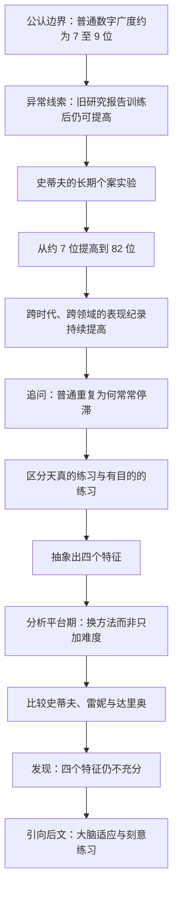
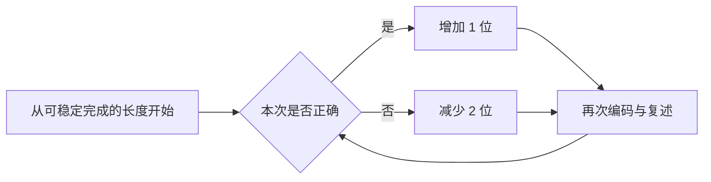
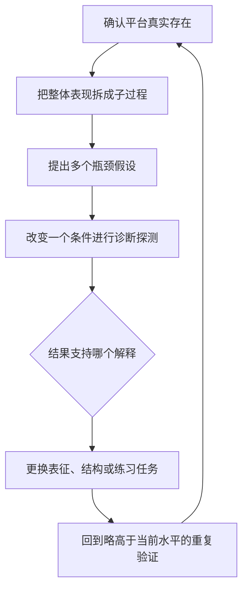

> **原书章节**：第 1 章“有目的的练习”<br>
> **英文核心概念**：Purposeful Practice<br>
> **原文来源**：《刻意练习：如何从新手到大师》<br>
> **本章任务**：从“重复为什么会停滞”出发，以数字记忆实验为主线，建立有目的练习的四个必要特征，并说明它为何优于天真的练习、为何仍然不等于刻意练习。<br>
> **阅读提醒**：本章主要定义的是“有目的的练习”，严格意义上的“刻意练习”要到后文才完整给出，二者不能提前混同。

---

## 一、本章要解决什么问题

### 1. 问题不是“练习有没有用”，而是“什么练习能持续改变能力”

人们通常相信熟能生巧，但日常经验中存在一个明显矛盾：

- 初学一项技能时，练习常带来快速进步；
- 达到“能用”的水平后，继续做很多年，能力却可能不再提高；
- 少数人又似乎能不断突破原先被认为固定的极限。

如果只用“练得多”解释，就无法同时说明这三种现象。本章因此依次追问：

1. 普通人的记忆广度能不能通过训练大幅提高？
2. 如果能，提高的是通用记忆容量，还是一种任务特定的技能？
3. 为什么日常重复会在熟练后停滞？
4. 比普通重复更有效的练习，至少要满足哪些条件？
5. 遇到平台期时，应当继续加量，还是改变方法？
6. 有目标、专注、有反馈并走出舒适区，是否已经足以保证持续进步？

### 2. 本章的中心结论

本章先建立一个正面结论：

> **有目的的练习比天真的重复更可能带来进步。它必须有定义明确的目标、全神贯注的执行、可用于纠错的反馈，并让练习者持续在当前舒适区之外尝试。**

随后又主动限制这个结论：

> **这四项特征能制造学习机会，却不能保证学习者一定找到有效的心理结构和训练路线；刻苦、专注和挑战极限仍可能在错误方法上停滞。**

史蒂夫、雷妮和达里奥三人的差异构成后一结论的关键证据：三人都认真训练，也都有进步，但是否获得稳定的检索结构、是否得到前人的方法指导，以及能否根据个人特点调整结构，显著影响了进步速度和最终水平。

### 3. 全章论证路线



### 4. 阅读本章时必须区分的证据层次

本章混合使用了多种证据，它们的证明力并不相同：

| 证据类型 | 本章例子 | 能说明什么 | 不能单独说明什么 |
| --- | --- | --- | --- |
| 密集个案实验 | 史蒂夫两百次数字训练 | 同一个体的任务表现可发生巨大且可追踪的变化 | 人人都能达到 82 位，或所有能力都可如此提高 |
| 小样本比较 | 史蒂夫、雷妮、达里奥 | 不同策略和指导方式与不同学习轨迹相伴 | 精确估计策略的平均因果效应 |
| 历史纪录 | 马拉松、跳水、钢琴、圆周率记忆 | 人类群体可达到的表现标准会随时代上升 | 进步全部由练习造成 |
| 研究综述式概述 | 医生年资与客观表现 | 从业年限不必然等于持续进步 | 所有资深医生都比年轻医生差 |
| 轶事 | 富兰克林下棋、迪蕾教小提琴 | 使机制直观，并提出可检验假说 | 证明普遍因果规律 |

作者的案例很有启发性，但严谨阅读不能把“展示可能性”直接改写成“保证普遍结果”。

---

## 二、开篇：一个看似已经抵达的自然极限

### 1. 第四次训练时，史蒂夫为什么想放弃

史蒂夫·法隆是卡内基梅隆大学的一名普通大学生。实验任务很简单：研究者以每秒约一个数字的速度读出随机数字串，他在听完后立即按原顺序复述。

训练四次、每次约一小时后，他能够稳定复述 7 位数字，常能复述 8 位，但 9 位已经非常困难，更没有把握处理 10 位。他由此形成了一个合理直觉：自己已接近记忆的自然上限。

这个判断并不只是气馁。按当时占主流的记忆理论，普通人的即时数字广度本来就在这个范围。也就是说，参与者的主观体验、日常经验和当时的科学共识指向同一结论。

### 2. 作者为什么从“失败感”写起

作者没有先给出抽象练习原则，而是先把读者放进史蒂夫的局部视角：

- 他已经认真练了几次；
- 结果稳定地卡在同一位置；
- 现有理论又告诉他这大概就是上限；
- 因而，“继续练”看起来缺少依据。

这正是所有平台期的认知难点：**当前方法暂时无法继续提高**，很容易被解释为**能力本身不能提高**。本章后续实验要检验的，就是这两个命题是否等价。

### 3. 初始研究问题的严格表达

作者真正要问的不是“史蒂夫能不能努力一点”，而是：

> 在呈现速率、材料类型和立即复述要求基本不变时，经过系统训练，个体可正确复述的随机数字串长度能否稳定超过其初始广度？如果能，他使用了什么心理过程？

这包含两个不同目标：

1. **现象目标**：测量表现能提高到多少；
2. **机制目标**：观察提高通过何种编码和提取方法发生。

只完成第一个目标，只能知道“变好了”；完成第二个目标，才可能把个案转化为可复用的训练知识。

---

## 三、史蒂夫的超强记忆力

### 1. 前置知识：短时记忆、工作记忆与长时记忆

#### 1.1 短时记忆要解决什么问题

人在写下刚听到的地址之前，必须暂时保存它；心算时，也要暂时保存中间结果。这类短暂保持功能由**短时记忆（short-term memory）**描述。

严格地说，短时记忆侧重信息的短暂存储；**工作记忆（working memory）**则包含在当前任务中保持并操作信息的过程。二者相关但不完全相同。原书在此主要使用“短时记忆”，因为实验测量的是听完后立即按序复述数字，而非复杂加工任务。

#### 1.2 “约 7 项”的含义与边界

本章采用当时经典的说法：普通人短时记忆大约能保持 7 项信息，因此 7 位左右的电话号码容易暂时保留，更长数字串则明显困难。

这里的“项”不是固定物理单位，而是学习者当作一个整体处理的**组块**。如果 `1-9-4-9` 被理解为一个熟悉年份，它可能只占一个有意义组块；对完全陌生者，它可能仍是四个独立数字。

现代研究通常认为，在严格控制复述、分组和长时知识帮助后，工作记忆焦点可能更接近约 4 个组块，而不是恒定的 $7\pm2$。数字广度受到呈现速度、发音时长、注意、语言、分组策略和测试程序影响。因此：

- “7”是历史上有影响力的经验概括，不是大脑中的硬件常数；
- 史蒂夫初始能记 7 至 9 位，与普通数字广度相符；
- 他后来记住 82 位，不意味着基础短时容量扩大到 82 个独立项目。

#### 1.3 长时记忆的作用

**长时记忆（long-term memory）**保存跨越较长时间的事实、经历、模式和技能。书中说长时记忆“没有发现上限”，更谨慎的理解是：研究尚未找到像即时记忆广度那样狭窄、稳定的实用容量边界，而不是已经证明它在物理意义上无限。

长时记忆的主要困难不只是“能存多少”，还包括：

- 编码是否足够有意义；
- 是否存在稳定提取线索；
- 需要时能否足够快地取回；
- 新旧信息是否相互干扰。

史蒂夫实验的关键，正是他能否在每秒一位的压力下，把随机数字迅速转化为可进入长时记忆并可按序取回的结构。

### 2. 1929 年旧研究为什么重要

艾利克森发现保琳·马丁与萨缪尔·费恩伯格发表于 1929 年的一项研究。两名大学生经过约四个月练习后，在每秒约一位数字的条件下，平均数字广度分别由 9 位提高到 13 位、由 11 位提高到 15 位。

这项结果与“即时数字广度不可显著训练”的常见解释不一致，因此构成一个**异常事实**。科学研究中的异常很重要，因为它迫使研究者在三种可能之间作区分：

1. 旧结果只是测量误差或偶然波动；
2. 基础短时记忆容量真的扩大了；
3. 参与者学会了借助其他心理系统绕过任务限制。

原研究没有详细记录参与者如何做到，因而无法判断后两种解释。艾利克森与比尔·蔡斯重新开展实验，重点便从“最终能记几位”推进到“每次改进时发生了什么”。

### 3. 有声思维协议：怎样研究看不见的心理过程

艾利克森此前研究过**有声思维协议（think-aloud protocol）**。它要求参与者在完成任务时，尽量即时说出当前注意到、想到或正在尝试的内容，研究者再把言语记录与行为表现对应起来。

它要解决的问题是：编码、比较、分组等心理操作不能像肢体动作那样被直接观察，只看正确率无法知道策略如何变化。

正确使用时，有声思维强调“报告正在想什么”，而不是事后编造一套听起来合理的原因。它的价值包括：

- 捕捉策略从无到有的形成过程；
- 定位哪类材料导致错误；
- 把某次突破与具体方法变化对应起来；
- 为后续参与者设计可传授的方法。

它也有局限：无法言语化的快速过程可能不被报告；说话本身可能改变任务；参与者可能遗漏或误述心理活动。因此，有声报告应与正确率、反应模式、实验操纵等证据交叉验证，不能被当成对大脑过程的透明录像。

### 4. 为什么选择史蒂夫

史蒂夫在学业测验和初始数字广度上都很普通，没有显示出特殊记忆天赋。这使他适合检验“普通起点能否通过训练显著改变表现”。

他还有一个后来非常重要的背景：长期参加跑步训练。跑步经历为他提供了两类资源：

1. 他熟悉大量比赛时间，如几分几秒的成绩，能把若干数字编码成有意义的“跑步时间”；
2. 他已经体验过长期训练、逐步加量和与自己比较，较能承受重复而高强度的练习。

这也提醒我们：所谓“普通参与者”只表示其初始数字记忆普通，不表示他在动机、训练经验和可利用知识上代表所有人。

### 5. 自适应难度：实验怎样让任务贴近能力边界

每轮从较短数字串开始。史蒂夫答对后，下一串增加一位；答错后，长度减少两位，再继续尝试。可近似写为：

$$
L_{n+1}=
\begin{cases}
L_n+1, & \text{第 }n\text{ 次正确},\\
L_n-2, & \text{第 }n\text{ 次错误}.
\end{cases}
$$

其中 $L_n$ 是第 $n$ 次数字串长度。真实实验还会在每次训练开始时从容易长度进入，公式只是表达调节规则。

这种设计类似**自适应阶梯程序**：

- 连续成功会把难度推高，避免长期停在已会水平；
- 失败后降低难度，让参与者恢复成功并继续尝试；
- 大量试次集中在“有时成功、有时失败”的边界附近；
- 每次长度变化很小，参与者能判断新困难来自哪里。

这不是让史蒂夫每次都承受最大难度，而是维持可诊断的挑战。如果直接从 9 位跳到 50 位，失败不会告诉他下一步怎样改进。



### 6. 第五次训练的突破说明什么

前四次训练中，史蒂夫从未正确复述 10 位，因此也没有进入 11 位任务。第五次训练时，他在难度上下波动后先后正确完成 9 位、10 位，并在第二次面对 11 位时完整复述。

这两位的增加看似不大，却有重要诊断意义：

1. 原先 8 至 9 位的平台并非不可移动的硬边界；
2. 短期内没有理由认为他的脑结构发生了巨大通用扩容；
3. 因而，更合理的研究方向是寻找他新采用的编码或分组方法；
4. 一次突破还可能是波动，必须看后续能否稳定并继续提高。

本章没有把单次 11 位当作最终证明，而是继续进行了两年左右的密集训练。

### 7. 持续练习，突破极限：从 7 位到 82 位的进步轨迹

史蒂夫的主要节点如下：

| 训练阶段 | 可达到的数字长度 | 该节点的意义 |
| --- | ---: | --- |
| 初始 | 通常 7 位，偶尔 8 位 | 普通数字广度 |
| 前四次 | 平均约 9 位 | 熟悉任务，但主观认为已到上限 |
| 第五次 | 首次正确完成 10 位和 11 位 | 局部平台被突破 |
| 第 16 次 | 稳定约 20 位 | 已明显超出未训练者 |
| 一百多次 | 约 40 位 | 超过当时许多记忆术研究参与者 |
| 两百次、约两年 | 82 位 | 形成高度专门化的数字记忆技能 |

这个轨迹不是匀速直线。后文会显示，他反复经历“增长—平台—改变策略—再次增长”。因此，最终的 82 位不能用“每练一次固定增加若干位”解释。

### 8. 这项个案能够推出什么

最直接的结论是：

> 至少对史蒂夫而言，即时复述随机数字串的表现并不受初始 7 至 9 位数字广度的固定限制；经过长期、自适应且带反馈的训练，他能形成一种把大量数字快速编码和有序提取的专门技能。

进一步结合策略记录，可以提出机制解释：

$$
\text{随机数字}
\rightarrow\text{熟悉意义组块}
\rightarrow\text{固定位置结构}
\rightarrow\text{长时记忆编码}
\rightarrow\text{按序提取}.
$$

这比“短时记忆容量从 7 扩成 82”更符合证据，因为他的优势依赖数字材料、跑步时间知识和训练出的结构，并不会自动迁移到任意信息。

### 9. 这项个案不能推出什么

实验仍有明显边界：

- 核心参与者最初只有一人，个体代表性有限；
- 没有同期随机对照组，无法精确分离训练设计、测验熟悉和个人动机的贡献；
- 研究者与参与者长期互动，指导和期望可能影响结果；
- 任务高度封闭，答案明确、反馈即时，和开放性工作差异很大；
- 结果证明的是特定数字技能，不是通用智力或通用记忆同步提高；
- 两年两百次训练成本很高，不能只报告终点而忽略投入和退出风险。

它最有力地证明“显著提高是可能的”，并为机制研究提供材料；普适性需要后续参与者和其他领域证据支持。

---

## 四、各领域的杰出人物都靠大量练习

### 1. 作者为什么突然从一个人转向百年纪录

史蒂夫的实验可能被解释为记数字这一特殊任务的奇例。作者于是扩大观察尺度：如果训练能构造新能力，那么成熟领域的最高表现也应随训练知识积累而提高。

这里使用的是一种**跨时代比较**：把过去的世界级表现放到后来标准中，看原先被视为极限的动作或成绩是否已经常态化。

### 2. 本章列举的跨时代变化

| 领域 | 书中材料 | 作者要说明的变化 |
| --- | --- | --- |
| 马拉松 | 约翰尼·海耶斯 1908 年以 2 小时 55 分 18 秒夺冠并创纪录；书中写作时世界纪录已到 2 小时 2 分 57 秒 | 过去的世界纪录后来只接近大众顶级赛事资格线 |
| 跳水 | 1908 年空翻两周曾被视为危险；后来儿童比赛也会出现，高水平选手可完成四周半及复合转体 | 技术、训练进阶和安全控制改变了动作边界 |
| 钢琴 | 20 世纪 30 年代柯尔托的肖邦演奏曾被奉为权威，后来的教师却能指出大量技术问题 | 专业训练标准会代际提升 |
| 圆周率记忆 | 1973 年纪录为 511 位，后来出现 1 万位、7 万位，另有 10 万位的个人声称 | 记忆方法与训练使纪录成数量级增长 |
| 其他杰出表现 | 费德勒的网球、麦凯拉·马罗尼在 2012 年奥运会的跳马、特级大师同时进行数十盘盲棋，以及能演奏多种乐器的年轻音乐家 | 过去看来不可思议的表现持续在不同领域出现 |
| 体操、网球、盲棋和器乐 | 后来者完成过去难以想象的动作、同时对弈或幼年演奏 | 超常表现并非只存在于单一任务 |

这些数字属于原书写作时的历史截面。例如书中提到的马拉松世界纪录与波士顿资格线并不是 2026 年的实时数据。阅读时应保留论证结构，而不要把旧版纪录当成当前资料。

### 3. 从纪录提高到“练习重要”的完整论证

作者的推理可以重建为：

1. 多个互不相同的领域在几十年至百年间出现巨大表现提升；
2. 如此短的时间不足以让人类群体在每个领域都发生定向、巨大的遗传改变；
3. 同期发生了训练时长增加、训练方法细化、教练知识积累和人才竞争扩大；
4. 后一代可以直接学习前代总结的方法，不必从零试错；
5. 因而，训练体系的累积是跨代提升的重要原因，人类当下表现不能被当作固定潜能边界。

其中第 2 步只是在排除“突然出现新基因”这一单因解释，第 3 至第 5 步则提出更合理机制。

### 4. 论证依赖的假设与替代解释

历史纪录不是控制实验。除了练习，还有多种因素同时改变：

- 体育器材、场地、鞋服和计时技术；
- 营养、医疗、恢复与伤病管理；
- 规则、评分和参赛群体规模；
- 全球选材与职业化程度；
- 录音、录像、计算机等学习工具；
- 某些项目中的药物违规和检测差异。

因此，纪录提升不能证明“所有进步只来自大量练习”。更稳妥的结论是：训练方法和训练量与这些条件共同塑造可达到的表现，而且练习是能被个人和教练直接设计的重要变量。

### 5. 他们练习，大量地练习：为什么仍不是完整答案

作者进一步列举了三项吉尼斯纪录：芭芭拉·布莱克伯恩每分钟打字 212 个单词；马可·巴罗什在 24 小时内骑行 905 千米；维卡斯·沙马在一分钟内计算 12 个长达 20 至 41 位数字的高次方根。这些任务非常不同，却都显示出经过专门训练后，速度、耐力或心算组织能力可以远超未经训练者的直觉预期。

这些纪录只展示结果，没有在本章中逐一还原训练史，因此不能单凭纪录证明每个人采用了同一种方法。它们的作用是扩大待解释现象：极端表现广泛存在，理论需要解释这些能力怎样被逐步构造，而不能只把它们归为神秘天赋。

但如果结论只停在“大量”，又会回到按时数解释的陷阱。作者明确增加第二项变量：**训练方法日益高级**。可以写为：

$$
\text{代际表现提升}
\neq\text{单纯增加训练时数},
$$

更接近：

$$
\text{表现}=F(\text{训练量},\text{训练设计},\text{反馈},
\text{工具},\text{选材},\text{恢复},\text{环境}).
$$

训练量提供适应发生的次数，训练设计决定这些次数是在重复已有能力，还是暴露并修复弱点。

### 6. 鲍勃·费舍尔的自由投篮例子

篮球自由投篮纪录保持者鲍勃·J. 费舍尔曾告诉作者，他把练习研究中的原则用于训练，创造了多项限时投篮纪录，包括书中列举的 30 秒 33 次、10 分钟 448 次和一小时 2371 次。

这个案例的作用不是证明某套原则的平均效应，而是展示“研究原则—训练设计—极端专门表现”的可行联系。它仍是自我报告，可能受选择性叙述影响；纪录任务也把速度和命中整合成特殊目标，不等同于比赛中的综合投篮能力。

### 7. 为什么不同领域可能共享练习原则

钢琴、芭蕾、象棋、体操和外科表面差异很大，但训练都要解决相同的抽象问题：

1. 识别当前表现与目标表现的差距；
2. 把复杂能力拆成可训练成分；
3. 施加略高于当前能力的要求；
4. 根据结果让大脑或身体产生适应；
5. 逐渐把新成分整合成稳定的整体表现。

共享的是**改变能力的控制逻辑**，不是具体动作。钢琴家和滑冰运动员不会练同一内容，但都需要适配当前水平的任务、反馈和递进。

### 8. 从反复试错到可解释的训练科学

历史上的优秀教练往往通过反复试验发现有效方法，却未必知道为什么有效。一个领域内部形成的经验也可能与其他领域隔绝。

作者研究杰出人物的目的，是从成熟训练传统中抽取跨领域原则：

- 哪些任务会触发改变；
- 怎样控制难度；
- 怎样观察并纠正错误；
- 怎样把高手能力转化为训练步骤。

如果能解释机制，就有机会少走无效试错，并把原则谨慎迁移到医生、飞行员、工程师、学生和企业员工的培养中。

### 9. 最有效的练习形式：本章对“刻意练习”的第一次定位

作者把最有效的练习形式称为**刻意练习（deliberate practice）**，并称其为设计训练的黄金标准。但本章此处只是提出研究目标，没有给出完整操作定义。

本章接下来先讨论更基础的**有目的的练习**，原因是：

1. 它比日常重复更接近有效训练；
2. 四个特征容易从史蒂夫实验中观察；
3. 先理解必要条件，才能理解后文刻意练习增加了哪些条件；
4. 在没有成熟教练体系的领域，有目的的练习本身仍有实践价值。

所以不能因为某项练习有目标、很辛苦，就提前把它称为严格意义上的刻意练习。

---

## 五、从有目的的练习讲起

### 1. 学习新技能的一般方法

作者以网球为例概括普通学习路径：

1. **获得基础指导**：从教练、朋友、书籍或示范中知道规则和基本动作；
2. **低水平尝试**：练握拍、发球、对墙击球等基础动作；
3. **反复与纠错**：再次请教，并减少明显错误；
4. **参与完整活动**：与别人对打，逐渐在真实任务中整合动作；
5. **达到可接受水平**：能安全、稳定地参加活动；
6. **动作自动化**：不再逐步思考，开始把注意力转向比赛和乐趣。

这套方法没有错。对开车通勤、做家常食物或弹一首自娱曲目，目标本来就可能只是安全、够用和愉快。

### 2. 自动化要解决什么问题

**自动化（automaticity）**是经过练习后，某项操作能够以较少有意识控制、更快且较稳定地完成的状态。

它非常必要：

- 降低工作记忆负担；
- 让多个子动作流畅衔接；
- 释放注意力处理环境变化；
- 降低日常任务的心理成本。

没有自动化，驾驶者若始终逐字回忆每条操作规则，就无法同时观察道路。

### 3. 自动化为什么又会成为进步的障碍

自动化优化的是“以较低成本稳定完成现有程序”，不是“主动发现并重写程序”。当表现已经被环境接受后：

- 错误不再造成明显后果；
- 注意从动作细节撤走；
- 人更倾向重复熟悉方案；
- 少见弱点无法获得足够专项试次；
- 成功完成任务会掩盖动作质量没有提高。

因此，表现曲线常呈现：

$$
P(t)=P_0+\Delta P_{\text{初学}}(t),
\qquad
\lim_{t\to\text{熟练后}}\frac{dP}{dt}\approx0.
$$

这不是说能力绝对不能再提高，而是原有活动方式不再产生足够学习信号。

### 4. 网球弱点为什么不会在周末比赛中自动消失

书中的业余球员总接不好一种带旋转、直奔胸前的反手球。虽然本人和对手都知道弱点，但完整比赛有三个问题：

1. 这种球出现频率低，专项试次不足；
2. 出现时位置、速度和压力都变化，错误难以归因；
3. 球员的直接目标是赢下当前回合，不是暂停并重建反手动作。

因此，他会以几乎相同方式反复失误。**在真实任务中暴露弱点**不等于**获得修正弱点所需的训练条件**。有效训练需要把这种球从完整比赛中抽出来，控制来球并密集重复，再用反馈调整动作。

### 5. 经验年限为何不等于能力年限

人们容易认为，开车 20 年一定优于开车 5 年，行医或教学 20 年也一定优于 5 年。本章反驳的是这个自动推论：

$$
\text{从业时间增加}\centernot\Rightarrow\text{表现持续提高}.
$$

达到可接受水平后，日常工作主要调用已自动化程序，未必持续挑战能力。若知识标准更新、错误缺少反馈或基础能力随年龄退化，部分客观指标甚至可能下降。

原书提到资深医生、教师或司机未必优于经验较短者。严格理解时要注意：

- 这是群体平均趋势，不是对每位资深者的判断；
- 年龄、知识更新、工作选择和测量指标可能共同影响结果；
- 新手也可能因经验不足而在其他指标上更差；
- 结论是“年资本身不足以保证进步”，不是“经验没有价值”。

### 6. 有目的的练习 VS 天真的练习：先定义天真的练习

**天真的练习（naive practice）**是反复执行完整活动，并期待重复本身自然提高表现。

它的典型结构是：

$$
\text{做同一件事}\rightarrow\text{再做一次}\rightarrow
\text{累计次数或时间},
$$

但缺少明确的改进对象、过程监测和基于反馈的策略调整。

原书用一位音乐学生说明：学生每天演奏一小时，也把曲子从头到尾重复许多遍，却不知道自己正确完成过几次，更不知道错误集中在哪里。时间投入是真实的，训练信息却几乎没有被利用。

天真的练习并非毫无价值。它可以带来初期熟悉、维持已有技能、提供娱乐或增强信心。问题只在于，当目标是突破当前水平时，它通常不够。

### 7. 有目的的练习：直觉与严格定义

**有目的的练习（purposeful practice）**是练习者主动围绕特定改进目标设计和执行活动，保持高度注意，获得能够判断差距的反馈，并持续尝试略高于当前稳定能力的任务。

直觉上，它把问题从

> “我今天做了多久？”

改成

> “我今天试图改变哪项表现，结果表明改变是否发生，下一次要调整什么？”

本章的四项特征可以表示为：

$$
PP=G\land A\land F\land C,
$$

其中：

- $G$：specific goal，定义明确的具体目标；
- $A$：attention，专注执行；
- $F$：feedback，可解释的反馈；
- $C$：challenge，超出舒适区的挑战。

这里的合取符号 $\land$ 表示四项相互依赖。只有目标没有反馈，无法判断是否达成；只有挑战没有专注，难以调整；只有反馈而任务太容易，也不会产生新适应。

---

## 六、有目的的练习的四个特点

## 6.1 有目的的练习具有定义明确的特定目标

### 1. 这个概念要解决什么问题

“我要变得更好”“我要降低高尔夫差点”能够提供方向，却不能直接指导下一次练习。练习者不知道该选什么任务、怎样判断成功，也无法把失败定位到具体过程。

因此，需要把远期愿望变成当前可操作的表现差距。

### 2. 直觉含义

一个合格的练习目标应让第三方看完后知道：

- 练什么行为；
- 在什么条件下做；
- 做到什么程度算成功；
- 一轮结束后依据什么数据判断。

原书给音乐学生的改写目标是：以适当速度、无错误地连续完整演奏三次。它比“把曲子弹熟”明确，因为正确性、速度、连续次数都可观察。

### 3. 严格定义

设目标表现为 $P^*$，当前表现为 $P$，练习要缩小的差距为：

$$
e=P^*-P.
$$

在多维技能中，$P$ 不是单个总分，而可能包含准确率、速度、稳定性、动作质量等向量：

$$
\mathbf e=\mathbf P^*-\mathbf P.
$$

有目的练习应在一轮中选取其中少数可控分量，避免同时改变太多因素而无法归因。

### 4. 从长期目标逐层分解

书中的高尔夫例子可以分为：

```text
长期结果：把差点降低到 5 杆
    ↓
中间表现：提高开球进入平坦球道的比例
    ↓
错误类型：减少持续向左弯的勾球
    ↓
可控动作：在教练指导下调整挥杆路径或杆面角度
    ↓
练习任务：固定条件下完成若干次开球并测量落点
```

高尔夫**差点**是用于估计球员相对标准水平的差距、并让不同水平球员可比较比赛的数值体系。原书例子用“降到 5 杆”表达长期竞技结果；真正可直接训练的是导致差点变化的具体击球表现，而不是差点这个汇总数字本身。

分解有效，是因为最上层结果常受很多变量影响，而底层动作能在较短周期内重复、反馈和修改。

### 5. 史蒂夫的目标为什么有效

史蒂夫不知道两年后能达到多少位，因此没有虚构一个“82 位”的长期目标。他每轮只追求比此前多一位。这个目标：

- 紧邻当前能力；
- 成败清晰；
- 能通过阶梯程序反复测试；
- 随能力提高自动移动。

“积小胜为大胜”不是把大目标机械切成小清单，而是让每个小目标都代表一个可验证的能力变化。

### 6. 成立条件与边界

具体目标并非越窄越好。它必须仍然代表真实能力，否则会出现指标替代目标的问题：

- 只追求打字速度可能牺牲准确率；
- 只追求题量可能鼓励跳过复盘；
- 只追求短期测试分数可能损害迁移；
- 只优化容易测量的部分可能忽略难测但重要的判断。

因此，应同时设置**训练指标**和**守门指标**。例如提高演奏速度时，正确音高、节奏稳定和身体无疼痛必须保持在阈值内。

---

## 6.2 有目的的练习是专注的

### 1. 这个概念要解决什么问题

人在重复熟悉任务时很容易分心，动作仍能完成，却无法觉察微小偏差。没有注意，反馈即使出现也不会被编码，学习者只能重复旧程序。

### 2. 直觉含义

专注不是“坐在任务前很久”，也不是情绪上很用力，而是把有限认知资源持续放在当前目标、关键线索和结果差距上。

### 3. 严格定义

在本章语境中，**专注**至少包括：

1. 维持目标：清楚本轮正在改什么；
2. 选择线索：注意与该目标有关的信息；
3. 抑制干扰：不让无关刺激和自动反应主导；
4. 监测过程：在执行时觉察偏差；
5. 保持可调整性：根据新信息改变动作。

它是一种任务相关的注意控制，而不是抽象意志品质。

### 4. 第 115 次训练的例子

训练中期，史蒂夫已接近 40 位。他会在研究者读数字时高度安静地编码，在回忆时用自言自语、拍桌或欢呼维持唤醒和追踪各组位置。他先正确复述 39 位，随后完成 40 位。

这些外在动作不是专注的必要形式。真正重要的是，他始终监测数字组、顺序和检索状态，并把全部注意资源放在突破当前长度上。有人安静完成同样过程，也可以同样专注。

### 5. 为什么专注有助于进步

完整链条是：

$$
\text{目标导向注意}
\rightarrow\text{更精确地感知过程与偏差}
\rightarrow\text{形成更清晰反馈}
\rightarrow\text{有针对性地调整}
\rightarrow\text{更新技能结构}.
$$

若任务执行正确但练习者不知道自己做对了什么，成功难以稳定复制；若失败时没有注意错误发生的节点，也无法修正。

### 6. 成立条件与边界

- 专注是必要条件，不是充分条件；高度专注地采用错误策略仍会停滞。
- 长时间并不等于高质量，注意会随疲劳下降；短而清醒的训练可能优于长时间硬撑。
- 已自动化的基础动作不必始终被逐项监控，否则可能干扰流畅表现；注意应投向当前正在改进的成分。
- 高风险任务不能要求新手一边处理全部现实压力、一边深度反思，可先在模拟环境训练。

---

## 6.3 有目的的练习包含反馈

### 1. 这个概念要解决什么问题

练习者的主观感觉并不可靠。动作可能“感觉很好”却偏离标准，也可能因为任务变难而感觉退步，实际上能力正在提高。没有反馈，就无法区分真实改进、随机波动和自我安慰。

### 2. 直觉含义

反馈回答两个问题：

1. 当前结果与目标差在哪里？
2. 下一次应改变什么？

只给分数通常只回答第一个问题的一小部分。

### 3. 严格定义

**反馈（feedback）**是把行为或结果的信息返回给行动者，使其能够估计目标误差并调整下一次控制的过程。

可以区分：

| 类型 | 回答的问题 | 例子 |
| --- | --- | --- |
| 结果反馈 | 最后成功了吗 | 数字串复述正确或错误、球是否入界 |
| 过程反馈 | 哪一步怎样执行 | 挥杆轨迹、音准变化、编码漏在哪一组 |
| 外部反馈 | 他人或设备观察到什么 | 教练意见、录像、测试结果 |
| 内部反馈 | 自己感知到什么 | 动作感觉、错误位置、提取卡顿 |
| 即时反馈 | 刚完成后发生了什么 | 每次数字复述后立即核对 |
| 延迟反馈 | 较长周期后总体如何 | 考试成绩、季度业务结果 |

不同技能需要组合使用。即时结果反馈便于快速修正，但复杂任务还需要延迟结果检验长期效果。

### 4. 音乐学生与史蒂夫的对比

音乐学生只在测试时得到 C，练习中却不知道二十次演奏究竟哪几次正确、哪些小节反复出错。这个反馈太迟、太粗，无法指导下一次演奏。

史蒂夫每次立即知道整体对错，并且主动追踪：

- 漏掉哪组数字；
- 哪组编码特别困难；
- 顺序是在编码还是提取时混淆；
- 下一轮要改变分组还是加强复述。

外部二元反馈与内部过程反馈结合，使他不仅知道“错了”，还逐渐知道“为什么错”。

### 5. 高质量反馈的条件

反馈至少应满足：

- **有效**：评价的确是目标能力，而非无关变量；
- **可靠**：相同表现不会被随意评成相反结果；
- **具体**：能定位差距，而非只说“继续努力”；
- **及时**：在练习者仍记得过程时返回；
- **可行动**：指向下一次可控改变；
- **不过载**：一次优先处理少数关键问题。

### 6. 适用边界

开放领域的反馈可能延迟、嘈杂甚至相互冲突。例如一次销售成交不能证明话术正确，可能只是产品价格占优；一次投资盈利也可能来自运气。

此时可采用：

- 把最终结果拆成更早出现的过程指标；
- 比较多次而非单次结果；
- 记录行动前预测，防止事后合理化；
- 使用多名评审、模拟和对照案例；
- 区分决策质量与结果运气。

反馈的存在不等于反馈正确，错误反馈会系统性教坏学习者。

---

## 6.4 有目的的练习需要走出舒适区

### 1. 这个概念要解决什么问题

如果练习只要求调用已经稳定的程序，大脑和身体没有理由建立新能力。要进步，任务必须制造当前方法无法完全处理的差距。

### 2. 直觉含义

**舒适区**不是“心情愉快的地方”，而是当前技能可以稳定、低错误、低注意成本完成的任务范围。走出舒适区，是尝试略高于这个范围的任务，并让失败暴露下一项需要改进的能力。

### 3. 严格定义：挑战必须可诊断

设当前稳定能力边界为 $C_t$，任务难度为 $D_t$。有效挑战通常满足：

$$
D_t>C_t,
$$

但差距 $D_t-C_t$ 不能大到让失败失去诊断价值。可以区分：

| 区域 | 任务表现 | 学习价值 |
| --- | --- | --- |
| 舒适区 | 几乎总能自动完成 | 适合维持与热身，新学习信号少 |
| 伸展区 | 会失败，但能理解并逐步修正 | 最适合有目的练习 |
| 失控区 | 大量失败，不知从何改起或存在危险 | 需拆小任务、降低速度或增加支持 |

因此，“越难越好”不成立。真正要求是**略超当前水平且可通过反馈调整**。

### 4. 史蒂夫实验怎样动态维持伸展区

答对加一位、答错减两位的阶梯规则，使大多数试次在其能力边缘发生。能力提高后，任务自动变长；连续失败时，难度又退回可恢复区间。

这种设计同时避免两种错误：

- 长期重复 7 位，只有熟练没有扩展；
- 一开始挑战 82 位，只会产生无信息失败。

### 5. 钢琴爱好者和资深医生的例子

业余钢琴者若三十年只按相同方式演奏同一批曲子，累计时间很大，却没有新动作要求。医生若日常工作长期依赖已自动化流程，又缺少对困难案例的模拟、反馈和更新，也可能只维持甚至丢失部分能力。

这些例子的共同结构是：

$$
\text{重复熟悉任务}+\text{缺少诊断性反馈}
\rightarrow\text{自动化被维持，而非重构}.
$$

原书还提到，作者在 2015 年参加医学教育共识会议时，主张发展能给医生设置困难任务、帮助其维持和提高技能的新型继续教育。其逻辑不是否定临床经验，而是把继续教育从被动听课或累计学分，转向可测表现、受监督挑战和针对性反馈；具体方案在本书第 5 章再展开。

### 6. 富兰克林下棋说明什么

本杰明·富兰克林聪明、热爱国际象棋、持续下棋几十年，也曾和优秀棋手对弈，但棋艺只到中上水平。作者据此认为，他主要是在完整对局中重复原有方式，没有进行针对弱点的高强度专项训练。

这个故事用来反驳“聪明 + 热爱 + 数千小时实战 = 顶尖水平”。不过，历史材料无法完整重建富兰克林的训练，因此它是机制插图，不是控制证据。更谨慎的表述是：大量对局本身不足以保证达到顶尖水平，尤其当缺少系统复盘和弱点训练时。

### 7. 走出舒适区的边界

- 目标是提高而非维持时，才需要持续制造新挑战；娱乐活动可以留在舒适区。
- 身体训练必须考虑动作安全、负荷、恢复和伤病，疼痛不是有效挑战的证明。
- 心理挑战也需要睡眠和间隔，持续耗竭会降低学习质量。
- 医疗、飞行等高风险技能应在模拟器或受监督环境中越界，不能拿真实对象试错。
- 若练习者不知道正确方向，单纯加难可能强化补偿动作，此时更需要教练。

### 8. 四项特征怎样组成闭环


任何一环断开，练习都可能退化：目标模糊会失去方向，任务太易不会暴露差距，分心会看不到过程，没有反馈则无法校正，不根据反馈调整则只是重复。

---

## 七、遇到瓶颈怎么办

### 1. 什么是平台期

**平台期或瓶颈（plateau/bottleneck）**是持续练习一段时间后，所测表现暂时不再提高的状态。

观察到平台只说明：

$$
\frac{\Delta P}{\Delta t}\approx0
$$

在当前时间窗口和方法下成立。它并不自动告诉我们原因。可能原因包括：

- 当前编码或动作方法达到容量边界；
- 某个子技能成为整体瓶颈；
- 反馈过粗，学习者找不到错误；
- 测量指标出现天花板；
- 注意、睡眠或恢复不足；
- 动机下降，实际练习质量降低；
- 确实接近某种生理或环境约束。

因此，平台首先是一个诊断问题，而不是一句“再坚持”。

## 7.1 试着做不同的事情，而非更难的事情

### 1. 为什么只加难度往往无效

如果旧方法只能稳定处理容量 $K$，把任务从 $K+1$ 提到 $K+10$ 不会自动创造新方法，只会让同一瓶颈更明显。突破需要改变表征、分解、速度、顺序或反馈方式。

作者的核心建议是：

> 平台期优先检验“方法是否需要改变”，而不是把同一种失败做得更用力。

### 2. 史蒂夫在 22 位附近的结构瓶颈

史蒂夫一度采用四个数字为一组，并把最后六位放在一个通过声音反复维持的组中。到 22 位时，可理解为：

$$
4\times4+6=22.
$$

继续增加四位组后，他容易混淆组的顺序。问题并不是每个小组编码不了，而是原结构无法稳定容纳和定位更多小组。

他随后混合使用三位组和四位组，并建立更有层次的位置安排，最终可组织为：

$$
4\times4+4\times3+6=34.
$$

这里的关键改变不是“记得更拼命”，而是重新设计组块和组间位置。新结构提高了可管理单元数量，直到下一个瓶颈出现。

### 3. 为什么导师在平台期特别重要

学习者只能用自己已知的方法搜索解法，很容易把“想不到其他方法”误认为“没有其他方法”。熟悉发展路径的导师可能已经见过同类瓶颈，能够：

- 判断问题属于哪个子技能；
- 提供一个新表征或练习；
- 降低无效试错成本；
- 防止学习者用有害补偿动作完成任务。

这为后文刻意练习对导师和成熟训练体系的强调埋下伏笔。

### 4. 多萝茜·迪蕾的小提琴速度训练

一名学生认为自己无法把某首曲子演奏得像伊扎克·帕尔曼一样快。导师多萝茜·迪蕾先测量帕尔曼录音的实际速度，再把节拍器设在学生能准确完成的较慢速度，随后每轮只小幅加快。

最终，学生在保持准确的前提下，实际速度超过了目标录音。

这个方法为什么有效：

1. **把模糊比较变成测量**：不再依赖“我感觉不够快”；
2. **从可成功水平开始**：避免错误动作在高速下固化；
3. **小步递增**：每轮只引入可适应的速度差；
4. **保持质量约束**：速度提高不能以失准为代价；
5. **用连续成功修正预期**：原先的心理边界失去证据基础。

它类似逐步塑造或渐进负荷。但这是教学轶事；其他学生可能受动作技术或伤病限制，不能从中推出所有速度障碍都只是心理问题。

### 5. 放慢数字呈现：用实验操纵定位瓶颈

史蒂夫卡住时，研究者一度放慢读数字的速度。他立即能记住明显更多数字。

推理如下：

1. 若瓶颈是可存储的数字总量，轻微放慢呈现不应带来巨大改善；
2. 放慢后改善，说明多出的时间让编码更充分；
3. 因而当前限制更可能是单位时间内生成组块并放入结构的速度；
4. 下一阶段应训练更快编码，而不是接受“总容量已满”。

这是一种**诊断性操纵**：有意改变一个变量，看表现怎样变化，以区分竞争解释。

### 6. 突然增加十位：打破错误的整体解释

另一次，研究者给出的数字串比史蒂夫当时稳定长度多约十位。他虽然没有全部复述，却记住的总位数超过此前纪录。

这表明问题可能不是“超过某总长度后全部无法记忆”，而是长串中偶尔漏掉一两个组。于是训练目标可以从“扩大不可见容量”改为“提高每组编码可靠性和位置追踪”。

这一超难任务的用途是**探测瓶颈**，不是日常一直在失控区训练。它之所以有信息，是研究者分析了部分成功模式，而不只记录整体失败。

### 7. 平台期诊断流程



可用的探测包括：降低速度、缩小任务、放大某个子步骤、换材料、给额外线索、临时提高难度、录像回看、与高手过程比较。目的都是让错误来源可见。

## 7.2 并非达到极限，而是动机不足

### 1. 作者的主张应怎样准确理解

作者说，多年研究中没有找到清晰证据表明某领域存在完全不可逾越、表现永远不再变化的实践平台；更常见的是，人们不知道怎样继续，或不愿再付出高强度努力而停止。

这句话的合理内核是：

> **局部平台通常不能证明终极极限；在宣布能力不可能提高前，应先排查方法、反馈、资源和动机。**

不能把它改写为“人没有任何上限”。时间、年龄、身体结构、伤病、感官分辨率和物理规律都会限制表现。没有观察到固定平台，也不等于逻辑上证明极限不存在。

### 2. 为什么动机会成为隐藏变量

有目的练习要求专注、频繁失败和不断改方法，通常不如熟练表演愉快。即使新方法理论上存在，学习者也可能因为成本超过预期收益而停止。

因此，观察到某人“不再进步”时，有两种不同情况：

- **能力约束**：在现有条件下无法做得更好；
- **投入选择**：可以继续探索，但不愿或无法承担时间、注意、金钱与情绪成本。

外部观察若不测量实际练习质量，很容易混淆二者。

### 3. 史蒂夫为什么能坚持

本章列出几个相互作用的因素：

#### 3.1 报酬

他参加实验有报酬，这有助于保持出勤。但只要到场就能拿到报酬，无法单独解释他为何每次都逼近极限。

#### 3.2 可见进步带来的内部反馈

长度数字让进步清楚可见。每次突破都会增强“方法还能奏效”的预期，进而提高继续投入的意愿。

#### 3.3 社会认可

能力提高后，媒体报道和公开亮相提供了外部正反馈；史蒂夫还登上包括《今日秀》在内的电视节目。这些认可增加了身份认同和继续训练的理由。

#### 3.4 对挑战本身的偏好

史蒂夫长期跑步，熟悉与自己成绩竞争，也相信规律训练可以逐月改变表现。三次一小时的记忆训练相较其耐力训练并非不可承受。

### 4. 正反馈怎样支持坚持

反馈在本章有双重作用：

- **信息作用**：告诉学习者哪里需要修正；
- **动机作用**：让改进可见，证明投入并非徒劳。

可以形成良性循环：

$$
\text{小幅进步}\rightarrow\text{效能感与期待提高}
\rightarrow\text{继续高质量投入}\rightarrow\text{更多进步}.
$$

反过来，若目标过远、进步不可见，即使能力实际缓慢增长，学习者也可能因缺少反馈而退出。

### 5. 选择偏差与适用边界

作者后来偏向招募运动员、舞者、音乐家和歌手等有长期训练经历者，并发现他们没有中途退出。这说明训练经验可能帮助坚持，也意味着样本已按坚持能力筛选，不能据此认为普通人同样不会退出。

社会认可也不是稳定策略：它可能让人追逐外部成绩、掩盖疲劳或害怕失败。更可持续的设计是让练习目标有个人意义、进步可见、成本可管理，并安排恢复与社会支持。

### 6. 本节对有目的练习的总结

作者把实践要点总结为：

1. 离开舒适区，但不盲目进入失控区；
2. 用专注方式执行；
3. 设定明确目标并制订计划；
4. 建立监测进步的方法；
5. 主动维护长期动机；
6. 平台出现时更换方法，而不只是增加蛮力。

这已经比普通重复强得多，但下一节会说明，它依然只是起点。

---

## 八、有目的的练习还不够

### 1. 为什么必须换参与者重复研究

史蒂夫可能恰好拥有特殊天赋，或者偶然发现了一套只有他能用的方法。要支持“训练导致提高”，最直接的下一步是让其他初始普通者接受相似任务，看能否重现显著增长。

这里的研究逻辑是**重复与机制比较**：

- 若其他人完全无法提高，史蒂夫可能是异常个体；
- 若都能提高但轨迹不同，就要解释策略差异；
- 若教授方法能加速提高，则说明方法包含可传递成分；
- 若照搬后仍出现新平台，则说明方法还需个体适配。

### 2. 雷妮：有目的练习能提高，但未保证持续突破

研究生雷妮·艾里奥知道前一位参与者取得过巨大进步，因此一开始就知道“超过普通广度是可能的”，但研究者没有告诉她史蒂夫的具体方法。

她的轨迹是：

- 前约 50 小时提高到接近 20 位；
- 随后再练约 50 小时，几乎没有继续增长；
- 最终因长期平台而退出。

这组结果很关键：她并非没有目标、没有专注、没有反馈，也确实走出了舒适区。四个条件使她远超未训练者，却没有自动带来史蒂夫式持续增长。

因此可以排除一个过强命题：

$$
G\land A\land F\land C
\centernot\Rightarrow
\text{必然持续达到最高水平}.
$$

### 3. 差距在哪里：策略不是小技巧，而是容量结构

史蒂夫把数字转成自己熟悉的跑步时间。例如 `907` 可以编码为 9 分 07 秒。这样，三个独立数字不再只是声音序列，而成为一个有意义概念。

但单个记忆术还不够。数字串变长后，学习者还必须知道：

- 一共分成多少组；
- 每组放在整体的哪个位置；
- 每组使用什么编码；
- 回忆时按什么顺序访问；
- 最后仍在短时复述的尾组怎样衔接。

史蒂夫逐渐构造的正是这样的多层心理结构。

### 4. 建立检索结构：记忆术、组块和心理结构的严格区别

#### 4.1 记忆术

**记忆术（mnemonic）**是把难记材料转换成更熟悉、更有意义形式的编码办法。例如把三位数字理解为比赛时间。

#### 4.2 组块

**组块（chunk）**是被当成一个整体编码和处理的单位。记忆术可以帮助三个数字形成一个组块，但组块是否有效取决于学习者已有知识。

#### 4.3 心理结构或心理表征

**心理结构**是组织信息、关系和操作方式的内部表征。它不仅保存内容，还规定哪些线索重要、信息怎样组合以及怎样取回。

#### 4.4 检索结构

**检索结构（retrieval structure）**是一套预先建立、位置稳定的线索框架。新材料到来时，学习者把各组编码到框架中的指定位置；回忆时再沿同一路径逐项提取。

可抽象为：

$$
R=(s_1,s_2,\ldots,s_m),
$$

其中每个 $s_i$ 是一个有序位置。编码函数 $f$ 把数字组 $x_i$ 转为熟悉意义并绑定到位置：

$$
s_i\leftarrow f(x_i).
$$

回忆时按 $s_1\to s_2\to\cdots\to s_m$ 访问。这样，学习者不必把所有原始数字同时保留在短时记忆中。

### 5. 雷妮的方法为什么在约 20 位后受阻

雷妮也创造有意义编码，例如把 `4778245` 理解为某年某月某日和时间。但她往往先听到具体数字，再临时决定用日期、时间或其他方式解释。

当数字略有变化，原先解释可能失效，她必须重新发明编码。其问题包括：

- 编码规则不一致，速度难以自动化；
- 缺少预先固定的位置框架；
- 各组边界随内容变化；
- 回忆顺序需要额外追踪；
- 数字越长，临时决策越占用工作记忆。

所以，她拥有许多“局部记忆技巧”，却没有形成可扩展的整体架构。这说明平台可能来自结构设计，而不是努力不够。

### 6. 史蒂夫的检索结构为什么可扩展

史蒂夫先决定数字串的分组模板，再把内容填入。例如先安排若干四位组、若干三位组和一个尾部复述组。内容变化时，位置框架保持稳定。

它的优势是：

1. **分工明确**：先由模板处理顺序，再由记忆术处理每组内容；
2. **减少在线决策**：不必每听几位就重新发明整体方案；
3. **支持局部纠错**：可知道是哪个槽位编码失败；
4. **容易扩展**：需要时增加层次或调整组数；
5. **提高速度**：重复使用后，分组与定位趋于自动。

这就是专门技能的核心特征之一：不是让基础工作记忆无限增大，而是改变任务的表示和访问方式。

### 7. 达里奥：教授有效方法为什么能加速早期学习

第三位参与者达里奥·多纳泰利也是跑步者。与雷妮不同，研究者让史蒂夫直接教授自己的方法。

达里奥比史蒂夫更快达到 20 位，说明前人的检索结构能够减少早期盲目试错。这正是成熟训练传统的价值：后来者可以从已验证的起点开始。

但到约 30 位后，他的进步也放缓。照搬方法只解决了共性问题，个人已有知识、编码习惯和注意模式仍然不同。

### 8. 个体化改造为什么仍然必要

达里奥后来改变了三位组和四位组的编码方法，并设计更适合自己的检索结构。经过数年训练，他最终能记住一百多位数字，比史蒂夫还多约二十位。

完整推理是：

1. 直接获得有效方法，使初期学习更快；
2. 达到更高水平后，原方法与个人特点之间的不匹配成为新瓶颈；
3. 在理解原则的基础上调整结构，重新产生进步；
4. 因此，训练既需要继承成熟知识，也需要针对个体和当前瓶颈定制。

“个体化”不是随心所欲地选择喜欢的方法，而是在客观反馈下保留有效原则、修改不适配部分。

### 9. 三位参与者的比较

| 参与者 | 初始信息 | 主要方法 | 学习轨迹 | 说明 |
| --- | --- | --- | --- | --- |
| 史蒂夫 | 不知道可能提高多少；自行探索 | 跑步时间编码 + 逐步形成固定检索结构 | 两百次训练后 82 位 | 有目的练习与策略发明结合，可产生巨大专门提升 |
| 雷妮 | 知道前人能大幅提高；不知道具体方法 | 内容驱动、临时变化的日期与时间记忆术 | 约 50 小时到 20 位，随后约 50 小时平台并退出 | 四项特征能带来提高，但无可扩展结构时仍会停滞 |
| 达里奥 | 直接学习史蒂夫方法 | 先模仿，后建立个体化检索结构 | 更快到 20 位，平台后改造，最终超过 100 位 | 有效教学加速起步，个体适配支持继续突破 |

### 10. 这组比较能支持的结论

1. 初始普通的参与者不止史蒂夫一人能显著提高，减弱了“只有天才个案”的解释；
2. 仅知道“可以做到”不等于知道“怎样做到”；
3. 专注、挑战和反馈能带来一定进步，但策略结构决定学习是否可扩展；
4. 传授已验证方法可以提高早期效率；
5. 高水平阶段仍需根据个人瓶颈调整；
6. 提高是领域特定的，依赖对数字的编码与提取结构。

### 11. 仍然存在的研究边界

- 三人样本仍很小，不能估计人群分布；
- 训练条件并不完全相同，后两人知道前人成功，达里奥还得到方法教学；
- 三人动机、退出阈值和跑步背景不同；
- 最终纪录受到投入年限影响，不能只比较终点；
- 数字记忆是规则明确、反馈即时的实验任务；
- 未展示技能向姓名、文章理解或一般学习能力的广泛迁移。

这组研究最强的价值在于揭示过程机制，而不是提供“照做即可记一百位”的人口承诺。

### 12. 为什么有目的的练习还不够

有目的的练习规定了一个有效搜索过程：明确目标、专注尝试、读取反馈、持续挑战。但它没有自动告诉练习者：

- 卓越表现应采用什么心理表征；
- 当前最关键的弱点是哪一个；
- 哪种训练任务已经被证明最有效；
- 何时应加难，何时应换方法；
- 怎样避免走入错误但局部有效的策略；
- 高水平表现的客观标准是什么。

严格意义的刻意练习会增加成熟领域、杰出表现标准、合格导师和经过验证的训练路线等条件。有目的的练习是必要起点，却不是完整上限。

---

## 九、作者分析问题的方法

### 1. 从异常事实而不是宏大口号出发

作者先看到 1929 年旧研究与主流记忆容量观点不一致，没有马上宣布“人的潜能无限”，而是重新设计任务，追踪一个普通参与者如何改变策略。

这种方法的优点是问题可操作：数字呈现速度、串长、正确率和训练次数都能测量，心理报告也能与具体试次对应。

### 2. 用极端个案寻找机制

史蒂夫不是用来估计全体平均提升，而是作为密集观察对象。大量训练记录让研究者看到普通横断面研究难以捕捉的结构形成和平台突破。

个案研究适合回答“可能怎样发生”，但不适合独自回答“通常发生多少”。作者后续加入其他参与者，正是在补足可重复性。

### 3. 从微观实验扩展到跨领域现象

数字实验说明个体能力可被重新组织；历史纪录说明群体训练标准也会演化。两者共同挑战“当前表现就是固定潜能”的直觉。

但两个层次之间不是严格演绎：历史表现还受技术、制度和人口变化影响。因此它们共同提供一致图景，而不是彼此证明。

### 4. 先比较普通方法，再定义改进方法

作者没有一上来列四条原则，而是还原网球学习和音乐学生练习，让读者看到：

- 普通方法在初学阶段为何有效；
- 自动化为何有价值；
- 同一机制为何又造成平台；
- 因而新增目标、专注、反馈和挑战为什么必要。

这使四项特征不是任意清单，而是针对天真练习四个缺口的修复。

### 5. 主动寻找反例，限制自己的初步结论

如果本章在史蒂夫 82 位处结束，读者很容易得出“只要努力突破舒适区就行”。雷妮的长期平台正好反驳这个过强结论；达里奥又说明传授结构有效，但照搬仍不够。

这种安排体现了更成熟的分析：一个方法表现成功后，不只寻找更多成功故事，还要问谁失败、在哪一步失败、失败迫使理论增加什么条件。

### 6. 本章方法的局限

本章的说服力很大程度来自极端数字、世界纪录和生动轶事，也因此容易让读者高估普适性：

- 封闭任务比真实工作容易定义目标与反馈；
- 被写进书中的成功者存在选择效应；
- 历史纪录不能隔离训练与技术条件；
- “没有发现固定极限”不是“证明潜能无限”；
- 作者研究纲领倾向强调训练，遗传、资源和社会筛选在本章讨论较少。

正确用法是把本章当作训练机制的起点，并在具体领域重新检验目标、反馈、风险和迁移条件。

---

## 十、把本章转化为实践方法

### 1. 有目的练习的八步流程

#### 第一步：定义目标表现

不要写“提高英语”“学好算法”，而要写出能观察的行为，例如“在十分钟内正确解释并实现二分查找的边界条件”。

#### 第二步：建立当前基线

完成一组代表性任务，记录正确率、耗时、错误类型和思考过程。没有基线，就无法知道任务是否处在伸展区。

#### 第三步：定位一个主要瓶颈

把整体失败拆成子过程，选择当前最限制表现、又能在一轮中改变的环节。

#### 第四步：设计自适应任务

成功时只小幅增加难度，连续失败时降低规模或增加支持。使任务大多落在会出错但能分析的区间。

#### 第五步：全神贯注地执行

缩短单次训练、移除干扰，练习中持续关注本轮目标。疲劳到无法监测错误时停止，而不是用低质量时间凑数。

#### 第六步：获得结果与过程反馈

不仅核对对错，还要确认错误在哪一步产生。必要时使用测试、录像、导师或同伴评审。

#### 第七步：一次改变少数变量

根据反馈提出原因，再有控制地更换分组、速度、顺序或动作。若一次全改，无法知道哪项修正有效。

#### 第八步：监测平台与动机

记录多轮趋势。平台出现时做诊断探测；同时调整任务意义、进步可见性、训练成本和恢复安排。

### 2. 示例：练习算法题而不是“刷题”

天真的做法是每天完成十道题，只记录数量。有目的的做法可以是：

1. 基线发现自己常错在二分查找区间定义；
2. 本轮只练闭区间与半开区间的不变量；
3. 每题先写出循环前、循环中和终止时必须成立的条件；
4. 用边界用例自动测试；
5. 错误后定位是中点计算、边界更新还是终止条件；
6. 连续正确后加入重复元素、空数组和单元素等变化；
7. 最后回到完整陌生题，检验是否能识别何时使用该结构。

数量仍可记录，但能力指标变成“能否维持并解释区间不变量”。

### 3. 一份最小训练记录模板

```markdown
## 本轮目标
- 要改善的具体表现：
- 当前基线：
- 成功标准：

## 任务设计
- 难度为什么略高于当前水平：
- 保持不变的条件：
- 本轮只改变的变量：

## 结果与反馈
- 结果：
- 错误发生在哪一步：
- 外部反馈：
- 我的过程判断：

## 下一轮
- 暂定瓶颈：
- 下一次调整：
- 需要降低、维持还是提高难度：
```

### 4. 什么时候不必使用有目的练习

有目的练习消耗注意和动机，并非所有活动都值得采用：

- 目标只是休闲和享受时，天真的重复完全可以接受；
- 只需维持已够用技能时，可用较低频率复习；
- 身体或心理未恢复时，应优先休息；
- 缺少安全条件时，不应自行挑战高风险动作；
- 目标没有个人价值时，持续高强度练习未必是合理选择。

效率不是唯一价值，是否值得提高应由个人目标决定。

### 5. 什么时候应寻找导师或替代方法

出现以下信号时，仅靠自我练习可能不够：

- 多轮平台且无法提出新的瓶颈假设；
- 反馈只有结果，没有过程原因；
- 同一种错误持续出现；
- 不知道优秀表现的标准；
- 任务有伤病、法律或现实对象风险；
- 局部指标提高，真实任务却没有迁移。

可采用的替代与补充包括：导师诊断、优秀样例对比、模拟器、慢动作录像、分解练习、同伴评审、交错任务、真实情境检验。它们分别改善标准、反馈、可观察性和迁移，并不都等同于严格的刻意练习。

---

## 十一、核心概念辨析

| 概念 | 严格含义 | 常见误解 |
| --- | --- | --- |
| 短时记忆 | 对少量信息进行短暂保持的系统 | 固定只能存 7 个物理项目 |
| 工作记忆 | 在当前任务中保持并操作信息的有限系统 | 与短时记忆、智力完全等同 |
| 长时记忆 | 跨较长时间保存知识、经历与技能的系统 | 已被证明容量无限，且信息可原样读取 |
| 数字广度 | 按序立即复述数字串所能达到的长度 | 通用记忆能力的完整测量 |
| 组块 | 被学习者作为一个有意义整体处理的信息单位 | 固定由三位或四位数字组成 |
| 记忆术 | 把材料转换为更熟悉形式的编码技巧 | 任意小技巧都能无限扩展记忆 |
| 检索结构 | 预先固定、用于放置和按序取回信息的线索框架 | 单个联想或临时编故事 |
| 自动化 | 以较少有意识控制稳定执行已有程序 | 技能已经达到最高水平 |
| 天真的练习 | 重复完整活动并期待次数自然带来提高 | 完全没有任何价值 |
| 有目的的练习 | 具有具体目标、专注、反馈和伸展挑战的主动练习 | 与严格意义的刻意练习完全相同 |
| 具体目标 | 在给定条件下可观察、可判定的表现要求 | 只有数字化目标才算具体 |
| 专注 | 把注意用于目标相关线索、过程监测和调整 | 时间长、情绪激动或很累 |
| 反馈 | 返回关于目标差距的信息，以调整后续行动 | 任何评价、分数或夸奖 |
| 舒适区 | 当前可稳定、低成本完成的任务范围 | 情绪舒服，或所有熟悉活动 |
| 伸展区 | 略高于当前能力且失败仍可诊断的范围 | 越痛苦、越困难越有效 |
| 平台期 | 当前方法和时间窗口下表现斜率接近零 | 已经证明达到终极生理极限 |
| 动机 | 启动并维持目标导向投入的过程 | 只靠意志力或外部奖励 |
| 刻意练习 | 后文将定义的、依赖成熟领域知识和导师设计的高级训练形式 | 任何辛苦、专注的练习 |

---

## 十二、本章完整结论

### 1. 从史蒂夫实验可以得出的结论

普通起点的个体能够把随机数字复述训练到远超初始广度；这种提高主要来自领域特定的编码、组块和检索结构，而不是通用短时记忆简单扩容。

### 2. 从历史纪录可以得出的结论

许多领域的最高表现会随训练体系、工具和环境演化而提高，因此当代水平不应被轻易视作不可改变的自然边界。但纪录变化不能把全部功劳单独归给练习。

### 3. 从普通学习路径可以得出的结论

指导、重复和自动化足以让人达到可接受水平，却不会自动产生持续进步。从业年限和活动次数不是能力增长的可靠替代指标。

### 4. 有目的练习的必要结构

定义明确的目标给出方向，专注让过程可观察，反馈提供误差信息，伸展任务制造新适应需求；四者通过调整形成闭环。

### 5. 对平台期的正确解释

平台首先说明当前方法暂时失效，不足以证明终极上限。应通过改变速度、结构、任务和线索进行诊断，优先寻找不同方法，而不是无条件增加难度。

### 6. 为什么有目的练习仍然不够

四项特征只规定如何主动搜索，不保证搜索到可扩展的正确结构。雷妮的停滞说明努力和反馈可能仍被低效策略限制；达里奥的进步说明成熟方法可以传授，但高水平阶段还需个体化调整。

### 7. 本章最终留下的问题

如果人的表现并非由固定初始容量决定，那么长期训练究竟怎样改变大脑和身体？为什么某些结构能绕过原有局限？这正是第 2 章“大脑的适应能力”要继续回答的问题。

---

## 十三、复习问题

1. 史蒂夫初始卡在 8 至 9 位时，为什么认为自己达到极限在当时是合理判断？
2. 1929 年研究留下了哪个机制问题，艾利克森怎样改进研究方法？
3. 有声思维协议能观察什么，又为什么不能被当成心理过程的透明录像？
4. 答对加一位、答错减两位的阶梯规则为什么优于直接挑战超长数字串？
5. 史蒂夫从 7 位提高到 82 位，为什么不等于短时记忆容量扩成 82 项？
6. 历史纪录提高为什么支持训练的重要性，却不能证明训练是唯一原因？
7. 自动化为什么既是技能学习的目标，又可能成为继续提高的障碍？
8. 天真的练习与有目的的练习的根本差异是什么？
9. 一个具体目标需要包含哪些可操作信息？
10. 专注在“行为完成”与“能力改变”之间起什么作用？
11. 结果反馈与过程反馈分别解决什么问题？
12. 为什么走出舒适区不等于选择最难任务？
13. 富兰克林长期下棋却未成顶尖，能说明什么，不能说明什么？
14. 史蒂夫在 22 位附近遇到的是容量瓶颈还是结构瓶颈？依据是什么？
15. 放慢数字呈现和突然增加十位分别检验了什么假设？
16. 为什么“没有清晰证据发现固定平台”不能推出“人类潜能没有上限”？
17. 反馈怎样同时发挥信息作用和动机作用？
18. 雷妮已经符合四项特征，为什么仍在约 20 位停滞？
19. 检索结构与单个记忆术有什么本质区别？
20. 达里奥的轨迹怎样同时说明方法传承和个体化调整的重要性？
21. 有目的的练习与刻意练习之间还缺少哪些条件？
22. 选择一项你正在学习的技能，怎样把它改写成一个有目标、有反馈、位于伸展区的最小训练循环？

---

## 十四、延伸阅读线索

- Pauline Martin 与 Samuel Fernberger（1929）：练习对数字广度影响的早期研究。
- K. Anders Ericsson、William Chase 与 Steve Faloon：通过长时记忆技能扩展数字广度的研究。
- George A. Miller（1956）：即时记忆容量与组块的经典讨论。
- Nelson Cowan：工作记忆容量及“约四个组块”的现代修正。
- K. Anders Ericsson 与 Walter Kintsch（1995）：长时工作记忆及专家快速编码、提取机制。

这些线索分别对应本章的历史异常、史蒂夫个案、容量概念的演变，以及“没有扩大基础短时容量却能处理更多信息”的机制解释。
