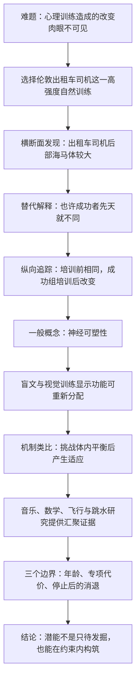
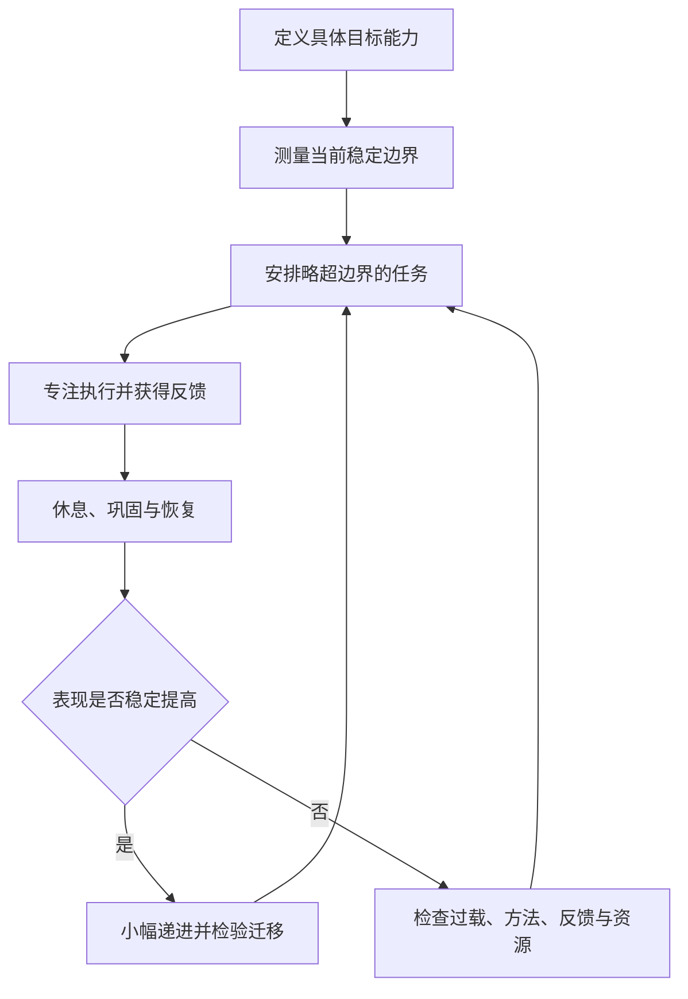

> **原书章节**：第 2 章“大脑的适应能力” 
> **英文核心概念**：Adaptability、Neuroplasticity、Homeostasis 
> **原文来源**：《刻意练习：如何从新手到大师》 
> **本章任务**：解释有目的的练习为何能够创造原先不存在的能力：持续而适度的挑战会扰动身体与大脑的稳定状态，系统通过结构和功能改变重新适应；训练因此不只是使用既有潜能，也能改变未来可达到的能力。 
> **阅读提醒**：“大脑拥有无限的适应能力”是强调性标题，不应按数学意义理解为没有边界。本章同时讨论年龄窗口、专项代价、停止训练后的衰退以及挑战过度的风险。

---

## 一、本章要解决什么问题

### 1. 第 1 章留下的机制缺口

第 1 章表明，史蒂夫能从复述约 7 位随机数字提高到 82 位，训练体系也能把过去的极限变成后来的常规水平。但这些事实仍留下一个更深的问题：

> 练习为什么能够改变能力？它只是让人更熟练地调用出生时已有的固定资源，还是会改变承担任务的身体与大脑系统？

如果大脑成年后像固定硬件，训练最多只能增加知识和软件，人的上限最终由原有“处理器”和“内存”决定。若大脑本身会因训练改变，那么“当前做不到”只描述当前状态，未必描述训练后的可达状态。

本章围绕这个分歧回答五个问题：

1. 长期训练能否改变成年人大脑的可测结构？
2. 改变是否由训练引起，还是本来具有某种脑结构的人更容易成功？
3. 身体和大脑为什么会在受到挑战后改变？
4. 改变是否跨越空间导航、感知、音乐、数学、飞行和运动等不同技能？
5. 可塑性有哪些年龄、专项化、维持和安全边界？

### 2. 本章的中心结论

本章的核心命题可以写成：

> **身体和大脑不是静态容器，而是会依据持续使用和任务要求改变的适应系统。当训练把某一系统推到原有稳定范围之外，同时又没有超过可恢复范围时，系统会通过生理、神经和认知重组建立新的稳定状态，从而使原本困难的任务变得可完成。**

这个命题包含四层含义：

- **能力具有状态依赖性**：今天的表现由今天的系统结构决定，不是终身不变的天花板；
- **改变具有任务特异性**：训练哪类信息和动作，相关系统更可能改变；
- **改变有代价和条件**：年龄、训练剂量、恢复、既有结构和资源都会影响结果；
- **改变需要维持**：停止使用后，部分适应会回退。

### 3. 全章论证路线

### 4. 必须区分的四类主张

| 主张层次 | 例子 | 证据要求 |
| --- | --- | --- |
| 结构差异 | 出租车司机某脑区平均体积与对照组不同 | 可靠成像、匹配对照与统计比较 |
| 训练相关变化 | 同一批人培训前后出现差异 | 纵向测量、合理对照、控制时间变化 |
| 因果机制 | 导航训练触发相关神经网络重组，进而改善导航 | 时间顺序、剂量关系、机制测量与替代解释排除 |
| 个体干预承诺 | 某个具体人按方案练习就能达到目标 | 可复制干预、个体条件、风险和迁移证据 |

本章的纵向研究显著强于只比较高手与新手，但“观察到脑结构变化”仍不等于已经解释每个细胞怎样改变，也不等于对所有个体作出成功保证。

---

## 二、开篇：看不见的心理训练变化

### 1. 为什么身体变化容易相信，大脑变化容易忽视

力量和耐力训练的结果容易测量：肌肉围度、负重、心率、速度和距离都能直接观察。心理训练却没有同样直观的外观：学完微积分、乐器或外语后，头部不会变大，大脑皮层也不会产生可感知的酸痛。

由于变化不可见，人们容易采用一个错误推论：

$$
\text{肉眼看不到结构变化}
\Rightarrow
\text{训练只增加信息，不改变能力系统}.
$$

神经成像技术的价值，就是把部分隐藏变化变成可比较的测量对象。

### 2. 身体类比为什么有用

肌肉训练提供一条熟悉因果链：

$$
\text{负荷}\rightarrow\text{暂时失衡}\rightarrow
\text{恢复与重建}\rightarrow\text{更高承载能力}.
$$

作者用它提出大脑研究假说：心理任务若持续要求某些神经网络超出原有工作方式，这些网络是否也会重组，以更有效地执行任务？

类比的作用是生成假说，不是证明脑组织与肌肉以完全相同方式生长。肌纤维肥大、突触权重变化、髓鞘改变和皮层表征重组属于不同生物过程。

### 3. MRI 能看到什么

**磁共振成像（magnetic resonance imaging，MRI）**利用强磁场和射频信号重建人体组织图像。结构 MRI 可以估计脑区体积、皮层厚度以及灰质、白质等宏观指标；功能 MRI 则通过血氧变化间接估计任务相关活动。

本章许多研究关心结构或皮层表征差异。需要注意：

- MRI 的一个体素包含大量细胞、连接、血管和细胞外空间；
- 灰质体积增加不等于直接数出了更多神经元；
- 成像差异可能涉及神经元大小、树突、胶质、血管、连接或分析方法；
- 脑区更大不自动意味着所有功能都更好。

因此，成像提供的是宏观变化证据，细胞机制需要其他研究方法补充。

### 4. 开篇类比的事实边界

原书用乳酸累积和肌肉颤抖描述耐力极限。现代生理学不会把乳酸简单视为导致疲劳的废物；乳酸可被再次利用，疲劳涉及能量供应、离子平衡、神经驱动和多种代谢变化。这个细节不影响本章主论点，但提醒我们：类比应保留“负荷触发多系统适应”，而不必把每个生理细节绝对化。

---

## 三、伦敦出租车司机的大脑

### 1. 为什么出租车司机是理想研究对象

伦敦道路并非规整网格，而是包含曲折主干道、单行道、环岛、断头路、桥梁和不直观的编号。出租车司机还要综合时段、交通、临时封路和乘客给出的模糊地标。

原书写作时，伦敦约有 2.5 万名驾驶黑色出租车的司机。如此成熟的职业群体、统一许可制度和高难度训练，为研究者提供了规模稳定、任务要求相对一致的现实样本。

这使其具有几个研究优势：

- 训练内容高度明确：空间位置、路线和动态规划；
- 训练强度大且持续数年；
- 有统一考试区分达到标准与未达到标准者；
- 同城公交司机可以控制“长期驾驶”这个替代解释；
- 海马体与空间记忆、导航的关系已有动物和人类研究基础。

它近似一个现实世界中的**自然训练实验**：研究者不制造职业压力，而是利用本来存在的高强度学习过程观察变化。

## 3.1 世界上最难的测试

### 1. “知识”测试要测什么

要成为获许可的“全伦敦”出租车司机，候选者必须掌握以查令十字街为中心、半径约 9.6 千米范围内的道路和目的地。书中列举的对象包括街道、医院、政府机构、车站、酒店、学校、剧院、法院、警察局和旅游地点等。

核心不是背诵地址清单，而是形成可查询、可组合的城市模型：

1. 根据正式地址或模糊描述定位起点与终点；
2. 在多个候选路线中选择合理路径；
3. 按顺序口述沿途街道；
4. 考虑单行、桥梁和道路关系；
5. 随城市变化更新知识。

这同时要求地点记忆、拓扑关系、路线规划和快速检索。

### 2. 规模为什么构成真正挑战

核心区域约有 2.5 万条街道，候选者还要知道大量建筑与地标。原书举例，考官甚至可能只用一座约 0.3 米高的“两只老鼠拿奶酪”雕像来描述目的地。

考试采用多轮口试。考官给出两个地点，候选者要定位并逐街说出最佳路线；随着累积分数和阶段推进，描述更模糊、路线更长、更曲折。约一半或更多候选者最终未能取得许可。

这里的难点不是一次死记，而是把海量元素组织成能在新路线问题中灵活调用的空间表征。

### 3. 候选者怎样训练

第一阶段通常学习指导手册中的 320 条标准路线：

1. 骑摩托车实地走访候选线路；
2. 判断起终点间的合适路径；
3. 探索起点和终点约 400 米范围；
4. 记录建筑、地标和道路关系；
5. 反复口述并接受测试；
6. 再扩展到清单外路线与新建地点。

320 条路线不是最终答案，而是覆盖城市结构的训练骨架。通过路线之间的重叠，候选者逐渐把独立街道连接成网络。

### 4. 这项训练为什么类似有目的练习

- **目标清楚**：准确定位并给出高效路线；
- **难度递增**：终点描述和路线逐步复杂；
- **反馈明确**：考官按定位、街道顺序和准确性评分；
- **走出舒适区**：不断加入陌生地点和新组合；
- **长期重复**：数年实地走访与口头检索；
- **真实迁移**：最终要应对乘客任意提出的路线。

因此，它不仅是职业样本，也是一套天然存在的高强度训练制度。

## 3.2 大脑就像肌肉，越练越大

### 1. 海马体是什么

**海马体（hippocampus）**是位于大脑内侧颞叶、左右各一的结构，参与情景记忆、关系记忆和空间导航等过程。它不是“存放所有记忆的硬盘”，而是支持经历要素关联、空间表征和新记忆形成的网络节点。

动物研究显示，依赖空间贮藏食物的鸟类往往拥有相对更发达的海马体，某些鸟类还会随季节和空间经验发生变化；原书援引的观察中，贮食经验可伴随海马体增大约 30%。这为人类导航训练可能影响海马体提供了先验线索，但跨物种结果只能提供假说，不能直接代替人类纵向证据。

### 2. 2000 年横断面研究

埃莉诺·马圭尔团队使用 MRI 比较：

- 16 名伦敦出租车司机；
- 50 名年龄相近、非出租车司机的男性对照者。

主要结果是：出租车司机的**后部海马体**平均更大，而且从业时间越长，这一部位越大。

横断面结果建立了相关关系：

$$
\text{出租车导航经验}\longleftrightarrow
\text{后部海马体结构差异}.
$$

但箭头方向尚不确定。

### 3. 公交司机对照排除了什么

后续研究把出租车司机与伦敦公交司机比较。两类人都长期驾驶、暴露于城市交通并承担职业压力，但公交司机通常反复运行固定路线，不必持续规划任意起终点。

出租车司机后部海马体仍更大，削弱了以下解释：

- 只要长期开车就会产生差异；
- 只要身处伦敦道路就会产生差异；
- 职业驾驶的一般运动和视觉刺激足以解释差异。

剩下更有针对性的候选因素是复杂空间导航和路线学习。

### 4. 最关键的替代解释：先天选择

横断面研究仍无法排除：某些人本来后部海马体更大、导航更强，因此更容易选择并通过出租车考试。考试可能只是在筛选既有差异，而非训练创造差异。

这叫**选择效应**：

$$
\text{初始脑差异}
\rightarrow\text{更可能成功成为出租车司机},
$$

而不是

$$
\text{出租车训练}
\rightarrow\text{脑结构改变}.
$$

要区分两个方向，必须在训练前测量，并追踪同一个人。

### 5. 纵向研究怎样设计

马圭尔团队招募：

- 79 名刚开始培训的男性候选者；
- 31 名年龄相近、未参加培训的男性对照者。

基线扫描显示，两组后部海马体没有显著体积差异。约四年后，79 名候选者中：

- 41 人通过考试并取得许可；
- 38 人停止培训或未通过。

于是形成三组：成功者、未成功候选者、无培训对照者。研究者再次扫描并比较每个人前后的变化。

### 6. 纵向结果怎样支持训练解释

只有持续培训并成功取得许可者的后部海马体出现显著增加；未成功候选者和无培训对照者没有相同变化。

完整推理是：

1. 培训开始时，各组在目标脑区没有可测差异；
2. 变化发生在数年高强度导航学习之后；
3. 变化集中在最终掌握伦敦空间知识者；
4. 无培训者没有仅因年龄增长出现相同变化；
5. 因而，先天就拥有更大后部海马体不能解释全部结果；
6. 持续导航学习与后部海马体变化具有时间顺序和任务特异性，训练因果解释明显增强。

2011 年发表的结果因此成为成年大脑响应现实世界长期训练的重要证据。

### 7. 还不能把纵向研究解释得多强

它不是随机分配训练剂量的实验。成功者和未成功者可能在出勤、学习策略、压力、睡眠、动机或其他初始特征上不同。因此，最严谨的说法是：

> 数年持续且成功的导航知识训练与后部海马体纵向增长相关，基线相同与对照组结果显著削弱了纯先天选择解释。

不能仅凭 MRI 断言“长出了更多神经元”。体积变化可能涉及突触、树突、胶质、血管和组织成分；人类海马体成年神经发生的规模与功能至今仍存在研究争议。

### 8. 大脑像肌肉的类比到哪里为止

类比成立之处：

- 持续特定负荷会引起相关组织变化；
- 结构改变与任务表现相伴；
- 训练停止后部分改变可能回退；
- 训练过度也可能产生代价。

类比失真之处：

- MRI 体积增大不等于肌纤维式肥大；
- 神经网络通过连接权重、表征和协调方式改变，不只改变尺寸；
- 更大的脑区不一定线性对应更高能力；
- 认知能力依赖多个脑区网络，不由单一区域独立完成。

---

## 四、大脑拥有无限的适应能力

### 1. 旧模型：成年大脑是固定硬件

过去常见观点认为，成年后大脑整体布线基本固定。学习只是强化或削弱既有连接，好比在固定 CPU 和 RAM 的电脑上安装软件。个体能力差异主要由遗传设定的硬件决定，训练只能把预装潜力发挥出来。

这个模型能解释“学习新知识”，却难以解释：

- 出租车训练后宏观脑结构纵向变化；
- 失明后视觉皮层参与触觉任务；
- 特定手指长期使用后皮层表征范围改变；
- 感官输入不变时，训练仍改善知觉表现。

### 2. 神经可塑性的严格定义

**神经可塑性（neuroplasticity）**是神经系统因经验、活动、损伤或环境要求而改变其结构、功能、连接或表征的能力。

它可以发生在多个尺度：

- 突触连接强度增强或减弱；
- 新突触形成、旧突触消退；
- 树突和轴突结构改变；
- 髓鞘和信号传导效率改变；
- 皮层中感官或动作表征范围重组；
- 多脑区网络协同方式改变；
- 某些脑区可能存在有限神经发生。

可塑性表示“能改变”，不表示“可以任意改变”“所有改变都有益”或“所有年龄改变幅度相同”。

## 4.1 身体的适应能力

### 1. 极端纪录为什么被放在这里

书中用俯卧撑和引体向上说明：未经专项训练者的日常表现，与人类在长期训练后可达到的表现可能相差几个数量级。

- 1980 年，一项连续俯卧撑纪录为 10507 个；
- 1993 年，一名美国人在 21 小时 21 分内完成 46001 个俯卧撑；
- 2014 年，一名捷克人在 12 小时内完成 4654 个引体向上。

纪录的规则和认证可能随时代变化，不能用来估计普通人的安全训练目标。它们的论证作用是：当前未经训练表现不能代表适应后的能力边界。

### 2. 身体适应不是单块肌肉变化

耐力和力量表现涉及：

- 肌纤维大小与募集方式；
- 心脏泵血能力；
- 毛细血管密度；
- 肺部和血液输送氧的能力；
- 能量储存与代谢酶；
- 神经系统对动作单位的控制；
- 肌腱、骨骼与结缔组织承载能力。

这为理解大脑提供重要方法论：复杂表现由系统适应产生，不应只寻找一个“能力器官”。

### 3. “无限”应怎样理解

原书同段也承认身体适应存在极限。因此标题中的“无限”更接近：

> 可塑范围远大于未经训练者的直觉，而且尚不能用当前表现准确推定最终边界。

它不等于数学上的无穷，也不否认遗传、年龄、伤病、时间、能量和物理规律。

## 4.2 盲人大脑如何“重新布线”

### 1. 为什么研究失明与失聪者

如果视觉皮层只能处理眼睛输入，那么失明后它应长期闲置。若它开始参与触觉或听觉任务，就直接反驳“功能区域用途完全固定”的强版本。

多数失明者的问题发生在眼睛或视觉通路，部分视觉皮层仍具有生理活动能力。缺少原有输入后，网络竞争和连接权重可能改变，使这些区域参与其他感官处理，这称为**跨模态可塑性**。

### 2. 盲文阅读中的视觉皮层

盲文阅读者用指尖分辨凸点。成像研究发现，他们阅读盲文时，不只有触觉相关区域活动，枕叶视觉皮层也参与处理。

推理是：

1. 任务没有视觉输入；
2. 视觉皮层却与触觉辨别同步活动；
3. 因而，该区域的功能参与不再局限于眼睛输入；
4. 长期依赖触觉阅读可能重组了跨脑区信息通路。

仅凭“亮起来”不能证明视觉皮层独自完成阅读，还需损伤、刺激或连接研究验证其必要性。但它至少证明功能分工比固定硬件模型灵活。

### 3. 三指盲文阅读者的皮层地图

书中研究对象是长期用三个手指阅读盲文的教师：

- 食指识别字母点阵；
- 中指判断字母间距；
- 无名指追踪行位置。

正常情况下，不同手指在躯体感觉皮层中有相对可分的表征。长期高频使用后，这三个手指的皮层表征扩大并出现重叠。

表现上出现两面性：

- 对轻微触碰更敏感；
- 却更难判断触碰具体发生在哪个手指。

这说明可塑性按训练任务优化。盲文阅读需要整合三指的连续信息，网络重叠可能有利于整体模式，却牺牲手指来源分离。改变不是抽象的“全面升级”，而是任务导向的重新分配。

### 4. 可塑性不只发生在闲置区域

三指表征原本已有用途，长期训练仍能扩大和重叠。因此，大脑不只是把闲置区域重新利用，也会在已有功能之间重新分配资源。

这支持一个更一般结论：

$$
\text{长期、重复、重要的任务需求}
\rightarrow\text{网络竞争与协同改变}
\rightarrow\text{任务相关功能重新组织}.
$$

### 5. 老花眼训练：改善处理而非修复眼球

2012 年的一项研究招募患老花眼的中年志愿者。老花眼主要源于晶状体弹性下降，近距离聚焦困难，且低对比度细节更难分辨。

训练方案约为：

- 每周 3 次；
- 连续 3 个月；
- 每次约 30 分钟；
- 高度专注地辨别嵌在相似背景中的低对比度小图形。

训练后，参与者平均能够阅读比基线小约 60% 的文字，阅读速度也提高，许多人可以在测试条件下不戴老花镜读报。

### 6. 为什么眼球没变，视力表现仍能提高

晶状体并未恢复弹性，输入信号仍然模糊。改进更可能来自知觉系统学会更有效地利用残余信息：提高对比敏感度、选择诊断特征、降低内部噪声或重新加权信号。

可以把视觉结果简化为：

$$
\text{知觉表现}=F(\text{感官输入质量},\text{神经解码效率}).
$$

眼球训练前后第一项基本不变，第二项改善，最终表现仍可提高。书中的“去模糊”是直觉类比，不表示大脑像图像软件一样真正重建了所有丢失细节。

### 7. 这类训练不能替代什么

- 它没有逆转晶状体老化；
- 不能据此停用医生建议的眼镜或眼科治疗；
- 对不同病因的视力问题未必有效；
- 实验任务改善是否长期维持、迁移到所有现实场景，需要另行检验；
- 期待效应、重复测试和对照条件会影响因果强度。

这一案例的真正意义是：感官器官受限时，训练仍可能改善中枢处理，而非证明任何视觉损伤都可“用脑补偿”。

---

## 五、走出舒适区的重要性

### 1. 作者为什么从可塑性转向体内平衡

前两节回答“改变是否发生”，本节要解释“什么条件触发改变”。如果身体和大脑时刻都能变化，为什么日常生活没有让每个人自动变强？

作者的答案是：生物系统首先倾向维持稳定。只有任务要求超过原有调节能力，系统才有必要投入成本重建。

## 5.1 身体偏爱稳定性

### 1. 体内平衡的严格定义

**体内平衡（homeostasis）**是生物系统通过反馈调节，使关键内部变量保持在可生存、可工作的动态范围内的过程。

它不是所有数值固定不动，而是围绕范围波动。例如运动时心率会上升，结束后再回落；进食后血糖变化，激素系统会促进储存和利用。

设受调节变量为 $x$，合适范围为 $[L,U]$。当 $x$ 偏离时，负反馈启动补偿，使其向范围返回：

$$
x<L\ \text{或}\ x>U
\rightarrow\text{检测偏差}
\rightarrow\text{补偿反应}
\rightarrow x\in[L,U].
$$

体温、血压、酸碱度、水分、离子和能量供应都存在类似调节，但各自时间尺度与控制器不同。

### 2. 为什么细胞需要稳定环境

细胞膜维持钠、钾等离子梯度，酶反应依赖温度和酸碱范围，组织需要持续氧气和能量供应。偏离过大或持续过久会损害蛋白、膜和代谢，最终导致功能失败甚至细胞死亡。

因此，身体有强大的即时补偿：运动时心率和呼吸加快，血流重新分配，储存的能量底物被动员，以维持工作肌肉的 ATP 供应并清除代谢产物。

### 3. 为什么一般活动不会持续改变能力

若现有调节系统足以应对任务，活动结束后变量回到原范围，身体没有必要承担建造新组织的成本。可以表示为：

$$
\text{任务负荷}\leq\text{现有补偿能力}
\Rightarrow\text{短期调节即可}
\Rightarrow\text{长期结构改变较少}.
$$

这就是舒适区的生理版本：不是完全不费力，而是现有系统能够稳定处理。

## 5.2 被迫走出舒适区之后

### 1. 从短期补偿到长期适应

当持续负荷使原有补偿不足时，细胞经历不同于平常的信号：氧供应相对不足、ATP 消耗增加、ADP/AMP 等能量状态信号变化、机械张力和代谢产物改变。

这些信号会调节基因表达和蛋白合成，逐步改变：

- 能量代谢能力；
- 细胞结构；
- 肌纤维大小和类型；
- 毛细血管与线粒体密度；
- 神经肌肉控制。

原书提到一项小鼠研究：某块后腿肌肉负荷突然增加时，研究者观察到 112 种基因表达发生变化。这不是“112 个力量基因”同时打开，而是说明适应涉及复杂调控网络。

### 2. 适应的目标仍是恢复稳定

系统改变并非主动追求卓越，而是为了让反复负荷不再构成同等扰动：

新的能力是重新建立体内平衡的副产品。原先艰难的负荷变得容易，说明系统已经适应。

### 3. 有氧训练和毛细血管例子

规律慢跑使腿部肌肉反复需要更多氧气。若刺激足够且有恢复时间，身体可能增加毛细血管密度、线粒体和代谢能力，让相同速度下的供氧更充分。

原书以每周三次、每次半小时、心率约为最大心率 70% 的跑步作直觉例子。这个数值不是对所有人的处方；年龄、健康、药物和训练史不同，安全强度应个体化，必要时咨询专业人员。

### 4. 为什么进步后必须调整负荷

适应发生后，相同任务重新落入舒适区：

$$
\text{能力 }C_t\uparrow,
\qquad
\text{原负荷 }D<C_t,
\qquad
\text{新增刺激}\downarrow.
$$

要继续提高，需适度增加距离、速度、坡度、动作复杂度或其他目标相关要求。这就是**渐进超负荷**的基本逻辑。

“加码”不是每次都增加总量。也可以提高动作精度、缩短反应时间、改变材料或减少辅助，关键是再次暴露目标系统的边界。

## 5.3 挑战越大，变化越大，但不要太过

### 1. 为什么存在“甜蜜点”

负荷太低，原系统无需改变；负荷适中，产生可恢复扰动；负荷太高或持续太久，则损伤、疲劳和压力超过重建能力。

概念上可以写为：

$$
\text{有效适应}
=F(\text{挑战剂量},\text{恢复},\text{个体状态}),
$$

其关系通常不是“越大越好”的直线，而更像中间区间最佳：

| 区域 | 系统状态 | 可能结果 |
| --- | --- | --- |
| 刺激不足 | 现有补偿轻松处理 | 维持能力，新增适应少 |
| 可恢复挑战 | 暂时失衡，随后充分恢复 | 结构和功能适应 |
| 过度挑战 | 损伤或长期压力超过恢复 | 伤病、倦怠、表现下降 |

标题“挑战越大，变化越大”只在未超过可恢复区间时近似成立。

### 2. 恢复为什么是机制的一部分

训练提供扰动，睡眠、营养和休息期间才完成许多修复、巩固与重组。若下一次高负荷过早到来，系统累积的是损耗而非能力。

因此，更完整的循环是：

$$
\text{挑战}\rightarrow\text{暂时疲劳}
\rightarrow\text{恢复与适应}\rightarrow
\text{提高后的再次挑战}.
$$

只强调离开舒适区而忽略恢复，会把学习原则误读成长期硬撑。

### 3. 成年大脑主要怎样改变

成年大脑大多数区域不会像肌肉那样靠大量新细胞分裂来适应。常见机制包括：

- 强化或弱化已有突触；
- 形成或清除连接；
- 改变树突棘和网络结构；
- 调整抑制与兴奋平衡；
- 改变脑区表征和跨区协同；
- 调整髓鞘，使部分通路传导更高效。

原书说髓鞘可使神经脉冲速度提高多达约十倍，这是说明量级的表述，具体效果取决于轴突直径、髓鞘结构和通路，不能作为所有训练的固定倍数。

海马体等部位是否存在以及存在多少成年神经发生，在不同物种和人类研究中结论并不完全一致。理解本章不需要依赖“训练大量长出新神经元”这一强主张。

### 4. 心理挑战如何对应生理负荷

心理任务不会简单消耗某个“脑肌肉”。有效挑战通常表现为：

- 必须区分此前混淆的刺激；
- 必须建立新的关系或表征；
- 必须在更短时间内准确执行；
- 必须协调原先分离的子技能；
- 必须抑制旧的错误反应。

若任务只是重复已会答案，神经活动仍会发生，却不一定要求网络重组。

### 5. 大脑训练的甜蜜点

学习新技能、且任务略高于当前能力时，通常比反复执行已掌握任务更能触发改变。但过长时间的高强度专注会造成认知疲劳、错误增加和倦怠。

可操作判断不是“感觉越痛苦越有效”，而是：

- 有一定错误，但能理解错误；
- 反馈后能在下一轮调整；
- 表现趋势仍可恢复；
- 训练后没有持续异常症状；
- 难度随能力动态变化。

---

## 六、练习改变大脑结构

### 1. 本节要解决什么问题

出租车、盲文和知觉训练可能仍被视为特殊情况。本节转向多个领域，检验一个更普遍的预测：

> 如果训练按任务需求重组大脑，那么不同技能应在各自相关的脑区和网络出现不同变化，而不是全脑以同一种方式普遍增大。

## 6.1 音乐训练如何改变大脑

### 1. 为什么弦乐器是合适模型

小提琴、大提琴和吉他演奏者的左右手任务明显不对称：

- 左手多个手指要快速、精确地选择音位并控制颤音；
- 左手拇指主要用于支撑，精细音位动作较少；
- 右手负责运弓或拨弦，动作要求与左手不同。

如果训练塑造皮层表征，应优先看到左手相关手指区域差异，而不是所有手指或全脑同样变化。这构成任务特异性预测。

### 2. 1995 年研究设计

爱德华·陶布与合作者招募：

- 6 名小提琴演奏者；
- 2 名大提琴演奏者；
- 1 名吉他演奏者；
- 6 名非音乐家对照者。

参与者均不是左撇子。研究者使用**脑磁图（magnetoencephalography，MEG）**记录触碰单个手指时产生的细微脑磁信号，据此估计躯体感觉皮层中各手指的表征位置和范围。

MEG 测量的是神经活动产生的磁场，不是直接拍摄脑组织体积，因此“控制手指的区域更大”在这里主要指功能性皮层表征范围，而非 MRI 意义上的一块组织长大。

### 3. 研究结果

- 音乐家左手手指的皮层表征明显大于非音乐家；
- 表征扩展到通常与手掌相关的区域；
- 开始训练越早，扩展越明显；
- 右手相关表征没有显示同样组间差异。

结果符合预先预测的手别特异性，因此比“音乐家全脑不同”更有说服力。

### 4. 从结果到训练解释的推理

1. 弦乐训练对左手精细控制要求远高于普通生活；
2. 差异集中在受特殊训练的左手，而非训练负荷不同的右手；
3. 更早开始训练与更大表征相关；
4. 因而，长期左手练习塑造感觉运动皮层，是合理解释。

但这是小样本横断面研究，不能完全排除早期差异、家庭选择和练习者自我筛选。任务特异性和剂量相关增强了训练解释，却不等同于随机实验。

### 5. 后续音乐研究提供什么汇聚证据

后续研究报告音乐家与非音乐家在多处存在差异，包括：

- 与动作协调和时序有关的小脑；
- 处理触觉和身体感觉的躯体感觉区；
- 整合双手感觉的顶叶区域；
- 规划动作的前运动皮层；
- 多个区域的灰质、白质和网络连接。

若多种方法在与音乐任务相符的区域得到一致结果，单一测量偏差更难解释全部现象。但每项研究仍需单独看样本、设计和统计，不能把“音乐家脑不同”简单等同于“音乐训练让人更聪明”。

### 6. “提升天赋”应怎样理解

训练改变了承担听觉辨别、动作控制和整合的系统，使后续演奏更精确。因而，一部分被日常语言称为“音乐天赋”的可观察能力，其实是训练后形成的功能状态。

这不证明所有个体最终都能达到相同高度，也不排除听觉、生理、动机和早期环境差异。准确表述是：**天赋表现中包含可训练、可塑造的成分，不能把当前能力全部归为先天常量。**

## 6.2 从纯智力技能到纯体格技能

### 1. 数学家的顶下小叶

**顶下小叶（inferior parietal lobule）**参与数量、空间、符号和多模态关系处理。书中概述的研究发现：数学家在相关区域具有更多灰质，从事数学研究时间越长，右侧顶下小叶灰质越多。

这与长期数学活动塑造相关网络的解释一致，但职业年限也与年龄、选择和生活方式相关。相关关系不能单独证明灰质差异完全由数学思考造成。

### 2. 爱因斯坦材料的作用与局限

对爱因斯坦脑组织的个案研究发现其顶叶某些结构形态特殊，因此有人推测这与抽象数学能力有关。

单一个案缺少训练前基线和可比样本，既不能判断差异是先天、发育、训练还是测量选择，也不能证明结构导致成就。它适合提出问题，不适合充当因果证据。

### 3. 滑翔机飞行员

书中研究发现，滑翔机飞行员在左腹侧前运动皮层、前扣带皮层和辅助眼区等区域具有更多灰质。这些区域可能对应：

- 学习和操作控制杆；
- 整合视觉方位与前庭、身体平衡信号；
- 监测冲突和调整控制；
- 规划眼球运动与视觉搜索。

结果再次符合任务特异性预测。但飞行员选拔、训练前能力和职业经验都可能参与，若无纵向基线，因果强度弱于出租车研究。

### 4. 竞技跳水运动员

跳水看似纯体格技能，实则要求精确身体表征、空中姿态感知、时序和动作控制。研究发现，竞技跳水者在三个与身体觉察和运动控制有关的区域具有更大皮层厚度。

这说明“身体技能”也通过大脑控制实现。肌肉和关节改变若没有神经系统形成稳定动作程序，仍无法完成复杂空中动作。

### 5. 跨领域共同规律

不同技能改变的位置不同，规律却一致：

$$
\text{反复训练的任务成分}
\rightarrow\text{相关网络承受持续要求}
\rightarrow\text{结构或功能发生任务特异变化}
\rightarrow\text{该成分处理效率提高}.
$$

证据支持“用进废退、按需重组”，而不是某个单一“专家脑区”在所有高手中统一变大。

## 6.3 三个重要细节

### 1. 细节一：年龄影响可塑性，但成年后并非不能改变

儿童和青少年的大脑仍在发育，连接修剪、髓鞘化和感官运动系统塑形更活跃。早期训练可能改变后续发育路径，作者称为“折弯幼枝效应”：对幼枝的小作用会随生长累积成较大方向差异。

书中以钢琴家白质为例：童年开始越早，成年后某些白质差异越明显；成年后开始训练可能不会形成完全相同的白质模式。

严格理解需要加入四个限定：

- **敏感期不等于绝对截止日**：成年出租车司机研究本身证明成年大脑仍可改变；
- **早开始与练得更久常相互混杂**：必须区分年龄效应和累计训练量；
- **不同技能窗口不同**：音高、发音、动作和抽象知识不能共享一个年龄界线；
- **更大结构不自动等于更好结果**：早期高压训练也可能造成伤病、倦怠或发展机会损失。

### 2. 细节二：专项发展可能伴随代价

出租车纵向研究还比较两类记忆：

- 伦敦地标位置记忆；
- 延迟 30 分钟后识别复杂图案的标准空间记忆。

取得许可者在伦敦地标任务上明显更好，却在复杂图案延迟记忆上比无培训对照者差。培训前各组在后者上相近，因此作者推测，长期把神经资源专门化于伦敦地图，可能牺牲了其他空间记忆表现。

这说明可塑性可能存在**专项化权衡**：

$$
\text{针对任务 A 的优化}
\not\Rightarrow
\text{所有相关任务同步提高}.
$$

不过，原书称资源重新分配是“唯一解释”过强。还可能有疲劳、策略差异、多重比较、生活方式或未测变量。结果支持权衡假说，但具体神经资源竞争机制尚需更多证据。

### 3. 细节三：改变依赖持续使用

身体训练停止后，力量、耐力、骨密度和协调会部分下降。宇航员在微重力环境数月后回到地球会出现行走困难；受伤固定肢体或长期卧床也会导致去训练效应。

大脑同样遵循使用依赖原则。书中比较活跃与退休出租车司机，发现停止高频导航后，相关后部海马体灰质指标开始下降；退休者仍可能保留部分高于从未从业者的差异。

**去训练（detraining）**不是一夜清零。不同改变衰减速度不同，长期形成的知识、动作和重新学习优势可能保留。准确结论是：维持高水平需要一定继续使用，停止后部分适应会逐渐回退。

### 4. 三个细节共同限制了什么

它们共同反驳“训练只会无条件、永久、全面升级大脑”：

| 限制 | 说明 |
| --- | --- |
| 发展时机 | 同样训练在不同年龄可能产生不同结构变化 |
| 专项权衡 | 一项能力增强不保证邻近能力增强，甚至可能伴随代价 |
| 可逆性 | 不再使用后，部分结构和表现会衰退 |

可塑性是一种适应性，不是一张只增不减、全局通用的能力储蓄卡。

---

## 七、潜能可以被构筑

### 1. 两种潜能观

#### 1.1 固定容器观

传统隐喻把潜能看成出生时已经确定的容量。学习只是在容器中装入知识，或把隐藏能力逐渐显露：

$$
\text{最终能力}\leq\text{先天固定潜能}.
$$

在这个模型中，训练不改变上限，只决定接近上限多少。

#### 1.2 构筑观

本章提出的模型认为，训练会改变执行任务的系统，因此未来能力取决于训练路径：

$$
C_{t+1}=C_t+\Delta C(\text{任务要求},\text{反馈},
\text{恢复},\text{年龄},\text{环境},\text{个体条件}).
$$

这里的 $C_t$ 是当前能力，$\Delta C$ 可能为正、为零，也可能因过载或停止训练而为负。潜能不是一个静止数字，而是从当前状态出发，在约束和干预下可到达的一组未来状态。

### 2. “足够好”为什么是大多数人的正常终点

多数日常活动只要求安全和可接受：走路、骑车、写报告、开车、教课或管理组织。达到要求后，环境不再持续惩罚微小不足，人也没有理由承担高强度训练成本。

因此，普通表现低于运动员、音乐家或专业导航者，不必立即解释为缺少生理可能性；它也可能只是从未经历相应训练。

但“没有训练”与“只要训练就一定达到顶尖”是不同命题。前者解释当前状态，后者还需要个体可达性证据。

### 3. 发掘潜能与构筑潜能的差别

| 学习观 | 隐含假设 | 训练作用 | 遇到平台时的解释 |
| --- | --- | --- | --- |
| 发掘潜能 | 能力上限预先存在 | 把已有潜力表现出来 | 接近固定上限 |
| 构筑潜能 | 承载能力会随适应改变 | 重组系统，创造新能力 | 当前方法或系统尚未适应 |

构筑观把问题从“我有没有这项天赋”改成：

- 目标能力由哪些可训练系统组成？
- 什么任务能让这些系统产生适应？
- 训练剂量、恢复和反馈怎样安排？
- 哪些约束可改变，哪些目前不可改变？

### 4. 为什么有目的练习会比传统重复更有效

传统重复常停留在当前平衡范围。有目的练习通过明确目标和递增挑战，使任务持续略高于当前能力；反馈又帮助系统选择更有效的调整。

完整机制链是：

重复若没有新的误差，不会持续推动重组；挑战若没有反馈，也可能产生随机或有害改变。

### 5. “如果希望变好，就可以做到”的边界

原书用强烈语言强调选择仍然存在。严谨版本应是：

> 对许多技能，经过与目标相匹配的长期训练，大多数人的能力都能显著超过当前水平；提高幅度和最终水平仍受生理、年龄、资源、机会、训练质量、动机和风险约束。

不能推出：

- 每个人都能成为任何领域的世界第一；
- 身高、感官损伤、疾病和年龄窗口都可被意志消除；
- 所有脑区越大越好；
- 痛苦越强，潜能构筑越快；
- 一项训练会自动迁移到通用智力；
- 只要相信可塑性，不需要教练、反馈和恢复。

### 6. 潜能更适合被定义为“可达集合”

设个体当前状态为 $x_0$，环境资源为 $E$，可投入时间为 $T$，允许的安全训练策略集合为 $\Pi$。未来可达能力不是单点，而是：

$$
\mathcal R(x_0,E,T,\Pi)
=\{x_T\mid x_T\text{ 可由某个允许训练路径达到}\}.
$$

训练、工具、导师和环境改变时，集合 $\mathcal R$ 也会改变。这种定义同时保留可塑性与约束，比“潜能无限”或“天赋注定”更准确。

### 7. 本章怎样引向下一章

身体能力可以用肌纤维、供氧和循环等变化解释。心理能力虽有脑结构变化证据，但还缺一个功能层答案：专家究竟形成了什么内部组织，使他们能看见、记住和处理更多信息？

第 3 章将把共同主题命名为**心理表征**。可塑性解释大脑为什么能改变，心理表征解释这些改变怎样组织信息并直接支持专业表现。

---

## 八、作者分析问题的方法

### 1. 从可观察的身体类比进入不可见的大脑

作者先用肌肉和耐力训练建立读者已有的因果直觉，再把同样问题投向大脑。这降低理解门槛，也提出了“特定负荷应产生特定适应”的可检验预测。

类比有效的前提是只迁移系统层逻辑，不把肌肉细胞机制原样套给神经网络。

### 2. 选择一个训练强、标准清楚的自然场景

伦敦出租车训练持续多年、考试严格、任务与海马体功能相关，变化信号比普通日常学习更容易观察。这是一种**极端案例策略**：先在最可能出现效应的地方确认现象，再研究一般性。

局限是极端案例不代表所有职业；普通学习强度可能不足以产生同样宏观变化。

### 3. 主动提出并处理选择效应

作者没有把横断面差异直接当因果，而是明确提出“也许他们天生不同”。纵向研究在培训前建立基线，再比较成功、未成功和无培训三组，这是本章最关键的方法升级。

它不能达到随机试验的全部控制，却显著强化了时间顺序和训练关联。

### 4. 用特殊人群揭示系统可替代性

失明、失聪和老花眼研究让原功能与新功能的差别特别清楚：视觉输入缺失后视觉皮层参与触觉，眼球信号未改善时知觉表现仍提高。特殊情形把普通大脑中较难分辨的可塑过程放大了。

### 5. 从“是否改变”转向“为什么改变”

作者用体内平衡解释触发机制：系统偏爱稳定，适度挑战迫使其重建。这样，走出舒适区不再只是励志建议，而有了生物系统层的原因。

但体内平衡是高层机制框架，不是对每种学习的完整分子解释。不同技能仍需研究具体神经过程。

### 6. 用跨领域汇聚而非单一脑区证明

音乐、数学、飞行和跳水改变的区域不同，却都与训练任务相符。跨领域一致性支持一般可塑原则，任务差异则支持专项性。

研究大多为小样本或横断面，汇聚证据提高可信度，却不能消除每项研究的因果局限。

### 7. 在结论前主动加入三个限制

年龄、代价和消退三点阻止读者把可塑性理解成无成本、永久、全面的升级。这是本章结构上非常重要的一步：理论不仅解释怎样增长，也解释为什么增长不同、为何可能牺牲其他表现，以及为何必须维持。

### 8. 本章容易产生的推理错误

| 错误 | 为什么错误 | 更准确的说法 |
| --- | --- | --- |
| 脑区更大，所以一定更聪明 | 尺寸、组织和网络效率不是简单线性关系 | 任务相关结构差异可能支持特定表现 |
| 高手与新手脑不同，所以训练造成差异 | 横断面无法排除选择效应 | 需要训练前基线或随机干预 |
| 大脑可塑，所以没有极限 | 可改变不等于任意改变 | 可达范围大但受多种约束 |
| 挑战越痛苦，效果越好 | 超过恢复能力会损伤和倦怠 | 最佳区间是可恢复、可反馈的挑战 |
| 儿童可塑性强，所以成年学习无效 | 年龄影响幅度，不等于成年后关闭 | 成人仍可产生显著功能和结构变化 |
| 专项训练让整个大脑升级 | 改变通常具有任务特异性 | 必须直接检验迁移 |

---

## 九、把本章转化为实践方法

### 1. 先定义要适应的系统

不要只说“训练大脑”。先问目标表现依赖什么：视觉辨别、动作时序、空间关系、概念检索、错误抑制还是多步骤规划？任务越具体，越能设计对应刺激。

### 2. 建立表现基线，而不是追踪脑区大小

普通学习者无需扫描大脑。真正重要的是任务表现：准确率、速度、稳定性、迁移和错误类型。脑变化是能力适应的机制证据，不应变成日常训练目标。

### 3. 找到当前稳定边界

用递增测试确定：在哪个难度以下可以稳定完成，超过哪里开始出现可分析错误。训练任务应主要位于两者附近。

### 4. 设计可恢复的挑战剂量

剂量包括难度、时长、频率、复杂度和辅助程度。一次只调少数变量，训练后留出恢复。若错误持续增加、睡眠恶化或旧能力下降，应降低负荷并检查方法。

### 5. 用反馈引导适应方向

生物系统会适应经常受到的要求，但不理解人的最终意图。若反复追求速度却不约束准确率，系统可能学会快速猜测；若始终依赖提示，系统可能适应提示而非独立完成。

训练指标必须与最终表现一致，并设置质量守门条件。

### 6. 适应后及时递进

当原任务连续稳定完成，它已进入新的舒适区。此时可增加变化、减少提示、提高精度或加入真实约束，而不只是无限增加时长。

### 7. 检查专项代价和迁移

定期测试：

- 未直接训练但希望迁移的任务是否改善；
- 相邻能力是否下降；
- 训练策略是否只适配固定题型；
- 真实环境表现是否同步提高。

发现权衡后，应加入多样练习、基础维护或重新分配训练量。

### 8. 设置维持剂量

达到目标后，不一定继续高峰训练，但需用间隔复习、定期实战或周期性测试维持关键网络。维持频率应由实际衰退速度决定。

### 9. 一个完整适应循环

### 10. 示例：训练数学证明能力

低效目标是“每天看两小时证明”。按本章机制可改成：

1. 选择当前能理解但不能独立完成的证明类型；
2. 先独立写出已知、目标和可能不变量；
3. 卡住后只获取一级提示，而不是直接看完整答案；
4. 对照标准解答，定位是定义提取、构造辅助对象还是论证闭合出了问题；
5. 隔天不看答案重建；
6. 在表面不同但结构相同的题中检验迁移；
7. 稳定后减少提示或提高证明复杂度；
8. 每周保留旧类型，防止专项新技能挤掉基础提取。

挑战作用于“独立构造证明”的网络，反馈决定重组方向，休息和重建支持巩固，多题迁移避免只记答案。

### 11. 替代与补充方法

并非所有学习都需要持续高压：

| 当前问题 | 合适方法 | 为什么 |
| --- | --- | --- |
| 基础事实提取不稳 | 间隔检索 | 用较低单次压力提高长期保持 |
| 任务远超当前能力 | 脚手架、分步示范 | 把失控区降到可学习区 |
| 真实任务风险高 | 模拟器、角色扮演 | 在安全环境制造关键约束 |
| 训练过度专项化 | 变式、交错与跨情境练习 | 检验表征能否迁移 |
| 缺少过程反馈 | 导师、录像、思维出声 | 让隐蔽错误可观察 |
| 已达够用水平且无提高需求 | 普通使用与低频维护 | 避免不必要训练成本 |

有些学习发生在巩固、睡眠和舒适复习中。“挑战体内平衡”解释能力扩展的重要条件，不意味着每一分钟都必须不舒服。

---

## 十、核心概念辨析

| 概念 | 严格含义 | 常见误解 |
| --- | --- | --- |
| 适应能力 | 系统依据持续环境要求改变结构或功能的能力 | 可以向任意方向无限改变 |
| 神经可塑性 | 神经系统因经验、活动、损伤或环境改变连接、结构、功能或表征 | 只指长出新神经元 |
| MRI | 根据磁共振信号估计组织结构的成像方法 | 可以直接数出某脑区神经元数量 |
| MEG | 记录神经活动产生磁场、定位快速脑活动的方法 | 与结构 MRI 完全相同 |
| 海马体 | 支持情景、关系和空间记忆的内侧颞叶结构 | 存储所有记忆的单一硬盘 |
| 横断面研究 | 在一个时点比较不同群体 | 能直接证明训练因果作用 |
| 纵向研究 | 对同一对象跨时间重复测量 | 自动等同于随机对照试验 |
| 选择效应 | 初始特征影响谁进入、坚持或成功 | 训练前差异的唯一来源 |
| 跨模态可塑性 | 一种感官缺失或任务改变后，原相关区域参与其他感官处理 | 脑区彻底、永久更换单一功能 |
| 皮层表征 | 某类身体、感官或任务信息在皮层活动中的组织范围 | 一块边界固定、只做一件事的模块 |
| 体内平衡 | 通过反馈把关键变量维持在动态范围 | 身体所有数值始终不变 |
| 渐进超负荷 | 适应后逐步提高目标相关要求 | 每次只增加训练时长或重量 |
| 甜蜜点 | 足以产生适应、又可恢复和纠错的挑战区间 | 主观最痛苦的强度 |
| 灰质 | 以神经元胞体、树突和胶质等为主的脑组织指标 | 灰质越多，所有能力越强 |
| 白质 | 以有髓轴突连接为主的脑组织 | 只是无功能填充物 |
| 髓鞘 | 包裹部分轴突、影响信号传导的绝缘结构 | 所有训练都会让传导固定提高十倍 |
| 敏感期 | 某类经验较容易产生特定发育影响的阶段 | 一过年龄便完全不能学习 |
| 专项化权衡 | 对任务 A 的优化可能不迁移或影响任务 B | 训练必然损害其他能力 |
| 去训练 | 停止刺激后部分适应和表现回退 | 所有训练成果会立即消失 |
| 构筑潜能 | 训练通过改变能力系统扩大未来可达状态 | 意志可以消除所有约束 |

---

## 十一、本章完整结论

### 1. 伦敦出租车研究说明什么

复杂导航训练与后部海马体结构差异相关；培训前基线相近、培训后只有成功组增长的纵向结果，显著支持成年大脑会随长期专项训练改变，而不只是筛选先天不同者。

### 2. 盲文与视觉训练说明什么

神经网络可以跨感官重新分工，也能在感官输入本身未改善时提高信息解码。可塑性既会利用闲置区域，也会重组原本已有功能的区域。

### 3. 体内平衡提供什么机制解释

身体和大脑首先维持稳定；当持续任务超过现有补偿能力但仍可恢复时，系统通过结构和功能变化建立新的稳定状态。适应后相同任务不再构成刺激，因此持续进步需要渐进挑战。

### 4. 跨领域研究说明什么

音乐、数学、飞行和跳水训练关联的脑变化各不相同，却与各自任务需求相符。一般规律是任务特异的使用依赖可塑性，而不是全脑统一扩张。

### 5. 三个细节限制了什么

年龄影响改变方式和幅度；专项发展不保证普遍迁移并可能伴随权衡；停止使用后部分适应会衰退。因此，可塑性并非无成本、永久和全局的升级。

### 6. “潜能可以被构筑”的准确含义

当前能力不是固定潜能的透明读数。适当训练会改变执行任务的系统，使未来可达状态发生变化；但可达范围仍由个体条件、训练路径、环境资源、时间、安全和恢复共同约束。

### 7. 本章为下一章留下什么问题

可塑性解释“为什么能改变”，还没有完整解释专家究竟构造了什么。下一章将用心理表征解释：训练后的大脑如何组织模式、预测结果、压缩信息并指导动作。

---

## 十二、复习问题

1. 为什么心理训练的变化比身体训练更容易被误认为不存在？
2. MRI 能测量哪些宏观指标，为什么不能直接推出神经元数量增加？
3. 伦敦“知识”测试为什么既测记忆，也测空间关系与路线规划？
4. 320 条标准路线怎样帮助候选者形成城市网络，而不只是背 320 个答案？
5. 2000 年横断面研究发现了什么，为什么仍不能证明训练因果作用？
6. 公交司机对照主要排除了哪些替代解释？
7. 79 名候选者与 31 名对照者的纵向设计怎样削弱先天选择解释？
8. 为什么“后部海马体体积增加”不能直接翻译成“长出更多神经元”？
9. 神经可塑性包含哪些尺度的变化？
10. 为什么“大脑拥有无限适应能力”不能按字面理解？
11. 盲文阅读时视觉皮层参与活动，反驳了哪种固定功能观？
12. 三指皮层表征重叠为什么既带来更高触觉敏感度，也带来定位代价？
13. 老花眼训练改善了什么，没有改善什么？
14. 体内平衡为什么不是“所有变量完全不变”？
15. 一般活动与能触发长期适应的负荷有什么区别？
16. 适应为何可以被理解为重新建立稳定，而非系统主动追求卓越？
17. 为什么适应后必须递进任务，递进又为什么不能过快？
18. 恢复在挑战—适应循环中承担什么作用？
19. 成年大脑的改变为什么不必依赖大量新神经元生成？
20. 1995 年弦乐研究为何特别比较左右手，它使用的是 MRI 还是 MEG？
21. 音乐家的皮层表征差异能支持什么，不能支持什么？
22. 数学家、飞行员和跳水者研究共同体现了哪种任务特异规律？
23. “折弯幼枝效应”说明什么，为什么不等于成人学习无效？
24. 出租车司机地标记忆增强、复杂图案记忆下降，说明了什么边界？
25. 停止训练后脑结构部分回退，为什么不等于成果全部清零？
26. “发掘潜能”与“构筑潜能”对平台期给出什么不同解释？
27. 把潜能定义为可达集合，比把它定义为固定数字好在哪里？
28. 为什么走出舒适区不等于持续追求痛苦？
29. 如何检查一项专项练习是否真正迁移到目标情境？
30. 选择一项正在学习的技能，写出它的当前边界、可恢复挑战、反馈方式、恢复安排和维持方案。

---

## 十三、延伸阅读线索

- Eleanor Maguire 等：伦敦出租车司机海马体的横断面研究，以及候选者培训前后的纵向研究。
- Edward Taub 等（1995）：弦乐演奏者手指皮层表征的 MEG 研究。
- 盲文阅读与视觉皮层参与：跨模态神经可塑性研究。
- 老花眼与知觉学习：通过训练改善中枢视觉解码的研究。
- 运动生理学中的体内平衡、渐进超负荷、恢复与去训练。
- 成人神经可塑性、髓鞘变化与任务特异脑网络重组。

这些材料分别对应本章的因果锚点、跨领域证据、触发机制和适用边界。阅读原始研究时，应优先确认样本量、成像方法、是否纵向、是否存在主动对照，以及行为改善能否迁移。
