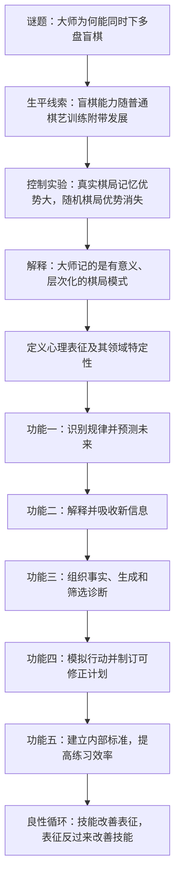

> **原书章节**：第 3 章“心理表征”<br>
> **英文核心概念**：Mental Representation<br>
> **原文来源**：《刻意练习：如何从新手到大师》<br>
> **本章任务**：回答第 2 章留下的问题：训练后的大脑究竟形成了什么，使专家能够在相同感官输入和有限工作记忆下，比新手看得更深、记得更多、预测更准、计划更完整，并更有效地纠正自己。<br>
> **阅读提醒**：心理表征不等于“脑海里的一幅图片”，也不是神秘直觉。它可以是视觉、听觉、空间、动作、概念或条件规则等多种形式，核心在于用领域知识组织信息并指导判断与行动。

---

## 一、本章要解决什么问题

### 1. 从“脑会改变”推进到“改变后怎样工作”

第 2 章用神经可塑性说明，长期训练会改变与任务相关的脑结构和功能。但“某脑区发生变化”仍不足以解释专家表现：

- 国际象棋大师为何能不看棋盘，同时维护多盘复杂棋局？
- 足球高手为何能从瞬间画面预测下一步，而新手只看到人群移动？
- 专科医生为何能把耳痛、瞳孔异常、举重和头痛组织成同一诊断？
- 优秀音乐家为何能在第二次演奏时发现并纠正大部分错误？
- 好作者为何会在写作过程中改变自己对主题的理解？

这些能力表面不同，作者认为它们共享一个功能层机制：长期训练形成了高质量的**心理表征**。

### 2. 本章的中心结论

> **专家并不是简单地拥有更大的通用记忆或更快的通用反应，而是拥有大量层次化、领域特定、与行动相连的心理表征。它们把零散信息压缩为有意义结构，使专家能够识别规律、预测结果、组织知识、产生候选方案、制订计划，并用内部标准监测自己的表现。**

这个结论还包含一个学习闭环：

> **练习改善心理表征，改善后的心理表征又提高练习质量。**

新手主要依赖外部导师告诉自己哪里错了；专家拥有更细致的目标表征，能在执行过程中产生内部反馈，因而更快定位和修正偏差。

### 3. 全章论证路线



### 4. 先区分五个相关概念

| 概念 | 核心含义 | 与心理表征的关系 |
| --- | --- | --- |
| 组块 | 被当成一个整体处理的信息单位 | 心理表征可让多个元素组成有意义组块 |
| 图式 | 对某类对象或情境的稳定知识框架 | 是概念型心理表征的一种 |
| 心理模型 | 对系统结构、因果关系及其变化的内部模型 | 支持解释、模拟和预测 |
| 检索结构 | 用稳定线索定位并按序取回信息的框架 | 是为记忆任务设计的特定心理表征 |
| 动作表征 | 对身体姿态、时序、感觉和预期结果的内部组织 | 指导运动执行并比较动作偏差 |

这些概念有重叠，但不能全部互换。心理表征是上位概念，强调头脑怎样组织与任务相关的信息，并用它支持认知和行动。

### 5. 本章证据的层次

| 证据 | 主要作用 | 局限 |
| --- | --- | --- |
| 阿廖欣盲棋史 | 提出“普通棋艺训练为何迁移到盲棋”的谜题 | 生平叙述不能隔离所有训练因素 |
| 真实棋局与随机棋局实验 | 操纵结构是否有意义，检验专家优势来源 | 实验任务只测棋局记忆的一部分 |
| 足球视频暂停、攀岩把手研究 | 展示表征支持预测与自动分类 | 多为专家与新手比较，仍有选择效应 |
| 阅读与体育知识研究 | 展示背景知识怎样帮助理解新信息 | 一般语言能力仍可能有作用 |
| 医学病例与保险代理人 | 展示知识组织怎样支持选择与决策 | 病例是示范，销售研究多为相关关系 |
| 儿童练琴与钢琴家过程研究 | 展示表征怎样产生自我反馈 | 小样本个案与观察研究不能单独证明全部因果 |

---

## 二、开篇：阿廖欣的 26 盘盲棋

### 1. 什么是盲棋

**盲棋**是棋手看不到棋盘，只通过对手走法的口头信息，在头脑中维护局面并给出应手的国际象棋形式。“盲”描述的是不能看棋盘，不要求参与者真的失明。

完成一盘盲棋至少要：

1. 保存当前棋子位置及关系；
2. 根据每一步更新内部局面；
3. 生成候选走法；
4. 模拟双方后续变化；
5. 避免把旧局面和新局面混淆。

多盘同时盲棋还要在不同棋局之间正确切换，不能串盘。

### 2. 1924 年表演的规模

1924 年 4 月 27 日，亚历山大·阿廖欣在纽约阿拉玛克酒店同时对阵 26 名较强棋手。他背对棋盘，只听工作人员报告走法，再口述自己的应手。

- 26 个棋盘；
- 初始共 832 枚棋子、1664 个方格；
- 全程超过 12 小时；
- 17 胜、5 负、4 和。

这些数字并不表示他在头脑中逐格保存了 1664 个独立变量。恰恰相反，本章要解释的是：为什么按关系组织棋局，使他不必逐项记忆。

### 3. 历史纪录为什么不是核心论据

书中还提到马克·朗在 2011 年同时对阵 46 人，取得 25 胜、2 负、19 和。纪录证明这种能力可达到惊人规模，却不能单独解释能力怎样形成。

作者真正利用的不是“数字有多大”，而是一个反常线索：许多盲棋高手并没有把主要训练时间用于盲棋，他们是在提高普通棋艺时附带获得盲棋能力。这暗示两种表现依赖同一底层心理结构。

---

## 三、偶然的盲棋大师

### 1. 阿廖欣怎样学习国际象棋

阿廖欣 1892 年出生，7 岁开始下棋，10 岁参加比赛。他会长时间分析自己的对局，在不能携带棋盘到学校时，把棋题写在纸上并在头脑中求解。

训练重点不是背棋子坐标，而是：

- 解释局面为何形成；
- 比较候选招法；
- 模拟交换后的局面；
- 评估攻防关系；
- 从错误对局中修正判断。

反复离开实物棋盘思考，使内部棋盘逐渐可独立运行。

### 2. 从草图到内部棋盘

起初，阿廖欣需要画草图帮助分析。随着棋艺提高，他可以不看草图，在脑中保持局面并移动棋子。

这一变化可以拆成：

$$
\text{外部棋盘或草图}
\rightarrow\text{带外部支撑的内部模拟}
\rightarrow\text{稳定内部棋局表征}.
$$

外部工具没有妨碍形成能力，而是作为脚手架。等内部结构足够稳定后，支撑才逐步撤除。

### 3. 盲棋经验确实存在，但不是主要训练目标

1902 年，哈里·尼尔森·皮尔斯布里在莫斯科同时进行 22 盘盲棋，对少年阿廖欣产生很大影响。阿廖欣后来开始盲棋，17 岁时可同时进行四五盘。

战争、监禁和养伤期间缺少棋盘，也增加了盲棋实践。移居巴黎后，他又通过公开表演谋生，逐步挑战 12 盘、21 盘和世界纪录；此后还在 1925 年和 1933 年把纪录提高到 28 盘和 32 盘。

因此，“偶然”不能理解为从未练过盲棋。更准确的是：

- 他的核心目标始终是提高标准棋艺并成为世界冠军；
- 普通棋艺训练先建立了可在头脑中运行的棋局表征；
- 盲棋表演再训练多局切换、耐力和无棋盘检索；
- 盲棋能力大部分建立在标准棋艺共享的表征上，而非独立的照相记忆。

### 4. 世界冠军目标与盲棋副产品

阿廖欣 1927 年击败何塞·拉乌尔·卡帕布兰卡成为世界冠军，1935 年失去头衔，1937 年重夺并保持至 1946 年。他被视为顶尖棋手，也名列盲棋史上的杰出人物。

两个身份重合支持一个解释：越能深刻理解棋局，越能在缺少视觉棋盘时重建和更新它。盲棋不是与棋艺无关的记忆特技，而是棋局表征质量的极端展示。

### 5. 从生平故事能够推出什么

1. 内部模拟能力随长期棋艺分析逐步形成；
2. 标准棋与盲棋共享对局面关系、候选走法和变化的表征；
3. 特定领域的训练成果可迁移到共享同一结构的邻近任务；
4. 迁移不是通用的，棋局表征不会自动带来任意材料的超强记忆。

### 6. 还不能推出什么

- 不能只凭一个人的回忆确定每段训练的因果贡献；
- 阿廖欣实际进行过不少盲棋，不能说完全没有专项练习；
- 历史纪录不能证明所有大师都会自动获得同等盲棋能力；
- 多盘盲棋还依赖注意切换、耐力、动机与比赛经验；
- 战争经历的原始 Markdown 存在“澳大利亚/奥地利”等疑似转写问题，不影响心理表征主线，但不宜把该细节当作可靠史料。

这段生平的作用是提出机制假说，下一节才用控制实验检验。

---

## 四、大师比新手强在哪里

## 4.1 有意义的记忆更高效

### 1. 两种竞争解释

棋手能快速复现棋局，至少有两种解释：

1. **通用容量解释**：大师能逐个记住更多棋子，类似拥有更大的短时记忆；
2. **结构编码解释**：大师把棋子理解为有意义的关系整体，只在真实棋局结构存在时表现出优势。

西蒙和蔡斯通过改变棋子是否组成合理棋局来区分两者。

### 2. 实验设计

研究者比较国家级棋手、中等棋手和新手，给他们看两类棋盘：

- **真实棋局**：来自实际对局，棋子关系符合国际象棋规律；
- **随机棋局**：棋子位置被打乱，不构成合理对局结构。

随后要求参与者复原棋子位置。

经典棋局记忆实验通常采用约数秒的短暂呈现；当前原始 Markdown 写成“5 分钟”，与经典范式和结果量级不一致，较可能是转写或翻译问题。论证成立的关键是观看时间足够短，参与者不能逐个死记全部棋子。

### 3. 结果

在真实棋局中：

- 大师能复原约三分之二的十几至二十多枚棋子；
- 新手只能复原约 4 枚；
- 中等棋手介于两者之间。

在随机棋局中：

- 新手约记住 2 枚；
- 中等棋手和大师也只记住约 2 至 3 枚；
- 专家优势基本消失。

### 4. 为什么这个交互结果很关键

若大师只是拥有更大的通用视觉记忆，那么无论棋子是否合理，他们都应保持明显优势。实际结果却是：

$$
\text{专家优势}
\approx
\begin{cases}
\text{很大}, & \text{棋局有意义},\\
\text{很小或消失}, & \text{棋局随机}.
\end{cases}
$$

因此，优势依赖长期知识可否解释输入，而不是无条件扩大短时容量。

### 5. 语言类比为什么有帮助

一组打乱顺序的词很难记住；把相同词组成语法和语义连贯的句子，多数成年人可以记住大部分甚至全部。

原因不是句子减少了物理单词数，而是已有语言知识提供：

- 语法结构；
- 语义关系；
- 因果和情境预期；
- 缺词或错词的校验线索。

棋手对合理棋局的记忆与读者对句子的记忆相似：元素被嵌入结构，结构帮助编码和重建。

### 6. 适用边界

随机棋局中专家优势通常显著减弱，但不一定在所有条件下完全为零。棋手仍熟悉棋子名称、方格和局部约束；呈现时间变长后，也可能使用一般记忆策略。最稳妥的结论是：**专家的大部分巨大优势来自领域结构，而非通用容量。**

## 4.2 5 万个数据块

### 1. “打谱”在训练什么

认真提高棋艺的人会分析高手对局：先根据局面预测下一步，再与高手走法比较；若不同，追查自己漏看了哪种攻防关系。

这个循环不是记答案，而是训练：

$$
\text{局面}\rightarrow\text{候选走法}\rightarrow
\text{后果预测}\rightarrow\text{与高水平选择比较}
\rightarrow\text{修正局面表征}.
$$

原书强调，分析棋局的时间比只与别人下完整对局的时间更能预测棋力。这里的“最重要指示符”是统计关联，不等于其他训练完全无关。

### 2. 数据块或组块的严格含义

西蒙和蔡斯把经常共同出现、具有功能关系的棋子配置称为**组块（chunk）**。组块不是固定三枚棋子，也不只是视觉形状，而可以包含：

- 棋子相对位置；
- 保护和攻击关系；
- 典型兵形；
- 开局、残局或战术主题；
- 可能的后续行动。

组块把多个元素编码为一个有意义单位，降低工作记忆中独立项目数量。

### 3. “5 万”应怎样理解

西蒙估计，大师长期记忆中可能积累约 5 万个棋局组块。这个数字用于表达知识库规模，不是通过逐个清点得到的精确常数，也不表示每位大师恰有相同数量。

更重要的是，组块不是互不相干的卡片。它们彼此关联、随经验更新，并组成更大的结构。

### 4. 层次化组织

棋局知识可从具体到抽象组织：

```text
具体层：某几枚棋子的局部位置和直接攻防
    ↓
中间层：典型战术、兵形、子力协同和局面主题
    ↓
高层：战略优势、弱点、计划和局势发展方向
```

低层靠近可执行动作，高层压缩更大范围并提供方向。专家可以从高层判断该关注哪里，再下钻到具体变例。

### 5. 为什么层次化比平面记忆更强

设棋盘有 $n$ 个零散元素。新手若逐项处理，工作记忆负担近似随 $n$ 增长。专家把它们映射为 $k$ 个已知结构，且 $k\ll n$：

$$
\{e_1,e_2,\ldots,e_n\}
\xrightarrow{\text{领域知识}}
\{c_1,c_2,\ldots,c_k\}.
$$

高层结构还可生成对缺失细节的预期，因此记忆并非纯复制，而是有约束的重建。

## 4.3 既见树木，又见森林

### 1. 大师“看到”的不是棋子清单

新手可能报告某枚车在某格、某枚兵在另一格；大师更常用“进攻线路”“子力调动”“王翼弱点”等关系语言描述。

这不是故意含糊，而是把低层坐标放入高层功能结构。大师看到相同物理棋盘，却提取不同信息。

### 2. 全局评估

高质量表征使大师迅速判断：

- 哪方占优；
- 优势来自空间、子力、王安全还是兵形；
- 局面可能向什么方向发展；
- 哪类计划值得考虑。

这相当于先看森林，压缩搜索空间。

### 3. 局部模拟

表征同时保存具体棋子关系，使大师能把注意集中到关键点，在脑中移动棋子并模拟双方应对。专家并非只凭整体感觉，也会检查“树木”。

有效过程是：


### 4. 专家优势不只是“算得更多”

研究常发现，高手最初生成的候选招法质量就更高。他们借助表征过滤大量无关选择，把有限计算资源投入更有希望的路线。

因此：

$$
\text{专家决策质量}
\neq\text{穷举所有可能},
$$

而更接近：

$$
\text{模式识别}+\text{高质量候选生成}
+\text{选择性深搜}.
$$

### 5. 直觉的正确位置

专家的“局面感”是大量模式、结果和反馈压缩后的快速判断。它在熟悉领域和稳定规律下可靠；面对新规则、随机局面或分布变化时，直觉可能失效，仍需显式分析。

---

## 五、心理表征是什么

### 1. 它要解决什么问题

感官只提供颜色、声音、触觉或符号，行动却需要理解“这是什么、意味着什么、接下来会怎样、我该做什么”。心理表征把输入与已有知识、目标和动作连接起来。

### 2. 直觉定义

提到《蒙娜丽莎》时，很多人会想起画面；提到“狗”时，人们会同时唤起外形、行为、声音、类别和互动经验。这些不是孤立事实列表，而是可被一个线索整体激活的结构。

### 3. 严格定义

在本章语境中，**心理表征**是由经验形成、保存在长时记忆并可由任务线索激活的内部信息结构；它表示对象、关系、状态、动作或规则，并用于压缩输入、产生预期、选择行动和评价结果。

可抽象为：

$$
R: (X,K,G)\mapsto (S,P,A),
$$

其中：

- $X$：当前输入；
- $K$：已有领域知识；
- $G$：当前目标；
- $S$：对情境的结构化状态描述；
- $P$：对后续结果的预测；
- $A$：候选行动及评价。

公式不是大脑的字面算法，只表达表征把“看到什么”转成“怎样理解和行动”。

### 4. 心理表征不一定是图像

它可以是：

- 视觉形象，如棋盘布局；
- 听觉形象，如乐曲应有的音色和力度；
- 空间地图，如伦敦路线；
- 动作与本体感觉，如跳水姿态；
- 概念网络，如疾病之间的关系；
- 条件规则，如“若客户具有某需求，则讨论某保障”；
- 叙事或因果模型，如事件为何发生。

有些人缺少清晰自愿视觉意象，仍可依靠语言、空间、关系或动作表征成为专家。心理表征的核心是功能，不是主观画面鲜明度。

## 5.1 刻意练习包括创建心理表征

### 1. 三个前章案例怎样统一

- 史蒂夫把数字编码成跑步时间，并放入二维树状检索结构；
- 伦敦出租车司机形成地点、道路和路线之间的城市地图；
- 跳水选手形成动作看起来怎样、身体应感觉怎样的动作表征。

材料不同，过程相同：练习者不再逐项处理原始输入，而是构造能快速预测和控制任务的内部结构。

### 2. 为什么身体技能也离不开表征

强壮肌肉只能提供力量。完成跳水还要控制起跳角度、旋转速度、身体收紧、空间定位和入水时机。动作表征提供：

- 目标姿态；
- 预期本体感觉；
- 时间顺序；
- 当前动作与目标的差距；
- 需要怎样修正。

没有它，身体适应无法被组织成精确动作。

### 3. 表征不是练习之外的附属品

刻意练习每轮都在比较目标与实际。比较需要目标的内部标准；根据误差调整又会更新该标准。因此，创建表征与改进表现是同一个循环的两个侧面。

## 5.2 行业或领域的特定性

### 1. 什么叫领域特定

**领域特定性**指表征依赖某类任务的规律、符号、反馈和行动条件，离开这些结构后，其优势显著减弱。

例如：

- 史蒂夫的数字表征不会自动提高任意文字记忆；
- 棋手不会因此在普通视觉空间测试中全面领先；
- 跳水动作表征不能直接用于篮球投篮；
- 外科诊断表征不能替代病理学专项训练。

### 2. 为什么特定性是必然结果

表征之所以高效，是因为利用了领域稳定规律。若把规律全部抽掉，只留下通用结构，压缩和预测能力也会下降。

可以表示为：

$$
\text{表征效用}
=F(\text{当前情境与训练分布的结构重合度}).
$$

越接近训练过的关系，迁移越容易；只在表面相似但深层规则不同的任务中，旧表征甚至会误导。

### 3. “没有通用技能”应怎样理解

原书用强烈语言强调，人不是训练“普通记忆”或“普通运动能力”，而是在训练数字、面孔、马拉松、体操、外科等具体能力。

这不表示注意、体能、语言或推理等通用成分不存在，而是说卓越表现不能只靠这些宽泛能力解释。顶尖水平需要大量领域知识和专项表征。

### 4. 一专多能为什么需要分别训练

一个人可以同时成为记忆选手和运动员，但必须分别积累两套领域结构。某些元技能可能帮助第二领域学习，例如自我监测、训练纪律和目标分解；它们不会直接提供第二领域的具体表征。

## 5.3 表征怎样突破工作记忆的实用限制

### 1. “绕过”不等于违反容量规律

表征没有让工作记忆同时保存无限原始元素，而是改变处理单位和访问方式：

1. 多个元素组成一个有意义组块；
2. 组块与长时记忆中的结构相连；
3. 当前任务只激活相关高层结构；
4. 需要细节时，再用线索从长时记忆提取。

因此，有效信息量提高，但当前注意焦点仍有限。

### 2. 史蒂夫的二维树

史蒂夫把三位或四位数字组编码成有意义时间，再把组放在二维树状检索结构的末端。树的分支保存顺序，末端保存内容。

与逐位记忆相比：

$$
82\text{ 个孤立数字}
\rightarrow\text{若干有意义组块}+\text{一个稳定检索结构}.
$$

短时记忆负责当前几位和树中当前位置，长时记忆保存已编码组块。系统协作，而不是某一容量神奇扩张。

### 3. 日常活动也依赖表征

阅读一句话要维持前文语义，驾驶要综合车辆、速度、路况和控制动作，走路和说话要协调大量肌肉。人们通常已把这些关系组块化和自动化，才不觉得任务超出工作记忆。

每个人都使用心理表征。专家区别在于表征对某领域更丰富、精确、层次化并与反馈连接。

## 5.4 心理表征铸就杰出表现

### 1. 数量与质量分别指什么

- **数量**：面对更多典型与非典型情境时，有可调用模式；
- **质量**：模式能抓住因果和行动相关特征，边界清楚，预测准确，并可随反馈更新。

只背许多事实不等于高质量表征。如果知识彼此孤立，仍难以快速决策。

### 2. 棒球击球员为什么看似反应更快

职业投手的球速可超过每小时 144 千米，留给击球员的时间极短。高手并非等球完整飞行后再计算，而是从投手手臂、手腕、出手点和早期轨迹识别球种与落点。

其过程是：

$$
\text{早期运动线索}
\rightarrow\text{匹配投球表征}
\rightarrow\text{预测未来轨迹}
\rightarrow\text{提前启动挥棒}.
$$

多年即时结果反馈使这些线索与真实球路建立关联。优势更接近提前预测，而不是通用反应时突然缩短。

### 3. 预测为什么是表征质量的重要测试

记住过去可以靠熟悉度，准确预测尚未发生的结果则要求表征抓住稳定关系。一个表征若能在新实例中产生可校验预测，通常比只会复述定义更有用。

### 4. 适用边界

- 表征依赖训练分布，投手采用新动作或规则改变时可能失准；
- 快速预测也会产生确认偏差，必须保留纠错；
- 专家优势常来自感知—行动耦合，不一定能完整言语化；
- 心理表征是核心因素之一，身体能力、注意、动机和机会仍然重要。

---

## 六、心理表征有助于找出规律

### 1. 从“杂乱”中看见结构

新手看足球，可能只看到 22 人不断跑动；高手看到阵型、空档、压迫线路、队友跑位和对方防守重心。这些模式不是静态图案，而是随球和人的运动持续变化的关系。

规律识别要解决的是：输入远多于注意容量时，哪些变化最有预测价值？

## 6.1 预测未来

### 1. 足球视频暂停实验

艾利克森、保尔·沃德和马克·威廉姆斯让不同水平的足球运动员观看真实比赛录像，在某球员刚接球时暂停，要求参与者预测下一步：带球、射门还是传球。

研究还要求回忆暂停画面中其他球员的位置和移动方向。

结果是：水平越高的球员，通常预测越准确，对关键球员位置和运动的回忆也越好。

### 2. 为什么结果支持心理表征解释

1. 所有人看到相同画面和相同时间长度；
2. 高手不是拥有更多像素，而是选择了更有诊断价值的关系；
3. 对未来行动的准确预测表明，他们理解了当前战术结构；
4. 对关键位置更好的回忆，是结构化注意和编码的结果；
5. 因而，优势来自足球领域表征，而非单纯通用视觉记忆。

### 3. 高手可能怎样预测

高手并非有意识枚举所有未来，而是快速：

- 识别阵型与局部人数关系；
- 判断持球队员身体朝向；
- 注意队友和防守者速度；
- 排除不符合战术和空间约束的结果；
- 保留少数最可能行动。

心理表征同时承担压缩和过滤。

### 4. 四分卫的录像训练

美式橄榄球四分卫需要在极短时间内识别防守阵型、队友路线和传球窗口。优秀四分卫大量观看比赛录像，反复比较赛前预期、实际展开与决策结果。

快约 $0.1$ 秒识别正确窗口，可能改变传球是否被拦截。录像训练之所以有效，不在于被动看得多，而在于暂停、预测、解释和复盘，从而扩充战术表征。

### 5. 证据边界

运动水平与预测能力相关，不自动证明观看录像单独造成全部差异。比赛经验、教练、身体能力和选拔也会共同作用。训练设计应直接检验预测是否改善以及能否迁移到真实比赛。

## 6.2 无意识决策

### 1. 2014 年攀岩把手研究

室内攀岩把手需要不同抓握，如张开式、口袋式、侧拉和皱褶抓握。错误抓法会降低稳定性。

研究发现，经验丰富的攀岩者会按“需要哪种抓握动作”对把手进行心理分类；看到把手时，与相应抓握有关的动作准备也会自动激活。新手则需要显式思考把手类型和抓法。

### 2. 什么是无意识分类

**无意识或隐式分类**指识别与动作准备足够自动化，行动者不必逐步用语言报告规则。它不表示大脑没有处理，也不表示决定没有原因。

可表示为：

$$
\text{视觉把手特征}
\rightarrow\text{动作可供性分类}
\rightarrow\text{预激活抓握程序}.
$$

这里的**可供性（affordance）**是环境特征相对于行动者能力所提供的行动可能。

### 3. 自动化为什么提高表现

- 减少显式推理时间；
- 让身体提前准备合适动作；
- 腾出注意力规划下一把手和整体路线；
- 降低在墙上停留过久造成的疲劳。

### 4. 自动化的风险

若把手材质、疲劳状态或动作能力变化，旧分类可能不再合适。专家仍需在异常情境中抑制自动反应。高质量表征不仅要快，还要能识别“这次不同”。

---

## 七、心理表征有助于解释信息

### 1. 阅读为什么是人人熟悉的专家能力

初学者先学习字母与声音对应，随后把字母组合识别为单词，再把单词按语法组成句子。熟练读者看到 `cat` 时，不逐个搜索 C、A、T，而是快速激活读音、意义和相关概念。

阅读还依赖：

- 词边界与句法结构；
- 标点在不同语境中的作用；
- 上下文对歧义词的约束；
- 对拼写错误和省略的修复；
- 前文与当前句的主题关系。

这些表征在熟练后大多自动运行，使有限工作记忆可以处理段落意义，而非停留在字母识别。

### 2. 识字与理解为什么不是同一层能力

两个人都能正确读出一篇文章，理解深度仍可能不同。识字表征解决“符号是什么”，领域表征解决“信息意味着什么、与什么相关”。

因此：

$$
\text{阅读理解}
=F(\text{语言能力},\text{领域知识},
\text{目标},\text{注意},\text{文本结构}).
$$

### 3. 体育报道研究

让参与者阅读一篇略专业的足球或棒球报道，再测试记忆和理解。研究发现，对该运动的知识往往比一般语言能力更能预测这类文章的理解程度。

不了解运动者面对的是许多孤立事实；熟悉者则能把新事件嵌入比赛规则、战术和既有叙事。

### 4. 为什么背景知识减少工作记忆负担

新信息到来时，已有表征提供“插槽”：

```text
比分变化 → 属于比赛状态
球员换位 → 属于战术调整
某次犯规 → 影响后续人数与策略
教练决定 → 可用规则和局势解释
```

关系一旦建立，学习者记住的是一个连贯事件模型，不是随机事实清单。已有知识还提供更多提取线索，便于转入长时记忆。

### 5. 棋谱与乐谱例子

棋谱 `1.e4 e5 2.Nf3 Nc6 3.Bb5 a6` 对新手近似代码串，对棋手却能激活棋盘变化、开局类型和典型计划。音乐家看到乐谱，可以在未演奏前“听见”旋律并预期技术难点。

符号本身没变，表征改变了可提取的信息量。

### 6. 知识增长的复利效应

主题知识越多，新信息越容易找到位置；新信息又扩展原表征，未来学习更快：

$$
K_t\uparrow
\Rightarrow\text{新信息编码效率}\uparrow
\Rightarrow K_{t+1}\uparrow.
$$

这解释了为何入门阶段最费力，也说明系统前置知识的重要性。

### 7. 错误表征也会高效地误解信息

表征不是天然正确。若已有图式错误，学习者可能：

- 只注意支持原观点的信息；
- 把异常强行解释成旧模式；
- 自信地填补不存在的细节；
- 忽略领域规则已经改变。

因此，高效理解必须配合反例、校验和更新，而不能只追求“信息能快速放进已有框架”。

### 8. 适用边界

领域知识是专业文章理解的关键因素，不表示词汇、一般推理和阅读策略无关。文本难度、知识测量和读者动机也会影响结果。结论应是：**在语言基础达到一定水平后，领域表征常成为理解专业内容的主要瓶颈。**

---

## 八、心理表征有助于组织信息

### 1. 为什么“知道所有事实”仍可能不会诊断

复杂任务同时提供大量线索，其中有些关键、有些无关。工作记忆无法平等处理全部事实。专家必须把线索组织成候选解释，再用新证据更新和排除。

诊断至少需要：

1. 理解病人事实；
2. 提取相关医学知识；
3. 生成多个候选诊断；
4. 判断哪些新问题最能区分候选；
5. 选择最可能解释并用检查验证。

## 8.1 医学谜题：耳朵痛和瞳孔小

### 1. 病例线索

一名 39 岁男警官出现：

- 剧烈耳痛，像被刀割；
- 右眼瞳孔比左眼小；
- 两个月前曾被按耳部感染使用抗生素，短暂好转后复发；
- 这次抗生素无效；
- 近期持续举重；
- 一次举重后出现剧烈头痛。

最初接诊者把耳痛映射为常见感染，眼科医生又无法把眼部变化与耳痛统一。神经眼科医生识别出瞳孔异常属于霍纳综合征线索，并继续询问神经症状、举重和头颈痛。

### 2. 霍纳综合征是什么

**霍纳综合征**由通向眼部的交感神经通路受损引起，常见体征包括患侧瞳孔缩小和轻度上睑下垂。它描述一组体征，不等于病因；真正任务是找出神经为何受损。

### 3. 诊断链

医生考虑的主要候选包括：

- 中风；
- 带状疱疹；
- 颈动脉夹层。

病史缺少支持中风的典型背景，皮肤上没有带状疱疹常见疱疹或皮疹。颈动脉壁撕裂可能刺激邻近交感神经造成霍纳综合征，也可能产生耳周疼痛；举重和随后剧烈头痛进一步提高该解释的可能性。

最终通过 MRI 等影像验证，并采取防止血栓及避免用力等治疗措施。

> 这是认知过程案例，不是自我诊断指南。单侧瞳孔改变、突发头颈痛或神经症状可能是急症，应及时接受专业医疗评估。

## 8.2 专科医生如何解谜

### 1. 新手常见的单线索匹配

医学生或经验不足者容易把首个显眼症状与最熟悉疾病直接配对：

$$
\text{耳痛}\rightarrow\text{感染}.
$$

这在常见病例中经常正确，却可能造成**过早闭合**：在解释所有关键线索前停止搜索。

### 2. 专家的疾病脚本

诊断专家通常拥有层次化的**疾病脚本**，包含：

- 易感条件和诱因；
- 病理生理机制；
- 典型与非典型表现；
- 时间进程；
- 能区分相似疾病的证据；
- 合适检查和风险。

症状不是孤立清单，而是被放入可能的因果结构。

### 3. 表征怎样扩大“实际可考虑的信息量”

医生并未让工作记忆无限扩大，而是把多个事实压缩到候选模型中：

```text
瞳孔小 + 上睑变化 → 交感神经通路受损
耳痛 + 霍纳体征 → 寻找沿该通路、靠近耳部的病变
举重 + 突发头痛 → 提高血管壁损伤可能性
```

每个模型统摄若干线索，并预测还应看到什么。医生于是知道下一步该问哪一个问题。

### 4. 生成多个候选为什么重要

国际象棋大师生成若干高质量走法再深搜；诊断医生生成若干合理疾病再比较。二者共享：

$$
\text{情境表征}
\rightarrow\text{候选生成}
\rightarrow\text{区分性证据}
\rightarrow\text{筛选与验证}.
$$

如果只有一个候选，后续信息容易被解释成支持它；多个候选迫使医生寻找真正有区分力的证据。

### 5. 表征为何不等于背诵更多疾病

事实量是必要基础，但关键在于组织。孤立记住“霍纳综合征”和“颈动脉夹层”名称，不保证能在耳痛病例中建立联系。高质量表征必须包含条件、关系和区分线索。

### 6. 诊断表征的局限

- 稀有病脚本不足时，专家也会漏诊；
- 对典型模式过度依赖会忽略异常表现；
- 时间压力和团队层级会压缩候选搜索；
- 高质量检查表、会诊和决策支持可补充个人表征；
- 医疗结论需要客观检查验证，不能只靠直觉。

### 7. 保险代理人的条件化知识结构

原书还介绍对 150 名保险代理人的研究。高销量代理人不仅产品知识更多，而且知识结构更复杂，包含更多“如果客户具有条件 X，那么讨论方案 Y”的条件规则。

这类表征把产品事实转成情境—行动映射：

$$
\text{客户约束与需求}
\rightarrow\text{相关风险模型}
\rightarrow\text{候选产品与解释方式}.
$$

研究以销量定义成功，因而不能证明知识结构单独造成绩效，也不能把高销量等同于客户最佳利益。有效且合乎伦理的表征应把适配性、风险和客户理解纳入目标，而不只是成交技巧。

---

## 九、心理表征有助于制订计划

### 1. 计划为什么需要表征

计划不是动作列表，而是对当前状态、目标状态、约束、路径和风险的模拟。没有内部模型，就无法判断一步行动怎样改变后续选择。

### 2. 攀岩者的路线预演

经验丰富的攀岩者在上墙前扫描整条路线，判断每个把手、抓法、身体重心、休息点和动作衔接。他们不是承诺一条绝不改变的路线，而是建立一个可在行动中更新的初始模型。

### 3. 外科医生的手术模拟

外科医生借助 MRI、CT 等影像理解病人的具体解剖结构，预想切口、暴露路径、危险组织、关键步骤和替代方案。

高质量手术表征有两个作用：

- **指导正常流程**：知道当前步骤和下一步骤；
- **检测偏差**：实际情况与预期不符时，及时减速、重估或换计划。

所以计划的价值不仅是预测未来，也是产生“何时应停止自动执行”的报警标准。

## 9.1 松散的写作方法

### 1. 知识陈述

新手常采用“想到什么就写什么，直到再想不出”为止的方法。认知写作研究称其为**知识陈述（knowledge telling）**：围绕主题从记忆中提取相关观点并逐条写出。

它的内部表征通常只包含：

- 主题；
- 一组松散相关观点；
- 简单开头和总结。

### 2. 何时知识陈述足够

短留言、个人记录、熟悉问题的简单说明中，它成本低且足够。问题出现在复杂写作：读者目标、论证依赖和章节关系不能靠观点自然堆积形成。

### 3. 主要局限

- 内容顺序取决于想到的先后，而非读者理解顺序；
- 难以发现论证缺口；
- 观点之间关系含混；
- 写作只输出已有知识，很少反过来改变作者理解。

## 9.2 如何写这本书：创建心理表征

### 1. 从读者变化和写作目的开始

两位作者先问：

- 希望读者学到什么？
- 哪些概念不可缺少？
- 读完后对潜能和训练的看法应怎样变化？

这些问题形成目标表征。它不是目录，而是期望读者从状态 $S_0$ 经过论证后到达状态 $S_1$ 的模型。

### 2. 从主题清单到因果结构

作者再决定：

- 先解释普通练习为何停滞；
- 再引入有目的练习；
- 再解释大脑适应；
- 再说明心理表征；
- 最后进入刻意练习的严格定义和应用。

每章位置由依赖关系决定，而非素材想到的顺序。

### 3. 章节概述为何仍不够

普通大纲列出“写什么”，丰富表征还说明：

- 为什么这一部分在这里；
- 它解决哪个读者疑问；
- 它依赖前文什么概念；
- 它为后文准备什么；
- 删除后论证会缺哪一环。

这种关系模型让作者能从全书目标评估局部段落。

## 9.3 如何写这本书：调整心理表征

### 1. 反馈暴露的不是措辞问题，而是概念问题

文稿代理人埃莉丝·切尼及同事看完早期方案后，仍不明白刻意练习与其他练习的本质差别，只理解为“更有效的练习”。

作者原以为概念已清楚，反馈却说明读者未形成预期表征。这迫使他们重新思考：

- 区分条件到底是什么；
- 哪些前置概念缺失；
- 怎样安排案例和定义；
- 为什么心理表征应从众多特点之一提升为全书核心。

### 2. 知识转换

**知识转换（knowledge transforming）**指写作不只是报告已有想法，而是通过解决内容、结构和读者理解之间的矛盾，改变作者自己的知识。

与知识陈述相比：

$$
\text{知识陈述：已有知识}\rightarrow\text{文字},
$$

$$
\text{知识转换：已有知识}
\leftrightarrow\text{写作问题与反馈}
\rightarrow\text{重组后的知识}+\text{文字}.
$$

### 3. 写作本身怎样成为刻意练习

1. 作者有明确目标：让非专业读者准确理解；
2. 初稿是一次表现尝试；
3. 代理人和编辑提供读者反馈；
4. 理解失败暴露表征缺陷；
5. 作者调整全书模型和概念位置；
6. 新表征指导下一版写作；
7. 再由编辑艾蒙·多兰等评估。

这是“表征指导表现—表现反馈修改表征”的完整闭环。

### 4. 好计划为什么必须可修改

心理表征不是僵硬剧本。外科发现异常、攀岩者遇到湿滑把手、作者发现读者误解时，都要更新计划。真正高质量的计划包含偏差检测和备选路线。

### 5. 外部表征是重要补充

大纲、图表、清单、原型和手术影像能把部分心理结构外化，降低工作记忆负担并支持团队协作。追求专业能力不等于拒绝工具；外部表征通常帮助形成、检查和共享内部表征。

---

## 十、心理表征有助于高效学习

### 1. 表征既是学习结果，也是学习工具

初学者表征粗糙，只能识别明显错误，需要导师告诉他更细偏差。专家对目标表现有精确内部标准，能够主动产生反馈。

学习效率因而取决于：

$$
\text{可检测误差}
=\text{目标表征精度}
-\text{对实际表现的感知误差}.
$$

目标越模糊，实际与目标即使相差很大，学习者也可能察觉不到。

## 10.1 心理表征质量与音乐练习效果

### 1. 7 至 9 岁儿童练习研究

盖瑞·麦克赫森和詹姆斯·伦威克录像观察学习长笛、小号、短号、竖笛、萨克斯等乐器的儿童在家练习，比较：

- 第一次演奏每分钟错误数；
- 第二次仍重复多少原错误；
- 两次之间纠错比例。

### 2. 两名儿童的鲜明差异

| 学生 | 首次错误 | 第二次重复原错误 | 纠错比例 |
| --- | ---: | ---: | ---: |
| 短号女生 | 平均每分钟 11 次 | 约 70% | 每 10 个约纠正 3 个 |
| 萨克斯男生 | 平均每分钟 1.4 次 | 约 20% | 每 10 个约纠正 8 个 |

两人都想提高，差异不宜简单归为态度。研究者认为，萨克斯学生对作品和自身表现有更清晰表征，因此能听出、记住并在第二次修正错误。

### 3. 从数据到结论的推理

1. 第二次演奏紧接第一次，改进主要来自刚获得的信息；
2. 若学习者没有察觉某错误，就难以有针对性地改；
3. 萨克斯学生不仅初始错误少，还修正更高比例；
4. 因而，他更可能拥有能比较目标声音与实际声音的内部标准；
5. 表征质量可能解释练习利用率差异。

### 4. 不能排除的因素

这是少数学生的观察研究。既有水平、教师指导、家庭练习、乐器难度、注意和录制反应都可能影响结果。两名儿童是说明性对比，不能单独证明心理表征是唯一原因。

### 5. 听觉表征与动作表征怎样协作

音乐家至少需要：

- **听觉表征**：音高、时值、力度、音准、颤音、声部关系和整体风格；
- **动作表征**：指法、呼吸、触键、发力和身体感觉；
- **符号表征**：乐谱记号与声音、动作之间的映射。

错误可能由“声音不对”或“手指位置不对”触发。多重表征提供交叉校验。

### 6. 三千多名学生研究

英国研究者观察 3000 多名不同水平的音乐学校学生。成就更高者更能：

- 判断自己何时出错；
- 识别作品最困难的段落；
- 把练习方法与具体难点匹配。

这扩展了小样本结果，但仍主要是相关关系：高水平可能改善表征，良好表征也可能提高练习效率，两种方向共同形成循环。

### 7. 技能—表征良性循环


这不是循环论证，而是可分阶段检验的动态过程：表征改善应预测下一轮错误检测和练习选择，练习改善又应预测后续表征精度。

## 10.2 知名钢琴家如何运用心理表征

### 1. 研究设计

心理学家罗格·查芬与钢琴家加布里埃拉·因瑞赫长期合作，录像并访谈她学习新作品的过程。研究追踪她用 30 多小时练习巴赫《意大利协奏曲》第三乐章。

这是一项高密度专家个案：优势是能观察表征如何随练习演化，局限是不能自动代表所有音乐家。

### 2. 先形成“艺术形象”

因瑞赫初看乐谱时，已能在脑中形成作品应当听起来怎样的整体声音。这个**艺术形象**是目标表征，包括结构、情绪、速度、力度和风格，而不只是正确音符。

它为后续每次演奏提供比较标准。

### 3. 从整体目标推导技术选择

她根据艺术形象决定：

- 哪些地方使用标准指法；
- 哪些段落为获得特定效果更换指法；
- 乐曲结构在哪里转折；
- 哪些技术难点需要提前准备；
- 哪些位置要改变诠释、力度或情绪。

技术不是与艺术目标分离的动作清单，而是实现声音表征的手段。

### 4. 表演线索和检索地图

她在乐曲中设置不同线索：

- **结构线索**：知道当前处于哪个段落；
- **技术线索**：提醒即将更换指法或面对难点；
- **表达线索**：提醒改变情绪和演奏处理；
- **恢复线索**：出现短暂失误时可从稳定节点继续。

这些线索构成整部作品的心理地图，防止自动动作失去全局定位。

### 5. 自动化与自然表达的两难

演奏必须高度自动，才能在紧张舞台上准确完成；又不能机械，必须根据现场情绪和观众反应表达。

心理地图解决两难：

- 底层指法充分自动化；
- 高层结构和表达线索保持有意识可访问；
- 演奏者知道自己在哪里，也保留局部调整空间。

这是层次化控制：自动化并不意味着完全关闭注意，而是把注意提升到音乐结构和表达层。

### 6. 适用边界

口头报告可能遗漏隐式过程，研究者和钢琴家长期合作也可能影响描述。不同流派和音乐家会使用不同线索。可推广的是“建立目标声音、结构地图和表现线索”，而非复制因瑞赫的每个具体标记。

## 10.3 体育运动也是心理活动

### 1. 为什么“纯身体技能”说不通

体操、跳水、花样滑冰和舞蹈要控制姿态、时序和艺术效果；游泳与跑步虽由时间计分，也要优化动作效率。肌肉提供能力，表征组织动作。

### 2. 不同运动中的表征

| 运动 | 关键心理表征 |
| --- | --- |
| 跳水、体操、花滑 | 空中身体位置、旋转、落地与评判形式 |
| 游泳 | 划水轨迹、推进力、阻力和节奏 |
| 跑步 | 步频、步幅、配速、疲劳和距离分配 |
| 撑竿跳 | 助跑、插竿、弯曲、腾跃与身体翻转时序 |
| 网球、棒球 | 对手动作、球路、击球点与挥拍计划 |
| 高尔夫、射击 | 姿态、瞄准、动作感觉与结果偏差 |
| 举重、滑雪、武术 | 发力顺序、平衡、路线与风险边界 |

### 3. 动作感觉为什么必须通过尝试形成

没做过两周半跳，就不知道动作在本体感觉上是什么样；没有目标表征，又难以正确完成。看似鸡生蛋问题，实际通过渐进练习解决：

1. 用当前粗糙表征完成简化动作；
2. 从教练、录像和身体感觉获得反馈；
3. 更新动作表征；
4. 用新表征完成更接近目标的动作；
5. 再获得更精细反馈。

### 4. 一边爬楼，一边搭楼梯

作者的楼梯比喻表达：已有表征让学习者到达当前边界，新经验又在边界上增建下一层结构。能力和表征交替递进，而不是先完整理解再开始练习。

### 5. 身体表征的安全边界

心理模拟不能替代肌力、柔韧、保护和现场反馈。高风险动作必须分解并受专业监督。错误表征若被大量重复，也会稳定错误动作，因此录像、教练和客观指标非常重要。

---

## 十一、作者分析问题的方法

### 1. 从戏剧性谜题进入，而不是直接给定义

盲棋把记忆、预测和内部模拟集中到极端情境，迫使读者追问大师到底记住了什么。作者先制造解释需求，再给概念，避免“心理表征”变成抽象术语。

### 2. 用附带迁移寻找共享机制

阿廖欣主要训练普通棋艺，却获得盲棋能力。作者据此推测两者共享内部棋局表征。这是一种从迁移模式倒推共同成分的方法。

生平故事只提出假说，随后真实/随机棋局实验提供区分性检验。

### 3. 通过破坏结构检验专家优势

把棋子随机摆放，物理材料保持相似，却删除领域意义。专家优势随结构消失，说明意义组织是关键变量。

这是本章最强的实验逻辑：不是只看高手表现多好，而是有意创造理论预测其会失效的条件。

### 4. 从单一领域抽象定义，再跨领域检验功能

作者先在棋局中识别组块、层次和候选搜索，再依次转向足球、攀岩、阅读、医学、销售、写作、音乐和体育。

若不同领域都出现“结构化输入—预测—行动—反馈”的模式，心理表征便不只是棋类术语。

### 5. 功能顺序体现怎样的递进

本章后半部分不是案例堆积，而是从感知到学习逐级扩展：

1. **找出规律**：从输入中选取结构；
2. **解释信息**：把新信息放入已有结构；
3. **组织信息**：生成候选解释和行动；
4. **制订计划**：模拟未来并检测偏差；
5. **高效学习**：用目标表征产生内部反馈，再更新表征。

最后一项把前四项收回到刻意练习机制中。

### 6. 用写书过程作自指案例

作者不只描述别人，也展示自己如何因读者反馈调整全书表征。这让“表征可被监测和修改”成为正在发生的过程，而不只是理论陈述。

### 7. 本章方法的局限

- 许多研究比较专家与新手，难以完全排除先天与选择效应；
- “心理表征质量”常通过表现间接推断，缺少统一直接测量；
- 个案和轶事易于理解，却不提供人群效应大小；
- 专家口头报告未必覆盖无意识过程；
- 稳定、规则明确领域更容易识别高质量表征；
- 管理、创新等开放领域中，标准和反馈变化更快，旧表征更容易过时。

### 8. 替代解释与补充机制

专家表现还可能受：

- 基础感知与身体条件；
- 注意控制和动机；
- 训练机会与教练质量；
- 外部工具和团队协作；
- 情绪调节和压力经验；
- 一般知识与推理能力。

心理表征把这些资源组织到任务中，但不必被当作唯一原因。

---

## 十二、把本章转化为实践方法

### 1. 不要把“形成心理表征”误解为闭眼想象

有效表征必须改善真实任务中的识别、预测、行动或纠错。单纯反复想象成功画面，若没有标准、实践和反馈，不能保证形成有效结构。

### 2. 构建表征的十步流程

#### 第一步：定义目标表现

明确要识别什么、预测什么、做出什么决策，而不是笼统“理解这个主题”。

#### 第二步：收集高质量实例与反例

实例展示结构怎样成立，反例帮助确定边界。只看成功样例容易学到表面特征。

#### 第三步：先预测，再看答案

像棋手打谱一样，在获得结果前写下判断及理由。预测误差最能暴露当前表征缺什么。

#### 第四步：比较专家关注点

不只抄最终答案，还要比较：专家先看哪些线索、生成哪些候选、排除什么、什么证据会使其改变决定。

#### 第五步：把元素组织成关系

用层次图、因果图、时间线、决策树或对比表记录“谁与谁怎样相关”，而非继续增加孤立笔记。

#### 第六步：为模式命名并写适用条件

一个好模式至少包含：触发线索、结构、可行动含义、反例和失效条件。

#### 第七步：用表征解释新案例

选择表面不同但深层结构相似的材料。若只能解释旧例，表征可能只是答案记忆。

#### 第八步：把计划与预警写出来

行动前写预期步骤、关键转折和偏差信号。执行后比较实际轨迹。

#### 第九步：用错误更新结构

问“哪条关系错误或缺失”，而不只记录“这题做错”。修改表征后重新预测。

#### 第十步：逐渐撤除外部支撑

初期使用图表、清单和示范，熟练后减少提示；高风险任务仍可长期保留检查表，不把不用工具当作能力目标。

### 3. 一个技术学习示例：理解数据库索引

天真的学习是背诵“索引可以加速查询”。表征化学习可这样进行：

1. 画出表、索引键、B 树层级和磁盘页关系；
2. 给定查询前，预测全表扫描还是索引扫描更便宜；
3. 解释选择性、回表成本、排序和缓存怎样改变计划；
4. 用执行计划核对预测；
5. 收集“索引反而变慢”的反例；
6. 形成条件规则：在什么数据分布、查询形态和写入负载下值得建索引；
7. 在新表和新查询上预测，再用实测修正。

高质量表征不是索引定义，而是能从工作负载预测代价并指导设计的因果模型。

### 4. 建议使用的表征模板

```markdown
## 目标情境
- 我需要识别或决定什么？

## 关键线索
- 哪些信息最有诊断价值？
- 哪些只是表面相关？

## 结构与机制
- 元素之间有什么层次、因果或时序关系？

## 候选与预测
- 可能发生什么？
- 每个候选预测还会出现什么证据？

## 行动与计划
- 当前最佳行动是什么？
- 哪个信号出现时必须停下并改计划？

## 反馈与更新
- 实际结果是什么？
- 原表征哪部分错误、缺失或过度概括？
```

### 5. 内部表征与外部工具怎样配合

| 外部工具 | 主要价值 | 何时不应撤除 |
| --- | --- | --- |
| 图表与概念图 | 显示层次和关系 | 系统复杂、需团队共享时 |
| 检查表 | 防止遗漏低频高风险步骤 | 医疗、飞行、运维等高风险任务 |
| 录像与回放 | 让动作偏差可见 | 人体感觉与实际动作不一致时 |
| 模拟器 | 安全呈现异常情境 | 真实试错代价过高时 |
| 决策日志 | 保存行动前预测，防止事后合理化 | 反馈延迟、噪声较大时 |
| 导师示范 | 外显专家关注点和候选生成 | 新手尚无标准时 |

专家不是记住一切的人，而是知道何时依赖内部表征、何时调用可靠外部认知资源。

### 6. 防止表征僵化

定期使用四种测试：

1. **随机化测试**：删除熟悉结构后，优势是否本应消失？
2. **反例测试**：什么证据会推翻当前分类？
3. **迁移测试**：能否处理表面不同的新案例？
4. **校准测试**：预测信心是否与实际正确率一致？

### 7. 何时优先使用替代方案

- 新手没有足够案例时，先学明确规则和示范；
- 领域变化过快时，强化原则、数据验证和更新机制；
- 团队任务中，建立共享外部模型而非只依赖个人头脑；
- 反馈极慢时，使用模拟、历史案例和领先指标；
- 高风险决策中，用清单、会诊和工具检查专家直觉；
- 创造性任务中，除识别旧模式外，还要主动重组、类比和探索。

---

## 十三、核心概念辨析

| 概念 | 严格含义 | 常见误解 |
| --- | --- | --- |
| 心理表征 | 由经验形成、表示对象关系和行动条件、支持预测与控制的内部信息结构 | 仅仅是清晰的脑内图像 |
| 组块 | 被作为一个有意义整体处理的信息单位 | 固定大小的数据块 |
| 图式 | 对一类对象或情境的组织化知识框架 | 永远正确的模板 |
| 心理模型 | 对系统状态、因果和变化的内部模拟结构 | 事实清单或术语定义 |
| 检索结构 | 用固定线索位置编码和提取信息的框架 | 临时联想或单个记忆术 |
| 动作表征 | 对目标姿态、时序、感觉与结果的内部组织 | 只在脑中想象动作即可掌握 |
| 领域特定性 | 表征效用依赖训练领域的稳定结构 | 专业知识绝对不能迁移 |
| 层次化表征 | 从具体元素到高层关系和计划的多级组织 | 只做一张树状图 |
| 长时工作记忆 | 借助领域检索结构快速使用长时记忆支持当前任务 | 基础短时容量无限扩大 |
| 模式识别 | 从输入中识别与预测、行动有关的稳定关系 | 凭感觉贴标签 |
| 预测 | 用表征推断尚未观察到的状态或结果 | 猜测必然正确 |
| 隐式分类 | 无须逐步言语推理即可完成的学习后分类 | 没有任何认知过程 |
| 可供性 | 环境相对于行动者能力提供的行动可能 | 物体固定不变的单一用途 |
| 疾病脚本 | 组织诱因、机制、表现和区分线索的诊断表征 | 病名与症状的一对一背诵 |
| 过早闭合 | 未充分比较替代解释便停止诊断搜索 | 任何快速判断都是错误的 |
| 知识陈述 | 按记忆中浮现内容直接输出的写作方式 | 所有简单写作都低劣 |
| 知识转换 | 写作问题和反馈反过来重组作者知识的过程 | 只是把文字改得更流畅 |
| 艺术形象 | 音乐家对作品整体声音和表达目标的表征 | 单纯记住乐谱音符 |
| 表现线索 | 在执行复杂作品时提示结构、技术或表达转折的标记 | 破坏自然表达的死记号 |
| 内部反馈 | 用目标表征比较实际表现而产生的误差信息 | 不再需要外部导师和客观结果 |

---

## 十四、本章完整结论

### 1. 盲棋说明什么

盲棋能力主要建立在深厚棋艺形成的内部棋局表征上，而非逐格照相记忆。普通棋艺与盲棋共享结构，因此会发生邻近迁移；多盘切换仍需要专项经验。

### 2. 真实与随机棋局实验说明什么

大师只在有意义棋局中表现出巨大记忆优势，随机化后优势显著消失。这排除了“通用记忆容量更大”的主要解释，支持领域知识和组块化编码。

### 3. 心理表征的本质是什么

它是长期经验形成、可由任务线索激活、表示对象关系和行动条件的内部结构。它通过组块、层次和检索线索提高实际可处理信息量，但不违反工作记忆限制。

### 4. 专家表征为什么更强

专家拥有更多情境模式，也有更高质量的关系和因果组织。这些表征不仅描述现在，还能生成候选、预测未来、筛选行动并检测偏差。

### 5. 为什么表征具有领域特定性

高效率来自对领域稳定规律的利用。结构重合时可迁移，深层规则不同时优势减弱；通用元技能不能替代专项知识。

### 6. 后五节共同证明什么

心理表征贯穿完整认知链：选择规律、理解输入、组织知识、模拟计划、评估表现。它不是单独的记忆技巧，而是专家感知、决策和学习的共同中介。

### 7. 为什么心理表征能提高学习效率

更精确的目标表征让学习者更早发现错误、判断难点并选择合适练法；练习反馈又更新表征，形成技能与表征相互促进的循环。

### 8. 本章不能承诺什么

心理表征不是唯一能力来源，不保证跨领域迁移，也不会天然正确。它需要现实反馈、反例、外部工具和持续更新；高风险领域不能只依赖专家直觉。

### 9. 本章怎样引向第 4 章

既然杰出表现的核心差异在于心理表征，下一个问题便是：什么训练最可靠地构建这些表征？第 4 章将把刻意练习定义为成熟领域中由合格导师设计、针对弱点并持续反馈的“黄金标准”。

---

## 十五、复习问题

1. 阿廖欣的 26 盘盲棋为什么不能用逐格照相记忆解释？
2. “偶然的盲棋大师”为什么不等于阿廖欣从未练过盲棋？
3. 普通棋艺训练与盲棋共享的底层能力是什么？
4. 真实棋局与随机棋局实验分别检验哪两种解释？
5. 为什么专家在随机棋局中的优势消失具有关键证明力？
6. 有意义句子比随机词表好记，与棋局实验有什么共同机制？
7. “5 万个组块”为什么不应理解为精确清点出的固定数量？
8. 层次化棋局表征怎样同时支持全局判断和局部计算？
9. 专家优势为什么不是单纯穷举更多候选？
10. 心理表征与脑内视觉图像有什么区别？
11. 组块、图式、心理模型和检索结构分别强调什么？
12. 身体技能为什么也需要心理表征？
13. “绕过短时记忆限制”为什么不等于扩大基础容量？
14. 领域特定性怎样解释近迁移容易、远迁移困难？
15. 棒球击球员看似反应更快，实质上主要快在哪里？
16. 足球视频暂停实验如何同时测量预测和结构化记忆？
17. 攀岩者对把手的无意识分类为什么仍属于认知过程？
18. 背景知识怎样帮助读者理解并记住体育报道？
19. 错误表征为什么可能让人更高效地误解信息？
20. 霍纳综合征病例中，哪些线索把诊断指向颈动脉夹层？
21. 专科医生与新手在候选诊断生成上有什么差别？
22. 疾病脚本为何比“症状—病名”配对更强？
23. 保险代理人的“如果—那么”结构解决了什么问题，又有什么伦理边界？
24. 攀岩者和外科医生的计划为什么必须允许偏离和更新？
25. 知识陈述与知识转换的根本差异是什么？
26. 读者反馈怎样迫使本书作者调整自己对刻意练习的表征？
27. 短号女生和萨克斯男生的错误数据怎样支持内部反馈解释？
28. 三千多名学生研究为何同时可能体现两个因果方向？
29. 因瑞赫的艺术形象、技术线索和表达线索怎样协作？
30. 心理地图怎样同时支持自动演奏与自然表达？
31. 体育动作表征为何必须在实践和反馈中渐进形成？
32. 外部图表、清单和录像为何不是内部表征的对立面？
33. 如何用预测、反例、迁移和校准测试防止表征僵化？
34. 选择一项正在学习的技能，写出它的关键线索、层次结构、候选预测、行动规则和失效条件。

---

## 十六、延伸阅读线索

- Herbert Simon 与 William Chase：国际象棋真实局面、随机局面与组块理论研究。
- Fernand Gobet 等：专家棋局记忆、模板理论及国际象棋认知研究。
- Paul Ward、Mark Williams 与 K. Anders Ericsson：运动员情境预测和表征研究。
- 医学专长研究：疾病脚本、临床推理、候选诊断与过早闭合。
- Carl Bereiter 与 Marlene Scardamalia：知识陈述和知识转换的写作模型。
- Roger Chaffin 与 Gabriela Imreh：钢琴家学习、记忆和表演线索的过程研究。
- Gary McPherson 与 James Renwick：儿童音乐练习、自我监测和错误纠正研究。

这些材料分别对应本章的核心实验、跨领域功能和技能—表征良性循环。阅读研究时，应区分横断面专家差异、纵向表征变化、实验操纵结果和专家自我报告，不把它们混成同一种证据。
