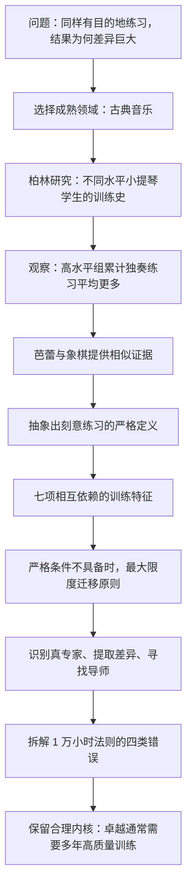
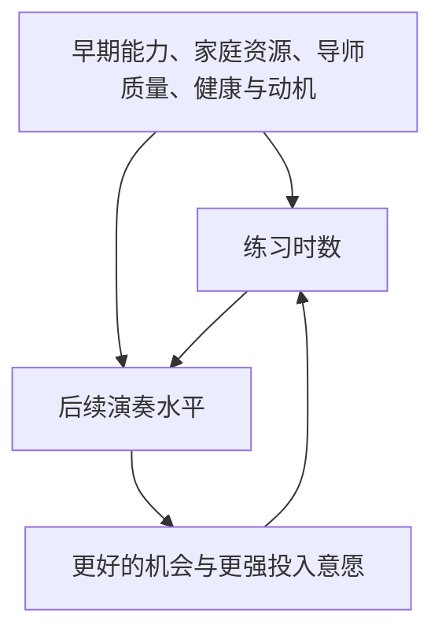
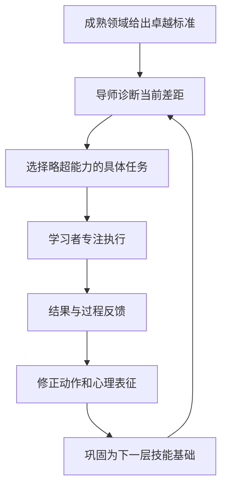
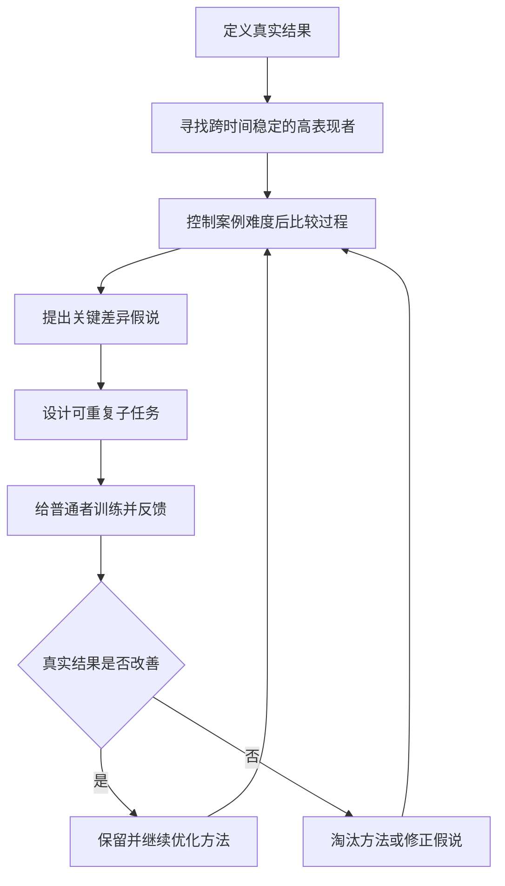

> **原书章节**：第 4 章“黄金标准”<br>
> **英文核心概念**：Deliberate Practice<br>
> **原文来源**：《刻意练习：如何从新手到大师》<br>
> **本章任务**：在“有目的的练习”之上给出刻意练习的严格定义，说明为什么成熟领域、可靠的卓越标准、经过验证的训练方法和合格导师不可缺少；同时说明严格刻意练习无法直接实施时，怎样尽可能迁移其原则。<br>
> **阅读提醒**：本章既肯定长期训练的重要性，也明确反对把训练压缩成“累计 1 万小时必成专家”。时间只是训练发生的载体，训练内容、质量、顺序、反馈和领域条件共同决定结果。

---

## 一、本章要解决什么问题

### 1. 有目的的练习究竟还缺什么

第 1 章已经提出有目的练习的四项条件：具体目标、专注、反馈、走出舒适区。雷妮与史蒂夫却说明，即使两个人都认真训练，结果仍可能相差巨大：雷妮在约 20 位数字附近停滞，史蒂夫达到 82 位。

第 4 章从这个差异出发追问：

1. 学习者怎样知道自己努力的方向是正确的？
2. 谁来判断当前最需要修正的薄弱环节？
3. 为什么某些领域能稳定培养一代又一代高手，另一些领域只能依靠个人摸索？
4. 教练和成熟训练传统究竟增加了什么？
5. 在管理、教学等缺少统一标准的领域，如何借用刻意练习原则？
6. 练习时长与卓越之间是什么关系，为什么“1 万小时”不是科学阈值？

### 2. 本章的中心结论

> **刻意练习是一种特殊的有目的练习：它发生在已有可靠卓越标准和成熟训练体系的领域，由熟悉专家表现与发展路径的导师针对学习者当前水平设计任务，要求学习者在舒适区外专注练习，获得具体反馈，持续修正动作和心理表征，并按依赖顺序逐步构筑更高层技能。**

这个定义包含两个容易被口号抹掉的核心：

- 练习者不是独自猜测“怎样变好”，而是继承领域数十年或数百年的有效试错结果；
- 训练不是累计任意活动时间，而是持续修改制约当前表现的具体能力。

### 3. 全章论证路线



### 4. 本章的关键逻辑层次

| 层次 | 本章回答 | 不能越级推出 |
| --- | --- | --- |
| 描述 | 高水平小提琴家和芭蕾演员平均报告了更多专项练习 | 某个具体人多练必然成为世界级专家 |
| 机制 | 专项任务、反馈、导师和心理表征使练习更有效 | 时长本身就是全部因果机制 |
| 定义 | 严格刻意练习需要成熟领域和合格导师 | 所有努力、专注或困难活动都叫刻意练习 |
| 迁移 | 开放领域可尽量借用专家识别和反馈原则 | 任何领域都已具备同等可靠训练方法 |
| 时间尺度 | 卓越通常需要多年累积 | 存在跨领域统一的 1 万小时临界点 |

### 5. 先区分四种活动

| 活动 | 直接目标 | 是否要求成熟方法 | 是否要求导师设计 | 典型局限 |
| --- | --- | --- | --- | --- |
| 工作或表演 | 完成任务、服务客户或展示现有能力 | 否 | 否 | 主要调用已会技能，弱点出现频率不可控 |
| 天真的练习 | 重复完整活动，期待自然进步 | 否 | 否 | 容易自动化旧错误 |
| 有目的的练习 | 主动设目标、专注、反馈、挑战边界 | 否 | 否 | 学习者可能不知道正确方向 |
| 刻意练习 | 按成熟领域的发展知识，针对弱点构筑专家能力 | 是 | 严格定义下是 | 成本高、领域适用条件苛刻 |

集合关系是：

$$
\text{刻意练习}\subset\text{有目的的练习},
$$

但工作、表演和有目的练习之间并非简单包含关系。一场演出也可能带来反馈，却不因此自动成为刻意练习。

---

## 二、开篇：为什么训练细节比神奇时数更重要

### 1. 从史蒂夫到新一代记忆选手

史蒂夫经过约 200 次训练达到 82 位随机数字。后来，记忆竞赛参与者借鉴前人的编码和检索方法，成绩继续提高。书中写作时：

- 至少 5 人能记住 300 位或更多数字；
- 数十人能记住至少 100 位；
- 2015 年 11 月，Tsogbadrakh Saikhanbayar 在一项比赛中记住 432 位数字，约为史蒂夫纪录的 5 倍。

这些数字属于书中所述的历史时间点，不是 2026 年实时纪录。它们在论证中的作用是展示：后来者获得已有方法后，可以从更高起点训练。

### 2. 为什么“更刻苦”解释不了全部差异

雷妮同样认真，却没有建立像史蒂夫那样可扩展的检索结构；后来的记忆选手又采用比史蒂夫更系统的图像编码和记忆宫殿。

因此，更完整的关系是：

$$
\text{训练结果}
=F(\text{投入量},\text{任务设计},\text{方法},
\text{反馈},\text{既有表征},\text{个体条件}).
$$

时长很重要，但相同时间可以用于表演、机械重复、低效试错或高密度纠错，学习产出并不等价。

### 3. “黄金标准”是什么意思

作者把刻意练习称为黄金标准，不是说它适用于一切情境，也不是说其他学习方式毫无价值，而是说：

> 在目标是持续提高可测专业表现、且领域具备成熟训练知识时，刻意练习是目前最有系统依据的训练设计基准。

黄金标准是一种比较基准。具体领域仍要根据风险、年龄、资源和任务性质修改实施方式。

---

## 三、从音乐领域开始

### 1. 为什么不能随便选择一个领域研究卓越

要研究“什么训练造就高手”，研究者必须先可靠判断谁更优秀，再比较他们怎样训练。如果表现没有稳定标准，研究可能只是比较谁更有名、更有魅力或更受欢迎。

作者选择古典音乐，是因为它接近一个天然实验室：训练传统长、技能要求清楚、教师体系成熟、竞争激烈、作品与演奏可反复比较。

### 2. 成熟领域的四个条件

#### 2.1 表现存在客观或半客观标准

象棋可用胜负和等级分，计时项目可用时间，音乐虽需专家判断，但音准、节奏、技术控制和风格有长期共享标准。

没有标准，就无法定义误差：

$$
e=P^*-P.
$$

其中 $P^*$ 是目标表现，$P$ 是当前表现。若连 $P^*$ 都无法说明，训练者便不知道什么变化算提高。

#### 2.2 竞争产生持续改进动机

竞争使从业者愿意投入训练，也让微小表现差异产生现实后果。它促进方法传播和淘汰，但竞争本身不保证学习，还可能造成压力、伤病和不健康筛选。

#### 2.3 领域已经积累多年

数十年或数百年的实践使后来者可以继承：

- 基础动作规范；
- 典型发展顺序；
- 常见瓶颈；
- 专项练习；
- 质量标准和错误类型。

成熟不是指知识已经完美，而是有效方法已明显多于个人从零摸索。

#### 2.4 导师把经验转化为训练体系

一部分从业者长期教学，观察许多学生的共同问题，逐渐知道：某个水平应练什么、错误来自哪里、何时提高难度、怎样建立下一层能力。

领域表现和训练方法形成共同演化：


### 3. 为什么古典音乐特别合适

小提琴和钢琴训练已有数百年传统，技术标准明确，学生通常经过长期师徒指导。想进入世界级行列，往往需要约二十年甚至更久的系统训练。

这种领域能让研究者区分：

- 普通参与者与专业学生；
- 优秀、优异和最杰出的学生；
- 学生与已进入顶级乐团的职业音乐家；
- 上课、表演、娱乐演奏与专项独奏练习。

## 3.1 绝好的研究机会

### 1. 研究背景

1987 年，艾利克森在柏林马克斯·普朗克人类发展研究所工作。此前，他研究过服务生记菜单、演员记台词等自发形成的记忆技能，但这些参与者大多没有统一的正式训练体系。

柏林艺术大学的音乐专业提供了新机会：研究者可以观察经过多年正规指导、水平又存在差异的学生。

### 2. 初始研究问题

艾利克森与拉尔夫·克朗普、克莱门斯·特斯克-鲁默尔最初关心的是动机：

> 顶尖学生是否因为更喜欢练习或更愿意投入，因而积累更多训练并达到更高水平？

这个问题后来扩展为：训练活动的类型和累计量，怎样与演奏水平相关？

### 3. 参与者怎样分组

教授先辨认具备国际独奏家潜力的学生，最初给出 14 人；因语言和个人情况，最终研究 10 名“最杰出”学生，其中 7 名女性、3 名男性。

研究还包括水平较低但仍非常优秀的学生组。全章后续分析使用三组、共 30 名音乐学生：

- 最杰出的小提琴表演学生；
- 优异的小提琴表演学生；
- 主要准备从事音乐教育的学生。

此外，研究者从柏林爱乐乐团和柏林广播交响乐团招募 10 名中年职业小提琴家，作为已达到高水平职业表现的参照。

### 4. 为什么这样的样本有价值

所有学生都已通过严格选拔，基础水平远高于普通初学者。若在这个高水平、范围较窄的样本中，训练史仍与组别有明显关系，就不容易用“只有没天赋的人才需要多练”解释。

但样本也有范围限制：研究结论首先适用于已进入精英音乐教育体系者，不能直接代表随机儿童或所有成年人。

### 5. 教授分组的优点与风险

教授长期观察学生，能够综合音准、控制、曲目和发展潜力；但“潜力”仍是主观判断，可能受到声望、师生关系、性别或既有机会影响。

因此，教授分组提供专业标准，却不等同于完全客观测量。职业乐团样本和练习史比较提供了补充参照。

## 3.2 学小提琴，难在哪儿

### 1. 音准控制

小提琴指板没有吉他那样的琴格。手指必须直接落在连续指板的正确位置，微小偏差就会改变音高。原书用约 1.59 毫米说明位置精度；实际容许偏差随弦长、把位、音高和听觉标准变化，这个数字应理解为量级示例。

学生不仅要按准一个音，还要在不同琴弦和把位间快速、稳定移动，并根据听觉反馈微调。

### 2. 揉弦与左手控制

揉弦要求指尖围绕音高中心有控制地滚动，改变音高和音色。它不是随意抖动，而要控制幅度、速度、连续性和音乐语境。

### 3. 运弓与右手控制

弓毛与琴弦反复黏滑使琴弦振动。演奏者要同时控制：

- 弓压；
- 弓速；
- 接触点；
- 弓与弦的角度；
- 不同弓法的起止和衔接。

压力过大可能产生刺耳声，过小则声音虚弱；可接受范围又随琴弓距琴马的位置变化。

### 4. 多种弓法与双手协调

平滑运弓、断弓、跳弓等十多类技巧，会产生不同发音。右手弓法必须与左手音位、换弦和揉弦精确同步。

复杂性不是技能数量简单相加，而是组合爆炸：同一个音符在不同速度、力度、弓法和乐句中需要不同控制。

### 5. 标准化训练怎样降低摸索成本

成熟小提琴教学能明确告诉学生：

- 基础持琴和运弓方式；
- 当前阶段适合的音阶和练习曲；
- 哪种错误会妨碍未来技巧；
- 应先掌握什么，再进入什么；
- 如何从声音和动作判断偏差。

学生仍需投入大量努力，但不必独自发明完整技术体系。

### 6. 典型训练制度

研究中的学生平均约 8 岁开始练琴，已有十年以上经验。常见制度是：

1. 每周与导师上课约一小时；
2. 导师评估当前表现；
3. 确定近期改进目标；
4. 布置下一周专项作业；
5. 学生独自高强度练习；
6. 下次课程检查并调整。

用功的 10 至 11 岁学生每周练习约 15 小时并非罕见，之后还会增加。

### 7. 为什么这里能区分上课与学习

学生上课时间大体相近，主要差异发生在课间如何落实作业。导师提供诊断、任务和反馈，能力改变则需要学生在大量独自练习中反复执行和修正。

这为研究“专项独奏练习时间与水平”的关系提供了相对清楚的场景。

---

## 四、最杰出的人，练习时间最长

### 1. 研究怎样测量练习

研究者对 30 名学生进行详细访谈，回顾：

- 开始学音乐的年龄；
- 不同年龄每周独奏练习时数；
- 导师经历和比赛成绩；
- 各类音乐活动对提高水平的重要性；
- 最近一周各类活动时间。

随后要求学生连续一周写时间日记，记录超过 15 分钟的睡眠、用餐、上课、学习、独奏练习、合练和演出等活动。

### 2. 为什么同时使用回顾和日记

- 回顾估算覆盖多年，能计算累计量，但容易记错；
- 一周日记更精确，却可能不代表整个成长史；
- 两种方法相互校验，可检查当前训练模式是否与回忆相符。

这叫**方法三角验证**：不同测量各有偏差，一致结果比单一来源更可信。

### 3. 哪类活动被认为最有价值

三组学生大体一致认为，独奏练习对提高演奏水平最重要；合练、上课、独奏演出、听音乐和音乐史也有帮助。充足睡眠同样重要，许多人夜间长睡并在下午小睡，以恢复高强度练习消耗。

### 4. “不喜欢练习”说明什么

学生普遍把最有助提高的活动评价为艰苦且不太愉快，听音乐和睡眠是例外。这说明专项训练的即时体验并不是坚持的唯一奖励。

但原书进一步说“没有学生动机更强”并不严谨。相同的主观愉悦评分不能排除目标承诺、自我效能、家庭支持、职业期待和延迟满足方面的动机差异。练习时数本身也可能体现持续动机。

最稳妥结论是：顶尖组的优势不能简单解释为“他们天生更享受艰苦练习”。

## 4.1 练习时间是最重要的差别

### 1. 三组累计时数

研究根据回顾估算，计算学生 18 岁前的累计独奏练习：

| 组别 | 平均累计独奏练习 |
| --- | ---: |
| 音乐教育学生 | 3420 小时 |
| 优异小提琴学生 | 5301 小时 |
| 最杰出小提琴学生 | 7401 小时 |

10 名职业乐团小提琴家估计自己 18 岁前平均练习 7336 小时，与最杰出学生组接近。

这些是组平均值，不是每个人的门槛。

### 2. 组间梯度说明什么

结果呈现单调关系：

$$
\overline T_{\text{音乐教育}}
<\overline T_{\text{优异}}
<\overline T_{\text{最杰出}}.
$$

而职业乐团组早期练习量接近最杰出学生组。这与“长期专项练习支持高水平发展”的假设一致。

### 3. 差距何时拉开

三组最大的累计差异出现在青春期前和青春期。这个阶段，学业、社交和其他兴趣竞争时间；能保持或增加高质量练习者，后来更可能进入最高组。

这说明长期发展不仅取决于某一次训练强度，还取决于能否跨过多个生活阶段持续投入。

### 4. 研究支持的两个结论

1. 样本中没有几乎不练却达到精英学生水平的“捷径型神童”；所有组都累计了数千小时。
2. 在已经很优秀的音乐学生内部，平均练习更多的组，演奏水平也更高。

### 5. 为什么不能直接说“时数造成水平”

研究不是随机分配练习时数。可能存在：



因此，练习与水平可能同时包含：

- 练习提高能力的正向因果；
- 表现好使学生更愿练、更获支持的反向因果；
- 家庭、导师和机会等共同原因。

### 6. 回顾性估算的边界

学生从童年开始的时数依赖多年回忆。固定日程可能帮助估算，但仍会出现：

- 记忆误差；
- 按当前身份重构过去；
- 不同人对“练习”的口径不同；
- 组平均掩盖个体重叠；
- 一周日记无法验证十年总量。

结果是重要相关证据，不是精确到个位小时的计量。

### 7. “练习时间是最重要差别”的准确边界

它指研究测量的变量中，累计独奏练习是最显著的组间差异，不是宇宙中只有这一项因素。原书也承认导师质量等未纳入变量会影响进步。

更准确地说：

> 在高度筛选、训练传统相近的小提琴样本中，累计专项独奏练习与演奏水平组别呈强而有序的关系。

## 4.2 来自芭蕾舞演员的证据

### 1. 为什么需要第二领域

若相同关系只在小提琴出现，可能是音乐特例。芭蕾同样有长期训练体系，却包含更明显的身体技能，可以检验跨领域一致性。

### 2. 样本与测量

研究对象来自莫斯科大剧院芭蕾舞团、墨西哥国家芭蕾舞团，以及美国的波士顿芭蕾舞团、哈莱姆舞剧院和克利夫兰芭蕾舞团。

研究者调查：

- 开始训练年龄；
- 每周在导师指导下的舞蹈房专项练习；
- 练习累计量。

排练和正式表演被排除，因为它们主要整合和展示已有能力，不等同于专门修正弱点的训练。

### 3. 怎样衡量舞者水平

研究使用两个较粗指标：

- 所在舞团的大致层级：地区、国家或国际；
- 在舞团内部的位置：群舞、独舞、首席等。

这些指标能提供职业结果，却受舞团声誉、岗位数量、选角、身体条件和机会影响。

### 4. 结果与原文转写问题

报告的累计专项练习与舞者达到的职业高度密切相关，练习更多者通常更优秀，不同国家达到某水平所需时长没有显著差异。

当前原始 Markdown 写“20 岁前平均超过 10 万小时”，这在时间上几乎不可行，也与本章及原研究语境冲突，应是数字转写错误；合理读法是**约或超过 1 万小时**。因此不能把“10 万”作为研究结果引用。

### 5. 能够推出什么

- 专项练习量与芭蕾职业水平也呈关系；
- 练习和表演必须区分；
- 长期训练规律不只出现在知识或音乐技能中；
- 没有观察到几乎不训练便进入顶尖组的明确个案。

### 6. 不能推出什么

- “唯一重要因素”是过强表述，身体比例、年龄、伤病、营养、师资和选拔都会影响芭蕾发展；
- 粗糙职业等级不能完全测量艺术和技术质量；
- 回顾问卷仍有误差；
- 幸存者样本不包括因伤、资源不足或其他原因退出的人；
- 相关关系不能证明相同训练会让随机个体达到相同高度。

### 7. 国际象棋的多年尺度

书中补充，国际象棋大师通常经历接近十年的系统研究。博比·菲舍尔在成为大师前也已钻研约九年；后来训练方法进步，使棋手可能更早取得头衔，但依然需要多年训练。

这支持“复杂专家技能没有速成捷径”，而不是证明所有领域共享同一年数。

### 8. 三类证据合在一起说明什么

小提琴、芭蕾和象棋共同具备：

- 可识别的高水平表现；
- 多年训练传统；
- 递进技能顺序；
- 导师与专项任务；
- 高水平者的大量累计训练。

它们提供了定义刻意练习的经验基础，但尚未证明练习是卓越的唯一原因或充分条件。

---

## 五、刻意练习是什么

### 1. 为什么需要严格定义

“刻意练习”很容易被泛化成“认真练”“吃苦练”或“离开舒适区”。如果任何努力都符合定义，这个概念就无法解释为什么某些训练更有效，也无法被证伪。

严格定义必须排除：

- 机械重复；
- 只做完整工作；
- 没有可靠目标标准的自我挑战；
- 只听课不练习；
- 只接受评价却不调整；
- 很辛苦但强化错误动作的活动。

### 2. 核心定义

**刻意练习**是在已有可靠卓越标准和成熟训练知识的领域中，由了解专家表现及技能发展路径的合格导师，依据学习者当前水平设计并监管的个体化训练；训练聚焦具体表现成分，要求高度专注、略超当前能力、获得反馈并反复修正，同时构建支持下一层技能的心理表征。

可写成一组联合条件：

$$
DP=M\land E\land C\land G\land A\land F\land R\land S,
$$

其中：

- $M$：mature domain，成熟领域；
- $E$：expert instruction，合格导师与已验证方法；
- $C$：challenge，可恢复的能力边界挑战；
- $G$：specific goal，具体目标；
- $A$：attention，有意识专注；
- $F$：feedback and adjustment，反馈与调整；
- $R$：mental representation，心理表征的创建和使用；
- $S$：sequenced skill building，按依赖顺序构筑技能。

这里的合取关系表示：缺少某项时，活动可能仍有效，但不再完全符合本章严格意义上的刻意练习。

## 5.1 不只是有目的的练习

### 1. 第一项新增条件：成熟领域

严格刻意练习要求领域中：

- 杰出者确实稳定优于新手；
- 卓越表现能够可靠测量；
- 多代从业者积累了发展知识；
- 已知一批能提高目标能力的训练任务。

音乐、芭蕾、国际象棋、体操、花样滑冰和跳水较符合。园艺爱好、许多管理或咨询工作则缺少统一竞争、稳定结果或成熟训练路径。

### 2. 第二项新增条件：合格导师

导师不只是鼓励者。他应当知道：

- 专家具体强在哪里；
- 当前学生和目标之间缺什么；
- 哪项基础是后续技能前提；
- 哪种练习能暴露和修正该缺口；
- 何时调整难度或换方法。

有目的练习由学习者自行搜索，刻意练习则利用领域已积累的发展地图和导师诊断。

### 3. 方向与路径都要已知

有目的练习知道“我要提高”；刻意练习还尽量知道：

- 目标表现是什么；
- 目标与当前差距在哪里；
- 哪条训练路径最有证据；
- 下一步具体做什么。

这减少把多年投入浪费在局部有效、不可扩展或有害的方法上。

### 4. 边界领域如何判断

领域并非只有“成熟/不成熟”二元状态。可以评估成熟度：

| 维度 | 高成熟 | 低成熟 |
| --- | --- | --- |
| 表现标准 | 可靠、可重复、与真实结果一致 | 声望和主观印象为主 |
| 专家差异 | 多次任务中稳定出现 | 换情境便消失 |
| 训练历史 | 多代积累并持续改进 | 主要依靠个人经验 |
| 反馈速度 | 快、具体、可归因 | 延迟、嘈杂、多因素 |
| 导师知识 | 能诊断和设计任务 | 只能给一般建议 |

越接近高成熟端，越能实施严格刻意练习；越接近低成熟端，越应说“运用刻意练习原则”。

## 5.2 刻意练习的特点

### 1. 特点一：训练的是已有改进方法的技能

#### 要解决的问题

学习者不知道哪些努力会真正改变表现。

#### 直觉含义

不要从零发明钢琴指法或体操进阶，而要继承前人验证过的方法。

#### 严格条件

训练任务与目标技能之间应有重复观察、教学经验或实验支持，而不是只靠流行度。

#### 边界

“传统方法”也可能过时。成熟体系仍需用结果更新，不能把权威当证据。

### 2. 特点二：发生在舒适区之外

#### 要解决的问题

已自动化任务只维持现有能力。

#### 直觉含义

持续尝试刚好超过当前稳定水平的动作或判断。

#### 严格条件

任务难度 $D$ 应略高于当前稳定能力 $C$，同时错误仍可诊断：

$$
D>C,\qquad D-C\text{ 处于可恢复、可纠错范围}.
$$

#### 边界

原书说“近乎最大努力”不能理解为每次训练到耗竭。过载会造成错误固化、伤病和倦怠，恢复是训练的一部分。

### 3. 特点三：具有明确定义的具体目标

#### 要解决的问题

“整体变好”不能指导下一次行动。

#### 直觉含义

把大目标拆成当前可观察、可改变的一项表现成分。

#### 严格条件

目标要说明任务、条件、成功标准和测量方式。例如不是“提高小提琴水平”，而是“在给定速度下稳定完成某换弦片段，并满足音准与弓法标准”。

#### 边界

窄指标可能被钻空子。速度目标必须同时设置准确率、技术和安全守门条件。

### 4. 特点四：有意而为并完全专注

#### 要解决的问题

自动重复无法感知微小偏差。

#### 直觉含义

练习者知道本轮在改什么，持续监测相关线索，并根据结果主动调整。

#### 严格条件

仅照做教练指令不够。学习者必须保持目标、觉察过程、比较标准并控制下一次尝试。

#### 边界

注意力会疲劳。较短、高质量练习通常优于长时间分心；已经稳定的底层动作不必始终被显式控制。

### 5. 特点五：包含反馈以及基于反馈的调整

#### 要解决的问题

学习者不知道哪里错、为什么错、下一步改什么。

#### 直觉含义

反馈必须进入下一轮动作，而不是停在分数或评价。

#### 严格条件

闭环为：

$$
\text{尝试}\rightarrow\text{测量偏差}
\rightarrow\text{诊断原因}\rightarrow\text{改变动作}
\rightarrow\text{再次尝试}.
$$

早期反馈多来自导师，后期学生逐渐学习自我监测。

#### 边界

反馈可能错误或嘈杂。需检查评价者一致性、指标有效性和结果是否受运气影响。

### 6. 特点六：既依靠又创建心理表征

#### 要解决的问题

没有内部目标模型，学习者只能发现明显错误，无法理解复杂偏差。

#### 直觉含义

更好的表征让人看见更多问题；修正问题又使表征更精细。

#### 严格条件

表征应支持识别、预测、行动和自我评价，而不是只会复述术语。

#### 边界

表征可能僵化或错误，需要新情境、反例和客观结果持续校准。

### 7. 特点七：在已有技能上有序构筑新技能

#### 要解决的问题

复杂技能有依赖关系，错误基础会在高层被放大。

#### 直觉含义

先建立正确基础，再增加复杂度；随着理解提高，还可能在更高层重新学习基础动作。

#### 严格条件

导师应识别技能图中的先决条件，并安排渐进序列：

$$
s_1\rightarrow s_2\rightarrow\cdots\rightarrow s_n,
$$

其中高层技能 $s_{i+1}$ 依赖较稳定的 $s_i$。

#### 边界

路径并非永远线性，不同个体可能需要回退、并行训练或采用不同顺序。

### 8. 七项特征怎样形成整体



七项不是可随意勾选的独立技巧，而是一个控制系统。成熟标准提供方向，导师提供任务，专注产生可观测过程，反馈校正方向，表征和技能按层累积。

### 9. “不愉快”是不是定义条件

刻意练习往往费力、需要高度集中，学生通常不会把它当作娱乐。但主观痛苦不是质量指标，也不是必须追求的目标。

有人可能享受挑战，某些练习也可以有趣。定义关键是任务是否针对弱点并产生可校正挑战，而不是练习者是否难受。

---

## 六、如何运用刻意练习原则

### 1. 为什么严格适用范围有限

音乐、棋类、芭蕾和部分体育项目有稳定标准与成熟教练体系。企业管理、教学、咨询和许多工程工作则面临：

- 目标多元且可能冲突；
- 结果延迟；
- 环境持续变化；
- 因果受团队和运气影响；
- 很难统一判断谁真正卓越。

在这些领域，不能假装已有一条可靠专家路径，但可以逐步逼近严格条件。

## 6.1 最大限度地运用刻意练习原则

### 1. 史蒂夫为什么不属于严格刻意练习

史蒂夫开始训练时：

- 没有已知能稳定记住 40 至 50 位数字的成熟群体；
- 已知纪录大多不超过约 15 位；
- 没有经过验证的训练课程；
- 没有掌握该技能发展路径的导师。

他采用的是高质量有目的练习和反复试错，而不是继承成熟训练体系。

### 2. 一个领域怎样从个人探索走向可传承方法

史蒂夫证明可能性并记录方法后，后来者可以：

1. 研究他的编码和检索结构；
2. 与其他高手方法比较；
3. 保留有效共同原则；
4. 发展更快、更可扩展的系统；
5. 把方法传播给下一代。

当标准、专家群体、训练知识和教练逐步形成，一个原本不成熟的任务会更接近可实施刻意练习的领域。

### 3. 王峰的数字记忆系统

书中介绍王峰在 2011 年世界脑力锦标赛中，按每秒一位的速度听取并记住 300 位数字。

其系统包括：

- 为 `00` 至 `99` 的每个两位数组合建立固定图像；
- 准备一条按固定顺序访问的空间路线，即记忆宫殿；
- 每四位数字转换成两幅图像；
- 把两幅图像组合成夸张场景，放在路线的一个位置；
- 回忆时沿路线访问场景，再反向解码数字。

例如四位数字可拆成两个两位数，各自对应人物或物体，再通过动作绑定。核心不是某个具体图像，而是编码必须稳定、快速且可逆。

### 4. 记忆宫殿解决什么问题

**记忆宫殿或地点法**用熟悉空间位置作为有序检索线索：

$$
(l_1,l_2,\ldots,l_n)
\leftrightarrow
(x_1,x_2,\ldots,x_n),
$$

其中 $l_i$ 是固定地点，$x_i$ 是待记图像。空间顺序解决项目次序，预编码图像提高转换速度。

### 5. 为什么书中仍谨慎说它不完全是刻意练习

按作者写作时的判断，记忆比赛已有方法和客观成绩，但统一导师体系仍不如古典音乐成熟。参与者常从书籍、访谈和同行经验自学。

领域会演化。如果后来出现可靠教练、标准化进阶任务和稳定培养记录，某些记忆训练可以更接近严格定义。分类应依据实际条件，而不是永久标签。

### 6. 最大限度迁移的基本路线

当严格体系不存在时：

1. 用可靠指标辨认持续表现卓越者；
2. 研究他们与普通者的可重复差异；
3. 追踪其训练过程，而非只模仿外在习惯；
4. 把关键差异拆成可练子技能；
5. 设计具体任务、反馈和递进；
6. 用结果验证训练是否真能缩小差距；
7. 持续淘汰无效方法。

这是一项训练研发过程，而不是先假定成功者的一切行为都值得模仿。

## 6.2 确定谁是杰出人物

### 1. 为什么专家识别是第一道难关

若选错榜样，后续差异分析和训练设计都会沿错误方向发展。名气、职位和自信不能代替可重复表现。

### 2. 可靠专家标准的三个属性

#### 有效性

指标确实测量目标结果。例如教师水平应与学生长期学习增长相关，而不只是课堂受欢迎程度。

#### 可靠性

同一个人在相似任务中应表现相对稳定，不因一次评分剧烈变化。

#### 可比较性

需要调整任务难度和环境。治疗复杂病例的医生不能只按原始死亡率与只处理简单病例者比较，这叫**风险或案例组合校正**。

### 3. 主观判断常见偏差

人们容易把以下因素误当专业能力：

- 学历；
- 年资；
- 职位与声望；
- 友善和魅力；
- 自信表达；
- 性别、外貌和既有名气。

即使音乐评审，也可能受演奏者身份和视觉信息影响。因此，盲评、多位评审和明确量表更可靠。

### 4. 葡萄酒评审实验

罗伯特·霍奇森在 2005 至 2008 年加州博览会葡萄酒比赛中，把同一种酒的三个盲样混入每位评委约 30 个样本中。

若评审稳定，三个相同样本应得到接近分数。实际常出现围绕某分数上下约 4 分的波动，例如同一酒可能依次得到 91、87、83 分，足以跨越金牌、铜牌或无奖等级。

有些评委某一年较一致，但没有人连续四年都保持一致。

### 5. 这个实验能证明什么

- 在该比赛、该品鉴负荷和评分条件下，许多评委的**重测可靠性**不足；
- 专业身份不保证每次都稳定区分细微品质；
- 以单次评分识别杰出酒或杰出评委风险很高。

### 6. 它不能证明什么

- 不能证明所有葡萄酒知识和感官训练都无效；
- 不能排除连续品尝造成的疲劳、顺序和适应效应；
- 可靠性不足不等于评委完全没有平均辨别能力；
- 不能从一个比赛直接推广到所有品鉴任务。

这个案例的核心是：先验证评价者和指标本身，再用它们定义专家。

### 7. 其他“专家”警示

原书提及：

- 某些研究中，持证精神科医生或心理学家的治疗结果未显著优于较少训练者；
- 金融专家选股可能不稳定，甚至不优于随机；
- 一些资深医生在客观知识或绩效指标上不如较年轻医生。

这些是对“资格等于卓越”的警告，不应泛化为所有心理治疗、金融分析或临床经验都无效。每项结论都依赖具体任务、结果指标和研究质量。

### 8. 没有直接指标时怎样逼近

可以组合：

- 经风险调整的长期结果；
- 真实作品或代码的盲评；
- 多名密切合作者的比较评价；
- 困难案例中的求助和转诊网络；
- 标准化模拟；
- 客户或学生结果，而非满意度单项；
- 跨时间、跨情境稳定性。

同行意见要问清依据：评价者观察过多少可比案例，是否亲眼看到过程，是否知道最终结果。

## 6.3 找出杰出人物和其他人的差别

### 1. 为什么“观察高手”仍不够

高手的关键优势常在心理表征、线索选择和候选生成中，外部只看见最终动作。高手本人也可能因过程自动化而说不清原因。

模仿其作息、工具或说话方式，容易复制相关但非因果的表面特征。

### 2. 差异分析的步骤

1. 让高手和普通者完成相同、可比较的代表性任务；
2. 记录输入、过程、选择、时间和结果；
3. 在关键点暂停，要求预测下一步；
4. 使用思维出声、眼动、录像或操作日志；
5. 比较他们注意哪些线索、忽略哪些信息；
6. 检验候选差异是否稳定预测结果；
7. 把差异转成可训练任务；
8. 用干预验证学习该差异是否真能提高表现。

前六步发现相关机制，第七、八步才把观察变成训练证据。

### 3. 心理表征为何特别难观察

史蒂夫和王峰都能记大量数字，表面动作只是听和复述。艾利克森之所以能比较方法，是因为：

- 长期收集有声思维和事后报告；
- 操纵数字速度和长度；
- 检验分组与检索假说；
- 已研究多个记忆专家，拥有比较框架。

多数行业还没有这种细致过程知识，因此“找出差别”常是训练研究最难的一步。

### 4. 专家访谈的价值与局限

与高手交谈可以获得候选假说，但自动化过程可能无法言语化，成功者也会事后合理化。访谈需要与真实任务观察和结果操纵结合。

### 5. 帕沃·鲁米的训练创新

芬兰长跑运动员帕沃·鲁米在 20 世纪 20 至 30 年代于 1500 米至 20 千米项目创造 22 项世界纪录。其优势与新的训练方法相关，包括：

- 用秒表精确控制步速；
- 采用间歇训练提高速度；
- 使用全年训练制度保持连续性。

其他运动员采用类似方法后，整体成绩提高。这比只模仿冠军外观更有价值，因为训练方法能被传播并产生群体改进。

### 6. 成功者行为不等于成功原因

杰出人物也会做许多与卓越无关的事。差异只有满足以下条件才更像因果机制：

- 与目标表现有合理机制关系；
- 在多位高手中重复出现；
- 普通者学习后表现改善；
- 去掉该成分后表现下降；
- 不是由资源或选择偏差完全解释。

### 7. “管用就继续，不管用就停止”的边界

这个原则强调实验性，但不能只看短期感觉。有些技能改进延迟，有些方法初期提高测试分却损害长期迁移。应预先定义观察周期、结果指标和停止规则。

## 6.4 最佳方法是找到优秀导师

### 1. 导师为什么能节省多年试错

导师拥有多名学习者的纵向经验，知道个人仅凭一次成长经历很难知道的规律：常见错误、发展顺序、平台原因和任务剂量。

### 2. 累积技能为什么尤其需要导师

钢琴手型在简单曲目中即使不理想也能勉强应付，但复杂曲目会暴露限制。早期错误一旦自动化，之后重建成本更高。

导师的价值是识别“现在看似无害、未来会成为瓶颈”的基础问题。

### 3. 优秀反馈关注思维过程

数学教师不只检查答案，还要观察学生怎样表征题目、为何选择某方法、在哪一步产生错误。两个相同错误答案可能来自不同问题：概念误解、计算失误或计划缺失，训练任务也应不同。

### 4. 怎样判断导师是否优秀

- 学生在可测表现上持续进步；
- 能解释训练任务与目标差距的关系；
- 根据学生反馈调整，而非人人同一模板；
- 关注过程和心理表征；
- 知道何时转介给更适合的导师；
- 不把痛苦、服从或依赖当作进步；
- 尊重安全、伦理和学习者自主性。

### 5. 导师的局限

导师可能使用过时方法、存在利益冲突或只擅长某水平。学习者仍要用结果校验指导，并可在不同阶段更换或组合技术、策略和心理支持型导师。

---

## 七、1 万小时法则的错与对

### 1. 说法从哪里来

1993 年，艾利克森、克朗普和特斯克-鲁默尔发表柏林小提琴研究。2008 年，马尔科姆·格拉德威尔在《异类》中用“1 万小时法则”概括多个成功故事，包括小提琴学生、披头士和比尔·盖茨。

这个说法传播力强，因为它：

- 是整数，容易记；
- 把复杂发展压缩成一个计数器；
- 看似公平、明确且可执行；
- 满足人们寻找单一因果规则的偏好。

问题在于，传播版本增加了原研究没有证明的阈值、普适性和成功保证。

## 7.1 错在哪里

### 1. 错误一：把经验平均数当成神奇阈值

前文数据是最杰出学生在 18 岁前平均约 7401 小时。当前原始 Markdown 在本节出现“740 小时”，显然遗漏一个数量级，应按同章前文理解为约 7400 小时。到 20 岁约 1 万小时，是继续练习后的估算，并非实验发现的临界点。

如果 9999 小时和 10000 小时之间没有可识别机制突变，1 万就不是自然阈值。

### 2. 领域与标准不同，所需时间不同

- 史蒂夫约 200 小时成为当时数字广度纪录保持者；
- 世界级钢琴比赛获奖者到 30 岁左右可能累计 2 万至 2.5 万小时；
- 不同领域的基础复杂度、训练方法和“专家”门槛都不同。

因此不存在统一函数：

$$
\forall d,\quad T_d=10000.
$$

### 3. 错误二：把组平均数当成个体门槛

最杰出组的 1 万小时是平均估计，组内有分布；书中指出，10 名最杰出学生中约一半在 20 岁时并未达到 1 万小时。

从

$$
\overline T_{\text{杰出组}}\approx10000
$$

不能推出

$$
\forall i\in\text{杰出组},\quad T_i\ge10000.
$$

把群体均值套到每个个体，是平均数误用。

### 4. 错误三：把所有活动时间都算成同一种练习

柏林研究关注专注、针对提高的独奏练习。上课、合奏、演出、娱乐演奏和听音乐不能按小时一比一替换。

活动时间 $T$ 更合理地拆为：

$$
T=T_{\text{专项训练}}+T_{\text{表演}}
+T_{\text{工作}}+T_{\text{娱乐}}+T_{\text{其他}}.
$$

只有第一项最接近研究中的刻意练习，其他活动可能有价值，但机制不同。

### 5. 披头士案例为什么不能支撑固定时数

格拉德威尔转述披头士在汉堡 1960 至 1964 年演出约 1200 场、累计接近 1 万小时。马克·李维森后来根据更详细史料估计，总演出时长约 1100 小时，远低于 1 万。

更重要的是：

- 演出目标是给观众呈现当前最好水平；
- 刻意练习目标是停下来修正特定弱点；
- 披头士的独特成功还高度依赖列侬与麦卡特尼的创作能力；
- 汉堡演出时数不是歌曲创作专项训练的直接测量。

即使演出确实改善了舞台配合，也不能把它全部当作解释创作成就的刻意练习。

### 6. 错误四：把相关必要条件误写成充分保证

原研究观察的是已进入精英音乐学院的学生，不是随机抽取儿童并分配 1 万小时训练。

要证明“人人练满 1 万小时都会成为专家”，至少需要：

- 明确定义专家；
- 随机或有力控制起点差异；
- 保证训练质量相同；
- 处理退出、伤病和资源差异；
- 观察所有参与者结果。

原研究没有这种设计。

逻辑上，某因素可能是常见必要条件，却不是充分条件：

$$
\text{世界级表现}\Rightarrow\text{长期高质量训练}
$$

并不等于

$$
\text{长期高质量训练}\Rightarrow\text{世界级表现}.
$$

### 7. 选择与幸存偏差

柏林样本已筛选掉许多早期退出者。能坚持多年并进入学院的人，可能同时拥有较好导师、家庭支持、健康、机会和早期表现。

只观察幸存者，会低估训练路径中的退出成本和个体差异。

### 8. “多练一定多进步”也不成立

当任务太易、方法错误、反馈失真或恢复不足时，更多时间可能只维持平台甚至造成退步。练习的边际收益取决于当前状态：

$$
\frac{\partial P}{\partial T}
=g(\text{任务质量},\text{反馈},\text{恢复},
\text{心理表征},\text{当前水平}).
$$

## 7.2 对在哪里

### 1. 正确内核：复杂卓越通常需要多年

在历史悠久、竞争激烈的领域，世界级表现需要构筑庞大知识、心理表征和精细动作，通常无法速成。

作者列举：

- 作家和诗人常在最杰出作品前写作超过十年；
- 科学家从首次发表到最重要成果通常又经历十多年；
- 约翰·海耶斯研究发现，作曲家从开始学习到创作杰出作品平均约二十年，通常不少于十年。

这更接近“十年尺度经验规律”，而非固定小时阈值。

### 2. 为什么几百小时也很有价值

若目标不是世界第一，正确练习几百小时通常已能显著提高。史蒂夫约 200 小时的变化就是例子。

把 1 万小时当作最低入场券会让人放弃本可获得的大量实际改进。合理问题不是“能否成为全球顶尖”，而是“下一百小时能可靠改善什么”。

### 3. 竞争性领域为什么需要极长投入

世界级是相对位置。你比较的不是未经训练者，而是同样投入多年、使用先进方法的竞争者。

设个人绝对水平为 $P_i$，世界级门槛是当代竞争群体的高分位 $Q_t$：

$$
\text{世界级}\iff P_i\ge Q_t.
$$

当训练方法改进时，群体门槛 $Q_t$ 也会上升。多年训练部分是为了追上一个不断移动的标准。

### 4. 代际积累为什么抬高门槛

前一代突破形成新动作和新训练方法，后一代从更高起点学习，再继续创新。因而历史纪录和专家标准不断上升。

这说明当前纪录不是明显终极边界，但不能推出物理、生理极限不存在。准确说法是：很多实际边界仍未知，并随方法和环境变化。

### 5. 个人选择仍受现实条件约束

原书强调“进步多大取决于你自己”，有助于反对宿命论，却容易低估：

- 时间与经济资源；
- 导师和训练设施；
- 身体条件、年龄与伤病；
- 家庭和组织支持；
- 进入高质量比赛和反馈环境的机会。

个人努力是重要可控变量，不是唯一变量。

### 6. 更准确的替代规则

可以把“1 万小时法则”改写为：

> 复杂领域的卓越通常需要多年、数量可观且持续升级的高质量专项训练；所需时间因目标、领域、个体和环境而异，累计时数既不是统一阈值，也不是成功保证。

---

## 八、作者分析问题的方法

### 1. 从前章反例恢复训练质量问题

雷妮和史蒂夫同样努力却结果不同，说明“有目的”仍不够。作者没有再增加一条意志口号，而是寻找能稳定培养高手的领域，研究训练体系本身。

### 2. 选择成熟领域作为自然实验室

音乐领域有标准、竞争、历史和导师，最大限度减少“优秀究竟是什么”的歧义。这个选择提高内部可解释性，却限制结论向开放职业直接推广。

### 3. 同时比较水平、活动类型和累计历史

研究没有只问总训练时间，还区分独奏练习、合练、上课、演出、娱乐和休息。这为后来反驳“所有小时等价”提供基础。

### 4. 用回顾访谈与一周日记交叉验证

长期累计只能回忆，当前细节可以写日记。两者结合比单一问卷好，但仍无法消除十年回忆误差。

### 5. 用第二领域寻找一致性

芭蕾把结论从音乐扩展到身体艺术，象棋又补充规则型认知领域。跨领域一致性支持一般原则，却不能取代各领域的具体因果研究。

### 6. 从经验共同点构造可排除的严格定义

定义加入成熟领域和导师，使“刻意练习”不再等同于任何努力。一个概念只有能排除反例，才有解释力。

### 7. 先承认适用范围，再设计原则迁移

作者不直接把音乐训练照搬到管理，而是提出三步研发路线：识别真高手、找出差异、设计训练。这比把某位 CEO 的习惯当普适模板更谨慎。

### 8. 用测量可靠性反过来检验“专家”标签

葡萄酒实验不讨论谁名气大，而让评委重复评价相同样本。如果自己不能稳定重复判断，就不能轻易把其评分当卓越标准。

### 9. 主动纠正研究的流行误读

作者把平均数、个体分布、活动类型和因果设计逐一分开，说明科学结果怎样在传播中被压缩成过强规则。这种概念清理本身是本章的重要方法论贡献。

### 10. 本章方法的主要局限

- 柏林研究样本小且高度筛选；
- 练习时数主要靠回忆；
- 水平分组部分依赖教授判断；
- 研究是观察性的，不能独立证明因果；
- 原始“刻意练习”测量常以独奏练习时间近似训练质量；
- 芭蕾指标和时数更粗糙；
- 书中个别数字存在转写错误；
- 对基因、资源、文化和退出者讨论有限；
- “黄金标准”在开放、变化快的领域仍需检验。

---

## 九、把本章转化为实践方法

### 1. 先判断能否严格实施刻意练习

用以下问题检查：

1. 目标表现能否稳定、重复测量？
2. 是否存在多次任务中持续卓越的人？
3. 是否知道他们具体强在哪些子技能？
4. 是否有经过长期验证的训练方法？
5. 是否有能诊断并设计任务的导师？

若多数答案是否定，应说“运用原则”，并把建立标准和反馈作为任务本身。

### 2. 严格刻意练习的十步流程

#### 第一步：定义真实目标表现

使用与真实结果一致的指标，不用时数、题量或证书代替能力。

#### 第二步：建立基线

在代表性任务中记录准确率、速度、稳定性、过程和错误类型。

#### 第三步：找到可靠导师

检验导师学生成果、诊断能力、方法解释和伦理，而非只看个人名气。

#### 第四步：建立技能依赖图

明确当前目标依赖哪些基础，避免越级训练。

#### 第五步：定位当前单一主要瓶颈

每轮优先修正最限制表现的环节。

#### 第六步：设计略超能力的专项任务

提高难度但保留可诊断性和安全性。

#### 第七步：专注执行并记录过程

训练时间应以高质量注意为单位，不用疲劳时间凑数。

#### 第八步：获得具体反馈

区分结果反馈和过程反馈，明确下一次调整。

#### 第九步：更新心理表征

记录漏掉的线索、错误预测和新的条件规则。

#### 第十步：验证巩固与迁移

在变化材料和真实任务中检查能力，稳定后再进入下一层。

### 3. 开放领域的训练研发流程



### 4. 示例：训练软件故障诊断

不要把“工作十年”当专家标准。可以：

1. 收集真实故障并按复杂度分层；
2. 比较工程师定位时间、误报率、修复后复发率；
3. 调整系统熟悉度和故障难度；
4. 识别高手先看哪些指标、怎样生成和排除假设；
5. 把日志关联、因果定位和实验验证拆成专项任务；
6. 在模拟环境暂停，让学习者先预测再揭示结果；
7. 由导师反馈假设质量，而不只看是否碰巧修好；
8. 在新系统和新故障中检验迁移。

这比“多值班、多处理工单”更接近刻意练习原则。

### 5. 训练记录模板

```markdown
## 真实表现目标
- 最终要改善的结果：
- 结果指标为何有效、可靠：

## 当前差距
- 基线表现：
- 当前主要瓶颈：
- 它依赖哪些基础技能：

## 本轮专项任务
- 具体目标：
- 难度为何略高于当前水平：
- 成功标准与安全边界：

## 反馈
- 结果差距：
- 过程差距：
- 导师判断及依据：

## 表征更新
- 我漏掉了什么线索：
- 哪个预测错误：
- 新的条件或模式：

## 下一轮
- 保持、提高还是降低难度：
- 要修改的一个关键变量：
```

### 6. 如何避免把时数变成目标

时数适合管理投入，不适合证明能力。建议同时记录：

- 专注训练时数；
- 具体任务；
- 错误类型；
- 反馈来源；
- 重复错误率；
- 新情境迁移；
- 恢复和伤病情况。

时数回答“投入多少”，表现指标回答“改变了什么”。

### 7. 何时停止或调整训练

- 目标已达到且只需维持；
- 指标提高但真实结果不变；
- 反馈不可靠；
- 连续过载、伤病或倦怠；
- 导师方法与证据冲突；
- 领域规则变化使旧表征失效；
- 机会成本超过个人目标价值。

刻意练习是手段，不是道德义务。

### 8. 没有导师时的替代方案

本章仍认为导师最佳，但可暂时使用：

- 经过验证的课程和练习序列；
- 优秀作品与过程录像；
- 同行互评；
- 自动化测试和模拟器；
- 决策日志与录像回看；
- 多位高手访谈；
- 先预测、后比较的案例训练。

这些方法减少盲目试错，却不能完全替代个体化诊断。

---

## 十、核心概念辨析

| 概念 | 严格含义 | 常见误解 |
| --- | --- | --- |
| 黄金标准 | 在成熟领域持续提高表现的训练设计基准 | 适用于一切活动的唯一方法 |
| 成熟领域 | 有可靠表现标准、专家群体、长期训练传统和导师知识的领域 | 只要历史悠久就成熟 |
| 客观标准 | 可重复、与目标结果一致、较少受无关偏见影响的测量 | 只要是数字就客观 |
| 半客观标准 | 依赖专家判断，但有共享规范和较高一致性 | 任意主观喜好 |
| 有目的的练习 | 有目标、专注、反馈并挑战能力的主动训练 | 自动等同于刻意练习 |
| 刻意练习 | 在成熟领域由合格导师按发展知识设计的个体化有目的练习 | 任何辛苦或重复很久的活动 |
| 独奏练习 | 音乐家独自、通常按导师任务改进技术的活动 | 独处演奏的所有时间都同质 |
| 表演 | 在真实场合呈现已有技能 | 只要做得久就等同专项练习 |
| 专项任务 | 为改善某一可测表现成分设计的练习 | 把完整工作再做一次 |
| 合格导师 | 能依据专家标准诊断差距、安排序列并提供反馈的人 | 本人有名或资历长即可 |
| 技能依赖 | 高层技能建立在较稳定基础技能之上 | 所有人必须走完全相同的线性路线 |
| 内部反馈 | 借助心理表征自我检测误差 | 可以完全不需要外部校验 |
| 可靠性 | 重复测量或评价具有一致性 | 指标一定测到了正确目标 |
| 有效性 | 指标真实反映目标表现 | 每次测量都完全一致 |
| 案例组合校正 | 比较绩效时调整任务或对象难度 | 为表现差找借口 |
| 专家标签 | 社会赋予的资历或声望称号 | 必然对应可测卓越表现 |
| 记忆宫殿 | 用稳定空间位置组织有序提取的信息编码法 | 一种通用、无需训练的超能力 |
| 1 万小时法则 | 流行文化对长期专业训练的固定数字概括 | 心理科学中的普适阈值 |
| 组平均 | 一组成员数值的平均水平 | 每个成员都达到该数值 |
| 必要条件 | 结果通常不能缺少的条件 | 单独拥有它就足以产生结果 |
| 充分条件 | 单独满足便保证结果的条件 | 只是与结果相关或常见 |
| 幸存者偏差 | 只观察留下或成功者，忽略退出者 | 成功者的经验完全没有价值 |

---

## 十一、本章完整结论

### 1. 为什么从音乐领域开始

古典音乐具备稳定标准、激烈竞争、长期积累和成熟导师体系，使训练方法与演奏水平能够相对清楚地比较，是研究专家发展的理想自然场景。

### 2. 柏林小提琴研究真正发现了什么

在高度筛选的学生中，水平越高的组，18 岁前平均累计专项独奏练习越多；职业乐团音乐家的早期练习量接近最杰出学生组。结果支持长期高质量练习的重要性，但因观察设计、回忆误差和混杂因素，不能单独证明时数的充分因果作用。

### 3. 芭蕾和象棋证据增加了什么

类似关系出现在身体艺术和棋类中，说明多年专项训练不是小提琴特例。不同领域所需时长和限制仍然不同。

### 4. 刻意练习比有目的练习多什么

它增加了成熟领域的可靠卓越标准、经过积累的有效训练知识、合格导师的诊断和递进安排。学习者不只是努力搜索，而是沿已有发展地图高效搜索。

### 5. 七项特征共同说明什么

刻意练习是由成熟标准、导师、伸展任务、具体目标、专注、反馈、心理表征和技能顺序组成的闭环。任何单项都不能独立代表整体。

### 6. 开放领域怎样运用原则

先验证谁真正卓越，再比较其可重复过程差异，把差异转成训练任务并用干预结果验证。不能直接模仿名人的表面习惯。

### 7. 为什么识别专家如此关键

学历、年资、声望和魅力常与真实表现不一致。指标必须同时考虑有效性、可靠性和任务难度；葡萄酒评审实验展示了专业标签不保证判断稳定。

### 8. 导师为什么仍是最佳路线

优秀导师继承多人、多代的训练经验，能看见当前错误对未来的影响，安排技能顺序，并对心理表征而不只是答案提供反馈。

### 9. 1 万小时法则错在哪里

它把特定样本平均数变成跨领域阈值，把组平均套到个体，把表演等活动与刻意练习混为一谈，并把相关的长期投入改写成人人成功的充分保证。

### 10. 它对在哪里

复杂、竞争性领域的世界级表现通常需要多年高质量训练；竞争者也在长期训练，门槛会随代际方法进步而提高。正确内核是长期主义，不是精确数字。

### 11. 本章不能承诺什么

刻意练习不能保证所有人达到相同水平，也不能消除年龄、身体、资源、机会和伤病约束。它提高训练效率和可控性，却不是无条件成功公式。

### 12. 本章如何引向第 5 章

严格刻意练习只在少数成熟领域完整存在。第 5 章将进一步讨论怎样把它的原则带入企业、医疗和日常工作，让反馈和专项训练成为工作系统的一部分。

---

## 十二、复习问题

1. 为什么雷妮和史蒂夫的差异说明有目的练习还不够？
2. “黄金标准”为什么不等于适用于一切领域的唯一方法？
3. 成熟领域需要哪四项基本条件？
4. 表现标准为什么是发展训练方法的前提？
5. 训练方法与领域最高水平怎样形成共同演化？
6. 古典音乐为什么比许多普通职业更适合研究专家发展？
7. 柏林研究最初想检验什么动机假设？
8. 30 名学生和 10 名职业音乐家分别承担什么比较作用？
9. 小提琴的音准、运弓和双手协调为何需要多年递进训练？
10. 每周一小时上课与大量独奏练习分别承担什么功能？
11. 访谈和一周日记为什么要结合使用？
12. 学生普遍不喜欢艰苦练习，为什么不能推出他们动机完全相同？
13. 3420、5301 和 7401 小时的梯度能说明什么？
14. 为什么这些组平均值不能直接证明练习时数造成演奏水平？
15. 反向因果和共同原因怎样解释部分练习—水平相关？
16. 职业音乐家 7336 小时的数据提供什么补充？
17. 芭蕾研究为什么排除排练和正式表演？
18. 芭蕾“10 万小时”为什么应判断为转写错误？
19. 芭蕾职业层级作为水平指标有什么局限？
20. 国际象棋的多年训练证据为何仍不是统一十年阈值？
21. 刻意练习的严格定义是什么？
22. 它比有目的练习增加哪两个最关键条件？
23. 七项特征为什么必须理解为闭环，而不是独立清单？
24. “走出舒适区”为什么不等于每次近乎耗竭？
25. 具体目标为什么需要同时设置守门指标？
26. 心理表征怎样既是刻意练习的结果，又是工具？
27. 技能依赖顺序为什么使早期导师格外重要？
28. 史蒂夫的训练为什么不符合严格刻意练习？
29. 王峰的两位数图像系统和记忆宫殿各解决什么问题？
30. 一个领域怎样从个人摸索逐渐发展出成熟训练体系？
31. 识别杰出人物时，指标的可靠性与有效性有什么区别？
32. 葡萄酒评审实验能证明什么，不能证明什么？
33. 为什么资历、学历和声望不能单独定义专家？
34. 没有直接绩效指标时，可以怎样三角验证专家水平？
35. 为什么高手自己也可能说不清真正优势？
36. 从成功者差异到有效训练，中间还需要哪一步干预验证？
37. 帕沃·鲁米的例子为什么比模仿冠军作息更有价值？
38. 优秀导师怎样通过学生的错误答案判断心理表征？
39. 1 万小时法则犯了哪四类核心逻辑错误？
40. 为什么组平均数不能成为个体门槛？
41. 披头士的演出时间为什么不能直接解释歌曲创作成就？
42. 长期训练可能是必要条件，为什么仍不是充分条件？
43. 1 万小时说法应保留的合理内核是什么？
44. 世界级门槛为什么会随竞争者和训练方法一起移动？
45. 选择一项你正在学习的技能，判断它是否具备严格刻意练习条件；若不具备，写出你准备怎样逼近这些条件。

---

## 十三、延伸阅读线索

- K. Anders Ericsson、Ralf Krampe 与 Clemens Tesch-Römer（1993）：刻意练习与小提琴专业表现研究。
- 小提琴研究的后续复现、元分析和关于练习贡献比例的争论。
- 芭蕾、国际象棋、体育项目中的累计训练与专业表现研究。
- Robert Hodgson：葡萄酒评委评分的重测一致性研究。
- Herbert Simon、William Chase、K. Anders Ericsson：专家表现、组块和心理表征研究。
- 地点法与记忆竞赛：图像编码、空间检索结构和专项记忆训练。
- John R. Hayes：作曲家、艺术创造和多年准备期研究。
- Malcolm Gladwell《异类》与 Mark Lewisohn 的披头士历史研究：科学结果在大众传播中的简化。

阅读后续研究时，应分别检查练习怎样定义、时数怎样测量、专家怎样分组、是否控制起点与退出、效果是相关还是干预，以及研究针对的是世界级成就还是一般水平提高。
