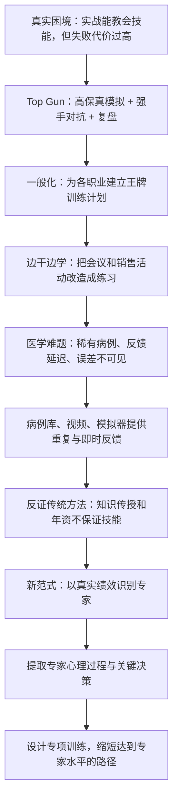
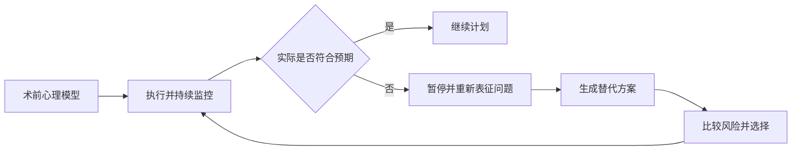
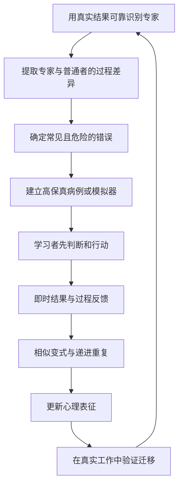

> **原书章节**：第 5 章“在工作中运用刻意练习原则”<br>
> **英文核心主题**：Applying Deliberate Practice at Work<br>
> **原文来源**：《刻意练习：如何从新手到大师》<br>
> **本章任务**：说明严格刻意练习条件不完整的职场与专业领域，怎样把真实工作重构成可重复、可反馈、可逐步加难的训练；并说明为什么传授知识、累计年资和被动继续教育通常不足以改善实际技能。<br>
> **阅读提醒**：本章的重点不是“在真实工作中大胆试错”，而是尽可能把关键情境搬到低风险环境中，集中练习薄弱环节，并用已知结果、专家过程和即时反馈改进心理表征。

---

## 一、本章要解决什么问题

### 1. 第 4 章留下的迁移难题

古典音乐、棋类和部分体育项目拥有成熟训练体系，工作领域却通常不同：

- 真正任务优先要求产出，不能随意暂停、重复或降低速度；
- 关键事件少见，员工可能多年才遇到一次；
- 错误会伤害病人、客户、设备、资金或组织信誉；
- 结果反馈延迟且受多人、环境和运气影响；
- 专家优势常藏在心理表征和决策过程里，外部不易观察；
- 培训往往侧重讲知识，而不是反复做出目标表现。

因此，本章要回答：如何在不承担真实失败全部代价的前提下，把工作经验变成有学习密度的练习？

### 2. 本章的中心结论

> **工作本身不自动构成练习。要持续提高职业技能，组织必须从真实任务中抽取关键决策与常见错误，在安全且高保真的环境中反复呈现，要求学习者先行动或判断，再立即获得具体反馈，并把修正后的心理表征带回下一轮训练和真实工作。**

这意味着培训评价要从“讲了什么、听了多久、记住多少”转向：

- 能否在代表性情境中做出正确行动；
- 能否识别异常并解释理由；
- 能否从反馈中修正下一次表现；
- 能否把训练迁移到真实结果。

### 3. 全章论证路线



### 4. 先区分四类学习场景

| 场景 | 首要目标 | 错误代价 | 可否暂停/重复 | 反馈 | 主要用途 |
| --- | --- | ---: | --- | --- | --- |
| 真实工作 | 完成业务或治疗 | 可能很高 | 通常较难 | 延迟、嘈杂 | 产出与最终迁移 |
| 边干边学 | 产出同时聚焦一个训练目标 | 中等 | 有限 | 同伴或录像 | 在时间受限时提高学习密度 |
| 模拟训练 | 改善特定技能 | 可控制 | 可以 | 即时、可设计 | 高频练关键和罕见情境 |
| 刻意练习式训练 | 系统缩小专家差距 | 可控制 | 可以 | 导师与客观结果 | 构建心理表征和技能序列 |

边干边学是折中方案；高风险、低频或复杂技能通常更适合先离线模拟，再回到真实工作检验。

### 5. 本章的关键证据层次

| 证据 | 直接支持 | 不能单独证明 |
| --- | --- | --- |
| 海军战绩前后变化 | Top Gun 实施后海军空战表现大幅改善 | 改善全部由单一课程造成 |
| 公司演示与角色扮演 | 日常活动可加入目标、反馈和重复 | 企业总体绩效必然提升 |
| 放射科病例库 | 已知答案与即时反馈可提高训练准确率 | 训练必然长期改善所有临床结果 |
| 医学继续教育综述 | 互动方法通常优于被动讲座 | 所有讲座均无价值 |
| 手术量与复发率 | 手术经验与病人结果存在显著关系 | 数量本身而非选择、团队或反馈造成全部差异 |
| 专家手术过程研究 | 高手持续监控计划偏差并自适应调整 | 心理表征是唯一决定因素 |

---

## 二、开篇：真实空战暴露出的训练缺口

### 1. 1968 年发生了什么

越战前几年，美军飞行员大致保持约 $2:1$ 的击落交换比。1968 年前 5 个月，海军击落 9 架米格战机，却损失 10 架，表现接近甚至低于 $1:1$；同年夏季发射 50 多枚空空导弹而无一命中。

原始 Markdown 中出现“空空导航”，按上下文应为“空空导弹”。

问题不是飞行员没有学过飞行知识，而是既有训练没有充分准备他们应对：

- 敌方机型和战术；
- 高压、快速变化的对抗；
- 飞机性能边界；
- 瞬间决策和错误恢复。

### 2. 为什么不能只依靠实战学习

实战有最真实的反馈，但代价极高。飞行员第一次空战能否生存，会影响是否获得第二次学习机会；被击落还意味着人员、飞机和情报损失。

这形成职业训练中的普遍矛盾：

$$
\text{情境越真实}\Rightarrow\text{反馈越相关},
$$

但往往

$$
\text{情境越真实}\Rightarrow\text{试错代价越高、可重复性越低}.
$$

Top Gun 要解决的，就是在相关性与安全性之间建立可控训练环境。

---

## 三、王牌训练计划

### 1. 训练系统的基本结构

美国海军建立战斗机战术教练计划，通常称为 Top Gun。它不是再讲一遍战术手册，而是重建一个训练闭环：

1. 选择优秀飞行员充当模拟敌军的“红军”；
2. 红军驾驶性能近似米格机的飞机，采用北越飞行员所学的苏式战术；
3. 学员“蓝军”进行无实弹模拟空战；
4. 照相机和雷达记录遭遇过程；
5. 降落后立即召开战斗报告会；
6. 教官追问观察、决策、理由和错误；
7. 第二天用新策略重新测试；
8. 毕业学员回部队传播训练方法。

### 2. 为什么选择最强者扮演敌人

若训练对手太弱，学员只会重复有效于低难度情境的策略。优秀红军熟悉大量学员套路，能持续把蓝军推到当前边界。

红军长期留校、不断对战新班级，经验增长更快，因此新学员起初常惨败。失败在训练中是有意制造的诊断信息，而不是最终业务损失。

### 3. 高保真模拟的严格含义

**高保真模拟**不是复制现实中的每个表面细节，而是保留决定目标表现的关键约束、信息、压力和因果关系。

Top Gun 保留：

- 敌机战术与相对性能；
- 三维高速对抗；
- 时间压力和不确定性；
- 飞机边界和战术后果。

它删除或替代：

- 真正导弹与子弹；
- 击毁和死亡的主要风险；
- 无法回放的战场信息。

保真度应服务训练目标。无关的逼真会增加成本和风险，却未必提高学习。

### 4. 为什么要逼近失败边缘

学员必须发现飞机和战术在极端局面中的真实边界。若始终在容易条件飞行，无法知道错误如何产生，也无法练习恢复。

但“失败边缘”不等于无上限冒险。训练仍发生过事故，说明风险管理是系统条件。有效难度应满足：

$$
\text{挑战足以暴露弱点}
\land
\text{风险低于真实实战}
\land
\text{仍可复盘和再次尝试}.
$$

### 5. 战斗报告会为什么是核心

模拟本身只产生经历，复盘才把经历转化为可复用知识。报告会围绕：

- 当时看到了什么；
- 忽略了什么；
- 为什么选择该动作；
- 预期对手怎样反应；
- 实际发生了什么；
- 哪个判断或动作造成差距；
- 下次要改变什么。

录像和雷达数据约束记忆偏差，避免讨论退化成“我觉得当时是这样”。

### 6. 复盘如何改进心理表征

飞行员逐渐把外部教官的追问内化为自我监测。训练前，他们可能只记得动作；训练后，能识别敌机姿态、能量状态、攻击窗口与风险关系，并提前预测。


### 7. 教学扩散机制

毕业学员回中队担任教官，把表征、复盘习惯和战术传给更多飞行员。项目因此不是只训练少数精英，而是建立“训练教官—教官训练部队”的组织扩散网络。

### 8. 书中战绩变化

1969 年轰炸暂停，空战较少。1970 年恢复后，书中报告：

- 接下来三年，海军约以 $12.5:1$ 的交换比击落敌机；
- 同期空军仍接近原先约 $2:1$；
- 1972 年，美国战斗机每次交战平均击落约 1.04 架敌机；
- 第一次海湾战争七个月中，美军空战击落 33 架、战斗中损失 1 架。

这些数字显示项目实施后表现巨大变化，并促使空军建立类似训练。

### 9. 战绩能否证明全部因果

前后比较不是随机实验。战绩还受：

- 飞机、导弹和雷达改进；
- 敌我战术与任务变化；
- 交战规则；
- 情报、预警和后勤；
- 参战飞行员构成；
- 统计口径。

海军与同期空军差异增强了 Top Gun 解释，但不能把所有变化精确归因于课程。最稳妥结论是：Top Gun 的模拟—反馈体系很可能是海军战绩改善的重要组成部分。

## 3.1 各行各业都需要“王牌训练计划”

### 1. 一般问题是什么

组织普遍面临：员工已获资格并上岗后，怎样继续提升，而不是只维持当前能力？

现实工作中的学习有三个结构缺陷：

- 关键事件随机出现；
- 错误代价太高；
- 结果与行动之间因果不清。

“王牌训练计划”不是军事课程名称，而是一种训练架构。

### 2. 可迁移的五个原则

1. **复制关键情境**：保留影响判断和行动的约束；
2. **集中困难事件**：不必等现实中罕见病例自然出现；
3. **允许安全失败**：错误产生信息而不造成完整现实损失；
4. **记录过程并立即复盘**：把行动、理由和结果对齐；
5. **根据弱点再次练习**：下一轮有针对性地改变。

### 3. 为什么实战幸存经验不是理想训练

书中指出，经历并赢得多场空战者，下一场胜率会升高，约赢过 20 场后近乎不会再败。这里存在严重**幸存者偏差**：只有活下来的人能累积后续经验，最危险的学习错误已经淘汰学习者。

因此，不能把“多实战自然成高手”当训练方案。模拟器的价值就是让失败者仍能进入下一轮。

### 4. 医疗与商业中的对应代价

- 医疗错误由病人承担生命和健康代价；
- 商业错误可能损失资金、时间、客户与未来机会；
- 工业、航空、网络运维可能造成系统性事故。

风险越高，越需要离线训练，而不是把真实对象当练习材料。

### 5. 设计中的保真与安全权衡

模拟太简单，学不到现实约束；模拟太危险，则失去离线训练意义。应先识别决定结果的关键变量，再逐步增加复杂度。

### 6. 从个体高手到组织能力

组织不能只招聘少数明星。它应：

- 用可靠结果识别高表现者；
- 研究他们的关键心理过程；
- 把过程转成可练习任务；
- 让普通从业者反复训练；
- 由训练结果继续改进课程。

---

## 四、让练习变成日常工作的一部分

### 1. 为什么职场练习经常消失

音乐家演出时间少、专项练习时间多；职场人士大部分时间必须交付，常认为只有脱产培训才叫学习。结果是工作日反复使用现有技能，偶尔听一次课程，却没有持续纠错。

阿特·图若克尝试把刻意练习原则带入企业领导、销售和自我管理训练。

## 4.1 拒绝三种错误思想

### 1. 错误思想一：能力由天赋固定

典型表达是“我不是有创造力的人”“我不擅长数字”“我不能管理别人”。它把当前表现误写成永久身份。

作者的修正是：许多职业技能可通过正确训练显著改善。阿特用“红色挑战旗”提醒客户重述固定身份语言。

边界是：反对宿命论不等于否认身体、年龄、资源和机会。更准确的改写是：

> 我目前在这项可训练能力上不足，还没有找到有效训练路径。

### 2. 错误思想二：做得久自然会更好

工作重复主要优化熟练与效率，不自动暴露弱点。年资可以增加案例库，也可能自动化旧方法。

$$
\text{经验年数}\centernot\Rightarrow\text{能力持续增长}.
$$

只有经验被反馈、反思和重新尝试加工时，才更可能变成技能。

### 3. 错误思想三：只要更努力就会提高

努力提高工作量，不一定改变技能。例如销售员多打电话，可能只是更快重复低效话术。

进步要求：

$$
\text{努力}\times\text{正确任务}\times\text{反馈与调整}.
$$

任何一项接近零，学习产出都可能很低。

### 4. “方法不对”也不能成为责备个体的口号

组织若不给时间、反馈、案例、导师和心理安全，却要求员工“正确练习”，是在把系统责任推给个人。刻意练习心态必须配套训练基础设施。

## 4.2 边干边学

### 1. 严格定义

**边干边学**是把原本以产出为主的工作活动，重新设计为同时包含一个具体训练目标、观察、反馈和后续重复的活动。

它不是简单“从工作中吸取经验”，而是有意增加练习结构。

### 2. 会议演示怎样改造成练习

普通演示只关注信息是否交付。训练版要求演讲者本轮只聚焦某项技能，如：

- 用故事解释数据；
- 即兴讲解；
- 减少依赖幻灯片；
- 回答质疑；
- 控制结构和时间。

听众按目标做观察记录，结束后给具体反馈。下一次演示再次应用同一反馈，才形成循环。

### 3. 为什么一次反馈不够

一次演示后获得建议，只增加知识；练习者还没有测试建议是否有效。必须经过：

$$
\text{表现}\rightarrow\text{反馈}\rightarrow
\text{下一次有控制的改变}\rightarrow\text{再反馈}.
$$

组织需要让类似任务周期性出现。

### 4. “蓝色兔子”销售角色扮演

原书介绍一家冰激凌公司的区域销售经理会议。原本会议只回顾大客户账目，改造后：

1. 一名经理向扮演关键采购方的同事演示；
2. 其他经理观察并反馈；
3. 全程录像；
4. 第二天重新演示；
5. 比较两个回合；
6. 再面对真实客户。

它把高风险客户沟通提前变成低风险排练。

### 5. 角色扮演为什么可能有效

- 可集中呈现异议与困难问题；
- 允许暂停、重来和多方案比较；
- 同伴可观察语言和非语言行为；
- 录像减少自我感觉偏差；
- 第二轮立即验证建议。

### 6. 角色扮演的边界

- 扮演者未必真实再现客户动机；
- 参与者可能迎合评价而非真正说服；
- 同伴反馈可能缺少可靠标准；
- 训练表现不一定迁移到真实压力；
- 应根据真实客户结果持续更新场景。

### 7. 判断职场训练方法的五个问题

1. 是否迫使练习者处理当前不容易的任务？
2. 是否提供及时、具体、可行动的反馈？
3. 训练设计者是否可靠识别了领域中的杰出者？
4. 是否知道杰出者与普通者的关键差异？
5. 任务是否直接训练这些差异？

全部肯定也不能保证有效，但比只靠满意度和课程时长更有希望。

### 8. 工作内练习的组织条件

- 允许暴露错误而不立即惩罚；
- 把练习表现与正式绩效区分；
- 留出复盘和第二次尝试时间；
- 培训反馈者；
- 选择可重复的小任务；
- 用真实结果检查迁移。

若没有心理安全，员工会隐藏错误，反馈闭环无法成立。

---

## 五、用王牌训练方法训练医生

### 1. 医学为什么是关键试验场

医学有真实结果和专业标准，却存在低频事件、高风险、多人协作和反馈延迟。它比音乐更难实施严格刻意练习，也更需要安全模拟。

### 2. Top Gun 在医学中的抽象结构

不是复制飞机，而是：

> 收集真实困难案例与最终答案，在无病人风险的条件下反复做诊断或决策，立即显示结果和专家理由，再按错误类型提供更多相似案例。

## 5.1 放射科医生训练的困境

### 1. 任务是什么

放射科医生阅读乳房 X 射线照片，寻找需要进一步检查的异常，并区分良性与恶性可能。

### 2. 为什么日常病例不是高密度练习

每 1000 张乳房 X 射线照片中，书中估计约只有 4 至 8 例癌症。大多数阅读都是正常片，关键阳性模式出现太少。

如果均匀等待现实病例，学习者需要大量时间才能比较足够多的疑难样例。

### 3. 反馈为什么断裂

- 可疑影像转交患者医生后，放射科医生未必收到活检结果；
- 漏诊可能一年后才发现；
- 没有系统回看此前影像；
- 资深医生的初始判断也可能错误；
- 假阳性与漏诊有不同代价。

没有结果标签，医生不能知道哪类视觉线索值得提高权重。

### 4. 2014 年研究

书中概述一项包含约 50 万张乳房 X 射线照片和 124 名美国放射科医生的研究。医生之间准确性存在差异，但从业年数和年度阅读量等可见背景因素未能清楚解释差异。

研究者推测，差异可能来自独立执业前的初始培训质量。

### 5. 为什么资深监督仍不等于已知答案

住院培训中，资深医生可以比较读片意见，却也可能漏诊或要求不必要活检。**专家共识反馈**与**最终病理结果反馈**应区分：前者及时，后者更接近真值。

### 6. 适用边界

准确率不能单独概括筛查质量，还要同时考虑：

- 敏感度：癌症患者中检出的比例；
- 特异度：无癌者中正确排除的比例；
- 假阳性与不必要活检；
- 病变类型和病例难度；
- 患者后续结果。

单纯减少误报可能增加漏诊，因此训练目标必须多维。

## 5.2 创建有反馈的训练工具

### 1. 艾利克森的病例库建议

2003 年，他提出建立数字化乳房影像库，并连接长期病历、活检和后续结果。每个案例应包含已知答案：是否癌变、怎样发展、最初是否漏诊。

### 2. 为什么不能随机塞入大量容易病例

明显正常或明显肿块对高手训练价值低。应优先选择：

- 良恶性容易混淆的影像；
- 常见漏诊模式；
- 罕见但危险病例；
- 对某位医生当前错误最有针对性的案例。

这叫**困难案例富集**或**诊断性采样**：训练分布有意不同于临床自然分布，以提高单位时间学习信号。

### 3. 自适应训练程序

理想程序可执行：


只显示对错不够，还应指出误判来自哪些视觉特征和推理步骤。

### 4. 训练分布与真实分布为何要区分

若训练集中癌症比例远高于现实，学习者可能形成过高先验概率，回到临床后增加假阳性。因此训练既要富集难例，也要在校准阶段恢复真实患病率。

可采用两阶段：

1. 专项阶段集中练模式；
2. 校准阶段按真实基率混合病例，检验决策阈值。

### 5. 澳大利亚影像库证据

书中提到澳大利亚建立了类似数字影像库。2015 年研究发现，医生在该测试中的表现可预测真实专业读片准确性。

这支持测试的**效标关联效度**，但下一步仍需证明：用它训练后的改善会因训练而产生，并迁移到临床结果。

### 6. 234 个儿童踝关节病例

2011 年，纽约摩根士丹利儿童医院整理 234 个儿童踝关节损伤案例，每个包含 X 射线、病历和症状摘要。住院医生要：

- 判断正常或异常；
- 异常时指出具体位置；
- 立即接受有经验医生的对错和漏看线索反馈。

十多次试验后，准确性开始稳定提高；研究完全部 234 例后继续进步。

### 7. 该结果说明什么

重复诊断 + 即时解释性反馈可以在短期内改善病例分类能力。病例库使学习者在几小时或几天内遇到现实中数月才出现的多种损伤。

### 8. 还需要哪些验证

- 是否有未训练新病例的测试；
- 是否有无反馈或传统教学对照组；
- 改善能否长期保持；
- 是否降低真实漏诊和误报；
- 专家反馈本身是否由可靠结果验证；
- 训练是否只记住 234 个病例。

### 9. 即时反馈为什么强大但不万能

即时反馈缩短误差到修正之间的时间，让过程记忆仍清晰。但复杂医学结果可能需延迟验证。最佳系统结合即时专家解释与后续病理结果，而不是二选一。

## 5.3 改进外科医生的心理表征

### 1. 放射诊断与手术的共同目标

高手不只是记住更多事实，而是更准确地表征解剖、异常模式、风险和行动后果。训练应改变“医生看到了什么、预测什么、何时停下”。

### 2. 胆囊腹腔镜手术的视觉错觉

劳伦斯·韦团队研究胆囊切除中的胆管损伤。很多损伤来自外科医生误认解剖结构：本应处理胆囊管，却把胆总管当作目标。

危险不只在最初误认，还在**确认偏差和承诺升级**：即使出现异常，医生仍用原计划解释，不愿停下来重新确认。

### 3. 杰出外科医生的差异

高手会主动拨开组织、改变摄像头视角或暴露关键结构，让解剖关系更清楚。他们不是“眼力更神奇”，而是采取行动改善可观察信息。

这将专家差异转成可训练行为：遇到不确定结构时，先增加可见性，再切割。

### 4. 视频决策点训练

可播放真实手术录像，在关键点暂停并提问：

- 你看到了什么结构？
- 请画出胆总管边界；
- 下一步切哪里或不切哪里？
- 是否需要拨开组织、换视角或转开腹？
- 哪种异常会让你放弃原计划？

答完立即揭示专家判断和真实结果，再进入更难案例。

### 5. 为什么决策点比完整观看更有效

被动观看容易产生“我早就知道”的后见之明。暂停并先承诺答案，才能暴露当时表征。大量短决策点还可以集中训练高风险瞬间。

### 6. 仿真器的作用

**仿真器**在不伤害真实对象的环境中重现关键状态与操作后果。它适用于飞行、手术、税务判断、情报分析、工业控制等。

有效仿真器不仅逼真，还应：

- 针对常见和危险错误；
- 可暂停、回放和变式；
- 记录过程；
- 提供结果与过程反馈；
- 根据弱点自适应；
- 检验迁移。

### 7. 插入意外事件训练恢复能力

医疗团队可能在输血血型核对过程中被意外中断。模拟器可在关键步骤插入电话、警报或新任务，训练团队恢复后是否重新确认未完成步骤。

这不是制造无关噪声，而是训练**中断恢复**和前瞻记忆。场景必须依据真实事故风险设计。

### 8. 适用边界

- 视频缺少触觉、团队互动和完整压力；
- 模拟器保真度与目标不匹配会教错；
- 专家判断不能替代患者结果；
- 熟悉模拟器可能不等于真实手术熟练；
- 高风险技能仍需分阶段监督进入临床。

---

## 六、致力于传授知识的传统方法

### 1. 本节的核心反转

传统培训问“从业者需要知道什么”；刻意练习问“从业者必须在什么情境下做出什么表现，以及怎样反复练到可靠”。

知识仍是必要基础，但不能替代技能形成。

## 6.1 知识与技能之间的区别

### 1. 严格定义

**陈述性知识**：能够说出事实、规则和原理，即“知道是什么、为什么”。

**程序性技能**：在具体情境中稳定完成判断或动作，即“知道怎样做并能做到”。

**条件性知识**：知道何时、为何使用某一方法，以及何时不适用。

专业表现通常需要三者整合。

### 2. 为什么知道方法不等于会做

达里奥从史蒂夫那里知道数字分组和检索结构，因而少走早期弯路；但把数字快速编码、放入结构并稳定取回，仍需长时间练习。

从知识到技能还需：

$$
\text{规则理解}\rightarrow\text{尝试}
\rightarrow\text{反馈}\rightarrow\text{调整}
\rightarrow\text{自动化与情境辨别}.
$$

### 3. 为什么组织偏爱传知识

- 一名讲师可同时面对很多人；
- 课件和考试容易标准化；
- 成本低、排程方便；
- 知识测验容易评分；
- 技能练习需要小组、设备、导师和反馈。

便利性解释了传统，不证明其有效。

### 4. 何时讲授知识仍然合适

- 建立基础术语和安全规则；
- 提供练习前的概念框架；
- 总结多个案例后的共同原理；
- 更新法规和新研究；
- 让学习者理解反馈理由。

问题不是“不要知识”，而是不能把听懂当成能做。

## 6.2 传统医学教育的失败

### 1. 培训路径的结构问题

未来医生在进入临床前长期接受课程知识，真正诊断、操作和沟通技能主要在临床阶段和住院培训中形成。正式监督结束后，社会假定其已具备终身所需能力。

这与业余网球学习类似：初期上课，达到可用水平后主要靠比赛维持，却缺少持续专项练习。

### 2. 年资与护理质量综述

2005 年哈佛团队评审二十多项研究，原书概述多数研究发现医生绩效随时间下降或保持不变。更大范围的 62 项研究中，只有 2 项显示护理质量随经验提高；另有超过 1 万名临床医生的研究中，经验带来的决策准确性收益很小。

护士研究也出现类似现象。

### 3. 这些结果能说明什么

- 工作年资不足以保证持续进步；
- 最新知识可能随时间过时；
- 日常工作反馈不足，错误模式可能稳定；
- 正式训练结束后需要持续能力维护。

### 4. 不能怎样解释

- 不能说所有资深医生都比年轻医生差；
- 病例更复杂可能分配给资深者；
- 不同研究的专业、指标和质量不同；
- 经验可能改善沟通、罕见病例识别等未测维度；
- 年龄、工作环境和培训年代与年资混杂。

核心只是：**经验不是自动学习机制。**

### 5. 医生是否缺乏学习意愿

医生频繁参加会议、研讨、课程并阅读新知识。原书举例，仅 2015 年 8 月一个心脏内科会议目录就有 21 项活动。问题主要不是毫不努力，而是活动形式与技能形成机制不匹配。

### 6. 继续教育研究

戴夫·戴维斯及同事综述课程、会议、讲座、讨论、角色扮演、案例和实训等干预。总体上：

- 带互动、角色扮演、案例与实践的活动更可能改善医术和患者结果；
- 单向说教式讲座效果最弱，却最常见；
- 即使有效干预，平均改善通常不大。

约十年后，路易斯·弗斯特朗德团队又综述 49 项新研究，结论相近：继续教育可能小幅改善实践，对患者结果影响更小，对多步骤复杂行为尤其有限。

### 7. 为什么互动比讲座更好

互动至少要求提取、选择或行动，使错误可见；讲座主要增加接触和熟悉感。但讨论本身仍不等于刻意练习，如果没有具体标准、反馈和重复修正，效果仍有限。

### 8. 综述结论的边界

不能把平均小效应推广为所有课程无效。高度针对、间隔、多轮、结合临床反馈的教育可能更好。患者结果还受团队和系统影响，单次培训效应容易被稀释。

## 6.3 从刻意练习原则看待医学教育

### 1. 传统教育缺了哪几环

讲座通常缺少：

- 代表性任务；
- 学习者先做决定；
- 对错与过程反馈；
- 针对错误的相似变式；
- 多轮重复；
- 真实绩效迁移测试。

### 2. “看一场，做一场，教一场”的问题

这句外科传统格言假定看懂步骤后就能做，再做一次便能教。它低估了动作控制、异常识别和大量反馈练习。

观察可形成初步表征，但不能替代安全模拟和监督操作。

### 3. 腹腔镜手术为什么构成反例

腹腔镜通过小切口和摄像头操作，视觉映射、深度判断、器械控制与传统开放手术不同。研究比较经验丰富的传统外科医生与受训实习医生，发现两者掌握腹腔镜技能、降低并发症的速度并无明显优势差异。

这说明旧领域知识不能自动转换为新动作技能；深层结构不同，迁移有限。

### 4. 正确制度回应

如今开展腹腔镜手术前，需要专项训练、专家监管和技能测试。资格应基于目标技能表现，而不是仅凭传统手术年资。

### 5. 不只医学如此

法学院、商学院和许多专业教育都偏重知识，因为易教易测。毕业生进入职场后才通过高成本工作经验形成技能。

正确问题应从

> 我们怎样传授更多相关知识？

转为

> 目标工作需要哪些可观察技能，怎样让学习者在安全情境中反复执行、反馈和改进？

---

## 七、致力于改进技能的新方法

### 1. 什么叫范式转变

新方法不是给旧课程加几个互动环节，而是从最终表现倒推课程：

1. 用真实结果识别高手；
2. 研究其心理表征与决策过程；
3. 找出普通者的常见错误；
4. 设计针对性任务；
5. 提供即时反馈和多轮变式；
6. 检验训练是否改善真实结果。

### 2. 技术技能为什么值得单独训练

约翰·伯克迈耶等让密歇根州减重手术医生提交典型腹腔镜缩胃手术录像，由专家匿名评分技术技能。技术评分较高的医生，其患者并发症和死亡风险更低。

这说明可观察技术与患者结果存在重要联系，也促成高手指导其他医生的项目。

### 3. 证据边界

技术评分与结果相关，不证明录像评分捕捉全部因果。高技能医生可能拥有更好的团队、医院和病例选择。匿名评审减少声望偏见，仍需做病例风险调整和干预验证。

## 7.1 辨认谁是专家

### 1. 医学专家标准必须回到患者结果

职位、论文、年资或同行名气不能替代治疗结果。理想指标要与某位医生可控制的行为有合理关系，并调整患者初始风险和团队影响。

### 2. 前列腺切除研究设计

2007 年，安德鲁·维克斯团队研究近 8000 名前列腺癌患者：

- 手术发生于 1987 至 2003 年；
- 由 72 名外科医生在 4 个医疗中心完成；
- 结果指标是术后五年内癌症复发。

手术目标是完整切除癌变组织，复发率因此可作为技术结果之一。

### 3. 手术量与复发率

- 只做过约 10 台手术者，患者五年复发率约 17.9%；
- 做过约 250 台者，复发率约 10.7%；
- 后续分析显示，改善持续到约 1500 至 2000 台后趋于平台；
- 简单病例接近完全避免五年复发，复杂扩散病例约 70% 可避免复发。

结果显示显著学习曲线。

### 4. 为什么手术量是代理变量

手术数量本身不会自动教人。它代表多次计划、操作、即时问题、病理边缘和术后反馈的机会。

$$
\text{手术量}\rightarrow\text{反馈机会与表征修正}
\rightarrow\text{技能}\rightarrow\text{结果}.
$$

若反馈缺失或同一错误重复，数量效应会减弱。

### 5. 替代解释与校正

- 高量医生可能在高水平医院；
- 团队、设备和护理不同；
- 高量医生可能选择不同病例；
- 患者风险和癌症阶段不同；
- 成绩好会吸引更多患者，形成反向因果。

研究需要病例组合校正；真正证明训练方法还需对低技能者实施训练并观察患者结果。

## 7.2 即时反馈的重要性

### 1. 外科反馈为什么比许多工作直接

手术中血管破裂、组织损伤会立即显现；术后出血或再次手术提供稍延迟反馈；切除组织病理检查显示癌变周围是否有“干净边缘”；心脏手术可测试修复功能。

这些信号让医生将动作与后果连接起来。

### 2. 结果反馈和过程反馈

- **结果反馈**：病人是否复发、并发症是否发生；
- **过程反馈**：在哪一步、什么视野或动作造成风险。

结果告诉“是否成功”，过程告诉“怎样改”。两者结合才能缩短学习曲线。

### 3. 为什么要缩短达到专家的时间

若自然工作需 1500 至 2000 台手术才接近平台，早期大量患者承担学习成本。模拟和专项案例可在不增加患者风险的情况下集中练习关键决策，理论上可缩短路径。

### 4. 放射科前三年学习曲线

书中研究发现，未接受乳腺影像专科训练的医生在工作前三年显著减少误报，此后改进变慢；接受专科训练者工作数月便达到前者约三年后的水平。

这与“结构化训练压缩低效经验积累”一致。

### 5. 仍需谨慎的地方

- 达到相同误报率不一定达到相同漏诊率；
- 专科受训者可能经过选择；
- 不同岗位病例和监督不同；
- 需要直接比较完整敏感度、特异度和临床结果。

## 7.3 杰出医生的心理过程

### 1. 从“谁更好”到“为什么更好”

识别专家后，还要研究其内部过程，否则只能复制手术数量，不能复制学习机制。

常用方法包括：

- 事后访谈；
- 有声思维；
- 视频刺激回忆；
- 模拟中暂停提问；
- 比较容易与困难任务；
- 眼动、操作日志和决策时间。

### 2. 8 名外科医生研究

研究者访谈 8 名外科医生，询问腹腔镜手术前、中、后的思考。关键决策包括：

- 切除哪些组织；
- 是否从腹腔镜转为开腹；
- 是否放弃原计划并制订新计划；
- 选择何种器械或病人体位。

### 3. 专家为何仍需深思熟虑

专家并非每次照搬固定模板。真实手术会出现意外解剖、出血或技术障碍。高手把常规部分自动化，把注意用于异常与计划偏差。

### 4. 自适应思考的严格定义

**自适应思考**是行动者在环境偏离预期时，及时识别偏差、重新生成候选方案、评估风险并修改计划的能力。



### 5. 心理表征怎样产生预警

没有预期模型，就无法知道当前异常。高手术前不仅记步骤，还预测应看见的结构、时间和状态；不一致本身成为警报。

### 6. 加拿大手术研究

研究者观察预期困难的手术并在术后访谈。医生主要通过发现实际进程与术前模型不一致来察觉问题，再提出替代方案并选择。

这支持“计划—监控—偏差—重规划”的表征模型。

### 7. 为什么真实手术中不能暂停提问

实验室可关灯暂停、要求描述当前状态；真实手术暂停可能增加风险和干扰。因此可用：

- 术前预测访谈；
- 术后结合录像的刺激回忆；
- 仿真器中暂停；
- 无干扰的操作日志；
- 团队沟通记录。

研究方法必须服从患者安全。

### 8. 军事中的对应：像司令官那样思考

军官面对突袭和未预见事件，也需自适应思考。模拟可呈现突发变化，要求学员更新计划，而不是只背标准答案。

### 9. 专家自我报告的边界

自动化过程可能无法言语化，术后叙述会受结果和后见之明影响。应把访谈与行为、视频、客观结果和实验操纵结合。

### 10. 本章最终训练路线



---

## 八、作者分析问题的方法

### 1. 从高代价失败寻找训练结构

作者没有从“员工要更努力”开始，而从空战和医疗的现实代价出发：为什么经验确实有用，却不能直接拿真实失败训练？这自然引出安全模拟。

### 2. 用 Top Gun 作为机制原型

红蓝对抗、过程记录、强制复盘和次日重试构成可复制结构。后续案例不是模仿战斗机，而是逐项映射这些功能。

### 3. 从企业折中方案过渡到医学严格案例

会议演示展示低成本边干边学；医学病例库展示高风险领域如何离线练习。顺序从直观可实施方案推进到证据更强的专业训练。

### 4. 先诊断反馈缺口，再设计工具

放射科问题不是医生没看足够多片，而是阳性病例稀少、病理结果不回流。病例库正对这两个控制变量：提高困难样例密度、缩短反馈延迟。

### 5. 用反例拆开知识与技能

达里奥知道史蒂夫方法却仍需练习；传统手术经验也没有自动带来腹腔镜技能。这两个反例共同否定“知道方法便会做”。

### 6. 用综述检验培训形式，而非个别成功故事

医学继续教育部分比较多项研究，发现互动通常优于说教，但总体效应仍小。作者据此要求更完整的专项任务和反馈闭环。

### 7. 从患者结果反向识别专家

新范式先看五年复发、并发症和死亡等真实结果，再研究技术和心理过程，避免先按头衔挑专家。

### 8. 从专家差异到可训练任务

发现高手会拨开组织改善视野，还不够；必须把它转成决策点视频、暂停提问和即时反馈，才能检验普通医生是否学会。

### 9. 主动保留迁移检验

病例库测试预测临床表现只是一步。作者明确指出下一步要证明训练提高真实诊断。这避免把模拟器高分直接等同于患者获益。

### 10. 本章方法的局限

- Top Gun 前后战绩有历史混杂；
- 企业案例缺少严格对照和客观长期结果；
- 医学病例库可能教会固定题库；
- 专家评分仍可能有偏见；
- 手术量与结果存在医院、团队和病例选择混杂；
- 有声思维与术后访谈无法完全揭示隐式过程；
- 高保真模拟成本高，也可能与真实工作错配；
- 组织文化和激励可能阻碍员工暴露错误。

---

## 九、把本章转化为组织实践

### 1. 设计“职场王牌训练计划”的十二步

#### 第一步：定义真实绩效结果

选择与客户、患者、系统或作品结果相关的指标，而非培训满意度和出勤。

#### 第二步：识别稳定高表现者

跨多次任务、调整难度后比较，避免只看一次明星结果。

#### 第三步：分解关键决策

找出高手在哪些时刻看见什么、预测什么、做什么。

#### 第四步：收集真实案例

连接输入、行动、结果和后续真值，建立案例库。

#### 第五步：选择高训练价值案例

富集常见错误、危险异常和边界情境，不只随机抽样。

#### 第六步：决定保真层级

只保留影响目标技能的关键约束，逐步增加压力和复杂度。

#### 第七步：要求先行动

学习者必须判断、标注、操作或作答，不能只观看答案。

#### 第八步：提供双重反馈

同时给结果真值和专家过程，说明为什么。

#### 第九步：按错误自适应重复

为同类缺陷提供变化案例，直到形成稳定辨别能力。

#### 第十步：练习异常与恢复

加入中断、信息缺失和计划失效，训练重新评估。

#### 第十一步：检验保持和迁移

使用未见案例、延迟测试和真实业务指标。

#### 第十二步：更新课程

根据新事故、新高手方法和训练数据持续淘汰无效场景。

### 2. 一个软件事故响应示例

可把生产事故重构为安全演练：

1. 使用脱敏日志、指标和时间线复原真实事故；
2. 在关键时点暂停，让工程师判断下一步；
3. 记录查看顺序、假设和操作；
4. 插入无关告警或通讯中断；
5. 与优秀响应者过程和实际根因比较；
6. 针对“过早重启、忽视回滚、错误归因”等问题提供相似变式；
7. 在沙箱中执行，不影响生产；
8. 用未见事故测试；
9. 最后观察真实平均恢复时间、复发率和变更风险是否改善。

### 3. 一份训练场景模板

```markdown
## 真实绩效
- 目标结果：
- 风险校正方式：

## 场景
- 来源与最终真值：
- 要保留的关键约束：
- 删除的现实风险：

## 决策点
- 学习者此刻能看到什么：
- 必须判断或执行什么：
- 高手关注的关键线索：

## 反馈
- 结果是否正确：
- 推理或动作哪里偏离：
- 哪个信号本应触发暂停或改计划：

## 自适应练习
- 下一组相似变式：
- 何时提高复杂度：

## 迁移
- 未见案例结果：
- 真实工作指标：
```

### 4. 训练指标的四层结构

| 层次 | 例子 | 风险 |
| --- | --- | --- |
| 参与 | 完成课程、练习次数 | 易测但不代表能力 |
| 学习 | 模拟准确率、错误减少 | 可能只适配题库 |
| 行为 | 真实工作过程改变 | 受环境影响 |
| 结果 | 患者、客户、系统结果改善 | 延迟且需风险校正 |

完整评估不能停在参与或满意度。

### 5. 建立心理安全而不降低责任

练习环境应允许坦诚暴露错误；真实工作仍需安全标准和责任。可以：

- 将训练成绩与惩罚性考核分离；
- 使用脱敏案例；
- 复盘聚焦机制而非羞辱；
- 对故意违规与诚实练习错误区分处理；
- 让领导先公开自己的判断失误。

### 6. 边干边学何时合适

适合：任务可重复、风险较低、反馈及时、可聚焦一项技能。

不适合：一次性高风险操作、错误不可逆、客户不能承担试错、场景无法暂停。此时应先模拟。

### 7. 知识课程怎样与技能训练配合

最有效顺序通常不是只讲或只做，而是：

$$
\text{最小必要知识}\rightarrow\text{代表性尝试}
\rightarrow\text{反馈}\rightarrow\text{针对性知识}
\rightarrow\text{再次尝试}.
$$

知识在出现真实理解需求时更容易被编码。

### 8. 什么时候训练系统本身需要停下修正

- 模拟高分不预测真实结果；
- 专家之间反馈长期不一致；
- 学习者只记住题库；
- 场景已落后于技术和风险；
- 训练压力造成伤害或隐瞒；
- 真实绩效没有改善；
- 培训收益低于机会成本。

---

## 十、核心概念辨析

| 概念 | 严格含义 | 常见误解 |
| --- | --- | --- |
| 王牌训练计划 | 高保真、低于现实风险、可记录复盘并重复的训练系统 | 只有军事组织能做的昂贵课程 |
| 高保真模拟 | 保留决定目标表现的关键约束与因果关系 | 表面细节越多越好 |
| 红军/蓝军 | 分别模拟强敌和接受挑战的学员角色 | 单纯竞争分组 |
| 战斗报告会 | 基于记录重建观察、决策、结果并制定下一轮改变的复盘 | 追责或泛泛总结 |
| 离线练习 | 不直接承担完整真实后果的专项训练 | 与真实任务毫无关系的课堂题 |
| 边干边学 | 给真实工作加入具体训练目标、观察、反馈和重复 | 工作年资自然积累 |
| 角色扮演 | 在可控环境模拟利益相关者互动 | 只表演一遍供大家评论 |
| 心理安全 | 允许坦诚暴露和讨论练习错误的团队条件 | 对错误不负责 |
| 困难案例富集 | 有意提高高学习价值案例的比例 | 用训练比例代替真实基率 |
| 自适应训练 | 根据学习者错误选择后续任务 | 难度随机变化 |
| 即时反馈 | 在过程记忆仍清晰时返回误差信息 | 越快越好且无需最终结果 |
| 结果反馈 | 关于最终成功、复发、并发症等的信息 | 足以说明具体怎样改 |
| 过程反馈 | 关于观察、推理和动作偏差的信息 | 可以替代真实结果真值 |
| 陈述性知识 | 可表达的事实和规则 | 等同实际技能 |
| 程序性技能 | 在情境中稳定完成判断或动作的能力 | 只要多做便自然形成 |
| 条件性知识 | 知道何时采用或放弃某方法 | 背诵适用范围 |
| 学习曲线 | 表现随练习量或时间变化的关系 | 必然由练习单独造成 |
| 手术量 | 外科医生完成某类手术的累计数量 | 技术水平本身 |
| 风险校正 | 比较绩效时调整患者或任务初始难度 | 美化结果 |
| 自适应思考 | 偏离预期时重新表征、生成候选并调整计划 | 临场随意发挥 |
| 刺激回忆 | 借助录像等线索回顾当时认知过程 | 对心理活动的完全准确记录 |
| 迁移 | 训练所得能力改善未见或真实任务 | 训练集成绩提高 |

---

## 十一、本章完整结论

### 1. Top Gun 真正创新在哪里

它把真实空战的关键约束搬入较低风险环境，让飞行员对抗强敌、触及边界、记录过程、立即复盘并次日重试。核心不是模拟设备，而是完整反馈循环。

### 2. 为什么工作经验不自动成为技能

真实工作以产出为目标，关键事件稀少、反馈延迟、错误不可重复。只有把经验转为有目标的比较、复盘和再尝试，才可能持续改变能力。

### 3. 边干边学解决什么

它在无法脱产训练时，为会议、演示和销售加入一个具体技能目标、同伴观察、录像反馈和下一轮应用。它是折中方案，不适合高风险试错。

### 4. 放射科训练困境说明什么

乳腺癌阳性病例少、最终结果不回流，导致医生难以从日常读片获得高质量反馈。病例库通过富集疑难样例、连接真值和即时反馈提高学习密度。

### 5. 手术视频与仿真器为何有效

它们把关键决策点从完整手术中抽取出来，允许医生先判断、发现视觉错觉、练习增加可见性和计划恢复，而不伤害病人。

### 6. 知识与技能的核心区别

知识告诉人规则，技能要求在具体情境中识别、行动和调整。知识能缩短摸索，却必须经过代表性任务和反馈才能程序化。

### 7. 为什么传统继续教育效果有限

被动讲座很少要求医生尝试、犯错、获得具体反馈和重复修正。互动活动更好，但若缺少完整闭环，对复杂行为的改善仍小。

### 8. 新型培训如何开始

先用经风险校正的真实结果识别专家，再研究他们的心理表征与决策过程，转成高价值案例和自适应训练，最后验证真实结果。

### 9. 手术量与结果关系说明什么

大量手术提供反馈与表征修正机会，经验丰富者患者结果更好；但手术量是代理变量，医院、团队、病例与反向因果需要控制。

### 10. 杰出医生的关键心理能力

高手拥有细致术前模型，持续监控现实与预期的不一致，出现异常时暂停、重新生成和比较方案。这种自适应思考可以通过决策点模拟训练。

### 11. 本章不能承诺什么

模拟训练不必然迁移，专家判断不必然正确，互动培训也不自动成为刻意练习。所有训练系统都必须以未见任务和真实结果持续校准。

### 12. 本章如何引向第 6 章

本章讨论组织如何提供案例、模拟、导师和反馈基础设施。第 6 章将转向个人：在日常生活中如何找导师、保持专注、自己设计练习、突破平台并维持动机。

---

## 十二、复习问题

1. 1968 年海军战绩暴露的是知识不足，还是训练情境不足？
2. 为什么真实空战虽有真实反馈，却不是可接受的主要训练方式？
3. Top Gun 的红军为什么必须比学员更强？
4. 高保真为什么不等于复制现实所有细节和风险？
5. 模拟失败怎样与真实失败具有不同学习价值？
6. 战斗报告会怎样把经历转成心理表征？
7. 学员把教官追问内化后，发生了什么能力变化？
8. 海军前后战绩为何支持、却不能单独证明 Top Gun 的全部因果效应？
9. “约赢过 20 场后几乎不会败”为什么包含幸存者偏差？
10. 王牌训练计划可迁移的五项结构是什么？
11. 阿特·图若克要求拒绝哪三种错误思想？
12. 为什么“方法不对”不能成为组织责备员工的借口？
13. 边干边学与普通工作经验有什么严格区别？
14. 为什么一次演示反馈只增加知识，还没有形成技能？
15. 蓝色兔子的两轮角色扮演为什么比一次客户复盘更接近练习？
16. 工作内练习需要什么心理安全条件？
17. 乳腺癌低基率怎样降低日常读片的学习密度？
18. 为什么资深医生的意见与最终病理真值不能混为一谈？
19. 诊断训练为何要同时考虑敏感度、特异度和基率？
20. 困难案例富集为什么有用，又可能造成什么校准问题？
21. 澳大利亚影像库测试与临床准确性相关，还缺哪一步因果验证？
22. 234 个踝关节案例训练提供了什么证据，仍需哪些对照？
23. 即时反馈与长期患者结果应怎样结合？
24. 胆管损伤中的视觉错觉和确认偏差怎样相互强化？
25. 高手拨开组织改善视野，为什么是可训练的专家差异？
26. 视频决策点训练为何优于被动观看完整手术？
27. 模拟器插入中断是在训练什么能力？
28. 陈述性知识、程序性技能和条件性知识分别是什么？
29. 达里奥的案例怎样说明知道方法不等于拥有技能？
30. 为什么组织倾向传知识而不练技能？
31. 医生年资与护理质量研究能说明什么，不能说明什么？
32. 为什么互动继续教育通常优于讲座，却仍可能效果有限？
33. “看一场，做一场，教一场”遗漏了哪些学习环节？
34. 传统手术经验为什么没有自动迁移到腹腔镜技能？
35. 新型培训范式的六个步骤是什么？
36. 如何用患者结果识别专家，同时控制病例难度与团队影响？
37. 10 台与 250 台前列腺手术的复发率差异说明什么？
38. 为什么 1500 至 2000 台手术的平台不能被简化成数量阈值？
39. 手术量为什么只是技能与反馈机会的代理变量？
40. 专科训练把三年学习曲线压缩到几个月，可能有哪些替代解释？
41. 自适应思考与随意临场发挥有什么区别？
42. 专家怎样用术前心理模型察觉手术异常？
43. 为什么真实手术不适合中途暂停研究心理表征？
44. 刺激回忆和有声思维分别有哪些偏差？
45. 选择你熟悉的一项工作，设计一个保留关键约束、删除真实风险、包含决策点和即时反馈的最小训练场景。

---

## 十三、延伸阅读线索

- 美国海军战斗机武器学校与越战空战训练史：战绩变化、装备和交战规则的多因素分析。
- K. Anders Ericsson：专业工作中的刻意练习、代表性任务和即时反馈。
- 乳腺影像判读：测试集、病理真值、敏感度、特异度与训练迁移。
- Lawrence Way 等：腹腔镜胆囊切除中的视觉误认与胆管损伤。
- Dave Davis、Louise Forsetlund 等：医学继续教育形式与临床结果的系统综述。
- Andrew Vickers 等：前列腺切除术的医生经验、学习曲线与癌症复发。
- John Birkmeyer 等：外科技术录像评分与患者并发症、死亡结果。
- 自适应专长、自然决策与术后刺激回忆：专家如何监控并修改计划。

阅读后续研究时，应检查训练任务是否代表真实工作、反馈真值是否可靠、评价是否盲法、病例难度是否校正、是否使用未见测试，以及模拟改进是否真正迁移到患者或业务结果。
