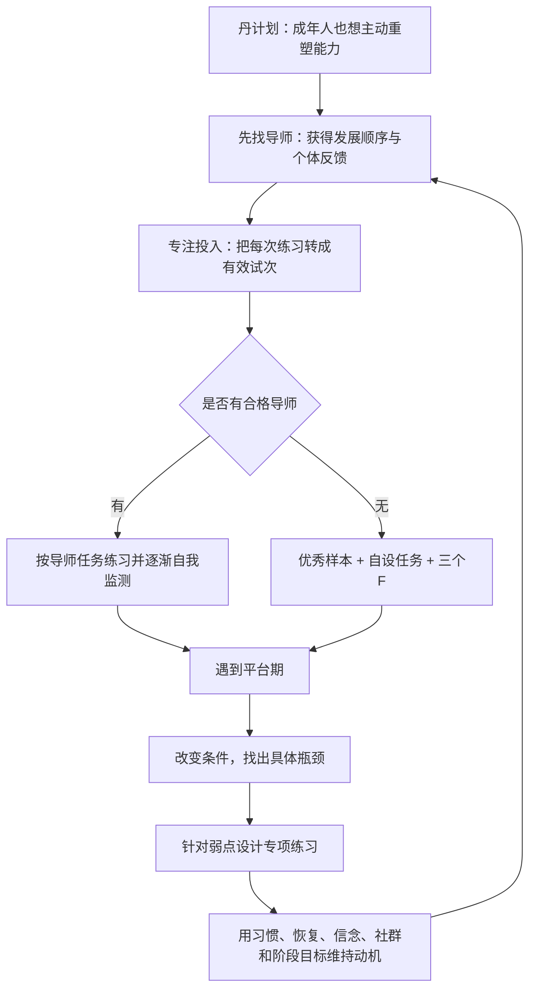
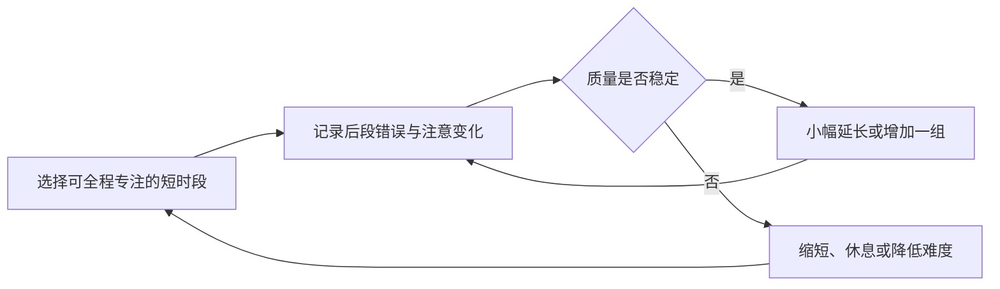
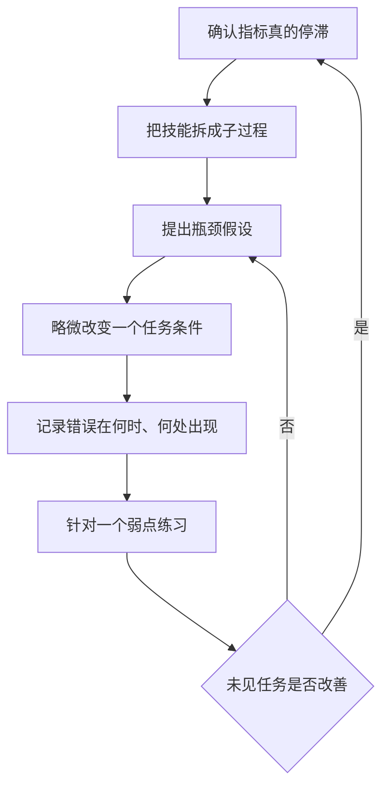

> **原书章节**：第 6 章“在生活中运用刻意练习原则”<br>
> **英文核心主题**：Applying Deliberate Practice in Everyday Life<br>
> **原文来源**：《刻意练习：如何从新手到大师》<br>
> **本章任务**：把前五章的机制转化为个人可执行的方法：怎样选择导师、保持专注、在缺少导师时设计练习、诊断平台期，并通过环境、习惯、社会支持和阶段目标长期维持投入。<br>
> **阅读提醒**：本章讨论的是提高能力的路径，不是成功保证。刻意练习能显著扩大许多技能的可达范围，但最终结果仍受目标难度、年龄、身体条件、资源、机会、伤病和训练质量影响。

---

## 一、本章要解决什么问题

### 1. 从组织训练转向个人生活

第 5 章说明组织可以建立模拟器、案例库和反馈系统。但普通人通常没有 Top Gun 学校或大型医学训练平台，只能在工作、兴趣和家庭责任之间安排学习。

个人实践因此面临五个连续难题：

1. **方向问题**：如何找到能诊断当前差距的导师？
2. **质量问题**：怎样避免练习时间被走神和机械重复稀释？
3. **资源问题**：没有导师时，怎样自己创造标准、反馈和重复机会？
4. **平台问题**：表现停滞时，怎样区分终极边界与局部瓶颈？
5. **持续问题**：刻意练习费力且不总有趣，怎样坚持数月乃至数年？

### 2. 本章的中心结论

> **个人能力提高不是靠一次决心，而是靠一套可持续训练系统：合适导师提供方向和反馈；短时高质量专注把反馈转成改变；没有导师时用优秀样本和“三个 F”自建闭环；平台期通过改变任务条件暴露具体瓶颈；长期坚持则依靠降低练习阻力、增强目标价值、建立身份与社会支持，并把远期目标拆成可见进步。**

### 3. 全章论证路线



### 4. 本章不是“个人意志万能论”

作者强调个人可控性，但个人并非在真空中练习。一个完整模型至少包括：

$$
\text{长期进步}
=F(\text{训练质量},\text{投入时间},\text{导师},
\text{反馈},\text{恢复},\text{环境},\text{个体条件}).
$$

本章主要改善前六项中的可控部分，不能消除所有约束。

### 5. 先区分结果目标、表现目标与练习目标

| 类型 | 回答的问题 | 例子 | 主要风险 |
| --- | --- | --- | --- |
| 结果目标 | 最终想获得什么外部位置 | 参加职业高尔夫巡回赛、获得黑带 | 受竞争和机会影响，反馈太远 |
| 表现目标 | 能稳定做到什么 | 差点降到 4、某动作达到标准 | 可能仍过于总体 |
| 练习目标 | 本轮改进哪个可控环节 | 102 次短推、修正某种踢法 | 容易只优化局部指标 |

有效系统把三者对齐：练习目标改善表现，表现提高才增加结果目标的概率。

---

## 二、开篇：“丹计划”提出的个人实验

### 1. 丹尼斯的起点与目标

2010 年，30 岁的丹尼斯·麦克劳克林写信给艾利克森。他是商业摄影师，没有参加过竞技体育，也从未完整打过一场 18 洞高尔夫，却计划辞职，用约六年和 1 万小时训练争取职业高尔夫巡回赛资格。

他把项目称为“丹计划”。这个案例的价值不在于再次证明 1 万小时法则，而在于提出一个现实问题：成年人能否用系统训练进入此前完全陌生的高水平领域？

### 2. 为什么这个目标格外困难

- 高尔夫需要精细动作、力量、知觉、策略和心理控制；
- 世界级竞争者多数从小训练；
- 职业资格是相对排名，不只取决于个人绝对进步；
- 六年脱产训练有巨大的经济和机会成本；
- 伤病和适应速度无法在开始时精确预测。

### 3. 作者从丹计划保留了什么

作者欣赏丹尼斯反对“只有天生适合者才值得尝试”的态度，并借此强调刻意练习不仅属于儿童天才或大型组织，也可服务绘画、编程、写作、销售、音乐等个人目标。

但应区分两个命题：

1. **可提高命题**：成年人通过正确训练，通常能显著超过当前水平；
2. **顶尖保证命题**：成年人投入固定时数，必然达到职业顶尖。

本章案例支持前者，不足以证明后者。书写作时，丹尼斯是否进入职业巡回赛仍未确定。

### 4. 为什么从大胆目标开始

远期梦想提供方向和投入理由，但后文马上把它拆成导师、专注、反馈、平台和动机等日常机制。作者的思路是：先承认梦想的吸引力，再把“相信可能”转成可执行系统。

---

## 三、首先，找位好导师

### 1. 佩尔的空手道案例

瑞典人佩尔·霍尔姆洛夫 69 岁开始学空手道，目标是在 80 岁前取得黑带。约三年后，他每周练习空手道五六小时，另用约十小时跑步和健身，却觉得进步太慢。

最直观解释是年龄。但作者认为，年龄会影响速度，却没有回答其现有训练是否有效。佩尔主要上多人团体课：导师示范、全班模仿，个体纠错偶尔发生。

### 2. 问题为什么不是单纯“练得不够”

佩尔总运动量已经很大。额外跑步可改善一般体能，却未必修正空手道动作中的姿态、时序、距离和发力。

$$
\text{一般体能训练}\neq\text{空手道专项反馈}.
$$

局部瓶颈需要能观察其动作的导师，而不是继续无差别加量。

### 3. 团体课为什么容易产生反馈稀释

一个导师面对多人时，只能提供通用示范和间歇纠错。每名学生的错误不同：相同踢腿外观可能分别源于平衡、髋部活动度、重心、时序或错误表征。

团体课并非无效，它成本低、提供同伴和固定日程；只是难以持续满足个体化刻意练习要求。

### 4. 一对一导师提供什么

- 观察个人动作而非只展示标准动作；
- 判断当前最重要的错误；
- 解释正确动作应看起来和感觉怎样；
- 设计针对该错误的练习；
- 控制难度和安全；
- 在下一次尝试中立即校验。

### 5. 为什么初学阶段尤其需要导师

初学者的心理表征粗糙，连“正确是什么”都未稳定，因此自我感觉可能与实际动作不同。若用错误标准监测自己，大量重复会自动化错误。

导师早期承担外部标准，随后帮助学生把标准内化：

$$
\text{导师观察与反馈}
\rightarrow\text{学习者形成目标表征}
\rightarrow\text{逐渐具备自我监测能力}.
$$

### 6. 年龄的准确边界

佩尔不可能因此拥有与年轻人相同的恢复、柔韧或学习速度。高龄训练还需考虑心血管、关节、跌倒和伤病风险。作者建议的合理内核是：先优化方法，再判断年龄限制；不是忽略医学和生理边界。

## 3.1 怎样找一位好导师

### 1. 导师自己的水平

导师应在目标领域有足够成就，但不必是世界第一。一般而言，他至少应达到或可靠培养出你希望到达的下一阶段。

初学者可从擅长基础教学者受益；高水平学习者则需理解高级瓶颈的导师。

### 2. 做得好不等于教得好

专家可能把关键过程自动化，无法分解动作或诊断新手错误。**专业能力**与**教学能力**是相关但不同的技能。

好导师需要：

- 表达目标标准；
- 识别错误机制；
- 设计渐进任务；
- 给可行动反馈；
- 根据个体调整；
- 建立学生独立监测能力。

### 3. 用学生结果而非魅力评价导师

调查导师时，应看与自己起点相近的学生：

- 他们在可测技能上提高了什么？
- 克服过哪些具体障碍？
- 改进是否能合理归因于导师？
- 训练是否安全、尊重学习者？
- 学生是否逐渐减少对导师依赖？

在线好评常受友善、趣味、外貌和期待影响。愉快体验有助坚持，却不等于教学有效。

### 4. 为什么“相似学生”很重要

擅长培养儿童的教练未必了解成人的时间、身体和动机约束；擅长初学者的导师未必能解决高级平台。导师效果存在阶段与人群适配。

可把适配理解为：

$$
\text{导师价值}
=F(\text{导师专长},\text{教学能力},
\text{学生阶段},\text{目标与约束}).
$$

### 5. 课堂上最应得到什么

个人课不应只用来让导师看你重复完整任务。最有价值的是：

- 检查上次练习结果；
- 诊断新瓶颈；
- 示范和校准目标表征；
- 确认课后怎样练、注意什么；
- 约定下次如何验证。

能力改变主要发生在课间练习，课堂负责提高练习质量。

### 6. 丹尼斯的三类导师

丹尼斯开始高尔夫训练前，找了高尔夫技术教练、力量与体能教练和营养师。不同导师负责不同能力系统，避免让单一导师越过专长边界。

多导师也可能给出冲突建议，因此需要一个明确主目标和协调机制。

### 7. 何时更换导师

丹尼斯在最初教练帮助下进步数年，随后进入平台，认为已吸收该教练能提供的内容，转而寻找更高水平指导。

应考虑更换的信号包括：

- 多轮训练后无可测进步；
- 导师无法解释停滞原因；
- 只重复相同任务；
- 你的阶段超出导师专长；
- 反馈与客观结果长期冲突；
- 安全、伦理或尊重出现问题。

平台不必立即归咎导师。先检查练习执行、恢复和指标，再决定调整关系。

### 8. 导师不是永久权威

高质量指导最终应增强学习者的自我诊断。盲目服从会让错误传统持续；应以表现、反例和安全结果校验导师建议。

---

## 四、专注和投入至关重要

### 1. 为什么重复次数不是有效练习量

团体空手道课中，学生可能左右腿各踢十次，却在几次后走神。动作完成了，目标、偏差和调整没有进入注意。

可以把名义时长与有效练习区分：

$$
T_{\text{有效}}=\int_0^T q(t)\,dt,
\qquad 0\le q(t)\le1,
$$

$q(t)$ 表示当时注意、目标匹配和反馈利用质量。公式只是概念模型：两小时低质量重复可能少于四十分钟高质量练习。

### 2. 休闲活动与训练的不同

- 下完整棋局可以娱乐和检验整体能力，打谱预测高手招法更适合修正棋局表征；
- 和朋友玩飞镖可提供社交，专项改变瞄准点和动作更适合提高控制；
- 保龄球联赛可积累比赛经验，困难残局的重复练习更能暴露走位弱点。

不是前者“毫无价值”，而是其直接目标并非集中改善特定技能。

### 3. 专注的严格含义

本章的**专注投入**包括：

1. 知道本轮具体要改什么；
2. 注意与目标有关的感觉和线索；
3. 预测动作结果；
4. 发现实际与目标差距；
5. 在下一次尝试中有意识调整。

专注不是咬牙、紧张或排除一切自动化。已经稳定的底层动作可自动执行，注意应放在当前薄弱环节。

### 4. 专业与业余歌手研究

瑞典研究者比较至少学习歌唱半年以上的专业和业余歌手，使用心电、血液、面部表情和课后访谈等方法。

两组课后都更放松、更有精力；业余者更常报告欢欣和表达愉悦，专业歌手则聚焦声音技术、呼吸控制和改进。

### 5. 这个比较能说明什么

相同“唱歌课”可因参与目标不同而成为娱乐、情绪表达或专业训练。专业者的注意对象更贴近技能反馈。

它不能证明愉悦会妨碍学习，也不能仅凭主观报告确定谁进步更多。兴趣可以支持动机；关键是训练时是否监测目标表现。

### 6. 高中高尔夫球员的转折

一名球员以为自己在为比赛练习，教练却指出他只是在击球，没有例行程序、特定目标和反馈计划。建立练习日程后，他才开始“有意识地朝目标迈进”。

这一案例区分了**活动意图**和**试次意图**：想变好是总体愿望，每一球知道在改什么才是练习控制。

## 4.1 不专注，练习没效果

### 1. 娜塔莉·考芙林的改变

美国游泳运动员娜塔莉·考芙林在书中所述时已获 12 枚奥运奖牌。她回忆早期耐力训练时容易让思绪游离，后来开始把每次划水与“完美划水”的身体感觉比较。

她注意疲劳、转身附近和其他时刻怎样偏离理想形态，再尝试缩小偏差。

### 2. 为什么动作感觉是一种心理表征

理想划水不是一句口令，而是速度、入水、发力、身体线条和本体感觉的组合。表征越细，越能在动作尚未明显失败前检测偏差。

$$
\text{目标动作感觉}-\text{当前动作感觉}
\rightarrow\text{即时微调}.
$$

### 3. “每次都做正确”怎样理解

丹尼尔·钱布里斯对优秀游泳者的研究强调，卓越来自对许多细节持续高标准执行，最终形成习惯。

这不意味着练习中不应犯错。刻意练习必须挑战边界，错误不可避免；要求是错误被注意和修正，而非无意识重复。

### 4. 联想型注意与分离型注意

耐力运动中可粗略区分：

- **联想型注意**：关注呼吸、节奏、姿态、疼痛和配速；
- **分离型注意**：用音乐、幻想或其他话题转移对疲劳的注意。

高手在需要优化表现时更常监测身体；休闲运动或低强度长时活动中，分散注意可能帮助坚持。应根据目标和安全选择，不能把所有走神一概视为错误。

### 5. 极限负荷为何尤其需要专注

重物、快速动作或复杂决策接近能力边界时，微小技术错误会放大，也可能造成伤病。此时应使用保护、教练和较短组次，而不是只靠精神集中硬顶。

### 6. 智力和艺术训练同样如此

解题时若只浏览答案、演奏时只跑完整曲目、写作时只增加字数，时间仍会流逝，表征却未必改变。必须主动比较思路、声音或结构与目标标准。

## 4.2 更短的练习，更好的注意力

### 1. 为什么注意会衰减

刻意练习持续占用工作记忆、抑制控制和错误监测。疲劳后常出现：

- 漏看反馈；
- 退回熟悉动作；
- 错误率升高；
- 自我感觉与实际表现脱节；
- 继续时间增加却学习密度降低。

### 2. 短时高质量为何优于长时低质量

原书建议初学者缩短练习并逐渐延长，在无法有效专注时停止。它不是追求更少投入，而是避免把疲劳时间误算成高质量训练。

### 3. “一小时”不是生理常数

作者多次以约一小时为经验上限，并建议更长训练后休息。实际最佳时长随年龄、任务、水平、睡眠和风险不同：有些高强度任务十几分钟已足够，有些低负荷任务可更长。

判断标准应是过程质量和表现变化，而不是计时器到点。

### 4. 渐进延长注意耐力



### 5. 睡眠和午休的作用

柏林小提琴学生常在上午和下午训练间午休。睡眠支持注意恢复、记忆巩固和身体修复。

佩尔按建议保持约七八小时夜间睡眠并午休，同时缩短、集中训练。书中报告其随后通过绿带并向蓝带前进。

原文年龄叙述存在轻微不一致：佩尔 69 岁开始、约三年后写信，却又说“70 岁时”已走完黑带目标一半。应保留进展主线，不把具体年龄当精确时间轴。

### 6. 睡眠建议的边界

“睡到自然醒”并非所有人的可行或医学标准。个体需求不同，失眠、轮班和健康问题需要专业处理。实践上应观察清醒度、训练质量和长期规律，而不是机械追求固定小时数。

---

## 五、没有导师，怎么办

### 1. 没有导师时缺少什么

学习者缺少：

- 可信的目标标准；
- 对当前错误的外部诊断；
- 合理的技能顺序；
- 针对弱点的任务；
- 对自我感觉的校准。

因此，自主练习首先要创造这些功能，而不是简单增加自律。

## 5.1 富兰克林如何提高写作水平

### 1. 找到可比较的优秀样本

年轻的本杰明·富兰克林读到英国杂志《观察家》的文章，希望写得同样精确优美，却没有导师。他把优秀文章当作外部标准。

### 2. 练习一：从句意线索重写文章

1. 为每个句子写简短内容提示；
2. 等几天，降低对原措辞的表面记忆；
3. 根据提示重写完整文章；
4. 与原文逐句比较；
5. 修正表达不准确、冗余和遗漏。

这个任务训练从意义生成语言，而不是逐字抄写。

### 3. 为什么要延迟几天

若立即重写，短时记忆会让练习变成复述原句。延迟削弱表面记忆，迫使学习者依靠内容表征和自己的表达能力。

### 4. 练习二：散文改诗，再由诗改回散文

富兰克林发现自己认识不少词，却不能在写作时快速提取。诗歌的韵律和押韵约束迫使他寻找替代表达；忘记原文后再还原散文，训练词汇检索和表达弹性。

它不是学习写诗本身，而是人为增加词语搜索约束。

### 5. 练习三：打乱句意线索，重建结构

1. 把各句提示写在不同纸片；
2. 打乱顺序；
3. 延迟到忘记原文结构；
4. 按自认为合理的逻辑重排；
5. 写出文章；
6. 与原文结构比较，分析差异。

该任务把训练对象从句子表达提升到论证组织。

### 6. 富兰克林方法为何有效

- 有明确高质量参照；
- 每次聚焦一个子技能；
- 先独立作答，避免答案幻觉；
- 有可比较反馈；
- 错误直接决定下一轮关注；
- 难度通过延迟和打乱人为提高。

### 7. 不能机械复制什么

- 《观察家》的风格不等于所有写作的唯一标准；
- 模仿应服务学习，不应把仿作冒充原创；
- 只比较成品可能看不到作者过程；
- 现代学习者可使用多位优秀作者、编辑反馈和读者测试，减少单一样本偏见。

## 5.2 自己设计练习方法

### 1. 自主练习的严格要求

自己设计练习不是随心所欲，而是：

1. 找到目标表现；
2. 分解当前薄弱成分；
3. 创造可反复的代表性任务；
4. 让结果可比较；
5. 根据错误改变下一轮。

### 2. 互联网怎样帮助，又为什么危险

视频、课程和社区可以提供动作示范与练习创意，但质量参差：

- 讲解者可能并非可靠专家；
- 方法可能只适合其他阶段；
- 成功故事存在选择偏差；
- 平台推荐受流量而非效果驱动；
- 缺少个人反馈。

建议交叉检查来源、学生结果、适用条件和安全风险，再用自身数据小规模试验。

### 3. 互动技能为什么难以独练

沟通、语言、表演和销售需要他人反应。学习者必须找到替代对象或模拟环境，同时确保反馈尽量接近真实目标。

### 4. ESL 学生的重复提问

一名非母语英语学生在商场向不同顾客反复问同一个问题。回答内容相近但口音、速度和措辞略有变化，使她能在控制语义的同时训练自然语音理解。

若每次问题都不同，输入变化太多，难以定位没听懂的原因。

实践时应尊重陌生人的时间、隐私和拒绝权；如今可优先使用语言交换、语料库或经同意的访谈。

### 5. 反复观看同一部电影

学习者先遮住字幕听相同对话，再显示字幕核对。重复的价值来自：

$$
\text{先独立理解}\rightarrow\text{核对文本}
\rightarrow\text{定位漏听}\rightarrow\text{再次辨听}.
$$

若一直开字幕，可能只训练阅读；若永不核对，则错误解释无法纠正。

### 6. 马戏主持人的街头实验

一名马戏学校学生需要练习在节目间隙维持观众兴趣，却没有现场观众。他在里约街头与赶路者交谈，使用声音、肢体和停顿吸引注意，用手表记录每次对话持续时间，并记下哪些方法有效。

它把“吸引力”转成可观测的停留时长，允许大量试次。

边界是停留时长只是代理指标，可能受礼貌、时间和人群差异影响；也不能以骚扰路人为代价。更稳妥的方法包括志愿观众、开放麦和经同意的用户测试。

### 7. 喜剧演员的开放麦

喜剧演员反复试演笑料，根据观众是否笑、笑声强弱和时机修改或删除内容。即使成名者也会回到小场地测试新材料。

观众反馈真实但嘈杂，受场地、顺序、文化和表演状态影响。应跨多场比较，而非因一次冷场立即下结论。

### 8. 反复与机械重复的区别

机械重复：

$$
\text{同样动作}\rightarrow\text{同样动作}.
$$

有目的重复：

$$
\text{尝试}\rightarrow\text{发现偏差}
\rightarrow\text{改变一个因素}\rightarrow\text{再次尝试}.
$$

## 5.3 用“三个 F”创建有效的心理表征

### 1. 三个 F 的定义

- **Focus，专注**：聚焦目标子技能和关键线索；
- **Feedback，反馈**：知道结果与目标的差距；
- **Fix it，纠正**：据反馈修改方法并重新尝试。

### 2. 为什么缺一不可

| 缺失环节 | 结果 |
| --- | --- |
| 无专注 | 不知道哪一步导致结果 |
| 无反馈 | 无法区分正确、错误与运气 |
| 无纠正 | 反馈只增加知识，不改变技能 |

### 3. 三个 F 怎样形成表征


### 4. 模仿大师为什么不仅是复制外观

富兰克林、莫扎特和艺术学习者都研究优秀作品并尝试重建。真正目标是理解：

- 哪些选择构成质量；
- 元素怎样组织；
- 为什么一个版本比另一个好；
- 怎样在新作品中产生类似质量。

最终应使用内化原则表达自己的目标，而不是永久复制他人风格。

### 5. 为什么纯思想分析不够

心理表征必须在行为中接受校验。只分析大师作品、从不尝试生成，就无法知道自己是否真正掌握。

### 6. 富兰克林写作成功而棋艺停滞的对比

写作上，他有优秀样本、重建、比较和纠错；国际象棋上，他当时难以接触欧洲大师和完整棋谱，主要反复对局，缺少高质量参照。

这个对比说明，努力与聪明不足以替代目标标准和反馈资源。

### 7. 没有导师时仍要寻找“外部教师功能”

可由以下资源组合承担：

- 标准答案与优秀作品；
- 自动化测试；
- 录像回放；
- 同伴评审；
- 真实观众结果；
- 经过验证的课程；
- 延迟重建和盲测。

它们不能完全替代个体导师，但能减少自我感觉偏差。

---

## 六、跨越停滞阶段

### 1. 约书亚·福尔的记忆训练

记者约书亚·福尔 2005 年采访艾利克森，并接受记忆选手艾德·库克指导。训练一段时间后，他记忆随机扑克牌顺序的速度不再提高，于是向艾利克森求助。

调整练习后，他显著加快速度，并赢得 2006 年美国记忆锦标赛冠军。案例后来写入《与爱因斯坦月球漫步》。

### 2. 什么是停滞阶段

**平台期或停滞阶段**是某个指标在一段时间内不再明显改善：

$$
\frac{\Delta P}{\Delta t}\approx0.
$$

它只说明在当前任务、方法、反馈和观察窗口下斜率接近零，不自动证明生理极限。

### 3. 平台的可能原因

- 某个子技能成为瓶颈；
- 任务已太容易，缺少新刺激；
- 任务太难，反馈不可解释；
- 测量指标有天花板；
- 方法不适合更高水平；
- 注意、睡眠或恢复下降；
- 动机减弱，实际训练质量降低；
- 确实接近某种身体、时间或环境边界。

平台首先需要诊断，而不是自动加量。

## 6.1 以新的方式挑战自己

### 1. 史蒂夫的呈现速度实验

史蒂夫卡住时，研究者稍微放慢数字呈现。他立即能记住更多数字。

推理是：

1. 若总存储容量是唯一瓶颈，轻微放慢不应大幅改善；
2. 放慢后改善，说明额外编码时间有帮助；
3. 当前瓶颈更可能是编码速度；
4. 后续应训练更快分组和联想，而非接受“容量已满”。

### 2. 超长数字串探测

研究者还给出比史蒂夫稳定长度多十位以上的数字串。他虽未全部正确，却记住的总数超过此前纪录。这表明整体容量尚可扩展，错误集中在一两个数字组。

超难任务在这里是诊断探针，不是长期把所有练习设到失控区。

### 3. 为什么改变任务条件能定位瓶颈

如果只重复原任务，多个因素一起变化，无法知道谁限制表现。控制性改变速度、长度、材料或辅助，可以区分解释。

### 4. 健美和交叉训练例子

运动员会调整重量、次数、训练类型和周期，以改变身体刺激。交叉训练可以补充体能、降低单一负荷和暴露弱点。

但专项技能高度特定，交叉训练不能替代目标动作；随机换方法也可能破坏累积。变化必须针对假设中的瓶颈。

### 5. “新方式”不等于追求新鲜感

有效改变应回答：如果瓶颈假设正确，这个操纵会产生什么可观察结果？没有假设的频繁换方法，只会让反馈更难解释。

## 6.2 攻克特定的弱点

### 1. 打字平台例子

熟练打字者达到舒适速度后，继续日常输入常不再提高。训练者可每天用 15 至 20 分钟，把速度强制提高约 10% 至 20%，让错误暴露。

这种超速不能长期用于正式工作，而是短时压力测试。

### 2. 如何从错误找到子技能

若 `ol`、`lo` 等组合拖慢速度，可集中练含这些组合的词。若瓶颈是视线只看当前字母，则训练提前读取后续字符。

优秀打字者的速度与其向前预读程度相关，因为双手可提前准备下一动作。

### 3. 复杂技能为什么常被一两个环节限制

整体表现可近似由最慢关键环节约束：

$$
P_{\text{整体}}\approx
F(s_1,s_2,\ldots,s_n),
$$

当某个 $s_k$ 明显落后时，继续平均练所有部分的边际收益较低。

### 4. 如何暴露隐藏弱点

- 网球：与略强对手打，观察被反复攻击的位置；
- 管理：观察忙碌和嘈杂时最先出现的决策错误；
- 记忆：缩短时间，看哪类编码先失败；
- 写作：限制字数或时间，观察结构、论证还是措辞崩溃；
- 编程：在陌生代码库和故障压力下观察定位瓶颈。

压力应略高于正常水平，不能高到所有环节同时失效。

### 5. 约书亚的针对性方案

艾利克森建议他故意减少记一副牌的时间，再记录错误出现在哪里。辨认最慢环节后，设计专项训练，而不是继续完整记牌。

### 6. 平台诊断的六步法



### 7. 平台期的边界

并非所有平台都能通过练法突破。伤病、感官限制、年龄、时间和物理约束可能是真实边界；有时目标不值得追加成本。诊断也包括决定维持或停止，而不是把坚持当道德义务。

---

## 七、保持动机

### 1. 全美拼字大赛研究

2006 年，274 名中学生参加全美拼字大赛，13 岁的克里·克罗斯在第 20 轮正确拼出 `ursprache` 获胜。

艾利克森团队调查参赛者训练方式和个性。主要方法包括：

- 独自学习词表和词典；
- 由他人测试词汇。

高水平选手两类活动都更多，但比赛表现与独自、有目的地记词练习关系更紧密。

### 2. 为什么“喜欢练习”解释不足

学生普遍表示不喜欢孤独记成千上万单词，最优秀者也一样。差异不是谁把练习当娱乐，而是谁在厌倦和替代活动存在时仍能投入。

这不表示兴趣无关。对拼字、竞争、身份或目标的兴趣可以支持投入，只是具体记词过程本身不愉快。

### 3. 观察研究的边界

练习时数与成绩相关，还可能受到早期水平、家庭测试支持、资源和获胜期待影响。它支持“高水平者投入更多有目的练习”，不能单独证明练习量解释全部差异。

## 7.1 新年决心效应

### 1. 启动与维持是不同问题

新目标带来新鲜感和理想自我想象，容易启动；数周后，进步慢、时间冲突和练习不适开始显现，投入下降。

作者把一月健身房拥挤、七月人数减少和二手吉他增多称为“新年决心效应”。这是描述性名称，不是严格的单一心理定律。

### 2. 为什么只靠结果想象不够

想象减重、演奏歌曲或赢得比赛提供结果价值，却没有解决：

- 今天什么时候练；
- 遇到疲劳怎么办；
- 怎样知道有进步；
- 平台期怎样调整；
- 哪些替代活动会抢走时间。

### 3. 维持失败的两种形式

- **行为停止**：不再练习；
- **质量停止**：仍出勤，但不再专注和挑战，表现停滞。

第二种更隐蔽，单看打卡无法识别。

## 7.2 意志力根本不存在

### 1. 原书究竟在反对什么

标题是强调性表达。作者主要反对一种解释：存在稳定、天生、跨所有领域通用的“意志力存量”，能事后解释谁坚持、谁放弃。

### 2. 情境特异性

一个孩子可以为拼字训练许久，却不愿练钢琴；棋手能研究十年，也未必能同样坚持篮球。投入取决于目标价值、身份、能力感、社会环境和成本。

因此：

$$
\text{某领域坚持}\centernot\Rightarrow
\text{所有领域都有相同坚持水平}.
$$

### 3. 事后循环解释

“她坚持了，所以意志力强；她意志力强，所以坚持了”没有独立预测，也没有指出可改变变量。

同样，“我放弃是因为意志力差”会把一个可分析的环境与动机问题变成固定身份。

### 4. 更严格的现代解释

自我控制、执行功能、习惯和持久性并非不存在，也存在个体差异。更准确的说法是：

> 长期坚持不能被一个固定、单一、天生且跨情境不变的“意志力”完全解释；行为是个人与情境相互作用的结果。

### 5. 为什么这种改写更有行动价值

它允许我们调整：

- 练习时间；
- 环境摩擦；
- 睡眠和恢复；
- 目标价值；
- 社会支持；
- 任务难度；
- 进步反馈。

## 7.3 保持动机的两个组成部分

### 1. 作者的净倾向模型

坚持取决于两组力量：继续前行的理由与停下脚步的理由。当后者长期超过前者，练习停止。

可用概念式表示：

$$
M_{\text{净}}
=R_{\text{继续}}-R_{\text{停止}}.
$$

这不是精确心理测量公式，而是设计工具。

### 2. 与减重维持的类比

短期节食可降低体重，长期成功者通常重构生活习惯和环境，而非每天重新做一次英雄式决定。刻意练习同样需要把行为嵌入日程和身份。

### 3. 另一种补充模型

动机还可理解为：

$$
\text{投入倾向}
\approx\text{成功预期}\times\text{目标价值}
-\text{即时成本与摩擦}.
$$

进步不可见会降低预期，目标失去意义会降低价值，疲劳和分心会提高成本。

### 4. “每天一小时”不是普适处方

原书建议希望提高者每天安排约一小时或更多专注练习，属于经验法则。儿童、初学者、高强度身体任务或时间受限者可能更适合更短时段。频率和质量比机械满足一小时更重要。

## 7.4 弱化停下脚步的理由

### 1. 固定练习时间

预先保留时段，减少每天重新谈判。柏林小提琴学生常在早晨练习，因为干扰少；重点是选择自己最清醒、最不易被打断的时间，不是人人必须早起。

### 2. 环境设计

- 手机关机并放到另一房间；
- 提前准备器材；
- 降低开始步骤；
- 告知家人或同事保护时段；
- 阻断高诱惑替代活动；
- 使用固定地点和启动仪式。

环境设计减少摩擦，不等于缺乏自律。

### 3. 时间规划

柏林最杰出和优异学生比优秀组平均每周多睡约 5 小时，主要来自午休；各组休闲总量相近，但高水平组更准确估计休闲时间，提示其计划更细。

这是相关观察，不能证明精确计划造成高水平；但说明高投入不必简单牺牲所有休闲，关键在主动分配。

### 4. 睡眠、健康与恢复

疲劳和生病会削弱注意并增加停止理由。恢复不是练习之外的浪费，而是维持质量的输入。

### 5. 限制单次练习长度

原书建议高强度练习约一小时后休息，初学者更短。具体依据应来自个人错误率、注意和身体反应。

### 6. 适应练习不适

长期训练者会逐渐习惯该领域特定的疲劳与不适，但不一定对其他疼痛更耐受。这进一步说明适应具有领域特异性。

不能把疼痛当作进步证明。尖锐、持续或异常疼痛应停止并评估，尤其是高龄和身体训练。

### 7. 弱化停止理由的检查表

| 停止理由 | 可改变设计 |
| --- | --- |
| 没时间 | 固定时段、缩短单次、减少切换 |
| 太累 | 睡眠、午休、调整时段和负荷 |
| 容易分心 | 移除设备、固定地点 |
| 不知道练什么 | 导师、前一晚写任务 |
| 进步不可见 | 基线、过程指标、阶段测试 |
| 伤病或过载 | 降负荷、恢复、专业评估 |
| 成本过高 | 小组课、共享资源、替代工具 |

## 7.5 增强继续前行的倾向

### 1. 内在和外在动机

- **内在价值**：活动本身、掌握感或表达带来意义；
- **工具价值**：能力服务职业、健康或其他目标；
- **社会价值**：认可、归属、责任和竞争；
- **身份价值**：开始把自己看作某类实践者。

外在动机并非天然低劣。只要没有挤压自主性或诱导不安全行为，它可以帮助启动和持续。

### 2. 进步怎样反过来产生动机

可见的小进步提高成功预期，称赞和成就改变身份，练习逐渐从成本变成投资：

$$
\text{进步}\rightarrow\text{能力感和身份增强}
\rightarrow\text{继续投入}\rightarrow\text{更多进步}.
$$

### 3. 相信可以提高的作用

若学习者确信努力无效，当前练习成本就显得不值得。可达但有挑战的成功经验，比空泛口号更能建立信念。

### 4. 贡德·哈格的故事

瑞典中长跑运动员贡德·哈格后来 15 次打破世界纪录。少年时，他父亲告诉他森林中 1500 米跑了 4 分 50 秒，使他相信自己有潜力并认真训练；多年后父亲承认实际是 5 分 50 秒。

故事说明积极预期可能改变投入，但不应被理解为鼓励欺骗。谎报成绩会破坏信任，也可能造成错误训练。更合适的是提供真实、具体、与努力相关的鼓励和可达挑战。

### 5. 布鲁姆研究中的“延迟退出协议”

一些杰出者童年因生病或受伤退步，恢复时想放弃。父母允许他们以后退出，但要求先练回受伤前水平。恢复后，孩子重新看到进步可能，往往不再想退出。

合理机制是把永久决定推迟到暂时低谷之后。但必须尊重健康和自主性，不能迫使孩子带伤训练或无限延期退出。

### 6. 社会认可

父母赞许、同伴评价和公众身份可增强动机。风险是把自我价值完全绑定成绩，导致焦虑、隐藏错误或过度训练。

### 7. 支持型社群

同伴可以：

- 理解训练成本；
- 分享方法；
- 庆祝进步；
- 对困难表示同情；
- 提供承诺和适度竞争；
- 共同创造练习机会。

### 8. 目标不一致的群体为什么会削弱动机

若你想竞技提高，而队友只想娱乐，活动设计和反馈标准会冲突。娱乐目标没有错，只是不适合作为同一训练共同体。

### 9. 佩尔为何停止黑带追求

同伴和导师是佩尔持续训练的重要动力。2015 年他 74 岁、搬离原空手道学校后，失去共同练习环境，最终放弃黑带目标，但仍每天按日程练姿势、壶铃、冥想和步行，追求“智慧与活力共存”。

这说明放弃某个结果目标不等于训练失败。目标可因环境和价值变化而重构。

### 10. 富兰克林的 Junto 小团体

富兰克林 21 岁时在费城邀请 11 位求知者组成每周五聚会的“小团体”：

- 每人提出道德、政治或科学问题；
- 讨论以求真而非争胜为目标；
- 规则限制攻击和过度激烈表达；
- 每季度每人写一篇文章供讨论。

团体制造固定交付、同伴反馈、认知挑战和身份归属，增强富兰克林持续阅读与写作的理由。

### 11. 如何建立有效学习共同体

- 成员目标强度相近；
- 活动包含作品、问题或表现，而非只打卡；
- 反馈具体且尊重；
- 允许暴露错误；
- 有固定节奏和责任；
- 成员可比较方法但不过度攀比；
- 定期检查团体是否真正改善技能。

## 7.6 精心设置目标

### 1. 为什么远期目标需要分解

世界级或职业目标反馈太慢，练习者在几个月内看不到终点变化。阶段目标把进步变成可感知信号。

### 2. 好阶段目标的条件

- 与长期能力有因果关系；
- 略高于当前水平；
- 在合理时间内可测；
- 由学习者可控；
- 达成后能指向下一层；
- 不牺牲质量和健康。

### 3. 小奖励的作用与边界

阶段奖励可标记完成并增强期待，但不能让奖励成为唯一目标。应更多奖励过程质量、诚实反馈和坚持，而非只奖励天赋标签或短期排名。

### 4. 丹尼斯的短推训练

丹尼斯最初数月只用推杆。他在球洞周围标出 6 个距洞约 0.9 米的点，每点推 17 次，总计：

$$
6\times17=102\text{ 次}.
$$

他按每轮 6 次计算成功率并记录，以发现方向差异和周际进步。

### 5. 为什么从短推开始

短推任务结果清楚、反馈即时、风险低，可控制姿态和击球。它建立基础，却不能单独代表完整高尔夫；之后还要依次加入劈起杆、铁杆、木杆和发球杆，并进入整场策略。

### 6. 多层指标

丹尼斯后来追踪：

- 发球进入球道的概率；
- 开球偏差；
- 果岭上的推杆表现；
- 完整比赛杆数；
- 差点。

局部指标用于诊断，差点用于追踪综合水平。

### 7. 差点的含义

**差点**根据近期多场成绩、球场难度等估计球员相对标准杆的潜在水平，使不同水平者可比较。它是综合表现指标，不是简单平均超杆数。

原书用“约最近 20 场”解释其动态性；具体计算规则会随管理机构和时代更新。

### 8. 丹计划的阶段结果

- 2011 年 12 月，训练约一年半后开始完整打球；
- 2012 年 5 月开始记录差点，约为 8.7；
- 2014 年下半年在 3 至 4 间波动；
- 2015 年下半年受伤后恢复；
- 已累计训练 6000 多小时，超过原定 1 万小时目标的 60%。

这些结果证明从零起点可取得巨大进步，但尚未证明能获得 PGA 巡回赛资格。把“高水平业余者”称为“大师”取决于标准，不能与职业顶尖混同。

### 9. 伤病怎样改变计划

身体技能的目标必须允许恢复、退阶和重设时间表。若只追逐小时数，可能诱导带伤训练。训练质量和长期健康优先于累计数字。

### 10. 其他成人自学案例

原书还用三封读者来信说明刻意练习原则可用于不同生活目标：

- 一名丹麦心理治疗师系统提高歌唱水平，后来录制的歌曲在当地广播电台播放；
- 一名美国佛罗里达州机械工程师训练绘画，并把自己的第一幅油画寄给作者；
- 一名巴西工程师计划投入长期练习，发展折纸技能。

这些故事共同展示：成年人可以在本职工作之外重新发展艺术或手工技能，刻意设计练习也不限于竞赛项目。不过，它们是自我报告的成功案例，没有统一基线、失败者样本和独立评估，只能证明“存在可行个案”，不能估计普通人的平均提升幅度。巴西工程师再次采用 1 万小时目标，也不使固定时数恢复为科学定律。

### 11. 梦想、路径与保证的区别

作者结尾鼓励读者追梦。严谨改写是：

> 很多看似遥远的能力存在可训练路径，开始探索通常比用“没天赋”提前放弃更有信息；路径存在不等于任何终点都保证可达。

---

## 八、作者分析问题的方法

### 1. 用两个成人案例拆掉“只适合儿童”的误解

丹尼斯 30 岁从零学高尔夫，佩尔 69 岁学空手道。作者先展示成人仍可显著改变，再讨论怎样提高效率。

### 2. 从训练量转向反馈质量

佩尔已投入大量时间却进步慢，迫使分析从“多练”转向个体指导、心理表征和专项任务。

### 3. 将专家训练与休闲活动做功能比较

棋局、飞镖、保龄球和歌唱案例不是贬低娱乐，而是询问活动结构是否服务提高目标。

### 4. 用专家自我转变解释专注机制

考芙林不是天生懂得专注，她从走神转向监测每次划水。这让“专注”变成可学习策略，而非人格标签。

### 5. 先给导师最佳路线，再处理现实缺口

作者承认导师价值后，才引入富兰克林的自主练习，避免把“自己设计”浪漫化成比专业指导更优。

### 6. 用重建而非阅读展示自主学习

富兰克林每项任务都要求先产出、再比较，使优秀作品成为反馈工具。它直接体现知识输入与技能生成的差别。

### 7. 从多个陌生领域抽象三个 F

英语、马戏、喜剧、写作、作曲和绘画都共享专注—反馈—纠正，说明三个 F 是功能原则，不是某项技能的固定动作。

### 8. 把平台当成可区分假设

放慢数字、增加串长、超速打字等操纵，分别测试编码速度、总容量和局部组合。作者不是用坚持口号解释平台，而是通过改变变量诊断。

### 9. 从“意志力标签”转向可设计动机

把动机拆成继续理由和停止理由，意味着可以分别调整环境摩擦、恢复、价值、信念和社群。

### 10. 用长期案例展示动机变化

丹尼斯的指标、佩尔的同伴、富兰克林的 Junto 和拼字选手的独练，说明动机不是一个恒定起点，而会被进步和环境重新塑造。

### 11. 本章方法的局限

- 多数案例是自传、访谈或成功者故事；
- 缺少系统记录的退出者，存在幸存者偏差；
- 导师、专注和社群效果多为机制推断；
- “意志力不存在”标题过强；
- 一小时练习、早晨训练和自然醒并非普适处方；
- 父母鼓励案例涉及伦理和儿童自主；
- 丹计划未完成职业目标，不能作为成功保证；
- 个人方法可能低估经济、健康和社会结构约束。

---

## 九、把本章转化为个人训练系统

### 1. 第一步：澄清目标层级

写出结果目标、表现目标和本月练习目标，并检查三者是否相连。

### 2. 第二步：建立基线

用代表性任务记录当前准确率、速度、稳定性、错误类型和恢复成本。

### 3. 第三步：寻找适配当前阶段的导师

优先调查相似学生的可测进步、导师的诊断与任务设计能力。可先试课并要求解释练习依据。

### 4. 第四步：保护高质量时段

选择最清醒且干扰最少的时间；从能全程专注的长度开始，提前移除手机和其他启动阻力。

### 5. 第五步：为每轮写一个问题

例如：“我能否在不抬肩的情况下完成这个换弦？”而不是“练琴一小时”。

### 6. 第六步：建立三个 F 闭环

每轮必须有专注对象、反馈来源和下一次具体修正。

### 7. 第七步：平台期做诊断操纵

改变一个变量：速度、长度、材料、对手、辅助或压力。记录哪一环最先失败。

### 8. 第八步：专项修补瓶颈

暂时从完整任务中抽出弱点，密集练习；随后放回完整任务检验整合。

### 9. 第九步：设计动机环境

- 固定时间与地点；
- 充足睡眠和恢复；
- 支持型同伴；
- 可见进步记录；
- 阶段奖励；
- 预先写好低谷时的最低行动方案。

### 10. 第十步：周期性重估

每四至八周检查导师适配、指标迁移、伤病、机会成本和目标价值。允许更换导师、重设目标或有意识停止。

### 11. 一份个人练习模板

```markdown
## 目标层级
- 结果目标：
- 表现目标：
- 本轮练习目标：

## 当前条件
- 基线：
- 主要瓶颈假设：
- 导师或外部标准：

## 三个 F
- Focus：本轮只关注什么？
- Feedback：怎样知道差距？
- Fix it：下一次只改什么？

## 注意与恢复
- 计划时长：
- 停止信号：
- 睡眠、休息与伤病状态：

## 平台诊断
- 改变的一个条件：
- 最先失败的环节：

## 动机设计
- 继续前行的理由：
- 最可能让我停止的理由：
- 环境和社群措施：

## 结果
- 未见任务是否改善：
- 下一轮安排：
```

### 12. 没有导师时的资源优先级

1. 有可靠结果的标准课程；
2. 可比较的优秀作品和完整过程；
3. 自动化测试或客观记录；
4. 熟练同伴反馈；
5. 录像与延迟自评；
6. 真实但低风险的观众或用户测试；
7. 网络建议的小规模可逆试验。

### 13. 何时不应继续加练

- 异常疼痛、伤病或长期睡眠恶化；
- 练习指标提高但真实能力不迁移；
- 反馈源不可靠；
- 目标已不再符合个人价值；
- 机会成本超过收益；
- 导师关系不安全或不尊重；
- 平台来自不可改变约束且替代目标更合理。

停止或重设目标也可以是理性训练决策。

---

## 十、核心概念辨析

| 概念 | 严格含义 | 常见误解 |
| --- | --- | --- |
| 导师适配 | 导师专长、教学能力与学生阶段及目标相匹配 | 名气越大越适合所有学生 |
| 专业能力 | 本人能在目标领域稳定高水平表现 | 自动包含教学能力 |
| 教学能力 | 能诊断差距、设计任务并提供反馈 | 只会清楚示范 |
| 团体课 | 一位导师面向多名学生的训练形式 | 必然无效或等同个体训练 |
| 专注投入 | 持续监测目标线索、偏差和调整 | 精神紧张或坚持时间长 |
| 有效练习时间 | 真正保持目标、反馈和修正的训练量 | 计时器上的全部时长 |
| 目标表征 | 对正确表现及其关键感觉和结构的内部标准 | 一句激励口号 |
| 联想型注意 | 关注身体、动作和节奏等任务信息 | 对痛苦过度焦虑 |
| 分离型注意 | 把注意移向任务外内容 | 在所有训练中都低效 |
| 三个 F | 专注、反馈、纠正组成的自主练习闭环 | 只要做到其中一项即可 |
| 优秀样本重建 | 先独立生成，再与高水平作品比较和修正 | 抄袭或逐字记忆 |
| 平台期 | 当前条件下表现趋势暂时接近零 | 已证明达到永久上限 |
| 诊断操纵 | 有控制地改变一个条件以区分瓶颈解释 | 随机更换练法 |
| 子技能瓶颈 | 限制整体表现的一个或少数环节 | 整项能力都无法提高 |
| 交叉训练 | 用不同活动补充相关能力或负荷 | 可完全替代专项练习 |
| 动机 | 启动、选择并维持目标行动的动态过程 | 固定人格特质 |
| 意志力 | 日常语言中的自我控制和坚持能力 | 单一、天生、跨情境不变的存量 |
| 新年决心效应 | 新鲜感消退后行为与练习质量下降的常见模式 | 所有人必然在七月放弃 |
| 停止理由 | 提高练习成本、摩擦或替代吸引力的因素 | 证明一个人懒惰 |
| 继续理由 | 提高目标价值、成功预期、身份和责任的因素 | 只指外部奖励 |
| 社会动机 | 由认可、归属、承诺和同伴竞争产生的投入 | 依赖他人评价才行动 |
| 支持型社群 | 目标相近、提供反馈与理解的实践共同体 | 只打卡和相互鼓励的群聊 |
| 阶段目标 | 在合理周期内可测、通向长期能力的中间目标 | 任意容易完成的小任务 |
| 差点 | 综合近期成绩与球场难度估计高尔夫水平的指标 | 简单平均高于标准杆的杆数 |

---

## 十一、本章完整结论

### 1. 为什么导师是个人提高的优先选择

导师提供发展顺序、个体诊断、目标表征和专项反馈，尤其能防止初学者用错误标准自动化错误。导师自身水平、教学能力和阶段适配必须分别验证。

### 2. 专注为什么决定练习质量

只有注意目标、偏差和修正，重复才会更新技能。休闲活动可有其他价值，但不能按时长等同于专项训练。

### 3. 为什么练习应适当缩短

错误监测和有意识控制会疲劳。应从可全程高质量专注的时段开始，根据过程质量渐进延长，并把睡眠和恢复视为训练系统一部分。

### 4. 没有导师时怎样练

用优秀样本建立标准，把技能拆成子任务，先独立生成，再比较结果，并用专注、反馈、纠正三个 F 循环更新心理表征。

### 5. 富兰克林方法的本质

他的句意重写、诗文转换和结构重排分别训练表达、词汇检索与逻辑组织。有效性来自产出—比较—纠错，而不是阅读文章的次数。

### 6. 平台期意味着什么

平台只说明当前方法下进步停止。改变速度、长度或压力可以暴露编码速度、局部组合等瓶颈，再用专项练习修补。部分边界仍可能真实存在。

### 7. 为什么“意志力差”不是好解释

长期投入具有情境特异性，并受价值、预期、成本、恢复和社会环境影响。把坚持归为固定意志力既循环论证，也掩盖可改变因素。

### 8. 长期动机怎样维持

一方面降低停止理由：固定日程、减少分心、睡眠、短时训练和安全恢复；另一方面增强继续理由：可见进步、身份、信念、同伴、社会责任和阶段目标。

### 9. 丹计划真正证明了什么

30 岁零起点者可通过系统练习达到高水平，差点从约 8.7 降到 3 至 4 是显著进步；但 6000 多小时和高水平业余表现尚不能证明固定时数必然通向职业巡回赛。

### 10. 本章不能承诺什么

导师、三个 F、社群和目标分解能提高训练质量与持续概率，但不能保证任意终点。健康、机会、资源和竞争标准仍会影响可达结果。

### 11. 最值得保留的实践原则

> 不要用“没天赋”提前终止探索，也不要用“只要坚持”代替训练设计。先建立反馈系统，在可承受范围内测试自己能走多远，再依据证据调整目标。

### 12. 本章如何引向第 7 章

本章讲个人怎样执行和坚持。第 7 章将把时间尺度拉长，讨论杰出人物从产生兴趣、认真训练、全力投入到开拓创新的成长路线。

---

## 十二、复习问题

1. 丹计划支持“成年人可以显著提高”，为什么不能证明“1 万小时必进职业巡回赛”？
2. 结果目标、表现目标和练习目标有什么区别？
3. 佩尔已投入大量运动时间，为什么仍需要个体导师？
4. 团体课的反馈稀释是怎样发生的？
5. 为什么初学者比高手更难独立监测自己的动作？
6. 导师自己的专业水平与教学能力为何不能混同？
7. 为什么应调查与自己起点相近的学生？
8. 在线导师评分容易受到哪些无关因素影响？
9. 什么时候更换导师是合理的，什么时候应先检查自己的练习执行？
10. 名义练习时长与有效练习时长有什么区别？
11. 休闲下棋、飞镖和保龄球为什么不能按时长等同专项训练？
12. 专业和业余歌手对同一课程的目标有什么差异？
13. 为什么愉快体验不必然妨碍进步？
14. 高中高尔夫球员“只是在击球”缺少哪些练习结构？
15. 考芙林怎样用动作感觉表征改善划水？
16. “每次把动作做正确”为什么不等于练习中绝不能犯错？
17. 联想型注意和分离型注意各适合什么目标？
18. 为什么单次练习最佳时长不存在统一的一小时常数？
19. 如何根据错误率和注意质量渐进延长练习？
20. 睡眠与午休为什么属于训练系统，而非训练的对立面？
21. 富兰克林的三项写作练习分别训练什么子技能？
22. 延迟重写为什么比立即重写更有价值？
23. 散文改诗再改回散文如何训练词汇提取？
24. 打乱提示线索如何训练文章结构？
25. 自主练习使用网络建议时，应检查哪些证据？
26. ESL 学生反复问相同问题为什么比每次问不同问题更可诊断？
27. 关闭和显示字幕分别承担什么反馈功能？
28. 马戏主持人的停留时长指标有哪些效度和伦理边界？
29. 喜剧开放麦反馈为什么需要跨多场比较？
30. 三个 F 缺少任意一项会怎样？
31. 模仿大师怎样从复制外观推进到形成自己的心理表征？
32. 富兰克林为什么在写作上成功，却在棋艺上停滞？
33. 平台期的数学定义为什么不能证明终极极限？
34. 放慢数字呈现检验了什么瓶颈假设？
35. 超长数字串为什么只是诊断探针，不应成为全部训练？
36. 交叉训练什么时候有帮助，什么时候会稀释专项训练？
37. 超速打字怎样暴露字母组合和预读瓶颈？
38. 为什么整体技能常被一两个子过程限制？
39. 平台诊断的六个步骤是什么？
40. 拼字大赛研究怎样区分“喜欢练习”和“愿意持续练习”？
41. 新年决心效应中，启动和维持为什么是两个问题？
42. 行为停止与练习质量停止有什么区别？
43. “意志力不存在”应怎样改写才更严谨？
44. 为什么用意志力解释坚持容易成为循环论证？
45. 继续理由减去停止理由的模型有什么实践用途？
46. 为什么“每天一小时”只能是经验法则？
47. 固定日程和环境设计怎样降低停止理由？
48. 最杰出小提琴学生多睡约五小时能说明什么，不能说明什么？
49. 哈格父亲谎报成绩的故事为什么不能成为推荐的鼓励方法？
50. 布鲁姆研究中的延迟退出协议有哪些适用和伦理边界？
51. 支持型社群与普通打卡群有什么差别？
52. 佩尔放弃黑带目标为何不等于训练失败？
53. Junto 小团体怎样同时提供责任、反馈和认知挑战？
54. 目标不一致的同伴群体为什么可能削弱动机？
55. 丹尼斯的 $6\times17=102$ 次短推如何把远期梦想转成练习任务？
56. 差点、发球准确率和短推命中率分别属于哪一层指标？
57. 伤病为什么要求调整目标，而不是继续追逐累计时数？
58. 选择一项你正在学习的技能，分别写出导师标准、三个 F、平台诊断和动机环境设计。

---

## 十三、延伸阅读线索

- 专业教练研究：导师专业能力、教学能力、学习者阶段与反馈质量。
- 注意与技能学习：联想型注意、分离型注意、认知疲劳和间隔练习。
- Benjamin Franklin《自传》：基于优秀样本的重建式写作练习。
- Joshua Foer《与爱因斯坦月球漫步》：记忆训练、平台期与竞赛经验。
- 拼字大赛研究：有目的练习、投入时间、个体差异与比赛成绩。
- 动机科学：期待—价值—成本、身份、习惯、环境设计和社会支持。
- Benjamin Bloom 对杰出人物成长经历的研究。
- Daniel Chambliss：游泳卓越中的日常细节与训练文化。
- 丹计划的长期记录：成人从零学习、伤病、目标调整与结果边界。

阅读后续研究时，应区分成功者叙事与对照研究、练习时长与练习质量、短期训练表现与长期迁移，以及个人动机与资源环境的共同作用。
