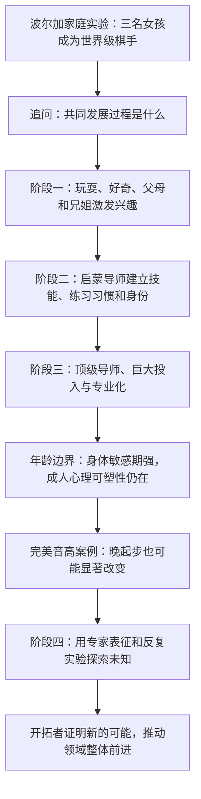
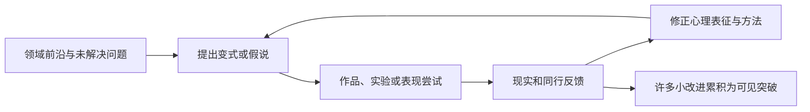

> **原书章节**：第 7 章“成为杰出人物的路线图”<br>
> **英文核心主题**：The Road to Extraordinary Performance<br>
> **原文来源**：《刻意练习：如何从新手到大师》<br>
> **本章任务**：从长期发展视角说明杰出人物怎样由兴趣萌芽，经认真训练和全力投入，到达领域前沿并开拓创新；同时解释年龄如何影响身体与心理适应，以及成年人在哪些条件下仍能发展此前被视为“错过窗口”的能力。<br>
> **阅读提醒**：路线图描述的是许多成功者的常见发展模式，不是每个人必须按相同年龄、相同顺序经过的自然定律。原书案例多来自成功者回顾，存在选择、回忆和资源偏差；它能提供发展假说，不能保证按图执行便成为世界级人物。

---

## 一、本章要解决什么问题

### 1. 从“怎样练”转向“一生怎样发展”

前六章解释了刻意练习的结构、心理表征、导师、专注、反馈和动机。本章把时间尺度扩展到十几年甚至整个职业生涯，追问：

1. 孩子最初为什么愿意接近一个领域？
2. 玩耍何时、怎样转变成有结构的训练？
3. 外部鼓励怎样逐渐变成自我驱动？
4. 何时需要更高水平导师和巨大资源投入？
5. 晚起步者受哪些真实年龄限制，又有哪些能力仍可训练？
6. 严格训练已有技能，怎样进一步通向创造前所未有的成果？

### 2. 本章的中心结论

> **杰出表现通常不是突然显露的天赋，而是一个长期发展的结果：早期玩耍和关系支持产生兴趣；适龄导师把兴趣转成训练习惯；技能、身份和内部动机增强后，学习者承担更高强度的刻意练习；进入前沿后，再借助已形成的心理表征、实验能力和长期专注探索未知。**

### 3. 四阶段路线图

本杰明·布鲁姆的研究原本辨认出前三个成长阶段，本章作者在此基础上增加第四个“开拓创新”阶段：

| 阶段 | 主要任务 | 主要支持者 | 核心动机 | 主要风险 |
| --- | --- | --- | --- | --- |
| 产生兴趣 | 把领域与玩耍、好奇和关系连接 | 父母、兄姐、启蒙者 | 好玩、亲近、赞许 | 过早控制、兴趣单一化 |
| 变得认真 | 建立基本技能与练习习惯 | 擅长启蒙的导师、父母 | 成就感、表演、身份萌芽 | 机械训练、外部奖励依赖 |
| 全力投入 | 追求国内外最高水平 | 顶级导师、学校、家庭与团队 | 专业身份、竞争、使命 | 成本、伤病、倦怠、机会不平等 |
| 开拓创新 | 在领域边界创造新方法或成果 | 同行网络、合作者、前沿反馈 | 问题本身、贡献与探索 | 旧表征僵化、探索无反馈 |

### 4. 阶段不是固定年龄开关

可以把发展状态写成：

$$
S_{t+1}=F(S_t, P_t, M_t, R_t, O_t, A_t),
$$

其中：

- $S_t$：当前技能与心理表征；
- $P_t$：练习质量和数量；
- $M_t$：动机；
- $R_t$：导师、家庭和同伴资源；
- $O_t$：比赛、教育和职业机会；
- $A_t$：年龄相关的身体与神经适应条件。

不同人可能较晚进入、阶段重叠、暂时退回或转向新领域。

### 5. 全章论证路线



### 6. 必须区分的三个结论强度

| 结论 | 本章支持程度 |
| --- | --- |
| 高质量环境和长期训练可以把儿童培养到远超通常预期的水平 | 强案例支持，且与多领域研究一致 |
| 大多数杰出者经历兴趣、认真训练、全力投入等相似功能阶段 | 回顾研究支持，但阶段边界并非固定 |
| 任意孩子只要父母按方案训练，必然成为任何领域的世界级天才 | 没有被证明 |

---

## 二、开篇：波尔加家庭实验从哪里来

### 1. 拉斯洛的主张

20 世纪 60 年代末，匈牙利心理学家拉斯洛·波尔加研究数百位被称为天才的人，形成一个强主张：正确养育和训练可以把普通孩子培养成天才。

他与教师克拉拉结婚后，计划在自己的孩子身上实践这一观点，并持续约 25 年。

### 2. 为什么选择国际象棋

他们考虑过语言和数学，最终选择国际象棋，主要因为：

- 规则稳定；
- 等级分和比赛结果较客观；
- 训练资料与对手较易获得；
- 当时女性在顶级棋坛极少，可检验性别偏见；
- 进步可以跨年龄持续测量。

选择一个可测领域，是把宏大教育主张转成可观察结果的重要方法。

### 3. 当时的性别背景

国际象棋长期被视为男性领域，女子比赛与公开比赛分离，社会普遍低估女性棋力。波尔加姐妹不只检验训练观点，也直接挑战“女性不能与男性在同一客观规则下竞争”的偏见。

### 4. 家庭实验为什么极端

父母让女儿主要在家接受教育，把大量时间和家庭资源投入棋艺，训练目标在孩子出生前已由父母决定。

这种环境带来极高训练密度，也引出伦理与外部效度问题：

- 孩子的自主选择在早期有限；
- 普通家庭难以复制时间和资源；
- 家庭兼任教师、教练与研究者，难以独立评价；
- 三个孩子共享遗传、文化和环境；
- 没有随机对照组；
- 只观察一个成功家庭，不能估计失败概率。

### 5. 它仍然能有力说明什么

这个案例至少构成**存在性证明**：在当时被认为不适合女性的高竞争领域，系统训练、家庭支持和长期机会可以造就多名世界级女棋手。

它反驳“女性因性别绝不可能达到顶级棋力”，却不能证明所有孩子都能达到同样终点。

---

## 三、三位女性象棋大师

### 1. 苏珊·波尔加

苏珊出生于 1969 年。4 岁时，她在布达佩斯女子 11 岁以下比赛中以 11 胜、0 负、0 和夺冠；15 岁时已进入世界顶尖女子棋手行列。

原书称她为第一位获特级大师称号的女棋手。更准确的历史表述是：她是第一位通过与男性相同的常规等级分和特级大师规范取得该头衔的女性；此前已有女性因世界冠军等成就获授特级大师称号。

### 2. 索菲娅·波尔加

索菲娅出生于 1974 年。14 岁参加罗马比赛，对多名男子特级大师取得 8 胜 1 和，赛事表现等级分约 2735，被称为“罗马大洗劫”。她职业最高等级分约 2540，曾排名世界女子第六。

原书把她未获特级大师头衔归因于政治。需要补充：达到 2500 等级分只是特级大师条件之一，还需在规定赛事取得若干“规范”。因此，不能只凭峰值等级分断言头衔缺失必由政治造成。

### 3. 朱迪特·波尔加

朱迪特出生于 1976 年。15 岁 5 个月成为当时史上最年轻的特级大师；连续约 25 年排名女子第一，直到 2014 年退役；世界男女综合排名最高曾到第 8；2005 年进入公开世界冠军候选体系的最高级别赛事。

她的成绩最直接地证明女性可以在不按性别降低标准的公开棋坛进入世界前列。

### 4. 为什么国际象棋结果特别有说服力

棋局胜负和等级分相对独立于外貌、学历和表演风格。三姐妹不是仅被父母宣布为天才，而是在大量公开比赛中稳定击败高水平对手。

### 5. 三姐妹之间的差异也很重要

她们共享家庭训练，却获得不同职业轨迹和成绩。索菲娅被描述为投入相对较少，朱迪特达到最高公开排名。

这提醒我们：同一家庭方案不会复制出完全相同的人。兴趣、训练量、机会、健康、个性和选择仍会产生差异。

### 6. 波尔加案例的因果边界

能够推出：

- 早期、长期、结构化训练可产生极高棋艺；
- 女性有能力达到公开国际象棋顶级水平；
- 家庭、导师、比赛和兄弟姐妹环境可共同塑造发展；
- 杰出表现不必靠未经训练便显现的神秘能力解释。

不能推出：

- 所有孩子都应家庭教育；
- 父母提前选定职业一定符合孩子福祉；
- 任意孩子经过同样训练都会成为特级大师；
- 遗传和个体差异完全没有作用；
- 国际象棋的路径可原样复制到所有领域。

### 7. 为什么从这个案例抽象“路线图”

三姐妹提供一条高度可见的发展链：幼年接触、父母引导、持续训练、赛事反馈、导师升级和世界级竞争。作者再用布鲁姆等研究判断哪些环节在其他领域也重复出现。

---

## 四、第一阶段：产生兴趣

### 1. 苏珊的“偶然发现棋子”故事

苏珊回忆自己约 3 岁时在壁橱找到棋子，先被形状吸引，后来迷上下棋。这个记忆与父母预先设计棋手培养计划并不完全一致。

这可能反映儿童视角、家庭叙事或回忆重构。重要机制不是棋子是否真的偶然被发现，而是国际象棋最初以可玩、可探索的对象进入她的生活。

### 2. 为什么兴趣阶段要从玩耍开始

幼儿尚不能理解十年训练和职业成就。玩耍提供即时回报：新奇、掌控、亲子互动和小成功。

$$
\text{好奇与玩耍}
\rightarrow\text{自愿重复接触}
\rightarrow\text{初级技能与熟悉感}
\rightarrow\text{更深兴趣的可能}.
$$

### 3. 早期玩耍与刻意练习的区别

玩耍主要由儿童兴趣驱动、规则灵活、错误代价低；刻意练习由具体目标和反馈驱动，通常费力。

第一阶段的目标不是提前把幼儿训练成专业者，而是建立正向关系、基本协调和继续探索的愿望。

## 4.1 杰出人物成长三阶段

### 1. 布鲁姆研究怎样进行

20 世纪 80 年代初，本杰明·布鲁姆团队研究 6 个领域的 120 位杰出人物：

- 音乐会钢琴家；
- 奥运游泳运动员；
- 世界冠军网球选手；
- 研究型数学家；
- 研究型神经学家；
- 雕塑家。

团队通过本人、家庭和导师的回顾资料寻找成长共同点，并提出三个阶段：早期兴趣、认真训练、全力投入。

### 2. 回顾性成功者研究的价值

- 能覆盖十几年发展；
- 可比较多个领域；
- 揭示家庭、导师和动机的重复模式；
- 为后续纵向研究提出假说。

### 3. 它的局限

- 只选成功者，缺少走过相似路径却未成功者；
- 成年人会按后来的成就重构童年；
- 访谈难以精确测量练习量和质量；
- 共同特征可能只是精英家庭资源；
- 六领域结果不能自动覆盖所有职业。

所以，三个阶段是**描述性发展框架**，不是必要且充分条件。

### 4. 父母怎样从玩具引向领域活动

父母先跟随孩子玩，再逐渐展示棋子怎样移动、球杆怎样击球、钢琴怎样产生旋律。泰格·伍兹约 9 个月时得到小球杆，是原书的极端例子。

关键不是越早越好，而是活动与儿童发展水平匹配，并保持安全和自主。

### 5. 父母提供的四种资源

1. 时间和共同注意；
2. 可接触的工具与环境；
3. 对尝试和小进步的鼓励；
4. 自律、责任和建设性使用时间的家庭规范。

### 6. 表扬怎样增强兴趣

表扬让孩子把小成功与父母认可联系起来。更稳健的做法是表扬具体策略、努力、诚实纠错和进步，而非贴“天才”标签。

只表扬结果可能使孩子害怕挑战；外部奖励过强也可能挤压自主兴趣。

### 7. 父母兴趣怎样塑造儿童选择

爱音乐、体育或学术的父母更常提供相关工具、谈话和共同活动，孩子因亲子互动而接触该领域。兴趣看似完全来自儿童，实际上由可获得环境塑造。

这不是说父母可以任意制造持久热爱。儿童反馈、气质和选择仍应决定是否继续。

### 8. 玩耍中的准练习

冰球运动员马里奥·拉缪与兄弟穿袜子在地下室滑行，用木勺推瓶盖；跨栏运动员大卫·赫梅利用弹簧单高跷跨越电话簿。

这些活动包含重复、挑战和即时结果，却仍以游戏为主。原书也承认，缺少研究能精确估计其对后来成就的贡献。

### 9. 早期广泛探索的替代路径

并非所有孩子都应过早专门化。许多领域可先接触多种运动、乐器、书籍和制作活动，再根据持续兴趣和反应选择。广泛探索还可减少过用伤病和身份过早锁定。

## 4.2 兄弟姐妹的激励作用

### 1. 兄姐怎样发挥作用

- 提供可观察的近距离榜样；
- 证明年龄相近者也能掌握技能；
- 共享工具、规则和练习环境；
- 吸引父母注意，促使弟妹参与；
- 提供略高水平的日常对手；
- 激发合作与竞争。

### 2. 原书列举的例子

- 朱迪特有苏珊和索菲娅两位姐姐；
- 莫扎特有年长约四岁半、学习大键琴的姐姐玛丽亚；
- 塞雷娜·威廉姆斯追随维纳斯；
- 米凯拉·谢弗琳有从事竞技滑雪的哥哥泰勒；
- 马里奥·拉缪与两位哥哥共同玩冰球。

### 3. 为什么弟妹有时成就更高

可能机制包括：

- 父母在第一个孩子身上学会更好训练方法；
- 弟妹更早接触；
- 哥姐提供更强对手；
- 家庭已经建立领域资源和身份；
- 弟妹有明确可追赶目标。

### 4. 不能把出生顺序当因果定律

许多杰出者没有兄姐，兄姐也可能产生压力、比较和资源竞争。成功家族容易被报道，普通家族不易被看见。

真正可迁移的是“略高水平同伴与共享环境”，不必由血缘兄姐提供。

### 5. 数学家与神经科学家的不同起点

父母通常不会为 6 岁儿童聘请研究数学导师，而是培养一般好奇、阅读、模型制作和科学项目。特定学科兴趣往往在初中或高中遇到代数、几何、微积分或优秀教师后出现。

这说明第一阶段的形式依领域而异：身体和音乐活动可很早具体化，抽象学科可能先形成广泛认知兴趣。

### 6. 第一阶段结束的标志

孩子不再只把器材当玩具，而开始关心领域内部关系、挑战和进步。例如苏珊开始被棋子协同与比赛吸引。

标志不是某个固定年龄，而是愿意为掌握本身投入更有结构的努力。

---

## 五、第二阶段：变得认真

### 1. 从玩耍到刻意练习的转折

学习者开始接受课程、练习日程和纠错。活动仍可有趣，但不再完全由即时兴趣决定，必须练习当前做不好的部分。

### 2. 第一位导师最重要的能力

启蒙导师未必是领域顶尖者，更重要的是：

- 擅长教儿童或初学者；
- 能把任务拆成可成功的小步；
- 用具体表扬和反馈维持兴趣；
- 建立正确基础动作；
- 让练习逐渐成为习惯；
- 知道何时提高难度。

### 3. 拉斯洛的角色

拉斯洛并非强棋手，女儿不到 10 岁便超过他，但朱迪特称他是极优秀的激励者。他能启动训练、组织资源、保持兴趣，并在能力超出自己后寻找更强对手和指导。

这说明早期导师不必拥有最终水平，但必须知道自己的边界。

### 4. 父母怎样支持日程

父母提供时间、交通、费用和日常提醒，使“先练再玩”成为规律。外部结构对尚未具备长期规划能力的儿童很重要。

### 5. 控制与支持的伦理边界

原书提到一些父母用“卖掉钢琴”或停止送训威胁孩子继续。成功者后来选择留下，不代表这种做法普遍合理。

支持型结构应：

- 解释目标与选择；
- 听取儿童反馈；
- 允许试用和退出；
- 不以羞辱、恐惧或关系撤回来强迫；
- 保护教育、健康、社交与睡眠；
- 定期重审目标是否仍属于孩子。

### 6. 外部动机怎样逐渐内化

开始时，表扬、糖果、父母关注和公开表演提供即时回报。随着技能提高，学习者能欣赏更复杂的音乐、棋局和战术，并从掌握本身获得满足。


### 7. 心理表征为什么能增强兴趣

新手只听到音符、看到棋子；表征提高后，能感知和声、策略、优雅解法和微妙进步。领域变得更有意义，活动的内在回报增加。

### 8. 数学兴趣如何被教师点燃

未来数学家往往在中学遇到优秀教师。好教师不只教公式，而是鼓励发现模式、解释原因和推广方法。

对抽象学科，智力上的“为什么”可能比幼儿奖励更重要。

### 9. 从家长负责到学生负责

早期家长安排日程；随着年龄和技能增长，练习责任移向学生与教练。学生主动找更好导师、延长训练、参加更高水平活动。

若责任始终只由父母承担，离开监督后训练容易停止。

### 10. 身份形成

布鲁姆研究中，部分钢琴家和游泳者约在 11 至 12 岁开始把自己视为“钢琴师”或“游泳选手”；未来数学家可能到 16 至 17 岁才形成“数学家”身份。

身份能增强坚持，但过度单一会使一次失败威胁整个自我，也会压缩其他发展。健康身份应允许“我是练习这项技能的人”，而非“我的价值只由成绩决定”。

### 11. 艺术家的“自加燃料”

大卫·帕里斯的艺术家研究描述出一种逐渐自我驱动的繁重工作动机，同时仍需要父母和导师的情绪、技术支持。

自主并不等于独自完成所有事情。

### 12. 练习会不会让人更喜欢一项技能

作者提出两种解释：

1. 自我选择：本来更喜欢的人才练得久；
2. 适应效应：长期练习提高表征和奖赏，使人后来更喜欢。

现有案例无法完全区分。合理结论是两者可能相互作用，不应把后来热爱反推为一开始就拥有天生激情。

### 13. 第二阶段进入下一阶段的信号

- 能稳定进行有目的或刻意练习；
- 已有领域身份和内部目标；
- 主动寻求更强导师和对手；
- 愿意为高水平牺牲部分其他机会；
- 当前环境不足以继续提高。

---

## 六、第三阶段：全力投入

### 1. 阶段任务

未来杰出者通常在青少年期决定追求国内或国际最高水平。原书给出约 12 至 13 岁或 15 至 16 岁的常见区间，但不同领域和个人差异很大。

### 2. 导师和学校升级

学习者在更大范围寻找顶级导师、专业学校和训练团队。导师本身可能是音乐会演奏者、一流研究者或培养过奥运选手的教练。

顶级导师选择学生，也构成机会筛选：被接收不仅反映当前能力，还受名额、网络、经济和地域影响。

### 3. 期望怎样提高

- 游泳者持续突破个人最好成绩并进入国内外比赛；
- 钢琴家学习更难曲目和更高表达标准；
- 数学学习者开始解决无现成答案的问题；
- 棋手进入更强比赛并分析更复杂局面。

任务始终略超当前能力，但终极参照逐渐接近领域前沿。

### 4. 动机和责任归属

此时日常训练主要由学习者自己承担，家庭仍提供经济、交通、情感和生活支持。若目标主要属于父母而非青少年，高压投入难以健康维持。

### 5. 资源门槛

原书引用《金钱》杂志 2014 年对培养一流网球选手的估算：

- 私教每年约 4500 至 5000 美元；
- 团体课约 7000 至 8000 美元；
- 场地训练每小时约 50 至 100 美元；
- 国家级比赛报名约 150 美元，另加交通；
- 顶尖青少年每年约参加 20 场比赛；
- 随队教练每天约 300 美元，另加旅宿；
- 全年总支出容易超过 3 万美元；
- 佛罗里达 IMG 学院当时一年约 71400 美元，比赛费用另计。

这些是 2014 年历史价格，不是当前报价。

### 6. 为什么资源是因果链的一部分

钱能购买导师、场地、比赛、恢复和时间；父母还可能搬家或放弃工作。资源并不直接变成技能，却决定高质量训练机会。

$$
\text{潜在能力}
\xrightarrow{\text{机会与资源}}
\text{可获得训练}
\xrightarrow{\text{长期练习}}
\text{实际表现}.
$$

忽略资源会把机会不平等误写成天赋或意志差异。

### 7. 多孩家庭的现实约束

同时支持多个孩子追求世界级目标极其昂贵、耗时。波尔加家庭是罕见的全家投入，并非普通家庭可轻易复制。

### 8. 全力投入不等于牺牲一切

世界级目标需要取舍，但睡眠、教育、健康、关系和自主性不是可无限消耗的成本。过度专业化可能导致伤病、倦怠和身份危机。

### 9. 替代路径

- 公共训练体系和奖学金；
- 学校、俱乐部与社区资源；
- 分阶段试投而非一次押上全部；
- 远程指导和共享设施；
- 选择较低成本但仍有意义的高水平目标；
- 成年后以非世界级目标追求显著提高。

### 10. 本阶段结论的边界

高投入是世界级发展的常见条件，但投入越大不保证结果越高。伤病、竞争、训练错误和机会都可能中断路线。

---

## 七、年龄与适应能力的关系

### 1. 作者先区分两类限制

- **实践限制**：成年人缺少每天四五小时、家庭资助和多年比赛路径；
- **适应限制**：某些身体结构和神经系统在早期更易改变。

很多成人首先受时间和机会限制，而非绝对生理不可能。

### 2. 年龄效应不是单一曲线

不同能力依赖不同系统：骨骼、肌腱、速度、听觉、语言、知识和策略的敏感期不同。不能用一个“最佳学习年龄”概括所有技能。

## 7.1 身体适应能力受年龄影响大

### 1. 一般趋势

身体速度、柔韧、恢复和最大体能通常在青年期较有优势；年龄增长后伤病风险和恢复时间增加。职业运动员常在 20 多岁达到峰值，但训练和医疗可延长到 30 多岁或 40 岁。

### 2. 老年仍可训练

人们可以训练到 80 岁以上。停止或减少练习是年龄相关退化的一部分原因；持续训练者通常保留更多能力。

老年组使用相同的渐进和反馈原则，但需降低负荷、增加恢复并进行医学评估。

### 3. 大师运动员的比较

原书称，60 多岁马拉松参与者中约四分之一可击败一半以上 20 至 54 岁参赛者。这个比较反映参加比赛的老年人高度自我选择，不能代表全部 60 岁人群，也不能说明年龄无影响。

### 4. 百岁运动员案例

书中写到唐·佩尔曼 2015 年在 27 秒内跑完 100 米，并创造百岁年龄组多个田径纪录；还援引华嘉·辛格 2011 年百岁组马拉松 8 小时 25 分 17 秒的记录。

这些是书中历史纪录；超高龄运动员的年龄认证和赛事口径可能存在争议。案例只说明高龄仍可训练和比赛，不表示能维持青年水平。

### 5. 发育窗口影响某些结构

#### 芭蕾外开

原书认为完整外开动作需要在髋膝发育较早阶段训练，并提到约 8 至 12 岁的骨骼变化。更准确地说，外开能力受髋臼、股骨结构、韧带和控制共同影响；强迫儿童外开可能受伤，早训也不能改变所有解剖差异。

#### 过肩投掷与发球

棒球投手和网球选手从小训练，肩部活动范围和骨骼适应可能与晚起步者不同。训练必须由技术和医学专业人员控制，不能以追求结构改变为由过度负荷儿童。

#### 握拍手臂骨骼

原书援引职业网球选手握拍前臂骨骼可比另一侧粗壮约 20%，说明青春期机械负荷会塑造骨骼；成年开始仍可适应，只是幅度可能较小。

### 6. 敏感期的严格含义

**敏感期**是某种经验更容易或以不同机制塑造系统的时期，不等于期外完全不能学习。

**关键期**则更强，指缺少特定输入后能力难以正常形成。很多技能只有敏感期证据，不应随意称为不可逆关键期。

### 7. 身体训练的安全边界

- 年龄分组和个体评估；
- 渐进负荷；
- 足够恢复；
- 不用疼痛证明有效；
- 保护长期关节和骨骼；
- 接受某些世界级身体项目的晚起步限制。

## 7.2 心理适应能力比身体更强

### 1. 成年大脑仍可改变

随着年龄增长，某些发育路径关闭或减弱，但学习、突触调整、髓鞘变化和网络重组仍持续。成年人可能用不同机制达到功能改善。

### 2. 音乐家脑胼胝体研究

一些研究发现成年音乐家脑胼胝体平均更大，但差异主要出现在 7 岁前开始训练者。脑胼胝体连接左右半球，早期双手音乐训练可能影响其发育。

这些多为横断面或观察研究，早起步还与累计时数、家庭和选择混杂，不能单独证明因果。

### 3. 小脑的不同模式

音乐家小脑某些指标也可能不同，但早起步和晚起步音乐家之间未必存在相同差异，提示成年训练仍可改变部分运动控制网络。

### 4. 大脑发育背景随年龄变化

幼儿早期突触数量很高，原书称两岁儿童约比成人多 50%；青少年后灰质指标总体下降，经历突触修剪和网络专门化。

“减少”不等于退化。删除低效连接、增强关键通路也可提高效率；脑组织越多不等于能力越强。

### 5. 不同年龄学习同一内容，机制可能不同

6 岁、14 岁和成年人即使学同一技能，也拥有不同语言、知识、注意、发育和神经背景。成人可能依靠更强概念知识和策略，补偿某些可塑性下降。

### 6. 双语者的灰质研究

会多门语言者在与语言有关的下顶叶区域可能有不同灰质指标，较早学习第二语言与更多灰质相关。

这说明年龄与结构变化模式相关，不表示脑区越大、语言一定越好。

### 7. 同声传译研究

书中提到，成年同声传译者与学习相同数量语言、但不做翻译者相比，某些脑区灰质反而更少。研究者推测成年学习发生在突触修剪背景下，可能通过去除低效连接提高处理效率。

这是解释性假说。职业选择、训练强度和其他差异也可能造成结果，不能把“灰质更少”直接等同于更高效率。

### 8. 两条稳健结论

1. 成人大脑仍能因训练发生功能和结构变化；
2. 儿童与成人可能通过不同神经路径学习，不能用儿童方法和标准机械评价成人。

### 9. 成人训练的现实优势

- 更强的目标理解；
- 可主动选择导师和方法；
- 已有概念和元认知；
- 能规划时间和记录反馈；
- 可利用跨领域知识。

这些优势不能完全抵消所有敏感期，却能显著提高许多知识和策略技能的学习效率。

---

## 八、成年人也可培养出完美音高

### 1. 为什么选完美音高作边界测试

完美音高长期被视为必须在儿童早期获得的能力。如果成年人能显著培养，它会直接挑战“错过窗口便绝不可能”的二元观。

### 2. 完美音高的严格定义

**绝对音高或完美音高**是没有外部参考音时，能够识别或产生某一音高类别的能力。

它与**相对音高**不同：后者在已知参考音基础上判断音程。测试还需规定乐器、音色、八度和允许误差，因此“拥有/没有”并非完全统一的自然分类。

### 3. 年龄规律

早期音乐和音名训练与绝对音高高度相关，6 岁前开始通常机会更高；12 岁后明显更难。难并不逻辑等于不可能。

## 8.1 先锋个案

### 1. 保罗·布拉迪的背景

1969 年，贝尔实验室研究者保罗·布拉迪 32 岁。他 7 岁学钢琴、12 岁参加合唱，还给大键琴调音，却没有绝对音高。

21 岁时，他曾连续约两周反复听 A 音，之后仍无法与 B、C 或升 G 等音稳定区分；后来类似尝试也失败。

### 2. 32 岁时的初次再尝试

他先用心理想象、不同调弹曲等方法练三个月，仍无明显效果。失败说明“投入时间”不够，还需要能提供可控刺激和反馈的任务。

### 3. 纯音自适应训练

受到论文启发，他用计算机生成单一频率纯音：

1. 初期提高 C 音出现概率；
2. 学会稳定识别 C；
3. 再逐渐减少 C 的特殊频率；
4. 最后让十二个半音等概率出现；
5. 每次判断后获得答案反馈。

他每天约训练半小时，两个月后能在纯音任务中无误识别十二音。

### 4. 为什么先提高 C 音频率

这相当于先建立一个稳定锚点，再把其他音与其区分。随着能力提高，训练分布逐渐接近完整任务。

### 5. 钢琴迁移测试

其妻连续 55 天在钢琴上随机弹音让他识别。原书报告 37 次完全正确，其他多数错误只差半音，约两次偏差更大。

原文对错误计数的措辞略有歧义，因此应保留总体结论：纯音训练显著迁移到复杂钢琴音色，但并非每次完美。

### 6. 个案能支持什么

- 至少一名成年音乐背景者通过结构化训练显著提高绝对音高识别；
- 先前失败与后来成功的差异指向训练方法；
- 成人敏感期外学习并非绝对不可能。

### 7. 个案不能支持什么

- 单人自我实验不能估计成功率；
- 他有长期音乐背景，不代表音乐新手；
- 测试者是妻子，未必盲法；
- 练习音和测试音范围有限；
- 识别能力是否长期维持、能否跨乐器泛化需继续验证；
- “允许半音误差”的绝对音高标准并非所有研究一致采用。

## 8.2 实验证据

### 1. 拉什研究设计

20 世纪 80 年代中期，俄亥俄州立大学研究生马克·艾伦·拉什招募 52 名音乐专业本科生：

- 一半选择参加戴维·卢卡斯·伯奇的九个月训练；
- 另一半不接受该训练；
- 两组均在前后完成 120 个音的识别测试。

伯奇课程要求学习者关注不同音高的“颜色”，避免只依赖音量和音色。

### 2. 为什么“颜色”不必按字面理解

它可能是一种注意和编码提示，让学习者寻找稳定音高类别感觉，不一定表示真正视觉颜色或联觉。

### 3. 结果

- 未训练组前后大体不变；
- 训练组许多学生提高；
- 起点较好者中，有人从约 60/120 提高到超过 100/120，达到研究采用的绝对音高标准；
- 另有三名起点较低者正确数提高约两至三倍、严重错误减少；
- 其他参与者改善较小或没有明显变化。

### 4. 结果能推出什么

一些成年音乐学生可以通过长期训练显著改善无参考音识别，个体反应差异很大。绝对音高更像可连续改善的能力，而非绝对二元天赋。

### 5. 研究设计的限制

- 参加训练者是“选择上课”，未必随机分组；
- 训练组可能动机和起点更高；
- 无主动对照，无法排除测试期待和额外注意；
- 大学生都有音乐背景；
- 课程九个月，练习依从性可能不同；
- 结果不足以证明大多数成年人最终都会达到标准。

### 6. “训练继续便多数人都能成功”为什么只是推测

部分学习曲线可能继续上升，也可能进入平台。没有继续追踪就不能从当前趋势推断终点。

### 7. 两项证据合在一起的合理结论

> 儿童早期仍是绝对音高最有利的学习窗口，但窗口之外并非绝对关闭；至少部分有音乐基础的成年人能通过适当训练显著提高，少数可达到某些研究定义下的完美音高标准。

### 8. 实践边界

绝对音高不是成为优秀音乐家的必要条件，相对音高、节奏、听觉表征和表现力更普遍重要。投入大量时间前，应判断它是否服务自己的真实音乐目标。

---

## 九、第四阶段：开拓创新

### 1. 为什么杰出还不是终点

前三阶段把学习者带到领域前沿。此时现有导师和练习任务只能教到已知最高标准；再进步意味着提出前人没有答案的问题。

### 2. 奈杰尔·理查兹的拼字游戏成绩

新西兰选手奈杰尔·理查兹 1997 年进入并赢得全国 Scrabble（拼字游戏）决赛，1999 年赢得世界赛。书中写作时，他已多次获得世界、美国、英国和泰国国王杯冠军，并拥有极高等级分。

按原书当时的统计，他曾 3 次赢得世界锦标赛、5 次赢得美国全国赛、6 次赢得英国公开赛，并 12 次赢得泰国国王杯；这些是本书写作时的历史快照，不应当作 2026 年的最新生涯统计。

2015 年，他在不会说法语的情况下，用约 9 周记忆法语词典并赢得法国赛，展示了高度专项的词形记忆和比赛表征。

Scrabble 是棋盘词汇游戏，不等同于口头拼字大赛；语言交流能力也不等于合法词表记忆。

### 3. 为什么把他放在创新阶段

他把该项目可达到的稳定表现推到此前未见水平。开拓不必创造一件物品，也可以创造新的表现标准和训练可能。

## 9.1 创新离不开刻意练习

### 1. 作者的基本论证

1. 创新必须识别现有方法的边界；
2. 识别边界需要深厚领域表征；
3. 深厚表征通常来自长期高质量训练；
4. 因而，重大创新者往往先成为领域专家，再超越既有做法。

### 2. 毕加索的例子

毕加索后期作品与古典画法差异巨大，但早年接受扎实传统训练，也能完成高水平古典作品。后来他探索、组合并改变多种风格。

表面上的“打破规则”建立在理解规则、控制材料和看见替代方案之上。

### 3. 到达前沿后，练习发生什么变化

在成熟技能阶段，导师知道目标动作；在前沿阶段，没有人知道正确答案。专家仍沿用刻意练习形成的能力：

- 精确表征当前结果；
- 发现缺陷和未解决问题；
- 设计变式；
- 获取反馈；
- 反复修正；
- 长期承受失败。

但严格来说，此时活动不再完全符合“已有成熟方法和导师”的刻意练习定义，更接近**有目的的探索、实验和训练研发**。

### 4. 梯子比喻

前人搭好的梯子让学习者到达边界；到顶端后，创新者必须利用已学会的“搭梯子方法”增加新一级。

### 5. 创新为什么通常缓慢

局外人只看最终论文、画作、纪录或发明，看不到大量草稿、失败实验和局部调整，于是把累积变化误解为突然灵感。



### 6. 创新还需要哪些刻意练习之外的条件

- 问题选择；
- 跨领域知识与类比；
- 多样合作；
- 容许失败的资源和组织；
- 新工具和材料；
- 偶然发现；
- 社会接受和传播。

所以，领域精通常是重要基础，不是创新的充分条件。

### 7. 外行是否永远不能创新

原书倾向强调先成为专家。现实中，外部视角可能提出新组合，但有价值的落地通常仍需要领域知识或与专家合作。过深经验也可能造成思维定势，因此前沿探索要主动引入反例和多样视角。

### 8. 诺贝尔奖得主的产出研究

书中提到诺贝尔奖得主往往更早发表、职业生涯论文更多，用来支持长期努力与创造性成就相关。

不能简单推出“发论文越多便越创新”：领域、团队、资源、年龄和选择都会影响数量；高产可能增加产生少数重要成果的机会，但质量仍需独立评价。

### 9. 创新训练的可操作结构

1. 复现领域最佳成果；
2. 明确现有方法在哪些条件失效；
3. 建立可测的新目标；
4. 系统改变一个或少数变量；
5. 保留失败和负结果；
6. 寻求强同行批评；
7. 将有效变式整合为新方法；
8. 让他人复现并检验边界。

## 9.2 开拓者的超越与带动

### 1. “奈杰尔效应”是什么

心理学家用“奈杰尔效应”描述：一个人做出此前被视为不可能的表现后，其他从业者会更新对可达上限的判断并加快追赶。

理查兹据书中统计，赢得约 75% 的参赛赛事。即使他不公开训练方法，仅其成绩也构成可行性信号。

### 2. 存在性证明怎样改变领域

$$
\text{有人做到}
\rightarrow\text{“不可能”假设被推翻}
\rightarrow\text{同行增加搜索与投入}
\rightarrow\text{训练方法扩展}
\rightarrow\text{整体门槛上升}.
$$

### 3. 只知道“可以做到”为什么仍有价值

它提高成功预期，促使教练重新检查旧方法，也吸引资源进入训练研发。体育中的“四分钟一英里”等现象常有类似社会预期效应。

### 4. 为什么存在性证明不提供完整路径

开拓者可能不愿或无法解释方法；成绩还可能依赖独特资源和个人条件。同行仍需逆向研究、实验和验证。

### 5. 开拓者怎样带动后继者

- 提高目标标准；
- 展示新动作或策略；
- 产生可分析作品和比赛记录；
- 激发新的专项练习；
- 让下一代从更高起点出发。

### 6. 领域进步的循环


### 7. 创新评价的社会条件

一个成果要成为领域创新，还需被同行理解、验证和采用。仅仅不同不等于创新；它必须对目标问题提供新价值。

### 8. 第四阶段的边界

- 并非每位专家都需要创新，可靠复现和服务同样有价值；
- 创新无法像成熟技能一样保证训练结果；
- 失败率高且反馈延迟；
- 资源和合作网络影响巨大；
- 旧表征既是基础，也可能成为束缚；
- 社会认可可能滞后或受权力影响。

---

## 十、作者分析问题的方法

### 1. 先用极端家庭案例展示可能性

三姐妹都成为高水平棋手，使案例难以用一次偶然成功解释。国际象棋客观指标又减少审美争议。

### 2. 再用跨领域回顾研究寻找共同过程

波尔加案例本身特殊，布鲁姆的 120 位、6 领域研究帮助作者抽象兴趣—认真—投入三个功能阶段。

### 3. 把动机放回发展过程

作者不把“热爱”当出生特质，而分析玩耍、表扬、技能、身份、导师和同伴怎样逐步改变动机。

### 4. 区分不同领域的起步方式

音乐和体育可幼年具体接触；数学和神经科学常由一般好奇和中学教师引入。路线图保留共同功能，不要求相同表面形式。

### 5. 把资源成本纳入第三阶段

详细列出网球费用，说明世界级培养不只是心理努力，也依赖家庭和制度机会。

### 6. 先讨论年龄限制，再用边界案例检验

作者承认身体发育窗口，然后转向成人大脑和完美音高，避免“可塑性无限”与“错过年龄全无希望”两个极端。

### 7. 用单个先锋案例提出可能，再用组间研究增强证据

布拉迪证明成年人可能显著改变，拉什的 52 人研究则显示个体反应分布。后者仍不完美，但比单人故事更强。

### 8. 用创新阶段化解“练已知如何产生未知”的张力

作者认为，刻意练习形成的表征、自我监测和改进习惯可延伸到前沿。严格定义上的成熟训练路径在这里消失，因此需要实验性探索补足。

### 9. 从个人突破扩展到领域演化

奈杰尔效应说明开拓者不仅提升自己，也改变同行预期和训练标准，把个体学习连接到代际文化积累。

### 10. 本章方法的主要局限

- 波尔加样本是一个高度特殊家庭；
- 布鲁姆只研究成功者，存在幸存者和回忆偏差；
- 阶段年龄来自少数领域，不能机械普适；
- 儿童培养案例容易忽视自主、教育和福祉；
- 身体与脑结构研究多为相关性；
- 绝对音高训练证据样本小、分组不完全随机；
- 创新者案例存在名人选择偏差；
- 论文数量不能完整测量创造力；
- 资源、制度、性别和文化机会在成就中作用巨大。

---

## 十一、把本章转化为发展规划

### 1. 对儿童：先探索，不急于承诺世界级目标

- 提供多种安全活动；
- 跟随持续兴趣而非一次兴奋；
- 让玩耍保留自主性；
- 表扬策略和进步；
- 观察孩子主动回到哪些活动；
- 避免用父母梦想替代儿童目标。

### 2. 从兴趣进入认真训练的检查点

只有当孩子愿意接受规则、重复和反馈，且活动未损害健康与基本发展时，才逐步增加结构。

### 3. 选择启蒙导师

优先儿童教学、动机保护、基础动作和安全，而非只看竞技头衔。

### 4. 逐步转移责任


### 5. 全力投入前做现实评估

- 孩子是否真正选择这个目标；
- 身体和心理健康是否允许；
- 家庭成本是否可持续；
- 是否有退出和转向方案；
- 教育与社交是否被合理保护；
- 目标是世界级、职业级还是个人高水平；
- 是否存在奖学金和公共资源。

### 6. 对成年晚起步者：先判断能力类型

#### 身体结构依赖强

接受某些世界级项目的敏感期边界，把目标调整为年龄组或个人水平。

#### 知识、策略和表达依赖强

成人往往仍有很大提升空间，可利用元认知、已有知识和自主规划。

#### 混合技能

分别评估身体、感知、动作和认知成分，避免用最受限成分否定全部发展。

### 7. 成人训练实验的最低设计

1. 建立可靠基线；
2. 使用有反馈的结构化方法；
3. 设定合理周期；
4. 使用未训练材料测试；
5. 记录个体差异和平台；
6. 比较不同方法；
7. 检查保持与真实用途。

### 8. 进入创新阶段的准备

- 能复现领域最佳成果；
- 知道现有方法为何有效；
- 能识别边界与异常；
- 拥有稳定反馈渠道；
- 有实验和记录习惯；
- 能承受长期不确定性；
- 与不同背景同行合作。

### 9. 一个四阶段发展记录模板

```markdown
## 当前阶段
- 兴趣 / 认真训练 / 全力投入 / 开拓创新：
- 判断依据：

## 动机
- 当前主要继续理由：
- 活动本身的乐趣或意义：
- 外部支持是否正在内化：

## 技能与心理表征
- 当前能识别和做到什么：
- 下一项关键能力：

## 导师与环境
- 当前导师适合哪个阶段：
- 需要升级或新增什么支持：

## 年龄和健康
- 是否存在身体敏感期或伤病风险：
- 成人优势可怎样补偿：

## 资源与自主
- 时间、费用和机会是否可持续：
- 目标是否仍由学习者本人选择：

## 下一阶段条件
- 哪些证据出现后才增加投入：
- 哪些信号出现时应调整或退出：
```

### 10. 不追求世界级时怎样使用路线图

普通学习者也可使用前两阶段：通过玩耍建立兴趣，用导师和练习形成稳定能力。无需进入高成本全力投入或创新阶段，显著提高本身就是合理目标。

### 11. 防止路线图变成淘汰机制

- 不以早期成绩给孩子贴永久标签；
- 不把晚起步等同没潜力；
- 不因资源不足误判天赋；
- 提供多次进入和转向机会；
- 评价进步率、学习质量和兴趣，而非只看当前排名；
- 将健康与自主列为成功指标。

---

## 十二、核心概念辨析

| 概念 | 严格含义 | 常见误解 |
| --- | --- | --- |
| 路线图 | 杰出者发展中常见的功能阶段模型 | 人人必须按固定年龄走同一路径 |
| 家庭实验 | 波尔加父母在三个女儿身上实施的长期培养方案 | 随机对照教育实验 |
| 存在性证明 | 至少一个案例证明某结果可能发生 | 证明所有人都能得到该结果 |
| 等级分 | 根据对局结果估计相对棋力的动态指标 | 完整测量创造力和所有棋艺品质 |
| 特级大师规范 | 在规定强度赛事取得头衔所需的高水平表现条件 | 只要等级分超过 2500 即自动获得头衔 |
| 兴趣萌芽 | 玩耍、好奇和关系使儿童愿意持续接触领域 | 天生且终身不变的激情 |
| 早期专门化 | 幼年集中训练一个领域 | 所有项目成为世界级的必要条件 |
| 广泛探索 | 先接触多种活动再选择 | 缺乏认真或浪费时间 |
| 外部动机 | 奖励、认可、责任和机会带来的行动理由 | 必然损害内部兴趣 |
| 内化 | 外部支持逐渐转成个人认同和自我调节 | 不再需要任何社会支持 |
| 专业身份 | 把某项实践视为自我概念的一部分 | 个人价值只能由成绩决定 |
| 全力投入 | 为高水平目标系统配置训练、导师和资源 | 不顾健康和自主牺牲一切 |
| 机会结构 | 决定谁能接触导师、比赛、设备和时间的环境条件 | 与能力发展无关的背景噪声 |
| 敏感期 | 某类经验更容易塑造系统的时期 | 错过后绝对不能学习 |
| 关键期 | 缺少特定输入会严重阻碍正常形成的更严格窗口 | 任何早学更快的现象 |
| 大师运动员 | 按年龄组持续训练和参赛的成年人 | 身体完全不受衰老影响的人 |
| 神经修剪 | 连接选择性减少和网络专门化的过程 | 大脑单纯退化 |
| 绝对音高 | 无外部参考时识别或产生音高类别 | 优秀音乐家的必要条件 |
| 相对音高 | 根据参考音判断音程关系 | 低级或无用的听觉能力 |
| 先锋个案 | 首次显示某现象可能的高信息个案 | 可估计人群成功率的证据 |
| 开拓创新 | 在领域前沿创造有价值的新方法、成果或标准 | 只要与众不同就是创新 |
| 有目的的探索 | 在无现成正确答案时以假说、实验和反馈搜索 | 严格刻意练习的完全同义词 |
| 奈杰尔效应 | 极端表现更新同行对可达上限的预期并推动追赶 | 单个高手自动把方法传给所有人 |

---

## 十三、本章完整结论

### 1. 波尔加姐妹证明了什么

早期、长期、结构化训练和强家庭支持可以让多名女孩达到公开国际象棋世界级水平，并有力反驳女性不可能进入顶级棋坛的偏见。

### 2. 她们没有证明什么

三名同一家庭的成功者没有对照，无法证明任意孩子按同一方案必成天才，也不能证明极端家庭投入适合所有儿童。

### 3. 第一阶段的核心是什么

通过玩耍、关系和小成功建立自愿接触，让孩子从器材外形逐渐看见领域内部结构。父母提供机会，不应过早夺走自主。

### 4. 兄弟姐妹为什么有帮助

兄姐提供近距离榜样、稍强对手和共享资源；真正可迁移的是略高水平同伴环境，不是出生顺序定律。

### 5. 第二阶段发生什么变化

启蒙导师把兴趣转成基础技能和训练习惯；外部表扬逐渐通过技能、心理表征和身份内化为自我驱动。导师教学能力比个人最高成就更重要。

### 6. 第三阶段需要什么

学习者主动承担高强度训练，寻找顶级导师和比赛，并依赖家庭、学校和经济资源。高投入是常见条件，却不是成功保证。

### 7. 年龄真正限制什么

身体结构、速度、柔韧和恢复受发育窗口影响较大；成人仍能持续训练并改进。不同技能的敏感期不同，不能用一个年龄阈值概括。

### 8. 成人大脑还能怎样学习

成人可通过突触调整、网络重组和策略利用形成新能力，机制可能不同于儿童。脑区更大或更小都不能单独代表更好。

### 9. 完美音高证据说明什么

布拉迪个案和拉什研究共同表明，部分有音乐基础的成年人可显著提高无参考音识别，少数达到特定测试标准；结果不支持“所有成年人都能练成”。

### 10. 第四阶段为何不是简单继续模仿

领域前沿没有现成答案。专家利用刻意练习形成的表征、自我监测和实验能力，转向有目的探索；创新还需问题、资源、合作和社会验证。

### 11. 开拓者怎样推动领域

极端成就构成存在性证明，改变同行预期，产生新参照和训练方法，最终抬高整个领域的标准。

### 12. 路线图最稳健的读法

> 兴趣需要被培育，训练需要逐步升级，世界级成就需要长期资源，年龄限制因技能而异，创新建立在深厚专业能力之上；任何阶段都不取消个体选择、健康、机会和不确定性。

### 13. 本章如何引向第 8 章

本章展示环境和训练怎样发展杰出能力，下一章将正面处理剩余问题：天生特征、智力和基因究竟在多大程度上影响起点、训练参与和最终表现。

---

## 十四、复习问题

1. 拉斯洛为什么选择国际象棋，而不是语言或数学？
2. 波尔加家庭实验为何不是随机对照实验？
3. 三姐妹案例作为存在性证明能反驳什么？
4. 为什么它不能证明“任意孩子都能成为天才”？
5. 苏珊“第一位女特级大师”的更准确表述是什么？
6. 索菲娅等级分超过 2500，为什么不自动获得特级大师头衔？
7. 朱迪特的公开棋坛成绩怎样反驳性别偏见？
8. 三姐妹不同结果为什么与本章同样重要？
9. 第一阶段为什么以玩耍而不是刻意练习开始？
10. 玩耍怎样可能成为进入专业训练的跳板？
11. 布鲁姆研究包含哪 6 个领域和多少位杰出人物？
12. 成功者回顾研究最重要的三类偏差是什么？
13. 父母怎样从玩具逐步引导到领域活动？
14. 过程表扬为什么通常比“你是天才”更稳健？
15. 马里奥·拉缪和大卫·赫梅利的游戏能说明什么，不能说明什么？
16. 广泛探索何时比早期专门化更合理？
17. 兄弟姐妹通过哪些机制影响发展？
18. 为什么弟妹成就更高不能被解释为出生顺序定律？
19. 数学家和神经科学家的兴趣起点为何不同于运动员？
20. 第一阶段结束的功能性标志是什么？
21. 启蒙导师为什么不必是世界级专家？
22. 拉斯洛在女儿棋力超过自己后仍有什么价值？
23. 父母强制练习有哪些自主和伦理边界？
24. 外部奖励怎样可能逐渐内化为内部动机？
25. 心理表征为什么会使领域本身变得更有趣？
26. 优秀数学教师怎样点燃不同于幼儿玩耍的兴趣？
27. 练习责任为什么必须逐步从父母转给学习者？
28. 专业身份怎样帮助坚持，又可能造成什么风险？
29. “练习让人热爱”与“热爱者才坚持”怎样同时成立？
30. 第三阶段为什么常需要更换导师和环境？
31. 2014 年网球费用数据揭示了什么机会结构？
32. 为什么资源不直接等于技能，却是因果链的一部分？
33. 全力投入为什么不等于牺牲所有健康和教育？
34. 实践限制与生理适应限制有什么区别？
35. 为什么不存在适用于所有技能的“最佳起步年龄”？
36. 大师运动员案例能说明什么，为什么有自我选择偏差？
37. 敏感期与关键期有何区别？
38. 为什么强迫儿童芭蕾外开可能错误理解早训原则？
39. 网球选手握拍臂骨骼差异体现了什么适应？
40. 脑胼胝体和小脑研究为何呈现不同年龄模式？
41. 神经修剪为什么不等于简单能力下降？
42. 同声传译者灰质更少为什么只能支持效率假说？
43. 成人学习相对儿童有哪些现实优势？
44. 绝对音高和相对音高有什么区别？
45. 布拉迪早期练 A 音失败、后来纯音训练成功，说明了什么？
46. 提高 C 音出现概率怎样形成渐进训练？
47. 布拉迪单人实验有哪些主要局限？
48. 拉什研究为什么不能被视为严格随机试验？
49. 从 60/120 提高到 100/120 能说明什么？
50. 为什么不能推断只要继续训练，多数人都会获得完美音高？
51. 绝对音高为何不是所有音乐家的必要目标？
52. 奈杰尔·理查兹会记法语词表，为什么不等于会说法语？
53. 创新者为什么通常先拥有深厚领域能力？
54. 严格刻意练习与前沿有目的探索有什么区别？
55. 毕加索的古典训练怎样帮助理解“打破规则”？
56. 为什么局外人容易把渐进创新看成突然灵感？
57. 论文数量与创新之间为什么不能简单画等号？
58. 奈杰尔效应怎样改变同行的成功预期？
59. 存在性证明为什么仍不提供完整训练方法？
60. 选择一个你熟悉的领域，分别写出四个阶段的目标、导师、动机、资源、进入条件和退出风险。

---

## 十五、延伸阅读线索

- László Polgár 与波尔加三姐妹：家庭教育、棋手发展和性别偏见。
- Benjamin Bloom 主持的杰出人才发展研究：六领域、三个成长阶段及其回顾方法。
- 儿童兴趣与动机：玩耍、过程表扬、自主支持、身份与早期专门化。
- 大师运动员研究：年龄、训练、恢复和高龄表现。
- 音乐训练起始年龄、脑胼胝体、小脑与感觉运动网络研究。
- 双语和同声传译的成人神经可塑性研究。
- Paul Brady 与 Mark Alan Rush：成人绝对音高训练的个案和组间证据。
- 创造性专长研究：领域知识、生产力、实验迭代和重大创新。
- Nigel Richards 与竞技 Scrabble：专项记忆、表现上限和奈杰尔效应。

阅读后续研究时，应确认样本是否只含成功者、发展资料是否回顾所得、训练是否随机分配、年龄与累计时数是否混杂、脑结构差异是否有纵向证据，以及创新评价是否由独立同行和真实影响支持。
