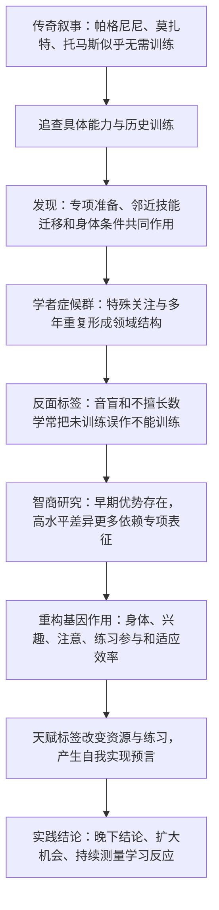
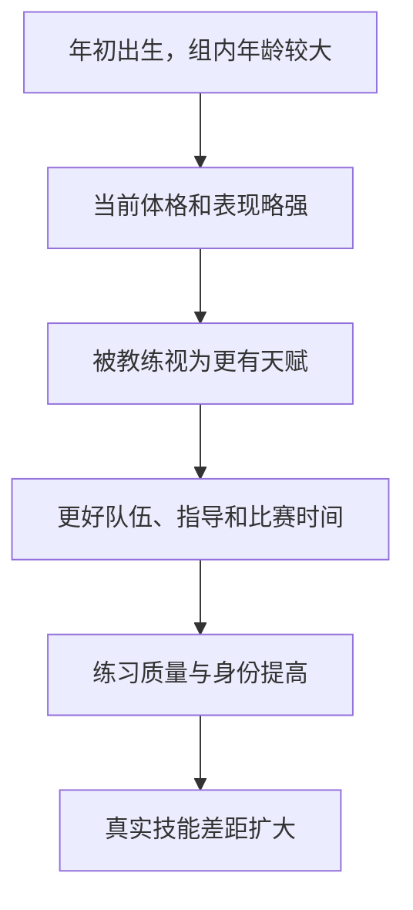
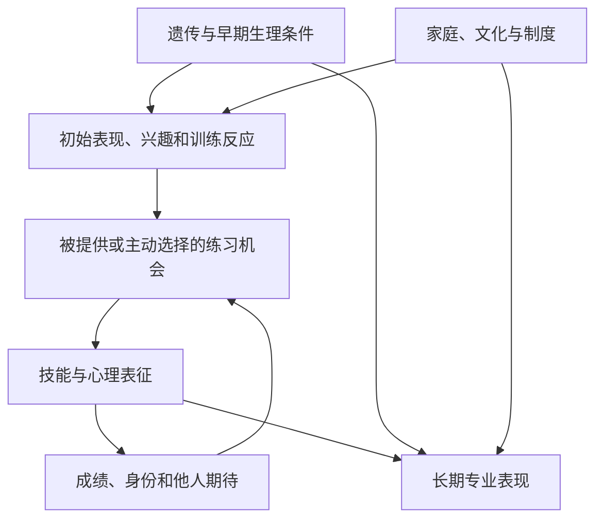

> **原书章节**：第 8 章“怎样解释天生才华”<br>
> **英文核心主题**：Innate Talent, Practice, and Gene–Environment Interaction<br>
> **原文来源**：《刻意练习：如何从新手到大师》<br>
> **本章任务**：检验“有人天生就会、有人天生不会”的常见解释，说明传奇叙事怎样隐藏训练史，早期认知和身体差异怎样影响起步，以及基因更可能通过身体条件、兴趣、注意、训练参与和适应反应间接影响发展。<br>
> **阅读提醒**：作者有意把论证重心放在练习上，部分句子会把证据说得过强。科学上更稳健的结论不是“基因无关”，而是“杰出表现由基因、环境、训练及其交互共同发展；初始优势不是终点，训练是最重要且最可干预的变量之一”。

---

## 一、本章要解决什么问题

### 1. 前七章之后仍然存在的疑问

即使承认刻意练习有效，人们仍会追问：

- 帕格尼尼、莫扎特等人的惊人成就是否只能用天赋解释？
- 有人第一次尝试就表现优异，是否证明训练不重要？
- 学者症候群中的特殊能力为何与一般能力分离？
- “音盲”“数学脑不好”是否是真实先天边界？
- 智商较高者早期学得更快，优势会不会永远保持？
- 基因究竟直接决定技能，还是通过别的路径影响训练？
- 过早相信天赋，会不会反过来制造我们所观察到的差异？

### 2. 本章的中心结论

> **许多“天才”故事把训练、迁移、家庭环境和表演设计从叙事中删除，只留下惊人结果。初始身体或认知差异确实可能影响学习速度、适合项目和训练反应，但随着专项心理表征积累，领域训练往往比宽泛能力测验更能解释高水平差异。基因的作用也可能主要通过身体结构、兴趣、注意、环境选择和练习效率间接发生，而非以一个“音乐基因”或“棋艺基因”直接写入技能。**

### 3. 为什么“天赋还是训练”是错误二分法

任何表现都来自发展过程：

$$
P_t=F(G,E,\Pi_{0:t},M_t,R_t,O_t,\varepsilon_t),
$$

其中：

- $P_t$：时刻 $t$ 的表现；
- $G$：遗传与先天生理差异；
- $E$：家庭、文化、教育和物质环境；
- $\Pi_{0:t}$：截至当前的训练路径；
- $M_t$：动机、注意和心理状态；
- $R_t$：导师、反馈和社会支持；
- $O_t$：比赛、选拔和职业机会；
- $\varepsilon_t$：伤病、运气和未测因素。

基因会影响环境选择，环境又改变基因表达和训练机会，二者不能简单相加后各占固定百分比。

### 4. 全章论证路线



### 5. 本章证据强度要分层

| 证据类型 | 例子 | 主要价值 | 主要局限 |
| --- | --- | --- | --- |
| 历史考证 | 帕格尼尼、莫扎特 | 恢复传奇省略的训练与表演设计 | 史料不完整，动机和贡献难精确重建 |
| 生平案例 | 马里奥·拉缪、唐纳德·托马斯 | 展示邻近训练和身体条件 | 不是控制实验，训练量估计不完整 |
| 个案与小样本实验 | 日历计算、先天性失歌症 | 识别具体认知过程和罕见边界 | 难估计人群普遍性 |
| 教育干预 | JUMP Math | 检验教学能否缩小差距 | 原书所述结果未正式同行评审 |
| 横断面相关 | 智商与棋艺、音乐、外科技能 | 比较不同发展阶段的关联 | 选择偏差、范围限制、反向因果 |
| 自然制度效应 | 冰球相对年龄 | 展示早期优势怎样变成机会累积 | 各项目和地区效应大小不同 |

---

## 二、开篇：先把“天赋”拆成可检验命题

### 1. “天赋”可能指四种不同东西

| 含义 | 例子 | 能否训练 |
| --- | --- | --- |
| 初始表现优势 | 初学棋更快、音高判断更准 | 常可被后续训练放大、缩小或超越 |
| 学习速度差异 | 相同训练下进步速度不同 | 可能随方法、阶段和动机变化 |
| 身体结构条件 | 身高、肢体比例、感官损伤 | 有些较固定，有些可适应 |
| 最终成就倾向 | 谁会成为世界第一 | 不能从单一初始指标可靠预测 |

若不先说明“天赋”是哪一种，争论无法被证伪。

### 2. 作者提出的两个问题

面对神奇能力，作者不先接受“天才”标签，而问：

1. 这种能力具体由哪些可观察部分组成？
2. 什么训练、经历或邻近技能可能使它成为可能？

这是一种**机制分解法**：把不可解释的整体，拆成可学习的动作、知识、心理表征与环境安排。

### 3. 为什么传奇容易遮蔽训练

好故事偏爱：第一次、突然、意外、无人能及。多年练习、失败和协助会削弱戏剧性，于是传播过程中被删除。

这不意味着所有传奇都虚构，而是惊人结果的因果背景常被压缩。

---

## 三、破解“帕格尼尼奇迹”

### 1. 流行故事

传说帕格尼尼演奏时琴弦接连断裂，仍用三根、两根，最终一根弦完成作品，手指甚至血肉模糊。叙事把意外和即时应变塑造成无法解释的天赋。

当时羊肠弦确实比现代弦更容易断，但故事的关键不是材料，而是琴弦是否真的意外、作品是否提前适配。

## 3.1 一根弦演奏的秘密

### 1. 两弦作品的起点

帕格尼尼在意大利卢卡为一位女士创作《爱的场面》，主动取下中间两根弦，仅用高音 E 弦和低音 G 弦表现男女对话。

作品从创作开始就围绕两根弦设计，不是普通四弦作品临时少弦演奏。

### 2. 从公主请求到单弦作品

演出成功后，波拿巴家族公主请他尝试单弦。他随后为拿破仑生日创作《拿破仑》，并继续发展 G 弦独奏作品。

### 3. 舞台效果怎样形成

帕格尼尼热衷戏剧化表演，会把作品设计为：

- 前段使用四弦；
- 中段逐步减少琴弦；
- 末段只用 G 弦；
- 演出中主动拨断或安排断弦效果。

观众未听过作品，不知道原定音响，因此把预先设计误作意外救场。

### 4. 这是否贬低帕格尼尼

完全不是。为单弦设计音乐、扩展指法和准确完成表演，仍需极高技术、创作和练习。解释机制是把“超自然”还原为更值得学习的专业能力。

### 5. 完整推理

1. 他此前已专门创作并演奏双弦、单弦作品；
2. 曲目可按剩余琴弦预先安排；
3. 演奏中的断弦可成为戏剧设计；
4. 观众缺少原作品参照；
5. 因而，不需要假设三根弦随机断裂后即兴重构整曲；
6. 真正解释是长期小提琴训练、单弦专项准备与舞台设计。

### 6. 证据边界

历史版本很多，无法重建每一场表演。帕格尼尼可能也具备不同寻常的身体条件和创造力；揭示专项训练不等于证明个体差异为零。结论只是否定“完全无准备的奇迹”这一必要解释。

---

## 四、破解“莫扎特传奇”

### 1. 哪些事实不容否认

莫扎特幼年便能演奏大键琴、古钢琴和小提琴，6 岁起随父亲与姐姐巡演欧洲。年龄、身材与表演能力形成强烈反差，使他成为“神童”典型。

### 2. 现代比较怎样改变惊奇程度

铃木教学等体系已让许多四至六岁儿童在小提琴或钢琴上达到过去罕见的水平。这说明莫扎特的幼年演奏虽然非凡，却属于早期高强度训练可以产生的能力类别。

### 3. 父亲利奥波德提供了什么

- 本人是音乐家和教师；
- 撰写小提琴教学著作；
- 先在姐姐玛丽亚身上积累幼儿教学经验；
- 可能在莫扎特 4 岁前便开始训练；
- 同时教授多种乐器、听觉分析和作曲；
- 安排大量巡演和上流社会表演机会。

这是一套极罕见的家庭训练环境。

### 4. 演奏神童与作曲神童要分开

会在幼年演奏复杂作品，不等于独立创作原创复杂作品。作曲需要结构、和声、体裁和长期作品分析，应单独检验证据。

## 4.1 “儿童作曲家”的秘密

### 1. 流行时间线

传记常写莫扎特 6 岁作曲、8 岁写交响曲、11 岁写宗教剧与协奏曲、12 岁写歌剧。这些说法容易让人以为作品完全由儿童独立创造。

### 2. 父亲记录和协助的问题

幼年作品由父亲誊写，无法精确区分：

- 儿童提供的旋律；
- 父亲整理的和声、配器和结构；
- 共同修改；
- 出于宣传目的的署名。

父亲本人是作曲家，也有通过儿子成功获得声望的动机。

### 3. 早期协奏曲的来源

后来音乐学分析发现，莫扎特约 11 岁时的一些所谓钢琴协奏曲以其他作曲家的奏鸣曲为基础，更像父亲布置的改编练习。

改编仍是有价值训练：它教会体裁结构、配器和主题发展；但不能当作从零原创证明。

### 4. 第一批可靠原创作品

作者认为，能够较明确归为莫扎特本人创作的复杂原创作品，大约出现在 15 至 16 岁，此前他已接受约十年密集训练。

历史归属仍有学术讨论，不能把某一年龄当绝对断点。稳健结论是：幼年独立原创的证据弱于传奇叙事，成熟原创出现在长期训练之后。

### 5. 论证能够推出什么

- 早期演奏可由极早训练和专业父亲解释；
- 早期创作包含模仿、改编与父亲协助；
- 成熟原创建立在多年分析、演奏和写作之上；
- 没有必要用“无需训练的作曲模块”解释。

### 6. 不能推出什么

- 不能证明莫扎特与任何儿童初始条件相同；
- 不能精确量化父子贡献；
- 不能否认其罕见学习速度、创造力和环境响应；
- 不能证明所有儿童接受同等训练都能成为莫扎特。

## 4.2 家庭滑冰场

### 1. 马里奥·拉缪的天才故事

冰球明星马里奥·拉缪常被描述为一上冰便自然流畅，似乎天生会滑。

### 2. 被省略的家庭环境

- 他是家中第三个儿子；
- 两位哥哥从他会走路起便教冰球和滑冰；
- 三兄弟在地下室穿袜子滑行，用木勺推瓶盖；
- 父亲在前院造冰场；
- 家人甚至把雪和冰延伸到室内区域，增加夜间练习机会；
- 父母持续鼓励。

### 3. 为什么这些活动算训练暴露

即使没有正式教练，反复滑动、控“球”、追逐兄长和即时游戏反馈，也会发展平衡、协调、视觉追踪和冰球动作表征。

### 4. 证据边界

童年故事主要来自家庭回忆，无法计算练习时数和初始能力。它能反驳“毫无练习”，不能证明训练解释全部职业成就。

---

## 五、破解“天才跳高运动员的神迹”

### 1. 唐纳德·托马斯的传奇版本

巴哈马运动员唐纳德·托马斯在美国大学打篮球。与校田径队跳高选手打赌时，他穿篮球鞋跳过 2 米、2.07 米和 2.13 米；两天后首次大学比赛约跳 2.22 米并夺冠；两个月后在英联邦运动会以 2.23 米获第四；约一年后在 2007 年大阪世锦赛以约 2.35 米夺冠。

这个时间线常被解释为“几百小时击败训练两万小时的斯特凡·霍尔姆”，并被用来反驳训练的重要性。

### 2. 为什么“第一次”必须先定义

它可能指第一次正式大学比赛，而不是：

- 第一次跳过横杆；
- 第一次学习背越式；
- 第一次训练单腿起跳；
- 第一次发展弹跳力。

将“第一次公开被看见”替换成“第一次具备能力”，是传奇叙事的常见错误。

## 5.1 “第一次就跳过 2 米”的秘密

### 1. 高中跳高经历

托马斯自己说曾参加至少一次高中校内跳高，成绩约 1.89 至 1.95 米，并称“不值一提”。这个高度本身已显示此前接触和能力。

### 2. 背越式技术证据

大学比赛照片显示他使用背越式：曲线助跑、背对横杆起跳、弓背并收腿。这是一种反直觉且需协调的技术，很难在从未学习时有效完成。

因此，无法确定训练多少，但“完全未经跳高训练”的说法不可信。

### 3. 篮球扣篮的迁移

托马斯以扣篮能力自豪，能从接近罚球线位置起跳并完成复杂扣篮。扣篮和跳高共享：

- 短距离助跑；
- 单腿爆发；
- 速度转垂直冲量；
- 空中身体控制。

2011 年研究显示，熟练跳高者的单腿跳能力与跳高成绩相关。篮球训练不是跳高刻意练习，却构成邻近身体能力训练。

### 4. 身体条件

托马斯身高约 1.88 米，霍尔姆约 1.80 米。身高、肢体比例、肌腱和爆发力会影响跳高适配。这里基因和训练并非二选一：身体条件可能提供优势，训练把它转化为项目表现。

### 5. 后续成绩为何是补充线索

到 2015 年，托马斯已专项训练约九年，却未超过 2007 年的 2.35 米，2014 年英联邦运动会约为 2.21 米。

作者据此推断，2006 年前他已有大量相关训练，因此初始表现接近可达高水平。

这个推断有道理但不具决定性：运动成绩受伤病、年龄、竞技状态和技术适配影响；后续没有大幅提高并不能逻辑证明此前训练量。

### 6. 霍尔姆“两万小时”比较的问题

训练时数口径、质量和身体条件不同，不能只用小时数比较。霍尔姆较矮，可能需要更多技术优化；托马斯从篮球获得大量未计入“跳高练习”的迁移训练。

### 7. 综合结论

托马斯案例展示：

$$
\text{杰出初次专项表现}
=\text{先前邻近训练}+\text{已有专项接触}
+\text{身体条件}+\text{当时状态}.
$$

它既不能证明训练无关，也不能证明身体差异无关。

---

## 六、破解“自闭症奇才”

### 1. 术语和尊重边界

原书使用“自闭症奇才”。更中性的术语是**学者症候群（savant syndrome）**：一个人在某个狭窄领域表现出显著高于其一般功能的能力。

并非所有学者症候群者都在自闭症谱系，也并非多数自闭症者都有学者能力。不能把自闭症简化为“隐藏天才”，也不应用“正常人”作为价值比较。

### 2. 常见特殊技能

- 乐曲记忆和复奏；
- 绘画、雕塑；
- 大数心算；
- 日历计算；
- 对特定信息的大量记忆。

能力狭窄且与其他沟通或适应困难并存，使人误以为它未经训练突然出现。

### 3. 哈佩与维塔尔研究

弗朗西斯卡·哈佩和佩德罗·维塔尔比较有、无特殊学者能力的自闭症儿童，发现前者更可能高度关注细节并有重复行为倾向。

这些特征可能使某个对象一旦吸引注意，便获得极高、长期、重复的接触量。

### 4. 能支持与不能支持的结论

支持一种发展路径：注意偏好和重复行为增加特定练习，练习又形成技能。

不能证明所有特殊能力只由训练造成，也不能把自闭症特征当成刻意练习。很多重复行为没有明确训练目标、反馈或自愿性；神经发育差异仍可能影响知觉和记忆方式。

## 6.1 “日历计算天才”的秘密

### 1. 唐尼的表现

研究对象唐尼能在约一秒内判断给定日期是星期几，准确率极高。马克·西奥科斯多年研究其方法。

### 2. 14 种年度日历

平年可按 1 月 1 日是星期几分为 7 类，闰年同样有 7 类，共：

$$
7+7=14\text{ 种年度日历}.
$$

唐尼长期记忆这些结构，并发展快速判断某年属于哪一类的方法，再从内部日历提取日期。

### 3. 为什么这是心理表征而非逐日死记

他先把年份分类，再调用模板。14 类结构压缩了海量日期，类似棋手用棋局组块和史蒂夫用检索结构。

### 4. 艾迪斯对双胞胎的研究

20 世纪 60 年代末，巴内特·艾迪斯研究一对智商约 60 至 70 的双胞胎。他们能平均约 6 秒判断远至公元 132470 年的日期。

方法似乎是把目标年份映射到 1600 至 2000 年间的等价年份，再组合世纪、年份、月份和日期代码。

### 5. 研究生六次训练

艾迪斯用类似方法训练一名研究生。经过约 6 次课程，其速度达到双胞胎水平；不同题目数据量造成的反应时模式也相似。

反应时相似提供了过程证据：他们可能采用同类分步算法，而不是不可解释的直接答案。

### 6. 该结果的边界

- 证明普通成人可快速学会这一特定算法；
- 不表示复制了唐尼所有速度、范围和长期记忆；
- 不解释所有音乐、绘画或记忆型学者能力；
- 方法来源和训练史仍可能不同；
- 小样本不能否认神经发育因素。

### 7. 本节稳健结论

学者能力应先拆成具体算法、记忆结构和练习史。许多看似直接的答案，可能由高度自动化的心理表征产生；“本人说不清”不等于没有学习过程。

---

## 七、“缺乏”天生才华的人

### 1. 为什么要从神童转向“不会的人”

证明高手练过，还不能回答另一种天赋信念：“我无论怎样练也学不会。”这一信念常来自早期失败和权威标签，而非严谨能力诊断。

### 2. 需要区分三种情况

1. 真实感官或神经障碍；
2. 当前缺少基础技能和有效教学；
3. 因标签和避免练习造成的长期落后。

把三者都叫“没天赋”，既不准确也无法指导干预。

## 7.1 音盲

### 1. 自我判断与医学定义不同

原书称约六分之一美国人认为自己不会唱歌。很多人的记忆中都有父母、兄姐、老师或同伴说“你是音盲”的痛苦时刻，于是停止尝试。

日常“唱不准”可能来自听觉辨别、声音控制、音域、呼吸、紧张或缺少练习，不等于真正音盲。

### 2. 先天性失歌症

**先天性失歌症（congenital amusia）**是一种罕见神经认知障碍，可能表现为难以分辨音高、旋律或节奏，且不能由听力损失、脑损伤或智力问题简单解释。

严格诊断需标准化测试，不能由一次唱歌失误判断。

### 3. 音高感知与歌唱产生的区别

- 能听出两个音不同，不一定能用声带准确复制；
- 唱不准者可能知道自己错，却控制不了；
- 也有人声音控制尚可，但听觉差异感弱。

训练任务应针对瓶颈，而不是统一贴标签。

### 4. 文化环境的作用

原书举例，某些文化期望所有人唱歌并普遍教唱，于是几乎人人参与。文化规范改变练习机会、羞耻和自我身份。

单一文化观察不能证明所有个体都能达到同一水平，却说明美国式“会唱/不会唱”分类并非自然必然。

### 5. 对多数人的实践结论

在没有标准诊断前，较合理假设是技能不足而非永久不能。用低风险、渐进、可反馈训练检验：音高模仿、短旋律、录音回放和合适声乐指导。

### 6. 真实障碍不能被意志论否认

少数先天性失歌症者可能面临显著限制，需要适配目标和专业支持。强调可训练性不能变成责备：“练不好只是你不努力。”

## 7.2 不擅长数学

### 1. 数学标签如何形成

早期概念缺口会使后续课程困难；课堂进度继续前进，学生错误增加，教师和本人把累积缺口解释成“没有数学脑”。

### 2. JUMP Math 的设计

加拿大数学家约翰·米顿开发 JUMP Math，使用类似刻意练习的原则：

- 把复杂能力分成明确小技能；
- 按先决关系排序；
- 设计大量可成功但有挑战的练习；
- 及时检查理解；
- 在错误变成大缺口前反馈；
- 让全班持续参与。

### 3. 安大略实验

原书报告一项随机对照实验：

- 29 名教师；
- 近 300 名五年级学生；
- 约 5 个月教学；
- JUMP Math 组在数学概念理解上的进步为标准课程组的两倍以上。

### 4. 证据边界

作者明确说结果未发表于同行评审期刊，因此难以独立检查方法、统计和完整结果。单次实验也不能证明所有学生、所有数学内容都同样有效。

需要：预注册、正式发表、多地区复现、长期保持和迁移、不同起点学生分析。

### 5. “任何孩子都能学好数学”应怎样理解

多数学生可在合适教学下远超当前表现；这不表示进步速度和最高水平相同，也不否认发展性计算障碍、语言、注意和教育资源影响。

### 6. 本节的共同模式

唱歌和数学都可能形成：


打断循环需要诊断具体缺口、提供可成功练习和重新建立能力信念。

---

## 八、训练 VS “天才”

### 1. 初始差异确实存在

孩子初学钢琴、投篮、绘画或除法时，理解速度和表现不同。错误不在观察差异，而在把短期排序直接外推为长期终点。

### 2. 为什么早期优势可能变化

- 训练量不同；
- 导师质量不同；
- 心理表征逐渐取代通用推理；
- 低起点者可能补偿性努力；
- 高起点者可能因轻松而少练；
- 选拔改变机会；
- 兴趣和身份随结果变化。

### 3. 一个动态模型

设初始表现为 $P_0$，此后：

$$
P_t=P_0+\sum_{k=1}^{t}
\Delta P_k(\text{练习},\text{反馈},\text{环境},\text{适应}).
$$

当累计增量远大于初始差异时，最初排名可能被重排。

### 4. 国际象棋为何适合研究

棋力有客观问题、局面记忆和等级分指标；又被大众强烈关联到逻辑和智力，因此可检验通用智力是否一直决定专项表现。

## 8.1 智商与棋艺有关系吗

### 1. 智商是什么

**智商（IQ）**是个体在标准化认知测验相对同龄规范的得分，通常综合语言、工作记忆、处理速度、空间或推理任务。

它能预测部分学业表现，但不等于纯粹、固定、完全先天的“智力实体”。教育、健康、语言、文化和测试经验都会影响结果。

### 2. 比奈的原始目标

阿尔弗雷德·比奈开发早期智力测验，主要用于识别在校学习需要额外帮助的儿童，而不是证明不可改变的天生等级。他也研究过盲棋记忆。

### 3. 成人棋手研究

一些研究发现成年棋手在一般视觉空间能力上不优于匹配成人，棋手智商与等级分也常无明显关联。

这种无相关可能意味着专项表征更重要，也可能受**范围限制**影响：进入竞技棋坛的人已经过认知、教育和兴趣筛选，剩余 IQ 变化较小。

### 4. 围棋研究

原书提到两项韩国小样本研究，围棋高手平均 IQ 约 93，对照约 100。样本小、测验文化适配和选择因素使差异可能偶然；它最多说明顶尖围棋不要求显著高于平均的测验分数，不能推出低 IQ 有利。

书中正文按 2015 年背景称围棋程序尚未战胜顶尖棋手，脚注已补充 AlphaGo 于 2016 年击败李世石。这个技术史细节不影响人类专项表征论证。

## 8.2 训练时间比智商更重要

### 1. 2006 年儿童棋手研究设计

梅里·比拉里克、彼得·麦克劳德和弗尔南德·戈贝特研究 57 名 9 至 13 岁儿童：

- 44 名男孩；
- 平均接触国际象棋约 4 年；
- 测量 IQ、空间能力、记忆、语言和处理速度；
- 回顾开始年龄和累计练习；
- 持续约半年写练习日志；
- 用棋题、局面复原和部分人的等级分测棋力。

### 2. 练习测量的局限

“练习”主要包括俱乐部对局，并未严格区分独自打谱、专项训练和普通比赛。因此它估计总体投入，不能精确代表刻意练习质量。

### 3. 全样本结果

- 练习量是棋力差异最强的解释变量；
- IQ 仍有较小但显著关联；
- 记忆和处理速度比视觉空间指标更重要。

这支持“早期通用认知能力有帮助，专项投入更重要”，而不是“智商完全无关”。

### 4. 精英子样本

23 名经常参赛的男孩被定义为精英：

- 平均等级分约 1603；
- 范围约 1390 至 1835；
- 练习量仍与棋力相关；
- IQ 不再显著，较低 IQ 者甚至平均棋力略高；
- 较低 IQ 者往往练得更多。

### 5. 为什么不能说“智商越低越有利”

精英是依据受 IQ 和练习共同影响的棋力筛选出来的。在只看已入选者时，低 IQ 者通常需更多练习才能达到门槛，高 IQ 者可能较少练习也入选，容易产生负相关。

这叫**选择或碰撞变量偏差（collider bias）**。此外，23 人样本小，IQ 和棋力范围受限。

### 6. 作者的补偿性练习解释

作者推测早期学得较慢的孩子为追赶同伴形成更多练习习惯，最终超过高 IQ 但练得较少者。这是合理机制假说，却不是该观察研究已证明的因果链。

### 7. 心理表征怎样改变能力需求

新手依赖规则记忆、逻辑和工作记忆逐项分析；高手看到棋局模式，直接生成高质量候选，再用通用推理处理少数关键变化。

$$
\text{早期：通用认知占比较高}
\rightarrow
\text{后期：专项表征占比提高}.
$$

### 8. 更稳健的结论

> 在儿童学棋早期，认知测验分数可能影响学习速度；随着专项知识和心理表征累积，练习量、练习质量和领域表征对棋力差异更重要。现有研究不能证明 IQ 毫无因果作用，也不能用精英子样本证明低 IQ 是优势。

---

## 九、换个角度看基因差异

### 1. 为什么要从直接决定改成发展路径

若基因直接写入棋艺、数学或音乐技能，应能很早稳定识别未来顶尖者。但预测往往不可靠，说明基因即使影响表现，也多通过中间过程。

### 2. 遗传度不等于不可改变

**遗传度**描述特定人口、特定环境中，某性状差异有多少统计变异与遗传差异相关。它不说明：

- 某个人的能力有多少百分比来自基因；
- 性状不能训练；
- 环境改变后遗传度仍相同；
- 相关基因直接编码具体技能。

例如身高遗传度高，营养仍显著影响群体身高。

### 3. 基因—环境交互

**基因—环境交互（$G\times E$）**指相同环境对不同基因背景影响不同，或基因效应随环境改变。

**基因—环境相关**可分：

- 被动：父母同时提供基因和家庭环境；
- 唤起：儿童特征引发他人不同回应；
- 主动：个体选择符合兴趣与能力的环境。

这些过程会让“天生”和“后天”在观察数据中纠缠。

## 9.1 各行各业的证据

### 1. 钢琴初学者

原书介绍 91 名五年级学生接受半年钢琴训练：早期 IQ 较高者总体弹奏更好，但随训练时间延长，IQ—演奏关联缩小；大学音乐生和职业音乐家中未发现同样关联。

这符合专项表征逐渐重要，也可能包含筛选、范围限制和退出效应。

### 2. 口腔外科技能

牙科学生的视觉空间测验与下颌模型模拟手术相关；到住院医生和外科医生阶段，关联消失。

训练可能补偿初始空间差异，但高水平样本也经过筛选，且任务指标可能有天花板。

### 3. 伦敦出租车司机

通过“知识”测试取得许可者和未取得许可者，基线一般智力没有明显差异。持续导航学习和相关脑结构变化，比 IQ 更直接对应职业技能。

### 4. 科学家智商案例

原书列举费曼 126、沃森 124、肖克利 125，均低于门萨常用约 132 门槛，却取得重大科学成就。

这些历史 IQ 分数的测试来源、版本和可比性常不清楚，不能当作精确测量；其作用只是说明极高智商分数不是重大科学贡献的充分条件。

### 5. 最低门槛假说

有人认为某些科学领域需要约 110 至 120 的 IQ，超过后边际收益变小。作者指出，这可能是教育筛选门槛而非研究能力的生物门槛：

- 博士项目要求语言、数学和逻辑成绩；
- GRE 等考试决定入学机会；
- 未达到考试门槛者可能根本无法进入样本。

### 6. 选择门槛与能力门槛要区分

$$
\text{未进入职业}
\not\Rightarrow
\text{无法完成职业核心任务}.
$$

制度可能先按易测指标筛选，再让入选者获得训练，于是职业群体看似“天然需要”该指标。

### 7. 身体项目的真实先决条件

某些体育项目确实受身高、体形、肢体比例和感官条件影响。这些是领域特定身体约束，比抽象“运动天赋”更可测。

即便如此，身体条件通常仍需长期训练转化为技术。

## 9.2 难以预测

### 1. 若固定天赋决定终点，应有何预测

大学或青少年阶段已训练多年，稳定天赋理应显现；选秀和排名应较准确预测职业表现。

### 2. 美式橄榄球选秀案例

原书比较 2007 年选秀第一位但三年后离队的四分卫，与汤姆·布拉迪：后者在 2000 年直到第六轮、第 199 顺位左右才被选中，却成为史上最成功四分卫之一。

个案不能估计选秀总体准确率，但说明早期评价会严重失误。

### 3. 青少年网球研究

原书称 2012 年研究发现，有志转职业的青少年球员早期排名与后来职业成绩缺少关联。

这不等于排名毫无预测力；需看样本、年龄、退出和指标。合理结论是长期发展具有高度不确定性，早期排名不足以决定终点。

### 4. 为什么预测困难

- 发育速度不同；
- 训练和导师后来变化；
- 伤病与机会不可预见；
- 早期指标测的是当前表现而非学习能力；
- 选拔系统改变后续资源；
- 动机和身份会变化；
- 高水平要求多个条件长期同时满足。

### 5. 预测困难并不证明基因无作用

复杂多基因、多环境系统本来就难预测。结论应是：没有单一早期测试能可靠决定谁登顶，而不是“所有先天差异都为零”。

## 9.3 基因差异的真正作用

### 1. 不存在单一“技能基因”

复杂技能由大量知觉、动作、认知和动机成分组成，相关性状通常是多基因的。没有一个基因直接编码“会下国际象棋”或“会作曲”。

### 2. 可能的直接身体路径

- 身高和肢体比例影响体育项目；
- 听觉或视觉障碍限制某些输入；
- 肌纤维、肌腱和恢复差异可能影响训练反应；
- 神经发育条件可能改变学习方式。

### 3. 可能的间接动机路径

某些气质使儿童更享受声音、图形、社交或重复活动，于是主动选择并持续练习，形成更高技能。

观察到的路径是：

$$
G\rightarrow\text{兴趣或气质}
\rightarrow\text{选择更多练习}
\rightarrow\text{技能提高}.
$$

基因不是直接产生技能，而是改变接触概率。

### 4. 注意与练习质量路径

持续注意、工作记忆和冲动控制存在个体差异，可能影响单位练习的有效性。环境、睡眠、药物和策略也能改变这些能力，因此不能把差异全部固定化。

### 5. 训练反应路径

不同身体和大脑可能对相同负荷产生不同适应速度。这是合理假说，但原书承认，当时关于具体基因如何影响专业训练反应的证据有限。

### 6. 婴幼儿词汇例子

幼儿词汇发展与社会性、共同注意和关注父母读书等行为相关。9 个月时更关注照顾者指图的儿童，到约 5 岁可能拥有更大词汇量。

这体现互动链：儿童气质影响亲子互动，互动提供语言练习，练习累积词汇。不能从相关直接断言某个“词汇基因”。

### 7. 作者主张的准确改写

原书称练习是最终成就“唯一最重要因素”，这是研究纲领式判断，不能跨领域给出固定贡献比例。

更稳健地说：

> 对许多成熟技能，长期高质量练习是杰出表现不可缺少且最可干预的主要因素；遗传、资源、机会和训练反应的相对贡献依领域与人群而变。

### 8. 为什么这个视角更有用

直接寻找天才基因很难指导当前行动；研究兴趣、注意、反馈和训练响应的中介路径，可以设计环境和支持，扩大更多人的发展机会。

---

## 十、相信天生才华的危险性

### 1. 错误信念怎样变成现实差异

当老师和父母把初始表现当永久上限，会把更多课程、时间、鼓励和比赛机会给“有天赋者”，把其他人引离该领域。

结果差异于是包含原判断造成的环境差异。

## 10.1 自我实现的预言

### 1. 严格定义

**自我实现预言**是一个最初未必真实的期待，通过改变行为和环境，促成与期待一致的结果。

### 2. 负向循环


### 3. 正向循环

“有天赋者”获得更多表扬、导师和比赛，练得更多，后来真的更优秀。这并不证明最初判断准确，而可能证明资源起作用。

### 4. 皮格马利翁效应与边界

期待会影响表现，但效应不是无限，也不表示仅靠相信便能成功。任务、训练和资源是中介；不切实际期待也会造成压力。

### 5. 如何打断标签循环

- 描述具体当前技能，不定义身份；
- 给所有人基础训练和二次进入机会；
- 评价学习反应而非一次成绩；
- 使用过程反馈；
- 定期重测；
- 对真实障碍提供适配支持。

## 10.2 出生早的“优势”

### 1. 相对年龄效应

加拿大青少年冰球以 12 月 31 日为年龄截止，同一组中 1 至 3 月出生者比 10 至 12 月出生者接近大一岁。

在四五岁时，一年差异意味着身高、力量、协调、成熟和可能多一季经验的明显差别。

### 2. 优势怎样累积



这是**马太效应**：小初始差异通过累积优势变大。

### 3. 足球证据

原书提到一组被认定为最优秀的 13 岁足球选手中，超过 90% 生于上半年。它支持相对年龄选择偏差，但具体比例依国家、截止日、项目和样本而变。

### 4. 为什么成年体格差消失，代表差仍存在

身体年龄差随成长缩小，但早期获得的教练、比赛和身份已累积，未入选者可能早已退出，无法在成年阶段重新竞争。

### 5. 晚出生者的补偿

原书推测少数进入高水平的晚出生者可能因长期追赶而练得更刻苦，成年后缩小甚至反超。这类似低 IQ 精英棋手的补偿假说，但仍需因果研究。

### 6. 制度改进

- 按更窄年龄段或生物成熟度分组；
- 教练评估时显示相对年龄；
- 轮换截止日；
- 保留多层队伍和后期再选拔；
- 比较进步率而非绝对体格；
- 避免早期永久淘汰。

## 10.3 智商高的“优势”

### 1. 国际象棋选拔思想实验

若学校只教儿童三至六个月，再挑当前棋力最好者，高 IQ 儿童因早期规则和推理优势更易入选高级项目。

入选后获得更多训练，最终棋手群体平均 IQ 更高。这个结果可能由选择制度产生，不能证明高 IQ 是顶尖棋力的必要条件。

### 2. 数学中的相同机制

上学前玩数数棋盘游戏、拥有数学语言和家庭资源的儿童，入学时表现更好。老师若把经验差异解释成天赋，会提供不同期望和课程。

### 3. 职业大门怎样关闭

数学早期标签影响高级课程、大学专业和工程、物理等职业资格。原本可通过教学弥补的差距，被制度转化为长期机会差异。

### 4. 不能因此忽略当前差异

公平不是假装所有人当前一样，而是：

- 诊断缺口来源；
- 提供不同脚手架；
- 不把起点变成终点；
- 允许速度不同；
- 对发展性障碍提供专业支持；
- 用长期学习数据更新判断。

### 5. 选择制度中的统计陷阱

若只研究已入选者，会看不到被排除者本可达到的水平；若只研究职业成功者，会把进入门槛误认为能力门槛。

### 6. 本章最终伦理结论

人们想保护孩子免受失败，本意未必恶意；但过早天赋判断会分配机会并制造差异。更安全原则是：

> 在没有可靠证据证明不可训练前，把低表现视为当前状态，提供合适训练并观察学习反应，而不是提前关闭路径。

---

## 十一、作者分析问题的方法

### 1. 从传奇结果倒查被删除的历史

帕格尼尼和莫扎特案例先找原始作品、家人参与和训练安排，恢复“奇迹”发生前的准备。

### 2. 把能力拆成邻近技能

托马斯的跳高被拆成背越式、单腿弹跳、助跑和身体条件；篮球扣篮可迁移其中部分能力。

### 3. 对特殊能力寻找算法和心理表征

日历计算不是停在“答得快”，而是追查 14 种模板、年份分类和代码算法，再训练普通研究生复现。

### 4. 用反面标签检验未训练是否被误作不能训练

音盲和数学案例区分罕见障碍与普遍缺少教学，说明标签会改变后续练习。

### 5. 比较发展阶段中的相关变化

棋手、音乐家和牙医研究显示宽泛测验与表现的关联在初学者更常见、高手中减弱，支持专项表征日益重要。

### 6. 从直接基因改为中介路径

作者把问题从“有没有棋艺基因”改成“哪些差异影响兴趣、注意、练习和适应”，使基因与训练不再互相排斥。

### 7. 用制度性自然实验揭示机会累积

冰球出生月份本身不创造技能，却通过分组、教练判断和资源分配产生长期差距，是自我实现预言的清晰案例。

### 8. 本章方法的主要局限

- 作者倾向寻找训练解释，可能低估遗传与训练反应差异；
- 历史传奇的反证也依赖不完整史料；
- 生平案例不能量化人群因果贡献；
- 学者症候群不能被简化为重复练习；
- IQ 与棋艺研究样本小且有选择偏差；
- 高手样本无相关不等于总体无因果；
- 基因间接作用部分在原书中多为推测；
- JUMP Math 证据未正式同行评审；
- 相对年龄效应不能推广到所有制度；
- “没有证据”不等于“证明不存在”。

---

## 十二、把本章转化为学习与选拔原则

### 1. 不问“有没有天赋”，先问六个可检验问题

1. 当前任务具体需要哪些子技能？
2. 学习者已经接受多少、什么质量的训练？
3. 是否存在感官、身体或学习障碍？
4. 当前评估测的是起点、学习速度还是最终能力？
5. 反馈、导师和练习机会是否相同？
6. 改变教学后，学习曲线怎样变化？

### 2. 建立“初始优势不等于终点”的记录

同时记录：

- 初始表现；
- 每单位高质量练习的进步率；
- 经过策略调整后的反应；
- 保持与迁移；
- 动机和机会变化。

### 3. 选拔系统延迟永久淘汰

- 多时点评估；
- 给不同起点者基础训练；
- 设置再进入通道；
- 按成熟度或经验校正；
- 将潜力定义为学习反应而非当前排名；
- 检查群体偏差。

### 4. 面对“天才故事”的分析模板

```markdown
## 具体能力
- 这个人究竟做到了什么？

## “第一次”的定义
- 是第一次公开表演，还是第一次接触和训练？

## 历史训练
- 正式训练、游戏、邻近技能、家庭和导师经历是什么？

## 身体与认知条件
- 哪些条件可能影响项目适配？

## 表演或传播设计
- 是否预先安排、改编、协助或选择性报道？

## 替代解释
- 训练、迁移、选择、资源和基因怎样共同作用？

## 可证伪预测
- 如果“完全无训练天赋”成立，还应观察到什么？
```

### 5. 面对“我不擅长”的训练实验

1. 用标准任务确认具体缺口；
2. 排除需要专业支持的感官或学习障碍；
3. 把技能分成小步；
4. 使用短时、有反馈训练；
5. 记录 4 至 8 周学习曲线；
6. 换方法后再测；
7. 根据证据调整目标，而非根据标签退出。

### 6. 区分障碍支持与能力主义责备

相信可塑性不应否认残障或把结果全归责个人。合理做法是提供无障碍工具、专业诊断、替代路径和不同成功标准。

### 7. 教师和父母的反馈语言

避免：

- “你不是数学这块料”；
- “你天生就是运动员”；
- “你没有音乐细胞”。

改为：

- “你目前在分数概念上有一个具体缺口”；
- “这项策略让你进步很快”；
- “我们还没找到适合你的音高练习”；
- “这次结果不能决定你的上限”。

### 8. 基因信息怎样负责任地使用

- 只在效应可靠、领域相关且有行动价值时使用；
- 不用多基因分数给儿童作永久职业预测；
- 结合环境和训练数据；
- 保护隐私并防止歧视；
- 把信息用于风险管理和个体化支持，而非关闭机会。

### 9. 一个平衡的能力发展模型



### 10. 何时应该接受真实边界

- 可靠诊断显示感官或身体限制；
- 多种高质量方法均无实质进步；
- 训练风险超过收益；
- 目标依赖已错过且不可替代的身体发育窗口；
- 机会成本与个人价值不匹配。

接受一个目标边界不等于接受“我什么都没天赋”，可以重设领域、角色或成功标准。

---

## 十三、核心概念辨析

| 概念 | 严格含义 | 常见误解 |
| --- | --- | --- |
| 天赋 | 对初始表现、学习速度、身体条件或发展倾向的模糊统称 | 单一、固定、可直接观察的技能基因 |
| 初始优势 | 学习早期相对更好的表现 | 保证最终排名 |
| 邻近训练迁移 | 相关活动训练了目标任务共享的能力 | 完全没有练过目标技能 |
| 传奇叙事 | 突出惊人结果、常省略发展过程的故事 | 完整因果记录 |
| 学者症候群 | 狭窄领域能力显著高于个人一般功能的现象 | 所有自闭症者都有隐藏天才 |
| 先天性失歌症 | 无听力损伤等解释的音高、旋律或节奏加工障碍 | 唱歌不好听的日常标签 |
| 发展性计算障碍 | 持续影响数感和计算学习的神经发展困难 | 所有数学成绩差的学生 |
| 智商 | 标准化认知测验相对同龄规范的分数 | 纯天生、不可改变的完整智力 |
| 范围限制 | 样本只含狭窄分数区间，使相关减弱 | 证明变量没有作用 |
| 碰撞变量偏差 | 按同时受两个因素影响的结果筛选，造成因素间伪相关 | 低 IQ 会提高棋力 |
| 遗传度 | 群体特定环境中，性状差异与遗传变异相关的比例 | 个人能力由基因决定的百分比 |
| 基因—环境交互 | 基因效应随环境不同，环境效应随基因背景不同 | 基因和环境可独立相加 |
| 基因—环境相关 | 个体基因相关特征影响其接触环境 | 环境完全随机分配 |
| 多基因性状 | 受大量基因小效应及环境共同影响的性状 | 存在单一音乐或数学基因 |
| 选择门槛 | 制度决定谁能进入训练或职业的标准 | 完成核心工作必需的生物门槛 |
| 自我实现预言 | 期待改变对待方式，促成与期待一致的结果 | 单靠想法即可创造任何能力 |
| 相对年龄效应 | 分组截止日造成组内成熟差异和选择优势 | 某出生月份基因更适合运动 |
| 马太效应 | 小优势通过资源与机会累积放大 | 优势必然永远保持 |
| 学习反应 | 在明确训练条件下表现随时间的变化 | 一次测试分数 |

---

## 十四、本章完整结论

### 1. 帕格尼尼案例说明什么

断弦奇迹很可能建立在专门创作、单弦训练和舞台设计上。解释准备过程不贬低其成就，反而揭示真正专业能力。

### 2. 莫扎特案例说明什么

幼年演奏发生在极早、全面的家庭训练中；早期作曲包含父亲记录、协助和改编练习，成熟原创在约十年训练后出现。史料不足以证明无训练天赋，也不足以证明人人可复制。

### 3. 马里奥·拉缪和托马斯说明什么

家庭游戏和兄长训练可积累冰球技能；扣篮、背越式经历和身体条件共同解释托马斯的惊人起点。“第一次被报道”不等于第一次训练。

### 4. 学者症候群说明什么

高度细节注意、重复接触和算法化表征可解释部分特殊技能；神经发育差异仍可能参与，不能把所有学者能力简化为普通刻意练习。

### 5. 音盲与数学标签说明什么

少数人有真实障碍，但多数低表现者缺少适当训练或因标签停止练习。诊断具体瓶颈比宣判没天赋更有效。

### 6. IQ 与棋艺研究说明什么

IQ 可能影响儿童早期学棋速度，练习是更强预测变量；在精英子样本中 IQ 关联消失，但小样本、范围限制和选择偏差不允许推出低 IQ 有利或 IQ 完全无作用。

### 7. 专项表征怎样改变竞争

随着练习积累，棋手不再主要依赖通用逻辑逐子分析，而用领域模式生成候选，专项心理表征逐渐成为高水平差异的主要来源。

### 8. 基因更可能怎样作用

基因可影响身体结构、感官、兴趣、注意和训练响应，并通过环境选择与练习机会间接改变技能。复杂能力不是单一基因写入的成品。

### 9. 为什么很难早期预测顶尖者

长期成就依赖多因素动态交互，伤病、导师、练习和机会不断变化；一次排名或选秀无法稳定测量未来发展。

### 10. 天赋信念为何危险

标签改变鼓励、课程、比赛和自我选择，小初始差异由机会累积放大。最终结果可能证明的是环境分配，而非最初天赋判断。

### 11. 怎样避免走向另一个极端

强调训练不能否认身体条件、残障、遗传和个体学习差异，也不能承诺任何人达到任何终点。应扩大训练机会、测量学习反应，再依据证据个体化目标。

### 12. 本章最稳健的结论

> 不要把当前表现、一次测试或早期排名当作终身上限；也不要假装所有人的起点和约束相同。把能力视为基因、环境和训练共同发展的结果，把重点放在可改变的训练质量与机会，同时尊重真实边界。

### 13. 本章如何引向第 9 章

若技能不是少数天才的固定财产，教育和社会就应从筛选“有天赋者”转向帮助更多人创建心理表征和高质量练习。第 9 章将讨论这种转变如何改变教学与世界。

---

## 十五、复习问题

1. “天赋”至少可能指哪四种不同含义？
2. 为什么天赋与训练不是可以简单二选一的解释？
3. 作者分析天才故事时提出哪两个机制问题？
4. 传奇叙事为什么容易删除训练史？
5. 帕格尼尼的单弦表演怎样从意外奇迹变成专项设计？
6. 解释舞台设计为何不贬低帕格尼尼成就？
7. 莫扎特幼年演奏的家庭训练条件有哪些？
8. 为什么演奏神童与作曲神童必须分开分析？
9. 父亲誊写作品为什么使幼年作者归属不确定？
10. 早期协奏曲作为改编练习有什么训练价值？
11. 第一批成熟原创约在长期训练后出现，能说明什么，不能说明什么？
12. 马里奥·拉缪的家庭滑冰场补回了哪些被省略经历？
13. 唐纳德·托马斯的“第一次跳高”存在什么定义偷换？
14. 背越式技术为什么是既往训练线索？
15. 扣篮练习与跳高共享哪些能力？
16. 身高差异怎样说明基因和训练并非二选一？
17. 托马斯后来没有提高纪录，为什么只是补充证据而非决定性证明？
18. 霍尔姆两万小时与托马斯几百小时为什么不能直接比较？
19. 学者症候群与自闭症是什么关系？
20. 细节关注和重复行为怎样可能增加特殊技能练习？
21. 为什么不能把自闭症重复行为直接称为刻意练习？
22. 14 种年度日历怎样压缩日期信息？
23. 研究生六次训练与双胞胎反应时相似说明了什么？
24. 日历计算结果为什么不能推广到所有学者能力？
25. 日常“音盲”与先天性失歌症有何区别？
26. 音高感知与发声控制为什么要分别诊断？
27. 强调可训练性为何不能否认真实障碍？
28. JUMP Math 使用了哪些刻意练习原则？
29. 安大略实验为什么仍不足以证明所有孩子都能达到相同数学水平？
30. 早期差异通过哪些路径可能扩大、缩小或反转？
31. IQ 为什么不等于纯粹天生智力？
32. 成人棋手 IQ 与等级分无关可能有哪些解释？
33. 围棋高手 IQ 约 93 的小样本为什么不能证明低 IQ 有利？
34. 2006 年儿童棋手研究测量了哪些变量？
35. 为什么其练习变量不等于严格刻意练习？
36. 全样本中练习和 IQ 分别与棋力有什么关系？
37. 精英 23 人子样本发生了什么变化？
38. 碰撞变量偏差怎样制造 IQ 与练习的负相关？
39. 心理表征为何使后期专项能力减少对通用推理的依赖？
40. “训练时间比智商重要”的最严谨表述是什么？
41. 遗传度为什么不是个人基因贡献百分比？
42. 基因—环境交互与基因—环境相关有何区别？
43. 钢琴和口腔外科研究体现了什么发展模式？
44. 科学家 IQ 个案为什么不能建立最低阈值？
45. 选择门槛怎样被误认为能力门槛？
46. NFL 选秀和青少年网球为何说明长期预测困难？
47. 难以预测为什么不等于基因完全无作用？
48. 基因可能通过哪四类中介路径影响技能？
49. 婴儿共同注意与词汇量案例怎样体现发展链？
50. 为什么不存在单一“棋艺基因”或“音乐基因”？
51. 自我实现预言的负向和正向循环分别是什么？
52. 加拿大冰球相对年龄效应怎样产生？
53. 年龄体格差消失后，技能代表差为什么仍可能保留？
54. 如何修改青少年选拔制度以减少相对年龄偏差？
55. 高 IQ 儿童的早期优势怎样被高级训练项目放大？
56. 数学标签怎样关闭后续职业路径？
57. 公平教育为什么不是假装学生当前完全相同？
58. 如何用学习反应而非一次测试评估发展潜力？
59. 在什么情况下应接受真实能力边界并调整目标？
60. 选择一个“天才”或“我不会”的故事，用本章模板分析其训练史、身体条件、机会、标签和可证伪预测。

---

## 十六、延伸阅读线索

- 帕格尼尼单弦作品与舞台表演史：传奇、作品设计和专项技术。
- 莫扎特早期作品目录、利奥波德的教学与幼年作品归属研究。
- Donald Thomas 与 Stefan Holm：跳高技术、篮球迁移、身体形态和训练量争论。
- Francesca Happé、Pedro Vital、Marc Thioux、Barnett Addis：学者症候群与日历计算。
- 先天性失歌症、歌唱准确性与声乐训练研究。
- JUMP Math 的随机试验、后续同行评审与复现研究。
- Merim Bilalić、Peter McLeod、Fernand Gobet：儿童棋手、智力、练习和选择偏差。
- 专长研究中的范围限制、碰撞变量偏差和纵向设计。
- 行为遗传学：遗传度、基因—环境交互和基因—环境相关。
- 相对年龄效应、马太效应和青少年体育选拔制度。
- 教师期待、自我实现预言和成长型能力观的边界。

阅读后续研究时，应检查“天赋”如何定义，训练量是否准确测量，样本是否经过选拔，是否只研究成功者，相关是否随发展阶段变化，以及结论是在描述群体差异还是预测某个具体人的未来。
