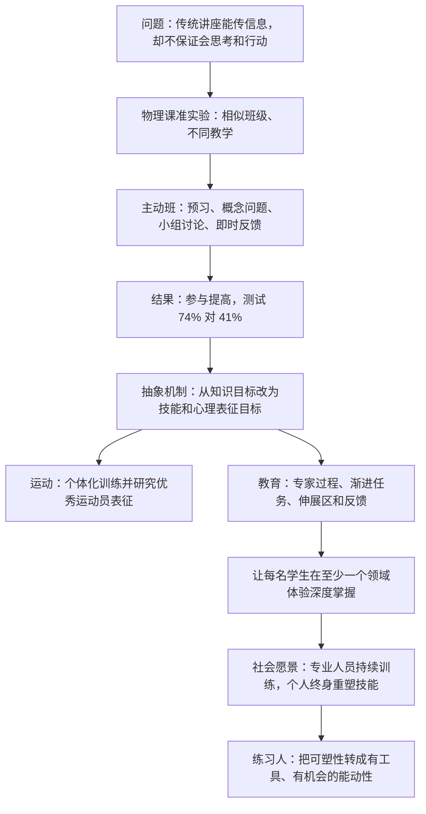
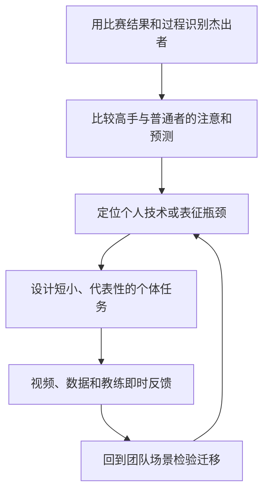
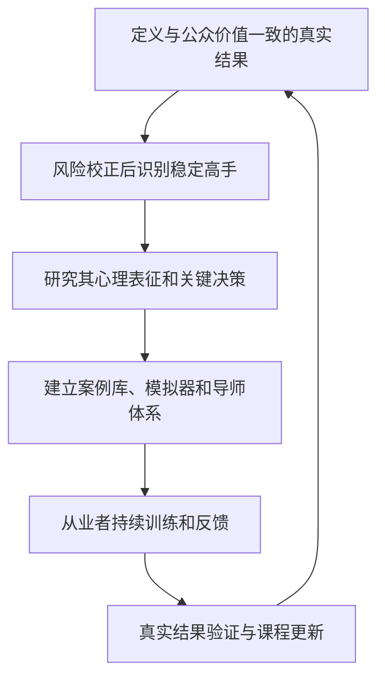

> **原书章节**：第 9 章“用刻意练习创造全新的世界”<br>
> **英文核心主题**：Creating a New World Through Deliberate Practice<br>
> **原文来源**：《刻意练习：如何从新手到大师》<br>
> **本章任务**：把刻意练习从个人和专业训练扩展到教育与社会制度：通过一项大学物理教学实验说明，以技能和心理表征为目标、让学习者反复判断并获得即时反馈，可能显著优于单向知识讲授；再讨论这种原则怎样改变体育、学校、职业培训和终身学习。<br>
> **阅读提醒**：本章前半是一个具体教学研究，后半逐渐转向研究议程与社会愿景。应区分“实验观察到的结果”“由机制推导出的设计原则”和“尚待验证的未来设想”，不能把三者当成同等强度的证据。

---

## 一、本章要解决什么问题

### 1. 从少数专家扩展到所有学习者

前八章主要研究高手怎样形成能力。本章追问：

1. 普通大学生能否用相同原则更快学会复杂概念？
2. 教学目标应写成“知道什么”，还是“能做什么”？
3. 怎样把专家的心理表征转成课程任务？
4. 体育团队为何仍常用统一训练，而不诊断个人表征？
5. 学校能否让每个学生至少体验一次深度掌握？
6. 技术快速变化时，社会怎样培养终身重塑技能的能力？

### 2. 本章的中心结论

> **教育和训练若以真实表现为终点，研究专家怎样表征问题，把复杂技能拆成渐进目标，让学习者持续作答、暴露误解、获得即时反馈并重新尝试，就更有可能形成可迁移的心理表征，而不只是短期记住知识。**

社会层面的进一步主张是：

> **学习“怎样有效练习”本身，应成为基础能力。人不只需要掌握一份职业知识，还要能在一生中反复建立新技能。**

### 3. 全章论证路线



### 4. 三种主张必须分开

| 类型 | 本章内容 | 证据强度 |
| --- | --- | --- |
| 实证结果 | 一个物理单元中主动班成绩显著更高 | 具体研究直接支持 |
| 设计原则 | 以技能、表征、伸展任务和反馈重构教学 | 由实验与前章机制共同支持 |
| 社会愿景 | 大多数专业人员达到今天前 5% 水平 | 思想实验，尚未被证明 |

### 5. 先区分六个相关概念

| 概念 | 核心含义 | 容易混淆之处 |
| --- | --- | --- |
| 主动学习 | 学生必须提取、判断、讨论或解决问题 | 不是只把学生分组 |
| 刻意练习原则教学 | 任务围绕目标技能、专家表征、伸展难度和反馈设计 | 不等于严格成熟领域中的一对一刻意练习 |
| 支架式教学 | 暂时提供支持，能力提高后撤除 | 不一定研究专家表征或反复纠错 |
| 形成性评价 | 学习过程中获取证据并调整教学 | 不是只在期末评分 |
| 心理表征 | 组织概念、关系、预测与行动的内部结构 | 不只是记住定义或公式 |
| 迁移 | 在未见问题或真实情境中使用所学 | 不等于训练题得分提高 |

---

## 二、开篇：一周物理课为什么重要

### 1. 研究团队和背景

路易斯·德斯劳里尔斯、艾伦·谢卢和卡尔·韦曼在英属哥伦比亚大学开展教学研究。韦曼 2001 年获诺贝尔物理学奖，之后投入科学教育改革；2002 年用部分奖金在科罗拉多大学创建物理教育技术项目，后来在英属哥伦比亚大学推动科学教育计划。

### 2. 研究要挑战的默认假设

传统大学科学课通常认为：优秀专家清晰讲解，学生听讲、做作业，便能形成能力。问题在于，听懂教授的推理与自己能生成推理不是同一件事。

### 3. 为什么一周干预仍有研究价值

短期干预无法证明长期课程效果，却能在相近学生、相同主题和明确测试下比较两种课堂活动的即时学习差异。它是一个机制演示，而非完整教育制度试验。

### 4. “多学两倍”需要怎样理解

原书开头说主动班掌握内容多两倍以上，后文来自对选择题随机猜测基线的校正。必须先看原始分数、题型和算法，不能只记宣传性倍数。

---

## 三、用刻意练习原则教物理

### 1. 课程和总体样本

课程约有 850 名一年级工程学生，分在三个授课地点。内容用微积分教授核心物理概念，传统安排包括：

- 每周三次、每次 50 分钟幻灯片讲座；
- 每周作业；
- 助教监督的习题辅导。

授课教授经验丰富、学生评价良好，因此对照并非明显低质量教师。

### 2. 两个实验班级

研究选取两个地点，每班约 270 人。在第二学期第 12 周，用一周教授电磁波单元：

- 对照班继续由经验丰富教授按传统方式教学；
- 干预班由博士后德斯劳里尔斯主讲，研究生谢卢协助。

两位干预教师课堂经验远少于对照教授，但接受过科学教育方法培训。

### 3. 干预前可比性

原书报告两个班在以下方面相近：

- 期中考试平均分；
- 第 11 周物理知识标准化测试；
- 第 10、11 周出勤率；
- 第 10、11 周课堂参与程度。

这削弱“干预班本来更强”的解释，却不等于随机分配。两个班可能仍在未测变量上不同。

### 4. 教师差异为什么既是亮点又是混杂

新手教师取得更高结果，说明课程结构可能比讲课年资重要；但教师与教学法同时改变，无法把全部效应只归给某一个组件。

### 5. 课前准备

干预班每课前阅读约三四页教材，并完成简单在线判断题，使课堂不必首次传递所有术语。

为保持公平，对照班该周也被要求预习。这意味着结果不能只由“主动班提前看书”解释。

### 6. 课堂目标：像物理学家那样思考

这里不是要求学生具有物理学家的完整研究水平，而是练习一套领域过程：

1. 正确表征问题；
2. 识别相关概念；
3. 判断概念之间的关系；
4. 从关系推导预测；
5. 用结果检查并修正。

### 7. 课堂问题

教师提出有一定难度的概念问题，学生先在小组讨论，再在线提交答案。系统立即把分布反馈给教师，教师据此：

- 揭示标准答案；
- 解释推理；
- 回应学生问题；
- 必要时进行短小的迷你讲座；
- 决定是否追加问题。

### 8. 主动学习任务

小组讨论后，学生还需独立写下答案并提交。独立产出很重要，因为小组共识可能掩盖个人没理解。

谢卢在小组间巡视、倾听讨论、回答问题并识别普遍误解。这是实时形成性评价。

### 9. 为什么对照教授使用相同问题仍不等价

原书说对照教授观摩后也展示许多相同问题，但主要用来告诉学生多少人答对，没有围绕问题组织预测、讨论、反馈和重试。

同一题目可以是展示工具，也可以是练习任务。有效性取决于学生是否必须思考并利用反馈。

### 10. 参与度结果

干预前两个班参与度相近；第 12 周，干预班课堂参与度接近传统班两倍。

参与是学习发生的必要机会，却不是学习本身。高参与活动若任务错误，也可能无效；所以还需结果测试。

### 11. 教学闭环


### 12. 为什么这更像刻意练习

- 有明确定义的概念技能；
- 问题略超当前能力；
- 每人必须做出判断；
- 反馈及时；
- 错误决定下一步说明；
- 多次变式帮助形成表征。

它运用刻意练习原则，但班级教学缺少完全个体化导师和长期成熟训练路径，不必称为严格定义下的刻意练习。

## 3.1 最好的教学效果

### 1. 测试怎样设计

第 12 周结束后，两班参加同一多项选择测试。干预教师和传统教授共同出题，其他物理教师认为题目符合该周目标；多数题改编自其他大学长期使用的物理概念题。

共同命题和外部题源降低明显偏袒，但不能完全排除干预课堂与测试形式更对齐。

### 2. 原始分数

| 班级 | 平均正确率 |
| --- | ---: |
| 传统讲授班 | 41% |
| 主动学习班 | 74% |

绝对差为：

$$
74\%-41\%=33\text{ 个百分点}.
$$

### 3. 随机猜测校正

题目随机猜测预期约为 23%。原书把“高于随机猜测的有效得分”归一化：

$$
K=\frac{S-C}{1-C},
$$

其中 $S$ 是实际得分，$C=0.23$ 是随机猜测基线。

传统班：

$$
K_T=\frac{0.41-0.23}{1-0.23}
=\frac{0.18}{0.77}\approx0.234\approx24\%.
$$

主动班：

$$
K_A=\frac{0.74-0.23}{1-0.23}
=\frac{0.51}{0.77}\approx0.662\approx66\%.
$$

比值约为：

$$
\frac{K_A}{K_T}\approx\frac{0.662}{0.234}\approx2.83.
$$

因此可说高于猜测基线的掌握量超过 2.5 倍。这个归一化不是直接测量“大脑中知道多少”，而是对选择题分数的解释方式。

### 4. 效应值

研究报告两班差异约为 $2.5$ 个标准差。常见标准化均值差可写成：

$$
d=\frac{\bar X_A-\bar X_T}{s_{\text{pooled}}}.
$$

$d=2.5$ 极大，原书称此前科学工程教学干预一般低于 $1.0$，一对一辅导曾达到约 $2.0$。

### 5. 为什么大效应仍需谨慎

- 只有两个班级作为主要比较单位；
- 班级和教师未随机交换；
- 干预仅持续一周；
- 测试紧随干预；
- 课程设计者参与授课和命题；
- 未在本章展示长期保持和远迁移；
- 标准差受测试难度和样本分布影响。

结果令人重视，不能当作所有课程的固定效应值。

### 6. 哪个组件导致效果

干预同时改变预习、提问、小组讨论、在线提交、巡视、即时反馈和迷你讲授，无法从该比较单独识别各组件贡献。更合理的解释是完整系统共同作用。

### 7. 最稳健结论

> 在两个基线相近的大型物理班和一个电磁波单元中，以概念问题、主动作答、小组推理和即时反馈组成的课程，产生了远高于传统讲授的即时概念测试成绩与课堂参与。

### 8. 下一步研究需要什么

- 多班级、多教师随机或交叉试验；
- 延迟测试；
- 未见问题和真实工程迁移；
- 分析不同基础学生；
- 拆分课程组件；
- 比较成本、教师负担和规模化质量；
- 记录学生感受与退出。

---

## 四、刻意练习的前景

### 1. 为什么一个物理实验可以提出更大问题

实验说明，即使传统教师优秀、学生基础相近，改变学生在课堂中“做什么”仍可能大幅改变学习。它支持把刻意练习原则从专家培养迁移到普通教育。

### 2. 迁移不能只复制课堂表面

小组、在线投票或预习本身不是机制。必须重新分析目标领域的表现、心理表征、典型错误和反馈。

## 4.1 改变运动训练

### 1. 作者观察到的缺口

许多职业运动员大部分时间参加统一团队训练，教练很少系统诊断每名运动员当前最限制表现的环节，也很少研究高手怎样表征比赛。

### 2. 团队训练为什么不足

统一战术、体能和配合对团队必要，但个体弱点不同：

- 有人判断慢；
- 有人看漏无球队员；
- 有人动作技术不稳；
- 有人压力下表征崩溃。

相同训练剂量不能同时解决不同瓶颈。

### 3. 心理表征为何是隐藏目标

伟大运动员常能回忆全场关系、预测对手和提前决策，却可能无法明确说出自己与普通者看见什么不同。教练若只挑选已经拥有这种表征者，就放弃了“怎样教会”的问题。

### 4. 怎样研究运动员表征

不应在高速比赛中强迫运动员持续口头报告，以免干扰表现。可使用：

- 比赛录像暂停预测；
- 赛后刺激回忆；
- 眼动和位置数据；
- 模拟器或战术场景；
- 对相同局面的专家—新手比较；
- 复盘中重建注意和候选决策。

### 5. 费城老鹰队案例

作者在 2014 年与费城老鹰队主教练奇普·凯利及教练组交流，讨论优秀运动员为何更清楚全场发生什么。教练认同表征重要，却更多选择已有表征的球员，而较少系统训练低水平球员的表征。

这体现“选材思维”与“发展思维”的差别。

### 6. 曼城案例

作者写到 2011 年访问曼城足球俱乐部并讨论球员表征训练。原文关于球队当时是否已赢足总杯的时间措辞可能不严谨，不影响核心：球队只有少数青年能进入成年队，教练希望理解怎样提高发展成功率。

### 7. 游泳合作

作者与游泳教练、国际游泳教练学会负责人罗德·哈维里罗克合作，发现较低和中等水平运动员很少获得个体化指导。

### 8. 运动训练重构流程



### 9. 边界

- 团队协同不能全部拆成个人训练；
- 口头报告会遗漏隐式过程；
- 数据指标可能诱导错误优化；
- 个体化训练成本高；
- 不能因心理表征重要而忽略身体、战术和团队文化。

## 4.2 改变教育与学习

### 1. 为什么教育影响更大

世界级专家人数少，教育覆盖几乎所有人。即便平均学习效率只提高一部分，社会总收益也可能大于少数顶尖者再提升。

### 2. 从“知道什么”转向“能做什么”

传统目标常写“理解电磁波定义”；表现目标则写：

- 能从情境识别适用概念；
- 能预测变量变化；
- 能解释而非只代公式；
- 能检查答案是否符合物理机制；
- 能迁移到未见问题。

知识仍必要，但作为技能和表征的组成部分，而不是孤立终点。

### 3. 为什么孤立知识难以使用

事实、公式和法则若彼此无联系，解决问题时都要占用工作记忆。心理表征把它们组织成因果和条件结构，使学习者知道何时调用。

### 4. 心理表征如何在“做”中形成

仅听取正确解释容易产生熟悉感。学习者必须先尝试表征问题、预测和推导；失败后反馈才指出内部模型哪里有误。

$$
\text{尝试}\rightarrow\text{可见错误}
\rightarrow\text{反馈}\rightarrow\text{模型修正}
\rightarrow\text{新情境再用}.
$$

### 5. 先定义专家表现

韦曼团队先与传统教师讨论：学完单元后，学生应具备什么技能。课程设计不从“我要讲哪些幻灯片”开始，而从终点表现反推。

### 6. 把终点拆成学习目标

复杂技能被拆成具有先决关系的步骤。每一步都应产生下一步需要的心理表征。

### 7. 与支架式教学的关系

两者都分步和提供支持。刻意练习原则额外强调：

- 目标来自专家实际表现；
- 每一步对应关键心理表征；
- 学生必须在伸展区作答；
- 反馈后反复修正；
- 最终检验真实表现。

不是所有分步教材都满足这些条件。

### 8. 定量题与定性题

研究发现，物理学生有时能把数字代入正确公式，定量题接近专家，却在不含数字的概念题上明显落后。

这说明程序模板可能掩盖因果模型缺失。

### 9. 四季更替误解

一些受过高等教育者会说夏季因地球离太阳更近。该解释无法同时说明南北半球季节相反。

真正主要原因是地轴倾斜改变太阳高度角和昼长。一个好表征必须解释多个相关现象，而不是只背答案。

### 10. 任务怎样位于伸展区

问题不能一眼回答，也不能完全无从下手。设计者先在志愿学生中测试，让他们思维出声，发现：

- 哪些措辞引起非目标误解；
- 哪一步太难；
- 学生会使用哪些错误模型；
- 提示是否过多。

再修改并用第二组测试。这是对训练任务本身的迭代。

### 11. 即时反馈怎样实现

同伴讨论暴露不同模型，教师看到答案分布，助手听取推理；错误出现后马上解释和重试。

同伴意见不一定正确，因此教师需要用可靠学科标准收束。

### 12. 教学设计路线图

1. 定义学完后学生能做什么；
2. 研究专家怎样表征和执行；
3. 拆成递进目标；
4. 为每步设计伸展任务；
5. 预试任务并修正；
6. 要求学生主动作答；
7. 提供即时、解释性反馈；
8. 使用变式重复；
9. 用未见问题检验迁移；
10. 根据数据改进课程。

### 13. 规模化证据

原书称实验后几年，英属哥伦比亚大学近 100 个科学和数学班采用相关方法，总选课超过 3 万人。

采用规模说明可实施性和机构接受，不等于每一门课都复现原实验效果。需要课程级结果和质量监测。

### 14. 教师角色怎样改变

教师不再只是信息讲述者，而是：

- 定义表现标准；
- 设计诊断任务；
- 观察学生表征；
- 在恰当时机给最小解释；
- 组织同伴推理；
- 根据反馈调整序列。

这通常比准备一次流畅讲座更复杂，也需要教师培训和时间。

### 15. 教育改革的边界

- 并非所有知识都要通过发现学习；
- 基础事实可直接讲授并用检索练习巩固；
- 大班个体化有限；
- 主动学习可能增加认知负荷；
- 学生需先具备最低前置知识；
- 教师工作量和资源不平等会影响实施；
- 测试必须测迁移，不能只贴合课堂练习。

## 4.3 帮助学生创建心理表征的重要性

### 1. 更深目标不是学会一门课

作者主张让每个学生至少在一个领域达到足够深度，亲身感受高质量心理表征怎样支持计划、执行、自评和探索。

### 2. 深度表征带来自主探索

音乐学生有了目标声音和结构表征后，可以自己即兴、比较诠释和创作；科学学生有模型后，可以设计实验；写作者可独立规划作品。

### 3. 模型作品的作用

像富兰克林重建《观察家》文章，学生需要可复制和比较的高质量模型。模型告诉他成功可能是什么样，同时保留先尝试、失败和纠错。

### 4. 为什么一个领域的深度经验可能有跨域价值

专业知识本身高度领域特定，不会自动迁移。但学习者可获得元层理解：

- 卓越需要怎样的时间和反馈；
- 心理表征如何逐渐形成；
- 平台如何诊断；
- 表演流畅背后有多少练习；
- 自己能够通过训练改变。

这是对学习过程的认识，不是把音乐表征直接转成物理表征。

### 5. 专家为何更能欣赏其他专家

研究物理者未必会拉小提琴，芭蕾演员未必会画画，但亲历深度训练使其理解另一领域的技术密度和牺牲，不容易把成就简单归于天赋。

### 6. 学校怎样提供深度掌握机会

- 长周期项目而非碎片轮转；
- 稳定导师；
- 高质量模型；
- 作品和真实表现；
- 多轮反馈；
- 展示与反思；
- 允许学生从多个领域选择。

### 7. 为什么不能强迫所有人精通同一领域

深度体验应保留选择、健康和资源公平。过早单一路径可能压缩探索，并把学校变成精英竞技场。

### 8. 跨域迁移的边界

“学会如何练习”可能迁移目标分解、反馈利用和动机管理，但新领域仍需专项知识和导师。不能因一个领域成功便假设其他领域自然成功。

---

## 五、创造全新的世界

### 1. 从个人潜能到制度能力

仅告诉人“你可以提高”不够，还需：

- 可靠卓越标准；
- 对专家心理表征的研究；
- 可获得的训练任务；
- 导师和反馈系统；
- 安全模拟；
- 时间、设备与经济支持；
- 多次进入机会。

能动性需要工具和制度，不是个人信念单独产生。

### 2. 作者的专业社会思想实验

作者设想：若医生、教师、工程师、飞行员和程序员都像成熟表演领域那样持续训练，并使一半从业者接近今天最优秀 5% 的水平，医疗、教育和技术将显著改善。

这是愿景，不是统计预测。当前前 5% 是相对分位，整体提高后标准也会移动；不同职业还面临多目标和团队结果。

### 3. 组织层需要做什么



### 4. 为什么不能只追求单一绩效指标

医生要兼顾生存、并发症、患者体验与公平；教师要兼顾理解、迁移、兴趣和不同学生；程序员要兼顾速度、可靠性、安全和维护。

单指标会诱导“教测试”或牺牲难测价值。

### 5. 个人收益

能力增长可带来掌握感、选择权、身份、作品和挑战。专家表演顺利时可能体验高度流畅和满足。

作者以自己与赫伯特·西蒙合作、见证西蒙获得诺贝尔奖的经历为例：研究团队感到自己站在科学前沿，能够参与提出新问题和新解释。作者把这种兴奋类比为印象派画家开拓新画法时可能拥有的体验。

这是对专业生活意义的个人叙述，不能用来证明每位专家都会快乐，也不能抵消竞争压力、失败和职业倦怠。它说明的是：长期能力积累不仅可能产生外部绩效，也可能扩大一个人能够参与和理解的活动范围。

### 6. 心流的严格含义

**心流（flow）**是技能与挑战匹配、目标清晰、反馈及时、注意高度集中时的沉浸状态，常伴随时间感改变和行动流畅。

### 7. 心流与刻意练习的区别

| 维度 | 心流 | 刻意练习 |
| --- | --- | --- |
| 体验 | 流畅、沉浸，常有内在愉悦 | 费力、监测错误，未必愉悦 |
| 任务 | 技能与挑战平衡 | 略超当前稳定能力 |
| 目标 | 顺利执行 | 暴露并修正弱点 |
| 典型场景 | 表演、比赛、创作 | 专项训练 |

专家可能在表演中体验心流，在练习中经历高认知负荷。二者都需专注，但不能混为一谈。

### 8. 没达到前沿也能受益

世界级不是获得满足和选择权的前提。显著提高一项日常技能、换职业或完成作品，本身就有价值。

### 9. 愿景的公平边界

若训练机会只属于富裕者，“人人可塑”可能反而合理化不平等。新世界还需要公共教育、无障碍支持、带薪学习时间、可负担导师和不惩罚练习错误的文化。

## 5.1 成为“练习人”

### 1. 一个隐喻，不是生物分类

作者借 Homo sapiens（智人）、Homo erectus（直立人）、Homo habilis（能人）提出“练习人”：人能有意识地选择目标、设计环境并长期改变自己。

“练习人”是哲学和教育隐喻，不是正式人类学物种名称，也不表示其他动物完全没有学习能力。

### 2. 知识人与练习人的差别

- 知识人强调储存和拥有信息；
- 练习人强调能通过行动、反馈和适应不断重构能力。

快速变化社会中，后者更能解释为什么一次教育不足以覆盖一生。

### 3. 职业结构为何要求终身学习

作者观察到许多 40 年前的工作已消失或改变，年轻人一生可能更换两三次工作。具体次数因经济和个人而异，核心是技能需求不会静止。

### 4. 学习能力本身怎样训练

- 识别真实表现标准；
- 选择可靠导师；
- 分解技能；
- 设计伸展任务；
- 获取反馈；
- 创建心理表征；
- 诊断平台；
- 管理注意和动机；
- 检验迁移。

这不是脱离领域的万能技巧，而是一套每次都要结合新领域重建的过程能力。

### 5. 技术提供的新机会

现实工作可用视频、传感器和日志记录，建立医生、教师、运动员等案例库，让学习者在安全环境分析真实过程。

### 6. 技术案例库的风险

- 患者、学生和客户隐私；
- 录制与二次使用同意；
- 数据只代表容易记录的群体；
- 专家标签偏差；
- 自动评分错误；
- 训练集记忆而非迁移；
- 商业平台锁定和不平等访问。

技术只能放大训练设计，不能替代可靠真值和伦理治理。

### 7. 对成年人

需要基于刻意练习原则的职业再训练，使人既能改善当前工作，也能进入新职业。仅提供信息课程不足，应有模拟、作品、导师和真实任务迁移。

### 8. 对儿童

作者认为最重要礼物是让孩子亲眼看到自己可以通过练习发展原以为不可能的能力，并获得继续自我塑造的工具。

这种信心应建立在真实进步上，不是“你可以成为任何人”的无条件承诺；同时要尊重儿童选择和真实障碍。

### 9. 能动性与结构条件

“掌控潜能”不能理解为一切结果都由个人负责。一个人的选择受到贫困、歧视、健康、照护责任、教育和地域限制。

更完整的社会目标是：

$$
\text{个人能动性}+\text{公平训练机会}
+\text{可靠反馈工具}+\text{安全保障}.
$$

### 10. 练习人社会的最低条件

1. 教育评价能力而非只筛选起点；
2. 工作给从业者练习和复盘时间；
3. 高风险技能使用模拟器；
4. 培训效果用真实结果验证；
5. 成人可多次再教育；
6. 数据库遵守隐私和公平；
7. 失败在训练中可见、可纠正；
8. 个人可选择目标，也可合理停止。

### 11. 本书最终因果链


### 12. 最终愿景的边界

- 不是人人都能成为任何领域世界第一；
- 不是所有工作都有成熟刻意练习体系；
- 不是练习越多越好；
- 不是知识不重要；
- 不是个人努力可以消除制度不平等；
- 不是技术平台会自动提高教育；
- 不是训练必须牺牲健康和生活。

---

## 六、作者分析问题的方法

### 1. 用一个强干预结果开启社会论证

作者先提供可测课堂结果，而不是直接宣讲愿景，使“教育可以改变”有具体锚点。

### 2. 先证明基线相近

期中、标准测试、出勤和参与相近，旨在排除明显起点差异。作者随后才比较第 12 周结果。

### 3. 详细还原学生做了什么

重点不在“老师更有激情”，而在预习、作答、讨论、反馈和再应用，便于抽取可迁移机制。

### 4. 用随机猜测校正和效应值提供多种结果表达

原始百分点、猜测校正和标准化差异从不同角度展示效果。但复杂统计也可能放大宣传，应保留原始 41% 与 74%。

### 5. 从运动到教育逐步扩展

运动仍接近成熟技能领域，教育覆盖更广；作者先讨论个体化表征，再进入普遍教学和社会制度。

### 6. 把技能目标放在课程设计起点

这是对第 5 章知识—技能区分的延续：先定义学生能做什么，再决定教什么知识。

### 7. 把心理表征作为技能与知识的桥梁

知识不是被丢弃，而是被组织进能预测和行动的模型。这样解释为何主动做题不仅练技能，也能学习事实。

### 8. 从一个领域深度体验推导元学习

作者没有声称专业表征直接跨域，而是认为亲历深度训练能改变对学习、努力和专家成就的理解。

### 9. 用思想实验放大社会意义

“一半从业者达到当前前 5%”不是预测，而是让读者思考专业训练体系若普及的可能价值。

### 10. 以“练习人”重新定义人的能动性

结尾把整本书从技术方法提升为人类观：重要的不是当前知道多少，而是能否持续构筑新能力。

### 11. 本章方法的主要局限

- 物理研究只有一周、两个主要班级；
- 教师和方法同时改变；
- 测试紧贴干预；
- 极大效应可能不易复制；
- 运动案例主要是作者交流与观察；
- 规模化采用不等于规模化效果；
- “一个领域深度经验”的远迁移缺少直接证据；
- 专业社会愿景没有成本估算；
- 心流与个人快乐部分依赖自我报告；
- 技术变迁和换工作次数是概括，不是普适预测；
- 能动性论述可能低估结构约束。

---

## 七、把本章转化为课程与组织设计

### 1. 第一步：写表现目标

用“学习者能够在何种条件下完成什么”替代“覆盖哪些章节”。

### 2. 第二步：研究专家过程

比较专家和新手怎样表征、注意、生成候选和检查结果。不要只收集专家答案。

### 3. 第三步：绘制技能与表征依赖图

明确每一步需要哪些先决概念、动作和判断。

### 4. 第四步：设计伸展任务

任务应略高于当前水平、能暴露典型误解、结果可判断，并保留多种变式。

### 5. 第五步：预试并思维出声

找少量目标学习者试做，观察措辞误解、认知负荷和错误策略，再迭代任务。

### 6. 第六步：保证每个人先作答

可用短写、投票、代码、图示、操作或口头预测；避免少数活跃者代表全班。

### 7. 第七步：反馈要解释过程

不仅公布答案，还要说明：

- 哪种表征导致错误；
- 哪个线索被漏掉；
- 怎样检查；
- 下一题如何应用。

### 8. 第八步：反馈后立即再试

没有重试，反馈只是额外知识。使用结构相同、表面不同的题检验修正。

### 9. 第九步：进行三层评价

| 层次 | 问题 |
| --- | --- |
| 近迁移 | 相似新题能否解决？ |
| 远迁移 | 不同表面情境能否识别同一原理？ |
| 保持 | 数周或数月后还能否使用？ |

### 10. 第十步：验证真实结果与公平性

检查不同起点群体是否受益、谁退出、教师负担、成本和长期结果，避免只看平均分。

### 11. 一个通用教学单元模板

```markdown
## 目标表现
- 学完后学生能做什么：
- 怎样在未见任务中测量：

## 专家心理表征
- 专家注意哪些线索：
- 怎样组织概念和检查结果：

## 常见新手模型
- 典型误解：
- 误解会预测哪些错误：

## 任务序列
- 前置任务：
- 伸展问题：
- 反馈后变式：

## 反馈
- 即时结果：
- 过程解释：
- 同伴讨论怎样组织：

## 评价
- 近迁移：
- 远迁移：
- 延迟保持：
- 不同学生群体结果：
```

### 12. 一个程序设计教学例子

目标不是“知道并发定义”，而是能在未见代码中识别竞态、解释交错顺序并设计验证：

1. 课前阅读最小术语；
2. 预测一段代码可能输出；
3. 小组比较不同线程交错；
4. 运行或模型检查得到反馈；
5. 解释原先遗漏的共享状态；
6. 修改同步策略；
7. 在新代码中再次识别；
8. 延迟一周复测。

### 13. 组织训练的成熟度阶梯

```text
只提供资料
    ↓
加入测验与检索
    ↓
加入代表性案例和即时反馈
    ↓
按个人错误自适应
    ↓
研究专家心理表征并改进任务
    ↓
用真实结果持续验证和更新
```

### 14. 何时直接讲授更高效

- 术语和安全规则；
- 学习者完全缺少前置知识；
- 需要快速建立共同背景；
- 错误探索代价高；
- 讲授后立即有练习和检索。

主动学习不是禁止讲解，而是让讲解服务正在暴露的学习需求。

### 15. 采用技术前的伦理清单

- 获得录制和使用同意；
- 去标识化敏感数据；
- 检查群体代表性；
- 明确专家真值来源；
- 允许人类申诉自动评分；
- 限制数据保存和二次用途；
- 提供无障碍访问；
- 评估技术是否真正改善迁移。

---

## 八、核心概念辨析

| 概念 | 严格含义 | 常见误解 |
| --- | --- | --- |
| 主动学习 | 学习者必须提取、判断、解释或操作的教学 | 课堂热闹或分组聊天 |
| 刻意练习原则教学 | 以目标技能、专家表征、伸展任务和反馈设计课堂 | 严格一对一刻意练习的完全复制 |
| 课前准备 | 在课堂实践前建立最低术语和概念基础 | 把讲课全部转嫁给学生自学 |
| 课堂问题 | 用于暴露和修正心理表征的诊断任务 | 教师展示答案的例题 |
| 形成性评价 | 学习过程中获取证据并即时调整 | 不计分的小测本身 |
| 迷你讲座 | 针对已暴露误解的短时解释 | 被动讲授全部课程 |
| 参与度 | 学生行为和认知投入的程度 | 学习结果本身 |
| 猜测校正 | 从选择题得分中扣除随机猜测预期并归一化 | 精确测量掌握知识百分比 |
| 效应值 | 以标准差单位表达组间差异 | 干预在所有场景的固定收益 |
| 标准差 | 描述样本成绩离散程度的尺度 | 分数百分点 |
| 准实验 | 没有完全随机分配但采用比较和基线控制的研究 | 等同随机对照试验 |
| 技能目标 | 学习者在具体条件下能稳定完成的表现 | 课程覆盖内容列表 |
| 定性问题 | 主要要求概念和因果解释的问题 | 主观、无法判断的问题 |
| 定量问题 | 涉及数字、方程和计算的问题 | 必然测到深层理解 |
| 支架式教学 | 暂时支持学习并逐步撤除的方法 | 自动等同刻意练习 |
| 任务预试 | 在正式教学前用目标学生测试任务认知过程 | 只检查错别字 |
| 思维出声 | 学习者报告当前思考以暴露表征 | 对全部心理过程的透明记录 |
| 深度掌握 | 在某领域形成可计划、执行、自评和探索的表征 | 所有领域都达到专家级 |
| 心流 | 挑战与技能匹配时的高度沉浸和流畅体验 | 刻意练习的必要感受 |
| 练习人 | 人可有意识通过练习持续重构能力的隐喻 | 正式生物分类或个人万能论 |
| 终身学习 | 在人生不同阶段持续获得和更新技能 | 不断消费课程和信息 |

---

## 九、本章完整结论

### 1. 物理教学实验真正发现了什么

两个基线相近的大班在一周电磁波单元中，主动作答、讨论和即时反馈班得到 74%，传统班得到 41%，参与度也更高；结果支持该课程系统显著改善即时概念学习。

### 2. 为什么不能把 2.5 标准差普遍化

研究只有两个主要班级、教师不同、干预一周、测试紧随其后且与任务对齐。它是强机制示范，不是所有主动教学的固定效果。

### 3. 课堂成功的核心不只是互动

关键是围绕明确概念技能，让每个学生先判断，暴露心理表征，获得及时解释，再用新任务修正。小组形式只是实现手段。

### 4. 知识与技能怎样统一

知识作为心理表征的一部分被组织起来，才更容易在新问题中调用。课程先定义学生能做什么，再选择支持该能力的知识。

### 5. 为什么定性问题重要

会代公式可能只表示程序记忆；能解释季节、预测变量和检查结果，才更接近专家因果表征。

### 6. 运动训练还有什么空间

团队训练可进一步个体化，并通过录像、预测和刺激回忆研究高手表征；选拔已有能力者不能替代发展普通运动员。

### 7. 学校为什么应提供一次深度掌握

亲历一个领域的表征形成，可以让学生理解卓越如何产生、怎样自我反馈以及努力的真实结构；这种元理解可能迁移，具体专业知识不会自动迁移。

### 8. “新世界”需要什么

不只是个人决心，还要可靠标准、训练任务、导师、案例库、时间、公共资源和伦理治理。能动性必须与公平机会结合。

### 9. 心流与练习是什么关系

专家在熟练表演时可能体验心流；刻意练习通常略超稳定能力、持续找错，因此更费力。流畅表现是训练成果之一，不是练习质量的唯一指标。

### 10. “练习人”的准确含义

人类能够有意识选择和构筑能力，未来社会应教会人怎样学习新技能。它是反对固定潜能观的隐喻，不是保证任何目标都可达。

### 11. 技术能做什么，不能做什么

视频、日志和模拟可保存真实案例并提供低风险练习；若真值错误、数据偏斜或侵犯隐私，技术只会规模化错误。

### 12. 全书最终结论

> 人的当前能力不是永久命运。通过略超能力的任务、可靠反馈和心理表征，人可以持续改变；社会真正的任务，是让更多人获得这种训练的知识、工具、时间和选择权，同时承认健康、个体和制度边界。

---

## 十、复习问题

1. 第九章为什么先用物理课堂实验，而不是直接提出社会愿景？
2. 实证结果、设计原则和未来愿景有什么证据强度差异？
3. 主动学习与普通小组活动有什么区别？
4. 严格刻意练习与运用刻意练习原则教学有什么区别？
5. 850 名学生和两个约 270 人班级分别在研究中承担什么角色？
6. 干预前比较了哪些基线指标？
7. 基线相近为什么仍不等于随机分配？
8. 新手教师取得高成绩能说明什么，又有哪些教师混杂？
9. 为什么对照班也被要求预习？
10. “像物理学家那样思考”具体包含哪些步骤？
11. 课堂问题怎样同时给学生和教师提供反馈？
12. 小组讨论后为什么还要独立写答案？
13. 对照教授展示相同问题，为什么仍不等同主动练习？
14. 参与度为什么不是学习结果本身？
15. 41% 与 74% 的绝对差是多少？
16. 随机猜测校正的公式怎样得到约 24% 和 66%？
17. “超过 2.5 倍”指的是什么，不是什么？
18. 效应值 $d=2.5$ 为什么异常巨大？
19. 两班一周研究有哪些主要内部和外部效度限制？
20. 为什么不能知道预习、讨论或反馈哪个组件贡献最大？
21. 该研究最稳健的结论应怎样表述？
22. 体育团队统一训练为什么容易忽略个人瓶颈？
23. 怎样在不干扰比赛的情况下研究运动员心理表征？
24. “选择已有表征者”与“教会表征”有什么制度差异？
25. 曼城案例的时间措辞为什么需要谨慎？
26. 教育为何可能比顶尖运动训练产生更大社会影响？
27. 技能目标与知识清单有什么区别？
28. 孤立知识为什么容易受到工作记忆限制？
29. 心理表征怎样把知识和技能连接起来？
30. 刻意练习原则教学与支架式教学有哪些相同和不同？
31. 定量题做得好为何不保证概念理解？
32. “夏季离太阳更近”为什么无法解释南北半球季节？
33. 任务预试和思维出声怎样帮助把问题放在伸展区？
34. 即时同伴反馈为什么仍需教师可靠标准？
35. 近 100 个班、3 万名学生的采用规模能说明什么，不能说明什么？
36. 主动课堂中教师的角色为何可能更复杂？
37. 哪些知识适合直接讲授？
38. 学生在一个领域达到深度，可能迁移的是什么？
39. 为什么音乐心理表征不能直接迁移成物理表征？
40. 学校怎样提供深度掌握而不强迫所有学生走同一路径？
41. “一半从业者达到今天前 5%”为什么只是思想实验？
42. 专业培训为什么不能只优化一个容易测量的指标？
43. 心流与刻意练习在体验和目标上有什么差别？
44. 为什么世界级成就不是个人收益的必要条件？
45. “练习人”为什么只是隐喻？
46. 终身学习与不断消费课程有什么区别？
47. 视频案例库怎样提高训练，又有哪些隐私和偏差风险？
48. 为什么“掌控潜能”必须配合公平机会？
49. 练习人社会至少需要哪些制度条件？
50. 选择一门课程或一项职业技能，按“表现目标—专家表征—伸展任务—即时反馈—变式—迁移”重新设计一个单元。

---

## 十一、延伸阅读线索

- Louis Deslauriers、Ellen Schelew、Carl Wieman：大学物理主动学习实验及其原始研究设计。
- 主动学习元分析：STEM 课程成绩、失败率及不同实施方式。
- 形成性评价、同伴教学、检索练习与即时反馈研究。
- 专家—新手物理问题分类、定性推理和概念表征研究。
- 支架式教学、认知学徒制与刻意练习原则的比较。
- 运动认知研究：录像暂停、眼动、刺激回忆和战术表征。
- 深度专业学习与跨领域元学习迁移研究。
- Mihaly Csikszentmihalyi 的心流理论及其与技能训练的区别。
- 职业再培训、模拟器、案例库和终身学习制度。
- 教育数据、视频和自动反馈系统中的隐私、公平与效度。

阅读后续研究时，应检查学生或班级是否随机分配、教师是否与方法混杂、测试是否只测近迁移、效果是否延迟保持、实施成本如何，以及不同基础和社会群体是否获得同等收益。
