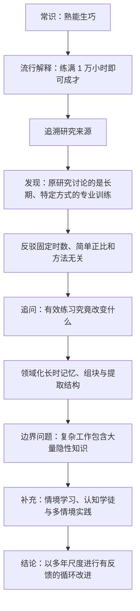

> **原书部分**：推荐序 
> **推荐序作者**：阳志平 
> **主题**：超越“1 万小时定律”，理解刻意练习、长时记忆与情境学习 
> **原文来源**：《刻意练习：如何从新手到大师》 
> **阅读目标**：不是记住一个新的成功公式，而是学会判断“什么练习真正改变了能力”，以及在什么条件下这种改变才可能发生。

---

## 一、推荐序要解决什么问题

### 1. 从一个人人赞同、却容易被误用的常识出发

没有人会否认练习对技能提升的重要性。困难不在于人们不知道“要练”，而在于下面几个更具体的问题：

1. 练多久才会变好，是否存在适用于所有人的固定时数？
2. 为什么有些人投入很久仍停在原地，有些人却能持续进步？
3. 真正有效的练习究竟改变了人的什么能力？
4. 象棋、音乐等规则清晰领域中的训练方法，能否直接搬到管理、销售等复杂领域？

“1 万小时定律”对第一个问题给出了极有吸引力的答案：只要累计练习达到一个固定时数，普通人就能成为专家。这个说法把复杂的技能发展压缩为一个可计数、可打卡、似乎人人平等的行动指标，因此很容易传播。

但它把“练习通常很重要”偷偷替换成了一个强得多的命题：

> **对任何人、任何领域，只要练满 1 万小时，就足以成为专家；不足 1 万小时则不行。**

前一句是宽泛的经验判断，后一句却包含了固定阈值、充分条件、跨领域普适性和近似线性的时间效果。推荐序的第一项任务，就是把这几个被捆在一起的主张拆开检验。

### 2. 推荐序的中心结论

推荐序最终给出的不是另一个神奇数字，而是一条更谨慎的因果链：

> 专业能力的提高依赖长期练习，但时间只是练习发生的载体。真正直接推动进步的，是针对当前薄弱环节设计任务、获得反馈、纠正错误，并逐渐形成领域化的知识结构和快速提取能力；当任务高度依赖隐性知识时，还必须进入真实情境和学习共同体。

可以把整篇推荐序的思路概括为：

### 3. 先区分三个层次，避免把相关性误当因果

讨论“练习与成就”时，至少要分清三个层次：

- **描述层**：表现更好的人，过去往往累计了更多高质量练习。
- **机制层**：某种练习通过什么心理、生理或社会过程提高了能力。
- **干预层**：让一个具体的人采用这种练习，能否使其表现提高，以及能提高多少。

一项观察性研究即使发现高手练得更多，也只直接支持描述层的相关关系。要得出“多练导致高水平”的因果结论，还要排除起点能力、家庭资源、教练质量、选择退出、动机强弱等替代解释；要进一步承诺“人人练满固定时数都会成为专家”，证据要求则更高。

因此，更符合实际的表达不是

$$
\text{专业表现}=k\times\text{练习时数},
$$

而是

$$
P_d(t)=F_d\bigl(Q(t),R(t),K(t),A,E,M,O\bigr).
$$

其中：

- $P_d(t)$：个体在领域 $d$、时刻 $t$ 的可测表现；
- $Q(t)$：练习任务的质量与难度匹配；
- $R(t)$：反馈和纠错质量；
- $K(t)$：已经形成的领域知识、组块和提取结构；
- $A$：相对稳定的认知与身体条件；
- $E$：教练、设备、家庭和组织等环境资源；
- $M$：动机、注意力与持续投入能力；
- $O$：参与高质量实践的机会。

下标 $d$ 表明：不同领域有不同的表现函数。这个模型不是为了精确计算，而是提醒我们，时数只是多个变量中的一个，不能单独承担全部解释。

---

## 二、超越 1 万小时定律

### 1. 为什么先追溯说法的来源

面对一个广为流传的数字，推荐序没有直接用另一个数字反驳，而是采用了“概念溯源”的方法：

1. 找到最早讨论专业技能发展周期的研究；
2. 查看后来被畅销书引用的实证研究究竟测量了什么；
3. 比较原研究结论与流行表述之间增加了哪些未经证明的含义；
4. 再用跨领域反例和逻辑分析检验其普适性。

这种方法有效，是因为二手传播常把带有限定条件的统计结果压缩成无条件口号。回到原问题、原样本和原测量，才能恢复那些在传播中丢失的条件。

### 2. 前置概念：时数、练习和专业表现不是同一件事

#### 2.1 练习时数

**练习时数**只是某人投入某类活动的累计时间。它没有自动说明：

- 练习目标是否明确；
- 任务是否超出当前水平；
- 是否专注；
- 是否收到可靠反馈；
- 是否根据反馈修正；
- 统计的是独自训练、课程、比赛，还是所有接触活动。

如果不同研究对“练习一小时”的定义不同，数字便不能直接横向比较。

#### 2.2 专业表现与专家身份

**专业表现**应是某个领域中可重复测量的任务成绩，例如棋局判断准确率、演奏质量评分、手术并发症控制或记忆项目成绩。

**专家身份**则常是类别标签，可能由职称、同行声誉、竞赛排名、任职位置或某次测试决定。不同领域对“专家”的门槛不同，同一领域的门槛还会随时代提高。

所以，“达到 1 万小时”是连续变量，“成为专家”却是由社会和测量规则划出的类别。若没有先定义专家标准，讨论统一时数阈值没有严格意义。

#### 2.3 普通重复、有目的的练习与刻意练习

为了理解推荐序的论证，可以先做一个必要区分：

| 类型 | 直接目标 | 典型做法 | 主要局限 |
| --- | --- | --- | --- |
| 普通重复 | 完成或维持熟悉活动 | 反复下完整棋局、重复演奏会弹的曲子 | 容易自动化已有错误，达到熟练平台后停滞 |
| 有目的的练习 | 主动改善一个明确指标 | 设置小目标、专注尝试、记录结果、调整方法 | 学习者可能不知道正确方向，也可能缺少高质量反馈 |
| 刻意练习 | 按成熟领域已验证的训练路径改进特定表现 | 教练诊断、定制任务、即时反馈、反复纠错 | 严格意义上要求领域有客观标准、成熟训练体系和合格导师 |

推荐序有时把“刻意练习”宽泛地用于所有高质量训练。按照本书正文后来给出的严格定义，并非所有自我设计的有效练习都叫刻意练习；在缺少成熟训练体系的领域，更准确的说法是“尽可能运用刻意练习原则的有目的练习”。

### 3. 第一条研究线索：西蒙与蔡斯的国际象棋研究

#### 3.1 研究问题从哪里来

国际象棋大师能迅速看懂复杂棋局。一个自然解释是：大师拥有比普通人大得多的通用短时记忆容量。但如果这个解释成立，大师在任何记忆任务上都应有类似优势。

赫伯特·西蒙与威廉·蔡斯比较棋手观看和复现棋局时的表现，试图回答：

> 大师优势来自更大的通用记忆容量，还是来自长期积累的领域知识？

推荐序援引的结果是：大师、一级棋手和新手能够记住的组块数约为 $7.7$、$5.7$ 和 $5.3$。三个数字并没有相差几十倍，真正不同的是每个组块包含的信息量。

#### 3.2 什么是“组块”

**组块（chunk）**不是由固定数量元素组成的物理单位，而是被学习者当成一个有意义整体来编码和提取的信息单位。

例如，新手看到一盘棋，可能把每枚棋子分别记忆；高手看到的则可能是“王翼兵形”“某种开局结构”“一组相互保护的子力”。两个人一次都只处理有限个组块，但高手的每个组块压缩了更多有结构的信息。

组块化能有效扩展任务中的信息处理量：

$$
\text{有效信息量}\approx\text{可同时处理的组块数}\times\text{每个组块承载的信息量}.
$$

公式只表达直觉，不意味着两者严格线性相乘。关键点是：专家未必拥有成倍扩大的通用“内存槽位”，而是凭借领域知识改变了信息的组织单位。

#### 3.3 从实验结果到长期训练的推断

西蒙据此推测，国际象棋大师在长时记忆中积累了约 $5$ 万至 $10$ 万种棋局模式，而形成如此庞大的领域知识库通常需要多年。由此产生了所谓“十年定律”：在许多复杂领域，达到顶尖水平往往需要大约十年的持续准备。

完整推理可以写成：

1. 大师在有意义棋局上的复现和判断显著优于新手；
2. 其通用短时记忆容量不足以单独解释这种差距；
3. 优势随棋局是否符合真实结构而变化，说明领域知识参与了编码；
4. 大量棋局模式只能通过长期接触、反馈与重组逐渐形成；
5. 对杰出棋手成长经历的观察显示，这一积累通常跨越多年；
6. 因此，专业技能的发展需要较长准备期，十年是经验尺度，而不是精确倒计时。

这条论证依赖几个条件：任务必须能调用已有棋局知识；对“组块”的估计要能反映真实表征；训练经历的回顾要大体可靠；被观察到的棋手不能只是幸存者中的特殊个案。

它能够支持“专业知识需要长期积累”，却不能单独支持以下结论：

- 每个领域都恰好需要十年；
- 每年必须训练固定小时数；
- 只要等待十年就会自然成为专家；
- 所有参与者经过同样训练都会达到同一高度。

推荐序还交代了一条学术传承线索：艾利克森于 1976 年从瑞典移居美国后，继续沿着西蒙关于专业技能习得的方向研究，并与西蒙在国际象棋专长问题上合作。这个脉络很重要，因为后来的刻意练习研究不是凭空提出一个训练口号，而是在解释“专家怎样获得领域化认知结构”这一老问题。

### 4. 第二条研究线索：艾利克森等人的小提琴学生研究

#### 4.1 研究设计在问什么

1993 年，艾利克森、克兰普和特施-勒默研究音乐学院中水平不同的小提琴学生，比较他们过去累计的训练经历。推荐序概述了三组：最杰出的学生、表现优秀的学生，以及主要准备从事音乐教育的学生。

流行转述常使用“到 20 岁分别约练习 1 万、8000、4000 小时”的数字；推荐序随后又引用本书对 18 岁前独自练习量的估计：三组平均约为 $7401$、$5301$ 和 $3420$ 小时。两套数字的年龄节点、统计口径和转述方式不同，恰好说明孤立地比较一个整数容易掩盖测量条件。

这项研究真正重要的观察是：

> 在已经进入高水平音乐教育体系的学生中，表现更好的组平均报告了更多独自、专注的专业练习。

#### 4.2 可以推出什么

该结果与以下机制假设一致：高质量训练持续得越久，学生越有机会修正技术、建立精细听觉表征并提升控制能力，因此平均表现更好。

它也说明“所有接触音乐的时间”不能等量看待。上课、娱乐性演奏、重复熟悉曲目和专门攻克薄弱片段，对能力的影响可能完全不同。

#### 4.3 不能推出什么

这不是把初学者随机分组，再强制他们分别练习不同小时数的实验。因此，仅凭组间差异不能证明固定时数是充分条件。可能同时存在：

- 表现更好使学生更愿意继续投入，形成反向因果；
- 更好的学生获得更优秀的老师和更多演出机会；
- 较弱或缺少资源者已在进入音乐学院前退出，造成选择偏差；
- 练习时间依赖回忆和日记估算，存在测量误差；
- 组均值会掩盖个体之间的大幅重叠。

最稳妥的结论是“累计的高质量练习与高水平表现存在重要关系”，而不是“1 万小时是通往世界级表现的充分且必要门槛”。

### 5. 从“十年经验尺度”到“1 万小时定律”发生了什么

马尔科姆·格拉德威尔在《异类》中把长期准备期和小提琴研究转述成易传播的“1 万小时”故事。这个故事至少做了四次简化：

1. **把多年尺度换算成固定时数**：例如默认十年中每周约练二十小时；
2. **把特定样本的平均数改写成个体门槛**：组平均不等于每个人的临界点；
3. **把特定类型的练习改写成任意练习**：忽略任务设计、注意力与反馈；
4. **把相关关系改写成成功保证**：忽略资源、选择、身体条件和领域差异。

推荐序指出，艾利克森的研究焦点一直是 **deliberate practice**，而不是证明一个神奇时数。若批评者把“人人练满 1 万小时必成专家”当作艾利克森的原主张，再据此攻击他的理论，就构成了**稻草人论证**：先把对方观点改造成更容易反驳的版本，再反驳这个替代版本。

推荐序特别提到，艾利克森在 2012 年 10 月为刻意练习观点作解释时，指出格拉德威尔的演绎使自己的研究常被当成上述稻草人，也对转述中弱化“刻意练习”这一限定有所不满。这一回应只能说明原作者不接受流行版本，具体理论是否成立仍应由研究设计和后续证据判断，不能诉诸作者权威。

### 6. “1 万小时定律”的四个核心问题

#### 6.1 问题一：不存在跨领域统一的最低阈值

推荐序列举演员、记忆选手、互联网创业者和音乐学生的不同训练时数，意在说明技能达到较高水平所需的时间跨度差异很大。原序给出的例子包括：优秀专业演员可能约需 $3500$ 小时，记忆项目的高水平技能可能用数百小时形成，Hacker News 读者整理的一些互联网公司创始人经历也不符合统一的 1 万小时门槛。有些封闭、规则明确、反馈快速的任务，数百小时便可能出现显著进步；有些需要庞大知识库、精细动作控制或长期社会机会的领域，则可能需要多年。

设领域 $d$ 的达标标准为 $S_d$，达到它所需时间为 $T_d$。固定阈值主张实际上要求：

$$
\forall d,\ \forall i,\quad T_{d,i}=10{,}000\text{ 小时}.
$$

只要存在可靠反例，即某领域或个体在更短时间达到明确定义的标准，或者训练更久仍未达到，这个全称命题便不成立。

但这里还要保持一层谨慎：推荐序中的演员时数、创业者经历和网站读者整理并非同等强度的证据。“创办成功公司”也不是一种单一、稳定、可重复评分的技能。因此，这些例子足以质疑普适数字，却不能精确估计每个领域真正需要多少训练。

#### 6.2 问题二：成功不与时数简单成正比

固定时数说容易让人误以为，多练一小时总会带来相同增量：

$$
\Delta P=k\Delta T.
$$

真实学习曲线通常并非直线。初期可能快速进步，随后进入平台；更换方法后再次跃升；疲劳、受伤或错误自动化还可能使表现下降。练习的边际收益取决于学习者当前状态和任务设计：

$$
\frac{\partial P}{\partial T}=g(\text{当前水平},\text{任务难度},\text{反馈},\text{恢复},\text{既有表征}).
$$

推荐序还强调，天赋与身体条件虽然不应被当成决定一切的宿命，却可能影响可达范围、学习速度或适合的项目。例如身高、体形会影响某些体育项目；一般认知能力与复杂专业学习也可能相关。

原序在这里援引史蒂芬·平克关于优秀科学家平均智商高于 $125$ 的说法，并提到一项 1997 年报告中医生、律师和会计的智力测量多处于中上水平。它们在推荐序中的逻辑作用，是提供“练习时数之外还有个体差异”的反例，而不是建立一个智商门槛。

这里必须区分三种说法：

- **天赋不是唯一决定因素**：大量能力可以通过训练改变；
- **天赋完全无关**：这是更强的命题，现有论证并不支持；
- **天赋决定一切**：同样错误，因为它无法解释训练引起的巨大个体内变化。

推荐序援引科学家、医生、律师、会计的智力统计，只能说明某些群体特征与职业选择或表现相关，不能证明某个智商分数是职业成功的必要门槛。相关可能同时受到教育筛选、社会资源和测量方式影响。

#### 6.3 问题三：练习方法会改变同样时数的价值

机械重复的目标往往是“把已经会做的事再做一次”；有效训练的目标则是“暴露当前做不到或做不稳的部分，并让下一次尝试更接近标准”。二者的时间成本可能相同，学习信号却不同。

有效改进至少需要下面的闭环：

若只有重复而没有比较标准，学习者不知道错在哪里；若只有反馈而不调整，反馈不会转化为能力；若任务始终太容易，已有程序只会越来越自动；若任务远超当前能力，错误来源又难以辨认。

推荐序用“高级新手、胜任者和专家”的差异说明：经历年限不等于技能阶段。长期执行固定流程的人可能拥有丰富经历，却仍主要依赖表面规则；专家则能识别深层模式、选择关键线索，并根据情境灵活行动。

#### 6.4 问题四：沙堆悖论揭示固定边界的任意性

古希腊哲学家欧布里德提出的**沙堆悖论**讨论的是模糊谓词：一粒沙不是“堆”，增加一粒似乎也不会让非沙堆突然变成沙堆；若不断重复这个推理，最终会得到许多沙仍不是堆的荒谬结论。

“专家”同样是一个边界模糊的类别。假如第 $9999$ 小时还不是专家，而第 $10000$ 小时突然变成专家，就必须说明最后一小时产生了什么质变。通常并不存在这样的自然断点。

这段论证的准确作用是：

- 它反对把连续变化武断切成一个普适、精确的临界点；
- 它提醒我们先给出可操作的表现标准，而不是依赖模糊称号；
- 它不能证明练习时长毫无作用，也不能证明所有分类边界都无效。

在竞赛资格、职业认证等场景中，人们可以人为设定边界，但那是为了决策而制定的规则，不是自然界中普适的成才定律。

### 7. 本节到底证明了什么

把上述论证合在一起，可以得到一个强度适中的结论：

1. 长期投入通常是复杂专业能力发展的重要条件；
2. 不同领域、标准和个体所需时间不同；
3. 练习时数不能脱离练习内容与质量解释；
4. 观察到的组平均值不能自动变成对个体的成功保证；
5. 因而，应当把“1 万小时”看成提醒人们尊重长期积累的传播性比喻，而不能把它当作科学阈值。

这里反驳的是“精确、普适、方法无关、足以保证成功”的版本，不是反驳坚持、训练或时间积累本身。

---

## 三、刻意练习的本质

### 1. 从“练了多久”转向“练习改变了什么”

否定固定时数后，真正有用的问题变成：同样有限的工作记忆下，专家为何能看到更多、记得更准、判断更快？

推荐序的回答是：专家通过长期训练形成了强大的、领域特定的长时记忆结构，并能在执行任务时迅速调用它们。时数只是形成这些结构所需的机会，结构本身才更接近能力提升的心理机制。

为了准确理解这句话，需要区分几个容易混淆的概念。

### 2. 工作记忆、长时记忆与长时工作记忆

#### 2.1 工作记忆

**工作记忆（working memory）**是人在当前任务中暂时保持并操作信息的有限系统。例如心算时保存中间结果，阅读长句时维持前半句含义，或下棋时比较几条候选变化。

它容量有限、容易受干扰。专家的优势通常不是获得了一个在所有任务上都无限扩大的工作记忆。

#### 2.2 长时记忆

**长时记忆（long-term memory）**是能跨越较长时间保存知识、经历和技能的系统。它不只是“仓库存了多少事实”，还包含概念之间的组织关系、动作程序、典型模式和在何种线索下调用它们的方法。

专家长时记忆最重要的特点不是孤立条目多，而是知识按任务需要被组织，能够支持预测、诊断和行动。

#### 2.3 长时工作记忆

推荐序多次使用“长时记忆”概括专家优势，但它所描述的“在活动中让工作记忆调用长时记忆”更接近艾利克森与金奇提出的**长时工作记忆（long-term working memory）**：

> 专家借助领域化的提取结构，把当前信息迅速编码到长时记忆，并在任务线索仍然有效时快速取回，从而在专业任务中表现得像拥有更大的工作空间。

它有三个关键限定：

1. **领域特定**：棋手的棋局记忆不会自动变成对随机数字或法律条文的超强记忆；
2. **依赖提取线索**：信息不是无条件随叫随到，而是由熟悉结构、目标和上下文触发；
3. **不是物理容量扩容**：改变的是编码、组织和访问方式，而非简单增加若干通用记忆槽。

因此，把它理解成“工作记忆与组织良好的长时记忆协同工作”，比理解成“专家天生内存更大”准确。

### 3. SSD 与内存条类比：有何帮助，又在哪里失真

推荐序用计算机作类比：新手只有容量很小的内存，专家则能把长时记忆这块 SSD 当成虚拟内存调用。

这个类比帮助我们看见两点：

- 专家没有把所有信息同时塞进工作记忆，而是随任务需要快速访问已组织的模式；
- 长期训练的价值在于建立可访问的知识结构，而不只是忍受漫长时间。

但类比也有边界：

- 人脑记忆不是原样写入和读取，回忆会重建并受情境影响；
- 新知识会重组旧知识，存储与处理并非截然分开的硬件模块；
- 形成错误模式后，快速提取反而可能稳定错误；
- 身体技能还涉及感知系统、动作控制和生理适应，不能全用“存数据”解释。

所以，SSD 是理解入口，不是严格的大脑模型。

### 4. 为什么专家能够“看到”新手看不到的东西

专家面对的物理信息与新手可能相同，但他们使用的心理表征不同。可以把这一过程拆成四步：

1. **选择线索**：从大量输入中注意到对任务最有诊断价值的信息；
2. **模式匹配**：把线索与长时记忆中的典型结构联系起来；
3. **生成预期**：依据模式预测下一步、可能原因或合理结果；
4. **校验与修正**：将真实结果与预期比较，更新原有模式。

例如，程序设计新手看到的是一行行语法；有经验的开发者可能立即识别出资源生命周期、并发边界或重复出现的设计结构。后者并非逐字符计算得更快，而是用更高层组块重新描述问题。

### 5. 形成领域化长时记忆的三个要点

#### 5.1 赋予意义与精细编码

**编码**是把当前经验转换成可保存、可检索表征的过程。机械背诵只保留表面形式；精细编码则把新信息与原因、例子、反例、已有知识和使用条件连接起来。

推荐序强调专家会主动使用**元认知策略**。元认知是对自己认知过程的监测与调节，包括：

- 我是否真正理解，而不只是熟悉这段话？
- 我在哪里出错，错误属于知识缺失还是执行失误？
- 哪种线索能帮助我下次取回这个规则？
- 当前方法是否有效，是否需要换一种练法？

精细编码之所以有效，是因为它增加了可用提取线索，并把知识放进因果和用途网络。以后遇到相似问题时，学习者更容易识别“何时用、为什么用”，而不只记得一句定义。

#### 5.2 建立提取结构与模式

**提取结构（retrieval structure）**是把待记信息与一组熟悉、有层次的线索对应起来，使学习者能够按稳定路径访问信息。棋局类型、故事框架、空间位置、诊断流程都可能成为提取结构。

**模式**则是跨多个实例保持相对稳定的关系结构。它不是对某个例子的照片式记忆，而是保留了哪些特征重要、特征如何关联，以及在什么条件下会发生什么。

推荐序以设计模式为例：专家开发者的优势不是背过模式名称，而是能判断：

1. 当前问题是否具有该模式要解决的结构；
2. 使用模式依赖哪些前提；
3. 它会引入什么代价；
4. 哪些相似问题反而不应使用它。

脱离适用条件死套模式，只是把表面模板自动化，并未形成有效的专业表征。

#### 5.3 加快编码和提取，增加有效连接

经过大量正确练习，常见结构的识别和动作执行会加速，释放有限的工作记忆去处理更高层问题。其过程大致是：

$$
\text{反复的正确辨别}
\rightarrow\text{稳定线索与模式的连接}
\rightarrow\text{更快提取}
\rightarrow\text{腾出注意力处理新颖部分}.
$$

这里的关键词是“正确辨别”。如果练习者反复执行错误动作且没有反馈，速度提高的只是错误程序。因此，重复本身不是机制；带着校验的重复才可能巩固可靠连接。

### 6. 什么样的训练能形成这些结构

推荐序给出四个互相依赖的条件：难度适中、能够收到反馈、具有足够重复、可以纠正错误。

#### 6.1 难度适中

“适中”不是主观感觉舒服，而是任务刚好超出当前稳定能力：学习者会犯错，但仍能判断错误来源并尝试修正。

- 太容易：没有新的适应压力，只是在维持熟练度；
- 太难：错误太多且彼此混杂，反馈无法指导下一步；
- 略高于当前水平：既产生新问题，又保留可分析性。

这个区间会随能力提高而移动，因此训练任务必须动态调整。

#### 6.2 可解释的反馈

反馈不是一句笼统的“好”或“不好”，而是关于目标与当前结果差距的信息。高质量反馈至少应回答：

1. 哪个具体表现偏离了标准？
2. 偏差发生在过程的哪一步？
3. 最可能的原因是什么？
4. 下一次应改变哪个可控动作？

反馈还必须可信。若评分标准不稳定、结果受大量随机因素影响，学习者可能从一次偶然成功中学到错误规则。

#### 6.3 足够而有变化的重复

一次正确可能是偶然。重复让学习者验证修正是否稳定，并使提取逐渐加速。但有效重复不是原样循环，而应围绕同一能力改变材料、速度、约束或情境，以防只记住单个答案。

#### 6.4 基于反馈纠错

纠错是闭环真正闭合的一步。学习者需要比较预期和结果，提出一个可检验的原因，再改变动作。如果每次失败后只是“更加用力”，就没有利用反馈中的结构信息。

可以把一次最小训练循环写成：

$$
\text{尝试}\rightarrow\text{测量偏差}\rightarrow\text{诊断原因}
\rightarrow\text{改变一个关键变量}\rightarrow\text{再次尝试}.
$$

每轮尽量只改变少数关键变量，才能知道改进来自哪里。

### 7. 下棋例子：为什么完整活动不一定是最佳练习

推荐序对比了两种方式：不断下完整棋局，以及观看高手棋谱后暂停并预测高手下一步。

完整对局的问题在于：

- 一个薄弱点在一局中可能只出现一次；
- 输赢反馈太粗，不能说明哪一步判断出了问题；
- 对手水平和局面类型不可控；
- 练习者容易回到最熟悉的策略。

“预测高手下一步”则把训练闭环压缩了：

1. 给定一个真实、有意义的局面；
2. 学习者生成候选走法并说明理由；
3. 查看高手选择及后续变化；
4. 比较自己漏掉的线索和错误评估；
5. 把该局面归入更精确的模式；
6. 在相似而不相同的局面中重新判断。

它为什么更有效？因为单位时间内可接触更多关键局面，反馈更直接，也更容易把错误定位到“局面识别、候选生成或变化评估”中的某一步。

“下棋次数毫无作用”是一种强调性的说法，不能按字面推广。实战能训练时间管理、情绪控制和综合决策；问题在于，只打完整比赛而不复盘，通常不是修补特定弱点的最高效方式。专项训练与真实表现任务应互相配合。

### 8. 能力上限为什么会随训练方法进步

推荐序引用本书的一项重要观察：当训练方法、工具和代际知识不断改进时，后来者能够达到过去被认为不可能的水平。

论证过程是：

1. 某一代顶尖者形成新的技术或表征；
2. 教练把隐含经验转化为可传授的训练任务；
3. 下一代不必从零摸索，能更早达到前人的终点；
4. 他们在更高起点上继续试验，又产生新的方法；
5. 因而，群体可达到的表现边界被持续推高。

这说明“目前没人做到”不等于“人类生理上永远做不到”。但它也不意味着任何边界都不存在。身体结构、恢复速度、年龄窗口、安全风险和资源约束仍会限制某个人在某项任务中的可达水平。

### 9. “长时记忆是本质”这一说法的适用边界

把领域化长时记忆视为核心机制，对象棋、记忆、阅读诊断和许多知识密集任务很有解释力，但不能把它扩张为唯一机制：

- 体操、演奏等技能还需要肌肉、肌腱、感知和动作控制的适应；
- 团队项目依赖沟通、共同表征和实时协调；
- 开放性创造任务不只调用旧模式，还要重组或打破模式；
- 动机、睡眠、恢复和情绪调节影响能否持续进行高强度训练；
- 机会与资源决定一个人能否接触合格导师和高质量任务。

因此，更完整的表述是：**刻意练习通过改变领域化心理表征及相关的感知、动作和生理系统，提高特定任务表现；快速访问长时记忆是其中一项关键机制。**

---

## 四、隐性知识

### 1. 为什么推荐序在这里转向“情境”

如果刻意练习如此有效，一个自然问题是：为什么不能直接设计一套练习，把任何人训练成优秀 CEO、销售或教师？

困难在于，并非所有领域都像象棋、古典音乐或记忆比赛那样具备清晰规则、稳定任务和快速反馈。推荐序把这个难题归结为：复杂现实工作包含较高比例的隐性知识，而隐性知识很难只靠脱离现场的个人练习获得。

这不是否定前一节，而是在确定它的边界：当“正确表现”容易定义时，可以精确拆分任务；当目标多元、情境变化且结果延迟时，连“该练什么”和“反馈是否正确”都更难判断。

### 2. 认知复杂性：要区分人的能力和任务的结构

推荐序把**认知复杂度（cognitive complexity）**解释为一个人建构和理解世界的能力：认知复杂度较高的人，能够同时容纳多个维度，理解看似冲突的概念，并避免把现实过早压成非黑即白。

为了分析训练边界，还要区分两个相关概念：

- **个体的认知复杂性**：一个人能使用多少彼此区分又相互关联的构念理解事件；
- **任务的认知复杂性**：完成任务需要同时整合多少变量、目标、时间尺度和他人反应，以及变量之间是否稳定。

管理和销售通常具有较高任务复杂性：

1. 目标不止一个，例如短期利润、长期能力和团队信任可能冲突；
2. 行动到结果之间有较长延迟；
3. 市场、团队和竞争者同时变化，因果难以隔离；
4. 他人会理解并回应你的行为，使环境本身具有反身性；
5. 同一策略在不同组织文化中可能产生相反效果。

在这种环境中，单次成败不是干净反馈。销售成交可能来自产品优势而非话术，项目失败也可能来自市场突变而非管理错误。因此，训练者不能像核对棋谱一样轻易确认“标准答案”。

### 3. 什么是隐性知识

**隐性知识（tacit knowledge）**是行动者能够在实践中使用、却难以完全用明确规则表达的知识。它常表现为：

- 知道该注意哪些细微信号；
- 知道什么时候应坚持规则、什么时候应例外处理；
- 能感到某个方案“不对劲”，但一开始说不清原因；
- 能根据对象、节奏和关系调整同一原则的表达方式。

推荐序也把它称为帮助人利用概念、事实和程序解决现实问题的**策略知识**。严格说，两者有重叠但不完全等同：策略可以被明确陈述，隐性知识则强调尚未或无法被完全言语化的部分。

隐性知识不是神秘直觉。它往往来自大量情境经验被压缩后的模式识别，只是其中许多线索权重尚未被行动者清楚表达。

### 4. 为什么隐性知识不能只靠读书获得

书本擅长传递可陈述的概念和规则，却很难穷举现实中的全部条件组合。假设一条规则写成：

$$
\text{若条件 }C\text{，则采取行动 }A.
$$

现实中的难点常常不在记住 $A$，而在判断：

- 当前情境是否真的属于 $C$；
- 哪些表面相似情境其实不是 $C$；
- 多条规则同时适用时如何权衡；
- 何时环境已经变化，需要放弃旧规则。

这些判断需要接触完整案例、观察他人行动、承担结果并接受解释。情境提供了书面规则省略的线索，也让学习者看见规则的使用条件。

### 5. 从有限理性到情境学习

西蒙提出**有限理性**：人的信息、计算能力和时间有限，不可能在所有方案中进行无成本的全局最优计算，只能借助环境结构、经验规则和可获得信息做出“足够好”的选择。

推荐序把这一思想落实为“在哪里用，就在哪里学”的情境原则。直觉是：如果未来表现依赖某些现场线索，训练时就应让学习者接触这些线索；否则即使记住抽象规则，也可能无法在需要时识别和调用。

例如，学习协作式软件开发，不只要会写语法正确的代码，还要经历版本管理、代码审查、缺陷讨论、自动化测试和维护旧代码。GitHub 等协作平台可以承载其中一部分真实实践，但“编程就应该只在 GitHub 学”过于绝对：嵌入式调试、保密项目、白板算法和本地性能分析还需要其他环境。

推荐序的另一个例子是讨价还价：只阅读谈判话术，很难学会判断客户的真实顾虑、让步时机与关系风险；在实际或高保真销售情境中练习，才能接触这些决定策略是否适用的线索。出于成本和伦理考虑，初学者不必直接承担高风险客户，可以先用角色扮演、录音复盘和导师旁听保留关键约束，再逐步进入真实场景。

“在哪里用，就在哪里学”应理解为**训练应保留目标场景中的关键约束和线索**，而不是要求地点完全相同。

### 6. 学习共同体与合法的边缘性参与

**学习共同体**是围绕共同实践形成的群体。知识不仅存在于成员头脑和教材中，也存在于工具、术语、协作流程、质量标准和角色分工中。

情境学习理论用**合法的边缘性参与**描述新手成长：

- **合法**：新手的参与被共同体认可，能够接触真实实践；
- **边缘**：起初承担风险较低、范围较小的任务；
- **参与**：通过实际贡献而不只是旁观来学习；
- **向中心移动**：随着能力和信任增长，逐步承担核心任务。

这个过程之所以有效，是因为新手同时学到“怎么做”“为什么这样做”“谁在什么情况下负责”以及共同体如何判断质量。许多隐性规范会在协作、反馈和观察中显现。

### 7. 认知学徒制的四个重点

推荐序建议从情境学习出发，成为一名“认知学徒”。传统学徒能直接看到师傅的身体动作，认知任务中的推理却隐藏在头脑里，因此认知学徒制的关键是把思考过程外显。

#### 7.1 找到学习共同体

共同体提供真实问题、质量标准、榜样、反馈者和逐步增加责任的路径。有效共同体不只是兴趣群，而应存在：

- 可观察的优秀实践；
- 对作品或决策的具体反馈；
- 允许新手承担真实但可控的任务；
- 对错误进行复盘，而不是只展示成功结果。

程序员参与开源项目、医生参加临床团队、教师共同备课，都可能形成这种环境。

#### 7.2 让隐性知识显性化

仅让新手模仿结果还不够，导师需要说出中间判断：

- 我先看到了什么线索？
- 我排除了哪些方案，为什么？
- 哪个风险最值得优先处理？
- 什么新信息会让我改变决定？

学习者也应进行“思维出声”、决策日志和事后复盘，把自己的判断过程暴露给反馈者。显性化并不能穷尽全部隐性知识，但能把其中可教、可检查的部分转化为训练材料。

#### 7.3 模仿榜样

榜样既可以是现场导师，也可以来自经过完整记录的案例、演示和作品。有效模仿不是复制表面动作，而是重建动作背后的目标和约束。

因此，模仿至少包含三步：

1. 观察榜样如何表征问题；
2. 解释其选择与备选方案的差异；
3. 在新情境中独立执行，并比较结果。

如果只复制成功者可见的习惯，容易产生**结果偏差**和**幸存者偏差**：被看见的行为未必是成功原因，失败者也可能做过同样的事。

#### 7.4 培养多样性

只在单一情境中练熟，可能学到的是情境表面特征。多情境实践要求改变客户、团队、约束、工具和问题类型，迫使学习者抽取更稳定的结构。

迁移能力形成于两种力量的平衡：

$$
\text{具体情境中的深度经验}
+\text{跨情境比较与抽象}
\rightarrow\text{可迁移的原则}.
$$

推荐序用裁缝说明：判断其是否出师，不看是否累计某个整数时数，而看能否在不同需求和材料约束下稳定做出合格衣服。多样性不是随机尝试，而是围绕同一核心能力系统改变条件。

### 8. 认知学徒制如何把“看会了”变成“会做了”

推荐序列出共同体、显性化、榜样和多样性四点。把它们展开，可以得到一条完整路径：

1. **示范**：导师执行任务，并外显关键判断；
2. **指导**：学习者亲自做，导师在关键节点反馈；
3. **脚手架**：初期提供模板、检查表和低风险任务；
4. **逐步撤除**：能力提高后减少提示、扩大责任；
5. **表达**：学习者说明自己的问题表征和决策依据；
6. **反思**：与榜样、同伴和自己过去的表现比较；
7. **探索**：在新情境中独立设问、尝试并校验。

这条路径与刻意练习并不冲突。示范提供目标表征，指导提供反馈，脚手架控制难度，反思支持纠错，探索和多情境实践检验迁移。

### 9. 刻意练习与情境学习如何互补

二者解决的是不同层面的问题：

| 问题 | 刻意练习更擅长 | 情境学习更擅长 |
| --- | --- | --- |
| 训练目标 | 拆分清晰、可测的表现成分 | 发现真实工作中究竟什么重要 |
| 反馈 | 快速、具体、可重复比较 | 来自真实后果、同行规范和协作关系 |
| 知识形态 | 可示范、可纠正的技能与表征 | 难言传的判断、时机和文化规范 |
| 任务控制 | 控制变量，集中攻克弱点 | 保留复杂约束，训练整合与适应 |
| 主要风险 | 训练任务与真实工作脱节 | 只积累经历，却不分析和修正弱点 |

一个更稳健的训练系统应在二者之间往返：

例如，管理者可从一次困难谈话中发现自己不会识别防御信号，再通过角色扮演、录像回看和教练反馈专项训练，最后回到不同团队的真实谈话中检验。只做角色扮演可能脱离现实，只靠“多开会”又难以集中纠错，两者结合才形成闭环。

### 10. 情境学习本身也有局限

进入共同体并不保证学到正确实践：

- 共同体可能把低效惯例当作传统传下去；
- 新手可能长期被限制在琐碎外围工作，无法接触核心判断；
- 真实任务反馈延迟且嘈杂，错误原因难辨；
- 在单一组织中形成的经验可能过度适配当地文化；
- 权力关系会影响谁能发言、获得指导和承担机会。

对应的修正方法包括：引入外部基准和多位导师；用模拟与案例控制关键变量；建立决策日志和事后复盘；轮换情境；把同行评价与客观结果结合。情境是真实性的来源，却仍需要结构化反思，不能把“在现场待得久”再次变成另一种时数迷信。

---

## 五、小结：真正值得保留的是长期尺度，而不是固定数字

### 1. 哈明的提醒：通往卓越没有单变量公式

推荐序借图灵奖得主理查德·哈明的观点收束全文：许多领域的卓越之路无法靠精确计算时间得到，也不存在一条简单模型通向伟大。

这不是说卓越完全不可研究，而是说：当结果由练习质量、已有知识、反馈、机会、身体条件和情境共同产生时，只报告一个累计时数，会丢失最有行动价值的信息。

### 2. 对“周期”的强调比对“小时”的强调更重要

推荐序又转述比尔·盖茨对 1 万小时说法的评价：它可以提醒人们重视投入，但真正做到还需要坚持，并经历许多个练习周期。

这里的**周期**不是把相同动作再重复一遍，而是一个能产生信息并改变下一轮行为的闭环：

$$
\text{目标}\rightarrow\text{行动}\rightarrow\text{反馈}
\rightarrow\text{反思}\rightarrow\text{修正后的目标与行动}.
$$

若每轮结束后策略、表征和错误概率都没有变化，那么累计的只是活动时间；若每轮都利用反馈重构了下一轮，即使总时数较少，也可能产生更高学习密度。

### 3. 西蒙“十年定律”真正的启发

推荐序最终保留了“十年”背后的时间尺度，而舍弃精确阈值。它要表达的是：复杂能力需要形成庞大的领域知识、稳定动作和判断结构，这些改变通常无法速成。

完整结论应写成：

1. 专业能力由大量相互连接的微技能和领域模式构成；
2. 每个训练周期只能可靠修正其中一部分；
3. 新能力又建立在已有能力之上，发展存在顺序依赖；
4. 真实情境和高质量反馈机会也需要随时间积累；
5. 因此，达到卓越通常需要多年持续、逐层构建；
6. 但具体年数和最终高度随领域、个体、标准与环境而变。

所以，十年不是“第十年自动兑现”的承诺，而是对长期主义的尺度提醒。

### 4. 这篇推荐序没有、也不能承诺什么

读完全序后，仍不能推出：

- 每个人只要方法正确都能成为世界第一；
- 天赋、身体条件、年龄和资源完全无关；
- 所有技能都能拆成标准化训练项目；
- 长时记忆是专业表现的唯一机制；
- 进入真实情境、跟随高手或长久坚持本身就必然有效；
- 一次研究中的平均规律可以精确预测某个个体。

它能提供的是更可靠的方向：不再问“我还差多少小时”，而要问“当前哪一项能力限制了表现，我将怎样获得可解释的反馈，并让下一轮练习发生可验证的改变”。

---

## 六、把推荐序转化为可执行的学习方法

### 1. 一套兼顾刻意练习与情境学习的流程

#### 第一步：定义真实表现，而不是定义投入时数

把“学好编程”“提高管理能力”改写成可观察结果，例如：

- 能在给定约束下定位并解释一类并发缺陷；
- 能在困难谈话中准确复述对方诉求，并形成双方确认的下一步；
- 能在陌生棋局中为候选走法给出稳定的局面评估。

指标应尽量贴近真实产出，同时允许多次测量。

#### 第二步：建立基线并定位瓶颈

完成一组代表性任务，保存答案、过程、耗时和错误类型。不要只记录总分，还要判断失败发生在知识提取、问题表征、方案生成、执行控制还是复核阶段。

#### 第三步：寻找可靠的优秀样本与导师

优秀样本必须在与目标一致的标准下长期表现良好，而不只是名气大。比较多位高手，寻找共同结构，减少把个人风格误认成普遍原因的风险。

导师的价值不只是给答案，而是能诊断当前水平、设计下一项任务，并解释反馈。

#### 第四步：设计略高于当前能力的专项任务

每轮集中训练一个主要瓶颈，控制任务规模，使错误能够归因。设定成功标准、时间限制、允许使用的工具，以及任务结束后如何核对。

#### 第五步：获得及时且可解释的反馈

优先级通常是：可靠客观结果、合格导师的过程反馈、同行评审、自我复盘。复杂领域可组合使用多种来源，避免把单一结果当成真相。

#### 第六步：把错误编码成可复用模式

每次练习后记录：

- 当时看到了哪些线索；
- 做出了什么预测；
- 实际结果与预测差在哪里；
- 漏掉了什么关键结构；
- 下次遇到什么线索时应调用哪条原则；
- 哪些条件变化会使这条原则失效。

这一步把“犯过一次错”转化为“形成可提取的辨别规则”。

#### 第七步：回到真实情境，并在多种情境中检验

专项训练提高局部能力，真实任务检验整合能力。若方法只能在熟悉题目上奏效，就应改变材料、对象和约束，检查是否真正学到了结构。

#### 第八步：按周期调整训练，而不是追逐累计数字

定期根据表现曲线判断：当前任务是否已过易、反馈是否失真、瓶颈是否转移、是否需要新的导师或情境。记录时数可用于管理精力，但不把它当成能力证明。

### 2. 一个知识技能例子：学习代码审查

低效目标是“做满 1000 小时代码审查”。更好的训练设计是：

1. 从真实缺陷库中选择一种缺陷，如资源泄漏；
2. 在规模受控的变更中独立标记风险并写出因果链；
3. 与测试结果、资深审查意见和后续缺陷比较；
4. 区分自己漏掉的是生命周期线索、异常路径还是所有权规则；
5. 建立“触发线索—检查问题—反例—修复代价”的模式；
6. 在不同语言、框架和代码库中再次识别；
7. 回到团队审查流程，观察技术判断如何与交付风险沟通。

前五步偏向专项练习，后两步引入多情境迁移和共同体中的隐性规范。

### 3. 一个复杂技能例子：提高管理决策

管理结果受多因素影响，不能只用季度业绩反馈训练。可以建立多层证据：

1. 用历史案例和模拟专练问题定义、方案比较或风险沟通；
2. 决策前写下假设、预期结果和使自己改变观点的证据；
3. 由有经验者评审推理过程，而不只评价结果；
4. 在真实项目中执行，并记录环境中途发生的变化；
5. 事后区分决策质量、执行质量和运气；
6. 与不同组织和情境的案例比较，抽取可迁移原则。

这不能像棋谱训练那样给出唯一答案，却能减少结果偏差，使嘈杂反馈逐渐具有可解释性。

---

## 七、核心概念辨析

| 概念 | 严格含义 | 最容易发生的误解 |
| --- | --- | --- |
| 十年定律 | 许多复杂专业的顶尖表现通常需要多年准备的经验概括 | 每个人到第十年都会成为专家 |
| 1 万小时定律 | 畅销传播中形成的固定时数说法，并非心理科学中的普适定律 | 任何活动累计 1 万小时都足够成功 |
| 组块 | 被学习者作为一个有意义整体编码和提取的信息单位 | 固定数量的数据，或单纯把内容分组 |
| 工作记忆 | 当前任务中暂时保持和操作信息的有限系统 | 等同于智力，或能靠领域训练无限扩容 |
| 长时记忆 | 长期保存知识、经历、模式和技能的系统 | 像硬盘一样原样存取的静态仓库 |
| 长时工作记忆 | 专家借助领域化提取结构快速使用长时记忆支持当前任务 | 一种跨领域通用的超强记忆力 |
| 元认知 | 对自己的理解、策略和错误进行监测与调节 | 仅仅是“知道自己在学习” |
| 提取结构 | 用稳定线索组织信息、支持快速访问的领域化结构 | 背下一套固定目录即可 |
| 刻意练习 | 在成熟领域中由合格导师设计、针对表现弱点、带反馈纠错的高专注训练 | 只要很辛苦、很专注或重复很多就是刻意练习 |
| 认知复杂性 | 区分并整合多个维度、观点和冲突构念的能力；也可指任务本身的多变量结构 | 想得越复杂越好，或故意把简单问题复杂化 |
| 隐性知识 | 能在行动中使用但难以完全言语化的情境化知识 | 无法分析、只能靠天赋获得的神秘直觉 |
| 有限理性 | 人在信息、时间和计算能力有限时借助环境与启发式做满意决策 | 人必然不理性，理性分析没有价值 |
| 情境学习 | 通过参与真实社会实践，利用现场线索、工具和共同体规范学习 | 只要置身现场，时间久了自然会学会 |
| 学习共同体 | 围绕共同实践、标准、工具和角色形成的学习环境 | 普通交流群或互相鼓励的打卡群 |
| 认知学徒制 | 通过示范、指导、脚手架、表达、反思和探索学习隐蔽的认知过程 | 机械模仿导师的表面行为 |
| 沙堆悖论 | 连续变化与模糊类别之间难以划出唯一自然边界的问题 | 可以据此否认所有阈值和分类 |

---

## 八、如何评价推荐序的分析方法

### 1. 有效之处

#### 1.1 先拆口号，再恢复条件

推荐序没有停在“1 万小时不准确”，而是追溯西蒙、蔡斯和艾利克森的研究，把时间、训练类型、领域知识和专业表现重新分开。这使讨论从宣传口号回到可检验问题。

#### 1.2 从反驳转向机制

仅证明某个数字错误，对学习者帮助有限。推荐序进一步追问专家优势如何产生，并用组块、长时记忆、编码和提取解释练习为何可能有效。这一步把“不要信什么”转化成“应该改变什么”。

#### 1.3 主动讨论适用边界

推荐序没有把刻意练习再次包装成万能方案，而是指出销售、管理等高复杂领域的反馈和知识形态不同，再引入情境学习和认知学徒制。好的理论不仅说明自己在哪里有效，也说明在哪里需要别的机制补足。

### 2. 需要谨慎之处

#### 2.1 有些例证只能反驳普适性，不能建立精确替代模型

演员时数、创业者经历、职业群体智力等材料在定义、样本和测量上差异很大。它们适合说明“不能只看一个数字”，却不足以量化各因素的因果贡献。

#### 2.2 “认知复杂性较低”不等于任务简单

象棋、钢琴和篮球都极其困难。这里真正的差异更接近：目标和评分是否稳定、反馈是否及时、训练传统是否成熟，而不是这些活动需要较少思考。用“结构较明确”和“结构不良、开放”来区分通常更准确。

#### 2.3 “长时记忆是本质”有意突出一个机制，但略显单一

专家表征确实重要，然而身体适应、动作控制、注意、动机和社会机会同样可能是因果链的一部分。把一个关键机制称为全部本质，容易遮蔽领域差异。

#### 2.4 情境学习不是独自练习的简单反面

成人并非总应在共同体中学习。事实记忆、基础动作和可拆分子技能常适合独立专项训练；真实共同体则适合获得标准、整合技能和学习隐性知识。应根据学习目标组合方法，而不是二选一。

### 3. 可替代和补充的方法

当严格的刻意练习无法实施时，可以根据缺失条件选择替代方案：

| 缺失条件 | 可用方法 | 主要作用 |
| --- | --- | --- |
| 没有统一正确答案 | 案例对比、情景模拟、决策日志 | 比较推理质量，分离结果与运气 |
| 真实反馈太慢 | 模拟器、缩短任务周期、领先指标 | 加快“行动—结果”循环 |
| 隐性知识难表达 | 思维出声、影随观察、访谈关键事件 | 外显高手的线索选择与判断过程 |
| 没有固定导师 | 同行评审、多源反馈、优秀作品逆向分析 | 从多个参照减少个人偏见 |
| 情境变化太大 | 多案例练习、岗位轮换、跨情境复盘 | 提取稳定结构并检验迁移 |
| 基础知识提取不稳 | 检索练习、间隔复习、交错练习 | 提高长期保持和条件辨别 |

这些方法不是都等同于刻意练习，而是分别解决反馈、表征、保持和迁移中的不同瓶颈。

---

## 九、全篇结论

推荐序完成了三次重要的视角转换：

1. 从**累计了多少时间**转向**每一轮练习产生了什么可验证的改变**；
2. 从**努力是否足够**转向**任务、反馈、纠错和心理表征是否形成闭环**；
3. 从**个人关门苦练**转向**专项训练与真实情境、学习共同体相互往返**。

因此，读完推荐序后最值得保留的不是“1 万”或“十年”，而是下面这条判断标准：

> 一项活动只有在持续暴露能力差距、提供可信反馈、促使学习者修正表征与行动，并能在目标情境中迁移时，才真正构成推动能力增长的练习。

长期仍然重要，因为复杂的领域知识、提取结构和情境判断需要许多轮改进才能形成；但长期只是必要的时间尺度之一，不是自动生效的原因。正确的态度既不是期待捷径，也不是迷信苦熬，而是耐心、谦逊地进行一个又一个有信息增量的训练周期。

---

## 十、复习问题

1. 西蒙的“十年定律”与流行的“1 万小时定律”在主张强度上有什么差别？
2. 为什么小提琴学生组间的平均练习时数不能证明 1 万小时是充分条件？
3. 沙堆悖论反驳的是固定边界，为什么不能用它否定练习时间的作用？
4. 专家和新手工作记忆容量相近时，专家为何仍能处理更多领域信息？
5. 长时记忆、长时工作记忆、组块和提取结构之间是什么关系？
6. 为什么“预测高手下一步并复盘”通常比单纯增加完整对局更有学习密度？
7. 难度、反馈、重复和纠错四项条件缺少任意一项，会发生什么？
8. 为什么管理和销售中的一次成功不能直接充当可靠反馈？
9. 隐性知识为什么依赖情境，又怎样把其中一部分显性化？
10. 刻意练习与情境学习分别解决什么问题，怎样组成往返闭环？
11. “在哪里用，就在哪里学”为什么不能按物理地点作绝对理解？
12. 如果不再用累计小时证明进步，你会为当前正在学习的技能选择什么表现指标？

---

## 十一、延伸阅读线索

- William G. Chase 与 Herbert A. Simon（1973）：国际象棋知觉、组块与专家记忆研究。
- K. Anders Ericsson、Ralf Th. Krampe 与 Clemens Tesch-Römer（1993）：刻意练习在专业表现形成中的作用。
- K. Anders Ericsson 与 Walter Kintsch（1995）：长时工作记忆理论。
- Jean Lave 与 Etienne Wenger（1991）：情境学习与合法的边缘性参与。
- Allan Collins、John Seely Brown 与 Susan Newman（1989）：认知学徒制。

这些材料分别对应推荐序的五条理论线索：长期专业发展、练习质量、领域化记忆、学习共同体和隐性认知过程的教学。
