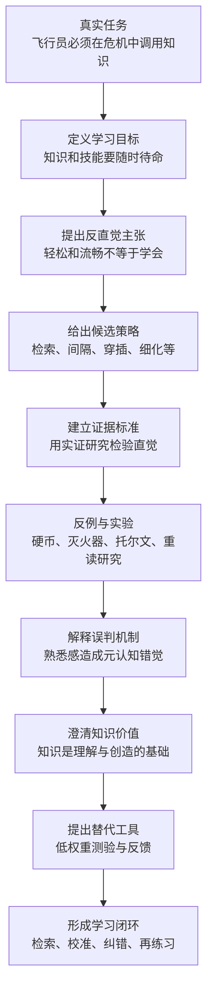
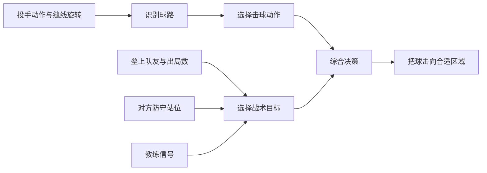
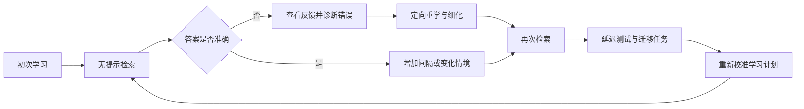

> **原书章节**：第 1 章“学习是挑战天性的必修课” 
> **原书作者**：彼得·C.布朗、亨利·L.罗迪格三世、马克·A.麦克丹尼尔 
> **原文来源**：《认知天性：让学习轻而易举的心理学规律》 
> **章节定位**：全书总论。先界定什么叫真正学会，再预告有效策略，随后用认知心理学研究反驳重复阅读与熟悉感，最后把低权重测验确立为学习工具。 
> **阅读目标**：不只记住“检索比重读好”，而是理解学习错觉从何而来、证据怎样排除替代解释、知识与创造力为何不是二选一，以及检索练习在什么条件下有效。

---

## 导读：第一章在证明什么

本章要纠正的不是某个孤立技巧，而是一套根深蒂固的学习观：

> 只要专心、投入足够长时间，把同一材料重复得越来越熟，学习自然就会发生；练习时越顺畅，说明学得越好。

作者认为，这套学习观把三个不同事物混在了一起：

1. **接触材料**与**形成可提取记忆**；
2. **练习时表现流畅**与**长期保持**；
3. **见到答案时认得**与**没有答案时会用**。

第一章的中心命题可以更准确地表述为：

> 真正的学习是获得知识或技能，并能在时间过去、提示减少、情境变化之后把它们检索出来解决问题。重复接触和集中练习常能改善眼前表现，却容易制造掌握错觉；检索、间隔、穿插、变化、生成、细化和反馈虽然更费力，却更有可能形成持久且灵活的能力。

作者按以下路线论证：

### 本章的真正难点

作者面对的难点至少有四个：

1. **错误方法会立即奖励学习者。** 连续重读时速度越来越快，集中练习时正确率越来越高，因此主观上很像进步。
2. **真正收益要延迟才能观察。** 长期保持和迁移发生在数日、数周后，人不能只靠当下感觉判断。
3. **测量学习会改变学习。** 测验不只是读取记忆，还会强化被读取的记忆；它既是测量工具，也是干预手段。
4. **普遍原则必须落到不同任务。** 记事实、开飞机、打棒球和做创造性工作内容不同，但都要求在适当线索下调用已有知识。

### 先区分“表现”与“学习”

本章许多反直觉结论都依赖这个前置区分。

**表现（performance）**是某人在特定时刻、特定支持条件下可观察到的成绩，例如刚看完例题后立刻做同类题的正确率。

**学习（learning）**是由经验引起、能够相对持久地支持未来表现的知识或能力变化。学习本身是潜在状态，不能直接看见，只能通过延迟测试、无提示检索和迁移任务推断。

设：

- $P_0$ 为练习结束时的即时表现；
- $P_t$ 为经过时间 $t$ 后的表现；
- $C_0$ 为练习时可用的提示、答案和短时激活；
- $C_t$ 为延迟测试时可用的提示；
- $L$ 为学习形成的持久能力。

即时表现可以粗略表示为：

$$
P_0=f(L,C_0).
$$

当重复材料仍在眼前时，$C_0$ 很强，即使 $L$ 不高，$P_0$ 也可能很好。若延迟测试减少提示，使 $C_t<C_0$，则

$$
P_t=f(L,C_t)
$$

更能反映学习者是否真正形成可独立调用的能力。这里的 $f$ 只是“表现由持久能力与现场支持共同决定”的概念函数，不是原书提供的精确测量公式。

这一区分意味着：

$$
P_0\uparrow\not\Rightarrow L\uparrow.
$$

练习时成绩提高，不足以单独证明长期学习增加。判断学习方法，至少还要看 $P_t$，并说明 $t$ 多长、提示是否相同、任务是否变化。

---

## 开篇案例：马特·布朗如何在单引擎状态下降落

### 1. 危机从哪里开始

飞行员马特·布朗驾驶一架双引擎塞斯纳 401 型飞机，在约 11000 英尺夜空中运送零件时，发现右侧引擎油压持续下降。

这不是一道已经标明知识点的课后题。他必须在信息不完整、时间有限、后果严重的情况下连续判断：

- 油压是否还允许继续飞行；
- 若引擎失灵，是否应主动关闭；
- 单引擎状态下飞机的损伤容限如何；
- 当前载重与剩余燃料是否改变可行方案；
- 关闭右引擎后怎样减小阻力并补偿不对称推力；
- 应以什么方向转弯接近机场。

### 2. 决策不是“背流程”，而是知识的组合调用

马特最后关闭右引擎，将螺旋桨桨叶调到与气流平行的位置以减小阻力，增加左侧动力，用方向舵补偿偏转，并以左转大弯接近降落地点。

这个过程至少调用了四类知识：

| 知识类型 | 在案例中的作用 |
| --- | --- |
| 事实性知识 | 塞斯纳 401 的损伤容限、仪表含义 |
| 概念性知识 | 推力不对称、升力、阻力和载重之间的关系 |
| 程序性知识 | 关闭引擎、顺桨、调动力和操纵方向舵 |
| 条件性知识 | 何时用哪套程序，以及当前条件是否满足 |

**条件性知识**尤其重要。它回答的不是“怎么做”，而是“何时、为什么这样做”。只背操作步骤而不能识别触发条件，遇到真实变化时仍可能选错程序。

### 3. 案例要说明的学习标准

作者明确说，读者不必理解每个飞行动作。案例承担的是概念功能：

> 学到的知识和技能必须能在未来需要时迅速进入工作状态，帮助人识别问题、比较方案并采取行动。

可以把可用知识表示为：

$$
K_{\text{usable}}=K_{\text{stored}}\times A_{\text{access}}\times F_{\text{fit}}.
$$

其中：

- $K_{\text{stored}}$ 表示已储存的知识质量；
- $A_{\text{access}}$ 表示在压力与时间限制下的可提取程度；
- $F_{\text{fit}}$ 表示知识与当前情境的匹配及迁移程度；
- $K_{\text{usable}}$ 表示实际可用于任务的知识。

乘法只是强调任一环节接近零都会限制实际应用：脑中没有知识，无法调用；存过却想不起，也无法使用；能想起但不会判断情境是否适用，同样可能失败。它不是可直接计算的心理学定律。

### 4. 从案例推出的三个共识

作者由此提出三个学习共识。

#### 共识一：学以致用必须依靠记忆

“理解”如果不能留下可检索的变化，就无法在未来发挥作用。记忆不是与思考相对立的低级活动，而是让过去经验参与当前决策的机制。

#### 共识二：学习贯穿一生

学校课程、职业技能、人际协作、退休后的兴趣和老年生活适应，都要求持续获得并保持新能力。学习不是学生阶段的临时任务，而是终身适应环境的条件。

#### 共识三：学习本身是一项可训练技能

人不仅能学习数学、飞行或木工，也能学习“怎样安排练习、怎样检查掌握、怎样纠错”。这就是**元学习**：关于如何有效学习的知识和调控能力。

第三点最反直觉。作者接下来整章的任务，就是证明直觉偏爱的策略未必有效，而学习方法可以通过证据比较并主动改进。

### 5. 案例的证据边界

马特成功降落是一个说明性案例，不是控制实验。它能说明“复杂任务需要可调用知识”在真实世界中是什么样子，却不能单独证明某种训练方法优于另一种方法。

可能影响马特表现的因素还有经验、机械背景、人格、飞行时状态和偶然条件。作者因此没有停在故事上，而在后文转向实验与课堂研究。

---

## 一、天性懒惰孕育了认知规律和心智模型

### 1. “挑战天性”究竟挑战什么

本章标题中的“天性”不是严格的遗传学定义，也不是说人本质上道德懒惰。它主要指一种稳定的认知倾向：

- 偏爱立即顺畅、反馈明显的活动；
- 回避暂时生疏、容易出错的活动；
- 用主观流畅感估计掌握程度；
- 倾向节省注意力与心理努力。

这种倾向有合理一面。人的注意力和工作记忆有限，自动化熟悉操作可以节约资源。但在学习中，它会造成评价错位：真正能促进长期保持的活动，往往在眼前更慢、更难、错误更多；只改善短期表现的活动，反而更舒服。

因此，“挑战天性”不是持续折磨自己，而是**不再把轻松感当作学习质量的可靠仪表**。

### 2. 深层学习为什么常常费力

作者提出“耗费心血的学习更深、更持久”。要准确理解，应先定义这里的“费力”。

**有学习价值的认知努力**是学习者为了完成目标加工而进行的活动，例如：

- 在答案不在眼前时检索；
- 区分相似问题属于哪一类；
- 用自己的话解释因果关系；
- 在变化情境中选择适当规则；
- 发现错误后重构理解。

它不包括与目标无关的负担，如模糊排版、无意义干扰、长期睡眠不足或远超基础的任务。

作者的完整推理是：

1. 持久学习需要学习者形成可提取、有关联的知识表征；
2. 检索、辨别和解释会实际使用并重组这些表征；
3. 这种加工通常比直接看答案费力；
4. 因而主观费力有时是有效加工正在发生的伴随信号；
5. 但费力本身不是原因，只有与目标相关且能够得到反馈的加工才有价值。

所以不能把命题误写成：

$$
\text{痛苦越大}\Rightarrow\text{学习越好}.
$$

更合理的是：

$$
\text{适度且相关的认知努力}+\text{成功或纠错反馈}
\Rightarrow\text{更可能形成持久学习}.
$$

### 3. 为什么人不善于判断自己是否学会

学习结果是延迟的，学习感受却是即时的。人只能直接体验眼前加工是否顺畅，不能直接观察长期记忆是否稳固。

设学习者对自己掌握程度的主观判断为 $J$，真实延迟表现为 $D$，则元认知校准误差可写成：

$$
E_{\text{cal}}=|J-D|.
$$

其中：

- $J$ 可以是“我一周后能答对 90%”的预测；
- $D$ 是一周后实际答对比例；
- $E_{\text{cal}}$ 越小，说明判断越准确。

连续重读会提高流畅感，使 $J$ 上升，却未必同比提高 $D$，于是 $E_{\text{cal}}$ 变大。无提示自测则直接采样未来需要的行为，通常能更准确地校准 $J$。

### 4. 集中练习：为什么眼前进步可能是陷阱

#### 4.1 要解决什么概念问题

“熟能生巧”容易把所有重复视为同一种练习。本章需要区分连续、机械地重复与跨时间、变化条件下的练习。

#### 4.2 严格定义

**集中练习（massed practice）**是在较短连续时间内，对同一知识或同一动作进行高密度重复，练习之间几乎没有足以产生遗忘和重新检索的间隔。

设练习发生在 $t_1,t_2,\ldots,t_n$，相邻间隔为

$$
\Delta_i=t_{i+1}-t_i.
$$

当大多数 $\Delta_i$ 很小，前一次答案或动作仍在工作记忆中时，就接近集中练习。考试前突击复习、连续做大量同型题都是常见形式。

#### 4.3 为什么它感觉有效

1. 前一次答案尚未消退，下一次不必重新寻找；
2. 题型不变，学习者不必判断该用哪条规则；
3. 动作连续重复，短期协调越来越流畅；
4. 即时正确率迅速上升，给出强烈进步反馈。

#### 4.4 为什么它可能不持久

集中练习改善的部分表现依赖短时激活和固定情境。一旦时间过去、提示消失、题型混合，学习者才暴露出检索与辨别不足。

这并不意味着集中练习毫无用途。它可用于：

- 初次熟悉动作；
- 短时间保持电话号码直到输入；
- 在已有稳定技能后进行热身；
- 对一个局部动作做短轮次纠正。

问题在于把它当作长期学习的全部，并用练习中的流畅表现证明已经精通。

### 5. 检索练习：从记忆中把知识找回来

#### 5.1 要解决的问题

未来使用知识时，教材和答案往往不在眼前。学习若始终依赖完整材料，就没有练习真正需要的“从线索到答案”过程。

#### 5.2 直觉含义

检索不是把知识再放进去一次，而是练习把已经学过的内容取出来。抽认卡正面是线索，学习者必须先作答，再翻面核对。

#### 5.3 操作性定义

**检索练习（retrieval practice）**是学习者在不直接查看完整答案的条件下，根据问题或情境线索，尝试从记忆中提取先前学过的知识或执行技能，并在必要时获得反馈。

它包含：

1. **目标记忆**：此前接触过的事实、概念或程序；
2. **检索线索**：问题、标题、情境、症状或操作信号；
3. **提取尝试**：学习者必须自己生成答案或动作；
4. **结果反馈**：确认、纠错或补充。

#### 5.4 两种直接收益

- **诊断收益**：暴露能否提取以及哪里薄弱；
- **强化收益**：检索活动本身改变记忆，使以后更容易再次提取。

后一项就是后文所谓的测验效应。诊断只告诉人“哪里不会”，强化则意味着即便已经答对，检索仍可能继续促进学习。

#### 5.5 神经回路比喻的边界

原书说大脑不像肌肉，但学习相关神经回路可以通过检索和练习得到强化。这里应避免把“记忆路径”理解成一根肉眼可见、每次回想都会机械加粗的单线电缆。

它是功能性解释：重复成功提取会改变记忆表征及线索联系，提高以后访问概率。具体神经机制复杂，也会因知识类型和时间尺度不同而变化。

### 6. 间隔练习：允许一点遗忘，再重新提取

**间隔练习（spaced practice）**是把同一知识或技能的多次练习分散到不同时间，使相邻练习之间存在有意义的时间距离。

它比集中练习更难，是因为前一次内容不再完全活跃，学习者必须付出更多提取努力。作者预告的机制链为：

1. 时间间隔带来部分遗忘或情境变化；
2. 下一次练习不能简单沿用短时激活；
3. 学习者重新构造或检索目标内容；
4. 成功检索与反馈再次巩固记忆；
5. 记忆因而更能抵抗未来遗忘。

间隔不是越长越好。若间隔短到答案仍在眼前，缺少重新检索；若长到完全失败且没有提示和反馈，练习会退化为重新学习。最合适的间隔取决于目标保持时间、材料难度和当前熟练度。

### 7. 穿插练习与多样化练习：练习选择规则

#### 7.1 穿插练习

**穿插练习（interleaved practice）**是在一次或多次练习中交替安排不同但相关的问题类型或技能。

集中安排可能是：

$$
A,A,A,B,B,B,C,C,C,
$$

穿插安排可能是：

$$
A,B,C,B,A,C,A,C,B.
$$

其中 $A$、$B$、$C$ 表示相关但需要不同识别或解决方式的问题类型。

穿插的价值不仅是多做几类题，而是每次都要先回答：“这是什么类型？该调用哪条规则？”

#### 7.2 多样化练习

**多样化练习（varied practice）**是在不同参数、情境、示例或动作条件下练习同一原则或技能。

例如计算体积时改变几何体，识别鸟类时更换角度、年龄和背景，练击球时面对不同球路。变化迫使学习者区分本质特征与偶然表面特征。

#### 7.3 为什么有助于规则提取和迁移

设样本 $x$ 由关键特征 $z$ 和表面特征 $u$ 组成：

$$
x=(z,u).
$$

若练习样本表面几乎完全相同，学习者可能把 $u$ 误当作规则。多样样本让 $u$ 变化，而 $z$ 保持与类别或原理稳定相关，学习者更有机会提取真正决定答案的 $z$。

这要求变化是有结构的。若一次引入太多无关变化，初学者可能找不到稳定特征；因此通常需要先有最低限度的基础，再逐步扩大变化。

### 8. 生成：先尝试解决，再接受答案

作者提出，在别人给出答案前先尝试解决问题，即使会犯错，也可能学得更好。

**生成（generation）**是学习者根据现有线索和已有知识，主动提出答案、解释或解决方案，而不是直接接收完整结果。

它可能有效的原因是：

1. 尝试会激活与问题相关的已有知识；
2. 学习者形成对答案结构的预期；
3. 失败暴露具体缺口；
4. 随后的正确答案与原尝试形成对比；
5. 反馈因而更有针对性、更容易整合。

成立条件是问题至少部分可理解，并且随后有可靠反馈。完全无基础地猜测、长期保留错误答案，或让错误带来严重现实后果，都不适合无保护的生成。飞行员应在模拟器中安全犯错，而不是在真实危机中第一次探索关键程序。

### 9. 学习风格：偏好不等于匹配效应

#### 9.1 常见主张

学习风格理论常把人分为视觉型、听觉型等类型，并主张若教学媒介与个人类型匹配，学习效果就会更好。

#### 9.2 作者反对的准确对象

作者并不否认：

- 人有不同偏好；
- 人在不同能力上存在差异；
- 某些内容适合特定媒介。

作者反对的是更强的**匹配假说**：先按偏好给人分类，再匹配教学方式，可以稳定提高客观学习结果。

要证明匹配假说，需要出现交互效果。设视觉偏好者为 $V$，听觉偏好者为 $A$，视觉教学为 $I_V$，听觉教学为 $I_A$。理论预期：

$$
Y(V,I_V)>Y(V,I_A),
$$

同时

$$
Y(A,I_A)>Y(A,I_V),
$$

其中 $Y$ 是可比较的学习结果。只有“视觉材料总体更好”或“视觉偏好者总体成绩更高”都不足以证明匹配。

#### 9.3 替代原则

教学形式应首先匹配内容与目标：地图适合视觉空间表示，发音需要听觉输入，运动技能需要实际动作。学习者还应综合使用多种能力，而不是被一个类型标签限制。

### 10. 测验：对抗判断错觉的校准工具

本节先预告测验的第一重价值：让学习者知道自己究竟会什么。

模拟飞行中的液压失灵场景，比“你是否理解修正程序”这句自我询问更能暴露真实能力，因为它要求执行与未来任务相似的行为。

有效测验应尽量满足**任务一致性**：

$$
S(T,L)\uparrow\Rightarrow V(T)\uparrow,
$$

其中：

- $T$ 表示测验任务；
- $L$ 表示未来目标任务；
- $S(T,L)$ 表示二者所需知识与操作的相似程度；
- $V(T)$ 表示测验对目标能力判断的有效性。

相似度提高通常能增强测验有效性，但不是要求练习题与真实任务表面完全相同。好的测验应保留核心能力，同时适当改变表面情境以检查迁移。

### 11. 先备知识：新知识必须接到旧知识上

作者用三个例子说明先备知识的重要性：

- 学单引擎降落前，先会双引擎正常降落；
- 学三角函数前，先掌握代数与几何；
- 学木工前，先理解材料性质与基本工具操作。

**先备知识（prior knowledge）**是理解和学习当前内容所必需或有帮助的已有事实、概念、技能和经验。

它至少有四个作用：

1. 给新信息提供解释词汇；
2. 帮助识别哪些特征重要；
3. 提供可连接的结构，减少孤立记忆；
4. 支持推理与迁移，避免每次从零开始。

但旧知识也可能错误或不适用。若学习者把错误直觉当框架，新信息会被扭曲。因此教学既要激活先备知识，也要诊断其中的误概念。

### 12. 细化：把新知嵌入已有知识网络

#### 12.1 要解决的问题

机械重复把信息当成彼此独立的项目，容易让人感觉脑容量被“塞满”。细化要解决的是新知识缺少意义和检索入口的问题。

#### 12.2 严格定义

**细化（elaboration）**是用自己的语言解释新知识的含义，并明确它与已有知识、经验、因果机制、具体例子或其他概念之间的关系。

设新知识为 $K_n$，已有知识为 $K_1,K_2,\ldots,K_m$，细化不是增加无关文字，而是建立可解释关系：

$$
K_n\leftrightarrow\{K_1,K_2,\ldots,K_m\}.
$$

关系可以是“属于”“导致”“对比”“组成”“应用于”或“是……的例子”。

#### 12.3 热与湿度的例子

原书把抽象热学概念连接到生活经验：

- 空调机滴水、暴雨后空气变凉，用于理解温度与空气含水能力及凝结；
- 干燥地区汗液更易蒸发，用于理解蒸发冷却；
- 手捧热可可感到温暖，对应热传导；
- 冬日阳光使房间变暖，对应热辐射；
- 冷空气流动带来凉意，对应热对流。

这些例子不是用体验取代物理定义，而是给抽象原理增加具体模型和检索线索。若生活直觉与科学定义冲突，仍应以可检验理论为准。

#### 12.4 历史与角动量的例子

知道更多相关历史故事，并从野心、偶然性等多个角度比较，会让事件进入更广的因果网络。理解角动量时，把抽象守恒关系连接到花样滑冰运动员收拢手臂后旋转变快，也能提供具体表征。

但一个生动例子只能说明原理的一种表现，不能代替适用条件。例如角动量例子还隐含外力矩近似可忽略等条件。细化越生动，并不意味着越准确；必须保留概念边界。

### 13. 心智模型：把零散事实组织成可运行的结构

#### 13.1 要解决的问题

真实任务不会告诉人“现在调用第 37 条事实”。学习者需要从复杂信息中识别关键线索，预测系统变化，并选择行动。孤立知识清单难以承担这个任务。

#### 13.2 定义

原书把**心智模型（mental model）**定义为外部现实在心理上的表征。更具体地说，它是学习者对一个系统的关键对象、关系、状态变化和操作规则所形成的内部结构，可用于解释、预测和行动。

原书脚注说明，这一术语最初常用于电网或汽车引擎等复杂概念系统；本书把它扩展到运动技能，包含有时被称为“运动图式”的表征。

#### 13.3 心智模型与事实清单的区别

事实清单回答“有哪些”；心智模型还回答：

- 哪些特征重要；
- 它们怎样相互作用；
- 条件变化会导致什么结果；
- 在某种状态下应该做什么。

可以把模型表示为一个有向结构：

$$
M=(N,E,R),
$$

其中：

- $N$ 是模型中的对象或状态节点；
- $E$ 是节点之间的联系；
- $R$ 是因果、约束、转换或操作规则；
- $M$ 是整体心智模型。

这是帮助理解的结构化表达，不是原书给出的形式系统。

#### 13.4 棒球击球手怎样使用心智模型

优秀击球手必须在极短时间内判断球路。他会关注投手挥臂、出手方式和缝线旋转等诊断性线索，忽略无关干扰，并把线索映射到曲球、变化球等球路模型。

但击球模型不是孤立的。它还要连接：

- 击球姿势、击球区域与挥棒动作；
- 垒上队友位置；
- 出局数与双杀风险；
- 对方防守站位；
- 教练传来的战术信号。

经验丰富者的优势不只是“看得更多”，而是能把大量信息压缩成有意义的模式，快速区分信号与噪声。初学者面对同样画面，却不知道哪些变化值得注意。

#### 13.5 心智模型的局限

模型是现实的简化，不是现实本身。它可能：

- 忽略低概率但重要的因素；
- 因环境变化而过时；
- 建立在错误因果关系上；
- 只适用于熟悉情境。

因此，心智模型必须通过新案例、反馈、反例和实际结果持续校正。

---

## 二、科学“照妖镜”下的学习方法

### 1. 从固定智力观转向可塑能力观

本节先挑战“学不好是先天不足”的宿命解释。作者承认人与人天资不同，但强调学习经验会改变大脑，心智模型可以不断发展，分析、解决问题和创造的能力因此并非完全固定。

完整论证不是“人人经过同样努力都能达到任何高度”，而是：

1. 经验能够造成相对持久的知识和技能变化；
2. 知识结构和心智模型参与复杂问题解决；
3. 人可通过学习改进这些结构；
4. 所以个人未来能力不由当前表现和先天差异完全决定；
5. 失败可以作为策略与知识缺口的反馈，而不必被解释为能力终局。

可以写成：

$$
A_{t+1}=F(A_t,Q,P,R,E),
$$

其中：

- $A_t$ 是时刻 $t$ 的能力状态；
- $Q$ 是练习质量；
- $P$ 是先备知识与既有模型；
- $R$ 是反馈、反思和纠错；
- $E$ 是资源、机会和环境；
- $A_{t+1}$ 是后续能力状态。

这个模型强调能力会发展，也保留条件差异。它不支持“只要相信就一定成功”。

### 2. 失败为什么可以成为学习信息

失败至少可能说明三类问题：

1. **知识缺口**：缺少完成任务所需事实、概念或程序；
2. **策略不当**：知道内容，却采用了不合适的解决路线；
3. **任务或资源不匹配**：难度过高、反馈不足、时间或工具不够。

因此，失败后的合理问题不是只有“我是否足够努力”，还包括：

- 错在哪里；
- 错误属于哪一类；
- 哪个线索没有识别；
- 当前练习是否针对薄弱环节；
- 是否应降低难度、补先备知识或换方法。

作者把犯错并改错视为通向高层次学习的桥梁。边界是错误必须可恢复，并有纠正机制。医疗、飞行等高风险领域要通过模拟器、监督练习和检查表控制错误成本。

### 3. 为什么传统教学容易被直觉支配

教师、教练与学习者都能观察练习现场，却很少持续追踪数周后的保持和新情境应用。于是教学理论容易从个人经验中形成：

1. 某种集中练习使学生当堂做得更快；
2. 教师观察到即时改善；
3. 即时改善被解释成学习完成；
4. 方法被重复、传播并成为传统；
5. 后续遗忘归因于学生不努力，而不是训练设计。

这是一种把相关和时间先后误作因果的风险。传统能提供实践线索，但仍要用比较研究检验。

### 4. 不同学科怎样研究学习

原书区分了几个相关领域。

| 领域 | 主要问题 | 常见贡献 | 本章提示的边界 |
| --- | --- | --- | --- |
| 认知心理学 | 感知、记忆和思考怎样运作 | 控制实验、学习与记忆机制 | 实验任务可能较简化 |
| 发展心理学 | 能力如何随年龄与发展阶段变化 | 发展规律、年龄差异 | 发展描述不自动给出教学方案 |
| 教育心理学 | 学习理论如何用于教学与测评 | 课程工具、考试、特殊教育资源 | 真实环境变量复杂 |
| 神经科学 | 学习背后的脑机制是什么 | 成像、生理机制、可塑性证据 | 脑区活动不直接等于有效教学处方 |

作者特别提醒，当时神经科学离直接告诉教师“课堂应怎样教”仍有距离。知道某脑区在任务中活跃，不足以证明某教学法优于另一种；教育建议仍需行为层面的学习结果验证。

### 5. 什么样的研究才足以检验学习方法

#### 5.1 从可证伪假设开始

“检索有助于学习”必须改写成可比较命题，例如：

> 在材料、总学习时间和初始水平可比时，接受无提示检索并获得反馈的学习者，在一周后的测试中，平均成绩高于连续重读组。

这个命题说明了：

- 干预：检索与重读；
- 控制条件：材料、时间、初始水平；
- 结果：一周后的平均成绩；
- 可反驳情况：两组无差异或重读更好。

#### 5.2 控制替代解释

若检索组花的时间更多，或者原本能力更强，就不能把成绩差完全归因于检索。实验通过随机分配、相同材料、相同时间或统计控制，尽量使策略成为组间主要系统差异。

#### 5.3 选择正确的结果指标

学习方法可能在即时测试与延迟测试上给出相反结果。必须预先说明：

- 测试延迟多久；
- 测原内容还是新问题；
- 是重认、回忆还是实际操作；
- 评价正确率、速度还是决策质量。

#### 5.4 接受同行检验与重复研究

发表在专业期刊、接受同行评议可以发现一些设计和解释问题，但并不保证结论永远正确。更强的信心来自不同团队、样本和材料中的重复，以及实验室与真实课堂证据相互支持。

#### 5.5 区分发现、理论与故事

作者承诺，若介绍的是理论而非已被科学验证的结果，会作说明。三类材料的功能不同：

- **研究发现**描述在特定条件下观察到的差异；
- **理论**解释为什么产生差异，并预测新情况；
- **故事**让抽象原则进入具体任务，但不能独立建立普遍因果。

### 6. “不尽职学习者”：努力不等于采用了有效方法

作者说许多教师和学生都是“不尽职学习者”，并不是指他们态度懒散，而是指他们没有履行学习者的认知职责：

- 没有用延迟表现检查方法；
- 没有主动暴露知识缺口；
- 没有区分熟悉与会用；
- 没有依据反馈调整练习。

集中练习让人看到快速改善，这正是它被教师、培训者和教练普遍信任的原因。科学证据却要求继续观察：改善是否在时间过去后仍存在。

### 7. 反复阅读的三大问题

原书概括出三项不足：

1. **浪费时间**：同样时间可用于更有效的检索与练习；
2. **难以形成持久记忆**：连续重读的额外收益很小，且容易消退；
3. **制造掌握错觉**：材料越来越熟，使人高估自己。

超过 80% 的大学生在调查中把重读作为主要策略，说明流行度不能保证有效性。

但结论必须加限定：作者批评的是把**连续、被动重读作为主要学习方法**，不是说任何第二次阅读都无价值。初次没有理解、需要查证细节、隔一段时间重新组织材料时，重读可以服务于学习；关键是不能只重读而不检索、解释和应用。

### 8. 飞行培训：从幻灯片灌输到模拟器主动练习

#### 8.1 前七天的填鸭式课程

马特为获得喷气式商用飞机驾驶资格，参加 18 天、每天约 10 小时的培训。前 7 天主要在教室听讲，学习电路、燃料、气动系统及安全参数，并面对约 80 项需要在紧急情况下迅速执行的记忆任务。

信息量大、时间密集、呈现方式以幻灯片和讲解为主，形成典型集中输入。问题不在内容不重要，而在学习者很少被迫从情境线索中检索并执行。

#### 8.2 燃料过滤器故事为什么令人难忘

讲师展示复杂燃料系统图时，一位飞行员讲述高空中燃料因缺少防冻剂而结冰、过滤器堵塞、两台引擎濒临失灵的经历。

这个故事让抽象图示变得可记，原因包括：

1. **因果链明确**：燃料含水、低温结冰、油路堵塞、引擎失灵；
2. **后果重大**：错误关系到飞行安全；
3. **问题与自己相关**：听者会模拟“如果是我怎么办”；
4. **行动线索具体**：加油时检查防冻剂标识，飞行中出现信号则下降到更暖空气；
5. **抽象与情境连接**：原理图中的部件不再是孤立标签。

情绪强烈不是必要条件，也不能保证记忆准确。故事真正有学习价值，是因为它组织了因果、线索和行动，并能与技术图示相互核对。

#### 8.3 后十一天的模拟器训练

之后 11 天，学员在教室与飞行模拟器之间轮换。他们要在多种故障情境中执行标准程序、协调动作节奏并接受结果反馈。

模拟器同时整合了：

- **检索**：看到故障线索后，从记忆中调用流程；
- **间隔**：同一程序不会始终连续重复；
- **穿插**：不同意外情况交替出现；
- **多样化**：条件和故障组合发生变化；
- **情境化**：抽象知识进入近似真实的操作；
- **测验与反馈**：暴露薄弱处，校准学员与讲师判断；
- **程序化**：把陈述性步骤逐渐转成可流畅执行的技能。

#### 8.4 为什么模拟器有效

它提高了训练任务与目标任务的结构相似性，又把真实灾难的风险降到可接受范围。学习者不仅回答“我是否看懂流程”，而是证明“出现线索时我能否及时做对”。

#### 8.5 局限与替代方案

高保真模拟器昂贵，也不能复制真实环境的全部压力和意外。低成本替代可以是：

- 案例推演；
- 情境口试；
- 桌面演练；
- 分支决策题；
- 角色扮演；
- 在监督下进行局部实操。

关键不是设备炫目，而是保留“线索出现—主动判断—执行—反馈”的闭环。

### 9. 重复接触为什么不能自动形成记忆

#### 9.1 硬币识别

人一生见过无数次常用硬币，却往往无法从 12 幅相似图中找出完全正确的一幅。这说明视觉接触次数很多，不等于编码了图案方向、文字位置等细节。

#### 9.2 灭火器位置

加州大学洛杉矶分校的研究让实验室人员指出离办公室最近的灭火器，多数人失败。一位任教 25 年的教授发现，灭火器就在每天多次使用的门把手旁。

这里的关键机制不是“记忆容量太小”，而是**注意与任务目标决定编码**。日常开门的目标是操作门把手，灭火器位置没有被当成需要记住的信息。长期暴露若缺少注意、提取和用途，仍可能不形成可用记忆。

#### 9.3 正确结论与错误推广

正确结论是：

$$
\text{重复暴露}\not\Rightarrow\text{对目标细节形成持久、可提取记忆}.
$$

错误推广是“重复永远无用”。事实上，重复是许多学习过程的必要组成，但必须与注意、意义加工、检索、间隔或反馈结合。反复默念号码可短暂维持工作记忆，只是不足以保证长期学习。

### 10. 托尔文实验：事先念六遍为什么没有帮助

#### 10.1 研究设计

20 世纪 60 年代中期，恩德尔·托尔文让不知情参与者把成对项目念 6 遍，例如“椅子—9”，其中每对第一个项目是普通名词。随后才告知他们要学习一列名词。

- 一组学习此前已经念过 6 遍的名词；
- 另一组学习此前没有念过的新名词。

若单纯接触会自动增强后续记忆，第一组应有明显优势。

#### 10.2 结果

两组学习曲线在统计上重合，事先六次无意接触没有带来可检测的后续学习优势。

#### 10.3 推理过程

1. 两组的主要差异是目标名词此前是否被念过；
2. 旧词组已经有六次额外接触；
3. 若接触次数本身足以增强目标记忆，旧词组应学得更快或记得更多；
4. 结果没有出现预期优势；
5. 因而“只要重复出现就自动学会”的强命题不成立。

#### 10.4 成立条件与边界

实验针对的是特定材料、无意学习条件和后续自由回忆。它不能证明重复在所有任务中都没有任何作用，也不能证明参与者对旧词完全没有熟悉感。它证明的是：**熟悉或发音接触不能自动转化成实验所测的有意回忆收益。**

### 11. 重复阅读研究：即时小收益为何不等于长期学习

#### 11.1 研究问题

研究者进一步比较：文章读一遍和连续读两遍，对理解与记忆有多大差异？

#### 11.2 两种时间安排带来的不同结果

原书总结的研究发现：

- 初读后立即再读，若马上测验，重读组可能略好；
- 若把测验延后，连续重读的优势消失；
- 若初读后隔几天再读，间隔重读可能优于不重读。

这说明“是否重读”不是唯一变量，重读发生的时间以及测试发生的时间同样重要。

可以定义策略效应：

$$
\Delta(t)=Y_{\text{reread}}(t)-Y_{\text{single}}(t),
$$

其中：

- $Y_{\text{reread}}(t)$ 是重读组在延迟 $t$ 后的成绩；
- $Y_{\text{single}}(t)$ 是只读一遍组在同一延迟后的成绩；
- $\Delta(t)$ 是重读相对优势。

研究提示，连续重读时 $\Delta(0)$ 可能略大于零，但延迟增加后，$\Delta(t)$ 可能接近零。因而不能用即时结果替代长期结论。

#### 11.3 148 名学生、5 篇材料的后续研究

华盛顿大学与新墨西哥大学相关研究从课本和科普杂志选取 5 段材料，让来自两所大学、阅读能力不同的 148 名学生只读一遍或连续读两遍，再测理解和记忆。

在该实验的各种条件下，连续重读没有显示有效收益。能力差异和学校差异也没有挽救连续重读策略。

#### 11.4 能推出什么

- 连续第二遍阅读的边际收益可能很小；
- 即时熟悉不能预测延迟保持；
- 把时间用于无提示回忆、解释或间隔复习，机会成本可能更低。

#### 11.5 不能推出什么

- 不能说复杂文章永远只读一遍；
- 不能说初读没理解时不应回看；
- 不能说间隔重读没有价值；
- 不能把五段材料和大学生样本无条件推广到所有年龄、技能和文本。

更可行的替代方案是：初读建立理解，合书检索并解释，依据暴露出的缺口定向重读，隔一段时间再检索。

### 12. 元认知错觉：为什么无效方法仍被坚持

#### 12.1 定义

**元认知（metacognition）**是人对自身认知活动的知识、监控和调节，包括判断自己知道什么、预测未来能否记住、选择学习策略以及依据反馈调整。

**元认知错觉**是主观判断与客观能力系统性偏离。例如，学习者确信能解释一个概念，撤掉课本后却说不出来。

#### 12.2 流畅性错觉的形成

材料写得清楚是作者与文本的属性；学习者能否独立解释是学习者的能力。阅读时两者同时出现，人容易把“作者讲得明白”误当成“我已经掌握”。

#### 12.3 大一学生案例

一名学生全勤、认真记笔记、画重点并反复阅读，却在心理学入门考试中成绩很差。教授追问发现，他没有：

- 用章末概念自测；
- 在无提示下给出定义；
- 把知识用于写作；
- 把要点改写成问题；
- 用自己的话解释；
- 连接旧知或寻找书外例子。

问题不是他没有投入，而是学习活动没有直接练习考试和理解所需的行为。

#### 12.4 “已知的未知”与“未知的未知”

- **已知的已知**：知道自己会；
- **已知的未知**：知道自己不会；
- **未知的未知**：不知道自己不会。

已知的未知容易安排复习；未知的未知最危险，因为学习者连补救行动都不会启动。高质量自测的核心价值，就是把“未知的未知”转化为“已知的未知”。

#### 12.5 两个典型后果

1. 不知道薄弱环节在哪里，无法合理分配时间；
2. 偏爱继续使用能制造掌握感、却不能改善长期结果的方法。

### 13. 怎样替代纯重读

本节材料隐含一套更合理的阅读流程：

1. 初读，识别中心问题与结构；
2. 移开材料，用自己的话回忆；
3. 回答概念定义、原因、例子与反例；
4. 与原文核对，记录错误；
5. 只对缺口定向重读；
6. 隔一段时间再次检索；
7. 在新问题中应用。

重读在这里仍存在，但从主角变成了反馈和纠错工具。

---

## 三、知识多不等于学习能力强

### 1. 小节标题为什么容易误解

“知识多不等于学习能力强”不是说知识无用，也不是说能力与知识无关。它要区分：

- **知识存量**：已经掌握的事实、概念、程序和模型；
- **学习能力**：获取、组织、检索、校准和迁移新知识的能力；
- **任务表现**：在特定情境中利用知识解决问题的结果。

知识存量大的人，若不善于发现未知、更新模型或迁移，也可能学习低效；但没有足够知识，复杂思考同样无从发生。

### 2. “我听懂了”为什么不等于“我会了”

清晰讲解会降低理解当下的处理难度。学习者能沿着教师给出的路线点头，却未必能独立重建路线。

至少要区分四种掌握层次：

| 层次 | 行为表现 | 主要风险 |
| --- | --- | --- |
| 重认 | 看到答案觉得熟悉 | 提示撤掉后无法作答 |
| 回忆 | 无完整答案时能说出 | 可能只会复述，不能解释 |
| 理解 | 能说明关系、依据和条件 | 可能只适用于熟悉例子 |
| 迁移 | 能在新情境选择并应用 | 需要更广知识和辨别能力 |

听懂最多直接支持当时的重认和跟随。要主张“会了”，还应通过回忆、解释和迁移测试。

### 3. 知识与创造力不是二选一

作者反驳一种流行二分法：记忆知识属于低层次活动，分析、综合和创造才是高层次能力，因此重视知识会压制创造力。

#### 3.1 为什么这个二分法有吸引力

- 死记硬背确实可能脱离理解；
- 标准化考试可能只覆盖狭窄知识；
- 创造听起来比积累更有吸引力；
- 人们把“知识是创造的基础”误听成“知识足以产生创造”。

#### 3.2 作者的完整推理

1. 分析需要识别事实、模式和约束；
2. 综合需要知道哪些要素可以组合以及关系如何；
3. 创造性解决问题需要从已有概念中重组、类比和变换；
4. 若相关知识无法从记忆中及时提取，工作记忆就要反复查找基础信息；
5. 因而复杂思考需要可靠知识基础；
6. 但知识本身不会自动产生判断和创造，还需练习应用、比较和生成。

逻辑关系是：

$$
\text{知识是高阶能力的重要必要条件之一，通常不是充分条件。}
$$

若把知识基础记为 $K$，分析与创造策略记为 $S$，任务表现记为 $Y$，可写成：

$$
Y=F(K,S,E),
$$

其中 $E$ 是环境、工具、时间和协作等条件。只有 $K$ 而缺少 $S$，可能只是会背；只有 $S$ 的口号而缺少 $K$，则没有足够材料可分析和重组。

### 4. 建筑比喻：材料与结构缺一不可

原书把记忆知识比作把建筑材料运到工地。房屋不能没有材料，但材料堆在一起也不会自动成为房屋。

- 事实和概念像材料；
- 原理和心智模型像结构设计；
- 判断和程序像施工能力；
- 反馈与检验像质量控制。

精通要求既知道“有什么”，也知道“怎样组合、在何种条件下使用”。

### 5. 专业技能为什么需要知识逐步积累

厨艺、棋类、神经外科和飞行都需要长期积累：

1. 基础事实成为后续理解的词汇；
2. 概念把事实组织成关系；
3. 反复应用形成模式识别和程序；
4. 心智模型支持预测与判断；
5. 在变化情境中练习，形成迁移与适应。

马特判断是否关闭右引擎时，需要立即调用单引擎流程与损伤容限。神经外科学生必须掌握神经、骨骼、肌肉和体液系统，才能理解病变并设计手术。现场创造性不能替代这些基础。

### 6. 标准化考试的合理批评与错误推论

作者承认标准化考试可能存在问题：

- 题目范围可能狭窄；
- 分数可能被误作人的全部能力；
- 高风险后果会制造焦虑；
- 应试训练可能追逐题型而忽略迁移。

但不能由此推出“记忆不重要”或“所有考试都妨碍理解”。需要区分：

1. **考试内容是否有效**；
2. **考试后果是否合理**；
3. **考试作为测量是否准确**；
4. **检索行为是否促进学习**。

一种高风险标准化考试设计不佳，不会否定低权重自测的学习效应。

### 7. 本小节的边界

- 知识量不能用背诵项目数简单衡量，组织质量和可提取性同样重要；
- 领域知识对本领域思考帮助大，不自动变成跨领域通用智慧；
- 基础记忆不能取代概念理解和实践；
- 创造力可能借助外部工具和协作，但仍需判断搜索什么、怎样评价结果；
- 学习能力可以改善，却也受先备知识、动机、健康和资源影响。

---

## 四、考试是最有效的学习策略之一

### 1. 先把“考试”拆成两种功能

人们通常把考试理解为**评估工具**：在学习结束后测量成绩、排名或认证。作者要求增加第二种理解：**学习工具**，即通过主动检索来强化记忆并指导后续学习。

| 功能 | 核心问题 | 典型结果 |
| --- | --- | --- |
| 总结性评估 | 最终学到了多少 | 分数、等级、资格 |
| 形成性评估 | 当前哪里会、哪里不会 | 调整教学和复习 |
| 检索练习 | 能否从记忆中主动提取 | 强化保持与访问路径 |

同一次小测验可以同时承担后两种功能。问题不在是否叫“考试”，而在权重、反馈、频率、题型和使用方式。

### 2. 测验效应的严格含义

**测验效应（testing effect）**或**检索练习效应**是指：与仅再次学习材料相比，主动从记忆中检索先前学过的内容，通常能提高后续测试中的长期保持；如果配合反馈，还能纠正错误。

设：

- $Y_R(t)$ 为检索练习组在延迟 $t$ 后的成绩；
- $Y_S(t)$ 为再次学习组在相同延迟后的成绩；
- 其他关键条件大体可比。

测验效应可以表示为：

$$
TE(t)=Y_R(t)-Y_S(t).
$$

当 $TE(t)>0$ 时，表示在该研究材料、样本、延迟和测试条件下，检索组平均保持更好。

这一定义不承诺每个人、每次检索、每种题型都必然受益，也不说明效应大小固定。

### 3. 检索的两大显著好处

#### 3.1 校准：知道该把精力放在哪里

自测把主观判断变成行为证据。答不出的问题暴露缺口，使后续学习从平均用力转成定向修复。

若总复习时间为 $T$，第 $i$ 个知识点的薄弱程度为 $g_i$，合理分配可概念化为：

$$
t_i=T\frac{g_i}{\sum_{j=1}^{n}g_j},
$$

其中：

- $t_i$ 是分给知识点 $i$ 的时间；
- $n$ 是知识点数量；
- $g_i$ 越大，表示缺口越大。

这不是要求机械按比例计时，而是说明没有自测就无法估计 $g_i$，学习者容易把时间继续花在最熟悉的内容上。

#### 3.2 强化：检索改变记忆本身

检索不是被动读取一个固定仓库。成功回忆会重新激活目标知识、恢复线索关系，并为新旧知识建立联系，使后续访问更容易。

因此，即使一次测验不给分，只要学习者认真提取并获得纠错反馈，它仍可能产生学习收益。

### 4. 为什么“检索越费力，收益往往越大”需要条件

作者指出，检索付出的心思越多，受益可能越多。这里的关键前提是**最终成功检索或获得正确反馈**。

合理关系不是无限递增，而更接近：

- 太容易：答案仍在工作记忆中，额外加工少；
- 难度适中：需要搜索、重建并成功提取，强化较大；
- 太困难：完全无法恢复且没有反馈，收益有限并可能挫败。

难度可通过延迟、减少提示、改用简答或变化情境调节。学习初期可以提供部分线索，掌握后逐步撤除支架。

### 5. 哥伦比亚中学实验：小测验与重复复习的比较

#### 5.1 研究安排

伊利诺伊州哥伦比亚市一所中学的八年级科学课中：

- 部分知识点进入低权重小测验，并提供反馈；
- 另一部分知识点不测验，而是安排学生额外复习 3 遍；
- 大约一个月后，在正式考试中比较两类知识点的保持。

这种设计的关键是，同一课程中的知识点接受不同学习处理，从而比较检索与重复接触。

#### 5.2 结果

学生在被小测验覆盖的知识点上平均达到约 `A-`，只额外复习而未测验的知识点约为 `C+`。

字母等级直观展示了差距，但严格理解仍应查看原研究的数值、变异和统计分析。章节在这里用它说明方向和教育意义，而非给出全部方法细节。

#### 5.3 推理

1. 两类内容都来自同一门科学课；
2. 未测内容并非完全不接触，而是额外复习 3 遍；
3. 测验内容要求学生从记忆中生成答案，并得到反馈；
4. 一个月后，测验内容保持明显更好；
5. 因而差异不能简单解释为“测验组只是多看了几遍”；
6. 结果支持检索练习比重复复习更能促进延迟保持。

#### 5.4 仍需注意的边界

- 知识点难度与教师安排需要平衡或控制；
- 结果来自特定年级、学科和课程；
- 小测验包含反馈，不能把收益全部归于纯检索而忽略反馈；
- `A-` 与 `C+` 不代表所有课堂都能复制同样差距；
- 研究首先证明被测知识点的保持，向更远迁移的程度还需另测。

### 6. 飞行员为何每半年重新接受模拟考核

即使马特驾驶同型商用飞机已有 10 年，仍每半年参加考试和模拟训练。原因是紧急情况少见，相关程序若不主动检索，可能因长期不用而生疏。

这揭示了一个重要原则：

> 低频但高风险的技能，不能用“平时没出事”证明仍然熟练，必须通过周期性模拟检索维持。

适用场景还包括急救、消防、灾难恢复、网络安全响应和设备应急停机。练习频率应结合遗忘速度、后果严重度和训练成本确定。

### 7. 低权重测验为什么不同于高风险考试

**低权重测验（low-stakes quiz）**对最终成绩影响很小或不计分，主要用于检索、反馈和调整。

它的优势是：

- 允许犯错而不造成重大惩罚；
- 降低单次考试压力；
- 可以提高频率，形成间隔检索；
- 给教师提供理解差距信息；
- 让学生在正式评估前纠正误解。

若测验频繁但不给反馈、题目只考琐碎细节、权重过高或以羞辱方式使用，则可能增加焦虑并扭曲学习目标。测验效应不能为任何考试制度背书。

### 8. 测验如何成为完整学习闭环

只有“做题”而没有核对、纠错和再测试，闭环仍不完整。

### 9. 常见误解辨析

#### 误解一：考试有效，所以考试越多、压力越大越好

错。检索收益与考试的惩罚性不是同一变量。频繁低权重、带反馈的测验往往更符合学习目的。

#### 误解二：只要做选择题就能掌握一切

错。题型应匹配目标。选择题可练辨别，但开放解释、实际操作和迁移需要简答、案例或模拟。

#### 误解三：答错会强化错误，所以不要在学会前测试

错一半。无反馈地反复答错有风险；但先尝试再及时得到正确反馈，可以暴露缺口并促进学习。

#### 误解四：测验只强化死记硬背

若只测孤立事实，收益主要落在事实保持；若测因果解释、规则选择和真实操作，检索也可以强化理解与应用。测验质量决定它练习什么。

#### 误解五：检索能替代首次理解

错。检索必须有可检索的初始表征。遇到完全陌生的内容，要先建立基本理解；之后才能用检索巩固和校准。

---

## 五、小结：把学习从感觉改造成可校准的循环

### 1. 作者对旧学习模式的最终诊断

旧模式的失败链条是：

1. 人依据直觉选择反复阅读和集中练习；
2. 这些方法改善即时流畅度；
3. 流畅度被误判为长期掌握；
4. 学习者不再自测，也看不到未知的未知；
5. 时间过去或情境变化后，知识无法提取；
6. 失败又被归因于天赋或投入不足；
7. 学习者于是增加同一种低效重复。

打破循环的关键不是再多一点意志力，而是换一个测量标准和反馈系统。

### 2. “找方位”：自测为什么像导航

书中把用自测寻找学习重点比作“找方位”：行进者登上高处，寻找远处参照物，校准指南针，再穿越看不清全局的低地。

对应关系是：

| 导航 | 学习 |
| --- | --- |
| 目的地 | 目标能力 |
| 远处参照物 | 明确标准或样例 |
| 指南针 | 自测与反馈 |
| 当前方位 | 当前掌握状态 |
| 修正路线 | 调整复习重点与方法 |

没有目标标准，自测无从判断；只有目标而不测当前位置，学习者也可能沿错误方向持续用力。

### 3. 本章预告的有效策略

#### 3.1 检索练习

用低权重小测验、抽认卡、闭卷复述或模拟操作主动提取。

#### 3.2 间隔练习

把同一内容的练习分散开，允许部分遗忘后重新提取。

#### 3.3 穿插练习

交替练习相关类型，迫使自己辨别问题并选择规则。

#### 3.4 多样化练习

改变例子、参数和情境，学习稳定原则而非表面模板。

#### 3.5 生成

在获得答案前先尝试解决，并利用反馈修正。

#### 3.6 规则提取

比较不同问题，识别决定类别和解法的底层特征。

#### 3.7 细化与心智模型

用自己的话解释，把新知连接旧知，并组织成能解释、预测和行动的结构。

### 4. 为什么这些方法形成统一系统

这些方法看似分散，实则共同针对三个核心目标：

| 核心目标 | 对应策略 |
| --- | --- |
| 让知识可提取 | 检索、间隔、低权重测验 |
| 让判断可校准 | 自测、反馈、错误分析 |
| 让知识可迁移 | 穿插、多样化、生成、规则提取、心智模型 |

它们共同把学习从“再次接触信息”变成“在变化条件下主动重建并使用信息”。

### 5. 第一章结论的适用边界

1. **不是所有轻松学习都无效。** 清晰讲解和合适支架能减少无关负担，给核心加工留出资源。
2. **不是所有困难都有效。** 困难必须与目标相关、难度适中、允许成功并有反馈。
3. **不是所有重复都无效。** 重复是必要条件之一，但连续被动暴露通常不够；间隔、检索与变化决定重复质量。
4. **不是所有考试都有益。** 高风险、无反馈、内容狭窄的考试可能产生副作用。
5. **检索不替代理解。** 首次学习、背景知识和正确解释仍是基础。
6. **知识不自动产生创造力。** 它提供材料，仍需判断、组合、实验和实践。
7. **实验结论有条件。** 样本、材料、延迟、题型和环境变化会影响效应大小。
8. **方法不能消除所有差异。** 健康、资源、动机、先备知识和机会仍会影响结果。

---

## 六、第一章核心概念对照表

| 概念 | 要解决的问题 | 操作性定义 | 不能混同为 |
| --- | --- | --- | --- |
| 学习 | 怎样判断能力是否真正改变 | 由经验引起、可相对持久支持未来表现的变化 | 练习时一时顺畅 |
| 即时表现 | 当前做得怎样 | 特定时刻和支持条件下可观察的成绩 | 长期学习本身 |
| 集中练习 | 描述高密度重复 | 短时间连续重复同一内容，间隔很小 | 所有形式的练习 |
| 检索练习 | 练习未来调用 | 不看完整答案，依据线索提取所学并接受反馈 | 再看或照抄答案 |
| 间隔练习 | 防止练习依赖短时激活 | 把同一内容分散到不同时间练习 | 单纯拖延 |
| 穿插练习 | 学会辨别类型和选择规则 | 交替安排不同但相关的问题或技能 | 随机插入无关内容 |
| 多样化练习 | 提取稳定原则并促进迁移 | 改变参数、例子和情境练同一能力 | 毫无结构地不断换任务 |
| 生成 | 避免被动接收 | 在看到答案前尝试产生答案、解释或方案 | 无反馈瞎猜 |
| 细化 | 给新知增加意义和线索 | 解释新知并连接已有知识、经验和关系 | 增加无关篇幅 |
| 心智模型 | 在复杂情境中解释、预测和行动 | 对系统对象、关系、状态和规则的内部表征 | 一串孤立事实 |
| 元认知 | 监控和调节自己的学习 | 判断已知未知、选择策略并依据反馈调整 | 泛泛的自信或感受 |
| 流畅性错觉 | 解释为何高估掌握 | 把材料加工顺畅误判成自身可独立提取和应用 | 真正熟练 |
| 测验效应 | 说明考试也能促进学习 | 检索相对再次学习改善后续保持的现象 | 所有考试制度都有效 |
| 先备知识 | 让新知有可连接结构 | 当前学习所依赖或可利用的已有知识与技能 | 固定不变的天赋 |
| 迁移 | 在变化情境中使用所学 | 把原则或技能用于不同但相关的新任务 | 原题机械重做 |

---

## 七、作者分析问题的方法论

### 1. 用极端真实案例明确目标

飞行危机把“学会”的标准从考试分数提升为能否在关键时刻调用。极端案例使知识可提取性的价值格外清楚。

### 2. 从反直觉现象提出可检验问题

为什么看了无数次硬币仍记不清？为什么连续读两遍感觉更熟，延迟成绩却没有提高？这些现象迫使作者怀疑“接触次数决定学习”的直觉。

### 3. 把宽泛争论拆成变量

作者实际区分了：

- 重复方式：集中或间隔；
- 学习活动：重读或检索；
- 测试时间：立即或延迟；
- 结果类型：熟悉、回忆或应用；
- 证据来源：故事、实验或课堂研究。

变量拆开后，“重复有没有用”不再是只能回答是或否的空泛问题。

### 4. 先用控制实验识别机制，再用课堂验证

托尔文实验隔离“额外接触”，重读实验操纵阅读次数和时间，哥伦比亚中学研究再把检索带入真实课程。不同证据共同缩小替代解释。

### 5. 为错误方法寻找心理机制

作者没有把学生归咎为懒惰，而是解释重复阅读为什么有诱惑力：它确实制造流畅和即时改善。只有理解奖励机制，才能设计替代行为。

### 6. 给出低成本替代而非只做批判

替代方案不是购买复杂工具，而是把阅读改成问题、合书作答、低权重测验、间隔复习和反馈纠错。模拟器虽昂贵，其核心结构也能用案例推演实现。

### 7. 主动保留理论边界

作者承认个体天资不同、神经科学尚不能直接提供完整教学处方、标准化考试存在陷阱，也说明故事只用于阐释。这让结论保持在证据能够支持的范围内。

---

## 八、把本章方法用于实际学习

### 1. 把阅读目标改写成可检索问题

不要只写“今天读完第一章”，可以写：

- 不看书解释表现与学习的区别；
- 比较集中、间隔和穿插练习；
- 复述托尔文实验的设计、结果和边界；
- 解释熟悉感为什么会导致元认知误判；
- 为自己的课程设计一组低权重检索题。

### 2. 采用“读—忆—核—隔—用”流程

#### 读：建立初步理解

阅读一个逻辑单元，找出它在回答什么问题。

#### 忆：撤掉原文主动检索

写出中心结论、证据、机制和边界。不要只回忆标题。

#### 核：用原文反馈

把错误分为事实遗漏、概念混淆、推理断裂和边界缺失。

#### 隔：延迟后再测

当天、第二天、一周后重复检索。若始终太容易，延长间隔；若完全无法恢复，缩短间隔或增加提示。

#### 用：改变情境迁移

给新案例分类，或用概念诊断自己的真实学习安排。

### 3. 把笔记改造成检索工具

普通笔记：

> 检索练习能强化记忆。

可检索笔记：

> 问：检索练习与重读的操作区别是什么？它有哪两类收益？什么情况下答错可能有害？

后者迫使学习者生成定义、机制和边界。

### 4. 为不同目标选择测试

| 学习目标 | 更合适的检索任务 |
| --- | --- |
| 术语与事实 | 抽认卡、填空、简答 |
| 概念理解 | 用自己的话解释、举例与反例 |
| 规则选择 | 混合题型、分类并说明理由 |
| 问题解决 | 新题、案例分析、限时推演 |
| 操作技能 | 实操、模拟器、分步演示 |
| 心智模型 | 画因果图、预测系统变化、诊断故障 |

### 5. 一个可执行的一周安排

| 时间 | 活动 | 目的 |
| --- | --- | --- |
| 第 0 天 | 初读后闭卷写章节结构 | 首次检索与暴露缺口 |
| 第 1 天 | 回答核心概念简答题 | 间隔检索 |
| 第 3 天 | 混合判断学习案例 | 穿插与辨别 |
| 第 7 天 | 用本章原则重设计一门课的复习 | 迁移与细化 |
| 第 14 天 | 无提示复述关键实验和边界 | 长期保持校准 |

这只是起始安排，不是普适最佳间隔。应根据实际回忆难度动态调整。

---

## 九、自测题

### A. 基础概念

1. 为什么马特·布朗案例能说明“记忆是应用的前提”，却不能单独证明检索练习优于重读？
2. 即时表现与学习有什么区别？为什么集中练习容易混淆二者？
3. 检索练习的四个组成要素是什么？
4. 间隔练习与穿插练习分别操纵哪个维度？
5. 多样化练习为什么有助于提取规则？
6. 生成与无反馈猜测有什么区别？
7. 学习风格偏好为什么不能证明匹配教学有效？
8. 细化与简单增加笔记篇幅有什么区别？
9. 心智模型比事实清单多提供了什么？
10. 元认知校准误差表示什么？

### B. 实验论证

11. 硬币与灭火器例子共同反驳了什么强命题？
12. 托尔文实验怎样把“额外接触”变成可检验变量？
13. 为什么托尔文实验不能推出“所有重复都无效”？
14. 连续重读为何可能提高即时测试，却不能提高延迟测试？
15. 148 名学生研究增加了哪些现实性，又保留哪些推广限制？
16. 哥伦比亚中学实验为什么不能简单解释成“测验内容只是多接触了几次”？
17. 小测验中的反馈为何是解释结果时不能忽略的组成部分？

### C. 推理与迁移

18. 一个学生连续做 30 道同型题，后 20 道全对。这能证明他会在混合考试中选择正确公式吗？为什么？
19. 某课程把讲义字体变得模糊，声称这是“挑战天性”。问题在哪里？
20. 某人隔一周重读文章，但从不闭卷回忆。与连续重读相比可能有什么改善，仍缺少什么？
21. 一位视觉偏好者喜欢看流程图。怎样设计实验才能检验“匹配视觉教学使他学得更好”？
22. 为什么知识是创造力的重要基础，却不是充分条件？
23. 如何把一次高风险期末考试改造成支持学习的测验系统？
24. 为“数据库事务”或你正在学习的一个概念设计事实题、解释题和迁移题各一道。
25. 选择一项低频高风险技能，设计周期性保持训练，并说明间隔、反馈与安全边界。

参考答案要点

1. 案例展示真实任务依赖可调用知识，但没有比较不同训练组，也无法排除经验等因素。
2. 即时表现是当前支持条件下的成绩，学习是能持久支持未来表现的变化。集中练习依赖短时激活和固定题型，使当前正确率快速上升。
3. 目标记忆、检索线索、主动提取尝试、结果反馈。
4. 间隔操纵同一内容练习的时间距离；穿插操纵相关问题类型的排列顺序。
5. 变化表面特征而保留关键结构，迫使学习者识别稳定、具有诊断性的特征。
6. 生成围绕可理解问题进行，并由正确反馈校验；无反馈猜测可能保留错误。
7. 偏好只是主观选择。匹配效应需要不同偏好者在匹配与不匹配教学中出现交叉优势。
8. 细化建立可解释、正确的新旧知识关系；篇幅增加可能只是重复或加入无关信息。
9. 对象间关系、状态变化、因果或约束规则，以及解释、预测和行动能力。
10. 主观掌握判断与客观延迟表现之间的差距。
11. “只要接触次数足够多，目标细节就会自动形成可提取记忆”。
12. 一组后续学习此前念过六遍的名词，另一组学习新名词，比较两组学习曲线。
13. 它针对特定无意接触、词语材料和回忆任务；有注意、检索、间隔或意义加工的重复不同。
14. 第二遍材料仍处于激活状态，增强熟悉和短时可用性；延迟后这些支持消退，持久表征未相应增强。
15. 使用两所大学、不同阅读能力学生和类课堂材料，外部适用性更强；仍不能无条件推广到所有人群、技能和间隔。
16. 对照知识点也额外复习三遍，测验组的关键差异是主动提取和反馈，而非只有接触次数。
17. 反馈会纠正错误并补全记忆，因此观察到的效果可能来自检索与反馈的组合。
18. 不能。同型集中练习不要求识别题型，混合考试还需要条件性知识和规则选择。
19. 模糊字体增加无关视觉负担，不直接练习目标概念的检索、辨别或应用。
20. 时间间隔可能减少连续熟悉依赖，并带来一定收益；仍缺少无提示提取、准确校准和主动应用。
21. 先识别视觉与听觉偏好者，再把两类人分别随机分到视觉和听觉教学，使用同一延迟测试，检查是否出现交叉匹配优势。
22. 创造需要事实、概念和模型作为可重组材料，但还需要问题表征、策略、判断、试验和反馈。
23. 增加多次低权重、间隔安排且带反馈的测验，覆盖事实、解释和迁移，把结果用于定向复习，同时降低单次考试决定性。
24. 答案应分别测定义或事实、因果机制，以及在新场景中选择和应用。
25. 答案应说明目标技能、现实风险、模拟方式、练习频率、难度递进、纠错反馈和达标标准。

---

## 十、全章总结

第一章表面上在批评重读与填鸭，实质上完成了更深的观念转换：

1. **学习不是接触次数，而是未来可用性的改变。**
2. **练习中的顺畅不等于时间过去后的保持。**
3. **记忆不是创造力的敌人，而是复杂思考的基础设施。**
4. **熟悉感会制造元认知错觉，必须用无提示表现校准。**
5. **重复只有与注意、检索、间隔、变化和反馈结合，才更可能形成持久学习。**
6. **检索练习既是测量，也是干预。** 它一面暴露未知，一面强化记忆。
7. **困难不是目的。** 真正有益的是与目标相关、难度适中、能够纠错的认知努力。
8. **故事负责让原则可理解，实验负责让结论可检验，课堂研究负责让方法可应用。**

马特·布朗在夜空中的选择给本章提供了最终标准：真正学会，不是看到讲义时觉得每一步都合理，而是在讲义不在眼前、局面与练习不完全相同、时间又不允许从头查找时，仍能识别关键线索，调出正确知识，并作出可靠行动。
