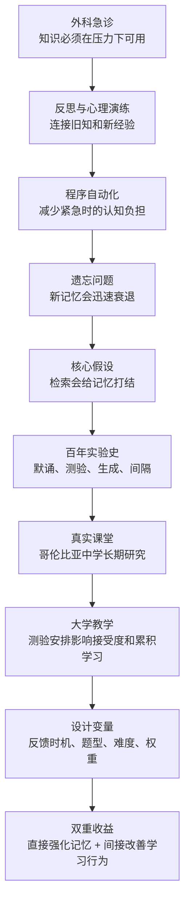
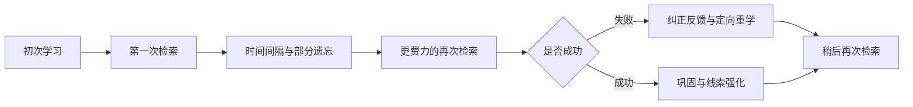

> **原书章节**：第 2 章“学习的本质：知识链和记忆结” 
> **原书作者**：彼得·C.布朗、亨利·L.罗迪格三世、马克·A.麦克丹尼尔 
> **原文来源**：《认知天性：让学习轻而易举的心理学规律》 
> **章节定位**：从第 1 章的总论进入第一个核心机制，系统论证“主动检索会改变记忆本身”，并说明怎样把测验从评分工具改造成学习工具。 
> **阅读目标**：理解检索为何既能测量又能强化学习，掌握检索次数、时间间隔、生成、反馈、题型和权重如何共同决定效果，并能把这些原则迁移到事实、概念、操作技能和真实教学中。

---

## 导读：本章究竟在回答什么问题

第 1 章已经提出：反复阅读和集中练习容易制造熟悉感，检索练习更可能形成持久记忆。第 2 章继续追问六个更具体的问题：

1. **知识怎样从“我曾经学过”变成紧急时能自动调用的能力？**
2. **为什么每次回忆不是单纯检查，而会改变被回忆的记忆？**
3. **一次检索、多次检索、立即检索和间隔检索的效果有何不同？**
4. **实验室中的词表和短文结果，能否进入真实课堂？**
5. **反馈应何时给、题目应怎样出、测验应占多大权重？**
6. **测验除了直接增强记忆，还会怎样改变出勤、预习、注意和后续学习？**

本章中心命题可以更严格地概括为：

> 学习者根据线索努力提取知识，会重新激活并巩固该记忆，同时暴露未知；若检索成功或随后得到纠正反馈，并在时间上合理间隔、在情境上适当变化，知识会更持久、更容易迁移。低权重测验是组织这种检索的工具，而不是检索练习的唯一形式。

### 全章论证路线

### 先澄清“知识链”和“记忆结”

“知识链”和“记忆结”是帮助理解的比喻，不是神经解剖结构。

- **知识链**强调新旧知识通过意义、因果、类别和应用关系连接起来；
- **记忆结**强调一次成功检索会让目标记忆及其提取线索更稳定、更容易再次访问；
- **重复且有间隔的检索**相当于多次加固，而不是连续无意识背诵。

可把一项知识的实际可用性粗略写成：

$$
U_t=S_t\times R_t\times F_t.
$$

其中：

- $U_t$：时刻 $t$ 的知识可用性；
- $S_t$：记忆储存的稳固程度；
- $R_t$：在相关线索下成功检索的概率；
- $F_t$：知识与当前任务的匹配和迁移程度。

乘法只是提醒：存过却提取不出、能背却不会用于当前任务，实际可用性都会受限。它不是原书中的定量心理学公式。

### 本章最容易混淆的三个关系

#### 1. 学习与回忆

常见误解是“学习负责把知识放进去，回忆只负责把知识读出来”。本章证明，回忆本身也是新的学习事件，会改变未来保持。

#### 2. 测量与干预

温度计通常不改变温度，记忆测验却可能改变被测记忆。因此，用测验研究遗忘时，测验本身会“污染”自然遗忘过程；用于教学时，这种污染正是价值所在。

#### 3. 检索困难与无效挫败

检索越费力，成功后通常收益越大；但完全无法恢复且没有反馈，并不会因“更难”而自动更好。有效困难必须服务于目标并能够纠正。

---

## 开篇案例：埃伯索尔德怎样在一分钟内挽救病人

### 1. 病情为什么极其危险

2011 年，一名猎鹿人头部中弹，弹片穿过颅骨，嵌入脑组织约 1 英寸。神经外科医生迈克·埃伯索尔德判断，受伤位置附近有一条大型静脉窦；子弹与骨片可能像塞子一样暂时堵住破口，一旦取出，病人会迅速大出血。

埃伯索尔德拥有 4 年大学、4 年医学院和 7 年神经外科训练，也长期在梅约诊所等环境中积累经验。作者列出这些经历，不只是强调资历，而是在说明专业表现来自长期累积的知识、观察、操作、反思和心智模型。

### 2. 手术前：慢速推理与预案检索

进入手术室前，他在头脑中做了几件事：

1. 根据伤口位置预测静脉可能破裂；
2. 想象取出子弹后可能发生的大出血；
3. 检索标准程序和步骤清单；
4. 提前准备血浆；
5. 与护士沟通风险和分工；
6. 设计先处理伤口边缘、最后取出异物的顺序。

这是**前瞻性心理演练**：在行动前用已有知识模拟可能状态及应对方案。它能减少真实事件发生时临时搜索的成本。

### 3. 手术中：从分析切换到自动化执行

取出子弹与骨片后，血液喷涌而出，不到 5 分钟失血约 400 毫升。破损静脉约成人小指粗，约 1.5 英寸范围内有多处伤口；直接缝破口会撕裂脆弱组织。

埃伯索尔德立即调用自己在类似手术中设计并练习过的方法：剪取两小块肌肉植入创口，再把静脉破损两端缝到肌肉上。整个关键操作约 60 秒，期间又失血约 200 毫升，最终止血成功。

这个做法也有明确边界：封闭静脉窦可能阻碍血液回流并升高颅压，并非所有病人都适用。专家不是机械执行熟练动作，而是在识别适用条件后快速执行。

### 4. 案例同时展示了三种认知模式

| 阶段 | 主要模式 | 作用 |
| --- | --- | --- |
| 术前 | 分析、检索、情境模拟 | 预测风险并准备资源 |
| 危机发生 | 自动化程序 | 在极短时间内稳定执行 |
| 术后 | 反思、比较、实验 | 从经验中更新方法 |

专业能力并不是永远“凭直觉”，也不是永远逐步推导，而是能根据时间压力在审慎分析与熟练执行之间切换。

### 5. 案例的证据边界

埃伯索尔德的经历说明反思、心理演练和自动化在真实任务中的价值，但它仍是个案，不能单独估计检索练习的平均效应。后文的实验负责回答普遍性与因果问题。

---

## 一、知识最终将变成条件反射

### 1. 反思：把经历转化成可复用知识

#### 1.1 要解决什么问题

经历一件事不等于从中学会。若人只完成任务、不回看决策与结果，经验可能只是时间累积，错误甚至会被自动化。

#### 1.2 严格定义

本章中的**反思（reflection）**是学习者有目的地重建一次经历，检索相关知识，比较预期与结果，解释差异，并生成以后可以尝试的行动方案。

它至少包含：

1. **检索**：当时发生了什么，我用了什么知识；
2. **关联**：新经历与课堂知识、他人经验怎样连接；
3. **评估**：什么有效，什么失败，依据是什么；
4. **生成**：下次可以改变哪些动作；
5. **心理演练**：预测不同选择可能带来的结果；
6. **实践检验**：在后续安全条件下试验并获得反馈。

#### 1.3 反思为什么有效

埃伯索尔德回家后会思考缝针应疏还是密、线应怎样安排、不同调整会造成什么后果。这个过程把一次具体事件加工成条件更清晰的知识：

$$
\text{经历}+\text{检索}+\text{解释}+\text{替代方案}+\text{反馈}
\Rightarrow\text{可复用经验}.
$$

关键不是回忆得多生动，而是形成了下一次可检验的预测与动作。

#### 1.4 反思与反刍的区别

| 反思 | 反刍 |
| --- | --- |
| 围绕具体事实、决策和结果 | 反复停留在情绪与自我评价 |
| 追问机制和替代方案 | 追问“我为什么总是失败” |
| 形成下一步可执行动作 | 缺少行动与反馈 |
| 允许修正原判断 | 容易强化单一负面解释 |

反思不等于事后为成功编故事。它需要记录、证据和后续实践来检验解释。

### 2. 心理演练：在真正行动前运行模型

**心理演练（mental rehearsal）**是在没有完整执行外部动作时，在头脑中依次模拟线索、判断、动作和可能结果。

它适用于：

- 实际练习成本高或风险大；
- 已有足够先备知识和较准确心智模型；
- 需要预演流程、分支和异常情况。

它不能完全替代真实操作。触觉、力度、速度、环境噪声和突发变化必须通过现实或高保真模拟学习。若模型本身错误，反复想象还可能巩固错误程序。

### 3. 自动化：为什么紧急任务需要“不假思索”

#### 3.1 要解决的问题

工作记忆容量有限，危机中又有时间压力。若每个基础动作都要重新阅读说明、逐步推理，专家无法把注意力用于异常判断。

#### 3.2 严格定义

**自动化（automaticity）**是某项认知或动作程序经过充分、正确的练习后，能够在相关线索出现时快速、稳定地执行，并较少占用有意识注意资源。

原书用“条件反射”描述这种状态。这里不宜把它严格等同于经典条件作用中的生理反射。神经外科缝合、飞行应急和四分卫避让都是高度学习、受目标控制的复杂程序，更准确的术语是程序化或自动化技能。

#### 3.3 从陈述性知识到自动化技能

可以概念化为：

$$
K_d\xrightarrow{\text{正确练习、检索、反馈}}K_p\xrightarrow{\text{多情境重复}}A.
$$

其中：

- $K_d$：陈述性知识，即能说出步骤和理由；
- $K_p$：程序性知识，即能够实际执行；
- $A$：在适当线索下的自动化表现。

这不是一次单向转换。专家仍要能回到陈述层解释、诊断和修改程序。

#### 3.4 自动化为什么能提升高阶表现

设工作记忆可用资源为 $W$，基础操作消耗为 $B$，异常判断消耗为 $D$。任务成功要求：

$$
B+D\le W.
$$

自动化降低 $B$，便为诊断、监控和策略选择留下更多资源。公式只表示资源约束的直觉，并非精确容量测量。

#### 3.5 自动化的风险

- 错误动作也会被练熟；
- 环境变化后，旧程序可能失效；
- 过度自动化会降低对异常信号的注意；
- 熟练者可能难以解释自己如何操作。

因此需要定期模拟异常、引入变化、接受反馈，并保留停止自动反应、重新分析的能力。埃伯索尔德的高明之处正是既能自动执行，也能先判断该病人的血流条件是否允许封闭静脉。

### 4. “步骤 1～4”：检查表与记忆不是替代关系

埃伯索尔德会把特定情形下需要担心的事项排成步骤。检查表可以：

- 防止高压下漏掉关键准备；
- 协调团队的共同预期；
- 把稀有风险显性化；
- 为训练和复盘提供结构。

但检查表不能替代知识。使用者仍要理解每一步的触发条件、目的和异常分支。最可靠的系统是内部记忆、外部清单和模拟练习相互备份。

### 5. 本小节的完整论证链

1. 专业任务包含无法完全由课堂预先覆盖的变化；
2. 真实经历提供新信息，但经历本身不会自动成为知识；
3. 反思通过检索、关联和生成，把经历整合进已有模型；
4. 心理演练让替代方案在低风险条件下先被运行；
5. 实际练习与反馈逐步形成程序性知识；
6. 重复、正确、情境相关的检索让关键程序自动化；
7. 自动化释放有限注意力，使专家能处理危机中的新问题；
8. 自动化仍必须由条件判断、反馈和模型更新约束。

---

## 二、自我检测：给知识链打上记忆结

### 1. 记忆结比喻要解决什么问题

作者用蔓越莓串作比喻：若绳端没有结，果实会滑落；检索像给记忆绳打结，重复检索则继续加固。

这个比喻表达三个意思：

1. 初次接触形成的记忆可能脆弱；
2. 检索不是只查看记忆，而会增强未来访问；
3. 多次、有间隔的检索通常比一次或连续背诵更牢。

它不表示记忆是固定物体，也不表示一次检索就永久保存。记忆会重构，也会受新信息、线索和干扰影响。

### 2. 遗忘曲线：记忆为何需要主动维护

#### 2.1 背景

艾宾浩斯在 1885 年系统研究遗忘，通常被称为记忆科学研究的先驱。原书用一个粗略概括说明：刚听过或读过的内容，约 70% 可能在很短时间内丢失，剩余部分随后较慢遗忘。

#### 2.2 直觉模型

遗忘常表现为先快后慢，可用简化指数模型表达：

$$
R(t)=R_0e^{-\lambda t}.
$$

其中：

- $R(t)$：学习后经过时间 $t$ 的保持比例；
- $R_0$：初始可回忆水平；
- $\lambda$：遗忘速率参数；
- $e$：自然常数。

$\lambda$ 越大，遗忘越快。这个公式仅用于表示“先快后慢”的一种模型，不是原书对所有记忆给出的统一定律。

#### 2.3 `70%/30%` 的适用边界

不能把“很快忘 70%”当成每个人、每种材料、每个时间点都精确成立的常数。遗忘受以下因素影响：

- 材料是否有意义；
- 先备知识；
- 学习程度；
- 测试方式；
- 睡眠与干扰；
- 是否检索、间隔复习；
- 时间尺度。

本章真正需要的结论不是固定比例，而是：**初始学习后遗忘可能很快发生，学习设计必须主动中断这一过程。**

### 3. 测验效应：检索为何也是学习

#### 3.1 定义

**测验效应（testing effect）**或**检索练习效应（retrieval-practice effect）**是指：主动从记忆中提取先前学习内容，相比只重新接触材料，通常会提高未来对该内容的保持和提取。

设：

- $Y_R(t)$：检索练习组在延迟 $t$ 后的成绩；
- $Y_S(t)$：重新学习组在同一延迟后的成绩；
- 其他关键条件大体可比。

则检索效应可表示为：

$$
TE(t)=Y_R(t)-Y_S(t).
$$

当 $TE(t)>0$ 时，说明在该实验条件下检索组平均表现更好。效应大小会随材料、测试、反馈、间隔和人群变化。

#### 3.2 历史直觉与现代证据

亚里士多德、弗朗西斯·培根和威廉·詹姆斯都注意到反复回忆可能增强记忆。历史观察提出了假设，现代实验则通过控制比较确定何时成立、效果多大、可能机制是什么。

### 4. 检索怎样改变记忆

作者给出的机制方向包括：

1. 目标记忆被重新激活；
2. 记忆与当前线索重新连接；
3. 新旧信息在再巩固过程中进一步整合；
4. 未来可用的检索路径增加或强化；
5. 成功回忆还会提供“我已掌握”的行为证据。

为了直观地区分两个维度，可使用以下背景模型：

- **储存强度**：记忆在长期系统中的稳固程度；
- **提取强度**：当前线索下有多容易想起。

连续重看可能暂时提高提取强度，却未必大幅提升储存强度；间隔后的努力检索在成功时，往往能更有效地增加长期稳固性。

这是解释框架，不意味着两种强度可以在普通学习中被直接精确读取。

### 5. 为什么检索要重复且有间隔

若刚答完立即再答，答案仍在工作记忆中，第二次可能只是短时复述。加入间隔后，一部分可访问性下降，学习者需要重新搜索记忆。

设第 $i$ 次检索发生在 $t_i$，相邻间隔为：

$$
\Delta_i=t_{i+1}-t_i.
$$

有效安排要使 $\Delta_i$ 足以增加检索努力，又不至于让学习者完全失败且得不到反馈。

合理过程是：

### 6. 为什么教育界长期没有把测验当作学习工具

传统测验主要用于：

- 评分；
- 排名；
- 选拔；
- 判断教学结果。

在这种语境中，测验意味着风险与惩罚，教师和学生很难把它理解成日常练习。2010 年《纽约时报》报道一项研究：读完课文后接受回忆测验的学生，一周后比未接受测验的学生多记住约 50% 的信息。网络评论仍把学习与回忆对立，或因考试焦虑而拒绝测验。

这些反应混淆了三件事：

1. 高风险标准化考试；
2. 用于评分的总结性评估；
3. 低权重、带反馈的检索练习。

反对第一种考试制度，不能逻辑上否定第三种学习活动。

### 7. 记忆与高阶能力不是二选一

有人担心重视测验只会培养死记硬背，教育应转向分析、综合和创新。本章的回应是：

1. 高阶任务需要领域知识作为材料；
2. 知识必须能在需要时从记忆中提取；
3. 检索可以针对事实，也可以针对解释、策略和操作；
4. 只有知识而不练应用，确实不足；
5. 但没有可用知识，创新也缺少可重组的结构。

因此更准确的关系是：

$$
\text{高阶表现}=F(\text{可提取知识},\text{策略},\text{判断},\text{迁移练习}).
$$

测验是否只促成死记硬背，取决于测什么、怎样反馈、是否要求迁移，而不是“测验”这个名称本身。

---

## 三、只需 1 次自测，一周后回忆率从 28% 跃迁为 39%

### 1. 1917 年大规模研究：默诵优于只浏览

#### 1.1 研究设计

三、五、六、八年级学生学习《美国名人录》中的人物介绍。部分学生把不同比例的时间用于查阅与默诵，其他学生只反复阅读。学习结束时以及 3～4 小时后，所有学生写出记住的内容。

#### 1.2 结果

进行默诵的学生优于只浏览的学生，把约 60% 学习时间用于默诵的组表现最好。

#### 1.3 论证意义

默诵要求撤掉材料并生成内容，因而包含检索。结果说明，同样总时间内，把相当部分时间从再次输入转为主动输出，可能提高保持。

#### 1.4 边界

`60%` 是该研究条件中的结果，不是任何课程都应机械执行的黄金比例。复杂材料首次理解需要更多输入，熟悉材料则可以更早转入检索。

### 2. 1939 年研究：测验延迟越久，首次遗忘越多

#### 2.1 设计

艾奥瓦州 3000 多名六年级学生学习数篇约 600 词的文章，在两个月中参加不同安排的测验，最后接受统一大考。

#### 2.2 结果

- 第一次测验拖得越久，测验前遗忘越多；
- 一旦参加过一次测验，后续成绩几乎不再明显下降。

#### 2.3 推理

如果测验只是读取一个固定记忆，参加测验不应改变后续遗忘轨迹。结果显示测验后保持趋于稳定，支持检索本身产生了干预作用。

### 3. 测量反应性：为什么测验一度不受记忆研究欢迎

1940 年前后，研究兴趣转向自然遗忘。研究者发现，若中途测验会中断遗忘，就不能把测验结果当作未经干预的记忆状态。

这叫**测量反应性（measurement reactivity）**：测量行为改变了被测对象。

若自然保持轨迹为 $R_0(t)$，在时间 $t_q$ 插入测验后的轨迹为 $R_q(t)$，则可能有：

$$
R_q(t)>R_0(t),\quad t>t_q.
$$

用于纯观察时，这是方法学干扰；用于教育时，它正是可利用的测验效应。

### 4. 1967 年 36 个单词研究：测验可与重学同样有效

参与者学习 36 个单词。首次接触后，一种条件继续重复学习，另一种条件重复接受测验。两种方法得到相当的学习效果。

表面看“相同”似乎不惊人，但测验期间并未再次完整呈现材料，却取得了与重学相当的结果。这挑战了“只有再次输入才能继续学习”的假设，并重新激发研究兴趣。

这里不能只凭章节概述断言两组在所有延迟和指标上完全相同；它的历史意义在于显示检索不是浪费学习时间。

### 5. 1978 年研究：即时优势与遗忘速度可以相反

研究发现，集中学习能提高即将到来的考试成绩，但两天后遗忘更快：

- 集中学习者丢失第一次考试中记住内容的约 50%；
- 检索练习者同期只丢失约 13%。

设初次测试成绩为 $Y_0$，延迟成绩为 $Y_t$，遗忘比例为：

$$
F(t)=\frac{Y_0-Y_t}{Y_0}.
$$

在该研究中，集中组 $F(2\text{天})\approx50\%$，检索组约为 $13\%$。这说明评价策略不能只看 $Y_0$，还要看衰退率。

### 6. 60 个实物名称研究：一次与三次测验的差异

#### 6.1 三组安排

学生听一个包含 60 个实物名称的故事：

1. **一次测验组**：学习后立即测验一次；
2. **无测验组**：学习后不测验；
3. **三次测验组**：学习后立即连续接受三次测验。

#### 6.2 结果

- 一次测验组立即回忆约 53%，一周后为 39%；
- 无测验组一周后只回忆约 28%；
- 三次测验组一周后仍回忆约 53%。

#### 6.3 一次测验带来的提升

一周后，一次测验组比无测验组高：

$$
39\%-28\%=11\text{ 个百分点}.
$$

这里是 **11 个百分点**，不是相对增加 11%。相对提升为：

$$
\frac{39-28}{28}\approx39.3\%.
$$

两种说法回答不同问题，不能混用。

#### 6.4 三次测验怎样“抵抗遗忘”

三次测验组一周后仍为约 53%，与一次测验组最初的 53% 相当。章节用“免疫”作形象说法，不应理解成永久不会忘，而是该时间尺度内几乎保持住初始水平。

#### 6.5 为什么仍然推荐间隔

三次立即测验已有收益，但连续检索可能利用短时激活。后续研究通常发现，把重复检索分散开，比挤在一起更有利于长期保持。

### 7. 怎样读这些百分比

每个数字都依赖：

- 学习材料；
- 评分方式；
- 测验延迟；
- 样本年龄；
- 是否反馈；
- 检索次数和间隔。

不能把 `39%` 或 `53%` 当作检索练习的固定产出。稳健结论是方向性的：一次检索通常优于完全不检索，多次检索通常更好，合理间隔通常优于连续堆叠。

---

## 四、如何成为一名主动学习者

### 1. 生成效应：先补出 `shoe` 为什么更容易记

#### 1.1 实验

学习词对 `foot-shoe` 时：

- 一组直接看到完整词对；
- 另一组看到 `foot-s_ _e`，需要根据提示补出 `shoe`。

主动生成目标词的学习者，后来记忆更好。

#### 1.2 定义

**生成效应（generation effect）**是指：相较于被动接收完整答案，学习者根据线索主动产生目标信息，通常会提高对该信息的后续记忆。

#### 1.3 为什么有效

1. 提示 `foot` 激活语义关联；
2. 字母框架限制候选答案；
3. 学习者必须搜索并选择 `shoe`；
4. 生成结果与线索形成更具体的编码关系；
5. 后续遇到相似线索时，更容易重现搜索路径。

生成不必极难。关键是学习者确实完成了部分认知工作，而不是答案始终完整可见。

### 2. 插入 20 个词对：延迟检索为什么胜过立即重复

研究还发现，首次学习词对后，先处理 20 个其他词对，再回来检索，效果好于立刻重复。

推理过程是：

1. 立即重复时，目标仍在工作记忆中；
2. 插入 20 个项目后，目标可访问性下降并受到干扰；
3. 再次提取需要更多搜索与重建；
4. 若成功提取或得到反馈，这次努力会更强地巩固记忆；
5. 因而长期保持改善。

边界是延迟不能大到完全无法恢复且没有反馈。最佳间隔随难度和目标保持期变化。

### 3. 从实验室走向课堂：为什么必须做实地研究

实验室能控制材料、时间和参与者，却可能过于简化。真实课堂包含：

- 课程进度；
- 教师风格；
- 学生成绩压力；
- 复杂教材；
- 出勤、动机和同伴互动；
- 学校资源与家长意见。

因此研究者需要检验：测验效应能否在不重写课程、不打乱教学的情况下持续出现。

### 4. 哥伦比亚中学项目的约束条件

2005 年，研究团队联系伊利诺伊州哥伦比亚市附近一所中学的校长罗杰·张伯伦。校长有两项核心顾虑：

1. 学校目标是分析、综合和应用，不只是事实记忆；
2. 研究不能破坏教师已有课程与教学方法。

团队因此接受以下约束：

- 不修改教科书；
- 不改变正常备课、课程和考试形式；
- 只偶尔加入几分钟小测验；
- 研究跨 3 个学期，约一年半；
- 教师不在小测验现场，避免临时针对测验内容教学。

项目于 2006 年启动，先进入六年级社会学课程，涉及古埃及、美索不达米亚、印度和中国等内容。

### 5. 三类内容条件：怎样排除“只是重复接触”

研究助理普贾·阿加瓦尔把课程内容分成三类：

1. **测验内容**：约三分之一，参加 3 次小测验；
2. **重复学习内容**：约三分之一，以陈述形式额外呈现 3 次，但不要求检索；
3. **常规内容**：剩余三分之一，只按正常课程教授，不额外测验或复习。

测验安排包括：

- 课前测验，针对指定阅读中尚未讲解的内容；
- 当天讲解后的课后测验；
- 单元考试前 24 小时的复习测验。

每道选择题作答后公布正确答案，提供纠正反馈。

这个设计的关键对比是：

$$
\text{主动检索 3 次}\quad\text{vs.}\quad\text{额外呈现 3 次}.
$$

若两者差异只来自接触次数，它们的结果应接近；若检索有额外作用，测验内容应更好。

### 6. 课堂结果：十多分差距不是重复呈现造成的

学生在测验内容上的正式考试分数，比未测内容高十多分。仅作为复习陈述额外呈现的内容，与没有额外复习的内容成绩相近。

这支持：

1. 额外出现三次本身不足以解释提升；
2. 要求学生从记忆中选择答案，并接受反馈，是关键差异；
3. 测验效应可以在真实教材和正常考试中出现。

### 7. 八年级科学课：`79` 到 `92`

2007 年，遗传、进化和解剖学课程加入研究。期末结果为：

- 未测验内容平均 `79`，约为 `C+`；
- 测验内容平均 `92`，约为 `A-`。

绝对差为：

$$
92-79=13\text{ 分}.
$$

这不是说每位学生都提高 13 分，而是特定内容条件的平均差异。研究还发现效应在学年考试后持续约 8 个月，支持检索的长期价值。

### 8. 为什么研究设计仍有边界

- 选择题包含重认成分，不能代表所有检索强度；
- 小测验带反馈，效应来自“检索 + 反馈”的组合；
- 同一课程内的知识点难度必须尽量平衡；
- 教师缺席提高控制，却不是普通课堂的必要条件；
- 长期保持并不自动证明所有高阶迁移；
- 原书说每月继续检索“效果肯定更好”，方向符合间隔理论，但具体增益仍应实验测量。

### 9. 检索不需要昂贵技术

研究使用智能黑板和应答器，但后续课堂例子说明设备不是核心：

- 历史教师让学生读完奴隶制度材料后，写下此前不知道的 10 件事；
- 阅读教师让学生大声朗读，错误时重试，成功后解释段落含义并推测人物心理；
- 游戏、抽认卡、纸笔简答都能组织检索。

真正必要的是：撤掉完整答案、让学习者生成、提供反馈并安排再次练习。

### 10. 学生接受度：低权重测验未必增加焦虑

研究结束后：

- `64%` 的学生认为小测验减轻了单元考试焦虑；
- `89%` 认为小测验改善了学习。

这说明学生反感的可能不是检索本身，而是高风险、不可预测和惩罚性的考试。低权重、频繁、带反馈的测验能把压力分散，并让正式考试不再完全未知。

这些比例是特定学校的自我报告，不能视为所有学生的固定态度。设计不当的小测验仍会制造焦虑。

### 11. 索贝尔的第一次尝试：为什么 9 次突击测验失败

华盛顿大学教授安德鲁·索贝尔的国际政治经济学课程约有 160～170 人。学期初缺勤约 10%，过半后达到 25%～35%。他把原本两次大考换成 9 次不预告、计入学分的突击测验，希望提高出勤。

结果：

- 三分之一甚至更多学生退课；
- 学生强烈反感；
- 坚持者出现两极分化；
- `A+` 和 `C` 都比以往更多。

失败说明：知道“频繁测验有效”还不够，测验的可预测性、权重、公平感和反馈环境会影响实施。

### 12. 从三次大考到九次预告小测验

索贝尔后来先从两次大考增至三次，效果有所改善但不理想。最终方案是：

- 全学期 9 次小测验；
- 日期提前写入课程表；
- 不再保留期中和期末大考；
- 测验内容随课程渐进累积；
- 题目与过去大考的开放问题相似。

新方案提高了出勤和作业质量。持续 5 年后，学期末概念写作达到优等班水平，选课人数增至约 185 人。

### 13. 为什么预告与突击产生不同结果

两种方案都有 9 次测验，但心理和制度条件不同：

| 突击测验 | 预告测验 |
| --- | --- |
| 不可预测 | 日期明确 |
| 容易被理解为惩罚 | 可纳入学习计划 |
| 错过或失败归因于教师袭击 | 学生能承担可预见责任 |
| 高不确定性增加焦虑 | 分散学习与成绩风险 |

这提示测验效应不能只按次数设计，还要考虑激励与接受度。

### 14. 累积学习为什么像复利

每次测验既巩固旧知识，又让后续课程建立在更牢基础上。可用递推模型表达：

$$
K_{n+1}=K_n+r_nK_n+N_n-L_n.
$$

其中：

- $K_n$：第 $n$ 个阶段已有的可用知识；
- $r_nK_n$：检索和应用使旧知识产生的巩固收益；
- $N_n$：新学习内容；
- $L_n$：遗忘与干扰损失；
- $K_{n+1}$：下一阶段可用知识。

“复利”是比喻：知识收益不是稳定金融利率，也不会自动指数增长。它强调早期知识保持得更好，会降低后续理解成本并支持累积。

---

## 五、为何学习越轻松，效果越不好

### 1. 科学短文实验：检索组的长期优势

大学生学习类似课本的科学介绍文章，之后立即进行回忆测验或重新学习。

结果：

| 延迟 | 立即检索组 | 重新学习组 | 绝对差 |
| --- | ---: | ---: | ---: |
| 2 天 | 68% | 54% | 14 个百分点 |
| 1 周 | 56% | 42% | 14 个百分点 |

另一个实验中，一周后：

- 只学习、不测验组遗忘最初记住内容的 `52%`；
- 重复测验组只遗忘 `10%`。

### 2. 为什么“重新学习更轻松”却长期较差

重新阅读时答案完整可见，学习者主要进行重认；检索组必须自己重建内容，当下更难、可能答得更少。延迟后，完整材料不再可见，检索组练过的动作与测试要求更一致。

推理链为：

1. 未来任务要求无提示或少提示提取；
2. 检索练习直接训练该过程；
3. 重新学习主要增加材料熟悉；
4. 熟悉支持眼前表现，却随材料撤走而消失；
5. 检索造成的巩固与线索强化更持久；
6. 因而延迟测试出现优势。

### 3. 何谓“有益的费力”

检索努力具有价值，需要同时满足：

1. 困难来自目标记忆的搜索与重建，而非无关障碍；
2. 学习者有一定成功概率；
3. 失败后可获得正确反馈；
4. 难度与基础相匹配；
5. 以延迟保持和迁移评价，而非以痛苦程度评价。

因此不能推出“越难越好”。若题目完全超纲、说明含糊或反馈错误，增加的是无效负担。

### 4. 反馈：为什么只测验还不够

#### 4.1 定义

**纠正反馈（corrective feedback）**是学习者作答后获得的、用于确认正确内容、指出错误并提供改进方向的信息。

反馈至少有三项作用：

- 防止错误答案被保留；
- 补充完全未能检索的内容；
- 帮助学习者校准自信与实际表现。

#### 4.2 信息量不同的反馈

| 反馈层次 | 示例 | 局限 |
| --- | --- | --- |
| 结果反馈 | “错了” | 不知道错在哪里 |
| 正确答案 | “答案是 B” | 可能不理解原因 |
| 解释反馈 | “B 正确，因为……” | 成本更高但更利于概念修正 |
| 策略反馈 | “你忽略了触发条件 X” | 适合复杂问题与技能 |

### 5. 即时反馈与延迟反馈

#### 5.1 反直觉发现

研究显示，反馈总体上比无反馈更能增强学习；某些情况下，稍微延迟的反馈比立即反馈产生更持久的效果。

#### 5.2 可能机制一：避免依赖

如果每个动作都立刻获得纠正，反馈会成为练习环境的一部分。真实环境撤掉反馈后，学习者缺少自行监控与修正能力，就像长期依赖自行车辅助轮。

#### 5.3 可能机制二：减少频繁打断

运动技能需要形成较稳定的动作组织。每次动作都被立即打断，可能让学习者过度追逐局部波动，难以形成整体模式。

#### 5.4 篮球与高尔夫例子

学习带球上篮或高尔夫长打时，延迟结果反馈会让练习过程显得更笨拙，短期表现可能下降，却迫使学习者使用本体感觉和结果判断，长期表现有时更好。

#### 5.5 反馈时机的边界

延迟并非普遍优于立即：

- 初学者可能需要更快纠正，以免错误累积；
- 安全关键动作不能放任错误持续；
- 事实性错误若会干扰后续理解，应及时澄清；
- 已较熟练者可适当减少频率、增加延迟，培养自我监控。

应根据错误成本、学习阶段和任务连续性选择反馈时机。

### 6. 开卷与闭卷：持续提示为什么会抬高即时表现

科学文章研究中：

- 开卷组答题时可查看材料，相当于持续获得反馈；
- 闭卷组先独立作答，之后查看材料并检查答案，相当于延迟纠正。

开卷组即时成绩更高，但闭卷后再反馈的学生在后续考试中更好。

这不表示开卷考试必然无效。开卷任务若要求综合、评价和新问题解决，仍可很难。这里比较的是：当目标是长期记住材料时，持续查看答案减少了独立检索和错误诊断。

### 7. 题型怎样改变检索努力

一般而言：

- 论文、简答要求主动生成；
- 抽认卡在翻面前作答，也要求检索；
- 选择题、是非题提供候选答案，更多依赖辨识。

因此，在其他条件相近时，生成型题目常产生更强长期收益。但选择题并非无效：哥伦比亚中学使用选择题仍获得显著效果；重复选择题配合反馈，有时可接近简答效果。

选择题的质量取决于：

- 干扰项是否反映真实误概念；
- 是否要求先独立思考；
- 是否提供纠正反馈；
- 是否在之后再次检索；
- 是否只考表面细节。

### 8. “检索越费力越好”的精确定义

可以用倒 U 形关系理解：

$$
B(d)=
\begin{cases}
\text{较低}, & d\text{ 太小，几乎无需检索};\\
\text{较高}, & d\text{ 适中，努力后成功};\\
\text{较低}, & d\text{ 太大，持续失败且无反馈}.
\end{cases}
$$

其中：

- $d$：检索难度；
- $B(d)$：长期学习收益。

这只是概念关系，实际曲线因人和任务而异。最重要的限定是原书所说“只要真正做到了检索”。

### 9. 为什么只有 11% 的大学生主动使用检索

调查中，只有约 `11%` 的大学生说自己使用检索练习。即使自测，很多人也只把它视为发现薄弱点的诊断工具，没有意识到检索本身会强化记忆。

原因包括：

- 重读更轻松，完成感更强；
- 自测会暴露错误，伤害短期自信；
- 学生把测验与评分、惩罚联系；
- 检索的长期收益不能立刻感受到；
- 教师和学习指南也可能继续推荐重复。

### 10. 测验能否促进迁移

研究显示，与重复阅读相比，测验更能帮助学习者把知识用于新背景和新问题；对相关但未直接测验的材料，也可能产生促进。

可能机制是：

1. 检索强化核心概念；
2. 生成答案要求重建意义关系；
3. 多次从不同线索提取，增加访问路径；
4. 新情境出现部分相似线索时，更容易找到相关知识。

作者同时承认，对未测相关材料和复杂迁移的结论仍需要更多研究。不能假设任何事实题测验都会自动产生远迁移。若目标是应用，就应直接加入变化案例和迁移题。

### 11. 学生为何会抵制，又为何最终评价更高

学生通常不喜欢高风险考试，因为它带来焦虑、排名和失败后果。但记录学生态度的研究发现，经常测验的课程在学期结束时往往获得更高评价。

可能原因：

- 学生到期末已经分散掌握材料；
- 不必集中突击；
- 小测验使预期更明确；
- 反馈让进步可见；
- 单次失败对总成绩影响较小。

这不是保证所有频繁测验都受欢迎。索贝尔的突击测验已经说明，可预测性和权重设计至关重要。

### 12. 测验促进后续学习：直接效应与间接效应

#### 12.1 直接效应

检索目标记忆，使该记忆未来更容易提取。

#### 12.2 间接效应

测验之后，学习者：

- 更准确地识别陌生内容；
- 把更多时间投入薄弱处；
- 对后续相同主题更敏感；
- 能把新信息接到刚被激活的旧知识上。

即使第一次没有答对，尝试也可能让随后的正确学习更有效，这称为**测验促进学习（test-potentiated learning）**。

### 13. 低权重测验的其他系统收益

本章列出多项间接好处：

1. 提高出勤；
2. 促使学生预习；
3. 课后测验可提高课堂注意；
4. 帮助学生识别已知和未知；
5. 纠正重读流畅造成的精通错觉；
6. 把成绩分散到多次活动，缓解“一锤定音”焦虑；
7. 让教师发现误概念和个体差异；
8. 支持调整后续教学；
9. 同样适用于在线课程。

这些收益不是自动出现的。测验应低权重、与目标一致、提供反馈、控制工作量，并让结果真正用于调整。

---

## 六、小结

### 1. 本章核心结论

#### 结论一：检索适用于多种知识与技能

事实、复杂概念、问题解决程序和运动技能，只要将来需要从记忆中调用，都能使用检索练习。具体形式必须匹配目标：事实可用简答，技能需要模拟或实际执行。

#### 结论二：努力检索能形成更持久记忆

当检索难度适中、最终成功或得到反馈时，付出的认知努力越大，强化通常越明显。

#### 结论三：间隔检索通常优于立即重复

时间间隔带来部分遗忘，使下一次检索必须重建，而不是依靠短时激活。

#### 结论四：反复检索可改善迁移

多次在变化线索下提取，能增加知识在新情境中被找到的机会；远迁移仍需直接练习和更多证据。

#### 结论五：填鸭适合眼前，不利于长期

集中学习可能帮助即将到来的考试，但遗忘速度通常快于检索练习。若目标只持续几分钟，短时复述可以合理；若目标是长期使用，就不能停在填鸭。

#### 结论六：一次测验也可能显著改善期末表现

课堂研究显示，哪怕一次设计良好的检索也能产生收益，次数增加通常继续改善，但边际收益和最佳频率取决于任务。

#### 结论七：学生可以自行组织检索

抽认卡、白纸回忆、章末问题、口头讲解和实际演练都可使用，不必等待教师考试。

#### 结论八：测验同时校准学生和教师

学生知道自己哪里薄弱，教师发现共同误概念并调整教学。

#### 结论九：反馈防止错误记忆

测验后应提供正确答案和必要解释；反馈时机要根据阶段、错误成本和依赖风险设计。

#### 结论十：低权重提高接受度

把测验从惩罚和选拔改造成频繁、小后果、可纠正的练习，更容易获得学习者接受。

### 2. 检索练习不是死记硬背

张伯伦校长最初担心小测验只强化记忆。研究后他观察到，基础知识稳固让学生能在不同环境中评价、综合和应用理论，不必反复重建词义与定义。

完整逻辑是：

1. 高阶思考依赖可提取的基础概念；
2. 检索让基础概念更稳定；
3. 工作记忆不必反复搜索基础定义；
4. 更多资源可用于比较、推理和应用；
5. 若测验本身再包含解释与迁移，高阶能力会得到直接练习。

因此，问题不是“记忆还是思考”，而是如何让可靠记忆服务于思考。

### 3. 本章结论的适用边界

1. **检索不能替代首次理解。** 没有基本表征时，应先学习、示范或获得支架。
2. **答错后需要反馈。** 无反馈地反复错误可能巩固误概念。
3. **困难不是越大越好。** 最有价值的是努力后能成功或能纠正的检索。
4. **题型要匹配目标。** 选择题不能独自证明开放写作或实际操作能力。
5. **间隔没有固定万能值。** 取决于难度、遗忘速度和目标保持期。
6. **延迟反馈不是普遍最优。** 初学、安全关键和连续依赖任务可能需要即时纠正。
7. **课堂效果受实施影响。** 权重、预告、频率和公平感会改变接受度。
8. **迁移不是自动发生。** 需要变化线索、规则提取和新问题练习。
9. **平均差异不代表人人相同。** 实验百分比与分数不能机械套用到个体。
10. **外部工具仍有价值。** 检查表、资料和搜索可减少记忆负担，但核心知识必须足以指导查找、判断和行动。

---

## 七、核心概念对照表

| 概念 | 要解决的问题 | 严格含义 | 常见误解 |
| --- | --- | --- | --- |
| 反思 | 怎样从经历中学习 | 检索经历、连接知识、解释结果并生成可检验方案 | 反复回想情绪 |
| 心理演练 | 高成本行动前怎样准备 | 在头脑中模拟线索、判断、动作和结果 | 可完全替代真实练习 |
| 自动化 | 紧急时怎样快速稳定执行 | 程序在相关线索下快速运行且少占注意 | 无条件机械反射 |
| 遗忘曲线 | 记忆怎样随时间衰退 | 保持通常早期下降快、随后变缓 | 人人固定先忘 70% |
| 检索练习 | 怎样练习未来调用 | 不看完整答案，依据线索提取并接受反馈 | 再读一遍 |
| 测验效应 | 为什么测验也是学习 | 检索相对重学改善后续保持 | 任何考试制度都有效 |
| 测量反应性 | 为什么测验会干扰遗忘研究 | 测量行为改变被测记忆 | 实验设计错误本身 |
| 生成效应 | 为什么先尝试更容易记 | 根据线索主动产生目标信息带来记忆优势 | 无基础、无反馈地瞎猜 |
| 间隔检索 | 怎样避免短时复述 | 在检索之间加入足够时间，使再次提取需要努力 | 时间越久越好 |
| 纠正反馈 | 怎样防止错误保留 | 作答后确认、纠错并指导改进 | 只说“错了”一定足够 |
| 延迟反馈 | 怎样减少反馈依赖 | 作答或一组尝试后再提供纠正 | 永远优于即时反馈 |
| 低权重测验 | 怎样把考试变成练习 | 对总成绩影响小、用于检索和调整的测验 | 题目可以随意、无需反馈 |
| 测验促进学习 | 为什么首次失败也可能有益 | 先测验使后续学习更聚焦、更易整合 | 错误本身自动有益 |
| 迁移 | 怎样在新情境调用知识 | 把所学原则用于不同但相关的任务 | 原题再次出现 |

---

## 八、作者分析问题的方法

### 1. 先用高风险专业案例说明目标

神经外科案例让读者看到：记忆的价值不是考试得分，而是让正确程序在病人每分钟大量失血时可用。

### 2. 从比喻进入机制，但不止于比喻

“知识链”和“记忆结”降低理解门槛，随后用遗忘曲线、百年研究和课堂数据检验比喻是否有实证基础。

### 3. 用时间轴积累证据

1917、1939、1967、1978 及后续研究形成历史链：从默诵优于浏览，到认识测验的反应性，再到比较检索次数、保持率和遗忘速度。

### 4. 主动处理替代解释

哥伦比亚中学不仅比较测验与普通教学，还加入“额外呈现三次”的条件，以排除测验组只是接触更多的解释。

### 5. 从实验室到生态环境逐级验证

词对、单词和短文控制严密；中学课程和大学课堂检验现实实施。证据不是彼此替代，而是互补。

### 6. 把失败实施也当作证据

索贝尔的突击测验失败说明，心理学效应不能脱离制度设计。作者没有只报告成功故事，而是比较了可预测性和权重不同的方案。

### 7. 区分发现与机制解释

反馈延迟的长期优势是研究发现；“减少辅助依赖”和“避免打断稳定模式”是解释理论。理论要继续接受新实验检验。

### 8. 最终转化成可操作原则

作者不止说检索有效，还讨论次数、间隔、反馈、题型、迁移、态度和低权重，让原则能进入真实学习设计。

---

## 九、可执行的主动学习方案

### 1. 第一步：把学习目标写成未来行为

不要写“看完这一章”，改成：

- 能无提示解释测验效应；
- 能重建 60 个物品研究的三组设计与结果；
- 能说明哥伦比亚中学怎样控制重复接触；
- 能比较即时与延迟反馈；
- 能为一项技能设计低权重、间隔检索。

### 2. 第二步：初次理解后尽快检索

读完一个逻辑单元后，合上书回答：

1. 它要解决什么问题？
2. 定义是什么？
3. 证据如何设计？
4. 结果排除了什么解释？
5. 适用边界是什么？

### 3. 第三步：立即记录信心，再核对

作答时给出信心值 $c_i\in[0,1]$，核对后记录正确性 $a_i\in\{0,1\}$。平均校准误差可粗略写成：

$$
E_{cal}=\frac{1}{n}\sum_{i=1}^{n}|c_i-a_i|.
$$

其中：

- $n$：题目数；
- $c_i$：第 $i$ 题自信程度；
- $a_i$：实际正确与否；
- $E_{cal}$ 越小，判断越准确。

重点关注“高信心但答错”的未知未知。

### 4. 第四步：反馈后不要立刻机械重答

先理解错误原因，再隔一段时间重新作答。若立即复述正确答案，只能证明短时保持。

### 5. 第五步：逐步增加检索难度

| 阶段 | 检索方式 |
| --- | --- |
| 初学 | 给首字母、关键词或选项 |
| 基础稳定 | 简答、白纸回忆 |
| 理解 | 解释原因、比较概念 |
| 应用 | 新案例、混合问题 |
| 技能 | 模拟、限时实操、异常情境 |

### 6. 第六步：用间隔安排而非固定神奇数字

一个可调整起点：

| 时间 | 活动 |
| --- | --- |
| 当天 | 初次学习后检索，获得反馈 |
| 第 1 天 | 无提示简答 |
| 第 3 天 | 与相关概念穿插 |
| 第 7 天 | 新情境应用 |
| 第 14 天 | 综合解释与错误复测 |
| 第 30 天 | 长期保持检查 |

若每次都秒答，延长间隔或减少提示；若持续完全失败，缩短间隔、补基础或增加线索。

### 7. 第七步：让题型匹配目标

| 目标 | 题型 |
| --- | --- |
| 术语和事实 | 抽认卡、填空、简答 |
| 因果机制 | “为什么”问题、流程图 |
| 概念辨别 | 选择题并解释排除理由 |
| 迁移 | 新案例、反例、边界判断 |
| 写作 | 提纲回忆、限时论证 |
| 操作技能 | 模拟器、演示、故障排查 |

### 8. 第八步：控制测验的心理成本

- 低权重或不计分；
- 提前说明日期和目的；
- 允许纠错与再次尝试；
- 不公开羞辱错误；
- 让成绩用于调整教学；
- 控制总工作量；
- 对考试焦虑者提供合理支持。

---

## 十、自测题

### A. 概念理解

1. 反思包含哪些认知活动？它与反刍有什么区别？
2. 为什么自动化能支持而不是必然削弱高阶思考？
3. 原书的“条件反射”为什么更适合解释为程序自动化？
4. `70%/30%` 的遗忘描述为什么不能当作普适常数？
5. 测验效应的操作性定义是什么？
6. 测量反应性为什么在研究遗忘时是干扰，在教学中却是收益？
7. 生成效应与检索练习有什么共同点？
8. 为什么重复检索最好安排间隔？
9. 纠正反馈有哪几种信息层次？
10. 检索直接效应与间接效应分别是什么？

### B. 数据与研究设计

11. 1917 年研究中，为什么把时间用于默诵比只浏览更有效？`60%` 能否直接成为个人时间配方？
12. 1939 年研究怎样显示测验改变了遗忘轨迹？
13. 1978 年研究中的 `50%` 与 `13%` 表示什么？
14. 60 个物品研究中，一次测验组、无测验组和三次测验组一周后分别怎样表现？
15. 从 `28%` 到 `39%` 是增加 11% 还是 11 个百分点？相对提升是多少？
16. `foot-s_ _e` 实验为什么比直接看 `foot-shoe` 更能支持记忆？
17. 哥伦比亚中学为什么设置“额外呈现三次但不检索”的内容？
18. 八年级科学课 `79` 与 `92` 的差异可以推出什么，不能推出什么？
19. 为什么效应持续 8 个月比立即考试差异更有说服力？
20. 科学短文实验的 `68/54` 与 `56/42` 说明什么？

### C. 教学与实践

21. 索贝尔的 9 次突击测验为什么失败，而 9 次预告测验更成功？
22. 为什么延迟反馈有时优于即时反馈？什么情况下应立即反馈？
23. 开卷组即时表现更好，为什么后续测试可能更差？
24. 简答通常比选择题检索更费力，是否意味着选择题没有学习价值？
25. 怎样把选择题设计成更有效的检索练习？
26. 为什么测验可能提升相关但未测材料？这个结论的边界是什么？
27. 低权重测验如何同时改善出勤、注意和焦虑？
28. 为你正在学习的一章设计三个时间点的检索与反馈。
29. 为一项高风险技能设计“检查表 + 心理演练 + 模拟 + 反馈”的训练闭环。
30. 找出本章一个你高信心却答错的问题，说明怎样把它从“未知的未知”变成稳定知识。

参考答案要点

1. 检索经历、连接旧知、评估结果、生成替代方案、心理演练和实践验证；反刍缺少证据、行动与反馈。
2. 自动化降低基础操作对工作记忆的占用，让注意力用于异常判断；前提是程序正确且能被监控。
3. 复杂专业动作是经过学习、受目标和条件控制的程序，不是简单刺激引发的先天反射。
4. 遗忘率受材料、个体、学习程度、测试和时间影响；该比例只传达初期遗忘可能很快。
5. 主动提取先前所学，相比只重新学习，通常提高后续保持和可提取性。
6. 中途测验改变记忆，使其不再代表自然遗忘；教学正希望利用这种改变增强记忆。
7. 两者都要求学习者根据线索主动产生目标，而不是始终看到完整答案。
8. 间隔让短时激活减弱，迫使学习者重新搜索和重建；成功或反馈后的巩固更强。
9. 结果反馈、正确答案、解释反馈和策略反馈。
10. 直接效应是检索强化目标记忆；间接效应是暴露缺口、重分配时间并促进后续学习。
11. 默诵包含主动检索；`60%` 只适用于该研究，具体比例要随材料和基础调整。
12. 第一次测验前延迟越久遗忘越多，但参加一次测验后后续成绩几乎不再下降。
13. 两天后相对初次测试丢失的比例：集中学习约 50%，检索练习约 13%。
14. 一次测验组约 39%，无测验组约 28%，三次测验组约 53%。
15. 增加 11 个百分点；相对提升约 $(39-28)/28\approx39.3\%$。
16. 学习者必须利用语义和字母线索搜索并生成目标词，建立更强的线索—答案关系。
17. 控制接触次数，排除测验优势只是因为内容额外出现三次。
18. 支持检索加反馈改善该课程内容的平均保持；不能保证每个学生提高 13 分或所有课程效果相同。
19. 它排除了优势只是短时激活，支持长期保持。
20. 检索组在 2 天和 1 周后都高 14 个百分点，说明优势跨时间保持。
21. 突击且计分被视为惩罚，增加不确定性；预告方案可计划、风险分散、与累积课程一致。
22. 延迟可减少依赖并避免频繁打断；初学者、安全关键错误和会干扰后续内容的错误应及时纠正。
23. 开卷提供持续提示，提高当下重认，却减少独立检索；提示撤掉后优势消失。
24. 不是。选择题也要求检索和辨别，配合高质量干扰项、反馈和重复仍有效。
25. 先独立作答，干扰项对应真实误概念，要求解释理由，及时纠错，并在之后变式复测。
26. 检索可能激活和组织相关知识；但远迁移证据有限，不能指望事实题自动改善所有新任务。
27. 预告测验促使到课和预习，课后检索提高注意，多次低权重分散单次成绩风险。
28. 答案应包含初次检索、至少两次间隔检索、反馈及难度调整。
29. 答案应明确关键步骤、异常分支、低风险模拟、结果标准、纠正反馈和周期复训。
30. 应记录原判断、错误原因、正确关系、稍后无提示复测和新情境应用。

---

## 十一、全章总结

第二章用神经外科案例把“记忆”从背诵课文还原成真实能力：当病人快速失血时，专家必须让知识、判断和动作在正确条件下立即可用。这样的能力并非只靠经历年限自然形成，而来自反思、心理演练、检索、实践和反馈的循环。

“知识链”和“记忆结”最终可以理解为两层结构：

1. **横向连接**：新知识通过解释和应用接入旧知识，形成可理解的网络；
2. **纵向加固**：每次有间隔的成功检索，都让知识在时间中更稳定、更容易再次调用。

本章最重要的观念转变是：

> 测验不是学习结束后才出现的裁判，而可以是学习过程中的练习。它既告诉我们哪里不会，也通过提取本身让记忆更牢；它既能强化事实，也能在题目设计得当时支持解释、操作和迁移。

但“多考试”不是答案。真正有效的是一套有条件的设计：低权重、可预测、目标一致、需要主动生成、难度适中、跨时间重复、及时或适度延迟地提供纠正反馈，并把结果用于下一轮学习。检索之所以有效，不是因为它让学习更痛苦，而是因为它让学习者练习了未来真正需要的动作：在答案不在眼前时，把知识找回来。
