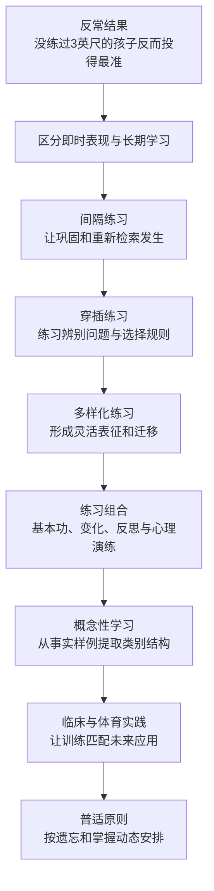
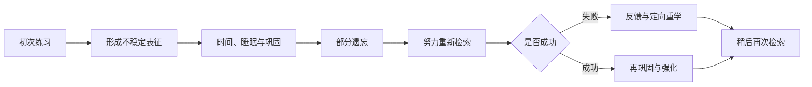

> **原书章节**：第 3 章“‘后刻意练习’时代的到来” 
> **原书作者**：彼得·C.布朗、亨利·L.罗迪格三世、马克·A.麦克丹尼尔 
> **原文来源**：《认知天性：让学习轻而易举的心理学规律》 
> **章节定位**：把第 2 章的检索原则扩展到练习安排，系统比较集中、间隔、穿插、多样化与段落练习，并说明怎样用复合训练形成长期保持、辨识能力和迁移能力。 
> **阅读目标**：理解为什么练习时进步最快的方法未必学得最好，能根据目标保持期与任务变化设计练习组合，并准确解释各项实验的变量、结果、假设与边界。

---

## 导读：“后刻意练习”不是不要练，而是重新定义好练习

“练习，练习，再练习”只回答了**要不要重复**，没有回答更关键的问题：

- 同一技能应连续练完，还是分散到多天？
- 不同题型应分章练，还是混合出现？
- 训练条件应保持固定，还是主动变化？
- 练习时正确率高，是否代表一周后仍会？
- 真实任务变化后，能否先识别问题再选择方法？

本章所谓“后刻意练习”，不是宣布刻意练习过时，也不是否定专注、反馈和纠错。它强调：**仅仅反复做目标动作还不够，练习的时间结构、项目顺序与情境变化会决定长期学习质量。**

本章中心命题是：

> 集中、固定、同类的重复能迅速提高练习阶段的表现，却容易依赖短时激活和情境提示；间隔、穿插和多样化会增加检索、辨识与调整的难度，使眼前表现变差，却通常形成更牢固、更灵活、更能迁移的知识和技能。

### 全章论证路线

### 本章最重要的评价标准转换

设：

- $P_a$：练习阶段的表现，即 acquisition performance；
- $R_t$：经过时间 $t$ 后的保持成绩；
- $T_c$：条件改变后的迁移成绩；
- $L$：潜在、相对持久的学习结果。

集中练习常使 $P_a$ 很高，但长期学习应主要根据 $R_t$ 与 $T_c$ 推断：

$$
L\approx f(R_t,T_c),\qquad P_a\text{ 只能提供有限证据}.
$$

其中 $f$ 只是表示“学习要通过延迟保持和迁移综合推断”的概念函数，不是原书提供的测量公式。

关键反例是：

$$
P_a(A)>P_a(B),\quad R_t(A)<R_t(B).
$$

策略 $A$ 在练习时更好，策略 $B$ 在延迟后更好。几何题实验正展示这种交叉，迫使我们放弃“练习时最好就是学得最好”的直觉。

### 先区分五种容易混淆的练习结构

| 练习结构 | 主要操纵维度 | 简化序列 | 典型风险 |
| --- | --- | --- | --- |
| 集中练习 | 同一内容的时间密度 | `AAAAAA`，间隔很短 | 依赖短时激活，快速遗忘 |
| 间隔练习 | 同一内容的时间距离 | `A…A……A` | 眼前进步慢，可能检索失败 |
| 段落练习 | 类型被分块、固定成段 | `AAA BBB CCC` | 不必判断当前该用什么方法 |
| 穿插练习 | 相关类型交替顺序 | `A B C A C B` | 初学者感觉混乱、正确率下降 |
| 多样化练习 | 同一能力的条件变化 | $A(x_1),A(x_2),A(x_3)$ | 变化过宽可能淹没稳定规律 |

它们不是同一个维度。一次训练可以同时集中且穿插，例如一小时内连续交替三种题型；也可以间隔但仍段落化，例如每周只练一种题型。设计时应分别判断时间、顺序和变化范围。

---

## 一、频繁的集中练习只会产生短期记忆

### 1. 沙包实验：没练目标距离的人为何更准

#### 1.1 实验设计

8 岁儿童练习把沙包投进篮子：

- **固定练习组**始终站在 3 英尺处；
- **多样化练习组**交替站在 2 英尺和 4 英尺处；
- 练习持续 12 周；
- 最终所有人在从未改变的 3 英尺处接受测试。

直觉预测固定组最好，因为训练任务与测试表面完全一致。实际结果相反：2 英尺与 4 英尺组在 3 英尺测试中最准，尽管他们从未练过该距离。

#### 1.2 实验操纵了什么

两组的核心差异不是“是否练投掷”，而是练习条件的变化：

$$
\text{固定组}:d=3,
$$

$$
\text{多样组}:d\in\{2,4\},
$$

其中 $d$ 表示投掷距离。测试统一为 $d=3$。

#### 1.3 为什么多样组可能更好

固定组反复调用同一力度与轨迹，容易形成适配 3 英尺练习情境的单一动作。多样组每次要根据距离调整力度、角度和动作，并从结果反馈中学习“条件变化—动作变化”的函数：

$$
a=g(d,c),
$$

其中：

- $a$：所需动作参数；
- $d$：投掷距离；
- $c$：其他条件，如个体姿态和篮筐位置；
- $g$：学习到的条件—动作映射。

当测试距离位于 2 与 4 英尺之间时，多样组可以插值调整，而固定组缺少调整练习。

#### 1.4 能推出什么，不能推出什么

可以推出：在该任务、年龄、训练范围和测试条件下，变化练习比目标距离上的固定重复更能支持迁移。

不能推出：

- 永远不要练目标距离；
- 变化越大越好；
- 2 与 4 英尺必然是所有人的最佳范围；
- 所有运动和认知任务都有同样效应大小。

原书也承认，训练变化是否必须围绕目标条件对称分布，仍有待研究。

### 2. 为什么人天然相信集中练习

**集中练习（massed practice）**是在较短时间内高密度重复同一知识或技能，相邻练习间隔很小，前一次加工仍高度活跃。

它有四种即时奖励：

1. 答案或动作仍在工作记忆中；
2. 题型固定，不必判断采用哪条规则；
3. 动作连续，协调感迅速改善；
4. 正确率和速度很快上升，进步肉眼可见。

教师看到学生当场表现变好，学生感到自己“上手”，企业看到一天培训结束时能演示，于是三方都把即时表现当成学习。

### 3. 学习定义为何必须包含“以后能用”

若学习只是“当前能完成”，集中练习当然成功。但作者把学习定义为获得知识或技能，并能在以后使用。

评价至少需要三个时间点：

| 时间点 | 主要受到什么影响 | 能说明什么 |
| --- | --- | --- |
| 练习中 | 短时激活、答案提示、动作热身 | 当前表现 |
| 延迟后 | 记忆保持、重新检索 | 长期学习 |
| 条件变化后 | 原理提取、辨识、调整 | 迁移能力 |

只记录练习中数据，会系统性偏爱集中练习。

### 4. 集中练习为何只产生“短期优势”

集中练习并非完全没有编码，而是额外重复常常利用尚未消退的同一表征：

1. 第一次练习激活答案或动作；
2. 第二次紧接着发生，不必重新检索；
3. 第三次继续沿用相同策略和情境；
4. 表现越来越顺，但检索路径、条件辨识和变化调整练得很少；
5. 时间过去后，短时激活消失；
6. 新情境又撤掉了固定线索，真实学习缺口暴露。

因此更准确的结论不是“集中练习只会产生零长期记忆”，而是：**它制造的明显改善中有很大一部分是暂时表现优势，长期保持和迁移通常不如合理间隔、穿插与多样化练习。**

### 5. 集中练习仍有哪些合理用途

- 首次熟悉一个动作的基本形态；
- 短期维持电话号码直到输入；
- 已成熟技能的热身；
- 在反馈下短轮次修正局部动作；
- 次日即用且未来不再需要的低价值信息。

即使在这些场景，也不应以集中练习结束时的流畅度证明长期掌握。

---

## 二、间隔练习使知识存储得更牢固

### 1. 什么是间隔练习

**间隔练习（spaced practice / distributed practice）**是把针对同一知识或技能的多次练习分散到不同时间，使练习之间存在足以改变可访问性的间隔。

设练习时点为 $t_1,t_2,\ldots,t_n$，相邻间隔为：

$$
\Delta_i=t_{i+1}-t_i.
$$

集中练习中大多数 $\Delta_i$ 很小；间隔练习中，$\Delta_i$ 足以让学习者下一次需要重新提取，而不是无意识复述。

### 2. 为什么间隔练习主观上“不划算”

间隔会带来部分生疏：

- 回忆更慢；
- 错误更多；
- 进度看起来不连续；
- 学习者失去“我已经掌握”的确定感。

长期收益此刻不可见，短期挫折却立即可见。即使实验参与者最终表现更好，也常主观判断集中练习更有效。

### 3. 现实中的集中培训

原书列出语言强化营、单科速成学院、把职业再教育压缩到一周的研讨班和考前突击。这些形式可能帮助近期考试或提供初始框架，但若没有后续检索和应用，期末或工作现场需要时，大量内容已遗忘。

问题不在课程密度本身，而在课程结束后是否存在分散复现、反馈和迁移练习。

### 4. 38 名外科实习医生实验

#### 4.1 设计

38 名住院外科实习医生学习显微手术，把细小血管重新连接。所有人接受相同的 4 节课，每节包括教学和实践：

- **集中组**在一天内完成 4 节课；
- **间隔组**每节课之间隔一周；
- 最后一节课结束一个月后统一测试。

#### 4.2 结果指标

研究不仅看能否说出步骤，还评估：

- 完成手术时间；
- 手部移动次数；
- 血管重新连接成功率；
- 活鼠主动脉搏动状态；
- 是否损伤其他血管并完成手术。

间隔组在所有指标上表现更好。集中组中有 `16%` 损伤实验动物其他血管，未能完成手术。

#### 4.3 为什么设计有说服力

1. 两组课程内容与课数相同；
2. 主要差异是时间安排；
3. 测试在一个月后，减少短时激活影响；
4. 指标包含真实操作质量，不只测书面记忆；
5. 因而差异支持时间分布本身具有学习价值。

#### 4.4 推广边界

- 样本只有 38 人；
- 任务是特定显微手术；
- 动物模型不完全等于真实临床；
- 一周间隔不一定适合所有技能；
- 研究比较的是极端安排，一天完成与每周一次。

稳健结论是避免把全部训练挤在一天，并保留跨时间复练，而不是所有课程统一隔一周。

### 5. 记忆巩固：间隔为何可能有效

**记忆巩固（consolidation）**是新形成、仍不稳定的记忆表征随时间变得更稳定，并与已有知识整合的过程。

作者提出的机制链：

1. 初次学习形成记忆痕迹；
2. 数小时或数天内，记忆获得意义并接入旧知；
3. 间隔允许这些过程展开；
4. 其间出现部分遗忘，使再次提取变难；
5. 成功检索会重新触发巩固或再巩固；
6. 记忆因而更稳、更易在未来访问。

### 6. 间隔不是越久越好

有效间隔位于两个失败区间之间：

- 太短：答案仍活跃，只是在重复；
- 太长：完全忘记，练习退化为重新学习。

可概念化为：

$$
\Delta^*=\arg\max_{\Delta}\;B(\Delta\mid D,K,H),
$$

其中：

- $\Delta^*$：较合适的间隔；
- $B$：长期学习收益；
- $D$：材料难度；
- $K$：已有掌握程度；
- $H$：希望保持的时间跨度。

公式只说明最佳间隔依赖任务与目标，不提供固定算法。保持目标越远，后续间隔通常可以逐渐拉长。

---

## 三、穿插练习有助于长期记忆

### 1. 什么是穿插练习

**穿插练习（interleaved practice）**是把两种或以上相关问题、主题或技能交替安排，并在一种练习尚未全部完成前切换到另一种。

段落安排：

$$
A,A,A,A,B,B,B,B,C,C,C,C.
$$

穿插安排：

$$
A,B,C,B,A,C,A,C,B,A,B,C.
$$

总题量可以完全相同，区别在排序。

### 2. 四种几何体实验

#### 2.1 设计

大学生学习计算 4 种少见几何体的体积：楔体、椭球体、锥球体和半椎体。

- **段落组**先连续做 4 道楔体题，再做 4 道椭球体题，依次完成；
- **穿插组**做同样题目，但不同类型混合排列；
- 一周后进行最终测试。

#### 2.2 练习阶段结果

- 段落组正确率：`89%`；
- 穿插组正确率：`60%`。

段落组高出 29 个百分点，直觉上像是更好的教学方法。

#### 2.3 一周后结果

- 段落组正确率：`20%`；
- 穿插组正确率：`63%`。

穿插组高出：

$$
63\%-20\%=43\text{ 个百分点}.
$$

相对提升为：

$$
\frac{63-20}{20}\times100\%=215\%.
$$

所以原书所说“提高 215%”指相对于 20% 基线的相对增长，不是提高 215 个百分点。

### 3. 这个交叉结果证明了什么

| 阶段 | 段落组 | 穿插组 | 表面结论 |
| --- | ---: | ---: | --- |
| 练习 | 89% | 60% | 段落更顺 |
| 一周后 | 20% | 63% | 穿插更牢 |

结果直接反驳“练习阶段正确率最高的方法必然学得最好”。穿插组练习时必须完成两个动作：

1. 判断当前是哪类几何体；
2. 从多个公式中选择正确方法。

段落组已经由题目位置暗示类型，只需重复同一程序。期末混合考试要求分类与选择，因此穿插训练更匹配未来任务。

### 4. 穿插练习为什么有效

设题目 $x$ 属于类别 $c$，每个类别对应策略 $s_c$。真实解题不是只执行策略，而是：

$$
x\xrightarrow{\text{辨识}}c\xrightarrow{\text{选择}}s_c\xrightarrow{\text{执行}}y.
$$

其中 $y$ 是答案。段落练习主要训练“执行”，穿插练习还训练“辨识”和“选择”。

### 5. 十步复杂工序怎样穿插

传统培训会把步骤 1 重复到熟，再练步骤 2，依次进行。穿插安排可在初步练几次步骤 1 后，转到步骤 4、步骤 3、步骤 7，再回到前面。

这里不能把工序的真实先后顺序打乱到造成安全问题。穿插的是**训练项目或故障情境**，不是生产执行时必须遵守的因果顺序。对于强依赖前一步的技能，先学最小完整流程，再穿插局部、异常和变式更合理。

原书预告农夫保险公司的螺旋式培训：关键技能以看似随机的顺序重复，每次加入新背景与含义。这是穿插、间隔和逐层深化的组合。

### 6. 为什么教师与学生都不喜欢穿插

- 教师看不到快速提高，担心教学失败；
- 学生刚产生一点熟悉感就被迫切换；
- 错误与混淆增加，自信下降；
- 长期收益在数日后才出现；
- 教材通常按章节集中同类题，进一步强化段落习惯。

因此，实施穿插应提前说明目的，并用延迟测试展示效果，不能只靠学习者当下感受。

### 7. 穿插的边界与渐进方案

穿插不是毫无结构地随机：

- 项目应相关，确实需要辨别；
- 初学者要先形成最低限度的单项理解；
- 切换频率不能高到无法完成任何有意义尝试；
- 错误后要有反馈；
- 安全关键流程必须保留完整序列练习。

渐进方案：先用少量段落练习理解每种方法，再逐步增加混合比例，最终以接近真实任务的随机顺序测试。

---

## 四、多样化练习促进知识的活学活用

### 1. 多样化练习的严格定义

**多样化练习（varied practice / variable practice）**是在保持核心目标或原理相对稳定的同时，系统改变距离、参数、示例、环境、线索或动作条件。

设核心技能为 $S$，练习条件为 $c_i$：

$$
S(c_1),S(c_2),\ldots,S(c_n).
$$

目标不是记住每个条件的孤立答案，而是学习条件到行动的映射，并提取跨条件稳定的原则。

### 2. 回到沙包实验：迁移来自调整练习

2 英尺和 4 英尺组学习到的不是两个孤立力度，而是距离变化需要怎样调整动作。3 英尺测试要求在已学范围内迁移。

这种能力可称为更灵活的“行为词汇表”：学习者拥有多种可选动作，并能根据条件选用或组合。

### 3. 多样化与穿插的区别

- 穿插关注多个类别的排序，例如体积题 A/B/C 交替；
- 多样化关注同一能力在不同条件下练习，例如不同距离投掷；
- 实际训练常同时具备两者，例如交替练不同球路，并在每种球路中改变速度和角度。

### 4. 神经成像证据该怎样理解

原书介绍研究发现：固定、简单练习与多样、认知负担较高的运动练习，在巩固时涉及不同脑区；后者似乎形成更灵活的运动表征。

合理推论是：练习结构会影响学习过程中使用和巩固的神经系统，多样化训练可能调用更高级的动作选择与认知处理。

不能过度推出：

- 某脑区“亮起”就证明教学法优越；
- 复杂表征一定永久更好；
- 所有认知任务与该运动实验共享相同机制；
- 神经成像可以替代行为保持和迁移测试。

脑证据提供机制一致性，教学结论仍应以延迟行为结果为主。

### 5. “肌肉记忆”不是肌肉自己记住

勾手投篮、高尔夫推杆、反手挥拍和橄榄球横移都常靠固定重复训练。“肌肉记忆”是通俗说法，实际涉及神经系统对动作程序、感觉反馈和时序的学习，不是肌肉组织独立储存规则。

固定重复可以提高特定动作稳定性，但比赛中的位置、速度、对手和时机不断变化，因此还必须练调整。

### 6. 冰球互传：固定位置为何不够

冰球互传要求接球后迅速传给移动队友，同时根据防守压力调整。教练杰米·昆彭过去让球员在同一位置或固定动作顺序中练习，后来改用更变化的安排。

昆彭转到芝加哥黑鹰队后，团队赢得斯坦利杯。原书以“或许不是巧合”增强故事性，但这不是因果证据：冠军还受球员、战术、管理、伤病和运气影响。它只能说明专业体育开始接受变化练习，不能用一个冠军证明方法效果。

### 7. 变位词实验：认知任务也能受益

#### 7.1 设计

学习者把乱序字母还原为单词，例如：

$$
\texttt{tmoce}\rightarrow\texttt{comet}.
$$

- 固定组反复练同一目标词的同一种变位；
- 多样组练同一目标词的多种变位；
- 最终测试使用固定组曾反复练习的变位。

#### 7.2 结果与意义

尽管测试表面更偏向固定组，多样组仍表现更好。这说明多样组学到的不只是某一字符串对应答案，而是更一般的字母重排、候选生成和验证过程。

#### 7.3 适用范围

原书指出，这一原则可扩展到树木识别、判例法原则和计算机程序学习。但具体训练要保留领域结构，不能简单把任何材料随机变化。

### 8. 多样化的边界

- 变化应围绕同一核心能力；
- 初学者需要足够稳定性识别基本动作；
- 变化范围应覆盖未来可能情境；
- 极端或无关变化可能增加噪声；
- 关键标准情境仍需直接练习；
- 变化后的结果必须反馈，否则学习者无法建立条件—行动关系。

---

## 五、善用练习组合，带来成长性思维

### 1. “成长性思维”在本节中的准确含义

本节并没有直接进行固定型与成长型思维的心理量表实验。标题更接近一种实践取向：学习者通过变化、辨识、反馈和调整，认识到能力会随练习结构改善，而不是把一次不流畅解释为“我不行”。

所以不能把本节证据直接当作“穿插练习必然改变人格信念”。更稳妥的关系是：

1. 复合练习制造可纠正的困难；
2. 学习者看到策略调整带来延迟进步；
3. 失败被重新解释为信息，而非能力终点；
4. 这有利于形成能力可发展的看法。

### 2. 数学教材为什么让人不会“选算法”

典型教材按章节组织：每章讲一种题型，随后连续做 20 道同型题。题目位置已经告诉学生用哪种方法。

期末考试和现实问题却把类型混合。学习者必须先判断：这是第 5、6 还是 7 章的方法？

段落练习训练：

$$
\text{已知策略 }s\rightarrow\text{执行}.
$$

真实任务要求：

$$
\text{问题 }x\rightarrow\text{识别类别 }c\rightarrow\text{选择策略 }s_c\rightarrow\text{执行}.
$$

缺少分类练习，学生可能“每个公式都学过”，却不知道当前该用哪一个。

### 3. 画家风格实验：差异对比胜过单类共性

#### 3.1 原始预测

研究者原以为，先连续看一位画家的大量作品，再看另一位，最容易提取每位画家的共同风格。穿插多位画家会造成混淆。

#### 3.2 实际结果

穿插不同画家的作品后，学生：

- 更能把作品与画家匹配；
- 对从未见过的新作品也分类更准。

#### 3.3 为什么穿插更好

集中看同一画家，容易发现组内相似；穿插展示让不同画家相邻出现，强化**差异对比（discriminative contrast）**：哪些笔触、构图和题材真正区分类别。

概念学习同时需要：

- 发现类内相似；
- 发现类间差异。

穿插让两种比较共同发生。

#### 3.4 元认知错觉再次出现

即使穿插组测试成绩更高，学生仍坚持集中学习更好。集中展示使风格相似性更容易看见，主观流畅度更高；学习者把这种感觉误作未来分类能力。

### 4. 鸟类分类：典型特征为何比死背定义复杂

研究材料包含 20 个鸟科，每科 12 个物种。分类要综合体形、羽毛、行为、地域、喙形和眼睛颜色等特征。

困难在于：

- 同科成员共享许多特征，但未必每个成员都有；
- 某特征在一个科中常见，也可能出现在别的科；
- 分类依赖多个线索的组合与权重，而不是单条充分定义。

例如许多鸫鸟有长而略弯的喙，但不是所有鸫鸟都有。学习者要形成的是概率性的**原型（prototype）**和区分类别的诊断性特征。

设类别为 $C$，特征集合为 $F=\{f_1,\ldots,f_n\}$，分类不是检查单一特征，而是估计：

$$
P(C\mid F)\propto P(F\mid C)P(C).
$$

其中：

- $P(C\mid F)$：观察到特征后属于类别 $C$ 的可能性；
- $P(F\mid C)$：该类别出现这些特征的可能性；
- $P(C)$：类别先验可能性。

这只是帮助理解多线索分类的概率表达，不表示学生必须显式做贝叶斯计算。

### 5. 事实性知识与概念性知识

**事实性知识**回答对象有哪些特征、名称和实例。 
**概念性知识**回答组成元素怎样关联、类别如何区分、整体怎样运作以及规则何时适用。

二者不是互斥层级：

1. 没有事实样例，概念没有材料；
2. 只背事实，无法判断新样例；
3. 穿插和多样化检索让学习者比较事实；
4. 比较中逐步抽取原型、边界和诊断特征；
5. 因而事实检索可以服务于更深概念学习。

### 6. 为什么样例检索能帮助概念抽取

反对意见是：检索事实和范例只会记细节，达不到理解一般特征的水平。鸟类研究显示，若范例以穿插、多样方式出现，检索会迫使学习者辨别复杂原型和背景差异。

关键不只是“多看样例”，而是：

- 样例覆盖类内变化；
- 类别彼此穿插，便于对比；
- 学习者需要主动分类；
- 结果提供反馈；
- 测试包含未见过的新实例。

### 7. 练习组合怎样支持成长取向

合理组合不是在某种方法中二选一：

- 用少量集中练习建立基本动作；
- 用间隔让记忆跨时间稳定；
- 用穿插练辨识和选择；
- 用多样化练调整和迁移；
- 用检索与反馈暴露缺口；
- 用反思解释错误并修改策略。

学习者会看到“练习时犯错”与“最终不会”不是同一回事，从而更愿意把困难当作可处理的信息。

---

## 六、知识是平面的，复合型知识是立体的

### 1. “平面”与“立体”比喻的含义

平面知识接近孤立事实与单一路径：知道某症状、某公式或某步骤。复合型知识则把事实、概念、程序、条件和判断组织起来，能在变化情境中调用。

可以表示为：

$$
K_{complex}=K_f+K_c+K_p+K_{cond}+M.
$$

其中：

- $K_f$：事实性知识；
- $K_c$：概念关系；
- $K_p$：操作程序；
- $K_{cond}$：何时使用的条件性知识；
- $M$：监控、判断和调整。

加号表示组成而非精确可加分数。

### 2. 医生诊断为何像鸟类分类

小儿神经科医师道格拉斯·拉尔森指出，每次出诊都是一次测验。医生听取病情时：

- 有意识地检索病例与医学知识；
- 自动调用过去经验理解线索；
- 比较多个可能诊断；
- 根据症状组合、概率和风险作判断。

### 3. 外显记忆与内隐记忆

**外显记忆（explicit memory）**是能够有意识检索并陈述的知识，如疾病定义、诊断标准和用药禁忌。

**内隐记忆（implicit memory）**是过去经验在不完全依赖有意识回忆时影响当前感知和行为，如经验丰富的医生迅速感到某症状组合“不对劲”。

内隐判断可以高效，却也可能带偏见，因此应由检查、证据和显性推理校验。

### 4. 模拟中心与标准化病人

医学院使用：

- 有心跳、血压、瞳孔反应并可互动的高科技人体模型；
- 按剧本表现症状的演员，即标准化病人；
- 模拟诊所环境，评估问诊态度、体检、信息收集、诊断与治疗方案。

这些训练把分散知识整合为完整行为链，允许在低风险环境中犯错并反馈。

### 5. 书面学习与出诊练习：测试匹配原则

拉尔森的研究得到两类结果：

- 在期末书面测验中，检查过病人的学生与用书面测验学习的学生分数相近；
- 在实际或模拟出诊任务中，练过病人检查的学生表现更好。

这并不矛盾。每种练习最能改善与其认知和操作要求相似的测试。

设训练任务为 $P$，目标任务为 $T$，两者的过程相似度为 $S(P,T)$，则一般有：

$$
S(P,T)\uparrow\Rightarrow\text{迁移概率通常上升}.
$$

这叫**迁移适切加工**或训练—测试匹配原则。它不要求表面完全相同，而要求关键判断和操作相似。

### 6. 为什么只读病理知识不够

书面知识可以支持定义和机制，但出诊还要求：

1. 在患者叙述中发现关键信号；
2. 提出追问；
3. 执行体检；
4. 在多个诊断间辨别；
5. 沟通不确定性；
6. 给出治疗与随访方案。

这些程序和条件知识必须通过接近实践的检索来训练。原书用体育俗语概括：“把训练当成比赛，才能把比赛当成训练。”

飞行员、警察、拖船驾驶员等高风险行业同理，模拟器不是装饰，而是让检索形式匹配未来使用。

### 7. 多样化与重复不是二选一

临床经验越多样，医生越能辨别罕见和复杂病例；但常见、关键疾病又必须反复检索到熟练。

合理平衡是：

- 对高频、高风险基础内容安排重复和达标练习；
- 对易混淆疾病进行穿插比较；
- 对同一疾病展示年龄、症状和严重度变化；
- 定期复测，防止“见过很多次”造成熟悉陷阱。

**掌握学习（mastery learning）**不是连续练到顺手，而是依据明确标准多次评估，未达标者反馈后再练，达标后仍安排维持性检索。

### 8. 临床本身为何是自然的复合练习

每次出诊天然具备：

- 时间间隔；
- 不同病种穿插；
- 症状和患者差异；
- 从记忆中检索；
- 诊断结果反馈。

但经历本身不保证学习。医生可能忙完就离开，未检查判断为何正确或错误。反思把自然经历转化为有意识学习。

### 9. 日报与周报：怎样培养反思习惯

拉尔森尝试让学生记录：

- 做了什么；
- 结果怎样；
- 哪些判断依据可靠；
- 下次从什么不同角度入手。

这同时包含间隔检索和细化。有效反思日志不应只写流水账，而要形成“事件—解释—证据—改进—下次检验”的结构。

### 10. 被动医学会议的问题

拉尔森估计实习医生约 `10%` 的时间用于会议和讲座，内容可能涉及代谢病、传染病或药物。典型流程是听幻灯片、吃午餐、离场，之后几乎没有重新接触、测验或相关患者。

问题不是讲座绝对无用，而是它只有一次集中输入，缺少：

- 主动检索；
- 延迟复现；
- 临床应用；
- 反馈；
- 对遗忘的系统干预。

### 11. 低成本替代：会后测验与每周邮件

拉尔森建议：

- 会议结束时做一次小测验；
- 之后每周发一封约 10 道题的邮件；
- 题目重新检索关键内容；
- 将结果用于后续讨论或临床案例。

这把一次讲座改造成跨时间学习系统，成本远低于重新举办课程。

### 12. 本小节的完整论证

1. 复合任务需要事实、概念、程序和判断协同；
2. 只读书主要练书面提取，不能覆盖实践流程；
3. 模拟与标准化病人提供接近应用的检索；
4. 多样病例发展辨识，重复常见病例保持基础；
5. 真实经历提供自然间隔和变化；
6. 反思将经历转化为模型更新；
7. 被动讲座若无后续练习，会迅速遗忘；
8. 教育系统应主动安排检索，而不是等待偶然遇到相关病人。

---

## 七、关于练习的几条普适性原则

### 1. 橄榄球队为何是复合学习模型

佐治亚大学斗牛犬队教练文斯·杜利在 1964—1988 年执教，取得 201 胜、77 负、10 平，赢得 6 次分区冠军和 1 次全国冠军。

成绩不能单独证明某个训练环节的因果效果，但球队安排展示了如何把基本功、策略、间隔、变化、团队整合和心理演练组织成系统。

### 2. 围绕周六比赛组织一周学习

球员一周内要：

1. 在课堂研究对手风格；
2. 讨论进攻与防守策略；
3. 把策略拆成个人跑位；
4. 在位置组中练局部技能；
5. 把局部重新组合成团队行动；
6. 在模拟赛中适应对手变化；
7. 心理演练并为周六比赛做最后检索。

这是一条从陈述知识到程序、再到变化应用的完整链。

### 3. 基本功为什么仍要重复

阻挡、擒抱、接球、传球和带球必须持续练，否则会生疏。杜利同时强调训练要变化，避免无聊并提高适应。

这里再次说明：本章不是反对重复，而是反对**没有间隔、没有变化、没有选择要求的机械重复**。

### 4. 特殊策略为何天然有间隔

特殊比赛策略只在每周四训练，相邻练习约隔一周。每次对手和顺序又不同，兼有间隔与穿插。

间隔迫使球员重新检索；顺序变化防止把动作只绑定到固定序列。

### 5. 每日训练怎样从局部走向整体

- 每天先练基本素质；
- 再按位置分组练跑位；
- 随后把局部组合成团队；
- 演练节奏时快时慢；
- 周三进行高节奏模拟比赛；
- 之后慢速、无身体接触地走位，分析不同反应。

快练检验自动反应，慢练让球员看清结构和分支。两者用途不同。

### 6. 练习调整，而不是背固定剧本

对手不会按训练剧本反应。演练时必须问：如果对方这样移动，我该如何调整？

这练的是条件性规则：

$$
\text{若状态 }c_i\text{ 出现，则选择动作 }a_i.
$$

多种环境训练越充分，比赛中遇到新组合时越可能找到相近模型并调整。

### 7. 心理演练怎样补充体能训练

全程身体训练会导致疲劳。球员可阅读战术，在头脑中从头到尾演练，用轻微倾身或一两步代表完整跑位，并模拟异常分支。

心理演练的条件：

- 已理解动作与战术；
- 表征足够准确；
- 仍有真实训练校验；
- 重点包括线索与调整，而非只想象成功结果。

周六上午，四分卫最后复习战术并完整心理演练。比赛开始后，教练方案能否落地依赖球员现场检索和决策。

### 8. 球队训练与外科训练的共同结构

| 外科医生 | 四分卫 |
| --- | --- |
| 术前预演风险 | 赛前预演战术 |
| 检索标准程序 | 检索跑位与策略 |
| 根据出血变化调整 | 根据防守变化调整 |
| 基础缝合自动化 | 基本动作自动化 |
| 术后反思 | 赛后复盘 |

领域不同，学习结构相同：检索、间隔、穿插、变化、反思和细化。

---

## 八、小结

### 1. 暂时表现优势与潜在习惯优势

作者区分：

- **暂时的表现优势**：练习中立即可见的速度、正确率和流畅度；
- **潜在的习惯优势**：时间过去或情境变化后仍能稳定执行的持久能力。

脚注借用比约克夫妇的框架：

- **检索强度（retrieval strength）**：当前多容易想起；
- **存储强度（storage strength）**：记忆在长期系统中多稳固。

刚得知“詹姆斯·门罗是美国第五任总统”后，当周容易回答，说明检索强度高；一年后仍能回答，更能反映存储强度。

集中练习容易迅速提高检索强度，间隔后的努力检索更可能提高存储强度。

### 2. 填鸭为什么像吃下又吐出

填鸭在短期内输入大量信息，近期考试可能成功，但遗忘快。比喻强调高摄入量不等于高保留量。

评价学习效率不应只看：

$$
\eta_{input}=\frac{\text{接触内容量}}{\text{时间}},
$$

还要看：

$$
\eta_{usable}=\frac{\text{延迟后可正确提取并应用的内容}}{\text{总投入时间}}.
$$

间隔练习当下输入速度较慢，却可能提高可用效率。

### 3. 间隔多长才够

原书给出实践判断：

- 至少长到出现一点遗忘，使练习不再是无意义重复；
- 不要长到几乎全部遗忘，只能完全重学；
- 睡眠似乎参与巩固，因此至少隔一天常是不错起点。

“至少一天”不是普适定律。简单材料可能数分钟后就需检索，长期目标则需要逐渐扩展到数周和数月。

### 4. 莱特纳盒子：用表现动态调节间隔

塞巴斯蒂安·莱特纳把抽认卡分入多个盒子。原书用 4 个盒子说明：

- 第 1 盒是最常错内容，练习最频繁；
- 第 2 盒频率约为第 1 盒一半；
- 第 3、4 盒依次降低频率；
- 答错或动作失败，就向前移到更频繁的盒子；
- 掌握越好，间隔越长；
- 重要内容不永久退出复习。

实际莱特纳系统版本不同，卡片移动规则也可调整。核心是根据检索表现分配频率，而不是所有内容平均复习。

### 5. 熟悉陷阱为何会破坏自测

看到卡片正面就觉得答案熟，不等于完整说得出。正确流程是：

1. 遮住答案；
2. 强迫自己完整生成；
3. 明确比较遗漏与错误；
4. 按真实表现移动卡片；
5. 不因“见过很多次”提前毕业。

若一边看答案一边判断“我会”，莱特纳盒也会失效。

### 6. 索贝尔课程怎样同时实现间隔与穿插

26 堂政治经济学课安排 9 次小测验，后续测验继续涉及学期早期内容：

- 同一知识跨周重现，形成间隔；
- 新旧内容同时出现，形成穿插；
- 学生不断检索，避免期末一次突击。

### 7. 穿插必须在“尚未全部完成”时切换

先完成 A 全部练习，再完成 B，并不是穿插。真正穿插要求在 A 尚未练完时转 B，再回来检索 A。

冰球课中，学员刚对滑冰有感觉，教练就转控球，再转射门。学员当下沮丧，却在下一周获得更全面改善。教练需要解释这种短期挫折，否则学生可能把好设计误认为教学混乱。

### 8. 段落练习为什么不等于多样化

**段落练习（blocked practice）**可包含多个动作，但总按固定块或固定顺序进行，如冰球球员依次在若干固定位置完成不同动作，下一轮仍完全相同。

它像总按同一顺序播放唱片或抽认卡。学习者可能根据顺序预测答案，而不是根据问题线索选择动作。

打乱卡片、位置、题型和模拟故障顺序，才增加辨识与适应要求。

### 9. 生活本来就是间隔、穿插和变化的

每个病人、每场比赛、每次拦车检查都不同，并且彼此间隔。真实经验天然提供练习机会，但只有学习者注意结果并反思，经验才会更新知识。

反思可以用三个问题组织：

1. 发生了什么，我做了什么？
2. 为什么有效或无效？
3. 下次条件变化时，我要怎样调整？

前两问是检索与解释，第三问是细化和生成。

### 10. 神经可塑性与练习原则

反复使用复杂、相关的神经网络会改变连接并提高灵活性。但“让大脑工作”不能被简化为任何脑力负担都有益。

有效练习需要：

- 与目标技能相关；
- 有足够难度；
- 可获得反馈；
- 跨时间重复；
- 包含真实变化；
- 允许休息和巩固。

### 11. 本章结论的适用边界

1. **不是所有集中练习都无用。** 它适合建立初始动作和短轮次纠错，但不应作为全部训练。
2. **间隔不是越长越好。** 完全遗忘会变成重学。
3. **穿插不是随机混乱。** 内容应相关，学习者要有最低基础。
4. **多样化不是无限变化。** 变化范围要围绕目标任务和稳定原理。
5. **延迟成绩优于即时成绩作为学习证据，但仍需匹配目标。** 书面测试不能代表临床操作。
6. **神经成像只提供机制线索。** 最终仍要看行为保持与迁移。
7. **冠军案例不能证明因果。** 应依赖控制研究而非成功故事。
8. **事实与概念不是二选一。** 多样样例和主动分类可从事实走向概念。
9. **重复与变化需要平衡。** 高频基础技能仍要持续复练。
10. **经历不自动成为经验。** 反思和反馈决定是否真正学习。

---

## 九、核心概念对照表

| 概念 | 要解决的问题 | 严格含义 | 不能混同为 |
| --- | --- | --- | --- |
| 集中练习 | 描述高密度重复 | 短时间连续重复同一内容 | 所有形式的刻意练习 |
| 间隔练习 | 防止短时激活冒充学习 | 同一内容跨时间分散练习 | 单纯拖延 |
| 段落练习 | 描述按类型成块训练 | 一个类型或固定序列完成后再换 | 多样化练习 |
| 穿插练习 | 练习辨识和选择 | 相关类型在各自完成前交替出现 | 无关内容随机切换 |
| 多样化练习 | 形成条件—行动映射 | 系统改变同一能力的参数和情境 | 永不重复基础动作 |
| 巩固 | 解释时间为何重要 | 新记忆随时间稳定并整合 | 被动等待必然学会 |
| 暂时表现优势 | 解释练习中快速提高 | 当下提示和短时激活支持的表现 | 持久学习 |
| 潜在习惯优势 | 解释延迟后的稳定能力 | 时间和情境变化后仍可执行 | 一次练习的流畅感 |
| 检索强度 | 当前多容易想起 | 线索下的即时可访问性 | 长期存储强度 |
| 存储强度 | 记忆多稳固 | 长期系统中的持久性 | 当前一定容易想起 |
| 差异对比 | 学会类别边界 | 相邻比较不同类别的诊断特征 | 只找类内共同点 |
| 原型 | 处理无严格定义的类别 | 多个典型特征构成的概率表征 | 每个成员都具备的单一定义 |
| 迁移适切加工 | 让训练服务未来任务 | 练习与目标共享关键认知和操作过程 | 题目表面完全相同 |
| 反思 | 把经历转化为知识 | 检索、解释、生成改进并后续验证 | 流水账或情绪反刍 |

---

## 十、作者分析问题的方法

### 1. 用反常结果击穿直觉

没练 3 英尺的孩子更准，练习时只有 60% 的学生一周后反而达到 63%。这些结果不能用“多练就熟”解释，迫使读者重新区分表现与学习。

### 2. 采用延迟测试

若只看训练结束，集中组几乎总占优势。一个月后的外科测试、一周后的几何测试，排除了部分短时激活。

### 3. 采用迁移测试

沙包目标距离、未见过画作、新变位词和模拟病人都要求超越原练习表面，检验是否形成灵活规则。

### 4. 从运动扩展到认知，再进入专业实践

沙包与运动成像提供动作证据，几何与变位词说明认知任务同样受益，画家与鸟类展示概念分类，医学与橄榄球说明复杂职业应用。

### 5. 比较主观判断与客观结果

画家实验中，学生成绩支持穿插，信念却支持集中。作者据此说明学习感受本身需要校准。

### 6. 保留替代解释和边界

作者承认沙包变化范围仍待研究，医学需要平衡重复与多样性，神经机制仍在发展。斯坦利杯案例也只作趣味关联，而非正式证明。

### 7. 最终形成复合方案

作者不把间隔、穿插、多样化变成新的单一教条，而是用临床和球队展示：基本功重复、变化练习、心理演练、模拟、反思和反馈要协同。

---

## 十一、可执行练习设计

### 1. 先定义真实目标

不要只写“学会四个公式”，而要写：

- 能在混合题中识别该用哪个公式；
- 一周后无提示写出；
- 参数和题面改变后仍会建模；
- 能解释为何其他公式不适用。

### 2. 三阶段安排

#### 阶段 A：建立最低基础

- 学一个完整示例；
- 短轮次集中练关键动作；
- 立即纠正根本错误；
- 确认理解条件和目标。

#### 阶段 B：引入间隔与穿插

- 同一内容跨天重现；
- 在尚未全部完成前切换相关类型；
- 每次先判断类型再求解；
- 记录信心和错误原因。

#### 阶段 C：扩大变化与迁移

- 改变参数、背景和问题表述；
- 加入未见样例；
- 模拟真实时间压力；
- 用反思日志更新策略。

### 3. 一个两周模板

| 时间 | 训练内容 | 主要原则 |
| --- | --- | --- |
| 第 0 天 | 学 A、B 的基本模型，各做少量题 | 初始理解 |
| 第 1 天 | A/B 混合，反馈后解释差异 | 穿插、检索 |
| 第 3 天 | 加入 C，改变参数 | 间隔、多样化 |
| 第 5 天 | A/B/C 随机分类，不立即告知题型 | 辨识、选择 |
| 第 8 天 | 新情境应用，写反思 | 迁移、细化 |
| 第 14 天 | 无提示综合测试 | 延迟保持 |

### 4. 动态调整间隔

- 连续两次轻松正确：扩大间隔；
- 勉强正确：保持间隔并增加变式；
- 答错但看反馈后理解：缩短下一间隔；
- 完全不理解：回到基础教学，不要只加测验；
- 高风险技能：即使熟练也保留周期复训。

### 5. 反思模板

1. 这次任务属于哪一类？我用什么线索判断？
2. 我选择了什么方法？为什么？
3. 结果和预期哪里不同？
4. 错误来自知识、分类、执行还是监控？
5. 下次条件变化时，我要怎样调整？
6. 何时再次检索，怎样验证真的改进？

---

## 十二、自测题

### A. 基础概念

1. “后刻意练习”为什么不等于否定刻意练习？
2. 集中、间隔、段落、穿插和多样化练习分别操纵什么？
3. 即时表现为什么不能单独证明长期学习？
4. 检索强度和存储强度有什么区别？
5. 间隔为什么要允许一点遗忘？
6. 穿插练习比段落练习多训练哪两个环节？
7. 多样化练习怎样形成条件—行动映射？
8. “肌肉记忆”为什么只是通俗说法？
9. 事实性知识与概念性知识怎样相互支持？
10. 迁移适切加工原则是什么？

### B. 实验与数据

11. 沙包实验的两组怎样练习，测试为何构成迁移？
12. 外科实习医生实验如何控制课程内容，又如何测长期技能？
13. 集中组 `16%` 未完成手术能说明什么，不能说明什么？
14. 几何题实验练习阶段和一周后的两组成绩分别是多少？
15. 从 `20%` 到 `63%` 为什么既是 43 个百分点，又是相对提高 `215%`？
16. 变位词实验为何对固定组表面更有利，多样组仍获胜说明什么？
17. 画家实验为什么要求测试未见过的作品？
18. 鸟类分类为什么不能只背一条定义性特征？
19. 神经成像结果为何不能独自决定教学方案？
20. 黑鹰队赢得斯坦利杯为何不能证明多样化训练导致冠军？

### C. 应用与边界

21. 十步工序能否直接按 `1→4→3→7` 的生产顺序执行？训练中应怎样穿插？
22. 为什么初学者不宜一开始就完全随机练习？
23. 数学教材的章节练习缺少哪项真实考试能力？
24. 医学课程为何既需要多样病例，也需要重复常见疾病？
25. 为什么检查标准化病人可能提升临床表现，却不一定比书面检索更提升笔试？
26. 被动会议怎样用低成本方式改造成间隔学习？
27. 橄榄球队的快练、慢练和心理演练分别解决什么问题？
28. 莱特纳盒怎样根据表现动态分配复习？
29. 为什么固定顺序轮换多个动作仍可能是段落练习？
30. 为你当前学习的一项技能设计集中起步、间隔、穿插、多样化和反思五个环节。

参考答案要点

1. 它保留专注、目标和反馈，但进一步强调练习的时间分布、顺序与变化决定长期保持和迁移。
2. 集中与间隔操纵时间密度；段落与穿插操纵类型顺序；多样化操纵同一能力的条件和参数。
3. 即时表现可能依赖工作记忆、题型提示和热身，延迟后这些支持会消失。
4. 检索强度是当前易想起程度，存储强度是长期稳固程度；前者高不保证后者高。
5. 部分遗忘迫使重新搜索和重建，成功检索更能巩固；忘太多则变成重学。
6. 先辨识问题类别，再从多个方法中选择正确策略。
7. 在不同条件下尝试、获得结果反馈，学习条件变化应对应怎样的动作调整。
8. 动作程序主要由神经系统、感觉反馈和时序学习支持，不是肌肉独立储存记忆。
9. 事实样例提供概念材料，穿插比较帮助抽取类内相似、类间差异和规则。
10. 训练与目标任务共享的关键认知和操作过程越多，迁移通常越好。
11. 固定组只练 3 英尺，多样组练 2 和 4 英尺；统一在未被多样组直接练过的 3 英尺测试。
12. 两组同上 4 节显微手术课，只改变一天集中或每周一次；一个月后用实际操作多指标测试。
13. 说明该实验中集中安排存在严重操作后果；不能推出所有集中学习者都有 16% 失败概率。
14. 练习时段落组 89%、穿插组 60%；一周后段落组 20%、穿插组 63%。
15. 绝对差是 $63-20=43$ 个百分点，相对基线增长是 $43/20=215\%$。
16. 测试用了固定组练过的变位；多样组仍好，说明其形成了更一般的求解程序和迁移能力。
17. 未见作品排除只记住具体画面的解释，检验是否学到风格概念。
18. 同科成员不一定共享某一特征，分类依赖多个概率性、诊断性特征的组合。
19. 脑区差异只提供机制线索，不能替代延迟保持、迁移和教学成本等行为证据。
20. 冠军受大量变量影响，单一成功案例没有控制组，也不能排除替代原因。
21. 不能打乱有因果或安全约束的生产步骤；可穿插不同步骤的训练题、故障案例和完整流程变式。
22. 初学者尚无基本模型，过度随机会造成持续失败；应先建立最低理解再逐步混合。
23. 从混合问题中识别类别并选择算法。
24. 多样病例发展辨识与迁移，重复常见疾病保证高频、高风险基础可快速调用。
25. 每种训练优先改善与其过程相似的任务，临床操作与笔试检索要求不同。
26. 会末小测，之后每周邮件题，加入案例应用和反馈。
27. 快练训练反应与团队节奏，慢练分析分支与调整，心理演练补充体力训练并复习战术。
28. 错误内容进入高频盒，连续答对逐级延长间隔，重要内容仍保留维持练习。
29. 若动作总按固定块或顺序出现，学习者可依赖位置预测，不必根据情境选择。
30. 答案应包含初始基本动作、跨时间复练、相关类型混合、条件变化、结果反馈和反思改进。

---

## 十三、全章总结

第三章用一组看似矛盾的结果重塑练习观：

- 在目标距离练得最多的孩子，目标距离测试反而较差；
- 几何题练习时达到 89% 的学生，一周后只剩 20%；
- 练习时只有 60% 的穿插组，一周后达到 63%；
- 一天密集学习显微手术的医生，一个月后不如每周练一次的医生。

这些结果共同说明：**让练习看起来进步最快，与让能力保存最久、适用最广，是两个不同的设计目标。**

集中和段落练习提供流畅感，间隔迫使重新检索，穿插迫使识别和选择，多样化迫使根据条件调整。四者并非简单互相排斥：高质量训练通常先用少量集中练习建立基本模型，再通过间隔、穿插和变化把模型变得持久、可辨识、能迁移，同时用反馈与反思防止错误自动化。

真正的“后刻意练习”不是少练，而是不再把重复次数当作练习质量。它要求我们追问：

> 练习是否跨越了时间？是否撤掉了题型提示？是否改变了情境？是否要求学习者先判断再行动？是否在未来真实任务中测试？

当答案是肯定的，练习阶段可能更慢、更乱、更令人怀疑自己；但这种不流畅恰恰可能意味着，学习者不再沿着刚刚走过的短路重复，而是在建立未来仍能找到、也能通往更多情境的道路。
