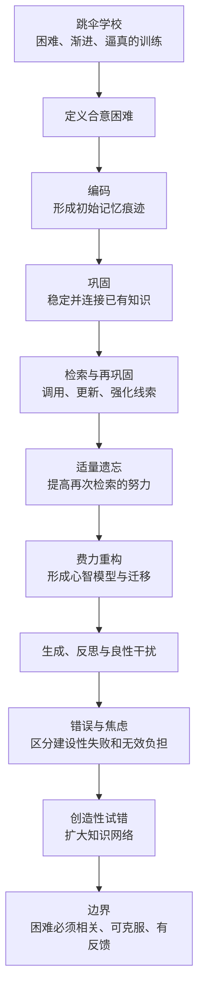

> **原书章节**：第 4 章“知识的‘滚雪球’效应” 
> **原书作者**：彼得·C.布朗、亨利·L.罗迪格三世、马克·A.麦克丹尼尔 
> **原文来源**：《认知天性：让学习轻而易举的心理学规律》 
> **章节定位**：解释间隔、穿插、生成和反思为什么有效，从编码、巩固、检索、遗忘与再巩固的相互作用中给出机制，并划清“合意困难”与无效障碍的边界。 
> **阅读目标**：理解知识怎样依托旧知扩展、检索线索怎样决定可用性、适量遗忘为何促进重学，以及如何设计既费力又可克服、既允许犯错又能及时纠错的学习环境。

---

## 导读：“滚雪球”不是知识自动增加

雪球越滚越大，是因为新雪会黏到已有雪球上。知识也有类似性质：已有知识越丰富，新信息越容易获得意义、找到关联并被长期保存。但这个过程不会自动发生。

知识滚动起来需要三类工作：

1. **形成表征**：把感知到的信息编码成可处理的记忆痕迹；
2. **组织与稳定**：通过巩固把新知接入旧知；
3. **重新调用与更新**：通过检索和再巩固强化线索、修正模型并支持应用。

本章中心命题可以概括为：

> 某些会暂时降低流畅度的困难，例如间隔、穿插、生成、反思和模拟变化，会迫使学习者更充分地编码、检索和重构知识，从而增强长期保持与迁移；但困难只有在与目标相关、学习者能够克服并获得反馈时才“合意”。

### 全章论证路线

### “滚雪球效应”的概念模型

设学习者在时刻 $t$ 的可用知识网络为 $K_t$，新信息为 $I_t$，有效关联比例为 $a_t$，遗忘与干扰损失为 $d_t$，检索和再巩固收益为 $r_t$，则可以粗略表示为：

$$
K_{t+1}=K_t+a_tI_t+r_t-d_t.
$$

其中：

- $K_t$：当前已经组织并可调用的知识；
- $I_t$：新接触的信息；
- $a_t\in[0,1]$：新信息中成功接入旧知的比例；
- $r_t$：检索、反思和再巩固带来的更新；
- $d_t$：遗忘、错误线索和干扰造成的损失。

这不是原书的定量模型，而是说明：输入量 $I_t$ 大不等于知识增长大。先备知识、关联质量、检索与干扰共同决定滚雪球速度。

### 本章最容易误解的三句话

#### 1. “欲求新知，先忘旧事”

不是删除旧知识，而是暂时抑制、改派或减弱会干扰新任务的旧检索线索。

#### 2. “越容易想起，越不容易记住”

不是说熟练必然导致遗忘，而是说一次毫不费力、依赖短期激活的检索，对长期记忆的额外强化通常较小。

#### 3. “困难能促进学习”

不是痛苦越大越好。无关、不可克服、缺乏反馈或占满工作记忆的困难会妨碍学习。

---

## 开篇案例：米娅·布伦戴特与跳伞学校

### 1. 为什么她必须学习自己害怕的事

海军陆战队中尉米娅·布伦戴特 23 岁时被派到琉球负责后勤。她将担任空投排指挥官，必须通过伞降训练。她身体素质出色，却本能地厌恶下坠感。

这个案例把学习置于真实矛盾中：

- 学习者有强烈恐惧；
- 任务风险高，错误可能受伤或致命；
- 仅会背步骤远远不够；
- 环境变化快，必须自动执行并随机应变；
- 信心必须来自真实能力，而非自我鼓励。

### 2. 什么是合意困难

比约克夫妇提出**合意困难（desirable difficulties）**：在学习阶段增加短期困难、降低眼前流畅度，却能通过更充分的编码和检索改善长期保持、理解与迁移的条件。

一个困难 $D$ 要成为合意困难，至少需要：

$$
D\text{ 与目标相关}\land D\text{ 可通过努力克服}\land D\text{ 有反馈}\land D\text{ 改善延迟表现}.
$$

四个条件缺一不可。困难只是成本，长期学习收益才是判断依据。

### 3. 跳伞学校如何把困难逐级增加

美国陆军本宁堡跳伞学校不允许学员带笔记本或记笔记，主要要求倾听、观察、心理演练和执行。训练本身持续检验学习者，而不是最后才考一次。

#### 3.1 沙坑：学习滚翻式着陆

滚翻式跳伞着陆简称 `PLF`。它把冲击依次分散到前脚掌、小腿、大腿、臀部和背部一侧。学员要根据飘落方向、地形、风和摆动，在六个方向中选择：左前、左侧、左后、右前、右侧、右后。

教官先解释和示范，学员再从不同方向落地、接受纠正反馈并继续练习。训练从一开始就不是单一路径重复，而是包含条件判断。

#### 3.2 两英尺平台：加入完整准备动作

学员听到口令后抬脚跟、绷紧脚面和膝盖、手臂上伸，再跳下完成 PLF。高度小，允许聚焦基本程序。

#### 3.3 滑索：加入运动、随机方向与口令

学员抓住 T 形把手滑向着陆区，听口令松手，并从不同方向完成翻滚。移动与随机性增加了检索难度。

#### 3.4 十二英尺平台：加入装备、互检和机舱出口

学员穿背带、与战友互检，从模型机舱门跳出。滑索提供类似真实降落伞的悬空弧长和摆动，教官在接近地面时释放，使学员从两三英尺高度随机落地。

#### 3.5 三十四英尺塔：整合全流程与异常处理

学员练离机、滑降、设备故障、负重伞降和应急动作。训练开始从单项动作转向完整情境。

#### 3.6 三周后的五次实跳

坚持三周未被淘汰者，要从军用飞机实跳 5 次，完成后才获得伞兵徽章和空降资格。

### 4. 训练为何不是简单“越难越好”

跳伞学校采用的是**渐进难度**：

$$
D_1<D_2<\cdots<D_n,
$$

且每一级都建立在前一级基本能力上。沙坑、低台、滑索、高塔和实跳逐步增加高度、速度、随机性、装备和压力。

若第一天直接实跳，困难远超学习者能力，不是合意困难，而是危险。渐进设计让每次挑战既接近真实任务，又保留可纠错空间。

### 5. 训练怎样整合多种有效方法

| 方法 | 跳伞学校中的体现 |
| --- | --- |
| 检索 | 听到口令后立即执行动作 |
| 间隔 | 等待不同训练点和下一轮时再次调用 |
| 穿插 | 落地方向、故障和程序混合出现 |
| 多样化 | 高度、风向、天气、昼夜、地形和装备变化 |
| 反馈 | 教官现场纠正动作 |
| 模拟 | 低风险复制离机、摆动和着陆 |
| 心理演练 | 等待和休息时在头脑中运行流程 |
| 达标淘汰 | 未达到安全标准不能进入下一阶段 |

### 6. 第三跳：训练怎样变成可用能力

米娅第三次从约 1250 英尺高度跳出 C130 运输机。两侧舱门各有 15 人，她是本侧排头。跳出后约第 4 个数时，她落到前方伞兵张开的绿色伞衣上。

她已经感到自己的伞打开，于是判断绿色伞衣不是自己的，立即用手臂“游”出伞面，并操纵自己的伞避让。

这个意外不可能在训练中逐帧预设，但训练提供了：

- 对碰撞风险的知识；
- 伞衣打开的身体感觉；
- 避碰动作；
- 高压下执行程序的信心；
- 面对变化时调整的心智模型。

### 7. 信心为什么必须由表现校准

“我知道”与“我能在真实条件下做出来”不同。可靠信心应来自多次、接近真实情境的成功测验：

$$
C_{reliable}=f(P_1,P_2,\ldots,P_n;S),
$$

其中：

- $P_i$：第 $i$ 次实际表现；
- $S$：测验与真实任务的相似程度；
- $C_{reliable}$：经过行为证据校准的信心。

单纯自我感觉不在公式中，因为它容易受熟悉感误导。

---

## 一、学习的三个关键步骤

### 1. 三步框架概览

本章把学习过程解释为：

原书脚注也使用经典三阶段术语：编码、存储、检索。本章用“巩固”具体说明存储怎样逐渐稳定。

### 2. 编码：把经验转化为记忆痕迹

#### 2.1 要解决的问题

外界声音、图像和动作并不会原样复制进大脑。学习的第一步是把感知到的信息转化为能够在神经系统中保留和处理的表征。

#### 2.2 严格定义

**编码（encoding）**是将感知、思想或动作经验转化为心理表征的过程。新形成的表征称为**记忆痕迹（memory trace / engram）**。

编码质量受注意、已有知识、意义加工、情绪、任务目标和感官条件影响。

#### 2.3 直觉类比

编码像做一张临时便签：先记录关键内容，但信息还不完整、不稳定。米娅第一次看 PLF 示范时，动作顺序和身体姿势形成初始表征。

#### 2.4 短期信息为何不必全部长期保存

健身房临时坏锁怎样修、回家路上要加油等信息，只需短期使用。若所有细节都长期、同等强度地进入意识，检索反而困难。

#### 2.5 编码失败与检索失败不能混为一谈

- 没注意到信息，可能从未充分编码；
- 编码过但线索不足，可能只是暂时想不起；
- 错误理解会形成错误表征；
- 后续干扰也可能让检索失败。

只凭“想不起来”无法直接判断信息从未存储。

### 3. 巩固：把脆弱表征变成长期知识

#### 3.1 定义

**巩固（consolidation）**是新记忆经过时间和加工变得更稳定、更有组织，并与长期记忆中的已有知识建立联系的过程。

#### 3.2 为什么需要时间

新记忆的意义尚未完整，容易被改变和干扰。巩固可能持续数小时或更久，涉及：

- 重放或重新演练；
- 填补关系空白；
- 删除无关细节；
- 连接旧知识；
- 形成更稳定的神经与心理表征。

睡眠似乎参与这一过程，但睡眠不是“什么也不学就会自动掌握”的魔法。首先仍需有效编码。

#### 3.3 写文章类比

初稿往往松散，修改时才发现主旨、删除无关内容、重排论点并连接例子。放置一两天后再看，结构更清晰。

记忆巩固也不是原样封存，而是组织与解释。类比的边界是，大脑并非有意识编辑所有记忆，巩固包含多种自动与主动过程。

#### 3.4 已知为什么决定新知能否理解

米娅的运动技能、力量和身体经验为跳伞动作提供连接点。设新信息为 $I$，已有知识网络为 $K$，形成的意义为 $M$：

$$
M=g(I,K).
$$

同一信息 $I$ 对不同 $K$ 的学习者可能产生不同理解。先备知识越准确、相关，越容易形成丰富关联。

### 4. 检索：让知识在需要时可用

#### 4.1 定义

**检索（retrieval）**是根据内部或外部线索，重新激活并使用长期记忆中信息的过程。

#### 4.2 储存不等于可访问

知识可能保存在长期记忆中，却因缺少适当线索暂时无法进入意识。学习不只要“存进去”，还要建立多种可用的检索路径。

#### 4.3 检索线索

**检索线索（retrieval cue）**是能触发目标记忆的环境、问题、感官、语义、动作或情绪信息。

米娅的线索包括口令、身体摆动、伞衣颜色、开伞冲力和高度感。线索越贴近未来使用情境，越可能支持现场调用。

### 5. 再巩固：记忆被取出后并非原封不动

#### 5.1 定义

**再巩固（reconsolidation）**是已巩固记忆被检索激活后暂时变得可修改，随后结合新信息重新稳定的过程。

#### 5.2 为什么检索能更新知识

1. 旧记忆被线索激活；
2. 当前情境提供新信息；
3. 学习者发现遗漏或错误；
4. 旧表征与新信息重新组织；
5. 更新后的记忆再次稳定。

因此检索不是播放录像，而是可能改变记忆。优点是知识可更新，风险是错误信息也可能被整合，所以反馈来源必须可靠。

### 6. PLF 第二天为何比第一天更费力却更有价值

第二天，米娅可能忘记并脚、屈膝、看地平线和收肘等动作。重新梳理时表现变差，却必须从长期记忆重建动作。

若第一天连续练，动作仍在短期记忆中，速度提高但额外巩固有限。隔夜后重新检索会：

- 暴露不稳定部分；
- 强化关键线索；
- 纠正危险动作；
- 触发再巩固；
- 增加未来真实着陆时的可用性。

### 7. 三步模型的成立条件与边界

- 三步不是严格线性流水线，编码、巩固和检索会重叠循环；
- 记忆类型不同，机制和时间尺度也不同；
- 成功检索说明三个环节基本可用，但失败可能发生在任一环节；
- 再巩固的具体神经机制仍在研究，不能把所有记忆变化都简单归因于它；
- 高质量编码不能替代后续检索，检索也不能补救完全未理解的材料。

---

## 二、欲求新知，先忘旧事

### 1. 绳结案例：为什么一次学会很快消失

假设你在公园跟童子军学 8～10 种绳结，练一小时，拿到小绳和手册，却回家后从不使用。第二年买船要系锚时，只记得绳端似乎要绕圈。

你找到手册重新学习单套结，用口诀帮助操作，再把绳子放在椅旁，电视广告时练习。随后几周不断在生活中使用，到 8 月已经理解它的多种用途。

这个过程包含：

1. 初次编码；
2. 长期不用导致线索衰退；
3. 真实需要触发检索尝试；
4. 手册提供反馈与重新学习；
5. 分散练习强化程序；
6. 多种用途增加线索与迁移。

### 2. 长期记忆容量大，检索入口却有限

原书认为长期记忆容量基本上近似无限，但进入意识的检索能力有限。若所有旧事同时涌现，当前决策会被淹没。

可以区分：

- **可用性（availability）**：信息是否仍存在于记忆中；
- **可访问性（accessibility）**：当前线索下能否把它取出。

知识可能可用但暂时不可访问。旧地址选择题比自由回忆容易，就是选项提供了更强线索。

### 3. 检索为何依赖环境与近期使用

一项知识能否及时出现，取决于：

- 当前情境；
- 最近是否使用；
- 线索数量与独特性；
- 情绪和感官背景；
- 与其他知识的关联；
- 竞争记忆是否被激活。

可概念化为：

$$
P(R\mid K,C)=h(S_K,Q_C,I),
$$

其中：

- $P(R\mid K,C)$：知识 $K$ 在情境 $C$ 下被成功检索的概率；
- $S_K$：知识的存储稳固性；
- $Q_C$：当前线索质量；
- $I$：其他记忆的干扰；
- $h$：这些因素共同决定检索的函数。

### 4. 为什么忘记有时是有益功能

有限可访问性帮助大脑筛掉当前无关内容。找帽子时不需要同时回忆所有鸡尾酒配方和旧地址。

有益遗忘通常不是痕迹消失，而是：

- 旧线索暂时被抑制；
- 线索重新分配给新反应；
- 当前情境优先激活更相关知识。

### 5. 旧知识怎样干扰新知识

#### 5.1 法语干扰意大利语

中年学习意大利语时，过去熟练的法语词可能先跳出来。旧反应干扰新反应，称为**前摄干扰（proactive interference）**；当旧技能降低新任务表现，也可称为**负迁移（negative transfer）**。

#### 5.2 靠右驾驶干扰靠左驾驶

在英格兰开车时，必须抑制多年靠右行驶的线索—动作关系，建立靠左驾驶的新映射。旧知识没有被删除，而是在当前情境中不应自动取得控制权。

#### 5.3 Windows 与 Mac

切换系统时，旧快捷键、窗口逻辑和文件操作会干扰新架构。学习者要停止自动调用旧线索，把注意转向新系统。

#### 5.4 军用伞降与跳伞消防

飞机、设备和规则不同。军队伞降的自动程序可能成为跳伞消防训练的劣势，因为外表相似会错误触发旧动作。高熟练旧技能有时比完全新手更难改。

### 6. 杰克名字案例：线索可以帮忙，也可以误导

“Jack and” 容易唤起儿歌中的 Jill；习惯“Jack and Joan” 后又会干扰 Jenny。若新名字是 Katie，尾音与首音联系可能成为新线索。

这说明线索没有天然好坏：

- 独特且稳定地指向目标，是好线索；
- 同时指向多个竞争目标，会造成干扰；
- 情境改变后，旧线索需要重新配置。

### 7. 普鲁斯特现象：背景怎样唤醒旧记忆

搬家多年后难以自由回忆旧地址，看到选项却能认出。熟悉的味道、地点或声音也可能让陈年记忆突然涌现。普鲁斯特笔下蘸茶点心唤回童年，正是背景线索触发记忆的文学例子。

不能由此断言唤回的每个细节都完全准确。生动回忆仍可能重构和失真，需要外部证据校验。

### 8. “先忘旧事”的精确含义

学习新知需要：

1. 识别旧规则何时不再适用；
2. 抑制自动出现的旧反应；
3. 为新规则建立更独特线索；
4. 在新情境中重复检索；
5. 保留在旧情境中恢复旧技能的能力。

目标是**情境化选择**，不是把法语、靠右驾驶或旧系统永久抹除。

---

## 三、越容易想起，越不容易记住

### 1. 反比关系究竟指什么

原书提出：一次检索越容易，对长期记忆的额外强化往往越小；检索需要的努力越多，成功后越能深化记忆。

这不是说：

- 已经熟练的知识必然会忘；
- 故意拖到完全不会最好；
- 失败检索不需反馈也有益。

更准确的关系是：在目标知识可成功恢复或随后得到反馈时，**有一定难度的检索**比依赖短期激活的轻松重复带来更大的长期收益。

### 2. 棒球队实验：两种 45 球练习

#### 2.1 任务为何复杂

棒球从投出到本垒不到半秒。击球手要识别球种、预测轨迹、判断时机并控制球棒击中合适位置，感知、认知和动作必须高度整合。

#### 2.2 训练设计

加州州立理工大学棒球队的熟练球员每周增加两次训练，持续 6 周。每次 45 球：

- **集中组**分成 3 组，每组连续 15 个同类球：快速球、弧线球、变速球；
- **随机穿插组**在 45 球中随机遇到三种球，事先不知道下一球类型。

#### 2.3 练习阶段

集中组可以预期球种，迅速调好感知和挥棒程序，表现更流畅。随机组每球都要重新识别，击球更差，看起来进步慢。

#### 2.4 最终结果

六周后，随机穿插组的击球水平提高明显更多。即使参与者原本已很熟练，练习结构仍能把表现推到更高层次。

### 3. 集中练的是“已知球种”，比赛需要“未知球种”

连续 15 个弧线球时，球员主要练：

$$
\text{已知弧线球}\rightarrow\text{执行弧线球挥棒}.
$$

比赛中需要：

$$
\text{未知来球}\rightarrow\text{识别球种}\rightarrow\text{选择程序}\rightarrow\text{执行}.
$$

后一任务包含分类与选择，认知链更长。随机训练虽然每次执行质量较低，却更匹配真实比赛。

### 4. 为什么容易检索的额外收益小

集中组刚练过弧线球，相关视觉线索和动作仍在短期记忆中，无须重构。表现改善主要反映高当前可访问性。

随机组在其他球种后再次遇到弧线球，必须：

1. 从球的旋转和轨迹识别类型；
2. 抑制上一球的动作程序；
3. 从长期记忆恢复适当反应；
4. 根据当前速度重新调整。

这份额外工作强化了未来比赛需要的路径。

### 5. “忘得越多，重学越有效”的边界

可以用倒 U 形理解遗忘程度 $f$ 与重学收益 $B$：

$$
B(f)=
\begin{cases}
\text{较低}, & f\text{ 很小，几乎只是复述};\\
\text{较高}, & f\text{ 适中，努力后可恢复};\\
\text{较低}, & f\text{ 太大，只能完全重学}.
\end{cases}
$$

“越多越好”只在尚可成功检索的范围内近似成立。超出该范围，困难不再合意。

### 6. 两条实验结论

1. 增加间隔、穿插和变化会让练习表现暂时变差，却提高长期准确性和保持；
2. 熟练者也会被练习中的流畅感误导，常错误偏爱集中练习。

### 7. 研究边界

- 原书未在正文给出具体击球数值，不能虚构效应大小；
- 球员水平、投手质量和评分方法会影响结果；
- 随机组同时引入穿插、间隔和不可预测性，难以只归因于单一机制；
- 对其他技能的推广要看目标任务是否也要求识别与切换。

---

## 四、学习中必须要做哪些“努力”

### 1. 重新巩固记忆：努力重构发生了什么

间隔后检索不是从脑中下载一个未变文件，而是根据线索重构：

1. 长期记忆中的组成元素被重新激活；
2. 最显著特征变得清楚；
3. 旧知识与最近信息建立新联系；
4. 有用线索与路径被强化；
5. 冲突路径被抑制；
6. 更新后的表征再次巩固。

原书用“重新下载”作比喻。边界是记忆不是数字文件，重构可能改善，也可能引入错误。

### 2. 为什么集中练习制造精通幻觉

集中练习让信息一直停留在短期记忆中，学习者只需反复浏览，不必从长期记忆重建。流畅来自当前激活，不等于表征已经稳定。

真正值得投入的努力是：

- 无提示检索；
- 间隔后的重建；
- 在变化条件中选择；
- 对错误接受反馈；
- 用新信息更新旧模型。

### 3. 打造心智模型

#### 3.1 定义

**心智模型（mental model）**是对一个系统中关键对象、关系、状态变化和操作规则的内部表征，能支持解释、预测和行动。

#### 3.2 驾车例子

初学开车要分别注意换挡、侧方停车、后视镜、车距和方向控制。练习后，相关认知与动作融合成整体程序。熟练者不必逐条念步骤，却能根据环境调整。

#### 3.3 心智模型怎样形成

$$
M=\operatorname{Integrate}(K_f,K_c,K_p,K_{cond},E),
$$

其中：

- $K_f$：事实知识；
- $K_c$：概念关系；
- $K_p$：动作程序；
- $K_{cond}$：何时使用的条件知识；
- $E$：多种情境经验；
- $M$：整合后的模型。

模型不是单纯习惯，它可被有意识调整，并适应复杂变化。

### 4. 专业能力为何需要大量模型

数千小时练习的价值不只是动作次数，而是积累大量“线索—状态—方案—结果”模型。专家遇到情境时可以快速分类，挑选相应方案执行。

大量低质量重复可能只自动化错误。专业练习仍需变化、反馈、反思和适当难度。

### 5. 举一反三：知识网络怎样扩大

不同时间和环境中的检索，会给同一知识增加多条关联：

$$
K\leftrightarrow\{c_1,c_2,\ldots,c_n\},
$$

其中 $K$ 是目标知识，$c_i$ 是不同情境、例子或感官线索。线索越多样且准确，未来越可能在新情境中激活 $K$。

大厨了解食材、加热、锅具与菜品关系；飞钓者综合鱼种、风、饵料和下饵位置；小轮车骑手组合多种动作适应陌生街道。这些都是知识网络支持迁移。

### 6. 构建概念学习：辨析与归纳

人通过穿插接触吉娃娃、虎斑猫、大丹狗、三色猫和梗犬等样例，逐渐学会猫狗概念。

概念学习包含两种活动：

- **辨析（discrimination）**：发现不同类别的诊断差异；
- **归纳（induction）**：从多个样例推测类别共同结构。

穿插样例让不同类别相邻，强化辨析；多样样例让类内变化可见，支持归纳。

### 7. 为什么穿插没有损害类内共性学习

学习者常担心：不先集中看完一类，就找不到共同点。实验显示穿插提高类间差异辨识，同时不必牺牲类内共性。

原因可能是每次重新遇到某类时，都需从长期记忆提取此前样例，并与当前样例比较，反而加强原型。

### 8. 几何体与鱼饵：概念深度来自条件选择

计算相似几何体时，学习者必须关注异同并选择公式。钓鱼时，不同鱼种对匙饵、胖饵、波扒饵或软虫拟饵的反应不同。

真正理解不是记住“问题—答案”单对映射，而是知道：

- 哪些特征决定类别；
- 为什么某方案适用；
- 邻近方案为何不适用；
- 条件改变后如何调整。

### 9. 学习迁移

**学习迁移（transfer of learning）**是在不同于原训练的环境中调用、调整和应用所学知识或技能的能力。

间隔、穿插和多样化之所以促进迁移，是因为训练时已经练习未来需要的心理活动：

- 重新检索；
- 分类挑战；
- 选择方案；
- 调整参数；
- 抑制旧反应。

“把训练当比赛”并非要求复制所有表面细节，而是训练必须包含目标任务的关键认知操作。

### 10. 迁移的边界

- 近迁移比远迁移容易；
- 线索和底层结构完全不同，迁移不自动发生；
- 学习者需要足够领域知识识别相似性；
- 多样化范围应覆盖目标环境；
- 仅改变表面装饰不一定训练真正迁移。

---

## 五、这些“良性干扰”能提升学习效果

### 1. 做好学习的心理准备

买船后急需系锚，比在公园被动听童子军介绍更容易学会单套结。真实问题会：

- 激活相关旧知识；
- 产生明确知识缺口；
- 增加对答案的注意；
- 让反馈有用途；
- 提供未来检索情境。

“心理准备”不是单靠兴趣，而是学习者已经尝试表征问题，知道自己缺什么。

### 2. 良性干扰的定义

**良性干扰**可理解为一种合意困难：它暂时打断流畅性，迫使学习者进行与目标有关的选择、重构或生成，从而提高延迟学习。

判断标准不是“感觉烦不烦”，而是：

$$
\Delta L=L_{difficulty}-L_{control}>0,
$$

其中 $L$ 应由延迟保持或迁移测量，而非当场阅读速度。

### 3. 模糊字体、提纲错序和缺字文本

原书列出三类例子：

- 字体稍难辨认；
- 课堂大纲顺序与教材不同；
- 单词缺少部分字母，需要补齐。

这些变化降低流畅性，可能迫使学习者更仔细加工、对应和生成。

### 4. 为什么不能普遍推荐故意把材料变难读

章节同时给出关键限定：若难到无法理解，就没有帮助。进一步说，视觉障碍、阅读困难、语言不熟或复杂内容会让排版困难主要消耗感知资源，而不是促进概念加工。

因此更可靠的设计优先级是：

1. 保持材料清楚可访问；
2. 用检索、生成、间隔和变式增加目标相关难度；
3. 不把模糊字体当成普适技巧；
4. 用延迟测试验证特定干扰是否真的有效。

### 5. 生成：在答案出现前先尝试

**生成（generation）**是在获得完整答案前，根据问题、线索和已有知识主动提出答案或解决方案。

生成可以是：

- 填空；
- 简答；
- 写短文；
- 预测实验结果；
- 先解题再看示范；
- 为新问题提出方案。

主动想答案通常比在多个选项中辨认更费力，短文又比简答要求更完整组织。

### 6. 为什么预先尝试即使失败也有帮助

得克萨斯州首府问题中，学习者可能猜达拉斯、圣安东尼奥、埃尔帕索或休斯敦，最后才知道答案是奥斯汀。

尝试过程可能：

1. 激活相关地理知识；
2. 搜索并评估候选；
3. 明确知识空白；
4. 产生好奇或轻微挫折；
5. 使正确答案出现时获得深度加工；
6. 把答案接到已激活网络。

生成失败有益的条件是及时获得正确答案。没有反馈，错误候选可能造成干扰。

### 7. 解决问题为什么优于只记答案

只记答案建立：

$$
q\rightarrow a.
$$

自己解决还建立：

$$
q\rightarrow\text{问题表征}\rightarrow\text{候选生成}\rightarrow\text{检验}\rightarrow a.
$$

后者路径更丰富，未来题目变化时更有迁移可能。

### 8. 反思：把经历变成学习

**反思（reflection）**是有目的地回忆经历或课程，提取核心、解释结果、联系旧知，并生成下一次改进方案。

可问：

- 核心思想是什么？
- 哪些例子支持它？
- 它与我已知什么相关？
- 哪些做得好，哪些应改进？
- 下次采用什么不同方法？

反思同时结合：

- 检索；
- 细化；
- 生成；
- 心理演练。

### 9. 以写促学

**以写促学（write-to-learn）**要求学习者用自己的话概括观点、举例并连接其他概念，而不是为了展示文采。

一项研究让 800 多名心理学导论学生在整个学期听课。某个重要概念讲完后：

- 一组用自己的话写总结并举例；
- 另一组从幻灯片逐字抄写重要观点与例子。

学期中考试，自写组明显更好；约两个月后，优势虽下降但仍相当可观。

### 10. 为什么写比抄有效

自写要求：

1. 从记忆提取；
2. 选择核心；
3. 重组语言；
4. 生成例子；
5. 建立关系。

抄写主要保持视觉接触和动作复制。两组接触相似内容，差别在认知加工。

### 11. 以写促学的边界

- 写错后需要反馈；
- 文字长度不等于加工深度；
- 完全照抄不属于生成；
- 基础不足者可先给问题框架；
- 写作本身负担过大时，可用口头解释或图示替代。

---

## 六、化解因失败带来的焦虑感

### 1. 无错误学习的历史主张

20 世纪五六十年代，斯金纳推崇**无错误辨别学习（errorless learning）**：材料被拆得很小，在尚未遗忘时立即测试，尽量消除错误。他认为错误无益，学生犯错反映教学失败。

这种方法对某些记忆障碍人群可能有价值，但若普遍用于教育，会让练习停留在短期记忆和高提示环境，减少努力检索与问题解决。

### 2. 错误为什么不必然有害

需要区分：

- **错误产生**：尝试时给出不正确答案；
- **错误固化**：错误未被纠正并反复使用；
- **纠正学习**：错误暴露后获得反馈并重建理解。

生成错误本身不是目标。建设性作用来自它暴露模型缺口，并使正确反馈获得更深处理。

### 3. 纠正性反馈是安全边界

只要反馈及时、可信并被学习者处理，犯错不会等于“学会错误”。高风险领域还应把错误限制在模拟、沙坑、低平台或监督环境中。

### 4. 为什么害怕失败会损害表现

失败恐惧会导致：

- 回避新挑战；
- 不愿生成答案；
- 只选过易任务；
- 测验中持续监控自我；
- 把错误解释为能力不足。

### 5. 工作记忆与焦虑竞争

**工作记忆（working memory）**是在当前任务中暂时保持并操作信息的有限认知系统。

设总可用资源为 $W$，焦虑监控消耗为 $A$，任务实际可用资源为：

$$
W_{task}=W-A.
$$

当学习者不断想“我是不是要失败”，$A$ 增大，留给解题的信息保持与推理资源减少。这是概念模型，不表示资源能直接用单一单位精确测量。

### 6. 法国六年级学生实验

#### 6.1 设计

研究者先给六年级学生极难的变位词，确保所有人失败。之后：

- 一半学生接受 10 分钟说明：困难是学习正常且有益的部分，错误不可避免，练习会改善，就像学骑车；
- 另一半只被询问怎样尝试解题。

随后两组完成一项困难的工作记忆测试。

#### 6.2 结果

接受“困难正常”解释的学生更有效地使用工作记忆，表现优于对照组。他们没有把大量资源浪费在解释任务为何困难和怀疑自身能力上。

#### 6.3 能推出什么

短暂的元认知重构可以改变学习者对困难的解释，缓解焦虑对工作记忆的占用。

#### 6.4 不能推出什么

- 一次 10 分钟说明能消除所有考试焦虑；
- 只要告诉学生“努力”就无需改进教学；
- 困难任务总是有益；
- 工作记忆容量和智力是完全相同的概念。

严重焦虑还可能需要更系统的心理支持、考试安排和技能训练。

### 7. 固定型解释与成长型解释

卡罗尔·德韦克的研究区分：

- 把智力视为固定的人，容易回避可能失败的挑战；
- 认识到学习与努力能改变能力的人，更可能坚持并把失败当作信息。

安德斯·艾利克森的专业表现研究也强调，突破当前水平的长期专注练习必然包含失败。

成长取向不是“只要努力就无所不能”。有效努力还需要策略、反馈、资源、恢复和适合任务。

### 8. “错误节”与“失败展”的意义

巴黎的“错误节”和旧金山科技行业的失败案例活动，试图把错误从羞耻标记转成分析材料。爱迪生关于发现许多“不适用方法”的说法，也强调失败提供边界信息。

这种文化只有在真正分析原因并调整时才有价值。重复同一错误而不反馈，不叫建设性失败。

### 9. 哪些困难不是合意困难

测试焦虑本身占用工作记忆，并不训练目标技能，因此不是合意困难。羞辱、不可预测惩罚和过高风险也会促使回避，而非深入加工。

---

## 七、创造性源于不设限的学习

### 1. 失败与创造的关系

科学与创新通过提出假设、试验、失败和修正推进。失败可提供：

- 哪种方案不适用；
- 哪个假设错误；
- 哪些约束未被考虑；
- 应增加努力还是换方法。

失败不是创造性的充分条件。没有反思、知识和反馈，失败只是损失。

### 2. 乔布斯案例的作用与边界

乔布斯把被苹果解雇描述为卸下成功负担、进入更富创造力时期。故事说明重大失败可能打破旧身份和路径依赖。

但单一个案不能证明失业普遍提升创造力。结果还受资源、能力、关系和机会影响。教育意义是失败有时能释放探索，不应被自动等同于终点。

### 3. 生成性学习：不是回忆答案，而是产生答案

**生成性学习（generative learning）**要求学习者在没有完整示范时构造解释、方案或答案，再借反馈修正。

创造性生成通常包含：

$$
\text{问题}\rightarrow\text{多个候选}\rightarrow\text{试验}\rightarrow\text{反馈}\rightarrow\text{模型更新}.
$$

### 4. 邦妮·布洛杰特：先行动，再审视

邦妮接近中年开始自学观赏园艺，没有正式训练。她以“迷茫的园丁”为笔名写作，允许自己在尚未完全理解时动手，避免过度分析导致永不开始。

她的做法不是盲目冲动，而是循环：

1. 产生设计设想；
2. 在花园中试验；
3. 观察植物与结构结果；
4. 写下发现、错误和教训；
5. 向读者解释；
6. 把结果连接到园艺、美学、建筑和机械知识；
7. 继续修改。

### 5. 写作为何强化她的学习

写期刊时，邦妮进行：

- 检索具体实验与细节；
- 细化因果和关联；
- 用读者能懂的方式重组；
- 暴露自己解释不清之处；
- 保留跨时间反馈记录。

公开表达把私人试错转化为可检查知识。

### 6. 知识网络怎样跨领域扩展

邦妮从植物种植扩展到：

- 美学与空间构图；
- 石墙、水景和灌溉；
- 拱顶、道路、台阶和园门；
- 木工与哥特式围篱；
- 住宅比例、水平线、通透与私密；
- 堆肥、蚯蚓、土壤与根系。

新问题不断调用旧知识，又迫使她学习新领域，形成滚雪球。

### 7. 从抗拒分类到理解拉丁学名

邦妮最初只想挖坑种花，不愿学常用名、拉丁名和分类法。随着问题增加，她发现名称能编码属、种或形态信息，也能避免地方俗名混淆。

例如词根可帮助理解“晚开”或“匍匐”等属性。`Actaea racemosa` 只有一个规范指向，而“黑升麻”“蛇根草”等俗名可能跨地区或指向其他植物。

#### 植物命名边界

原书用 `tardiva hydrangea` 作简化说明。正式二名法通常按“属名 + 种加词”书写，属名首字母大写、整体常用斜体；栽培品种命名又有额外规则。因此案例的学习重点是**术语提供可区分、可推断线索**，不应把书中的词序当作完整植物命名规范。

### 8. “不设限”不等于不要背景知识

邦妮的路径适合低风险、可试错、反馈丰富的园艺设计。她仍通过阅读、术语、分类学和实际结果不断补知识。

在跳伞、医学、危险设备等领域，先行动后理解可能致命。创造性自由必须由风险、可逆性和监督条件约束。

### 9. 探索与利用的平衡

创造性学习既要**探索**新方法，也要**利用**已知可靠方法：

$$
V=\alpha E+(1-\alpha)X,
$$

其中：

- $E$：探索新方案的收益；
- $X$：利用成熟方案的收益；
- $\alpha\in[0,1]$：根据风险与阶段分配探索比例；
- $V$：整体学习与任务价值。

高风险任务降低 $\alpha$，在模拟环境中探索；低风险、可逆任务可提高 $\alpha$。

---

## 八、别在无法克服的困难上浪费时间

### 1. 合意困难的必要条件

比约克夫妇指出，困难通过触发编码和检索支持学习；若学习者缺少处理困难所需背景知识或技能，它就变成不合意困难。

可操作检查表：

1. 是否直接练目标能力？
2. 学习者是否具备最低先备知识？
3. 通过努力是否有合理成功概率？
4. 是否能得到纠正反馈？
5. 是否改善延迟保持或迁移？
6. 风险和成本是否可接受？

### 2. 无法克服的语言与阅读障碍

若学习者阅读能力不足，课程提纲与教材顺序不一致会耗尽理解资源；若教材是完全不懂的立陶宛语，再努力也无法加工核心内容。

困难要位于学习者当前能力附近。必要时先教词汇、提供示例、降低复杂度，再逐步撤除支架。

### 3. 困难必须强化目标技能

#### 3.1 电视主持人

边看新闻边承受耳边低语，可训练抗干扰表达，若真实工作确有耳返和现场干扰，困难相关。

#### 3.2 政客演讲

模拟对手质问可训练在压力下保持论证与回应。

#### 3.3 视频博主

若目标环境没有同类干扰，以上训练可能成本高而收益低。

#### 3.4 拖船领航

强侧风下操纵吃水浅的空货船进入水闸，直接训练真实高难情境。

#### 3.5 运动员

棒球棒加重可训练力量，但若改变动作结构过多，可能产生负迁移；芭蕾的平衡移动可能帮助橄榄球，打高尔夫或网球反手通常与目标关系弱。

### 4. 相似不等于相关

训练迁移取决于关键认知和动作结构重叠，而不是活动表面都“很难”或都属于运动。

设目标任务特征集合为 $T$，训练困难特征集合为 $D$，相关度可概念化为：

$$
Rel(D,T)=\frac{|D\cap T|}{|D\cup T|}.
$$

这只是集合相似度直觉。真正设计还要考虑特征重要性、动作干扰和安全。

### 5. 支架与最近可达挑战

若困难暂时过高，可采用：

- 分解任务；
- 提供部分线索；
- 示范一个完整例子；
- 降低速度或风险；
- 在模拟器中练；
- 及时反馈；
- 掌握后逐渐撤除帮助。

支架不是永久降低标准，而是让学习者能处理原本不可达的难度。

### 6. 什么时候应停止或换方法

- 持续失败且没有形成新理解；
- 错误率高到反馈来不及纠正；
- 焦虑或疲劳占满工作记忆；
- 困难与目标能力无关；
- 风险不可接受；
- 更基础知识明显缺失；
- 延迟测试没有收益。

坚持不是重复无效方法。失败应提示增加努力、补基础或改变策略。

### 7. 科学边界

作者承认，目前没有一条主宰所有场景的公式能精确判断每个困难是否合意。测验、间隔、穿插、多样化、生成和部分环境干扰有研究支持，但具体组合仍需领域实验与个体反馈。

---

## 九、小结

### 1. 学习至少包含编码、巩固与检索

- 编码获得信息并形成初始表征；
- 巩固稳定、组织并连接已有知识；
- 检索让知识可用，并通过再巩固更新它。

三者缺一不可。编码差，后面无内容可巩固；巩固差，记忆脆弱；检索路径差，知识存在也无法使用。

### 2. 学习总建立在已知之上

已有知识提供解释框架和连接点。知道越多，越容易让新知获得意义，但错误旧知也可能干扰，需要反馈和重构。

### 3. 长期记忆容量大，检索才是瓶颈

教育不能只增加存储内容，还要设计多种线索、跨情境检索和实际应用。可用知识取决于能否及时锁定。

### 4. 阶段性检索的四项作用

1. 强化记忆间联系；
2. 强化检索线索；
3. 抑制冲突路径；
4. 触发再巩固与更新。

### 5. 轻松检索不如适度费力的检索

短期记忆中的连续复述额外收益小。间隔后重构更费力，成功时更能强化长期记忆。

### 6. 重复费力回忆形成心智模型

事实、概念、程序和条件逐渐融成可调整的整体，支持驾驶、击球和跳伞等复杂任务。

### 7. 穿插与多样化增强辨析、归纳和迁移

变化条件增加联系和线索，迫使学习者区分类别、选择方法并适应新环境。

### 8. 生成优于坐等答案

先尝试会激活旧知、暴露空白并为正确答案建立路径。即使犯错，只要有纠正反馈，通常优于完全被动接收。

### 9. 本章结论的边界

1. **遗忘不是删除。** 很多时候是线索不可用或被抑制。
2. **费力不是目的。** 只有目标相关、可克服的努力有益。
3. **失败不是自动的老师。** 必须反思、反馈并调整。
4. **焦虑不是合意困难。** 它占用工作记忆并降低表现。
5. **生成需要正确反馈。** 否则错误可能被保留。
6. **再巩固既能更新也能扭曲。** 新信息来源必须可靠。
7. **创造性试错受风险约束。** 高风险领域要先模拟和监督。
8. **模糊字体等干扰不是普适处方。** 应优先使用可靠的检索、间隔和变式。
9. **长期记忆大不等于无需外部工具。** 清单与资料可降低负担，但必须有足够知识判断和使用。
10. **没有万能难度公式。** 应用延迟测试和真实表现持续校准。

---

## 十、核心概念对照表

| 概念 | 要解决的问题 | 严格含义 | 常见误解 |
| --- | --- | --- | --- |
| 合意困难 | 为什么某些费力活动长期更好 | 短期增难但改善长期保持或迁移的条件 | 越痛苦越有效 |
| 编码 | 信息怎样进入记忆系统 | 把感知和思想转成心理表征 | 原样复制外界 |
| 记忆痕迹 | 新记忆以什么形式存在 | 经验留下的心理与神经表征 | 固定不变的录像 |
| 巩固 | 新记忆怎样稳定 | 随时间组织、连接并稳定表征 | 什么都不做自然精通 |
| 检索 | 怎样在需要时使用知识 | 根据线索重新激活记忆 | 只测量、不改变记忆 |
| 再巩固 | 旧记忆怎样更新 | 检索激活后结合新信息重新稳定 | 每次都准确恢复原貌 |
| 检索线索 | 怎样找到已存知识 | 能触发目标记忆的环境或心理信息 | 线索越多越好，不管是否冲突 |
| 可用性 | 信息是否仍被存储 | 记忆内容存在于系统中 | 当前一定想得起 |
| 可访问性 | 当前是否能取出 | 在现有线索下进入意识的程度 | 信息是否存在 |
| 负迁移 | 旧知为何妨碍新知 | 旧技能或线索降低新任务表现 | 所有旧知识都有害 |
| 前摄干扰 | 旧记忆怎样干扰新记忆 | 先学内容阻碍后学内容 | 新内容使旧内容遗忘 |
| 心智模型 | 如何整合复杂知识 | 能解释、预测和行动的内部结构 | 固定动作脚本 |
| 学习迁移 | 如何在新环境使用所学 | 把知识或技能调整后用于新任务 | 原题再次出现 |
| 良性干扰 | 哪些干扰能促进加工 | 迫使目标相关重构且长期有益的干扰 | 故意降低可读性总有益 |
| 生成 | 为什么先尝试更有效 | 在完整答案前主动构造答案或方案 | 无反馈瞎猜 |
| 反思 | 经历怎样变成经验 | 检索、解释、联系并生成改进 | 情绪反刍或流水账 |
| 工作记忆 | 焦虑为何影响解题 | 当前保持与操作信息的有限系统 | 长期记忆容量 |
| 无错误学习 | 是否应消灭所有错误 | 高提示、小步呈现以减少错误 | 所有学习者都应永不犯错 |

---

## 十一、作者分析问题的方法

### 1. 用高风险训练明确标准

跳伞学校把学习标准从“听懂示范”提升为“意外落到他人伞衣上仍能处理”。真实任务决定什么困难值得训练。

### 2. 从行为效果回到记忆机制

前章已证明间隔和穿插有效，本章用编码、巩固、检索和再巩固解释为什么。

### 3. 用看似矛盾的遗忘解释学习

遗忘既是问题，也可增加下次检索努力；旧线索既保存技能，也可能干扰新技能。作者拒绝“记得越多永远越好”的单向直觉。

### 4. 跨领域寻找共同结构

跳伞、绳结、棒球、写作、园艺和驾驶表面不同，共同包含线索识别、主动生成、反馈和模型更新。

### 5. 区分机制发现与案例说明

棒球实验和写作研究提供比较数据；米娅、乔布斯和邦妮的故事展示应用，但个案不承担普遍因果证明。

### 6. 主动寻找反例边界

作者专门讨论焦虑、语言不通和不相关训练，说明“困难促进学习”并非无条件命题。

### 7. 将失败重新定义为信息

错误在纠正环境中暴露模型边界；失败恐惧则消耗工作记忆。作者不是赞美失败，而是改变其使用方式。

---

## 十二、可执行的学习设计

### 1. 先判断困难是否合意

为每项练习回答：

1. 它是否练未来真正要做的事？
2. 我是否具备最低基础？
3. 努力后能否成功一部分？
4. 失败后谁提供反馈？
5. 一周后怎样验证收益？
6. 风险是否可逆、可控制？

### 2. 编码阶段

- 明确学习目标；
- 激活先备知识；
- 观察一个完整示例；
- 用自己的话解释；
- 标出尚不理解的关系。

### 3. 巩固阶段

- 分散到多天；
- 保证睡眠与恢复；
- 联系旧知与实例；
- 不在第一次学习后立刻宣布掌握。

### 4. 检索与再巩固阶段

- 撤掉答案主动回忆；
- 记录高信心错误；
- 用可靠反馈更新；
- 隔一段时间再次检索；
- 在变化情境中应用。

### 5. 生成与反思模板

学习前：

- 我预测答案是什么？
- 我会用哪些旧知识？

学习后：

- 核心结论是什么？
- 我的原预测错在哪里？
- 哪个线索最有用？
- 下一次怎样辨认并使用？

### 6. 失败管理

- 低风险环境允许试错；
- 错误尽快分类而非羞辱；
- 给解释性反馈；
- 把“不会”改写成具体缺口；
- 焦虑过高时先降低威胁和无关负担；
- 持续失败则补基础或换方法。

### 7. 一个两周示例

| 时间 | 活动 | 机制 |
| --- | --- | --- |
| 第 0 天 | 学习示例，预测并解释 | 编码、生成 |
| 第 1 天 | 闭卷回忆，获得反馈 | 检索、再巩固 |
| 第 3 天 | 混合问题与新情境 | 穿插、迁移 |
| 第 7 天 | 写学习小结和反例 | 反思、细化 |
| 第 10 天 | 模拟真实任务 | 心智模型、条件选择 |
| 第 14 天 | 无提示延迟测试 | 保持与校准 |

---

## 十三、自测题

### A. 概念理解

1. 合意困难的四个必要条件是什么？
2. 编码、巩固、检索分别解决什么问题？
3. 再巩固为何既能强化记忆，也可能改变记忆？
4. 可用性与可访问性有什么区别？
5. “欲求新知，先忘旧事”为什么不是删除旧知识？
6. 前摄干扰和负迁移是什么关系？
7. 为什么一次容易检索的额外学习收益可能较小？
8. 心智模型与固定动作脚本有什么区别？
9. 辨析和归纳如何共同形成概念？
10. 学习迁移的严格定义是什么？

### B. 案例与实验

11. 跳伞学校怎样逐步增加难度，而不是直接让新手实跳？
12. 米娅第三跳的意外如何证明训练形成了可用能力？
13. 绳结案例包含哪些间隔、检索和应用环节？
14. 棒球实验两组各怎样完成 45 球训练？
15. 为什么集中组练的是“已知球种”，随机组练的是“未知球种”？
16. 以写促学实验怎样区分主动加工和重复接触？
17. 法国六年级学生实验中的 10 分钟干预改变了什么？
18. 邦妮的写作为什么不只是记录，而是学习活动？
19. 拉丁学名例子怎样说明术语可以成为检索线索？
20. 乔布斯和邦妮案例为何不能单独证明失败必然带来创造？

### C. 应用与边界

21. 为什么模糊字体不应被当作普适学习技巧？
22. 什么时候错误有建设性，什么时候会被固化？
23. 如何判断考试焦虑不是合意困难？
24. 一名法语熟练者学习意大利语时，应怎样减少旧词干扰？
25. 从 Windows 切换到新系统时，怎样保留旧技能又避免自动误用？
26. 给一个高风险任务设计“低平台—模拟—实战”的渐进训练。
27. 为一门课程设计一次生成活动和一次以写促学活动。
28. 选择一个持续失败的任务，判断应加大努力、补基础还是换方法。
29. 怎样用多种线索提高一项知识的可访问性，又避免线索冲突？
30. 用编码—巩固—检索—再巩固解释你最近真正学会的一项技能。

参考答案要点

1. 与目标相关、通过努力可克服、有纠正反馈、改善延迟保持或迁移。
2. 编码形成初始表征；巩固稳定并连接旧知；检索让知识进入当前任务并可触发更新。
3. 检索使旧记忆重新激活并可塑，新信息可被整合；可靠反馈能修正，错误信息也可能扭曲。
4. 可用性是信息仍存在，可访问性是当前线索下能否取出。
5. 需要抑制或重派旧线索，旧知识通常仍保留并可在原情境恢复。
6. 前摄干扰描述旧记忆阻碍新记忆；若导致新任务表现下降，就是负迁移的一种机制。
7. 答案仍在短期记忆时无需重构，对长期存储和线索的额外强化有限。
8. 心智模型包含对象、关系、条件与可调整规则；固定脚本只按一个序列执行。
9. 辨析发现类间差异，归纳提取类内共同结构；穿插与多样样例同时支持两者。
10. 在不同于训练的情境中适当调用、调整和使用所学。
11. 从沙坑示范到两英尺平台、滑索、十二英尺模型、高塔，最后三周后实跳，每级都有反馈和达标要求。
12. 她根据开伞冲力和绿色伞衣判断状态，调用避碰动作并调整，而不是只复述步骤。
13. 一年后真实需要触发尝试，手册反馈，电视广告时分散练习，生活多次应用增加线索。
14. 集中组按快速、弧线、变速各连续 15 球；随机组在 45 球中不可预测地混合三种。
15. 集中组由顺序提前知道程序，随机组必须识别球种、抑制上一程序并选择新动作。
16. 两组接触同一课程概念，一组自己总结举例，另一组逐字抄幻灯片；前者成绩更高且两月后仍有优势。
17. 它重构了困难的元认知解释，减少“困难等于无能”的焦虑，使更多工作记忆用于任务。
18. 写作要求检索经历、解释因果、连接旧知并公开形成可检查模型。
19. 名称中的词根、属和种信息提供意义与区分线索，俗名则可能歧义。
20. 两者都是选择性个案，缺少控制组，成功还受资源、能力和机会影响。
21. 它可能主要增加感知负担，对阅读困难者尤其有害；应以延迟结果验证，并优先使用目标相关困难。
22. 在低风险尝试后获得及时、可信反馈并重新练习时有建设性；无反馈重复错误会固化。
23. 它占用工作记忆、降低任务表现，却没有训练目标技能或改善长期保持。
24. 明确对比两种语言、为意大利语建立独特情境线索、穿插辨别并在反馈下练习。
25. 给新系统建立独特线索，在新环境刻意练习并抑制旧快捷键，同时保留旧环境的使用机会。
26. 答案应逐级增加真实度、随机性和风险，前级达标后升级，并在模拟环境纠错。
27. 生成应在答案前预测或解题；以写促学应用自己的话总结、举例、连接并接受反馈。
28. 检查先备知识、成功概率、错误类型、反馈和目标相关性；持续不可克服时应补基础或换方法。
29. 使用语义、实例、情境和动作等独特线索，避免多个目标共享同一模糊提示，并跨情境检索。
30. 答案应说明初始表征、跨时间稳定、无提示调用，以及反馈如何更新旧模型。

---

## 十四、全章总结

第四章把前三章的学习策略放进一个完整记忆循环：

$$
\text{编码}\rightarrow\text{巩固}\rightarrow\text{检索}\rightarrow\text{再巩固}\rightarrow\text{更广的知识网络}.
$$

知识的滚雪球效应来自旧知为新知提供意义，新知又增加未来可用的连接；检索让网络保持可访问，再巩固让网络能够更新。适量遗忘和线索竞争并非纯粹缺陷，它们迫使学习者重新建立路径，也让当前无关知识暂时退出意识。

“合意困难”是全章的边界概念。跳伞学校的低台、滑索、高塔和实跳之所以有效，不是因为它们让米娅害怕，而是因为每一级困难都接近目标、可以克服、带有反馈，并逐步训练真实任务中的判断与动作。相反，考试焦虑、完全不懂的语言、无关运动和无法恢复的遗忘只会浪费有限认知资源。

因此，设计学习时真正应问的不是“怎样让它更难”，而是：

> 这项困难是否迫使我完成未来真正需要的编码、检索、辨识、生成和调整？我是否有足够基础克服它？错误后能否获得反馈？一段时间后是否真的更会？

只有四个答案都经得起检验，困难才不是障碍，而是推动知识雪球继续滚动的坡度。
