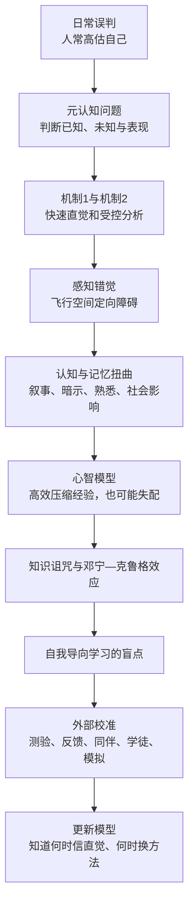
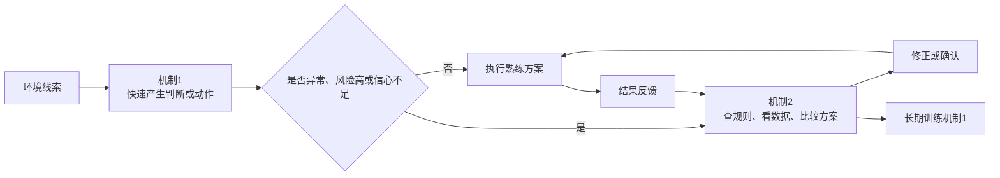

> **原书章节**：第 5 章“打造适合自己的心智模型” 
> **原书作者**：彼得·C.布朗、亨利·L.罗迪格三世、马克·A.麦克丹尼尔 
> **原文来源**：《认知天性：让学习轻而易举的心理学规律》 
> **章节定位**：从“怎样学得牢”转向“怎样知道自己是否真的会”，解释感知、直觉、叙事、记忆和既有模型为何会误导元认知，并给出依靠测验、反馈、同伴与模拟校准判断的方法。 
> **阅读目标**：能识别常见认知与记忆错觉，理解能力不足为何会妨碍自我评估，学会用外部证据更新心智模型，并为自我导向学习建立可靠的监控与纠错系统。

---

## 导读：本章不是教你“选一个喜欢的模型”

学习效率不仅取决于掌握多少知识，还取决于能否准确回答：

- 我到底知道什么、不知道什么？
- 当前问题是否与过去问题相同？
- 这个熟练方案在这里是否适用？
- 我的感觉、记忆和解释是否可信？
- 哪些行为证据说明我真的进步了？

这些问题属于**元认知**。若元认知失准，学习者会把熟悉当精通、把自信当准确、把旧方案套到新问题上，甚至因为能力不足而看不见自己的不足。

本章中心命题是：

> 人的直觉、记忆和心智模型高效但可错；仅靠主观感觉无法可靠判断能力。专业成长要求快思考与慢审查协同，并用延迟测验、真实实践、纠正反馈、同伴比较和高保真模拟等外部标准持续校准。

### 全章论证路线

### 元认知的严格框架

**元认知（metacognition）**是关于自身认知的知识、监控和调节。它至少包含：

1. **元认知知识**：知道任务、策略与自身能力特点；
2. **元认知监控**：判断是否理解、答案信心和进步程度；
3. **元认知控制**：据此分配时间、选择策略、求助或停止。

可以写成闭环：

$$
\text{任务表现}\rightarrow\text{监控判断}\rightarrow\text{策略控制}\rightarrow\text{新表现}.
$$

若监控判断错误，控制也会错误：不会的内容被过早停止，熟悉内容被误判掌握，不适用的模型被继续使用。

### 怎样衡量校准

设学习者对第 $i$ 题答对概率的主观信心为 $c_i\in[0,1]$，实际结果为 $a_i\in\{0,1\}$，一个简单校准误差是：

$$
E_{cal}=\frac{1}{n}\sum_{i=1}^{n}|c_i-a_i|.
$$

其中：

- $n$：题目数量；
- $c_i$：主观信心；
- $a_i$：实际正确性；
- $E_{cal}$ 越小，判断越贴近现实。

公式只示范“信心必须与结果比较”，不是本章实验采用的统一指标。

---

## 开篇案例：为什么人人都会误判

### 1. 重复同一地址叫外卖的抢劫犯

2008 年夏，明尼阿波利斯三名抢劫犯用“大额外卖”引来送餐员，再抢走食物与现金。他们长期使用相同的两部手机和两个地址，未意识到模式会暴露自己。

警察戴维·加曼乔装送餐员，准备了防弹衣、藏在送餐包中的 `.38` 手枪和腰间的 `.45` 自动手枪。三人出现并持枪威胁时，他隔包开了 4 枪，制服主犯。

抢劫犯的问题不只是道德与法律，也包含判断失败：短期成功被解释成方案聪明，没有用警察视角审查可追踪规律。

### 2. 加曼也需要从行动中校准

加曼意识到送餐包太重影响瞄准，下次应有更充分准备。专业人士不是从不误判，而是能依据结果更新模型。

### 3. “达尔文奖”与高于平均幻觉

人看到他人荒唐失败，容易相信自己比普通人高明。原书举律师撞击高楼玻璃、从 22 层坠落的故事，说明显眼的极端错误会强化“只有别人愚蠢”的叙事。

但误判是人类认知系统的普遍副作用，不是少数人的专属缺陷。

### 4. 优秀判断为何是一项可学习技能

它要求：

- 观察自己的想法和行动；
- 识别判断依据；
- 对容易误导自己的线索保持警觉；
- 用结果与外部标准检验；
- 反思下次怎样改进。

难点在于，做出误判时我们通常不知道自己正在误判。纠错系统必须在主观感觉之外建立。

---

## 一、没头脑的机制 1 和爱自省的机制 2

### 1. 双系统是功能模型，不是两块独立脑区

丹尼尔·卡尼曼用两套机制描述思考：

| 维度 | 机制 1 | 机制 2 |
| --- | --- | --- |
| 速度 | 快、瞬发 | 慢、逐步 |
| 意识 | 多为无意识 | 有意识 |
| 方式 | 联想、直觉、模式识别 | 分析、规则、权衡 |
| 资源 | 较少占用主动注意 | 需要注意与工作记忆 |
| 优势 | 快速反应、熟练执行 | 检查、计划、自控、纠错 |
| 风险 | 错觉、偏见、误套模式 | 懒于启动、资源有限，也会推理错误 |

“机制 1/2”是认知功能标签，不表示大脑中存在两个彼此独立的器官，也不是“机制 1 永远坏、机制 2 永远对”。

### 2. 机制 1：经验压缩后的快速反应

球员冲刺时避开围堵，警察在寒冷天气看到司机异常出汗而提高警觉，都依赖快速模式识别。

机制 1 的价值来自：

- 调用多年经验；
- 快速整合感觉和情绪；
- 在来不及逐步推理时行动；
- 让熟练技能自动执行。

在反馈稳定、规律可学、练习充分的领域，专业直觉可以非常可靠。

### 3. 机制 2：审查、计划与控制

机制 2 负责：

- 比较多个选项；
- 检查冲动结论；
- 根据规则计算；
- 预演风险；
- 抑制不适当反应；
- 训练机制 1。

球员心理演练折返、警察练夺枪、神经外科医生预演血管修复，都用有意识练习把正确程序逐步交给机制 1。

### 4. 两套机制怎样协作

专业能力的关键不是消灭直觉，而是知道何时应切换到审查。

### 5. 小孩喊陌生人“爸爸”说明什么

小孩根据有限外观模式快速分类，机制 1 产生答案；母亲用更完整信息纠正，帮助孩子更新类别模型。

错误不是机制 1 无用，而是样本少、特征权重不准，需要反馈训练。

### 6. 哪些条件下应质疑直觉

- 后果严重；
- 环境与训练条件不同；
- 信息模糊或冲突；
- 情绪强烈；
- 样本稀少、反馈延迟；
- 问题涉及概率和统计；
- 仪器与感觉矛盾；
- 旧方案突然失效。

### 7. 中华航空 006 航班：感觉为何压过仪器

#### 7.1 事件起点

1985 年冬，波音 747 从台北飞洛杉矶，11 小时航程已过约 10 小时，飞机在太平洋上空 41000 英尺。4 号引擎失去动力。

操作手册要求转手动控制、下降到 30000 英尺以下再重启。机组却让自动驾驶维持高度并尝试重启。

#### 7.2 失控链条

1. 外侧引擎失效造成推力不对称；
2. 自动驾驶试图维持水平；
3. 空速继续下降，飞机向右倾；
4. 机长主要盯空速和重启，没有综合仪表；
5. 飞入云层后失去地平线；
6. 前庭感觉让机长误以为仍水平；
7. 飞机横倾至少 45 度并俯冲；
8. 机组不相信极端仪表读数，反而认为仪器故障；
9. 直到 11000 英尺冲出云层，才看见地面并恢复水平。

#### 7.3 后果

飞机承受约 5 倍重力应力，机翼永久弯曲，起落架、舱门、液压系统和水平尾翼损坏，最终转降旧金山。

### 8. 空间定向障碍

**空间定向障碍（spatial disorientation）**是飞行员对飞机相对地面的位置、姿态或运动产生错误感知，尤其在缺乏地平线参照时，前庭与身体感觉可能和仪表事实冲突。

原书还列出倾斜错觉、墓地螺旋、黑洞进近等航空错觉。共同原则是：人体感觉系统并非为无视觉参照的复杂飞行设计。

### 9. 为什么专业经验没有自动救场

机长的机制 2 被引擎重启和空速占据，没有执行完整检查流程；机制 1 则提供了错误“水平飞行”感。随着事态恶化，机组为已有解释寻找理由，连正确仪表也被当成故障。

这说明：

- 经验不能消除感知错觉；
- 高压会使注意变窄；
- 标准流程必须练到能在压力中启动；
- 多源仪表交叉检查优于单一线索；
- 机制 2 需要外部清单和团队分工支持。

### 10. 双系统模型的边界

- 快慢是连续维度，不是所有思考都能清楚二分；
- 机制 2 可能为偏好结论寻找借口，而非公正审查；
- 直觉在高质量反馈领域可非常准确；
- 分析过慢也会错过行动窗口；
- 应优化切换规则，而不是永远慢思考。

---

## 二、学习时避免错觉和记忆扭曲

### 1. 动机性推理：先想要结论，再寻找理由

**动机性推理（motivated reasoning）**是偏好、身份、利益或情绪影响证据选择和解释，使人更容易接受想相信的结论、否认不愿面对的信息。

它可能让机制 2 不再审查机制 1，而是成为辩护律师：

$$
\text{偏好结论}\rightarrow\text{选择证据}\rightarrow\text{合理化}.
$$

替代路径应是先规定评价标准，再看证据是否支持结论。

### 2. 人为什么渴望完整叙事

随机与模糊令人不适。人会把分散事件组织成因果故事，以解释自己、他人与世界。

叙事有益：

- 压缩信息；
- 提供意义；
- 帮助记忆；
- 支持预测与行动。

叙事也危险：

- 填补不存在的因果；
- 忽略偶然与基础概率；
- 选择符合身份的细节；
- 让新记忆适应旧世界观。

### 3. 单边电话实验：未完成叙事为何更分心

参与者完成阅读理解和变位词任务，同时听电话录音：

- 一组听到双方完整对话；
- 一组只听到一方。

只听一方更分心，而且后来记住更多无意听到的内容。可能原因是大脑自动推测缺失对话，试图完成叙事。

这项研究说明不确定信息会占用认知资源，但不能证明所有开放问题都有害；适度缺口也可激发生成和好奇。

### 4. 叙事怎样塑造新记忆

人用个人经历、文化和身份解释家庭、职业和人生选择。已经形成的故事会成为框架：新信息若符合就容易吸收，不符合则可能被忽略或改写。

文学、魔术和政治都能利用叙事。一个解释“感觉完全合理”，只能说明与既有框架吻合，不保证事实正确。

### 5. 记忆的可塑性为何既是能力也是风险

每次检索都可能强化、扩展和修改记忆。可塑性让人：

- 把新知识接到旧知；
- 增加检索线索；
- 更新解决方案；
- 调和冲突信息。

同一机制也会：

- 填入错误细节；
- 混淆来源；
- 接受暗示；
- 让自洽叙事替代事实。

记忆不是录像回放，而是基于痕迹、知识、线索和当前目标的重构。

### 6. 主题侵入：海伦·凯勒实验

读到以海伦·凯勒为主人公的文字后，很多人错误记得文中出现“聋、哑、瞎”，尽管原文没有；把名字换成卡罗尔·哈里斯，错误明显减少。

已有知识激活主题，人用主题补全文本空白。这展示**模式一致性侵入**：合理推断后来被误记为原文。

学习时应区分：

- 原文明确陈述；
- 根据背景推断；
- 自己补充的解释。

### 7. 想象膨胀

**想象膨胀（imagination inflation）**是反复或生动想象一件事件后，人对其真实发生的信心上升。

例如被问“是否用手打破过窗户”，问题会诱发想象，之后更可能相信发生过。想象与真实记忆共享感官和情绪特征，来源标签可能丢失。

涉及儿童虐待等高风险询问时，诱导性描述可能制造错误记忆；同时不能因此否认真实受害记忆。可靠判断需要中性访谈、及时记录和独立证据。

### 8. 误导性问题与措辞效应

观看汽车碰撞视频后：

- 问车辆“接触”时速度，平均估计约每小时 `32` 英里；
- 把词改为“撞击”，平均估计约 `41` 英里。

问题措辞改变了记忆重构和估计。两组相差：

$$
41-32=9\text{ 英里/小时}.
$$

这可能使证词跨过每小时 30 英里的法律阈值。审讯和反馈应避免暗含答案。

### 9. 催眠与随意猜测的风险

当人被鼓励“想到什么都说，猜也行”，会生成大量错误信息。若未明确标记来源，后续可能把催眠或猜想中的内容当成真实经历，即使它在实验条件下不可能发生。

这属于**来源监控错误（source-monitoring error）**：记得内容，却忘了它来自亲历、想象、他人描述还是照片。

### 10. 唐纳德·汤姆森案例：来源混淆如何指错人

一名女子遭到袭击前正看汤姆森的电视采访。她向警方描述的面孔来自电视，却被记作攻击者。汤姆森有电视直播形成的确凿不在场证明。

强烈情绪、时间接近和来源相似，使熟悉面孔被错误绑定到犯罪现场。

### 11. 知识诅咒

**知识诅咒（curse of knowledge）**是掌握知识后难以准确模拟新手无知状态，因而低估他人理解所需背景、步骤与时间。

教师认为微积分基础显而易见，却忘了基本模型已经自动化。专家需要借助新手作答、错误类型和同伴解释恢复学生视角。

### 12. 后见之明偏误

**后见之明偏误（hindsight bias）**是结果已知后，高估自己事前预见结果的能力，即“我早知道”。

它会：

- 淡化决策当时的不确定性；
- 让人误判自己的预测能力；
- 事后苛责合理但失败的决定；
- 妨碍从真实预测误差中学习。

解决方法是事前记录预测、概率和依据，再与结果比较。

### 13. 重复、熟悉与虚假真理效应

反复听到一句话会产生处理流畅和熟悉感，人可能把“以前听过”误作“有证据支持”。政治宣传和广告会利用这种**虚假真理效应（illusory truth effect）**。

熟悉是来源线索，不是真实性证明。判断事实应检查来源质量、独立证据和可证伪性。

### 14. 流畅错觉

**流畅错觉（illusion of fluency）**是把材料读起来容易、讲解听起来清楚或答案看起来熟，误判成自己能无提示解释和应用。

反复阅读提高材料处理速度，却可能不提高延迟回忆。验证方法是移开原文，解释、举例、处理反例和新问题。

### 15. 记忆社会传染

**记忆社会传染（social contagion of memory）**是群体回忆时，一个人的错误细节进入其他人的记忆。

社会互动也可能补充真实细节，因此不是一律有害。关键是保留独立回忆，再比较来源，而不是先听最自信者定调。

### 16. 错误共识效应

**错误共识效应（false-consensus effect）**是高估他人与自己拥有相同观点、价值和解释的倾向。

它来自：

- 接触志趣相投的人；
- 把个人经验当普遍经验；
- 难以模拟不同背景；
- 叙事自洽带来的必然感。

教学、团队和政策讨论中，应主动征集不同视角并定义共同事实。

### 17. 闪光灯记忆：自信与准确可以分离

**闪光灯记忆（flashbulb memory）**是重大、情绪化事件发生时，对获知场景形成的生动画面感。

研究追踪约 1500 名美国人对“9·11”的记忆，在事件后一周、一年、三年和十年调查。参与者对个人反应最自信、情绪最强，但这些内容随时间变化最大。

结论是：

$$
\text{主观生动与自信}\not\Rightarrow\text{客观一致与准确}.
$$

媒体重复可稳定事件大轮廓，却可能让个人场景继续重构。

### 18. 错觉清单及其校准方法

| 错觉 | 误导来源 | 校准方法 |
| --- | --- | --- |
| 动机性推理 | 想相信的结论 | 预先规定标准、寻找反证 |
| 叙事偏差 | 厌恶随机与空白 | 区分事实、推断与故事 |
| 想象膨胀 | 想象被误作经历 | 标注来源、独立证据 |
| 误导性问题 | 措辞暗示 | 中性提问、原始记录 |
| 来源监控错误 | 内容与来源分离 | 记录时间、来源、置信度 |
| 知识诅咒 | 忘记新手状态 | 新手测试、分步解释 |
| 后见偏误 | 已知结果 | 事前预测日志 |
| 虚假真理效应 | 重复带来熟悉 | 查证来源和证据 |
| 流畅错觉 | 阅读顺畅 | 延迟、无提示测试 |
| 社会传染 | 他人错误细节 | 先独立回忆再讨论 |
| 错误共识 | 高估观点一致 | 主动采样不同群体 |
| 闪光灯错觉 | 情绪与生动 | 同期记录、外部资料 |

---

## 三、打造适合自己的心智模型

### 1. 心智模型的定义

**心智模型（mental model）**是人对任务中对象、关系、状态变化和行动规则形成的内部结构，用于解释、预测和执行。

警察拦车、近距离夺枪，咖啡师制作 16 盎司无咖啡因饮品，急救接待人员分诊，都是被压缩成整体的感知—行动方案。

### 2. 心智模型为何高效

若每次都从零推导，工作记忆不够。模型将多个步骤组块化：

$$
M=(S,C,A,O),
$$

其中：

- $S$：状态和对象；
- $C$：触发条件与约束；
- $A$：可执行动作；
- $O$：预期结果；
- $M$：整体模型。

熟练者识别状态后，可快速选动作并预测结果。

### 3. “适合自己”不等于“符合偏好”

适合的心智模型应：

- 与任务真实结构一致；
- 能解释和预测；
- 经实践与反馈验证；
- 适应个人已有知识；
- 在边界变化时可替换。

它不是视觉型、听觉型等学习风格标签，也不是只让自己舒服的解释。

### 4. 专家为何更容易遭受知识诅咒

专家模型越复杂，基础步骤越自动化、越退到背景。教授用牛顿定律和动量守恒按深层原理分类，初学者却按滑轮、斜面等表面装置分类。

教授直接讲深层模型时，可能漏掉学生尚未形成的中间步骤。

### 5. 默唱敲拍实验

一人心中默唱熟悉旋律，只敲节拍；另一人猜 25 首候选中的哪首。

- 随机猜中概率：

$$
\frac{1}{25}=4\%.
$$

- 敲拍者预测对方猜中概率约 `50%`；
- 实际猜中仅约 `2.5%`，甚至低于随机基准。

敲拍者脑中同时听到旋律，无法体验“只有孤立节拍”的信息贫乏。这是知识诅咒的直观展示。

### 6. 如何为教学拆开专家模型

1. 让学生先解释自己的分类依据；
2. 找出专家省略的前置步骤；
3. 用反例显示表面相似不可靠；
4. 由同伴解释刚克服的困难；
5. 用概念题而非“听懂了吗”检验；
6. 根据错误重建教学顺序。

### 7. 心智模型的主要风险

- 把相似情境误判成同一情境；
- 自动执行旧程序；
- 忽略低概率异常；
- 用成功经验拒绝新证据；
- 因模型过度压缩而无法向新手解释。

适合自己的模型必须包括“何时不用它”的边界条件。

---

## 四、你无法从不擅长的事情里学到知识

### 1. 标题不是宿命论，而是元认知悖论

这句话不能理解为“不会的人永远学不会”。它指出：评估一项表现往往需要与执行该任务相似的知识；能力不足者可能同时缺少识别错误的标准，因此难以仅靠自我观察改进。

培训和反馈可以打破这个循环，这正是后文实验的结论。

### 2. 脑肿瘤手术：正确模型何时必须被替换

常规肿瘤切除模型是沿边缘缓慢、整齐地下刀，保护神经。但若肿瘤后方出血、颅压危及生命，继续“慢工出细活”会致命。

此时应：

1. 快速切除增生组织；
2. 排出积血、降低压力；
3. 再处理出血。

专家能力不只是熟练执行模型，还要识别异常条件并切换模型。

### 3. 模型选择问题

设模型库为 $\mathcal{M}=\{M_1,\ldots,M_k\}$，当前情境为 $x$，应选择：

$$
M^*=\arg\max_{M_i\in\mathcal{M}}Fit(M_i,x),
$$

其中 $Fit$ 表示模型与情境关键条件的匹配度。误判来自只看到表面相似，忽略决定性差异。

### 4. 邓宁—克鲁格效应

**邓宁—克鲁格效应（Dunning–Kruger effect）**指在某些任务中，表现较差者因为缺少完成和评价任务所需的知识，更难识别自己的错误，因而相对高估表现。

它不是“笨人都狂妄”的人格标签，而是领域特定的能力—监控关系。

### 5. 第一项逻辑实验：低分者怎样评价自己

学生参加逻辑测试并估计表现。平均位于实际后 `12%` 的学生，却认为自己的一般逻辑能力位于前 `68%`。

这同时反映：

- 任务表现低；
- 自我判断误差大；
- 缺少触发调整的主观理由。

### 6. 第二项实验：看到优秀答案仍不会自动校准

学生先测试、估计，再看另一组答案，回看自己的答案并重估。后 25% 学生即使看到更优秀作答，仍不能准确判断，甚至继续高估。

仅暴露于标准不够，学习者还要理解标准为什么更好、自己的错误在哪里。

### 7. 第三项实验：十分钟培训如何改善校准

学生先完成 10 道逻辑题并估计成绩。后 25% 仍高估。随后：

- 半数接受 10 分钟演绎推理有效性培训；
- 半数做无关任务；
- 所有人重新估计。

受训者更准确估计答对数量和相对位置；未受训者仍认为表现很好。

### 8. 为什么能力训练改善了元认知

训练提供了：

- 正确答案的结构；
- 检查推理的规则；
- 识别错误的语言；
- 比较自己与标准的尺度。

执行能力与评价能力共享知识，提升前者也提升后者。

### 9. 为什么人很少获得有效负面反馈

- 他人不愿传达坏消息；
- 反馈模糊，只说“还行”；
- 失败可归因于工具、运气或环境；
- 学习者看不懂别人好在哪里；
- 许多领域没有公开排名或即时结果。

垒球队公开挑人虽能提供直接判断，却可能羞辱和固化身份。反馈应具体、私密、可行动，而不是只贴能力标签。

### 10. 效应的统计与适用边界

- 它描述平均模式，不是所有低分者都高估；
- 高能力者也会误判，可能低估相对位置；
- 测量误差、回归均值和任务难度可能影响观察到的形状；
- 效应通常是领域特定的，逻辑校准不能自动迁移到医学；
- 有明确反馈的领域更容易校准；
- 培训能够改善，因此不是不可改变缺陷。

### 11. 对自我导向学习的挑战

自由学校与“非学校教育”强调兴趣、节奏和自主性。这些价值有助于动机，但“学生最清楚怎样学”隐含一个未必成立的前提：学生能准确判断掌握、选择有效策略并坚持足够久。

研究显示：

- 学生很少自发使用检索；
- 即使知道检索有效，也常坚持不足；
- 抽认卡答对一两次就过早移除；
- 使用最低效方法者往往最严重高估学习。

### 12. 自主与指导不是二选一

高质量自我导向学习需要：

- 学习者选择有意义目标；
- 教师帮助建立评价标准；
- 测验提供行为证据；
- 间隔计划防止过早停止；
- 同伴与教练提供反馈；
- 学习者逐步接管监控。

橄榄球员会自我演练和反思，但仍由教练设计训练和指出缺口。

---

## 五、实践和测验才能暴露学习漏洞

### 1. 核心原则：主观感觉必须对照外部标准

若感知、记忆和模型都可错，校准不能再依靠同一套主观经验循环证明自己。

需要：

$$
\text{主观判断}\xleftrightarrow{\text{比较}}\text{外部结果与标准}.
$$

外部标准可以是延迟测试、实际任务、仪器、评分规则、专家反馈和同行结果。

### 2. 经常测验与检索

测验同时：

- 强化记忆；
- 暴露未知；
- 校准信心；
- 指导后续时间分配；
- 帮助教师发现共同误概念。

低权重、累积式测验比一次高风险考试更适合持续校准。

### 3. 不要答对一两次就停止

短期激活可能让连续回答显得容易。重要内容应跨时间、跨情境继续检索。

停止规则不能只看最近一次正确，而应考虑：

- 是否延迟后仍正确；
- 是否减少提示仍正确；
- 是否能解释；
- 是否能处理变式；
- 错误是否已稳定纠正。

### 4. 用解释检查心智模型

能复述原句不等于理解。合理解释要求：

1. 从记忆提取要点；
2. 用自己的语言组织；
3. 说明为何是要点；
4. 连接主题与旧知；
5. 给例子和边界；
6. 推出新结论。

解释失败能定位模型断点。

### 5. 同伴教学法

埃里克·马祖尔的**同伴教学法（peer instruction）**整合预习、概念测验、生成、讨论和反馈：

1. 课前预习；
2. 教师提出概念题；
3. 学生独立思考一两分钟并作答；
4. 答案不同者结对或分组；
5. 彼此解释并说服；
6. 再次作答；
7. 教师根据分布决定讲解重点。

### 6. 为什么同伴解释有效

- 双方都必须检索和生成；
- 错误模型在冲突中显现；
- 学生更记得刚克服的难点，知识诅咒较弱；
- 教师得到即时诊断；
- 同一问题形成多种表达和线索。

多数人意见并不保证正确，因此最后仍需教师或可靠答案校验。

### 7. 纠正性反馈

**纠正性反馈（corrective feedback）**应说明：

- 哪一步错；
- 为什么错；
- 正确标准是什么；
- 如何再次练习；
- 何时重新测试。

学习者也应主动求反馈，而不是只等待表扬。

### 8. 同伴评估与发病率/致死率会议

医学团队分析不良病例，判断是否已尽力、哪个决策可改进。同行能提供个人看不到的比较标准。

有效会议应：

- 聚焦过程与系统，而非羞辱；
- 使用完整病例资料；
- 区分可控与不可控因素；
- 形成具体改进；
- 后续检查是否执行。

### 9. 学徒制与导师

机长配副驾驶、新警员配老警员、住院医师配主治医师，都是让新手在真实任务中得到实时示范、监督和校准。

导师不是替新手思考，而是逐步提供支架：

$$
\text{示范}\rightarrow\text{共同完成}\rightarrow\text{监督实践}\rightarrow\text{独立执行}.
$$

### 10. 互补专家团队

植入起搏器或神经刺激器时，医生掌握临床与手术，厂商代表熟悉设备、适应证、禁忌和工程支持。互补专长降低单一模型盲区。

边界是团队仍需明确责任、利益冲突和最终临床决策权，不能把厂商建议当成独立医学证据。

### 11. 模拟为何能校准真实能力

高质量模拟应重现：

- 关键感官线索；
- 时间压力；
- 多种可能结果；
- 选择与后果；
- 任务边界；
- 事后复盘。

它允许在不伤害真实对象的情况下暴露模型错误。

### 12. 后备厢伏击模拟

警督凯瑟琳·约翰逊在模拟拦车时，汽车后备厢突然打开，一人持霰弹枪射击。此后她每次真实拦车都会先推紧后备厢。

模拟建立了强线索—动作关联。优点是安全习惯形成；风险是单个生动场景可能让人过度防范低概率威胁，因此仍需统计风险和程序校准。

### 13. 门廊持枪模拟：行动快于反应

模拟中，一名持枪者转身离开，约翰逊犹豫是否能朝背后开枪；对方突然回身射击，她反应不及。她学到“行动通常快于反应”。

场景没有唯一机械答案，还取决于犯罪史、威胁、距离、法律和掩护。训练目的包括观察线索、推演结果、判断武力边界并解释决策。

### 14. 复盘为何不可缺少

模拟结束后，学习者要回答：

- 我看到了什么？
- 当时认为风险是什么？
- 哪个模型被触发？
- 忽略了什么线索？
- 还有哪些合法、安全方案？
- 下次怎样更快识别？

没有复盘，模拟可能只留下情绪和单一路径。

### 15. 夺枪训练的负迁移

训练循环是：夺下队友枪、把枪还回去、再练一次。真实出警中，一名警员夺枪后竟自动把枪递回攻击者，随后才再次夺下。

训练把“归还”错误地纳入动作组块，比赛时照训练执行。这个案例说明高重复会忠实自动化整个序列，包括训练中的人为收尾动作。

### 16. 怎样修正模拟训练

- 真实结束状态必须与现场一致；
- 使用中性教具回收流程，不让学习者把武器还给“攻击者”；
- 随机化情境与结局；
- 加入停止、控制现场和呼叫支援；
- 训练后延迟复测；
- 检查是否出现错误自动化。

### 17. 实地错误为何是最强反馈之一

真实结果能击穿主观叙事，但前提是：

- 人能安全存活；
- 错误可观察；
- 有机会反思；
- 不把失败全归因外界；
- 后续能修改并再练。

高风险领域不能等待真实事故来学习，应把错误前移到模拟器。

### 18. 校准工具总表

| 工具 | 暴露什么 | 主要局限 |
| --- | --- | --- |
| 延迟自测 | 长期保持与未知 | 题型可能过窄 |
| 累积测验 | 跨时间整合 | 设计和评分成本 |
| 自我解释 | 模型关系与断点 | 可能自洽但错误 |
| 同伴教学 | 不同模型与知识诅咒 | 群体可能达成错误共识 |
| 专家反馈 | 与标准的差距 | 可能受权威偏见影响 |
| 同行评估 | 同领域替代方案 | 社会压力影响坦诚 |
| 学徒实践 | 真实技能与情境 | 导师质量决定上限 |
| 互补团队 | 单一专长盲区 | 责任和利益需管理 |
| 高保真模拟 | 压力下的选择与动作 | 无法复制全部现实 |
| 真实结果 | 最终任务有效性 | 错误成本可能过高 |

---

## 六、全章核心概念对照

| 概念 | 要解决的问题 | 严格含义 | 常见误解 |
| --- | --- | --- | --- |
| 元认知 | 怎样知道自己是否会 | 对认知的知识、监控和控制 | 自信或自我感觉 |
| 机制 1 | 怎样快速反应 | 自动、联想、直觉式加工 | 天生错误机制 |
| 机制 2 | 怎样审查与控制 | 有意识、费力的分析加工 | 一启动就保证正确 |
| 空间定向障碍 | 感觉为何误导飞行 | 对姿态和运动的错误感知 | 仪器故障 |
| 动机性推理 | 欲望怎样影响证据 | 为偏好结论选择和解释证据 | 有动机就一定错误 |
| 叙事偏差 | 为什么随机事件被编成故事 | 用连贯故事填补因果和信息空白 | 所有叙事都不可信 |
| 想象膨胀 | 想象为何变成记忆 | 想象提高事件发生信心 | 想象必然制造假记忆 |
| 来源监控错误 | 内容来源为何混淆 | 忘记信息来自亲历、想象或他人 | 内容完全不存在 |
| 知识诅咒 | 专家为何难教新手 | 难以模拟缺少自己知识的状态 | 知识越多越不适合教学 |
| 后见偏误 | 事后为何觉得早知道 | 已知结果后高估事前可预测性 | 真的做过预测 |
| 虚假真理效应 | 重复为何增加可信感 | 熟悉被误用作真实性线索 | 重复内容一定为假 |
| 流畅错觉 | 看懂为何不等于会 | 把处理顺畅误判成掌握 | 清晰教学无价值 |
| 记忆社会传染 | 群体怎样共享错误 | 他人细节进入自己的记忆 | 社会回忆总有害 |
| 错误共识效应 | 为什么高估观点一致 | 把个人观点当普遍观点 | 多数人一定不同意自己 |
| 闪光灯记忆 | 生动为何不保证准确 | 情绪事件的高信心场景记忆 | 完全不会保留事件轮廓 |
| 心智模型 | 怎样高效解释和行动 | 对状态、关系、条件和动作的内部结构 | 永久适用的固定脚本 |
| 邓宁—克鲁格效应 | 低能力为何难自知 | 缺少执行与评价知识导致相对高估 | 低分者都自大 |
| 同伴教学 | 怎样用认知冲突学习 | 独立作答、讨论解释、再答与反馈 | 小组自由聊天 |

---

## 七、作者分析问题的方法

### 1. 从人人都会嘲笑的愚蠢转向普遍机制

抢劫犯和“达尔文奖”先制造距离感，作者随即指出人人都会误判，把问题从人格缺陷转为认知系统限制。

### 2. 用极端事故展示机制代价

006 航班把感知错觉、注意狭窄、规则未启动和故事固着连成因果链，说明元认知错误可压倒专业经验。

### 3. 系统枚举不同错觉来源

作者没有把所有错误归为“记性差”，而是区分感知、动机、叙事、暗示、来源、熟悉、群体和模型失配。

### 4. 展示同一机制的正反两面

记忆可修改使学习和再巩固成为可能，也制造扭曲；心智模型提高效率，也带来知识诅咒和误套方案。

### 5. 用实验把主观自信与客观表现分离

敲拍者预测 50% 而实际 2.5%，低分逻辑学生以为位于前 68%，闪光灯记忆信心高却变化大。每个例子都要求外部测量。

### 6. 给出可训练的出口

十分钟逻辑培训改善校准，说明能力和元认知可以共同提高。本章不是宿命论，而是要求建立反馈系统。

### 7. 用失败模拟检验培训本身

夺枪后归还武器说明模拟也会制造错误模型。训练设计必须接受与学习者同样严格的现实检验。

---

## 八、可执行的元认知校准方案

### 1. 预测—作答—比较

每次测试前记录：

- 预计正确率；
- 最不确定的题；
- 判断依据；
- 采用的模型。

测试后比较实际结果，重点分析高信心错误。

### 2. 建立三栏证据日志

| 事实或原始记录 | 我的解释 | 仍需验证 |
| --- | --- | --- |
| 客观发生了什么 | 我认为为什么 | 哪些证据可反驳 |

这能防止叙事与事实融合。

### 3. 给记忆标注来源

记录信息来自：

- 亲历；
- 同期笔记；
- 他人转述；
- 照片或视频；
- 后来想象；
- 推断。

重要决策优先使用同期记录与独立证据。

### 4. 为心智模型写“适用说明书”

每个模型至少写：

1. 解决什么问题；
2. 触发条件；
3. 必要假设；
4. 关键步骤；
5. 失效信号；
6. 替代模型；
7. 如何验证结果。

### 5. 采用跨时间停止规则

重要内容只有满足以下条件才降低复习频率：

- 不同日期两次以上正确；
- 无完整提示；
- 能解释而非只识别；
- 能处理一个新例子；
- 高信心与高正确一致。

### 6. 组织同伴教学

1. 所有人先独立作答，防止从众；
2. 公布答案分布，不公布正确答案；
3. 不同答案者解释依据；
4. 再次独立作答；
5. 教师给出证据与反馈；
6. 隔一段时间变式复测。

### 7. 设计安全模拟

- 保留真实决策线索；
- 随机化情境；
- 结尾状态与现实一致；
- 不把教具回收动作编入目标程序；
- 允许多种合法方案；
- 每次都复盘；
- 延迟后再测。

### 8. 一个每周校准循环

---

## 九、自测题

### A. 基础概念

1. 元认知的知识、监控和控制分别是什么？
2. 为什么机制 1 不是坏机制，机制 2 也不保证正确？
3. 什么条件下专业直觉更可靠？
4. 空间定向障碍怎样造成 006 航班失控？
5. 动机性推理与普通推理错误有什么区别？
6. 叙事为什么既帮助记忆又可能扭曲事实？
7. 可修改记忆为什么是学习所必需的？
8. 来源监控错误是什么？
9. 知识诅咒与后见偏误有什么不同？
10. 自信为什么不能作为记忆准确性的充分证据？

### B. 实验与数据

11. 单边电话为什么比完整对话更分心？
12. 海伦·凯勒与卡罗尔·哈里斯实验操纵了什么？
13. “接触”与“撞击”问题分别得到什么平均速度？差多少？
14. 唐纳德·汤姆森为何被错误指认？
15. 敲拍者为什么预测 50%，实际却只有 2.5%？
16. 最低 12% 的逻辑测试学生怎样评价自己的能力？
17. 看同伴答案为什么未自动纠正低分者判断？
18. 十分钟逻辑培训为什么能改善成绩估计？
19. “9·11”记忆研究为什么要跨一周、一年、三年和十年追踪？
20. 抽认卡只答对一两次就移除，元认知错在哪里？

### C. 应用与边界

21. 如何判断一个熟练心智模型不再适用？
22. 怎样设计问题避免误导证人或学习者？
23. 群体回忆如何既利用互补细节，又减少社会传染？
24. 教师怎样降低知识诅咒？
25. 为什么邓宁—克鲁格效应不能概括成“笨人都自大”？
26. 自我导向学习需要哪些外部支架？
27. 同伴教学为什么必须先独立作答、最后可靠校验？
28. 夺枪训练为何产生危险负迁移？应怎样修改？
29. 为你的一项技能建立一个外部校准指标。
30. 找出最近一次高信心错误，分析是感知、记忆、叙事、模型选择还是反馈问题。

参考答案要点

1. 元认知知识是了解任务、策略和自身特点；监控是判断理解和表现；控制是据此分配时间与选择行动。
2. 机制 1 提供快速、熟练反应但会受错觉影响；机制 2 能审查却资源有限，也可能为偏好结论合理化。
3. 环境规律稳定、长期高质量练习、反馈及时准确、当前情境与训练相似时。
4. 引擎失效后未按程序下降，自动驾驶与推力不对称造成倾斜；云层遮地平线，前庭感觉误报水平，机组不信仪表并进入俯冲。
5. 动机性推理由想要的结论引导证据选择，而不只是计算或信息不足造成的偶然错误。
6. 叙事压缩信息并提供因果线索，但也会填补随机空白，让新记忆适应旧世界观。
7. 检索后更新、连接新知和再巩固都依赖可塑性；同一可塑性也允许暗示和错误进入。
8. 记得内容却误判其来自亲历、想象、照片或他人描述。
9. 知识诅咒是难以模拟新手无知；后见偏误是结果已知后高估事前预见能力。
10. 生动和信心可由情绪、重复和叙事产生，闪光灯记忆研究显示高信心个人细节仍大量变化。
11. 缺失半边信息迫使听者自动推测并完成叙事，占用注意。
12. 文本大体相同，只改变主人公名字；海伦·凯勒背景知识导致未出现细节侵入记忆。
13. “接触”约 32 英里/小时，“撞击”约 41 英里/小时，相差 9。
14. 她遇袭前在电视上看到汤姆森，来源监控错误把电视面孔绑定到攻击现场。
15. 敲拍者脑中同时听到旋律，误以为节拍包含足够信息；听者只有节奏。
16. 实际位于后 12%，却认为一般逻辑能力位于前 68%。
17. 他们缺少理解优秀答案和识别自身错误所需的评价规则。
18. 培训提供演绎推理检验标准，使学生既更懂任务，也更能评价答案。
19. 为比较记忆信心与跨时间一致性，观察哪些内容最易重构。
20. 连续短期正确被误作长期掌握，没有经过间隔、变式和无提示检验。
21. 检查关键假设、异常信号、结果偏差和情境差异，并准备替代模型。
22. 使用中性、开放措辞，不预设细节；先自由回忆，记录原话，再逐步澄清。
23. 所有人先独立记录，再比较来源；对冲突细节用同期资料和独立证据核对。
24. 观察学生错误、拆中间步骤、用同伴解释、概念测试和新手反馈，而非问“懂了吗”。
25. 效应是领域特定平均关系，受测量因素影响，低分者并非都高估，培训也能改善。
26. 明确标准、延迟测验、间隔计划、教师或教练、同伴反馈和可靠答案。
27. 先独立可防从众并暴露真实模型；最终校验防止小组形成错误共识。
28. 反复“夺枪后归还”把归还编入自动程序；应让训练结尾与真实控制现场一致，并随机化、复盘和延迟复测。
29. 指标应直接反映未来任务，可延迟测量、有明确标准，并能区分知识与执行错误。
30. 答案应说明原判断、客观结果、偏差机制、缺失标准以及下一次校准方法。

---

## 十、全章总结

第五章揭示了一个学习悖论：我们必须依靠感知、记忆、直觉和心智模型理解世界，但这些工具本身也是误判来源。

机制 1 把经验压缩成快速反应，机制 2 负责审查、计划和训练；记忆可塑性让知识更新，也让暗示、想象和叙事进入；心智模型降低认知负担，也会因知识诅咒、边界变化和错误分类而失效。能力不足时，学习者甚至可能缺少识别不足所需的同一套知识。

因此，“打造适合自己的心智模型”不能理解为寻找一个让自己舒服的固定套路。真正适合的模型必须：

1. 与任务真实结构一致；
2. 写清适用条件和失效信号；
3. 经延迟测验与真实实践检验；
4. 接受纠正反馈和同伴比较；
5. 在证据冲突时能够更新或替换。

本章最终把元认知从内省问题变成工程问题：不要只问“我感觉会了吗”，而要建立仪表盘。测验像飞行仪表，同伴与导师提供外部参照，模拟暴露压力下的真实程序，复盘让错误转成模型更新。可靠判断不是从不出错，而是拥有一套能发现偏航、解释原因并及时修正航向的系统。
