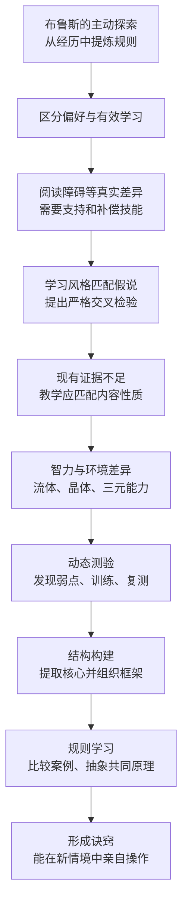

> **原书章节**：第 6 章“选择适合自己的学习风格” 
> **原书作者**：彼得·C.布朗、亨利·L.罗迪格三世、马克·A.麦克丹尼尔 
> **原文来源**：《认知天性：让学习轻而易举的心理学规律》 
> **章节定位**：区分“我喜欢怎样学”和“怎样学真的更有效”，反驳缺乏证据的感官型学习风格匹配，转而讨论真正影响学习的能力差异、环境经验、结构构建和规则抽取。 
> **阅读目标**：不再用“视觉型/听觉型”等标签限制自己，学会用动态测验识别可改善的弱点，用比较、提炼规则和搭建结构，把具体经验转化为可迁移的诀窍。

---

## 导读：章节标题中的“学习风格”有两层含义

日常所说“学习风格”可能指完全不同的东西：

1. **媒介偏好**：喜欢看图、听讲、阅读还是动手；
2. **稳定能力与学习倾向**：语言水平、先备知识、结构构建、规则抽取、坚持和自我调节。

作者承认偏好存在，却反对一个更强的主张：先把学习者分成视觉型、听觉型等类别，再让教学媒介匹配偏好，就能提高学习结果。现有严谨证据不支持这种普遍的“匹配假说”。

本章真正主张的是：

> 人确实存在重要差异，但与其按感官偏好贴标签，不如识别任务所需能力、个人已有资源和当前弱点；通过主动探索、动态测验、结构构建与规则抽取，把不足转化为下一步训练目标。

### 全章论证路线

### 先区分四个概念

| 概念 | 关注问题 | 例子 |
| --- | --- | --- |
| 偏好 | 我更喜欢什么体验 | 喜欢视频而非长文 |
| 能力 | 我目前能完成什么 | 阅读流畅度、空间推理 |
| 教学表征 | 内容本身适合怎样呈现 | 地图宜视觉化，发音需听觉 |
| 学习策略 | 怎样练能长期掌握 | 检索、间隔、穿插、反馈 |

偏好不等于能力，能力不等于固定潜能，教学表征也不应由偏好单独决定。

### “适合自己”的严格含义

适合自己的学习方法应同时满足：

$$
Fit=f(G,C,K,E),
$$

其中：

- $G$：目标任务；
- $C$：内容性质；
- $K$：学习者已有知识与能力；
- $E$：能否通过延迟保持和迁移获得实证效果；
- $Fit$：方法与学习需求的匹配程度。

“我喜欢”可以影响坚持，但不是 $Fit$ 的唯一变量。

---

## 一、主动学习能制造掌控感

### 1. 布鲁斯·亨德利的故事为什么不是普通成功学

布鲁斯·亨德利 1942 年出生于明尼阿波利斯附近，父亲是机械师，母亲是全职主妇。作者关心的不是“白手起家”的传奇，而是他怎样在曲折经历中主动找信息、验证判断、提炼规则并构建投资模型。

### 2. 主动学习的定义

**主动学习（active learning）**不是只指课堂讨论，而是学习者主动设定问题、寻找信息、生成方案、采取行动、获取反馈并调整模型。

其闭环可以写成：

$$
\text{问题}\rightarrow\text{探索}\rightarrow\text{行动}\rightarrow\text{结果}\rightarrow\text{反思}\rightarrow\text{规则更新}.
$$

掌控感来自能影响下一步，而不是假装所有结果都由自己控制。

### 3. 早年交易：从供需中学习

8 岁时，布鲁斯低价买绳球，拆开按段出售；10 岁送报，11 岁当球童；12 岁带 30 美元搭车 255 英里，购买当地禁售的烟花转卖。

这些行为有违法和安全问题，不应模仿。学习意义在于他很早就观察到：

- 地区限制造成供应稀缺；
- 需求与供给差异形成价格空间；
- 信息不对称能带来机会；
- 风险与回报必须一起判断。

### 4. 规则学习与结构构建

作者用两个概念描述布鲁斯的优势：

**规则学习（rule learning）**：从具体经历中提取可重复应用的原则。 
**结构构建（structure building）**：筛选核心信息，组织成有层级、有关系的整体模型。

表面学习者只记得“烟花赚过钱”，规则学习者提取“供应受限而需求存在时，价格会上升”；结构构建者再把供需、资产、风险和清偿顺序放进更大投资模型。

### 5. 自建房：把未知分解并寻找教师

十几岁时，布鲁斯买湖畔土地，用四个夏天建房：

- 借车挖地基；
- 向瓦工之子学砌墙；
- 向木材销售员学搭结构；
- 自装管道和电线；
- 遇到检查不过，再请工会电工重做。

这展示了主动学习的几个动作：

1. 把大任务拆成子任务；
2. 一次解决一个未知；
3. 向具有局部专长的人求教；
4. 用真实结果检验。

边界也很明显：电气工程有安全规范，天真尝试可能致命。主动不等于无监督冒险，高风险技能应接受合格培训与检查。

### 6. 公寓生意：负反馈怎样更新模型

19 岁时，他卖房后买四间公寓，认为四个房间意味着四张月租支票。现实却包括房贷、维修、空置和租户流失。收益不高、管理负担重，他卖掉公寓，20 年不碰房地产。

他从“资产带来现金流”的简单模型，更新为：

$$
\text{净收益}=\text{租金}-\text{融资成本}-\text{维修}-\text{空置}-\text{管理成本}.
$$

失败的价值在于让遗漏变量进入模型。

### 7. 销售与股票：收入结构和风险

布鲁斯成为柯达顶尖销售员后发现，经理算上配车报销仍可能不如销售员收入，职位高不等于经济回报高。

转做股票经纪后，他又认识到：佣金被公司和税收分走，投资自己的资金才可能放大收益；但股票下跌 50% 后必须上涨 100% 才能回本：

$$
100\times(1-50\%)=50,
$$

$$
50\times(1+100\%)=100.
$$

损失与恢复不对称，风险管理不能只看平均涨幅。

### 8. 萨姆·莱普拉：从偶然经验到系统知识

莱普拉介绍一家困境公司的债券，市场价约票面价值的 22%，未付利息也约有 22 个点。若公司走出破产，利息可能覆盖投资成本，还保留债权。

布鲁斯第一次没有买，而是观察结果，再主动请教。主动学习包括暂缓行动、验证导师判断，而不是永远抢先下注。

莱普拉教他：

- 股东与债权人的清偿权不同；
- 债券有优先与非优先顺序；
- 市场恐惧可能把价格压到资产价值以下；
- 若能准确估计资产和债权顺位，可降低风险。

### 9. 困境债券：从规则到心智模型

佛罗里达房地产信托债券买入约 5 美元、卖出约 50 美元。机会消失后，他们又研究濒临破产的铁路公司。

布鲁斯与铁路专家巴尼·唐纳修：

- 实地乘车检查线路；
- 清点并评估设备；
- 查穆迪运输手册；
- 计算引擎、车皮和铁轨价值；
- 梳理 150 年间 15 类债券的清偿顺序；
- 比较资产、负债、价格和优先级。

### 10. 伊利拉克万纳投资为什么不是简单“逆向”

其他人因破产恐惧低价出售，布鲁斯的优势不是胆子大，而是信息和模型更精细：

$$
V_j=\mathbb{E}[Recovery_j\mid A,L,P_j]-Price_j,
$$

其中：

- $V_j$：第 $j$ 类债券的预期价值空间；
- $A$：可变现资产；
- $L$：总负债；
- $P_j$：该债券清偿优先级；
- $Price_j$：市场价格；
- $Recovery_j$：破产处理中可能收回金额。

公式说明要把资产与顺位一起考虑，不是实际投资建议。

布鲁斯后来主持债权人委员会并成为公司董事长，债券面值翻倍，相对最初投入获得约 20 倍回报。

### 11. 模型怎样迁移到新机会

他后来参与凯泽钢铁重组并获新公司 2% 股份，调解银行破产获得约 600% 收益，又在车皮供过于求时买下最后 1000 节车皮，通过已签租约收回约 20% 投资，等待供给转紧后出售。

共同结构是：

- 寻找竞争少、信息复杂的领域；
- 深入调查资产与义务；
- 理解周期和法律顺位；
- 设置下行保护；
- 识别上行触发；
- 只在模型足够清楚时承担风险。

### 12. 掌控感的准确边界

主动学习能增加可控变量：目标、信息、练习、反馈和策略。它不能控制市场、天赋、运气和他人行为。

可靠掌控感应是：

$$
\text{关注可控行动}\neq\text{相信一切结果可控}.
$$

### 13. 自我叙事怎样塑造坚持

人用故事解释自己擅长什么、在意什么和将往哪里走。被球队最后选中的孩子，可以把经历解释成“我没有运动能力”，也可视为“我需要另一种角色或训练”。

叙事影响努力、风险承担和坚持，但不能替代客观能力评估。

### 14. 阅读障碍：真实能力差异不能被偏好理论掩盖

#### 14.1 定义

**发展性阅读障碍（developmental dyslexia）**是一种神经发育差异，常表现为字母—语音映射、解码、拼读和阅读流畅度困难，并非低智力或缺少努力。

原书估计约影响 15% 人口。具体比例取决于诊断标准和语言环境，不能当作全球固定值。

#### 14.2 为什么是不合意困难

阅读者若把全部工作记忆用于逐词辨音，就难以抓住主线。额外努力主要消耗在基础解码，而非强化目标概念，因此不是合意困难。

#### 14.3 干预

阅读障碍通常不能被简单“治愈”，但可通过：

- 音位意识训练；
- 系统建立字母—发音联系；
- 扩充词汇；
- 阅读理解训练；
- 提高流畅度；
- 辅助技术和合理便利；
- 尽早识别与持续支持。

儿童早期大脑可塑性强，及时干预尤其重要。

#### 14.4 社会后果不能误作简单因果

原书指出监狱中阅读障碍比例较高。不能据此说阅读障碍导致犯罪。学校失败、自卑、支持缺失、贫困和社会环境可能共同作用。关联不等于单一因果。

### 15. 阅读障碍与创新优势的谨慎解释

理查德·布兰森等成功人士报告，为补偿阅读困难，他们早早学会看大局、跳出框架、战略行动和风险管理。有研究提示部分阅读障碍者周边视野加工可能更强。

但不能推出：

- 阅读障碍自动带来商业天赋；
- 每位患者都有同样优势；
- 成功案例代表总体；
- 不需要阅读干预。

名人样本存在选择与幸存者偏差。更可靠的结论是：支持、动机和补偿技能能帮助一些人发展独特优势。

### 16. 学习风格匹配假说是什么

常见理论声称：人有视觉、听觉等稳定风格；若教学媒介匹配个人风格，学习结果更好。

必须区分弱命题与强命题：

- 弱命题：人有媒介偏好。几乎无争议；
- 强命题：匹配偏好会产生更高客观学习结果。需要实验支持。

### 17. 为什么学习风格产业容易贴标签

2004 年英国报告梳理 70 多种理论和评估工具，发现理论混乱、矛盾且商业利益明显。学生可能因结果说自己听觉或动觉差，就认定读书、听讲是浪费时间。

标签会造成：

- 回避不偏好的必要练习；
- 把可训练能力当固定属性；
- 降低挑战意愿；
- 让教师为每种标签重复设计内容；
- 把资源从有证据策略转走。

### 18. 常见学习风格模型

#### 18.1 VARK

尼尔·弗莱明按视觉、听觉、阅读/书写和动觉偏好分类。弗莱明本人还认为学习风格包含温度、光线、进食、生物节律和协作等多达 18 个维度。

#### 18.2 邓恩模型

评估环境、情绪、社会、感知、生理和心理 6 个方面。

#### 18.3 其他维度

- 抽象或具体感知；
- 主动探索或反思观察；
- 随机或有条理地安排任务。

#### 18.4 霍尼—曼福德问卷

将员工分为行动者、反思者、理论家和实用主义者，用于管理培训。

模型维度彼此不一致，说明“学习风格”不是一个统一、已确定的科学构念。

### 19. 怎样严格检验匹配假说

2008 年帕什勒、麦克丹尼尔、罗勒和比约克提出必要设计：

1. 用明确方法把学生分为视觉偏好组 $L_V$ 和听觉偏好组 $L_A$；
2. 在每组内部随机分配视觉教学 $I_V$ 或听觉教学 $I_A$；
3. 内容相同；
4. 所有人接受相同、客观的最终测验；
5. 检查是否出现交叉匹配优势。

必须同时满足：

$$
Y(L_V,I_V)>Y(L_V,I_A),
$$

以及

$$
Y(L_A,I_A)>Y(L_A,I_V).
$$

其中 $Y$ 是同一学习结果。只有视觉教学总体更好，或视觉偏好者总体更强，都不能证明匹配。

### 20. 证据结论

研究团队发现：

- 几乎没有研究采用必要交叉设计；
- 少数合格研究不支持匹配，有些结果与理论相反；
- 没有证据证明大规模测评并按偏好修改教学值得投入。

“没有支持证据”不等于逻辑上证明所有未来理论都错，但在新证据出现前，不应把时间和金钱投入未经证实的分类。

### 21. 教学应匹配内容，而非偏好

- 几何与地理需要空间视觉表征；
- 诗歌和发音需要语言与声音；
- 运动技能需要动作实践；
- 复杂概念可用文字、图示、例子和操作互补。

内容性质决定必要信息通道，所有学生都应发展多种表征能力。

---

## 二、你是分析型、创新型，还是实践型思维？

### 1. 智力为什么难以用一个分数概括

智力既要解释推理和学习能力，又要公平反映不同环境中的潜能。单一测验通常只采样有限任务和文化经验。

### 2. 流体智力与晶体智力

**流体智力（fluid intelligence）**：在较少依赖特定知识时推理、发现关系、抽象和在工作记忆中操作信息的能力。

**晶体智力（crystallized intelligence）**：通过学习和经验积累的事实、程序、词汇与心智模型。

二者共同工作：

$$
ProblemSolving=f(G_f,G_c,C),
$$

其中：

- $G_f$：流体推理资源；
- $G_c$：晶体知识；
- $C$：具体情境和任务。

有推理却缺领域知识，会反复从零开始；知识丰富却不会调整，也难解决新问题。

### 3. 传统智商比率

早期智商定义为：

$$
IQ=\frac{\text{心理年龄}}{\text{实际年龄}}\times100.
$$

8 岁儿童达到典型 10 岁水平：

$$
IQ=\frac{10}{8}\times100=125.
$$

现代智商通常使用与同年龄常模比较的离差分数，不再简单采用心理年龄比率。原书例子用于说明历史概念。

### 4. 加德纳的多元智力

霍华德·加德纳提出 8 类智力：

1. 逻辑—数学；
2. 空间；
3. 语言；
4. 肢体动觉；
5. 音乐；
6. 人际交往；
7. 内省；
8. 自然观察。

这套理论的吸引力是承认传统逻辑与语言测验遗漏人的多种能力，并鼓励多样化教学。

### 5. 多元智力与学习风格不是同一件事

- 多元智力试图描述能做什么；
- 学习风格通常描述偏好怎样接收；
- 某人音乐能力强，不等于所有内容都应通过音乐教学；
- 多样教学可增加线索，但不证明匹配标签有效。

加德纳承认多元智力的分类缺乏充分实证，判断更像艺术而非精确测量。应将其作为观察能力多样性的启发框架，不宜当作诊断标签。

### 6. 斯滕伯格的成功智力三元论

罗伯特·斯滕伯格提出：

- **分析型智力**：分析、比较、评价和解决明确问题；
- **创新型智力**：综合知识，应对新颖、不熟悉情境；
- **实践型智力**：理解现实环境要求并有效行动，即“街头智慧”。

三者不是互斥人格类型。同一人可在不同领域和阶段发展不同组合。

### 7. 肯尼亚草药研究

乡村儿童在学校外学习辨认草药、对症和剂量。当地非正式知识表现最好的儿童，在学校正式科目中反而较差。

斯滕伯格的解释不是两种能力天生冲突，而是家庭和环境把学习时间、反馈与价值放在不同领域：

$$
\text{表现}=f(\text{能力},\text{机会},\text{知识},\text{练习},\text{文化价值}).
$$

传统学校测验忽略本地适应能力，只测某一环境培养的知识。

### 8. 两条重要推论

1. 当前正式成绩不能穷尽潜能；若有机会与教学，本地知识强者也可能提高学校表现；
2. 任何测验都是特定时间、特定范围的静态采样，不应把未开发能力解释为固定不足。

### 9. 巴西街头儿童

贫困儿童为街头交易学习算术。脚注中的研究样本很小，约 5 名儿童：

- 熟悉的自然售卖情境中几乎全对；
- 换成不同售卖背景，表现下降；
- 纯抽象数学题约做对三分之一。

孩子不是“不会算”，而是策略与具体情境绑定；学校形式未能激活他们的实践算法。

教学启示是把直观策略显性化，再连接到抽象符号，而不是永远只在熟悉交易中练习。

### 10. 专业赛马投注者

经验丰富投注者用历史收益、速度、骑师表现和赛事条件等构建复杂模型，仅预测最后 0.25 英里速度就综合约 7 个变量。

专家和非专家标准智商相近，但专家预测更好。说明一般 IQ 不能替代领域经验和多变量心智模型。

不能推出 IQ 与所有专业表现无关，只能说该任务中的专长差异主要由领域知识与模型解释。

### 11. 三元智力的证据边界

原书认为三元论有实证支持，部分研究发现教学强调学习者较强的分析、创新或实践能力时，某些成绩更好。

这与视觉/听觉匹配不是同一主张：前者涉及可测能力和任务类型，后者主要依据媒介偏好。即使有支持，三种智力的独立性、测量与普适性仍需持续检验，不应变成新标签。

---

## 三、学不好的领域暴露了你的能力结构

### 1. 弱点是诊断信息，不是终身判决

标准测验常给出“你现在会多少”，容易被解释成“你最多能会多少”。作者主张把弱点视为尚未掌握的知识或技能，从而决定下一步训练。

### 2. 静态测验与动态测验

| 静态测验 | 动态测验 |
| --- | --- |
| 一次测当前水平 | 测验—干预—复测循环 |
| 主要比较人群位置 | 主要寻找可改善缺口 |
| 容易被当作固定能力 | 关注学习速度和响应 |
| 通常给总分 | 追踪分项变化 |

### 3. 动态测验的定义

**动态测验（dynamic testing / dynamic assessment）**是在初始评估后提供有针对性的学习或支架，再次评估变化，用以判断当前缺口、学习潜力和下一步干预。

三个步骤：

1. 测验或经历暴露欠缺；
2. 用反思、检索、间隔和练习改进；
3. 复测，确认进步并发现剩余弱点。

### 4. 怎样量化学习变化

最简单学习增量：

$$
\Delta P=P_{post}-P_{pre},
$$

其中：

- $P_{pre}$：干预前表现；
- $P_{post}$：相同能力上干预后表现；
- $\Delta P$：观察到的进步。

解释时还要控制题目难度、重复熟悉、时间和评分可靠性。只用同一题立即重考，增量可能来自记答案。

### 5. 动态测验为何更接近潜力

它观察的不只是起点，还观察学习者如何响应反馈和练习。两个初始同分者可能有不同学习速度和所需支架。

动态测验仍不能保证潜力无限。遗传、健康、时间、资源和任务约束都会影响上限；它只是比单次快照提供更多发展信息。

### 6. 从挫折中定位能力结构

布鲁斯在出租房和股票上受挫，学到：

- 收益必须扣除全部成本；
- 不要轻信卖方叙事；
- 要问正确问题；
- 深挖资产、义务与风险。

挫折若经过归因和复测，会暴露知识结构缺口；若只归因运气，则不会更新。

### 7. 日常动态测验例子

- 婴儿学走路：尝试、跌倒、调整、再试；
- 作家写短篇：提交同伴、获得反馈、修改、再展示；
- 程序员调试：测试失败、定位假设、修改、回归测试；
- 医生模拟：诊断、反馈、补知识、重新应对变式病例。

### 8. 动态测验与成长取向

它把问题从“我有没有天赋”改成：

- 当前缺什么？
- 哪种练习有效？
- 复测改善多少？
- 还剩什么边界？

这是一种可行动解释，但不否认真实能力差异。

---

## 四、用搭积木的方法构建知识

### 1. 结构构建要解决什么问题

新资料通常包含核心观点、支持细节、例子、噪声和冲突。若全部同等记忆，工作记忆过载，无法形成可调用模型。

### 2. 定义

**结构构建（structure building）**是从新信息中提取核心概念，建立概念间关系，把支持信息接入整体，并抑制无关或冲突信息的过程。

结果可称为心智模型、知识结构或心智图。

### 3. 高级与低级结构构建者

| 高级结构构建者 | 低级结构构建者 |
| --- | --- |
| 快速识别核心 | 难分主次 |
| 抑制无关信息 | 被琐碎细节干扰 |
| 新信息接入已有结构 | 建立多个零散结构 |
| 容易概括和迁移 | 难形成整体模型 |

“高级/低级”描述当前认知倾向，不是价值或固定智力等级。

### 4. 乐高城镇类比

面对一盒零件：

1. 先按类分堆；
2. 铺道路，确定边界和区域；
3. 分类公寓、学校、医院、体育场、商场和消防站；
4. 把各建筑放入总体；
5. 对混入其他套装的零件，判断应丢弃还是作为门廊、路灯等补充。

对应学习：

- 道路与区域是总框架；
- 建筑是核心概念；
- 零件是事实与例子；
- 异套零件是无关或可扩展信息。

### 5. 结构的形式化表达

可以把知识结构表示为图：

$$
G=(V,E,w),
$$

其中：

- $V$：概念节点；
- $E$：概念间关系；
- $w$：关系的重要性或强度；
- $G$：完整结构。

低级构建者的问题不一定是节点少，可能是边混乱、权重不清或噪声节点过多。

### 6. 冗长故事为什么难懂

朋友想讲四岁男孩见到粪肥、以为有小马，却掺入母亲园艺获奖、广播、鳏夫和婚事等细节。听者找不到主线。

故事与教材都需要结构：背景应服务冲突和结论，无关细节会争夺注意。

### 7. 结构构建能力能否训练

原书承认尚不清楚它在多大程度上先天、后天或可迁移。但研究显示，在课本中嵌入问题能让低级结构构建者聚焦核心，表现提高到高级构建者水平。

问题提供外部结构：

- 本段回答什么？
- 核心观点是什么？
- 哪个证据支持？
- 与前文怎样连接？

这说明至少部分困难可通过教学支架改善。

### 8. 反思为什么帮助结构构建

复盘“做对什么、错什么、下次怎样改”，会迫使学习者：

- 从经历中筛选关键事件；
- 建立因果；
- 删除无关细节；
- 形成可复用模型；
- 在下次应用中继续更新。

### 9. 结构构建的边界

- 简化可能删掉关键例外；
- 结构过早固定会拒绝新证据；
- 一套结构不一定适用于另一领域；
- 图画漂亮不等于关系正确；
- 需要反例、测验和实践校验。

---

## 五、有人喜欢看说明书，有人喜欢动手试错

### 1. 规则学习者与案例学习者

**规则学习者（rule learner / abstractor）**倾向从实例中抽取分类或解决问题的基本原则。 
**案例学习者（example / exemplar learner）**倾向记住具体案例，遇到新问题时寻找相似案例。

两种方式都有价值：规则便于迁移，案例保留丰富条件与例外。问题出现在只记案例而无法抽象，或只背规则却不知道真实边界。

### 2. 新情境中的差异

规则学习者：

$$
x\rightarrow r\rightarrow s,
$$

其中 $x$ 是新问题，$r$ 是识别出的规则，$s$ 是解决方案。

案例学习者：

$$
x\rightarrow\operatorname{similar}(e_i)\rightarrow s_i,
$$

其中 $e_i$ 是记忆中的某个案例。若表面相似但结构不同，就会误用。

### 3. 比较案例为什么能帮助抽象

一次只看一个案例，注意容易落在人物、物体和故事表面。并排比较两个案例，稳定共同关系更突出，非本质细节相互抵消。

因此案例学习者可通过：

- 同时比较两个以上案例；
- 明确列相同与不同；
- 解释为何用同一或不同方法；
- 对新案例测试规则。

### 4. 城堡与肿瘤问题

#### 4.1 城堡问题

大军要过多座埋雷桥。大部队集中走一座会引爆地雷，小队可以安全通过，但单个小队力量不足。

#### 4.2 肿瘤问题

高强度射线能摧毁肿瘤，却会损伤沿途健康组织；低强度射线不伤组织，但单束不足以治疗。

#### 4.3 共同结构

1. 需要大力量作用于目标；
2. 单一路径承受大力量会产生副作用；
3. 每条路径只能承受小力量；
4. 将力量分散到不同路径；
5. 在目标处汇聚。

通用规则是：

$$
\sum_{i=1}^{n}f_i\ge F_{target},\qquad f_i<F_{damage}.
$$

其中：

- $f_i$：第 $i$ 条路径的小股力量；
- $F_{target}$：解决目标所需总强度；
- $F_{damage}$：单一路径触发伤害的阈值。

学生单独看任一问题常失败，经提示比较后更容易发现“分散—汇聚”模式，并迁移到新问题。

### 5. 类比迁移为何困难

- 表面对象完全不同；
- 学习者记住故事而非关系；
- 不知道应该寻找类比；
- 缺少多个案例来抽象；
- 目标问题没有明显提醒。

因此“讲过一个例子”通常不足以保证迁移。

### 6. 三岁与五岁孩子讲敲门笑话

三岁孩子缺少笑话结构，问“谁在敲门”时直接说笑点。五岁孩子已记住敲门笑话模板，能先铺垫再双关，但未必理解所有笑话的一般规则：笑点前需要营造预期并反转。

这个例子区分：

- 模仿一个固定结构；
- 抽取跨结构的幽默规则。

### 7. 结构构建与规则学习是否同一能力

两者相关：都涉及筛选核心、抑制表面信息和迁移。但现有研究无法证明高级结构构建者必然也是规则学习者。

应把它们看成待进一步研究的认知倾向，不宜合并成固定人格类型。

### 8. 布鲁斯的鞭炮与车皮为什么同构

表面上一个是儿童转卖烟花，一个是千万级铁路资产；共同规则是供需失衡：

- 鞭炮：当地禁售，供给少、需求在；
- 车皮：税收激励导致先供过于求，停产后将转为不足；
- 两者都需在低价时控制风险，在供给收紧时获取上行。

但车皮模型还加入生产成本、42 000 美元残值、租约、使用寿命和周期。迁移不是照搬旧案例，而是在同一规则上叠加新约束。

### 9. 从知识到诀窍

**诀窍（know-how）**不是零散事实总和，而是能在真实情境中识别条件、选择规则并完成行动的结构化知识。

$$
\text{诀窍}=\text{事实}+\text{规则}+\text{结构}+\text{条件判断}+\text{实践反馈}.
$$

只知道供需定义，不足以决定哪批车皮值得买；还要理解业务、合同、残值和周期。

---

## 六、小结

### 1. 自己把握，但不要只凭感觉

学习需要主动走出门、探索问题和获取信息。主动不等于无教师、无标准；客观测验和导师可以防止掌控感变成过度自信。

### 2. 接受成功智力的概念

不要把自己限制在喜欢的媒介。明确目标需要哪些分析、创新、实践、知识与动作能力，再调动全部资源。

### 3. 把专长视为发展状态

当前测验是起点快照。通过初测、针对训练和复测，把弱点变成学习计划。

### 4. 发展补偿技能

阅读障碍等真实差异需要早期支持、明确训练和辅助工具。补偿不是否认困难，而是寻找另一条实现目标的路径。

### 5. 采用有证据的主动策略

检索、间隔、穿插、生成、反馈和反思跨偏好有效。媒介应匹配内容，练习应匹配目标任务。

### 6. 检查仪表盘

使用小测验、同伴互评、真实实践和延迟结果判断掌握，不能只凭学习时的顺畅感觉。

### 7. 提取原则并搭建结构

案例学习者应并排比较多个案例，问：

- 哪些表面不同？
- 哪些底层关系相同？
- 何时需要不同方法？
- 通用规则能否解决新问题？

### 8. 把复杂目标拆成组成能力

学习新资料时暂停并回答：

- 核心概念是什么？
- 支撑观点和细节是什么？
- 哪些信息无关或冲突？
- 我会怎样测试理解？
- 概念怎样组合成框架？

### 9. 旋梯投资模型

原书把布鲁斯模型比作旋梯：

- 中柱连接当前与目标，即投资机会；
- 平台提供下行保护，如残值和保证租金；
- 阶梯提供上行空间，如供给短缺和接近全新的车况。

没有平台，风险不可控；没有阶梯，上升机会不足。模型把多项事实组织成决策结构。

### 10. 本章结论的适用边界

1. **偏好存在，但不证明匹配教学有效。**
2. **内容决定必要媒介。** 发音、地图和动作不能只按个人喜欢呈现。
3. **真实能力差异需要支持。** 不能用反学习风格否认阅读障碍。
4. **名人案例不能代表所有阅读障碍者。** 要警惕幸存者偏差。
5. **多元智力是启发框架，不是成熟诊断工具。**
6. **三元智力有更多证据，但也不应贴成固定类型。**
7. **动态测验不能保证潜力无限。** 它更准确地测学习响应。
8. **结构简化可能遗漏例外。** 模型需由反例更新。
9. **规则与案例都重要。** 规则支持迁移，案例保存边界。
10. **主动探索受风险约束。** 高风险技能必须接受合格指导。

---

## 七、核心概念对照表

| 概念 | 要解决的问题 | 严格含义 | 常见误解 |
| --- | --- | --- | --- |
| 学习偏好 | 我喜欢怎样接触信息 | 对媒介或活动的主观选择 | 匹配偏好必然学得更好 |
| 学习风格匹配假说 | 教学是否应按偏好分配 | 偏好与教学媒介匹配产生交叉优势 | 视觉教学总体有效 |
| 主动学习 | 学习者如何掌控过程 | 主动设问、行动、反馈和调整 | 独自学习或拒绝教师 |
| 规则学习 | 怎样从案例迁移 | 抽取跨案例稳定原则 | 背诵老师给的规则 |
| 结构构建 | 怎样组织复杂资料 | 筛选核心并建立有关系的整体 | 做漂亮思维导图 |
| 阅读障碍 | 为何阅读基础特别困难 | 影响语音映射和流畅度的神经发育差异 | 低智力或不努力 |
| 流体智力 | 怎样处理新问题 | 推理、抽象、关系发现和工作记忆操作 | 完全不依赖知识 |
| 晶体智力 | 经验怎样累积 | 已有事实、程序与心智模型 | 固定不变的死知识 |
| 多元智力 | 传统 IQ 遗漏什么 | 八类能力的理论框架 | 已获充分实证的独立模块 |
| 成功智力三元论 | 现实成功需要哪些能力 | 分析、创新与实践能力组合 | 三种固定人格类型 |
| 静态测验 | 当前会多少 | 单一时点的表现采样 | 终身潜力上限 |
| 动态测验 | 怎样测学习潜力 | 初测、干预、复测的循环 | 保证任何弱点都能消失 |
| 高级结构构建 | 如何抓住主线 | 有效抑制噪声并组织核心 | 天生聪明标签 |
| 案例学习 | 如何利用具体经验 | 记住实例并按相似性处理新问题 | 完全没有价值 |
| 类比迁移 | 怎样跨表面差异用规则 | 识别不同情境的共同关系结构 | 表面看起来相似 |
| 诀窍 | 知识怎样变成行动 | 规则、结构、条件与实践的整合 | 小技巧或事实清单 |

---

## 八、作者分析问题的方法

### 1. 先承认直觉中正确的部分

作者承认人有偏好和差异，再检验“匹配偏好提高成绩”这一更强主张，避免把反驳变成否认个体差异。

### 2. 用严格交叉设计定义证据

学习风格争论不靠立场，而要求两类学习者在两种教学中出现反向匹配优势。这把模糊主张变成可证伪假设。

### 3. 区分真实障碍与商业标签

阅读障碍有神经与行为证据，需要支持；VARK 标签缺少匹配效果证据。作者没有把所有差异一概抹平。

### 4. 跨文化挑战单一测验

肯尼亚草药、巴西街头算术和赛马投注说明环境决定知识与策略，标准 IQ 不能穷尽适应能力。

### 5. 从静态分类转向发展过程

动态测验不问“你属于哪类”，而问“你哪里不足、怎样训练、训练后改善多少”。

### 6. 用具体类比解释抽象机制

乐高解释结构构建，城堡与肿瘤解释规则迁移，敲门笑话解释结构发展，旋梯解释投资模型。

### 7. 主动保留未知

作者承认尚不清楚结构构建与规则学习是否先天、是否同一能力，也承认部分智力理论证据不足。

---

## 九、可执行学习方案

### 1. 停止用偏好给自己设限

把“我是视觉型，所以听讲无用”改成：

- 这个内容需要哪些表征？
- 我在哪种能力上薄弱？
- 哪种训练有延迟效果证据？
- 怎样把多种表征互相转换？

### 2. 建立动态测验循环

1. 做一组无提示初测；
2. 按错误分为知识、规则、结构和执行问题；
3. 选择对应练习；
4. 隔一段时间用变式复测；
5. 更新下一周期目标。

### 3. 训练结构构建

每读一节，写出：

- 一个中心问题；
- 一个核心结论；
- 三个支持理由；
- 一个反例或边界；
- 与前文的关系。

### 4. 训练规则抽取

对两个案例制作表格：

| 维度 | 案例 A | 案例 B | 抽象规则 |
| --- | --- | --- | --- |
| 目标 |  |  |  |
| 约束 |  |  |  |
| 失败方案 |  |  |  |
| 有效关系 |  |  |  |
| 适用边界 |  |  |  |

再找第三个新案例验证规则。

### 5. 为真实差异安排支持

- 阅读困难：系统语音训练、辅助朗读和更多时间；
- 先备知识不足：补概念与词汇；
- 工作记忆负担高：分步、外部记录、逐渐整合；
- 结构构建弱：嵌入问题与框架；
- 案例依赖强：并排比较和自我解释。

支持的目标是逐步提升独立能力，不是降低最终标准或固化标签。

### 6. 一个月示例

| 周次 | 活动 | 目标 |
| --- | --- | --- |
| 第 1 周 | 初测、识别弱点与先备知识 | 建立基线 |
| 第 2 周 | 两案例比较、提取规则 | 抽象与辨识 |
| 第 3 周 | 搭概念结构、过滤噪声 | 结构构建 |
| 第 4 周 | 新情境复测、分析增量 | 动态评估与迁移 |

---

## 十、自测题

### A. 基础概念

1. 学习偏好、能力、教学表征和学习策略有什么区别？
2. “适合自己”为什么不等于“自己喜欢”？
3. 主动学习怎样产生合理掌控感？
4. 规则学习与结构构建分别解决什么问题？
5. 阅读障碍为什么是不合意困难，而不是低智力？
6. 学习风格匹配假说的强命题是什么？
7. 流体智力与晶体智力怎样共同解决问题？
8. 多元智力与学习风格为何不能混同？
9. 分析型、创新型和实践型能力分别是什么？
10. 静态测验与动态测验有什么区别？

### B. 案例与证据

11. 布鲁斯早年烟花生意提取了什么规则？为什么行为本身不值得模仿？
12. 公寓投资怎样暴露他原模型遗漏的变量？
13. 铁路债券模型需要哪些信息，为什么不是单纯“别人恐惧我就买”？
14. 股票跌 50% 为什么要涨 100% 才回本？
15. 阅读障碍成功人士案例存在哪些推论边界？
16. 严格的视觉/听觉匹配实验应出现什么交叉结果？
17. 为什么“视觉教学让所有人更好”不能证明视觉型匹配？
18. 肯尼亚草药研究怎样说明环境塑造表现？
19. 巴西儿童为何能算交易题，却不会纯数学题？
20. 赛马专家研究说明 IQ 测验遗漏了什么？

### C. 结构、规则与应用

21. 乐高类比中，道路、建筑和混入零件分别对应什么？
22. 嵌入问题为什么能帮助低级结构构建者？
23. 城堡与肿瘤问题的共同规则是什么？
24. 为什么单独学一个案例不容易类比迁移？
25. 三岁与五岁孩子讲敲门笑话说明了哪两层学习？
26. 为什么规则学习者仍需要具体案例？
27. 动态测验怎样避免把弱点当固定能力？
28. 为你当前学习的内容设计“初测—干预—复测”。
29. 比较两个表面不同但结构相同的问题，抽取一条规则。
30. 选择一个自我标签，如“我不擅长听课”，把它改写成可测、可训练的具体缺口。

参考答案要点

1. 偏好是主观喜欢；能力是当前表现；教学表征由内容决定；策略是练习和保持的方法。
2. 喜欢影响动机，但有效性还取决于目标、内容、基础和延迟结果。
3. 学习者主动设问、行动、获取反馈并调整可控部分，同时承认外部不确定性。
4. 规则学习抽取跨案例原则；结构构建筛选核心并组织概念关系。
5. 它是影响语音映射和阅读流畅度的神经发育差异，额外解码负担不强化目标概念，也不代表一般智力低。
6. 按偏好匹配教学后，每类学习者在匹配条件都优于不匹配条件，形成交叉互动。
7. 流体智力处理新关系，晶体智力提供已有事实、程序和模型。
8. 多元智力描述能力类别，学习风格描述接收偏好；两者都不能直接证明媒介匹配效应。
9. 分析型解决和评价问题，创新型应对新颖情境，实践型适应现实并行动。
10. 静态测验采样当前水平；动态测验在训练前后复测，关注学习响应和缺口变化。
11. 供给受限且需求存在会形成价差；违法烟花和危险旅程不可作为学习示范。
12. 他遗漏融资、维修、空置、管理和租户流失，净收益并非租金总额。
13. 需资产、负债、设备状态、法律程序、15 类债券顺位和市场价格；没有调查，逆向只是赌博。
14. 100 跌到 50 是损失 50%，从 50 回到 100 要增加 50，相对 50 是 100%。
15. 名人有幸存者偏差，不能推出患者都有创新优势或无需干预；成功还依赖支持、资源和补偿技能。
16. 视觉偏好者在视觉教学更好，同时听觉偏好者在听觉教学更好，且用同一客观测试。
17. 那只能说明视觉表征适合内容或总体更有效，没有证明效果取决于学习者偏好。
18. 家庭和文化给草药或学校知识不同机会与反馈，当前成绩反映开发程度而非固定潜能。
19. 熟悉情境激活具体分组策略，抽象符号形式要求尚未掌握的学校算法。
20. 领域知识、经验形成的多变量推理和实践模型。
21. 道路是整体框架，建筑是核心概念，混入零件是无关信息或可扩展细节。
22. 问题把注意引向核心、要求归纳并抑制琐碎信息，提供外部结构支架。
23. 将足够总力量分成不致伤的小股，从多条路径在目标处汇聚。
24. 表面细节占据注意，没有对比就难看见稳定关系，也不知道何时调用。
25. 先记住固定笑话结构，再抽取更一般的铺垫与反转规则。
26. 案例展示规则边界、条件和真实变化，防止抽象规则空洞或过度推广。
27. 它测当前缺口，提供针对训练再复测，用变化而非一次分数判断发展可能。
28. 答案应有可比较基线、针对错误的练习、时间间隔和新题复测。
29. 应忽略表面对象，比较目标、约束、因果关系和有效方案，并用第三案例验证。
30. 例如改写为“听完 20 分钟讲解后，我无法无提示复述三个主张”，再训练笔记、分段检索和延迟复测。

---

## 十一、全章总结

第六章表面讨论学习风格，实际完成了三次纠偏。

第一次纠偏是：**偏好不等于效果。** 人当然喜欢不同媒介，但严谨研究需要视觉型和听觉型学习者在匹配条件中分别占优。现有证据没有支持这种普遍交叉效应。更合理的原则是让表征匹配内容，让所有学习者使用经过验证的检索、间隔、穿插和反馈。

第二次纠偏是：**当前分数不等于固定潜能。** 阅读能力、先备知识、环境机会和领域经验会显著影响表现。肯尼亚草药、巴西街头算术和赛马专家都说明，单一标准测验会遗漏实践模型。动态测验通过初测、训练和复测，把弱点变成可行动信息。

第三次纠偏是：**案例堆积不等于诀窍。** 学习者必须从经历中筛选核心，搭建结构，比较案例并抽取规则。布鲁斯的烟花、困境债券和车皮交易表面不同，供需、资产保护和周期却形成逐步丰富的模型。

因此，选择适合自己的学习风格，不是选择一个标签，而是建立一套发展系统：

> 明确目标需要什么能力，用客观测验找到当前缺口，获得必要支持；把多个案例放在一起比较，提取核心规则并组织成结构；在新情境中反复验证，直到知识不再只是“知道”，而成为能够亲手完成事情的诀窍。
