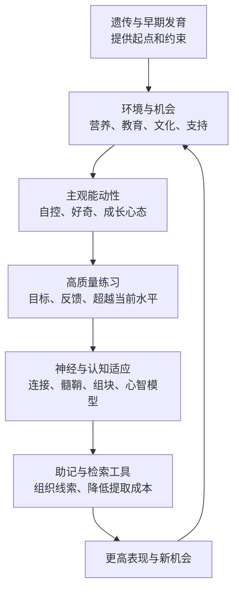

> **原书章节**：第 7 章“终身学习者基本的基本” 
> **原书作者**：彼得·C.布朗、亨利·L.罗迪格三世、马克·A.麦克丹尼尔 
> **原文来源**：《认知天性：让学习轻而易举的心理学规律》 
> **章节定位**：讨论能力能否发展，以及遗传、环境、自控、心态、刻意练习和助记工具怎样共同影响终身学习。 
> **阅读目标**：既不把智力看成出生时写死的常数，也不把“努力”神化；理解可塑性的条件、训练迁移的边界，并建立从动机到专业练习、再到可靠检索的完整发展系统。

---

## 导读：终身学习最基本的不是某个技巧，而是发展系统

本章提出一个贯穿终身学习的问题：

> 人的认知能力在多大程度上由基因限定，又在多大程度上能够通过环境、信念、练习与工具得到发展？

作者的回答既不是“天赋决定一切”，也不是“只要努力就没有上限”，而是一条相互作用链：

1. 基因与早期发育提供起点、倾向与约束；
2. 营养、教育、家庭和文化决定能力得到多少刺激；
3. 好奇心、自律和成长心态影响是否持续投入；
4. 高质量练习让特定神经网络和心智模型逐渐专门化；
5. 助记术为已理解的知识建立稳定检索线索；
6. 测验与真实表现不断校准发展方向。

### 一个谨慎的发展模型

更稳妥的理解是：某个人在某个领域、某个阶段的表现，始终由多种因素共同塑造。

- 遗传倾向和相对稳定的生理条件提供起点；
- 神经系统当下的发展状态决定可塑性的空间；
- 领域知识与心智模型决定能否看见关键线索；
- 练习是否对准薄弱点，决定进步效率；
- 动机、自律和信念影响能否持续投入；
- 家庭、教育、文化与资源环境决定能获得什么机会；
- 睡眠、营养、健康和压力决定学习系统是否稳定运行。

这段话的重点是：表现从来不是单一原因造成的，而且不同领域的成长路径并不相同。

### 本章必须避免的三种过度推论

1. **可塑性不等于无限可塑。** 大脑能变化，不代表任何人经同样训练都能达到同一水平。
2. **局部训练不等于通用智力迁移。** 练熟工作记忆游戏，未必提高所有陌生问题上的推理能力。
3. **成长心态不等于只要相信。** 信念必须转化为策略、练习、反馈和资源支持。

---

## 开篇：棉花糖、记忆运动员与“未开发国度”

### 1. 棉花糖实验：延迟满足怎样进入学习问题

20 世纪 70 年代，沃尔特·米歇尔团队让幼儿单独面对棉花糖：现在吃一块，或等待约 15 分钟后得到两块。600 多名儿童中约三分之一成功等待。

等待的孩子并非只靠硬扛，而是主动改变环境和注意：遮眼、埋头、唱歌、玩手脚，甚至试图睡觉。

### 2. 自控不是固定“意志力值”

**延迟满足（delay of gratification）**是在较小即时奖励与较大延迟奖励之间，抑制即时反应、维持长期目标的能力。

实验显示的关键不是“好孩子天生忍耐”，而是策略：当诱惑被削弱、长期目标在脑中更清晰时，等待成功率就更高。

遮住棉花糖、转移注意和重新想象，都在主动改造决策环境。

### 3. 后续成功关联的边界

原书指出，等待更久的儿童后来学习和工作表现更好。应谨慎解释：

- 这是相关关系，不足以证明单次等待造成终身成功；
- 家庭稳定性、信任、社会经济条件和早期认知能力可能共同影响；
- 后续重复研究提示效应会在控制家庭背景后减弱；
- 自控策略可以学习，因此不能用实验给儿童贴固定标签。

稳定结论是：长期目标、注意调节和可信环境对持续学习重要。

### 4. 詹姆斯·帕特森：助记术最初为何吸引人

威尔士人詹姆斯·帕特森在大学接触助记术后，希望快速记住课程并腾出社交时间。他练名称、日期、页码、纸牌和数字。2006 年参加剑桥记忆比赛，获入门组第一名与 1000 欧元奖金，随后参加世界记忆力锦标赛。

他最初把助记术当作学习捷径，后来才发现：能找回孤立信息，不等于理解概念关系。

### 5. 尼尔森·戴利斯：训练动机与医学承诺要分开

2012 年美国记忆锦标赛冠军尼尔森·戴利斯因祖母患阿尔茨海默病而投身记忆运动，并创办“记忆登顶”基金会。

记忆训练可以提高比赛项目表现、注意和自信，但不能据此证明能预防阿尔茨海默病。疾病风险涉及遗传、年龄、心血管健康等多因素，须依赖医学证据。

### 6. 大脑像未开发国度的比喻

原书用 1846 年基特·卡森横跨近 6000 英里传递消息比喻未开发的大脑：资源存在，但没有城市、道路、铁路和通信网络就难以使用。

对应关系是：

- 先天神经系统像土地与资源；
- 学习像修路和建城市；
- 心智模型像连接功能区域的交通网；
- 检索路径像能快速到达知识的线路。

比喻的边界是大脑不是空白土地。出生时已有高度组织的结构，学习是在生物约束内重组，不是从零任意建设。

---

## 一、双胞胎的认知能力也会天差地别

### 1. 神经可塑性要解决什么问题

**神经可塑性（neuroplasticity）**是神经系统因发育、经验、学习、损伤或环境变化而改变结构、连接或功能的能力。

它解释：

- 学习为何能留下生理变化；
- 脑损伤后为何可能部分恢复；
- 同样基因背景的人为何会发展不同能力；
- 成年后为何仍可获得新技能。

### 2. 神经元、轴突、树突与突触

- **神经元**：接收、处理和传递信号的细胞；
- **轴突**：把信号从细胞体送向其他细胞；
- **树突**：接收其他神经元输入的分支；
- **突触**：神经元之间传递信号的连接处。

原书给出出生时约 1000 亿神经元、一两岁突触数量比成人平均多约 50%、约 16 岁时约 150 万亿连接等数量。此类数字取决于估算方法，应理解为发育规模，而非精确个人常数。

### 3. 突触生成与修剪

出生前后突触大量形成，之后经历选择性稳定与修剪。两种早期解释是：

- 常用连接被保留，不用连接衰退；
- 发育程序主要由基因决定。

现代观点更接近交互：基因安排基本架构与发育时序，活动和经验影响局部连接的强化、修剪与效率。

### 4. 为什么“婴儿期决定一生”站不住

高德曼-拉奇克指出，大量学校学习发生在突触总数相对稳定以后。语言、数学和逻辑仍能发展，说明学习不依赖持续增加突触总数，还可通过连接强度、网络组织、髓鞘与策略改变实现。

因此，突触总量不再快速增加，并不意味着学习能力停止。

### 5. 基因与经验的关系

2011 年综述的谨慎结论是：大脑总体结构很大程度受基因影响，神经网络精细构造可被经验显著塑造。

可以把这一点理解为“基因与环境的交互效应”：同一环境对不同遗传背景的人，作用可能不同；同一遗传倾向在不同环境中，也可能发展出不同表现。

### 6. 感觉替代：大脑学习解读新通道

神经学家保罗·巴赫里塔开发感觉替代设备。

#### 6.1 平衡障碍患者

头盔上的水平传感器把头部方向转换成舌头上 144 个微电极的刺激模式。患者练习把舌头信号解释成姿态信息，训练后不戴设备时维持平衡的时间也逐渐延长。

#### 6.2 失明患者

摄像头把视觉信息转成舌头脉冲。13 岁失明、35 岁接受训练的患者后来能找门、接滚来的球，并与女儿玩石头剪刀布。

### 7. 感觉替代能证明什么

它支持大脑可学习解释非传统感官输入，并在训练中重组功能映射。

不能推出：

- 舌头真正“看见”得与眼睛完全相同；
- 所有失明或前庭损伤都能恢复；
- 短期案例等于长期普遍疗效；
- 大脑区域可以无条件互换。

### 8. 飞行模拟中的触觉替代

把仪表信息转成飞行员胸部触觉，可以在前庭感觉不可靠时提供倾角和高度线索。这与第五章空间定向障碍相呼应：训练为机制 1 增加更可靠的输入。

### 9. 灰质、白质与髓鞘

- **脑灰质**主要包含神经元细胞体、树突等；
- **脑白质**主要包含轴突束；
- **髓鞘**包裹部分轴突，提高信号传导速度和稳定性。

“灰质是细胞体、白质是连接”的说法是教学简化，两者实际组成更复杂。

### 10. 双胞胎与连接组研究

人类连接组计划试图绘制神经连接图谱。同卵与异卵双胞胎比较显示，连接发展受遗传显著影响，同时神经回路在四五十岁甚至六十岁仍会变化。

双胞胎相似性可以估计遗传贡献，却不能把某个人的表现拆成固定百分比“基因 + 环境”。遗传率是群体、环境特定统计量。

### 11. 练习与髓鞘的关系

原书认为特定练习与相关通路髓鞘变化有关，例如钢琴训练可能影响手指控制与音乐加工通路。

边界：

- 关联不一定全部是单向因果；
- 训练前差异与选择效应可能存在；
- 髓鞘只是学习机制之一；
- 局部变化不代表通用智力提高。

### 12. 习惯与“宏”

有意识目标行为与习惯行为会更多依赖不同神经网络。重复的动作与认知序列会被组块化，像计算机宏一样作为一个整体触发。

组块化能降低逐步决策成本，支持打字、演奏、棋局识别和运动反应。若训练序列含错误，错误也会被一并组块化。

### 13. 成人海马神经发生

原书把成人海马体生成新神经元视为终身可塑证据，并讨论联想学习与神经发生的关系。

需注明当前科学边界：成人尤其人类海马神经发生的规模、年龄变化和测量仍存在争议。不能从动物或相关研究直接推导某种学习法会让人类生成确定数量的新神经元。

### 14. 本小节结论

学习对应真实神经变化，但不能把复杂学习压缩成“多长几个突触”。更可靠的理解链条是：有效经验先改变网络活动，再逐步带来结构与功能适应，最后体现在表现上。

这个过程的每一环都受健康、时间、反馈和任务质量影响。

---

## 二、性格、求知欲和家庭条件对学习的影响

### 1. 弗林效应：群体均值为何会变化

**弗林效应（Flynn effect）**是许多工业化国家在 20 世纪观察到的智力测验原始分数跨代上升。

原书称美国平均水平 60 年约提高 18 点。智商测验会重新常模化，让每个时期均值保持 100。因此更准确的说法是：今天平均受测者若按旧常模换算，可能得到更高分，而不是个人在 60 年内自动增加 18 点。

### 2. 弗林效应说明什么

基因库不可能在几十年内发生足以解释大幅均值变化的改变，因此教育、营养、健康、职业复杂性、家庭规模和抽象符号环境等必然发挥作用。

但它不证明所有智力差异都由环境造成，也不保证上升趋势永久持续。

### 3. 环境刺激变化

尼斯贝特举例：现代儿童套餐迷宫可能比早年天才儿童测验迷宫更复杂。电视、图形界面、学校教育和现代职业让人更常练抽象分类、视觉分析与符号操作。

测验表现会随文化训练改变，因此“智力测验测纯天赋”的说法过强。

### 4. 环境乘数

**环境乘数（environmental multiplier）**是微小初始倾向通过自我选择与环境反馈被逐步放大的过程。

例如，一个孩子如果起初好奇心略强，通常会更愿意探索；探索增多会带来知识积累；知识积累又会让新事物更容易理解，随后进一步增强探索行为。

高个儿童更易在篮球中获得机会、反馈和成功，也会扩大初始差异。

### 5. 环境乘数的双向性

正循环可以扩大优势，负循环也会扩大弱点：阅读困难导致回避阅读，词汇增长变慢，未来阅读更难。

干预应尽早打断负循环，但“尽早”不等于成年后无效。

### 6. 社会经济地位

富裕家庭平均拥有更多书籍、营养、稳定时间、教育选择和语言互动，儿童智力测验均值往往更高；被资源较丰富家庭收养的贫困儿童也常有更好表现。

社会经济地位是资源组合，不是儿童能力本身。群体均值不能用于推断具体孩子，也不能把贫困造成的机会差异生物化。

### 7. 2013 年幼儿智力干预综述的标准

综述只纳入：

- 普通而非特殊样本；
- 随机、实验性设计；
- 持续干预，而非一次刺激；
- 不以操纵测验为目标；
- 使用公认标准化智力测验；
- 胎儿期至 5 岁；
- 总样本超过 3.7 万名。

严格纳入标准用于减少选择偏差和“只练测试题”的假提升。

### 8. 营养干预

原书报告：孕妇、哺乳者和婴儿适当补充人体不能自行合成的某些脂肪酸，与儿童智商提高约 3.5～6.5 点相关；铁和 B 族维生素也可能有益，但证据需进一步确认。

不能自行补充或越多越好。营养干预应针对缺乏风险，并遵循医学建议；过量也可能有害。

### 9. 早期教育

贫困儿童的系统性早期教育可提高约 4 点以上，在集体环境中原书报告可达 7 点以上。可能机制包括持续语言互动、同伴刺激、规律活动和专业教师。

富裕家庭儿童增益不明显，可能是家庭环境已提供相似刺激，存在边际收益递减。

### 10. 越早不一定越好

综述没有证据证明年龄越小，干预收益越大。这反驳“错过婴儿窗口就无可挽回”的营销说法。干预时机应匹配能力发展与项目质量。

### 11. 家庭语言与主动阅读

低收入家庭获得图书、谜题和亲子语言培训后，儿童表现改善。3 岁时经常进行专注对话和开放问题有益；4 岁前亲子阅读若让孩子主动复述，比单向朗读更有效。

4 岁后朗读仍可促进语言，只是原书引用研究未发现继续提高 IQ 总分。不要把“未提高 IQ”误解为“阅读无价值”。

### 12. 因果与适用边界

- 测验点数不等于生活结果的固定增量；
- 效果均值不能保证每个儿童相同；
- 项目质量、持续时间和家庭背景会调节；
- 短期 IQ 增益是否长期保持需追踪；
- 不能用环境作用否定遗传，也不能用遗传否定政策与教育价值。

---

## 三、脑力训练可以提升学习自信

### 1. 脑力训练的强主张是什么

商业脑力训练常声称：练特定游戏不仅提高游戏成绩，还能提升一般工作记忆、流体智力和日常认知。

必须区分：

- **任务内学习**：练的游戏变好；
- **近迁移**：相似但未练任务变好；
- **远迁移**：一般推理、学业或生活能力变好。

越远的迁移，证据要求越高。

### 2. 流体智力、晶体智力与工作记忆

- 流体智力：处理陌生关系和新问题；
- 晶体智力：长期积累的知识与模型；
- 工作记忆：当前保持并操作有限信息的系统。

工作记忆与流体智力相关，但相关不意味着训练工作记忆一定提高流体智力。

### 3. 瑞士工作记忆训练

研究使用双重 n-back 类任务：

- 每 3 秒出现数字和不同位置方块；
- 判断当前刺激是否与若干次之前出现的刺激相同；
- 难度会随表现提高而逐步增加；
- 最多训练 19 天；
- 训练前后测流体智力。

35 名参与者训练后成绩提高，训练较久者提升更大。研究最初被解读为流体智力可训练。

### 4. 为什么结果不足以建立强结论

- 样本仅 35 人；
- 背景相似且总体高智商；
- 只有一种训练任务；
- 主动对照与期待效应控制有限；
- 迁移测试可能与训练共享过程；
- 持久性未知；
- 后续研究难以复现。

### 5. 可复现性为何重要

一次显著结果可能来自抽样波动、分析选择或特定样本。独立团队在预先规定条件下重复，才能判断现象是否稳定。

原书提到该研究在 PsychFileDrawer.org 的待复现名单中排名很高，2013 年随机安慰剂对照研究未发现流体智力提高证据。

### 6. 主观改善与客观改善

未观察到客观远迁移，不代表参与者毫无收获。他们可能：

- 更相信自己能坚持；
- 习惯专注；
- 提高特定任务技能；
- 更愿意挑战难题。

但主观自信不能被报告成 IQ 提高。实践中应把“自我感受是否变好”和“未练任务是否客观提升”分开记录、分开评估。

### 7. 大脑不是一般意义上的肌肉

练钢琴主要改变钢琴相关网络，不会自动让人精通数学。神经适应通常具有任务特异性。

可以迁移的是更一般的行为习惯，如规律练习、保持注意和面对困难，但这些仍需在新领域落实。

### 8. 怎样评价脑力训练产品

1. 是否有随机主动对照组？
2. 测试是否与训练任务不同？
3. 是否测远迁移和现实结果？
4. 效果是否独立复现？
5. 是否持续数月？
6. 是否公开失败研究？
7. 收益是否超过运动、睡眠和真实学习的机会成本？

---

## 四、想要终身成长，请像专家一样思考

### 1. 三个认知乘数

原书提出三种放大现有能力的策略：

1. 成长心态；
2. 像专家一样练习；
3. 建立记忆线索。

它们分别作用于愿不愿投入、怎样提高和如何调用。

### 2. 固定心态与成长心态

**固定心态（fixed mindset）**：把智力和能力视为基本不变，失败容易被解释成能力不足。 
**成长心态（growth mindset）**：认为能力可通过有效努力、策略、反馈和帮助发展。

成长心态不是认为人人上限相同，而是认为当前水平不是终局。

### 3. 纽约七年级工作室实验

成绩较低学生都学习记忆与学习技巧，其中：

- 一组主要接受记忆内容；
- 另一组还学习努力学习会改变大脑、形成新连接；
- 返回课堂后，任课教师不知道分组；
- 学年末，成长心态组更主动、进步更大。

教师盲于分组减少了期待差异这一替代解释。

### 4. 归因怎样改变行动

失败后的解释决定下一步。

- 固定归因更容易导向无助和回避。
- 可控归因更容易导向换策略、求助和继续练习。

但不能把所有失败都归因努力不足。任务可能不合理、资源不足或方法错误。

### 5. 成绩目标与学习目标

**成绩/表现目标**关注证明自己聪明、避免显得无能； 
**学习/掌握目标**关注获得新能力、理解错误和提高水平。

前者容易选择保证成功的任务，后者更愿意选难度递增的挑战。

成绩仍可作为反馈，问题在于把维护形象置于学习之上。

### 6. “天生明星”标签的风险

运动员若相信成功证明天赋，训练需要反而像天赋不足的证据，可能回避努力、错误和求助。

赞美身份会把表现变成自我价值测试；赞美具体过程则保留可控改进路径。

### 7. 五年级赞扬实验

学生解题后：

- 一组被赞“聪明”；
- 一组被赞“努力”；
- 再选择同难度题或更难、可学习的题。

多数聪明赞扬组选简单题，努力赞扬组中 90% 选择困难题。

### 8. 汤姆与比尔实验

第一轮汤姆给可解题，比尔给无解题。学生被赞聪明或努力。第二轮两人给的题都可解且相同。

聪明赞扬组因先前在“比尔题”失败形成无助，即使第二轮题与汤姆题相同也难解；努力赞扬组更能继续尝试。

这说明情境标签和失败解释能改变后续策略，不是智力瞬间变化。

### 9. 怎样正确赞扬

不应泛泛说“你真努力”，尤其当策略无效。高质量反馈应指出：

- 哪个策略有效；
- 哪项进步可观察；
- 哪个错误提供信息；
- 下一步应调整什么；
- 何时重新测试。

### 10. 困难经历与人格发展

保罗·图赫指出，资源极少的儿童困难过度，缺少成功机会；资源丰富儿童又可能被“直升机家长”保护，缺少独立克服困难的经历。

最有利的环境不是困难越多，而是挑战可承受、支持可获得、行动由学习者承担。

### 11. 成长心态研究的边界

- 效应大小因环境和实施质量而异；
- 只讲一次口号通常不足；
- 结构性资源不足不能由心态补偿；
- 不应把失败责任全推给学习者；
- 心态干预要与有效教学和练习结合。

---

## 五、学习执行力比学习技巧更重要

### 1. “执行力”包含什么

本章强调的执行力不是服从，而是把长期目标转化为持续行动：

- 自律；
- 勇气；
- 坚持；
- 注意控制；
- 遇错调整；
- 主动求反馈。

技巧只有被长期执行才产生累积效果。

### 2. 刻意练习与普通重复

**普通重复**可能只做熟悉动作。 
**刻意练习（deliberate practice）**在成熟领域中，以明确表现目标为导向，针对当前弱点设计高难任务，专注执行，获得高质量反馈并反复纠正。

可概括为五个要素：目标清晰、任务有拉伸难度、反馈及时、纠错具体、重复有节奏。

### 3. 专家模式库

专家通过长期练习积累大量结构化模式。面对线索时，他们能更快完成模式识别、结果预测和动作选择。

棋手研究走法、音乐家分辨结构、运动员识别局势，都把经验压缩成可快速检索的心智模型。

### 4. 米开朗琪罗案例

西斯廷教堂穹顶 400 多幅真人大小画像经过约 4 年艰苦工作完成。故事用于纠正“杰作看似轻松即源于天赋”的错觉。

个案不能估计练习的普遍因果效应，但能展示成品会隐藏过程成本。

### 5. 教练为什么重要

刻意练习通常不愉快，且学习者受元认知限制。教练帮助：

- 识别当前瓶颈；
- 设计略高于当前水平的任务；
- 防止错误自动化；
- 提供结果与过程反馈；
- 安排恢复和进阶。

缺少成熟训练体系的领域，可尽量采用有目的练习，但不宜把所有努力都称为严格刻意练习。

### 6. 练习改变大脑也可能改变错方向

部分吉他手和钢琴家会出现局灶性手肌张力障碍，过度重复使手指控制表征异常融合。治疗需要困难而精细的再训练，重新分离手指动作。

这证明可塑性是价值中性的：大脑会适应反复要求，错误和过度模式也会被学习。

### 7. 莫扎特为何能听后写谱

原书将超常复现解释为多年领域知识和模式识别，而非通用神秘记忆。专家能把音符组块为和声、节奏和结构，工作记忆处理的是有意义单元。

专家优势通常领域特定，在其他生活领域可能普通。

### 8. “一万小时或十年”的准确边界

原书概述艾利克森研究：专家平均投入约一万小时或十年，顶尖者更多独自刻意练习。

不能理解为：

- 一万小时是充分且必要门槛；
- 任意重复累计即可；
- 所有人达到同一上限；
- 领域、起点、教练和机会无关。

稳健结论是复杂专长通常需要多年高质量、领域特定练习。

### 9. 执行系统怎样建立

1. 定义可测目标；
2. 诊断最薄弱子技能；
3. 设计略超当前水平的练习；
4. 专注执行；
5. 获得纠正反馈；
6. 间隔后复测；
7. 记录趋势并调整；
8. 保证睡眠、恢复和持续性。

---

## 六、掌握几个适合自己的记忆方法

### 1. 助记术解决什么，不解决什么

**助记术（mnemonics）**是给目标信息附加结构、形象、位置、韵律或缩写，从而建立稳定检索线索的方法。

它擅长：

- 顺序；
- 名称与日期；
- 核心提纲；
- 大量已理解信息的检索组织。

它不自动提供：

- 概念理解；
- 因果关系；
- 判断与迁移；
- 信息真实性。

### 2. 首字母缩写

`ROY G BIV` 代表彩虹红、橙、黄、绿、蓝、靛、紫。缩写把多个项目压成一个熟悉语音块。

反向缩写也可用句子帮助记罗马数字顺序。线索必须稳定、唯一，否则会增加干扰。

### 3. 轨迹法与记忆宫殿

**轨迹记忆法（method of loci）**把目标信息的生动形象依次放在熟悉空间的固定位置，检索时在想象中沿路线行走。

步骤：

1. 选熟悉路线；
2. 确定顺序稳定的地点；
3. 把每个要点变成夸张、互动形象；
4. 将形象放到地点；
5. 多次按路线检索；
6. 回到原知识检查理解与顺序。

### 4. 为什么图像和位置有效

图像通常比孤立词更具辨别性；空间路线提供顺序；夸张互动增加独特性。目标信息、形象、地点和路线顺序彼此绑定后，未来检索入口会明显增多。

多重线索增加未来提取入口，但线索搭建本身也需要时间。

### 5. 马克·吐温的草图与历史之路

吐温发现文字提纲片段彼此相似，改用草堆下的蛇、逆风雨伞等草图提示演讲。

他又把农场 817 英尺小路对应英格兰 817 年历史，每英尺代表一年，在王朝边界立桩，用鲸鱼提示 William、母鸡提示 Henry。孩子沿路跑动并回忆君主、年代和在位时间。

这是空间、图像、动作、语音和顺序的组合。

### 6. 字钩法

**字钩法（pegword method）**先记固定数字—韵脚形象，如 1-bun、2-shoe、3-tree，再把新项目挂到固定钩子上。

固定钩子可复用，新联想每次变化。适合短序列；若形象冲突或列表很多，需要清除旧联想并区分情境。

### 7. 歌曲、诗歌与节律

熟悉旋律和格律提供分段、顺序和预测。原书推测蒙古帝国可能以传统长调协助传递军事信息，但具体历史机制仍是推测，不应当作已证实事实。

### 8. 玛丽兹的高级水平考试

心理学 A2 考试需在 3.5 小时、上下两场中写 5 篇短文。学生学 6 个课题，前 5 个各准备 7 个问题，相当于 35 篇文章框架，每篇约 12 段。

玛丽兹用牛津餐馆建宫殿：

- Krispy Kreme 对应攻击行为；
- 星巴克对应精神分裂症疗法；
- Pret-a-Manger 对应节食成败。

人物、动作和谐音串起每篇 12 个核心点。

### 9. 为什么这不只是死记硬背

帕特森先完整教授内容，学生充分理解后才组织助记线索。金成铉的流程是：

1. 汇总幻灯片、阅读和笔记；
2. 提炼核心观点，不逐字抄；
3. 选择宫殿和位置；
4. 添加夸张形象；
5. 考试先花约 10 分钟走宫殿、列提纲；
6. 暂时跳过遗漏点，稍后由线索恢复；
7. 依据结构写完整论证。

助记术保存的是已理解文章的索引，不替代文章内容。

### 10. 帕特森的数字系统

他把 `615392611333517` 分成五组三位数：

- 615：太空飞船；
- 392：堤岸站；
- 611：枪战；
- 333：埃米纳姆；
- 517：神探可伦坡。

每个数字映射辅音发音，再组合成形象。为 `000–999` 建立 1000 个形象用了约一年。

### 11. 记忆广度与专家编码

普通人无策略时短时保留数字常被概括为约 7 个，但现代研究常认为有效容量受任务和组块影响，不能把 7 当固定常数。

帕特森可记 74 位；原书写作时世界纪录为 364 位。高手不是把原始数字逐个塞进更大的通用工作记忆，而是快速编码为熟练形象与路线。

### 12. 助记术的局限

帕特森发现，自己能记山峰名称，却看不到山脉、河谷和生态关系。助记术价值最大的顺序是：先理解，再提炼结构，再建立助记索引，最后用于检索与应用。

若跳过理解，只会得到可背诵但不可推理的信息。

### 13. 动作与音乐也可成为助记线索

飞行员用手部“空手演练”提示仪表操作顺序；第二小提琴手卡伦·金以主旋律提示和声，并通过理解赋格曲多声部结构绘制乐曲地图。

乐队从无谱慢奏开始再加速，外科医生预演手术，也是把动作、节奏和结构变成检索线索。

### 14. 何时可以放下助记线索

反复理解、检索和应用后，知识被组块成心智模型，外部助记桥梁不再必要。

助记术像脚手架：

- 初期帮助定位；
- 中期支持稳定检索；
- 熟练后应让位于直接理解和自动化应用。

---

## 七、小结

### 1. 努力学习会改变能力

学习会改变神经活动、连接效率、知识结构和行为程序。可塑性支持终身发展，但变化通常领域特定且受条件约束。

### 2. 你做什么，会塑造你能做什么

反复行为成为习惯，持续练习形成模型，选择的环境又创造新机会。这是环境乘数和主观能动性的共同作用。

### 3. 精通不要求神秘基因，但需要长期条件

复杂专长通常需要自律、勇气、坚持、时间、反馈、教练与机会。天赋差异仍存在，不能承诺所有人达到相同顶峰。

### 4. 成长心态必须连接有效行动

相信可发展只是起点。应把失败解释为具体知识、策略或练习缺口，并通过测验验证改进。

### 5. 助记术组织已学知识

缩写、位置、图像、韵律和动作都可增加检索线索。它们不替代理解，却能让复杂资料在需要时更可靠地进入意识。

### 6. 终身学习者的最小系统

### 7. 全章适用边界

1. **棉花糖表现不是命运测试。** 家庭信任和环境会影响。
2. **神经可塑不等于无限潜能。** 生物约束仍存在。
3. **神经变化不自动证明教学有效。** 要看延迟行为与迁移。
4. **弗林效应是群体现象。** 不能直接推断个人改变。
5. **幼儿干预平均有效不等于人人同幅提高。**
6. **脑力游戏主要产生近迁移。** 远迁移须独立复现。
7. **成长心态不是万能药。** 必须有资源、策略和反馈。
8. **赞扬努力要具体且诚实。** 无效坚持也要换方法。
9. **一万小时不是神奇门槛。** 质量、领域和机会重要。
10. **助记术不是理解术。** 应在理解之后组织检索。

---

## 八、核心概念对照表

| 概念 | 要解决的问题 | 严格含义 | 常见误解 |
| --- | --- | --- | --- |
| 延迟满足 | 如何坚持长期目标 | 抑制即时奖励以获得较大延迟收益 | 固定人格测试 |
| 神经可塑性 | 学习为何能改变大脑 | 神经结构或功能随经验改变 | 大脑可任意重塑 |
| 突触修剪 | 发育中连接怎样优化 | 部分连接被选择性弱化或消除 | 不用一次就永久消失 |
| 感觉替代 | 损伤通道如何被补偿 | 另一感官通道承载信息供大脑学习解读 | 完全恢复原感觉 |
| 髓鞘形成 | 传导效率如何变化 | 轴突髓鞘随发育和活动改变 | 技能只由髓鞘决定 |
| 环境乘数 | 小差异为何扩大 | 倾向、选择、反馈和机会形成循环 | 环境单独决定一切 |
| 弗林效应 | IQ 均值为何跨代变化 | 测验原始表现的群体代际上升 | 每个人自动增加固定 IQ |
| 任务内学习 | 训练是否让原任务变好 | 练习任务本身提高 | 通用智力提高 |
| 近迁移 | 是否迁移到相似任务 | 共享较多过程的未练任务改善 | 日常能力全面提升 |
| 远迁移 | 是否改善一般能力 | 与训练表面和过程不同的任务改善 | 脑力游戏通常都能做到 |
| 成长心态 | 如何解释能力与失败 | 能力可由有效学习发展 | 只要相信就能成功 |
| 掌握目标 | 努力为了什么 | 以获得能力和理解为目标 | 不关注任何成绩 |
| 刻意练习 | 怎样突破当前水平 | 针对弱点、超出舒适区、有反馈的领域练习 | 任意重复一万小时 |
| 助记术 | 怎样提高检索可靠性 | 用结构、图像、位置或韵律建立线索 | 自动产生理解 |
| 记忆宫殿 | 怎样组织大量有序信息 | 把形象依次绑定熟悉地点 | 只适合背无意义材料 |
| 字钩法 | 怎样记短序列 | 用固定数字—形象钩住新信息 | 钩子无需预先熟练 |
| 组块 | 怎样扩大有效处理量 | 多个元素被编码为一个有意义单元 | 工作记忆物理容量无限增加 |

---

## 九、作者分析问题的方法

### 1. 从行为差异提出发展问题

棉花糖实验和记忆比赛先展示巨大个体差异，再追问差异来自基因、策略、环境还是训练。

### 2. 连接神经、心理与社会三个层次

作者从突触、髓鞘和感觉替代讲到家庭语言、营养和成长心态，避免只用单一层次解释学习。

### 3. 用损伤与专家两个极端观察可塑性

感觉替代说明受损后功能可重组，专家练习说明健康大脑也能高度专门化。

### 4. 区分特定训练与一般迁移

脑力训练研究先给出积极结果，再用小样本、复现失败和主观错觉限制结论。

### 5. 把信念转成可观察选择

成长心态不是抽象口号，而通过是否选难题、失败后是否换策略、是否持续练习来验证。

### 6. 先理解，再谈助记

帕特森教学案例明确把助记放在完整讲解之后，避免把检索便利误作知识本身。

### 7. 保留科学未知

原书承认神经发生、突触去留和智力提升仍有争议。读者应区分已观察现象、机制假说和实践建议。

---

## 十、可执行的终身学习方案

### 1. 管理环境，而不只消耗意志力

- 移开手机和诱惑；
- 预先规定学习时段；
- 把长期奖励可视化；
- 降低开始成本；
- 使用同伴承诺；
- 记录完成而非只记录计划。

### 2. 采用动态目标

将“我要变聪明”改成：

- 30 天后能无提示解释 20 个核心概念；
- 能在 3 个新案例中正确选择模型；
- 延迟一周正确率达到明确标准；
- 找出一个瓶颈并完成针对练习。

### 3. 建立刻意练习循环

1. 测出弱点；
2. 选一个可控子技能；
3. 练在当前能力边缘；
4. 得到反馈；
5. 修正后重复；
6. 间隔复测；
7. 每周更新目标。

### 4. 选择助记工具

| 信息类型 | 合适工具 |
| --- | --- |
| 短顺序 | 首字母、字钩法 |
| 长有序提纲 | 记忆宫殿 |
| 演讲 | 草图、空间路线 |
| 动作流程 | 空手演练、口令 |
| 音乐结构 | 主旋律、和声地图 |
| 概念网络 | 心智模型，不应只靠助记 |

### 5. 验证助记是否服务理解

除了按顺序背出，还应：

- 用自己的话解释；
- 打乱顺序回答；
- 处理反例；
- 在新问题中应用；
- 不依赖宫殿完成核心推理。

### 6. 每月复盘

1. 哪个能力确实提高，证据是什么？
2. 哪些只是练熟原题？
3. 哪项自信没有客观改善？
4. 哪种环境让执行更稳定？
5. 下月该保持、加强还是停止什么？

---

## 十一、自测题

### A. 概念理解

1. 延迟满足为何不应被解释成固定意志力？
2. 神经可塑性与无限可塑有什么区别？
3. 突触总数稳定后为何仍能学习？
4. 感觉替代设备说明了什么，又不能说明什么？
5. 环境乘数怎样放大微小差异？
6. 弗林效应为何反驳纯遗传决定论？
7. 工作记忆训练的任务内学习、近迁移和远迁移如何区分？
8. 固定心态与成长心态怎样改变失败后的行动？
9. 刻意练习与普通重复的核心差异是什么？
10. 助记术为什么不能替代理解？

### B. 数据与证据

11. 棉花糖实验有多少儿童、约多少成功等待？其后续相关有哪些混杂因素？
12. 原书如何描述幼儿突触峰值与成年差异？这些数字应怎样使用？
13. 144 个舌头电极怎样帮助平衡患者？
14. 弗林效应中的“60 年提高 18 点”为什么是群体常模问题？
15. 幼儿干预综述纳入了什么样的研究，总样本约多少？
16. 原书报告脂肪酸和早期教育分别带来多大平均增益？
17. 瑞士脑力训练研究的样本、最长时间与主要缺陷是什么？
18. 赞扬实验中，努力赞扬组有多少选择难题？
19. 为什么“一万小时”不能当作专家门票？
20. 帕特森的 74 位数字与普通约 7 位差异主要来自什么？

### C. 实践与边界

21. 怎样把“坚持学习”转成环境设计而非硬扛？
22. 怎样评价一款声称提高 IQ 的脑力游戏？
23. 为什么成长心态干预必须与有效练习结合？
24. 如何赞扬努力而不鼓励无效坚持？
25. 哪些任务适合记忆宫殿，哪些不适合？
26. 为一组 12 个论点设计记忆宫殿，并说明怎样验证理解。
27. 为一项技能设计普通重复和刻意练习两个版本。
28. 找出自己一个环境乘数的正循环或负循环。
29. 如何区分“我更自信了”与“我的能力提高了”？
30. 设计一个包含动机、练习、反馈、助记和真实应用的 30 天计划。

参考答案要点

1. 儿童使用遮眼、唱歌等策略，表现还受环境可信度和家庭背景影响，自控可训练。
2. 可塑性指在生物约束内改变；无限可塑错误地认为任何结构、上限和领域差异都可消除。
3. 学习还可改变连接强度、网络组织、髓鞘、组块与策略，不依赖持续增加总突触数。
4. 大脑可学习解读舌头承载的姿态或视觉信号；不能证明完全恢复原感觉或人人有效。
5. 初始倾向改变活动选择，活动带来知识、反馈和机会，又反过来强化倾向。
6. 几十年内基因变化不足以解释群体测验大幅上升，环境和文化必然参与。
7. 原游戏变好是任务内，相似任务变好是近迁移，一般推理或生活能力变好是远迁移。
8. 固定归因促使回避和无助；成长归因促使换策略、求助和继续练习。
9. 刻意练习针对当前弱点、超出舒适区、目标明确且有高质量反馈。
10. 它建立检索索引，不自动提供概念关系、真实性、判断和迁移。
11. 600 多名，约三分之一等待；家庭稳定、信任、社会经济和早期能力可能混杂。
12. 一两岁比成人约多 50%，约 16 岁原书估计 150 万亿连接；应用于数量级理解，不作个人精确常数。
13. 头盔把倾斜转换成舌头刺激，患者通过练习学习刺激—姿态映射。
14. 测验会重新常模化到均值 100，18 点指跨代原始表现相对旧常模变化，不是每个人自动增加。
15. 随机、实验、持续干预、普通样本、标准测验，胎儿至 5 岁，总样本超过 3.7 万。
16. 脂肪酸约 3.5～6.5 点，贫困儿童早教 4 点以上，集体环境原书报告 7 点以上。
17. 35 人、最多 19 天；样本小而同质、单一任务、持久性未知、后续复现失败。
18. 90%。
19. 领域、起点、练习质量、反馈、机会和个体差异不同，组平均不是必要充分阈值。
20. 长期训练建立数字—语音—形象和空间组块，不是通用工作记忆物理容量扩大十倍。
21. 移除诱惑、固定时段、降低开始成本、设置承诺和即时反馈。
22. 看随机主动对照、未练测试、远迁移、长期追踪、独立复现和机会成本。
23. 信念只改变选择倾向，知识增长仍需正确策略、反馈、时间与资源。
24. 指出具体有效策略和可观察进步；若努力方向错误，要反馈并换方法。
25. 有序、大量、已理解信息适合；需要即时推理、尚未理解或频繁变化的复杂关系不能只靠宫殿。
26. 答案应有稳定路线、12 个独特位置和形象，并通过解释、乱序提问、新例子验证。
27. 普通版重复熟悉项目；刻意版先诊断瓶颈、设计边缘难度任务、反馈纠错和延迟复测。
28. 答案应说明初始倾向、行为选择、环境反馈和累积结果。
29. 分别记录主观信心与客观延迟、未练任务和真实结果，比较两者变化。
30. 计划应有明确目标、环境安排、针对练习、间隔反馈、助记索引、应用和月底复测。

---

## 十二、全章总结

第七章把终身学习的基础放在一组相互作用的条件上，而不是一个神奇技巧。

基因和发育提供起点，大脑可塑性让经验留下结构与功能变化；家庭、营养、教育和文化决定哪些回路得到使用；好奇心、自控和成长心态决定人是否进入正向环境乘数；刻意练习把投入转化为领域心智模型；助记术则为已理解知识建立可重复使用的检索路线。

最重要的边界同样清楚：局部神经变化不等于通用智力提高，脑力游戏中的进步不等于远迁移，成长心态不等于靠信念跨越所有结构障碍，一万小时也不是自动兑换专家身份的票据。

终身学习者真正需要的是一个持续运行的系统：

> 管理环境以保护长期目标，用成长心态把失败改写成可行动信息；在教练和反馈帮助下针对弱点长期练习；把知识组织成心智模型，并用合适的图像、位置、动作和韵律建立检索线索；最后用延迟测试和真实任务确认，改变的不只是感觉，而是能力。
