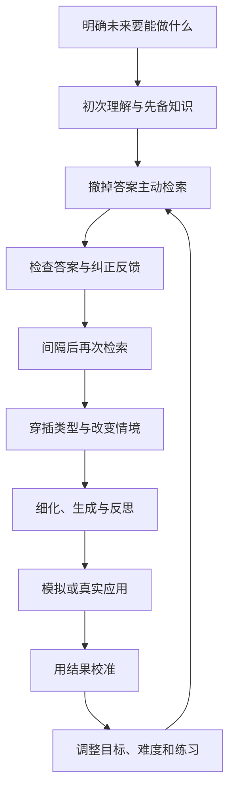
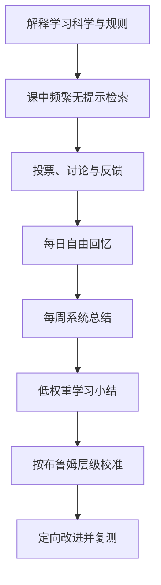

> **原书章节**：第 8 章“写给大家的学习策略” 
> **原书作者**：彼得·C.布朗、亨利·L.罗迪格三世、马克·A.麦克丹尼尔 
> **原文来源**：《认知天性：让学习轻而易举的心理学规律》 
> **章节定位**：全书实践总结。把检索、间隔、穿插、细化、生成、反思、校准和助记，分别转化成学生、职场人士、教师与培训者可以执行的方案。 
> **阅读目标**：不只知道每种策略“有效”，还要会根据任务、时间、风险和组织环境组合策略，建立可以测量、反馈、修正并长期运行的学习系统。

---

## 导读：最后一章解决的是“怎样真正做起来”

前七章已经回答了为什么：

- 检索为何比继续重读更能强化记忆；
- 间隔为何让眼前表现下降却提高长期保持；
- 穿插为何能训练问题辨识与方法选择；
- 生成、细化和反思为何让知识建立更多联系；
- 校准为何必须依靠外部测验而非熟悉感；
- 心态、练习和助记工具怎样影响终身发展。

第八章把这些原则按角色重新组织。基本心理机制相同，但四类人面对的控制变量不同：

| 角色 | 可直接控制的重点 | 主要困难 |
| --- | --- | --- |
| 学生 | 自测、复习时间、题型组合 | 重读习惯、考试压力、资料量大 |
| 职场人士 | 实践、排演、复盘、真实应用 | 缺少课程结构、工作时间碎片化 |
| 教师 | 课程顺序、题目、反馈、学分 | 学生抵触、工作量、公平与透明度 |
| 培训者 | 情境模拟、认证、流程和文化 | 培训集中化、迁移不足、组织激励 |

### 全章行动框架

### 一个统一的学习收益模型

设策略组合为 $s$，总投入时间为 $T$，延迟 $t$ 后的保持为 $R(s,t)$，新情境 $c$ 中的迁移为 $M(s,t,c)$，实施成本为 $C(s,T)$，则学习效率可概念化为：

$$
\eta(s)=\frac{w_rR(s,t)+w_mM(s,t,c)}{C(s,T)}.
$$

其中：

- $w_r$：长期保持的重要性权重；
- $w_m$：迁移与应用的重要性权重；
- $C(s,T)$：时间、注意、设备和组织成本；
- $\eta(s)$：单位成本获得的长期可用学习。

这个公式不是原书的实验公式，而是提醒我们：不要用练习结束时的顺畅度评价策略，也不能忽视现实实施成本。

### 本章的根本原则

> 学习责任最终由学习者承担，但教育与培训机构有责任提供目标、结构、反馈、练习机会和安全环境。

个人责任不能替代制度支持，制度支持也不能替代学习者主动检索和实践。

---

## 一、给学生的学习策略

### 1. 先接受困难的真实含义

重要知识通常不容易掌握。遇到检索失败、错误和生疏，首先说明当前能力与目标之间存在差距，不等于能力固定不足。

有效解释链是：

$$
\text{困难}\rightarrow\text{暴露缺口}\rightarrow\text{反馈与练习}\rightarrow\text{能力变化}.
$$

只有在困难相关、可克服且有反馈时，这条链才成立。超纲、羞辱、极度疲劳和不可控焦虑不是合意困难。

### 2. 三个基础习惯

作者首先要求学生把三种策略变成日常习惯：

1. 从记忆中检索；
2. 有间隔地安排检索；
3. 穿插不同类型的问题。

三者分别训练“取出来”“跨时间取出来”和“先判断该取什么”。

---

### 3. 练习从记忆中检索新知识

#### 3.1 要解决的问题

学生通常盯着课本、笔记和幻灯片中的重点反复阅读。材料一直可见，产生熟悉感，却没有练未来考试和应用要求的无提示提取。

#### 3.2 严格定义

**检索练习（retrieval practice）**是在不查看完整答案时，根据问题或情境线索主动恢复先前学过的知识或技能，并在作答后获得反馈。

#### 3.3 具体步骤

读一小段或听一部分课后，合上资料并回答：

- 核心概念是什么？
- 新术语有哪些？
- 我能否准确下定义？
- 它与已知知识怎样连接？
- 哪个例子支持它？
- 适用条件和反例是什么？

将答案写下来，再查原文。只在心里说“我知道”不够，因为模糊知晓感很容易冒充完整答案。

#### 3.4 可用材料

- 章末问题；
- 自制简答题；
- 抽认卡；
- 模拟考试；
- 白纸复述；
- 向同伴讲解；
- 不看步骤完成操作。

#### 3.5 每周累积自测

不要只测本周材料，也要把此前几周与下周先备知识纳入。累积测验让旧知维持可访问，并迫使新旧内容建立联系。

#### 3.6 检索的双重收益

1. **诊断收益**：发现已知与未知；
2. **学习收益**：提取本身强化记忆与线索。

若第 $i$ 项知识缺口为 $g_i$，有限复习时间 $T$ 可优先分配为：

$$
t_i=T\frac{g_i}{\sum_{j=1}^{n}g_j}.
$$

这只是说明按缺口分配，而非要求机械计时。

#### 3.7 为什么比重读好

重读主要提高材料流畅，检索直接练未来任务：

$$
\text{问题线索}\rightarrow\text{搜索长期记忆}\rightarrow\text{组织答案}.
$$

检索还能阻止遗忘、加强理解并连接先备知识。

#### 3.8 主观感受

检索会比重读慢、错误多、令人沮丧。恰恰因为答案不在眼前，学习者才需要重建。不能用“不舒服”判断无效。

#### 3.9 边界

- 初次完全不懂时，先获得基本解释；
- 错误后必须核对；
- 题型应匹配目标；
- 只背事实不能替代应用练习；
- 高风险技能应在模拟或监督下检索。

---

### 4. 有间隔地安排检索练习

#### 4.1 定义

**间隔练习（spaced practice）**是把同一内容的多次学习或检索分散到不同时间，使相邻练习之间出现部分遗忘。

#### 4.2 怎样定间隔

间隔取决于材料遗忘速度与保持目标：

- 人名—面孔等任意关联：初期数分钟后复习；
- 课本新概念：一两天后；
- 已较稳定知识：数天或一周后；
- 确认掌握的重要知识：隔月维持。

这是起点，不是固定配方。

#### 4.3 动态调整

设第 $k$ 次检索难度为 $d_k$：

- 秒答且能解释：扩大下次间隔；
- 努力后正确：保持或略扩大；
- 答错但反馈后理解：缩短；
- 完全不理解：回到初始教学。

目标是让 $d_k$ 足以触发努力，又不至于持续失败。

#### 4.4 抽认卡的正确用法

- 打乱顺序；
- 完整作答后再翻面；
- 不因连续答对一两次永久移除；
- 熟练卡延长间隔；
- 重要内容每月维持检索。

固定顺序会让上一张卡成为提示，边看答案边判断则只练熟悉。

#### 4.5 为什么间隔有效

部分遗忘迫使学习者从长期记忆重建内容，再巩固会突出要点、接入新知识并强化线索。

#### 4.6 主观感受与错觉

集中练习让表现持续上升，收益立即可见；快速遗忘却发生在训练结束后，不易被观察。间隔正相反：眼前更差，长期更好。

#### 4.7 睡前突击的局限

考试前集中阅读也许帮助次日成绩，但不能保证期末、工作和后续课程仍可用。若只能临时准备，应在考试后补做间隔检索。

---

### 5. 学习时穿插安排不同类型的问题

#### 5.1 定义

**穿插练习（interleaved practice）**是在某一类型全部练完前，交替安排两个或更多相关问题、样本或技能。

段落练习：

$$
A,A,A,B,B,B,C,C,C.
$$

穿插练习：

$$
A,B,C,A,C,B,B,A,C.
$$

#### 5.2 何时开始穿插

先理解一种问题的基本结构和解法，刚形成初步领悟时就把它分散进混合练习，不必等到感觉完全精通。

#### 5.3 穿插训练什么

真实问题要求：

$$
\text{识别类型}\rightarrow\text{选择规则}\rightarrow\text{执行}.
$$

段落题已经暗示类型，主要练执行；穿插还练辨识和选择。

#### 5.4 数学、生物和艺术的应用

- 混合球体、圆锥等体积题；
- 混合相似生物标本；
- 交替辨认不同画家；
- 混合宏观经济情境；
- 运动中随机变化球路。

#### 5.5 为什么感觉突兀

每次切换都要重新加载规则，练习正确率下降。学生会误以为混淆增加就是没有学会，但延迟测试通常显示辨识更好。

#### 5.6 边界

- 内容必须相关；
- 初学者需要最低基础；
- 不可打乱有安全或因果约束的真实执行顺序；
- 随机无关切换只是干扰；
- 必须反馈分类和方法选择错误。

---

### 6. 其他有效方法

#### 6.1 细化

**细化（elaboration）**是用自己的语言解释新知识，并将其与已有知识、因果、例子、图像和实际经验建立有意义联系。

可采用：

- 解释给别人；
- 给出例子与反例；
- 画关系图；
- 用比喻；
- 比较相似概念；
- 说明现实应用。

角动量可连接滑冰运动员收臂旋转，热传导可连接手捧热可可，热辐射可连接冬日阳光。

比喻只能照亮部分结构。例如“电子像行星”有助入门，却不是现代原子模型的完整描述，必须注明边界。

#### 6.2 生成

**生成（generation）**是在看到答案或完整示范前，尝试提出答案、预测、解释或方案。

可在课前：

- 预测章节核心概念；
- 尝试解尚未教过的题；
- 给缺字文本填空；
- 预测实验结果；
- 写下与旧知的可能联系。

尝试会激活旧知、暴露空白，使随后答案得到更深加工。失败后需要反馈。

#### 6.3 反思

**反思（reflection）**是短时间回顾最近课程或经历，检索发生了什么，解释结果，连接旧知，并生成下次改进策略。

问题模板：

- 哪些做得好？
- 哪里可以更好？
- 这与什么旧知识相关？
- 还需学什么？
- 下次采用什么方法？

反思结合检索、细化和生成，不是情绪反刍。

#### 6.4 校准

**校准（calibration）**是把主观判断与客观表现比较，修正自己对已知、未知和能力的估计。

必须真正写答案、完成操作，再核对。看到问题说“会”而跳过，会保留精通错觉。

#### 6.5 助记手段

**助记术（mnemonics）**用缩写、图像、位置、韵律或故事为已学信息建立检索线索。

“Old Elephants Have Musty Skin”可提示五大湖首字母；记忆宫殿可组织文章提纲。助记不是理解本身，必须置于理解之后。

### 7. 五种方法的分工

| 方法 | 主要解决的问题 |
| --- | --- |
| 细化 | 新知识含义和联系不足 |
| 生成 | 学习者过于被动 |
| 反思 | 经历未转化为规则 |
| 校准 | 主观判断不准确 |
| 助记 | 已理解内容难以稳定检索 |

---

### 8. 医学生麦克尔·扬：从 65 分到班级前列

#### 8.1 起点

麦克尔·扬入读佐治亚摄政大学医学院前没有常规医学预科背景。第一场考试只有 `65` 分，每天面对约 `400` 张幻灯片，虽然持续重读，成绩仍垫底。

#### 8.2 为什么寻找研究证据

他不想听人人不同的学习意见，而要实证数据。研究让他意识到，考试要求从记忆提取，学习阶段也必须练提取。

#### 8.3 方法改变

阅读一段后停下来问：

- 刚读了什么？
- 过程先后是什么？
- 我能否不看材料说出来？

再回看核对。检索让速度变慢、产生焦虑，但重读已经证明无效，他选择相信过程并用成绩检验。

#### 8.4 结果

大二时，他从约 `200` 人中的垫底升到前几名，并持续保持。

#### 8.5 如何筛重点

400 张幻灯片不可能同等演练。扬先判断核心机制、系统关系与高价值细节，再用自测校准。筛选必须依据课程目标、教师反馈和知识结构，不能只凭个人喜欢。

#### 8.6 怎样找间隔

学习 10 个酶步骤后尝试回忆，再根据成功程度调整。间隔不是统一时钟，而是“刚有难度但仍可恢复”的动态区间。

#### 8.7 怎样细化

看到“中脑腹侧被盖区释放多巴胺”，他不让词语滑过，而是查定义、位置和解剖图，形成具体空间表征与系统联系。

#### 8.8 边界

这是个人案例，不能单独证明因果；但其变化方向与实验研究一致，且方法、时间和结果形成了可检查链条。

### 9. 蒂莫西·费尔罗斯的学习清单

南加州大学心理学课程中，费尔罗斯在考试、论文、简答和选择题上保持 `90～95` 分。他的做法包括：

1. 课前阅读；
2. 预想考试题及答案；
3. 课上在心里回答，检索预习；
4. 用学习指南定位不会的术语；
5. 理解标粗术语，而非只认字形；
6. 做在线模拟测验；
7. 用自己的方式重组学习指南；
8. 把复杂概念贴床头，不时自测；
9. 把复习与练习分散到整个过程。

这不是某个神奇技巧，而是预习—检索—反馈—重组—间隔的系统。

---

## 二、给职场人士的学习策略

### 1. 职场学习为何更难组织

职场没有固定章节、统一考试和完整教材，问题随机出现，反馈常延迟，错误又可能有现实成本。

因此要主动把工作变成：

$$
\text{任务}\rightarrow\text{尝试}\rightarrow\text{反馈}\rightarrow\text{复盘}\rightarrow\text{再次应用}.
$$

### 2. 演员纳撒尼尔·富勒：检索台词与角色

#### 2.1 规划与组织

富勒先通读剧本、标出自己的台词、估计每天背诵量并尽早开始。标记用于定位和计划，不是为了反复看彩色重点。

#### 2.2 白纸遮挡法

他用白纸盖住台词，只露出对手台词作为线索；大声说出自己的台词，检查准确率，错了就重新遮住再检索。

这同时练：

- 说什么；
- 什么时候说；
- 由对手情绪和语言触发自己的反应。

#### 2.3 信任遗忘与间隔

收效下降时，他停止，当天休息，第二天在部分遗忘后重建。朋友害怕忘，他把忘记视为下一次强化机会。

#### 2.4 倒序累积

背完整剧后，从最不熟的末幕开始，再加前一幕，一直向前扩展。这样避免第一幕因每次都从头开始而过度练习。

#### 2.5 录音检索

他录下其他角色台词，播放线索后暂停，自己说台词；有疑问查剧本，再播放复测。数字录音机把排练变成便携模拟。

#### 2.6 走位与情境模拟

在导演确定走位前，他把客厅想成舞台并生成可能动作；观察正式演员排练后，再回家调整模型。

#### 2.7 细化角色

他分析词语韵味、修辞、口吻、情感、面部表情、动机和舞台动作。台词因此进入角色心智模型，而不是孤立字串。

### 3. 富勒方法中的策略组合

| 原理 | 做法 |
| --- | --- |
| 检索 | 遮住台词、听线索后背诵 |
| 间隔 | 收效下降时停到第二天 |
| 穿插 | 新旧幕、台词与走位交替 |
| 生成 | 构建角色动机和早期走位 |
| 细化 | 语言、情绪、动作与剧情联系 |
| 模拟 | 客厅舞台、录音对手戏 |

### 4. 作家约翰·麦克菲：用初稿突破生成障碍

82 岁的麦克菲面对写作瓶颈，会给母亲写信，抱怨不知道如何写熊，同时描述熊的强壮、懒惰和每天睡 15 小时。随后删掉“亲爱的妈妈”和抱怨，留下关于熊的文字，初稿就出现了。

### 5. 为什么“糟糕初稿”是学习工具

没有初稿，意识没有可修改对象。初稿让模糊想法外化：

$$
\text{模糊知识}\xrightarrow{\text{生成初稿}}\text{可检查表征}
\xrightarrow{\text{反馈与修改}}\text{更清晰模型}.
$$

开车、休息和睡眠时，巩固仍可能重组材料。生成不是要求第一稿正确，而是让改进开始。

### 6. 反思：从经验中获得第二次学习

神经外科医生埃伯索尔德、教练杜利、警察加曼和迫降哈德孙河的萨伦伯格都通过反思：

- 重建发生了什么；
- 比较结果与预期；
- 观察他人案例；
- 想象替代行动；
- 心理演练下一次。

反思不只是评价过去，而是生成未来方案。

### 7. 钢琴家塞尔玛·亨特：细化与终身适应

88 岁的亨特仍学习莫扎特、福莱、拉赫玛尼诺夫和博尔科姆。她用：

- 手指弹奏的动作；
- 耳朵听到的声音；
- 眼睛看到的乐谱；
- 口头提示和视觉注释；
- 离开钢琴后的整体思考；
- 与弦乐伙伴共同排练。

年龄增长后，她需要热身、放慢困难段落，并更有意识地记忆。成熟学习者不是坚持年轻时的方法，而是根据身体和认知变化调整。

### 8. 暂停一周后指法为何可能更自然

多年经验形成的模式库，在初次努力后经过时间巩固，可能产生更流畅方案。不能把所有“灵光一现”归因潜意识，但休息确实可避免过度固定错误解法，并给重组留下时间。

### 9. 职场策略小结

1. 把真实任务拆成可检索片段；
2. 先生成粗糙方案；
3. 用录音、模拟、草稿或角色扮演外化；
4. 获取同伴或结果反馈；
5. 间隔后重做；
6. 反思规则和边界；
7. 逐渐整合为心智模型。

---

## 三、给教师的学习策略

### 1. 教师的双重责任

教师不仅教授学科，还应教授如何学习。学生若继续用重读、集中和填鸭，清晰讲解也可能只产生熟悉感。

### 2. 向学生解释学习过程

教师应说明：

- 某些困难促进深层学习；
- 轻松表现可能短暂；
- 有效努力会改变能力；
- 先尝试再看答案通常更好；
- 精通需要超越当前水平；
- 挫折是策略调整信息。

透明解释能防止学生把穿插和检索带来的错误率误判为教师讲得差。

### 3. 教学生如何学习

教师应示范而非只要求“多复习”：

- 怎样把标题改成问题；
- 怎样合书自测；
- 怎样安排间隔；
- 怎样混合题型；
- 怎样核对反馈；
- 怎样记录错误并复测。

### 4. 在课堂创造合意困难

可采用：

- 经常性低权重测验；
- 课前生成题；
- 可下载模拟考试；
- 反思练习；
- 以写促学；
- 累积旧知识；
- 间隔、穿插和变式问题。

### 5. 为什么模拟练习要有少量学分

完全不计分的练习容易被忙碌学生忽略；低权重学分提供执行激励，又不让一次错误决定成绩。

可概念化为：

$$
\text{参与概率}=f(\text{价值},\text{成本},\text{明确性},\text{权重}).
$$

权重过低可能无人做，过高又会增加焦虑与作弊动机。

### 6. 保证透明度

开课时说明：

- 为什么测验频繁；
- 为什么不能立刻翻笔记；
- 为什么问题会混合旧内容；
- 为什么练习时可能感觉更差；
- 如何计算成绩；
- 错误怎样用于改进。

透明度不是降低困难，而是给困难合理解释和可预测边界。

---

### 7. 玛丽·帕·文德罗斯的生理学课堂

#### 7.1 布鲁姆分类学

原书采用六层：

1. 知识；
2. 理解；
3. 应用；
4. 分析；
5. 综合；
6. 评价。

现代修订版常用“记忆、理解、应用、分析、评价、创造”，顺序略有调整。本章应按原书历史版本理解。

#### 7.2 教授测验效应

文德罗斯先解释重读错觉和检索原理。面对四色标记的课本，她肯定学生投入，再指出下一分钟更应合书作答。

#### 7.3 每五分钟提问

课堂大约每隔 5 分钟提出一个问题。学生想翻笔记时，她要求停下，独立想 1 分钟。

森林道路比喻说明：主动走向记忆才建立路径，直接看笔记相当于别人带路。

#### 7.4 投票与异质讨论

学生在白板写三个答案，用手指数投票；随后找答案不同者交流。流程保留独立判断，再利用认知冲突，最后由证据校验。

#### 7.5 测验小组

传统学习小组可能一人讲、其他人听；测验小组禁止翻书，成员共同解决问题，每人贡献部分知识。

一名学生到白板解释，其他人通过提问帮助其推出概念。所有人都在检索和生成。

#### 7.6 每日十分钟自由回忆

每天结束，用白纸写 `10` 分钟课程内容。即使两分钟后卡住，也继续搜索。结束后查笔记：

- 已记住什么；
- 遗漏什么；
- 下一堂课要问什么；
- 哪些关系尚不清楚。

自由回忆同时支持复习与前瞻性学习。

#### 7.7 每周总结表

周一提交前一周系统图，用核心概念、箭头、图形和对话框表示生理系统关系。学生可交流，但最终作品自己完成。

总结表不是装饰，而应表达因果：

$$
A\rightarrow B\rightarrow C,\qquad C\dashv A.
$$

箭头、抑制和反馈关系必须能解释。

#### 7.8 学习小结

周五用五六句话回答低分值问题，如胃肠道与呼吸系统的相似点，或考试后下次怎样改进。

它结合检索、反思、跨系统比较和科学写作。教师通读并评论，使学生知道反馈闭环真实存在。

#### 7.9 用布鲁姆层级校准

同一问题提供不同层次答案标准。学生拿回测验后判断自己的回答处于哪层，并说明怎样提升。

层级不是给学生贴永久标签，而是评价当前回答执行了哪些认知操作。

#### 7.10 缩小成绩差距

传统“低结构班”依赖高权重中期和期末考试；“高结构班”每天、每周低权重练分析，并教授成长心态。

高结构班基础生物不及格率显著下降，预备教育不同学生的差距缩小，答案也达到更高认知层次。把练习计入少量学分的班级优于不计分班级。

这说明结构化主动学习尤其帮助此前未学过有效策略的学生。不能把成绩差距仅解释为动机不足。

### 8. 文德罗斯方法的完整结构

---

### 9. 西点军校的塞耶法

#### 9.1 基本结构

塞耶法有约 200 年历史：

- 每门课有具体学习目标；
- 学生课前负责准备；
- 每次班会有小测验和复述；
- 课堂主要解决问题，而非长讲座。

#### 9.2 “不要读完所有文字”的准确含义

迈克尔·马修斯不是提倡走马观花，而是让学生带着目标和问题读取关键证据，避免在重负荷中平均分配注意。

#### 9.3 上黑板

学生小组在四面黑板前解高于日常测验难度的问题，整合阅读概念并应用；一人解释，其他人评论。

这结合检索、生成、同伴教学与公开解释。

#### 9.4 “找方位”

野外导航要登高找地标、用指南针校准、返回林中行进并不断复查。小测验就是学习导航仪：当前路线是否朝向目标？

#### 9.5 凯莉·亨科勒

准备医学院入学考试时，她为阅读、化学、生理学和写作各设核心目标，每 `3` 天做一次模拟测验，分析错误并调整。她关注问题对应的大主题，而非试图平均记住一切。

### 10. 结构化课程为何帮助基础薄弱学生

高要求、目标明确、每日参与和及时反馈，把原本依赖家庭背景获得的“隐性学习文化”显性化。结构不是剥夺自主，而是先提供支架，再培养自我调节。

---

### 11. 凯瑟琳·麦克德莫特的每日一测

#### 11.1 课程设计

- `25` 名学生；
- 每周 2 次课；
- 持续 `14` 周；
- 每堂课末 4 道题；
- 可无理由错过 4 次，不补考；
- 小测验占总学分 `20%`；
- 两次期中与一次期末；
- 后两次考试累积。

#### 11.2 为什么规则必须明确

一开始学生会为缺勤和补考争论。固定“可缺四次、无补考”降低教师处理成本，也保证制度公平和可预测。

#### 11.3 为什么学生后来接受

测验帮助：

- 跟上进度；
- 发现掉队；
- 通过日常表现积累分数；
- 减少期末一次决定；
- 形成间隔与累积复习。

#### 11.4 20% 权重的边界

这是特定课程方案，不是普适最佳比例。权重应考虑课程目标、学生负担、题目可靠性和可访问性。

### 12. 哥伦比亚学区与纵向课程

中学测验研究扩展到高中历史与科学。教师用频繁检索强化学习并定位弱点。

新标准强调概念理解、推理、写作和问题解决。课程垂直安排让同一概念跨年级重现。例如先识别六种基本机械，后续再学物理原理和组合应用。

这是课程级间隔与穿插：

$$
\text{初识}\rightarrow\text{间隔}\rightarrow\text{深化}\rightarrow\text{组合应用}.
$$

---

### 13. 给教师的设计清单

1. 定义未来可观察表现；
2. 说明学习原理和困难感受；
3. 课前生成；
4. 课中低权重检索；
5. 先独立再讨论；
6. 提供纠正反馈；
7. 旧知累积出现；
8. 穿插与变式；
9. 反思和以写促学；
10. 用分层标准校准；
11. 让练习获得适度学分；
12. 根据结果调整教学。

---

## 四、给培训者的学习策略

### 1. 在职培训的典型失败

专业继续教育常压缩成周末研讨会：幻灯片、餐会、一次输入，没有检索、间隔、穿插和现场应用。参加并不等于保持。

### 2. 个人怎样补救研讨会

- 会前写预期问题；
- 会末合资料回忆核心；
- 把讲义改成题目；
- 每周或每月邮件自测；
- 找工作案例应用；
- 与协会推动后续测验。

### 3. Qstream 与 Osmosis

平台可周期性向移动设备发送题目，结合检索、间隔和社交学习。技术只负责调度，效果仍取决于题目质量、反馈、参与和迁移。

众包题库还需审核正确性，不能把用户数量当作内容可靠性。

---

### 4. 商业教练凯西·迈克斯纳

迈克斯纳不直接交答案，而是：

1. 通过问题发现症结；
2. 追查根因；
3. 让客户生成方案；
4. 比较路线选择；
5. 角色扮演预演后果；
6. 获得反馈；
7. 在市场中试行。

直接给方案，客户不了解其来源；完全放任客户，又可能沿错误路线固执前进。教练提供的是支架与外部模型。

### 5. 教练的边界

- 不替代领域法规和专业资质；
- 不能只靠提问而拒绝必要知识输入；
- 客户生成的方案仍需证据检查；
- 角色扮演不能完全复制市场；
- 利益关系和评价标准应透明。

---

### 6. 农夫保险公司的旋梯式培训

#### 6.1 培训任务为何复杂

约 `1.4` 万独家代理商要同时掌握企业文化、品牌、产品、目标市场、销售、营销和门店经营。公司每年最多招 `2000` 名新代理，参加一周密集培训。

#### 6.2 从五年愿景倒推

学员用杂志、剪刀和海报描绘五年后成功：住宅、车辆、孩子教育或父母养老。若目标是年收入 25 万美元、拥有 2500 份保单，就倒推四年、三年和三个月指标。

$$
\text{长期愿景}\rightarrow\text{年度指标}\rightarrow\text{月度行为}\rightarrow\text{每日动作}.
$$

图片提供动机，指标提供反馈，技能训练提供工具。

#### 6.3 由下而上学习

不是先灌输幻灯片，而是问：“为了达到目标，我需要哪些知识和技能？”核心议题在新背景中反复出现，每次要求检索旧内容并扩展应用。

#### 6.4 FORE 练习

初次见面时：

- 红组只会面；
- 蓝组了解三件事；
- 绿组询问家庭、职业、娱乐和兴趣。

重聚时绿组掌握信息最多。后来培训销售，学员重新提取该经验。`FORE` 表示：

- Family；
- Occupation；
- Recreation；
- Enjoyment。

原本的破冰练习成为了解客户需求的模型。

#### 6.5 5-4-32-1 结构

- 每月 5 次新业务营销；
- 随时有 4 个穿插营销与 4 个客户留存项目；
- 每天安排见 3 人；
- 实际保证见 2 人；
- 每位新客户平均售出 2 份保险。

按每月 22 个工作日，原书估计每年约 500 份，5 年约 2500 份。

模型是目标分解，不保证实际转化率；应由真实数据更新。

#### 6.6 角色扮演

学员轮流扮代理和客户，既练产品知识，也练询问、倾听和需求匹配。一次讲产品特点不能替代实际对话。

#### 6.7 生成与现实校准

学员猜广告邮件回复率，常高估到 50%；有经验者指出接近 1%。这用现实数据纠正直觉，并说明营销计划必须依据基准率。

### 7. 农夫培训为何有效

- 愿景增强动机；
- 目标倒推形成结构；
- 核心主题间隔重现；
- 主题彼此穿插；
- 角色扮演接近应用；
- 缩写帮助检索；
- 现实数据校准；
- 每次重现增加背景和含义。

---

### 8. 捷飞络大学：认证式技能学习

#### 8.1 背景

捷飞络在美加有超过 `2000` 家服务中心。合成机油降低更换频率，汽车技术复杂化，员工必须理解诊断代码和更高级服务。

#### 8.2 认证流程

1. 在线交互学习；
2. 频繁小测与反馈；
3. 达到 `80` 分以上；
4. 按指导手册实操；
5. 多达 `30` 步的团队流程；
6. 监督员逐步教学和评价；
7. 完全掌握后签名认证；
8. 每 `2` 年重新认证。

### 9. 为什么线上与实操必须结合

线上学习适合事实、步骤和初步决策；汽车服务还需要工具使用、团队呼叫、感觉反馈和安全执行。训练—测试必须匹配未来任务。

### 10. 工作板与渐进职业路径

虚拟工作板记录认证和进度，员工可定位缺口并安排下一岗位。一个岗位达标后再学另一个，直到经理岗位。

这结合动态测验、掌握学习和可视化进度。

### 11. “驻店经理的一天”

电脑模拟让经理在一系列挑战中选择策略，选择改变剧情，系统提供反馈和更合理建议。它练的不是背政策，而是情境决策。

### 12. 结果与边界

捷飞络大学降低流失、提高满意度并获教育认证，全部工种认证可折合 `7` 学时大学学分。

这些组织结果还可能受招聘、薪酬和市场等因素影响，不能把全部变化归于培训；但认证流程与学习原则高度一致。

---

### 13. 安德森门窗：让问题成为学习入口

#### 13.1 工作轮换

双悬窗生产线 `36` 名员工，三组、每组四个工作台，每 `2` 小时换工种。轮换降低重复损伤，也形成对整体流程的穿插学习和岗位备份。

#### 13.2 标准作业

书面标准保证质量一致。新员工由老员工带，使用“讲解—演示—操作—复习”：

$$
\text{说明}\rightarrow\text{示范}\rightarrow\text{主动执行}\rightarrow\text{反馈复盘}.
$$

标准不是禁止创新，而是提供可比较基线。

#### 13.3 工人教经理

一线工人发现更高效方法并获认可后，可离线帮助形成新标准。知识不是只从管理层向下流动。

#### 13.4 改善法

团队包括工程师、维护技师、组长和 `5` 名工人。延伸目标是空间缩小 `40%`、产量加倍。

一周内每天 8 小时分析流程、极限和约束；之后在 `12` 个工作台征求改动意见，用两个周末拆解重组生产线，再用数月磨合，并纳入 `200` 条新建议。

#### 13.5 结果

`5` 个月后达到延伸目标，成本减半；调试期间无延迟交付和质量事故。

### 14. 改善为何是学习系统

- 延伸目标制造必须创新的问题；
- 跨角色团队提供互补模型；
- 现场测试生成反馈；
- 新建议持续修正；
- 教别人迫使工人细化；
- 标准更新保存组织知识。

边界是参与必须真实，不能只收建议不授权；高目标也必须受安全和质量约束。

---

### 15. 穴位针灸诊所：专业能力不等于经营能力

#### 15.1 增长掩盖缺失

埃里克·艾扎克曼与奥利弗·莱昂耐迪 2005 年开诊所，业绩每年增长 `35%～50%`，却缺少成本管理、目标和管理层级。增长让问题暂时不可见。

#### 15.2 教练怎样介入

迈克斯纳通过提问和频繁培训，让两人生成并发现缺失：

- 操作规程；
- 职位描述；
- 财务目标；
- 医师表现指标。

#### 15.3 双重目标

医疗服务既要满足患者，也要维持组织财务。专业伦理要求患者利益优先，但可持续经营是继续服务的条件。

#### 15.4 数据校准

诊所跟踪就诊次数、流失率和推荐来源；学习保险报销，将相关收入从人均 `30` 美分提高到 `1` 美元。

数字在原书情境中缺少完整计量口径，重点是从直觉经营转向可测指标。

#### 15.5 新病人模板与角色扮演

医师要明确：

- 病人为何前来；
- 哪些疗法可能有效；
- 怎样用可理解语言说明；
- 如何谈费用与保险；
- 如何推荐计划。

成员互换患者和医师角色，录下对话，比较回应差异，再练习。

#### 15.6 结果

本书写作时诊所已 8 年，有 `4` 名医师、`2` 名杂工和 `1` 名兼职员工，准备招人和开第二家店。

个案不能证明商业教练必然成功，但显示模拟、生成、反馈和指标如何补足专业人士的经营模型。

---

### 16. 培训者的统一设计原则

1. 从真实表现定义目标；
2. 倒推阶段指标；
3. 先让学习者生成；
4. 用短测验跨时间调度；
5. 穿插相关主题；
6. 角色扮演或模拟；
7. 给即时或适当延迟反馈；
8. 达标后认证；
9. 定期重新认证；
10. 让一线问题更新标准；
11. 用业务与安全结果校准；
12. 建立允许提问和改进的文化。

---

## 五、四类角色的策略对照

| 原理 | 学生 | 职场人士 | 教师 | 培训者 |
| --- | --- | --- | --- | --- |
| 检索 | 白纸、模拟题 | 背台词、无稿操作 | 低权重小测 | 移动题、认证测验 |
| 间隔 | 跨天与跨月复习 | 第二天重练、周期复盘 | 累积考试 | 会后邮件、再认证 |
| 穿插 | 混合题型 | 新旧场景轮换 | 旧知与新知混合 | 多主题旋梯训练 |
| 生成 | 课前解题 | 草稿、方案 | 课前问题 | 角色扮演、改善提案 |
| 细化 | 解释和比喻 | 角色、音乐与动作含义 | 总结表、学习小结 | 教别人、流程建模 |
| 反思 | 错题与周总结 | 复盘经验 | 元认知作业 | 事后汇报、过程回顾 |
| 校准 | 延迟自测 | 真实演出和结果 | 分层评分标准 | 认证、业务指标 |
| 助记 | 宫殿、缩写 | 台词线索、动作 | 教学生组织信息 | FORE 等模型 |

---

## 六、容易混淆的概念

### 1. 重读与定向复习

重读是再次完整接触；定向复习是在自测暴露缺口后回原文纠错。后者由反馈驱动。

### 2. 学习小组与测验小组

学习小组可能由一人讲解；测验小组先撤掉材料，所有人生成并用问题互相检验。

### 3. 低权重与无要求

低权重仍有明确责任和少量分数；完全无要求的练习容易被忽略。

### 4. 模拟与表演

模拟要保留目标决策和后果，结果用于反馈；表演只求看起来像，不一定测真实能力。

### 5. 标准化与僵化

标准提供质量基线；持续改善允许经验证的新方案更新标准。没有标准无法判断改进。

### 6. 自主与无结构

自主是学习者逐步承担目标和控制；无结构是缺少标准、反馈和进度证据。

---

## 七、作者分析问题的方法

### 1. 从原则转向角色任务

作者不再逐项证明实验，而问每类人能控制什么，把同一机制翻译成不同动作。

### 2. 每项策略都回答四个问题

学生部分明确说明：

1. 是什么；
2. 怎样用；
3. 直觉会怎样误导；
4. 运用时会有什么感觉。

这种结构专门处理“知道有效却坚持不下去”的实施鸿沟。

### 3. 用案例展示策略组合

扬不是只用检索，富勒不是只用间隔，文德罗斯也不是只做测验。真实进步来自多个原则协同。

### 4. 同时关注个人与系统

学生可以自测，但教师要给学分和反馈；员工可以主动，企业要提供认证、标准和授权。作者没有把责任完全推给个人。

### 5. 用失败案例校准设计

反复阅读失败、集中研讨会遗忘、增长掩盖管理漏洞，说明原有系统为什么必须改变。

### 6. 以真实结果收束

成绩、演出、课程不及格率、员工流失、客户满意、生产成本和诊所财务，都是比“学员觉得不错”更强的校准指标。

### 7. 证据边界

本章大量职业与企业案例属于说明性材料，不是随机实验。因果信心主要来自前章实验，案例用于证明可实施性和展示组合方式。

---

## 八、构建自己的学习系统

### 1. 第一步：定义终点表现

不要写“看完课程”，而要写：

- 能否无提示解释；
- 能否在新案例中识别类型；
- 能否在时间压力下操作；
- 能否说明边界和错误方案；
- 多久后仍需保持。

### 2. 第二步：建立题库与错误库

每个核心概念至少配：

- 一道事实题；
- 一道解释题；
- 一道辨析题；
- 一道新情境应用题。

错误库记录：原答案、信心、正确答案、错误机制和复测日期。

### 3. 第三步：安排间隔

一个起始计划：当天、第 1 天、第 3 天、第 7 天、第 14 天、第 30 天。根据回忆结果增减，不把日期当神奇公式。

### 4. 第四步：穿插与变式

当每种类型有初步理解后，打乱问题顺序，改变参数、表述和情境，要求先分类再回答。

### 5. 第五步：每周反思

- 哪些知识延迟后仍可用？
- 哪些只有看到答案才熟？
- 哪类错误反复出现？
- 哪种策略确实改善结果？
- 下周要停止、保持或增加什么？

### 6. 第六步：真实应用

学生写完整论证，演员无稿走位，程序员修复新故障，经理处理模拟冲突。真实应用是迁移测试，不只是展示。

### 7. 第七步：用仪表盘校准

可记录：

| 指标 | 含义 |
| --- | --- |
| 延迟正确率 | 长期保持 |
| 高信心错误率 | 元认知风险 |
| 新题成功率 | 迁移 |
| 完成练习率 | 执行稳定性 |
| 反馈后复错率 | 纠错质量 |
| 真实任务结果 | 最终有效性 |

### 8. 第八步：逐步撤除支架

先有提示和教练，随后减少提示、延迟反馈、增加变化，最终独立完成。支架永久不撤会形成依赖。

---

## 九、自测题

### A. 学生策略

1. 为什么真正写出答案比看题后说“我知道”更可靠？
2. 检索练习有哪两类收益？
3. 不同材料的间隔为什么不能相同？
4. 抽认卡答对后为何仍不能永久移除？
5. 穿插练习比段落练习多训练什么？
6. 细化、生成和反思分别解决什么问题？
7. 校准为什么必须依靠客观结果？
8. 助记术何时有益，何时会变成空洞背诵？
9. 麦克尔·扬为什么放慢阅读反而学到更多？
10. 费尔罗斯的清单怎样形成完整学习闭环？

### B. 职场学习

11. 富勒的白纸法怎样同时练“说什么”和“何时说”？
12. 为什么他从最后一幕倒序累积？
13. 麦克菲的抱怨信为何能转化成初稿？
14. 反思与普通回忆有什么区别？
15. 亨特怎样把动作、听觉、视觉和结构结合？
16. 职场没有考试时，可以用什么替代？

### C. 教师设计

17. 为什么必须向学生解释合意困难？
18. 低权重练习为什么通常比完全不计分更易执行？
19. 文德罗斯每五分钟提问时为什么禁止翻笔记？
20. 测验小组与普通学习小组有何不同？
21. 每日十分钟自由回忆怎样帮助下一堂课？
22. 总结表如何训练系统思考？
23. 布鲁姆层级怎样用于校准而非贴标签？
24. 高结构课程为什么可能缩小预备教育差距？
25. 塞耶法如何分配课前和课堂责任？
26. 麦克德莫特的四次免测规则解决了什么管理问题？

### D. 培训设计

27. 周末研讨会为什么容易失败？
28. FORE 练习如何从破冰迁移到客户需求分析？
29. 5-4-32-1 怎样把长期目标倒推成行为？
30. 捷飞络认证为何必须同时有在线测验和实操？
31. 每两年再认证解决什么问题？
32. 安德森工种轮换怎样兼具安全和学习价值？
33. 标准作业和持续改善为何不矛盾？
34. 200 条建议与五个月结果怎样构成反馈循环？
35. 穴位针灸诊所的增长掩盖了哪些模型缺失？
36. 角色互换和录音回听为什么比直接讲销售话术更有效？

参考答案要点

1. 完整生成暴露遗漏和错误；熟悉感只说明见过问题。
2. 诊断未知，以及检索本身强化记忆。
3. 任意关联遗忘快，复杂概念和已熟知识速度不同，保持目标也不同。
4. 连续正确可能依赖短时激活；重要知识需要跨时间维持。
5. 问题分类和方法选择。
6. 细化建联系，生成促主动加工，反思把经验转成下一次策略。
7. 主观流畅会误导，只有行为表现能检验。
8. 理解后组织提纲和检索有益；跳过理解只背线索会空洞。
9. 他停下来检索、解释术语并建立系统联系，不让词语仅从眼前经过。
10. 课前预习、预测问题、课中检索、模拟测验、错误定向复习、重组和间隔。
11. 对手台词是内容和时机线索，遮住自己的台词迫使主动提取。
12. 避免开头过度学习，优先强化最不熟的末段并连接全剧。
13. 写信先生成可修改内容，删除元抱怨后留下主题材料。
14. 反思还解释原因、联系旧知并生成改进方案。
15. 手指动作、听觉、乐谱形象、口头提示、整体地图和合奏反馈。
16. 草稿、模拟、排演、实际产出、同伴评审、业务和安全指标。
17. 否则学生把错误率和生疏误判为教学无效，转回集中重读。
18. 少量学分提高参与价值，但风险仍分散。
19. 翻笔记会把检索变成重认，无法建立自主路径。
20. 所有人无书生成并互相提问，不是一人讲其他人听。
21. 暴露遗忘和关系缺口，让学生带着问题预习和听课。
22. 要把系统、因果和反馈关系画清，而非记孤立事实。
23. 评价当前答案的认知操作，并指导如何升级，不代表固定能力。
24. 它显性教授原本依赖家庭背景的学习习惯，并提供频繁反馈。
25. 课前按目标准备，课堂用测验、黑板问题和解释深化。
26. 给合理缺勤缓冲，同时消除逐次请假与补考争议。
27. 一次集中输入，缺少主动检索、时间间隔、应用与反馈。
28. 家庭、职业、娱乐和兴趣既促进交谈，也暴露保险与财务需求。
29. 从五年保单目标倒推年度、月度和每日接触与销售行为。
30. 线上测事实与流程，实操测工具、协作和安全执行。
31. 防止不用而生疏，并更新技术与标准。
32. 降低重复损伤，建立全流程理解和岗位替补能力。
33. 标准是当前可检验基线，证据支持的新方法可更新标准。
34. 现场建议修改方案，数月调试提供反复测验，最终用空间、产量、成本、质量和交付校准。
35. 成本管理、财务目标、岗位责任、流程和绩效指标。
36. 学习者必须生成、体验对方视角、听见差异并根据反馈重练。

---

## 十、全章总结

第八章把全书浓缩成一条可以落地的原则：

> 不要把学习设计成信息再次出现，而要设计成学习者在适当困难下，跨时间、跨情境地把知识找回来、解释出来、做出来，并根据结果修正。

对于学生，这意味着把课本变成问题，把复习分散到学期，把同类题打乱，并用细化、生成、反思和助记补足理解与检索。对于职场人士，这意味着用草稿、录音、走位、角色扮演和复盘，把随机工作经验改造成结构化练习。对于教师，这意味着公开解释学习科学，安排低权重累积测验、自由回忆、系统总结和分层反馈。对于培训者，这意味着从真实绩效倒推目标，用认证、模拟、岗位轮换、改善项目和业务指标建立组织学习循环。

这些策略的共同难点是，它们在练习时不如重读和讲座顺畅。它们的共同优势是，未来答案不在眼前时仍然有效。真正的学习系统因此必须同时具备四样东西：

1. **主动提取**，防止熟悉冒充掌握；
2. **跨时复现**，防止短期表现冒充长期学习；
3. **情境变化**，防止固定脚本冒充迁移；
4. **外部反馈**，防止自信冒充准确。

学习首先是个人行动，但优秀的课堂、企业和社会机构会让正确行动更容易发生、持续发生并得到真实反馈。无需等待教育制度彻底改革，任何学习者都可以从下一次阅读开始：合上书，写下刚刚学到的核心内容，然后检查自己究竟知道多少。
