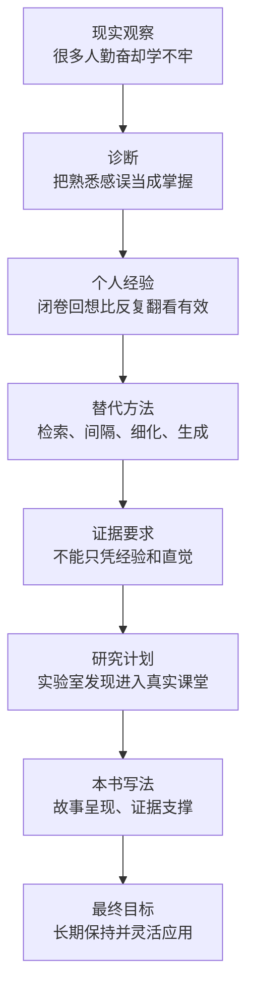
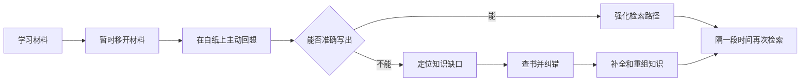
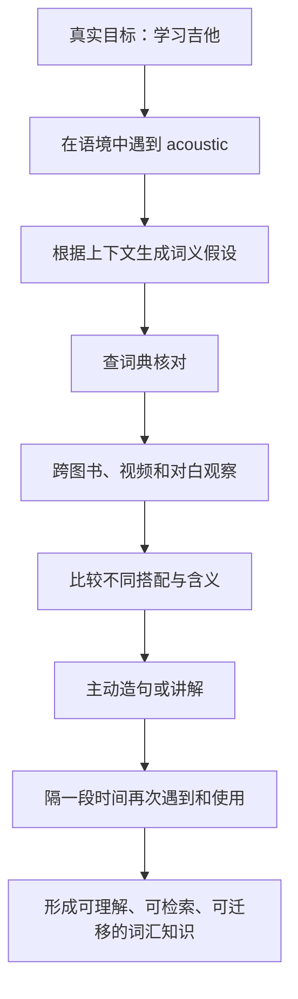
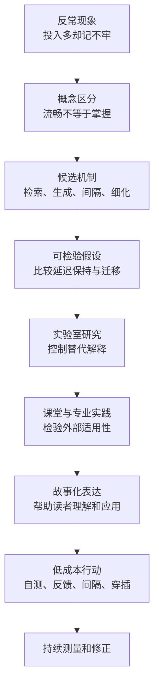

> **阅读范围**：推荐序一“轻松的学习是无效的”、推荐序二“学习不止技巧”、前言 
> **原书作者**：彼得·C.布朗、亨利·L.罗迪格三世、马克·A.麦克丹尼尔 
> **推荐序作者**：樊登、叶富华 
> **原文来源**：《认知天性：让学习轻而易举的心理学规律》 
> **阅读目标**：理解为什么勤奋、熟悉和即时流畅不等于真正学会，学习科学又如何用可检验的证据替代直觉，并据此建立阅读全书的方法。

---

## 导读：序与前言在全书中承担什么任务

这三部分尚未完整证明全书的学习原则，却已经搭好了全书的问题框架。它们按以下顺序推进：

1. **推荐序一从反常经验出发**：看起来不够“勤奋”的学生，可能因为经常闭卷回想，反而比反复阅读、画线的人学得更牢。
2. **推荐序二提出替代方案**：有效学习不是减少思考，而是在有意义的语境中主动生成、解释和使用知识。
3. **前言交代证据与方法**：这些主张不能只靠个人故事成立，必须接受认知心理学实验和真实课堂研究的检验。

三部分共同完成了一次关键的评价标准转换：

> 不再用“花了多少时间”“材料看起来多熟”“当下做得多流畅”衡量学习，而要看学习者能否在一段时间后，不依赖原材料检索、解释并迁移所学。

### 先定义“真正学会”

原书序言反复对比“看起来会了”和“以后真能用”。为了让后面的论证更严格，可以把学习结果拆成四层：

| 层次 | 要回答的问题 | 典型检查方式 |
| --- | --- | --- |
| 编码 | 学习材料是否进入了认知加工 | 能否说出刚看到的信息 |
| 保持 | 过一段时间后是否还在 | 延迟数日或数周后测试 |
| 检索 | 没有原文提示时能否主动想起 | 闭卷自测、简答、实际操作 |
| 迁移 | 情境变化后能否选择并运用 | 新题、真实任务、跨情境解释 |

设学习者采用策略 $s$，经过延迟时间 $t$ 后，在新情境 $c$ 中的表现为

$$
L(s,t,c)=w_rR(s,t)+w_uU(s,t)+w_mM(s,t,c).
$$

其中：

- $R(s,t)$ 表示延迟后的记忆保持；
- $U(s,t)$ 表示理解，即能否用自己的话解释关系与原因；
- $M(s,t,c)$ 表示在情境 $c$ 中的迁移能力；
- $w_r,w_u,w_m$ 是根据学习目标分配的权重，且均不小于 $0$。

这个表达式不是原书给出的精确心理测量公式，而是对序言评价标准的形式化概括。它提醒我们：如果只测学习结束后立刻重认材料的流畅度，就不能据此断言长期学习效果好。

---

## 一、推荐序一：轻松的学习是无效的

### 1. 问题从哪里来：勤奋的外观为什么会骗人

推荐序一从一个反差开始。樊登读中学时，课本上几乎没有大量笔记和彩色标记，却能取得不错的成绩；一些把书画得很满、看起来非常勤奋的同学，学习结果反而未必更好。

这个反差容易诱发两种解释：

1. 成绩好是因为天赋高，所以不必努力；
2. 做笔记、画重点没有用，所以干脆不必读书。

推荐序都不接受。它给出的真正解释是：**决定结果的不只是可见的投入量，更是学习时发生了哪一种认知活动。**

彩色标记是外部可见行为，闭卷回想是内部认知行为。前者醒目，后者不易被旁人看到，因此人们很容易把“可见的忙碌”误认成“有效的学习”。

可以把这一误判写成：

$$
E\uparrow \not\Rightarrow L\uparrow,
$$

其中：

- $E$ 表示可观察到的投入，例如学习时长、笔记页数和画线数量；
- $L$ 表示延迟后的真实学习结果；
- $\not\Rightarrow$ 表示前者增加并不能单独推出后者增加。

投入当然重要，但它必须通过有效加工转化为学习。更完整的关系是：

$$
E\xrightarrow[\text{反馈与修正}]{\text{有效认知活动}}L.
$$

如果中间缺少检索、解释、辨别和应用，再长的时间也可能只带来熟悉感。

### 2. 白纸回忆法：一套朴素却完整的学习闭环

樊登描述了自己的复习方法：每门课准备一张白纸，不看书，凭记忆写出一学期的公式、重点、词语和诗文；遇到想不起来的地方先努力回想，最后才查书补全。

这个方法可以拆成五步：

1. **撤掉材料**：合上课本和笔记，消除直接提示。
2. **主动检索**：从记忆中提取知识，而不是再次输入。
3. **暴露缺口**：通过写不出、写错或关系混乱，发现未知。
4. **核对反馈**：重新查阅原材料，纠正错误并补充遗漏。
5. **重组知识**：把零散内容组织成一张相互联系的知识图谱。

这套做法同时产生两类收益：

- **测量收益**：学习者知道自己究竟会什么、不会什么；
- **学习收益**：努力回想这个动作本身会强化记忆及其检索路径。

许多人只理解第一类收益，以为自测只是“检查学习”；本书更重视第二类收益，即自测本身也是学习。

### 3. 检索：把“再看一遍”改成“自己想出来”

#### 3.1 要解决什么问题

阅读时，答案就在眼前。人只需识别字词便会产生“我知道”的感觉，却未必能在答案消失后自己生成它。检索要解决的就是**有提示时认识、无提示时想不起**的问题。

#### 3.2 直觉含义

检索不是继续向大脑“输入”，而是要求大脑从已有记忆中“输出”。就像知道某个文件曾经保存过，不等于知道它保存在哪里、需要时能立刻打开。

#### 3.3 操作性定义

在学习科学中，可以把**检索练习（retrieval practice）**定义为：学习者在不直接查看完整答案的条件下，尝试从记忆中提取目标知识或完成目标技能，并在必要时接受反馈的活动。

定义中有三个关键条件：

1. 目标内容此前已经接触或学习过；
2. 作答时不能直接照抄完整答案；
3. 最好有反馈，以免错误被反复巩固。

闭卷简答、抽认卡、给别人讲解、根据标题回忆要点、在模拟器中执行操作，都可以成为检索练习。单纯重读、抄写原文或边看答案边誊写通常不算。

#### 3.4 为什么可能有效

推荐序用个人经验预告了全书后续要证明的机制：

1. 首次学习形成记忆表征；
2. 一段时间后，表征不再处于完全激活状态；
3. 学习者必须借助线索重新找到它；
4. 成功检索使这条访问路径再次被使用并强化；
5. 反馈纠正错误，细化与旧知识的联系；
6. 下次遇到相似线索时，目标知识更容易被提取。

这里必须保留一个边界：序言只提出这一解释，完整证据要到正文中检验。个人感觉“对我有效”只能生成假设，不能证明对所有人、所有任务都有效。

### 4. 间隔、巩固、细化与迁移

推荐序一把白纸法与一组学习科学术语对应起来。这些术语在序言中只是预告，但已经可以建立基本概念框架。

#### 4.1 间隔

**间隔练习（spaced practice）**是把针对同一知识或技能的多次学习分散到不同时间，而不是连续挤在一次学习中。

设同一内容的练习时点为 $t_1,t_2,\ldots,t_n$，相邻间隔为

$$
\Delta_i=t_{i+1}-t_i.
$$

集中练习中，$\Delta_i$ 很小，前一次加工仍高度活跃；间隔练习中，$\Delta_i$ 足以让一部分信息变得不那么容易提取，后一次练习因而需要重新检索。

樊登“先读一遍，半个月后再用白纸准备讲解”就是间隔与检索的组合。

间隔不是越长越好。如果间隔长到完全无法检索，又没有有效提示与反馈，练习可能变成重新学习。合理间隔取决于保持期限、材料难度、先前掌握程度和复习机会。

#### 4.2 巩固

**记忆巩固（consolidation）**指新形成、仍不稳定的记忆随时间发生稳定和整合的过程。序言中的直觉是：学习不是信息一进入头脑就永久固定，它需要时间，也会受到后续检索和关联加工的影响。

必须区分：

- 巩固不是“连续多看几遍”的同义词；
- 巩固也不是主观上越来越熟；
- 它关注记忆随时间变得更稳定，而不是当下表现是否顺畅。

#### 4.3 细化

**细化（elaboration）**是用自己的语言解释新知识，把它与已有知识、具体例子、因果关系或其他表征建立联系。

如果目标知识为 $K$，已有知识为 $K_1,K_2,\ldots,K_m$，细化不是简单重复 $K$，而是建立关系：

$$
K\leftrightarrow\{K_1,K_2,\ldots,K_m\}.
$$

关系越有意义，未来可用于检索的线索通常越丰富。但错误关联也会造成误解，因此细化仍需事实核对。

#### 4.4 迁移

**迁移（transfer）**是把在一个任务或情境中学到的知识、原则或技能，用于不同但相关的新任务或新情境。

例如，能在白纸上写出公式是检索；面对一道没有见过的实际问题，能判断该用哪个公式并正确建模，才包含迁移。

迁移依赖的不是表面相似，而是能否识别底层结构：

$$
\text{旧情境 }C_1\xrightarrow{\text{抽取原则 }P}\text{新情境 }C_2.
$$

如果学习者只记住例题表面步骤，没有抽取原则 $P$，换一个题面就可能失效。

### 5. 为什么记笔记和画线容易制造掌握错觉

推荐序不是说笔记和画线在任何情况下都无效，而是反对把它们当作学习完成的证据。问题主要来自以下链条：

1. 重复接触使文本加工越来越流畅；
2. 流畅带来熟悉感；
3. 学习者把“这句话看着熟”误判为“我能独立说出并使用”；
4. 因为感觉已经会了，便停止更费力的检索与应用；
5. 到考试或真实任务中，原文提示消失，知识无法提取。

这种错误属于**元认知判断偏差**。元认知是人对自己认知状态的监控和判断；这里的偏差是用材料带来的流畅感代替了对自身能力的直接测试。

| 行为 | 可能的合理用途 | 不能单独证明什么 |
| --- | --- | --- |
| 画线 | 标出结构、疑问和待复习内容 | 不能证明已经记住或理解 |
| 做笔记 | 用自己的话压缩、组织和提出问题 | 照抄不能证明能够独立生成 |
| 重读 | 初次理解困难时补充背景，或隔一段时间复习 | 连续重读不能证明长期保持 |
| 白纸回忆 | 检查并强化无提示检索 | 一次成功不能保证长期保持和迁移 |

因此，合理做法不是禁止画线，而是让画线服务于后续检索。例如把标题改写成问题，合书作答，再用原文核对。

### 6. “轻松的学习是无效的”应怎样准确理解

这句话有传播力，也最容易被误解。它不是说学习越痛苦越好，更不是说故意增加任何困难都能提高效果。

更严谨的表达是：

> 某些与目标能力直接相关、难度适中且有反馈的认知努力，虽然会降低当下的流畅感，却可能提高长期保持和迁移；单纯追求即时轻松，容易牺牲这种深层加工。

设困难程度为 $d$，学习收益为 $B(d)$。它通常不能被理解成单调递增关系：

$$
d_1<d_2\not\Rightarrow B(d_1)<B(d_2).
$$

困难过低，学习者只是在重复熟练动作；困难过高，学习者无法成功加工，也得不到可用反馈。有效困难至少要满足：

1. 与目标知识或技能相关；
2. 学习者通过努力有机会成功；
3. 能获得纠错信息；
4. 不因过度疲劳、焦虑或无关负担挤占主要认知资源；
5. 用延迟表现而不是当下痛苦程度评价效果。

例如，把书合上后解释一个刚学过的概念是相关困难；把字体故意缩到难以辨认，增加的主要是视觉负担，未必促进概念学习。

### 7. 推荐序一的完整论证链

推荐序一的推理可以还原为：

1. 一些学生投入很多可见努力，却没有得到相称的长期结果；
2. 因此，学习效果不能只由投入外观解释；
3. 另一些学生采用闭卷回想、延迟复习和查漏补缺，结果更稳定；
4. 这些做法分别对应检索、间隔、巩固、细化与迁移；
5. 它们共同要求学习者主动生成知识，并获得对真实掌握程度的反馈；
6. 反复阅读和画线则容易仅增加熟悉感，掩盖检索失败；
7. 因而，学习好不能简单归因于天赋，方法会显著影响同样投入的产出；
8. 但个人故事只提供直观入口，普遍结论仍需后续实证研究支持。

### 8. 常见误解辨析

#### 误解一：有效学习一定让人持续痛苦

错。困难是手段，不是目标。有效学习可以有兴趣和成就感，只是在关键阶段不能用轻松感替代真实练习。

#### 误解二：既然画线没用，就完全不能做笔记

错。机械照抄的效果有限；用自己的话概括、提出问题、建立关系，并把笔记作为自测线索，属于更深的加工。

#### 误解三：一次白纸回忆成功，就永远不会忘

错。保持需要跨时间的重复检索。一次成功只说明在当时线索与条件下可以提取。

#### 误解四：成绩好与天赋完全无关

推荐序反对的是用天赋解释一切，并未证明个体差异不存在。更合理的结论是：无论起点如何，方法会影响学习效率和可达到的水平。

---

## 二、推荐序二：学习不止技巧

### 1. 从背单词的低效模式切入

推荐序二观察到一种常见学习方式：学习者逐字母念英文单词，再念一个中文释义，反复循环。例如把 `acoustic` 仅记成“若干字母 + 声学”。

这种方法主要建立了一个狭窄对应：

$$
\text{acoustic}\leftrightarrow\text{声学}.
$$

它没有回答：

- 这个词在什么语境中出现？
- 它修饰什么对象，承担什么语法功能？
- `acoustic guitar`、`acoustic properties` 等搭配如何理解？
- 面对真实句子时，学习者能否根据上下文提取恰当含义？
- 需要表达相关意思时，能否主动使用这个词？

因此，问题并不只是“重复次数不够”，而是建立的知识表征过于单薄。它也许足以应付紧接着进行的中英配对，却很难支持延迟后的理解与使用。

### 2. 生成性学习：学习者必须生成意义

#### 2.1 要解决什么问题

被动接收会让学习者误以为，信息只要被看见、听见或抄写，就已经变成了自己的知识。生成性学习要解决的是**材料经过了眼睛，却没有被学习者主动组织成意义**的问题。

#### 2.2 直觉含义

老师或书本提供的是原料，学习者必须自己完成加工：选择重点、联系旧知、组织关系、给出解释、构造例子并尝试使用。别人给出的句子可以被读懂，但只有自己能从线索中生成解释，才更接近掌握。

#### 2.3 操作性定义

**生成性学习（generative learning）**可以定义为：学习者主动选择相关信息，将其组织成连贯结构，并把它与已有知识整合，从而生成解释、例子、答案或应用的学习活动。

它至少包含三类动作：

1. **选择**：从材料中识别与目标相关的信息；
2. **组织**：明确概念之间的类别、因果、时间或对比关系；
3. **整合**：把新结构连接到已有知识与经验。

生成不等于凭空猜测。生成出的内容必须接受词典、教材、教师、实验结果或实际表现的校验，否则主动加工也可能主动制造错误。

### 3. `acoustic` 案例的完整学习路径

推荐序用学吉他的场景说明生成性学习。这个例子不是让人先背词表，而是让词汇进入一个有目标的活动。

#### 第一步：由真实问题触发

学习者因为想学吉他，在教材或视频中遇到 `acoustic`。这时学习需求不是“考试说它必背”，而是“我需要理解当前正在学习的对象”。

真实目标会帮助学习者选择相关信息，也提高持续投入的可能性。但兴趣不是记忆的充分条件，仍需后续加工和练习。

#### 第二步：在强语境中推测意义

当 `acoustic` 与 guitar、sound、instrument 等词共同出现时，学习者先根据上下文形成假设。例如，`acoustic guitar` 似乎指不依靠电信号放大来发声的吉他类型。

所谓**强语境**，是包含足够限制性线索、能显著缩小合理解释范围的语境。它不是篇幅越长越强，而是线索与目标意义的关系越明确越强。

#### 第三步：查证而非停在猜测

打开词典核对词义、词性、发音、搭配和例句。这一步把初步生成与可靠反馈连接起来，防止把错误猜测固化。

#### 第四步：跨材料搜寻

继续在图书、视频、影视对白等材料中观察这个词。每个语境会提供部分重叠、部分不同的线索：

- `acoustic guitar`：一种乐器类型；
- `acoustic performance`：不依赖电声强化或以原声为特点的演出；
- `room acoustics`：空间的声学特性。

多样语境帮助学习者区分稳定核心与具体变体，而不把一个中文释义当成全部含义。

#### 第五步：主动造句

造句要求学习者从意义出发主动检索单词，同时处理语法、搭配和情境。它比看到单词后认出中文更接近真实使用。

#### 第六步：整理与表达

把遇到的词、例句和自己的例句写成记录或文章，相当于再次选择、组织和整合。公开写作不是必要条件，关键是学习者要生成连贯表达，而不是收藏链接。

#### 第七步：让生活持续提供检索线索

坚持一段时间后，词汇学习不再局限于一张孤立词表。真实活动不断提供相遇、辨别和使用机会，形成分散且多样的练习。

### 4. 为什么这种方法可能更牢

推荐序给出的是直观案例。结合它所使用的概念，可以把有效性解释为以下几条相互支持的路径。

#### 4.1 加工层次更深

逐字母复述主要处理表面形式；解释意义、比较语境和造句则处理语义及关系。后者让学习者回答“它是什么意思、为什么在这里用、和什么搭配”，形成更丰富的记忆表征。

#### 4.2 检索线索更多

孤立词对只提供少量线索。吉他声音、某个句子、一个视频场景、词根或搭配都可能成为检索入口。

可以把目标词 $W$ 的可用线索集合记为

$$
C(W)=\{c_1,c_2,\ldots,c_n\}.
$$

并非 $n$ 越大就必然记得越牢；只有与词义有稳定、可辨别关系的线索才有价值。不过，与单一翻译相比，多种有意义线索通常更能支持不同情境中的检索。

#### 4.3 生成效应

学习者先依据语境推测、再查证，或根据意思主动造句，都要求自己产生答案。与直接看到完整答案相比，生成过程需要更积极地调用已有知识并建立联系。

前提是随后有正确反馈。没有反馈的错误生成可能干扰学习。

#### 4.4 分散与多样练习

同一个词在不同时间、不同材料中再次出现，天然形成间隔；不同句型和场景又形成变化。学习者不只记住某一张词卡的版面，而是在变化中识别稳定含义。

#### 4.5 目标与意义提升持续性

词汇服务于“学会吉他”这个更大的目标，学习者更容易理解它为什么值得记，也更可能主动寻找后续实例。动机增加不直接保证记忆，但会增加高质量加工持续发生的机会。

### 5. 花更多时间为什么可能反而更“高效”

推荐序承认，生成性学习一个词可能比背一个翻译多花数倍时间。若效率只定义为单位时间“看过的词数”，它确实更慢；但若目标是长期可用词汇，评价方式应改变。

设：

- $N$ 为接触的词数；
- $p_r$ 为延迟后能正确检索的比例；
- $p_u$ 为能在真实语境中正确使用的比例；
- $T$ 为总学习时间。

则可以粗略定义两种效率：

$$
\eta_{\text{接触}}=\frac{N}{T},
$$

$$
\eta_{\text{可用}}=\frac{N\cdot p_r\cdot p_u}{T}.
$$

机械背诵可能使 $\eta_{\text{接触}}$ 很高，却因 $p_r$ 和 $p_u$ 较低，未必有较高的长期可用效率。生成性学习的单次成本较大，但如果保持和使用概率明显提高，长期回报可能更高。

这只是帮助思考的模型，不能把推荐序中“多花五倍、十倍，收获不止五倍、十倍”的修辞理解成经过精确测量的固定比例。实际收益取决于词汇难度、原有水平、使用频率和学习目标。

### 6. 从背单词上升到学习方法的证据问题

推荐序二接着把问题从一个单词扩展到所有知识和技能：多数人的学习方法来自口耳相传，很少经过实证检验。

它用“听路人推荐药物，却不问是否通过临床试验”作类比。类比的核心不是说教育实验和药物试验完全相同，而是强调：

1. 一个方法听起来合理，不代表实际有效；
2. 个别成功案例可能来自其他因素；
3. 方法可能只改善短期表现，却损害长期目标；
4. 必须明确比较对象、测量指标和适用条件；
5. 结论应允许被重复检验和修正。

#### 6.1 直觉为什么不够

学习者能直接感受到的是“现在读起来顺不顺”“刚练完做得快不快”，却很难即时感受到“一周后还能否独立提取”。短期体验与长期结果不在同一时间出现，这使直觉容易偏向即时流畅的方法。

#### 6.2 个案为什么不够

某人采用方法 $A$ 后成绩提高，并不能单独证明 $A$ 导致提高。还可能有：

- 原本基础更好；
- 同时增加了学习时间；
- 教师或材料改变；
- 测验题恰好与练习重复；
- 只报告成功者，忽略失败者。

因此需要比较条件、控制替代解释，并尽量使用延迟和迁移测试。

### 7. 从实验室到课堂：本书要填补的鸿沟

推荐序介绍了两位认知心理学家亨利·罗迪格和马克·麦克丹尼尔的研究背景。他们长期研究记忆，却发现记忆科学在教育实践中的应用有限，于是开始调查人们实际使用的学习策略，并尝试把实验室发现推广到课堂。

这里存在一个典型的研究转化难题：

实验室的优势是能控制变量、识别因果；局限是任务可能简化、参与者和环境有限。课堂研究更接近真实学习，却会受到教师差异、课程安排、学生动机和同伴互动影响。两类证据互相补充，不能简单以一方取代另一方。

故事作家彼得·布朗的加入则解决另一个问题：严谨研究如果只以专业论文形式存在，普通学习者难以理解和应用。故事负责把抽象机制放入具体处境，科学研究负责约束故事能够支持的结论。

### 8. 推荐序二预告的三个重要主题

#### 8.1 学习风格假说

常见主张是：先把人分成视觉型、听觉型等稳定类型，再让教学形式与类型匹配，就会学得更好。

推荐序预告本书将反驳的不是“人有偏好”或“材料可用多种形式呈现”，而是更强的匹配假说：

> 按偏好分类并匹配教学形式，会普遍带来更好的学习结果。

偏好、能力和教学效果是三个不同概念。一个人喜欢看视频，不代表视频一定比文字更适合他学习所有内容；几何图形本来就适合视觉呈现，发音则需要听觉信息，媒介应首先匹配内容结构和学习目标。

#### 8.2 穿插练习

**穿插练习（interleaved practice）**是把不同但相关的问题类型或技能交替安排，例如按 $A,B,C,A,C,B$ 的顺序练习，而不是先做完全部 $A$，再做全部 $B$ 和 $C$。

需要特别澄清：推荐序原文把 `interleaved practice` 紧接在“间隔练习”之后，容易造成术语混淆。通常：

- `spaced practice` 指**间隔练习**，强调同一内容的练习在时间上分散；
- `interleaved practice` 指**穿插练习**，强调相关类型交替出现。

二者经常同时发生，但不是同一个维度。

#### 8.3 合意困难

**合意困难（desirable difficulties）**是那些会让当下学习感觉更费力、表现可能暂时下降，却在适当条件下改善长期保持或迁移的困难。

“合意”意味着这种困难服务于目标，而不是任何障碍都值得保留。间隔、穿插和无提示检索可能是合意困难；含糊讲解、错误反馈、无关干扰和超出能力范围的任务则通常不是。

### 9. 怎样把生成性学习用于阅读本书

推荐序二最后没有让读者只记住术语，而是建议立即使用这些方法。可以形成以下阅读循环：

1. 每读完一个小节，合上书写出中心问题和结论；
2. 用自己的话解释一个新术语，不照抄原句；
3. 找一个书外例子，并说明它为何符合定义；
4. 找一个相似但不符合定义的反例；
5. 隔一天或更久再回答同一问题；
6. 穿插复习两个容易混淆的概念；
7. 回到原文核对，纠正遗漏和过度推断。

这比“把整章读得非常顺”更难，却能直接检测读者是否获得了可检索、可辨别的知识。

### 10. 推荐序二的论证边界

推荐序二提供了有启发性的例子，但需要避免过度推广：

- 词表不是在任何情况下都应被丢弃。它可以用于筛选高频词、建立初始接触或进行检索，只是不应成为唯一活动。
- 强语境不能替代明确查证。上下文有时不足，学习者也可能猜错。
- 生成性学习不等于每个知识点都做大规模搜索。加工深度应匹配重要性和使用目标。
- 兴趣驱动很有价值，但课程中有些基础知识不会立刻显得有趣，仍需要有结构的教学和练习。
- 用自己的话表达不保证正确，必须与可靠来源和反馈相连。

---

## 三、前言：用学习科学替代未经检验的直觉

### 1. 核心问题：流行方法为什么可能普遍错误

前言开门见山地提出一个强判断：许多被广泛采用的学习方法并不理想，甚至是无用功；大学生、医学生等以学习为主要任务的人也不例外。

这个问题难在：使用人数多、流传时间长和主观感觉好，都会给方法增加可信度。然而，这三者都不能替代效果证据。

设某方法 $s$ 的流行度为 $P(s)$，主观流畅度为 $F(s)$，延迟学习收益为 $L(s)$。前言反对以下两个错误推理：

$$
P(s)\uparrow\Rightarrow L(s)\uparrow,
$$

$$
F(s)\uparrow\Rightarrow L(s)\uparrow.
$$

流行度可能来自传统、便利和模仿；流畅度可能来自重复接触。要判断 $L(s)$，仍须在可比较条件下测量长期保持和迁移。

### 2. 什么是实证研究

前言把学习科学与假说、传言和直觉区分开。这里的**实证研究**是指通过系统观察或实验收集可检查的数据，用这些数据检验关于学习的主张。

一个基本的策略比较可以写成：

$$
\Delta=\mathbb{E}[Y\mid S=A]-\mathbb{E}[Y\mid S=B],
$$

其中：

- $S$ 表示分配到的学习策略；
- $A$ 可以是检索练习；
- $B$ 可以是重复阅读；
- $Y$ 是预先规定的结果指标，例如一周后的测试成绩；
- $\mathbb{E}$ 表示一组参与者的平均结果；
- $\Delta$ 表示两种策略在该研究条件下的平均差异。

若要把 $\Delta$ 解释成策略造成的差异，至少要考虑：

1. 两组学习时间、材料和初始水平是否可比；
2. 策略是随机分配，还是学习者自行选择；
3. 测验是立即进行还是延迟进行；
4. 测的是原题重现、知识理解还是新情境迁移；
5. 样本数量是否足以排除偶然波动；
6. 结果能否在其他研究、群体和材料中重复出现。

序言没有逐项教授研究方法，但它的立场很明确：**方法是否有效是可以被提出假设、比较和修正的问题，而不是只凭个人信念决定的问题。**

### 3. 为什么 125 年研究到近年才形成可用成果

前言指出，学习与记忆的研究已有约 125 年历史，但能形成较成熟实践洞见是较近的事情。这并不矛盾。

从基础发现到可用原则，需要经过多个层次：

1. 定义并测量记忆、遗忘和学习表现；
2. 在受控任务中发现稳定现象；
3. 提出能够解释现象的机制；
4. 改变材料、时间和参与者，检验现象能否重复；
5. 进入课堂和专业训练，检查现实可行性；
6. 比较收益、成本、接受度和潜在副作用；
7. 把多项结果综合成带条件的实践建议。

单个实验只能回答有限问题。学习对象从词表到复杂概念，保持时间从几分钟到数月，参与者从儿童到专业人员，结论都可能变化。科学进展因此表现为逐步缩小不确定性，而不是一次研究给出最终答案。

### 4. 本书从哪里来：一个十年的研究转化项目

前言交代了本书的证据背景：

- 亨利·罗迪格和马克·麦克丹尼尔是研究学习与记忆的认知科学家；
- 彼得·布朗以故事写作为专长，负责把抽象研究组织成可理解叙事；
- 2002 年，詹姆斯·麦克唐奈基金会资助“通过认知心理学强化教育实践”项目；
- 项目由罗迪格、麦克丹尼尔及另外 9 位认知心理学家共同参与；
- 团队投入约 10 年，把认知心理学的基础知识应用于教育实践；
- 本书的内容、注释和致谢大量吸收了这个项目及相关研究成果。

这段背景不是要读者诉诸专家权威，而是说明主张的来源和研究路径。读者仍应关心每项研究如何设计、结果能支持多强的结论以及能否重复。

### 5. 为什么采用“故事 + 研究”的写法

前言明确说，本书尽量不堆砌研究结果，而通过故事说明人们怎样掌握复杂知识和技能。

这种方法要同时解决两个问题：

1. **只有数据，读者难以形成具体心理表征**：不知道原则在真实任务中怎样发生。
2. **只有故事，读者容易把个案当普遍规律**：一个精彩案例无法排除替代解释。

所以两者应当分工：

| 材料 | 主要作用 | 主要局限 |
| --- | --- | --- |
| 个人故事 | 呈现情境、决策、失败与应用方式 | 不能单独证明因果和普遍性 |
| 受控实验 | 比较策略、控制变量、识别因果 | 任务和环境可能较简化 |
| 课堂研究 | 检查真实教育环境中的效果 | 干扰变量更多，实施差异更大 |
| 多项研究综合 | 判断稳定性、差异和边界 | 依赖纳入研究的质量与可比性 |

严谨的阅读方式是：用故事理解“它如何可能发生”，用研究判断“它是否稳定发生”，再用边界条件判断“能否用于我的任务”。

### 6. 本书把自己的原则用在结构上

前言没有采用“一个主题彻底讲完，再永不返回”的纯线性结构。它宣布会把两个学习原则直接用于写作：

1. 有间隔地重复关键概念；
2. 穿插讨论不同但相关的主题。

#### 6.1 有间隔地重复

传统重复可能是同一段话紧接着出现数次，读者依靠短时激活便能轻松识别。本书则让一个原则在后续章节再次出现。中间经历时间和其他主题后，读者必须重新提取并更新它。

形式上，可以把同一概念 $A$ 的出现安排写成：

$$
A_{t_1},\quad B,\quad C,\quad A_{t_2},\quad D,\quad A_{t_3},
$$

其中 $t_1<t_2<t_3$。每次返回 $A$ 时，不只是原句复印，而应加入新证据、新情境或新关系。

#### 6.2 穿插相关主题

若主题 $A$、$B$、$C$ 容易混淆，先连续处理所有 $A$ 会让学习者只需重复同一种操作；交替出现则迫使学习者先判断当前属于哪一类，再选择对应原则。

集中结构：

$$
A,A,A,B,B,B,C,C,C.
$$

穿插结构：

$$
A,B,C,A,C,B,B,A,C.
$$

穿插会降低阅读时“这一部分非常整齐、非常好懂”的感觉，却可能改善辨别与迁移。它成立的前提是主题彼此相关、学习者已有最低限度的初始理解，且整体结构仍然可追踪。毫无关系地频繁跳转只会制造无关干扰。

#### 6.3 为什么书中会重复一些原则

因此，后文再次遇到检索、间隔或穿插，并不必然是编辑冗余。重复本身是学习设计的一部分。读者也不应只是再次点头，而应在看到术语前先回想定义、机制和例子，再比较本次语境增加了什么。

### 7. 本书要解决什么，不解决什么

#### 7.1 直接目标

本书关注人们当下能做什么，以便：

- 学得更好；
- 记得更牢；
- 在需要时提取；
- 把知识与技能用于实际问题。

教师和培训者则可以用这些原则改进任务、练习和反馈，让学习者更准确地理解自己的学习状态。

#### 7.2 不直接解决的事情

前言明确划定范围：本书不是教育政策或学校制度改革专著。它可能涉及课堂实践及成绩差距，但不会系统回答财政投入、课程治理、招生制度或教育公平的全部问题。

它也不能替个人提供学习意愿。学习策略能改善“怎样学”，却不能自动决定“是否愿意学、学什么、为什么学”。

可以把学习结果粗略表示为：

$$
Y=f(S,M,K,E,O),
$$

其中：

- $S$ 是学习策略；
- $M$ 是动机与持续投入；
- $K$ 是已有知识；
- $E$ 是教师、材料、反馈和社会环境；
- $O$ 是时间、资源及参与机会。

本书主要改善 $S$，也会间接影响 $M$ 和 $E$，但不能把其他变量全部固定或消除。

### 8. 适用人群为什么如此广

前言列出的读者包括学生、教师、企业和工厂培训人员、军队培训者、职业协会负责人、体育教练、中年学习者和希望维持技能的老年人。

这些人的内容不同，却共享一个结构：

1. 需要获得知识或技能；
2. 学习结果必须跨时间保持；
3. 将来要在没有教材摆在眼前时调用；
4. 常常还要在与训练不完全相同的情境中使用。

因此，检索、保持和迁移是跨领域问题。不过，原则相同不等于实施方式相同：

- 事实知识可以用简答题与抽认卡；
- 外科技能需要模拟和真实操作反馈；
- 体育技能需要动作练习及结果反馈；
- 管理判断需要案例辨别、复盘和情境决策。

学习策略必须与目标表现保持**任务一致性**。只会背诵游泳动作并不能替代下水练习，只会做选择题也不能证明能完成开放式分析。

### 9. 已知有限，为什么仍值得立即行动

前言最后承认，学习及其神经机制仍有许多未知，但已有成果足以支持一批低成本策略。

这不是“机制尚未完全清楚，所以什么都不能做”，也不是“已有有效方法，所以理论已经完结”。它采用的是证据约束下的实践原则：

1. 明确哪些效果已在多项研究和实际环境中出现；
2. 对尚未解决的机制与边界保持开放；
3. 优先采用成本低、风险小、可获得反馈的策略；
4. 在自己的任务中记录延迟结果，而不是只凭当下感觉；
5. 随新证据调整做法。

若策略的预期收益为 $B$，实施成本为 $C$，潜在风险为 $R$，那么采取行动的朴素条件可以写成：

$$
\mathbb{E}[B]-C-R>0.
$$

自测、间隔和穿插通常不需要昂贵设备，试行成本较低；若又有较稳定的研究支持，就没有必要等到所有神经机制都被解释后才使用。

---

## 四、作者分析问题的完整思路

### 1. 第一步：从“勤奋却无效”的反常现象提出问题

如果投入时间就必然带来学习，人们不应普遍出现“看了很多遍，考试却想不起来”。这个反常现象迫使作者区分：

- 学习活动的外观与内部认知加工；
- 练习中的即时表现与延迟后的真实保持；
- 看到答案时的熟悉与没有答案时的检索。

### 2. 第二步：寻找能解释差异的候选机制

白纸回忆和语境学词的共同点不是某个具体工具，而是学习者都在主动加工：

- 从记忆中检索；
- 自己生成答案或解释；
- 把新知接到旧知上；
- 隔一段时间再次处理；
- 在不同语境中辨别和使用。

于是问题从“谁更努力”变成“哪些认知操作更可能形成长期可用的知识”。

### 3. 第三步：不把直观案例当成最终证明

个人经验可以说明一种方法值得研究，却可能受天赋、先前知识、额外练习等因素影响。因此要把候选解释转化成可比较假设：

> 在材料、时间和初始水平大体可比时，采用主动检索、间隔或生成的学习者，是否会在延迟测试和迁移任务中优于只做重复接触的学习者？

这句话明确了策略、比较组、结果指标和时间条件，因而可以被实验反驳。

### 4. 第四步：从实验室走向真实环境

若效果只出现在短词表和几分钟测试中，就不足以指导复杂教育。本书背后的项目因此把认知心理学原则带入课堂，并关注实际课程、教师工作和学生差异。

### 5. 第五步：把研究转写成普通人可用的模型

科学论文适合精确报告单项研究，普通读者则需要跨案例理解原则。本书用故事承载具体情境，用重复和穿插让原则多次出现，再在后文总结操作策略。

### 6. 第六步：主动声明边界

前言承认神经机制仍有未知，也说明本书不负责完整的教育制度改革。这样的边界不是削弱结论，而是防止把一个有关学习策略的理论膨胀成对动机、资源、制度和个体差异的万能解释。

---

## 五、核心概念对照

| 概念 | 严格关注点 | 容易混淆的概念 | 关键区别 |
| --- | --- | --- | --- |
| 熟悉感 | 材料再次出现时感觉见过 | 掌握 | 熟悉依赖当前提示，掌握要求无提示检索与应用 |
| 检索练习 | 从记忆中主动提取 | 重读 | 一个是输出，一个是再次输入 |
| 自测 | 用任务检查并强化学习 | 高风险考试 | 自测可低权重、可随时进行，目的首先是学习和反馈 |
| 间隔练习 | 同一内容的多次练习在时间上分散 | 穿插练习 | 间隔关注时间距离，穿插关注不同类型交替 |
| 穿插练习 | 相关类型交替出现 | 集中练习 | 穿插要求辨别类型，集中练习可连续重复同一程序 |
| 细化 | 解释关系并连接旧知 | 增加篇幅 | 内容更多不等于联系更有意义 |
| 生成性学习 | 主动选择、组织、整合并产生答案或解释 | 自由联想 | 生成必须围绕目标，并接受可靠反馈 |
| 迁移 | 在新情境中识别并运用原则 | 原题重做 | 迁移需要跨越表面变化，提取底层结构 |
| 合意困难 | 有利于长期学习的适度相关困难 | 任意困难 | 无关负担、不可完成任务和错误反馈不“合意” |
| 即时表现 | 练习当下的速度或正确率 | 长期学习 | 即时表现高可能只是短时激活和题型重复 |
| 实证证据 | 系统数据对假设的检验 | 个人见证 | 个案可启发假设，不能单独建立普遍因果 |

---

## 六、把序与前言转化为一套可执行方法

### 1. 学习前：把目标写成可测试的能力

不要只写“看完前言”，而应写：

- 能解释熟悉感为什么不等于掌握；
- 能区分检索、间隔和穿插；
- 能复述本书为何采用故事与研究结合的写法；
- 能为自己的课程设计一次低成本自测。

目标若不可测试，学习者很容易用阅读完成度代替能力变化。

### 2. 初读后：立即做一次无提示检索

合上原文，回答：

1. 推荐序一的白纸法包含哪些步骤？
2. 推荐序二为什么反对孤立地背 `acoustic`？
3. 前言凭什么要求读者相信本书，而不是相信另一本经验之谈？
4. 本书为何要有意重复并穿插主题？

先写答案，再核对原文。想不起来不是失败，而是下一轮学习的定位信息。

### 3. 核对后：只修正缺口，不从头机械重读

把错误分为：

- **事实遗漏**：漏掉项目年份、参与者或写作目的；
- **概念混淆**：把间隔当穿插，把熟悉当检索；
- **关系错误**：知道术语，却说不清为什么有效；
- **边界缺失**：把“轻松学习无效”理解成越痛苦越好。

针对错误类型补充，而不是因为一个小缺口把全部内容连续重读数遍。

### 4. 隔一段时间再次检索

可用一个简单安排：

- 当天：读后闭卷回忆；
- 第 2 天：回答核心概念和论证问题；
- 第 7 天：用一个新学习任务解释并应用；
- 第 21 天：把序言主张与正文证据连接起来。

这不是最佳间隔的通用公式，只是可执行起点。若每次都毫不费力，可适当延长；若几乎完全无法恢复，可缩短间隔或增加提示。

### 5. 穿插容易混淆的判断题

不要连续做十道“什么是检索”，而要混合判断：

- 看答案后抄写三遍；
- 合书写出定义，再核对；
- 昨天学过后今天做无提示简答；
- 先学完全部导数题，再学全部积分题；
- 导数、积分和极限题交替出现，先判断类型再解题。

分类动作本身就是学习的一部分。

### 6. 用真实结果校准方法

至少记录两个时点：

| 记录项 | 练习结束时 | 延迟一周后 |
| --- | --- | --- |
| 无提示回忆正确率 |  |  |
| 能否用自己的话解释 |  |  |
| 能否处理新例子 |  |  |
| 最容易混淆之处 |  |  |

若一种方法只让当下表现很好，一周后迅速消失，就不能仅凭练习时的顺畅继续采用。

---

## 七、自测题

### 基础理解

1. 推荐序一为什么不接受“成绩好只是因为天赋”的解释？
2. 白纸回忆法中的检索、反馈和细化分别发生在哪一步？
3. 检索练习与重复阅读的操作性区别是什么？
4. 为什么画线可能有用，却不能单独证明学习发生？
5. “轻松的学习是无效的”有哪些成立条件和适用边界？
6. 生成性学习包含哪三类基本认知动作？
7. `acoustic` 的案例如何从孤立词对变成多线索知识？
8. 间隔练习和穿插练习有什么不同？
9. 故事、实验室研究和课堂研究各自承担什么作用？
10. 前言为什么在承认许多未知的同时，仍主张立即使用已有策略？

### 推理与应用

11. 某学生把定义抄写十遍，抄写速度越来越快。为什么这不足以证明他已经掌握定义？应增加什么测试？
12. 某教师为了制造困难，把讲义字体改得很小。这是否属于合意困难？依据是什么？
13. 某人用自己造的错误例句反复复习，却从不核对。为什么“主动生成”在这里可能有害？
14. 如果检索组一周后成绩更高，但总学习时间也比重读组长一倍，能否直接断言检索策略更优？还应怎样比较？
15. 请为你正在学习的一项知识设计“初读—检索—反馈—间隔—迁移”的完整循环。

参考答案要点

1. 可见努力与成绩不一致，而闭卷回想等方法提供了不同的机制解释；这并非证明天赋不存在，而是说明方法不能被忽略。
2. 合书写出内容是检索，查书纠错是反馈，把零散内容组织成知识图谱是细化。
3. 检索要求在完整答案不在眼前时从记忆中生成；重读是再次接触已有答案。
4. 画线可用于选择重点和设置线索，但流畅重看画线内容不等于无提示检索、理解或迁移。
5. 困难要与目标相关、难度适中、有成功可能和反馈，并用延迟结果评价；无关、过度或不可完成的困难并无益处。
6. 选择相关信息、组织成连贯结构、与已有知识整合。
7. 它进入吉他等真实目标，通过上下文推测、词典查证、多语境比较、造句和延迟使用形成多条有效线索。
8. 间隔强调同一内容跨时间分散；穿插强调不同但相关类型交替安排。
9. 故事帮助理解情境和机制，实验室研究控制变量，课堂研究检验真实条件下的效果与可实施性。
10. 已有原则有多项证据、成本较低且风险较小，机制知识不完备不妨碍在反馈中谨慎采用。
11. 速度提高可能来自抄写动作和视觉熟悉。应撤掉原文，要求延迟后解释定义、举例并处理反例。
12. 通常不是。它主要增加视觉识别负担，与目标概念的检索和应用无直接关系。
13. 生成只增加主动加工，不自动保证内容正确；缺少反馈会让错误关系得到强化。
14. 不能。需要控制或记录总时间，并比较单位时间的延迟保持与迁移收益，也要考虑实施成本。
15. 答案应明确目标能力、首次理解、无提示输出、可靠反馈、至少一次延迟检索和一个表面不同的新任务。

---

## 八、总结：序与前言建立的学习观

序与前言最终建立了六条贯穿全书的认识：

1. **学习效果与学习时的主观感觉可能背离。** 越熟悉、越流畅，不一定保持得越久。
2. **勤奋必须通过正确活动转化。** 时间、笔记数量和重复次数不能代替检索、解释、辨别和应用。
3. **记忆不是低级目标。** 没有可随时调用的知识，高层次理解、判断和创新便缺少材料。
4. **困难只有在合适时才有价值。** 相关、适度、有反馈的困难可能促进长期学习，痛苦本身没有教育价值。
5. **学习建议必须接受实证检验。** 个人故事负责提出问题和说明应用，受控研究与课堂研究负责检验效果及边界。
6. **本书既讲原则，也用结构实践原则。** 关键概念会被间隔重复、穿插呈现，读者也应通过主动检索而不是顺畅重读来阅读它。

推荐序一让我们怀疑“看起来很努力”，推荐序二展示“主动生成意义”，前言则进一步追问“证据在哪里”。三者合起来，给全书确定了一个清晰标准：

> 真正成功的学习，不是材料在眼前时觉得懂了，而是在时间过去、提示消失、情境变化之后，仍能把知识准确地找回来，并用它解决问题。
