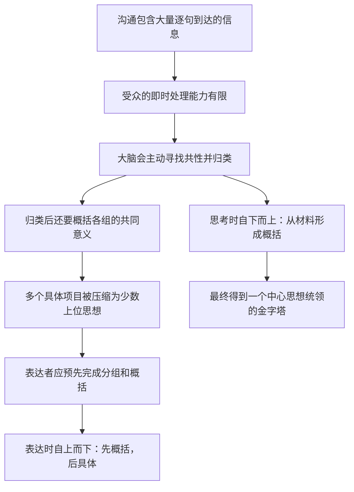
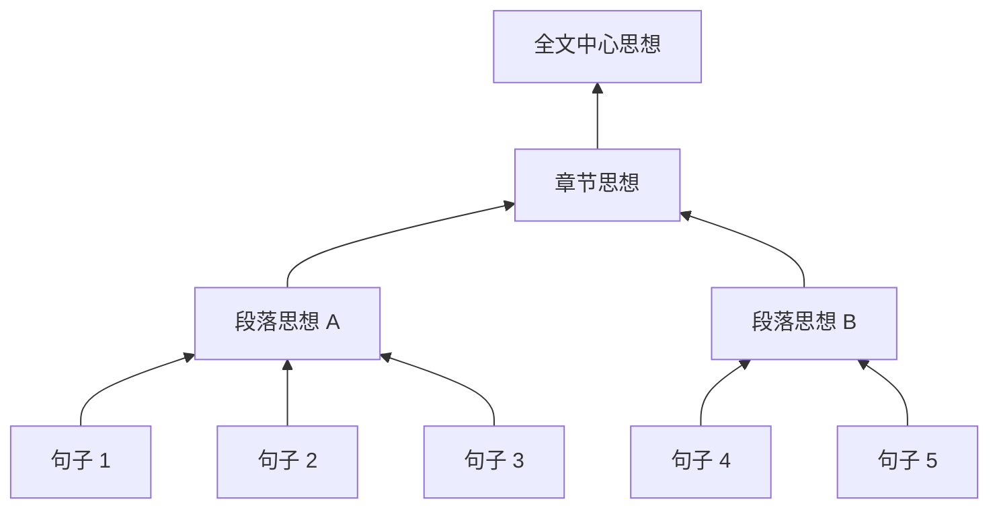
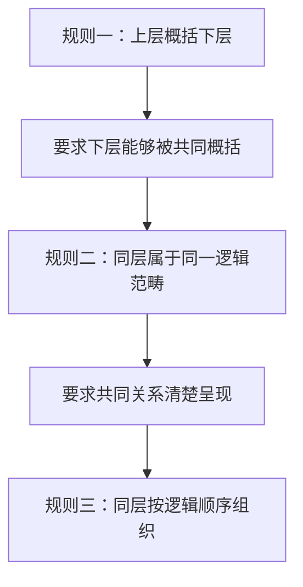

> 阅读范围：第1章“为什么要用金字塔结构”，包括“归类分组，将思想组织成金字塔”“自上而下表达，结论先行”“自下而上思考，总结概括”三个小节。
>
> 原文：《金字塔原理》第1章

## 本章要解决的核心问题

人们常把文章难懂归因于句子太长、术语太多或文笔不好。第1章追问了一个更基础的问题：**即使每个句子单独看都不难，为什么许多文章合在一起仍然难以理解？**

作者的答案是：受众不仅要理解每个句子的字面意思，还要识别句子之间的关系。如果表达者没有事先组织这些关系，受众就必须一边接收新信息，一边猜测哪些信息属于一组、这一组共同说明什么、下一句为何接在这里。真正压垮理解过程的，往往不是单句难度，而是结构恢复成本。

本章的完整论证链可以先概括为：



这条链中有两个方向：

- **受众的理解方向**是自上而下：先知道总的概念，再把细节放入相应位置。
- **表达者整理材料的方向**通常是自下而上：从具体思想中找共同点，逐层概括出中心思想。

第1章的重点不是教人画三角形，而是论证为什么这两个方向必须配合。

---

## 第1章 为什么要用金字塔结构

### 沟通为什么是一项复杂的认知任务

一篇只有两页的短文也可能包含近百个句子。受众至少要连续完成三项工作：

1. **识别文字**：理解词语、句法和指代；
2. **建立关系**：判断当前句与前文是并列、因果、转折、举例还是结论；
3. **形成意义**：把局部信息合成为对作者整体观点的理解。

可以把受众的总认知负担粗略表示为：

$$
L_{总}=L_{语言解码}+L_{关系识别}+L_{观点理解}
$$

表达者未必能完全降低观点本身的难度，但可以通过预先分组、明确概括和安排顺序，显著降低前两项中的无效消耗。金字塔结构的价值，不是让复杂问题变简单，而是避免受众把有限注意力浪费在猜结构上。

### 本章提出的三个基本判断

第一章开头给出三个逐步递进的判断：

1. 人脑会自动把信息归入若干组，以便理解和记忆；
2. 如果沟通内容已由表达者预先分组和概括，受众会更容易处理；
3. 因此，表达者应主动把讲话、演讲、报告、总结、方案等内容组织成金字塔结构。

从第一条到第三条并非毫无条件的跳跃。它依赖以下假设：

- 沟通目的主要是让受众准确理解观点，而不是制造悬念或审美体验；
- 信息之间确实存在可以说明的逻辑关系；
- 表达者比受众更了解自己的材料，也有责任提供解释框架；
- 预先给出的框架没有刻意歪曲或遗漏重要信息。

在商务写作、研究报告、课程讲授和决策汇报中，这些假设通常成立；在侦探小说、实验性文学或刻意引导发现的教学中，信息顺序可以服务于其他目标，不必一律结论先行。

---

## 归类分组，将思想组织成金字塔

### 一、大脑为什么会主动寻找秩序

#### 要解决的问题

外界信息连续而繁杂。如果大脑把每个对象都当成完全独立的项目处理，就必须保存大量孤立细节，既难理解，也难记忆。

#### 直觉含义

人不会被动接收一堆彼此无关的刺激，而会主动问：哪些东西相似？哪些靠得近？哪些可能共同构成某个整体？一旦找到共同点，多个项目就变成一个有意义的单元。

#### 操作性定义

**归类分组**是根据某个明确的共同属性或关系，把多个独立项目组织成一个逻辑单元的认知活动。

设原始项目集合为：

$$
X=\{x_1,x_2,\ldots,x_n\}
$$

若存在分类标准 $c$，可以把这些项目划分为若干组：

$$
X=G_1\cup G_2\cup\cdots\cup G_k
$$

并且每组 $G_i$ 内的项目都共享由 $c$ 指定的某种属性，那么大脑就可以先处理 $k$ 个组，再按需要展开组内项目。通常 $k<n$，因而顶层需要同时处理的单位更少。

这里最关键的不是把项目“放在一起”，而是能否说清楚分类标准 $c$。没有共同标准的堆放，只是视觉上的聚集，不是逻辑分组。

### 二、星座与黑点：人会从邻近和相似中看出组

原书先以古希腊人观察星空为例。人们看见的不是完全散乱的星点，而是由星星组成的图案。随后又用六个黑点说明：当点与点之间的距离不同时，人们会自然看成两组，每组三个。

这两个例子展示的是一种基础倾向：大脑会根据**空间邻近性**和**形态相似性**形成知觉分组。

推理过程如下：

1. 视觉场中存在多个独立对象；
2. 某些对象之间的距离更近或特征更相似；
3. 大脑把更近、更相似的对象视为一个整体；
4. 原本六个独立点被压缩为“两组三点”；
5. 受众不再逐个处理六个对象，而先处理两个组。

#### 这个例子证明到什么程度

它能说明人具有自动分组倾向，却不能单独证明任何分组都正确。古人把星星连成星座，是一种便于识别和叙述的模式，不代表那些恒星在物理上真的彼此接近。由此得到一个重要边界：

> 大脑会寻找关系，不等于大脑找到的关系必然是真实关系。

因此，表达者不仅要利用分组倾向，还要用明确标准检验分组，避免把巧合、位置接近或表面相似误当成因果联系。

### 三、无关词配对：联想如何帮助记忆

原书给出若干本来无关的词对，如湖泊与糖、靴子与盘子、女孩与袋鼠，要求读者为每一对构造一个情景。即使关系有些牵强，只要形成生动画面，看到左边的词时，也更容易想起右边的词。

这个实验式例子说明：**孤立项目一旦被关系连接，就更容易互相提示。**

例如：

- “湖泊”和“糖”本来没有稳定的类别关系；
- 想象“糖倒进湖里溶解”，便建立了一条临时联想路径；
- 以后看到“湖泊”时，这幅画面可能激活“糖”；
- 记忆任务从无提示回忆，变成由关系线索触发的回忆。

#### 记忆联想与逻辑分组的区别

这个例子中的关系可以是人为编造的，只要足够鲜明就能帮助记忆；文章中的逻辑关系却不能只靠想象力维持。

| 维度 | 记忆联想 | 逻辑分组 |
| --- | --- | --- |
| 主要目标 | 建立提取线索 | 解释思想的共同意义 |
| 关系要求 | 可以偶然、夸张甚至荒诞 | 必须与论证任务相关且可说明 |
| 成功标准 | 能否帮助想起另一个项目 | 能否支持准确概括和后续推理 |
| 典型例子 | 糖在湖中溶解 | 苹果和梨同属水果 |

原书借无关词配对说明“关系有助于记忆”，随后必须再推进到更严格的逻辑关系。若停在联想层面，就只能得到记忆术，得不到金字塔结构。

### 四、大脑面对信息时的两个需求

作者把大脑的需求概括为两项：

1. 同时处理的独立项目不能过多；
2. 需要找出项目之间的逻辑关系。

两者是相互联系的。找到逻辑关系后，多个项目可以被视为一个更高层的整体，从而减少顶层独立项目数；反过来，处理容量有限也迫使大脑主动寻找可压缩的关系。


这里出现了本章最重要的机制：**组块化与抽象概括共同压缩信息。**

### 五、奇妙的数字“7”

#### 原书要解决的问题

为什么一串不长的购物要求也容易遗忘？为什么项目数量一多，人就会本能地分类？作者借乔治·米勒提出的“$7\pm2$”说明短时记忆能够同时保持的独立项目有限。

#### 什么是短时记忆与工作记忆

- **短时记忆**强调信息在短时间内的保持；
- **工作记忆**强调人在保持信息的同时，还要对信息进行比较、组合和推理。

阅读文章更接近工作记忆任务：受众不仅要记得前一句，还要判断它与当前句是什么关系。

#### 什么是记忆项目或组块

这里的“项目”不是固定大小的物理对象，而是人在当前任务中当作一个整体处理的**组块**。

例如，字符串 `2 0 2 6 0 8 0 2` 可以被视为八个数字，也可以按日期理解为“2026-08-02”一个组块。人的知识越丰富，越能把多个低层元素压缩成有意义的高层单位。

因此，容量限制更准确的写法不是“人最多记七个字”，而是“人在特定任务中能同时激活的独立组块数量有限”。

#### 购物清单案例

原书让出门买报纸的人陆续听到九种食品：葡萄、牛奶、土豆、鸡蛋、胡萝卜、橘子、咸鸭蛋、苹果和酸奶。信息被零散地追加，没有分类提示，因此很容易遗漏。

原始任务可表示为九个独立项目：

$$
L=\{葡萄,牛奶,土豆,鸡蛋,胡萝卜,橘子,咸鸭蛋,苹果,酸奶\}
$$

若按购物区域或食品类别重组，可以形成例如：

- 蛋奶产品：牛奶、鸡蛋、咸鸭蛋、酸奶；
- 水果：葡萄、橘子、苹果；
- 蔬菜：土豆、胡萝卜；

此时顶层要记的不是九个孤立名称，而是“蛋奶产品、水果、蔬菜”三个组。到达对应货架时，上层类别又会提示下层商品。

#### 完整推导

1. 九个商品以时间上零散追加的方式进入工作记忆；
2. 各商品没有显式共同框架，必须分别保持；
3. 当保持和处理负荷超过个人在当时情境下的能力时，部分项目衰退或被后续信息干扰；
4. 分类后，九个项目被组织为少数上位类别；
5. 上位类别为组内商品提供提取线索；
6. 因而回忆表现通常会改善。

#### “7”不是机械规则

原书强调“$7\pm2$”，是为了说明容量有限，而不是要求每层必须放七项。后续认知研究对工作记忆容量有不同模型和更保守的估计；任务难度、材料熟悉度、复述机会、注意力和组块方式都会影响结果。

因此，实践中应保留的结论是：

> 不要让受众同时处理过多互不关联的项目；应尽可能把项目组织成少数有意义的组。

不应机械推导出：

- 每页必须恰好七点；
- 八个项目一定无法理解；
- 三个没有逻辑关系的项目一定优于八个结构清晰的项目；
- 只要数量不超过七，表达就天然清晰。

### 六、归类分组搭建金字塔

购物清单被分类后，就形成了一个最简单的金字塔：

```text
需要购买的食品
├── 蛋奶产品
│   ├── 牛奶
│   ├── 鸡蛋
│   ├── 咸鸭蛋
│   └── 酸奶
├── 水果
│   ├── 葡萄
│   ├── 橘子
│   └── 苹果
└── 蔬菜
│   ├── 土豆
    └── 胡萝卜
```

这个结构具有三层：

1. 顶层是整体任务“需要购买的食品”；
2. 中层是按同一标准形成的食品类别；
3. 底层是具体商品。

原书把牛奶、鸡蛋、咸鸭蛋和酸奶合称为“蛋奶产品”。这是一种服务于采购记忆的实用分组，并非严格的生物学食品分类。分类也不是唯一答案：超市可能按冷藏区、生鲜区或货架路线重新组织。哪一种更好取决于任务：

- 若目标是理解营养类别，按食品属性分；
- 若目标是提高采购效率，按商店货架位置分；
- 若目标是安排家庭预算，可能按价格或购买频率分。

由此可见，分类正确性必须相对于**问题和目的**判断。没有脱离目的的唯一分类。

### 七、仅仅分组为什么还不够

假设把九个项目随意分成三组，每组三个，却不能说明每组的共同点。表面上组数减少了，实际上大脑仍要记住九个独立项目，因为组名无法提示组内内容。

真正有效的压缩需要两个步骤：

1. **归类**：把具有共同属性的项目放在一起；
2. **概括**：为共同属性命名，形成一个更抽象的上位思想。

设某组为：

$$
G=\{葡萄,橘子,苹果\}
$$

从组内项目提取共同属性“水果”，得到概括函数：

$$
g(G)=水果
$$

“水果”不是第四个并列商品，而是对三个商品共同属性的抽象。它位于更高层级，能够统摄并提示下层项目。

### 八、什么是抽象概括

#### 要解决的问题

分组告诉我们哪些项目放在一起，却没有回答“这一组整体意味着什么”。没有概括，组只是容器，不能成为文章中的上层思想。

#### 严格定义

**抽象概括**是从一组具体思想中提取与当前问题相关的共同属性或共同结论，并用一个上位思想表示该组整体意义的过程。

一个有效概括应满足：

1. **覆盖性**：能够解释组内每一个项目；
2. **相关性**：提取的是当前问题需要的共同点；
3. **区分度**：不能宽泛到几乎任何项目都能纳入；
4. **信息性**：最好表达一个明确判断，而不只是空泛主题。

例如：

- “苹果、梨”可以概括为“水果”；
- 在销售分析中，更有信息量的概括可能是“本季度温带水果销量下降”；
- “这些都是东西”虽然形式上覆盖，却几乎没有区分度和决策价值。

#### 抽象不等于模糊

抽象是保留共同本质、暂时忽略局部差异；模糊则是不知道自己指什么。好的上位思想虽然比下层更一般，却应有清楚边界。

例如，“经营存在一些问题”很模糊；“供应链成本上升是利润下降的主要原因”更抽象地统摄多个成本事实，同时仍可检验。

### 九、高层思想为什么能提示低层思想

当类别和项目之间的关系真实、熟悉且稳定时，上位概念会成为检索线索。想到“水果”，容易继续想到葡萄、橘子和苹果；想到“上线风险”，可能继续想到进度、质量、合规和容量。

这种提示关系依赖三个条件：

- 分类标准明确；
- 组内项目确实属于该类；
- 表达者与受众对类别含义有基本共识。

如果作者把苹果和椅子概括成“物品”，这个上位概念虽然没有逻辑错误，却过于宽泛，几乎无法提示下层内容。可见，金字塔追求的不是任意上位词，而是**由组内关系直接蕴含、并对当前任务有解释力的上位思想**。

### 十、从认知分组到沟通结构

作者最后把认知规律转化为表达要求：如果表达者已经理解材料之间的关系，就不应让受众重新从零发现。最有效的顺序是先告诉受众总的概念，再列出具体项目。

转换过程如下：

1. 思考者通过归类和概括形成内部结构；
2. 内部结构包含上位概念与下位细节；
3. 受众若先收到细节，只能猜测上位概念；
4. 猜测既消耗认知资源，也可能得到错误关系；
5. 因而表达者应先交付上位概念，帮助受众定位后续细节。

这便从“归类分组”自然推导到下一节的“自上而下表达”。

---

## 自上而下表达，结论先行

### 一、什么是自上而下表达

#### 要解决的问题

表达者常按自己获得信息、开展调查或想到材料的先后顺序讲话。受众却不知道这些材料最终要通向哪里，只能不断修正猜测。

#### 严格定义

**自上而下表达**是先陈述统摄某组具体思想的总结性思想，再按逻辑顺序展开被它统摄的具体思想。

若上位思想为 $S$，下位思想为 $d_1,d_2,\ldots,d_n$，则表达顺序为：

$$
S\rightarrow d_1\rightarrow d_2\rightarrow\cdots\rightarrow d_n
$$

而 $S$ 必须满足：

$$
S=\operatorname{Summary}(d_1,d_2,\ldots,d_n)
$$

**结论先行**是自上而下表达在论证场景中的具体形式：先给出对当前问题的回答，再提供支持该回答的理由和事实。

### 二、为什么受众会主动推测关系

信息是逐句到达的。受众无法暂停整个交流，等所有句子出现后再一次性理解，因此会根据当前信息形成临时假设，预测后续内容。

这种预测具有合理性：

1. 相邻出现的思想通常不是随机排列；
2. 受众假定表达者有一个目的；
3. 为了减轻后续处理负担，受众提前猜测共同主题；
4. 新信息到达后，只需检查它是否符合当前假设。

如果假设正确，理解会加快；如果假设错误，受众必须放弃旧框架、重新解释前文。反复修正就会增加认知负担。

可以把这一过程看作连续更新：

$$
H_1\xrightarrow{新信息}H_2\xrightarrow{新信息}H_3\rightarrow\cdots
$$

其中 $H_i$ 是受众对“作者想说明什么”的临时假设。自上而下表达直接给出目标框架 $H^*$，减少无谓的假设漂移。

### 三、苏黎世、纽约和伦敦的胡须案例

原书通过一段酒吧谈话展示错误顺序如何诱发错误理解。

#### 第一个信息：苏黎世出现许多留长胡子的人

受众知道苏黎世通常被视为较保守的城市，于是可能形成多种假设：

- 苏黎世正在变得开放；
- 作者要比较不同城市；
- 作者对长胡子有个人偏好。

这几个假设都符合当前信息，但没有一个得到明确确认。

#### 第二个信息：纽约写字楼附近也常见长发或长胡子

受众不得不更新框架。话题似乎从“苏黎世是否保守”转向“职场男性的外表”，也可能是在比较不同城市对白领形象的容忍程度。

#### 第三个信息：伦敦多年前就常见长胡子

受众再次更新，可能猜测“伦敦比其他城市更开放”。这个推断在逻辑上合理，却仍不是作者真正想表达的意思。

#### 作者真正的中心思想

三个城市只是并列证据，共同支持的上位判断是：商业社会已经普遍接受男性留长发或长胡子。

结构应当是：

```text
中心思想：商业社会已广泛接受男性留长发或长胡子。
├── 即使较保守的苏黎世也很常见
├── 纽约写字楼周边也很常见
└── 伦敦多年前就已很常见
```

#### 案例的完整论证

1. 三个城市事实都可以被多个主题解释；
2. 若不先给共同点，受众只能根据每个新事实猜主题；
3. 每加入一个城市，原假设都可能被推翻；
4. 即使受众最终找到一个合理关系，也未必是作者想表达的关系；
5. 若先给“商业界已普遍接受”的判断，三个城市立即被识别为跨地域证据；
6. 因而先给上位思想可以减少误解和重解释。

### 四、为什么“合理理解”仍可能是错误理解

沟通失败不总是因为受众不聪明。胡须案例中，受众的每次推断都有逻辑依据；问题在于证据不足以唯一确定作者的意图。

设一组具体事实为 $D$，可能与多个解释相容：

$$
D\models H_1,\quad D\models H_2,\quad D\models H_3
$$

只给事实 $D$，并不能保证受众选择作者心中的 $H_2$。表达者若预先给出 $H_2$，就明确了事实应从哪个共同点理解。

这说明结论先行不只是为了“快”，还用于**消除解释歧义**。

### 五、共同框架如何降低理解成本

先给框架后，受众处理每个具体信息时，只需回答两个局部问题：

1. 这条信息属于哪个已知分支？
2. 它是否足以支持上层判断？

若没有框架，受众还要额外回答：

- 这些信息是否属于同一主题；
- 共同点可能是什么；
- 作者最终要赞成、反对还是比较；
- 当前信息与早先信息是否需要重新解释。

因此，自上而下表达把“发现结构”的工作留给更了解材料的表达者，让受众集中于“理解和检验结构”。

### 六、同工同酬文章为何仍然难懂

原书随后给出一段有关男女同工同酬的文章。开头似乎先提出了结论：实行同工同酬后，女性的相对处境可能反而变差；但后续几项思想之间的关系没有明确呈现，定义、雇主行为和可能后果混在一起。

这个反例用于澄清：**把一句看似概括的话放在开头，不等于真正做到自上而下。**

一个合格结构还必须回答：

1. 下层各项是否都直接解释“为什么处境会更差”；
2. 它们是原因、机制、证据还是定义；
3. 同层项目是否属于同一逻辑范畴；
4. 各项之间是先后因果，还是并列理由；
5. 是否存在未说明的中间推理。

可以推测作者可能想表达这样的因果链：

```text
同工同酬规则改变用工成本
→ 雇主为维护自身利益调整招聘或岗位安排
→ 女性获得工作的机会或岗位结构发生不利变化
→ 男女平均收入差距未必缩小
```

但若原文没有清楚建立这些中间关系，读者就只能自行补全。这正说明：结论先行是必要条件，却不是充分条件；还需要“以上统下、归类分组、逻辑排序”。

### 七、受众有限的思维能力如何分配

原书把阅读时的思维活动分为三部分：识别词语、寻找思想关系、理解思想含义。这个划分不必理解为精确的脑容量测量，而应视为一种认知资源模型。

假设受众在某一时刻可投入的注意资源为 $C$：

$$
C=C_{解码}+C_{结构恢复}+C_{实质理解}
$$

当语言含混、结构隐蔽时，前两项占用增大，留给实质理解和批判判断的资源就减少。表达者应尽量做到：

- 词语准确，减少解码歧义；
- 概括明确，减少结构猜测；
- 逻辑顺序清楚，减少前后回溯；
- 把受众的主要精力留给判断观点是否成立。

这也解释了为什么专业受众仍会厌烦结构混乱的文章。智力高并不意味着注意资源无限；专家更可能把时间视为稀缺资源，不愿替作者整理本可预先整理的材料。

### 八、自上而下表达为什么有效

本节论证可以整理为：

1. 受众只能按时间顺序逐句接收线性文本；
2. 思想却处于不同抽象层级，并非单纯线性关系；
3. 受众会自动把相邻思想归组并寻找共同点；
4. 若共同点未说明，受众可能找不到，或找到错误的共同点；
5. 先给总结性思想，相当于提前提供分类标准和解释框架；
6. 后续具体思想因此更容易定位、理解和记忆；
7. 所以，实用表达通常应先总结后具体、先结论后依据。

### 九、成立条件与适用边界

自上而下表达最适合：

- 受众需要迅速决策；
- 作者已经形成可靠结论；
- 下层材料能够直接支撑上层思想；
- 沟通目的以准确、高效理解为主。

以下情况需要调整：

#### 1. 结论尚未形成

探索阶段可以自下而上记录材料、比较解释，不能为了形式上的结论先行而伪造确定性。此时应明确说“当前假设是……，尚需验证……”。

#### 2. 受众尚不具备接受结论的共同前提

若结论高度反直觉或涉及重大争议，可以先建立必要背景和共同事实。但背景的作用仍是引出问题，不应变成无限铺垫。

#### 3. 教学目标是让学习者发现规律

探究式教学可能先给案例，再引导归纳。此时延迟结论是教学设计，而不是作者没有结论。

#### 4. 叙事目标需要悬念

小说、纪实叙事和演讲故事可能按事件顺序逐步揭示。但一旦进入解释、建议或行动要求，仍可恢复清晰的金字塔结构。

### 十、常见误解：结论先行不是只说结论

结论先行要求先定位，再展开，不是把论证删掉。一个完整结构应允许受众继续追问：

- 为什么？
- 如何做到？
- 具体包括什么？
- 证据是否可靠？
- 有没有反例和风险？

只有结论没有依据，是断言；只有依据没有结论，是材料堆积。金字塔要求二者通过上下关系连接起来。

---

## 自下而上思考，总结概括

### 一、为什么表达方向与思考方向相反

受众最容易从总结到细节理解，但表达者一开始未必已经知道总结是什么。许多时候，人手中只有访谈记录、数据、观察和零散判断，必须先从这些材料中发现关系。

因此：

- **思考阶段**常从下往上：具体材料 → 分组 → 概括 → 更高层概括；
- **交付阶段**通常从上往下：中心思想 → 关键理由 → 具体材料。

二者不是矛盾，而是生产过程与消费过程的区别。厨师备菜的顺序不必等于顾客用餐的顺序，研究发生的顺序也不必等于报告呈现的顺序。

### 二、什么是自下而上思考

#### 严格定义

**自下而上思考**是从若干具体思想出发，识别它们的共同逻辑关系，把它们归入同一组并概括为一个更高层思想，再对多个高层思想重复这一过程，直至形成中心思想。

若底层思想为 $d_{ij}$，组内概括为 $S_i$，则：

$$
S_i=\operatorname{Summary}(d_{i1},d_{i2},\ldots,d_{im})
$$

进一步对多个 $S_i$ 概括，得到中心思想 $T$：

$$
T=\operatorname{Summary}(S_1,S_2,\ldots,S_k)
$$

最终形成层层统摄的结构。

### 三、从句子到段落、章节和全文

原书用写作层级说明抽象过程：



每上升一层，多个低层项目就被视为一个高层思想：

- 多个句子共同解释一个段落思想；
- 多个段落共同解释一个章节思想；
- 多个章节共同支持全文中心思想。

这个过程的关键不是版式。一个自然段可能包含不止一个思想，也可能几个自然段共同展开一个思想。作者讨论的是逻辑层级，而不是要求“一个段落必有固定句数”。

### 四、为什么六个句子能组成一个段落

假设写作者把六个句子放在同一段。合理依据只能是：这六个句子具有某种共同逻辑关系，并共同解释或支持一个单一思想。

检查方法是问：

> 为什么是这六句，而不是另外五句或七句？

如果答案只是“它们都与公司有关”，范围可能过宽；如果能回答“它们分别说明本季度现金流恶化的三个直接原因及相应证据”，分组就更有解释力。

原书用“金融句子与网球句子”作反例。五句讨论金融，一句讨论网球，通常无法概括成有用的段落思想。虽然可以把它们统称为“我今天想到的事情”，但这个共同点对文章主题没有价值。

由此可见，有共同点只是最低要求；共同点还必须与当前表达目的相关。

### 五、为什么每组只能有一个概括性思想

若一组材料需要两个互不隶属的上位概括，说明它实际上包含两个组。例如：

- 三句说明成本上升；
- 三句说明客户流失。

如果无法找到一个更高层的共同判断，就不应硬放在同一段。即使能概括为“公司有问题”，也要检查这个概括是否过于空泛。

一个有效组应满足：

$$
\forall d\in G,\quad d\text{ 直接解释或支持 }S
$$

并且 $S$ 能表达组 $G$ 在当前语境中的整体意义。若某项 $d$ 不能支持 $S$，要么它被错分，要么 $S$ 概括不准确。

### 六、为什么全文最终应由一个中心思想统领

作者认为，不断归类和概括，直到没有其他可合并思想时，整篇文章最终只支持一个顶层思想。

推导过程是：

1. 每个段落应有一个统摄本段内容的思想；
2. 相关段落被概括为章节思想；
3. 相关章节继续被概括为全文思想；
4. 若存在两个完全无关、无法共同回答同一问题的顶层思想，它们实际上属于两篇不同文章；
5. 因此，一篇目标明确的实用文章应由一个中心思想统领。

这里的“一个”不是说全文只能有一句话或一个观点，而是说所有分支最终服务于同一个沟通目的和核心回答。

#### 成立条件

- 文章有明确主题和受众问题；
- 每一部分都与这个问题相关；
- 作者能够在合适抽象层级上概括各部分共同意义。

#### 适用边界

论文合集、会议纪要、新闻聚合和工具手册可能承载多个相对独立主题。此时更高层的中心思想可能只是“本次会议形成以下决定”或“本手册提供以下独立操作指南”。若连这样的统一目的也不存在，就不必强行包装成单一论证，可以明确采用集合式结构。

### 七、越往下为什么应越具体

上层思想是对下层思想的概括，因此会省略局部差异，保留共同含义；下层则回答上层引发的“为什么、怎样、具体是什么”等问题，必然增加细节。

可以把抽象层级表示为：

$$
\operatorname{Detail}(L_{i+1})>\operatorname{Detail}(L_i)
$$

其中 $L_i$ 是较高层，$L_{i+1}$ 是下一层。反过来：

$$
\operatorname{Scope}(L_i)>\operatorname{Scope}(L_{i+1})
$$

上层覆盖范围更广，下层信息更具体。

若下层比上层还抽象，通常说明层级倒置；若上下两层只是换词重复，没有增加解释或证据，说明结构没有真正展开。

### 八、金字塔中思想的三种关联方向

原书把关系概括为向上、向下和横向。

#### 向上：总结概括

从一组具体思想中提炼共同意义，形成上位思想。

$$
d_1,d_2,d_3\rightarrow S
$$

#### 向下：解释或支持

从上位思想展开理由、步骤、组成部分或证据。

$$
S\rightarrow d_1,d_2,d_3
$$

#### 横向：同层逻辑

同一组内的思想属于同一逻辑范畴，并按同一种逻辑顺序排列。

向上和向下是同一纵向关系的两个观察方向；横向关系则决定一组思想是否真的能够共同支持上层。

### 九、规则一：任一层次的思想必须是下一层思想的概括

#### 要解决的问题

上层标题与下层内容脱节，或者上层只覆盖其中一部分，使受众不知道这一组材料共同说明什么。

#### 严格定义

对任一非底层思想 $S$，其直接下层思想集合为 $D(S)$。规则要求：

$$
S=\operatorname{Summary}(D(S))
$$

同时，每个 $d\in D(S)$ 都应对 $S$ 有直接的解释、证明或构成关系。

#### 双向检查

- 向下问：“为什么是这样”“怎样做到”“具体包含什么”；下层应回答同一个疑问。
- 向上问：“这些内容共同说明什么”；答案应回到上层思想。

#### 例子

上层：“建议推迟产品发布。”

合格下层可以是：

- 核心支付故障尚未修复；
- 合规审批最早下周完成；
- 高峰容量测试尚未通过。

三项都是“为什么应推迟”的理由。若加入“市场团队偏爱蓝色海报”，它可能真实，却不直接支持当前上层判断。

#### 常见缺陷

1. **概括不足**：上层只复述下层第一项；
2. **概括过宽**：上层宽泛到无法提供信息，如“存在若干情况”；
3. **跨级支持**：某项细节绕过直接上层，实际支持更高或其他分支；
4. **循环表述**：下层只是换一种说法重复上层，没有新增依据。

### 十、规则二：每组思想必须属于同一逻辑范畴

#### 要解决的问题

同层混入原因、步骤、问题、目标等不同类型的思想，导致无法准确概括。

#### 严格定义

同一组思想 $G=\{d_1,d_2,\ldots,d_n\}$ 必须共享一个与当前问题相关的分类谓词 $P$：

$$
\forall d_i\in G,\quad P(d_i)=\text{真}
$$

例如，若 $P(d)$ 是“$d$ 是推迟发布的直接原因”，组内每一项都必须满足这一条件。

#### 苹果、梨、桌子和椅子的例子

- 苹果与梨可以直接概括为“水果”；
- 桌子与椅子可以直接概括为“家具”；
- 苹果与椅子只能上升到“物品”或“非生命物体”等很宽泛的层级。

“物品”形式上没错，却没有揭示两者在当前问题中的有用关系。作者借此说明：不是任何共同上位词都构成高质量概括。

#### 单一名词检验

原书建议尝试用一个复数名词表示组内全部思想，例如：

- 三个“原因”；
- 四项“建议”；
- 五个“步骤”；
- 两类“问题”；
- 若干“需要作出的改变”。

这个检验快速而实用，但只能发现明显混类，不能保证结构已经正确。

例如，把三个项目都叫“原因”，仍要继续检查：

- 它们是否是同一结果的原因；
- 是否处于同一因果层级；
- 是否重复或互相包含；
- 是否把相关性误当成因果性。

所以“能用同一个名词”是必要检查，不是充分证明。

#### 同一抽象层级

逻辑范畴相同还不够，同层思想通常还应处于相近抽象层级。例如：

- 降低运营成本；
- 减少服务器空闲实例；
- 增加收入。

三项似乎都与利润有关，但第二项是第一项的具体手段，不宜与第一、第三项直接并列。合理结构是：

```text
提高利润
├── 增加收入
└── 降低运营成本
    └── 减少服务器空闲实例
```

### 十一、规则三：每组思想必须按逻辑顺序组织

#### 要解决的问题

即使组内项目同类，随意排序仍会让受众困惑：为什么第二项在这里？是否存在先后依赖？哪一项最重要？

#### 严格定义

**逻辑顺序**是由组内思想之间的客观关系或分析目的决定的稳定排列规则。对于组内任意相邻项目，表达者应能解释为什么 $d_i$ 位于 $d_{i+1}$ 之前。

若交换任意两项都完全不影响理解，可能意味着：

- 该组确实是无序集合；
- 表达者尚未识别重要性或结构关系；
- 分类标准过于宽泛。

### 十二、四种基本逻辑顺序

原书把组织思想的顺序归纳为四种：演绎、时间、结构和程度顺序。

#### 1. 演绎顺序

**定义**：先陈述一般规则或前提，再陈述适用于该规则的具体情况，最后推出结论。

经典形式是：

$$
P\rightarrow Q
$$

$$
P
$$

$$
\therefore Q
$$

例如：

1. 所有未通过安全审查的系统都不能上线；
2. 当前系统尚未通过安全审查；
3. 因此当前系统不能上线。

顺序不能随意交换，因为结论依赖前两个前提。

#### 2. 时间或步骤顺序

**定义**：按事件发生、因果作用或行动执行的先后排列。

例如：

1. 收集需求；
2. 设计方案；
3. 开发实现；
4. 测试验收。

若第二步依赖第一步输出，顺序就是流程的一部分。原书还把发现因果关系与时间顺序联系起来，因为原因必须在逻辑上先于其结果，但仅仅时间在前并不能证明因果。

#### 3. 结构或空间顺序

**定义**：按照某个整体自身的组成结构逐部分展开。

例如：

- 地理结构：华北、华东、华南；
- 组织结构：总部、区域、门店；
- 系统结构：客户端、服务端、数据层；
- 物理结构：从上到下、从外到内。

该顺序有效的前提是整体边界明确，组成部分的划分口径一致。

#### 4. 程度或重要性顺序

**定义**：按某个可比较尺度从高到低或从低到高排列。

例如：

- 对利润影响：重大、中等、轻微；
- 风险优先级：致命、高、中、低；
- 建议价值：最重要、次重要、一般。

必须说明评价尺度。没有共同尺度，“最重要”只是主观标签。

### 十三、四种顺序与四种分析活动

原书把四种顺序分别关联到四类分析活动：

| 分析活动 | 形成的顺序 | 核心问题 |
| --- | --- | --- |
| 演绎推理 | 演绎顺序 | 前提如何推出结论 |
| 发现因果或安排流程 | 时间顺序 | 先发生或先执行什么 |
| 化整为零 | 结构顺序 | 整体由哪些部分构成 |
| 归纳总结与排序 | 程度顺序 | 哪些项目更重要或更典型 |

作者称它们是大脑仅有的四种分析活动和组织顺序。作为实用写作框架，这一归纳非常有帮助；若把它当成认知科学中的穷尽性定理，则需要谨慎。

现实表达还会出现字母顺序、随机顺序、问题—回答、正反对照等形式。不过这些形式往往可以进一步解释为：

- 字母顺序只是索引便利，不表达实质逻辑；
- 问题—回答是纵向关系，不是同层排序标准；
- 正反对照属于按类别划分后的结构顺序；
- 随机顺序明确表示没有实质优先关系。

因此，实践中可以把四种顺序当作优先检查框架，而不必把“只有四种”理解成不可修正的自然定律。

### 十四、如何根据内容选择顺序

选择顺序时先问这一组思想在回答什么问题：

- 回答“为什么必然如此”时，考虑演绎顺序；
- 回答“怎样完成”或“事情如何发展”时，考虑时间顺序；
- 回答“由什么组成”或“各部分情况如何”时，考虑结构顺序；
- 回答“哪些最值得关注”时，考虑程度顺序。

不要先选一个喜欢的序号格式，再把材料硬塞进去。顺序应当暴露分析过程，而不是掩盖分析缺失。

### 十五、三条规则之间为什么层层依赖

原书不是把三条规则随意并列，它们具有推导关系：

1. 上层必须概括下层；
2. 要形成准确概括，下层必须有共同逻辑属性；
3. 要让共同逻辑被清楚识别，同层还必须按相应逻辑顺序组织。



若规则二不成立，就无法得到有意义的规则一；若规则三不成立，即使组内项目勉强同类，受众也可能看不出关系如何展开。

### 十六、如何用三条规则诊断思路

写作前可以逐层执行以下检查：

#### 检查纵向概括

- 上层是完整判断，还是只有主题名？
- 下层每一项是否直接解释或支持上层？
- 下层合起来是否足以支撑上层？
- 上层有没有夸大下层证据能够推出的范围？

#### 检查横向分类

- 能否用同一个复数名词描述组内全部项目？
- 每项是否回答同一个问题？
- 是否混合了原因、措施、目标、结果和例子？
- 是否有一项其实属于另一项的子层级？

#### 检查横向顺序

- 使用的是演绎、时间、结构还是程度顺序？
- 为什么第二项必须排在第二位？
- 是否在一组中途切换了排序标准？
- 若按重要性排序，评价尺度是什么？

任何一条无法回答，都意味着结构可能还没有完成。此时应回到思考阶段调整，而不是只修改句子措辞。

### 十七、为什么写前检查能减少返工

若先写成完整文章再发现分类错误，修改会牵动标题、段落、过渡和结论；若在提纲阶段发现，同样的问题只需移动几个思想框。

可以粗略表示修改成本：

$$
Cost_{修改}=f(\text{受影响内容量},\text{依赖关系数量},\text{成稿成熟度})
$$

结构问题发现得越晚，受影响内容和依赖越多。因此，作者建议在开始正式写作前先构建金字塔，并用三条规则检查。

这并不意味着禁止写探索性草稿。草稿可以帮助发现思想，但应把它看作输入材料；形成正式文本前，还需要重新分组、概括和排序。

---

## 作者分析问题的完整思路

### 一、问题从哪里来

受众面对的不是一个静态结构图，而是一串按时间到达的句子。线性语言与层级思想之间存在天然张力：文字只能一句接一句，思想却同时具有上下层和同层关系。

### 二、真正难点是什么

难点不只是记住信息，而是从有限、连续到达的信息中恢复作者心中的多层关系。受众可能：

- 忘记前面的孤立项目；
- 把相邻项目误分为一组；
- 找到与作者不同的共同点；
- 无法判断某项是原因、步骤还是例子；
- 把注意力耗在结构恢复上，无力判断内容本身。

### 三、为什么采用分组与概括

分组减少顶层独立项目数量，概括为每组提供意义和提取线索。两者共同把大量细节压缩成少数可处理的高层单位。

### 四、为什么表达必须自上而下

受众先得到概括后，便知道应从什么共同点理解细节。这样既减少临时猜测，也减少猜错后重新解释前文的成本。

### 五、为什么思考需要自下而上

表达者不总是预先知道结论，必须从事实和具体判断中寻找共同关系。通过逐层概括，才能验证中心思想是否真的由材料推出。

### 六、为什么三条规则有效

- 纵向规则保证每层都有明确意义；
- 同类规则保证概括建立在真实共同点上；
- 顺序规则保证分析过程能够被受众复现。

三者分别约束“说什么结论”“哪些材料放在一起”“怎样安排这些材料”。

### 七、方法的局限

1. **结构不能替代事实**：错误数据可以被组织成漂亮金字塔；
2. **概括可能损失差异**：压缩过度会隐藏例外和不确定性；
3. **分类取决于目的**：换一个问题，合理分组可能完全不同；
4. **认知容量不是固定七项**：不能机械规定分支数量；
5. **并非所有文体都以效率为唯一目标**：叙事、探索和教学可能有意延迟结论；
6. **单一中心思想可能不适合资料集合**：手册或会议纪要可采用多个并列入口；
7. **四种顺序是实用框架而非严格穷尽定理**：使用时应服务于实际逻辑。

### 八、可配合的替代或补充方法

- **概念图**：适合展示多对多关系，不强制所有内容成为严格树形；
- **时间线与流程图**：适合事件演化和操作步骤；
- **因果图**：适合存在反馈回路、不能简单层级化的系统问题；
- **论证图**：适合同时呈现支持、反驳、假设和证据强度；
- **探索性草稿或自由书写**：适合结论尚未形成的早期发散阶段；
- **MECE 分解**：可进一步检查同层分类是否重叠和遗漏。

金字塔不是排斥这些方法，而可以把它们产生的分析结果组织成面向受众的主线。

---

## 易混淆概念对比

### 归类与概括

- 归类回答“哪些内容属于一组”；
- 概括回答“这一组共同说明什么”。

只归类不概括会得到清单；只概括不验证分组会得到空泛口号。

### 主题与思想

- 主题只指出讨论对象，如“供应链成本”；
- 思想包含对主题的判断，如“运输损耗是供应链成本上升的首要原因”。

金字塔上层应尽量是可判断的思想，而不是只有名词标题。

### 抽象与空泛

- 抽象保留与问题相关的共同本质；
- 空泛删除了太多信息，几乎不能排除任何情况。

“三项措施共同降低库存周转时间”是抽象概括；“需要做好相关工作”是空泛表态。

### 自下而上思考与按时间复述过程

自下而上是从具体材料提炼逻辑概括，不是把“我先查了什么、后问了谁”原样写入报告。研究过程提供材料，逻辑关系决定成文结构。

### 结论先行与武断

结论先行要求把已得到的回答放在前面；武断则是不提供充分依据、不承认假设或忽略反证。前者提高可检验性，后者逃避检验。

### 同一范畴与表面相似

同一范畴必须由当前问题下的明确标准定义。几个句子都出现“客户”一词，不代表它们就是同类；它们可能分别讨论客户需求、获客成本和售后流程。

### 逻辑顺序与格式编号

给项目加上 1、2、3 只是外观排序。只有能解释为何如此排列，才形成逻辑顺序。

---

## 综合示例：把混乱的项目汇报改造成金字塔

### 原始材料

某项目负责人准备汇报：

- 测试团队发现支付回调偶尔重复；
- 市场活动已预定周一上线；
- 合规部门要求补充数据授权说明；
- 服务器压测只达到目标容量的 70%；
- 两名开发人员本周请假；
- 客服培训材料已经完成；
- 供应商预计周三才能修复支付组件。

这些事实都与上线有关，但直接罗列会让受众自己判断共同意义。

### 第一步：确定受众问题

管理层真正要决定的是：“项目是否应按原计划于周一上线？”

### 第二步：从材料中形成分组

按对上线决定的作用分类：

- 阻断性产品风险：支付重复、供应商周三才能修复；
- 容量风险：压测仅达到目标的 70%；
- 合规风险：授权说明未完成；
- 已完成准备：客服材料完成；
- 资源与外部约束：人员请假、市场活动已预定。

### 第三步：自下而上概括

前三类说明多个关键上线条件尚未满足；已完成准备和外部约束不足以抵消这些风险。因此可形成中心判断：

> 建议将上线推迟到关键缺陷、容量和合规问题解决后。

### 第四步：选择同层结构

“支付可靠性、容量、合规”都是未满足的上线条件，属于同一逻辑范畴；可以按风险严重程度排列。

### 第五步：自上而下表达

```text
建议推迟周一上线，直到三个关键条件满足。
├── 支付可靠性不达标
│   ├── 回调偶尔重复
│   └── 供应商最早周三修复
├── 系统容量不达标
│   └── 压测仅达到目标容量的 70%
└── 合规条件不达标
    └── 数据授权说明仍需补充

实施影响与安排
├── 重新协调已预定的市场活动
├── 利用延期处理人员短缺
└── 已完成的客服材料无需返工
```

### 第六步：检查假设和边界

这个建议依赖以下假设：

- 支付、容量和合规都是上线硬条件；
- 没有安全降级、灰度发布等替代方案；
- 延期损失低于带风险上线的预期损失；
- 测试数据和供应商修复时间可靠。

若可以只向少量用户灰度发布，并禁用相关支付路径，结论可能从“全面延期”变成“缩小发布范围”。金字塔结构使假设和分支清楚，却仍需要实际决策分析。

---

## 常见误解与错误做法

### 误解一：每层最多只能有七项

“$7\pm2$”用于强调处理容量有限，不是排版法规。更可靠的做法是控制同层独立组块数量，并确保每项关系明确。必要时可以有八项，也可能三项已经过多。

### 误解二：画成树状图就是金字塔

树状外观只表示层级。若上层不能概括下层、同层混类或顺序随意，仍不是合格的思想金字塔。

### 误解三：所有内容都要分成三点

三点常便于记忆，但分支数量应由问题的真实结构决定。为了凑三点拆分同一概念，或把五个真实类别硬合并成三个，都会损害准确性。

### 误解四：找到任何共同点都可以归组

苹果和椅子都可称为物品，但这种共同点通常没有分析价值。共同点必须直接服务当前问题，并具有足够区分度。

### 误解五：结论先行后可以省略证据

结论先行改变的是顺序，不降低证明责任。越重要的结论，越需要清楚展开证据、假设、反例和适用条件。

### 误解六：结构清晰意味着观点正确

清晰结构只能让推理路径可见。事实错误、分类偏见、因果倒置和样本不足仍会产生错误结论。不过，可见的结构更容易被审查和纠正。

### 误解七：自下而上一定优于自上而下思考

材料丰富而结论未知时，自下而上很有价值；问题明确时，也可以自上而下提出假设，再收集证据验证。成熟分析通常在两个方向之间迭代。

---

## 第一章实践检查清单

### 处理原始材料

1. 当前沟通要回答受众的什么问题？
2. 哪些材料与这个问题直接相关？
3. 哪些项目具有相同的共同属性？
4. 这个共同属性能否用一个准确名词表示？
5. 分类标准是按原因、步骤、组成部分还是重要性？
6. 是否存在为了凑数形成的牵强分组？

### 提炼概括

7. 每组材料共同说明什么，而不只是共同谈论什么？
8. 概括能否覆盖组内每一项？
9. 概括是否与当前问题相关？
10. 概括是否过于宽泛，如“若干问题”“相关措施”？
11. 下层有没有无法支持上层的异类项目？
12. 上层结论是否超出了下层证据范围？

### 检查横向关系

13. 同层项目是否都属于同一逻辑范畴？
14. 是否混合了原因、结果、措施、目标和例子？
15. 是否有某项实际上是另一项的子项？
16. 采用的是演绎、时间、结构还是程度顺序？
17. 能否说明为什么第二项排在第二位？
18. 是否在同一组内偷偷切换了分类或排序标准？

### 设计表达顺序

19. 是否先给出了该组的总结性思想？
20. 受众看到第一句话后，是否知道后续细节要证明什么？
21. 是否按自己的调查过程复述，而不是按受众理解路径组织？
22. 若没有结论先行，是因为任务确实需要悬念或探索，还是因为自己尚未想清楚？
23. 受众能否沿着上层到下层逐步追问和验证？

---

## 本章小结

第1章完成了从认知现象到写作规范的完整推导：

1. 线性文本包含大量逐句到达的信息，受众必须同时理解文字、寻找关系并形成整体意义。
2. 人的即时处理能力有限，因此大脑会自动依据邻近、相似或逻辑共同点进行分组。
3. 分组本身还不够，必须提炼上位概括，才能把多个具体项目压缩成少数有意义的组块。
4. “$7\pm2$”提示的是容量有限和组块化的必要性，不是每层必须七项的机械规则。
5. 受众会主动猜测相邻思想的共同关系；若表达者不提前说明，受众可能误解或反复重构。
6. 因此，实用表达通常应自上而下：先总结后具体、先结论后依据。
7. 表达者形成结论时则常需自下而上：从句子到段落、从段落到章节、从章节到全文，逐层归类和概括。
8. 最终结构应由一个中心思想统领，下层越具体，并对上层提供解释或支持。
9. 合格金字塔必须满足三条规则：上层概括下层；同层属于同一逻辑范畴；同层按逻辑顺序组织。
10. 四种基本顺序是演绎、时间、结构和程度顺序，它们分别显露不同的分析过程。
11. 金字塔结构不能保证事实和结论正确，但能把推理关系显性化，让受众更容易理解，也让错误更容易被发现。

本章最核心的责任原则是：**表达者应当先替受众完成归类、概括和排序，再把整理后的结构交付出来；不能把一堆原始材料交给受众，让对方猜测自己究竟想说什么。**
