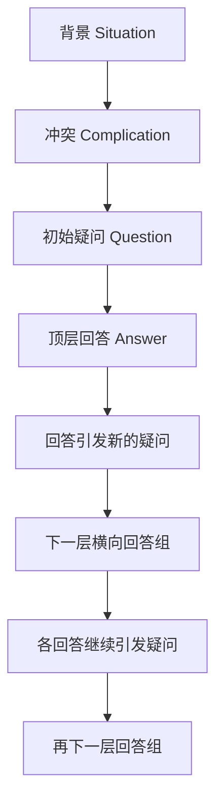
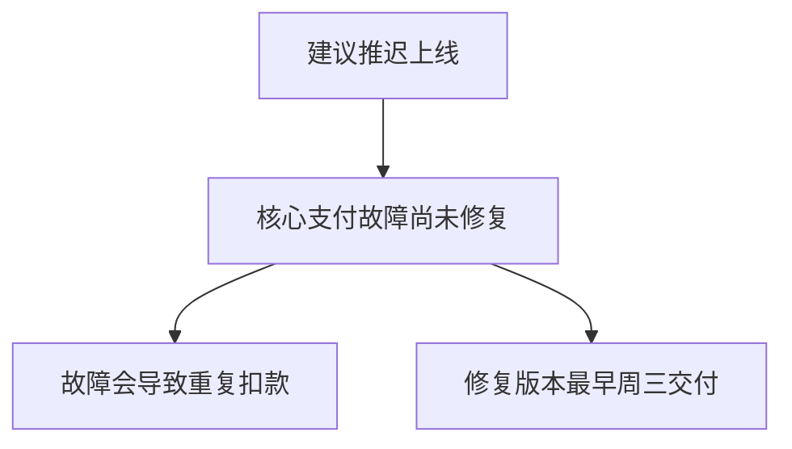
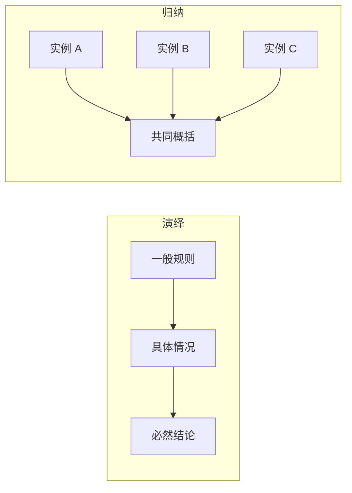
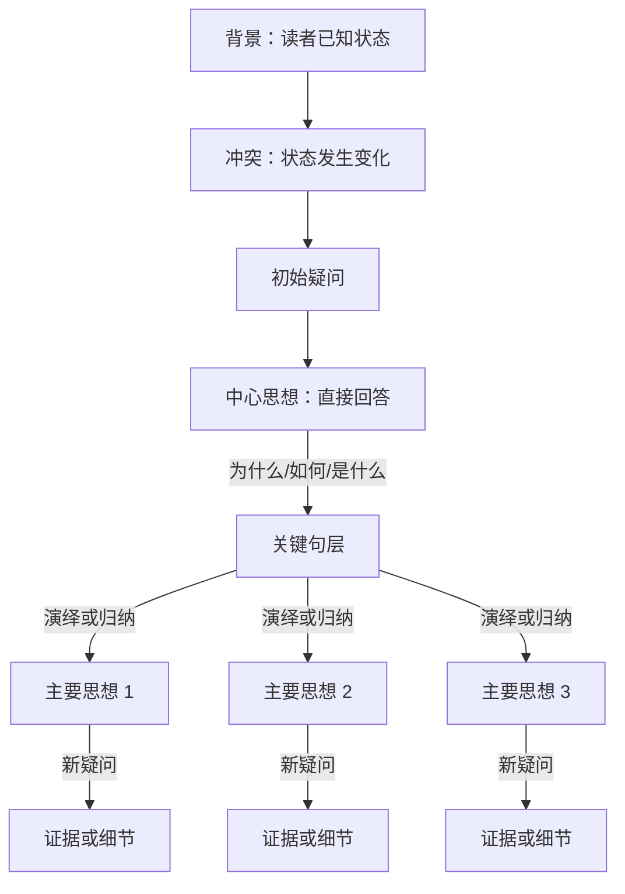

> 阅读范围：第2章“金字塔内部的结构”，包括“纵向关系”“横向关系”“序言的结构”三个小节。
>
> 原文：《金字塔原理》第2章

## 本章定位：从静态外形进入内部运行机制

第1章说明，一篇条理清晰的实用文章应当由一个中心思想统领；上层概括下层，同层思想属于同一范畴并按逻辑顺序组织。第2章进一步追问：

1. 面对一个上层思想，下一层究竟应写什么？
2. 找到若干下层思想后，怎样判断它们在逻辑上成立？
3. 整座金字塔为什么值得读者关注，它最开始在回答什么问题？

作者用三种子结构分别回答：

| 子结构 | 要解决的问题 | 核心机制 |
| --- | --- | --- |
| 纵向关系 | 下一层该写什么 | 上层引发疑问，下层回答疑问 |
| 横向关系 | 同层回答是否合乎逻辑 | 同层思想构成演绎或归纳关系 |
| 序言结构 | 最初的问题从哪里来 | 背景、冲突、疑问、回答 |

三者不是互相独立的写作技巧，而是前后衔接的控制系统：



序言找到初始疑问，顶层思想回答它；顶层回答又引发新疑问，纵向关系决定下一层要回答什么；横向关系则检查同层的多个回答是否构成一个完整、合逻辑的论述。

---

## 第2章 金字塔内部的结构

### 一、为什么知道规则仍然不会立刻写出金字塔

金字塔结构的外形很简单：一个中心思想在顶端，下方分成若干主要思想，每个主要思想又由更具体的思想支撑。但作者指出，知道成品外形并不等于能够直接生产成品。

真正的写作起点往往是：

- 大致知道主题，却不知道准确观点；
- 手中有许多材料，却不知道哪些属于同一组；
- 以为自己已经想清楚，写成句子后才发现含义模糊；
- 知道结论，却无法解释为什么成立；
- 有多个理由，却不知道它们是否重复、遗漏或顺序混乱。

这说明思想并不是一开始就以完整语言和清晰层级存在于头脑中。把想法写下来，不只是记录思想，也是检验思想。模糊想法一旦被要求变成有主语、有谓语、可判断真假的句子，其空缺和矛盾才会暴露。

因此，本章区分两个任务：

1. **结果约束**：最后的文章必须形成规范金字塔；
2. **生成机制**：写作者要利用内部关系发现、分类和梳理尚未清楚的思想。

三种子结构的价值就在第二项。它们不只用于检查成稿，也用于追问和生成内容。

### 二、金字塔不是只有上下层级

图 2-1 表面上是一棵树：顶层连接几个中层方框，中层再连接底层方框。若只看到父子节点，容易把金字塔理解为普通目录。作者强调，内部至少存在三类不同约束：

- **主题与子主题之间的纵向关系**；
- **各子主题之间的横向关系**；
- **序言建立的叙述关系**。

目录只告诉人“分了几节”，内部结构则要回答：为什么分、每节共同证明什么、读者为何会问这个问题。一个层级漂亮的提纲，如果没有这些关系，仍然只是分类外壳。

---

## 纵向关系

### 一、线性文字为什么会掩盖层级思想

#### 要解决的问题

文章在纸面上是一维序列，读者看到的是句子 1、句子 2、句子 3 依次向下排列。但思想并非只存在“前一句和后一句”的关系，还处在不同抽象层级。

例如：

```text
建议推迟上线。
核心支付故障尚未修复。
故障会导致重复扣款。
供应商最早周三交付修复版本。
```

从表面看，这是四个连续句子；从逻辑看：

- “建议推迟上线”是上层结论；
- “支付故障未修复”是支持结论的理由；
- “重复扣款”和“周三才修复”又解释为什么该故障构成当前上线障碍。

如果只按文本位置理解，就看不出抽象层级。金字塔把隐藏关系显性化：



### 二、什么是纵向关系

#### 直觉含义

上层思想提出一个让读者自然追问的问题，下层思想负责回答。回答本身又包含新信息，于是引发进一步追问，再由更下一层回答。

#### 严格定义

设金字塔中某个思想为 $I_k$。若受众在接受 $I_k$ 后会自然产生疑问 $Q(I_k)$，而其直接下层思想组 $D(I_k)$ 正好回答该疑问，则称 $I_k$ 与 $D(I_k)$ 构成纵向关系：

$$
D(I_k)=\operatorname{Answer}(Q(I_k))
$$

同时，下层思想组的整体意义必须支持或解释上层思想：

$$
I_k=\operatorname{Summary}(D(I_k))
$$

这两个式子描述同一关系的两个方向：

- 自上而下看，下层回答上层引发的疑问；
- 自下而上看，上层概括下层回答的共同意义。

### 三、作者如何定义“思想”

本章把金字塔方框中的“思想”定义为：**向受众传递新信息并引发受众疑问的语句。**

这一定义有四个要点。

#### 1. 思想必须表现为语句

只有名词或宽泛主题还不是完整思想。

- “市场份额”只是主题；
- “公司市场份额将在明年下降”才是思想。

完整语句包含对主题的判断，读者才能追问“为什么会下降”“依据是什么”。

#### 2. 思想相对于特定受众是新信息

同一句话对一位读者可能是新信息，对另一位读者可能是常识。所谓“新”不是绝对属性，而取决于受众已有知识。

#### 3. 新信息会改变受众的认知状态

它可能增加事实、改变判断、提出建议或要求行动。若一句话完全重复受众已知内容，它通常只适合作为背景，不应占据正文关键节点。

#### 4. 思想会引发逻辑疑问

读者并非必然在心理上感到惊讶，但会需要知道该判断如何成立、如何实施或具体意味着什么。

### 四、思想通常引发哪些疑问

疑问由上层思想的谓语性质决定，常见类型包括：

| 上层思想形式 | 受众自然疑问 | 下层回答通常是什么 |
| --- | --- | --- |
| “应当做 X” | 为什么应当做？ | 支持理由 |
| “应当通过 Y 做到 X” | 如何实施？ | 行动步骤 |
| “问题是 Z” | 为什么说是问题？ | 症状、影响或证据 |
| “系统包括 A” | 具体包括什么？ | 组成部分 |
| “结果将改善” | 为什么会改善？ | 因果机制或预测依据 |
| “方案是可行的” | 如何判断可行？ | 评价标准和证据 |

疑问不是由作者随意挑选。若上层说“应当收购该公司”，下层却回答“如何整合系统”，就跳过了受众首先会问的“为什么要收购”。除非受众已明确接受收购决定，否则结构顺序不合时机。

### 五、疑问/回答式对话如何逐层展开

设顶层思想为 $I_0$，它引发疑问 $Q_1$；下一层思想组 $I_{1,1},I_{1,2},\ldots$ 回答 $Q_1$。其中每个思想又可能引发自己的疑问：

$$
I_0\rightarrow Q_1\rightarrow\{I_{1,1},I_{1,2},\ldots,I_{1,n}\}
$$

$$
I_{1,j}\rightarrow Q_{2,j}\rightarrow\{I_{2,j,1},I_{2,j,2},\ldots\}
$$

由此形成多个向下展开的分支。读者沿一个分支追问到足够具体后，作者再返回较高的关键句层，展开下一个主要分支。

### 六、什么是关键句层

**关键句层**是金字塔顶层回答下面的第一组主要思想。它们是全文的骨架，共同直接解释或支持中心思想。

例如：

```text
中心思想：建议购买英国莱兰公司的特许经营权。
├── 关键句 1：市场增长快、零售竞争小
├── 关键句 2：可以产生较高经济效益
└── 关键句 3：业务容易引入
```

读者若追问关键句 1，作者进入该分支的细节；回答充分后，再返回关键句层展开关键句 2。关键句层因此兼具两种作用：

- 向上共同支撑中心思想；
- 向下分别统领各自的详细论证。

### 七、何时停止向下回答

原书说，应持续回答，直到认为读者不会再对新表述提出疑问。实践中不能把这句话理解成穷尽世界上所有可能追问，而应根据以下标准停止：

1. 已达到受众完成当前判断或行动所需的细节；
2. 再向下的材料属于受众已知常识；
3. 证据已经达到该结论所需的可靠程度；
4. 进一步细节更适合放入附件或按需提供；
5. 剩余疑问超出文章范围，并已明确边界。

停止深度取决于受众、任务和风险。高风险投资决策需要比日常进度通知更深的证据。所谓“读者不再疑问”，指当前沟通目的下不再存在必须回答的结构性疑问，并非要求读者毫无异议。

### 八、清楚不等于同意

作者特别强调，读者可能不同意论证，却仍能清楚理解作者如何从一个思想走到下一个思想。

这一区分非常重要：

| 评价 | 核心问题 | 判定依据 |
| --- | --- | --- |
| 清晰性 | 我能否看懂你怎样推理？ | 关系是否显性、层级是否连续 |
| 有效性 | 结论是否由前提推出？ | 推理形式是否成立 |
| 真实性 | 前提和证据是否符合事实？ | 数据、来源和观察是否可靠 |
| 说服力 | 我是否接受你的结论？ | 还受价值、风险和利益影响 |

金字塔结构首先提高的是清晰性，也帮助检查有效性，但不能自动保证前提真实，更不能强迫读者认同价值判断。

### 九、为什么信息必须在读者需要时出现

作者提出一条时序原则：不要在没有准备好回答时引发疑问，也不要在读者尚未产生疑问时提前给出孤立答案。

#### 过早引发疑问

若标题声称“当前方案存在致命风险”，正文却连续数页讨论背景，读者会一直悬着“什么风险”，注意力被未回答问题占用。

#### 过早给出答案

若在提出主要问题前先放一章“我们的假设”，读者不知道这些假设要回答什么，也难以判断其重要性。之后正式提出问题时，作者还可能不得不重复。

#### 合理时序

```text
建立相关背景
→ 引出受众疑问
→ 及时给出回答
→ 回答引发下一层疑问
→ 立即在下层展开
```

这是一种“按需提供信息”的原则。它降低无上下文信息的暂存负担，也保持读者对当前问题的注意。

### 十、切斯特顿的“猪应当被当作宠物养”案例

原书借 G. K. 切斯特顿的幽默论述展示纵向对话。

#### 顶层思想

> 猪应当被当作宠物养。

它立刻引发“为什么”的疑问。下一层给出两个理由：

1. 猪很漂亮；
2. 猪可以培育出很多品种。

这两个理由共同回答顶层疑问。

#### 展开“猪很漂亮”分支

“猪很漂亮”又引发“为什么漂亮”。下一层回答：

- 猪很肥；
- 猪具有典型的英国特征。

“猪很肥”继续引发“肥胖为什么漂亮”，再回答：

- 肥胖使别人显得苗条；
- 肥胖使肥胖者更谦虚，因为总有人比他更胖。

“具有典型英国特征”继续引发“这为什么漂亮”，论述再沿“大地联系、权力与仁慈并存、国家象征”等思想向下展开。

#### 图 2-2 的结构意义

```mermaid
flowchart TD
    A[猪应当被当作宠物养] -->|为什么| B[猪很漂亮]
    A -->|为什么| C[猪可以培育出很多品种]
    B -->|为什么漂亮| D[猪很肥]
    B -->|为什么漂亮| E[具有典型的英国特征]
    D -->|肥胖为何漂亮| F[使其他人显得苗条]
    D -->|肥胖为何漂亮| G[使肥胖者更谦虚]
    E -->|为何体现英国之美| H[与大地连接]
    H --> I[说明权力与仁慈可以并存]
    I --> J[符合英国特点，可作国家象征]
```



这个案例有效展示了“每个新思想引发疑问，下层紧接着回答”的节奏。读者即使认为观点荒诞，也不会迷失在结构中。

#### 案例的逻辑局限

清楚的纵向关系并不意味着论证充分：

- “漂亮”是否足以推出“适合做宠物”，中间缺少饲养标准；
- “肥胖使别人显瘦”是相对比较，并不必然说明猪本身漂亮；
- “典型英国特征”与“漂亮”之间包含价值前提；
- “可以培育很多品种”是否支持家庭饲养，也需额外机制。

作者选择这个幽默例子，正好凸显结构清晰与观点正确可以分离。它证明的是读者能跟上论述，不是结论已经被严格证明。

### 十一、英国莱兰公司特许经营权案例

图 2-3 把同样机制用于一份约 20 页的商业备忘录。顶层建议是购买英国莱兰公司的特许经营权，下一层给出三个主要理由：

1. 业务将快速增长；
2. 将产生经济效益；
3. 容易引入。

每个理由再由更具体信息支持：

```text
购买英国莱兰公司的特许经营权
├── 将快速增长
│   ├── 市场份额大
│   └── 零售竞争小
├── 将产生经济效益
│   ├── 成本低
│   ├── 销售额增长
│   └── 利润增长
└── 容易引入
    ├── 属于独立业务
    ├── 可以使用相同的管理人员
    └── 管理流程简单
```

#### 纵向检查

- “为什么购买？”由增长、效益和易引入回答；
- “为什么会增长？”由市场和竞争条件回答；
- “为什么有经济效益？”由成本、销售额和利润回答；
- “为什么容易引入？”由业务独立性、人员复用和流程简单回答。

#### 这个结构带来的价值

读者不再负责发现作者在谈什么，只需逐层检查：

- 三个理由是否足以支持购买；
- 市场份额和竞争情况是否真的说明增长；
- 销售额、成本和利润预测是否可靠；
- 整合难度是否被低估。

结构把认知任务从“恢复作者思路”转化为“审查作者思路”。这正是商务沟通所需的效率。

#### 商业论证仍需补充什么

图示只展示结构骨架，真实投资决策还需要：

- 收购价格和资金成本；
- 预测期限及不确定性；
- 监管、品牌和运营风险；
- 与替代投资的比较；
- 最坏情境和退出机制。

金字塔告诉人这些材料应放在哪里，却不替代商业尽职调查。

### 十二、纵向关系为什么能够吸引注意

作者把吸引力归因于疑问/回答式对话。完整推导是：

1. 受众遇到与自己相关的新判断；
2. 新判断形成认知缺口，例如“为什么”“如何”；
3. 人倾向于填补这个缺口；
4. 下层思想及时回答，带来局部闭合；
5. 回答中的新信息又产生更具体的缺口；
6. 受众因此沿作者设计的路径继续阅读。

这一机制成立需要两个前提：

- 顶层思想与受众有关；
- 下层确实回答了被引发的疑问。

若问题与受众无关，或者下层答非所问，纵向结构不会自动产生兴趣。这也引出序言必须负责建立相关性。

---

## 横向关系

### 一、为什么“回答了问题”仍然不够

纵向关系规定下一层要回答什么，却没有保证回答本身合乎逻辑。

例如，上层问“为什么要推迟上线”，下层列出：

- 支付系统存在故障；
- 我们应当增加测试人员；
- 上线后客户可能投诉。

三句话都与上线有关，但分别是原因、措施和后果，不能作为同一层的并列理由。要形成清晰回答，同层思想必须具有明确逻辑关系。

### 二、什么是横向关系

#### 直觉含义

横向关系回答：同一层的这些思想为什么放在一起，它们怎样共同完成对上层疑问的回答？

#### 严格定义

设上层思想 $I$ 引发疑问 $Q$，直接下层思想组为：

$$
G=\{g_1,g_2,\ldots,g_n\}
$$

若 $G$ 整体回答 $Q$，且组内思想构成一个可识别的演绎或归纳论述，则称 $G$ 具有横向关系。

横向检查包含两层：

1. **相关性检查**：每项都回答同一个上层疑问；
2. **推理检查**：这些回答之间形成演绎推进或归纳并列。

### 三、为什么作者只讨论演绎和归纳

在本书框架中，同层思想只有两种基本组织方式：

- **演绎**：前一个思想成为后一个思想推导的基础，最终得到结论；
- **归纳**：多个同类事实或判断共享共同属性，由此提炼更一般的概括。

二者分别对应两种方向：



演绎强调结论从前提中推出；归纳强调从多个实例中识别共同点。

现实推理还包括溯因推理、类比、统计推断和因果推断等。金字塔原理在写作层面通常把它们整理为演绎链或归纳组。因此，“只有两种”适合作为同层表达的实用分类，不宜当作对所有逻辑学方法的穷尽性定义。

### 四、演绎推理要解决什么问题

当结论依赖一条一般规则和一个具体事实时，仅列出若干同类理由并不能表现其必然联系。演绎推理把前提之间的承接关系明确展示出来。

### 五、演绎推理的严格定义

**演绎推理**是这样一种推理：若前提为真且推理形式有效，结论必然为真。

经典三段论由三部分组成：

1. 大前提：给出一般规则；
2. 小前提：说明某个对象满足规则条件；
3. 结论：把一般规则应用于该对象。

形式化表示为：

$$
\forall x\,(P(x)\rightarrow Q(x))
$$

$$
P(a)
$$

$$
\therefore Q(a)
$$

### 六、苏格拉底案例的完整推导

原书使用经典例子：

1. 所有的人都会死；
2. 苏格拉底是人；
3. 因此苏格拉底会死。

对应关系是：

- $P(x)$：$x$ 是人；
- $Q(x)$：$x$ 会死；
- $a$：苏格拉底。

第一前提规定所有满足 $P$ 的对象都满足 $Q$；第二前提确认苏格拉底满足 $P$；因此可以把规则应用于苏格拉底，推出 $Q(a)$。

### 七、演绎推理中的有效与真实

要接受演绎结论，需要区分两个标准：

- **形式有效**：不存在前提全真而结论为假的情况；
- **论证可靠**：形式有效，并且所有前提事实上为真。

例如：

1. 所有鱼都会飞；
2. 鲤鱼是鱼；
3. 因此鲤鱼会飞。

形式与苏格拉底例子相同，所以形式有效；但大前提为假，整个论证不可靠。金字塔能帮助看见推理形式，却仍要核实前提。

### 八、本书对演绎关系的操作性描述

作者把演绎思想组描述为：

1. 第一个思想陈述某种现象；
2. 第二个思想对第一句的主语或谓语作进一步陈述；
3. 第三个思想说明前两种陈述同时成立时的含义。

这是面向商务写作的简化识别法。其直觉是让第二句抓住第一句中的关键对象或属性，再把两句连接成结论。

例如：

1. 所有高风险变更都必须经过安全委员会批准；
2. 本次数据库迁移属于高风险变更；
3. 因此，本次迁移必须经过安全委员会批准。

第二句把“本次迁移”归入第一句谓语所约束的类别，于是第三句完成应用。

### 九、如何概括演绎思想组

演绎组的上位概括通常以最终结论为核心，并在必要时带上关键原因：

> 因为苏格拉底是人，所以苏格拉底会死。

不能只把三个句子概括为“关于苏格拉底的讨论”，因为这没有表达推理结果。也不能把大前提原样放到上层，因为整组的新增信息落在最终结论。

### 十、归纳推理要解决什么问题

当多个事实彼此并不承前启后，却表现出共同属性或共同趋势时，需要从具体实例中提炼上位判断。这就是归纳。

### 十一、归纳推理的严格定义

**归纳推理**是从若干具体观察或同类判断中识别共同属性，并推断一个覆盖范围更广的概括。即使前提为真，结论通常也只是得到不同程度的支持，而非逻辑必然。

设观察为：

$$
P(a_1),P(a_2),\ldots,P(a_n)
$$

归纳可能推出：

$$
\text{这些对象共同属于类别 }C
$$

或者进一步预测：

$$
\text{未观察对象也可能具有 }P
$$

第一类是分类概括，第二类包含超出样本的预测，风险更高。

### 十二、波兰边境坦克案例的完整推导

原书给出三个事实：

- 法国坦克抵达波兰边境；
- 德国坦克抵达波兰边境；
- 俄国坦克抵达波兰边境。

三项都可冠以同一名词：“针对波兰边境的坦克军事行动”。据此，作者示例性推断“波兰将受到坦克入侵”。

推导过程是：

1. 多个国家的坦克都在同一边境聚集；
2. 坦克是具有攻击能力的军事装备；
3. 多方在边境同步部署不太像普通孤立事件；
4. 最能共同解释这些观察的假设之一，是即将发生针对波兰的军事行动；
5. 因而预测波兰可能遭到坦克入侵。

### 十三、坦克案例依赖的假设

这个结论不是演绎必然，至少依赖：

- 情报来源真实且时间一致；
- “抵达边境”意味着面向波兰部署；
- 部署不是演习、撤退、运输中转或联合防御；
- 各国行动之间具有共同意图，而非巧合；
- 坦克数量、后勤和战备状态足以支持入侵；
- 没有更合理的替代解释。

若这些假设不成立，结论可能被削弱。因此，更严谨的表达应保留不确定性：

> 多国坦克同时抵达波兰边境，显著提高了波兰遭受装甲入侵的风险，但仍需结合部队规模、后勤部署和政治情报确认。

这既保留原书要展示的归纳结构，也避免把概率推断写成必然事实。

### 十四、如何概括归纳思想组

归纳概括需要两步：

1. 找出组内思想共享的属性；
2. 说明这些共同属性在当前问题中意味着什么。

仅写“这些都是坦克活动”完成了分类，却没有完成有信息量的推论；写“波兰面临装甲军事行动风险”才表达了共同意义。

一个有效归纳概括应满足：

- 覆盖组内每项；
- 不超出证据能支持的范围；
- 使用一致分类维度；
- 明确事实、趋势与预测之间的差别。

### 十五、同一个名词检验

作者建议，归纳组中的思想应能用同一个复数名词表示，例如：

- 三个支持原因；
- 四个反对理由；
- 五个实施步骤；
- 三类问题；
- 两项必要变革。

若第一项是“原因”，第二项是“步骤”，第三项是“结果”，说明它们不应处于同一层。

但同名词检验只是最低门槛。三项都叫“原因”后，还要检查是否解释同一结果、是否处于同一因果层级、是否重复，以及是否遗漏关键原因。

### 十六、为什么同一组不能既是演绎又是归纳

演绎与归纳对组内位置的要求不同：

- 演绎组中，思想前后依赖，第三项由前两项推出；
- 归纳组中，各项地位并列，共享共同属性，由上层概括统摄。

如果一组三项既被当作承前启后的前提链，又被当作并列同类证据，读者无法判断每项承担什么逻辑角色。

不过，整篇文章可以混合使用：

- 顶层三个理由构成归纳组；
- 某个理由下方再用演绎三段论证明；
- 演绎结论下方还可以归纳多项证据。

限制针对的是**同一个直接思想组**，不是整座金字塔只能选择一种推理方式。

### 十七、演绎与归纳对比

| 维度 | 演绎 | 归纳 |
| --- | --- | --- |
| 方向 | 从一般规则应用到具体对象 | 从具体实例提炼共同判断 |
| 组内关系 | 前后承接 | 同类并列 |
| 结论强度 | 前提真且形式有效时必然真 | 通常只得到概率性支持 |
| 概括重点 | 最终结论及其关键原因 | 全组共同属性及其含义 |
| 主要风险 | 形式错误或前提虚假 | 样本不足、分类错误、过度推广 |
| 顺序可否交换 | 通常不可随意交换 | 可按结构、时间或重要性排序 |

### 十八、补充：溯因推理与因果推断

坦克案例严格说还带有**溯因推理**色彩：从观察到的结果寻找最佳解释。很多商务判断也是如此，例如“销量下降、投诉增加、复购降低，最可能的共同原因是产品质量恶化”。

使用时应：

1. 列出多个可能解释；
2. 判断各解释能覆盖多少事实；
3. 寻找能区分解释的额外证据；
4. 不把“最佳当前解释”误写成确定事实。

金字塔可以把这些解释和证据组织清楚，但无法替代实验、统计分析或因果识别。

### 十九、横向关系的实用检查

面对一组下层思想，可以依次问：

1. 它们是否回答同一个上层疑问？
2. 它们是前后承接，还是同类并列？
3. 若前后承接，结论是否真由前提推出？
4. 若同类并列，能否用同一名词表示？
5. 归纳概括是否超出样本和证据？
6. 每项是否处在相同抽象层级？
7. 是否存在反例、遗漏或替代解释？

---

## 序言的结构

### 一、为什么有逻辑仍可能无人关心

一座金字塔可以内部严密，却回答了读者并不关心的问题。纵向关系能让读者沿疑问前进，前提是最初的思想已经与读者相关。

例如，一份给财务负责人的报告从“我们重构了缓存模块”开始，即使后续技术论证严谨，对方仍可能不知道这与预算或业务风险有什么关系。若改为“当前缓存故障可能造成月底结算中断，需要批准紧急扩容预算”，相关性就建立起来了。

因此，序言的任务不是装饰文章，而是找到并唤起读者头脑中的**初始疑问**。

### 二、什么是初始疑问

**初始疑问**是读者在理解相关背景和发生的变化后，自然希望文章回答的第一个核心问题。

它是全文的生成点：

- 顶层思想回答初始疑问；
- 顶层回答引发后续疑问；
- 后续疑问沿纵向关系展开；
- 同层答案通过横向关系组织。

若初始疑问判断错误，后面的金字塔即使完美，也可能答非所问。

### 三、相关性从哪里来

作者认为，读者通常只会主动寻找自己已有问题的答案，或者在看到周围变化后很快产生问题。因此，文章要么回答一个已存在的问题，要么通过序言让读者意识到某个与自己相关的问题。

相关性通常来自：

- 读者的目标受到阻碍；
- 已知状态发生变化；
- 出现风险、机会或矛盾；
- 读者需要作出决定或行动；
- 现有解释不足以理解新现象。

序言通过追溯问题的起源和发展，让作者与读者站到同一个认知起点。

### 四、SCQA 的四个要素

原书把讲故事式序言概括为背景、冲突、疑问、回答，即 SCQA。

#### 1. 背景 Situation

**要解决的问题**：若直接抛出结论，读者可能不知道适用范围、时间和共同前提。

**定义**：背景是读者已经知道或能够容易接受的、与主题直接相关的稳定事实，用于确定时间、地点、主体和当前状态。

背景应满足：

- 真实且双方基本认同；
- 与后续冲突直接相关；
- 只包含唤起问题所需的信息；
- 不提前塞入尚未解释的争议判断。

背景不是从公司成立史开始的百科介绍。它的长度由引出冲突需要决定。

#### 2. 冲突 Complication

**要解决的问题**：只有稳定背景，读者没有理由继续阅读，也不会产生疑问。

**定义**：冲突是打破背景稳定状态的事件、变化、障碍、矛盾或机会，使现状不能无条件延续。

常见冲突包括：

- 目标与现状之间出现差距；
- 原有方案失效；
- 外部环境变化；
- 出现新的机会但必须选择；
- 多个要求互相冲突；
- 已采取行动却得到意外结果。

冲突不一定是坏消息。新市场机会也会打破稳定状态，引出“是否进入、如何进入”的疑问。

#### 3. 疑问 Question

**要解决的问题**：冲突可能引出多个问题，作者必须确认本文究竟回答哪一个。

**定义**：疑问是目标受众根据背景与冲突自然提出、且文章有责任回答的核心问题。

好的疑问应：

- 对受众真实相关；
- 能由背景与冲突自然推出；
- 范围与文章能力匹配；
- 可以由一个明确顶层思想回答。

疑问可以不在正文中写成问句，但作者必须在构思时把它写清楚。

#### 4. 回答 Answer

**要解决的问题**：序言不能只制造焦虑，必须把读者带到文章的中心思想。

**定义**：回答是对初始疑问的直接回应，也是正文金字塔顶端的中心思想。

回答必须是完整判断，而不只是“讨论如下问题”。例如：

- 弱回答：“关于董事会改革的建议”；
- 强回答：“董事会应把日常运营交给执行委员会、引入独立董事并建立规范流程。”

### 五、SCQA 为什么以故事形式出现

问题具有时间和因果来源：先有某种状态，后来发生变化，变化使受众产生问题，作者才提出答案。这天然具有叙述结构。

$$
S\xrightarrow{状态被打破}C\rightarrow Q\rightarrow A
$$

“讲故事”在这里不是虚构、煽情或追求文学悬念，而是按问题实际产生的顺序恢复共同语境。它让读者理解：

- 我们原来处于什么状态；
- 现在发生了什么；
- 为什么必须讨论这个问题；
- 作者给出的答案是什么。

### 六、为什么 SCQA 能让作者与读者站在同一位置

作者可能经历了数周调查，读者却刚打开报告。若作者直接从调查中段开始，双方认知状态不同。

背景提供共同已知，冲突指出共同需要面对的变化，疑问确认双方正在解决同一个问题。完成这三步后，读者才有条件评价回答。

SCQA 的有效性依赖：

- 作者准确了解读者已知什么；
- 背景没有把未知事实伪装成共识；
- 冲突确实能引出该疑问；
- 回答正面回应疑问。

### 七、无结构的董事会备忘录

原书先给出一种常见开头：声称备忘录用于进一步思考、讨论并征集建议，然后直接列出五个主题，包括董事会人数、董事会与执行委员会职责、独立董事、成员选举任期和运作方式。

这段文字的问题不是主题不重要，而是缺少问题结构：

- 为什么现在要讨论这些主题？
- 五项是否属于同一层级？
- 读者需要作出什么决定？
- 作者只是征集意见，还是已有建议？
- 这些事项共同要解决什么冲突？

“本备忘录的目的是讨论……”只说明文档动作，没有说明业务目的。读者得到一张议题清单，却不知道这些议题为何成为一个整体。

### 八、用 SCQA 重写董事会备忘录

原书的改写可以映射为：

#### 背景 S

10 月将成立新机构，接管两个部门的日常事务。董事会因此可以从日常琐事中解脱，转向自己特有的决策与规划职责。

#### 冲突 C

董事会长期陷在短期运营问题中，目前无法有效把工作重心转向长期战略。

#### 疑问 Q

董事会需要进行哪些变革，才能完成从日常运营到战略治理的重心转移？

#### 回答 A

董事会应考虑三项变革：

1. 把日常运营交给执行委员会；
2. 扩大董事会并吸纳独立董事；
3. 制定规范内部运作的政策和流程。

### 九、董事会案例的完整推导

1. 新机构即将接管日常事务，这是已发生或已决定的背景变化；
2. 理论上，董事会因此应转向战略职责；
3. 但长期工作习惯和治理结构仍围绕短期运营，形成能力与机制冲突；
4. 所以自然问题不是笼统的“董事会有哪些议题”，而是“怎样完成工作重心转移”；
5. 回答应是实现转移所需的变革；
6. 三项建议分别处理职责分配、人员构成和运行机制；
7. 它们共同构成一个结构性改革方案。

重写后，原来的五个议题不必全部消失，而应归入三项变革下作为细节。例如，成员人数、选举和任期可以成为“扩大董事会并引入独立董事”的下层问题；董事会与执行委员会职责则归入“交出日常运营”。

这说明金字塔不是删掉复杂性，而是为复杂性找到上位意义。

### 十、董事会案例的假设与边界

三项建议成立依赖：

- 新机构确实有能力接管日常事务；
- 董事会的主要价值应转向长期决策和规划；
- 当前障碍主要来自职责、构成和流程，而非信息系统或激励机制；
- 独立董事能提高战略治理质量；
- 执行委员会与董事会之间可以建立有效授权和监督。

若新机构能力不足，立即移交运营可能产生控制风险；若问题主要是董事缺少行业知识，仅扩大人数也未必有效。因此，SCQA 可以让建议相关且清晰，但建议本身仍需证据验证。

### 十一、疑问是否必须写出来

不一定。序言可以写成：

> 新机构将接管日常运营，但董事会目前仍缺少转向战略治理所需的职责、人员和流程安排。因此，董事会应进行以下三项变革……

疑问“应进行哪些变革”虽然没有显式出现，读者仍会自然产生。是否显式写问句取决于文体和节奏；构思时则必须明确，否则难以检验回答是否正面。

### 十二、SCQA 的常见变体

本章给出基本顺序，实际表达可以根据读者已知内容省略或调整表面次序，但逻辑功能不能缺失。

#### 标准式：S-C-Q-A

适合正式报告，逐步建立共同背景。

#### 开门见山式：A-S-C

先给高层结论，再用背景和冲突简要解释，适合高管摘要和紧急沟通。隐含疑问仍由 S-C 产生。

#### 冲突优先式：C-S-Q-A

适合危机通知，先说明变化或风险，再补充必要背景。

无论表面顺序怎样，都应能恢复出：什么状态、发生何种变化、产生什么问题、回答是什么。

### 十三、SCQA 不适合怎样使用

#### 1. 人为制造戏剧冲突

冲突必须来自真实变化，不应为吸引注意而夸大风险。

#### 2. 把所有背景都塞进序言

只保留引出疑问所必需的信息。详细历史、方法和数据可以放到正文或附件。

#### 3. 用假问题配既定答案

如果读者真正关心“方案是否安全”，作者却构造“如何尽快上线”来推销既定方案，相关性只是表面成立。

#### 4. 冲突与疑问不相连

背景说成本上升，冲突说人员流失，最后却问品牌如何升级，读者无法自然过渡。

#### 5. 回答只是主题重复

“我们需要研究董事会问题”没有回答“应怎样改革”。顶层必须包含可判断的主张。

### 十四、序言与正文的边界

序言负责把读者带到初始疑问和顶层回答，不负责证明所有细节。正文负责沿金字塔展开回答的依据。

判断某信息放序言还是正文，可以问：

- 缺少它，读者还能否自然提出初始疑问？
- 它是双方已知背景，还是需要证明的新信息？
- 它是冲突的一部分，还是回答的证据？

需要论证的新判断通常不应悄悄放进背景，否则作者相当于把争议前提伪装成共识。

---

## 三种子结构如何共同工作

### 一、各自控制不同错误

| 子结构 | 能发现的典型错误 |
| --- | --- |
| 序言 | 回答了读者不关心的问题；背景与冲突不相关；答案未回应初始疑问 |
| 纵向关系 | 下层答非所问；层级跳跃；该解释的地方没有展开 |
| 横向关系 | 同层混类；演绎无效；归纳过度；项目之间无共同逻辑 |

### 二、完整的信息流



### 三、三个检验问题

每构建一层，都可以依次问：

1. **相关性**：这一层最终是否服务于序言引出的初始疑问？
2. **纵向性**：下一层是否正面回答上层思想引发的疑问？
3. **横向性**：同层回答是否构成清楚的演绎或归纳关系？

只有三项同时成立，结构才既相关、连续又合乎逻辑。

---

## 综合示例：是否应推迟系统上线

### 一、原始信息

- 公司计划下周一上线结算系统；
- 核心回归测试已完成 92%；
- 剩余测试涉及高峰并发；
- 当前压测容量只有目标的 70%；
- 扩容配置预计周三完成；
- 市场团队已经通知客户周一切换；
- 延期会增加一周并行系统成本；
- 容量不足可能造成结算中断。

直接罗列时，受众需要自行判断这些信息共同回答什么。

### 二、序言确定初始问题

**背景 S**：公司计划下周一上线结算系统，市场和客户已按该时间准备切换。

**冲突 C**：高峰容量测试尚未通过，当前容量仅为目标的 70%，扩容最早周三完成；按期上线可能造成结算中断。

**疑问 Q**：应当按期上线，还是推迟到扩容和测试完成后？

**回答 A**：应将全面上线推迟到周三以后，同时通知客户调整切换计划。

### 三、纵向展开

回答引发“为什么要推迟”的疑问，下一层给出：

1. 当前容量不能满足高峰需求；
2. 容量缺口可能中断关键结算；
3. 缺口可在短期内通过扩容和补测关闭。

“为什么说当前容量不够”继续由压测数据、容量模型和峰值预测回答；“为什么中断不可接受”继续由业务影响、恢复时长和合规要求回答。

### 四、横向检查

上面三项并不完全处于同一类型：第一项是事实判断，第二项是风险后果，第三项是替代行动的可行性。若把它们作为三个并列“原因”，分类仍不稳定。

可以改成演绎链：

1. 不能承受峰值负载且会中断关键业务的系统，不应全面上线；
2. 当前系统只能达到目标容量的 70%，峰值时可能中断结算；
3. 因此，当前不应全面上线。

然后在下一组归纳给出实施安排：

- 周三完成扩容；
- 扩容后重新进行高峰测试；
- 通过测试后再安排全面切换；
- 立即通知市场和客户调整时间。

### 五、结构化成稿

```text
应将全面上线推迟到扩容和测试完成后。
├── 为什么不能周一全面上线（演绎）
│   ├── 无法承受峰值且会中断关键业务的系统不应上线
│   ├── 当前容量仅达目标 70%，可能中断结算
│   └── 因此当前不满足上线条件
└── 如何完成延期后的上线（归纳：实施步骤）
    ├── 周三完成扩容
    ├── 重新执行高峰容量测试
    ├── 测试通过后全面切换
    └── 通知市场和客户调整计划
```

### 六、假设、边界与替代方案

结论依赖：

- 容量测试能代表真实峰值；
- 结算中断的损失高于延期成本；
- 周三扩容计划可靠；
- 没有安全的流量限制或灰度方案。

若可以先让 10% 客户灰度切换，并设置自动回退，替代答案可能是“保留周一小范围上线，全面上线延期”。结构方法不会替代风险计算，却会迫使作者把关键假设和替代路径放到正确位置。

---

## 易混淆概念辨析

### 纵向关系与因果关系

纵向关系是上层疑问与下层回答之间的解释/支持关系，不一定都是因果。上层问“系统由什么构成”，下层列组成部分，也构成纵向关系，却不是因果链。

### 横向关系与并排列点

并排列点只是视觉上处于同一级；横向关系还要求各项回答同一问题，并构成演绎或归纳逻辑。

### 新信息与重要信息

新信息是相对受众未知而言，重要信息则由任务和决策影响决定。新信息可能无关紧要，重要背景也可能早已为双方所知。序言使用已知背景，正文重点展开相关的新信息。

### 疑问与反对意见

疑问是理解新思想所需的下一步问题，如“为什么”；反对意见是对前提、证据或价值的挑战。清晰结构保证疑问被回答，但还需专门处理重要反对意见。

### 演绎有效与结论真实

形式有效只表示如果前提为真，结论必真；前提本身仍需事实验证。错误前提可以产生形式有效但不可靠的论证。

### 归纳概括与演绎结论

归纳概括超出单个观察，通常具有不确定性；演绎结论已包含在前提逻辑中。二者不能用相同确定程度表述。

### 背景与论据

背景是读者已知或容易认可的共同起点；论据是支持回答的新信息。把待证明论据伪装成背景，会绕过证明责任。

### 冲突与问题

冲突是打破稳定状态的变化，问题是受众因变化而产生的疑问。成本上升是冲突，“如何恢复利润”才是问题。

### 回答与主题

主题告诉读者谈什么，回答告诉读者关于该主题得出了什么判断。“董事会改革”是主题；“董事会应调整职责、构成和流程”是回答。

### 清晰与说服

清晰意味着受众看得懂推理；说服还要求可靠证据、有效推理、价值契合和可接受风险。清晰是说服的重要条件，不是充分条件。

---

## 常见误解与错误做法

### 误解一：每个句子都必须真的写成问答

疑问/回答是隐藏的逻辑结构，不要求正文采用采访体。作者只需确保读者自然产生的疑问由下一层及时回答。

### 误解二：只要一直回答“为什么”就有纵向关系

不同上层思想会引发“如何”“是什么”“哪些部分”等疑问。机械追问“为什么”可能得到不匹配的下层内容。

### 误解三：读者提出任何问题都必须回答

文章只需回答与当前目的、受众和风险相关的问题。边缘问题可明确排除或放入附件，否则金字塔会无限展开。

### 误解四：清楚的观点一定正确

猪的案例结构清楚，却包含可争论的前提和跳跃。结构使问题容易发现，不负责自动修复问题。

### 误解五：演绎比归纳更高级

二者解决不同任务。一般规则应用适合演绎；从事实发现模式适合归纳。错误选择才是问题。

### 误解六：三句话就是三段论

真正的演绎要求前提与结论存在必然关系。把三个相关句子顺次排列，不会自动产生有效演绎。

### 误解七：归纳就是把例子放在一起

归纳还要明确共同属性，并形成不超出证据范围的概括。缺少概括的例子仍是材料堆积。

### 误解八：SCQA 必须机械写出四个标签

SCQA 是构思逻辑，不是固定模板。正式文章无需出现“背景”“冲突”等字样，只要读者能自然恢复这条链。

### 误解九：冲突必须是危机

冲突也可以是机会、选择、意外结果或新目标。它只需打破原有稳定状态并引出疑问。

### 误解十：序言越完整越好

序言只需提供引出问题的最低充分背景。过多历史会延迟回答，增加认知负担。

---

## 本章方法的适用边界与补充工具

### 一、树形金字塔难以表达反馈回路

复杂系统中，A 影响 B，B 又反过来影响 A。单纯上下树形结构可能隐藏循环。可先用因果回路图分析，再把面向决策的主要结论组织成金字塔。

### 二、多对多关系可能不适合单一归属

一项证据可能同时支持多个结论。为了避免重复，可以在主文选择最直接归属，并通过交叉引用或证据矩阵保留多对多关系。

### 三、不确定性需要显式表达

归纳和预测不能只给单一确定结论。应补充概率、置信区间、情景和触发条件。金字塔负责层级，不负责自动量化不确定性。

### 四、初始问题可能需要用户研究

作者不能只凭想象判断读者疑问。重要沟通可通过访谈、会议记录、决策职责和既往反馈验证受众真正关心什么。

### 五、推理正确需要领域方法

- 数据问题需要统计检验；
- 因果问题需要实验或因果识别；
- 投资问题需要现金流和风险分析；
- 法律问题需要法条、事实和适用性判断；
- 技术问题需要测试、测量和复现。

金字塔组织这些结果，但不能替代它们。

### 六、可配合的工具

- **论证图**：标记支持、反驳、前提和证据；
- **因果图**：区分相关、原因、中介和混杂；
- **决策树**：比较不同选择及条件后果；
- **证据矩阵**：追踪每个结论由哪些资料支持；
- **用户旅程或访谈**：识别真实初始问题；
- **流程图**：展开“如何做”的时间关系。

---

## 第二章实践检查清单

### 检查序言与相关性

1. 目标读者是谁，他已经知道什么？
2. 哪个稳定背景与本文主题直接相关？
3. 什么变化、障碍或机会打破了背景？
4. 读者会因此自然提出什么疑问？
5. 文章的中心思想是否直接回答该疑问？
6. 序言中是否混入了需要证明的新论据？
7. 是否提供了无助于引出问题的过量历史？

### 检查纵向关系

8. 顶层思想会让读者问“为什么”“如何”还是“是什么”？
9. 下一层是否正面回答这个疑问？
10. 下层是否跳过了读者尚未接受的中间结论？
11. 每个下层思想又会引发什么新疑问？
12. 细节是否展开到当前受众和风险所需程度？
13. 是否在读者需要之前过早给出孤立答案？
14. 是否提出疑问后拖延太久才回答？

### 检查横向关系

15. 同层思想是否共同回答一个上层疑问？
16. 这一组是演绎关系还是归纳关系？
17. 若是演绎，结论是否必然由前提推出？
18. 演绎前提是否真实、完整且适用于当前对象？
19. 若是归纳，各项能否用同一个名词表示？
20. 归纳结论是否超出了观察范围？
21. 是否遗漏反例或更合理的替代解释？
22. 同一组是否混合了承接推理和并列分类？

### 检查整体闭环

23. 每个正文分支是否最终服务于初始疑问？
24. 关键句层能否作为全文骨架独立读懂？
25. 读者能否看懂推理，即使他不同意结论？
26. 文章是否把事实真实性、推理有效性和表达清晰性分开处理？
27. 哪些内容应留在正文，哪些可降到附件？

---

## 本章小结

第2章揭示了金字塔内部的三种运行机制：

1. 线性文字掩盖了思想的抽象层级，金字塔把隐藏的上下和同层关系显性化。
2. 一个“思想”是向特定受众传递新信息并引发疑问的完整语句，而不只是主题名词。
3. 纵向关系把表达组织成连续的疑问/回答式对话：上层引发疑问，下层及时回答，回答再引发新疑问。
4. 关键句层是中心思想下面的第一组主要思想，它们共同支撑顶层并分别统领详细分支。
5. 信息应在读者需要时出现；过早提出未回答的问题或提前给出无上下文答案，都会增加认知负担。
6. 猪的案例说明结构可以清楚而观点仍可争论；清晰性、逻辑有效性、事实真实性和最终说服力必须分开评价。
7. 莱兰特许经营权案例说明，商业读者在结构明确后，可以把精力用于审查增长、效益和整合难度，而非猜测作者主线。
8. 横向关系要求同层回答构成演绎或归纳论述，不能只是若干相关句子的并列。
9. 演绎从一般规则和具体事实推出必然结论；形式有效不等于前提真实。
10. 归纳从同类事实提炼共同判断；结论通常具有不确定性，必须说明样本、假设和替代解释。
11. 同一个直接思想组不能同时按演绎承接和归纳并列组织，但不同分支和层级可以混合使用两种方法。
12. 序言通过背景、冲突、疑问、回答找到读者的初始问题，并把顶层思想放到与受众相关的语境中。
13. 董事会案例说明，SCQA 能把五个零散议题重组为“如何转向战略治理”这一问题下的三类结构性变革。
14. 三种子结构分别保证相关性、纵向连续性和横向逻辑性；缺少任何一种，金字塔都可能只是形式整齐。

本章最核心的方法可以压缩成一句话：**先用序言确认读者真正的问题，再让每个上层思想引发一个明确疑问，用下一层的演绎或归纳思想组回答，直至达到受众作出判断所需的具体程度。**
