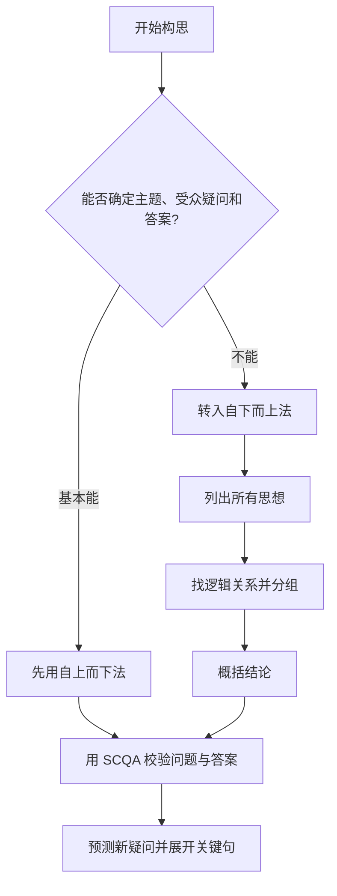
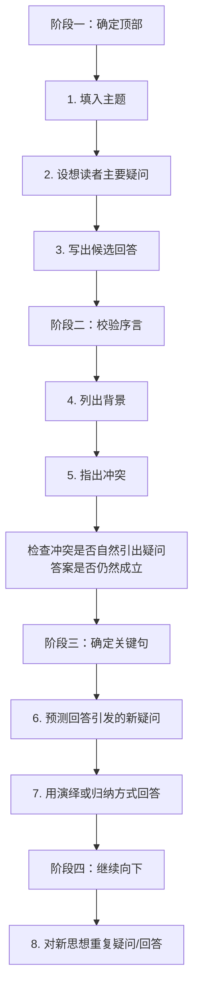
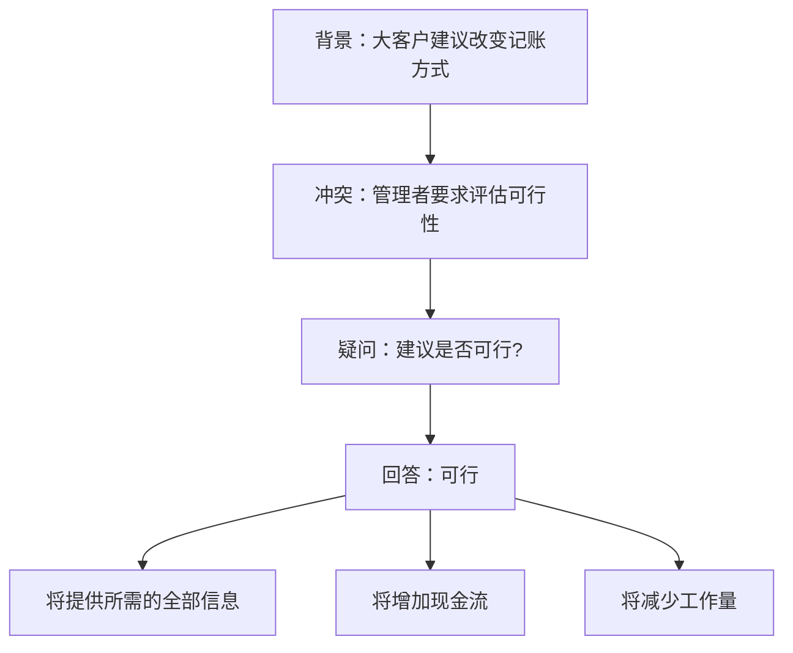
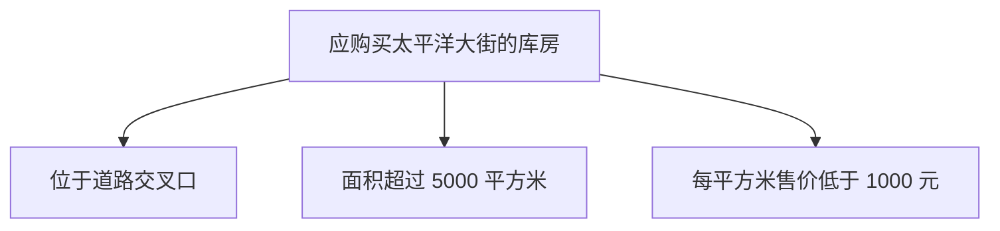
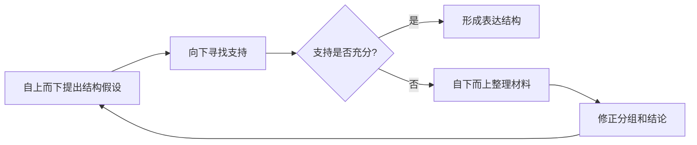

> 阅读范围：第3章“如何构建金字塔”，包括“自上而下法”“自下而上法”“初学者注意事项”三个小节。
>
> 原文：《金字塔原理》第3章

## 本章定位：从认识结构到实际构建

前两章解决了两个问题：为什么文章要有金字塔结构，以及金字塔内部的纵向、横向和序言关系怎样工作。第3章开始处理实际写作时最常见的困境：

> 我大致知道要写什么，却说不清具体观点，更不知道从哪里开始搭结构。

作者没有假设写作者一开始就拥有完整结论，而是提供两条互补路径：

- **自上而下法**：从主题、受众疑问和初步答案出发，借助 SCQA 向下展开；
- **自下而上法**：当顶部无法确定时，先列出材料，寻找逻辑关系，再向上概括结论。

两种方法不是互相排斥的流派，而是根据当前已知信息选择不同入口：



本章的核心不在于记住一套机械模板，而在于建立可迭代的构建过程：先用最容易确定的信息形成假设，再用读者疑问、逻辑关系和证据不断校正。

---

## 第3章 如何构建金字塔

### 一、模糊想法并不等于一无所知

作者指出，即使刚开始写作时很不确定，写作者通常已经掌握几项关键约束：

1. 文章顶部最终应是一个包含主语和谓语的完整句子；
2. 这个句子的主语就是文章主题；
3. 这个句子要回答读者头脑中的某个疑问；
4. 读者的疑问源于某个已知背景中发生的冲突；
5. 写作者通常还隐约知道一些要点、事实或行动建议。

这些约束已经足以开始构建。困难不是完全没有信息，而是信息尚未被放到正确位置。

### 二、为什么顶层必须是完整句子

只有主题名词无法指导下层结构。

- “大客户记账方式”只说明谈论对象；
- “大客户提出的新记账方式可行”才给出判断；
- 读者看到后会自然追问“为什么可行”；
- 下层因此可以被限定为支持可行性的原因。

一个可用的顶层思想至少应具有：

$$
\text{顶层思想}=\text{主题主语}+\text{关于主题的判断谓语}
$$

完整句子使观点可被赞成、反对和验证；只有主题则无法确定正文该证明什么。

### 三、为什么优先尝试自上而下法

写作者最容易确定的通常不是全部材料，而是：

- 大致主题；
- 目标读者；
- 读者正在做的决定；
- 文章希望带来的行动。

从这些上层约束出发，可以立即筛除无关信息，避免先收集一大堆材料再寻找用途。自上而下法因此通常更省力。

但“优先”不等于“永远”。如果连主题、疑问或答案都无法明确，继续强行从顶部推导只会制造空洞框架，此时应转入自下而上法。

---

## 自上而下法

### 一、什么是自上而下构建

#### 要解决的问题

写作者容易直接写正文，边写边寻找中心思想，最终把调查过程、背景和结论混在一起。自上而下法先固定文章要回答的问题，再只选择与该问题有关的思想。

#### 直觉含义

先确定“我要回答谁的什么问题”，再决定“答案是什么、为什么成立、还需解释什么”。像搭建树一样，先放根节点，再逐层增加分支。

#### 严格定义

**自上而下构建**是从主题 $T$、读者初始疑问 $Q_0$ 和候选回答 $A_0$ 出发，用背景 $S$ 与冲突 $C$ 检验 $Q_0$ 是否自然产生，再根据回答引发的新疑问 $Q_1,Q_2,\ldots$ 逐层生成下位思想组的过程。

基本关系为：

$$
(S,C)\Rightarrow Q_0
$$

$$
A_0=\operatorname{Answer}(Q_0)
$$

$$
A_0\Rightarrow Q_1\Rightarrow \{A_{1,1},A_{1,2},\ldots\}
$$

这里的“$\Rightarrow$”表示对目标读者而言能够自然引出，不是严格的数学蕴含。

### 二、图 3-1 展示的完整构建流程

原书正文把自上而下法写成六步，图 3-1 又将向下展开细化为八个动作。合起来可以理解为四个阶段：



下面按原书顺序逐步展开。

### 三、步骤 1：画出主题方框

#### 要解决的问题

没有主题边界时，材料会不断扩张。写作者可能同时讨论记账流程、客户关系、现金管理和信息系统，却不知道哪些属于本文。

#### 定义

**主题**是文章要讨论的对象或领域，通常是顶层思想的主语。

例如：

- 主题：大客户提出的新记账方式；
- 顶层思想：大客户提出的新记账方式可行。

主题方框暂时可以只写名词，但最终必须补成完整顶层判断。

#### 主题的边界检查

- 对象是谁或是什么？
- 时间范围是什么？
- 是讨论现状、原因、方案还是评估？
- 哪些相邻问题明确不在本文范围？

若暂时不知道主题，原书允许跳过，继续寻找读者问题或转入自下而上法。不要为了完成表格而伪造精确主题。

### 四、步骤 2：设想主要疑问

#### 要解决的问题

同一主题可以对应许多问题。关于新记账方式，可以问“为什么提出”“是否可行”“如何实施”“成本多少”“何时上线”。若不确定主要疑问，正文容易把多个问题混在一起。

#### 定义

**主要疑问**是目标读者针对当前主题最需要本文回答的核心问题，也是写作任务存在的直接理由。

确定主要疑问需要先确定读者：

- 谁会阅读？
- 他需要作出什么决定？
- 他已经知道什么？
- 哪种不确定性阻碍他行动？

主要疑问不是作者最想说的话，而是读者最需要得到回答的问题。

#### 多位读者怎么办

多人可能关心不同问题。可以：

1. 以最终决策者的疑问作为主问题；
2. 把其他读者问题放入关键分支或附件；
3. 若问题完全不同，拆成不同文档或摘要版本。

试图在一个顶层同时回答所有人的所有问题，通常会失去中心。

### 五、步骤 3：写出对主要疑问的回答

#### 要解决的问题

如果不先形成候选答案，写作者会把正文写成资料汇编，直到结尾才决定立场。

#### 定义

**候选回答**是写作者当前认为最能直接回答主要疑问的完整判断。它是待验证的顶层思想，不必一开始就绝对确定。

例如：

- 疑问：新记账方式可行吗？
- 回答：可行。

如果尚不清楚答案，原书建议至少注明自己有能力回答该问题。更稳妥的现代做法是明确记录状态：

- 当前假设：可能可行；
- 尚需验证：数据格式、资金到账时间、对账风险和系统安全。

这样既保留方向，也不把未验证假设伪装成结论。

### 六、步骤 4：说明背景

#### 要解决的问题

主题、疑问和答案可能只是作者自说自话。需要证明这确实是读者所在情境中的合理问题。

#### 定义

**背景**是读者已经知道、能够接受或容易客观验证的稳定事实，用于把主题放入共同语境。

寻找背景时问：

> 关于这个主题，哪一句表述读者会点头说“对，我知道”？

例如：“大客户建议改变现有记账方式。”这是双方都知道的事实，适合作为背景。

背景不是所有历史资料，而是引出冲突所需的最低充分信息。

### 七、步骤 5：指出冲突

#### 要解决的问题

只有背景，读者不会自然产生阅读需求。必须说明发生了什么变化、障碍、意外或要求，使背景不再稳定。

#### 定义

**冲突**是背景中打破现状、要求判断或行动的事件，从而使读者产生主要疑问。

构思时可以模拟读者反应：

> “是的，我知道这个情况。然后呢？有什么问题？”

饮料公司案例中的冲突是：管理者要求财务主管审核并回答该建议是否可行。

冲突可以是问题、机会、变化或决策要求，不必一定是危机。

### 八、步骤 6：检查主要疑问和答案

#### 要解决的问题

许多文章的背景、冲突、问题和答案分别看都合理，连在一起却对不上。例如，背景谈市场下滑，冲突谈系统故障，答案却建议调整组织架构。

#### 双向检查

第一步，检查问题是否由背景和冲突自然产生：

$$
(S,C)\stackrel{?}{\Rightarrow}Q
$$

第二步，检查答案是否正面回应问题：

$$
A\stackrel{?}{=}\operatorname{DirectAnswer}(Q)
$$

如果不匹配，应重新考虑：

- 冲突是否表述错了；
- 主要疑问是否不是读者真正的问题；
- 答案是否只回答了问题的一部分；
- 文章是否混入了第二个独立问题。

这一步是自上而下法的核心校准机制。它防止写作者先爱上自己的答案，再人为拼凑一个问题。

### 九、步骤 7：预测答案引发的新疑问

候选回答一旦给出，读者会自然追问。

| 顶层回答形式 | 常见新疑问 | 关键句应是什么类型 |
| --- | --- | --- |
| “该方案可行” | 为什么可行？ | 可行性原因或标准 |
| “应采取方案 A” | 为什么选择 A？ | 支持理由 |
| “问题源于 X” | 为什么是 X？ | 诊断证据 |
| “应进行三项改革” | 具体如何做？ | 行动步骤 |

新疑问决定关键句的逻辑范畴。若读者问“为什么”，关键句必须都是原因；若问“如何做”，关键句必须都是步骤或行动。

### 十、步骤 8：确定关键句要点并继续向下

#### 定义

**关键句要点**是直接回答顶层思想所引发新疑问的一组主要思想。它们共同构成全文主干。

关键句层必须：

- 全部回答同一个新疑问；
- 属于同一逻辑范畴；
- 形成清楚的归纳或演绎关系；
- 合起来足以支持顶层回答；
- 每项又可以根据读者需要继续向下展开。

确定关键句后，对每项重复疑问/回答过程，直到达到受众作出判断所需的证据深度。

### 十一、自上而下法的简化五步版本

原书提示把完整流程概括为：

1. 提出主题思想；
2. 设想受众主要疑问；
3. 写出背景、冲突、疑问、回答；
4. 与受众进行疑问/回答式对话；
5. 对受众的新疑问重复该过程。

这五步与图 3-1 不矛盾。六步和八个动作强调检查细节，五步强调循环结构。

---

### 十二、饮料公司案例：问题是可行性，不是运作过程

#### 业务背景

饮料公司原来的收款流程大致是：

```text
处理交货单 → 发送账单 → 接收支票 → 处理收款
```

一家长期大量采购饮料的大客户希望保留每次交货单，自行把交货数据和总数录入计算机，再按月把数据盘与支票送到饮料公司总部。新流程简化为：

```text
接收数据盘和支票 → 处理收款
```

财务主管被要求审核并答复这项建议是否可行。

#### 原备忘录为什么答非所问

原备忘录的中心表述是：“我们对该方案的运作方式有以下发现。”随后详细说明：

- 外部数据必须包含哪些字段；
- 大客户如何提取和导出数据；
- 支票、数据盘和清单如何发送；
- 系统如何结算并保证零差额；
- 结算后如何更新历史报表。

这些信息回答的是“方案如何运作”，却没有先回答决策者最关心的“方案是否可行”。

错误不在于流程细节无用，而在于层级错位：本应作为“为什么可行”或“如何实施”的下层信息，被直接放到了顶层。

### 十三、用自上而下法重建饮料公司备忘录

#### 1. 主题

大客户提出的记账方式变更建议。

#### 2. 主要疑问

这项建议可行吗？

#### 3. 回答

可行。

#### 4. 背景

大客户建议改变现有记账与付款方式，改为每月提交数据盘和支票。

#### 5. 冲突

管理者要求财务部门评估并答复该建议是否可行。

#### 6. 检查

背景和冲突自然引出“是否可行”；“可行”直接回答该疑问。

#### 7. 新疑问

为什么可行？

#### 8. 关键句要点

原书把理由归纳为三项：

1. 新方式将向公司提供所需的全部信息；
2. 新方式将增加公司的现金流；
3. 新方式将减少公司的工作量。



### 十四、三个关键句为什么比流程说明更有效

#### 1. 它们正面回答“为什么可行”

可行性不是“流程可以被描述”，而是方案满足业务要求并带来可接受结果。信息完整、现金流和工作量分别对应数据要求、资金效果和运营效果。

#### 2. 它们把细节放回正确位置

- 数据字段和格式属于“提供所需信息”分支；
- 每月付款时间和资金到账机制属于“增加现金流”分支；
- 取消逐单处理、账单发送等动作属于“减少工作量”分支。

#### 3. 它们让决策者先看判断，再按需审查

决策者若只需原则性批准，读到三项理由即可；若关心系统风险，可以深入数据格式和对账分支。

### 十五、饮料公司案例的隐含假设

“可行”并不能只由三个正面理由自动推出，还依赖：

- 大客户提交的数据准确、完整且格式稳定；
- 数据盘传输满足安全与隐私要求；
- 支票金额能够与数据记录可靠核对；
- 月度付款确实比原流程改善现金流，而非延迟回款；
- 异常交货、退货和争议有处理机制；
- 大客户与饮料公司能够承担系统改造成本；
- 流程变化符合法律、审计和内部控制要求。

因此，原书结构展示的是“如何围绕疑问组织思想”，不是对方案可行性的完整技术审计。真实备忘录还应在下层提供证据、风险和条件。

### 十六、自上而下法为什么有效

完整推导如下：

1. 写作者先确定读者要解决的问题；
2. 主要疑问限定了相关信息的范围；
3. 候选回答形成顶层判断；
4. SCQA 检查这个疑问是否真的来自读者情境；
5. 回答引发的新疑问决定关键句类型；
6. 关键句进一步限定下一层证据；
7. 每一层都只保留回答当前疑问的信息；
8. 因而无关材料减少，层级和逻辑关系更容易保持一致。

这种方法的本质是一种**问题驱动的信息筛选**，而不只是从上到下画框。

### 十七、自上而下法的适用条件和局限

最适合：

- 主题明确；
- 读者及其决策任务明确；
- 作者对候选答案已有基本判断；
- 文章以解释、建议或决策支持为目的。

局限包括：

- 过早锁定答案可能造成确认偏误；
- 对读者疑问的错误假设会使整篇文章答非所问；
- 复杂问题可能有多个互相竞争的答案；
- 探索早期的材料尚不足以构建稳定顶部；
- 团队中的不同利益相关者可能没有单一共同问题。

应对方式是把顶层当作可修正假设，用反证、替代解释和受众反馈不断校验；无法确定时及时切换到自下而上法。

---

## 自下而上法

### 一、什么时候需要自下而上

以下任一情况出现时，顶部可能无法直接确定：

- 不知道真正主题是什么；
- 不清楚读者会提出什么疑问；
- 不知道读者已经了解哪些信息；
- 有大量材料，却没有明确结论；
- 能想到几个要点，但不知道它们的共同意义；
- 对多个候选解释无法取舍。

此时继续写序言容易产生空话。作者建议先向下移动，从关键句或更具体材料开始。

### 二、什么是自下而上构建

#### 严格定义

**自下而上构建**是先列出当前想表达的全部思想，依据共同属性、因果关系、步骤或结构关系进行分组，再对每组提炼上位概括，反复向上直到形成中心结论的过程。

若原始思想集合为：

$$
X=\{x_1,x_2,\ldots,x_n\}
$$

先寻找关系 $R$，把思想划分为若干组 $G_i$：

$$
G_i=\{x\in X\mid R_i(x)=\text{真}\}
$$

再对每组概括：

$$
s_i=\operatorname{Summary}(G_i)
$$

最后继续概括 $s_1,s_2,\ldots$，直至得到候选中心思想 $T$。

### 三、自下而上的三步法

原书把过程概括为：

1. 列出想表达的所有思想要点；
2. 找出各要点之间的逻辑关系；
3. 得出结论。


### 四、步骤 1：列出所有要点

#### 要解决的问题

头脑中的材料常互相覆盖、顺序混乱。若不先外化，写作者很难同时比较全部内容。

#### 做法

把当前认为相关的事实、判断、问题、建议和行动逐项写出，先不追求完美顺序。每项尽量写成完整句子，并标记类型：

- 事实；
- 原因；
- 结果；
- 问题；
- 建议；
- 行动；
- 假设；
- 待验证信息。

“所有”是当前材料范围内的全部，不意味着无限收集。若一直补资料而不开始归类，自下而上法也会退化成资料堆积。

### 五、为什么先看行动性思想

在 TTW 案例中，作者先比较建议采取的行动，因为行动性思想通常更容易检查：

- 行动对象是否明确；
- 多项行动是否真正不同；
- 它们是否共同实现同一结果；
- 是否存在先后依赖。

描述性思想可能只说“情况如何”，共同点更隐蔽；行动则通常可以用“做什么以达到什么结果”检验。

这不是说行动天然更正确，只是其结构更容易暴露重复与层级问题。

### 六、步骤 2：找出逻辑关系

可能的关系包括：

- 同类并列：都是原因、问题、建议或步骤；
- 因果：A 导致 B；
- 时间：A 必须先于 B；
- 结构：A、B、C 是同一整体的组成部分；
- 程度：按影响或重要性排序；
- 演绎：一般规则加具体情况推出结论。

寻找关系时不能只看关键词相似。两个句子都出现“成本”，一个可能是原因，另一个可能是结果。

### 七、步骤 3：得出结论

结论不是把要点换个宽泛标题，而是说明关系的含义。

- 要点：“工资低、人员短缺、加班多”；
- 弱概括：“人员问题”；
- 强概括：“工资缺乏竞争力导致人员短缺和过量加班，从而推高成本。”

强概括保留因果方向，能够继续接受证据检验。

得出结论后，还要返回序言检查：这是否回答读者真正的问题？若没有，自下而上的分组可能只是发现了有趣模式，却不是本文需要的中心思想。

---

### 八、TTW 案例：一份思路混乱的咨询备忘录

#### 案例背景

TTW 是一家英国印刷厂。年轻咨询顾问工作两周后提交备忘录，讨论排版成本和生产问题。原文包含大量有价值信息，却把成本构成、效率、工序、工资、人员、工会要求、实验建议和不同人员意见混在一起。

原书明确限制任务：只根据备忘录已有信息重组结构，不判断咨询建议在业务上是否正确。这是一个纯粹的“清晰化”练习。

### 九、列出 TTW 的问题与解决方案

原书整理出八个问题：

1. 排版工作效率低；
2. 每项排版任务都采用相同工序；
3. 简单任务报价没有竞争优势；
4. 许多任务无法按时完成；
5. 工资偏低；
6. 员工短缺；
7. 加班过多；
8. 排字和手工排版效率低于平均水平。

原文给出两个解决方案：

1. 简化价格较低排版任务的工序；
2. 改变工作方法，提高生产效率。

### 十、为什么两个解决方案实际上重复

“简化低价任务工序”是“改变工作方法”的一种具体形式；“提高生产效率”则更像预期结果，不是与“简化工序”平行的独立行动。

原结构混合了三个层级：

```text
行动：改变工作方法
└── 具体行动：简化低价任务工序
    └── 预期结果：提高生产效率
```

把它们并列会造成虚假的两个方案。这个发现本身没有直接给出完整结论，却暴露原文的分类错误。

### 十一、TTW 问题中的两条因果链

图 3-3 展示了两条独立路径，共同通向成本过高和价格缺乏竞争力。

#### 路径一：工资与人员


#### 路径二：工序与效率


两条链说明，表面上的多个问题不是八个彼此独立的缺陷，而是少数原因沿因果链产生的一系列结果。

### 十二、因果链如何揭示两条思路

从诊断方向看：

> 生产效率低和加班过多导致成本过高，进一步导致简单任务报价缺乏竞争力。

从行动方向看：

> 为降低成本，应简化工序，并把工资提高到具有竞争力的水平。

图 3-4 因而把材料重组为：

```text
成本过高
├── 生产效率低
└── 加班过多

要降低成本
├── 简化工序
│   ├── 针对某些任务
│   └── 针对全部任务
└── 提高工资
```

看似反直觉的“提高工资以降低成本”，来自完整因果链：提高工资可能改善招聘和留任，减少人员短缺与加班费用。它是否真实成立仍需数据验证。

### 十三、TTW 因果推断依赖的假设

#### 工资路径

- 低工资是人员短缺的主要原因，而非工作环境、地点或技能供给；
- 提高工资能显著改善招聘和留任；
- 新增正常工资成本低于可减少的加班和延期成本；
- 培训新员工的时间与成本可接受。

#### 工序路径

- 不同任务确实不需要相同质量控制步骤；
- 省略步骤不会造成不可接受的质量下降；
- 低效率主要来自工序，而非设备、排程或技能；
- 简化后的节约大于实验、返工和客户流失风险。

作者没有声称案例已经证明这些假设。金字塔重组的价值是让假设和因果缺口变得可见，从而知道下一步要验证什么。

### 十四、结合序言确定 TTW 的中心结论

仅凭因果关系，仍可能得到多个中心思想。作者回到读者已知情境，依次推导：

1. **主题**：排版成本；
2. **疑问 1**：TTW 的排版成本是否过高？
3. **回答 1**：是，或至少现有迹象表明可能过高；
4. **背景**：排版成本占图书总成本的重要比例；
5. **冲突**：TTW 不知道自身排版成本是否过高，但简单任务缺乏竞争力显示可能存在问题；
6. **疑问 2**：排版成本能否降低？
7. **回答 2**：可以；
8. **新疑问**：如何降低？
9. **关键句**：省略不必要工序，并把员工工资提高到具有竞争力的水平。

这里出现两个连续疑问，是因为回答“成本可能过高”后，管理者自然追问“能不能降低”，得到肯定回答后再问“如何降低”。

### 十五、结论强度为什么要谨慎

原书流程表中把“成本是否过高”回答为“是”，改写后的备忘录却写成“可能能够大幅降低成本”。这种措辞差异提醒我们：

- 报价缺乏竞争力是成本过高的迹象，不是直接证明；
- 与平均效率比较能增强判断，但仍需统一口径；
- 10% 节约是实验前估计，不是已实现结果；
- 工资方案的净节约尚未测算。

因此，结构清晰后还要校准语气：

| 证据状态 | 合适表述 |
| --- | --- |
| 已有直接、可靠证据 | “成本过高” |
| 有多项一致迹象 | “成本很可能过高” |
| 只是待检验假设 | “成本可能过高，需要验证” |

金字塔结构不能把不确定事实升级为确定结论。

### 十六、重写后的 TTW 备忘录如何组织

#### 序言

- 排版成本占精装书成本约 40%，占简装书成本约 50% 至 55%；
- TTW 不知道自身排版成本是否过高；
- 但简单排版任务缺乏竞争优势；
- 初步调查认为可通过两种方式显著降低成本。

#### 关键句 1：省略不必要步骤

- 手工排版效率比平均水平低约 20% 至 50%；
- 不论任务简单还是复杂，TTW 基本采用相同步骤；
- 计划跟踪简单任务，控制校对次数和时间；
- 观察质量边际影响和客户反应；
- 估计可能节约排版总成本约 10%。

#### 关键句 2：提高工资

- TTW 工资低于当地其他印刷厂；
- 因而难以吸引和保留员工；
- 两人辞职使员工低于编制；
- 多数任务不能按时完成，加班超过 50%；
- 提高工资可能改善招聘并减少加班费用。

### 十七、重写为什么更清晰

1. 序言先说明业务问题和初步结论；
2. 两个标题直接表达行动思想，而不是笼统写“发现”；
3. 每项事实归入自己支持的行动分支；
4. 原文中的人员意见被放回相应实验和研究背景；
5. 读者可以分别质疑工序方案和工资方案；
6. 语言几乎没有改变，主要变化来自结构。

这证明原文的问题主要不是词句风格，而是思想的选择、归类和顺序。

### 十八、最初 30 秒原则

作者建议，读者应在开始阅读的最初 30 秒内理解文章全部主线。这里的“全部”不是全部细节，而是：

- 讨论什么问题；
- 为什么现在需要讨论；
- 作者的中心回答是什么；
- 支持回答的关键分支有哪些。

如果读者时间有限，他可以只浏览序言和关键句；若要审查，再进入详细分支。

这不是固定计时标准，而是信息分层原则。复杂论文的主线可能需要更久，但摘要和标题仍应尽快让读者获得结构地图。

### 十九、标题为什么必须呈现思想

“我们的发现”“分析”“结论”只标明内容类别，不透露具体判断。读者无法靠标题恢复文章主线。

对比：

| 类别式标题 | 思想式标题 |
| --- | --- |
| 成本分析 | 不区分任务的统一工序推高了排版成本 |
| 人员问题 | 低工资导致人员短缺与过量加班 |
| 建议 | 应简化工序并提高工资 |

思想式标题使长文可浏览，也迫使作者准确概括每个分支。

### 二十、自下而上法为什么有效

1. 外化全部材料，降低工作记忆负担；
2. 区分事实、问题和行动，暴露层级混合；
3. 识别重复建议，避免虚假并列；
4. 用因果链把表面症状连接到根因和结果；
5. 从关系中提炼少数上位结论；
6. 再用 SCQA 检查这些结论是否回答读者问题；
7. 最终把探索所得重新组织成自上而下表达。

自下而上用于发现，自上而下用于交付。成熟写作通常在两者之间往返。

### 二十一、自下而上法的局限

- 列出的材料可能本来就不完整；
- 相关性容易被误认成因果性；
- 分组会受到已有观点和确认偏误影响；
- 可能得到逻辑上有趣但与读者无关的结论；
- 材料很多时，人工分组成本较高；
- 过早概括可能抹去异常点和反例。

补充方法包括因果图、证据矩阵、亲和图、数据分析、反事实检验和受众访谈。

---

## 初学者注意事项

本节不是零散技巧，而是在纠正初学者最容易破坏构建过程的六种习惯。

### 一、一定先搭结构，先尝试自上而下法

#### 要解决的问题

文字一旦写出来，写作者容易高估其质量，不愿删除或移动。这会让已经形成的句子反过来绑架思想结构。

这种现象可以从几个心理机制理解：

- **沉没成本**：已经投入时间，舍不得放弃；
- **禀赋效应**：自己写出的文字被赋予更高价值；
- **流畅性错觉**：句子读起来顺，就误以为逻辑也顺；
- **局部优化**：不断润色段落，却没有检查全文回答什么。

#### 作者建议

先搭思想结构，不要立刻写完整文章。优先尝试自上而下法，因为主题和读者问题通常比全部细节更容易确定。

#### 实际做法

先写：

- 一句主题回答；
- SCQA 四要素；
- 三至五个关键句；
- 每个关键句下的必要证据。

确认结构后再进入句子润色。

#### 适用边界

探索性写作有时必须通过自由书写发现观点。此时可以写，但应把初稿标为“思考材料”，之后重新拆分和搭结构，不能因为文字已经存在就直接交付。

### 二、构思序言时先从背景开始

#### 要解决的问题

如果先从冲突或结论构思，作者可能把自己知道而读者不知道的信息当成共同前提，导致问题不自然。

#### 作者建议

构思顺序应从背景开始：

$$
S\rightarrow C\rightarrow Q\rightarrow A
$$

先找到读者会接受的稳定状态，再问发生了什么变化，疑问通常会自然出现。

#### 构思顺序与成文顺序的区别

作者允许成文时根据文风和效果调整顺序，例如先给答案、先说冲突。但内部构思仍应从背景开始，以校验逻辑来源。

这一区分防止把 SCQA 误解成僵化版式：

- **构思顺序**服务于发现问题；
- **呈现顺序**服务于沟通效果。

### 三、先多花时间思考序言，不要省略

#### 要解决的问题

写作者常已有一个主要观点，于是直接进入关键句，忽略产生该观点的读者疑问。结果是背景和冲突信息在正文中不断冒出，打断论证。

#### 为什么序言必须先想清楚

1. 序言划定哪些信息是共同前提；
2. 冲突确定文章为什么现在出现；
3. 疑问决定中心回答；
4. 中心回答决定关键句类型；
5. 若序言未定，正文每一层都可能围绕错误问题展开。

先完成序言逻辑后，写作者才能把注意力集中在低层证据，而不再边证明边补背景。

#### 边界

“先想好”不等于序言文字必须最先定稿。正文分析可能迫使作者修改问题和答案。合理流程是先形成可用序言假设，写作中验证，最后统一修订。

### 四、将历史背景放在序言中

#### 要解决的问题

正文中突然插入大段历史，会让读者无法判断它是在支持当前结论，还是作者忘记交代的背景。

#### 作者的区分

- 历史背景通常是读者已知或需唤起的事实，应放在序言；
- 正文应由提供新认识并引发疑问的思想构成；
- 只有经过分析、作为因果链证据的历史事件，才适合出现在正文。

#### 例子

背景用法：

> 公司过去三年一直采用集中采购模式。

正文分析用法：

> 过去三次交付延误都发生在集中审批超过五天后，这说明审批瓶颈是延期的重要原因。

同样是历史事实，前者建立语境，后者经过比较后成为因果证据。

#### 适用边界

读者不一定知道全部必要历史。若某历史事实新颖但容易客观验证，可以简要放入序言；若它具有争议、承担关键证明责任，就不能伪装成背景，应在正文提供证据。

### 五、序言只放读者不会质疑其真实性的内容

#### 要解决的问题

若序言引入读者不知道或不接受的新判断，读者会提前产生另一个疑问，偏离作者设计的主问题。

#### 严格理解

序言信息应属于以下至少一种：

- 读者已经知道；
- 双方此前已同意；
- 可由中立第三方轻易验证；
- 只是中性地说明时间、地点、任务和已发生事件。

不应把关键争议前提写成已知事实。例如，不能在序言中直接说“由于管理层失职造成成本失控”，除非读者已接受该因果判断。

#### 为什么正文不应重复读者已知信息

正文下层用于回答新疑问。若用读者已知信息作回答，可能说明：

1. 该信息本应在序言中；
2. 当前上层疑问并不是读者真正的疑问；
3. 作者遗漏了关键推理，只拿背景代替证据。

#### 现代沟通中的调整

面对知识差异很大的受众，不可能保证所有人知道相同背景。可以：

- 在主序言保留最低共同背景；
- 用术语表、脚注或附件补充基础知识；
- 对关键但可能未知的事实明确标注来源；
- 不把“容易查证”误当成“无需提供证据”。

### 六、关键句层更宜使用归纳，而非演绎

#### 要解决的问题

人形成想法时常沿演绎链推进，并倾向按发现顺序复述。但顶层已经给出结论后，关键句层若保留完整演绎链，最后一步往往重复顶层结论，结构显得冗长。

#### 仓库案例的演绎结构

顶层思想：购买太平洋大街的库房。

关键句层若按演绎写：

1. 判断是否购买库房有三个标准；
2. 该库房符合这三个标准；
3. 因此应当购买。

第三点与顶层思想“应当购买”重复，而且前两点内部还要分别展开 A、B、C 标准，结构复杂。

#### 改成归纳结构

将顶层概括为：

> 因为太平洋大街的库房符合我们的标准，因此应购买。

关键句直接列出三个并列理由：

1. 位于道路交叉口；
2. 面积超过 5000 平方米；
3. 每平方米售价低于 1000 元。



读者立即看到购买理由，不必先经过“存在标准”“满足标准”“所以购买”的重复链。

#### 为什么归纳关键句更易理解

1. 顶层已经交付结论，无需在关键句再次推出；
2. 并列理由与读者“为什么购买”的疑问直接对应；
3. 每项可以独立展开证据；
4. 读者容易快速扫描并判断哪个标准有争议；
5. 结构更短，避免结论重复。

#### “更宜”不是绝对禁止演绎

以下情况仍适合在关键句层保留演绎：

- 结论的必然性主要来自一条不熟悉的一般规则；
- 受众最可能质疑规则能否适用于当前对象；
- 法律、合规或数学证明需要明确前提链；
- 省略演绎步骤会隐藏关键假设。

作者强调的是商务表达中的默认偏好，而不是逻辑禁令。

### 七、仓库归纳结构仍需哪些假设

三个事实只有在它们确实对应购买标准时才支持结论：

- 道路交叉口对物流或客流具有正面价值；
- 5000 平方米满足容量需求；
- 1000 元/平方米低于预算或市场基准；
- 没有产权、结构安全、环境和法规问题；
- 三项标准足够覆盖重大决策因素。

如果标准本身不完整，把演绎改成归纳只能让表达更简洁，不能让决策更正确。

---

## 两种构建方法如何配合

### 一、不是二选一，而是迭代循环

实际过程常是：

1. 自上而下提出候选问题和答案；
2. 发现某个关键分支缺少依据；
3. 自下而上整理该分支的事实和观察；
4. 得到新的概括；
5. 新概括可能修改顶层答案；
6. 再自上而下重构全文。



### 二、如何选择起点

| 当前状态 | 优先方法 |
| --- | --- |
| 主题、读者问题和答案较清楚 | 自上而下 |
| 有大量事实但无结论 | 自下而上 |
| 有结论但不知道如何证明 | 先自上而下提出疑问，再对证据自下而上分组 |
| 有多个互相竞争的结论 | 自下而上比较证据，再分别做自上而下验证 |
| 需要快速写短备忘录 | 自上而下 |
| 处于探索研究早期 | 自下而上为主，保留多个假设 |

### 三、两种方法共同依赖的三项检查

无论从哪里开始，最终都要满足：

1. **序言相关性**：背景和冲突自然引出读者疑问；
2. **纵向连续性**：下层回答上层引发的疑问；
3. **横向逻辑性**：同层思想属于同一范畴，并形成归纳或演绎关系。

---

## 作者分析问题的完整思路

### 一、问题从哪里来

写作者通常不是缺少材料，而是只有模糊主题、局部观点和杂乱事实。直接成文会把这种内部混乱原样转嫁给读者。

### 二、难点在哪里

- 顶层问题可能判断错误；
- 自己的答案容易被误当成读者的问题；
- 背景、冲突、论据和结论容易混层；
- 多项建议可能实际重复；
- 表面问题之间隐藏着因果链；
- 文字写出后，人会舍不得重构；
- 发现思想的顺序未必适合表达。

### 三、为什么先尝试自上而下

主题和受众任务往往比全部事实更容易确定。先固定问题可以大幅缩小材料范围，使写作者只提取与疑问有关的信息。

### 四、为什么还需要自下而上

真实研究经常始于零散观察，结论尚未形成。先列出并分析关系，才能避免强行套用预设答案。

### 五、为什么用 SCQA 校验

SCQA 把作者的候选问题放回读者情境：若冲突不能自然引出疑问，说明写作动机或受众判断可能有误。

### 六、为什么用疑问/回答向下展开

每个上层判断都会限定下一层应提供的思想类型。持续追问可以发现缺失的中间推理和证据。

### 七、为什么强调归类与因果

自下而上的材料只有形成共同属性或明确因果链，才能被概括为有信息量的上层思想。

### 八、为什么结构优先于文风

TTW 改写几乎保留原有词句，却因重新安排序言、关键句和证据而变清晰。这说明许多“写不清楚”首先是思想组织问题，而非词藻问题。

### 九、方法为什么有效

它把模糊的写作任务拆成一系列可检验问题：

- 谁的问题？
- 什么问题？
- 为什么现在出现？
- 我的直接回答是什么？
- 读者下一步会问什么？
- 同层回答是什么类型？
- 哪些事实支持它？

每一步都能局部发现错误，避免在完整成稿后才返工。

### 十、方法的主要局限

1. 结构正确不保证事实正确；
2. SCQA 依赖对受众的准确理解；
3. 因果链可能把相关性误作因果；
4. 树形结构难以表达反馈回路和多对多证据；
5. 过早确定顶层可能压制探索；
6. 单一中心问题不一定适合手册、纪要或资料合集；
7. 归纳关键句可能隐藏必要的规则前提；
8. “已知背景”在多元受众中难以统一。

### 十一、可配合的替代和补充工具

- **亲和图**：对大量便签或访谈材料自下而上聚类；
- **因果图**：检验 TTW 式因果链和反馈关系；
- **证据矩阵**：记录每个结论由哪些数据支持；
- **假设树**：保留多个候选答案，避免过早锁定；
- **决策树**：比较不同方案和条件后果；
- **反事实分析**：追问若工资提高，人员和加班是否真的改变；
- **用户访谈**：验证读者的真正疑问；
- **自由写作**：探索阶段生成材料，之后再结构化。

---

## 易混淆概念辨析

### 主题、疑问与回答

- 主题说明谈什么；
- 疑问说明读者需要知道什么；
- 回答说明作者对该问题的判断。

“TTW 排版成本”是主题，“成本能否降低”是疑问，“可通过简化工序和提高工资降低”是回答。

### 背景与论据

- 背景是共同起点，用来引出问题；
- 论据是新信息，用来证明答案。

“排版成本占总成本很大比例”可作背景；“手工排版效率低于平均水平 20% 至 50%”是支持降本建议的论据。

### 冲突与坏消息

冲突只表示稳定状态被打破，可以是风险、机会、任务或决策请求。饮料公司案例中，“被要求评估可行性”就是促使文章产生的冲突。

### 候选答案与最终结论

候选答案用于搭建和检验结构，可以被证据修改；最终结论应反映验证后的证据强度。不要因为答案被放到顶部，就拒绝修正。

### 关键句与小标题

关键句是直接支持顶层的完整思想；小标题是其视觉呈现。若标题只写“问题”或“建议”，就没有充分呈现关键句。

### 自上而下构建与自上而下表达

- 构建是发现和检验思想的过程；
- 表达是把已整理的思想交付给读者。

构建时可以来回迭代，最终表达通常从结论向细节展开。

### 自下而上与按发生顺序复述

自下而上是从材料中提炼共同关系，不是把调查日志按时间原样搬进报告。

### 行动与结果

“简化工序”是行动，“提高效率”是结果。二者不能当作两个同层方案并列，除非把表述调整到相同类型。

### 因果链与时间顺序

原因通常先于结果，但时间在前不等于原因。工资低与员工短缺的关系仍需排除其他解释。

### 归纳表达与演绎思考

一个观点可以通过演绎过程被发现，却以并列理由的归纳结构表达。发现顺序和呈现顺序不必一致。

### 清晰与正确

结构清晰让读者看懂“作者认为工资低导致成本高”；是否真的如此，还要靠数据和因果验证。

---

## 综合示例：构建一份是否迁移办公地点的建议

### 一、先尝试自上而下

**主题**：迁移到新办公地点。

**读者**：需要批准租约的管理层。

**主要疑问**：是否应迁移？

**候选回答**：应在本季度末迁移。

**背景**：现租约将在四个月后到期，公司预计明年员工增加 30%。

**冲突**：现办公室已接近容量上限，续租报价上涨 20%，但新地点会增加通勤距离。

**检查**：这些信息自然引出“迁不迁、何时迁”，回答基本对应。

### 二、预测新疑问

读者会问“为什么迁移比续租更好”。关键句候选为：

1. 新地点满足未来两年的容量需求；
2. 三年总成本低于续租；
3. 搬迁风险可以在租约到期前控制。

### 三、发现证据不足，转向自下而上

现有材料包括：

- 新地点有 180 个工位；
- 当前员工 120 人；
- 明年预计 156 人；
- 新地点月租更低；
- 装修和搬迁有一次性成本；
- 40% 员工通勤增加 20 分钟；
- 新地点靠近地铁；
- 现办公楼续租需三年；
- 新地点可签两年并有扩租权；
- 网络切换需要周末停机；
- 客户很少到访办公室。

### 四、自下而上分组

#### 容量与灵活性

- 180 个工位覆盖预计 156 名员工；
- 两年租约和扩租权降低预测错误风险。

#### 财务

- 月租更低；
- 但有装修和搬迁成本；
- 需比较三年总拥有成本，而非只比月租。

#### 人员与运营风险

- 部分员工通勤变长；
- 地铁可达性改善；
- 网络切换可安排周末；
- 客户到访影响较小。

### 五、修正顶层答案

自下而上分析后，原先“应迁移”的确定性过强，因为总成本和人员流失风险尚未验证。更准确的回答是：

> 若三年总成本至少比续租低 10%，且员工调研未显示显著离职风险，则应在本季度末迁移；否则应重新谈判现址短期续租。

这个答案加入了条件，忠实反映证据状态。

### 六、最终结构

```text
满足成本与人员风险条件时，应在本季度末迁移。
├── 新地点能够满足容量并保留扩张灵活性
│   ├── 180 个工位覆盖预测人数
│   └── 两年租约附带扩租权
├── 需确认三年总成本至少降低 10%
│   ├── 月租降低
│   └── 装修、搬迁和停机成本需要纳入
└── 需把人员与切换风险控制在可接受范围
    ├── 调研通勤变化对留任的影响
    ├── 利用地铁可达性缓解通勤问题
    └── 周末完成网络切换和回退演练
```

这个示例说明，两种方法配合后，顶层答案可能从无条件建议变成条件性建议。结构不是用来维护最初观点，而是用来迫使观点与证据一致。

---

## 常见误解与错误做法

### 误解一：自上而下就是先写结论再找证据

正确做法是提出候选结论并主动验证，包括寻找反证；先定结论再只挑支持材料属于确认偏误。

### 误解二：SCQA 只是序言排版模板

SCQA 首先用于检验读者问题是否真实产生。成文可以调整顺序，但背景、冲突、疑问和回答之间的逻辑必须存在。

### 误解三：不知道答案就不能开始

可以记录候选答案、多个假设或待验证问题；若顶部过于模糊，就从具体材料自下而上构建。

### 误解四：列出所有要点后自然会出现结构

列点只是外化材料，还必须识别类型、共同属性、因果方向和抽象层级。

### 误解五：相关事实都应写进文章

文章只需要回答读者疑问所必需的事实。相关但不影响判断的信息可放附件或删除。

### 误解六：把两个近义表达并列会显得全面

TTW 的“简化工序”和“改变方法提高效率”实际是行动、子行动和结果的混合，不是独立方案。

### 误解七：找到因果链就证明了因果

因果图只表达假设关系。还要用数据、机制、时间顺序、反事实和替代解释验证。

### 误解八：最初 30 秒必须包含全部细节

它要求快速交付主线，不是把整篇文章压缩成密集开头。细节仍按层级展开。

### 误解九：正文绝不能出现历史信息

若历史事实经过分析并作为因果证据，就可以进入正文；不能进入正文的是与当前论证无关的背景堆积。

### 误解十：关键句层绝不能演绎

归纳通常更简洁，但法律、合规和严格规则应用场景可能必须展示演绎前提。

### 误解十一：语言不重要

TTW 案例说明结构问题可能比文风更根本，不代表措辞可以忽略。结构正确后，仍需保证语言准确、简洁和适合受众。

### 误解十二：完成结构后不再修改顶部

下层证据可能推翻顶层答案。金字塔应当迭代，不能把顶部当作不可修改的命令。

---

## 第三章实践检查清单

### 自上而下起步

1. 文章主题能否成为顶层句子的明确主语？
2. 目标读者是谁，他要作出什么决定？
3. 关于该主题，他最主要的疑问是什么？
4. 当前候选回答能否用一句完整判断表达？
5. 哪些背景事实是双方知道或容易验证的？
6. 什么冲突打破背景并引发阅读需求？
7. 冲突是否自然引出主要疑问？
8. 回答是否正面、完整地回应疑问？

### 继续向下展开

9. 顶层回答会引发“为什么”“如何”还是“是什么”？
10. 关键句是否全部回答同一个新疑问？
11. 关键句能否用同一名词概括？
12. 同层思想构成归纳还是演绎？
13. 关键句是否合起来足以支持顶层回答？
14. 每个分支需要展开到什么证据深度？
15. 是否存在跳过的中间推理或隐含假设？

### 自下而上整理

16. 是否已把当前相关要点全部外化？
17. 每项是事实、原因、结果、问题、行动还是假设？
18. 是否存在近义重复或上下级项目被错误并列？
19. 哪些项目构成共同属性、因果链、步骤或结构？
20. 每组的准确概括是什么？
21. 概括是否超出证据支持范围？
22. 得到的结论是否回答读者真正的问题？
23. 哪些因果关系仍需验证？

### 序言与写作控制

24. 是否在结构稳定前就写了大量正文？
25. 序言是否从可靠背景构思，而不是从争议判断开始？
26. 背景信息是否都服务于引出冲突？
27. 正文是否混入本应放在序言的历史材料？
28. 序言是否把待证明结论伪装成共同事实？
29. 读者能否在很短时间内看懂中心回答和关键分支？
30. 标题表达具体思想，还是只写“发现”“分析”“结论”？
31. 关键句层是否可以从演绎改写为更直接的归纳理由？
32. 若保留演绎，是否因为前提链本身必须被读者审查？

### 最终质量检查

33. 结构清晰之外，事实是否真实？
34. 推理是否有效，归纳结论是否保留不确定性？
35. 是否主动寻找反证和替代解释？
36. 顶层答案是否已根据下层证据修正？
37. 删除任一分支后，中心回答是否仍然被充分支持？
38. 文章是否把探索过程整理成了受众理解过程？

---

## 本章小结

第3章把金字塔原理转化成了可执行的构建流程：

1. 写作者即使只有模糊想法，也通常已知主题、受众、疑问、背景或部分要点，可以从这些约束开始。
2. 顶层必须是包含主语和谓语的完整思想，而不只是主题名词。
3. 自上而下法从主题、主要疑问和候选回答开始，再用背景与冲突检查问题是否真实、答案是否匹配。
4. 顶层回答会引发新疑问，疑问类型决定关键句必须是原因、步骤、组成部分还是其他同类思想。
5. 饮料公司原备忘录详细说明运作流程，却没有先回答“新记账方式是否可行”，因此属于信息正确但层级错位。
6. 重构后以“可行”为顶层回答，以信息完整、增加现金流和减少工作量为关键理由，流程细节回到各自分支。
7. 当主题、疑问或答案无法确定时，应转入自下而上法：列出要点、寻找逻辑关系、概括结论。
8. TTW 案例中，原有两个解决方案实际重复；八个表面问题可整理为工序效率和工资人员两条因果链。
9. 因果链支持“简化工序、提高工资以降低成本”的结构，但真实结论仍依赖招聘、加班、质量和成本数据。
10. 自下而上得到的结论必须返回序言，检查是否回答读者真正的问题，并按证据强度调整确定性。
11. 结构化改写几乎不需要改变 TTW 原文措辞，说明许多不清晰首先来自思想组织，而非文风。
12. 序言和关键句应让读者迅速掌握全文主线；标题应呈现具体思想，而不是只标注内容类别。
13. 初学者应先搭结构、先尝试自上而下；序言从背景开始构思，历史背景与无争议信息优先放入序言。
14. 关键句层通常更适合用归纳式并列理由，因为完整演绎的最终结论往往重复顶层回答。
15. 仓库案例把“标准、符合标准、因此购买”的演绎链压缩为位置、面积和价格三个并列购买理由，表达更直接。
16. 归纳优先不是绝对规则；当一般规则及其适用性正是争议核心时，应保留演绎链。
17. 两种构建方法应循环配合：自上而下提出结构假设，自下而上整理和检验证据，再返回顶部修正答案。

本章最核心的实践原则是：**先确定自己在回答谁的什么问题；能从顶部开始时，用 SCQA 和疑问/回答向下展开，顶部不清楚时，从材料中寻找关系向上概括；最终让发现过程服从读者的理解过程。**
