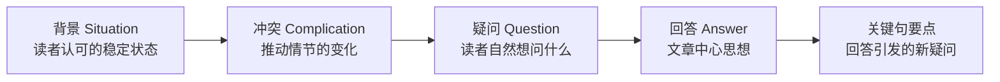
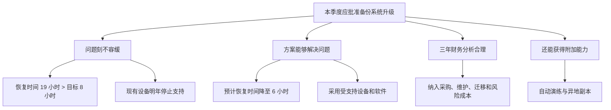

> 阅读范围：第4章“序言的具体写法”，包括“序言的讲故事结构”“序言的常见模式”“序言的常见模式——以咨询为例”三个小节。
>
> 原文：《金字塔原理》第4章

## 本章定位：用序言把读者带到正确的问题前

前几章已经建立一条基本链路：文章顶层思想回答读者的初始疑问，关键句回答顶层思想引发的新疑问，正文再逐层展开。第4章专门解决其中最前端、也最容易写坏的一环：**怎样让读者自然产生文章准备回答的那个初始疑问？**

序言不是礼貌性的开场，也不是正文摘要，更不是所有背景资料的存放处。它承担三个结构任务：

1. 从读者已知的信息开始，建立共同认知起点；
2. 引入打破稳定状态的冲突，使读者产生疑问；
3. 给出回答，并把读者交给正文的金字塔结构。

其基本机制是 SCQA：



本章进一步说明：SCQA 的逻辑功能必须齐全，但表面顺序可以变化；文章类型不同，背景、冲突和疑问也会形成几种稳定模式。

---

## 第4章 序言的具体写法

### 一、什么是序言

#### 要解决的问题

读者打开文章时，脑中还装着自己的任务、担忧和信息。如果作者直接抛出新观点，读者可能不知道观点与自己有什么关系，也不知道应从哪个问题理解后续内容。

#### 严格定义

**序言**是位于正文思想金字塔之前的一段叙述，它概述读者已经知道或容易认可的信息，说明其中发生的变化，由此唤起一个与读者相关的初始疑问，并给出文章的顶层回答。

书面文章中称为序言、前言、引言或导言；演讲中对应开场白。名称不同，逻辑功能相同。

#### 序言与正文的分工

| 部分 | 信息性质 | 核心任务 |
| --- | --- | --- |
| 序言 | 读者已知、认可或易验证的信息 | 唤起初始疑问并给出回答 |
| 正文 | 需要解释、证明或落实的新思想 | 支持回答，处理后续疑问 |

如果序言承担论证，读者会在中心问题出现前就开始质疑前提；如果正文大段补背景，说明作者尚未把双方放在同一认知位置。

### 二、为什么短文章也需要序言

序言的必要性不取决于篇幅，而取决于读者是否需要被提醒“为什么现在要看这件事”。一封两段邮件也可能需要一句话建立问题：

> 您在 1 月 15 日的邮件中询问新流程能否按期上线。测试结果表明三个关键条件尚未满足，因此建议推迟一周。

第一句恢复共同语境，第二句引出冲突和回答。序言可以很短，但不能让读者猜文章为何出现。

---

## 序言的讲故事结构

### 一、为什么序言位于思想金字塔之外

图 4-1 把序言画成位于金字塔顶端之外的圆圈。原因是：序言原则上不参与证明中心思想，而是说明中心思想要回答哪个问题。

```text
序言：S → C → Q
              ↓
顶层思想：    A
             /|\
        关键句要点
```

若把序言中的已知背景当作关键论据，逻辑层级会混乱；若中心回答只藏在序言里而不统领正文，正文又会失去顶层。

### 二、为什么要用讲故事的形式

#### 问题从哪里来

实用文章很少像小说那样天然吸引人。读者脑中已有许多更关心的事情，即使知道文章重要，也可能读了一页才发现注意力早已游离。

#### “未完成故事”的注意机制

一个故事先把人锁定在特定时间、地点和状态，再引入变化。变化造成未闭合的问题，受众倾向于继续寻找结果。

原书用“深夜，两个爱尔兰人在一座古怪的城堡中相遇……”说明：时间、人物和地点建立背景，“古怪”与相遇暗示后续事件，故事尚未完成，注意力便被带到特定轨道。

商务序言使用同一机制，但不靠虚构情节，而靠真实问题：

1. 先说明读者熟悉的状态；
2. 再说明状态发生变化；
3. 变化形成信息缺口；
4. 读者产生疑问；
5. 作者给出回答，正文继续解释。

#### 为什么有效

$$
\text{共同背景}+\text{未解决变化}
\rightarrow \text{认知缺口}
\rightarrow \text{阅读动机}
$$

它减少读者在多个潜在主题间切换的成本，让读者知道自己为何需要答案。

#### 成立条件

- 故事与读者的目标或处境相关；
- 背景为读者熟悉或容易接受；
- 冲突真实且足以引出问题；
- 回答正面回应问题；
- 作者没有用悬念故意拖延重要结论。

### 三、“好故事”为什么应是读者知道的故事

作者借孩子喜欢重复听熟悉故事说明：序言不是靠陌生信息取胜，而是让读者认出自己的处境。

熟悉信息有三个作用：

1. **降低进入成本**：读者不用先验证大量新事实；
2. **建立共同立场**：作者与读者先在无争议处达成一致；
3. **突出变化**：稳定背景越清楚，冲突越容易被识别。

“读者知道”不要求读者亲自经历。只要目标受众凭通常背景知识应当知道，或信息容易由客观来源验证，也可作为共同起点。

### 四、讲故事不等于文学化

SCQA 中的故事只有逻辑意义：状态、变化、问题、答案。它不要求人物对白、情绪渲染或故作悬念。

商务序言追求的是：

- 具体而非戏剧化；
- 相关而非热闹；
- 简短而非平淡；
- 真实而非诱导。

### 五、何时引入背景

#### 背景的操作性定义

背景是关于文章主题的一个独立、无争议的表述：

- **独立**：不依赖更早的句子才能理解其准确含义；
- **无争议**：预计读者会理解并接受。

当你能写出这样一句话时，就找到了背景入口。

#### 已知具体读者

写信或备忘录时，作者知道收件人及共同经历，可以直接提醒：

> 您上周要求我们评估三种采购方案。

#### 面向广泛读者

杂志或图书作者无法知道每位读者已有疑问，因此需要“培养”疑问：先采用目标群体通常知道的公共背景，再组织出他们未曾这样思考的冲突。

作者可假设专业读者了解本领域常识，但不能假设所有人接受争议观点。

### 六、背景如何锁定时间和空间

原书给出的典型开头包括：

- 某投资公司正在研究向特定国家出口铁矿石的可行性；
- 大型医疗体系正受到资源日益匮乏的困扰；
- 人类早期长期只使用实用性石器；
- 当代经理人是其文化的产物。

它们共同完成：

1. 确定主体；
2. 确定时间或状态；
3. 限定讨论范围；
4. 让读者问“那又怎么样”。

“那又怎么样”正是引入冲突的信号。

### 七、背景选择错误的诊断意义

如果找不到与主题相关、读者认可的背景，可能说明：

- 主题选错；
- 文章出现时机不对；
- 目标读者不明确；
- 所谓背景其实是待证明结论；
- 作者回答的不是读者问题。

因此，背景不仅是写作材料，也是问题定义的测试。

### 八、什么是冲突

#### 严格定义

**冲突**是发生在背景中的变化、障碍、机会、判断分歧或行动结果，它推动故事发展，并使读者自然产生文章要回答的疑问。

冲突的判定标准不是“是否负面”，而是“是否打破稳定状态并引发问题”。

#### 常见形式

- 任务遇到障碍；
- 问题已有候选方案；
- 有人提出待评估方案；
- 已采取行动却未获预期结果；
- 外部变化带来机会；
- 多个目标或方案发生取舍。

### 九、四种基础问题来源

表 4-1 将多数文章归为四条因果链：

| 背景 | 冲突 | 自然疑问 |
| --- | --- | --- |
| 需要完成任务 | 出现妨碍任务的事情 | 我们应该怎么做？ |
| 存在问题 | 已知解决方案 | 如何实施？ |
| 存在问题 | 有人提出解决方案 | 方案是否正确？ |
| 已采取行动 | 未达到预期结果 | 为什么没有达到？ |

这四类并非所有可能问题的逻辑穷举，而是商务文章最常见的触发模式。

### 十、表 4-2 的三类序言示例

#### 资本投资风险分析

- **背景**：经营者必须从多种资本投资方案中选择；
- **冲突**：各种假设的不确定性会叠加，现有工具难以衡量风险；
- **疑问**：是否有实用方法计算相关风险？
- **回答**：有一种方法能提供风险的实际衡量。

推导依据是：选择投资需要比较风险，风险难以衡量形成认知缺口，因此方法型回答自然相关。

#### 如何激励员工

- **背景**：管理者希望员工按期望行动；
- **冲突**：激励心理复杂，可靠发现少，市场上却充斥未经验证的方法；
- **疑问**：如何更可靠地激励员工？
- **回答**：应用作者经过组织检验的观点。

这里的冲突不是“员工不听话”本身，而是现有知识与实践方案之间的不平衡。

#### 市场短视

- **背景**：许多成长型产业停止发展或面临衰退；
- **冲突**：人们通常把原因归于市场饱和；
- **疑问**：这种解释正确吗？
- **回答**：不正确，真正原因是管理失误。

这是“已有解释待评估”的结构。回答反驳原解释，正文应证明管理失误为何更能解释衰退。

### 十一、冲突必须与疑问形成生成关系

不是把一个坏消息放在背景后面就算冲突。合格冲突应使目标疑问成为读者最自然的下一步。

检查方法：

> 如果只把背景和冲突给目标读者，他最可能问的是否正是我的 Q？

若读者更可能问另一个问题，说明冲突、疑问或受众判断需要修改。

---

### 十二、SCQA 的逻辑顺序与表面顺序

序言在逻辑上必须能恢复为背景、冲突、疑问、答案，但写出来时可以调整顺序，以创造不同语气。

原书用业务多元化研究说明：

- **S**：相关研究服务过去五年增长 40%；
- **C**：公司无法证明工作给客户带来明显益处；
- **Q**：如何保证研究真正创造客户价值？
- **A**：实施“公司发展项目”研究并改善该问题。

### 十三、标准式：背景—冲突—答案

先说明业务增长，再指出无法证明客户价值，最后提出项目。

**效果**：稳健、自然，适合读者尚需恢复背景的正式报告。

**隐含疑问**：“怎样确保服务创造显著利益？”可不写成问句，只要冲突自然引出。

### 十四、开门见山式：答案—背景—冲突

先宣布实施公司发展项目，再说明服务增长和价值证据不足。

**效果**：直接、行动导向，适合高管、熟悉背景的同事或紧急沟通。

**风险**：若读者不认识问题，答案可能显得武断，因此后面的背景与冲突必须迅速补足合理性。

### 十五、突出忧虑式：冲突—背景—答案

先说无人能证明研究创造客户独有价值，再对比业务增长，最后提出项目。

**效果**：强化风险和责任感，适合需要推动改变的场景。

**风险**：容易夸大危机或操纵情绪，应确保冲突证据可靠。

### 十六、突出信心式：疑问—背景—冲突—答案

先问如何保证研究继续成为重要服务，再展示规模与价值缺口，最后提出项目。

**效果**：以共同目标开场，语气积极，适合希望凝聚行动而非追责的场景。

### 十七、四种顺序的共同底层

| 顺序 | 第一印象 | 适用情形 |
| --- | --- | --- |
| S-C-A | 稳健解释 | 正式报告、背景需恢复 |
| A-S-C | 直接果断 | 高管摘要、熟悉背景 |
| C-S-A | 风险紧迫 | 危机、纠偏、需推动行动 |
| Q-S-C-A | 目标积极 | 讨论机会、建立共识 |

表面顺序改变的是文风和注意焦点，不应改变事实、问题和答案之间的逻辑。

---

### 十八、什么是关键句要点

#### 严格定义

**关键句要点**是位于中心思想下一层、直接回答中心思想所引发新疑问的一组完整思想。它们既构成正文框架，也让读者预知论证路线。

关键句不是：

- 主题标签；
- 章节类别；
- 背景资料；
- 尚未形成判断的名词短语。

#### 为什么应在长文前列出

图 4-2 的结构是：文章标题、背景、冲突/疑问、主题思想、第一至第三关键句，然后进入第一个小标题。

读者在最初几十秒即可知道：

- 作者结论；
- 三条主要支撑；
- 正文不会突然出现完全不同的核心观点。

这让读者自行选择精读、浏览或直接接受结论。

### 十九、短文如何呈现关键句

若每个分支只有一两段，不必先列清单再用小标题重复。可以把关键句直接写成各段主题句，并通过加粗等方式突出。

原则是让结构可见，不是制造重复版式。

### 二十、为什么关键句必须是完整思想

原书批评以下章节名：背景、方法原则、工作内容、组织计划、收益效果、成功条件。它们只告诉读者“谈什么”，不告诉读者“得出了什么判断”。

名词式标题还有两个结构风险：

1. 抽象层级不同，例如“背景”与“收益”无法同层归纳；
2. 隐藏重叠，例如收益可能属于方法论证，成功条件可能属于计划。

改写思路：

| 名词标题 | 思想标题示例 |
| --- | --- |
| 项目组的方法原则 | 项目组将用三项原则提高盈利指标 |
| 具体收益和效果 | 新方法将在一年内降低成本并提高转化率 |
| 成功的前提条件 | 明确职责和按周复盘是项目成功的前提 |

完整思想可被检验，也能与其他关键句形成归纳或演绎关系。

### 二十一、序言应当写多长

作者用“腿应当长到足以站在地面上”作比喻：序言应当长到足以让作者和读者站在同一位置。

#### 决定长度的变量

- 作者与读者是否共享经历；
- 主题是否熟悉；
- 冲突是否复杂；
- 术语是否需要定义；
- 读者是否需要知道问题渊源；
- 文档目的和风险有多高。

一般序言可为两三段，背景与冲突通常不应超过三四段。密切关系中的信函可以只有一句。

#### 长度与正文不成比例

长报告不必有同比例的长序言，短文章也可能需要充分背景。尺度是“读者理解问题所需”，不是总字数比例。

#### 过长信号

- 开始大量使用图表证明事实；
- 介绍与冲突无关的历史；
- 迟迟没有出现问题和回答；
- 序言已经在展开关键句证据。

图表通常意味着读者需要分析新信息，这类内容更适合正文。

### 二十二、不同文体的序言示例

原书连续给出信函、社论、杂志文章、备忘录、报告、散文和图书示例，说明 SCQA 不只适用于咨询报告。

#### 信函

先引用一篇文章对贝尔实验室的批评，再直接指出该说法不符合事实。共同背景是对方文章，冲突是事实错误，隐含疑问是“真实情况是什么”。

#### 报纸社论

先描述政府与电视网络的表面冲突，再重构为“我们希望电视塑造怎样的社会”。序言把新闻事件提升为价值选择问题。

#### 杂志文章

先说明产品经理概念广泛成功和普及，再指出反对声浪；疑问是概念本身是否无效，回答是概念合理，失败源于错误应用。

#### 备忘录

先说明流程手册需要持续更新且错误操作会损害企业，再提出为保证兼容性应按统一方法修改。疑问“如何更新”隐含其中。

#### 报告

先说明大陆人寿的行业地位和市场变化，再指出分公司及总部管理问题，回答是先改进总部组织结构和管理流程。

#### 散文

以经济灾难、公众恐惧与资源能力仍在之间的矛盾建立疑问，回答是问题来自人们误触复杂经济机制而不了解其运作。

#### 图书

以罗马帝国的疆域、秩序和繁荣为背景，再预告从繁荣转向衰亡的革命。长篇著作同样用稳定状态与历史变化引出后续主题。

#### 长期印刷项目

图 4-3 展示一份 1704 年连续出版物的导言，说明长期、分期内容也需要一个总入口：解释项目目的、立场和读者应如何理解后续各期。历史版式不同，建立共同问题的功能不变。

### 二十三、这些文体示例共同证明什么

它们不能证明所有文章必须写成相同模板，但说明只要文章要解释事实、评价观点或推动行动，就需要：

- 确定读者起点；
- 指出值得继续阅读的变化；
- 明确文章解决的问题；
- 尽早给出方向性回答。

---

### 二十四、关键句要点是否需要引言

答案是需要，但比全文序言简单。每个关键句都是一个新的局部主题，读者需要知道它与全文及前一分支有什么关系。

#### 局部引言的功能

- 回顾读者刚刚获得的信息；
- 指出该分支中的局部冲突；
- 唤起该关键句要回答的问题；
- 给出关键句思想并展开。

它不是重新讲一遍全文背景，而是根据读者当前认知位置继续故事。

### 二十五、全面质量管理案例的总序言

- **S**：人们相信使用全面质量管理工具可降低成本、提高质量并获得竞争优势；
- **C**：大多数企业已采用，但只有优秀企业获得预期市场份额和利润；
- **Q**：优秀企业还做了什么？
- **A**：它们把标杆比对、基于业务的管理和有重点的全面质量管理组合使用。

关键句是三个步骤：

1. 用标杆比对判断流程相对效率和效能；
2. 用基于业务的管理确定产品或服务实际成本；
3. 对重要流程重点应用全面质量管理。

### 二十六、第一个关键句的局部引言：标杆比对

弱写法只用“标杆比对”作标题并列出动作，读者不知道为何这一工具是获得竞争优势的必要步骤。

改进后的局部 SCQA：

- **S**：通过全面质量管理，贷款处理时间从两天降到两小时；
- **C**：内部改善看起来很大，但不知道是否足以形成竞争优势；
- **Q**：两小时是否真的优于竞争者？
- **A**：只有与竞争者对比后才能知道。

标题改为“对流程效率进行标杆比对”，已经包含行动思想。

### 二十七、第二个关键句的局部引言：确定实际成本

- **S**：企业通过标杆比对成为效率最优者；
- **C**：效率领先只有在产品或服务回报超过实际成本时才有经济价值；
- **Q**：怎样确认回报大于成本？
- **A**：按业务活动而非职能进行成本分析。

这一步把“高效”与“盈利”区分开：速度快不等于经济回报高。

### 二十八、第三个关键句的局部引言：调整全面质量管理

- **S**：企业已知道哪些流程落后、哪些产品成本高或利润高；
- **C**：现在需要改善重要流程；
- **Q**：此时是否全面应用质量管理？
- **A**：是，但重点用于对业务有重要影响的流程。

这一步避免平均用力，把质量改进资源投向战略重要环节。

### 二十九、全文序言与局部引言的区别

| 位置 | 提醒的内容 | 目的 |
| --- | --- | --- |
| 全文序言 | 读者原本知道的主题背景 | 建立初始疑问 |
| 第一个关键句引言 | 该关键句为何与全文相关 | 进入第一分支 |
| 后续关键句引言 | 前文已建立什么、下一主题为何接续 | 保持分支衔接 |

写局部引言时，作者必须追踪已经输入读者大脑的信息，不能把读者拉回起点，也不能假设读者知道尚未说明的内容。

### 三十、好序言的三条总原则

#### 1. 提示，而不是告诉

序言主要唤起已知信息，不应包含必须经证明才接受的新结论。图表、复杂数据和争议性因果通常属于正文。

#### 2. 背景、冲突和答案必须齐全

疑问可以隐含，但读者必须能自然产生。三个显式要素可调整顺序，逻辑故事不可缺失。

#### 3. 长度由读者与主题决定

可包含必要的渊源、双方关系、既往研究、发现或术语定义，但都应服务于把读者带到初始疑问。

### 三十一、为什么全文只能有一个初始疑问

一个中心思想只能直接回答一个主导问题。若有两个完全独立的问题，就需要两个中心思想，实际上是两篇文章。

看似两个问题也可能存在条件依赖：

> 是否进入市场？如果进入，应如何进入？

若第一问答案为否，第二问消失；若为是，“应进入”成为顶层，读者继续问“如何进入”。因此可把主线组织为一个条件性问题，而非两个平行初始疑问。

### 三十二、如何从正文倒推初始疑问

有时先有一批想表达的思想，却不知道序言。可以反问：

1. 为什么读者应该知道这些思想？
2. 它们共同回答什么问题？
3. 什么变化会让读者产生这个问题？
4. 变化发生前的共同背景是什么？

这是一种从答案倒推 Q、C、S 的方法。倒推得到的序言仍需通过读者视角验证，不能只是为既有材料虚构动机。

---

## 序言的常见模式

### 一、四类常见问题与四种商务文章

商务写作通常回答：

1. 我们应该做什么？
2. 我们应该如何做，或过去如何做的？
3. 我们是否应该这样做？
4. 为什么会发生这种情况？

对应的四种常见模式是：

| 模式 | 主要疑问 |
| --- | --- |
| 发出指示式 | 应做什么、如何做 |
| 请求支持式 | 是否批准或支持 |
| 解释做法式 | 如何实施或改进 |
| 比较选择式 | 应选择哪一个 |

文章模式取决于受众任务，不取决于作者手中有什么材料。

---

### 二、发出指示式

#### 要解决的问题

管理者需要他人完成某项行动，但若只发命令，读者可能不知道背景、要求和步骤。

#### 基本结构

$$
S=\text{我们准备做 X}
$$

$$
C=\text{为此需要你们做 Y}
$$

$$
Q=\text{如何做 Y}
$$

$$
A=\text{按以下步骤做}
$$

疑问往往隐含，因为作者把任务强加给读者；但作者自己必须明确，否则步骤可能不完整。

#### 连锁店货架案例

- **S**：将在销售会议上教授新的货架管理方法；
- **C**：为保证培训有效，每位销售人员要提供一家存在问题的连锁店资料；
- **Q**：应如何准备资料？
- **A**：在三个期限前完成选择门店、收集数据、整理提交。

图 4-5 的关键步骤是：

1. 7 月 11 日前选择一家合适连锁店；
2. 8 月 10 日前收集必要数据；
3. 8 月 15 日前整理并提交数据。

关键句按时间顺序组织，因为疑问是“如何准备”。

#### 流程手册案例

- **S**：企业有需持续更新的流程手册，违规操作可能造成损害；
- **C**：为保持兼容性，各部门必须用统一方式更新；
- **Q**：统一方式是什么？
- **A**：按正文规定的更新步骤执行。

#### 适用边界

指示式文章适合行动已决定、重点是执行。若读者仍有权决定是否行动，就不能跳过“是否应该做”的论证。

---

### 三、请求支持式

#### 要解决的问题

作者需要读者批准经费、人员或权限。读者真正的问题不是“方案内容是什么”，而是“我是否应批准”。

#### 基本结构

- **S**：我们遇到一个问题；
- **C**：解决方案需要一定资源；
- **Q**：我应该批准吗？
- **A**：请批准。

#### 工作积压案例

部门业务连续增长，编制长期不变，员工加班后仍积压 22 周工作。研究认为购买设备可以减少积压和加班，因此申请经费。

#### 四类标准理由

1. 问题必须立即解决；
2. 所提方案能解决问题，或优于其他方案；
3. 节约或收益超过成本；
4. 方案还有其他附加好处。

图 4-6 将它们置于“申请批准经费”的下层。

#### 完整论证

1. 若问题不紧迫，读者可以延迟决策；
2. 若方案无效，成本再低也不应批准；
3. 若方案有效但净收益为负，仍需其他战略理由；
4. 附加收益可增强方案，但通常不是核心理由。

#### 隐含假设

- 积压测量口径可靠；
- 设备是根因对应方案，而非只处理症状；
- 财务分析包括采购、维护、培训和替换成本；
- 没有更优的流程、外包或人员方案。

### 四、请求支持式常见误区

- 只说“需要多少钱”，不证明问题；
- 只强调问题严重，不证明方案有效；
- 只列收益，不计算完整成本；
- 把可有可无的附加好处当成主因；
- 隐藏替代方案与风险。

---

### 五、解释做法式

#### 要解决的问题

读者已经接受必须解决某问题，文章任务是说明怎样做。关键句应是步骤，而非再次证明问题存在。

#### 两种基本背景

第一种：以前没有做过。

- **S**：必须做 X；
- **C**：尚未做好准备；
- **Q**：如何做好准备？

第二种：正在做但效果不好。

- **S**：当前系统或流程是 X；
- **C**：它不能正常工作；
- **Q**：如何改进？

#### 为什么必须比较当前流程和理想流程

作者强调先在纸上画出两个流程。差异直接生成关键句：

$$
\text{改进动作}=\text{理想流程}-\text{当前流程}
$$

这里的减法表示结构差异，不是数值运算。

如果只凭熟悉感写建议，容易遗漏某个步骤、依赖或反馈环节。

#### 图 4-8 的预测流程案例

当前流程：

1. 7 月进行市场预测；
2. 7 月制定半年总计划；
3. 在月度会议上调整。

建议流程新增或调整为：

1. 7 月进行趋势预测；
2. 9 月制定库存政策；
3. 进行正式市场预测；
4. 制定半年总计划；
5. 月度会议前由专家调整；
6. 会议上微调。

图 4-9 将差异概括为三个关键句：

- 制定库存目标，指导规划；
- 把总计划推迟到 9 月，以使用更成熟信息；
- 用正式流程决定每月调整。

这些是对差异的概括，不是把六个步骤逐项复述。

#### 成立条件与边界

流程比较有效的前提是：

- 当前与理想流程边界一致；
- 每步输入输出清楚；
- 理想流程确实更能达成目标；
- 新增步骤的成本和延迟可接受。

复杂流程还可使用泳道图、价值流图和失败模式分析。

---

### 六、比较选择式

#### 要解决的问题

管理者面对多个已知方案，需要知道选哪一个以及为什么。

#### 基本结构

- **S**：我们希望实现 X；
- **C**：有多个实现 X 的方案；
- **Q**：哪一个最合理？
- **A**：选择方案 C。

#### “替代方案”概念的严格辨析

作者提出一个强判断：若问题界定准确，真正的解决方案要么能解决问题，要么不能，因此所谓替代方案常只是不能完全达到目标时可尝试的不同办法。

这个观点的价值在于提醒：不要把“列了三个方案”误当成问题已经解决。方案必须根据同一目标和约束评估。

其边界是：现实决策常有多目标、风险偏好和资源限制，多个方案可能都能不同程度解决问题，并不存在唯一完全方案。因此更稳妥的理解是：先定义成功标准，再比较方案，不要脱离问题罗列选项。

### 七、发动机方案案例

客户考虑放弃现有发动机，企业有三种行动：降价、改进另一型号、专门设计新型号。问题是哪个方案最合理。

选择后有两种组织关键句的方法。

#### 方法一：围绕评价标准

若方案 C 在速度、成本、实施难度等所有主要标准上都优于 A、B，可按图 4-9 写：

- C 实施更快；
- C 成本更低；
- C 更容易实施。

这种结构直接回答“为什么 C 最优”，最简洁。

#### 方法二：围绕各方案

若 C 并非每个标准都最好，不能声称全面占优。应按图 4-10 写：

- C 综合最合理，除某项弱点外；
- A 不合理，因为……；
- B 不合理，因为……。

这能诚实呈现取舍，但必须使用一致标准，避免对偏好方案用宽松尺度、对其他方案用严格尺度。

### 八、当没有一个方案满足所有目标

图 4-11 不再围绕方案 A/B/C 的技术差异，而围绕目标优先级：

- 若优先稳定销售额，选 A；
- 若优先快速获利，选 B；
- 若优先员工安心工作，选 C。

这不是“替代方案”比较，而是**替代目标**选择。真正需要管理层决定的是价值取舍。

形式化表示：

$$
\operatorname{BestSolution}=f(\text{目标权重},\text{约束},\text{风险偏好})
$$

目标权重变化，最佳方案也会变化。

### 九、比较选择式的完整方法

1. 明确要解决的问题和目标；
2. 定义评价标准及权重；
3. 确认方案在相同口径下比较；
4. 检查是否存在硬约束；
5. 若一个方案总体占优，按标准组织理由；
6. 若存在明显取舍，说明选择与放弃各方案的原因；
7. 若根本冲突在目标，先让决策者选择优先目标。

可配合决策矩阵、敏感性分析、情景分析和多目标决策方法。

---

## 序言的常见模式——以咨询为例

### 一、咨询文章为何不同

咨询备忘录、报告、演示文稿和项目建议书通常：

- 篇幅较长；
- 涉及复杂问题；
- 目的在于推动客户采取措施；
- 需要同时建立专业可信度；
- 与客户前次交流存在连续上下文。

因此，咨询序言不仅要引出问题，还常要说明顾问理解问题、方法可靠并能完成项目。

本节聚焦两种常见文档：项目建议书和项目进度小结。

---

### 二、项目建议书

#### 基本 SCQ

- **S**：客户遇到一个问题；
- **C**：客户决定请第三方协助；
- **Q**：你们是不是应被聘请的第三方？
- **A**：是。

疑问和回答往往不会直写，以免语气生硬，但它们决定正文证明什么。

#### 四个标准关键句

1. 我们理解该问题；
2. 我们有合理的解决方法；
3. 我们有应用该方法的经验；
4. 我们的项目安排合理。

这四项分别降低客户的四种采购风险：需求理解错误、方法无效、执行能力不足、计划不可控。

### 三、新客户项目建议书

面对新客户，顾问需要证明专业能力，因此常把主要篇幅放在问题分析、方法和经验上。

原书示例先回顾双方讨论的汽车后续市场分歧，再说明建议书将帮助选择方案并制定短期市场战略。冲突和“为何聘请我们”的疑问被隐含处理。

#### 风险

- 用行业术语制造专业感，却未证明理解客户具体问题；
- 把方法写成活动清单，不说明为何有效；
- 只列成功案例，不说明可迁移条件；
- 项目计划与方法逻辑脱节。

### 四、知名客户或形式性建议书

如果客户已熟悉顾问、聘用倾向明确，可以把问题描述放入较长序言，正文主要回答：

> 你们将如何帮助我们解决问题？

此时结构围绕方法展开，经验案例嵌入相应方法步骤，项目安排可放附信。

### 五、项目建议书的成立条件

“理解—方法—经验—安排”不是万能销售模板。它适用于客户已承认问题并在选择服务提供者的场景。若客户尚未接受问题定义，建议书必须先证明问题；若采购只看价格和合规，还需按正式评标标准组织。

### 六、伦理边界

项目建议书天然具有说服目的，容易选择性呈现。应明确：

- 假设与未知项；
- 方法限制；
- 经验案例与当前问题的差异；
- 利益冲突；
- 费用、范围和不包含事项。

清晰故事不能替代透明披露。

---

### 七、项目进度小结

#### 定义

项目进度小结是在项目阶段结束时，向客户或上级正式报告发现、解释偏差并确定下一步的文件，通常逐步积累为最终报告。

它不是工作日志。读者更关心阶段结论及其对项目意味着什么，而不是顾问按天做了哪些活动。

### 八、第一份进度小结的模式

- **S**：我们一直在处理 X 问题；
- **C**：第一步是确定 Y 是否成立，现在已完成；
- **Q**：发现了什么？
- **A**：本阶段核心发现。

回答后，客户可能要求调查异常，或批准进入下一阶段。因而阶段发现必须与下一步决策连接。

### 九、后续进度小结的模式

- **S**：上一份小结告诉过你 X；
- **C**：你要求调查 Y，我们已完成；
- **Q**：发现了什么？
- **A**：新的结论。

原书示例：上一阶段发现生产能力问题；客户认为竞争会很快结束并要求调查；顾问发现能力问题仍存在且更严重。

对应的完整回答是：“我们发现你们仍然存在生产能力问题，而且情况比以前更严重。”这句话既更新了上一阶段结论，也说明客户提出的乐观解释没有得到调查支持。

### 十、为什么后续小结必须承接前文

项目是连续对话。新的序言要从读者已经接受的上次结论开始，而不是每次重讲完整项目历史。


这样既节省篇幅，也让项目逻辑可追踪。

### 十一、进度小结常见错误

- 按日期罗列活动，缺少阶段发现；
- 只报“完成了什么”，不说“意味着什么”；
- 忽略客户在上次会议提出的问题；
- 发现改变了原假设，却仍沿旧结构汇报；
- 把未验证线索写成确定结论；
- 下一步计划与当前发现没有因果联系。

---

### 十二、序言的框架力量与风险

本章结尾坦率指出：故事会让作者对背景的选择显得真实、自然，并限制读者采用其他解释。这类似律师用开场白为证据设定解释框架。

#### 为什么框架有效

任何叙述都会选择某些事实、忽略另一些事实，并确定因果先后。读者接受背景后，往往在该框架内评估后续证据。

#### 风险在哪里

- 省略与结论不利的背景；
- 把争议判断写成共同事实；
- 用单一冲突排除其他问题定义；
- 让流畅故事造成“结论必然正确”的错觉；
- 利用读者信任减弱其反驳意愿。

#### 负责任的使用原则

1. 背景事实应真实、可验证；
2. 重要替代解释不应被隐瞒；
3. 事实、推断和价值判断应区分；
4. 回答的确定程度应匹配证据；
5. 高风险决策应主动展示反证与限制；
6. 序言负责聚焦，不能负责操纵。

---

## 作者分析问题的完整思路

### 一、问题从哪里来

读者注意力有限，且不会仅因作者写了文章就自动产生兴趣。文章必须与读者已有知识和现实任务连接。

### 二、难点在哪里

- 作者知道的背景不等于读者知道；
- 一个变化可能引出多个疑问；
- 序言容易装入过多新信息；
- 关键句容易退化成名词目录；
- 长文的各分支需要局部过渡；
- 不同商务任务需要不同问题结构；
- 故事框架有说服力，也可能造成偏见。

### 三、为什么采用故事结构

故事按“稳定状态—变化—问题—解决”模拟问题的真实发生过程，能把读者从原有思绪带入特定认知缺口。

### 四、为什么从已知信息开始

已知信息降低验证成本并建立共同立场，使读者在遇到争议回答前先理解问题来源。

### 五、为什么允许调整顺序

逻辑功能与文风不是一回事。作者可根据紧迫性、关系和受众熟悉度选择先说答案、冲突或疑问，但必须保留可恢复的 SCQA。

### 六、为什么关键句必须显式

关键句让读者迅速获得文章地图，并把精力从猜测结构转向审查观点。

### 七、为什么局部引言也必要

长文中读者的知识状态不断变化。每进入新分支，都要基于刚刚建立的信息引出局部问题，才能维持连续性。

### 八、为什么总结成常见模式

商务任务反复出现指示、审批、实施、选择和咨询沟通。模式可以降低构思成本，但必须由真实读者疑问选择，不能先选模板再硬套事实。

### 九、方法为什么有效

它同时控制：

- **注意力**：用未闭合问题吸引读者；
- **相关性**：从读者处境出发；
- **结构**：由疑问决定回答类型；
- **预期**：用关键句提前交付主线；
- **连续性**：用局部引言连接分支；
- **行动性**：让文章模式对应决策任务。

### 十、方法的局限

1. 读者背景判断可能错误；
2. SCQA 容易把复杂现实压成单一故事；
3. 一个初始疑问不适合真正独立的多主题文档；
4. 故事流畅不能证明因果正确；
5. 常见模式可能造成模板化；
6. 广泛受众很难共享同一背景；
7. 比较选择涉及多目标时没有唯一最优方案；
8. 关键句局部引言过多会显得重复。

### 十一、补充和替代方法

- **执行摘要**：适合高管先答案后依据；
- **问题陈述画布**：验证背景、目标、约束和利益相关者；
- **用户访谈**：确认真实初始疑问；
- **决策矩阵**：支持比较选择；
- **流程图与价值流图**：支持解释做法；
- **论证图**：展示反证和替代解释；
- **渐进披露**：为不同知识水平读者分层提供背景。

---

## 易混淆概念辨析

### 序言与摘要

- 序言建立问题来源并给出顶层回答；
- 摘要浓缩全文结论、方法和结果。

短文中两者可能重合，长报告中通常分别承担功能。

### 背景与证据

- 背景是共同起点；
- 证据支持争议结论。

需要图表分析才能接受的信息通常是证据，不应悄悄放入背景。

### 冲突与坏消息

冲突是推动问题产生的变化，也可以是机会、方案或请求，并非必须负面。

### 疑问与问句

疑问是逻辑位置，不一定写成带问号的句子。作者必须明确，读者可以隐含地产生。

### 回答与话题

“项目实施”是话题；“项目应分三阶段实施”是回答。

### 关键句与目录项

关键句表达完整判断；目录项只标示类别。长文可以用短标题，但标题背后必须有明确思想。

### 故事与虚构

序言故事是事实的因果组织，不是编造情节。真实性要求不会因使用故事形式而降低。

### 初始疑问与后续疑问

初始疑问由序言产生并由中心思想回答；后续疑问由回答产生，并由关键句和正文回答。

### 逻辑顺序与呈现顺序

逻辑上可恢复为 SCQA，呈现时可使用 A-S-C 等顺序。调整不应破坏生成关系。

### 方案比较与目标比较

方案比较在同一目标下评估手段；目标比较先决定想优先获得什么。目标未定时，不存在稳定的“最佳方案”。

### 提示与告知

提示唤起读者已知信息；告知引入新信息。序言以提示为主，正文以告知和证明为主。

---

## 综合示例：申请升级数据备份系统

### 一、确定文章模式

需要管理层批准预算，属于请求支持式。读者的隐含问题是：“我是否应批准？”

### 二、构建 SCQA

**S**：现有备份系统承担生产数据恢复，过去三年数据量增长四倍。

**C**：最近恢复演练用时 19 小时，超过业务可接受的 8 小时；现有设备明年停止支持。新方案需要 18 万元。

**Q**：是否应批准升级？

**A**：应在本季度批准并实施升级。

### 三、关键句

1. 恢复能力已低于业务要求，且设备支持即将结束；
2. 新方案能把预计恢复时间降至 6 小时，并消除停服设备风险；
3. 三年总成本低于继续维护旧系统并承担超时恢复风险的预期成本；
4. 新方案还支持自动化演练和异地副本。

### 四、结构



### 五、局部引言示例

进入财务分支前可写：

> 新方案能够满足恢复目标，但技术可行并不自动意味着值得投资。管理层还需要确认三年内避免的维护、停机与风险成本是否超过升级成本。按完整口径测算，新方案的三年总成本更低。

这段局部引言从已建立的技术可行性出发，引出经济性疑问，再给出该分支回答。

### 六、假设和边界

- 恢复演练能代表真实事故；
- 6 小时估计经过测试而非厂商宣传；
- 风险成本计算没有夸大停机概率；
- 云备份、租赁和分阶段扩容等方案已比较；
- 18 万元包含迁移、培训和维护。

若这些条件未验证，回答应改为条件性建议，而非直接批准。

---

## 常见误解与错误做法

### 误解一：序言就是把正文总结一遍

序言重点是问题如何产生；摘要才负责压缩全文内容。

### 误解二：必须按 S-C-Q-A 四段写

逻辑要素必须可恢复，表面顺序和段落数量可以变化，疑问也可以隐含。

### 误解三：故事越戏剧化越吸引人

商务序言依赖相关性和真实冲突。夸张会损害信任。

### 误解四：背景越完整越专业

只需提供引出问题的最低充分背景。无关历史增加进入成本。

### 误解五：任何公开信息都可以放序言

公开不等于读者已知，也不等于无争议。承担证明责任的信息仍应放正文。

### 误解六：关键句用名词更简洁

名词会隐藏判断和逻辑关系。简洁不能以丢失思想为代价。

### 误解七：长报告必须有长序言

长度由认知差距决定，与正文字数不成比例。

### 误解八：每个分支都要重复完整 SCQA

局部引言应非常简短，只补足读者从当前位置进入下一分支所需的信息。

### 误解九：文章可以有多个并列初始疑问

完全独立的问题意味着多个中心，应拆文档或建立更高层共同问题。

### 误解十：请求支持只要说明问题严重

还必须证明方案有效、经济合理，并披露风险和替代方案。

### 误解十一：解释做法只要列步骤

步骤应来自当前流程与目标流程的差异，并说明为何能解决问题。

### 误解十二：比较方案就是分别介绍方案

比较需要共同目标、统一标准和明确取舍。分别描述不构成比较。

### 误解十三：项目建议书只需展示经验

经验只有在问题相似、方法可迁移时才有证明力；理解、方法和安排同样重要。

### 误解十四：进度小结就是工作日志

进度小结应回答本阶段发现了什么、意味着什么、下一步为何如此。

### 误解十五：流畅故事意味着结论正确

故事只提高理解与接受度。事实、因果和方案仍需独立验证。

---

## 第四章实践检查清单

### 识别读者问题

1. 目标读者是谁？
2. 他已知道或认可什么？
3. 什么变化使文章现在有必要出现？
4. 该变化最自然引出什么疑问？
5. 文章是否直接回答这个疑问？
6. 是否存在两个真正独立的初始疑问？

### 检查背景

7. 背景是否与主题直接相关？
8. 背景能否独立理解？
9. 读者是否会接受或容易验证？
10. 是否混入待证明的新结论？
11. 是否锁定了必要的时间、地点、主体和状态？
12. 删除某段历史后，读者还能否产生同一疑问？

### 检查冲突与回答

13. 冲突是否真正打破稳定状态？
14. 冲突是风险、机会、方案、结果偏差还是决策请求？
15. 目标读者看到 S+C 后是否会问预设的 Q？
16. 回答是否完整、明确，而非主题标签？
17. 回答的确定程度是否匹配证据？

### 选择文风

18. 读者是否熟悉背景，适合答案先行？
19. 是否确有紧迫风险，需要冲突先行？
20. 是否更适合用共同目标的疑问开场？
21. 调整顺序后，SCQA 是否仍能恢复？

### 检查关键句

22. 关键句是否回答顶层引发的同一疑问？
23. 每项是否为完整思想？
24. 是否存在“背景”“分析”“发现”等空标题？
25. 同层关键句是否处于相同抽象层级？
26. 长文能否让读者快速读懂全部主线？
27. 短文是否避免清单与标题重复？

### 检查局部引言

28. 进入分支前，读者当前已经知道什么？
29. 还需哪条信息才能自然提出局部疑问？
30. 局部引言是否重复全文背景？
31. 标题是否概括该分支的本质？

### 选择商务模式

32. 若是指示式，关键句是否为完整步骤？
33. 若是请求支持式，是否证明紧迫性、有效性和经济性？
34. 若是解释做法式，是否比较当前与理想流程？
35. 若是比较选择式，是否统一评价目标与标准？
36. 若没有方案全面最优，是否明确目标取舍？

### 咨询文档

37. 项目建议书是否证明理解、方法、经验和安排？
38. 经验是否与当前问题具有可迁移性？
39. 进度小结是否承接上次结论和客户要求？
40. 是否报告阶段发现，而非只列活动？
41. 下一步是否由本次发现自然引出？

### 伦理与事实

42. 序言是否省略重要反例或替代解释？
43. 是否把争议判断伪装成共同背景？
44. 故事是否夸大冲突以推动批准？
45. 风险、限制和未知项是否透明？
46. 读者是否能在作者框架之外审查证据？

---

## 本章小结

第4章把序言从“开场文字”提升为控制全文相关性和问题方向的结构工具：

1. 序言位于思想金字塔之外，负责用读者已知信息引出初始疑问，正文负责证明回答。
2. 讲故事结构利用稳定状态、变化和未闭合问题吸引注意，但不要求文学化或制造悬念。
3. 背景必须独立、相关、无争议，并把读者锁定在必要的时间、空间和主题中。
4. 冲突是推动情节并引发疑问的因素，可以是不利变化、机会、方案、任务或意外结果。
5. 多数商务文章回答“做什么、如何做、是否做、为何发生”四类问题。
6. SCQA 的逻辑功能必须齐全，呈现时可使用标准式、开门见山式、突出忧虑式或突出信心式。
7. 关键句是直接支持中心思想的完整判断，不应写成“背景”“分析”“结论”等名词目录。
8. 长文宜尽早列出关键句，使读者迅速获得文章地图；短文可用主题句直接呈现。
9. 序言长度由读者认知需要决定，与正文长度不成比例；过多图表通常说明序言已开始承担论证。
10. 信函、社论、杂志、备忘录、报告、散文和图书虽文体不同，都可恢复为状态、变化、问题和回答。
11. 每个关键句也可用简短局部引言引出，但应基于读者当前知识位置，而非重讲全文。
12. 全文只能有一个主导初始疑问；看似两个问题若有条件依赖，应组织成顶层回答与后续疑问。
13. 发出指示式用步骤回答如何做；请求支持式证明问题紧迫、方案有效且经济合理。
14. 解释做法式通过比较当前与理想流程生成关键句，避免凭熟悉感遗漏步骤。
15. 比较选择式应围绕统一标准；若没有方案全面最优，真正问题可能是目标优先级。
16. 项目建议书通常证明理解问题、方法合理、经验充分和安排可行。
17. 项目进度小结应承接上次结论与客户要求，报告本阶段发现并引出下一步，而不是罗列活动。
18. 故事框架会影响读者对事实的解释，因此必须真实、透明，并主动保留重要替代解释和限制。

本章最核心的实践原则是：**从读者认可的状态开始，指出一个足以改变状态的真实冲突，让读者自然提出全文唯一的初始疑问，尽早给出回答和关键句主线，再按读者当前认知位置逐层展开。**
