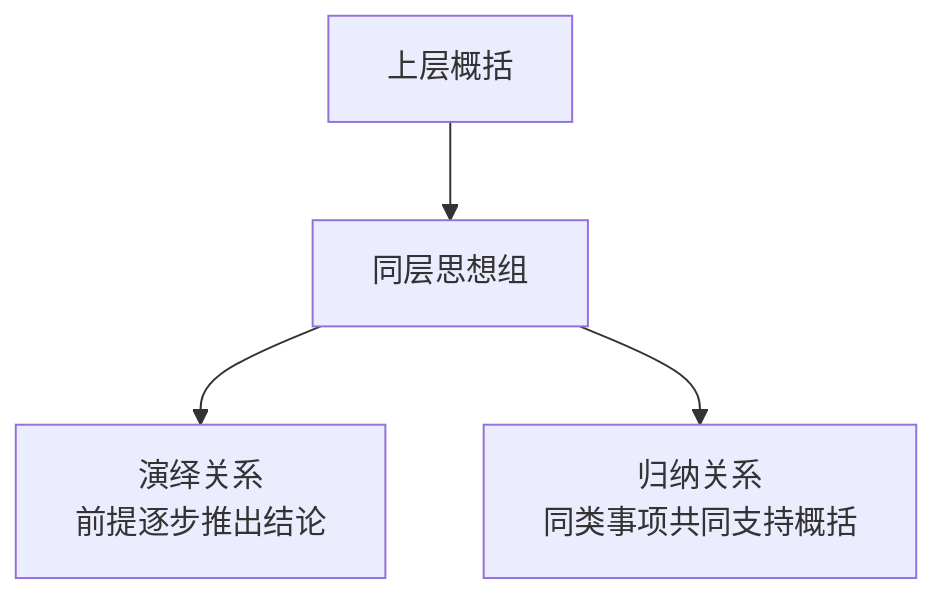
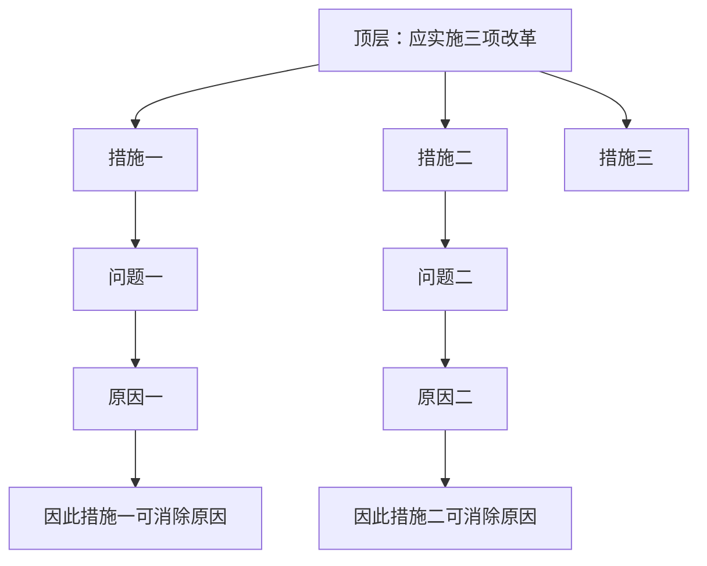
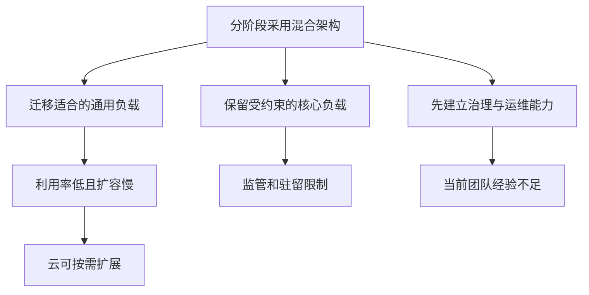

> 阅读范围：第5章“演绎推理与归纳推理”，包括“演绎推理”“归纳推理”“演绎推理与归纳推理的区别”三个小节。
>
> 原文：《金字塔原理》第5章

## 本章定位：为横向思想组选择正确的推理关系

金字塔中的思想有三个观察方向：

- **向上**：下层思想共同概括成上层思想；
- **向下**：下层思想解释或支持上层思想；
- **横向**：同层思想以某种逻辑关系共同完成一次回答。

前两种是同一纵向关系的两个方向。第5章集中处理第三种：**同一组思想究竟是前后推导的演绎链，还是从共同点形成概括的归纳组？**



作者的核心判断有两层：

1. 思考和解决问题时，演绎推理不可缺少；
2. 面向读者表达时，尤其在关键句层，归纳结构通常更直接、更容易理解。

因此，本章不是要用归纳取代演绎，而是区分**发现结论的推理方式**与**呈现结论的组织方式**。

---

## 第5章 演绎推理与归纳推理

### 一、为什么必须区分两种推理

若同层思想的逻辑关系不清，读者会遇到三类困难：

1. 不知道各项是承前启后，还是地位并列；
2. 不知道上层概括应强调最终结论，还是共同属性；
3. 无法判断推理是否完整，是否存在异类、遗漏或逻辑跳跃。

演绎和归纳的组内结构不同，概括方法也不同：

| 维度 | 演绎 | 归纳 |
| --- | --- | --- |
| 组内关系 | 后项建立在前项之上 | 各项地位并列、具有共同点 |
| 推理方向 | 规则或事实逐步推出含义 | 从多个实例提炼共同判断 |
| 顺序 | 通常不可任意交换 | 可按时间、结构或重要性排序 |
| 上层概括 | 重点放在“因此”后的结论 | 说明全组共同点及其意义 |
| 主要风险 | 形式无效、前提不真、缺少中间步骤 | 分类错误、样本不足、概括过度 |

### 二、图 5-1 的直观差异

#### 演绎

```text
鸟会飞 → 我是一只鸟 → 因此我会飞
                  ↘
        上层：我会飞，因为我是鸟
```

第三项依赖前两项，不能随意交换。上层概括以最终结论为重点，并保留关键依据。

#### 归纳

```text
英军坦克抵达波兰边境 ┐
德军坦克抵达波兰边境 ├→ 波兰将遭到坦克进攻
俄军坦克抵达波兰边境 ┘
```

三项不是互相推出，而是共同属于“针对波兰的军事行动”，从共同模式形成更高层判断。

### 三、“只有两种”应怎样理解

原书说，横向组织思想只有演绎和归纳两种模式。作为写作框架，这意味着：

- 若各项前后依赖，就按演绎检查；
- 若各项同类并列，就按归纳检查。

逻辑学和科学推理还会讨论溯因、类比、统计推断、因果推断等。它们在金字塔中通常最终呈现为某种演绎链或归纳组。因此，“两种”是对**横向表达形式**的实用二分，不是对全部人类推理活动的穷尽性定理。

---

## 演绎推理

### 一、为什么人们更容易使用演绎推理

人在解决问题时常沿如下路径思考：

```text
发生了什么问题
→ 为什么会发生
→ 因此应采取什么措施
```

每一步都以前一步为基础，符合自然探索过程。与从一组杂乱事实中创造共同概括相比，沿已知关系逐步向前通常更容易。

但发现顺序直接搬进文章，会迫使读者重新经历作者的全部探索过程。演绎适合思考，不代表适合在高层长距离展开。

### 二、什么是演绎推理

#### 要解决的问题

当一个结论取决于一般规则与具体事实，或取决于前后相连的条件时，单纯列出几个并列理由无法表现结论的必然来源。

#### 严格定义

**演绎推理**是这样一种推理：如果前提为真且推理形式有效，结论不可能为假。

经典形式：

$$
\forall x\,(P(x)\rightarrow Q(x))
$$

$$
P(a)
$$

$$
\therefore Q(a)
$$

即：所有满足 $P$ 的对象都满足 $Q$；对象 $a$ 满足 $P$；所以 $a$ 满足 $Q$。

### 三、原书的三步操作性定义

作者避免只用“大前提、小前提、结论”解释写作，而把过程写成：

1. 阐述现实中已存在的一种情况；
2. 阐述同时存在的相关情况，第二项应评述第一项的主语或谓语；
3. 说明两种情况同时存在所隐含的意义。

这一定义强调句子之间如何接上：第二句必须抓住第一句中的对象或属性，否则第三句无法从二者推出。

### 四、演绎三段论示例

#### 苏格拉底

1. 所有的人都会死；
2. 苏格拉底是人；
3. 因此，苏格拉底会死。

上层概括：

> 因为苏格拉底是人，所以他会死。

#### 行业协会与反垄断

1. 实施反垄断法是为了促进生产和销售；
2. 行业协会对人力资源的垄断妨碍生产和销售；
3. 因此，行业协会应受到反垄断法约束。

结论成立还要求法律确实覆盖此类协会、事实判断准确，且不存在豁免。

#### 企业收购

1. 符合三项标准的企业都值得收购；
2. 甲公司符合三项标准；
3. 因此，甲公司值得收购。

结论依赖标准是否充分、测量是否可靠及是否遗漏重大风险。

#### 组织改革

1. 做好四项工作就能增加产量；
2. 贵公司现有结构不能做好其中任何一项；
3. 因此，贵公司应改变结构。

需要验证“四项工作”是否真是充分条件，以及结构问题是否为主要障碍。

#### 成熟业务现金流

1. 多数公司既有新增业务，也有成熟业务；
2. 两类业务的现金需求相反；
3. 因此，成熟业务可作为公司增长的基本现金来源。

这里还隐含成熟业务能稳定产生现金、资金可调配等前提。

### 五、演绎推理的另一种三步形式

作者把解决问题式演绎写成：

1. 出现的问题或现象；
2. 产生问题的根源或原因；
3. 解决问题的方案。

严格说，“问题—原因—方案”不天然构成形式演绎。要使第三步成立，还需隐含原则：若某原因造成问题，且某措施能够消除该原因，则应采取该措施。

$$
C\rightarrow P
$$

$$
A\rightarrow \neg C
$$

$$
\therefore A\text{ 有助于解决 }P
$$

还必须排除副作用、替代原因和更优方案。因此，应把它理解为商务问题分析中的演绎骨架，而非无条件必然的形式证明。

### 六、形式有效、前提真实与论证可靠

三个概念必须区分：

- **形式有效**：不存在前提全真而结论为假的情况；
- **前提真实**：规则和具体事实符合现实；
- **论证可靠**：形式有效且前提真实。

例如：

1. 所有鱼都会飞；
2. 鲤鱼是鱼；
3. 因此鲤鱼会飞。

形式有效，但第一前提为假，因此论证不可靠。金字塔结构能使形式可见，不能替代事实核验。

### 七、为什么上层概括应强调最后一步

演绎组新增的信息价值主要出现在最终推论。若上层只写“关于苏格拉底的三项判断”，就丢失了推理结果；若只重复大前提，又没有概括整组。

合理概括通常采用：

> 因为 B 满足 A 所规定的条件，所以 C。

概括应保留最关键的因果或适用关系，同时把详细前提留在下层。

### 八、什么是连环式演绎推理

一个结论可以成为下一次推理的前提：

$$
A,B\Rightarrow C
$$

$$
C,D\Rightarrow E
$$

由此形成演绎链。为避免重复，可以省略受众能够自动补出的中间前提，但省略必须满足：

- 读者知道并接受该步骤；
- 省略后不会出现多种解释；
- 中间步骤不是争议核心；
- 结论仍能被审查。

### 九、旧报纸与新闻纸短缺案例

完整链条是：

1. 本地旧报纸供应原本足以满足自身需要；
2. 但本地把旧报纸卖给其他国家；
3. 因此，本地面临旧报纸短缺；
4. 旧报纸短缺会导致新闻纸短缺；
5. 本地面临旧报纸短缺；
6. 因此，本地面临新闻纸短缺。

压缩后：


完整列出每个步骤会重复“旧报纸短缺”，显得琐碎；压缩则依赖读者理解原料关系。

### 十、连环演绎的成立边界

旧报纸案例还隐含：

- 旧报纸是新闻纸的重要原料；
- 缺少替代原料或进口来源；
- 出口规模足以影响本地供应；
- 需求和生产能力其他条件稳定。

若任一条件不成立，“出口必然加重新闻纸短缺”的强结论就需调整。

### 十一、为什么演绎写作容易笨拙

演绎从简单前提逐步推出复杂结论。若每一步都跨越多个页面，读者必须长时间保存前提并在后文重新配对。

认知任务可表示为：

$$
L=L_{保存前提}+L_{跨段配对}+L_{验证推导}+L_{理解结论}
$$

推理链越长、相邻步骤距离越远，前两项负担越大。

### 十二、改革案例的演绎结构

图 5-4 的顶层是“你必须进行改革”，下层按发现过程依次展示：

```text
目前问题：问题一、问题二、问题三
→ 对应原因：原因一、原因二、原因三
→ 对应措施：措施一、措施二、措施三
```

读者必须完成：

1. 记住三个问题；
2. 把问题一与原因一配对，依次类推；
3. 再把问题—原因组合与措施配对；
4. 读到最后才知道行动。

作者等于要求读者重走分析过程后才得到“回报”。

### 十三、把改革案例改成归纳表达

图 5-5 先回答“如何改革”：

```text
必须改革
├── 措施一
│   └── 因为：问题一 → 原因一
├── 措施二
│   └── 因为：问题二 → 原因二
└── 措施三
    └── 因为：问题三 → 原因三
```

改变的是呈现顺序，不是分析方法。每个措施下面仍可用演绎说明原因，但高层先把同主题信息集中起来。

### 十四、归纳表达为何更容易理解

1. 直接回答读者最关心的行动问题；
2. 每项措施与自己的证据放在同一分支；
3. 不要求读者跨三个大组反复配对；
4. 关键句处于同一抽象层级；
5. 读者可按需深入某一措施。

这说明“演绎更严密”与“演绎更适合高层表达”是两个问题。相同推理可以用更符合读者需求的顺序呈现。

### 十五、调研结果、结论与建议工作表

表 5-1 把材料分为：

| 调研结果 | 分析结论 | 建议 |
| --- | --- | --- |
| 问题一、二、三 | 原因一、二、三 | 措施一、二、三 |

作者指出，“调研结果”和“结论”不是绝对不同种类。对一组更具体调研结果的概括就是结论；从更高层看，该结论又可以成为下一次归纳的材料。

因此，两者主要表示抽象层级：

$$
\text{具体事实}\xrightarrow{概括}\text{局部结论}
\xrightarrow{再概括}\text{更高层结论}
$$

### 十六、工作表如何转换成归纳金字塔

若按演绎发现顺序写，通常是：

```text
所有问题 → 所有原因 → 所有措施
```

若将工作表“旋转”，按行动主题组织：

```text
措施一 → 对应原因一 → 对应问题一
措施二 → 对应原因二 → 对应问题二
措施三 → 对应原因三 → 对应问题三
```

关键句变成并列措施，低层保留各自演绎依据。这是从分析结构到沟通结构的转换。

### 十七、溯因推理在问题分析中的位置

原书称“不明推论”（abduction）为：先提出假设，再寻找支持信息。现代常称**溯因推理**或最佳解释推理。

例如：

1. 观察到销量下降、投诉增加；
2. 假设产品质量下降是共同原因；
3. 寻找退货、缺陷率和批次数据；
4. 若证据支持，形成归纳性结论；
5. 若出现更好解释，修正假设。

溯因不能只寻找支持信息，还应主动寻找反证和替代解释，否则会陷入确认偏误。

### 十八、为什么通常先行动、后原因

在多数商务场景，读者提出的是“如何做”“你建议什么”。先交付行动，再解释依据，可以降低等待成本。

情况一：

- 读者：如何降低成本？
- 作者：做到 A、B、C。

顶层“降低成本很容易”，关键句 A、B、C 构成归纳组，直接回答如何做。

### 十九、关键句层需要演绎的第一种例外

当顶层回答严重违背读者预期时，读者首先问“为什么”，而不是“如何做”。

情况二：

- 读者：如何降低成本？
- 作者：不要降低成本，应考虑卖掉公司。

此时若直接说如何出售，读者不会接受。必须先解释：

```text
公司面临国外巨大威胁
→ 现有组织结构无法有效应对
→ 其他人可能有能力应对
→ 因此，应考虑出售公司
```

演绎链负责改变读者的基本问题框架。

### 二十、关键句层需要演绎的第二种例外

若读者不先理解方法原理，就无法理解行动，也应先演绎解释。

风险分析案例中，需要先说明：

- 资本投资依赖多项不确定假设；
- 不确定性组合会形成风险；
- 新方法能衡量组合风险；
- 因此，再说明怎样用该方法评估方案。

这里“为什么这种方法成立”是理解“如何操作”的前置知识。

### 二十一、为什么演绎适合放在较低层

低层演绎通常位于一个段落或短小分支，前提和结论距离近，读者容易保持关系。

高层演绎若跨越十几页：

- 第一步与第二步相距太远；
- 中间材料干扰工作记忆；
- 读者难以预测结论；
- 上层概括过于复杂。

因此，默认建议是：高层归纳，低层按需要演绎。

### 二十二、连环演绎的复杂度限制

作者建议：

- 推理过程不超过四步；
- 推导出的结论不超过两个。

这不是形式逻辑的有效性上限，而是可读性经验规则。超过后可以：

1. 把中间结论提升为上层思想；
2. 拆成多个局部演绎组；
3. 用图示呈现依赖；
4. 把技术证明放入附录；
5. 先给结论，再按需展开。

---

## 归纳推理

### 一、为什么归纳更难

演绎沿已有规则前进，归纳则要从不同事物中**创造性地发现正确共同点**。同一组事实可能按不同方式定义，从而得到不同结论。

坦克抵达边境可以被定义为：

- 针对波兰的军事行动，由此推断波兰可能遭攻击；
- 波兰盟国为进攻其他国家做准备，由此得到完全不同结论。

归纳难点不是看见相似，而是选择与当前问题最相关、最能解释材料的相似性。

### 二、什么是归纳推理

#### 严格定义

**归纳推理**是从两个或更多具体事实、事件或思想中识别共同属性，将其归入同一逻辑类别，并形成覆盖全组的更一般判断。

设思想组为：

$$
G=\{g_1,g_2,\ldots,g_n\},\quad n\ge 2
$$

若存在共同谓词 $P$：

$$
\forall g_i\in G,\ P(g_i)=\text{真}
$$

则可形成类别或概括 $S$。如果 $S$ 超出已观察事项，其结论通常只有概率性支持，而非演绎必然。

### 三、归纳需要的两项核心技能

1. 正确定义该组思想；
2. 识别并剔除与其他思想不相称的异类。

第一项决定共同点有没有意义，第二项保证分组纯度。只会给组命名而不会排除异类，容易形成牵强概括。

### 四、为什么要找单一名词

原书建议找到一个表示全组思想的单一名词，如：

- 计划；
- 步骤；
- 损害方式；
- 原因；
- 建议。

名词检验要求每项都符合相同类别定义。例如，若一组称为“实施步骤”，其中不能混入“预期收益”或“项目背景”。

单一名词是最低门槛，不是充分条件。三项都可叫“问题”，仍可能属于不同对象、不同层级或不同时间范围。

### 五、归纳组的完整检查

一个高质量归纳组至少满足：

1. **共同性**：每项共享明确属性；
2. **相关性**：共同属性服务于当前问题；
3. **同层性**：各项抽象程度相近；
4. **排异性**：不存在不符合定义的项目；
5. **概括适度**：上层不超出下层能够支持的范围；
6. **顺序合理**：按时间、结构或重要性排列；
7. **必要完整**：没有明显遗漏当前结论所需的关键类别。

### 六、归纳概括为什么具有不确定性

从有限观察推到更一般结论，通常存在多个可能解释。即使三国坦克都到边境，也可能是演习、威慑、联合防御或入侵准备。

因此归纳结论强度取决于：

- 样本数量和代表性；
- 共同属性与结论的相关程度；
- 是否存在反例；
- 替代解释是否被排除；
- 背景知识和机制证据；
- 数据质量。

严谨表述应区分“说明”“支持”“很可能”“必然”。

### 七、用自下而上提问检查归纳跃进

归纳从具体事项跃升到更一般判断，作者称这种提升需要检查。基本问题是：

> 这些事项合在一起，究竟只允许我说到哪一步？

检查方式：

1. 给全组准确命名；
2. 逐项确认是否满足定义；
3. 写出最小共同概括；
4. 判断是否加入了下层没有提供的信息；
5. 搜索能推翻概括的反例；
6. 比较其他可能概括。

### 八、莫伯图斯的计划案例

图 5-9 的上层判断是：某人富有想象力，但不是实用主义者。下层包括：

- 寻找只使用拉丁语的城市；
- 在地上挖深洞以发现新物质；
- 用鸦片进行心理测试；
- 用重力解释胚胎形成。

这些都可定义为“富有想象但不切实际的计划”。若事实描述准确，上层概括贴近这些项目，不需要额外因果跳跃。

但对人物整体人格下结论仍需谨慎：几项计划只能支持“这些计划不实用”，未必充分证明此人在所有方面都不是实用主义者。

### 九、减少现场劳动力浪费案例

下层包括：

- 组成更精干、技术更熟练的员工队伍；
- 合理安排工作量；
- 保证相关工作信息传到现场。

三项都是“减少现场劳动力浪费的措施”。它们共同回答“如何减少浪费”，属于行动性归纳组。

结论成立还需验证措施是否覆盖主要浪费来源、是否可执行以及成本是否合理。

### 十、财产共有的不利影响案例

下层列出：

- 可能妨碍订立遗嘱；
- 可能增加房产税；
- 可能产生赠与税；
- 可能使离婚更复杂。

共同名词是“财产共有可能带来的不利影响”。各项并列，但适用性取决于司法辖区、财产类型和家庭状况。归纳结构清楚，不代表每项都适用于所有人。

### 十一、结论不可超越思想组

图 5-10 展示两类过度概括。

#### 管理人员案例

观察：

- 不面对现实；
- 不接受批评；
- 不撤销亏损业务；
- 不质疑现行政策。

上层却写：“管理不善，是因为他们就愿意这样做。”

下层最多说明一组消极管理行为，不能证明其主观愿望。结论加入了动机判断，超出证据。

更稳妥概括：

> 管理层通过回避现实、批评和纠错，持续维持低效决策。

#### 排版成本案例

观察：生产效率低、加班过多、简单任务价格无竞争力。

上层写：“排版成本可能影响盈利”过于宽泛。还可以想到许多影响盈利的因素，这个上层并非这三项的专属概括。

更准确的是因果判断：

> 生产效率低导致加班过多，从而使价格缺乏竞争力。

这不是并列归纳，而是演绎或因果链。

### 十二、为什么“概括过宽”是问题

若上层可以容纳大量未列出的异质事项，它对当前组的解释力很弱。

可以用区分度理解：

$$
\text{概括质量}\propto
\frac{\text{覆盖本组的能力}}{\text{无关事项也能被纳入的程度}}
$$

“这些都是事项”覆盖率很高，却没有区分力；“导致简单排版报价无竞争力的内部成本因素”更具体。

### 十三、论据支持观点时为何要检查演绎关系

作者说，一旦得到支持某观点的论据，就要用演绎法处理。这可理解为：不能只因为事实相关就声称它支持结论，必须补出支持规则。

例如：

1. 生产效率低；
2. 若效率低会增加单位工时与加班，则成本上升；
3. 成本上升使报价缺乏竞争力；
4. 因此，效率低解释了价格问题。

演绎检查暴露了“效率如何影响成本”的中间机制。

### 十四、归纳推理的适用边界

适合：

- 从多项事实发现模式；
- 把多个原因、措施、问题或步骤归组；
- 在关键句层直接列出并列回答；
- 对经验材料形成暂时概括。

需要其他方法补充：

- 样本推广需要统计推断；
- 因果结论需要实验、准实验或机制分析；
- 最佳解释需要溯因与替代假设比较；
- 相似案例迁移需要类比条件检查；
- 风险预测需要概率和情景分析。

---

## 演绎推理与归纳推理的区别

### 一、最实用的句法识别规则

#### 演绎

第二个思想对第一个思想的主语或谓语作出评述，并由二者推出结论。

```text
第一句：关于 A 的规则或判断
第二句：说明 B 属于 A，或进一步评述 A 的属性
第三句：因此得到 C
```

#### 归纳

同组句子的主语或谓语存在共同点，可以用一个单一名词概括。

```text
A 具有 P
B 具有 P
C 具有 P
→ A、B、C 共同属于某类或支持某概括
```

### 二、图 5-10 后的两个“伪演绎”案例

原书引用两组错误三段论：

#### 医疗社会化

1. 所有工党成员都支持医疗社会化；
2. 政府中有一些人支持医疗社会化；
3. 因此，政府中有一些人是工党成员。

结论无效。支持同一政策不代表属于同一政党。形式上是：

$$
P\rightarrow Q,\quad R\rightarrow Q
$$

不能推出：

$$
R\rightarrow P
$$

这属于“肯定后件”式错误。

#### 兔子与马

1. 所有兔子都跑得快；
2. 有一些马跑得快；
3. 因此，有一些马是兔子。

同样，拥有共同谓语“跑得快”只能把兔子和部分马归为“跑得快的动物”，不能推出类别身份相同。

### 三、为什么它们其实是归纳并列

第二句没有评述第一句的主语“工党成员”或“兔子”，而是向“支持医疗社会化者”“跑得快者”范畴增加成员。

可以合法概括为：

- 工党成员和一些政府人士都支持医疗社会化；
- 兔子和一些马都是跑得快的动物。

不能从共享属性反推对象类别相同。

### 四、日本投资案例：识别演绎与归纳

起始句：

> 日本商人正在增加对中国市场的投资。

#### 演绎性后句

> 美国商人将很快进入中国市场，这会进一步促进日本商人的行动。

这句话评述“日本商人增加投资”所处的竞争环境，并预示一个因果结论。要形成完整演绎，还需说明美国进入为什么会促进日本投资。

#### 归纳性后句

> 美国商人正在增加对中国市场的投资。

两句共享谓语“增加对中国投资”，形成并列事实，可概括为“外国投资者正在增加对中国市场的投资”。

### 五、归纳的两种句法模式

#### 保持谓语，改变主语

- 日本商人增加对中国投资；
- 美国商人增加对中国投资；
- 德国商人增加对中国投资；
- 概括：多个国家的投资者正在增加对中国投资。

共同点是谓语。

#### 保持主语，改变谓语中的对象

- 日本商人增加对中国投资；
- 日本商人增加对印度尼西亚投资；
- 概括：日本商人正在加强对东亚或亚洲相关市场的投资。

原书概括为开拓东南亚市场，但中国通常不属于东南亚。更严谨的地理概括应根据实际国家范围选择“亚洲市场”“东亚与东南亚市场”等表述。这个细节也说明：共同名词必须事实准确。

### 六、中国、冰岛、秘鲁案例为何不能强行概括

若日本商人分别增加对中国、冰岛和秘鲁投资，三国除“被日本商人投资”外未必有与当前问题相关的共同属性。

可以陈述：

> 日本商人正在进入三个国家的市场。

但若无法说明三国为何构成一个有意义类别，就不能进一步推断区域战略、行业战略或统一动机。

这是一组新闻事实，不一定形成思想。

### 七、什么是“新闻”，什么是“思想”

- **新闻**：某个事实真实发生；
- **思想**：事实被置于逻辑关系中，用于解释或支持更高层判断。

真实性是写入文章的必要条件之一，却不是结构上的充分理由。一条事实应进入正文，还必须回答：

> 它支持或解释哪个上层思想？

如果没有答案，它可能只是资料库内容，而不是当前文章的一部分。

### 八、演绎关系的完整判定

1. 第二句是否抓住第一句的主语、谓语或条件？
2. 第三句是否真由前两句推出？
3. 是否存在未说明的中间前提？
4. 推理形式是否有效？
5. 前提是否真实、适用？
6. 上层概括是否强调最终结论？

### 九、归纳关系的完整判定

1. 各句是否具有相同主语或谓语结构？
2. 能否用一个单一名词表示全组？
3. 共同点与当前问题是否相关？
4. 是否有异类或层级混杂？
5. 概括是否超出下层证据？
6. 是否存在更合理的分组或解释？

### 十、读者为什么会预测下一句

一旦读者识别出推理形式，大脑就会预测结构完成方式：

- 看到一般规则与具体事实，会等待“因此”；
- 看到两个同类实例，会等待第三个实例或共同概括；
- 看到问题，会等待原因或方案。

若作者突然改变关系，读者会困惑。例如前两项都是原因，第三项却是措施；或者前两句准备演绎，第三句却得出无关结论。

因此，应先给上层主题思想，让读者知道后续是在证明什么，并保持组内关系一致。

### 十一、为什么先给主题思想

主题思想为读者提供解释框架：

1. 指定下层事项的共同问题；
2. 提醒读者应寻找演绎链还是归纳共性；
3. 限制歧义；
4. 让读者及时发现不支持主题的材料；
5. 降低对结论的猜测成本。

这与第1章“自上而下表达”的结论一致。

---

## 两种推理在同一金字塔中的协作

### 一、不同层可以使用不同关系



顶层关键句 A-B-C-D 是归纳的行动组；每项措施下方可以使用演绎链证明。所谓“关键句层优先归纳”，不等于全文禁用演绎。

### 二、从思考结构到表达结构


真实分析往往混合归纳、溯因和演绎；最终文章再根据读者问题重排。

### 三、严密与易读不是对立目标

归纳式高层表达并没有删除演绎证明，只是把它放在读者需要的位置。理想结构同时满足：

- 顶层快速交付行动或结论；
- 下层保留完整依据；
- 读者可沿分支审查推理；
- 重要反例和假设不被隐藏。

---

## 作者分析问题的完整思路

### 一、问题从哪里来

写作者常把自己的分析过程原样交给读者：先讲所有问题，再讲所有原因，最后讲所有建议。虽然逻辑可能成立，读者却要跨长距离配对信息。

### 二、难点在哪里

- 演绎发现顺序容易被误当成最佳表达顺序；
- 归纳需要创造性地定义共同点；
- 同一组事实可能支持多种概括；
- 共享属性容易被误写成类别身份；
- 上层概括容易超越证据；
- 真实事实容易被当作必须写入的思想；
- 长演绎链会超出读者工作记忆。

### 三、为什么先明确两种横向关系

只有判断组内是承接还是并列，才能决定顺序、概括方式和完整性检查。

### 四、为什么思考时常用演绎

问题解决需要从现象追根因，再从根因推措施，演绎链适合检验每一步是否跟得上。

### 五、为什么高层表达优先归纳

商务读者通常先关心结论和行动。把同一行动的原因与证据放在一条分支中，比让读者跨“问题—原因—措施”三大组配对更省力。

### 六、为什么归纳要先命名再排异

命名明确分类标准，排异检验标准是否真正适用于每项。二者共同防止凭表面相似硬凑一组。

### 七、为什么结论不能超越思想组

上层若加入动机、因果或范围，而下层没有提供相应证据，结构会把猜测伪装成概括。

### 八、为什么强调新闻与思想的区别

文章不是事实仓库。事实只有进入支持关系后才成为当前论证的一部分，否则只增加认知负担。

### 九、方法为什么有效

它为每组思想提供可执行的检查：

- 第二句是否评述第一句？
- 是否能推出“因此”？
- 各项能否用同一名词表示？
- 是否有共同主语或谓语？
- 概括是否只说到证据允许的位置？

### 十、方法的局限

1. 句法相似不保证真实共同机制；
2. 演绎形式有效不保证前提真实；
3. 归纳无法单靠结构解决样本代表性；
4. 因果链需要经验方法验证；
5. “四步以内”是可读性经验规则，不是逻辑定律；
6. 关键句归纳优先不适合所有法律或技术证明；
7. 复杂网络因果难以压成单链；
8. 读者关注点判断可能错误。

### 十一、补充和替代工具

- **真值表与形式逻辑**：检查演绎有效性；
- **论证图**：显示前提、反例和中间结论；
- **因果图**：识别混杂、中介和反馈；
- **统计推断**：评估归纳推广强度；
- **假设检验**：主动寻找反证；
- **亲和图**：从大量材料发现归纳分组；
- **证据矩阵**：追踪每个建议对应的问题和原因；
- **决策树**：处理条件分支与多种后果。

---

## 易混淆概念辨析

### 演绎有效与前提真实

有效描述形式，真实描述事实。只有两者兼具，论证才可靠。

### 演绎严密与演绎易读

推理形式严密不意味着长距离呈现易读。可以保留严密证明，同时把高层改成归纳行动结构。

### 归纳分组与统计归纳

金字塔中的归纳常指对同类思想分类概括；统计归纳还涉及样本、概率和误差，不能只靠同名词检验。

### 归纳概括与因果结论

“三项都发生”只支持共同模式；要说 A 导致 B，还需机制和反事实证据。

### 溯因与归纳

溯因从现象提出最佳解释，归纳从多个观察概括模式。解释获得证据后可形成归纳支持，但二者目的不同。

### 调研结果与结论

二者常是相对层级：低层结论可成为高层推理的调研结果。

### 共同谓语与同一类别

兔子和马都跑得快，只能归入“跑得快的动物”，不能推出马是兔子。

### 共同点与有用共同点

任何事物都可在足够高层找到共同点。有效归纳要求共同点与当前问题相关且有区分力。

### 新闻与思想

新闻强调事实发生，思想强调事实在当前论证中的意义。真实但无支持关系的新闻不应进入文章主干。

### 发现顺序与呈现顺序

分析可能先问题、后原因、再措施；表达可以先措施，再在各分支解释问题和原因。

### 省略步骤与逻辑跳跃

读者能唯一补出且接受时可省略；若省略的是争议前提、因果机制或适用条件，就是逻辑跳跃。

---

## 综合示例：是否应停止自建数据中心

### 一、原始分析材料

- 数据中心设备五年后进入更新周期；
- 容量平均利用率只有 35%；
- 两次扩容都比计划晚三个月；
- 云服务可按需扩展；
- 云迁移需要改造部分系统；
- 某些受监管数据不能直接迁入公有云；
- 自建中心每年固定成本较高；
- 云成本随使用量增长；
- 核心团队缺少云运维经验。

### 二、错误归纳

> 自建数据中心存在很多问题，因此应全部迁云。

“很多问题”缺乏思想，且“全部迁云”超出材料：监管数据和迁移能力构成反例。

### 三、演绎分析

#### 工作负载分类原则

1. 能标准化、弹性波动且无监管限制的工作负载，迁云通常能减少闲置和扩容延迟；
2. 大部分通用工作负载符合这些条件；
3. 因此，大部分通用负载适合迁云。

#### 受监管负载

1. 不能满足数据驻留要求的负载不得迁入公有云；
2. 某些核心负载受此限制；
3. 因此，这些负载应保留在合规私有环境。

#### 能力前提

1. 云迁移成功需要架构与运维能力；
2. 当前团队缺少相关经验；
3. 因此，迁移前必须培训或引入能力。

### 四、面向决策者的归纳表达

顶层回答：

> 不应继续按现状扩建单一自建数据中心，而应分阶段采用混合架构。

关键句：

1. 将合规允许且弹性明显的通用负载迁云；
2. 将受监管或延迟敏感负载保留在合规私有环境；
3. 先建立云治理、成本监控与运维能力，再扩大迁移范围。



### 五、为什么这种表达不损失严密性

高层三项都是行动，直接回答“应该怎么做”；每项下面保留规则、事实和结论的演绎依据。读者既能迅速获得建议，也能审查推理。

### 六、仍需验证的假设

- 云与自建的总拥有成本口径一致；
- 35% 利用率确实可通过迁云改善；
- 网络、锁定、可用性和安全风险可控；
- 混合架构的复杂度没有抵消收益；
- 法规解释经过法律和合规确认。

结构化推理指出需验证什么，但不会自动提供这些证据。

---

## 常见误解与错误做法

### 误解一：演绎一定正确，归纳只是猜测

演绎仍可能前提为假；归纳可以得到强证据支持，只是不具有形式必然性。

### 误解二：演绎越长越严密

长链增加隐含前提和认知负担。应拆分并明确中间结论。

### 误解三：关键句层永远不能演绎

结论反直觉或行动必须先理解原理时，高层演绎是合理例外。

### 误解四：改成归纳就是删除原因

原因移到相应行动下方，而不是被删除。变化的是信息顺序。

### 误解五：能用同一个名词就是合格归纳

还要检查相关性、同层性、排异、顺序、完整性和概括强度。

### 误解六：共享属性可以反推类别

共享“跑得快”不能推出马是兔子；共享政策立场不能推出政党身份。

### 误解七：几个实例足以证明一般规律

推广强度取决于样本代表性、反例和机制，不能只看数量。

### 误解八：事实真实就应该写入文章

事实还必须支持或解释当前上层思想，否则只是无关新闻。

### 误解九：概括越抽象越高级

过度抽象会失去区分力。好的概括应恰好覆盖本组并揭示其意义。

### 误解十：问题、原因和措施可以并列

它们处于不同逻辑角色。应形成演绎链，或按措施重组并在下层说明问题和原因。

### 误解十一：省略中间步骤能让文章更简洁

只有读者能唯一补出时才是合理压缩；省略争议前提会形成逻辑跳跃。

### 误解十二：归纳结论必须用确定语气

应根据证据写“可能、支持、很可能”或明确条件，不能把概率推断包装成必然结论。

---

## 第五章实践检查清单

### 判断组内关系

1. 同层思想是前后依赖还是同类并列？
2. 第二项是否评述第一项的主语、谓语或条件？
3. 是否存在由“因此”引出的必然或条件性结论？
4. 若无承接，能否用单一名词表示全组？
5. 是否错误地把共享属性当成同一类别？

### 检查演绎

6. 一般规则是什么？
7. 具体对象是否真正满足规则条件？
8. 结论是否由前提推出？
9. 推理形式有效吗？
10. 所有前提都真实吗？
11. 是否遗漏关键中间前提？
12. 省略步骤是否能被目标读者唯一补出？
13. 上层概括是否强调最终结论？
14. 连环推理是否过长或产生过多中间结论？

### 检查归纳

15. 全组的准确单一名词是什么？
16. 每项都符合该定义吗？
17. 共同点与当前问题相关吗？
18. 各项处于相同抽象层级吗？
19. 是否存在异类或遗漏？
20. 上层概括是否加入未被支持的动机、因果或范围？
21. 是否有反例或替代概括？
22. 若推广到未观察对象，样本是否有代表性？
23. 结论语气是否匹配证据强度？

### 选择表达结构

24. 读者首先关心行动还是原因？
25. 顶层回答是否符合读者预期？
26. 若反直觉，是否应先用演绎解释？
27. 行动是否必须先理解某种原理？
28. 能否把关键句改为并列措施？
29. 每项措施下是否保留自己的问题、原因和证据？
30. 高层演绎是否跨越太多页面？
31. 局部演绎能否压缩到一个段落或短分支？

### 检查材料价值

32. 每条事实支持哪个上层思想？
33. 若删除该事实，论证是否受影响？
34. 它是思想、证据，还是仅仅新闻？
35. 调研结果与结论是否只是不同抽象层级？
36. 是否主动寻找了反证与替代解释？
37. 因果判断是否有机制或反事实支持？

### 最终读者检查

38. 读者能否预测下一项的逻辑角色？
39. 主题思想是否在推理前给出？
40. 读者能否迅速看懂结论，又能向下审查依据？
41. 结构清晰之外，事实和推理是否可靠？

---

## 本章小结

第5章完成了对金字塔横向关系的核心区分：

1. 演绎组中思想前后承接，最终由“因此”推出结论；归纳组中各项并列，由共同点形成概括。
2. 演绎上层概括应强调最终结论，归纳上层概括应说明全组共同属性及其意义。
3. 演绎的三步是陈述一种情况、陈述相关情况、说明二者同时成立的含义。
4. 问题—原因—方案是常见商务演绎骨架，但还需验证因果、措施有效性和替代方案。
5. 形式有效不等于前提真实；可靠论证必须同时满足二者。
6. 连环演绎可省略读者已知且无争议的步骤，但长链容易重复并增加认知负担。
7. 改革案例说明，按“所有问题—所有原因—所有措施”写，会迫使读者跨组配对；按措施归纳后，每项依据可放回自己的分支。
8. 调研结果与结论通常只是相对抽象层级；具体事实被概括为结论，结论又可成为更高层材料。
9. 商务文章通常先行动后原因，因为读者最关心怎么做；顶层反直觉或行动必须先理解原理时，则应先演绎解释。
10. 高层通常适合归纳、低层适合短演绎；这改变呈现顺序，不削弱分析严密性。
11. 归纳更需要创造性，因为同一事实组可以按不同共同点定义，得到不同结论。
12. 合格归纳必须准确命名类别、排除异类，并确保概括不超越思想组。
13. “管理者故意管理不善”加入了未被行为支持的动机；“排版成本影响盈利”又过于宽泛，都是归纳越界。
14. 当事实被用作论据时，应补出支持规则，检查它为何能推出观点，而非只凭相关性并列。
15. 演绎的识别标志是第二项评述第一项的主语或谓语；归纳的识别标志是各句具有相似主语或谓语。
16. 工党与政府、兔子与马案例说明，共享一个谓语不能反推出类别身份。
17. 日本投资案例说明，保持谓语改变主语或保持主语改变对象都可形成归纳，但共同点必须事实准确且与问题相关。
18. 真实新闻只有在支持或解释更高层思想时才应进入文章主干。
19. 读者会预测演绎结论或归纳概括，因此应先给主题思想，并保持组内逻辑一致。
20. 现实分析通常混合归纳、溯因和演绎；金字塔的任务是根据读者问题，把这些结果组织成可理解、可审查的表达。

本章最核心的实践原则是：**思考时用演绎追查问题、原因和方案，用归纳从事实中发现共同模式；表达时优先把读者关心的结论或行动放到高层，再在较低层保留必要的演绎证明，并确保任何归纳概括都不超过下层材料真正支持的范围。**
