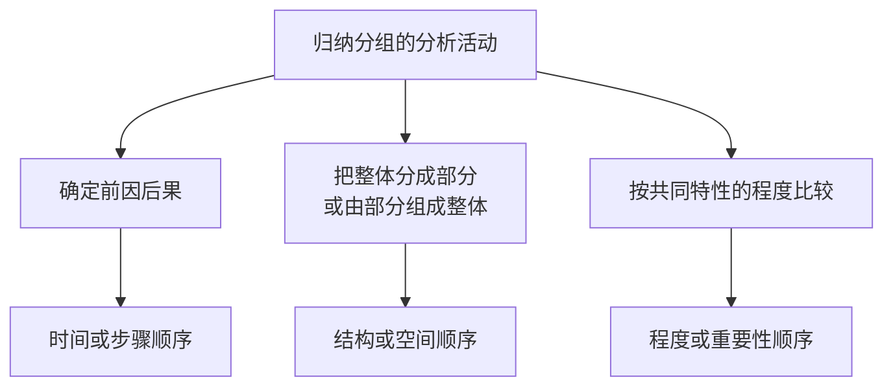
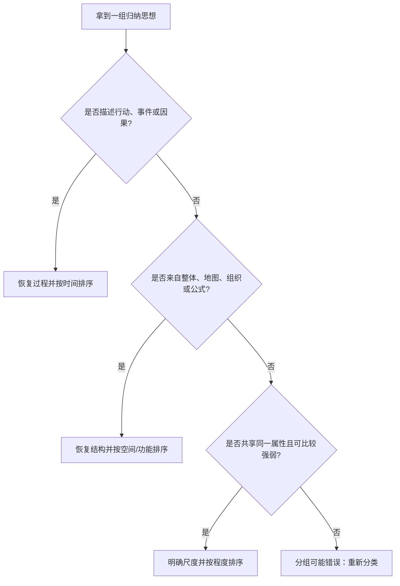

> 阅读范围：第6章“应用逻辑顺序”，包括“时间顺序”“结构顺序”“程度顺序”三个小节。
>
> 原文：《金字塔原理》第6章

## 本章定位：顺序是分析过程留下的痕迹

把几个思想放在一起，并给它们贴上“步骤”“问题”“原因”之类的标签，并不能证明分组正确。一个合格思想组还必须能够回答：

- 为什么第二项位于第二，而不是第一或第三？
- 这些项目是否真的来自同一过程、同一整体或同一类别？
- 是否混入原因、结果、行动等不同抽象层级？
- 是否遗漏了一个本来应当存在的项目？

第6章的核心观点是：**归纳分组采用的逻辑顺序，应当显露大脑建立该分组时进行的分析活动。**

作者把分析活动归纳为三种：



因此，顺序具有双重用途：

1. **表达用途**：让读者知道应按什么路径理解同层思想；
2. **诊断用途**：反向检查分组是否同类、同层、完整。

---

## 第6章 应用逻辑顺序

### 一、为什么归纳思想组必须有顺序

演绎组的顺序由推理形式决定：前提必须先于结论。归纳组中的项目地位并列，看似可任意排列，实则每个有效分组都源于某种分析框架。

例如：

- “解决问题的三个步骤”来自一个行动过程，应按时间；
- “公司成功的三个关键因素”可能来自行业结构，应按结构；
- “公司最严重的三个问题”来自同类问题比较，应按程度。

若“步骤”无法排出先后，可能并非同一过程；若“部门”互相重叠，整体划分有误；若“三个最重要问题”没有共同评价尺度，“重要”只是一种感觉。

### 二、逻辑顺序与完整性的关系

有序结构能暴露缺口。

设某过程应满足：

$$
A\rightarrow B\rightarrow C\rightarrow D
$$

若清单只有 $A,B,D$，顺序检查会促使人问“从 B 如何直接到 D”，从而发现缺失的 C。

结构划分同理。若整体 $U$ 被分成 $A,B,C$：

$$
U=A\cup B\cup C
$$

检查整体边界可以发现遗漏区域或交叉部分。

### 三、三种顺序可否结合

可以。不同层或同一复杂问题的不同观察角度可以使用不同顺序：

- 顶层按组织结构分为销售、生产、财务；
- 销售分支内部按客户旅程的时间顺序；
- 每一步的风险再按重要性排序。

但一个直接思想组应有一个主导排序原则。若前三项按时间、第四项突然按重要性，读者无法恢复分析过程。

### 四、“只有三种”的适用边界

字母、编号或随机顺序也可排列内容，但它们通常只是检索方式，不表达实质分析关系。问题—回答、正反对照等形式，也常可还原为过程、结构或程度上的安排。

因此，三种顺序适合作为归纳思想组的首要诊断框架，不必把它理解为形式逻辑中的穷尽性定理。

---

## 时间顺序

### 一、什么是时间顺序

#### 要解决的问题

行动清单常把前置动作、子过程、中间结果和最终状态混在同一层。即使编号正确，读者仍不知道哪些是真正步骤。

#### 严格定义

**时间顺序**是按照事件发生、行动执行或因果作用的先后，排列共同产生某个结果的一组思想。

若目标为 $R$，行动为 $a_1,a_2,\ldots,a_n$，时间顺序要求：

$$
a_1\prec a_2\prec\cdots\prec a_n\Rightarrow R
$$

$\prec$ 表示“必须先于”或“自然先发生于”。

### 二、时间顺序的上层概括

一组行动共同产生结果，所以对它们的上层概括应强调目标或结果，而不是“有若干步骤”。

- 弱概括：“项目包括五个步骤”；
- 强概括：“通过五步完成市场需求验证并形成可执行方案”。

### 三、原因集合与步骤过程

从因果角度看，为实现结果而采取的多项行动构成原因集合；从执行角度看，它们构成流程或系统。

需要区分：

- **必要步骤**：缺少它，后续无法成立；
- **并行条件**：可同时满足，不一定有严格时间先后；
- **中间结果**：由前一步产生，供下一步使用；
- **最终结果**：整个过程要达到的目标。

把这些类型混在一个清单里，是时间顺序最常见的错误。

### 四、怎样判断先后关系

对相邻两项问：

1. 第二项是否需要第一项的输出？
2. 若交换顺序，结果是否仍成立？
3. 两项能否并行？
4. 某项是行动，还是行动产生的状态？
5. 它是主过程的一步，还是某一步的子过程？

### 五、根据结果寻找原因

长流程中，每个动作都可能产生中间结果，中间结果又成为下一层动作的条件：


若不区分动作和结果，就会把 $A,R1,B,R2$ 全部当作同层步骤。

### 六、提高生产效率的八项措施案例

原清单包括：

1. 与主要管理人员和监管人员谈话；
2. 跟踪并记录交易行为和工作流程；
3. 确定所有关键业务环节；
4. 分析组织结构；
5. 理解服务和绩效措施；
6. 评估业务职能的绩效水平；
7. 找出问题和原因；
8. 发现提高生产效率的潜在机会。

虽然编号大致符合执行顺序，却有两个问题：项目过多，且抽象层级不同。

### 七、为什么八项不在同一层

1、2 是获得信息的动作，共同服务于 3“确定关键业务环节”；4、5、6 是分析弱点的子动作，共同服务于 7“找问题和原因”；8 则是更高层的阶段结果或后续建议。

真实结构应是：

```text
第一阶段：确定提高生产效率的可能领域
├── 1. 确定关键业务环节
│   ├── 与主要人员谈话
│   └── 跟踪并记录交易和流程
├── 2. 找出开展业务时的弱点
│   ├── 分析组织结构
│   ├── 检查服务和绩效管理措施
│   └── 评估绩效水平
└── 3. 提出实用可行的改革建议
```

### 八、重组推导

第一步，逐项模拟行动结果：

- 谈话与流程跟踪产生业务信息；
- 业务信息用于识别关键环节；
- 组织、指标与绩效分析产生弱点诊断；
- 弱点诊断支持改革建议。

第二步，把服务于同一中间结果的动作下沉为子过程。

第三步，把三个中间结果提升为同层阶段。

第四步，检查三个阶段是否共同实现“确定效率改进领域”。

### 九、为什么作者建议每组不超过四五项

这不是硬性逻辑规则，而是认知与结构警报：项目过多时，通常意味着还可以发现子组或中间结果。

超过五项不必机械拆分，但应检查：

- 是否存在共同子目标；
- 是否混入细节层；
- 是否有重复；
- 是否可以用更高层概括压缩。

### 十、用结果模拟法检查完整性

想象自己亲自执行每项行动，并问“执行后得到什么”。若某结果正好是另一项行动的目标，说明它们可能存在上下层关系，而不是平行步骤。

这种方法也会暴露缺失：谈话与记录是否足以确定关键业务环节？若还需数据分析或客户访谈，就应补入相应子步骤。

### 十一、战略规划周期案例

原清单混合：

- 企业行动：了解需求、制定战略、实施战略；
- 市场结果：接受期、快速增长、成熟、高现金增值、衰退。

执行到“实施战略”后，行动者无法继续“执行快速增长期”。增长期是市场反应，不是企业动作。

### 十二、产品生命周期与规划周期的区别

图 6-2 展示产品生命周期：缓慢增长、快速增长、成熟、市场接受、衰退等阶段。原文把生命周期状态误当成规划步骤。

“高现金增值期”通常是成熟阶段的属性，不是独立阶段。这说明即便都按时间出现，属于不同对象的时间线也不能混为一组。

### 十三、战略规划周期的改写

```text
制定战略规划需要完成一个反馈循环：
1. 了解需求；
2. 制定提供相应产品或服务的战略；
3. 实施战略；
4. 评估市场反应；
5. 根据市场反应调整战略。
```

改写把产品生命周期压缩为“市场反应”，再加入反馈动作“调整战略”，形成行动者可执行的闭环。

### 十四、闭环流程的成立条件

- 市场反应可以被观察和测量；
- 评估发生得足够及时；
- 企业有权和资源调整战略；
- 调整后会再次进入实施与评估。

若缺少反馈，流程只是一次性计划，不是真正循环。

### 十五、揭示隐含逻辑思路

有些清单表面是若干描述性结论，背后其实来自一个未写出的思考过程。恢复过程后，才能判断顺序、遗漏和上层概括。

### 十六、“经营的定义”案例

原文称经营：

- 依赖按需求和供给进行创造性细分；
- 随生命周期和竞争动态变化；
- 在行业中不必独一无二；
- 受自身优势和市场竞争影响。

四项表面上都是“经营特征”，但隐含的是“如何确定企业所处业务的性质”。

### 十七、恢复隐含过程

```text
确定企业经营性质，需要：
1. 对市场进行细分；
2. 评估企业在各细分市场中的竞争地位；
3. 长期跟踪竞争地位的变化。
```

推导关系：

- 按供需细分对应第一步；
- 自身优势与竞争对应第二步；
- 生命周期和动态变化对应第三步；
- “不必独一无二”是对竞争定位的说明，不宜独立并列。

恢复流程后，作者才能问三步是否完整。

### 十八、传统投资评估案例

原表述：

1. 通常在技术上不可靠；
2. 基于简单化概念；
3. 结果可能误导。

如果按隐含过程观察：

```text
提出概念 → 基于概念开发技术 → 应用技术 → 得到决策结果
```

“误导”是前两项可能产生的结果，应成为上层思想；而“概念简单化”在逻辑上先于“技术不可靠”。

改写：

> 传统投资评估可能造成误导，因为它基于过度简化的概念，并由此形成技术上不可靠的方法。

### 十九、如何用隐含过程发现遗漏

原文评述了概念和技术，却没有评述应用环节。可能有两种解释：

1. 应用没有问题；
2. 作者遗漏了应用错误。

恢复完整过程后，审阅者应追问：“实际使用该技术的方式是否也有问题？”

这就是顺序的诊断价值：不仅重排已有项目，还发现未被讨论的必要环节。

### 二十、时间顺序的适用边界

适合：

- 操作步骤；
- 事件发展；
- 因果链；
- 生命周期；
- 决策或分析过程。

不适合机械使用的情况：

- 行动本可并行；
- 读者关心重要性而非发生顺序；
- 项目属于不同对象的时间线；
- 清单混入状态和行动；
- 过程有复杂反馈，应改用流程图或状态机。

---

## 结构顺序

### 一、什么是结构顺序

#### 要解决的问题

当文章描述一个整体的组成、空间位置或概念架构时，若没有共同划分原则，容易重叠、遗漏或任意跳转。

#### 严格定义

**结构顺序**是按照某个真实或概念整体的组成关系、空间位置或功能结构，依次描述其各个部分的顺序。

整体可以是：

- 物体，如雷达；
- 地图区域，如西奈半岛周边；
- 组织，如公司或市政府；
- 概念系统，如投资回报率；
- 流程结构，如业务价值链。

### 二、创建逻辑结构：MECE

把整体 $U$ 划分为 $A_1,A_2,\ldots,A_n$，应尽量满足：

#### 相互独立 Mutually Exclusive

$$
A_i\cap A_j=\varnothing,\quad i\ne j
$$

同一对象在同一分类口径下不重复归属。

#### 完全穷尽 Collectively Exhaustive

$$
\bigcup_{i=1}^{n}A_i=U
$$

所有部分合起来覆盖当前定义的整体。

二者合称 MECE。

### 三、MECE 要解决什么问题

- 避免重复统计和重复讨论；
- 防止职责交叉而无人负责；
- 暴露未覆盖的区域；
- 让上层概括确实统摄全部下层；
- 为后续排序提供稳定结构。

### 四、组织结构图案例

图 6-3 把阿克伦轮胎橡胶公司分为轮胎部、硬件部和体育设备部，每个事业部内部再按研发、生产、市场划分。

第一层采用产品或业务单元口径，第二层采用活动职能口径。只要公司业务边界确实由三类产品覆盖，第一层就是 MECE；只要每项活动责任明确，第二层也可近似 MECE。

### 五、MECE 的成立条件与现实边界

MECE 必须相对于明确口径、时间和目的判断。

现实中：

- 跨部门项目天然多重归属；
- 客户群可能重叠；
- 一个产品可服务多个市场；
- “其他”类别可能用于容纳长尾；
- 动态系统边界会变化。

因此，MECE 是分析目标，不是要求现实对象天然互斥。必要时应明确主归属、协作关系或使用矩阵结构。

### 六、三种组织活动划分口径

#### 按活动

研发、生产、营销等。各部分构成价值流程，通常按时间顺序描述。

#### 按地点

东部、中西部、西部等。各部分构成地理空间，按地图或空间结构描述。

#### 按产品、市场或客户活动集合

轮胎部、硬件部、体育设备部等。各单元地位并列，常按销量、投资额或战略重要性排序。

同一组织可以用多种口径划分，但一个直接层级不能无说明地混用。

### 七、市政府职责从零构建案例

原书列出住房、交通、教育、娱乐、个人医疗和环境卫生。这些被视为市政府完整职责的六个领域，顺序反映“从零建设城市时”的关注程度。

这个结构依赖：

- 市政府职责边界已明确；
- 六类之间尽量不重叠；
- 没有遗漏公共安全、财政等当前分析所需领域；
- 排序尺度是建设优先级，而非字母或部门规模。

结构顺序迫使作者检查“六类是否构成全部职责”，而非满足于列出几个熟悉部门。

### 八、按功能划分：雷达装置

原书按功能列出：

1. 调制解调器吸收或调制能量；
2. 射频振荡器发射能量；
3. 扫描天线聚集并发送/接收信号；
4. 接收器处理返回信号；
5. 指示器显示数据。

各部分由信号处理功能连接，顺序也近似能量与信息流。这说明结构顺序和时间顺序可以结合：先按物理部件分块，再按信号流排列。

### 九、描述逻辑结构

创建结构后，常见描述路径是：

- 自上而下；
- 自左向右；
- 从外到内；
- 顺时针或逆时针；
- 沿功能流或信号流。

选择哪种路径，应让读者容易在心中重建同一图像。

### 十、西奈半岛地图案例

原文从地图左上角开始，按顺时针观察：

1. 西奈与埃及之间的苏伊士运河；
2. 与以色列南部内盖夫的关系；
3. 与沙特阿拉伯北部隔阿卡巴海湾相望；
4. 再转向东西大陆桥功能。

这些观点来自不同地缘政治视角，描述顺序跟随眼睛扫描地图的路径。

### 十一、空间顺序为何有效

读者可把每段话放到同一心理地图中。若作者在埃及、沙特、运河、以色列间随机跳转，读者必须不断重新定位。

空间顺序不证明地缘政治观点正确，只降低位置关系的重建成本。

### 十二、修改逻辑结构时如何排序

当建议从旧结构变成新结构时，各项改革可能同等重要、同时实施，无法按程度或时间。此时按“在白纸上画出新结构”的顺序说明。

### 十三、市政府组织重组案例

旧结构有 25 个部门向 23 个委员会汇报，关系零散。新结构以政策与财政委员会为中心，建立六个服务委员会、对应项目管理部门和行政管理分支。

建议顺序：

1. 把服务职责赋予政策与财政委员会下辖的六个委员会；
2. 把原部门合并为六个项目管理部门，并与委员会对应；
3. 建立行政及内部事务机构，包括常务委员会和更积极的人事委员会；
4. 任命行政长官管理在编人员。

### 十四、为什么这是结构顺序而非时间顺序

四项改革理论上可同时推进，也没有明确重要性差异。顺序来自绘图：先画治理核心与委员会，再画对应执行部门，再补支持机构，最后补行政管理分支。

这是一种“构造目标结构”的顺序。

### 十五、用结构顺序检查交通局文件

原文件列出：现场维修与建造、日常运营、初期工程和设计、组织结构、各领域优劣势。

问题在于：

- “找优势和劣势”是对前四项的分析动作，不是并列研究领域；
- 设计、建造、运营、维护的过程顺序被打乱；
- 组织结构可能是贯穿四项职责的管理维度。

### 十六、交通局结构的重建

```text
目标：检查交通局的组织和管理是否适合履行职责
职责结构：
1. 设计；
2. 建造；
3. 运营；
4. 维护。

对每项职责：评估现场表现、组织灵活性、优势和弱点。
```

结构顺序揭示了“第五点应成为横贯分析方法”，而不是第五个职责。

### 十七、塑料瓶投资案例：为什么原清单令人混乱

饮料公司考虑自产塑料瓶，反对者列出十一项风险，混合了：

- 技术和法律可行性；
- 价格、销量、成本和利润；
- 投资与融资；
- 每股收益和股价；
- 竞争者反应。

这些项目并非一个简单“风险”类别，而是分属不同财务与约束结构。

### 十八、用投资回报率树归位

图 6-7 的标准关系为：

$$
投资回报率=\frac{利润}{投资}
$$

$$
利润=销售额\times 毛利率
$$

$$
毛利率=价格-成本
$$

原清单项目可分别放入：

- 销售额：优惠包装接受度、外部销售限制；
- 价格：玻璃瓶降价、竞争者降价；
- 成本：技术、研发、生产成本；
- 投资：建厂资本、回收期、融资成本。

结构树把散乱风险映射为“哪些变量会降低投资回报率”。

### 十九、每股收益与股价树

图 6-8 表示：

$$
股价\approx 每股收益\times 市盈率
$$

项目举债、近期研发费用和行业低利润可能降低每股收益或估值倍数，形成另一条上层结论：“项目可能降低每股收益与股价表现。”

这是与投资回报率不同但相关的结构，不能全部塞入同一财务指标。

### 二十、法律约束为何单列

若法律禁止不可回收塑料制品，项目可能根本无法实施。这是硬约束，不只是降低利润的普通变量。

合理顶层：

```text
进入塑料容器生产前应慎重：
1. 若法律禁止不可回收产品，项目可能无法启动；
2. 即使法律允许，项目也可能降低盈利能力：
   - 近期降低每股收益；
   - 远期降低投资回报率。
```

### 二十一、结构分析暴露的遗漏

原作者只分析成本和风险，未分析塑料包装可能提高产品销量、差异化或客户偏好的正面影响。

若完整分析投资回报率，销售额分支不仅应列负面因素，也应考虑潜在增长。这说明结构树不仅归位已有材料，还暴露空白分支。

### 二十二、塑料瓶案例的事实边界

公司后来成功进入该行业，并不自动证明原风险全部错误。可能是：

- 市场条件变化；
- 公司采取缓解措施；
- 销量收益超过风险；
- 原估计偏差；
- 成功存在事后选择偏差。

结构分析的结论是原文不完整，不是“投资必然成功”。

### 二十三、结构顺序的适用边界

适合：

- 描述组织、物体、地图和概念模型；
- 分解职责或市场；
- 比较旧结构与新结构；
- 用树形公式检查商业变量；
- 检查 MECE 和遗漏。

复杂系统存在多对多关系、反馈回路时，单树结构可能不足。可配合矩阵、网络图、因果图和系统动力学模型。

---

## 程度顺序

### 一、什么是程度顺序

#### 要解决的问题

“三个问题”“四个原因”“五个因素”常只是从大量事项中挑出一部分。若没有说明挑选标准和排序尺度，读者不知道为什么是这些，也不知道谁更重要。

#### 严格定义

**程度顺序**是把具有同一共同属性的一组事项，按照该属性的强弱、影响、重要性或优先级排列。

若评价函数为 $w(x)$，通常排列为：

$$
w(x_1)\ge w(x_2)\ge\cdots\ge w(x_n)
$$

评价函数必须明确，例如损失金额、风险概率、战略影响或法律优先级。

### 二、为什么“三个问题”隐含更大的全集

图 6-9 表示：所有问题被划分为“这三个问题”和“其他问题”。要使这个分组成立，必须说明这三个问题共享什么特性，并确保所有符合该特性的问题都已纳入。

否则，“三个问题”只是作者碰巧想到的三个事项。

### 三、创建适当分组的步骤

1. 定义全集边界；
2. 明确选中组的共同特性；
3. 搜索所有符合该特性的事项；
4. 剔除不符合者；
5. 选择共同尺度；
6. 按强弱或重要性排序。

### 四、最重要的是否必须放第一

逻辑上通常先强后弱，因为读者先获得最高价值信息。先弱后强可以制造戏剧效果，但属于文风选择。

若采用先弱后强，应保证：

- 受众愿意等待；
- 不会延误关键风险；
- 递增尺度清楚；
- 场景不是紧急决策。

安全、法律和高管决策通常不应为戏剧性隐藏最重要事项。

### 五、电信计费系统案例

系统设计应满足：

1. 外部客户需求；
2. 内部管理要求；
3. 国家法律法规。

原书说该顺序显示客户需求比法律更重要。但现实治理中，法律通常是硬约束，不能仅按商业重要性排在后面。

更严谨结构可以是：

```text
硬约束：符合国家法律法规；
在合规前提下优化：
1. 满足外部客户需求；
2. 满足内部管理要求。
```

这说明程度顺序必须区分“不可违反的门槛”和“可比较的偏好”。

### 六、图 6-10 的分组意义

所有设计标准先分为“功能性标准”和“其他标准”，再在功能性标准内部排序。只有先定义类别，才有资格比较类别内项目的重要程度。

不能把法律、客户需求、响应速度和开发成本在无统一尺度时直接排一条序列。

### 七、程度顺序为何在商务写作中相对少

许多所谓“原因”“理由”其实来自过程或结构：

- 仓库策略理由可能对应仓库条件、实施结构和节约结果；
- 成功因素可能对应行业价值链；
- 问题可能对应报告生成、阅读和行动流程。

只有排除时间和结构来源后，才应使用纯程度顺序。

### 八、仓库空间换专营权案例

理由是：

1. 仓库不宽敞且位置不好；
2. 即使仓库合适，该方法造成双重管理；
3. 即使接受双重管理，周转节约有限。

表面看是重要性递减，实际是一个条件递进结构：

```text
先看资源条件是否满足
→ 再看实施结构是否可接受
→ 最后看经济收益是否值得
```

“即使”揭示了层层设障的演绎或结构顺序，不是简单程度排序。

### 九、识别不适当分组：传统投资评估

原文列四项“误导”：

- 应在收益超过资金成本的领域投资；
- 量化不确定性是资源分配关键；
- 计划与资本预算分离；
- 最高决策层按数据而非思路决策。

改写为动作后：

- 鼓励投资；
- 强调量化；
- 分开计划和预算；
- 使管理层关注数据。

第三项与其他项不属于同一决策步骤，应剔除或另组。

### 十、恢复决策过程

合理时间顺序是：

1. 量化未来不确定性与风险，用于筛选项目；
2. 最高决策层主要依赖量化数据；
3. 鼓励投资所有预期收益超过资金成本的项目。

上层概括：

> 传统投资评估的财务重点可能导致错误的资源分配决策。

这说明一个被当作“同类误导”的程度组，实际源于时间过程。

### 十一、销售和库存报告的八项意见

原始意见包括时机、数据可靠性、格式、特殊情况和手工计算等问题，简单罗列难以形成行动。

第一步按类别归组：

#### 时机不好

- 提交报告周期不恰当；
- 获得库存数据太迟。

#### 数据不符合要求

- 库存数据不可靠；
- 库存与销售数据不吻合；
- 含有无意义数据。

#### 格式不对

- 格式需改进；
- 应突出特殊情况；
- 应减少手工计算。

### 十二、同样三类问题为何可以有不同顺序

表 6-2 按不同问题给出不同过程：

#### 为什么系统生成无意义报告：编制过程

1. 收集数据不可靠；
2. 报告格式混乱；
3. 生成太晚，无法及时行动。

#### 为什么客户不喜欢：阅读过程

1. 提交太晚；
2. 找到的数据错误；
3. 难以找到所需数据。

#### 如何解决：整改过程

1. 确保及时提交；
2. 保证数据可靠；
3. 确定所需数据及格式。

顺序取决于文章回答的问题，而非类别有唯一自然排序。

### 十三、报告案例揭示的三步方法

1. 确定思想类型或类别；
2. 把同类型事项归类分组；
3. 根据要回答的问题，找出各类别之间的逻辑顺序。

不能跳过第一、二步，直接凭感觉排重要性。

### 十四、纽约衰退原因案例

原文列出：高工资、高能源房租土地成本、运输成本、缺少工厂空间、高税率、技术变化、其他地区竞争、经济重心向郊区转移。

通过共同点归组：

#### 成本高

- 工资高；
- 能源、房租、土地成本高；
- 运输成本高；
- 税率高。

#### 地域条件不适合现代产业

- 缺少现代工厂空间；
- 技术变化提出新要求；
- 经济与社会重心向郊区转移。

#### 存在外部竞争

- 西南部和西部成为新的经济中心。

上层可概括为：纽约衰退主要来自成本过高、地域条件不适合和其他地区竞争。

### 十五、为什么用重要性顺序

三个类别都是衰退原因，彼此没有必然时间先后，也不是同一整体的固定组成。若有证据评估影响大小，可按贡献度排序。

但原书称“很容易找出”并不等于因果已被证明。真实城市衰退分析还需要：

- 时间序列和产业数据；
- 与其他城市对照；
- 迁移和政策机制；
- 各因素交互；
- 反事实分析。

### 十六、程度顺序的适用边界

适合：

- 同类风险排序；
- 原因贡献度；
- 项目优先级；
- 问题严重程度；
- 方案评价结果。

不适合：

- 没有共同尺度；
- 项目属于不同抽象层级；
- 存在硬约束与偏好混合；
- 实际由过程或结构产生；
- 影响无法可靠比较。

可配合加权评分、帕累托分析、风险矩阵和敏感性分析，但应公开权重和数据来源。

---

## 三种顺序的统一选择方法

### 一、先问思想从哪里来

| 分组来源 | 应用顺序 | 核心问题 |
| --- | --- | --- |
| 共同产生结果的动作 | 时间 | 先做什么，后做什么 |
| 同一整体的部分 | 结构 | 整体由什么组成 |
| 同类事项的比较 | 程度 | 哪项影响更大 |

### 二、快速诊断流程



### 三、顺序混合时怎么办

若一组同时可按多种顺序：

1. 明确文章当前回答的问题；
2. 选择最能揭示该问题的主导顺序；
3. 把另一顺序下沉到子层；
4. 在标题或过渡中说明口径。

例如，描述全国销售组织时，顶层按区域结构，区域内部按销售流程时间，流程风险按重要性。

---

## 作者分析问题的完整思路

### 一、问题从哪里来

人们擅长罗列，却常在同一清单中混合动作、结果、原因、状态和细节。清单看似有条理，实际没有揭示分析关系。

### 二、难点在哪里

- 编号会制造“已经有序”的错觉；
- 同一词语掩盖抽象层级差异；
- 隐含过程没有被写出；
- 一个整体可以有多种划分口径；
- “重要”需要共同尺度；
- 硬约束与偏好不能直接比较；
- 结构树可能暴露原分析遗漏。

### 三、为什么从三种分析活动入手

作者不从排版规则出发，而从思想组的来源出发：因果、整体分解和同类比较分别自然产生三种顺序。

### 四、为什么顺序能检查分组

若项目真正来自同一过程，就能恢复先后；真正来自同一整体，就能映射位置；真正属于同类，就能在共同尺度上比较。无法排序往往说明分组基础不清。

### 五、为什么用结果追原因

模拟行动结果可以区分主步骤、子步骤和中间状态，并发现某行动是否只是为了实现另一行动。

### 六、为什么用 MECE 创建结构

整体划分要避免重复和遗漏，才能确保后续分析覆盖完整且责任清楚。

### 七、为什么先归类再排重要性

只有同类事项才有共同尺度。先排序后分类会把不可比较的项目强行放在一条线上。

### 八、为什么逻辑顺序依赖问题

同一组“时机、数据、格式”在编制、阅读和整改三个问题下有不同顺序。顺序服务于回答，不是材料本身唯一属性。

### 九、方法为什么有效

它将“感觉不清楚”转化为可检查问题：

- 这是过程、整体还是类别？
- 行动产生什么结果？
- 部分是否 MECE？
- 排序尺度是什么？
- 哪个项目混层？
- 哪个必要环节遗漏？

### 十、方法的局限

1. 三种顺序是实用模型，不是所有认知结构的穷举；
2. 现实组织和客户群常有重叠，难以绝对 MECE；
3. 因果顺序不能仅凭时间先后证明；
4. 程度排序可能依赖主观权重；
5. 多目标问题不存在单一重要性尺度；
6. 网络和反馈系统难以用一棵树表达；
7. 排序清楚不保证事实真实或方案正确；
8. 强行限制每组四五项可能造成不自然拆分。

### 十一、补充和替代工具

- **流程图、BPMN、状态机**：表达复杂时间与分支；
- **因果图**：区分时间顺序和因果关系；
- **组织图、概念图、系统架构图**：表达结构；
- **矩阵组织图**：保留多重归属；
- **MECE 与集合图**：检查重叠和遗漏；
- **决策矩阵**：支持多标准排序；
- **帕累托图**：识别少数高影响因素；
- **敏感性分析**：检查权重变化是否改变排序。

---

## 易混淆概念辨析

### 时间顺序与因果顺序

时间在前只是因果的必要条件之一，不足以证明因果。流程步骤可以按时间排列，但因果结论还需机制和反事实支持。

### 步骤与结果

步骤是行动者能执行的动作，结果是动作产生的状态。战略“快速增长期”不是企业可执行步骤。

### 主过程与子过程

主过程由同层阶段构成；子过程服务于某个阶段。谈话和记录是“识别关键环节”的子动作。

### 时间顺序与结构顺序

雷达可按部件结构描述，也可沿信号流按时间描述。选择取决于读者需要理解组成还是运行。

### 结构顺序与目录顺序

目录只是位置排列；结构顺序必须来自整体分解、空间或功能关系。

### MECE 与现实独立

MECE 是在特定分析口径下避免重复和遗漏，不代表现实对象没有任何联系。

### 完全穷尽与无限列举

穷尽的是当前问题定义下的相关整体，不是把世界上所有细节都列出。

### 程度顺序与个人偏好

程度排序应有可说明尺度。没有尺度的“我觉得更重要”不可复核。

### 硬约束与重要性

法律、安全底线等通常先作为门槛过滤，不能与一般偏好仅按分数权衡。

### 先弱后强与逻辑错误

先弱后强可以是合法文风，但应明确递增尺度，且不能延误高风险信息。

### 类别与过程

报告问题可分为时机、数据、格式；要解决时又形成整改过程。类别结构和行动过程是不同观察角度。

### 结构清晰与分析正确

塑料瓶风险被放入财务树后更清晰，但变量估计和市场判断仍可能错误。

---

## 综合示例：整理一份软件发布失败复盘

### 一、原始清单

- 测试环境与生产环境配置不同；
- 发布后支付超时；
- 监控告警晚了十分钟；
- 回滚脚本缺少数据库步骤；
- 发布审批用了两天；
- 值班人员没有收到告警；
- 压测没有覆盖峰值；
- 客户投诉增加；
- 团队需要改进发布流程。

### 二、混乱在哪里

清单混合：

- 原因；
- 中间故障；
- 业务结果；
- 流程耗时；
- 改进目标。

### 三、按时间恢复事故链


“审批用了两天”若没有影响故障或恢复，应另归为发布效率问题，不能硬塞入事故因果链。

### 四、按结构划分控制体系

```text
发布控制体系
├── 发布前预防
│   ├── 环境一致性
│   └── 峰值压测
├── 发布中检测
│   ├── 及时告警
│   └── 正确通知值班人员
└── 发布后恢复
    ├── 完整回滚脚本
    └── 数据库恢复步骤
```

三个部分按故障管理生命周期近似 MECE。

### 五、按程度确定整改优先级

先设尺度：客户影响、再次发生概率、修复成本和法律风险。硬约束先过滤，再计算优先级。

可能得到：

1. 补齐回滚和数据库恢复能力；
2. 修复告警延迟与通知链；
3. 建立环境一致性和峰值测试；
4. 优化审批周期。

### 六、最终金字塔

> 本次事故由发布前验证、故障检测和恢复能力三重缺口共同造成，应按风险优先补齐发布控制体系。

关键句：

1. 先确保回滚和数据恢复可靠；
2. 再保证故障被及时发现并通知；
3. 随后补齐生产等价测试与峰值验证；
4. 在风险控制稳定后优化审批效率。

这个示例表明，同一材料可先按时间诊断因果，再按结构设计控制体系，最后按程度安排实施。

---

## 常见误解与错误做法

### 误解一：加上编号就是逻辑顺序

编号只表示位置。必须说明位置来自时间、结构还是程度关系。

### 误解二：所有步骤都应放在同一层

长流程通常包含子过程和中间结果，应按抽象层级分组。

### 误解三：时间在前就一定是原因

先后不等于因果，还需机制与反事实。

### 误解四：生命周期状态可以当作规划动作

状态是市场结果，动作是企业行为，二者不能同层并列。

### 误解五：MECE 要求现实对象完全无联系

它只要求在当前分类口径下主归属不重叠、范围不遗漏。

### 误解六：设置“其他”就自动完全穷尽

“其他”可兜底，却可能隐藏重要类别。仍需检查长尾是否值得独立分析。

### 误解七：结构顺序只有地理空间

组织、公式、功能和概念模型都可以产生结构顺序。

### 误解八：最重要的一定由作者直觉决定

应公开评价尺度、数据和权重；多目标时做敏感性分析。

### 误解九：法律要求只是三个功能之一

法律常是硬约束，应先满足，再在可行方案中比较偏好。

### 误解十：几个“原因”天然属于同一组

它们可能分别来自过程、结构或不同层级，应先寻找共同基础。

### 误解十一：顺序只有一种正确答案

同一类别在编制、阅读、整改等问题下可有不同顺序。正确性相对于问题判断。

### 误解十二：结构树完整就代表投资结论正确

树只能暴露变量和遗漏，数值、因果与市场预测仍需验证。

---

## 第六章实践检查清单

### 识别顺序

1. 这组思想是演绎还是归纳？
2. 若是归纳，它来自过程、整体还是同类比较？
3. 当前采用的是时间、结构还是程度顺序？
4. 为什么第二项必须排在第二？
5. 是否在同一组中切换排序原则？

### 检查时间顺序

6. 全组共同要达到什么结果？
7. 每项是动作、状态还是结果？
8. 后一步是否依赖前一步输出？
9. 哪些动作可以并行？
10. 是否混入另一对象的时间线？
11. 是否存在主步骤和子步骤混层？
12. 逐项模拟结果后，是否发现中间过程？
13. 流程是否缺少反馈、应用或评估环节？

### 检查结构顺序

14. 所描述的整体是什么，边界在哪里？
15. 划分口径是活动、地点、产品、客户还是功能？
16. 各部分是否在该口径下相互独立？
17. 所有部分是否覆盖当前整体？
18. 是否需要“其他”类别，长尾是否重要？
19. 描述路径是上下、左右、内外还是信号流？
20. 是否把横贯分析动作误作一个组成部分？
21. 公式树或组织图是否暴露空白分支？

### 检查程度顺序

22. 全集是什么，为什么只选这些项目？
23. 选中项目共享什么特性？
24. 是否已纳入所有具有该特性的项目？
25. 评价尺度是什么？
26. 数据和权重来自哪里？
27. 是否混合硬约束与一般偏好？
28. 先强后弱还是先弱后强，为什么？
29. 排名是否对权重变化敏感？

### 发现错误分组

30. 找不到顺序时，能否恢复隐含过程？
31. 能否把项目映射到一个整体结构？
32. 能否先按共同点拆成更小类别？
33. 是否有一项其实是其他各项的结果？
34. 是否有一项针对前面全部项目？
35. 是否有项目不属于任何合理分支？

### 最终验证

36. 上层概括是否揭示结果、整体或共同意义？
37. 顺序是否回答当前读者问题？
38. 分组是否帮助发现遗漏和重复？
39. 清晰结构背后的事实和因果是否已验证？
40. 是否需要流程图、矩阵或因果图补充树形结构？

---

## 本章小结

第6章把逻辑顺序从“先写哪一项”的文风问题，提升为分析和校验思想的方法：

1. 归纳思想组不是随意堆放，它们来自确定因果、分解整体或比较同类三种分析活动。
2. 三种活动分别产生时间、结构和程度顺序；一个直接思想组至少应有一种主导顺序。
3. 找不到顺序通常说明分组基础、抽象层级或完整性存在问题。
4. 时间顺序按行动或事件先后组织，共同概括应强调过程结果或目标。
5. 长流程常混入子过程和中间结果；逐项模拟行动结果可以恢复层级并发现遗漏。
6. 生产率八项措施可重组为识别关键环节、诊断弱点、提出建议三个阶段。
7. 战略规划案例混合企业动作与产品生命周期状态，改写后形成了解需求、制定、实施、评估、调整的反馈闭环。
8. 隐含过程可以从描述性结论中恢复；恢复后能重排概念、技术和应用，并追问缺失环节。
9. 结构顺序按真实或概念整体的组成、空间或功能关系展开。
10. MECE 要求在明确口径下相互独立、完全穷尽，但现实多重归属需用主归属、矩阵等方式处理。
11. 组织可按活动、地点或产品市场划分，不同口径分别倾向时间、结构或程度顺序。
12. 西奈案例按地图扫描路径描述；市政府改革按画出新组织结构的顺序表达。
13. 交通局案例说明“找优势和弱点”是横贯分析动作，真正职责结构是设计、建造、运营、维护。
14. 塑料瓶案例借投资回报率和股价树把十一项风险归位，形成法律可行性、近期每股收益和远期投资回报三类结论。
15. 结构树还暴露原分析遗漏了塑料包装可能促进销售的正面分支。
16. 程度顺序要求先定义同类事项和共同尺度，再按强弱或重要性排序。
17. “三个问题”隐含从所有问题中选择，必须说明选择特性并保证没有遗漏同类问题。
18. 硬约束不能与一般偏好简单排序；法律和安全通常应先作为门槛。
19. 仓库案例表面像程度顺序，实际沿资源条件、实施结构、经济收益逐层设障。
20. 销售库存报告先归为时机、数据、格式，再根据编制、阅读或整改问题选择不同顺序。
21. 纽约衰退原因可归为成本过高、地域条件不适合和外部竞争，但真实因果强度仍需数据验证。
22. 同一材料可以先按时间诊断、按结构设计方案、按程度安排优先级；不同顺序可以在不同层协作。

本章最核心的实践原则是：**不要问“这一项写在第几位看起来顺”，而要问“我通过什么分析把这些思想放在一起”；恢复过程、整体或比较尺度后，正确顺序、缺失项目和错误分组才会同时显现。**
