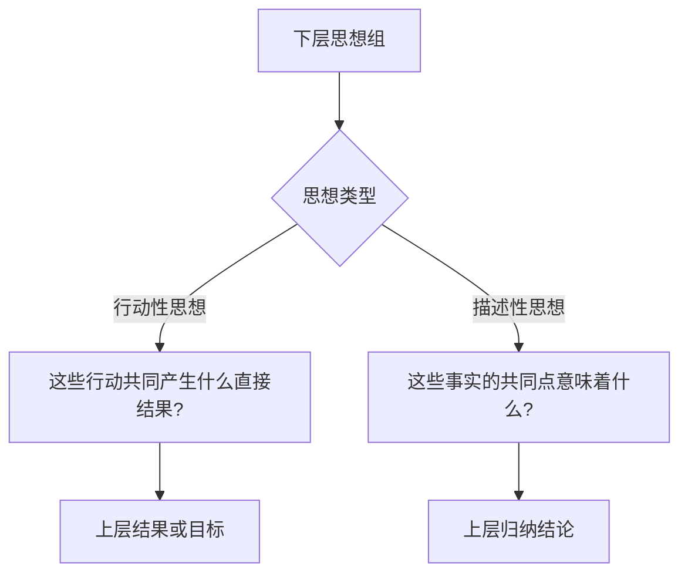
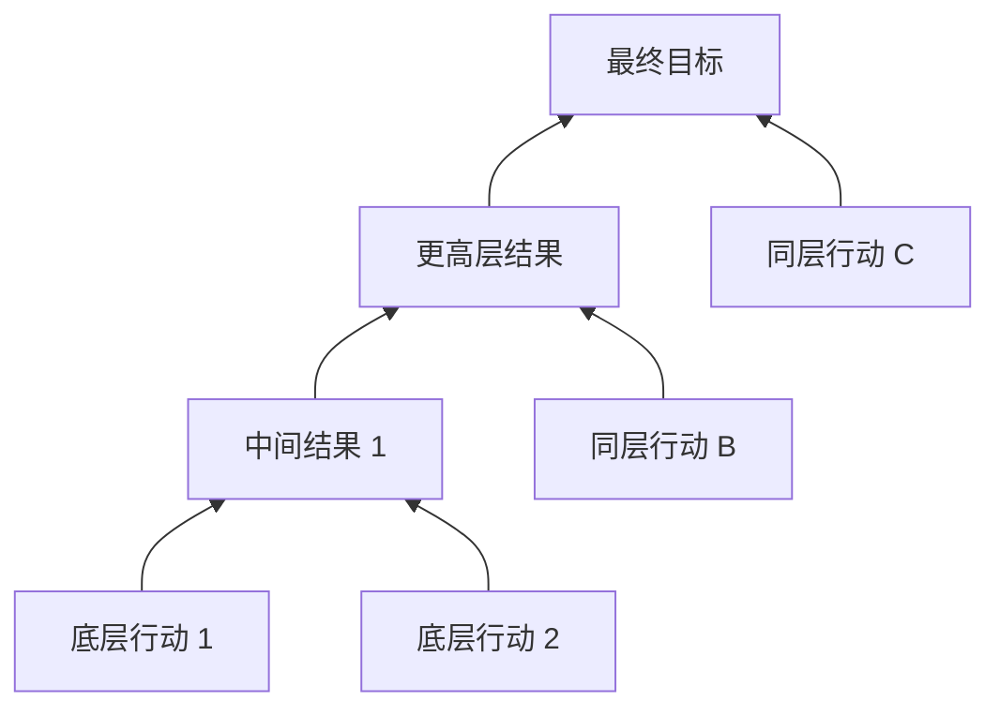
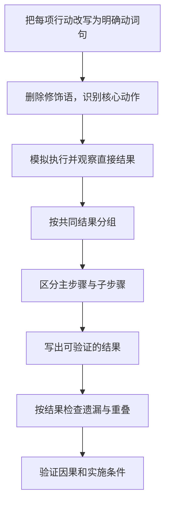
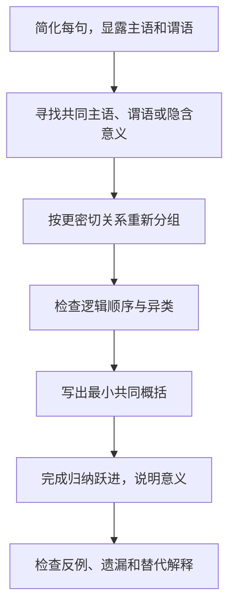

> 阅读范围：第7章“概括各组思想”，包括“总结句避免使用‘缺乏思想’的句子”“总结句要说明行动产生的结果/目标”“找出各结论之间的共性”三个小节。
>
> 原文：《金字塔原理》第7章

## 本章定位：概括是完成思考，而不是给清单贴标签

金字塔原理要求：任一上层思想都必须是对下一层思想的提炼和概括。第6章通过逻辑顺序检查“这些思想是否真的属于一组”，第7章继续追问：

> 即使分组正确，这一组思想合在一起究竟说明了什么？

回答“它们是三个问题”“这是五项建议”只说出了类别，没有说出意义。真正的概括必须完成一次向上的推理：



本章的核心区分是：

- **行动性思想**：告诉读者做什么，应概括为行动共同造成的直接结果；
- **描述性思想**：告诉读者某事是什么情况，应概括为共同点所蕴含的新判断。

---

## 第7章 概括各组思想

### 一、什么是概括

#### 要解决的问题

许多提纲只有层级外形：上层写“存在三个问题”，下层列三项；但上层没有提炼任何新认识，读者仍需自己判断三项共同意味着什么。

#### 严格定义

**概括**是从一组已经通过逻辑关系检验的下层思想中，提炼其共同结果、共同属性或共同含义，形成一个信息量更高、抽象层级更高的完整判断。

设思想组为 $G=\{g_1,g_2,\ldots,g_n\}$，上层概括为 $S$：

$$
S=\operatorname{Meaning}(G)
$$

$S$ 不能只是 $G$ 的类别名，而应说明该关系对当前问题意味着什么。

### 二、演绎组与归纳组怎样概括

#### 演绎组

演绎推理的新增信息集中在最终结论，上层应以“因此”后的结论为主体，并保留必要依据。

```text
规则 → 具体情况 → 因此结论
上层：因为具体情况满足规则，所以结论成立
```

#### 归纳组

归纳组没有单一末项结论。上层必须从全部事项的共同关系中提炼意义：

- 行动组：共同产生什么结果；
- 描述组：共同点说明什么。

### 三、为什么概括等于完成思考

分组只回答“哪些放在一起”，顺序只回答“怎样排列”，概括才回答“它们合在一起说明什么”。

完整过程是：

$$
\text{收集}\rightarrow\text{分组}\rightarrow\text{排序}
\rightarrow\text{提炼意义}
$$

若停在排序，思考仍未完成。

### 四、概括前必须满足的条件

1. 同组事项属于同一逻辑范畴；
2. 抽象层级相近；
3. 有明确时间、结构或程度顺序；
4. 在当前问题范围内尽量相互独立、完全穷尽；
5. 事实或行动表述足够明确；
6. 概括不超出下层能支持的范围。

若分组本身错误，任何上层概括都会牵强。

---

## 总结句避免使用“缺乏思想”的句子

### 一、什么是“缺乏思想”的句子

#### 定义

只说明下层思想数量或类别，却没有概括其精华和意义的上层句子，称为“缺乏思想”的句子。

典型形式：

- 该公司应确立三个目标；
- 该公司存在两个问题；
- 我们建议进行五项改革；
- 本文有四个发现。

这些句子回答“有几项、是什么类别”，没有回答“共同说明什么”。

### 二、为什么类别标签不算思想

“问题”“目标”“建议”只是集合名称。即使读者知道下面有三项，仍不知道：

- 三项共同源于什么；
- 哪个更重要；
- 共同造成什么后果；
- 作者想让读者接受什么判断。

类别标签几乎可替换到任何文章，缺少当前内容特有的信息。

### 三、约翰·韦恩传记案例

原表达：约翰·韦恩认为自己最适合写塞缪尔·约翰逊传记，有三个理由：两人都来自贫困的斯塔福德郡、都在牛津学习过、文学爱好类似。

听众先听到“有三个理由”，没有获得解释框架，于是容易把第一项当成主要观点，只针对故乡开玩笑，忽略后两项。

### 四、如何真正概括该组

更有意义的上层是：

> 约翰·韦恩认为自己最适合写约翰逊传记，因为他和约翰逊属于同一类人。

下层三项都用于说明“同类人”：共同成长背景、教育经历和文学兴趣。

这个概括仍可能过宽，但至少告诉受众应从“经历和气质相似”理解三项，而不是把它们当作三个无关理由。

### 五、概括如何帮助读者

1. 先给出理解框架；
2. 限定下层信息的共同属性；
3. 让读者预测后续材料；
4. 使回应针对整体观点，而非偶然抓住第一项；
5. 降低工作记忆和猜测成本。

### 六、“缺乏思想”为什么也伤害作者

空洞总结会掩盖：

- 下层不属于同一组；
- 分类口径不清；
- 项目有遗漏；
- 上层没有结论；
- 作者尚未理解问题本质。

只要写“有两个组织问题”，就可以停止思考；若必须说明两个问题的共同意义，就要继续追根因和共同点。

### 七、概括怎样推动思维继续发展

得到真正概括后，可沿两条路继续：

#### 演绎扩展

对概括发表评论或推导影响：

```text
概括思想 → 评述该思想 → 因此得到新结论
```

#### 归纳扩展

寻找其他同类概括：

```text
概括思想 A + 类似思想 B + 类似思想 C
→ 更高层共同结论
```

图 7-1 表明，概括不是终点，而是下一轮推理的起点。

### 八、授权不足案例

一位作者最初写：“该公司存在两个组织问题。”因为找不到二者逻辑顺序，他被迫检查根源，发现两项都属于“需要更多授权的领域”。

这一共同点又促使他搜索同类事项，最终发现四个领域，并形成上层判断：

> 该公司的主要组织问题是没有进行充分授权。

### 九、授权案例的完整推导

1. “两个组织问题”只是类别标签；
2. 两项没有直接先后，却共享“决策权集中”的根因；
3. 把根因写成概括后，分组标准明确；
4. 按该标准搜索，发现原清单遗漏另外两个领域；
5. 四项共同支持“授权不足是主要组织问题”；
6. 有了诊断，下一步可转向授权机制和责任边界。

这说明真正概括同时改善准确性、完整性和行动方向。

### 十、概括也可能过度

“授权不足”成立需要：

- 四个现象确实由授权问题解释；
- 没有更有力的共同原因，如能力不足或制度冲突；
- “主要”有相对其他问题的证据；
- 授权改善不会造成不可接受的控制风险。

概括让假设可见，但不自动证明因果。

### 十一、概括前先检查分组基础

作者要求先用第6章方法检查：

- 是有效过程吗？
- 是完整结构吗？
- 是同类事项吗？
- 时间、结构或程度顺序成立吗？
- 是否近似 MECE？

只有下层关系可靠，上层意义才有基础。

### 十二、行动性与描述性思想的分流

#### 行动性思想

常由动词开头，可冠以步骤、措施、建议、改革、目标、流程等名词。概括时问：

> 这些行动全部完成后，会直接得到什么可识别结果？

#### 描述性思想

陈述事实、原因、问题、特征或结论。概括时问：

> 这些陈述共享什么结构，它们的共同点意味着什么？

### 十三、为何不能用同一方法概括两类思想

行动之间的共同名词通常只是“措施”，真正关系是因果：共同导致某结果。描述性思想则可能没有共同结果，只能从主语、谓语或隐含意义中归纳。

图 7-3 总结：

```text
演绎组 → 概括最终结论
归纳行动组 → 概括行动结果
归纳描述组 → 概括共同点的意义
```

---

## 总结句要说明行动产生的结果/目标

### 一、为什么行动性思想最难概括

所有行动句表面都类似：

- 我们应当……
- 项目组将……
- 公司需要……

句法相似不能说明行动之间的层级。某行动可能是另一行动的子步骤，也可能是上一组行动产生的结果。

### 二、什么是行动组的“封闭体系”

作者认为，一组近似 MECE 的行动与其共同结果形成一个封闭体系：

$$
\{a_1,a_2,\ldots,a_n\}\Rightarrow R
$$

其中：

- $a_i$ 是共同实现 $R$ 的行动；
- 各行动尽量不重叠；
- 对实现 $R$ 所需动作尽量无遗漏；
- $R$ 是直接、可辨认的结果。

### 三、“肯定产生结果”的成立条件

现实行动不能仅靠结构保证结果。还需：

- 行动执行质量符合要求；
- 外部条件稳定；
- 因果假设成立；
- 必要资源可用；
- 没有抵消作用。

因此更严谨地说，完整行动组应当在明确条件下足以产生或显著促成结果。

### 四、多层行动体系

图 7-4 表示，一项中间结果可在更高层成为行动或条件：



每层都应分别回答“这一组共同产生什么直接结果”。

### 五、行动与结果为何互相依赖

要判断行动是否完整，必须知道目标；要准确描述目标，又需理解行动实际能产生什么。

这是一个迭代过程：


### 六、概括行动组的三项技巧

1. 先用明确语句描述各行动；
2. 找出明显因果组合，每个直接组尽量控制在五项以内；
3. 从行动直接总结结果或目标。

“五项以内”是认知和层级检查的经验规则，不是逻辑上限。

### 七、总结句必须明确到可判断

“提高利润”可能是提高 2% 或 10%，所需行动完全不同。更有用的目标是：

> 在明年 1 月 15 日前将利润率提高 10 个百分点。

明确目标至少包括：

- 结果对象；
- 变化方向；
- 目标值或可观察状态；
- 截止时间；
- 必要口径和范围。

并非所有目标都可数值化，但必须有可识别完成状态。

### 八、SMART 与本章方法的关系

可用 SMART 作为补充：具体、可衡量、可实现、相关、有时限。但本章更强调**因果对应**：行动组是否真的足以产生所写结果。一个目标即使 SMART，也可能与下层行动无关。

### 九、“培养全球意识”为何没有操作意义

句子“培养一种全球意识，使每个人认识自己是世界社会的一员”无法回答：

- 什么行为算有全球意识；
- 完成后能观察到什么；
- 谁在何时达到；
- 哪些行动能够实现。

图 7-5 的“如何做到”下方无法填入明确步骤，说明上层目标不可操作。

更明确的版本取决于真实意图，例如：

> 在六个月内使所有区域经理能在投资评审中使用统一的跨国市场、法规和文化风险清单。

### 十、情感价值与操作价值

“全球意识”可能具有鼓舞作用，但口号不能替代执行目标。愿景可保留在更高层，下一层还需定义行为和成功标准。

### 十一、“健康辩论”五项措施案例

原文要求处理个人态度、建立关系、培养谈话技巧、安排谈话、求同存异，却未说明完成后得到什么可观察结果。

由于目标不明确，无法判断：

- 五项是否完整；
- 是否存在重复；
- 哪项是子步骤；
- 是否真的能防止冲突升级。

应先定义结果，例如：

> 特别工作组应建立一套会议规则，使成员能针对事实表达分歧、记录争议并在不进行人身攻击的情况下形成决定。

然后再检查措施。

### 十二、模糊行动如何改成明确结果

表 7-1 的改写包括：

| 模糊表达 | 更明确含义 |
| --- | --- |
| 加强地区作用 | 赋予各地区制定计划的权力 |
| 减少应收账款 | 建立应收账款追收机制 |
| 评估管理流程 | 研究管理流程是否需要调整 |
| 改进财务报告 | 建立能够预测变化的系统 |
| 处理战略问题 | 制定明确的长期战略 |
| 重新配置人力资源 | 根据员工能力安排合适岗位 |

### 十三、明确措辞为什么产生图像

“赋予地区制定计划的权力”让人想象：地区负责人拥有预算、提交年度计划、总部审核。图像会触发下一轮问题：

- 如何判断地区计划正确？
- 总部怎样审核？
- 是否需要计划评估小组？

“加强地区作用”则无法形成具体场景，也无法推动思考。

### 十四、逾期应收账款案例

原行动包括统计逾期、发催款通知、追收、董事处理和使用收账公司。上层写“统计和追收逾期账款”，仍不明确。

作者随后按金额与逾期月份建立矩阵，并形成升级规则：

1. 逾期一个月：财务部门正常寄账单；
2. 两个月：财务寄催款通知；
3. 三个月：销售人员上门催收；
4. 四个月：公司董事催收；
5. 超过四个月：交收账公司。

### 十五、为什么“减少应收账款”仍不准确

上述步骤只建立催收动作，并不能保证客户付款。直接结果应是：

> 建立一套按逾期严重程度自动升级责任人的应收账款追收机制。

“减少应收账款”是更远期收益，受客户偿付能力、争议和执行质量影响。

### 十六、从直接结果继续检查遗漏

一旦上层改为“建立追收机制”，就可问机制是否完整：

- 谁监控逾期？
- 如何按金额与时间分级？
- 谁负责每级行动？
- 怎样记录结果？
- 何时停止供货？
- 何时核销或诉讼？

原书提示可能还需“长期不付款客户停止供货”等后续步骤。

### 十七、为什么疑问句不能代替明确目标

战略联盟案例列出五个问题：股东看法、市场反应、管理层态度、受威胁群体和其他利益相关者反应。

把行动改成问句只产生五类互不相连的信息，没有说明最终要形成什么产物。

### 十八、战略联盟案例的有效任务结构

若目标是制定让利益相关者支持联盟的计划，可组织为：

1. 列出可能受联盟影响的利益相关者；
2. 预测各方反应及利益、威胁；
3. 决定让各方为联盟成功努力的沟通和参与方法。

图 7-4 的表格以三列表示这条过程：利益相关者、市场或个体反应、争取支持的方法。

### 十九、为什么三步比五问更有效

- 三步共享一个明确结果；
- 每一步输出成为下一步输入；
- 可由一名资源有限的同事执行；
- 可以检查利益相关者是否穷尽；
- 最终产物是行动计划，而非信息堆积。

### 二十、区分行动步骤的层次

判断两项行动层级：

- 若先做 A，再做 B，且两者共同服务同一结果，通常同层；
- 若做 A 是为了产生 B，A 是 B 的下层原因或子步骤。

形式化地：

$$
A\rightarrow B\rightarrow R
$$

若 B 本身是 A 的结果，就不应与 A 平行。

### 二十一、电信系统十项行动案例

原清单把目标制定、现状分析、技术选择、组织管理、成本控制等十项放在一起。重组后：

```text
1. 制定电信服务目标
   - 分析现有设备与使用
   - 确定需要支持的主要业务
   - 检查现有通信联系

2. 成立项目组并选择适当设备
   - 确定技术选项
   - 研究设备服务政策
   - 检查供应商关系

3. 建立公司管理框架
   - 任命电信中心经理
   - 建立成本控制系统
```

### 二十二、电信案例如何发现遗漏

结构恢复后出现空位：原清单没有“任命电信中心经理”，却要“决定组织方式”和控制成本。新上层结果促使作者补出责任主体。

还可继续问：

- 谁批准目标？
- 设备选择标准是什么？
- 管理框架是否含安全和服务级别？

### 二十三、为什么不应过度分类行动

咨询项目常把动作分成“任务、目标、利益”。图 7-6 把三类放在同层，仿佛是三个并列组成；图 7-7 则显示它们其实是纵向因果层：

```text
任务完成 → 实现目标 → 获得利益
```

但仅按这三个名词分类仍没有揭示哪些任务共同产生哪个目标。

### 二十四、任务、目标、利益没有固定本质区别

同一事项在不同层可扮演不同角色：

- 对下层行动而言，它是结果；
- 对更高层收益而言，它又是手段。

所以行动不应按抽象标签分类，而应按共同产生的具体结果分组。

### 二十五、战略规划培训案例

咨询公司原把六项任务、五个目标和三个利益分列，造成重复。砍掉修饰语后，核心动作包括培训、传授知识、提供建议、调整机制、编写手册、为下周期准备等。

按结果重组为：

> 迅速使贵公司掌握战略规划知识。

1. 培训两个产品小组，使其掌握规划方法；
2. 根据公司现有规划机制调整教学内容；
3. 在下一规划周期与员工共同应用所学概念。

### 二十六、为什么新结构更好

- 三项都直接促成“掌握并应用知识”；
- 重复行动被合并；
- 任务、目标、利益回到因果层级；
- 每个分支可继续展开；
- 读者能理解项目怎样产生能力，而非只看到分类表。

### 二十七、直接概括行动结果的两条硬检查

1. 行动组在当前结果范围内近似相互独立、完全穷尽；
2. 上层说明行动完成后的直接结果，措辞明确具体。

这两条提高概括质量，但不能保证结果真实可达，还需事实和因果验证。

### 二十八、股票销售案例

下层动作：按地区和客户潜力排序、确定地区市场份额目标、调整销售力量。

原上层“提高伦敦市场股票销售量”过于宽泛，因为多卖一份也算提高。

直接结果更准确：

> 将销售资源集中到高潜力客户和地区。

该结果是三项动作共同直接造成的；销量提高是后续可能收益。

### 二十九、蓝领培训案例

原动作针对三个主体：企业决策层、培训者、劳动者。动作分别是表明重要性、提供课程框架和自下而上施压。

共同点：都是推动培训体制参与者支持培训的激励或推动因素。

概括：

> 为改善蓝领培训，需要提供推动因素，促使培训体制中的各参与主体支持培训。

### 三十、产品开发六问案例

原问题经简化：

- 开发适当产品；
- 合理分配资源；
- 高效完成；
- 及时完成；
- 有效营销；
- 研发与管理合作。

### 三十一、产品开发的分组

```text
1. 确定满足市场需求的产品
   - 包含所需功能
   - 满足营销人员需要

2. 尽量在最短时间完成开发
   - 合理分配资源
   - 使研发符合投产时间
   - 加强研发与管理合作

3. 以最有效方式推向市场
```

### 三十二、产品开发的上层概括

考虑“先上市可获得市场先机、产品迭代加快”的背景，上层为：

> 产品开发的主要问题，是公司能否比竞争者更有效地响应市场需求。

三个关键疑问：

1. 能否发现市场需要的产品？
2. 能否减少上市前不必要的延误？
3. 能否有效营销并最大化销量？

### 三十三、产品开发概括依赖的假设

- 上市速度确实影响竞争优势；
- 市场需求可以识别；
- 三类能力覆盖主要开发问题；
- 质量、合规和长期维护未被遗漏；
- “最大销量”符合公司战略，而非利润或客户价值优先。

若这些假设不同，上层概括也需调整。

### 三十四、行动性思想的完整操作流程



---

## 找出各结论之间的共性

### 一、什么是描述性思想

描述性思想告诉读者某事的情况，常被冠以原因、问题、特征、发现或结论。它们不直接要求行动，而是陈述事实或判断。

概括描述性思想不能问“做完后得到什么”，而要问：

> 这些陈述在结构上共享什么，它们的共同点意味着什么新判断？

### 二、描述性概括的三步

1. 找出思想之间结构上的共性；
2. 寻找更密切、更有解释力的联系；
3. 完成归纳跃进，写出主题思想。

### 三、第一步：找出结构上的共性

完整语句由主语和谓语组成。共性可能来自：

- 同一类主语；
- 同一类谓语、动作或对象；
- 主谓都不同，但隐含意义同类。

“同一类”指可用同一个有意义名词表示，不要求文字完全相同。

### 四、主语相同时看谓语

例如都以“现有信息系统”为主语：

- 不能提供及时数据；
- 不能提供可靠数据；
- 不能提供适当格式。

谓语共同说明：系统提供的信息不支持计划或决策。

### 五、谓语相同时看主语

例如：

- 销售部门缺乏项目经验；
- 技术部门缺乏项目经验；
- 供应商团队缺乏项目经验。

共同谓语指向：项目参与方整体缺乏相关经验。

### 六、主谓不同则看隐含意义

例如“审批晚”“数据错”“格式难找”表面不同，却都可能说明信息系统无法及时支持行动。需要从使用目的而非字面词汇中找共性。

### 七、第二步：寻找更密切联系

宽泛共性常无信息量：几项都“与系统有关”。应继续问：

- 它们是否共同造成同一结果？
- 是否表现同一根因？
- 是否属于同一过程的不同失败方式？
- 是否共同违反一个标准？

越贴近当前问题、越能排除无关事项的共同点，解释力越强。

### 八、第三步：什么是归纳跃进

**归纳跃进**是从若干具体描述的共同结构，推到一个比单纯类别名更有信息量的上层判断。

$$
g_1,g_2,\ldots,g_n\Rightarrow S
$$

由于归纳结论通常不具有演绎必然性，必须检查：

- 是否存在反例；
- 样本是否充分；
- 是否有替代解释；
- 结论是否超出下层范围；
- 语气是否匹配证据强度。

### 九、计划与控制体系案例

原文把系统问题再次分类后，需要追问：为何只有这两类？共同点可能是：

> 当前计划体系产生的信息对计划目的没有帮助。

下层可概括为：

- 所需信息不存在；
- 所需信息存在，但不充分。

### 十、用概括反查遗漏

一旦上层是“信息不支持计划”，结构框架会提示第三种可能：

- 信息存在且充分，但格式不适合使用。

还可能包括不及时、不可靠等维度。真正概括让缺失类别变得可见。

### 十一、信息系统项目经理八项发现

原清单包含到期日期要求、经验不足、错过日期、工具不统一、没做过大型项目、培训少和项目风险等。

简化核心后可归组：

> 项目经理可能无法按预定日期完成重要系统。

原因：

1. 在此类项目上的经验有限；
2. 从未安装过如此大型、复杂的系统；
3. 缺乏使用所需方法、工具和技术的能力。

### 十二、重组推导

1. “错过日期”“担心误期”共同指向交付风险；
2. “经验不足”“培训少”合并为经验能力；
3. “没做过大型项目”是项目规模经验；
4. “工具不统一”“没有适用工具”是方法工具能力；
5. 上层把症状和原因组织成可审查判断。

### 十三、概括如何减少枯燥

原清单要求读者自己压缩八项。重组后，读者先知道结论，再看三个原因。阅读负担从“发现关系”变成“检验关系”。

### 十四、汽车配件市场案例

原五项结论混合：市场巨大且增长、盈利、进入障碍、不确定性、总体吸引但分散。

可拆为：

#### 有利因素

- 市场巨大；
- 增长较快；
- 有利可图；
- 总体趋势可喜；
- 有吸引力。

#### 不利因素

- 进入障碍大；
- 部分细分市场前景不确定；
- 市场高度分散。

### 十五、借助图像寻找共性

图 7-10 把市场想成圆：

- 圆整体有吸引力；
- 分散意味着圆被切成多个细分；
- 不确定性使部分细分不同；
- 进入障碍像圆前的一道墙。

图像帮助得到两个中间结论：

1. 只有部分细分市场具有吸引力；
2. 这些细分市场难以进入。

### 十六、为何汽车配件案例仍未完成

“有吸引力”和“难以进入”没有共同类别，不构成归纳组。若存在关系，只能进一步演绎：

```text
只有部分市场有吸引力
这些市场又难以进入
因此，……
```

可能结论包括：不进入、付出高成本进入、选择性进入、先制定谨慎战略。缺少目标、能力、收益和风险信息，无法唯一推出。

### 十七、正确处理未完成结论

不要用“总体上机会与风险并存”掩盖未决问题。应明确：

- 当前证据只支持哪些中间结论；
- 还需哪些信息才能决策；
- 候选答案有哪些；
- 哪些评价标准决定最终结论。

例如：

> 应先按增长、利润和进入成本筛选细分市场，再决定是否进入；现有信息不足以支持全面进入。

### 十八、描述性思想可能实际是行动性思想

“资源分配有四个变量”看似描述变量，改写后却是管理过程：

- 说明活动顺序和时机；
- 确定决策问题；
- 配置参与人员；
- 确定所需信息。

共同结果：

> 使适当人员及时、充分地参与资源分配工作。

识别标准是：这些“变量”是否可以被写成行动，并共同产生结果。

### 十九、描述性思想也可按时间排列

思想类型与排序类型不同。描述性判断若来自流程各阶段，也可按时间排列；关键是上层仍概括其共同意义。

### 二十、销售方案七项发现

原清单涉及机会分析、质量流程、信息复用、经验分享、成本效率、反应时间和客户需求，经过归组形成三项：

1. 没有提供有说服力的信息；
2. 没有使方案看上去优秀；
3. 制定方案过程过长。

上层：

> 现有销售方案不是有效的销售工具。

### 二十一、销售方案的正向改写

如果目标是改进，可写：

> 做到以下三点，销售方案就能向客户展现新的专业形象：

1. 提供更有说服力的信息；
2. 使方案呈现更优秀；
3. 快速完成方案。

严格说，“新形象”仍需定义，且三项是否足以提高销售需要客户数据验证。

### 二十二、是否每一组都要追求极精确措辞

作者允许在推理已确认有效时使用略宽松概括，因为读者会结合知识补足。但不能用宽松语言掩盖作者自己尚未想清楚。

判断标准：

- 省略后是否仍只有一种合理理解；
- 风险是否低；
- 读者是否熟悉背景；
- 概括是否仍能指导下层；
- 是否会影响行动和责任。

高风险、跨团队和指标场景应使用精确语言。

### 二十三、描述性思想的完整操作流程



---

## 两类思想概括的统一框架

### 一、共同起点

无论行动性还是描述性，都要先问：

> 为什么只列这些，而不列其他？

答案只有两类：

1. 它们共享某种有意义共性，且在当前范围内是完整的一组；
2. 它们是共同实现某个结果所需的行动。

### 二、不同终点

| 思想组 | 上层概括 |
| --- | --- |
| 行动组 | 完成行动后产生的直接结果 |
| 描述组 | 共同点所蕴含的意义 |
| 演绎组 | 推理最后一步的结论 |

### 三、最小充分概括

概括应尽量满足：

- **覆盖**：解释每个下层；
- **专属性**：不是任意事项都能纳入；
- **信息性**：提出新判断，而非标签；
- **适度**：不超越证据；
- **可继续性**：能引发下一层合理疑问或行动。

---

## 作者分析问题的完整思路

### 一、问题从哪里来

人们容易分类和列点，却不愿进行从清单到意义的最后一次抽象。于是文章有框架外形，却没有思想主线。

### 二、真正难点是什么

- 下层可能并非真正同组；
- 行动句外观相似，层级难辨；
- 目标与行动相互依赖；
- 模糊动词无法形成完成状态；
- 类别标签掩盖重复和遗漏；
- 描述性共性可能过宽；
- 归纳跃进可能超越证据；
- 未完成推理容易被空话遮盖。

### 三、为什么先消灭“缺乏思想”的句子

空洞总结是停止思考的许可。强迫写出意义，会暴露分组错误、缺口和真正根因。

### 四、为什么行动必须从结果概括

行动被放在一起的唯一实质理由，是它们共同产生某结果。没有结果，就无法判断行动是否充分、重复或缺失。

### 五、为什么强调直接结果

行动通常只能直接控制中间产物，最终收益还受外部变量影响。把“建立催收机制”写成“减少应收账款”，会夸大因果确定性。

### 六、为什么明确措辞能推动创造性思考

可观察结果形成具体图像，图像会暴露责任、输入、审核和后续动作；模糊口号无法产生这些问题。

### 七、为什么描述组从句法结构入手

主语和谓语是最小结构线索。先找形式共性，再寻找更深意义，可避免完全依靠直觉。

### 八、为什么要完成归纳跃进

“它们都是问题”只有分类价值；“它们共同说明项目经理无法按期交付”才产生可用于决策的新思想。

### 九、为什么用图像作跳板

汽车配件市场的圆、细分和障碍把抽象关系空间化，帮助发现两个中间结论及其逻辑缺口。图像辅助思考，但不能替代最终推理。

### 十、方法为什么有效

它给概括设置了可操作问题：

- 行动完成后能看到什么？
- 哪项是原因，哪项是结果？
- 句子主语或谓语有什么共同点？
- 共同点意味着什么？
- 概括是否让遗漏显现？
- 是否存在反例和未完成推理？

### 十一、方法的局限

1. MECE 不能保证因果充分；
2. 直接结果也可能受外部条件影响；
3. 某些软性目标难以量化但仍有价值；
4. 共同句法可能只是表面相似；
5. 归纳跃进不可避免带有判断；
6. 一个思想组可能支持多个合理概括；
7. 过度追求精确会使低风险沟通僵硬；
8. 复杂系统的结果往往不是单向因果。

### 十二、补充工具

- **结果链/逻辑模型**：区分投入、活动、产出、结果和影响；
- **SMART/OKR**：明确目标与衡量方式；
- **责任矩阵**：明确行动主体；
- **亲和图**：寻找描述性共性；
- **因果图**：检查行动与结果的机制；
- **证据矩阵**：追踪概括由哪些事实支持；
- **反例检验**：控制归纳跃进范围；
- **用户故事与验收标准**：把模糊目标转为可观察行为。

---

## 易混淆概念辨析

### 类别标签与概括思想

- 类别标签：“三个问题”；
- 概括思想：“授权不足导致四个组织领域失效”。

前者告诉数量，后者告诉意义。

### 上层抽象与空泛

抽象保留共同本质，空泛则删除到无法指导理解。“有关若干方面”不是有效抽象。

### 行动与结果

“建立催收机制”是可控制的直接结果；“减少应收账款”是更远期业务结果。

### 直接结果与最终收益

培训直接产生知识和能力，收益可能是更好的战略。能力不保证战略一定正确。

### 目标与愿景

愿景可提供方向，如“全球意识”；执行目标必须定义可观察行为和完成条件。

### 任务、目标与利益

它们往往是纵向因果层，不是三种互斥行动类别。同一事项相对不同层级可同时是结果和手段。

### 问句与行动计划

问题清单只定义要调查的信息，行动计划还需说明顺序、产物和最终用途。

### 描述性思想与行动性思想

“四个管理变量”若可改写为四步并共同产生结果，本质上是行动性思想。

### 共同点与共同点的意义

“都与系统有关”是共同点；“系统信息无法支持计划”是共同点的意义。

### 归纳跃进与无根据跳跃

归纳跃进基于明确共同结构，并接受反例和范围检查；无根据跳跃加入下层没有支持的动机、因果或普遍性。

### 结果完整与事实正确

行动组看似完整，只表示结构上覆盖候选机制；是否真实有效仍需执行数据和因果证据。

---

## 综合示例：重构“提升客户成功能力”的计划

### 一、原始清单

> 为提升客户成功能力，我们将：

- 加强客户意识；
- 改善跨部门协作；
- 建立数据看板；
- 定期复盘客户问题；
- 优化续费流程；
- 培养顾问式沟通；
- 关注重点客户。

上层和下层都模糊，无法判断完成状态。

### 二、明确每项行动

- 为产品、销售和客服建立统一客户健康指标；
- 指定跨部门客户问题负责人和升级时限；
- 建立按周更新的客户健康看板；
- 每月复盘流失、降级和高风险客户；
- 在续费前 120 天启动风险检查；
- 训练客户经理进行价值回顾和行动建议；
- 根据收入、风险和增长潜力划分客户服务等级。

### 三、按直接结果分组

#### 建立可预警的客户风险识别机制

- 定义统一健康指标；
- 建立每周看板；
- 每月复盘高风险和流失案例。

#### 建立有责任和时限的风险处置机制

- 指定跨部门负责人；
- 定义升级时限；
- 续费前 120 天启动检查。

#### 建立分层、顾问式客户经营方式

- 划分客户服务等级；
- 训练价值回顾和行动建议能力。

### 四、形成上层结果

> 在续费风险形成重大损失前，识别风险、明确责任并实施分层干预。

这比“提升客户成功能力”更可观察，也更贴近下层行动的直接结果。

### 五、进一步定义衡量标准

- 高风险客户识别提前量不少于 120 天；
- 风险事件 24 小时内有负责人；
- 每月高风险客户复盘覆盖率 100%；
- 干预行动按期完成率达到 90%。

续费率提升是更远期收益，不能仅凭机制建立保证。

### 六、描述性发现的概括

若数据发现：风险识别晚、跨部门无人负责、所有客户同一服务方式，可概括为：

> 现有客户成功体系缺少早期预警、责任闭环和服务分层，因此不能在续费前有效控制风险。

这从三个事实完成了共同意义的归纳，同时保留需验证的因果假设。

---

## 常见误解与错误做法

### 误解一：总结就是把下层再说一遍

重复压缩没有产生意义。总结必须提炼结果或共同点的含义。

### 误解二：写出“有三个原因”已经结论先行

它只预告清单，不提供结论，仍让读者猜三项共同说明什么。

### 误解三：上层越抽象越好

过度抽象会失去专属性。概括应恰好覆盖本组，不是覆盖所有可能事项。

### 误解四：行动都用动词开头就属于同一组

行动还需共同产生同一直接结果，并处在相近层级。

### 误解五：结果必须全部量化

不可量化不等于不可判断。至少要定义可观察状态、行为或里程碑。

### 误解六：直接结果等于最终商业收益

资源集中不等于销量必升，催收机制不等于账款必降。应区分可控产出和远期影响。

### 误解七：任务、目标、利益是合理的横向分类

它们通常属于纵向因果层，横向并列会重复。

### 误解八：列问题比定目标更客观

问题清单可能产生互不相关信息。目标和产物不明确，调查也会失焦。

### 误解九：能找到共同名词就完成描述性概括

“都是问题”只完成分类，还要说明这些问题共同意味着什么。

### 误解十：图像能自动给出结论

图像只提供跳板。汽车配件市场仍需补齐“因此”后的决策结论。

### 误解十一：概括清楚就证明因果成立

概括让因果主张可审查，仍需事实、机制和反事实验证。

### 误解十二：每处都必须使用极精确语言

低风险、熟悉语境可适度简化，但作者本人必须先完成精确思考。

---

## 第七章实践检查清单

### 检查上层总结

1. 上层是完整判断还是类别标签？
2. 是否只写了数量和类型？
3. 它是否揭示了下层关系的精华？
4. 删除下层后，读者能否知道作者的核心判断？
5. 概括是否超出下层证据？

### 检查分组基础

6. 下层是演绎组、行动归纳组还是描述归纳组？
7. 各项是否同类、同层？
8. 时间、结构或程度顺序是什么？
9. 当前范围内是否近似 MECE？
10. 是否有异类、重复和遗漏？

### 概括行动性思想

11. 每项行动能否形成具体图像？
12. 行动主体、对象和完成状态明确吗？
13. 所有行动共同产生什么直接结果？
14. 该结果是可控产出还是远期收益？
15. 结果能否被观察、衡量或验收？
16. 是否有明确范围、时间和口径？
17. 哪些行动是主步骤，哪些是子步骤？
18. 某一步是否其实是另一组行动的结果？
19. 按结果检查后，是否发现缺失动作？
20. 结果成立依赖哪些外部条件？

### 概括描述性思想

21. 句子的主语有哪些共同点？
22. 谓语、动作或对象有哪些共同点？
23. 若主谓都不同，隐含意义是什么？
24. 共同点是否与当前问题相关？
25. 是否能找到更密切、更有解释力的联系？
26. 最小共同概括是什么？
27. 共同点进一步意味着什么？
28. 是否存在反例或替代概括？
29. 是否应使用“可能、支持、表明”等限定语？

### 防止空洞和跳跃

30. 是否用“若干问题、几个方面、三项建议”停止思考？
31. 是否把模糊愿景当作执行目标？
32. 是否用问句绕过定义产物和结果？
33. 是否把任务、目标、利益错误横向并列？
34. 是否把新闻事实当成已完成的思想？
35. 汽车配件式推理是否停在“有利但困难”而没有结论？

### 最终验证

36. 概括能否帮助发现新思想或遗漏？
37. 读者会因上层产生正确的下一步疑问吗？
38. 标题是否表达这条概括，而非只写类别？
39. 事实和因果是否经独立验证？
40. 精确程度是否与风险和受众需要匹配？

---

## 本章小结

第7章把“以上统下”从形式要求落实为两种具体的思考动作：

1. 概括不是给清单命名，而是提炼下层关系的结果或意义。
2. “三个问题、五项改革”等句子只说明数量和类别，是缺乏思想的句子。
3. 空洞总结既让读者抓不到重点，也掩盖作者分组错误、遗漏和未完成思考。
4. 韦恩传记案例说明，“属于同一类人”比“有三个理由”更能统摄共同经历。
5. 授权案例说明，强迫概括可从两个表面问题发现共同根因，并进一步找出四个完整领域。
6. 演绎组概括最终结论；行动归纳组概括共同结果；描述归纳组概括共同点的意义。
7. 行动组与其直接结果形成多层因果体系，中间结果相对下层是结果，相对上层又是手段。
8. 行动结果必须明确到可观察、衡量或验收，否则无法判断步骤是否充分。
9. “培养全球意识”“加强地区作用”等模糊语言不能产生清楚图像，也无法指导下一步思考。
10. 逾期账款案例说明，行动直接建立的是分级追收机制，而不是保证减少应收账款。
11. 战略联盟五问会产生五类散乱信息，改为利益相关者—反应—争取支持方法后才形成行动过程。
12. 行动层级由因果关系决定：先后执行的同层，为产生后项而执行的前项属于下一层。
13. 电信系统案例把十项动作重组为制定目标、选择设备、建立管理框架，并暴露经理岗位遗漏。
14. 任务、目标、利益不是横向类别，而是纵向因果层；应按共同结果组织行动。
15. 战略规划培训案例砍掉修饰和重复后，形成培训、调整内容、共同应用三个能力建设分支。
16. 股票销售案例的直接结果是把资源集中到高潜力客户，销量增长是更远期收益。
17. 产品开发案例通过简化、分组和背景知识，概括为能否比竞争者更有效响应市场需求。
18. 描述性概括先寻找共同主语、谓语或隐含意义，再寻找更密切联系并完成归纳跃进。
19. 信息系统项目案例把八项发现归结为项目经理可能无法按期交付，以及经验、规模和工具三类原因。
20. 汽车配件市场案例只能推出“部分细分有吸引力且难进入”，若无法补出“因此”，就不应假装决策已完成。
21. 描述性的“资源分配变量”可改写为行动步骤，说明思想类型要由真实逻辑而非表面名词判断。
22. 销售方案案例把七项材料概括为信息不够有说服力、呈现不够优秀、过程过长三类问题。
23. 每次分组都应问“为什么只列这些”：要么它们共享有意义共性，要么它们共同产生明确结果。
24. 清晰概括提高可理解性，也让事实假设、因果缺口和遗漏更容易被检查，但不能自动保证结论正确。

本章最核心的实践原则是：**面对任何一组思想，不要满足于说它们是“几个问题”或“几项措施”；若是行动，就写清共同产生的直接结果，若是描述，就写清共同点蕴含的新判断，直到上层句子真正比下层清单多提供了一层意义。**
