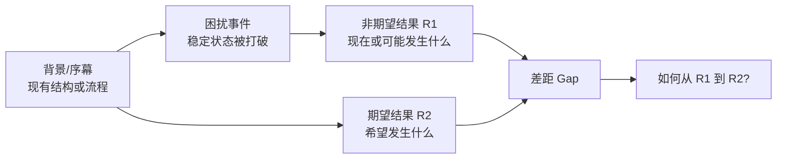
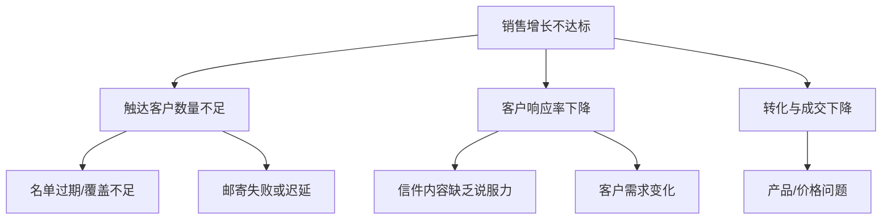
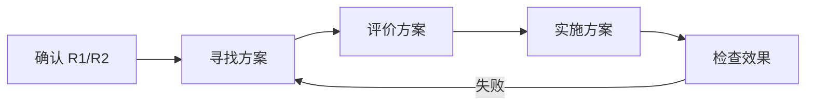
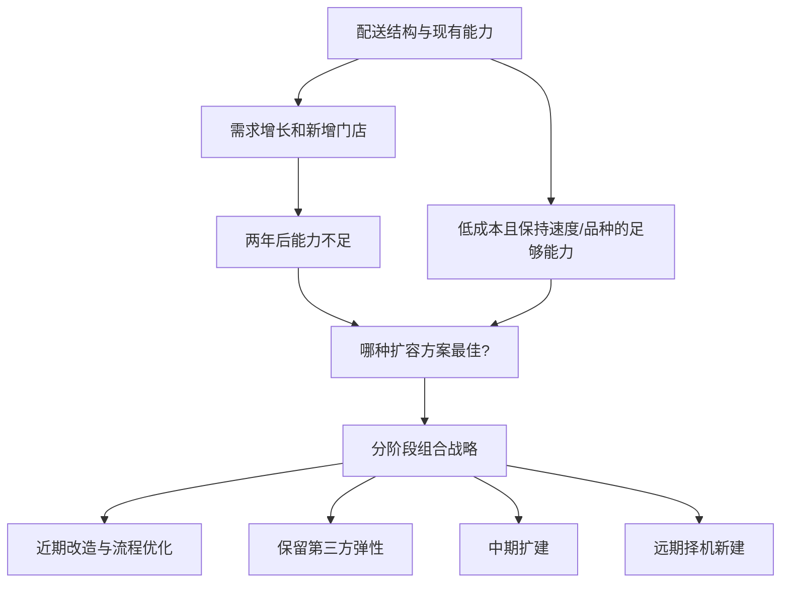

> 阅读范围：第8章“界定问题”，包括“界定问题的框架”“展开问题的各要素”“发掘读者的疑问”“开始写序言”“实战案例”五个小节。
>
> 原文：《金字塔原理》第8章

## 本章定位：在分析和写作之前，先确认究竟要解决什么

许多报告写不清，不是因为作者不会组织答案，而是因为一开始就回答了错误的问题。第8章把“问题”从一个含糊名词改写成一个可分析的差距：

> 在特定背景下，现状或将要出现的结果 $R1$ 与读者希望得到的结果 $R2$ 不一致。



问题界定的价值有两方面：

1. **分析价值**：限定原因搜索和解决方案设计的范围；
2. **表达价值**：直接提供序言中的背景、冲突和疑问。

---

## 第8章 界定问题

### 一、什么是问题

#### 要解决的问题

人们常把现象、原因、抱怨和方案都叫“问题”：销售下降是问题、名单过期是问题、要更新名单也是问题。若不区分逻辑位置，分析会跳过关键步骤。

#### 严格定义

在本章框架中，**问题**是特定背景下非期望结果 $R1$ 与期望结果 $R2$ 之间的差距：

$$
\text{Problem}=R2-R1
$$

这个减法表示状态差距，不一定是数值运算。

- $R1$：已经出现、正在出现或可能出现的不满意状态；
- $R2$：希望达到的具体状态；
- 解决方案：把系统从 $R1$ 推向 $R2$ 的干预。

### 二、R1 不等于根因

“销售增长率从预期 10% 变成 -10%”是 R1；潜在客户名单过期可能是根因。把 R1 当根因，会直接提出“提高销售”这类空泛方案。

### 三、R2 不等于解决方案

“恢复 10% 年增长”是 R2；扩充名单、重写推销信、改善邮寄是候选方案。目标说明去哪里，方案说明怎样去。

### 四、机会也可以用差距表示

若当前状态没有恶化，但外部变化提供更优结果：

- $R1$：维持现有业务结果；
- $R2$：抓住新技术或市场机会后的更优状态；
- 差距：未实现的潜在价值。

因此，问题框架也适用于机会，但不能把任何愿望都包装成问题。机会应有可信证据、战略相关性和可行窗口。

### 五、连续分析的五个问题

作者把解决问题过程写成逻辑序列：

1. 是否存在或可能存在问题/机会？
2. 问题在哪里？
3. 为什么存在？
4. 我们能做什么？
5. 我们应该做什么？

对应三个阶段：

| 阶段 | 核心问题 | 产出 |
| --- | --- | --- |
| 界定问题 | 1、2 | 清楚的 R1、R2 与范围 |
| 结构化分析原因 | 3 | 根因假设与证据 |
| 寻找解决方案 | 4、5 | 备选方案与推荐方案 |

### 六、为什么必须按顺序分析

若跳过前一步：

- 未确认问题就找原因，会诊断不存在的现象；
- 未定位问题就收集资料，会范围失控；
- 未找根因就提方案，容易只处理症状；
- 未生成备选方案就推荐，无法说明为何最好。

现实中过程会迭代，但每次修正仍要保持这些逻辑依赖。

### 七、连续分析与“序列分析”的边界

原书称其为连续分析，并提到统计学中的序列分析。这里主要是管理问题的阶段化框架，不应与严格统计学中按数据逐步更新停止规则的 sequential analysis 完全等同。

### 八、分析结果如何映射到文章

- 问题 1、2 的答案通常进入序言：背景、变化、R1、R2；
- 问题 3 至 5 的答案进入正文金字塔：原因、方案、建议。

这使问题解决过程与文章结构连接起来。

---

## 界定问题的框架

### 一、问题为什么来自背景

$R1$ 和 $R2$ 不是凭空出现。它们属于某个结构或流程：

- 哪个组织、市场、系统或地点？
- 原本怎样运行？
- 什么变化打破了正常状态？
- 变化影响了哪个结果？

同样的 R1 在不同背景中可能有不同意义。例如销量下降可能是市场衰退，也可能是主动退出低利润客户。

### 二、框架的三个基本问题

1. 发生了什么？背景及困扰是什么？
2. 我们不喜欢什么？$R1$ 是什么？
3. 我们想要什么？$R2$ 是什么？

这三问完成“问题是什么”，还没有完成“为什么”和“怎么解决”。

### 三、工业不动产销售案例的背景

一家公司三十年来采用稳定直邮流程：

```text
列出潜在客户名单 → 写推销信 → 邮寄
```

该流程过去支持每年约 10% 的销售增长。

### 四、困扰、R1 与 R2

- **困扰**：第四季度预测显示销售将下降 10%；
- **R1**：增长低于预期，甚至转为下降；
- **R2**：继续保持约 10% 年增长；
- **问题**：怎样恢复持续增长？

### 五、为什么从现有流程找原因

若流程一直负责产生销售结果，而结果突然偏离，原因可能存在于流程输入或执行：

- 名单过期或覆盖不足；
- 推销信缺乏说服力；
- 邮寄迟缓或低效。

图 8-2 还提示候选措施：扩充名单、修改推销信、改善邮寄。

### 六、这一推断依赖的假设

- 外部市场需求没有发生主要变化；
- 销售预测口径可靠；
- 直邮仍是主要获客渠道；
- 价格、产品和销售团队没有更大变化；
- 过去增长与直邮流程确有关系。

所以“从序幕找原因”是起点，不应排除外部竞争、宏观经济等其他分支。

### 七、从框架到诊断

问题界定后，下一步可建立诊断树：



框架限定诊断对象，诊断框架则系统搜索根因。

### 八、如何转换成序言

按“从左到右、再往下”读图：先说明稳定背景，再说明读者最后知道的新事实，把它作为冲突，最后提出疑问。

销售案例可写：

- **S**：公司三十年来依靠直邮，每年增长约 10%；
- **C**：本季度预测显示销售将下降 10%，现行流程无法维持目标增长；
- **Q**：怎样恢复持续增长？
- **A**：改进执行中的不足，扩充名单、修改推销信并改善邮寄。

### 九、最简单的问题结构

```text
S：我们一直使用并认可现有流程。
C：它没有产生想要的 R2，而是得到 R1。
Q：应该做什么？
```

正文给出改变现有结构或流程的建议。

### 十、当已经提出解决方案

若企业已知道 R1、R2 并提出方案，方案本身成为冲突：

```text
S：我们存在 R1 与 R2 的差距。
C：我们提出方案 X。
Q：X 是否正确？或怎样实施 X？
```

这时文章不应重新回答“做什么”，除非方案仍未被接受。

### 十一、当解决方案行不通

```text
S：我们存在问题并实施了 X。
C：X 不可行或没有效果。
Q：现在应该做什么？
```

分析必须包含旧方案失败的原因，否则新方案可能重复同样错误。

### 十二、多层问题历史

现实问题可能经历：

```text
R1₁ → 方案₁ → 新 R1₂ → 方案₂ → 新 R1₃
```

当前疑问由最后一个未解决状态产生，但前面历史构成读者已知背景。

### 十三、超市试销费用三层案例

#### 第一层

食品生产商希望新品正式上市前在超市试销。超市担心秩序受扰；生产商支付费用后，超市同意。

- $R1_1$：超市不愿试销；
- $R2_1$：允许一周试销；
- 方案 1：支付试销费。

#### 第二层

连锁超市壮大后，费用涨到每周 2 万美元。生产商认为过高，委员会调查却只得出拒绝付款。

- $R1_2$：试销费过高；
- $R2_2$：费用合理；
- 方案 2：拒绝支付。

#### 第三层

超市于是拒绝试销。

- $R1_3$：新品无法在货架试销；
- 当前疑问：现在如何应对？

### 十四、三层历史如何压缩成序言

> 多年来，我们通过支付试销费，使新品能在超市货架试销。费用现已涨到每周 2 万美元，我们为阻止继续上涨而拒绝付款；超市也因此拒绝试销。我们应如何既恢复合理试销，又控制费用？

该序言保留导致当前疑问所必需的因果历史，省略不影响问题的细节。

### 十五、为什么“最后已知事实”通常是冲突

前面状态和尝试已成为共同背景；最新事件打破当前稳定状态，直接触发读者疑问。若用更早冲突开场，文章会回答已经处理过的问题。

### 十六、使用框架审阅报告的步骤

1. 展开背景、困扰、R1、R2；
2. 确认解决方案处于未知、已提出、已接受还是已失效；
3. 据此提出正确疑问；
4. 检查序言是否呈现该问题；
5. 检查正文金字塔是否回答疑问。

### 十七、框架的适用边界

差距模型适合目标导向问题。以下情况需补充：

- 多个利益相关者对 R2 不一致；
- 目标会随分析变化；
- 创新探索尚无明确 R2；
- 复杂系统有多个相互影响的 R1；
- 问题属于价值冲突而非绩效差距。

此时可使用利益相关者分析、情景规划、系统图和多目标决策。

---

## 展开问题的各要素

### 一、四个要素

完整问题故事包括：

1. 切入点/序幕 Starting Point/Opening Scene；
2. 困扰/困惑 Disturbing Event；
3. 现状、非期望结果 R1；
4. 目标、期望结果 R2。

它们对应戏剧结构：舞台、事件、不满意结局、希望结局。

### 二、切入点/序幕

#### 定义

序幕是在特定时间和空间中，问题所属的稳定结构或流程。它回答：系统原本是什么、怎样运转。

#### 典型结构

- 组织机构图；
- 计算机配置；
- 工厂或办公室地点；
- 地区市场结构。

#### 典型流程

- 销售和营销；
- 信息系统；
- 管理流程；
- 物流系统；
- 生产流程。

### 三、序幕为什么通常是结构或流程

结果由某种系统产生。若不理解组成或运行方式，就无法定位变化在哪里作用，也无法设计干预。

### 四、序幕的心理图像

“从三个仓库向全国配送家庭用品”会让读者想象三个节点与商店网络；“多个独立业务部门都与图像处理技术有关”会形成业务组合图。

良好序幕应简单到能在脑中形成图像，详细分析留到后续。

### 五、序幕不是什么

- 不是企业全部历史；
- 不是已经带立场的原因判断；
- 不是候选方案；
- 不是所有相关数据。

它只需建立问题发生的系统边界。

### 六、困扰/困惑

#### 定义

困扰是现在、即将或未来发生的事件，它威胁序幕中的稳定结构或流程，并导致或可能导致 R1。

$$
\text{Disturbing Event}+\text{System}\rightarrow R1
$$

### 七、困扰的三类来源

#### 外部变化

新竞争者、新技术、政策变化、消费者行为变化、供应冲击。

#### 内部变化

新增流程、安装系统、进入市场、调整产品线、组织重组。

#### 新近认识

刚发现性能落后、效率低于基准、客户态度变化或潜在风险。

“新近认识”不是事件本身新发生，而是组织现在才获得证据。

### 八、困扰不等于根因

困扰是触发或暴露问题的变化；根因解释为什么系统产生 R1。

例如：新技术出现是困扰；公司研发流程慢可能是无法应对的根因。

### 九、信息不足时如何写困扰

咨询建议书初期可能只知道客户对现有结果不满意，不知道触发原因。可以诚实写：

> 近期产能持续无法满足订单需求，具体原因尚待诊断。

不要为完成模板虚构外部事件。

### 十、R1：非期望结果

#### 定义

R1 是读者不满意、需要解决或可能面临的结果，也可以是尚未抓住的机会状态。

R1 可能表现为：

- 无法服务市场；
- 市场份额下降；
- 销量和利润减少；
- 财务状况恶化；
- 无法抓住机会；
- 系统不能正常工作。

### 十一、R1 必须描述结果而不是评价

- 模糊：“运营很差”；
- 具体：“过去三个月按期交付率从 95% 降到 72%”。

具体 R1 有助于判断问题是否真实、范围多大、何时开始。

### 十二、一个问题可能有多个 R1

同一困扰可同时造成成本上升、客户流失和员工超负荷。应区分：

- 主 R1：最能代表核心差距；
- 次生结果：由主 R1 进一步造成；
- 并列 R1：共享困扰但需分别衡量。

避免把症状重复计为多个独立问题。

### 十三、R2：期望结果

#### 定义

R2 是解决问题后希望结构或流程产生的可辨认状态。若 R1 是机会，R2 是成功利用机会后的状态。

### 十四、为什么 R2 要尽量具体

方案评价需要目标标准。若只写“改善能力”，几乎任何行动都可声称有效。

原书示例：

- 实现全年增长目标；
- 产品上市时间缩短三分之一；
- 试销费用达到合理水平；
- 系统恢复正常运行；
- 产能足以满足预测需求。

### 十五、R2 的完整属性

尽可能说明：

- 结果指标或状态；
- 目标值；
- 时间范围；
- 适用对象；
- 不可牺牲的约束；
- 验收方式。

例如：

> 在未来两年内，以不降低全品种覆盖和订单处理速度为前提，建立足够支持计划门店数的仓储能力。

### 十六、不知道 R2 时怎么办

将“确定具体 R2”列为第一阶段任务。不能在目标未知时直接比较方案，因为不同方案可能优化不同结果。

### 十七、R2 不应只是 R1 的反义词

R1“客户不满意”，R2 不只是“客户满意”。应进一步定义客户因何不满、希望行为怎样变化、怎样衡量。

### 十八、四要素会在分析中迭代

收集资料后可能发现：

- 困扰并非最初认为的事件；
- R1 只是症状；
- R2 不现实或并非利益相关者共识；
- 系统边界需要扩大或缩小。

框架可修正，但要素间关系仍主导分析。

---

## 发掘读者的疑问

### 一、为什么同一问题会产生不同文章

读者可能：

- 完全不知道方案；
- 已有方案但不确定；
- 已接受方案但不会实施；
- 已实施却失败；
- 有多个方案难选择。

若作者忽略决策阶段，会回答读者已经解决的问题，或跳到读者尚未接受的下一步。

### 二、判断疑问的关键变量

1. 读者是否明确 R1？
2. 读者是否明确 R2？
3. 是否已有解决方案？
4. 方案是否被接受？
5. 是否已经实施？
6. 实施是否有效？
7. 是否存在多个备选方案？

### 三、七种读者疑问总览

| 编号 | 已知状态 | 读者疑问 |
| --- | --- | --- |
| 1 | 知道 R1、R2，无方案 | 应该做什么？ |
| 2 | 有候选方案，不确定 | 该方案正确吗？ |
| 3 | 已接受正确方案，不会实施 | 怎样实施？ |
| 4 | 已实施方案但无效 | 现在怎么办？ |
| 5 | 有多个方案 | 哪个最好？ |
| 6 | 知道 R1，不清楚 R2 | 目标和战略应是什么？ |
| 7 | 知道 R2，不确定是否处于 R1 | 我们有问题吗？若有，问题在哪里？ |

### 四、最常见问题一：不知道怎么从 R1 到 R2

文章应提出变革、方案或措施，关键句通常是并列行动或方案原则。

### 五、最常见问题二：知道方案但不确定是否正确

文章应评价方案，而不是再生成一套无关方案。关键句通常是评价标准、收益、风险和条件。

### 六、最常见问题三：方案已接受但不知道实施

文章应说明步骤、责任、资源和时序。此时再长篇证明“为什么要做”会浪费读者时间，但必要风险前提仍需提醒。

### 七、变形四：方案已经实施但行不通

需要回顾实施历史，分析失败来自：

- 方案假设错误；
- 执行偏差；
- 外部条件变化；
- 指标判断错误；
- 方案只处理症状。

### 八、变形五：多个方案无法选择

疑问是“哪一个最好”。必须先明确共同目标、硬约束和评价标准。不能以“其他方案不好”作为唯一支持，推荐方案应本身有效。

### 九、少见情形六：知道 R1，不知道 R2

这常见于快速变化行业或战略转型。文章要先界定成功状态，再谈路径。

需要回答：

- 未来市场可能怎样；
- 哪些成功因素重要；
- 自身能力和限制是什么；
- 选择哪类战略位置。

### 十、少见情形七：知道 R2，不确定有没有 R1

典型是标杆比对：知道理想标准，但不确定自身差距。

文章应比较现状与基准，先确认是否存在问题、在哪里，再决定是否行动。

### 十一、疑问选择错误的典型后果

- 读者问“是否批准”，作者答“如何实施”；
- 读者已接受方案，作者仍证明问题严重；
- 方案已失败，作者重复推荐同一方案；
- 目标未知，作者过早列出实施步骤；
- 是否有问题尚未确认，作者直接诊断原因。

### 十二、多位读者处于不同阶段

可采用：

- 以最终决策者的疑问为顶层；
- 在分支处理其他疑问；
- 为不同读者提供摘要或附件；
- 若疑问独立，拆分文档。

不能用一个含糊顶层同时回答所有阶段。

---

## 开始写序言

### 一、从问题图到 SCQA

按照时间从左到右、历史层级从上到下读取。读者最后知道的事实通常是冲突；前面的结构、R1、R2 和已接受方案进入背景；当前未决问题成为 Q。

### 二、情形 1：我们应该做什么

```text
S：我们目前采用 X 方法或系统。
C：它不能产生 R2，而造成 R1。
Q：应该怎样改变？
A：采取若干变革。
```

图 8-11 的顶层是“应该怎样做”，关键句是步骤或变革。

### 三、“变革”与“步骤”的区别

- 改造现有系统：关键句是需要改变的方面；
- 建立从未有过的能力：关键句是获得能力的步骤。

前者回答“改什么”，后者回答“怎样建立”。

### 四、情形 2：我们是否应该做想做的事

```text
S：我们存在 R1/R2 差距。
C：计划采取 X，或只有在 Y 出现时才采取 X。
Q：X 是否正确？或 Y 会出现吗？
A：应该/不应该，并说明理由。
```

图 8-12 的关键句是“改变 1、改变 2、改变 3”等评价依据。

### 五、条件性方案的严格表达

若方案依赖 Y：

$$
Y\rightarrow \text{采取 }X
$$

文章必须先判断 Y 的概率、证据和触发阈值，不能把不确定条件隐藏。

### 六、情形 3：怎样做已经决定的事

```text
S：我们有问题或目标。
C：已接受方案 X。
Q：怎样实施 X？
A：按步骤 1、2、3 执行。
```

也适用于解释过去成功做法或系统运行方式。

### 七、情形 4：方案行不通，怎么办

```text
S：我们有问题并采取了 X。
C：X 没有效果。
Q：现在应该做什么？
A：更努力、换方案或重新界定问题。
```

图 8-14 的“更努力、更彻底地去做”只是抽象顶层，真实分析应先判断失败原因，避免盲目加码。

### 八、情形 5：选择哪个方案

```text
S：计划解决问题。
C：有 A、B、C 多个方案。
Q：哪种最好？
A：Y 最好，因为满足评价标准。
```

### 九、为什么不能只否定其他方案

错误结构：A 不好、B 不好，所以选 C。即使 A、B 不好，也不能证明 C 有效。

应证明：

1. C 满足目标和硬约束；
2. C 在主要标准上优于或综合优于其他方案；
3. C 的风险可接受；
4. 比较口径一致。

### 十、情形 6：应采用哪些战略

读者知道要改变，但目标和路径都不确定。

```text
S：我们处于某行业或市场位置。
C：环境变化带来机会/威胁，但目标和战略不明确。
Q：目标与战略应是什么？
A：选择某个有吸引力且可获利的位置。
```

图 8-16 的逻辑：先判断真正有吸引力的方法或市场，再根据能力选择，最后集中力量获利。

### 十一、战略问题为何不能直接给步骤

没有 R2 时，“步骤”没有统一方向。应先分析：

- 市场吸引力；
- 成功关键因素；
- 自身能力与差距；
- 可接受风险；
- 候选定位。

### 十二、情形 7：我们存在问题吗

```text
S：环境发生变化，且我们知道理想 R2。
C：不确定自身是否已落入 R1。
Q：是否存在问题？如果有，在哪里？
A：通过标杆或诊断比较得出。
```

图 8-17 示例：有说法认为行业变化有利，文章要判断该说法是否合理及企业应做什么。

### 十三、七种序言的统一逻辑

不同点仅在“读者已经走到解决问题流程的哪一步”。



序言应从读者当前位置开始，而不是每次回到流程起点。

### 十四、序言写作检查

1. S 是否为读者已知历史？
2. C 是否为最后一个未解决事实？
3. Q 是否与读者决策阶段一致？
4. A 是否直接回应 Q？
5. 关键句类型是否由 Q 决定？

---

## 实战案例

### 一、配送中心背景

某家庭用品零售商有三个自有配送中心：伍斯特、伊凡斯维尔和拉斯韦加斯，并租用 DMSI 场地。

三个仓库设计能力可服务 490 家门店，但实际加上第三方场地才勉强服务 438 家。

### 二、困扰事件

- 供货量预计每年增长 4% 至 5%；
- 明年年底前计划新增 198 家门店。

若不行动，两年后能力不足。

### 三、R1 与 R2

- **R1**：两年后仓储能力不能满足需求；
- **R2**：拥有足够能力应对增长；
- **约束**：最低资本与运营成本、保持处理速度、保持全品种战略。

### 四、候选方案

- 扩建现有仓库；
- 新建一到两个仓库；
- 改进商品处理流程；
- 继续依赖第三方；
- 或采用组合方案。

问题处于七种情形中的第 5 类：多个方案中选择最佳。

### 五、为什么约束必须属于 R2

若只把 R2 写成“有足够能力”，新建大量仓库可能轻易满足，却违背成本、速度和品种要求。完整 R2 必须包括成功条件。

### 六、序言结构

```text
S：三个自有中心设计服务 490 家，当前借助第三方才服务 438 家。
C：供货量每年增长 4% 至 5%，且计划新增 198 家，两年后能力不足；有多种扩容方案，ROI 不同。
Q：采用哪种方案，在保持速度和全品种战略下，以最低资本和运营成本满足需求？
A：采用分阶段组合战略。
```

### 七、图 8-19 的建议金字塔

顶层建议：

> 逐渐增加仓储能力，尽量避免建设第四个仓库。

下层行动：

1. 当年改造伍斯特和伊凡斯维尔仓库；
2. 实施“快速循环”商品处理方法；
3. 继续有选择地保持与第三方关系；
4. 三年后扩建拉斯韦加斯仓库；
5. 五年后开始在佐治亚州或卡罗来纳州建设新中心。

### 八、为何是组合方案

该结构把短、中、长期措施按时间排列：

- 先挖掘现有设施和流程能力；
- 保留第三方作为弹性缓冲；
- 随需求增长逐步投入资本；
- 推迟不可逆的新建投资。

其直觉是“实物期权”：在保留未来选择的同时，避免过早建设。

### 九、组合方案依赖的假设

- 改造能释放足够近期能力；
- 快速循环不会降低准确率或品种覆盖；
- 第三方容量和服务可靠；
- 门店增长预测可信；
- 拉斯韦加斯扩建可行；
- 五年后的区域需求支持东南部新中心；
- 分阶段总成本和风险优于一次性建设。

### 十、原书案例还需哪些分析

- 各中心服务半径和运输成本；
- 容量计算口径为何设计 490 却实际只能 438；
- 门店增长地区分布；
- 需求波动与峰值；
- 第三方合同风险；
- 各方案现金流、ROI 和敏感性；
- 建设审批、土地与劳动力；
- 中断和灾备风险。

界定问题生成正确分析问题，不替代分析本身。

### 十一、从问题到金字塔的完整链条



---

## 作者分析问题的完整思路

### 一、问题从哪里来

问题不是孤立负面现象，而是某个系统在变化条件下产生的结果，与利益相关者期望之间出现差距。

### 二、真正难点是什么

- R1、根因和困扰事件容易混淆；
- R2 常被写成模糊愿望；
- 旧方案会改变当前问题；
- 多层失败历史难压缩；
- 不同读者处于不同决策阶段；
- 多个目标和约束可能冲突；
- 分析中问题定义会变化。

### 三、为什么用戏剧式四要素

序幕、困扰、R1、R2 按问题发生的时间和因果顺序还原故事，使抽象差距有具体系统背景。

### 四、为什么先界定再分析

范围明确后，资料收集可以围绕导致差距的结构和流程，避免“把所有可能资料都找来”。

### 五、为什么追踪方案阶段

方案未知、待评价、待实施和已失败对应不同疑问。忽略阶段就会答非所问。

### 六、为什么框架可以直接生成序言

问题历史本身就是 SCQ：稳定背景、最新冲突、当前疑问。正文再回答根因与方案。

### 七、为什么 R2 必须具体

R2 是方案比较标准。没有具体目标，无法判断哪个方案有效、是否达成，也无法防止目标漂移。

### 八、为什么框架需要迭代

新证据可能改变系统边界、根因假设和目标可行性。框架是可修正模型，不是一次填写后不可变的表格。

### 九、方法为什么有效

它把模糊抱怨转化为一组可检查的问题：

- 系统原来怎样运行？
- 什么变化了？
- 产生了什么不满意结果？
- 希望得到什么结果？
- 已经尝试了什么？
- 读者现在要决定什么？

### 十、方法的局限

1. R1/R2 模型可能过度线性化复杂系统；
2. 多方利益相关者可能没有共同 R2；
3. 创新问题常需先探索可能目标；
4. 机会价值高度不确定；
5. 历史叙述可能选择性框定问题；
6. 方案阶段可能在组织内部存在认知分歧；
7. 目标指标可能诱发局部优化；
8. 问题定义正确不保证原因诊断正确。

### 十一、补充工具

- **问题陈述模板**：对象、现状、目标、差距、影响；
- **利益相关者地图**：协调多个 R2；
- **系统图和因果回路图**：处理反馈；
- **现状/目标流程图**：比较结构；
- **SMART/OKR**：具体化 R2；
- **假设树和诊断树**：寻找根因；
- **决策矩阵**：比较方案；
- **情景规划**：处理未来不确定性；
- **敏感性分析**：检验预测和方案稳健性。

---

## 易混淆概念辨析

### 困扰事件与 R1

- 困扰：发生了什么变化；
- R1：变化导致或暴露了什么不满意结果。

销售预测变化是困扰，增长不达标是 R1。

### R1 与根因

R1 是结果，根因解释结果。销量下降不等于名单过期。

### R2 与方案

R2 是目标状态，方案是达到目标的路径。恢复增长不是“更新名单”。

### 问题与症状

症状是可观察表现，问题是症状与目标的差距及其系统边界。多个症状可能属于同一问题。

### 背景与原因

背景说明系统原本怎样运行，原因解释为何产生 R1。把原因预写进背景会造成确认偏误。

### 方案不可行与执行不力

- 不可行：方案设计或条件不成立；
- 执行不力：方案可能正确，但实施偏离。

二者需要不同回答。

### 机会与问题

机会是当前状态与可实现更优状态的差距。必须说明机会证据、价值和时间窗口。

### 标杆差距与目标差距

标杆是外部比较，不自动等于合理 R2。竞争者做得更高不代表本组织应追求同一指标。

### 多个方案与多个目标

多个方案在同一目标下比较；若各方案优化不同目标，应先解决目标优先级。

### 序言冲突与业务冲突

序言冲突是读者最后知道、触发当前疑问的事实，不一定是最早的业务异常。

### 界定问题与解决问题

界定说明差距和范围；解决还需诊断原因、生成方案和评估证据。

---

## 综合示例：移动应用留存率下降

### 一、错误问题表述

> 我们的问题是需要增加推送通知。

这把候选方案当成问题，跳过了现状、目标和原因。

### 二、展开四要素

**序幕**：应用通过注册、首日引导、核心任务和后续提醒促进用户持续使用。

**困扰**：最近版本改变了注册流程，并新增权限请求。

**R1**：新用户 7 日留存率从 32% 降到 21%，主要流失发生在首次核心任务之前。

**R2**：在两个月内把 7 日留存恢复到至少 30%，且不降低合规授权率和付费转化。

### 三、当前读者阶段

团队提出“增加推送通知”，但不确定是否正确，属于情形 2。

### 四、序言

> 最近版本调整了注册和权限流程。上线后，新用户 7 日留存从 32% 降到 21%，且多数流失发生在首次核心任务前。团队建议增加推送通知，但尚不清楚该措施能否解决早期流失。我们是否应采用该方案？

### 五、正文应回答什么

1. 流失是否由注册和权限摩擦造成；
2. 推送能否触达尚未授权或已卸载用户；
3. 推送是否处理根因，还是只补救症状；
4. 简化流程、延后权限请求等方案是否更有效；
5. 各方案对合规和付费的影响。

### 六、为什么界定后分析更聚焦

不需要一开始收集所有运营数据，而应优先收集：

- 各注册步骤漏斗；
- 版本前后对照；
- 权限拒绝与留存关系；
- 首次任务完成率；
- 推送可达率；
- 用户访谈和实验数据。

### 七、可能修正问题定义

若数据发现下降只发生在某渠道，困扰可能是低质量获客而非注册流程。此时应更新序幕、R1 和诊断范围，而不是维护原假设。

---

## 常见误解与错误做法

### 误解一：任何不满意现象都是完整问题

还需说明背景、R1、R2 和差距范围。

### 误解二：R1 就是根因

R1 是结果。根因需要后续诊断。

### 误解三：目标就是“改善、提升、优化”

必须定义可观察状态、时间和约束，否则无法比较方案。

### 误解四：已经有方案就不用界定问题

方案可能针对错误差距。仍要检查它服务哪个 R2、处理哪个根因。

### 误解五：方案失败就应更努力执行

先区分设计错误、执行偏差和环境变化。

### 误解六：有多个方案就逐项介绍

先明确共同评价标准，再证明推荐方案本身有效。

### 误解七：不知道 R2 也可以先定战略

战略是通向目标的选择。目标未知时，应先探索成功状态。

### 误解八：标杆更高就说明存在问题

标杆差距还需结合战略、成本和环境判断。

### 误解九：问题历史越完整，序言越好

只保留理解当前冲突所需历史。超市案例虽三层，也可压缩成数句。

### 误解十：最后发生的事件总是根因

最后事件适合作为序言冲突，不代表它是业务根因。

### 误解十一：界定问题后不应再修改

新证据改变认识时必须迭代，否则框架会变成确认偏误工具。

### 误解十二：问题框架能直接给出解决方案

它提高诊断效率，不能替代第9章所需的结构化原因分析和方案评估。

---

## 第八章实践检查清单

### 界定差距

1. 问题发生在哪个组织、流程或市场？
2. 序幕中的结构或流程是什么？
3. 什么事件打破了稳定状态？
4. 困扰是外部、内部还是新近认识？
5. R1 是什么可观察结果？
6. R1 何时开始、范围多大？
7. R2 是什么具体状态？
8. R2 的时间、范围和约束是什么？
9. R1 与 R2 的差距是否真实重要？

### 区分逻辑位置

10. 是否把困扰误当根因？
11. 是否把 R1 误当原因？
12. 是否把 R2 误当方案？
13. 是否把候选方案写进问题定义？
14. 多个症状是否属于同一主 R1？
15. 是否有多个利益相关者和冲突 R2？

### 判断解决阶段

16. 目前有没有候选方案？
17. 方案是否被认可为正确？
18. 是否已决定实施？
19. 是否已经实施？
20. 实施是否产生预期效果？
21. 是否存在多个备选方案？
22. R2 是否尚未明确？
23. 是否只知道标杆而不知道自身 R1？

### 发掘读者疑问

24. 读者问“做什么、是否做、如何做、为何失败、选哪个”中的哪一个？
25. 读者处于连续分析的哪一步？
26. 多位读者是否处于不同阶段？
27. 文章顶层回答是否直接对应疑问？
28. 关键句类型是否由疑问决定？

### 转换序言

29. 序言是否从共同背景开始？
30. 最后一个已知且未解决事实是什么？
31. 它是否适合作为冲突？
32. 多层历史是否压缩到必要程度？
33. Q 是否自然由 S+C 产生？
34. 正文是否回答 Q，而非更早或更晚的问题？

### 验证方案

35. 候选方案针对根因还是症状？
36. 推荐方案本身是否有效，而非只因其他方案差？
37. 硬约束是否纳入 R2？
38. 成本、风险和副作用是否完整？
39. 关键预测是否做敏感性分析？
40. 新证据是否要求重写 R1、R2 或序幕？

---

## 本章小结

第8章建立了从问题定义到文章序言的桥梁：

1. 问题是特定背景下非期望结果 R1 与期望结果 R2 的差距，不是孤立抱怨或预设方案。
2. 连续分析依次确认问题、定位问题、寻找原因、生成方案和选择方案。
3. 前两步的答案构成序言，原因与方案构成正文金字塔。
4. 问题界定框架回答发生了什么、不喜欢什么、想要什么。
5. 工业不动产案例从稳定直邮流程、销售预测下降和增长目标，定位名单、信件与邮寄等诊断方向。
6. 从现有流程找原因依赖外部环境稳定等假设，不能排除市场、价格和产品因素。
7. 当已有方案时，方案成为冲突，疑问变成“是否正确”或“如何实施”。
8. 当方案行不通，疑问重新变成“现在怎么办”，并需分析旧方案为何失败。
9. 超市试销案例展示三层问题历史：支付费用解决最初拒绝，费用上涨引出拒付，拒付又造成试销被拒。
10. 多层历史可通过“从左到右、再往下”压缩，把最后未解决事实作为序言冲突。
11. 四个核心要素是序幕、困扰、R1 和 R2；序幕通常是结构或流程。
12. 困扰可来自外部变化、内部变化或新近认识，它不等于根因。
13. R1 应描述具体结果；R2 应尽量量化，并包含时间、范围和不可牺牲约束。
14. 若 R2 未知，第一阶段任务就是定义成功状态，不能直接比较方案。
15. 读者有七种典型疑问，取决于方案未知、待评价、待实施、已失效、多方案、目标未知或现状未知。
16. 序言必须从读者当前决策阶段开始，避免回答已经解决或尚未接受的问题。
17. 选择方案时不能只否定 A、B 来证明 C，必须证明 C 满足目标和约束。
18. 战略问题先定义有吸引力目标和可获利位置，再设计行动；标杆问题先确认差距是否存在。
19. 配送中心案例把容量不足、增长预测、候选方案与成本/速度/品种约束组织为“选择哪个方案”。
20. 推荐的分阶段组合方案先改造和优化流程，保留第三方弹性，中期扩建，远期择机新建。
21. 问题框架限定分析方向，却不能替代根因诊断、ROI、风险和敏感性分析。
22. 框架必须随新证据迭代；强行维护最初定义会造成确认偏误。

本章最核心的实践原则是：**先把问题写成“在什么系统中，什么变化导致了怎样的 R1，而我们希望达到怎样的 R2”，再确认读者已经走到解决流程的哪一步；只有这样，序言才能提出正确疑问，正文金字塔才能回答真正需要回答的问题。**
