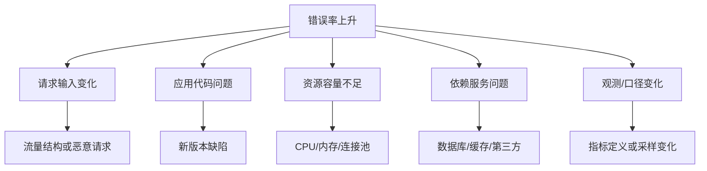

> 阅读范围：第9章“结构化分析问题”，包括“从信息资料入手”“使用诊断框架”“建立逻辑树”“是非问题分析”四个小节。
>
> 原文：《金字塔原理》第9章

## 本章定位：先设计分析，再收集资料

第8章把问题界定为特定背景下 $R1$ 与 $R2$ 的差距。第9章继续回答：**怎样有条理地查明差距的原因，并系统生成解决方案？**

传统流程看似合理：

```text
收集信息 → 描述发现 → 得出结论 → 提出方案
```

问题在于，人们常在不知道要证明什么时收集所有资料，最后才试图寻找意义。作者主张把结构化工作提前：


本章最重要的区分是：

- **诊断框架**用于寻找和验证“为什么产生 R1”；
- **方案逻辑树**用于回答“能做什么、应该做什么”；
- **决策树/PERT**用于展示行动选择、概率后果或项目依赖；
- **是非问题**是可由证据回答“是/否”的争议命题，不是所有问题的统称。

---

## 第9章 结构化分析问题

### 一、为什么“先收集再分析”效率低

如果没有问题结构，资料选择标准只能是“看起来相关”或“可能有用”。结果通常是：

- 收集范围不断扩大；
- 大量事实无法支持关键建议；
- 真正所需证据反而缺失；
- 团队到项目末期才发现分析空白；
- 报告按资料来源或收集时间组织，缺少结论主线。

### 二、结构化分析的操作性定义

**结构化分析**是在收集主要证据之前，先把问题领域表示为有边界的系统、因果或类别结构，列出可检验的原因假设与方案空间，再针对关键分支收集证据的过程。

### 三、为什么结构化能简化最终写作

分析树中的：

- 已验证原因可转化为诊断结论；
- 方案分支可转化为关键句；
- 证据可放到相应结论下；
- 被排除分支通常无需进入正文，或作为备选说明。

写作不再是把材料重新拼装，而是把已完成的分析结构转换为读者结构。

### 四、结构化分析不等于套模板

框架必须来自问题所在领域的真实结构与流程。没有领域知识，树可以形式完整却遗漏关键机制。模板用于提出问题，不替代专业判断。

---

## 从信息资料入手

### 一、传统咨询方法的历史背景

早期咨询公司行业知识积累有限，面对任何客户都倾向于进行全公司或全行业扫描：

1. 研究行业成功关键因素、市场、价格—成本—投资、技术、结构与盈利；
2. 评估客户在销售、市场、技术、经济、财务和成本方面的优劣；
3. 把客户表现与关键因素比较；
4. 提出建议。

这种方法在陌生行业中有探索价值，但容易把“全面”误解为“收集一切”。

### 二、为什么会产生大量无用功

资料的价值是相对于问题和假设定义的。若没有待回答问题：

$$
\text{相关性}=\operatorname{Relation}(\text{资料},\text{待检验命题})
$$

待检验命题为空，相关性也无法判断。

原书引用某咨询公司的估计：资料收集与分析中可有高达 60% 属于无用功。该数值应理解为经验警示而非普遍统计定律。

### 三、资料齐全为何仍难形成结论

按运营、营销、增长预测等话题分类，只说明资料属于哪个主题，不说明共同结论。按收集时间写“发现—结论—建议”，又迫使读者重走研究过程。

资料分类与思想金字塔不同：

- 资料分类回答“从哪里来、谈什么”；
- 思想结构回答“这些事实共同证明什么”。

### 四、结构化方法与科学方法

作者把新方法类比为：

1. 提出多个假设；
2. 设计关键实验；
3. 用结果排除假设；
4. 得出结论并采取补救措施。

其核心不是先相信假设，而是让资料具有**区分力**：一项证据应能使某些解释更可信、另一些更不可信。

### 五、溯因、演绎和归纳怎样协作


原书称提出原因假设为外展推理。现代常称溯因推理。

### 六、确认假设与证伪假设

只找支持信息会造成确认偏误。更好的问题是：

- 如果假设为真，应看到什么？
- 如果假设为假，应看到什么？
- 哪项证据能区分两个解释？
- 什么结果会迫使我们放弃假设？

### 七、诊断框架与方案逻辑树为何不同

| 工具 | 输入 | 核心问题 | 输出 |
| --- | --- | --- | --- |
| 诊断框架 | R1 和系统背景 | 为什么发生？ | 原因假设与诊断 |
| 方案逻辑树 | 已确认原因/目标 | 能做什么？ | 方案全集与行动路径 |

混淆二者会出现两种错误：尚未诊断就罗列措施，或诊断完成后仍停留在原因树。

### 八、设计诊断框架的三种基础

根据第6章的分析活动，可从：

1. 有形或概念结构；
2. 因果关系；
3. 原因类别。

一个复杂诊断框架可以组合三者。

### 九、头痛案例

图 9-1 先把头痛原因分为身体和精神；身体再分外部、内部；外部包括撞伤、过敏、恶劣天气，内部包括流感、脑瘤、脑积水；精神包括压力紧张、多疑等。

### 十、头痛树的价值

- 形成候选原因空间；
- 按风险、概率和检查成本安排顺序；
- 若天气反应证据充分，无需立即检查低概率严重疾病；
- 使停止条件更明确。

### 十一、头痛树的安全边界

医疗诊断不能仅凭简化树自诊：

- 类别未必真正 MECE；
- 多种原因可并存；
- 严重原因即使低概率也可能需先排除；
- 检查顺序还取决于危险性，不只取决于容易程度。

框架用于说明方法，不是医疗建议。

### 十二、呈现有形结构

把企业或行业表示为不同单元及其功能，比较现状、过去或理想结构，可定位问题发生在哪个环节。

### 十三、零售经营结构案例

图 9-2 从生产商、批发商、零售商到消费者，展示：

- 营销路径：了解度 → 首次购买 → 重复购买；
- 销售路径：货架陈列 → 定价 → 具体销售支持；
- 最终影响市场份额和消费者购买。

市场份额下降可被拆问：

- 消费者不了解产品吗？
- 知道但不首次购买吗？
- 首次购买却不复购吗？
- 零售商陈列、定价或支持有问题吗？

### 十四、行业结构案例

按细分市场、价值链、竞争者、成本、利润和资产使用画行业结构，可识别：

- 哪个细分增长或衰退；
- 哪个环节创造价值；
- 哪些利润易受攻击；
- 哪些资产利用不足；
- 竞争集中在哪里。

结构图本身不证明脆弱性，仍需数据。

### 十五、寻找因果关系：财务结构

图 9-4 把投资回报分解为利润和资产：

$$
ROI=\frac{利润}{资产}
$$

利润进一步分成收入与成本；资产分成流动和固定资产。收入受价格、产品、服务、市场条件影响；成本受人工、物料、服务和固定成本影响。

### 十六、财务树如何形成是非问题

- ROI 下降主要来自利润还是资产增加？
- 利润下降来自销售减少还是成本上升？
- 销售问题来自价格、数量、产品还是市场？
- 成本问题来自人工、物料还是固定支出？

把数据填入树后，可按影响大小与可控性定位。

### 十七、财务树的假设与边界

- 会计口径一致；
- 树中变量关系正确；
- 相关期和基准可比；
- 非财务因素最终能映射到指标；
- 不把短期 ROI 最大化等同于长期价值。

### 十八、任务结构

图 9-5 把财务变量改写为管理任务，例如增加净销售额、减少烟叶和包装成本、减少广告和销售费用、降低资产占用。

优势是：一旦定位指标问题，就能对应责任和行动方向。

### 十九、贡献毛益案例

$$
贡献毛益=收入-可变成本
$$

烟草企业可把收入、烟叶、包装、税金、直接人工、广告和销售费用转成任务，通过趋势、敏感性、行业与竞争比较决定优先级。

### 二十、活动结构：安装时间过长

图 9-6 从“X 方案比 Y 方案安装时间长”向下分解：

- 每周工作时间减少；
- 每班现场工人减少；
- 每位工人的工作时间增加；
- 不可预期延误。

再继续细分工资、监督、劳动规则、工作环境、设备、流程、返工等原因。

### 二十一、活动结构中的数量关系

安装总工时可粗略表示为：

$$
T=\frac{W}{N\times H\times E}+D
$$

- $W$：总工作量；
- $N$：工人数；
- $H$：每人有效工作时间；
- $E$：效率；
- $D$：延误。

公式有助于保证分解方向，却不能代替现场机制分析。

### 二十二、按相似性分类原因

图 9-7 将销量下降的原因分为半固定因素与可变因素。

#### 半固定因素

市场衰退、仓储数量或位置、仓储能力、可达性等。

#### 可变因素

商品、布局、价格、展示、销售人员、广告等。

分类后针对每类设计数据，而不是漫无目的访谈。

### 二十三、选择结构：逐层二选一

图 9-8 把销售支持效率低分为零售商支持与总部支持，再依次判断：

- 是否选对商店；
- 上门次数是否合适；
- 活动是否正确；
- 活动是否有效；
- 人员负担、薪酬、监督和重点是否合理。

每个节点是可检验的二分问题。

### 二十四、二选一树的成立条件

- 两个分支在当前口径下覆盖所有可能；
- 分支不重叠；
- 问题可被可靠数据回答；
- “正确/错误”有明确标准；
- 多因并存时允许多个分支同时成立。

### 二十五、营销总流程结构

图 9-9 按分析先后检查：

1. 品牌定位是否与消费者利益一致；
2. 分销能否覆盖目标消费者；
3. 目标市场是否知道品牌；
4. 是否试购；
5. 是否重复购买。

每阶段再分解产品规格、价格、渠道、包装、广告、促销和使用场合等因素。

### 二十六、为何上游问题先解决

如果广告面向错误人群，增加推销没有意义；如果产品与消费者利益不符，改善促销也只能短期补救。

流程顺序给出干预优先级：先修复前置条件，再优化下游转化。

### 二十七、诊断框架的三种比较

建立系统后可问：

1. 现状怎样？
2. 过去怎样？
3. 理想状态应怎样？

现状/过去与理想比较可证明变革必要性；理想与现状比较可揭示具体差距。

### 二十八、是非问题作为决定性实验

好的节点能确认或排除一个原因，并明确何时停止调研。

例如：

- 交货是否晚于承诺？
- 若否，交货时效分支可停止；
- 若是，再区分采购、生产、库存或运输。

### 二十九、诊断框架、决策树与 PERT 的区别

| 工具 | 目的 | 节点含义 |
| --- | --- | --- |
| 诊断框架 | 寻找 R1 原因 | 系统要素、原因假设、检验问题 |
| 决策树 | 比较行动与不确定后果 | 决策、概率事件、收益 |
| PERT/项目网络 | 安排行动依赖与工期 | 任务、先后依赖、关键路径 |

三者都可画成树或网络，图形相似不代表用途相同。

---

## 使用诊断框架

### 一、选择框架取决于领域知识

无法仅靠抽象逻辑知道制造、营销或信息系统的关键变量。领域知识决定：

- 系统边界；
- 正常运行机制；
- 常见失效模式；
- 数据来源；
- 严重风险与优先顺序。

框架帮助组织知识，不能凭空创造知识。

### 二、诊断框架通常隐藏在问题序幕中

第8章序幕描述现有结构或流程；把它画出来，就是诊断框架的起点。若 R1 是基层效率低，就应先描绘基层作业和信息流，而非从公司文化等宽泛主题开始。

### 三、巴罗斯公司背景

巴罗斯新设信息系统部，业务增长超预期。虽使用新的生产计划控制系统，仍有许多订单无法满足，面临错失增长机会。

### 四、巴罗斯的 R1 与 R2

#### R1

- 不能应对增长机会；
- 新系统未被充分理解和利用；
- 怀疑支持小组生产率低；
- 无法判断哪些地方效率低。

#### R2

- 产能满足预测增长；
- 提高支持小组效率和生产率；
- 明确信息需求；
- 评估系统和流程；
- 提出短期和长期改进措施。

### 五、为什么先画基层流程

当前问题表现为工厂基层效率和生产率，候选原因很可能存在于订单、生产、物料、库存、调度和控制流程。框架应靠近问题发生机制。

### 六、资料清单为什么还不等于分析计划

原项目建议书希望收集增长预测、管理目标、信息需求、系统流程、效率、控制、库存准确性和资源利用等资料。

若直接全面访谈，会得到大量难以判断相关性的材料。必须先将资料对应到具体问题节点。

### 七、图 9-12 的系统流程

流程包括：

1. 订单与交货信息；
2. 物料单和日常记录；
3. 库存和订货因素；
4. 运营与装载主流程；
5. 车间调度和优先原则；
6. 控制标准与管理评估数据。

管理、生产、物料控制、采购、安排和评估通过信息流互相连接。

### 八、从流程生成诊断问题

1. 承诺交货时间是否有竞争力，是否按期交付？
2. 原材料、零件和辅料采购是否延迟或成本过高？
3. 库存短缺是否影响销售，外部存放是否增加成本？
4. 现有产能能否满足预测需求？
5. 局部控制是否造成系统失衡和成本转移？
6. 订单、状态与劳动效率报告能否支持控制？

### 九、从问题生成证据需求

对每个问题写明：

- 指标和定义；
- 所需数据；
- 数据来源；
- 比较基准；
- 负责人；
- 时间与成本；
- 哪种结果支持或反驳假设。

这才是可执行调研计划。

### 十、诊断框架怎样降低收集成本

1. 只收集能回答节点问题的数据；
2. 先检验高概率、高影响、低成本分支；
3. 分支被排除后停止收集；
4. 新证据出现时局部扩展，而非全面重做；
5. 团队可按分支并行工作。

### 十一、创造性方案为何仍依赖洞察

诊断树能系统定位原因，逻辑树能穷举常规方案，但真正新颖方案往往来自跨领域经验、机制理解和类比。结构化方法减少遗漏，不保证创新。

### 十二、框架使用的风险

- 先验框架排除了未知原因；
- 过度 MECE 把相互作用拆散；
- 数据只能回答框架预设问题；
- 团队把“未测量”误作“没有问题”；
- 专家经验带来锚定偏差。

应保留“其他原因”、异常发现和框架修订机制。

---

## 建立逻辑树

### 一、诊断树与方案树的阶段关系

连续分析中：

- 步骤 2、3 用流程与因果结构定位问题和原因；
- 步骤 4、5 用逻辑树生成方案、评估影响并选择。

逻辑树也可在报告完成后反查观点是否遗漏或重复。

### 二、什么是方案逻辑树

**方案逻辑树**是以目标或已确认原因为根节点，按互斥、穷尽的方式逐层展开所有主要干预方向，直到形成可评价行动的结构。

### 三、削减直接人工成本案例

图 9-13 先把直接人工成本按环节拆为：

- 初始准备过程；
- 香烟生产部门；
- 包装部门；
- 其他。

香烟生产成本进一步满足：

$$
\frac{成本}{百万根}
=\frac{成本}{小时}\times\frac{小时}{百万根}
$$

### 四、降低每小时成本的方案

- 减少加班；
- 使用较低成本劳动力；
- 减少工资支出。

这些方案受劳动法规、技能、质量和员工关系约束，不能仅按算术选择。

### 五、降低单位生产时间的方案

- 减少每台机器工人数；
- 提高机器运转速度；
- 提高机器效率。

也需验证安全、质量、维护和瓶颈转移。

### 六、公式树为什么有用

它保证方案与经济指标之间有明确路径：

```text
行动 → 驱动变量 → 单位成本 → 总成本 → 利润
```

若某建议无法映射到驱动变量，就需解释机制或从主树移除。

### 七、从方案全集到最终行动

对每个叶节点评估：

- 可节约金额；
- 实施成本；
- 风险和副作用；
- 时间；
- 可逆性；
- 相互依赖。

然后组合成最终方案，而非把所有叶节点都推荐。

### 八、战略性机会逻辑树

图 9-14 展开欧洲小国业务增长机会：弥补当前业务不足、持续金融创新、支持建筑业融资、支持欧共体贸易投资、参与海外项目，并细分开发市场、融资、增加分支业务和贸易服务等行动。

这类树回答“增长可以来自哪里”，不诊断当前 R1 根因。

### 九、用逻辑树检查已写文章

把文章中的问题、原因或建议映射回完整结构：

- 无法归位的观点可能无关；
- 同一叶节点重复出现说明重叠；
- 空白分支提示遗漏；
- 父子关系错误提示层级混乱。

### 十、得克萨斯管材分销商案例背景

公司从供应商采购管材和接头，存入中心仓库，再向十几家地方仓库供货。并购后，新东家认为中心仓库 2700 万美元存货占压过高；中心库缺货又促使地方仓库直接采购，进一步增加库存。

### 十一、原项目建议书的五个问题

原文询问系统是否适合、必要库存是多少、中心库是否有效、过期滞销库存多高、改变政策与组织能改善多少。

问题长、层级混杂，既有诊断、测量，也有方案影响。

### 十二、先确定真正的 R1 与 R2

- **R1**：管理层认为 2700 万美元库存占用过多运营资金；
- **R2**：在达到客户服务目标的条件下，库存保持合理资金占用；
- 首要任务：先确定“合理库存水平”，再判断当前是否真的过高。

没有 R2，无法把 2700 万判为高或低。

### 十三、为什么“必要库存是多少”不是是非问题

它要求数值答案，不是“是/否”。可改成：

- 当前库存是否高于服务目标所需水平？
- 中心系统是否下达过多订单？
- 过期和滞销库存是否高于合理水平？

### 十四、库存成本原因树

图 9-16 把高库存粗分为：

- 订货太多；
- 存储太久。

再继续检查订单规则、需求预测、中心与地方重复订货、滞销品和清理机制。

### 十五、正确的项目方法表达

图 9-17 的上层是：

> 确定能否以及如何降低存货成本。

关键工作：

1. 在集中供货和客户服务目标约束下确定合理库存水平；
2. 确定通过改变流程，现有库存能降低多少；
3. 确定通过分散供货能否进一步降低库存。

这比单列“关键问题”更能说明项目怎样解决客户问题。

### 十六、为什么项目建议书不必专设“是非问题”章节

客户购买的是解决问题的方法与产出，不是问题清单。是非问题是分析内部工具，正文或建议书应呈现方法、理由和预期结果。

### 十七、能源开支案例

原表列十个“关键问题”，涉及操作改进、竞争成本、资本计划、燃料组合、审批、人力资源、政府关系和总体战略。

逻辑树把目标分为：

$$
能源开支=BTU使用量\times 每BTU成本
$$

### 十八、减少 BTU 使用量

- 修理或维护现有设备；
- 改善绝热；
- 改装设备；
- 购买或设计新设备。

原问题 1、2、6 主要对应修理现有设备和减少使用；问题 3、4 对应新设备。

### 十九、降低每 BTU 成本

- 现有设备使用低成本燃料；
- 新设备使用低成本燃料。

问题 5 对应前者，问题 3 也与后者有关。

### 二十、逻辑树如何发现无关问题

问题 7、8、9 分别偏向政府影响、人力资源和任务分配，无法直接映射到“使用量×单价”主结构，至少需要说明中间机制，否则属于范围外或支持性问题。

问题 10 是总体目标，不应与具体分析问题并列。

### 二十一、方案逻辑树的边界

- MECE 是相对模型，不保证现实方案互不影响；
- 公式可能遗漏质量、韧性、环境与战略价值；
- 叶节点组合可能冲突；
- 局部节约可能增加全局成本；
- 必须做情景与敏感性分析。

---

## 是非问题分析

### 一、严格的 issue 定义

**是非问题（issue）**是经过证据和推理后可回答“是”或“否”的争议命题。

- “我们应不应该重组？”是 issue；
- “我们应该如何重组？”不是 issue，而是开放式问题；
- “管理层担心什么？”是 concern，不是 issue。

### 二、为什么语言区分重要

若把所有疑问都叫 issue，会混淆：

- 诊断节点；
- 方案生成问题；
- 客户担忧；
- 决策命题；
- 研究任务。

明确术语可防止团队以为“列出问题”就完成结构化。

### 三、好的是非问题有什么价值

- 结论直接；
- 可设计决定性证据；
- 能确认或排除原因；
- 有停止条件；
- 易于分工和汇总。

### 四、是非问题分析的历史起源

麦肯锡早期借鉴美国国防部系统分析，用于城市复杂政策决策，特点是：

- 决策紧急；
- 多个方案各有优点；
- 变量与目标多；
- 衡量标准冲突；
- 一项行动影响其他政策。

### 五、中等收入住房案例

纽约市要决定补贴住房数量、位置和方式，同时考虑废物、空气污染等政策目标。

方法先按时间画出实际系统：

```text
选址 → 批准流程 → 搬迁 → 施工准备 → 建设 → 营销 → 居住
```

每阶段标出环境、经济、管理和社会因素。

### 六、主要决策变量 MVD

**主要决策变量**是对目标实现有显著影响、且决策者可选择或控制的变量。

例如原书所称的“选择租房人政策”（即租户选择政策）会影响申请数量，进而影响建设单元数量，因此是关键变量。

### 七、可行性方案评估

对每个决策变量：

1. 列备选方案；
2. 明确目标 A、B、C、D、E；
3. 预测每个方案对各目标的结果；
4. 识别加权因素；
5. 评估影响并排名；
6. 考虑资源、相互关系和公众意见。

### 八、这种原始方法为何复杂

决策、方案、目标、权重、环境变量和跨政策影响形成高维矩阵，维护成本高，普通团队难以一致执行，因此后来逐渐弃用。

但两项思想保留下来：描绘真实系统，以及围绕关键变量提出假设。

### 九、“是非问题分析”概念为何泛化

随着顾问流动，不同公司把诊断树、方案树、假设树都称为 issue analysis，名称相同而方法不同，造成混乱。

### 十、英国零售银行案例

客户背景是英国零售银行与欧洲零售银行系统；R1 是担心错失其他欧洲国家业务机会，R2 是在欧洲盈利；客户问“欧洲战略是什么”。

某方法要求：

1. 从客户问题入手；
2. 提主要和次要是非问题；
3. 提假设；
4. 确定资料；
5. 分派任务；
6. 得结论和建议；
7. 检查有效性。

### 十一、误解一：是非问题不应凭客户问句直接生成

客户问句通常是对 R2 的反应，例如“欧洲战略是什么”。诊断性 issue 应来自产生 R1 的业务结构：

- 客户能力是否适配欧洲市场？
- 哪些市场有吸引力？
- 监管和渠道是否构成障碍？

否则从开放问题到一串 issue 存在无根据跳跃。

### 十二、误解二：主要/次要问题的完整性没有来源

若没有行业结构、流程或因果模型，无法证明问题清单 MECE。逻辑树应先于“主要/次要”标签。

### 十三、误解三：论点和假设被重复分层

是非问题、候选答案和假设可对应：

```text
Issue：市场是否有吸引力？
Hypothesis：市场有吸引力。
Evidence：规模、增长、利润、竞争数据。
```

没有必要把“论点”和“假设”作为两个不清楚的独立阶段。重点是命题可检验、证据有区分力。

### 十四、误解四：把方案树也叫是非问题分析

诊断树解释原因；方案树生成行动；决策树比较后果。统称 issue analysis 会让团队在错误阶段用错误工具。

### 十五、结构化工具的双重功能

1. 提高解决问题的系统性，聚焦真正问题、原因和方案；
2. 减少最终报告组织成本，因分析结构可转换为金字塔。

### 十六、从分析树转换成表达金字塔

分析树通常展开所有可能性；表达金字塔只保留：

- 已验证的关键原因；
- 推荐方案及主要理由；
- 重要风险和被否定的关键替代方案。

不能把整棵分析树原样塞给读者。

---

## 各类工具的统一对照

| 工具 | 何时使用 | 根节点 | 分支依据 | 主要产出 |
| --- | --- | --- | --- | --- |
| 问题界定框架 | 分析前 | R1/R2 差距 | 序幕、困扰、结果 | 正确问题与序言 |
| 诊断框架 | 找原因 | R1 | 系统、因果、类别 | 原因假设 |
| 是非问题树 | 验证原因/决策 | 可争议命题 | 是/否检验 | 接受或排除 |
| 方案逻辑树 | 生成方案 | 目标或根因 | 行动空间 MECE | 备选行动 |
| 决策树 | 比较不确定选择 | 决策 | 概率与后果 | 期望结果/选择 |
| PERT/项目网络 | 计划实施 | 项目目标 | 任务依赖 | 工期与关键路径 |
| 表达金字塔 | 沟通结果 | 中心回答 | 理由、步骤、证据 | 可理解的结论 |

---

## 作者分析问题的完整思路

### 一、问题从哪里来

传统分析把资料当起点，导致事实堆积和末期补证据。作者把问题结构和假设提前，使资料变成回答问题的手段。

### 二、真正难点是什么

- 未知原因空间如何产生；
- 怎样证明分支完整；
- 哪些证据有区分力；
- 何时停止调研；
- 诊断与方案生成如何衔接；
- 多种“树”用途如何区分；
- 领域知识如何进入框架；
- 如何把分析树压缩成表达金字塔。

### 三、为什么从序幕恢复系统

R1 是系统运行的结果，原因通常位于系统部件、流程或交互中。画出序幕比从抽象“客户问题”罗列原因更有依据。

### 四、为什么强调假设驱动

假设把资料需求变成可检验预测，减少无目的收集。但假设必须可证伪、可修正，并保留其他分支。

### 五、为什么是非问题重要

明确的是非节点有决定性结果和停止条件，便于排除原因、分工与汇总。

### 六、为什么还要方案逻辑树

诊断告诉“为什么”，不会自动给出“怎么办”。方案树围绕可控驱动变量系统展开干预空间。

### 七、为什么领域知识不可替代

MECE 只约束形式，无法告诉人真正的市场、设备、法规和行为机制。创造性方案更依赖深厚知识。

### 八、为什么结构可降低写作成本

分析阶段已经确定结论—证据归属，写作只需按读者疑问筛选和重排，而非重新发现逻辑。

### 九、方法为什么有效

它使团队在开始前就能回答：

- 我们正在检验什么？
- 为什么需要这项数据？
- 什么结果会改变判断？
- 哪个分支优先？
- 何时停止？
- 结论将放入报告哪里？

### 十、方法的局限

1. 初始框架可能错误或不完整；
2. MECE 难以表达多因共现和反馈；
3. 假设驱动可能造成确认偏误；
4. 是/否会压缩连续变量和不确定性；
5. 数据质量可能不足；
6. 最优局部方案可能损害整体；
7. 复杂决策权重主观且冲突；
8. 树形结构可能忽略网络效应；
9. 创新方案不能仅靠穷举产生；
10. 分析完整不等于组织愿意实施。

### 十一、补充方法

- **贝叶斯更新**：量化证据如何改变假设概率；
- **因果图/DAG**：处理混杂、中介和多因；
- **实验与准实验**：验证因果；
- **故障树/FMEA**：设备和流程失效分析；
- **敏感性与情景分析**：处理参数不确定性；
- **多目标决策分析**：处理冲突目标；
- **系统动力学**：处理反馈回路；
- **探索性数据分析**：发现框架外异常；
- **预演失败 pre-mortem**：主动寻找遗漏风险。

---

## 易混淆概念辨析

### 资料与证据

资料只是信息；证据是相对于某命题、能够提高或降低其可信度的信息。

### 发现与结论

发现是观察到的模式，结论说明模式对问题意味着什么。二者常处于相对抽象层级。

### 假设与猜测

假设应明确、可检验、可被反驳；猜测可以模糊且没有验证标准。

### 溯因与确认偏误

溯因提出最佳解释；确认偏误只找支持。必须比较替代解释和反证。

### 诊断框架与方案逻辑树

前者寻找原因，后者生成行动。诊断分支不是直接建议。

### 诊断框架与决策树

诊断框架定位系统失效；决策树比较行动在不确定事件下的后果。

### 决策树与 PERT

决策树有选择和概率；PERT 描述任务依赖与工期。

### Issue 与 Concern

Issue 可回答是/否；Concern 是担忧或关注点，不一定可直接裁决。

### 开放问题与是非问题

“如何重组”用于生成方案；“是否应重组”用于决策。二者处于不同阶段。

### 原因树与公式树

公式树由恒等关系分解指标；原因树包含经验机制。公式正确不代表原因解释充分。

### 完整树与真实世界

树在模型边界内可 MECE，现实可能有交互、循环和未知项。

### 分析树与表达金字塔

分析树展示搜索空间；表达金字塔展示已验证结论。前者常比后者大得多。

---

## 综合示例：在线服务故障率上升

### 一、错误做法

团队先收集所有日志、监控、工单和代码提交，数周后仍不知道哪些与故障率有关。

### 二、界定问题

- **序幕**：请求经过入口、应用、缓存、数据库和外部服务；
- **困扰**：新版本上线且流量增长；
- **R1**：错误率从 0.2% 升到 2.1%；
- **R2**：两周内恢复到 0.3% 以下，且不降低吞吐和数据一致性。

### 三、诊断框架



### 四、设计决定性问题

- 回滚新版本后错误率是否恢复？
- 相同版本在低流量时是否正常？
- 错误是否集中于特定依赖或接口？
- 客户端错误还是服务端错误？
- 指标口径是否在同期改变？

每个问题都应对应数据、阈值和停止规则。

### 五、方案逻辑树

若确认新版本在高并发下耗尽连接池：

```text
降低错误率
├── 立即缓解
│   ├── 回滚版本
│   ├── 限流/降级
│   └── 扩大连接池并监控
├── 修复根因
│   ├── 修复连接泄漏
│   └── 增加并发测试
└── 防止复发
    ├── 发布前容量门禁
    ├── 自动回滚
    └── 故障演练
```

### 六、评估方案

比较恢复速度、风险、成本、数据一致性和可逆性。立即缓解、根因修复和防复发是不同时间层，不应互相替代。

### 七、转换为表达金字塔

> 错误率上升由新版本连接泄漏在高并发下耗尽连接池造成，应立即回滚并限流，随后修复泄漏并建立容量发布门禁。

正文只展开已验证原因、证据和三阶段行动，不必展示所有已排除分支。

---

## 常见误解与错误做法

### 误解一：收集越多资料，分析越可靠

无关资料增加成本和噪声。可靠性来自相关、完整和高质量证据。

### 误解二：结构化就是找一个现成框架

框架必须匹配真实系统，并随证据修正。

### 误解三：提出假设就是先入为主

可证伪、多假设并行并主动找反证，与固守结论不同。

### 误解四：MECE 树一定完整

它只在已定义模型中完整，未知原因和交互仍可能遗漏。

### 误解五：所有节点都应调查到底

按影响、概率、证据成本和安全性排序；被决定性证据排除后应停止。

### 误解六：是非问题就是任何关键问题

严格 issue 必须可回答是/否。数值、开放式和方案生成问题不是。

### 误解七：假设与 issue 必须分成两个复杂层级

Issue 是问题，假设是候选答案。保持一一对应即可。

### 误解八：诊断树叶节点就是方案

原因与行动之间还需有效机制和副作用评估。

### 误解九：公式树涵盖全部业务价值

财务公式可能遗漏质量、韧性、战略和外部性。

### 误解十：其他方案不好就证明推荐方案好

推荐方案必须自身满足目标和约束。

### 误解十一：项目建议书应展示所有是非问题

应展示解决方法和产出；详细 issue 可留作内部工作计划。

### 误解十二：分析树可以直接当报告目录

报告围绕读者问题和已验证结论，不能原样呈现搜索过程。

---

## 第九章实践检查清单

### 分析前

1. R1、R2 和系统边界是否清楚？
2. 当前任务是诊断、生成方案还是选择方案？
3. 是否已画出现有结构或流程？
4. 哪些领域知识和专家输入必需？
5. 初始框架有哪些明显盲区？

### 建立诊断框架

6. 根节点是否为具体 R1？
7. 分支来自结构、因果还是类别？
8. 分支在当前口径下是否近似 MECE？
9. 是否保留其他原因和交互？
10. 每个叶节点能否转成可检验假设？
11. 什么证据支持或反驳各假设？
12. 是否存在高风险原因需优先排除？

### 设计资料收集

13. 每项资料回答哪个节点？
14. 指标、口径、来源和基准是什么？
15. 哪项证据能区分竞争假设？
16. 分支何时停止调查？
17. 数据质量和缺失如何处理？
18. 谁收集、何时完成、成本多少？

### 使用方案逻辑树

19. 已确认原因和目标是什么？
20. 行动分支是否覆盖主要可控驱动变量？
21. 方案之间是否重叠或冲突？
22. 能否用公式或机制连接行动与结果？
23. 各方案的收益、成本、风险和时间是什么？
24. 是否考虑整体而非局部最优？
25. 是否存在创新或组合方案？

### 使用是非问题

26. 问句能否明确回答是/否？
27. “是”和“否”的判定标准是什么？
28. Issue 来自真实系统结构吗？
29. 问题列表如何证明完整？
30. 假设是否是 issue 的候选答案？
31. 是否把 concern、开放问题误叫 issue？

### 工具选择

32. 是找原因，还是比较行动后果？
33. 是否误用决策树代替诊断框架？
34. 是否误用 PERT 表示原因？
35. 是否把方案树统称为 issue tree？
36. 复杂反馈是否需要因果图或系统模型？

### 转换成报告

37. 哪些原因已被证据验证？
38. 哪些分支已排除且无需展开？
39. 推荐方案本身为何有效？
40. 关键风险、假设和替代方案是什么？
41. 中心思想和关键句能否由分析结构直接支持？
42. 报告是否围绕结论，而非收集时间和分析活动？

---

## 本章小结

第9章把问题解决从“收集一切再找结论”改造成假设驱动的结构化过程：

1. 无问题结构时，资料相关性无法判断，容易产生大量无用功和关键证据缺失。
2. 早期咨询业的全行业扫描有历史原因，但按运营、营销等主题堆资料难以形成思想。
3. 结构化方法先提出多个原因假设，再设计能排除假设的关键证据，类似科学方法。
4. 溯因提出解释，演绎产生可检验预测，归纳综合证据；必须主动寻找反证。
5. 诊断框架寻找 R1 的原因，方案逻辑树生成可选行动，二者处于不同阶段。
6. 诊断框架可以来自有形结构、因果关系或原因类别。
7. 头痛案例说明候选原因空间和停止规则，但医疗风险使检查顺序不能只按容易程度。
8. 零售经营结构沿了解、首次购买、复购以及陈列、定价、销售支持定位市场份额问题。
9. 财务结构将 ROI 分解为利润、资产、收入和成本，使诊断问题可量化。
10. 任务结构把财务变量改写为管理任务，发现问题后能迅速对应行动方向。
11. 安装时间树从人数、工时、效率和延误继续分解，展示活动因果结构。
12. 销量原因可按半固定与可变因素归类；销售支持树通过二选一逐层确认和排除。
13. 营销总流程从定位、分销、知名度、试购到复购，前置问题应先于下游促销解决。
14. 好的是非问题像决定性实验，既排除原因，也告诉团队何时停止调研。
15. 诊断框架提出原因问题，决策树比较不确定后果，PERT 安排任务依赖，三者不能混用。
16. 巴罗斯案例从订单、物料、库存、产能、系统成本和管理报告生成有针对性的资料需求。
17. 诊断框架降低资料成本，却依赖领域知识，并需防止框架盲区和确认偏误。
18. 人工成本逻辑树用“单位小时成本×单位产量工时”系统展开节约方案。
19. 战略机会树回答增长从哪里来，不用于诊断当前 R1 根因。
20. 库存案例先明确合理库存 R2，再检查订货太多和存储太久；“必要库存是多少”不是严格是非问题。
21. 正确项目方法是确定合理库存、评估流程改善空间、评估分散供货空间，而不是罗列长问题清单。
22. 能源案例用“BTU 使用量×每 BTU 成本”归位十个问题，并识别无关或层级错误项。
23. 严格 issue 是可回答是/否的争议命题，concern 和“如何做”不属于同类。
24. 原始是非问题分析用于复杂公共决策，以主要决策变量、目标权重和方案结果矩阵支持选择。
25. 后来“是非问题分析”被泛化为各种逻辑树，造成诊断、方案与决策工具混淆。
26. 英国银行案例说明 issue 应来自产生 R1 的业务结构，不应从开放的客户问句凭空跳出。
27. 分析树展开搜索空间，表达金字塔只呈现已验证原因、推荐方案和关键证据。
28. 结构化工具同时提高解决问题效率并减少写作成本，但形式完整不能替代事实、领域知识和创造性洞察。

本章最核心的实践原则是：**不要先问“我能找到哪些资料”，而要先画出产生 R1 的系统，列出可证伪的原因假设，明确每项证据要排除什么；确认原因后，再用方案逻辑树展开可控行动，最后把已验证结论而非整个搜索过程组织成金字塔。**
