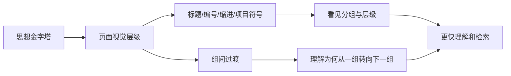

> 阅读范围：第10章“在书面上呈现金字塔”，包括“突出显示文章的框架结构”“上下文之间要有过渡”两个小节。
>
> 原文：《金字塔原理》第10章

## 本章定位：让页面外观忠实反映思想结构

前九章解决“思想怎样形成金字塔”，第10章解决“怎样让读者从页面上看见金字塔”。

书面文章是线性文本，思想却具有层级和分组。如果视觉格式不显示层级，读者必须自行恢复结构；如果格式与逻辑不一致，视觉线索反而会误导。



本章的两个核心任务是：

1. **静态呈现**：用视觉格式显示思想层级；
2. **动态衔接**：用过渡文字引导读者从一个分支移动到另一个分支。

---

## 第10章 在书面上呈现金字塔

### 一、书面呈现要解决什么问题

读者打开长文时，希望迅速知道：

- 文章在回答什么问题；
- 中心思想是什么；
- 关键句有哪几项；
- 当前段落属于哪个分支；
- 不同观点之间是什么关系。

理想状态是读者能在很短时间内掌握序言、中心思想和关键句主线。原书用“30 秒”强调快速获取结构，这是一项设计目标，不是所有复杂文档的严格计时标准。

### 二、媒介选择的必要背景

第四篇引言按信息长度和受众人数区分：

- 信息短、人数少：书面备忘录或报告；
- 信息短、人数多：要点备忘录或视觉资料；
- 信息长、人数多：现场演示。

第10章只处理读者自行阅读的书面媒介。它允许读者停顿、回看和检索，因此可承载比幻灯片更完整的论证。

### 三、五种常见视觉方法

1. 多级标题；
2. 下划线或其他强调；
3. 数字编号；
4. 行首缩进；
5. 项目符号。

没有绝对最好的方法。选择取决于篇幅、层级深度、检索需求、文体规范和阅读设备。

### 四、任何格式都必须满足的原则

$$
\text{视觉层级}=\text{逻辑层级}
$$

同层思想使用一致样式；下层思想应在视觉上从属于上层；转换分组时应有过渡。

格式不能先于结构决定。若思想只有一层，却用四级标题，页面会制造虚假的复杂性。

### 五、图 10-1 的对应关系

图 10-1 把：

- 文章题目或章标题对应中心思想；
- 节、小节标题对应关键句和次级思想；
- 编号段落对应更低层支持思想；
- 项目符号对应局部细节。

它表达的是一一映射原则，不要求所有文档必须使用全部层级。

### 六、视觉层级为什么有效

人会先看到字体、位置、编号和留白的差异，再读取文字。稳定视觉模式能：

- 降低定位成本；
- 形成内容地图；
- 提示哪些思想并列；
- 支持跳读和回看；
- 恢复长文阅读中断后的记忆。

### 七、视觉格式的成立条件

- 思想金字塔已经正确；
- 样式使用一致；
- 层级数量适度；
- 标题真正表达思想；
- 读者能辨认视觉差异；
- 数字设备与辅助技术可解析语义结构。

---

## 突出显示文章的框架结构

### 一、短文与长文的呈现策略不同

若每个关键句只有一两段支持，读者容易保持整体结构，可用加粗、下划线或编号突出要点。

若每个关键句展开多段甚至多页，需要标题作为持续导航。

判断依据不是总字数，而是：一个分支是否长到读者可能忘记其上层思想。

### 二、短文案例：有奖竞猜备忘录

备忘录请读者审阅规则，并突出三个关注点：

1. 观众如何了解正式规则；
2. 随机抽奖下是否还有竞猜必要；
3. 广告能否清楚传达结果。

三项各只需一段解释，不必设置三级标题。通过编号和重点句即可呈现结构。

### 三、短文格式的逻辑前提

三个关注点应共同回答“规则能否按计划实行”。如果它们只是三个偶然问题，即使编号整齐也不是金字塔。

### 四、长文案例：现场销售会

文章要求各区域为培训准备一家有问题的连锁店资料：

- 7 月 11 日前选店；
- 8 月 10 日前收集数据；
- 8 月 15 日前整理并返回。

后续“如何选择连锁店”需要多段解释，因此应成为标题。时间步骤在序言集中列出，各步骤的复杂说明再分节展开。

---

### 五、多级标题法的严格定义

**多级标题法**是用不同但一致的样式表示不同逻辑层级，并用同级样式表示并列思想的呈现方法。

可抽象为：

```text
H1：全文/章中心思想
  H2：关键句思想
    H3：支持性思想组
      编号段落：更低层论点
        项目符号：局部细节
```

### 六、层级样式应如何设计

可用：

- 字号；
- 字重；
- 编号；
- 缩进；
- 上下留白；
- 分隔线。

现代数字文档应优先使用语义标题标记，而非只把普通文本放大加粗。语义标题有利于目录、搜索和屏幕阅读器导航。

### 七、章标题的职责

- 总结该章中心思想；
- 与其他章标题处于同一层级；
- 标题后先用一段话恢复共同语境；
- 不要立即跳入下一级标题。

### 八、节与小节标题的职责

节标题呈现该分支的关键思想，小节标题呈现更低层思想。标题不只是“成本”“问题”等主题名词，而应尽量表达判断或行动。

### 九、编号段落和项目符号

编号适合：

- 有顺序的步骤；
- 需要引用的论点；
- 同层项目较少且关系明确。

项目符号适合局部并列细节。层级太深会使读者只看见符号，失去主线。

---

### 十、标题规则一：同一层级不能只有一个标题

#### 原理

一个标题代表一组并列思想中的一项。若某层只有一个子标题，通常没有发生真正分组，标题只是装饰性切断文本。

#### 例外与边界

现代文档有时为导航、法规模板或折叠交互保留单一标题。此时可用，但应知道它服务的是检索或规范，而非金字塔分组。

#### 检查

- 这个标题有同级兄弟吗？
- 若没有，能否删除标题并并入上层？
- 是否遗漏另一个并列思想？

### 十一、标题规则二：同组标题使用平行句型

同类思想应有相同句法：

```text
任命全职总经理
建立明确职权范围
撤销重叠委员会
```

不要混成：

```text
任命全职总经理
职权范围
委员会存在重叠
```

平行句型帮助读者识别共同逻辑，也暴露某项是否混入不同类型。

### 十二、平行只要求同组一致

不同分支之间有“看不见的墙”。一个行动组可都用动词，一个问题组可都用名词判断，无需全文所有标题采用同一词性。

### 十三、标题规则三：标题提炼思想精髓

标题应短，但保留最有区分力的判断。

- 太空：“管理”；
- 太长：“任命一位全职总经理，从而实行明晰中央集权”；
- 较好：“任命全职总经理”。

标题是提示，不承担全部论证。

### 十四、标题规则四：标题与正文分别成立

正文不能依赖标题补全语法或事实。删除所有标题后，文章仍应连贯。

错误：

```text
任命全职总经理
这一行动将进一步明确日常职责……
```

若脱离标题，“这一行动”指代不明。正文应重新明确主题。

编号段落例外，因为编号句本身通常就是正文组成。

### 十五、标题规则五：每组标题前先集中介绍

在上层标题后写一段导语，说明下面的同级标题共同回答什么问题。不要从文章题目直接跳到章标题，也不要从章标题立刻跳到节标题。

导语承担：

- 重申上层思想；
- 说明分组依据；
- 预告下层问题；
- 建立过渡。

### 十六、标题规则六：不要滥用标题

标题只有在帮助导航、理解或检索时才有价值。过多标题会：

- 打碎阅读节奏；
- 制造虚假层级；
- 增加视觉噪声；
- 让短段落看起来像清单而非论证。

### 十七、标题目录何时可充当摘要

若标题都表达真实思想，目录可以让读者恢复主线。若只有“序言、背景、发现、结论、建议”，目录只暴露文档类别，没有传递结论。

### 十八、为什么通常不应使用“序言”“背景”作标题

序言是文章进入问题的叙述功能，不是与正文关键句并列的思想；“背景”也通常不是思想层级。把它们列入目录会混淆结构和文档部件。

法规、学术模板要求固定章节时可以保留，但内部小标题仍应尽量表达具体内容。

---

### 十九、下划线法的定义与目的

**下划线法**用强调样式突出不同层级的主题句，并结合缩进或字体差异表示从属关系。现代中文文档常用加粗替代下划线，避免与超链接混淆。

读者浏览中心思想和强调句即可恢复全文骨架。

### 二十、下划线法的三项严格约束

#### 1. 严格使用疑问/回答结构

下层强调句必须直接且仅回答上层疑问。背景和修辞不能混入同层论点。

#### 2. 论点措辞尽量短

原书以英文 12 个词作为警报线。中文不宜机械套字数，但应尽量只有一个主语—谓语核心。若一句包含多个判断，应拆分或概括。

#### 3. 限制在演绎或归纳关系内

演绎链通常不超过四步，归纳组通常不超过五项。超过并不必然错误，但提示尚未分组。

### 二十一、为什么强调法对作者要求更高

视觉突出会放大结构缺陷：一旦所有主题句并排出现，混类、重复、长短不一和答非所问都会非常明显。

### 二十二、下划线法的现代边界

- 网页下划线通常意味着链接；
- 单靠颜色或字体不利于无障碍阅读；
- 屏幕阅读器无法从视觉加粗自动获得层级；
- 应结合语义标题、列表和段落结构。

---

### 二十三、数字编号法

#### 优点

- 精确引用；
- 便于法规、合同和多人审阅；
- 表示父子层级；
- 支持交叉引用。

#### 缺点

- 数字密集会分散对整体思想的注意；
- 删除段落可能导致重编号；
- 纯编号不能恢复内容；
- 层级过深难以记忆。

### 二十四、为什么编号应配合标题

“第 4 章第 1 节有关生产利润”比单说“4.1”更容易唤起内容。编号提供地址，标题提供语义。

### 二十五、常见编号体系

十进制：

```text
1
1.1
1.1.1
1.1.1.1
```

混合式：

```text
I
1
a
i
```

任何体系都应映射真实层级，并保持一致。

### 二十六、哪些段落通常不编号

- 序言；
- 总结概括；
- 连接性评论；
- 分支引言。

它们服务于衔接，不是并列论点。

### 二十七、数字文档中的改进

现代编辑器可自动编号和交叉引用，减少重排成本。应避免手工输入固定号码，并设置稳定锚点，以免插入内容后引用失效。

---

### 二十八、行首缩进法

短文不适合多级标题时，可用一个引导句加缩进编号，突出一组观点。

### 二十九、创造性思维会议备忘录案例

原版本把会议时间、序言幻灯片、积极强化用语、改革成果、影片和环境内容散落在多个段落中。

改写先给共同目标：

> 为两次会议准备以下幻灯片。

然后列出：

1. 序言中的主要论点；
2. 积极强化用语实例；
3. 已有改革成果；
4. 创造改革环境所需措施。

### 三十、缩进怎样暴露不完整思想

前三项明确说明所需幻灯片内容，第四项“创造改革环境需要采取的措施”没有说明具体要什么材料。平行展示使缺口立即可见。

### 三十一、行首缩进法的规则

- 先写统摄句；
- 同层使用平行句型；
- 只突出一组主观点；
- 保持缩进浅；
- 细节放回相应项目下；
- 不以缩进替代逻辑分组。

原书建议英文短备忘录只使用一组缩进观点，以免视觉效果破碎。现代文档可有多组列表，但每组仍需清楚引导和留白。

---

### 三十二、项目符号法

项目符号法是缩进法的变体，常用于咨询项目进度小结，适合现场共同阅读和讨论。

### 三十三、项目符号的层级规则

- 层级越低，缩进越深；
- 每层只有一个陈述句；
- 句子简短直接；
- 同层尽量平行；
- 下层只能解释或支持直属上层；
- 删除装饰性评论和连接句。

### 三十四、项目进度小结为什么适用

演示者通常在场，可口头补充背景；客户需要迅速发现中心论点、层级和讨论点，并即时反馈。因此纸面更像视觉讨论工具，而非独立完整报告。

### 三十五、项目符号法的风险

- “每句一个 bullet”造成碎片化；
- 层级深到难追踪；
- 省略过渡后离开讲解无法独立理解；
- 视觉平行掩盖逻辑不平行；
- 短语过度压缩，产生歧义。

如果不能严格遵守规则，原书建议不要使用这种格式。

### 三十六、五种方法的选择

| 情形 | 优先方法 |
| --- | --- |
| 长篇、需导航 | 多级标题 |
| 短篇、少量关键句 | 加粗/强调 |
| 法规、合同、多人引用 | 编号 + 标题 |
| 短备忘录单组观点 | 行首缩进 |
| 现场讨论材料 | 项目符号 |

可组合使用，但必须保持主次清楚。

### 三十七、视觉呈现的本质边界

这些方法只能减少读者恢复结构的时间，不能：

- 修复错误分组；
- 证明结论；
- 补足缺失论据；
- 把主题名词变成思想；
- 代替过渡。

---

## 上下文之间要有过渡

### 一、为什么视觉层级仍不足

标题告诉读者“现在进入另一组”，却未说明“为什么从上一组来到这一组”。长分支结束后，读者可能已忘记顶层主线，需要文字恢复位置。

### 二、什么是过渡

**过渡**是在思想组边界处，回顾已建立的结论，说明它与下一组的逻辑关系，并引出下一组将回答的问题的文字。

形式上：

$$
\text{过渡}=\text{回看 A}+\text{连接关系}+\text{前瞻 B}
$$

### 三、错误过渡：只连接章节动作

> 本章讨论必要性，下一章讨论如何确定优先事项。

它说明作者在做什么，没有连接思想内容。

应改为：

> 既然资源必须优先投入少数高影响事项，下一步就要建立一套可复核的优先级标准。

### 四、过渡需要回答什么

- 前一部分得出了什么？
- 这个结论引发什么新疑问？
- 下一部分为何是合理回答？
- 读者此时已知道什么？

### 五、过渡的四类方法

1. 讲故事；
2. 承上启下；
3. 总结长部分；
4. 完整结论或下一步行动。

---

### 六、讲故事式过渡

在关键句或重要分支前，用缩小版 SCQA：

- 回顾读者已知背景；
- 引入局部冲突；
- 唤起疑问；
- 以关键句作为回答。

### 七、全面质量管理案例

全文回答：领先企业怎样比其他企业做得更好？关键句是：

1. 持续瞄准竞争对手；
2. 用基于行为的管理得出真实成本；
3. 调整全面质量管理，使其更好服务战略。

图 10-3 把这三项作为局部故事的答案。

### 八、标杆比对的局部故事

- **S**：银行把贷款处理从两天缩短到两小时；
- **C**：内部改善显著，但不知是否优于竞争者；
- **Q**：是否已形成竞争优势？
- **A**：必须正式标杆比对。

### 九、行为管理的局部故事

- **S**：企业已在效率上领先；
- **C**：效率领先不保证产品收入超过真实成本；
- **Q**：怎样判断哪些业务值得做？
- **A**：按活动分析成本。

### 十、调整全面质量管理的局部故事

- **S**：已完成标杆比对和行为成本分析；
- **C**：传统质量流程未必保持优势；
- **Q**：怎样持续改善？
- **A**：把质量管理集中到战略重要流程。

### 十一、局部故事的原则

只使用读者在当前位置已经知道或会认可的信息。不能突然引入待证明事实，否则会生成额外疑问。

局部故事应比全文序言短，避免每节都重新开始。

---

### 十二、承上启下法

从上一部分选取关键词、短语或中心结论，放入下一部分起始句，并与下一部分主张结合。

### 十三、承上启下的认知机制

重复关键词形成指代链，让读者确认“新内容仍在同一主线上”，同时新谓语推动论证前进。

### 十四、领导与职责案例

前一部分：缺少专职主管导致领导与协调问题。

下一部分开头：

> 这些因缺少专职领导而产生的问题，又与交叉重叠的职责分工混合在一起……

“这些问题”回指前文，“职责重叠”引入新分支。

### 十五、里兹—赖恩饭店结构

集团共同所有权本应产生协同，但现有组织结构妨碍利用。顶层建议改造最高主管机构，下面包括：

- 任命专职总经理；
- 建立明确职权范围。

再分别展开协调、改革、宾馆分组、海外职责和撤销委员会。

### 十六、两节之间的过渡

> 现有最高主管和委员会机构存在两个严重问题，限制集团利用联合资源。

它把上一节“协同没有实现”连接到下一节“组织缺陷”。

### 十七、两小节之间的过渡

> 除任命董事总经理外，还应改革主管机构，建立明确职权范围。

“除……外”回顾第一项并引出第二项。

### 十八、两支持论点之间的过渡

> 正如专职总经理能够协调业务和职能，他也能施加持续压力，推动组织改进。

使用同一主语连接两个作用。

### 十九、承上启下的边界

- 关键词重复必须保留同一含义；
- 不要只做机械同义替换；
- 新句必须推进思想；
- 若读者缺少必要背景，应使用局部故事而非一句连接。

---

### 二十、总结各部分内容

长而复杂的章结束时，可短暂汇总主要结论，帮助读者压缩和恢复主线，再进入下一部分。

### 二十一、里兹—赖恩总结案例

总结重申：董事会与主席、集团董事总经理和三位业务高管形成长期领导和控制框架；只有提高控制和责任，其他改进才可能实现。

它不重复全部细节，而提炼组织设计与全文后续的关系。

### 二十二、好的部分总结应满足

- 只复述关键结论；
- 保留本节基调；
- 不引入新证据；
- 说明为何可进入下一部分；
- 长度远短于原分支。

---

### 二十三、是否需要全文结论

若文章开头已给中心回答，正文又完整证明，逻辑上不必重复结论。但读者可能期待一个有结束感的段落。

### 二十四、什么是有价值的结尾

不是：

> 本报告提出了重组建议并说明了措施。

而是说明信息的重要性、行动意义或未来影响，使读者知道获得新认识后应想什么或做什么。

### 二十五、情感呼吁的边界

原书引用林肯演说说明哲学观点和行动呼吁可以结合。商业文档也可产生适度行动意愿，但语气必须匹配：

- 议题风险；
- 与读者关系；
- 组织文化；
- 证据强度。

过度煽情会损害可信度。

### 二十六、技术文献系统结尾案例

结尾不仅说系统可行，还指出：

- 用户更快获取科技信息；
- 建立信息共同市场；
- 资源向所有用户开放；
- 推动标准化和新标准；
- 建议共同启动试验计划。

它从技术结论上升到战略意义，并转向行动。

### 二十七、“写不好不如不写”

结论段最容易变成重复、口号或情绪堆积。若没有新层次的意义或必要行动，文章可以在证明完成后自然结束。

---

### 二十八、说明下一步行动

当希望读者近期执行建议时，长文应设“下一步措施”。它把战略决定转为第二天即可启动的动作。

### 二十九、下一步措施的严格条件

写入该节的动作必须在读者接受主建议后逻辑上显而易见，不需要新的实质论证。

若读者会问“为什么必须这样做”，该行动应进入正文接受证明，而非藏在结尾。

### 三十、收购案例

若正文已证明应收购，下一步可写：

1. 联系目标公司老板安排会谈；
2. 联系银行确认融资可用；
3. 召集收购委员会处理管理细节。

这些是启动动作，不是对收购正确性的新增理由。

### 三十一、下一步措施还应包含什么

现代行动计划通常还需：

- 负责人；
- 截止时间；
- 交付物；
- 前置依赖；
- 风险与审批；
- 成功标准。

但不要把复杂实施方案全部塞入结尾。

### 三十二、过渡的本质

长分支后，作者与读者的认知状态不同：作者掌握全局，读者刚处理大量局部信息。过渡的作用是把读者的注意力拉回正确层级，再向前移动。

可以把它理解为礼仪，也可理解为认知同步。

---

## 静态格式与动态过渡如何协作

| 任务 | 静态格式 | 动态过渡 |
| --- | --- | --- |
| 显示并列 | 同级标题/编号 | 导语说明共同问题 |
| 显示从属 | 缩进/层级样式 | 解释下层回答什么 |
| 切换分支 | 新标题 | 回顾前文并引出新问题 |
| 结束长分支 | 留白/标题边界 | 简短总结 |
| 推动行动 | “下一步”标题 | 明确启动动作 |

仅有格式，文章像分块资料；仅有过渡，读者难以浏览。二者共同呈现金字塔。

---

## 作者分析问题的完整思路

### 一、问题从哪里来

思想是多层结构，页面是二维视觉加线性阅读。作者需要把抽象关系编码成读者可见的样式和可跟随的过渡。

### 二、难点在哪里

- 格式容易变成装饰；
- 层级过多造成视觉噪声；
- 标题常是名词而非思想；
- 列表外观掩盖逻辑混乱；
- 长分支使读者忘记主线；
- 结尾容易重复；
- 不同媒介和读者需要不同密度。

### 三、为什么优先多级标题

长文需要导航、目录和快速回看。标题同时提供位置与语义，比纯编号更容易恢复记忆。

### 四、为什么强调平行句型

同组思想同类，句法平行可视化这种同类性，也会暴露类型混杂。

### 五、为什么标题与正文都要独立

标题服务跳读，正文服务连续阅读。两条路径都应完整，否则一种阅读方式会失败。

### 六、为什么需要过渡

视觉边界只说“换了”，过渡解释“为什么换”。它保持疑问/回答链连续。

### 七、为什么提供多种过渡

- 新背景复杂时用故事；
- 关系直接时承上启下；
- 分支过长时总结；
- 需要行动时写下一步。

### 八、方法为什么有效

它同时支持：

- 扫描；
- 精读；
- 回看；
- 引用；
- 中断恢复；
- 行动转化。

### 九、方法的局限

1. 视觉格式不能修复逻辑错误；
2. 原书部分排版经验来自纸质英文文档；
3. 移动端不适合深层缩进；
4. 屏幕阅读器需要语义标记而非纯视觉样式；
5. 固定字数规则不适合中文机械套用；
6. 复杂法律文档可能必须保留固定编号；
7. 超链接和折叠改变线性阅读路径；
8. 过渡太多会显得重复和拖沓。

### 十、现代数字文档的补充原则

- 使用真实 H1/H2/H3 语义层级；
- 不跳级；
- 标题短且可独立理解；
- 列表使用结构化列表标记；
- 不用颜色作为唯一层级信号；
- 提供自动目录和锚点；
- 移动端控制缩进；
- 表格提供标题与简明结构；
- 链接文字表达目的；
- 验证屏幕阅读器和键盘导航。

---

## 易混淆概念辨析

### 逻辑结构与视觉结构

逻辑结构是思想关系；视觉结构是关系的页面编码。后者应服从前者。

### 标题与主题句

标题用于扫描和导航；主题句属于正文论证。二者可表达同一思想，但正文不能依赖标题补全。

### 标题层级与字体大小

层级是语义关系，字体大小只是表现方式。大字不自动成为高层思想。

### 编号与顺序

编号可能只是地址；时间或逻辑顺序需要思想本身证明。1、2、3 不自动产生先后。

### 项目符号与归纳组

项目符号只表示视觉并列。项目仍需共同名词、逻辑顺序和上层概括。

### 加粗与重要性

加粗提高视觉显著性，不证明内容更重要。过多加粗会使所有内容都失去重点。

### 过渡与重复

过渡重用关键词并推进关系；重复只是换词重说，没有引出新疑问。

### 部分总结与全文结论

部分总结压缩前一复杂分支并连接后文；全文结论说明整体意义或行动。

### 结论与下一步措施

结论回答“这意味着什么”；下一步回答“接受后立即做什么”。

### 独立文档与现场材料

独立报告需要足够过渡和背景；现场项目符号材料可依赖讲解，但会降低离场后的可读性。

---

## 综合示例：把系统迁移报告呈现为可扫描长文

### 一、中心结构

> 应分三阶段迁移核心系统，以降低停机、数据和组织风险。

关键句：

1. 先完成依赖清点和恢复能力建设；
2. 再迁移低风险服务并验证运行模型；
3. 最后迁移核心交易并保留回退路径。

### 二、不良目录

```text
背景
现状
发现
分析
建议
结论
```

读者无法从目录知道报告得出了什么。

### 三、思想式目录

```text
1. 现有依赖与恢复缺口使一次性迁移风险过高
2. 低风险服务可用于验证平台和运维能力
3. 核心交易应在恢复演练通过后分批迁移
4. 三阶段计划可在六个月内完成并保留回退
```

### 四、标题层级

```text
## 现有依赖与恢复缺口使一次性迁移不可接受
### 关键依赖尚未形成可验证清单
### 恢复演练尚未达到业务目标
## 低风险服务可验证平台和运维模型
### 选择无状态、低耦合服务作为首批
### 用指标验证部署、监控和响应流程
## 核心交易应在恢复能力通过后分批迁移
```

### 五、组间过渡

从第一部分到第二部分：

> 既然一次性迁移的主要风险来自未知依赖和未经验证的恢复能力，下一步不应直接处理核心交易，而应先用低风险服务验证新的运行模型。

从第二部分到第三部分：

> 低风险服务验证了部署和运维流程，但核心交易还受到一致性和停机目标约束，因此只有在恢复演练通过后才能进入最后阶段。

### 六、下一步措施

若管理层接受方案：

1. 本周任命迁移负责人；
2. 两周内完成依赖清点；
3. 选择三个低风险服务；
4. 安排恢复演练和阶段评审。

这些是接受建议后的启动动作。若“为何选择三个服务”仍有争议，应在正文证明。

### 七、无障碍与数字阅读

- 使用语义标题而非手工加粗；
- 自动生成目录；
- 列表保持一层到两层；
- 图表配文字说明；
- 不用缩进或颜色单独表达层级；
- 标题在移动端仍可完整显示。

---

## 常见误解与错误做法

### 误解一：先设计漂亮模板就能得到清晰文章

模板只能编码已有结构。没有思想金字塔，视觉层级只是装饰。

### 误解二：标题越多，结构越清楚

过度标题会打碎论证。每级应对应真实分组。

### 误解三：一个标题也可以构成一层

通常没有分组意义。应删除、合并或寻找遗漏兄弟项。

### 误解四：标题可以替代正文主题句

连续阅读时正文会出现指代断裂。正文必须独立成立。

### 误解五：“背景、发现、结论”是好目录

它们是文档部件，不是思想。目录应传递具体判断。

### 误解六：所有项目符号天然并列

符号不保证同类、同层和完整。

### 误解七：编号越细越专业

深编号增加定位负担。只在引用与治理需要时使用。

### 误解八：下划线适合所有数字文档

网页中易与链接混淆，且缺少语义。现代文档通常优先标题和加粗。

### 误解九：过渡就是“上一节讲了，下一节讲”

应连接思想内容，而非章节动作。

### 误解十：每一节都要重新写完整 SCQA

局部故事只补足当前位置所需信息。重复全文背景会拖慢阅读。

### 误解十一：文章开头已有结论，结尾必须再重复

只有能提升意义、形成行动或提供结束感时才写；否则自然结束更好。

### 误解十二：“下一步”可以放新主张

有争议的新动作必须在正文论证。下一步只放接受主建议后显而易见的启动事项。

---

## 第十章实践检查清单

### 检查逻辑与视觉映射

1. 页面层级是否对应思想层级？
2. 同级思想是否使用同一视觉样式？
3. 是否有视觉层级没有逻辑依据？
4. 是否有逻辑层级未被视觉显示？
5. 读者能否快速看到中心思想和关键句？

### 检查标题

6. 每个标题是否表达思想而非类别？
7. 同组标题是否平行？
8. 某一层是否只有一个标题？
9. 标题是否过长或空泛？
10. 删除标题后正文是否仍连贯？
11. 每组标题前是否有统摄导语？
12. 是否存在“背景、发现、结论”等无信息标题？
13. 是否滥用标题切碎短文？

### 检查强调和列表

14. 强调句是否直接回答上层疑问？
15. 每个强调句是否只有一个核心判断？
16. 演绎或归纳关系是否清楚？
17. 项目数过多是否意味着未分组？
18. 项目符号是否同类、同层？
19. 缩进是否过深？
20. 现场材料离开讲解后是否仍需独立理解？

### 检查编号

21. 编号表示真实层级还是只为装饰？
22. 是否配有语义标题？
23. 是否采用自动编号和稳定交叉引用？
24. 序言、过渡和总结是否被不必要编号？

### 检查过渡

25. 新分支为何接在前一分支后？
26. 过渡是否回顾已得结论？
27. 是否引出下一问题？
28. 只连接章节动作还是连接思想？
29. 应使用局部故事、关键词连接还是部分总结？
30. 过渡是否过长或重复背景？

### 检查结尾与行动

31. 全文是否真的需要结论段？
32. 结尾是否说明意义，而非重复目录？
33. 情感力度是否适合受众？
34. 是否需要“下一步措施”？
35. 下一步是否在接受建议后显而易见？
36. 负责人、时间和交付物是否明确？

### 检查数字可访问性

37. 是否使用语义标题且不跳级？
38. 是否只靠颜色、字号或缩进表示层级？
39. 列表和表格是否具有结构化标记？
40. 移动端是否仍可扫描？
41. 屏幕阅读器能否导航？
42. 自动目录和锚点是否正确？

---

## 本章小结

第10章说明，正确思想结构还需要被正确地呈现在页面上：

1. 书面呈现要让读者快速掌握序言、中心思想、关键句和各组关系。
2. 多级标题、强调、编号、缩进和项目符号是五种常见视觉方法，没有绝对最佳方案。
3. 格式的首要原则是视觉层级必须映射逻辑层级；格式不能创造或修复逻辑。
4. 短文可突出主题句，长文需要标题持续导航。
5. 有奖竞猜短文用三项关注点即可；现场销售会长文需用标题展开复杂步骤。
6. 多级标题用不同样式表示不同层级，同级思想使用相同样式。
7. 同一层级通常不能只有一个标题，否则可能没有真实分组。
8. 同组标题应使用平行句型，只要求组内一致，不要求全文统一词性。
9. 标题应提炼思想精髓，避免主题名词和冗长论证。
10. 标题与正文应分别成立，删除标题后正文仍须连贯。
11. 每组标题前需有导语，说明下层共同解释什么；标题不可滥用。
12. “序言、背景、发现、结论、建议”是文档部件，不是有价值的思想目录。
13. 下划线或强调法要求严格的疑问/回答关系、简短措辞和清楚的演绎/归纳结构。
14. 编号提供精确地址，标题提供语义；二者结合比纯编号更利于恢复记忆。
15. 行首缩进适合短备忘录的一组观点，平行展示还能暴露未说清的项目。
16. 项目符号适合现场讨论材料，但必须保持简短、单句、平行和直属支持关系。
17. 视觉边界只说明分组发生变化，过渡文字解释为什么从一组转向下一组。
18. 故事式过渡用局部 SCQA 引出新关键句，且只使用读者已知信息。
19. 承上启下法从前文提取关键词或结论，在下一段中复用并推进思想。
20. 长而复杂部分可在结尾概括主要论点，为下一部分恢复主线。
21. 全文已有完整回答时不必机械重复结论；若写结尾，应说明信息意义或行动需求。
22. “下一步措施”只放接受主建议后显而易见的启动动作，有争议的行动必须进入正文论证。
23. 现代数字文档还应使用语义标题、结构化列表、自动目录，并兼顾移动端与辅助技术。
24. 静态格式与动态过渡共同作用，才能让读者既看见金字塔，又顺利沿金字塔移动。

本章最核心的实践原则是：**先构建真实的思想层级，再用一致的标题、编号、缩进和强调把层级显示出来；每当读者跨越分支时，用内容上的回顾与前瞻说明为何转向，绝不能指望漂亮格式替自己完成尚未完成的思考。**
