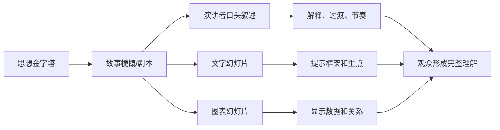
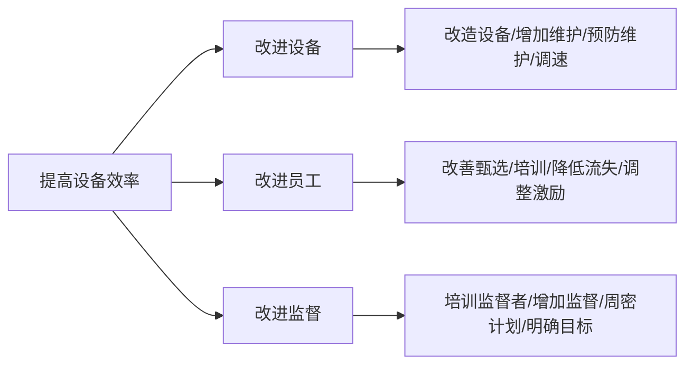

> 阅读范围：第11章“在PPT演示文稿中呈现金字塔”，包括“设计文字PPT幻灯片”“设计图表PPT幻灯片”“故事梗概”三个小节。
>
> 原文：《金字塔原理》第11章

## 本章定位：把思想金字塔转化为现场体验

书面报告允许读者停顿、回看和跳读；现场演示按演讲者控制的时间单向推进。观众还会受到会场、情绪、屏幕和演讲者表现的影响。因此，演示不能只是把报告段落复制到幻灯片。



本章的核心分工是：

- **演讲者**承担叙事、解释和现场互动；
- **文字页**提示框架和重要结论；
- **图表页**呈现文字难以传达的数据与关系；
- **故事板**确保所有页面按一个连贯故事推进。

---

## 第11章 在 PPT 演示文稿中呈现金字塔

### 一、为什么“报告搬上屏幕”会失败

报告的文字密度是为自行阅读设计的。投影后，观众必须同时：

1. 阅读屏幕；
2. 听演讲者；
3. 理解图形；
4. 记住前一页；
5. 形成判断。

若屏幕与演讲者同时输出不同长句，两个语言通道会争夺注意力。

### 二、什么是“视觉朗诵”

基恩·泽拉兹尼把逐字念文字页称为 **visual recitation**，即视觉朗诵：幻灯片只是演讲稿投影，既没有利用视觉关系，也没有发挥现场讲解价值。

### 三、供应链“指导原则”反例

原书展示一页包含七条长原则的商业幻灯片，涉及客户满意、面向未来、产品特性、财务与服务、职责分配、整合和分权。

问题不只是字多：

- 七项未进一步概括；
- 每项包含多个条件；
- 观众无法边听边读；
- 演讲者若换一种说法，会加剧冲突；
- 连续五六十页类似清单会使节奏单一。

### 四、现场演示为什么需要“作秀”

原书用“作秀”强调：演示还需要明星、剧本、情节、视觉元素、时机、节奏和悬念。这不是鼓励浮夸，而是承认信息接受受注意力和情绪影响。

严谨内容仍需：

- 清楚开场；
- 节奏变化；
- 重点停顿；
- 预判异议；
- 视觉聚焦；
- 适当互动。

### 五、三条基本规则

1. 文字页只保留最重要、已分组和概括的思想；
2. 图文结合，用图表传达数据、结构和关系；
3. 整套演示遵循经过思考的故事梗概和剧本。

### 六、文字页和图表页的职责

| 类型 | 主要职责 |
| --- | --- |
| 文字页 | 标明演示框架；强调关键结论、建议和行动 |
| 图表页 | 表达组成、比较、变化、分布和相关关系 |

一页可混合少量文字和图表，但仍应只有一个主导信息。

### 七、90% 图表、10% 文字怎样理解

原书给出理想比例 90/10，目的是反对文字堆积，而不是每套演示的强制配额。

比例取决于：

- 数据和关系是否适合视觉化；
- 演示是决策汇报、培训还是法规说明；
- 是否需要会后独立阅读；
- 受众专业程度；
- 时间与制作资源。

核心原则是：能通过视觉关系更快理解的内容，不要退回长段文字。

### 八、现场演示与讲义的冲突

现场页追求简洁，离开演讲者后信息不完整；讲义需要背景、过渡、证据和注释。试图让同一页同时承担两者，常得到密集幻灯片。

更好的做法：

- 幻灯片服务现场；
- 演讲者备注存讲稿；
- 会后另发简报、报告或带注释版本。

---

## 设计文字 PPT 幻灯片

### 一、演讲者才是信息主角

文字页是视觉辅助，不是提词器。观众应主要关注演讲者，屏幕负责固定结构和重点。

这要求口头叙述与屏幕信息**互补而非重复**：

- 屏幕说结论；
- 演讲者补背景、原因、例子和过渡；
- 备注保留完整措辞。

### 二、清楚“要说什么”和“要显示什么”

写完整讲稿有助于确认逻辑，但页面应提炼讲稿中的中心思想和少数关键支持。

### 三、杰克逊食品公司案例

讲稿说明：未交订单很高，PMG 业务若不能履约会丢失市场份额；生产问题、供应链不连贯、管理不善以及生产与供应链缺乏配合共同造成现状。

文字页只显示：

> 现状：尚未交付的订货相当多

- 生产存在问题；
- 供应链流程不合理；
- 生产/供应链缺乏配合。

### 四、为什么简化后仍然成立

页面保留上层结论和三项原因；市场份额后果、转折与解释由演讲者口头补足。观众先看清框架，再听证据。

### 五、简化的适用边界

若听众需要审阅精确措辞、法律条件或实验结果，不能只给口号。可在后续图表或附录页提供证据，或另发报告。

### 六、文字页最好只强调主要论点

图 11-3 展示由背景、冲突、中心思想、关键句和支持论点组成的演示序列。不是金字塔每个方框都必须单独成页，而是主要层级应有清楚落点。

### 七、规则一：每次只演示一个论点

#### 定义

一张页面应有一个可用完整句子表达的主要信息。其余元素只支持该信息。

#### 例外

目录、摘要、比较总览可以列一组论点，但应在后续分别展开。

#### 检查

若页面需要两个“所以”，可能包含两个主张，应拆页或确定上下关系。

### 八、规则二：使用完整陈述句

- 弱标题：“销售前景”；
- 强标题：“销售前景看好”。

完整陈述句限定观众应如何理解数据，避免各人从同一页得到不同结论。

### 九、陈述句不等于长句

标题可以简短，但应含判断：

- “费用持续下降”；
- “西部贡献一半利润”；
- “订单集中在月中发出”。

### 十、规则三：文字尽量简短

原书建议每页不超过六行或约三十个英文单词。对中文和现代宽屏而言，这应视为密度警报，而非机械上限。

判断标准：

- 最远或最小屏幕上的观众能否迅速读完；
- 读完是否仍能听演讲者；
- 每行是否只有一个短语；
- 是否可拆成连续页面。

### 十一、规则四：使用简单词汇和数字

技术术语、长复合词和精确到个位的数字会占用工作记忆。

- 页面可写“约 490 万美元”；
- 讲稿或附录保留 4,876,987 美元；
- 若个位精度影响决策，则不能四舍五入。

### 十二、数字简化的边界

必须说明：

- 单位；
- 时间范围；
- 是否约数；
- 基准或分母；
- 不确定性。

简洁不能造成误导。

### 十三、规则五：字号足够大

原书给出经验公式：

$$
\text{最小字高（英寸）}=\frac{\text{最远观看距离（英尺）}}{32}
$$

反向：

$$
\text{最远距离}=32\times\text{字高}
$$

它是物理字高与观看距离的经验关系，不等于 PowerPoint 中固定使用 32 pt。

### 十四、现代字号还受什么影响

- 屏幕尺寸与分辨率；
- 投影亮度和对比度；
- 字体字面大小；
- 远程会议窗口尺寸；
- 观众视力；
- 中文笔画密度。

最可靠的方法是在实际会场和远程窗口测试，而非只看编辑器。

### 十五、复杂性不能靠“故意看不清”表达

原书引用泽拉兹尼的反对意见：有必要展示的内容，就应让观众看清。把密集不可辨认当作复杂性证据，是逃避设计。

可改用：

- 分层展开；
- 局部放大；
- 总览加高亮；
- 动画路径；
- 附录详细图。

### 十六、规则六：保持趣味性

趣味性来自有意义的视觉变化：布局、留白、层级、颜色和关系图，而非装饰。

图 11-4 把“提高设备效率”分成改进设备、员工和监督，再展开具体措施。视觉位置直接表达结构，比长清单更易理解。

### 十七、图 11-4 的结构



### 十八、规则七：逐级展开

先显示中心，再显示主要分支，最后显示细节。好处：

- 控制观众此刻看什么；
- 避免提前阅读后文；
- 保持口头与视觉同步；
- 降低初始复杂度。

### 十九、逐级展开不是炫技动画

动画只应服务叙事顺序。应避免：

- 每个字飞入；
- 无意义转场；
- 速度不一致；
- 动画导致会后打印版缺信息；
- 远程平台播放失败。

### 二十、文字页的完整检查

1. 页面主张是什么？
2. 标题是否完整陈述？
3. 要点是否同类并支持标题？
4. 哪些话应由演讲者说？
5. 哪些证据应移到图表页？
6. 页面是否能在数秒内读完？

---

## 设计图表 PPT 幻灯片

### 一、图表解决什么问题

图表利用位置、长度、面积、方向和连接来表示大量数据与关系，使观众无需逐字处理。

适合表达：

- 组成；
- 比较；
- 变化；
- 分布；
- 相关性；
- 结构与流程。

### 二、图表为什么必须简单

现场观众无法像读报告那样仔细研究。复杂图表会把时间消耗在解码，而非讨论结论。

原书允许一两张随讲解逐步变简单的复杂图，但不应让整套演示充满复杂图。

### 三、图表设计的核心流程

1. 明确要回答的问题；
2. 先写答案；
3. 把答案作为消息型标题；
4. 选择最能表现关系的图表；
5. 删除不支持答案的元素；
6. 检查数据和视觉编码。

### 四、五类图表问题

图 11-5 至图 11-9 将问题分为：

1. 有哪些组成部分？
2. 数量怎样比较？
3. 有何变化或如何变化？
4. 各项如何分布？
5. 各项之间有什么相关性？

### 五、问题一：有哪些组成部分

适合：

- 组织图；
- 流程图；
- 简单组成图；
- 必要时使用饼图。

原书示例：地区组织组成简单；杰克逊食品公司有标准供应链。

### 六、组成图的边界

饼图只适合少量类别、总和明确的占比。类别多或差异小，应改用条形图。流程不能用饼图。

### 七、问题二：数量怎样比较

可分：

- 与总体比较；
- 项目之间比较；
- 随时间比较。

对应：

- 占比图；
- 条形图；
- 柱状图或折线图。

### 八、比较示例

- “西部地区占销售总额一半”：部分与总体；
- “罐头食品利润最低”：项目间比较；
- “费用每年下降，只有一年例外”：时间比较。

消息标题已经说明观众应看到什么。

### 九、问题三：有何变化/如何变化

原书示例：销售停滞而费用持续增加；竞争缩小差距。

适合折线图、斜率图、相邻柱形或瀑布图，选择取决于时间点数量和变化机制。

### 十、变化图的严格要求

- 时间轴连续且间隔真实；
- 基线不误导；
- 名义值与实际值区分；
- 异常年份解释；
- 不把短期波动误写为趋势。

### 十一、问题四：各项如何分布

原书示例：多数订单金额超过 1000 美元；大部分订单在月中发出。

适合直方图、箱线图、密度图或点图。

### 十二、分布为什么不能只看平均数

平均数会隐藏偏态、双峰、长尾和异常值。分布图回答“数据集中在哪里、范围如何、形状怎样”。

### 十三、问题五：各项有什么相关性

原书示例：费用增加似乎并非加班时间增加；公司大小与订单大小没有明显关系。

适合散点图或配对图。

### 十四、相关不等于因果

即使散点相关明显，也可能存在：

- 共同原因；
- 反向因果；
- 选择偏差；
- 时间趋势；
- 异常点驱动。

图表标题应避免把相关性写成未经证明的因果。

### 十五、图表标题必须传递信息

- 弱标题：“各地区利润份额”；
- 强标题：“西部地区贡献约一半利润”。

标题把观众注意力集中到作者要证明的数据关系，并减少不同背景观众的歧义。

### 十六、标题必须与图表一致

若标题说“费用持续下降”，图中有明显上涨年份，应在标题中写“除某年外持续下降”或解释异常。不能用标题强迫数据配合故事。

### 十七、图表类型选择对照

| 问题 | 常用图形 |
| --- | --- |
| 组成 | 组织图、流程图、堆叠条、少类别饼图 |
| 比较 | 条形图、点图、柱形图 |
| 变化 | 折线图、斜率图、瀑布图 |
| 分布 | 直方图、箱线图、密度图 |
| 相关 | 散点图、气泡图 |

图形只是候选，最终取决于数据和主张。

### 十八、图表页的信息层级

一页可包含：

1. 消息标题；
2. 主图；
3. 必要标注；
4. 数据口径、时间和来源；
5. 少量注释或下一步含义。

不应把所有原始数据表塞入主页面。

### 十九、可访问性与远程演示

- 不只用颜色区分类别；
- 保证对比度；
- 字号可读；
- 口头描述关键趋势；
- 远程共享时测试压缩和小窗口；
- 会后材料提供替代文字和数据表；
- 避免红绿作为唯一编码。

---

## 故事梗概

### 一、什么是故事梗概

**故事梗概/故事板**是在制作最终幻灯片前，把每张页面的主张、顺序、视觉形式和讲稿作用排列出来的中间设计物。

它连接：

$$
\text{思想金字塔}\rightarrow\text{时间序列演示}
$$

### 二、为什么不能直接打开 PPT 制作

直接设计页面会让人过早关注颜色、图标和排版，忽略：

- 受众疑问；
- 故事顺序；
- 页面主张；
- 重复与缺口；
- 图表数据需求。

故事板以低成本暴露结构问题。

### 三、步骤一：详细写出序言

按希望说出的顺序写背景、冲突、疑问和回答。作用：

- 防止遗漏；
- 检查当前仍在回答受众真实问题；
- 决定开场节奏；
- 识别需显示的少数信息。

最终页面不必包含全部序言文字。

### 四、步骤二：按金字塔顺序列页面

从上到下排列：

1. 序言要素；
2. 中心思想；
3. 关键句；
4. 关键句下的重要支持。

分析发生的顺序不一定是演示顺序。

### 五、步骤三：初步决定呈现形式

即使没有精确数据，也可标记：

- 文字页；
- 柱形图；
- 趋势图；
- 流程图；
- 组织图；
- 图片或示意图。

先知道要表达哪种关系，再补数据与设计。

### 六、步骤四：准备每页讲稿

讲稿应说明：

- 这一页为什么出现；
- 标题主张如何解释；
- 图表看哪里；
- 与前后页如何连接；
- 预期异议怎样处理。

### 七、步骤五：完成设计和绘图

在结构、页面主张和视觉形式稳定后，再制作高保真页面。这样可减少返工和装饰性设计。

### 八、步骤六：反复排练

原书强调“排练，排练，再排练”。排练用于验证：

- 时间是否超限；
- 页面切换是否自然；
- 口头与屏幕是否同步；
- 图表是否一眼可懂；
- 哪些页面多余；
- 可能问题如何回答；
- 技术和会场是否可靠。

### 九、最简单的纸面故事板

把白纸分成小区域，每格代表一页，写：

- 页面消息标题；
- 主要内容；
- 文字或图表类型；
- 必要数据；
- 讲稿提示。

纸面低保真能促使人移动、删除页面，而不会因已投入设计成本舍不得修改。

### 十、图 11-10：从金字塔入手

供应链案例的顶层是：

> 必须努力把供应链改造成具有竞争优势的重要服务部门。

关键句：

1. 采取直接措施，保持稳定可靠的客户服务；
2. 节约每个环节的供应链成本；
3. 培养长期改进所需的技能和经验；
4. 改造供应链，获得长期竞争优势。

### 十一、供应链案例的背景与冲突

- 背景：每年运营费用约 1200 万美元，占净销售收入约 14%，高于其他公司；未交订单和不履约增加；
- 冲突：虽已采取减费措施，但未解决根本问题，长期财政情况可能受影响；
- 疑问：怎样在保持客户服务的同时改善？

### 十二、故事板页面 1 至 5

1. 现状：成本高、服务低，生产、供应链流程和配合存在问题；
2. 过去改进不奏效：订单、小额订单、分销网络和预测问题；
3. 战略：把供应链改造成竞争优势来源；
4. 首先保持稳定供应链：服务、成本、技能；
5. 再建立持续改进计划：最快供应、创新和员工吸引力。

### 十三、故事板页面 6 至 18 的展开

- 页面 6：重点关注 A 类客户并修改订单管理，保持服务；
- 页面 7：50% 客户占 95% 订货金额，用图表支持聚焦；
- 页面 8：大量小额订单的分布；
- 页面 9：10% 产品占 60% 订货金额；
- 中间页面继续展开成本、流程和技能；
- 页面 18 回到“稳定可靠客户服务”的行动总结。

### 十四、为什么每页顶部都要写主张

页面停留时间短，消息标题同时提示演讲者和观众：

- 当前处于哪个分支；
- 这一页要得出什么；
- 图表应看哪个关系；
- 离开页面后应记住什么。

### 十五、故事板怎样检查金字塔

- 一项关键句是否需要多页支持；
- 支持页是否都属于该分支；
- 页面之间是否存在逻辑跳跃；
- 同一证据是否重复；
- 是否缺少中心回答或过渡；
- 图表是否真正证明标题。

### 十六、故事板不是把每个方框变成一页

页面数量取决于观众理解节奏：

- 一个复杂思想可能需要多页；
- 多个简单事实可合成一页；
- 某些低层证据只放附录；
- 不影响结论的分析过程可删除。

### 十七、排练中的页面删减标准

若一页：

- 没有独立主张；
- 不支持前后主线；
- 重复已有信息；
- 只用于展示作者做过工作；
- 解释成本高于信息价值；

应删除、合并或移入附录。

### 十八、“演示是参会者给予演讲者的恩惠”

这句话提醒：观众付出时间和注意力。演讲者有责任：

- 尊重时间；
- 提前排练；
- 让信息可见可懂；
- 不把整理工作转嫁给观众；
- 为讨论留下空间。

---

## 文字、图表与口头叙述的统一设计

| 信息 | 最适合载体 |
| --- | --- |
| 中心结论、关键句 | 消息型文字标题/短文字页 |
| 详细解释、转折、例子 | 演讲者口头叙述 |
| 数量比较、趋势、分布、相关 | 图表页 |
| 精确数据、方法、来源 | 注释、附录或讲义 |
| 完整论证和会后查阅 | 独立报告 |

每种载体只做自己擅长的事，演示才不会退化为“会读的报告”。

---

## 作者分析问题的完整思路

### 一、问题从哪里来

现场观众无法控制速度，注意力不稳定。把书面文字投影会造成阅读与听讲冲突。

### 二、难点在哪里

- 一页应保留多少信息；
- 演讲者与屏幕怎样分工；
- 数据应该用何种视觉关系；
- 多页如何保持故事连贯；
- 简洁与会后可读如何平衡；
- 动画怎样服务节奏而非装饰；
- 如何预判现场反应。

### 三、为什么演讲者是主角

现场价值来自解释、语气、节奏和互动。若屏幕已经包含所有内容，演讲者只剩朗读，会议失去必要性。

### 四、为什么文字页只保留主张

主张为口头叙述提供锚点，也让观众离开页面后仍记得结论。

### 五、为什么先问图表要回答什么

数据本身没有唯一图形。问题决定应突出组成、比较、变化、分布还是相关，也决定标题。

### 六、为什么消息标题关键

观众背景不同，会从同一图中关注不同数据。标题统一观察方向，并使页面成为论证而非数据展览。

### 七、为什么故事板先于设计

低保真阶段修改结构成本最低。先设计会形成沉没成本，并把注意力转向外观。

### 八、为什么排练不可替代

演示是时间性行为。只有完整走一遍，才能发现逻辑虽正确但节奏、过渡、技术或时长不成立。

### 九、方法为什么有效

它把信息按通道分工，把空间金字塔转换为时间故事，并通过标题和逐级展开控制观众注意。

### 十、方法的局限

1. 90/10 是经验偏好，不适合所有主题；
2. 六行、三十词和字号公式不能机械套用；
3. 复杂技术内容可能需要密集证据；
4. 远程会议的屏幕更小、互动更弱；
5. 动画可能因平台失败；
6. 观众可能需要会后独立材料；
7. 图表可能通过轴、面积和选择性数据误导；
8. 演示艺术不能替代事实与推理。

### 十一、现代补充方法

- **双版本交付**：现场简洁页 + 会后详细报告；
- **演讲者备注**：保存讲稿和来源；
- **消息型标题**：每页一句结论；
- **数据故事**：上下文、变化、影响、行动；
- **无障碍检查**：对比度、替代文本、口头描述；
- **远程预演**：小窗口、延迟、屏幕共享测试；
- **附录策略**：准备关键质疑的证据页；
- **计时彩排**：按段落设时间和删页阈值。

---

## 易混淆概念辨析

### 演示文稿与报告

- 演示文稿依赖现场讲解，按时间推进；
- 报告独立完整，允许回看和精读。

### 幻灯片与讲稿

幻灯片是视觉锚点，讲稿包含完整叙事。二者互补，不应完全相同。

### 简洁与信息缺失

简洁保留主张和必要支持；信息缺失则让主张无法理解或验证。证据可在后续页、备注、附录或报告中提供。

### 页面主题与页面主张

“销售前景”是主题；“销售前景看好”是主张。

### 图表与数据表

图表突出关系，数据表支持精确查值。现场主页面通常优先关系，附录可保留明细。

### 相关与因果

散点图显示共同变化，不自动证明一个变量导致另一个。

### 动画与逐级展开

逐级展开服务讲解顺序；装饰动画只增加刺激和失败风险。

### 故事梗概与金字塔

金字塔描述逻辑层级，故事梗概把层级转成页面时间序列。

### 一页一个论点与一页一个句子

一页可有多个支持元素，但只能有一个主导结论；不是只能写一句话。

### 视觉趣味与装饰

视觉趣味来自关系、节奏和清楚层级，不是随意图标、渐变或动画。

### 演示标题与章节标题

演示标题通常直接写本页结论；章节标题可承担导航，但也应尽量表达思想。

### 排练与背诵

排练验证逻辑、节奏和技术，不要求机械背稿。熟练后应保留现场适应能力。

---

## 综合示例：展示“客服响应时间过长”的改进方案

### 一、思想金字塔

> 应通过分流、知识库和排班调整，把首次响应时间从 12 小时降至 4 小时。

关键句：

1. 低复杂度请求应自动分流和自助解决；
2. 重复问题应由统一知识库加速处理；
3. 人员排班应匹配请求到达分布。

### 二、错误的文字页

```text
客服效率改进原则
1. 应考虑客户需求与成本……
2. 各种类型问题应采用不同流程……
3. 知识管理非常重要……
4. 人员安排应具有灵活性……
```

它没有量化 R1/R2，也没有明确三项行动如何产生结果。

### 三、故事板

1. “首次响应已从 6 小时恶化到 12 小时”；趋势图；
2. “重复问题占全部请求的 45%”；组成图；
3. “请求高峰与人员排班错开 3 小时”；双折线；
4. “三项措施可把响应时间降至 4 小时”；文字总览；
5. “自动分流优先处理低复杂度请求”；流程图；
6. “知识库覆盖前 20 类问题”；帕累托图；
7. “新排班匹配每日请求分布”；面积/折线图；
8. “四周试点验证时效、质量和成本”；行动页。

### 四、消息标题与图表问题

- 页面 1 回答“如何变化”；
- 页面 2 回答“有哪些组成部分”；
- 页面 3 回答“两个变量怎样比较”；
- 页面 6 回答“问题类别如何分布”。

### 五、口头与屏幕分工

屏幕显示结论和关系；演讲者解释：

- 指标定义；
- 数据来源；
- 客户影响；
- 方案假设；
- 风险与试点设计。

### 六、逐级展开

总览页先显示目标，再依次出现分流、知识库和排班三支。只有讲到对应分支时才显示细节，避免观众提前阅读。

### 七、会后材料

另发详细文档，包含：

- 原始数据；
- 模型公式；
- 实验设计；
- 成本测算；
- 风险清单；
- 指标口径。

这样现场简洁不以牺牲可审查性为代价。

---

## 常见误解与错误做法

### 误解一：把报告复制进 PPT 最稳妥

它只避免演讲者遗漏，却把阅读负担转嫁给观众。

### 误解二：演讲者应逐字念屏幕

观众会同时听读同一或不同措辞，降低理解。屏幕与口头应互补。

### 误解三：每页放一个主题就够了

主题不限定结论。应写完整消息标题。

### 误解四：六行和三十词是绝对标准

它们是密度警报。最终以真实观看条件和理解速度验证。

### 误解五：32 就是统一字号

原书公式涉及实际字高和观看距离，不是固定 32 pt。

### 误解六：不可读图能表现复杂性

复杂性应通过分层、放大和顺序解释，而非故意缩小。

### 误解七：动画越多越有趣

只有控制注意和解释关系的动画有价值。

### 误解八：图表比文字天然高级

不匹配问题的图表会误导。简单判断可能更适合文字页。

### 误解九：标题只需写指标名

“利润份额”让观众自行找结论；“西部贡献一半利润”直接传递消息。

### 误解十：相关图可以证明原因

相关性仍需因果设计和机制证据。

### 误解十一：金字塔每个方框都应变成一页

页面是叙事单位，不是机械结构单位。复杂思想可多页，低价值细节可删除。

### 误解十二：设计完成后再试讲一次即可

排练应参与设计，暴露时长、顺序、措辞和页面问题后继续迭代。

---

## 第十一章实践检查清单

### 演示定位

1. 受众是谁，现场要作出什么决定？
2. 演讲者、屏幕和会后材料分别承担什么？
3. 是否把报告文字直接搬上屏幕？
4. 是否需要现场版和讲义版两套材料？

### 文字幻灯片

5. 每页是否只有一个主导论点？
6. 标题是否为完整陈述句？
7. 要点是否同类并支持标题？
8. 页面能否在数秒内读完？
9. 是否使用简单词汇和适当约数？
10. 精度、单位和口径是否保留？
11. 实际会场和远程窗口是否可读？
12. 哪些文字应改为口头表达？
13. 哪些信息应改成图表？

### 图表幻灯片

14. 图表要回答哪一类问题？
15. 答案是否先写成消息标题？
16. 图形是否匹配组成、比较、变化、分布或相关？
17. 数据是否足以支持标题？
18. 轴、基线、面积和颜色是否误导？
19. 是否删除无关元素？
20. 来源、范围和时间是否清楚？
21. 相关性是否被误写成因果？
22. 图表是否兼顾色觉和远程小屏？

### 故事梗概

23. 序言是否完整回答受众问题？
24. 页面顺序是否从中心思想沿关键句展开？
25. 每页顶部是否写明主张？
26. 每页选择文字还是图表有明确理由吗？
27. 是否存在重复、跳跃或缺页？
28. 是否把每个金字塔方框机械变成一页？
29. 低价值分析是否移入附录？

### 讲稿与排练

30. 每页讲稿是否说明为何出现、看哪里、意味着什么？
31. 页面切换与口头叙述是否同步？
32. 动画是否服务解释顺序？
33. 总时长是否留有讨论空间？
34. 关键异议和证据页是否准备？
35. 技术、会场和远程共享是否测试？
36. 排练后删除了哪些页面？

### 最终质量

37. 演示是否尊重观众时间？
38. 观众离场后能否复述中心思想和关键句？
39. 简洁是否损害可审查性？
40. 视觉吸引是否服务事实和逻辑？

---

## 本章小结

第11章把金字塔从静态书面层级转换为现场演示：

1. 现场演示受时间、会场和注意力约束，不能把报告直接投影。
2. 逐字朗读密集文字页是“视觉朗诵”，没有发挥演讲者与视觉关系的价值。
3. 演讲者负责故事、解释和互动；文字页提示框架和重点；图表页表达数据关系。
4. 90% 图表、10% 文字是反对文字堆积的经验偏好，不是固定配额。
5. 现场简洁页与独立讲义目标不同，最好通过备注或双版本交付解决。
6. 杰克逊食品案例把完整讲稿压缩为“未交订单多”及生产、供应链和配合三项原因。
7. 文字页应一次只表达一个主导论点，摘要页可以先列一组后逐项展开。
8. 页面标题应使用完整陈述句，如“销售前景看好”，而不是“销售前景”。
9. 六行、三十词和字号公式是可读性警报，应以实际会场、字体和设备测试为准。
10. 数字可适度简化，但不能丢失单位、范围、精度和决策意义。
11. 复杂性应通过分层、放大和逐级展开说明，不能故意制作不可读页面。
12. 趣味性来自结构、布局、节奏和关系，而不是无意义装饰。
13. 逐级展开可同步口头与视觉，但动画必须服务注意力控制。
14. 图表应回答组成、比较、变化、分布或相关五类问题之一。
15. 先明确问题和答案，再把答案写成标题，最后选择图形。
16. 消息标题如“西部贡献一半利润”比“地区利润份额”更能统一观众视角。
17. 变化图需诚实处理基线和异常，分布图避免只看平均数，相关图不能替代因果证据。
18. 故事梗概把空间金字塔转成按时间推进的页面序列，是最终设计前的低成本中间物。
19. 六步流程是详细写序言、列故事板、选形式、写讲稿、完成设计、反复排练。
20. 供应链案例从现状和失败改进出发，提出保持服务、节约成本、培养能力和建立竞争优势的主线。
21. 每页顶部主张帮助观众定位当前分支，并指示应从图表看出什么。
22. 一项复杂思想可用多页，多个简单事实可合页，低层证据可进附录；页面不是金字塔方框的机械复制。
23. 排练用于检验逻辑、节奏、时长、视觉和技术，是设计过程的一部分而非最后仪式。
24. 演示的最终责任是尊重观众付出的时间和注意力，让他们既容易理解，又能对关键事实和推理进行审查。

本章最核心的实践原则是：**先用金字塔确定要表达的思想，再用故事板安排观众按什么顺序理解；屏幕只显示当下最重要的主张和视觉关系，解释与过渡交给演讲者，精确证据交给图表、附录或报告，并通过反复排练验证整套体验。**
