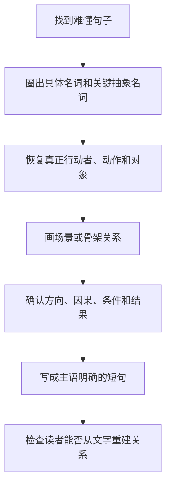
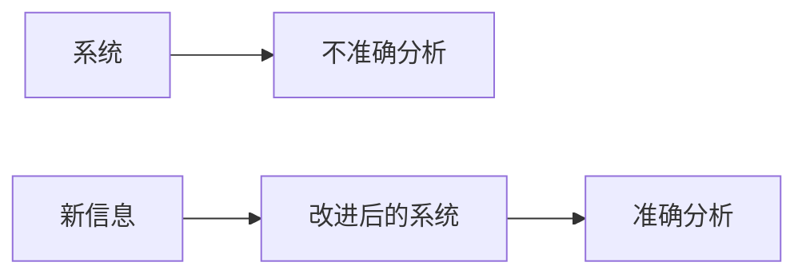
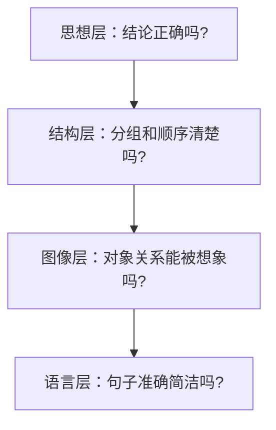
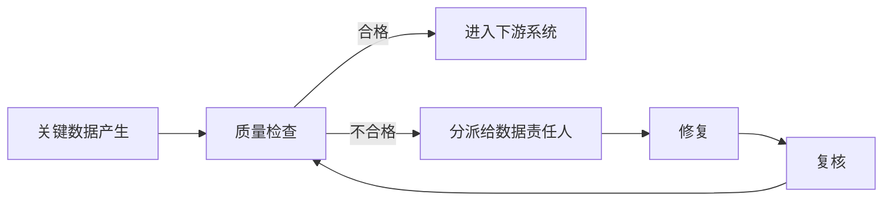

> 阅读范围：第12章“在字里行间呈现金字塔”，包括“画脑图（在大脑中画图像）”“把图像复制成文字”两个小节。
>
> 原文：《金字塔原理》第12章

## 本章定位：把正确结构转换成读者能“看见”的句子

前十一章主要解决思想选择、分组、概括、问题分析及页面呈现。第12章处理最后一公里：已经知道要说什么、按什么顺序说，怎样写成清楚、生动、容易记忆的文字？

作者提出一条转换链：


核心不是追求文学修辞，而是让句子中的对象、动作、方向和因果关系可被重建。若作者自己无法想象句子在说什么，读者通常也无法理解。

---

## 第12章 在字里行间呈现金字塔

### 一、清晰表达的两个阶段

作者把清晰表达分为：

1. 决定要说明的思想或证明的论点；
2. 用文字呈现这些思想。

金字塔解决第一阶段，视觉化方法帮助第二阶段。二者不可替代：漂亮句子不能修复错误结构，正确结构也不会自动产生清楚句子。

### 二、为什么有好思想仍会写出坏文章

常见问题包括：

- 句子过长；
- 抽象名词堆叠；
- 被动结构隐藏行动者；
- 专业术语没有必要；
- 修饰链过长；
- 对象之间的关系不明确。

口头解释时，人可以借助手势、停顿、追问和即时改写；书面文字失去这些纠错渠道，所以模糊关系更容易暴露。

### 三、专业术语与行话堆砌的区别

专业交流有时必须使用技术术语，因为术语能精确压缩共享概念。问题不在“专业”，而在：

- 术语没有定义；
- 可用普通词准确表达，却故意复杂化；
- 名词化掩盖主体与动作；
- 作者借晦涩制造权威感。

技术准确与文字清楚并不矛盾。

### 四、为什么图像能帮助表达

图像把多个事实同时组织为空间或关系整体。线性文字逐词进入工作记忆，图像则可把多项压缩为一个组块。

图 12-1 中，三条横杠的长度关系一眼可见：

$$
A>B,\quad B>C\Rightarrow A>C
$$

若只听三个句子，读者要依次保持并推导；图像让关系同时出现。

### 五、“通过图像思考”的严格边界

原书称人通过图像而非文字进行理性思维，这是一种强调视觉表征价值的强表述，不应理解为所有人、所有任务都只靠视觉图像。

人也会使用：

- 语言表征；
- 动作与空间表征；
- 数学符号；
- 听觉模式；
- 抽象命题。

本章可操作的结论是：**当文字关系模糊时，尝试将其转换为可观察的对象和关系，往往能暴露问题。**

### 六、图像压缩与“数字 7”

作者沿用早期工作记忆容量观点，说明图像能把大量细节压缩为少数抽象概念。现代研究对具体容量有不同估计，因此不应机械要求“一次七八个概念”。应保留的原则是：减少同时处理的孤立元素，建立有意义组块。

### 七、从“看见”开始遣词造句

这里的“看见”可以是：

- 人物、物体和场景；
- 箭头、容器和边界；
- 流程与状态变化；
- 高低、前后、包含和对比；
- 因果、反馈和输入输出。

不要求逼真，更不要求真的画出来。只要关系足够明确，可以转成简单句。

### 八、本章方法的基本工作流



---

## 画脑图（在大脑中画图像）

### 一、什么是“记忆图像”

#### 定义

**记忆图像**是读者在理解连续文字时，对人物、对象、空间、动作和状态形成的综合心理表征。它不必像照片，也不要求不同读者完全一致。

### 二、记忆图像要解决什么问题

逐词记忆容易迅速衰退。若词语被整合成场景，场景可作为回忆线索，让读者重建大意和细节关系。

### 三、《瓦尔登湖》案例

梭罗段落依次提供：

- 1845 年 3 月末；
- 借来斧头；
- 走入瓦尔登湖畔森林；
- 砍伐高耸小白松建屋；
- 工作地点在山坡；
- 透过松林看见湖与开阔地；
- 湖冰未完全融化，发黑并渗水。

### 四、图像怎样逐步形成


每句话为同一场景增加信息，而不是迫使读者重建完全不同的抽象框架。

### 五、为什么场景容易记忆

场景提供多重提取线索：

- 时间提示季节；
- 斧头提示动作；
- 森林提示白松；
- 山坡提示视角；
- 湖面提示冰的状态。

回忆时不必逐字复述，也能沿场景关系恢复内容。

### 六、记忆图像不等于精确记忆

作者也提醒：情感偏好会让人遗漏或添加细节。图像可能提高意义记忆，却不保证逐字准确。

因此，合同、数字、法规和实验参数仍需查阅原文，不应依靠心理图像复原。

### 七、何谓“理解”

本章的操作性标准是：读者能否形成某种稳定表征，并说明对象间关系。它可以是场景，也可以是抽象骨架。

这比“读起来流畅”更严格。流畅句子也可能没有明确含义。

### 八、抽象内容为什么需要骨架图

利率、风险、收入回流等概念没有具体场景，但具有：

- 高低关系；
- 时间变化；
- 流入流出；
- 条件与结果。

这些可用线条、框、箭头表示。

### 九、什么是骨架图

**骨架图**是只保留论述中关键对象和关系的简化视觉模型，常用圆、框、直线、曲线和箭头表示结构、方向或变化。

它不追求外观逼真，只追求关系正确。

### 十、固定与浮动贷款利率案例

原文讨论国际重建与发展银行固定利率是否给借款人增加费用：

1. 固定利率中包含风险折价；
2. 若风险被高估，银行获得超额收入；
3. 银行可在以后降低贷款利率，把收入回流给借款人；
4. 只有银行近乎永久、系统性高估风险并保留超额收入，固定利率才整体增加借款人成本；
5. 这种情况被认为不太可能。

### 十一、图 12-2 的骨架关系

图中高风险折价位于利率波动之上，右侧箭头表示以后调低贷款利率，将超额收入返还。

可抽象为：

$$
\text{固定利率}=\text{基础成本}+\text{风险折价}
$$

若实际风险低于估计：

$$
\text{超额收入}=\text{风险折价}-\text{实际风险成本}
$$

随后降息回流，则借款人的跨期净额外成本可能降低。

### 十二、利率论证依赖的假设

- 银行确实把超额收入返还；
- 回流时间和金额足以抵消早期成本；
- 借款人群体前后一致或分配公平；
- 不考虑时间价值、违约和提前还款差异；
- 风险估计没有长期系统偏差；
- 降息机制可执行。

骨架图让条件关系可见，但不证明这些假设为真。

### 十三、骨架图如何帮助发现缺口

一旦画出“风险折价 → 超额收入 → 降息回流”，就会自然追问：

- 回流给谁？
- 何时回流？
- 是否含利息？
- 若借款人已退出怎么办？

视觉化不仅解释已有推理，也暴露遗漏变量。

### 十四、具象图像与骨架图对比

| 维度 | 具象记忆图像 | 抽象骨架图 |
| --- | --- | --- |
| 适合内容 | 人物、地点、动作、物体 | 因果、条件、流程、比较 |
| 形式 | 场景化 | 几何化、关系化 |
| 主要作用 | 沉浸、记忆、空间定位 | 澄清结构和推理 |
| 风险 | 添加主观细节 | 过度简化机制 |

### 十五、“画脑图”与思维导图的区别

译注把它称为画脑图或思维导图，但本章方法不限于中心辐射式 mind map。它更接近：

- 心理意象；
- 简图；
- 因果图；
- 流程图；
- 空间模型。

不要为了使用工具而强行画固定模板。

### 十六、个体差异与适用边界

有些人视觉意象鲜明，有些人很弱，甚至难以主动形成视觉画面。后者可以使用：

- 纸面草图；
- 表格；
- 对象—关系清单；
- 流程文字；
- 形式逻辑；
- 实物或示例。

方法目标是显式化关系，不是测试想象能力。

---

## 把图像复制成文字

### 一、什么是“复制”

不是把图逐项描述成冗长文字，而是把图中的核心对象、动作和关系转换成最短且准确的句子。

### 二、从晦涩句子恢复图像的步骤

1. 找出可指认的名词；
2. 判断哪些抽象名词其实是动作；
3. 找到真正行动者；
4. 画出对象位置或箭头；
5. 确认条件、动作和结果；
6. 用主语—动词—宾语重写；
7. 把必要条件和限定另写清楚。

### 三、为什么先找名词

名词通常代表图中的节点：销售人员、商店、环境、计划、系统、信息、分析。关系则藏在动词、介词和名词化表达中。

但并非所有名词都应保留。“改进、配置、调整、需要”等抽象名词常应还原为动词。

### 四、案例一：现场销售人员配置

原句大意是提高现场销售人员配置的成本效益，以反映交易环境变化后重新定义销售任务的需要。

### 五、提取对象

- 销售人员；
- 商店；
- 新交易环境。

图 12-3 表示：销售人员与商店处于新环境中，重点是重新安排两者关系。

### 六、重写结果

> 我们必须重新部署销售人员，以适应新的交易环境。

如果需要更精确，还应补充：

- 哪些人员；
- 部署到哪些商店或渠道；
- 成本效益标准；
- 环境发生了什么变化。

### 七、为什么重写更清楚

- “我们”恢复行动主体；
- “重新部署”替代“提高配置成本效益”等名词链；
- “销售人员”成为对象；
- “适应新环境”保留目的。

### 八、案例二：应变计划

原句包含可供选择的初始计划、预先计划好的调整、应变计划、优先顺序和可支配费用，读者难以判断谁对谁做什么。

### 九、图 12-4 的关系

```text
可供选择的初始计划
→ 预先计划好的调整
→ 应变计划中的削减优先顺序
```

### 十、重写结果

> 如果计划需要调整，应预先列出各项活动的削减顺序。

该句恢复条件—行动结构：

$$
\text{若需调整}\rightarrow\text{按预定优先级削减活动}
$$

### 十一、应变计划重写的边界

原文语义本身不够确定，重写只能是最合理解释，不能冒充作者原意。必要时应向作者确认：

- 调整的是预算、活动还是方案？
- 优先级由谁确定？
- 哪些支出可裁减？

视觉化会暴露歧义，但不能凭空消除歧义。

### 十二、案例三：现金流分析系统

原句说准确现金流分析对现有系统提出高要求，系统无法满足，可结合预测时未充分考虑的信息改进。

### 十三、提取对象

- 新信息；
- 系统；
- 不准确的分析；
- 准确的现金流分析。

### 十四、图 12-5 的关系



### 十五、重写结果

> 如果输入预测中遗漏的关键信息，系统就能生成更准确的现金流分析。

该版本明确：输入是什么、谁处理、输出怎样变化。

### 十六、现金流重写的假设

- 不准确主要由输入缺失造成；
- 系统模型能够利用新信息；
- 新信息可靠；
- 其他算法、口径和数据质量问题不重要。

若这些未验证，应使用条件语气，而非确定结论。

### 十七、三例的共同重写模式

| 原问题 | 隐藏关系 | 清晰句式 |
| --- | --- | --- |
| 名词堆叠 | 主体采取行动 | 谁做什么 |
| 多层修饰 | 条件决定动作 | 如果 X，就做 Y |
| 抽象系统描述 | 输入改变输出 | 输入 X，使系统产生 Y |

### 十八、名词化为什么使句子晦涩

名词化把动作变成事物：

- “人员配置的改进”代替“重新部署人员”；
- “进行调整”代替“削减活动”；
- “准确性的改善”代替“系统生成更准确分析”。

结果是行动者和因果关系被隐藏。

名词化在定义概念时有价值，但连续堆叠会增加解析成本。

### 十九、简单句不等于浅薄

复杂思想可以拆成多个关系明确的短句：

1. 先陈述核心因果；
2. 再说明条件；
3. 再补证据和边界。

清楚与严谨可以同时存在。

### 二十、怎样检查读者能否重建图像

让读者或自己回答：

- 有哪些对象？
- 谁采取行动？
- 什么先发生？
- 什么导致什么？
- 哪个对象包含或影响另一个？
- 最终状态是什么？

如果答案不唯一，句子仍需修改或补充。

### 二十一、从图像到段落

一个段落可围绕一幅稳定图像展开：

1. 主题句说明整体关系；
2. 后续句按空间、时间或因果顺序增加细节；
3. 结尾说明含义或结果。

不要每句切换到全新视角而不提供过渡。

### 二十二、司令官与狭窄关口的比喻

威廉·明托把写作比作司令官让千军万马逐个通过狭窄关口，读者在另一边重新编队。

比喻揭示：

- 思想可同时存在；
- 文字只能线性输出；
- 作者决定通过顺序；
- 读者负责重建结构；
- 糟糕排序会让部队在另一端混乱。

### 二十三、作者对读者的责任

作者应提前完成：

- 分组；
- 排序；
- 概括；
- 关系显式化；
- 措辞简化。

不能把重建混乱结构的劳动转嫁给读者。

---

## 从思想到文字的统一方法

### 一、四层检查



任何一层失败都会影响理解。

### 二、适合视觉化的关系

- 包含：A 由 B、C 构成；
- 方向：A 流向 B；
- 因果：A 导致 B；
- 条件：若 A，则 B；
- 比较：A 大于 B；
- 变化：A 从低到高；
- 循环：A 影响 B，B 反馈 A；
- 空间：A 位于 B 内或旁边。

### 三、视觉化后仍需语言验证

图像可能隐藏：

- 时间范围；
- 概率；
- 例外；
- 定义；
- 证据来源；
- 规范判断。

这些必须在文字中补回。

---

## 作者分析问题的完整思路

### 一、问题从哪里来

作者已经知道观点和顺序，却常用抽象名词和术语把关系隐藏，导致读者无法形成稳定表征。

### 二、难点在哪里

- 线性文字要表达同时关系；
- 抽象概念没有天然场景；
- 名词化隐藏动作；
- 心理图像因人而异；
- 图像可能过度简化；
- 作者未必知道原句真实含义；
- 清楚与技术精确需要兼顾。

### 三、为什么从图像入手

图像迫使作者指定对象、位置、方向和作用，不能躲在抽象词后面。

### 四、为什么先找名词

名词提供关系节点；动词和介词提供边。找出二者即可恢复句子骨架。

### 五、为什么允许骨架而非逼真图像

商务论述主要关心关系，而非视觉细节。框和箭头更适合因果、流程与条件。

### 六、为什么图像帮助记忆

它把多个词整合为有组织的组块，并提供空间和动作线索。但记忆仍可能受偏好影响。

### 七、为什么重写强调主体和动词

明确主体与动作能恢复责任和因果，使读者知道谁改变什么、为了什么。

### 八、方法为什么有效

它将“这句话感觉难懂”转为可检查问题：

- 节点是什么？
- 关系是什么？
- 谁在行动？
- 输入和输出是什么？
- 条件与结果是什么？

### 九、方法的局限

1. 并非所有人都有鲜明视觉意象；
2. 图像不适合表达全部概率和限定；
3. 复杂系统可能需要多图或数学模型；
4. 草图可能诱发错误因果；
5. 技术术语有时不可替代；
6. 简化可能丢失法律或科学精度；
7. 记忆图像可能添加原文没有的细节；
8. 原意不明时必须向作者确认。

### 十、补充工具

- **主语—动词—宾语检查**：恢复行动骨架；
- **概念图**：表达多对多关系；
- **因果图**：检查方向与反馈；
- **流程图/状态机**：表达步骤和状态；
- **数据流图**：表达输入、处理和输出；
- **实体关系图**：表达对象关系；
- **具体例子**：为抽象概念提供实例；
- **读者复述测试**：验证是否能重建关系；
- **可读性编辑**：缩短句子并减少名词化。

---

## 易混淆概念辨析

### 心理图像与插图

心理图像存在于理解过程中；插图是外部视觉材料。没有插图，文字也可形成图像。

### 记忆图像与逐字记忆

记忆图像保留意义和关系，不保证精确措辞、数字或细节。

### 骨架图与真实模型

骨架图只保留当前论点所需关系；真实模型可能包含更多变量、概率和反馈。

### 画脑图与思维导图

本章的画脑图是广义视觉化，不限于中心辐射式思维导图。

### 抽象与模糊

抽象保留明确关系并省略细节；模糊则连关系都无法确定。

### 专业术语与行话

术语精确压缩共享知识；行话可能只是制造复杂感。判断标准是必要性和定义。

### 名词与名词化

名词代表对象；名词化把动作包装成抽象事物，可能隐藏行动者。

### 简单句与简单思想

语言简单不意味着思想浅薄。复杂论证可由关系清楚的简单句组成。

### 图像相似与逻辑正确

能画出来不代表因果成立。图像只是显式表达假设，仍需证据。

### 视觉化与可访问性

视障读者可能无法使用视觉图，因此文字本身必须完整；外部图应配替代说明。

---

## 综合示例：改写一段系统治理文字

### 一、原句

> 通过对跨部门数据治理机制的持续优化和责任体系的协同强化，实现对关键数据质量风险的前置化识别与闭环管理能力提升。

### 二、找名词

- 部门；
- 数据；
- 责任人；
- 质量风险；
- 识别；
- 处理闭环。

### 三、还原动作

- 为关键数据指定责任人；
- 在数据进入下游前检查质量；
- 发现问题后分派、修复和验证；
- 跨部门共享处理状态。

### 四、画骨架



### 五、重写

> 我们将为每类关键数据指定责任人，并在数据进入下游系统前检查质量。发现问题后，系统会自动分派责任人修复并复核，直到数据合格。

### 六、为何更清楚

- 主体明确；
- 四个动作按时间排列；
- “闭环”被展开为分派、修复、复核；
- “前置化”被改为“进入下游前”；
- 读者可以画出流程并检查遗漏。

### 七、仍需补充的精度

- 哪些是关键数据；
- 质量标准；
- 责任时限；
- 自动分派规则；
- 复核人；
- 异常升级机制。

清晰改写暴露这些待定义项，而不是把它们藏在术语中。

---

## 常见误解与错误做法

### 误解一：结构正确后语言自然会清楚

结构只决定思想关系，句子仍可能因名词化和修饰链而晦涩。

### 误解二：专业文章越难懂越权威

必要术语可以精确，故意晦涩不会增加结论可靠性。

### 误解三：每个句子都必须形成逼真画面

抽象论述只需形成骨架关系，不必成为照片式场景。

### 误解四：所有人都能在脑中看到同一图像

心理表征有个体差异。关键是关系可复述，而非画面一致。

### 误解五：图像能证明结论

图像表达假设，不替代事实、数学和因果证据。

### 误解六：只要找到名词就能重写

还要恢复行动者、动词、条件和结果，并核实原意。

### 误解七：删掉所有抽象名词就是好文风

抽象名词对概括和专业定义有价值；应删除的是不必要堆叠。

### 误解八：短句一定优于长句

短句关系不明也会碎片化。句长应服从逻辑完整与可处理性。

### 误解九：图像记忆等于事实记忆

图像可能遗漏和增添细节，精确内容仍需原始记录。

### 误解十：不擅长视觉想象就无法使用本章方法

可用纸面框图、表格、对象关系清单和流程文字替代心理成像。

---

## 第十二章实践检查清单

### 检查思想与结构

1. 句子要表达的中心思想是什么？
2. 它属于金字塔哪个层级？
3. 与前后句是什么关系？
4. 是否在用语言问题掩盖思想问题？

### 建立图像或骨架

5. 有哪些可指认对象？
6. 真正行动者是谁？
7. 动作是什么？
8. 对象之间是包含、方向、因果、条件还是比较？
9. 能否用框、线和箭头表示？
10. 需要具象场景还是抽象骨架？
11. 图像是否遗漏时间、概率或约束？

### 重写句子

12. 能否采用主语—动词—宾语？
13. 哪些名词化应恢复为动词？
14. 哪些修饰可以拆成独立条件？
15. 是否明确输入、处理和输出？
16. 是否明确“如果—那么”关系？
17. 技术术语是否必要并已定义？
18. 简化后是否保留精确含义？

### 验证读者理解

19. 读者能否复述有哪些对象？
20. 能否说明谁影响谁？
21. 能否按顺序重建过程？
22. 是否存在多种合理解释？
23. 图像会不会诱导错误因果？
24. 精确数字和条件是否可查？

### 检查段落

25. 段落是否围绕同一稳定图像或骨架？
26. 细节是否按空间、时间或因果顺序加入？
27. 是否频繁切换视角而无过渡？
28. 主题句是否说明整体关系？
29. 结尾是否说明图像的意义？

### 适用边界

30. 是否需要数学模型而非简图？
31. 是否涉及法律或科学精度，不能过度简化？
32. 原意不清时是否向作者确认？
33. 是否为视觉材料提供文字替代？
34. 对视觉意象较弱的读者是否仍可理解？

---

## 本章小结

第12章完成了从思想金字塔到清楚语句的最后转换：

1. 清晰写作先确定思想和顺序，再选择准确文字；两个阶段缺一不可。
2. 好思想仍可能被长句、术语、名词化和多层修饰写得晦涩。
3. 技术术语有精确价值，但不必要的行话堆砌只是文风选择，不是专业要求。
4. 图像能把多个事实压缩为同时可见的关系，降低线性文字的处理负担。
5. “通过图像思考”应视为实用策略，而非所有认知只依靠视觉的绝对定律。
6. “看见”可以是场景，也可以是框、箭头、流程、比较和输入输出。
7. 《瓦尔登湖》案例说明，时间、人物、动作和空间细节会逐步形成记忆图像。
8. 记忆图像帮助恢复意义，却不保证逐字、数字和事实细节准确。
9. 抽象论述可用骨架图表示关键对象与关系，无需逼真画面。
10. 固定贷款利率案例把风险折价、超额收入和后续降息回流表示为线条与箭头。
11. 骨架图使论证条件可见，也暴露回流对象、时间价值和公平分配等缺口。
12. 本章“画脑图”是广义心理意象和关系简图，不等于固定中心辐射式思维导图。
13. 从晦涩文字恢复图像时，先找名词节点，再恢复行动者、动作、条件和结果。
14. 销售人员案例从抽象配置语言还原为“重新部署销售人员以适应新交易环境”。
15. 应变计划案例把三个名词链还原为“若需调整，预先列出活动削减顺序”。
16. 现金流案例把系统、新信息和分析结果还原为清楚的输入—处理—输出关系。
17. 视觉化能暴露原句歧义，但原意不明时必须确认，不能把推测冒充作者结论。
18. 名词化会隐藏动作和责任，清楚重写通常恢复主语—动词—宾语。
19. 简单语言不等于简单思想；复杂论证可以由关系明确的短句组成。
20. 段落最好围绕一个稳定场景或骨架，按空间、时间或因果顺序增加细节。
21. 写作像让大军逐个通过狭窄关口，作者有责任提前安排顺序，让读者能在另一端重建结构。
22. 视觉图像不能证明事实与因果，仍需补回概率、例外、证据和专业精度。
23. 对视觉想象较弱的人，可以使用纸面草图、表格、流程和对象关系清单，方法目标是显式化关系。

本章最核心的实践原则是：**遇到晦涩句子时，先不要继续润色抽象词，而要问“这里有哪些对象、谁在做什么、什么导致什么”；把答案画成场景或骨架，再用最简单而准确的主语、动词和宾语写出来，使读者能够从文字重建同一关系。**
