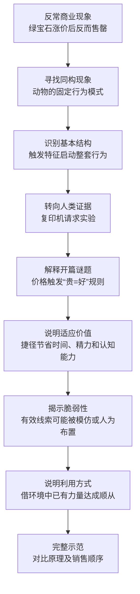
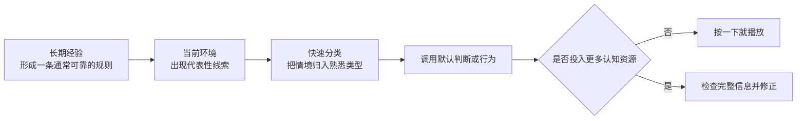
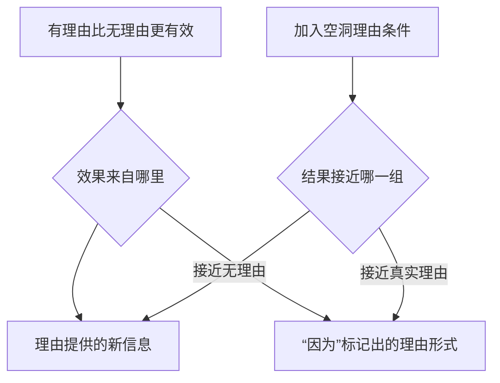
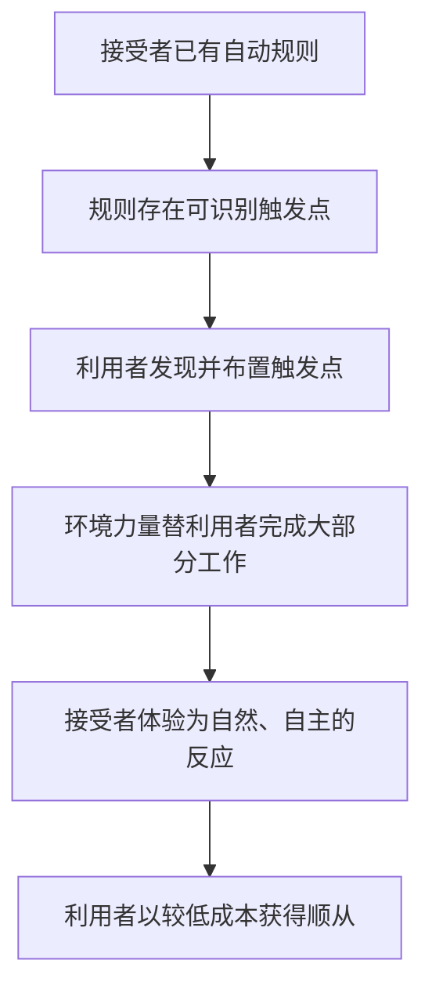
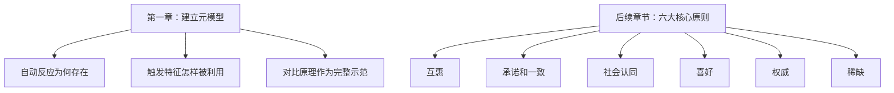
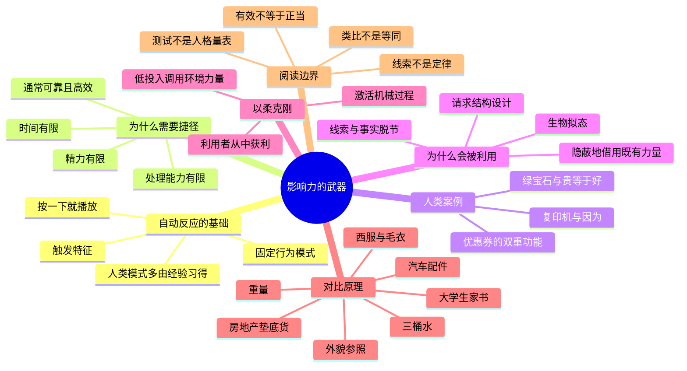
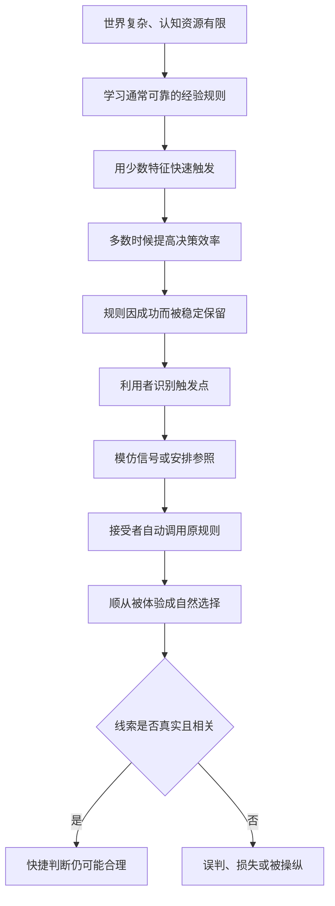

> **书名**：《影响力（珍藏版）》 
> **作者**：罗伯特·B. 西奥迪尼（Robert B. Cialdini） 
> **阅读范围**：第1章“影响力的武器” 
> **原文章节顺序**：开篇绿宝石案例 → “按一下就播放” → “渔利的奸商” → “以柔克刚” → 影响力水平测试 
> **阅读目标**：理解人为什么需要自动反应和判断捷径，这些机制怎样被触发、利用和隐藏；再以知觉对比原理为完整样例，掌握识别影响力武器的一般方法。

---

## 0. 导读：第一章在全书中承担什么任务

引言已经说明全书将讨论互惠、承诺和一致、社会认同、喜好、权威、稀缺六大原则。第一章尚未逐项讲解它们，而是先建立一套更底层的解释框架：**为什么某个很小的线索，能够调动一股远大于线索本身的行为力量？**

作者按以下路径回答：

本章的核心命题不是“人很愚蠢”，而是：

> 面对复杂环境，人必须依赖通常可靠的触发特征和判断捷径；正因为这些机制通常有效，它们才会被稳定保留，也才值得被顺从专家识别和利用。

这形成一组贯穿全章的张力：

$$
\text{高效率} \longleftrightarrow \text{偶尔误判},
$$

$$
\text{通常可靠的线索} \longleftrightarrow \text{线索可被伪造或操纵}.
$$

原书给出了“贵=好”这样的经验公式，但没有建立可计算的说服算法。下文出现的概率式、差值和决策模型均是笔记的解释性整理，不是原书报告的数学模型；它们用于还原推理，不用于机械预测个人行为。

### 0.1 章首引语为什么重要

章首引用爱因斯坦的大意是：凡事应尽可能简单，但不能简单过头。它提前概括了全章张力：判断捷径把复杂世界压缩到少数关键特征，是必要的“简单”；若把线索当成绝对真理，忽略它与真实对象已经脱节，就成了“过度简单”。

因此，本章不是反对简化，而是在寻找简化的合理边界：

$$
{\text{有效简化}}=\text{降低认知成本}+\text{保留足够的有效信息}.
$$

---

## 1. 开篇谜题：绿宝石为什么涨价后反而卖光

### 1.1 事情经过

作者的一位朋友在亚利桑那州经营印度珠宝店。旅游旺季客流充足，一批绿宝石首饰质量与定价也相称，却始终卖不出去。她尝试了两种常规办法：

1. 把首饰移到更显眼的位置，增加注意；
2. 要求销售人员积极推销，增加主动介绍。

两种办法都没有奏效。临时外出采购前，她给售货员留下一张潦草便条，本想把价格乘以 $1/2$，即半价清仓。售货员却把它看成乘以 $2$。结果，商品没有降价，反而以原价两倍的价格全部售出。

### 1.2 为什么这个结果构成真正的问题

按最直接的需求规律，商品自身不变而价格上升，购买吸引力通常应当下降：

$$
P(\text{购买}\mid \text{价格上升}) \downarrow.
$$

绿宝石案例却出现了相反结果：

$$
\text{商品不变}+\text{价格翻倍}
\longrightarrow \text{销量大增}.
$$

作者要解释的并不是“为什么昂贵珠宝有人买”，而是一个更严格的反事实问题：**同一批首饰只改变价格标签，为什么顾客对质量和价值的判断也随之改变？**

### 1.3 常规解释为什么不够

几个表面答案无法完整解释结果：

- **位置更显眼**：此前已经试过，未带来销量变化；
- **销售人员更努力**：此前也试过，仍未成功；
- **商品突然变好**：商品本身没有改变；
- **顾客突然更富裕**：案例没有显示客群在几天内发生这种变化；
- **低价刺激需求**：实际发生的是涨价，不是降价。

因此，控制行为的变量很可能不是商品的客观属性，而是价格在顾客判断中承担的**信息功能**。作者暂时不直接宣布答案，而是转向动物行为学，先建立“一个局部特征触发一整套反应”的一般模型。

### 1.4 不能从个案直接推出什么

绿宝石故事是问题入口，不是独立的因果实验。它不能单独证明：

- 所有商品涨价都会更好卖；
- 顾客永远把高价理解为高质量；
- 此次售罄完全没有受到客流、销售表达等其他因素影响；
- 高价策略长期一定提升利润或信誉。

作者后面必须给出机制、实验类比和适用条件，才能把“奇闻”变成可解释的现象。

---

## 2. 动物行为学背景：固定行为模式与触发特征

### 2.1 为什么从人类购物跳到动物行为

这个转折看似很远，实际是作者的重要分析方法：当复杂的人类行为难以看清时，先寻找一个结构更简单、触发关系更明显的系统。动物行为案例不是要证明人与火鸡完全相同，而是帮助分离三个部件：

1. 一套相对稳定的行为程序；
2. 一个能启动程序的局部线索；
3. 正常环境中线索与目标之间的可靠关系。

只要先看清这三个部件，再回到人类购物和请求场景，就能问：人类是否也会用局部信息启动较为自动的反应？

### 2.2 什么是固定行为模式

**固定行为模式（fixed-action pattern）**是动物行为学中一种高度规律的行为序列。它通常具有以下特点：

- 一旦启动，多个动作会按大致相同的方式和顺序展开；
- 整套行为可以相当复杂，例如求偶、护巢、育幼或领地防御；
- 行为不必在每一步都重新分析环境；
- 启动往往依赖一个有限而显著的刺激特征。

作者用“内置磁带”来比喻它：适当线索像按下播放键，随后整段程序依次运行。“按一下就播放”描述的不是一个孤立动作，而是**局部输入引出结构化行为序列**。

可将其抽象成：

$$
s \longrightarrow R_1\rightarrow R_2\rightarrow\cdots\rightarrow R_n,
$$

其中 $s$ 是触发刺激，$R_1,\ldots,R_n$ 是依次展开的行为。这个符号化表达是笔记的解释模型。

### 2.3 什么是触发特征

**触发特征（trigger feature）**是能够启动固定行为模式的关键刺激。现代动物行为学中也常用“信号刺激”或“释放刺激”帮助描述这一功能。

最反直觉之处在于，动物不一定识别对象的全部特征。它可能只响应颜色、声音、动作方式等很小的一部分：

$$
\text{对象整体}\not\text{必需},\qquad
\text{关键局部特征}\text{可能足够}.
$$

这解决了速度问题。动物不必对来者做完整分类，只要环境中某个长期可靠的特征出现，就能快速采取通常正确的行动。

### 2.4 雌火鸡与“叽叽”声

雌火鸡会给幼鸟保暖、清洁并提供保护，但这些母性行为主要由小火鸡发出的特殊“叽叽”声触发。气味、外形和触感在这个过程中相对次要：

- 会发出正常“叽叽”声的幼鸟得到照料；
- 不发出该声音的幼鸟可能被忽视，极端时甚至会被雌火鸡误杀。

“叽叽”声在通常环境中是健康幼鸟的可靠信号，所以依声育幼并非毫无道理。它把一个高成本识别任务压缩成一个快速判断：

$$
\text{听到特定叫声}\Rightarrow\text{启动母性行为}.
$$

### 2.5 臭鼬玩具实验怎样分离触发变量

动物学家 M. W. 福克斯把雌火鸡的天敌臭鼬做成充气玩具，用绳子拉到火鸡面前。实验形成了清晰对照：

| 条件 | 保持不变的对象 | 声音线索 | 雌火鸡反应 |
| --- | --- | --- | --- |
| 臭鼬玩具靠近 | 同一臭鼬外形 | 无“叽叽”声 | 鸣叫、啄抓并猛烈攻击 |
| 臭鼬玩具靠近 | 同一臭鼬外形 | 播放“叽叽”声 | 接受并收拢到翅膀下 |
| 关闭录音 | 同一臭鼬外形 | “叽叽”声消失 | 立即恢复攻击 |

对象整体始终像天敌，真正被打开和关闭的是声音。反应随声音同步切换，说明“叽叽”声比“这是臭鼬”这一整体信息更能控制当下行为。

这个实验为什么有解释力：

1. 同一玩具减少了对象差异；
2. 播放与关闭录音构成可逆操纵；
3. 行为跟随声音而不是整体外形改变；
4. 因而能把声音识别为关键触发特征。

### 2.6 红胸羽与蓝胸羽：对象不如局部信号重要

领地防御提供了第二类证据：

- 雄性知更鸟会猛烈攻击一丛红色胸羽；
- 若移除红色胸羽，即使摆上逼真的雄鸟模型，也可能不予理会；
- 蓝喉鸟也表现出相似结构，只是触发领地防御的是特定蓝色胸羽。

这些案例进一步排除了“动物只是对完整同类外形作反应”的解释。对行为系统而言，局部颜色信号可能比对象整体更有控制力。

### 2.7 为什么这种机制通常不是缺陷

如果只看臭鼬被拥抱，固定行为模式显得十分荒唐。但作者要求先看到它在正常环境中的收益：健康小火鸡通常会发出特定叫声，入侵同类通常也带有特定颜色。只要环境中的相关性稳定，快速响应便能节省识别成本并及时行动。

设触发线索 $s$ 在正常环境中指向目标状态 $T$ 的可靠程度为

$$
P(T\mid s).
$$

当这个条件概率长期较高、延迟行动的代价又大时，依赖 $s$ 是一种有效策略。问题出现在异常环境或有意操纵中：线索仍在，真实对象却已改变，即

$$
s\text{ 出现},\qquad T\text{ 不存在}.
$$

臭鼬录音实验人为破坏了“叽叽声通常来自幼鸟”的关系，于是原本适应环境的机制产生错误。

### 2.8 动物自动性与人类自动性不能画等号

本章作者注明确强调了两者在来源、执行灵活性和触发范围上的差别。下表最后一行的反思能力，是笔记依据人类模式较灵活所作的进一步推论，不是作者注的原句：

| 维度 | 动物固定行为模式 | 人类自动行为模式 |
| --- | --- | --- |
| 主要来源 | 很多具有较强先天、本能成分 | 大多由社会经验和学习形成 |
| 行为序列 | 执行步骤往往更固定 | 通常更灵活，可随情境调整 |
| 触发范围 | 常对应较特定的生态信号 | 可响应语言、价格、身份、规范等大量线索 |
| 反思能力（笔记推论） | 较有限 | 有能力暂停、核对和覆盖默认反应 |

所以，火鸡案例是一种**结构类比**，不是“人类行为就是动物本能”的同一性论证。原注支持的核心差别是程序来源、执行灵活性与触发情境范围；人类还能有意识地复核和修正，则是由这种灵活性延伸出的实践判断。

---

## 3. “按一下就播放”：人类自动反应的基础模型

### 3.1 从动物类比回到人类

作者提醒读者不要因动物受骗而自鸣得意。人也拥有经过预设或学习形成的行为“磁带”。它们通常对生活有益，但启动它们的特征同样可能在不恰当时出现。

人类版本可以拆成四层：

例如，人反复观察到理由充分的请求更值得答应，便逐渐形成“有理由的请求更合理”这一规则；当“因为”出现时，规则可能在理由内容尚未检查之前就被启动。

### 3.2 自动反应不等于完全无意识

“自动”主要描述加工方式，而不是说当事人失去知觉：

- 人知道自己正在购买、让队或选择；
- 但未必注意到哪个线索改变了判断；
- 也可能没有逐项核对线索背后的实质信息；
- 若风险、异常或冲突足够明显，人仍可能切换到审慎分析。

因此，更准确的对比是：

| 自动方式 | 审慎方式 |
| --- | --- |
| 快、低成本 | 慢、成本较高 |
| 依赖少量显著线索 | 整合较多相关信息 |
| 调用既有分类与规则 | 主动比较证据和替代解释 |
| 通常够用，偶尔系统误判 | 可能更准确，也可能因信息不足而失败 |

### 3.3 “范式”在本章中的含义

本章译文把“一分钱一分货”等称为“标准原则”或“范式”。这里的“范式”不是科学哲学中支配整个学科的宏大理论，而更接近：

- 首选经验；
- 经验法则；
- 快速分类规则；
- 看到某类线索后采用的默认判断。

后文也可以用**启发式（heuristic）**来理解这种功能。它不保证每次正确，而是用较少信息取得通常可接受的决定。

### 3.4 触发特征、经验法则和行为结果的关系

这三个概念容易混淆：

| 概念 | 回答的问题 | 示例 |
| --- | --- | --- |
| 触发特征 | 当前看到了什么关键信号 | “因为”、高价格、优惠券 |
| 经验法则 | 过去学会了怎样解释该信号 | 有理由的请求更合理；高价通常质量较好 |
| 自动反应 | 规则启动后做了什么 | 让出位置、购买、直接使用优惠券 |

完整关系是：

$$
\text{触发特征}\rightarrow\text{调用经验法则}
\rightarrow\text{形成快速判断}\rightarrow\text{行为}.
$$

仅仅说“某个词使人顺从”会漏掉中间机制。词之所以有作用，是因为它在既有社会经验中代表某种有意义的结构。

---

## 4. 复印机实验：“因为”与理由的外壳

### 4.1 研究问题

人们通常认为，提出请求时给出理由会提高成功率。这个判断至少有两种解释：

1. **内容解释**：理由提供了新信息，让请求显得更合理；
2. **触发解释**：表示理由即将出现的形式线索，已经足以启动自动顺从。

只比较“有理由”和“无理由”无法区分两种解释。哈佛社会心理学家艾伦·兰格的复印机研究增加了第三种条件：保留“因为”的形式，却不给真正的新信息。

### 4.2 三种请求与结果

研究者面对排队使用图书馆复印机的人，提出打印 5 页并插队的小请求：

| 条件 | 请求结构 | 是否提供实质新信息 | 同意率 |
| --- | --- | --- | ---: |
| 真实理由 | 请求插队，因为时间很赶 | 是 | 94% |
| 无理由 | 只请求插队 | 否 | 60% |
| 空洞理由 | 请求插队，因为必须印点东西 | 否，只重复显而易见的事实 | 93% |

第三种请求中的“必须印点东西”没有解释为什么该让她先用，因为排队者也都是来复印的。它保留了理由句式，却移除了理由的信息价值。

### 4.3 数字怎样支持触发解释

先看真实理由与无理由的差异：

$$
94\%-60\%=34\text{ 个百分点}.
$$

这个比较只能说明完整的“因为 + 理由”有帮助，尚不能判断究竟是哪一部分起作用。

再看空洞理由与无理由：

$$
93\%-60\%=33\text{ 个百分点}.
$$

没有新增信息的句式几乎复制了完整理由的效果。最后比较真实理由与空洞理由：

$$
94\%-93\%=1\text{ 个百分点}.
$$

按本章呈现的数据，真正解释与空洞解释的结果极为接近。作者据此强调，“因为”像一个触发特征：它发出“这个请求有理由”的表面信号，许多人便在检查理由内容之前启动了让步反应。

### 4.4 为什么三条件设计比两条件设计更强

这个设计的关键不是多做了一组实验，而是建立了一个能区分竞争解释的条件：

空洞理由保留形式、移除内容。如果结果仍然高，就对“形式线索足以触发反应”提供支持。这是一种常见的机制识别思路：把原本捆绑出现的两个成分拆开，只保留其中一个。

### 4.5 不能把结论误读成“说因为就一定成功”

本章自己给出限制：兰格的其他调查显示，人类在许多环境中并不会机械播放行为磁带。因此这里的结论是概率性的、情境性的，而不是语言咒语。

至少要保留以下前提：

- 请求只涉及 5 页复印，是相对较小的帮助；
- 研究发生在排队复印这一特定场景；
- 数据说明群体同意率，不预测每个个体；
- 本章没有在这里报告样本量、置信区间和随机化细节；
- 复杂、高风险或明显可疑的请求更可能引发内容审查；
- 反复滥用同一形式会降低线索的可信度。

正确应用不是给任何要求机械加上“因为”，而是认识到**理由的外壳可能先于理由的质量影响判断**；作为请求者应提供真实相关的理由，作为接受者则应检查“因为”后面是否真的增加了信息。

### 4.6 注释提供的延伸阅读与语言观察

编者注建议，希望进一步了解兰格研究的读者可以阅读她的代表作《专念》。这是延伸阅读信息，不是本章论证中的一项证据。

作者注还注意到，小孩子解释行为时常说“因为……就是因为”。这只是一个启发性观察，不是独立实验证据；它说明儿童或许很早就发现，“因为”在成人互动中带有特殊分量。

---

## 5. 回到绿宝石：“贵=好”如何成为购买捷径

### 5.1 顾客面对的真实难题

购买者大多是较富裕的度假客，希望买到好珠宝，却不熟悉绿宝石。若要全面判断质量，他们可能需要检查：

- 颜色、净度、切工和重量；
- 是否经过处理；
- 产地与鉴定证明；
- 市场行情和商家信誉。

旅游场景中的顾客通常缺少专业知识、时间和比较渠道。于是，他们需要寻找一个易得、过去又常与质量相关的代理指标。

### 5.2 “一分钱一分货”怎样形成

长期经验常呈现这样的相关关系：制作成本高、材料更好或供应更少的商品，价格往往较高。人们由此习得一条经验规则：

$$
\text{贵}=\text{好}.
$$

更严谨地说，它不是逻辑恒等式，而是概率判断：

$$
P(\text{高质量}\mid\text{高价格})
>
P(\text{高质量}\mid\text{低价格})
$$

在许多既往购物经验中可能大致成立。价格因此不只是一项要付出的成本，也被当作有关质量的信息。

### 5.3 涨价为什么改变了感知价值

顾客的推理链可以还原为：

客观商品没有改变，变化的是价格对质量的暗示。最初的价格可能让游客怀疑首饰普通；价格翻倍后，它进入了“高档珠宝”的心理类别。

### 5.4 顾客错在哪里，又没有错在哪里

这次具体判断是错的：价格提高源自字迹误读，并不代表质量发生变化。但作者不赞成简单嘲笑顾客，因为他们采用的规则在长期中可能节省大量成本，并经常给出正确方向。

错误的结构是：

1. 正常环境里，价格与质量存在一定相关；
2. 顾客据此把价格当作质量线索；
3. 偶然误读让价格脱离质量上涨；
4. 顾客仍按旧相关关系解释新价格；
5. 线索失真导致错误购买。

所以，失败不在于使用任何捷径，而在于当前环境破坏了捷径赖以成立的关系。

### 5.5 为什么不能把“贵=好”当成定律

这条规则至少在以下情形中容易失效：

- 商家故意把普通商品定成高价；
- 品牌、渠道或营销费用抬高价格，却没有同比改善功能；
- 消费者为稀缺性、身份象征或售后服务付费，而非产品质量；
- 市场不透明，买方难以比较；
- 促销价暂时降低价格，但商品质量未变；
- 不同品类的价格形成机制完全不同。

因此，高价可以成为“值得进一步核查”的信号，不能替代鉴定、比较和对实际需求的判断。

### 5.6 图1-1“鱼子酱和手艺”的作用

原书用一则标榜“昂贵是刻意设计”的广告说明，营销者会主动把高价包装成品质信号。图的论证功能不是证明高价真的代表高质量，而是展示市场传播如何强化消费者已经熟悉的“贵=好”联结。

---

## 6. 为什么人类必须依赖捷径

### 6.1 自动行为是效率工具，也是生存条件

人生活在高度复杂、变化迅速的环境里。一天之内遇到的人、商品、消息和决定太多，不可能逐项收集全部信息并精确比较。限制至少有三类：

- **时间有限**：机会可能在分析完成前消失；
- **精力有限**：持续审慎思考会疲劳；
- **处理能力有限**：注意力和工作记忆无法容纳全部变量。

因此，人会根据少数关键特征快速分类，再调用过去有效的首选经验。这与其说是放弃理性，不如说是有限资源下的理性分配。

作者还作出一个面向未来的判断：生活中的刺激会越来越复杂、变化越来越快，人们因而会更加依赖范式、首选经验和触发特征。也就是说，自动判断不是会被现代化淘汰的旧机制，反而可能随着信息负担增加而变得更重要。

### 6.2 “稳操胜券”与“押注捷径”

作者用两种策略作比较：

| 策略 | 做法 | 优势 | 代价 |
| --- | --- | --- | --- |
| 全面分析 | 搜集并权衡所有相关属性 | 单次判断可能更精细 | 慢、昂贵，有时根本做不到 |
| 捷径判断 | 依赖少数通常可靠的线索 | 快、节省认知资源 | 线索失真时可能出错 |

可以用一个解释性的总成本模型表示：

$$
C_{\text{总}}
=C_{\text{分析}}+E(L_{\text{误判}}),
$$

其中 $C_{\text{分析}}$ 是搜集和处理信息的成本，$E(L_{\text{误判}})$ 是判断错误的预期损失。低风险、高频且熟悉的决定中，全面分析成本可能大于偶尔误判的损失，捷径因此更合理；金额大、不可逆或安全攸关时，误判损失上升，投入更多分析才更值得。

人通常不会真的计算这个公式，它只是说明“是否该用捷径”取决于成本结构，而不是道德品质或智力高低。

### 6.3 为什么不可能要求捷径永不出错

任何只使用部分信息的方法都无法保证覆盖全部例外。若要求一条快捷规则在所有环境中绝不犯错，就等于要求它恢复成完整分析，从而失去快捷价值。

更现实的标准是：

1. 在常见环境中是否大体可靠；
2. 使用成本是否足够低；
3. 错误是否可发现、可逆转；
4. 高风险时能否切换到审慎模式；
5. 是否有人正在系统地伪造触发线索。

### 6.4 怀特黑德的“文明进步”判断

哲学家阿尔弗雷德·诺思·怀特黑德认为，文明进步的一种表现，是人们能在不必反复思考的情况下完成越来越多的事情。自动化程序、惯例和社会规则把已经解决的问题封装起来，让认知资源用于新问题。

这句话在本章中的作用，是反驳“凡是不假思索就一定低级”的看法。自动化不仅是弱点，也是复杂文明得以运行的条件。

### 6.5 优惠券案例：既节省钱，也节省思考

一家轮胎公司寄出的优惠券因印刷错误，实际上不能带来往常那样的折扣；多数消费者却仍像以前一样使用。优惠券在这里承担了双重功能：

1. **经济功能**：通常意味着可以省钱；
2. **认知功能**：提示“这是优惠购买”，免去重新比较的麻烦。

即使第一项功能因印刷错误消失，第二项功能仍可能触发使用行为。优惠券因而像一个分类标签：看到它，人便把交易放进“划算”类别。

### 6.6 从绿宝石、复印机到优惠券的共同结构

三个案例表面不同，底层结构一致：

| 场景 | 触发特征 | 被调用的规则 | 正常功能 | 当前风险 |
| --- | --- | --- | --- | --- |
| 复印机请求 | “因为” | 有理由的请求更值得考虑 | 快速识别合理请求 | 形式存在，实质理由为空 |
| 绿宝石购买 | 高价格 | 贵的商品通常更好 | 专业知识不足时估计质量 | 价格因误读上涨，与质量脱节 |
| 轮胎购买 | 优惠券 | 持券购买通常更便宜 | 快速识别优惠 | 券并未真正提供折扣 |

共同模型是：

$$
\text{线索原本可靠}
\rightarrow \text{形成经验法则}
\rightarrow \text{自动调用}
\rightarrow \text{异常或操纵使线索失真}
\rightarrow \text{误判}.
$$

到这里，作者已经说明了自动反应为什么存在、为什么通常有用、又为什么可能失效。下一步自然要问：**如果有人专门掌握这些触发关系，并主动制造相应线索，会发生什么？** 这正是“渔利的奸商”所要展开的问题。

---

## 7. “渔利的奸商”：从偶然失真到主动拟态

### 7.1 为什么作者再次回到动物世界

前面的臭鼬实验由研究者人为制造异常，目的是识别机制；“渔利的奸商”则把问题推进一步：自然界中有些生物会为了自身利益，主动模仿其他物种的触发特征。

两类情况必须区分：

| 情况 | 谁制造假线索 | 目的 | 结果 |
| --- | --- | --- | --- |
| 动物行为实验 | 研究人员 | 检验触发机制 | 暂时诱发错误反应 |
| 生物拟态 | 捕食者或寄生者 | 获取食物、庇护等利益 | 稳定利用对方的自动反应 |

后者更接近人类顺从场景中的操纵：利用者不需要改变对方的整套心理结构，只需复制能够启动它的局部信号。

### 7.2 萤火虫：伪造求偶代码

某类雌萤火虫会捕食另一类雄萤火虫。雄虫本来会避开危险的捕食者，但仍需要响应同类雌虫在交配期发出的特殊闪光代码。

捕食者模仿这一求偶信号后，形成如下过程：

雄虫并不是“想去找捕食者”，而是正常的择偶系统把信号解释成了同类邀请。拟态者获利的关键，在于**信号接收系统只能看到代码，看不到代码背后的真实发送者**。

### 7.3 石斑鱼、清洁工小鱼与尖牙鲇鱼

石斑鱼与清洁工小鱼存在互利关系：

- 清洁工吃掉石斑鱼牙齿或鱼鳃上的寄生物；
- 石斑鱼允许小鱼靠近，甚至进入嘴中；
- 清洁工以特定的上下起伏动作表明身份；
- 石斑鱼见到这一动作便停止活动、张开嘴巴。

尖牙鲇鱼会模仿清洁工的游动方式。石斑鱼自动进入静止合作状态后，它便咬下一块肉并迅速逃走。

这个案例比萤火虫多一层含义：被利用的规则原本维持着真正的互利合作。拟态者不是只伤害一个个体，还会消耗信号系统的可信度。若欺骗过多，石斑鱼无法再信任清洁信号，真正的合作双方也会受损。

### 7.4 隐翅虫注释：多个触发器也能被组合仿造

作者注还举出隐翅虫：它利用气味、触觉等多个触发器，吸引两种蚂蚁保护、清理并饲养其幼虫，成年后还进入蚁穴过冬，同时捕食蚂蚁卵和幼蚁。

这个补充修正了一种可能的误解：操纵不一定只依赖一个极简单的信号。只要利用者能复制一组足以通过接收系统识别的关键特征，即使触发规则较复杂，也可能被利用。

### 7.5 拟态利用的通用结构

三个动物案例可以抽象为：

$$
{\text{可靠信号 }s}
\xrightarrow{\text{长期环境}}
{\text{有利反应 }R},
$$

$$
{\text{利用者伪造 }s}
\rightarrow R\text{ 被照常启动}
\rightarrow \text{利用者获利、接收者受损}.
$$

利用者真正借用的是接收者过去形成的信号解释规则。它不必强迫接收者，只需让对方“自发”执行原有程序。

### 7.6 信号存在不等于信号真实

从这些案例可以提炼出一条重要检查原则：

> 看到触发特征后，不只要问“这通常意味着什么”，还要问“当前是谁提供了它，对方是否有伪造它的利益和能力”。

例如：

- 有“因为”不代表理由有内容；
- 有高价格不代表质量高；
- 有优惠券不代表真的优惠；
- 有清洁工动作不代表来者真是合作伙伴。

这不是要求怀疑一切信号，而是在欺骗收益高、验证成本可接受时增加一次来源核查。

---

## 8. 人类的“自动影响力武器”

### 8.1 人类与拟态生物的关键对应

作者随后把生物拟态映射到人类社会。不同之处在于，动物反应往往具有较强本能成分；人类的自动“磁带”大多来自后天习得的心理原则、社会规范和经验法则。

这些原则从小反复出现，应用范围又很广，所以人们常常只感受到自己的判断结果，不会察觉规则本身的力量。某些顺从专业人士却会专门识别并调用它们。

### 8.2 什么是“影响力武器”

在本章语境中，**影响力武器**不是一句必胜话术，也不是强制命令，而是以下组合：

1. 社会环境中已经存在一条有力量的心理原则；
2. 该原则通常通过某些可识别线索被激活；
3. 请求者把适当线索安排进请求结构；
4. 接受者调用默认规则，顺从概率因而上升。

可以写成：

$$
{\text{影响力武器}}
=\text{既有心理原则}
+\text{可触发线索}
+\text{请求结构设计}.
$$

这是笔记的概念式，不是原书的量化公式。它强调：力量主要不由请求者凭空创造，而是来自接受者已经拥有的规则。

### 8.3 为什么“选一个词”有时就够

若某个词、身份、价格或顺序能够代表一条成熟规则，请求者便可能用很小的动作调用很大的行为倾向。例如，“因为”本身很短，却能让请求进入“已有理由”的分类。

这里不能倒因为果：不是词的字面声音天然具有力量，而是社会经验已经赋予它“后面跟着解释”的功能。离开这个学习背景，按钮就未必能启动相同反应。

### 8.4 请求的“结构体系”比请求内容更广

请求者可以设计的不只是措辞，还包括：

- 先展示什么、后展示什么；
- 先提出哪个要求，再提出哪个要求；
- 哪个身份或证据首先进入注意；
- 把当前选项与什么参照物比较；
- 是否让线索看起来像环境自然产生的事实。

这解释了为何同一商品、同一价格或同一行动，在不同呈现顺序下会得到不同结果。影响力研究不能只看“对方要求了什么”，还必须重建“接受者按什么顺序看到了哪些信息”。

### 8.5 珠宝店：从偶然发现到有意使用

珠宝店老板第一次涨价售罄纯属误会，后来却学会定期利用“贵=好”规则。旅游旺季遇到滞销品时，她先提高标价：

- 若涨价直接提高了品质感知，商品可能按高价售出；
- 若高价仍卖不动，再挂上“特价”标签，按原来的价格出售；
- 顾客既看到虚高原价所暗示的品质，又觉得现价形成了折扣。

这套做法把两个可能的心理过程叠在一起：

1. **价格—质量启发式**：原价高，所以商品似乎更好；
2. **对比效应**：现价与更高原价相比，似乎更便宜。

第一次事件只是线索意外失真，后来则是商家主动布置参照和标签。作者借此完成从“自动机制会出错”到“有人会系统利用错误”的过渡。

### 8.6 德瑞贝克兄弟：让顾客以为自己占了便宜

20 世纪 30 年代，德瑞贝克兄弟经营男装裁缝店。西德面对试衣顾客时假装听力有问题；顾客询价后，他大声问店后的哈里。哈里故意报出远高于真实售价的数字，例如 42 美元。西德假装听错，再向顾客转述成 22 美元。

顾客的判断链是：

顾客以为自己利用了店员的失误，实际正按店家设计行动。这个案例说明，最隐蔽的操纵往往让目标把结果归因于自己的机敏和选择。

### 8.7 两个商业案例的伦理核心

影响原则本身不等于欺骗。例如，真实展示较高品质对应的高价格，或透明地比较两个选项，并不必然有问题。珠宝店的虚高原价和裁缝店的假装听错则人为制造错误证据。

评价时要拆开三个问题：

1. **机制是否有效**：线索会不会改变判断？
2. **线索是否真实**：原价、折扣、身份或理由能否核验？
3. **使用是否正当**：是否让顾客有真实选择，是否隐瞒重大信息？

不能因为一种技术“很聪明”就忽略欺骗，也不能因为有人滥用就断言相应心理原则本身有害。

---

## 9. “以柔克刚”：影响力武器的三个共同特征

### 9.1 第一项：能启动近乎机械化的过程

一条触发线索出现后，接受者可能调用整套默认判断，无须请求者逐项论证。线索的物理规模很小，行为后果却可以很大。

这并不保证请求一定成功。所谓“武器”描述的是对概率和判断路径的稳定影响，不是绝对控制。

### 9.2 第二项：掌握触发方式的人可以从中获利

利用者通过观察、训练或试错知道：

- 哪条原则与当前目标有关；
- 哪种线索能够调用原则；
- 何时出现最自然；
- 怎样把线索嵌入完整请求；
- 怎样让接受者不注意到布置痕迹。

因此，顺从技巧不是随机堆砌漂亮话，而是把环境、顺序和认知规则组合成一个行为路径。

### 9.3 第三项：使用者借用环境中已有的力量

作者用日本柔道作比喻。柔道练习者不必在肌肉力量上压倒对手，而会利用重力、杠杆、动量和惯性，把已有物理力量引向目标。

对应到影响过程：

| 柔道 | 影响力 |
| --- | --- |
| 重力、杠杆、惯性 | 社会规范、经验法则、知觉规律 |
| 找到受力点 | 找到触发特征 |
| 调整方向与时机 | 安排措辞、顺序和参照 |
| 借对手运动完成动作 | 让接受者按自己的规则作出反应 |

请求者的高明之处，不是投入强大外力，而是识别接受者本来就会响应的力量。

### 9.4 为什么这种操纵不容易被看见

若有人公开威胁或强迫，外部压力很明显；若有人只布置一个高标价、先展示一套破房或换个顺序，最终决定仍像是接受者自己作出的。

可以把主观归因写成：

$$
{\text{实际过程：环境被设计}}
\quad\rightarrow\quad
{\text{主观体验：我自然地作了选择}}.
$$

目标往往会为自己的选择寻找内部理由，而忽略请求者对环境的安排。这让影响者既获得结果，又减少被视为操纵者的风险。

### 9.5 “柔”不代表无害

“以柔克刚”只描述用力方式：使用者借用现有心理力量，不直接强迫。它不自动赋予行为道德正当性。隐蔽、低成本的影响反而可能更难识别、更容易规模化。

### 9.6 自动反应、利用和借力的关系

三个共同特征形成递进链：

接下来引入的对比原理，就是作者用来完整展示这种借力过程的第一个具体认知原则。

---

## 10. 对比原理：当前感觉取决于先前参照

### 10.1 定义

**知觉对比原理（perceptual contrast principle）**指：两个差异较大的对象先后出现时，先前对象会改变人对后一个对象的感知，使二者差异显得比单独判断时更大。

它回答的不是“第二个对象客观上是什么”，而是：

> 经历了第一个刺激以后，第二个刺激相对于刚形成的参照显得怎样？

可用解释性函数表示：

$$
J(x_2\mid x_1)=f(x_2-x_1),
$$

其中 $x_2$ 是当前刺激，$x_1$ 是先前参照，$J$ 是对当前刺激的主观判断。公式只表达参照依赖，不是原书提供的定量心理物理定律。

### 10.2 为什么要从感官例子开始

价格与商品价值牵涉知识、动机和利益，很容易产生多种解释。作者先从重量、温度等基础感知出发，因为输入和结果更直观，能清楚显示：**当前对象完全相同，仅改变先前刺激，主观感受也会不同。**

这和前面研究触发特征的方法一致：先在简单系统中隔离结构，再迁移到复杂社会判断。

### 10.3 重量例子

若先拿轻物，再拿重物，第二件会显得比直接拿它时更重。重物的客观质量没有改变，改变的是感知系统刚刚适应的参照。

对比方向具有对称性：

- 先轻后重，重物更显得重；
- 先重后轻，轻物更显得轻。

关键变量是**顺序**。只记录看过哪些物品，却忽略展示先后，就无法解释判断差异。

### 10.4 外貌判断与媒体参照

作者把对比扩展到社会知觉：先接触极具吸引力的人，再评价相貌普通的人，后者可能显得更缺乏吸引力。

本章引用的研究包括：

- 大学生看过时尚杂志中超乎现实的模特后，对普通异性照片评分更低；
- 住校男生观看以高吸引力演员为主的《霹雳娇娃》时，对约会对象照片的评价低于观看其他节目者；
- 作者注进一步提到，经常观看高度理想化裸体照片的人，对现有配偶或同居伴侣性吸引力的满意度可能下降。

这些材料要说明的是参照环境会进入亲密关系评价，不是证明观看一次媒体内容便必然破坏关系。研究对象、暴露时长、测量方式和现实关系质量都会限制外推。

### 10.5 三桶水实验

心理物理学课堂常用冷水、常温水和热水演示：

1. 一只手先放进冷水；
2. 另一只手先放进热水；
3. 两只手随后同时放进同一桶常温水。

结果是：

| 手的先前状态 | 当前刺激 | 主观感觉 |
| --- | --- | --- |
| 刚接触冷水 | 同一桶常温水 | 偏热 |
| 刚接触热水 | 同一桶常温水 | 偏冷 |

这个实验把原理表达得最纯粹：同一时间、同一桶水、同一客观温度，却因两只手的适应基线不同而产生相反感受。

### 10.6 图1-2的幽默怎样表现对比

原书漫画中，演讲者让听众抬头看天空，再思考比赛第二节失利“算得了什么”。它把一个局部挫折与宇宙尺度并置，使问题瞬间显得微不足道。

漫画的作用是展示对比原理不限于物理量或商品价格，也能通过改变叙事参照，重新组织人对事件严重程度的感觉。

### 10.7 对比原理成立需要什么条件

本章没有给出完备边界函数，但按其论证至少要注意：

- 两个刺激需要能在某个共同维度上比较，如重量、温度、价格或吸引力；
- 先前刺激要进入注意并形成参照；
- 两次判断在心理上需要足够接近；
- 差异必须具有可感知性；
- 当前判断不能完全由更强、更直接的信息覆盖；
- 个体经验和目标会影响所采用的比较维度。

对比是倾向，不是“先展示极端对象就能任意改变一切评价”的万能定律。

---

## 11. 对比原理怎样进入销售流程

### 11.1 服装店为什么先卖西服，再卖毛衣

假设顾客要买一套昂贵西服和一件毛衣。直觉可能认为，应先卖便宜毛衣，避免顾客买完西服后舍不得继续花钱；服装店的训练却要求先展示昂贵商品。

原因是顾客在接受西服价格后，毛衣价格会以西服为参照：

$$
{\text{毛衣几百元}}\div\text{西服数千元}
\longrightarrow \text{主观上“不算多”}.
$$

若顺序反过来，昂贵西服会与便宜毛衣比较，反而显得更加昂贵。对比原理不是只提供额外收益；顺序错误还会让同一力量朝不利方向工作。

### 11.2 销售证据支持什么

本章引用销售动机分析者的观察：只想买西装的顾客，若在买完西装后而不是之前购买配饰，往往会在配饰上花更多钱。

这个证据与对比原理一致，因为：

1. 主商品先建立较高价格参照；
2. 配饰随后被单项比较；
3. 每个配饰相对于主商品都显得便宜；
4. 顾客对附加支出的敏感度下降。

不过，行业观察还可能混入承诺升级、完成整套穿搭的需求和销售员推荐等因素。对比原理提供了有解释力的机制，不能仅凭销售相关性排除所有其他原因。

### 11.3 房地产“垫底货”

作者在卧底调查房地产公司时发现，销售员菲尔会先带顾客看几套状态差、价格又虚高的房子。这些“垫底货”并不真正打算出售，其功能是建立不利参照。

之后展示目标房源时：

- 房屋本身没有因参观顺序改变；
- 但相对破旧房源，它显得更整洁、更合理、更值；
- 顾客会产生“眼睛一亮”的明显反应。

“垫底货”与真实商品的关系类似实验中的先前刺激。销售公司牺牲一个选项的吸引力，目的是改变另一个选项的主观评价。

### 11.4 房地产案例为何尤其能体现“以柔克刚”

销售员不必对目标房源撒谎，也不必直接命令顾客喜欢它。他只需选择参观顺序，让顾客自己的知觉系统完成比较。这正符合柔道式借力：

$$
{\text{销售员安排参照}}
\rightarrow \text{顾客自动比较}
\rightarrow \text{目标房源显得更好}.
$$

操纵痕迹之所以弱，是因为“更好”的感受真实发生在顾客心里，顾客未必意识到参照是销售员有意挑选的。

### 11.5 汽车配件：每项都小，合计却大

车商通常先谈妥整车，再一项项报价。对比原理使每个附加项显得微不足道，而分开呈现又阻止顾客立即感知总成本。

每项几百元相对于几万元整车都显得很小：

$$
\frac{p_i}{P_{\text{整车}}}\ll 1.
$$

但最终附加总额是：

$$
P_{\text{附加}}=\sum_{i=1}^{n}p_i,
$$

它可能并不小。顾客逐项感受的是“小数对大数”，付款时承担的却是所有小数之和。这两个式子是笔记对案例的算术还原，不是原书的行为公式。

这一案例包含两个应分别识别的问题：

1. **参照问题**：配件与整车相比显得便宜；
2. **聚合问题**：顾客逐项判断，没有及时把附加价格求和。

只提醒自己“几百元也是钱”还不够，最有效的程序是要求一份含全部选项的最终总价，再重新评估。

### 11.6 女大学生来信：先制造灾难参照

本章末尾用一封虚构风格的家书展示对比原理。女大学生先让父母以为她经历宿舍火灾、跳楼受伤、住院、怀孕、订婚和感染；随后才说明这些都没有发生，真正的坏消息只是美国历史得了 D、化学得了 F。

成绩本身并未改善，但与此前更严重的灾难相比，D 和 F 显得可以接受。她改变的是父母评价分数时的参照尺度。

这封信的推理结构是：

$$
{\text{严重虚构坏消息}}
\rightarrow \text{建立极低基线}
\rightarrow \text{普通坏消息相对改善}
\rightarrow \text{负面感受减弱}.
$$

作者幽默地评价她的化学也许不佳，心理学却能得高分。案例适合说明结构，不等于推荐在真实关系中用虚假灾难操纵家人。

---

## 12. 核心概念之间的关系与区别

### 12.1 固定行为模式与人类自动反应

二者共享“局部线索启动较完整反应”的结构，但不能等同：动物模式往往更本能、更固定；人类规则更多由经验学习而来，也更容易随目标、风险和反思改变。

### 12.2 触发特征与影响力武器

触发特征只是启动点；影响力武器还包含背后的心理原则和请求者的结构设计。例如，高标价是一条线索，“贵=好”是经验规则，把高标价放在折扣前则是一种使用方式。

### 12.3 “贵=好”与对比原理

这是本章最容易混淆的两种机制：

| 维度 | “贵=好”启发式 | 对比原理 |
| --- | --- | --- |
| 核心问题 | 价格暗示了什么质量 | 先前对象怎样改变当前感受 |
| 必须有先后顺序吗 | 不一定，单个高价也可触发 | 是，参照顺序是核心 |
| 绿宝石涨价售罄 | 主要解释 | 不是必要解释 |
| 虚高原价后打折 | 高原价暗示品质 | 原价让现价显得便宜 |
| 西服后卖毛衣 | 不是主要机制 | 主要解释 |

两者可以叠加，但必须分别指出证据链，不能用“价格心理”一笔带过。

### 12.4 对比原理与简单比较

所有对比都涉及两个对象，但本章强调的是**先前刺激系统性地改变后续感受**。若消费者把两款商品并列、按固定指标审慎比较，这不必然是自动对比效应；只有参照使主观差异发生偏移时，才是本章关注的机制。

### 12.5 自动反应与习惯

习惯通常指在稳定情境中重复某个行为，如进门后把钥匙放在固定位置；本章的自动反应范围更广，包括依据价格、语言和顺序迅速判断从未见过的对象。习惯可以是自动反应的一种，但二者不是同义词。

### 12.6 拟态、影响与欺骗

- **拟态**强调复制触发信号；
- **影响**强调改变判断或行为；
- **欺骗**强调让对方形成与事实不符的认识。

真实专家展示资历可能产生影响，但不必构成欺骗；假冒专家则同时涉及触发权威线索和欺骗。机制分类与伦理分类应当分开。

### 12.7 对比原理与后续六大原则

对比原理是第一章用于展示影响力武器结构的具体例子，却不在全书六大核心原则的列表中。后续原则有时会与它联合作用，例如“先大后小”的请求既可能产生要求大小的对比，也可能调用互惠式让步。

因此，全书结构不是“第一章介绍第七项原则”，而是：

### 12.8 本章到此建立的统一模型

把前后内容合起来，可以得到一条完整但仍是解释性的链：

$$
\begin{aligned}
&\text{复杂环境与有限认知资源}\\
&\quad\Downarrow\\
&\text{形成通常可靠的经验规则}\\
&\quad\Downarrow\\
&\text{用局部触发特征快速调用规则}\\
&\quad\Downarrow\\
&\text{提高日常决策效率}\\
&\quad\Downarrow\\
&\text{触发特征被偶然扭曲或主动仿造}\\
&\quad\Downarrow\\
&\text{规则在错误情境中照常运行}\\
&\quad\Downarrow\\
&\text{利用者借力获利，接受者可能误判}.
\end{aligned}
$$

这个模型解释了影响力武器为什么同时具有两面性：没有前半段的日常可靠性，就不会形成强大的自动规则；正因为规则稳定而省力，后半段的利用才有可能成功。

---

## 13. 影响力水平测试：答案、作用与边界

### 13.1 为什么第一章结尾放一组测试

章末共有 10 道题。它们不只检查第一章内容，还提前涉及喜好、可信度、损失框架、权威感和信息呈现等后续主题。其主要功能是：

1. 激活读者已有直觉；
2. 让读者发现直觉与研究结论可能不同；
3. 为后续阅读建立问题清单；
4. 用第 10 题再次定位全书六大原则。

因此，测试更像全书开篇的诊断和预告，不是第一章所有答案的完整论证。

### 13.2 原始答案表

正文文本层在“答案”二字后直接进入下一章，但第 30 页原始答案表给出了完整答案：

| 题号 | 1 | 2 | 3 | 4 | 5 | 6 | 7 | 8 | 9 | 10 |
| --- | --- | --- | --- | --- | --- | --- | --- | --- | --- | --- |
| 答案 | d | b | a | b | c | c | b | a | d | c |

### 13.3 第1题：何时较容易被弱证据说服

**答案：d，即赶时间和对话题根本不感兴趣。**

两种状态都会降低全面分析的意愿或能力：

- 赶时间使分析成本相对于可用时间过高；
- 不感兴趣使投入认知资源的动机不足。

此时，人更可能依据证据长度、表达流畅度、身份或其他外围线索，而不是认真区分论据质量。它直接呼应本章“复杂性或资源限制促进捷径判断”的总命题。

这里的“更容易”是相对倾向，不是说弱证据在任何匆忙或低兴趣状态下都优于强证据。

### 13.4 第2题：三档商品应从哪档开始展示

**答案：b，从最贵的豪华型开始，再向下展示。**

豪华型先建立高价格参照，普通型随后可能显得更便宜；如果顾客最终选择豪华型，销售额也直接较高。它是本章服装销售顺序的迁移应用。

该策略不能脱离顾客需要：若最贵商品明显不相关或让顾客立刻退出，参照尚未形成，销售流程就已经结束。

### 13.5 第3题：政治候选人的外表

**答案：a，外表最有吸引力的候选人。**

这个答案预告“喜好”与外表吸引力带来的正面评价迁移：选民可能把对外表的好感扩展到能力和可信度判断。本章只讨论了外貌评价中的对比效应，没有在这里完成“外表提高竞选胜率”的证据论证，详细理解应留待喜好原则及相应研究。

### 13.6 第4题：自尊与可说服性

**答案：b，自尊水平一般的人更容易被说服。**

这提示关系并非简单的“自尊越低越容易说服”。一种常见解释是：自尊很高者较有信心坚持原判断；自尊很低者可能较少投入处理、也不易把信息转化为行动；中等自尊者既能理解信息，又较愿意修正立场。

这段机制解释是笔记的背景性整理。第一章没有展示相应实验设计和数据，不能仅凭答案表把它当成本章已经证明的规律。

### 13.7 第5题：承认对手优点

**答案：c，先承认对手在打击犯罪方面表现不俗。**

一个本来有动机贬低对手的人主动承认不利事实，可能显得更诚实、更可信；听众随后也更愿意考虑其自我主张。这种“看似违背自身利益的信息提高可信度”的策略不属于第一章对比原理的直接应用，测试在此预告更广泛的说服线索。

它也不能被理解成“先夸对手，任何后续说法都会可信”。承认必须真实、相关，而且不能掩盖自身实际记录。

### 13.8 第6题：收益与损失怎样表述

**答案：c，强调不投资风险较高项目将失去什么。**

答案利用损失相对于等量收益通常更能驱动行动的倾向。它与本章的共同点是呈现框架影响判断，但不等同于知觉对比原理；是否应该投资仍取决于客户的风险承受能力、期限、目标和产品事实。

在理财场景中，利用损失语言推动不合适的高风险投资可能违反专业义务。有效性不能替代适当性与伦理审查。

### 13.9 第7题：难懂术语与证人说服力

**答案：b，使用难以理解术语的证人。**

术语可能被当作专业能力或权威的表面线索，使听众在无法直接评价内容时转而评价表达者身份。这道题故意展示“更易理解”与“更有说服力”并不总是同一件事。

答案描述的是可能的心理效应，不代表专业沟通应该故意晦涩。难懂语言会妨碍知情判断，也可能在听众发现空洞后严重损害信誉。

### 13.10 第8题：“新消息”标签放在哪里

**答案：a，在讲述消息之前。**

“新”是注意线索。先给出标签，听众才能带着“这值得注意”的预期处理后续内容；讲完后才说，无法追回此前没有投入的注意力。

它与“因为”的共同点是形式标记可以预先配置加工方式，但两者调用的规则不同：前者提高注意和新颖预期，后者提示请求已有理由。

### 13.11 第9题：关键论据应采用什么语速

**答案：d，很慢。**

关键且有力的论据值得让听众听清、理解并整合；较慢语速也可传达强调。题目没有在第一章正文中提供相应研究，因而不应从答案进一步推出“所有说服都应越慢越好”。语速要与信息复杂度、听众背景和场景匹配。

### 13.12 第10题：六大基本原则

**答案：c，一致、权威、互惠、喜好、社会认同、稀缺。**

其中“一致”是对“承诺和一致”的简写。这道题连接引言与后续六章。对比原理虽然是第一章的重要示例，却不在这六项之内。

### 13.13 原书评分区间

原书给出的趣味评价是：

| 答对题数 | 原书评价的要点 |
| ---: | --- |
| 8～10 | 顺从方面的“天才”，甚至可以去写书 |
| 6～8 | 说服力令人印象深刻，可继续补充知识 |
| 4～6 | 已较擅长说服，但仍需提高技巧 |
| 2～4 | 需要采取改进措施 |
| 少于3 | 作者开玩笑说很愿意向你推销房产 |

这些区间在 8、6、4、2 等端点存在重叠，原文也没有说明如何处理边界。因此它应当作为幽默反馈阅读，不应当充当严格计分规则。

### 13.14 为什么它不是心理测量量表

一个严谨量表通常需要明确构念、稳定计分、信度、效度、常模和解释边界。这 10 道题覆盖多种不相同的研究结论，评分区间又重叠，更适合作为知识测验。

高分说明答题者熟悉这些答案，不等于实际沟通一定符合伦理、能准确识别情境或永远不会受影响；低分也不等于人格容易被操纵。

---

## 14. 作者如何一步步形成解决思路

### 14.1 第一步：从违反常识的结果提出问题

绿宝石涨价后售罄与“价格上升抑制需求”的直觉相冲突。反常现象迫使作者寻找价格的第二重功能：它不仅是成本，也可能是质量信号。

这种起点比直接宣称“人会走捷径”更有力量，因为理论必须解释一个具体、可反驳的事实。

### 14.2 第二步：在更简单的系统中寻找同构结构

人类购物变量太多，作者转向动物行为学。火鸡、知更鸟和蓝喉鸟把“触发特征 → 行为程序”的关系放大到容易观察的程度。

这里使用的是**类比建模**：不是用动物替代人类证据，而是从简单系统抽取候选结构，再回到人类检验。

### 14.3 第三步：通过操纵线索识别控制变量

臭鼬玩具实验开关录音，复印机实验拆分理由形式与内容，三桶水实验改变两只手的先前温度。三者共同使用了一个方法：

1. 尽量保持当前对象不变；
2. 改变候选触发或先前参照；
3. 观察行为或感受是否随之改变；
4. 据此判断哪个变量真正具有控制力。

### 14.4 第四步：不只说明会错，还解释为什么机制会存在

作者没有停在“火鸡拥抱臭鼬”“游客高价买首饰”的笑料，而是回到正常环境：叫声通常来自健康幼鸟，高价格通常与高质量有关，优惠券通常带来折扣。

这一步把错误模型从“认知缺陷”升级为“适应性捷径在异常环境中的失配”：

$$
{\text{正常相关性产生有效规则}}
\quad+\quad
{\text{当前相关性被破坏}}
\quad=\quad
{\text{系统误判}}.
$$

### 14.5 第五步：引入对抗者，解释错误为何会系统出现

偶然误读只能解释一次异常，不能解释职业顺从者为何反复成功。拟态生物和奸商案例加入了一个有目标的行动者：他知道触发关系，并主动安排线索。

问题由“规则为何出错”转变成“谁能从规则的可预测性中获利”。

### 14.6 第六步：用柔道比喻解释低投入、高效果

影响者无需创造心理原则，只需改变方向、时机和参照。柔道比喻把抽象因果关系转成直觉模型：力量早已存在，技术决定怎样调用。

### 14.7 第七步：用对比原理做完整演示

作者没有只罗列对比原理定义。原文先用重量建立概念，接着转入外貌与媒体研究，再用三桶水强化“同一对象因先前参照不同而感受相反”的结论，随后进入商业流程和生活幽默：

这种安排先建立较清晰的机制证据，再展示跨场景应用，降低了读者把商业案例误当作孤立技巧的风险。

### 14.8 本章最难解决的三个问题

| 难点 | 为什么难 | 作者的处理 |
| --- | --- | --- |
| 解释反常购买 | 现实购买有太多混杂因素 | 先抽取触发特征结构，再返回价格线索 |
| 不把自动反应写成愚蠢 | 错误案例最醒目 | 分析规则在正常环境中的长期收益 |
| 解释操纵为何隐蔽 | 接受者感到是自己决定 | 用拟态和柔道说明环境力量被重新定向 |

---

## 15. 证据类型、论证强度与局限

### 15.1 本章用了哪些证据

| 证据类型 | 代表材料 | 最适合支持什么 | 不能独自证明什么 |
| --- | --- | --- | --- |
| 可控动物实验 | 臭鼬玩具与录音开关 | 声音是关键触发特征 | 人类会以完全相同方式行动 |
| 人类现场式实验 | 复印机三种请求 | 理由形式在小请求中可显著影响同意率 | “因为”对所有请求普遍有效 |
| 心理物理演示 | 三桶水、先轻后重 | 当前知觉依赖先前刺激 | 所有社会判断的效应大小 |
| 社会心理研究 | 模特暴露与外貌评分 | 极端参照可改变外貌评价 | 长期关系必然受损 |
| 行业观察 | 西服后卖配饰 | 销售顺序与更高附加消费一致 | 对比是唯一原因 |
| 参与式观察 | 房地产“垫底货” | 策略在真实销售中怎样部署 | 单独估算因果效应 |
| 商业轶事 | 绿宝石、裁缝店 | 生成机制假设、增强可理解性 | 普遍发生率和平均效应 |
| 幽默示例 | 女大学生家书、漫画 | 展示结构如何迁移 | 现实中的伦理可接受性 |

### 15.2 为什么多种证据组合比单一故事更强

不同证据的偏差方向不同：实验能隔离变量，却可能简化现实；现场案例真实，却存在混杂；动物类比结构清楚，却不能直接外推人类。它们若共同指向“局部线索可改变完整判断”，整体解释力会增强。

这叫证据互补，不是简单按案例数量投票。

### 15.3 复印机数字的统计边界

本章报告 94%、60% 和 93%，但正文没有同时给出样本量、抽样过程、置信区间或显著性检验。读者可以比较描述性差异，却不能只凭百分比精确估计总体效应或现代场景中的复现程度。

此外，三个条件的差异能支持触发解释，但“因为”可能同时带来语句完整、礼貌或符合交往脚本等变化。把它称为唯一机制仍需更多设计。

### 15.4 类比推理的边界

火鸡与人类共享自动响应结构，不代表：

- 人类行为序列同样僵硬；
- 所有心理规则都是先天的；
- 人类无法觉察和修正；
- 动物研究中的效应大小能直接转成人类效应大小。

类比的有效部分必须明确限定为“关键线索可启动较少审查的反应”。

### 15.5 商业案例的因果边界

绿宝石售罄可能还受游客批次、销售行为和库存数量影响；买完西服后增加配饰支出也可能包含完成整套搭配、承诺升级或预算心理账户等因素。

作者的机制解释很有一致性，但若要精确估计对比效应，需要随机化展示顺序、保持商品与销售话术一致，并记录购买率和总支出。

### 15.6 文化、时期和媒介边界

本章案例多来自特定时期的美国商业和大学环境。数字平台仍可使用原价、倒计时、套餐和逐项加购，但用户经验、监管规则和界面透明度会改变效果。

底层问题可以迁移，具体话术和效应强度不能未经检验直接照搬。

### 15.7 描述规律不等于认可使用

裁缝店骗局或虚高标价能说明机制，却不因此变得正当。社会科学中的“有效”只表示它可能改变行为；是否合法、诚实、公平和符合接受者利益，需要另一套规范判断。

---

## 16. 把本章转化为一套可执行分析方法

### 16.1 九步识别流程

下面是一套依据本章整理的检查算法。它不是原书正式算法，而是把作者的分析路径转成实践步骤。

1. **还原目标行为**：对方具体希望我购买、同意、让步或追加什么？
2. **记录完整顺序**：我先看到了什么，当前选项在什么之后出现？
3. **找出显著线索**：价格、折扣、理由标记、优惠券、身份或参照物中，哪一个最醒目？
4. **识别底层规则**：该线索通常让我推断什么，例如“贵=好”或“有理由更合理”？
5. **核对线索真实性**：高价是否对应质量，优惠券是否真减价，理由是否增加信息？
6. **构造无触发反事实**：若没有虚高原价、先前破房或“因为”，我仍会作同样判断吗？
7. **恢复绝对量**：检查商品实际属性、最终总价、总风险，而不是只看相对差异。
8. **按风险配置思考**：低成本可逆决定可以使用捷径；高成本、不可逆决定应暂停并独立核验。
9. **再作决定**：接受、拒绝或提出条件，并把理由落在请求本身而非触发线索上。

### 16.2 为什么“记录顺序”是关键动作

许多影响并不来自某条信息本身，而来自它何时出现。只问“商品多少钱”会漏掉之前看过的高价商品；只问“房子怎么样”会漏掉先看过的垫底货。

把时间顺序写出来，常能让隐蔽参照显形：

$$
x_1\rightarrow x_2\rightarrow\text{判断}
\quad\neq\quad
x_2\text{ 单独出现}\rightarrow\text{判断}.
$$

### 16.3 汽车购买的具体应用

面对整车成交后的逐项加购，可以这样执行：

1. 暂不逐项确认；
2. 要求列出全部配件和各自价格；
3. 计算含税、金融费用在内的最终总价；
4. 将配件总额与独立购买方案比较；
5. 问自己若没有刚谈妥的整车大数目，是否仍愿为该配件支付此价；
6. 根据用途和预算一次性决定。

这样不是拒绝所有配件，而是把“每项都显得很小”的相对判断恢复成总成本判断。

### 16.4 请求者怎样正当使用本章知识

本章也可以用于改善诚实沟通：

- 给出真实、相关且可核查的理由；
- 比较方案时使用公平、一致的参照；
- 同时展示单项价格与总成本；
- 不用虚构原价、假身份或无意出售的诱饵；
- 给对方足够时间复核高风险决定；
- 当对方误解关键事实时主动纠正。

真正可持续的影响不应以破坏触发线索的可信度为代价。

### 16.5 何时值得退出自动模式

出现以下信号时，应增加审查：

- 决定金额大或不可逆；
- 对方刻意制造时间压力；
- 原价、折扣或资格难以核实；
- 多个小费用被拆开呈现；
- 自己对领域缺乏知识，却正依赖单一线索；
- 选择在看过极端参照后突然显得“完美”；
- 对方从自己的快速决定中获得明显利益。

这不是证明对方一定欺骗，而是说明误判损失已经高到值得投入更多认知资源。

---

## 17. 容易混淆的概念与常见误区

### 17.1 误区一：自动反应说明人很愚蠢

自动规则在多数日常情境中节省时间、精力和能力，往往是高效选择。错误案例之所以引人注目，正因为规则平常大多有效。

### 17.2 误区二：既然捷径会错，就应该永远全面分析

人没有足够资源全面分析每个决定。合理目标是按风险分配思考：低风险事务接受可控误差，高风险事务增加核验。

### 17.3 误区三：人类与火鸡没有本质区别

作者注明，人类自动模式大多后天习得、更灵活，也能响应更多触发情境。人类可以有意识地反思和覆盖默认反应，是笔记在此基础上的实践推论。火鸡是结构类比，不是人格侮辱或生物同一论。

### 17.4 误区四：一个触发词必然引起同一行为

触发效应受到请求大小、风险、注意力、经验和情境影响。“因为”提高特定小请求中的同意率，不等于任何荒谬请求加上它都会成功。

### 17.5 误区五：“因为”比真实理由更重要

实验说明在该场景中，理由形式已经带来很大影响；它没有证明内容永远不重要。高风险决定中，理由质量通常更值得审查，诚实请求也不应以空洞句式代替依据。

### 17.6 误区六：高价格就是高质量

“贵=好”是经验相关，不是定义或因果定律。价格可以反映质量，也可以反映品牌、稀缺、渠道、营销甚至故意操纵。

### 17.7 误区七：涨价总能增加销量

绿宝石案例依赖顾客想买高品质珠宝、缺少专业判断且把价格当信号。对价格透明、功能易比较或预算敏感的商品，涨价很可能直接减少需求。

### 17.8 误区八：“贵=好”就是对比原理

前者用单个价格推断质量，不要求先后参照；后者要求先前刺激改变后续感受。虚高原价后打折时两者可以同时出现，但机制仍应分开。

### 17.9 误区九：对比改变了对象的客观价值

常温水没有改变，房屋没有因参观顺序翻修，配件价格也没有变。改变的是感知和评价基线。主观价值会影响购买，但不能据此声称客观属性已改变。

### 17.10 误区十：所有影响都是操纵

真实理由、透明比较和相关专家意见也会影响决定。操纵通常涉及有意隐瞒结构、伪造线索或利用误解；影响是更宽的中性概念。

### 17.11 误区十一：“以柔克刚”意味着没有伤害

它只表示借用现有心理力量、很少直接施压。虚假折扣和拟态骗局仍可能造成经济损失、破坏信任。

### 17.12 误区十二：对比原理是六大原则之一

六大原则是互惠、承诺和一致、社会认同、喜好、权威、稀缺。对比原理是第一章展示影响力武器如何工作的示例和后续技巧可能调用的辅助机制。

### 17.13 误区十三：答对测试就不会受影响

知识测验检查概念记忆，自动反应却常发生在匆忙、疲劳和注意分散时。真正的保护来自暂停程序、总价计算和来源核查，而不只是记住术语。

### 17.14 误区十四：章末测试能测出一个人的说服能力

测试题考查研究结论知识，评分区间还存在重叠。它没有展示心理测量所需的信效度，不能据此给人格或职业能力下诊断。

### 17.15 误区十五：观察到先后变化就证明触发因素造成结果

商业轶事容易混入客群、话术和时机变化。要加强因果判断，应保持其他条件稳定、操纵候选因素并比较结果；本章的复印机和三桶水材料比单个销售故事更接近这一标准。

---

## 18. 本章总结：知识结构、核心结论与一般方法

### 18.1 知识结构

### 18.2 十条核心结论

1. **复杂环境迫使人类使用判断捷径。** 自动反应首先是效率机制，不是简单的智力缺陷。
2. **固定行为模式由有限触发特征启动。** 火鸡叫声、鸟类胸羽等案例把这种结构清楚地显示出来。
3. **人类也会依据局部线索调用后天习得的规则。** “因为”、高价格和优惠券都可能成为启动点。
4. **一条规则可以长期合理，却在单次情境中出错。** 错误常发生在线索与真实状态脱节时。
5. **“贵=好”是概率性代理规则，不是质量定律。** 它在专业知识不足时节省判断成本，也给虚高定价留下空间。
6. **利用者可以模仿或布置触发特征。** 他不必改变规则，只需让规则在错误对象上运行。
7. **影响力武器的力量主要来自接受者已有的心理原则。** 请求者像柔道练习者一样调整方向和时机，因此投入小、效果大、痕迹弱。
8. **知觉对比使当前评价依赖先前参照。** 同一对象可因展示顺序不同而显得更贵、更便宜、更好或更差。
9. **“贵=好”与对比原理不同，但可以叠加。** 前者从价格推断质量，后者用原价或先前商品改变相对感受。
10. **防御的目标不是消灭快捷判断，而是保护线索可靠性。** 在高风险、线索可疑或参照被设计时，才值得主动切换到审慎模式。

### 18.3 本章的完整因果链

### 18.4 作者解决问题的一般思路

本章示范了一套可迁移的分析方法：

1. 从违反常识的案例中提出可解释的问题；
2. 不急着归咎人格，先寻找控制行为的环境变量；
3. 在更简单的系统里抽取候选结构；
4. 通过对照条件拆分线索、内容和顺序；
5. 同时解释机制的正常功能与失效条件；
6. 加入有目标的利用者，分析线索怎样被策略化；
7. 用一个具体原则跨感知、实验、商业和生活场景验证迁移；
8. 区分机制是否有效、证据是否充分、使用是否正当。

可以压缩为：

$$
{\text{反常现象}}
\rightarrow \text{结构类比}
\rightarrow \text{变量拆分}
\rightarrow \text{机制解释}
\rightarrow \text{适应价值}
\rightarrow \text{对抗性利用}
\rightarrow \text{跨场景检验}
\rightarrow \text{边界与应用}.
$$

### 18.5 最终理解

第一章真正要读者“武装”起来的，不是一包反向操纵别人的话术，而是一种观察方式：看到一个顺从结果时，不只问“这个人为什么愿意”，还要追问他刚刚看到了什么线索、采用了哪条经验规则、先前参照是什么、线索是否真实，以及谁从这套自动过程里获利。

章首“尽可能简单，但不要简单过头”的要求也在这里闭环。成熟的判断并非拒绝一切捷径，而是让简单规则在它可靠的地方继续服务我们，并在有人扭曲触发特征时，及时恢复对事实、总成本和真实目标的完整审查。
