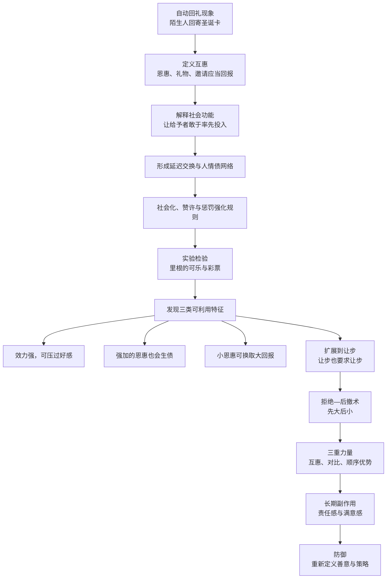
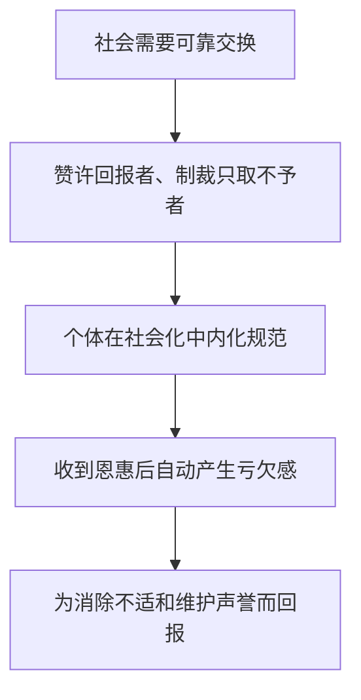
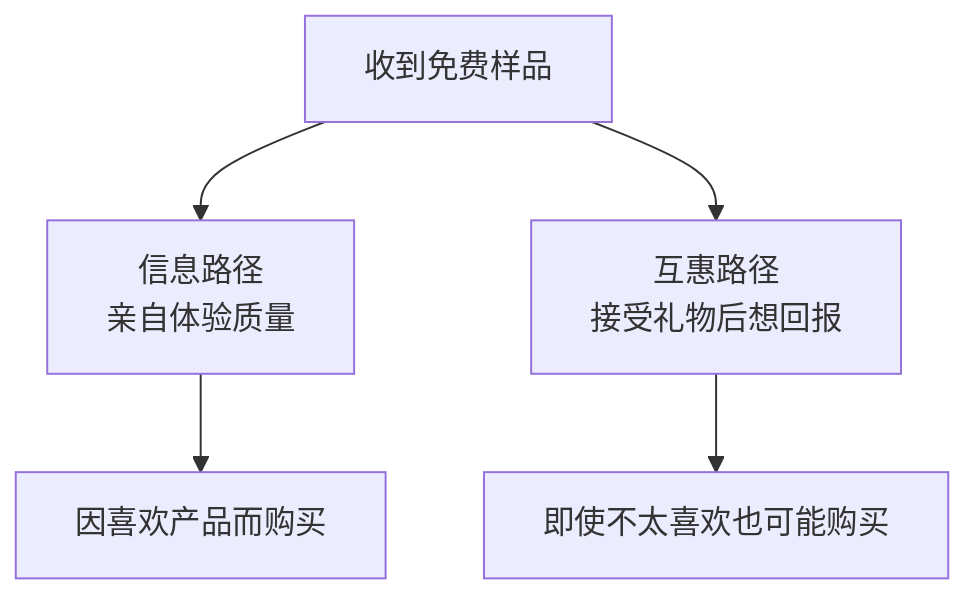
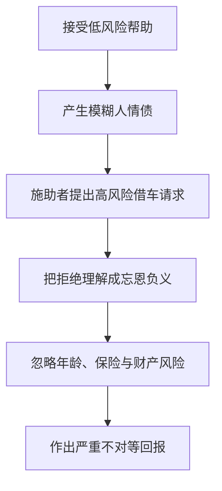
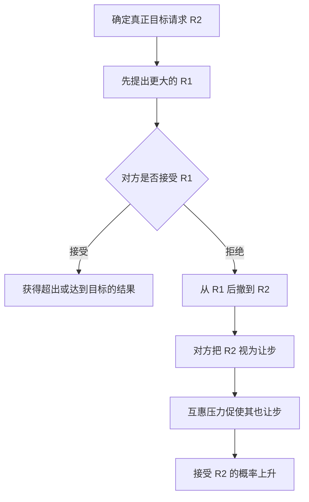
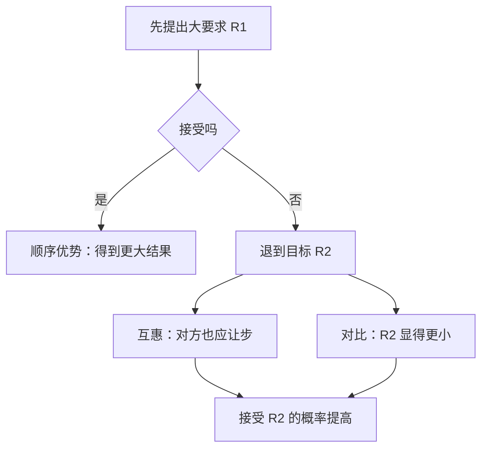
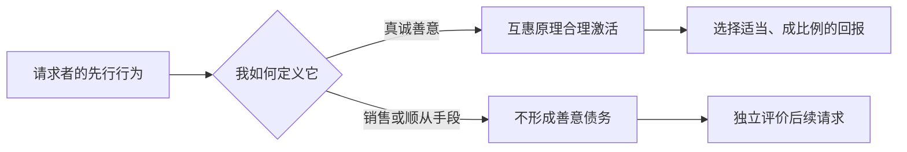
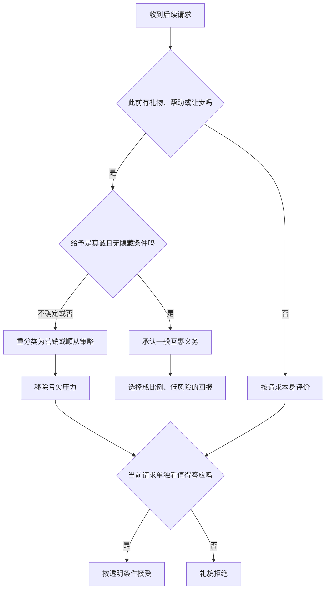
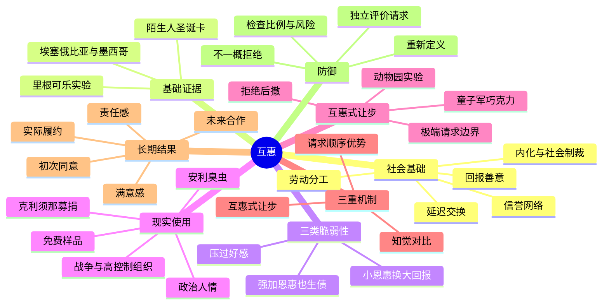
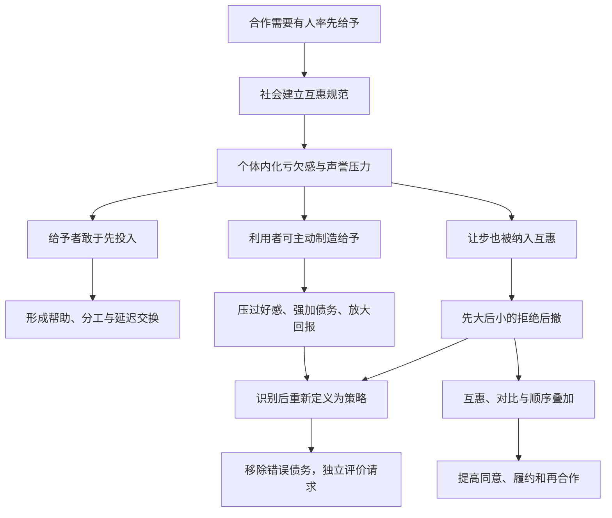

> **书名**：《影响力（珍藏版）》 
> **作者**：罗伯特·B. 西奥迪尼（Robert B. Cialdini） 
> **阅读范围**：第2章“互惠：给予，索取，再索取” 
> **原文章节顺序**：互惠的社会基础 → 互惠原理如何起作用 → 三种可利用特征 → 互惠式让步 → 拒绝—后撤术 → 责任感与满意感 → 如何拒绝 
> **阅读目标**：理解互惠为什么能支撑合作，又为什么会转化成强大的顺从工具；掌握恩惠互惠与让步互惠的共同结构、拒绝—后撤术的多重机制，以及不破坏正常合作的防御方法。

---

## 0. 导读：本章究竟在解释什么

第一章说明，人会用通常可靠的心理捷径应对复杂环境；第二章开始分析第一件具体的“影响力武器”：**互惠原理**。

互惠的日常表达很简单：别人帮助、馈赠或迁就了我们，我们理应有所回报。但作者真正要解决的是一组更难的问题：

1. 为什么这种义务感能跨越时间、距离、文化和眼前利益？
2. 为什么一个小恩惠能够压过好感、诱发更大的回报？
3. 为什么未经请求、甚至并不想要的礼物也会让人觉得欠债？
4. 为什么“对方退一步”也能像礼物一样触发互惠？
5. 为什么先提大要求、再退到目标要求，不仅提高同意率，还可能提高履约和再次合作？
6. 怎样抵御利用，又不把真诚合作一并拒绝？

作者沿下面的链条展开：

本章的核心张力是：

> 互惠越能可靠地保护率先给予者，合作越容易启动；也正因为社会成员不愿违背它，掌握赠礼和退让顺序的人便可能把选择权从接受者手中夺走。

原书报告了多组比例、价格和倍数，但没有提供一套可代入计算的“互惠公式”或“顺从算法”。下文的符号式、效应换算和流程图均是笔记的解释性整理；原书数据会明确标明，补充模型不会冒充原书实验结果。

### 0.1 标题“给予，索取，再索取”的含义

标题概括了两条利用路径：

- **先给予，再索取回报**：先送礼、帮忙、提供试用或免费服务，随后提出购买、捐款或其他请求；
- **先索取，再以较小要求继续索取**：先提出容易被拒绝的大要求，再“退让”到真正目标，使接受者觉得自己也该退一步。

第二条路径看似没有给予实物，其实给予的是**让步**。本章由此把互惠从“礼物交换”推广到“妥协交换”。

### 0.2 章首引语为什么重要

章首借爱默生之言强调：每笔债都应彻底偿还。它不是法律意义上的债务规则，而是对互惠义务之强的文学概括。全章将说明，人情债有两种压力来源：

$$
D=D_{\text{内在不适}}+D_{\text{社会评价}},
$$

其中 $D$ 表示主观债务压力。这是笔记的解释式：一方面，欠人情本身令人不舒服；另一方面，人也害怕被视为忘恩负义、只取不予。两种压力共同促使人尽快偿还。

---

## 1. 开篇圣诞卡实验：为什么陌生人也会自动回礼

### 1.1 现象

一位大学教授给随机挑选的陌生人寄出圣诞卡。收卡者从未见过他，也不了解他的身份，许多人却直接寄回了节日卡，甚至没有先打听“这个人是谁、为什么给我寄卡”。

行为链非常短：

这正符合第一章的“按一下就播放”：卡片不只传递信息，也构成一项社会给予；收件者调用互惠规则，而没有全面调查发送者。

### 1.2 为什么从这个小实验开篇

这个案例同时显示互惠的三个特点：

1. **启动快**：人先回礼，后核实或根本不核实；
2. **关系要求低**：双方甚至不认识；
3. **行为匹配**：收到卡片，以卡片回报。

作者用它提出候选解释：回礼不一定源于深厚感情或对发送者的好感，而可能由“别人给了我东西”这一结构直接触发。

### 1.3 证据边界

原书称其为小范围研究，没有在本章报告样本量、对照组、回卡率或统计不确定性。因此，它适合展示现象，不足以单独估计互惠的平均效应。

回卡还可能受到节日礼仪、担心遗忘熟人等因素影响。后面的里根实验会通过控制条件，更直接地检验一项小恩惠是否导致后续购买。

---

## 2. 互惠原理的定义、对象与边界

### 2.1 基本定义

**互惠原理（rule of reciprocation）**指：当别人给予我们好处、帮助、礼物、邀请或让步时，我们应当以相应方式回报。

典型形式包括：

- 别人帮了忙，将来我们也帮助他；
- 别人送来生日礼物，我们记得在其生日回礼；
- 别人邀请我们参加聚会，我们日后也发出邀请；
- 谈判对手作出让步，我们也退让一步。

可以把最基本结构写成：

$$
A\xrightarrow{\text{给予 }g}B
\quad\Longrightarrow\quad
B\xrightarrow{\text{回报 }r}A.
$$

$g$ 和 $r$ 不必是同一种物品，也不必在同一时间发生。互惠要求的是社会意义上的对应，而不是机械地复制动作。

### 2.2 三种义务：给予、接受、偿还

法国人类学家马塞尔·莫斯对赠礼制度的概括，有助于拆开互惠中的三种义务：

| 义务 | 解决的问题 | 可能带来的风险 |
| --- | --- | --- |
| 给予 | 谁来启动合作 | 给予可被用作诱饵 |
| 接受 | 善意怎样进入关系 | 接受者难以拒绝强加礼物 |
| 偿还 | 率先给予者如何避免净损失 | 回报压力可被放大或操纵 |

本章尤其关注后两项。若接受完全由收礼者自主决定，利用者就难以强行制造人情债；若回报只能严格等值，利用者也难以用小礼换大请求。现实中的接受压力和回报弹性，给了操纵者空间。

### 2.3 互惠与感谢不同

**感谢**是一种情感或表达；**互惠**包含未来行动义务。人可以真诚感谢某人，却无力立即回报；也可能并不喜欢施予者，却仍觉得应该偿还。

英语中表示感谢的短语 `much obliged` 本身带有“承受义务”的意味。作者借语言现象说明，社会经验常把“收到美意”和“欠下回报”紧密连接。

### 2.4 互惠与等价交换不同

互惠不要求即时、同物或精确等值：

- 今天分享食物，未来可能换来照料；
- 收到信息，日后可能提供机会；
- 对方从高要求退到低要求，我们可能从拒绝变为同意。

正因为价值衡量具有弹性，互惠才能支持多样合作；也正因为没有精确标尺，小恩惠才可能换来远大于自身的回报。

### 2.5 互惠、交易与贿赂不能混同

| 概念 | 是否明确约定对价 | 透明程度 | 核心特征 |
| --- | --- | --- | --- |
| 互惠 | 通常没有精确合同 | 可公开也可隐含 | 依赖社会义务与长期关系 |
| 市场交易 | 通常明确 | 价格和条件相对清楚 | 双方交换约定标的 |
| 贿赂 | 常有隐含或明示回报 | 通常刻意隐蔽 | 用私人利益扭曲公共职责 |

同样是“先给后取”，伦理和法律性质可能完全不同。互惠原理解释行为压力，不能替代对利益冲突、权力职责和合法性的判断。

---

## 3. 为什么互惠能成为人类合作的基础

### 3.1 跨文化普遍性

社会学家阿尔文·古德纳等人的研究指出，各个人类社会都认可某种互惠规范。不同文化会改变礼物形式、回报期限和关系边界，但“接受他人给予后应当回报”具有广泛性。

这里应准确理解“普遍”：

- 不表示每个人每次都会回报；
- 不表示所有文化用同一物品、同一期限偿还；
- 不表示任何赠礼都产生相同强度的义务；
- 表示各社会都发展出了调节给予与回报的规范。

### 3.2 “瓦尔坦班吉”：把人情债制度化

作者注介绍了巴基斯坦和印度部分地区的礼物交换习俗“瓦尔坦班吉”（Vartan Bhanji）。婚礼送客时，女主人会把糖果分成两部分：

- 一部分明确表示偿还对方从前的给予；
- 另一部分算作本次新增的赠礼，留待下次回报。

这个仪式把通常含糊的人情账公开记录下来，使关系形成循环：

$$
\text{旧债偿还}+\text{新债建立}
\rightarrow \text{下一轮交换}.
$$

它说明互惠不只是私人感受，有些社会会把它变成稳定的礼仪和记账制度。

### 3.3 “有债必还的信誉网”解决了什么难题

若给予者只能在当场得到等价回报，很多合作无法发生：

- 饥饿者今天没有食物可交换；
- 病人此刻无力照顾帮助者；
- 技能、保护和信息难以即时定价；
- 劳动分工需要跨时间、跨种类交换。

互惠规范相当于一种非正式信用机制。给予者相信未来可以得到回报，因此敢于先投入资源：

理查德·李基把这种信誉网络视为人类分享食物与技能的重要基础；泰格和福克斯则强调，它支持劳动分工、商品和服务交换，使个体凝结为高效率单位。

### 3.4 为什么未来义务比即时交换更重要

设甲现在给予资源 $g$，若没有未来回报，甲承担的预期净损失近似为 $V(g)$；若互惠规范使未来回报 $r$ 具有较高可信度，则甲感知的成本可整理为：

$$
C_{\text{给予}}
=V(g)-P(r)\cdot V(r).
$$

这是笔记的解释模型，不是原书公式。$P(r)$ 表示未来收到回报的主观可能性。互惠规范提高 $P(r)$，从而降低率先给予的感知成本。即使回报时间和形式不确定，合作门槛也会下降。

### 3.5 与重复博弈的关系

作为补充背景，博弈论中的重复互动也说明：若参与者预期未来还会相遇，当前合作可以换取后续合作，背叛则可能失去未来收益。

但本章的互惠比简单“你这次帮我、我下次帮你”更广：圣诞卡实验中的双方并无既有关系，文化规范也可能让人在一次互动中回报陌生人。它不仅依赖理性计算，还依赖内化义务和社会评价。

### 3.6 为什么社会必须保护这条规则

若人们经常接受好处却不回报，率先给予会变得危险，整个合作体系便会萎缩。因此，社会通过两条路径保护互惠：

1. **内化**：从小教育人应当知恩图报，使亏欠本身令人不适；
2. **制裁**：把长期只取不予者视为揩油、忘恩负义或不劳而获，并降低与其合作的意愿。

互惠的影响力并非只来自个人道德感，而是来自个人情绪与群体声誉共同作用。

---

## 4. 埃塞俄比亚援助墨西哥：人情债怎样跨越五十年

### 4.1 反常事实

1985 年的埃塞俄比亚正遭受严重干旱、内战、饥荒和经济崩溃，本身急需国际援助。墨西哥城发生地震后，埃塞俄比亚红十字会却向墨西哥捐出 5 000 美元。

从眼前资源最大化看，捐款方向似乎完全反常：最贫困、最缺资源的一方反而向另一方援助。

### 4.2 历史原因

记者追查后发现，1935 年意大利入侵埃塞俄比亚时，墨西哥曾向埃塞俄比亚提供援助。半个世纪后，埃塞俄比亚把此次捐款理解为偿还旧恩。

完整链条是：

$$
\text{1935 年墨西哥援助}
\rightarrow \text{集体人情债被保存}
\rightarrow \text{1985 年墨西哥受灾}
\rightarrow \text{埃塞俄比亚回报}.
$$

### 4.3 这个案例支持什么

作者强调，多项因素都没有消除回报义务：

- 相隔约五十年；
- 地理距离遥远；
- 文化差异巨大；
- 当前资源极度匮乏；
- 回报与眼前私利冲突。

案例因此生动展示互惠规范的持久力和集体记忆。但它仍是历史个案，不能单独证明所有国家都会在相同条件下回报，也不能排除外交、象征意义等共同动机。

### 4.4 作者为什么“先惊讶，再调查”

这延续了全书的方法：

1. 找到与常识冲突的行为；
2. 拒绝停留在“他们不理性”的评价；
3. 追查行为者使用的历史参照；
4. 找到能让反常选择变得可理解的社会规则。

同一笔 5 000 美元，若只看 1985 年是资源外流；放入 1935 至 1985 年的交换链，它则是偿还信誉债务。问题的关键在于选择了多长的时间窗口。

---

## 5. “互惠原理如何起作用”：从社会规范到顺从压力

### 5.1 原理怎样进入个人心理

互惠给社会带来竞争优势，社会便需要成员遵守和信任它。儿童从小被教导要回报善意，也会看到违背者受到嘲笑、排斥和不信任。久而久之，外部规范变成内部默认规则。

可以把过程分为四层：

### 5.2 为什么怕被称为“揩油者”会带来脆弱性

避免忘恩负义本来是在保护合作。但利用者可以先给一项小好处，再把拒绝后续请求包装成“不知回报”。接受者此时不只评估请求本身，还承担身份威胁：

$$
U(\text{拒绝})
=-C_{\text{亏欠不适}}-C_{\text{声誉风险}}.
$$

这是解释式，不是原书测量模型。即使请求的实际价值不高，拒绝所带来的心理和社会成本也可能使顺从显得更容易。

### 5.3 影响力武器的结构

互惠由正常规范转化为顺从工具，需要以下结构：

1. 请求者先提供恩惠或让步；
2. 接受者把它归类为善意；
3. 互惠义务被激活；
4. 请求者指定回报的形式或时机；
5. 接受者为解除债务而答应原本可能拒绝的请求。

真正的杠杆点不是“礼物本身有多好”，而是接受者是否把它认定为一项需要偿还的善意。

---

## 6. 里根实验：如何把互惠与好感分开

### 6.1 研究问题

现实中，帮助我们的人往往也更讨人喜欢。若受惠者后来答应请求，很难判断究竟是：

- 因为喜欢施予者；
- 因为觉得欠了人情；
- 或两者同时发生。

心理学家丹尼斯·里根通过操纵一罐可口可乐（下文简称“可乐”），把互惠和好感拆开研究。

### 6.2 实验角色与表面任务

受试者以为自己参加“艺术鉴赏”研究，要与另一名参与者“乔”一起给画作评分。乔实际上是研究助理，也就是实验中的同谋者。

这个掩护任务有两个作用：

1. 让乔的可乐看起来像自然发生的小善意；
2. 避免受试者立即猜到研究在测赠礼与购买。

### 6.3 两种条件

| 条件 | 休息期间乔的行为 | 其他行为 |
| --- | --- | --- |
| 恩惠组 | 离开后带回两罐可乐，一罐送给受试者 | 与另一组相同 |
| 对照组 | 离开后空手回来 | 与恩惠组相同 |

关键自变量是受试者是否收到可乐。保持乔的其他表现尽量一致，有助于把后续差异归因于小恩惠，而不是人格或交流差异。

### 6.4 后续请求

画作评分结束、实验员离开后，乔表示自己在销售新车抽奖券：

- 每张 25 美分；
- 若销量最高，他可以得到 50 美元奖金；
- 受试者可以买一张，也可以多买。

因变量是受试者购买的彩票张数。它比单纯回答“愿不愿帮忙”更细，能显示顺从程度。

### 6.5 主要结果

收到可乐的受试者购买的彩票数量，约为未收到可乐者的两倍：

$$
\frac{\bar T_{\text{可乐组}}}{\bar T_{\text{无可乐组}}}\approx 2,
$$

其中 $\bar T$ 表示平均购票张数。这一比值来自原书的“多一倍”描述；原书在此没有给出两组的完整均值、样本量和不确定性。

### 6.6 因果链怎样形成

实验不只是说明“送东西有用”，而是用对照条件检查：当乔的后续请求相同、其他表现相近时，先前可乐是否改变购买量。

### 6.7 第二项分析：好感通常有效，但会被互惠压过

里根还让受试者评价自己有多喜欢乔，并比较好感与购票量：

- 在没有可乐造成亏欠时，越喜欢乔的人通常买得越多；
- 一旦接受了乔的可乐，好感与购票之间的关系退居次要；
- 欠人情者不论是否喜欢乔，都会购买较多彩票。

这组结果很关键，因为它揭示了两个影响因素的相互关系：

$$
\text{通常情境：好感}\rightarrow\text{更多帮助},
$$

$$
\text{存在人情债：互惠压力}\;>\;\text{好感差异的作用}.
$$

第二个式子只是方向性概括，不代表原书估计了统一量纲上的数值大小。

### 6.8 实验解决了什么，又留下什么

它较好地回答了：一个未经请求的小恩惠能否提高后续顺从，以及这种效应是否只是因为施予者更受喜欢。

它没有单独回答：

- 高价值、高风险请求中效应是否相同；
- 不同文化和关系中的效应强度；
- 可乐是否同时提高了乔的可信度或亲近感；
- 效应持续多久；
- 受试者是否明确意识到自己在还人情。

后面的政治、商业、战争与慈善案例用来展示现实范围，但不能替代这些尚未报告的实验细节。

---

## 7. 第一种可利用特征：互惠力量可以压过好感

### 7.1 “所向披靡”应怎样理解

原书以“所向披靡”强调互惠的强度：有些请求若没有亏欠感本会遭拒，先施小惠后却可能获准。它是一种修辞性概括，不是“互惠在所有人、所有场景中必胜”的定律。

作者后文也明确承认，没有任何影响力武器能在所有环境下对所有人有效。更准确的结论是：

> 互惠义务可以强到压过通常很重要的好感因素，使不受喜欢、陌生甚至令人反感的请求者也有机会获得顺从。

### 7.2 为什么这比“人会帮助喜欢的人”更危险

如果顺从只取决于好感，人可以通过保持距离来防御讨厌的推销员或陌生组织。但互惠允许对方绕开好感：

1. 请求者不需要先让你喜欢他；
2. 只需让你接受一项小恩惠；
3. 亏欠感便为后续请求增加了独立压力。

这把请求者的难题从“如何建立关系”降低成“如何让目标先收下一点东西”。

### 7.3 好感与互惠不是同一个原则

| 维度 | 好感 | 互惠 |
| --- | --- | --- |
| 核心问题 | 我喜不喜欢这个请求者 | 我是否欠了对方 |
| 典型来源 | 相似、赞美、熟悉、合作 | 礼物、帮助、邀请、让步 |
| 是否要求喜欢对方 | 是主要路径 | 不要求 |
| 里根实验中的作用 | 无恩惠时预测购票 | 有恩惠时压过好感差异 |

真实请求中两者可以叠加，但分析时必须分开。把“收了可乐后买票”只解释成乔更讨喜，会漏掉实验最重要的发现。

---

## 8. 第一种特征的现实展开：不喜欢请求者也可能回报

### 8.1 克利须那协会面对的公共关系困境

克利须那协会（Hare Krishna Society）源于印度加尔各答。20 世纪 70 年代，其成员在美国公共场所集体吟唱、行礼并请求捐款。鲜明的宗教服饰、光头、念珠和行为确实能吸引注意，却也让许多美国路人感到陌生甚至反感，筹款效果不佳。

组织面对真正的两难：

- 若改变外表和仪式，可能损害宗教身份；
- 若保持原状，公众的负面好感会阻碍募捐。

常规思路是“先让公众喜欢募捐者”，但宗教因素不易改变。协会转而寻找一条**不要求好感也能生效**的路径，这正对应里根实验中的互惠结果。

### 8.2 “先施恩再乞讨”怎样绕过好感

募捐者不再直接请求，而是先把经书（通常是《博伽梵歌》）、协会杂志《回归神性》（Back to Godhead）或鲜花送给路人。常见流程是：

礼物的功能不是让路人突然认同该宗教，而是改变互动结构：原本是陌生组织向我索取，现在变成“我已经收了对方的东西”。后续捐款因此被体验成回报，而不只是对组织的支持。

### 8.3 为什么这项策略一度非常成功

原书记载，这套策略带来大规模经济增长，使协会一度在美国及海外 321 处地点拥有庙宇、商号、住宅和庄园。

这个事实显示策略具有现实影响，却不能单独量化互惠的净效应：组织扩张还可能受到成员增长、时代环境和其他筹款方式影响。更严格的因果比较需要控制地点、客流、请求措辞和募捐者差异。

### 8.4 公众怎样学会防御

方法后来式微，并不是互惠规则消失，而是公众学会在它启动前避开触发条件：

- 看到穿长袍的募捐者便改变行走路线；
- 事先准备拒绝不请自来的礼物；
- 机场划定募捐区域；
- 指示牌和广播提前说明募捐者身份及意图。

协会一度让成员改穿现代服装、携带旅行包以减少识别，但公众和机场也随之更新防御。这里呈现的是影响与识别之间的适应循环：

$$
S_0\rightarrow D_0\rightarrow S_1\rightarrow D_1,
$$

其中 $S$ 表示募捐策略，$D$ 表示防御。这个符号式是笔记对过程的整理。

### 8.5 为什么人们选择回避，而不是收下后坚决不捐

一旦礼物被接受，互惠压力很难直接压制；所以人们宁可远远避开，也不愿正面承受“收礼不回报”的不适。这反过来证明了规则的社会价值：人们不愿为了对付一个利用者，训练自己普遍违背互惠。

有效防御由此有两个时点：

1. **接受前识别**：已知对方是策略性募捐者时，不进入交换；
2. **接受后重分类**：后来才发现动机时，把所谓礼物重新界定为募捐工具。

第二种方法会在“如何拒绝”中成为作者的核心方案。

### 8.6 圣诞老人、糖果与监管

有些协会成员甚至打扮成圣诞老人，在购物者接受糖果后提出捐款请求。外表变化掩盖了组织身份，但底层结构没变：先送低成本物品，再调用互惠。

警方以涉嫌无牌乞讨逮捕相关人员，提醒我们区分三个问题：

- 心理机制是否有效；
- 募捐身份和意图是否透明；
- 行为是否符合公共场所及募捐法律。

有效性从来不能自动推出合法性或正当性。

### 8.7 政治中的互投赞成票

政治机构需要在不同利益之间交换支持。议员甲今天支持乙的法案，乙未来在另一议题上回报，这种“互投赞成票”可以帮助联盟达成妥协，也可能使议员支持与自身一贯立场不一致的方案。

互惠在此有双重作用：

- **协调作用**：让不同选区和议题之间形成可持续合作；
- **扭曲风险**：人情债可能取代对法案公共价值的独立判断。

### 8.8 林登·约翰逊与吉米·卡特的对照

林登·约翰逊长期在众议院和参议院工作，帮助过许多议员。当上总统后，他的提案甚至能得到原本应强烈反对者的支持。作者把这一现象解释为旧人情债被集中偿还。

吉米·卡特则以华盛顿圈外人身份竞选，强调自己不欠圈内人情。这个形象有助于选举，却意味着国会中也很少有人欠他人情；即使民主党控制参众两院，他推动法案仍较艰难。

这是一组有启发性的对照，但不是随机实验。领导能力、政策内容、党内结构和历史环境也会影响立法结果。案例用于显示关系资本的可能作用，不应被简化成“只要多施恩，法案一定通过”。

### 8.9 礼物、政治捐款与利益冲突

企业和个人给司法、立法官员送礼，可能制造回报压力。国家制定限制官员收礼的法律，正说明公共制度不能只依赖个人声称“我不会受影响”。

合法竞选捐款也可能包含囤积人情债的动机。某些组织同时向主要竞争政党捐款，就不容易仅用政策认同解释，更像是在不同胜选结果下都保留关系。

小查尔斯·基汀曾向 5 名参议员提供总计 130 万美元竞选经费，后来这些参议员代表他向联邦监管单位施压。被问两者是否相关时，他直言自己当然希望如此。

这里必须区分：

$$
{\text{政治支持}}\neq\text{购买公共决定的权利}.
$$

互惠能够解释为什么礼物危险，公共职责、披露规则和反腐法律则决定哪些交换不可接受。

### 8.10 草根政治与搬家人情

地方政治组织会用小恩小惠维持选民支持。人也可能根据私人帮助回报公共背书：1992 年美国总统竞选中，女演员萨莉·凯勒曼解释自己为何借名气支持杰里·布朗时说，20 年前她请 10 个朋友帮忙搬家，只有布朗真的来了。

这个故事把互惠的时间跨度再次拉长。它并不证明她只因搬家一事形成政治判断，却清楚展示私人恩惠可以进入后续支持理由。

### 8.11 免费样品的双重功能

免费样品表面上让顾客低成本判断产品质量，这是一项真实的信息服务；同时，它又是一份礼物，可能让试吃者觉得空手离开不礼貌。

因此，同一行为有两条并行路径：

超市试吃特别适合利用这一点：服务人员微笑递来食品，顾客吃完后只还牙签或杯子，可能感到不近人情。作者引用万斯·帕卡德《隐形的说客》中的案例：印第安纳州一家超市把奶酪放在柜台外让顾客自行切取试吃，几小时内卖出 1 000 多磅。

这个销量案例不能单独区分“产品好吃”与“互惠压力”，但与免费样品的双重机制一致。

### 8.12 安利“臭虫”免费试用

安利（Amway）的 `BUG` 免费试用法被译作“臭虫”。销售员把家具抛光剂、清洁剂、洗发水、除臭剂、杀虫剂等一套产品留在顾客家中一至三天，宣称免费且不附带义务，之后返回收取订单。

原书还把规模背景交代得很强：安利早期在地下室办公，后来迅速发展到年销售额 15 亿美元，并将这一成长很大程度归功于 `BUG` 手法。这是原书对该策略商业贡献的表述；若要严格识别因果，仍需把产品、渠道、经销网络和市场增长等因素一并纳入比较。

它比一次性样品更强的地方在于：

- 顾客把一整套产品带入私人空间；
- 实际使用并消耗其中一部分；
- 试用持续数日，接受感更强；
- 剩余产品可被带去下一户重复使用，获客成本较低。

原书引述经销商报告称，顾客平均会购买套装总量的一半，多个地区的销售额显著增长。这些内部报告显示组织观察到强效果，但不等于独立随机试验；报告还可能偏向成功区域和兴奋反馈。

### 8.13 德国士兵与一片面包

欧洲科学家艾布尔—艾贝斯费尔特（Eibl-Eibesfeldt）讲述了这个故事。第一次世界大战堑壕战中，一名德国士兵潜入敌方战壕抓俘虏。他制服一名正在吃东西的敌军士兵后，对方把手中面包分给了他。德国兵受到这份给予的触动，放走对方，空手返回并遭上司责骂。

这个故事把互惠从购物扩展到敌对关系：

- 双方属于交战阵营；
- 德国兵有明确任务；
- 俘虏本来处于弱势；
- 一份低价值食物却暂时重构了双方关系。

它是二手叙述，不能测量一般士兵的反应概率；其理论作用是说明，互惠有时能压过角色敌意和直接命令。

### 8.14 黛安·路易：拒收恩惠以保留行动自由

1978 年琼斯敦集体死亡事件中，黛安·路易没有服从吉姆·琼斯的自杀命令，而是逃入丛林。她认为，一个重要原因是自己生病时拒绝了琼斯派人送来的食物，因为她知道一旦接受特殊照顾，对方就可能以人情债控制她。

这个案例与德国士兵形成镜像：

| 接受恩惠 | 拒绝恩惠 |
| --- | --- |
| 德国兵接受面包后放走敌人 | 路易拒绝特殊照顾，避免形成控制债务 |
| 恩惠压过敌对任务 | 不欠恩惠帮助保留拒绝能力 |

这里不能推出“接受帮助就必然失去自由”。琼斯敦是高控制环境，恩惠还嵌在权威、隔离、群体压力等多重机制中。案例说明的是：当施予者拥有巨大权力并可能把帮助作为控制工具时，预先识别人情债风险尤其重要。

---

## 9. 第二种可利用特征：强加的恩惠也会制造亏欠

### 9.1 关键命题

互惠原理要求人回报收到的好处，却不要求这项好处必须由接受者主动索取。于是，即使礼物不请自来，人也可能产生亏欠感。

这造成了选择权的不对称：

$$
{\text{施予者选择给予什么和何时给予}},
$$

$$
{\text{施予者随后还可能选择要求怎样回报}}.
$$

接受者名义上可以两次拒绝，实际却要承受拒礼失礼和收礼不还两种社会压力。

### 9.2 残疾退伍军人组织的邮件数据

美国残疾退伍军人组织报告：

| 邮件条件 | 捐款回应率 |
| --- | ---: |
| 只寄请求捐款的信 | 约 18% |
| 信中附个性化地址标签等小礼物 | 约 35% |

绝对差异为：

$$
35\%-18\%=17\text{ 个百分点}.
$$

也就是说，附赠小礼物后，回应率的绝对增幅为 17 个百分点。

相对比值约为：

$$
\frac{35\%}{18\%}\approx1.94.
$$

也就是回应率接近原来的两倍。地址标签并非收件者请求，却仍可能把“是否支持该组织”转换成“是否回报已经收到的东西”。

这是组织报告而非本章完整发表的实验论文；邮件设计、名单质量和时期都可能影响数字。但两种条件的对比为强加恩惠提供了现实证据。

### 9.3 为什么“接受义务”是利用的入口

如果社会只要求偿还，却允许人毫无摩擦地拒绝任何未经请求的礼物，操纵者就难以建立债务。现实中，直接退回一瓶饮料、一朵花或一份小纪念品常显得过分戒备或不礼貌。

莫斯所说的“接受义务”因此至关重要：它让率先示好者有信心，也把“由谁决定我欠谁”部分交给了施予者。

### 9.4 回看里根实验中的不对称

乔未经受试者请求便买来可乐。没有人拒绝，因为：

- 乔已经花了钱；
- 他也给自己买了一罐，行为显得自然；
- 一罐饮料是符合场景的小善意；
- 拒绝可能显得多疑或不友好。

稍后，乔又自行决定把回报形式设成购买彩票。于是，乔同时控制：

1. 初始恩惠是什么；
2. 恩惠何时出现；
3. 后续回报是什么；
4. 回报要求何时提出。

这就是互惠从合作规则转化为顺从工具的关键不对称。

### 9.5 克利须那机场互动的微观过程

作者参与式观察到的典型过程是：

1. 募捐者突然把花递给匆忙路人；
2. 路人因惊讶顺手接住；
3. 路人想退回，募捐者坚持称它是礼物；
4. 募捐者提出捐款请求；
5. 路人身体想离开，却又被亏欠压力拉回；
6. 路人捐钱后才离开，随后把并不想要的花扔掉。

礼物的使用价值在这里近乎为零，债务功能却仍然存在。这说明：

$$
V_{\text{使用}}\approx0
\quad\not\Rightarrow\quad
D_{\text{互惠}}=0.
$$

公式是笔记的解释式。人并非因为喜欢花而捐款，而是因为接受动作已被社会规则解释为一项给予。

### 9.6 惊讶怎样帮助强加恩惠进入手中

作者注提到，惊讶本身也能提高顺从，因为人来不及准备。米尔格拉姆和约翰·萨比尼在纽约地铁的研究发现：

- 直接突然请求乘客让座时，让座比例为 56%；
- 若先向旁人提起，让目标乘客有心理准备，比例为 28%。

$$
56\%-28\%=28\text{ 个百分点}.
$$

这一研究不是互惠实验，却解释了克利须那策略中的第一步：突然递花降低了预先拒绝的机会，使礼物先进入接受者手中，之后互惠再接管。

### 9.7 “垃圾线路”：礼物价值与债务功能分离

作者在芝加哥奥黑尔机场观察到，一名协会成员沿垃圾桶捡回路人扔掉的花，再交给同伴重复赠送。许多花已经成功带来一笔捐款，却被接受者立刻丢弃，然后再次进入同一循环。

这个细节特别有解释力：

- 若捐款源于对花的喜爱，花不应立即被扔掉；
- 若捐款源于购买，丢弃说明商品价值极低；
- 花仍能反复募得捐款，说明其主要功能是制造给予事实。

### 9.8 慈善邮件为什么把物品称为“礼物”

慈善组织常寄送地址标签、贺卡、钥匙环等，并附上捐款请求。它们会强调物品是礼物，而不是待付款商品。

两种框架的社会压力不同：

| 框架 | 接受者面对的规则 |
| --- | --- |
| 商品 | 没有义务购买不想要的东西 |
| 礼物 | 收到善意后似乎应该还礼 |

同一物品被怎样命名，会决定人调用市场交易规则还是互惠规则。

### 9.9 强加恩惠的边界

未经请求的给予可能唤起回报倾向，但不因此产生无限义务。至少要区分：

- 接受是否真正自由；
- 礼物是否附带提前说明的条件；
- 对方是否拒绝收回；
- 后续要求是否与恩惠成比例；
- 施予者是否利用惊讶、尴尬或权力差。

一件被强塞的东西在心理上可能造成压力，在道德和法律上却不自动形成接受者同意的债务。

---

## 10. 第三种可利用特征：小恩惠可能换来不对等回报

### 10.1 互惠为何不等于精确等价

互惠要求“以善意回应善意”，但日常恩惠缺少统一价格：一次帮助、一个引荐、一顿饭和一项照料无法像商品一样准确结算。价值弹性让跨种类合作成为可能，也允许施予者把小礼与大请求连接起来。

### 10.2 里根实验中的五倍回报

实验发生在 20 世纪 60 年代末：

- 一罐可乐约 10 美分；
- 每张彩票 25 美分；
- 收到可乐的受试者平均购买 2 张彩票；
- 有人一次购买多达 7 张。

平均回报金额是：

$$
2\times0.25=0.50\text{ 美元}.
$$

相对于 0.10 美元可乐：

$$
\frac{0.50}{0.10}=5.
$$

乔平均获得了初始投入五倍的销售额。严格说，彩票并非纯利润，受试者也获得抽奖机会；“五倍”比较的是交易金额与礼物成本，用来显示回报可明显不等值。

### 10.3 为什么接受者不按市场价结算

如果受试者只想偿还 10 美分，可以给乔零钱或买不到半张彩票。但社会互动通常不这样精确记账：

- 直接给零钱会把善意降格成商业收费；
- 回报选项由乔限定为整张彩票；
- 买一张可能显得勉强，两张更像真正帮助；
- 受试者想尽快消除“我欠他”的模糊感觉。

模糊债务与离散选项共同使回报向上取整。

### 10.4 借车事故：小帮助怎样撬动高风险请求

作者的一名女学生汽车无法启动时，一名年轻陌生人帮她发动。她随口表示日后若能帮忙，请对方开口。一个月后，男孩请求借她的新车两小时。

她知道对方未成年、没有保险，也对借车感到不安，却因欠人情而答应，最后汽车被毁。

这个案例的错误链是：

真正需要比较的不是“帮过我，所以该不该帮”，而是**怎样回报才与风险相称**。感谢、支付启动服务费用或提供其他低风险帮助，都可能比借出无保险车辆更合理。

### 10.5 内在压力：亏欠感令人不舒服

人情债像一项未完成任务，会持续占据注意并带来不适。尽快回报可以关闭心理账目、恢复关系平衡。

这一不适有社会功能：若欠债毫无感觉，互惠链容易中断，率先帮助者会减少。但当人只求尽快卸下负担时，可能不再审查回报大小。

### 10.6 外在压力：害怕“忘恩负义”的标签

长期接受而不回报者往往不受欢迎。只要客观能力允许，人会避免被视为揩油、懒惰或忘恩负义。

作者也保留了例外：若对方因能力、资源或客观条件无法偿还，群体可以理解。互惠不是要求困境中的人不惜一切代价立即还债。

### 10.7 反向破坏互惠也会受排斥

作者注提到，美国、瑞典和日本的跨文化研究都发现：一个人若不断施恩，却不让接受者有机会回报，也可能不受喜欢。

原因在于这种做法把对方永久置于负债位置，破坏关系平等。表面上的慷慨也可能成为地位控制：

$$
{\text{只给予、拒绝回报}}
\rightarrow \text{对方长期欠债}
\rightarrow \text{关系失衡}.
$$

所以，健康互惠不仅要求愿意回报，也要求在合适时接受对方的回报。

### 10.8 为什么人会避免求助

若预期无法回报，人即使真的需要帮助，也可能避免开口。其原因不只是自尊，还包括：

- 不想承受持续债务感；
- 不愿把未来选择权交给施助者；
- 担心别人要求不成比例的回报；
- 害怕社会评价。

互惠由此既能促进帮助，也可能抑制求助。一个制度若希望真正帮助弱势群体，应清楚说明援助资格、无回报条件与申诉机制，降低模糊人情债。

### 10.9 昂贵约会与性期待：互惠不是同意

原书讨论一种严重风险：女性没有自行埋单、而由男性购买饮料后，不论男性还是女性评价者，都更可能判断她会与该男子发生性关系。该研究测量的是旁观者或评价者的社会判断，不是女方的实际意愿，也不是约会双方是否形成了同一推断。作者借学生经历说明，性别规范会把普通给予错误地转换成身体回报预期。

这里必须明确区分描述与规范：

> 礼物、饮料、晚餐或任何花费都不构成性同意，也不产生身体偿还义务。性同意必须自由、明确、持续，并且可以随时撤回。

互惠原理只能解释为什么有人会感到压力、为什么旁观者可能产生偏见；它不能为施压、胁迫或侵犯提供任何正当性。实用防御不应只要求潜在接受者拒绝一切给予，还包括施予者主动消除条件暗示、尊重拒绝，以及组织建立清晰的反骚扰和同意规范。

### 10.10 三种可利用特征如何连在一起

到这里，作者已经建立了互惠作为影响力武器的三层风险：

| 特征 | 利用者获得的优势 | 接受者失去的控制 |
| --- | --- | --- |
| 力量强，可压过好感 | 无须先建立喜欢 | 不能只靠讨厌对方来防御 |
| 强加恩惠也生效 | 可单方面启动债务 | 难以选择欠谁人情 |
| 回报可不对等 | 可用小成本提出大要求 | 难以确定偿还到什么程度 |

三者叠加后，理想的操纵结构是：请求者把低成本、未经请求的礼物交给目标，再指定一项价值更高的回报；目标即使不喜欢对方，也可能为了摆脱债务感而答应。

下一节将把“给予物品”换成“给予让步”。底层互惠规则不变，但请求者不再需要付出礼物成本，只需设计要求的先后顺序。

---

## 11. “互惠式让步”：让步为什么也像一份礼物

### 11.1 童子军马戏票与巧克力棒

作者在街上遇到一名十一二岁的童子军。男孩先问他是否愿意花 5 美元购买周六晚上的马戏表演门票。作者不想看，便拒绝了。男孩随即说，若不买门票，是否愿意买几根每根 1 美元的巧克力棒。作者买了两根，之后才意识到结果很奇怪：

- 他不喜欢巧克力棒；
- 他更愿意保留钞票；
- 他已经明确不想支持第一项商品；
- 最终却支付 2 美元，买了不需要的东西。

单看第二项请求，“要不要买巧克力”应由需求和价格决定；放回请求顺序，第二项还被体验成男孩从 5 美元门票退到 1 美元巧克力的**让步**。

### 11.2 作者怎样从亲身困惑形成假设

作者回到办公室召集研究助理复盘。他们把互动拆成两个方向相反的移动：

作者不是因为更喜欢第二件商品才改变决定，而是因为请求结构把“购买巧克力”包装成了对男孩让步的回报。

### 11.3 恩惠互惠与让步互惠的共同结构

| 互惠形式 | 对方先做什么 | 我被推动做什么 |
| --- | --- | --- |
| 恩惠互惠 | 给礼物、帮助、邀请 | 回赠、帮助、购买或捐款 |
| 让步互惠 | 降低要求、放弃部分立场 | 也放弃原先的完全拒绝或部分利益 |

两者共享一条更抽象的规则：**别人以某种有利于我的方式移动，我也应作相应移动。**

### 11.4 不能假定童子军有意设计

作者明确保留疑问：男孩是否故意用先大后小的顺序卖巧克力，并不确定。行为机制不取决于他的主观意图；即使顺序偶然形成，作者仍可能把后一个要求看成让步。

这一区分很重要：

- **机制判断**：某种顺序是否触发互惠；
- **意图判断**：请求者是否有意识地设计顺序；
- **伦理判断**：请求是否诚实、公平。

三者需要不同证据，不能因效果存在就自动断言请求者恶意操纵。

---

## 12. 为什么社会需要“让步也要回报”

### 12.1 妥协要解决什么问题

许多合作并非从双方要求一致开始。谈判者可能对价格、分工、时间和责任有不相容的初始立场。若任何一方都不愿率先退让，互动就会陷入僵局。

互相让步提供了一条从冲突走向协议的路径：

$$
x_A^{(0)}\neq x_B^{(0)}
\quad\rightarrow\quad
x_A^{(1)},x_B^{(1)}
\quad\rightarrow\quad
x^*.
$$

这是笔记的示意式：$x_A^{(0)}$ 与 $x_B^{(0)}$ 是双方初始立场，双方调整后可能到达共同方案 $x^*$。

### 12.2 互惠通过两条路径促进妥协

作者指出两条作用路径：

1. **回报压力**：看到对方退让，接受者觉得自己也应退一步；
2. **首让保障**：因为预期对方会回报，人更愿意率先作出让步。

第二条更根本。如果先让步只意味着单方面损失，理性参与者会等待对方先动，形成僵局；互惠规范给首个让步提供了某种非正式保障。

### 12.3 互惠让步的社会价值与利用风险

正常谈判中，双方逐渐缩小差异，互惠让步提高合作概率。但请求者也可以把一项并不真正想要的大要求当作舞台道具，再把预定目标伪装成牺牲。

| 正常妥协 | 策略性利用 |
| --- | --- |
| 初始要求反映真实利益 | 初始要求可能只是锚点或诱饵 |
| 双方都承担实际让步 | 请求者退到本来就想要的位置 |
| 目标是找到可接受协议 | 目标是制造接受者欠让步的感觉 |

防御的关键不是拒绝所有让步，而是判断“对方究竟放弃了真实利益，还是只改变了请求的表面位置”。

---

## 13. 拒绝—后撤术：先大后小的请求算法

### 13.1 定义

**拒绝—后撤术（rejection-then-retreat technique）**，也称“留面子”法，是指请求者先提出一个较大、预期会被拒绝的要求；遭拒后，再退到较小的请求，而后者才是真正目标。

基本流程是：

### 13.2 为什么第二项请求不必客观很小

关键不是 $R_2$ 本身很容易，而是它相对 $R_1$ 显得较小，并且后撤被看成让步：

$$
R_2<R_1
\quad\not\Rightarrow\quad
R_2\text{ 客观上很小}.
$$

这正是作者与研究助理要检验的核心：一项本来很有分量的请求，能否仅因前面有一个更极端的要求，就获得显著更多同意。

### 13.3 技巧成立的几个条件

依据本章实验和边界讨论，至少需要：

- 两项要求由同一请求者或同一方提出；
- 第二项要求明显小于第一项；
- 两项要求在目标或主题上具有可理解的联系；
- 第一项被拒绝后，第二项紧接着出现；
- 后撤看起来像真实让步；
- 第一项不能荒谬到暴露骗局和恶意。

这些是对原书逻辑的操作性整理，不是作者列出的正式判定清单。

### 13.4 它与“登门槛效应”方向相反

补充背景中，常见的“登门槛”（foot-in-the-door）是先争取小请求，再逐步扩大；拒绝—后撤则先大后小。

| 技巧 | 请求顺序 | 主要候选机制 |
| --- | --- | --- |
| 登门槛 | 小 → 大 | 承诺、一致、自我认知 |
| 拒绝—后撤 | 大 → 小 | 互惠式让步、知觉对比、顺序优势 |

二者不能只因都有两个请求就混为一谈。本章讨论的是后者。

### 13.5 技巧为何不是绝对控制

作者明确指出，没有任何影响力武器能在所有环境、所有人身上奏效。第二项要求仍可能因违法、危险、无关、超出能力或明显操纵而遭拒。技巧提高的是概率，不是取消选择。

---

## 14. 动物园实验：先大后小怎样把同意率提高近三倍

### 14.1 两个研究问题

童子军案例只说明技巧对作者有效。研究团队进一步提出两个可检验问题：

1. 效果能否推广到足够多人，而不只是作者这个容易顺从的个体？
2. 第二项要求能否本身也很有分量，只是相对第一项较小？

为检验第二问，他们故意选择一项多数大学生不愿接受的真实目标。

### 14.2 目标请求

研究人员假装代表“县青年辅导项目”，请求校园里的大学生无偿花一天时间，陪一群少年犯参观动物园。

这项要求具有实际成本：

- 占用数小时；
- 无报酬；
- 要负责陪伴年龄不同的少年犯；
- 发生在公共场合。

它不是象征性签名或一两分钟的小忙，适合检验先大后小能否推动实质顺从。

### 14.3 直接请求组

直接提出动物园请求时，83% 的大学生拒绝，因此同意率是：

$$
100\%-83\%=17\%.
$$

### 14.4 拒绝—后撤组

另一组先收到极端请求：至少两年内，每周花两小时为少年犯担任辅导员。所有人都拒绝后，研究者退到“一天陪同参观动物园”。此时，同意率达到 50%。

两组绝对差异为：

$$
50\%-17\%=33\text{ 个百分点}.
$$

也就是说，两组同意率相差 33 个百分点。

相对比值约为：

$$
\frac{50\%}{17\%}\approx2.94.
$$

也就是接近原来的三倍。

### 14.5 结果怎样回答两个研究问题

1. **不是作者个人特例**：不同大学生样本中也出现明显差异；
2. **第二项不必很小**：陪少年犯一整天仍是高成本请求，却因相对两年辅导显得较小而获得 50% 同意。

### 14.6 为什么不能把 50% 全部归因于互惠

该顺序同时改变了至少两件事：

- 研究者看似从大要求作出让步，触发互惠；
- 动物园请求与两年辅导相比，知觉上变小。

所以实验验证的是整套拒绝—后撤程序，而不是单独估计互惠和对比各自贡献多少。后文作者也明确把两种原理都纳入解释。

### 14.7 数据边界

原书报告比例，却未在本章同时给出样本量、置信区间和随机分配细节。`2.94` 是笔记根据原书百分比计算的描述性比值，不应被当作跨情境固定效应。

---

## 15. 初始要求多大才有效：极端锚点的边界

### 15.1 “越大越好”的直觉为什么不成立

最初要求越大，理论上给后撤留出的距离越多；但若大到完全不合理，请求者会被视为缺乏诚意，后撤也不再像真实牺牲。

因此效果可能呈现倒 U 形：

$$
{\text{过小差距}}\rightarrow\text{让步感不足},
$$

$$
{\text{适度夸张}}\rightarrow\text{让步清晰且仍可信},
$$

$$
{\text{荒谬极端}}\rightarrow\text{诚意崩塌、效果下降}.
$$

这是根据原书边界整理的形状性说明，不是原书拟合出的数学曲线。

### 15.2 巴兰大学研究的结论

以色列巴兰大学的研究发现，初始请求若极端到不合情理，会适得其反。对方不把从虚假立场后退视为让步，也不觉得有回报义务。

### 15.3 有技巧的谈判者怎样设置起点

成熟谈判者会把初始立场适度放大：

- 留出讨价还价空间；
- 可以作出一连串小让步；
- 仍保持方案与自身利益的可信联系；
- 最后到达真正目标。

初始要求必须同时满足“能被拒绝”和“仍像认真提议”这两个看似冲突的条件。

### 15.4 劳工谈判中的应用

劳资谈判常以较高要求开场，并不期待全部获准，而是把后续退让表现为己方牺牲，促使对方也调整立场。正常谈判中的开价留空间并不必然是欺骗；问题在于初始立场是否完全虚构，以及双方是否都能辨认谈判惯例。

---

## 16. 请求顺序怎样进入审查、推销与日常谈判

### 16.1 电视制作人与审查机构

电视制作人格兰特·廷克和加里·马歇尔承认，会故意在剧本中加入审查员必然删除的内容，随后退到真正想保留的台词。

马歇尔在《拉芙妮与雪莉》中先准备更生猛的表达，待审查员删去后，再提出包含“性欲消退”的版本；在《快乐日子》中，他曾把“处女”一词连续使用 7 次，预期审查者删掉 6 次、留下 1 次，结果果然如此。“怀孕”一词也采用了同样做法。

策略结构是：

$$
{\text{故意设置可牺牲内容}}
\rightarrow \text{审查者否决}
\rightarrow \text{制作方退让}
\rightarrow \text{审查者也接受一部分}.
$$

这显示“让步”不必涉及金钱，可以是词语、场景或许可范围。

### 16.2 上门推销的推荐名单

上门推销员的第一目标是卖出商品，第二目标是取得潜在客户亲友或邻居的名单，因为“经熟人推荐”能提高后续销售机会。

当客户拒绝购买后，销售员会后撤到：“既然产品不适合您，能否介绍几个可能感兴趣的人？”客户原本可能不愿让朋友遭遇高压推销，却因刚拒绝了大请求而在较小请求上退让。

### 16.3 为什么推荐名单并不一定是小成本

对销售员而言，几个名字似乎小于一笔购买；对客户而言，它可能涉及：

- 朋友隐私；
- 自己的声誉；
- 朋友被打扰的风险；
- 是否有权替他人引荐。

因此，大小不能只按请求者的金钱尺度判断。防御时要按接受者承担的全部成本重新评价第二项请求。

---

## 17. 拒绝—后撤为什么强：三股力量叠加

### 17.1 第一股力量：互惠式让步

请求者从 $R_1$ 退到 $R_2$，接受者觉得对方已经迁就自己，因而也应从完全拒绝退到部分接受。这是技巧与本章主题最直接的联系。

### 17.2 第二股力量：知觉对比

第一章说明，当前对象会受先前参照影响。较小要求紧跟极大要求出现时，不只代表让步，还显得比单独提出时更小。

例如，真正想借 5 美元的人先借 10 美元：

$$
5\text{ 美元}\mid10\text{ 美元参照}
<_{\text{主观}}
5\text{ 美元}\mid\text{无参照}.
$$

互惠回答“为什么我也该退一步”，对比回答“为什么第二项看起来没那么大”。两者不是同一个机制。

### 17.3 第三股力量：请求顺序的双赢结构

先提较大要求还带来非心理学意义上的顺序优势：

- 若对方接受 $R_1$，请求者得到比目标更多的结果；
- 若对方拒绝，请求者再退到原定目标 $R_2$，并获得互惠与对比加成。

$$
{\text{接受 }R_1}\rightarrow\text{请求者赢得更多},
$$

$$
{\text{拒绝 }R_1}\rightarrow\text{提高 }R_2\text{ 的成功率}.
$$

作者将其比作“硬币正面我赢，反面你输”。图 2-3 以漫画和戈登·利迪的形象强化这种危险的顺序结构。

### 17.4 三股力量的关系

这解释了为什么技巧比单纯“把要求说小一点”更强：它同时改变义务感、主观尺度和请求者的收益分布。

---

## 18. 水门事件：荒谬方案怎样被前两个方案衬成“小让步”

### 18.1 最终方案本身为何不合理

戈登·利迪为尼克松总统竞选连任委员会提出闯入民主党全国委员会水门办公室并安装窃听器的方案。作者列出多项明显风险：

- 高层认为利迪情绪和判断不稳定；
- 方案需要 25 万美元不可追查的现金；
- 尼克松当时连任前景很好，行动收益有限；
- 需要约 10 名参与者共同保密；
- 目标办公室似乎没有足以威胁现任总统的信息；
- 一旦败露，政治后果可能毁灭性。

若这项方案被单独提出，理应容易遭拒。

### 18.2 真正的请求序列

25 万美元方案并不是第一项：

| 顺序 | 预算 | 主要内容 |
| --- | ---: | --- |
| 第一案 | 100 万美元 | 窃听之外，还包括跟踪飞机、绑架与抢劫小组、载有高级应召女郎以勒索政客的游艇等 |
| 第二案 | 50 万美元 | 删除部分极端内容，但仍很庞大 |
| 第三案 | 25 万美元 | 最终执行的水门窃听“精简”方案 |

经历前两项荒诞方案后，第三项仍然危险，却在相对比较中成了“一小点儿”，也像利迪作出的重大退让。

### 18.3 拉鲁为什么提供了关键对照

最终会议中，弗雷德里克·拉鲁直接认为没有必要冒险，尽管最后服从决定。与米切尔和马格鲁德不同，他没有参加前两次会议，也就没有经历 100 万和 50 万美元方案形成的参照与让步链。

这不是随机分组，不能当作严格因果实验；但它形成了有启发性的自然对照：未暴露于前两个极端方案的人，更容易按第三案的绝对风险评价它。

### 18.4 马格鲁德的事后解释

马格鲁德后来意识到，若利迪一开始只提出 25 万美元窃听方案，他们很可能直接拒绝；正因为先看到飞机、绑架、抢劫、应召女郎和百万预算，最终方案才像是可以接受的残余部分。

他的证词同时体现：

- **知觉对比**：25 万相对 100 万显得小；
- **互惠式让步**：利迪已经“削减”，决策者觉得应给他一点；
- **顺序依赖**：同一方案单独出现可能得到不同判断。

### 18.5 案例能支持到什么程度

作者把拒绝—后撤视为解释这项费解决策的重要线索，而非完成了历史因果证明。组织服从、群体决策、政治文化、信息不对称和个人权力也可能参与其中。

严谨结论应是：请求序列为本来荒谬的第三案创造了有利参照和回报压力，可能降低了决策者对绝对风险的敏感度。

---

## 19. 零售“往最高了说”：顺序优势的销售数据

### 19.1 策略

销售员先展示最豪华、最昂贵的型号，再逐步后撤到价格和质量较低的型号：

- 顾客若接受高价款，商家直接获得高销售额；
- 顾客若拒绝，较低价款同时显得是销售员的让步和相对便宜的选择。

### 19.2 台球桌数据

原书转引一家代表性门店的实际数据。宾士域（Brunswick，译者注说明它是美国花式台球桌及配件品牌）的产品价格从 329 美元到 3 000 美元：

| 周次 | 展示顺序 | 平均销售额 |
| --- | --- | ---: |
| 第一周 | 先低端，再鼓励升级 | 550 美元 |
| 第二周 | 一律先看高端，再逐步降低 | 超过 1 000 美元 |

设第二周的实际平均销售额为 $S_2$。原书只给出 $S_2>1000$，因此严格的下界是：

$$
S_2-550>450\text{ 美元},
$$

相对比值满足：

$$
\frac{S_2}{550}>\frac{1000}{550}\approx1.82.
$$

所以第二周比第一周高出 450 美元以上，平均销售额超过原来的 1.82 倍。

### 19.3 数据边界

这是一家门店连续两周的现场比较，不是本章报告的随机实验。周间客群、库存、销售员和促销变化都可能影响平均额。它为策略的现实可行性提供部分证据，不能把至少约 82% 的表面增幅全部归因于展示顺序。

---

## 20. 为什么目标不会更怨恨：同意、履约与再合作

### 20.1 作者提出的反向预测

拒绝—后撤看似会让人感到被逼迫，可能产生两种长期损失：

1. 口头同意后不真正履行；
2. 怀疑请求者，拒绝未来往来。

如果这两种反作用很强，技巧即使提高当下同意率，也不适合长期关系。作者因此把结果指标从“说是”扩展到实际行为和再次合作。

### 20.2 加拿大心理健康诊所实验：口头同意

真正请求是到社区心理健康诊所无偿工作两小时：

| 条件 | 请求顺序 | 口头同意率 |
| --- | --- | ---: |
| 拒绝—后撤 | 先要求至少两年、每周工作两小时，再退到一次两小时 | 76% |
| 直接请求 | 一开始就要求一次工作两小时 | 29% |

绝对差异：

$$
76\%-29\%=47\text{ 个百分点}.
$$

### 20.3 实际履约

在已经口头答应的人中，真正按约出现的比例为：

| 条件 | 答应者中的实际出现率 |
| --- | ---: |
| 拒绝—后撤 | 85% |
| 直接请求 | 50% |

技巧不只增加“是”的数量，答应者也没有更容易爽约。

若两组百分比使用可比口径，可以把总体实际到场率作近似分解：

$$
P(\text{到场})
=P(\text{答应})P(\text{到场}\mid\text{答应}).
$$

于是：

$$
0.76\times0.85\approx64.6\%,
$$

$$
0.29\times0.50=14.5\%.
$$

这意味着在分母口径可组合的前提下，估算总体到场率分别约为 64.6% 和 14.5%。这是笔记根据原书两个条件比例作的推算；原书正文并未直接报告这两个总体百分比。

### 20.4 献血实验：未来合作意愿

目标请求是献 1 品脱血，约合 473.17 毫升：

- 拒绝—后撤组先被要求至少三年、每 6 周献 1 品脱，再退到只献一次；
- 对照组从一开始只被要求献一次。

在口头答应且真正来到献血中心的人中，研究者询问是否愿意留下电话号码，以便下次献血时联系：

| 条件 | 愿留下电话供下次联系 |
| --- | ---: |
| 拒绝—后撤 | 84% |
| 直接请求 | 43% |

这检验的是**未来联系意愿**，不是实际完成第二次献血。不能把 84% 写成再献血率。

### 20.5 三类结果指标不能混淆

| 指标 | 回答的问题 | 本章例子 |
| --- | --- | --- |
| 初次同意 | 当场是否答应 | 动物园 17% 对 50%；诊所 29% 对 76% |
| 实际履约 | 答应后是否出现 | 诊所答应者中 50% 对 85% |
| 再合作意愿 | 是否愿接受未来联系 | 献血到场者中 43% 对 84% |

它们共同反驳“技巧只制造空头答应”的简单预测，但不能互相替代。

---

## 21. 责任感与满意感：为什么被推动的人反而更愿合作

### 21.1 谈判实验怎样设计

加州大学洛杉矶分校的研究者让受试者与一名“对手”分配一笔钱。若限时内无法达成协议，双方都拿不到钱。所谓对手其实是按脚本行动的研究助理，有三种策略：

| 条件 | 初始要求 | 后续行为 |
| --- | --- | --- |
| 极端且不退让 | 几乎把钱全留给自己 | 坚持到底 |
| 适度且不退让 | 略微有利于自己 | 坚持到底 |
| 极端后逐步退让 | 最初几乎全留给自己 | 逐渐退到略微有利于自己 |

最后一种把拒绝—后撤拆成一连串让步，适合检验它对经济结果和主观感受的影响。

### 21.2 第一项发现：让步策略得到的钱最多

采用“极端开价后逐步退让”的研究助理，最终从受试者那里分到最多的钱。这与前面关于顺从率的结果一致：退让让目标接受了更有利于请求者的协议。

### 21.3 第二项发现：目标产生更高责任感

面对逐步退让的对手，受试者更容易觉得：

- 自己影响了对方；
- 是自己的谈判使对方改变立场；
- 最终协议有自己的一份功劳。

实际上，对手的退让早由实验脚本规定，并非受试者真正造成。但**主观影响感**使目标把协议部分归因于自己的选择。

完整链条是：

### 21.4 第三项发现：让出更多，却更满意

最令人意外的是，与退让者谈判的受试者平均给了对方最多的钱，却对最终安排最满意。他们可能把协议体验成自己努力争取来的成果，而不是对方单方面强加的结果。

### 21.5 责任感怎样解释履约

若人觉得协议是自己促成并选择的，违约就不只是拒绝对方，还意味着否定自己的决定。因此，责任感可以解释心理诊所实验中拒绝—后撤组为何更常真正出现。

### 21.6 满意感怎样解释再合作

若人相信自己通过谈判获得了对方让步，便更容易认为交易公平、过程有效，并愿意再次参加类似安排。零售研究也发现，消费者若觉得划算交易有自己的一份功劳，会更满意并购买更多。

### 21.7 关键前提：不能被看穿为骗局

责任感和满意感依赖目标相信让步是真实的。若初始要求荒谬、退让明显预设，目标可能改作如下归因：

$$
{\text{对方不是被我说服}}
\rightarrow \text{对方只是在操纵我}.
$$

此时，责任感和满意感都可能消失，转为不信任或反感。

### 21.8 本节的完整解释

拒绝—后撤术的长期效果不只是“让人难以拒绝”，还来自一种参与错觉：目标觉得自己迫使对方退让、共同创造了协议。这使技巧同时影响三个阶段：

1. **接受前**：互惠与对比提高同意率；
2. **接受后**：责任感提高履约；
3. **未来互动**：满意感提高再次合作意愿。

---

## 22. “如何拒绝”：真正目标不是消灭互惠

### 22.1 防御为什么看似两难

面对先施恩或先让步的请求者，人似乎只有两个坏选择：

- 顺从请求，可能被利用；
- 拒绝回报，又承受亏欠不适和“不公平”的自我评价。

如果把问题理解成“我要不要反抗互惠”，个体几乎注定吃亏，因为互惠是长期社会化形成的强规则。作者因此改变问题定义：**请求者只是调用者，真正施加力量的是互惠原理。**

### 22.2 柔道视角：请求者借来的力量

请求者不必凭自身说服力压倒目标。他只要抢先给礼物或作让步，就把互惠拉到自己一边。防御不能只盯着对方的话术，而要切断“当前行为被归类为善意”这一步。

### 22.3 为什么“一概拒绝所有礼物”不是好办法

理论上，只要不接受最初恩惠，互惠就不会启动；实践中却很难提前知道对方是真诚还是算计。若把所有礼物、帮助和让步都视为圈套，人会：

- 伤害真诚施予者；
- 错过互助与合作收益；
- 增加社交摩擦；
- 让自己变得孤立和多疑。

这种防御为了避免少数利用，摧毁了互惠原本保护的大量正常交换。

### 22.4 送花女孩：过度防御造成什么伤害

作者同事的 10 岁女儿参加学校欢迎祖父母的招待活动，负责给进入操场的游客送花。第一名男子粗暴拒绝，追问她有什么企图，坚持认定花背后有“把戏”。女孩深受打击，无法继续接触其他游客，只好放弃任务。

男子可能曾被互惠策略伤害，因而选择预防性拒绝；但他把一个真诚、无后续索取的行为误判成操纵，成本由无辜儿童承担。

案例说明，防御也有两类错误：

| 判断 | 实际是真诚善意 | 实际是顺从手段 |
| --- | --- | --- |
| 接受为善意 | 正常合作 | 可能被利用 |
| 判定为手段 | 错伤关系 | 成功解除压力 |

成熟策略要同时降低两类错误，而不是只追求“绝不上当”。

### 22.5 作者的核心方案：先接受，再根据新信息重新定义

当最初提议本身合适时，可以先接受，不必因猜疑拒绝一切。之后观察请求者怎样行动：

- 若确是真诚帮助，就承认互惠义务，并在合适机会作适当回报；
- 若后续行为显示赠礼只是为了索取更大回报，就把它重新定义为销售手段、募捐技术或顺从策略。

重新定义不是假装从未收到东西，而是修正它的社会意义：

$$
{\text{初始分类：善意}}
\xrightarrow{\text{新证据}}
{\text{修正分类：策略}}.
$$

互惠要求善意回报善意，却不要求用善意回报诡计。

### 22.6 接受礼物不等于预先同意未知请求

原书在描述层面已经表明，人可能受互惠压力推动，作出明显不对等的回报；它并没有正式建立“回报必须成比例”的伦理规则。以下是笔记基于自主性与风险控制补充的规范性边界：即使最初帮助是真诚的，接受者也不应被视为把未来决定权交给施予者，合理回报应当保留一般性、可选择性与比例限制。至少应区分：

- 感谢与购买；
- 回报与服从；
- 适当帮助与高风险牺牲；
- 社会义务与法律合同；
- 人情压力与自由同意。

正确互惠允许接受者选择回报的时间、形式和合理范围。

### 22.7 真诚的消防安全服务

作者设想，一名自称居民消防安全协会成员的女士来电，提供：

- 家庭防火知识；
- 免费住宅隐患检查；
- 一套家用灭火器。

许多城市确有非营利协会和业余提供服务的专职消防员。若检查人员提供信息和评估、推荐火警系统后离开，没有推销和施压，那么接受者确实得到了善意帮助。日后对方需要合理协助时，给予回报符合互惠的良好传统。

### 22.8 同一开场怎样变成昂贵销售

另一种情形中，所谓检查员在完成检查后并不离开，而是推销自己公司的热感应报警系统：

- 产品可能能用，但价格虚高；
- 顾客不熟悉市场价格；
- 免费灭火器和检查让顾客觉得欠人情；
- 销售员借此要求马上购买。

当后续行为揭示首要动机是销售，接受者应把灭火器、安全信息和检查重新归为**获客与推销成本**，而不是私人礼物。随后按价格、质量和需求独立判断报警系统。

### 22.9 独立评价后续请求

心理重分类后，可以把互惠压力暂时从决策中移开：

$$
{\text{是否购买}}
=f(\text{实际需要},\text{产品质量},\text{总价},\text{替代方案},\text{风险}),
$$

而不是：

$$
{\text{是否购买}}
=f(\text{我已经收了什么}).
$$

这两式是笔记对决策标准的整理。免费服务可以提供有用信息，却不应排除比价和独立核验。

### 22.10 后撤到推荐名单时再分类一次

若销售员在购买被拒后说：“那至少给我几个朋友的名字吧”，不要自动把它视为真诚让步。重新检查：

- 推荐名单是不是销售流程预设的第二目标？
- 对方是否真的放弃了什么利益？
- 自己是否有权分享朋友信息？
- 若没有前一个大请求，自己会不会单独答应？

一旦把后撤识别为拒绝—后撤程序，互惠式让步压力便不再自动决定答案。

### 22.11 免费灭虫检查的补充案例

作者注指出，许多灭虫公司免费检查住宅。若顾客相信家中确需灭虫，往往直接雇用提供检查的公司，而不再逐家比价。无良公司知道顾客已感到欠人情，可能收取远高于竞争者的价格。

免费检查确实创造信息价值，却不能证明同一家公司报价合理。实用做法是把**诊断**与**施工采购**分开：先确认虫害和检查证据，再获取多个书面报价。

### 22.12 “让武器掉转枪口”应怎样理解

作者进一步说，若确定所谓礼物只是赚钱工具，可以收下安全信息和灭火器，礼貌道谢后拒绝购买；他用“盘剥还以盘剥”的强烈措辞，表示利用者无权要求善意回报。

这是一种修辞性的反击立场，不意味着可以欺骗、盗取或违反明确条件。更稳妥的原则是：

- 对方明确无条件赠送的东西，不会自动产生购买义务；
- 若赠品可退且自己不需要，可以退回以减少纠纷；
- 不虚构身份或承诺；
- 不因对方操纵就采取违法或伤害性报复；
- 把决定恢复到透明条款和实际价值。

### 22.13 防御的核心不是识破动机，而是校准义务

人的真实动机往往难以确认。防御不必证明对方“内心恶意”，只需根据可观察结构判断：

1. 是否提前说明赠礼无条件；
2. 是否允许轻松拒绝或退回；
3. 是否随后提出更高价值请求；
4. 是否阻止比价或制造时间压力；
5. 是否把拒绝包装成忘恩负义；
6. 请求与最初给予是否明显不成比例。

证据显示商业结构时，就按商业交易处理，不需要先给请求者作人格诊断。

---

## 23. 读者报告：延期保修中的先长后短

### 23.1 销售员怎样发现这套方法

一名前电视机和音响器材销售员回忆，零售商要求员工销售一年到三年的延期保修合同。无论卖出哪一种期限，销售员获得的积分相同。

他发现多数顾客不愿购买最贵的三年保修，于是总先认真推销三年方案；顾客拒绝后，再退到较便宜的一年方案。即使当时不知道“拒绝—后撤”这个名称，他已经自行发现了同样结构。

### 23.2 报告中的结果

| 销售方式 | 延期保修购买率 |
| --- | ---: |
| 先推三年，再退到一年 | 平均 70% |
| 部门其他销售员 | 约 40% |

绝对差异为：

$$
70\%-40\%=30\text{ 个百分点}.
$$

相对比值为：

$$
\frac{70\%}{40\%}=1.75.
$$

### 23.3 为什么互惠与对比同时出现

- **互惠式让步**：销售员从昂贵三年合同退到一年，顾客觉得对方迁就了自己；
- **知觉对比**：一年合同与三年合同相比，价格显得更低。

作者点评特别提醒，这两种力量通常一起出现。

### 23.4 报告能支持什么

它展示现实销售员如何独立发现先大后小，并报告明显高于同事的购买率。它是读者自述，不是随机实验：顾客、产品、销售能力和统计口径可能不同。

此外，案例只讨论保修合同卖出比例，不回答合同是否物有所值。消费者仍需比较故障概率、原厂保修、免赔条款、维修上限和合同价格。

---

## 24. 核心概念的关系与区别

### 24.1 恩惠互惠、让步互惠与不对等交换

| 概念 | 启动事件 | 典型回报 | 核心风险 |
| --- | --- | --- | --- |
| 恩惠互惠 | 礼物、帮助、邀请 | 回礼、帮助、购买 | 请求者先制造亏欠 |
| 让步互惠 | 对方降低要求 | 自己也退让 | 假让步被当成真牺牲 |
| 不对等交换 | 小恩惠后接大请求 | 超额回报 | 缺少价值标尺、急于还债 |

它们都来自互惠，但发生在不同对象和阶段，不能只用“人情”笼统带过。

### 24.2 亏欠感、感谢与好感

| 状态 | 含义 | 是否必然要求行动 |
| --- | --- | --- |
| 感谢 | 认可对方给了帮助 | 可以只表达，也可行动 |
| 好感 | 对人有正面评价 | 不必欠对方任何东西 |
| 亏欠感 | 认为关系尚未平衡 | 容易推动具体回报 |

里根实验的意义就在于：亏欠感可以在好感不高时仍推动行为。

### 24.3 互惠与知觉对比

互惠改变的是**义务感**：“对方退了，我也应退。”对比改变的是**大小感**：“和前一个相比，第二项没那么大。”拒绝—后撤把两者叠加：

$$
{\text{第二请求的吸引力}}
=\text{让步回报压力}+\text{相对变小的感觉}+\text{请求本身价值}.
$$

这是解释性分解，不是可相加计分的原书公式。

### 24.4 拒绝—后撤与讨价还价

正常讨价还价也会先开价再让步。区别不在形式本身，而在：

- 初始要求是否有真实利益基础；
- 让步是否承担实际成本；
- 双方是否理解这是谈判惯例；
- 是否用虚假极端要求制造不应有的义务；
- 最终方案是否仍按实质独立评价。

### 24.5 拒绝—后撤与登门槛

再次强调方向：

$$
{\text{拒绝—后撤：大请求}}\rightarrow\text{小请求},
$$

$$
{\text{登门槛：小请求}}\rightarrow\text{大请求}.
$$

前者主要调用互惠与对比，后者通常调用承诺和一致。把两者混淆，会导致错误识别防御时点。

### 24.6 礼物与销售工具

一个物品的物理属性不能决定它是哪一类：同一灭火器既可能是公益服务中的无条件赠品，也可能是昂贵推销的获客成本。判断取决于条件、意图证据和后续行为。

### 24.7 互惠与报复

广义社会交换中也可能有“以负面行为回应负面行为”，但本章主要研究善意、礼物和让步所引发的正向回报义务。不要把作者的互惠原理无限扩展成所有“你怎样对我、我就怎样对你”的反应。

### 24.8 责任感与承诺和一致

拒绝—后撤产生的责任感，会让目标更愿履行自己参与达成的协议；这与下一章的承诺和一致存在联系。但本章的起点是对方让步造成的参与感，下一章则系统研究个人作出承诺后为何维持一致。

---

## 25. 作者如何一步步分析问题

### 25.1 从自动回礼现象提出原则

陌生人回寄圣诞卡展示了一个无需深厚关系的回报反应。作者由此提出互惠规则，而不是先从商业骗局出发。

### 25.2 先解释社会功能，再解释脆弱性

作者借人类学和社会学说明，互惠让率先给予者相信未来可获回报，从而支持分享、分工、贸易和照料。只有理解它为何值得社会保护，才能解释其压力为什么强。

### 25.3 用历史反常案例检验时间跨度

埃塞俄比亚在危机中向墨西哥捐款，促使作者向前追查五十年。它显示分析互惠时不能只看当下成本，还要重建债务历史。

### 25.4 用里根实验分离互惠与好感

作者没有满足于“送礼后销量高”的相关故事，而采用有无可乐的对照，并测量好感。这样可以检查恩惠是否具有独立于喜欢的作用。

### 25.5 从实验结果抽取三类结构性风险

作者没有把可乐实验只总结成“先送东西”：

1. 互惠可压过好感；
2. 恩惠不必由接受者请求；
3. 回报可以远超礼物价值。

随后用宗教募捐、政治、免费样品、战争、慈善邮件和借车事故逐项展开。

### 25.6 从个人反常行为发现第二条路径

作者不喜欢巧克力却购买，产生新的研究问题。研究团队把物品回报提升为行为回报：别人作出让步，也会要求我们让步。

### 25.7 把轶事转化为对照实验

动物园实验没有选择一个很小的第二要求，而故意使用高成本请求，以检验“相对较小”是否足够。17% 对 50% 的结果支持整套程序具有广泛作用。

### 25.8 主动寻找边界与竞争机制

巴兰大学研究说明初始要求过度会失败；作者又引入知觉对比和顺序优势，避免把所有效果都归给互惠。

### 25.9 用水门事件检验高风险决策

作者把机制应用于一项昂贵、危险的政治决定，并利用拉鲁未参加前两次会议这一差异形成自然对照。同时，这仍是历史解释，不被包装成实验因果证明。

### 25.10 把结果从同意扩展到长期行为

心理诊所和献血研究分别测量口头同意、实际到场和未来联系意愿；谈判实验再解释责任感与满意感。作者由此回答“短期技巧是否破坏长期合作”的反驳。

### 25.11 防御不与社会功能对抗

最终方案不是普遍拒礼，而是重新定义行为。它保留真诚互惠的合作收益，只把策略性给予从“善意债务”中移除。

### 25.12 完整问题解决链

---

## 26. 证据结构、适用范围与局限

### 26.1 本章证据地图

| 证据类型 | 代表材料 | 主要支持 | 主要局限 |
| --- | --- | --- | --- |
| 小范围行为研究 | 陌生人圣诞卡 | 自动回礼现象 | 缺少本章内完整统计信息 |
| 控制实验 | 里根可乐与彩票 | 恩惠提高顺从、可压过好感 | 场景和请求较小 |
| 对照实验 | 动物园请求 | 拒绝—后撤提高实质请求同意率 | 未单独分离互惠与对比 |
| 行为追踪实验 | 心理诊所、献血 | 履约与未来合作没有下降 | 各百分比的条件分母不同 |
| 谈判实验 | 三种开价与退让 | 责任感、满意感与经济结果 | 实验谈判不等于所有现实关系 |
| 参与式观察 | 机场募捐、房地产式销售调查 | 技巧如何在现场部署 | 无随机控制，受研究者解释影响 |
| 历史案例 | 埃塞俄比亚、水门事件 | 时间跨度与高风险应用 | 多重替代原因 |
| 组织数据 | 邮件回应、台球桌销售 | 现实转化差异 | 可能有选择偏差和混杂 |
| 读者报告 | 延期保修 | 自发发现与实际使用 | 自述、非随机比较 |

### 26.2 强结论与弱结论要分开

较有直接实验支持的结论包括：

- 先给予小恩惠能提高后续购买；
- 先大后小能提高第二项请求的同意率；
- 在报告的实验中，技巧没有降低履约和未来联系意愿；
- 逐步退让能提高目标的责任感与满意感。

需要更谨慎表述的结论包括：

- 某项政治决定主要由互惠造成；
- 某组织全部增长都来自一种募捐策略；
- 任意礼物都能压过任意好感或风险；
- 某个现场百分比可直接推广到所有文化和时代。

### 26.3 比例比较的三个注意点

1. **百分点不是百分比增长**：17% 到 50% 是增加 33 个百分点，相对约 2.94 倍；
2. **条件分母不同**：85% 是已答应者中的到场率，84% 是已答应且到献血中心者中的留电话比例；
3. **组织报告不等于随机试验**：18% 对 35%、550 对超过 1 000 美元可能还受其他变量影响。

### 26.4 文化普遍性与文化差异

互惠规范跨文化广泛存在，但具体表现会受以下因素调节：

- 谁属于应回报的关系圈；
- 礼物能否拒绝；
- 多久偿还才合适；
- 公开还是私下回报；
- 回报多少才算平衡；
- 对公共官员收礼的制度限制。

“普遍存在”不能替换成“强度和形式完全相同”。

### 26.5 效果的适用条件

互惠更可能生效于：

- 赠予被识别为针对个人的善意；
- 接受动作已经发生；
- 后续请求在时间上较近；
- 回报形式具有社会可接受性；
- 请求者的后撤看起来真实；
- 接受者关心公平和社会评价；
- 决策时缺少独立比较。

效果可能减弱于：

- 赠礼被提前识别为营销成本；
- 对方允许无尴尬地退回；
- 初始要求荒谬到暴露手法；
- 第二请求与第一请求无关；
- 回报明显违法、危险或不成比例；
- 组织规则禁止接受利益；
- 接受者有时间进行独立估值。

### 26.6 伦理边界

互惠可以用于正当合作，也可以用于操纵。评价至少要检查：

- 是否透明说明条件；
- 接受者能否自由拒绝；
- 是否故意制造惊讶或尴尬；
- 请求是否成比例；
- 是否涉及公共职责或利益冲突；
- 是否尊重隐私、财产和身体自主；
- 是否允许对方比较与撤回。

机制有效不等于使用正当。

---

## 27. 一套可执行的互惠防御流程

### 27.1 第一步：识别先行给予

面对购买、捐款、引荐或让步请求，先回看此前是否发生：

- 免费礼物、样品或试用；
- 无偿检查、咨询或帮助；
- 特殊照顾；
- 对方从更高要求退下来；
- 让自己产生“现在拒绝不厚道”的安排。

### 27.2 第二步：把接受与后续同意拆开

明确告诉自己：

> 我可以感谢已经得到的帮助，但后续请求仍是一个新的决定。

接受样品不等于购买，听取检查不等于雇用，拒绝第一项要求也不等于必须接受第二项。

### 27.3 第三步：判断给予的性质

问六个问题：

1. 给予是否由我请求？
2. 条件是否在接受前说清？
3. 对方是否允许轻松拒绝或退回？
4. 后续请求是否早已是标准流程？
5. 对方是否阻止比价或要求立即决定？
6. 请求价值是否远大于最初给予？

答案越偏向“强加、隐瞒、预设和不成比例”，越应把它归为影响策略。

### 27.4 第四步：做“独立请求测试”

想象最初恩惠不存在，只看当前请求：

> 如果一个没送过我东西、也没先提大要求的人现在提出同一请求，我会答应吗？

若答案明显变成“不”，说明互惠或对比正在替代实质判断。

### 27.5 第五步：检查比例与风险

不要用模糊的“欠人情”决定回报。分别列出：

- 对方实际付出的成本；
- 自己承担的金钱、时间、隐私和安全风险；
- 是否有低风险的替代回报；
- 是否触及不可让渡的边界，如公共职责和身体同意。

### 27.6 第六步：识别拒绝—后撤

当第二个请求出现时，检查：

1. 第一项是否明显预期会被拒绝？
2. 第二项是否才像真正目标？
3. 两项是否由同一人连续提出？
4. 对方是否真的牺牲了什么？
5. 第二项单独看是否仍然合理？

### 27.7 第七步：恢复绝对评价

对第二要求按自身尺度重新估价：

- 不把 25 万美元只与 100 万比较，而要看绝对风险和收益；
- 不把一年保修只与三年比较，而要看故障概率与价格；
- 不把朋友名单视为“小忙”，而要看隐私和关系成本。

### 27.8 第八步：选择回应

可用的回应包括：

- 真诚感谢，但拒绝无关请求；
- 退回不需要的赠品；
- 明确说“这份样品不构成购买承诺”；
- 要求书面报价并延迟决定；
- 提供成比例的其他回报；
- 拒绝分享第三方信息；
- 在公共职责场景申报或拒收利益。

### 27.9 完整决策流程

### 27.10 组织层面的防御

个人判断容易受关系压力，组织可用制度降低风险：

- 礼品申报和金额上限；
- 采购人员不得接受供应商馈赠；
- 免费诊断与采购决策由不同人员负责；
- 重大合同要求多家报价；
- 禁止未经同意分享客户或朋友信息；
- 设置冷静期和取消权；
- 谈判记录每项要求与让步的实际价值。

这些规则不是否认人的品格，而是承认互惠往往在当事人未察觉时起作用。

### 27.11 正当使用互惠的原则

作为请求者，可以透明地使用互惠促进合作：

- 给予本身有真实价值，而不是纯诱饵；
- 提前说明是否无条件；
- 允许对方轻松拒绝或退回；
- 不把小礼与巨大请求捆绑；
- 让步反映真实利益，而不是虚构极端起点；
- 不以羞辱和身份标签逼迫回报；
- 尊重对方独立比较和考虑时间；
- 接受对方以不同但合理的方式回报。

长期合作依赖规则的可信度。短期滥用会让人回避所有礼物，最终损害真诚施予者和整个交换体系。

---

## 28. 容易混淆的概念与常见误区

### 28.1 误区一：互惠就是“我喜欢你，所以帮你”

好感与互惠是不同路径。里根实验显示，欠下人情后，即使不喜欢乔，受试者也会买较多彩票。

### 28.2 误区二：礼物必须由我主动请求才会生效

未经请求的可乐、鲜花和地址标签也会制造亏欠。心理效应可能存在，但这不意味着强加礼物形成合法债务。

### 28.3 误区三：收了礼物，就欠对方指定的任何回报

原书描述的是人可能感觉自己欠下回报，甚至作出不对等交换；这不等于证明施予者拥有规范上的索取权。按本笔记补充的自主性边界，回报应当合理、可选择且尽量成比例，不转让财产、隐私、公共权力或身体自主。施予者无权单方面确定无限债务。

### 28.4 误区四：礼物越有用，互惠压力才越强

机场鲜花被立即扔掉，仍然带来捐款。债务功能可以与使用价值分离。

### 28.5 误区五：互惠一定产生等价交换

里根实验中 10 美分可乐带来平均 50 美分购票，借车案例的风险差距更大。价值模糊和社会压力可能造成超额偿还。

### 28.6 误区六：一概拒绝所有帮助最安全

这种做法会错伤真诚给予，失去合作收益。作者主张根据后续证据重新分类，而不是永久戒备。

### 28.7 误区七：免费样品只是在展示产品

它既提供质量信息，也构成礼物。购买可能来自真实喜欢，也可能来自不愿空手离开的压力。

### 28.8 误区八：让步与降价天然是真诚善意

让步可能是预先设计的目标路径。要检查初始要求是否真实、对方是否承担实际成本。

### 28.9 误区九：最初要求越夸张，拒绝—后撤越有效

过度极端会暴露缺乏诚意，使后撤不再被当作让步。有效起点必须留空间又保持可信。

### 28.10 误区十：第二项要求必须很小

动物园请求本身需要一整天且无报酬，仍从 17% 提升到 50%。关键是它相对第一项较小，不是绝对微不足道。

### 28.11 误区十一：拒绝—后撤只靠互惠

它同时调用互惠式让步、知觉对比和请求顺序优势。水门案例尤其显示前两个极端方案如何改变第三案的尺度。

### 28.12 误区十二：它与登门槛效应相同

拒绝—后撤是大到小；登门槛是小到大。方向和主要机制都不同。

### 28.13 误区十三：技巧只制造口头答应，之后一定爽约

本章心理诊所实验中，拒绝—后撤组不仅口头同意率更高，答应者实际出现率也更高。不能凭“感觉会反感”替代行为数据。

### 28.14 误区十四：84% 的人实际再次献血

84% 指拒绝—后撤条件下，已经答应且来到献血中心的人愿意留下电话供未来联系，不是实际第二次献血率。

### 28.15 误区十五：研究证明技巧永远不会引起怨恨

研究只表明在所测条件中，履约和再合作没有下降，甚至更高。若初始要求荒谬、操纵被看穿或关系中权力失衡，仍可能产生反感和不信任。

### 28.16 误区十六：收到晚餐、礼物或饮料等于性同意

完全错误。互惠压力可以解释一种危险偏见，却不能创造同意。身体自主不属于可用消费金额兑换的回报。

### 28.17 误区十七：政治人情只是普通礼尚往来

公共官员承担受托职责。私人给予若改变公共决策，可能构成利益冲突、违规甚至腐败，不能用普通人情正当化。

### 28.18 误区十八：重分类等于恶意揣测对方人格

重分类针对可观察的交换结构，不要求断言对方是坏人。免费服务若与高压销售绑定，就按销售方案评价即可。

### 28.19 误区十九：知道原理后就不会受影响

互惠涉及内在不适、社会身份和自动反应。只有把知识转化为独立请求测试、比例检查、延迟决定和组织制度，才会真正降低影响。

---

## 29. 本章总结：知识结构、核心结论与一般方法

### 29.1 知识结构

### 29.2 十二条核心结论

1. **互惠是收到好处、邀请或让步后予以回报的社会规范。** 它不只是一种情感，而是能推动行为的义务。
2. **互惠让延迟交换成为可能。** 率先给予者不必把资源视为永久损失，分享、分工、照料和贸易因而更容易启动。
3. **规则的力量来自内外双重压力。** 欠债令人不适，长期不回报又会损害社会声誉。
4. **互惠可以压过好感。** 请求者不必先让人喜欢，只要先让目标接受一项恩惠。
5. **未经请求的恩惠也可能制造亏欠。** 接受义务使施予者部分控制了“我欠谁”的选择。
6. **回报不必与初始恩惠等值。** 模糊价值、离散回报选项和急于解除债务，可能使小礼换来大回报。
7. **让步也属于可互惠的行为。** 对方退一步，会推动我们也从原立场后退。
8. **拒绝—后撤术先提出大要求，再退到真正的小要求。** 第二项不必客观很小，只要相对较小且后撤可信。
9. **拒绝—后撤同时借助三股力量。** 互惠增加回报义务，对比让第二项显得更小，顺序则让请求者在第一项被接受或拒绝时都占优势。
10. **技巧不仅影响首次同意。** 本章实验还观察到更高履约率和未来联系意愿，责任感与满意感解释了这一结果。
11. **极端要求存在边界。** 荒谬起点会暴露缺乏诚意，使让步失去效力。
12. **最好的防御不是拒绝所有善意，而是重新定义策略性给予。** 真诚恩惠应适当回报，营销工具和假让步则应按请求本身独立评价。

### 29.3 本章完整因果链

### 29.4 作者解决问题的一般思路

本章示范了一套适合分析社会规范的方法：

1. 从自动、反常的日常行为发现候选规则；
2. 追问规则给群体带来什么适应价值；
3. 用控制实验分离规则与好感等竞争解释；
4. 从实验中抽取可被利用的结构性特征；
5. 用政治、商业、战争和慈善案例检查现实范围；
6. 从新的个人反常行为把规则扩展到另一类交换；
7. 设计高成本目标请求，检验效果是否只适用于小忙；
8. 引入竞争机制和失败边界，避免单因解释；
9. 测量同意之后的履约和未来合作，而非只看当场回答；
10. 设计保留正常社会功能的防御，而不是摧毁规则本身。

可以压缩为：

$$
{\text{现象}}
\rightarrow \text{社会功能}
\rightarrow \text{控制实验}
\rightarrow \text{可利用特征}
\rightarrow \text{机制扩展}
\rightarrow \text{边界检验}
\rightarrow \text{长期结果}
\rightarrow \text{精准防御}.
$$

### 29.5 最终理解

互惠不是需要被戒除的弱点，而是人类把“现在的给予”变成“未来可依赖合作”的基础设施。问题发生在请求者掌握了赠礼、接受和回报的定义权，或用虚假大要求把真正目标伪装成让步。

真正成熟的应对也不是变得冷漠，而是把两件事分开：**珍惜并回报真实善意，同时拒绝让任何小礼、免费服务或表面退让替自己决定一项不合理的请求。**
