> **书名**：《影响力（珍藏版）》 
> **作者**：罗伯特·B. 西奥迪尼（Robert B. Cialdini） 
> **阅读范围**：第3章“承诺和一致” 
> **原文章节顺序**：下注与选择后的自我说服 → “言出必行” → 一致性的价值与两种自动化诱惑 → “承诺是关键” → 小承诺与自我形象 → 书面、公开、努力和自由选择 → 抛低球 → “如何拒绝” → 读者报告 
> **阅读目标**：理解人为什么既要保持一致，又会因此维护错误选择；掌握承诺如何改变自我形象、哪些条件会使承诺持久，以及怎样识别小承诺、公开表态、额外努力和抛低球带来的自动顺从。

---

## 0. 导读：第三章解决的核心问题

第二章讨论“别人先给予或让步后，我为何觉得应当回报”；第三章转向一种更多来自个人内部的压力：**一旦我作出选择、采取立场或公开表态，我为什么会努力让后续信念和行为与它一致？**

本章依次回答六个问题：

1. 为什么下注、承诺或一次小行动，会反过来改变人对事实的判断？
2. 一致性为什么通常是优点，又为什么会变成自动化陷阱？
3. 什么东西按下“一致性磁带”的播放键？
4. 为什么有些微小承诺能改变自我形象，进而影响无关的大行为？
5. 什么样的承诺最持久：主动、书面、公开、费力，还是自由选择？
6. 怎样发现自己只是在为旧决定找理由，并及时退出？

作者的完整论证链如下：

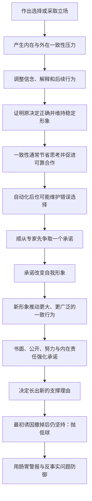

本章的中心张力可以概括为：

> 一致性使人格、计划和社会合作保持稳定；但当“维持旧立场”取代“根据新证据更新”时，同一种优点就会变成维护错误选择的力量。

原书报告了多组实验比例和具体数值，但没有提供可计算的统一“承诺公式”或防御算法。下文出现的公式、模型和操作流程均是笔记的解释性整理；原书数据会明确标注，补充分析不会冒充原书实验结论。

### 0.1 章名“脑子里的怪物”怎样理解

一致性压力大多不以外部命令出现，而是以内在声音运作：“既然我已经这么说、这么做，我就应该继续下去。”它像住在脑中的自动维护程序，能替我们保持稳定，也可能把一次选择扩展成持续自我欺骗。

所谓“怪物”不是承诺本身，而是未经审查的机械一致：

$$
{\text{健康的一致性}}=\text{稳定原则}+\text{响应新证据},
$$

$$
{\text{死脑筋的一致性}}=\text{维护旧立场}-\text{实质复核}.
$$

### 0.2 章首达·芬奇引语的作用

“一开始就拒绝，比最后反悔要容易”预告了承诺的路径依赖。一项请求尚未转化成自己的选择时，拒绝只需评价请求本身；一旦答应，反悔还要克服自我形象、公开观感、既有投入和新生理由。

这不是说人不应承诺，而是提醒：**最便宜的防御时点往往在第一次表态之前。**

---

## 1. 三个基础概念：选择、承诺与一致性

### 1.1 什么是选择

**选择**是从若干可能行动或立场中确定一个。它可以是买一张赛马彩票、答应看管物品、签一份请愿书，也可以是取消婚礼、重新选择伴侣。

选择一旦落实，就不再只是想法，而成为关于“我做过什么”的事实。这个事实会反过来参与后续判断。

### 1.2 什么是承诺

**承诺（commitment）**在本章中不只指庄重誓言，而是任何使人占据一个立场的行动或表态，例如：

- 口头回答“我会”；
- 下注、签名、购买或填写协议；
- 公开说出观点；
- 为某件事付出时间、金钱或痛苦；
- 写下目标或政治声明。

承诺的核心功能是把模糊倾向变成可归属于自己的立场。

### 1.3 什么是一致性压力

**一致性压力**是使当前信念、语言和行动与过去选择相匹配的内外动力：

- **内在压力**：希望把自己理解为稳定、理性、判断正确的人；
- **外在压力**：希望在他人眼中显得可靠、诚实、立场稳定。

可用解释模型表示：

$$
P_{\text{一致}}
=P_{\text{内在自洽}}+P_{\text{外部观感}}.
$$

这里的 $P$ 表示压力而非概率，两个分量也不是实际可相加的实验量。

### 1.4 承诺和一致性的关系

承诺是启动事件，一致性是随后维持立场的力量：

$$
\text{承诺}\rightarrow\text{立场变得明确}
\rightarrow\text{一致性压力}\rightarrow\text{后续行为匹配}.
$$

没有具体承诺时，人仍可以有偏好，却更容易根据新证据调整；承诺把偏好固定成“这是我的选择”，改变立场的心理成本随之上升。

### 1.5 行为一致与显得一致

作者强调，人既想言行一致，也想**显得**言行一致。这两者可分开：

- 行为一致关注自我体验：“我不能否定自己先前的决定”；
- 显得一致关注社会评价：“别人不能觉得我反复无常、不可靠”。

公开承诺之所以比私下想法更顽固，正因为它同时调用两类压力。

---

## 2. 赛马下注：选择怎样反过来改变信心

### 2.1 加拿大心理学家的发现

两名加拿大心理学家观察赛马场赌客：下注前约 30 秒，他们仍犹豫、缺乏把握；下注后约 30 秒，对自己所选赛马获胜的信心明显提高。

客观条件没有变化：

- 还是同一匹马；
- 还是同一条赛道；
- 比赛尚未提供新信息；
- 唯一变化是赌客已经买票下注。

因此，信心上升不能合理归因于赛马胜率突然改变。

### 2.2 因果结构

这里最重要的反转是：通常我们以为“信心导致下注”，实验现象还显示“下注会反过来增强信心”。

### 2.3 为什么态度会追随行为

下注之后，人若继续承认“我其实毫无把握”，就要同时面对两个不舒服判断：

1. 我用钱支持了一个不可靠选择；
2. 我的行为可能不理性。

提高对赛马的信心，可以让行为重新显得合理：

$$
\text{我已下注}+\text{它很可能赢}
\rightarrow\text{我的决定是正确的}.
$$

### 2.4 这不是赛马信息变好了

必须区分：

- **认识更新**：得到新的赛况、赔率或健康信息后提高胜率判断；
- **一致性更新**：没有新证据，只因已经下注而提高信心。

前者是基于信息的修正，后者是基于自我承诺的修正。

### 2.5 与沉没成本的区别

下注后信心上升与沉没成本都发生在投入之后，但关注点不同：

| 概念 | 核心问题 | 赛马案例中的表现 |
| --- | --- | --- |
| 一致性压力 | 我怎样让信念符合已作选择 | 更相信所选马能赢 |
| 沉没成本 | 已投入且不可收回的成本是否影响继续投入 | 若因已下注继续追加，才更接近沉没成本 |

本章首先解释态度和自我辩护的变化，不应把所有投入后坚持都简单叫作沉没成本。

### 2.6 证据边界

原书没有在此提供样本量、信心量表、效应大小或对照程序。案例支持“下注前后信心不同”的现象性结论，不能据此计算任何赌客的具体偏差，也不能证明一致性是唯一机制。

---

## 3. 莎拉与蒂姆：艰难选择怎样“长出”新的正当理由

### 3.1 关系背景

莎拉与蒂姆同居后，希望蒂姆结婚并戒酒，蒂姆两项都拒绝。莎拉结束关系，后来与前任男友订婚、确定婚期并发出请帖。

蒂姆此时回来请求复合，先表示愿意结婚，又承诺戒酒。莎拉取消婚礼，选择重新和蒂姆在一起。

### 3.2 最初诱因被撤走

不到一个月，蒂姆便说没必要戒酒；后来又把结婚改成“再等等”。两年过去，他仍酗酒，也没有结婚计划。

按普通交易逻辑，莎拉选择蒂姆的重要依据已经消失，她应重新评价决定。但她反而比以前更投入，并声称这次艰难选择证明蒂姆在自己心中排第一。

### 3.3 决定怎样改变叙事

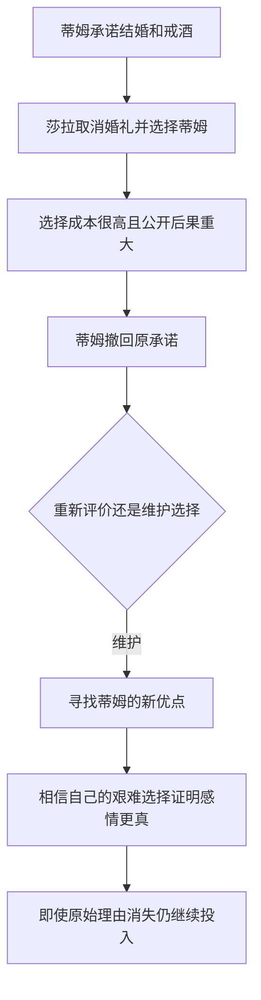

### 3.4 为什么艰难选择更容易被维护

选择成本越高，承认错误意味着承认自己牺牲了婚礼、前任关系、时间和声誉，却没有换来承诺兑现。为了避免这一结论，人会生成新的支持理由。

可以把选择后的主观支持结构写成：

$$
S_{\text{决定}}
=R_0+R_1+R_2+\cdots+R_n,
$$

其中 $R_0$ 是最初理由，$R_1\ldots R_n$ 是决定后发现或生成的新理由。这个模型是笔记整理。即使 $R_0$ 消失，其余理由也可能继续支撑选择。

### 3.5 这是后文“抛低球”的预告

莎拉案例在章首先展示结果，后文才正式命名机制：请求者先用一个诱因促成决定，等决定建立并长出新支撑后，再撤掉诱因。决定未必随诱因一起消失。

### 3.6 不能把坚持本身当作爱的证据

“我为这段关系牺牲很多”说明投入存在，不自动证明关系质量高。评价应回到可观察条件：

- 承诺是否兑现；
- 核心冲突是否改善；
- 新发现的优点是否在选择前也足以支持同样决定；
- 若今天第一次遇到相同条件，是否仍会选择。

最后一个问题会成为作者防御抛低球的关键反事实测试。

---

## 4. 理论背景：为什么一致性会成为强大驱动力

### 4.1 三位早期理论家

作者提到利昂·费斯廷格（Leon Festinger）、弗里茨·海德（Fritz Heider）和西奥多·纽科姆（Theodore Newcomb）。这些理论家从不同路径强调，人倾向维持认知、态度和关系结构的协调状态。

引入他们的作用不是把本章全部现象归给同一个理论，而是说明“一致性是行为重要驱动力”早已有广泛心理学背景。

### 4.2 认知失调与本章的关系

作为必要背景，费斯廷格的**认知失调**关注相互冲突的认知怎样产生不适，并推动人改变信念、行为或解释。例如：

$$
\text{我判断理性}
\quad\text{与}\quad
\text{我作了糟糕选择}
$$

发生冲突时，人可能承认错误，也可能提高对选择的评价来减轻失调。

但本章还使用自我形象、社会评价、行为线索等解释，不能把所有案例都简化成单一的认知失调实验。

### 4.3 一致性压力能否使人违背最佳利益

作者的答案是肯定的：人可能为了维护原立场，继续糟糕关系、购买不需要的服务、忽视新证据，甚至承担个人风险。

判断“坚持”是否合理的标准不应是它与过去一致，而应是：

$$
U_{\text{未来}}(\text{继续})
\quad\text{是否大于}\quad
U_{\text{未来}}(\text{改变}).
$$

这是笔记的规范性决策式。已经发生的承诺应作为历史信息，而不应自动替代未来成本收益判断。

---

## 5. 沙滩偷窃实验：一句承诺怎样改变高风险行为

### 5.1 实验问题

人是否会仅因答应“帮忙看东西”，就冒险制止陌生人偷窃？纽约市一处沙滩的现场实验通过近似相同的偷窃情境比较有无承诺。

### 5.2 基本程序

研究助手在随机选中的受试者约两米外铺浴巾，播放便携收音机，随后离开散步。另一名研究人员稍后假扮小偷，拿起收音机准备离开。

两种条件的关键差异是：离开前，助手是否请受试者“帮忙看着我的东西”。

### 5.3 结果

| 条件 | 实验次数 | 出手阻止次数 | 阻止比例 |
| --- | ---: | ---: | ---: |
| 未作承诺 | 20 | 4 | 20% |
| 先答应看管 | 20 | 19 | 95% |

绝对差异为：

$$
95\%-20\%=75\text{ 个百分点}.
$$

也就是说，一个简短承诺对应的阻止比例绝对差异为 75 个百分点。

相对比值为：

$$
\frac{95\%}{20\%}=4.75.
$$

### 5.4 为什么这个实验有解释力

在两种条件中，沙滩、收音机、偷窃行为和距离大体相同。一个简短承诺把旁观者的角色从“附近陌生人”改成“已经答应负责看管的人”。

承诺后的行为包括要求解释、拦住小偷，甚至承担身体冲突风险。它说明一致性不只改变口头态度，还能推动高成本行动。

### 5.5 机制

### 5.6 适用边界

实验不表示人应在现实中为财物冒险。安全、报警、求助和记录信息通常比直接身体拦截更合适。研究说明承诺会显著改变介入倾向，不构成风险处置建议。

此外，原书没有在此给出随机化、个体特征或伤害风险控制细节。20 次对 20 次的差异很大，但仍应把结论限定在类似现场程序。

---

## 6. “言出必行”：一致性为什么通常是优点

### 6.1 社会评价价值

在多数文化情境中，言行一致与以下品质相连：

- 稳定；
- 可靠；
- 诚实；
- 逻辑清晰；
- 个性坚强；
- 可预测、便于合作。

相反，反复无常的人容易被视为混乱、表里不一、优柔寡断或不可信。

### 6.2 法拉第的幽默说明了什么

英国化学家迈克尔·法拉第被问到是否认为某位学术对手“一贯出错”，他反驳说对方还没有那么前后一致。笑点在于：即使“总是错”也需要稳定性，而那个对手连这种一致都做不到。

作者借此强调，社会对一致性的赞赏有时甚至压过对正确性的关注。

### 6.3 一致性怎样支持长期行动

没有一定一致性，人每天都要重新决定是否履行合同、遵守计划、维护关系和坚持原则。稳定规则降低协调成本：

$$
C_{\text{生活}}
=C_{\text{重新决策}}+C_{\text{协调不确定性}}.
$$

一致性减少两类成本，因此通常符合个人和群体利益。公式是笔记的解释模型。

### 6.4 一致不等于永不改变

健康一致性可以建立在更高层原则上，例如“根据最佳证据行动”。当证据变化时，修正具体结论反而与高层原则一致。

| 表面一致 | 原则一致 |
| --- | --- |
| 维持昨天的具体答案 | 维持诚实、求真和风险控制 |
| 忽略反证以免改口 | 根据反证更新 |
| 把改变视为软弱 | 把合理修正视为可靠 |

作者批评的是死脑筋的一致性，不是稳定品格本身。

---

## 7. 自动一致性的第一项诱惑：节省思考

### 7.1 决定之后无需重新计算

现代生活信息繁多。若每次遇到同类情况都重新搜集事实、权衡利弊和选择行动，认知成本极高。一旦拿定主意，保持一致提供了一条捷径：

### 7.2 乔舒亚·雷诺兹的判断

乔舒亚·雷诺兹爵士说，若有办法省掉动脑这一真正的体力活，人们不会放过。引语说明自动一致性的吸引力不只在道德上“守信”，还在认知上省力。

### 7.3 何时这种捷径有效

它较适合：

- 环境稳定；
- 旧决定经过充分思考；
- 新情境与旧情境相似；
- 错误成本较低；
- 没有出现重大反证。

### 7.4 何时容易出错

它容易失效于：

- 最初决定在匆忙、误导或信息不足下作出；
- 环境或价格已经变化；
- 请求者刻意制造小承诺；
- 新证据推翻原始依据；
- 继续坚持的未来损失很大。

问题不是使用旧决定，而是不检查旧决定赖以成立的条件是否仍在。

---

## 8. 自动一致性的第二项诱惑：逃避不愿面对的答案

### 8.1 不思考有时是情绪防御

人逃避思考不只是因为费力。有些分析会得出痛苦结论：关系不值得继续、信仰缺乏证据、购买是错误、希望可能落空。自动一致性提供一座“城堡”，让人躲开这些答案。

两种诱惑要分开：

| 诱惑 | 逃避什么 | 典型结果 |
| --- | --- | --- |
| 认知省力 | 复杂计算和信息处理 | 直接沿用旧决定 |
| 情绪回避 | 令人失望或威胁自我的结论 | 主动封闭反证、强化承诺 |

### 8.2 超自然冥想讲座

作者参加一场招募讲座。两名讲师宣称独有冥想术不仅能带来平静，进阶后甚至可腾空、穿墙。作者带来一名精通统计和符号逻辑的大学教授。

提问时，这位教授用很短时间指出理论矛盾、逻辑缺陷和证据不足。讲师无法有效回应，最后承认问题值得研究。按常识，听众此时应更谨慎；结果却相反，一群人争相支付 75 美元报名，连讲师自己都感到意外。

### 8.3 三名报名者的真实需要

作者与三名立即付款者交谈：

- 一名演员希望提高自我控制，改善演技；
- 一名严重失眠者希望放松并入睡；
- 一名课程不及格的学生希望减少睡眠，以腾出学习时间。

同一冥想术被承诺既帮助睡眠，又减少睡眠，逻辑上可疑；三人却都迫切需要解决真实问题。

### 8.4 为什么有力反驳反而加速付款

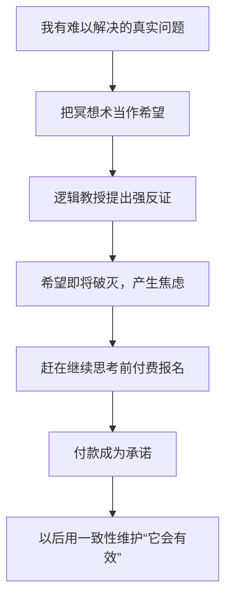

报名者不是没听懂反驳，恰恰是听懂了，才急于在理性摧毁希望之前用付款锁定立场。

### 8.5 这不是“证据越差，销量越高”的普遍规律

案例依赖特定条件：

- 听众有强烈未满足需求；
- 方案承诺巨大希望；
- 反证威胁的不是普通偏好，而是潜在救命方案；
- 当场付款能建立心理防线。

在没有强烈身份或希望威胁时，反证通常仍会降低可信度。

### 8.6 两种自动化诱惑如何相连

先付款后，参与者既不必继续费力比较，也不必面对希望破灭。自动一致性同时提供认知省力和情绪保护，因此特别难以打破。

---

## 9. 玩具公司的季节性策略：利用父母“言出必行”

### 9.1 商业难题

玩具销售在圣诞节前达到高峰，随后几个月低迷。父母已经花完预算，孩子家中也有大量新玩具。普通广告和降价都难以让父母在一、二月继续购买。

制造商需要完成看似矛盾的目标：

- 圣诞节前照常卖出大量玩具；
- 节后再创造第二轮昂贵购买；
- 不显著增加促销成本。

### 9.2 策略流程

作者从一位玩具业朋友那里得知，部分大型制造商采用如下安排：

1. 圣诞节前密集宣传一款特别吸引孩子的玩具；
2. 孩子要求，父母答应把它作为圣诞礼物；
3. 商家对该热门款供货不足，使父母买不到；
4. 父母改买供应充足的其他等价玩具，圣诞销售不受损；
5. 节后再次广告热门款；
6. 孩子提醒父母“你答应过”；
7. 父母为保持承诺，再买一次昂贵玩具。

### 9.3 作者的两次经历

一年，作者在圣诞后给儿子买了大型电动赛车；此前他已答应购买，却在节前遇到缺货，只能买其他玩具补偿。更早一年，同样过程发生在会走路、说话甚至排便的机器人上。

他在玩具店遇到一位很少见面的旧邻居，两人连续两年都在圣诞后购买同类昂贵玩具。玩具业朋友指出，这并非单纯巧合，而是同一承诺策略把许多父母带回商店。

### 9.4 为什么知道策略后仍难退出

作者得知真相后想退掉赛车，却马上碰到另一层成本：孩子只知道父亲答应了礼物，不理解供应操纵。退货会使作者显得言而无信，也违背他想教孩子“承诺应兑现”的教育原则。

因此，识破操纵不一定立刻解除已经形成的承诺。请求者退出现场后，父母自己的价值观会继续执行策略。

### 9.5 与稀缺原理的关系

缺货也可能提高渴望，但本章强调的是另一链条：广告先促成父母承诺，缺货迫使替代购买，补货后由一致性推动第二次购买。

若只解释成“越缺越想要”，就会漏掉父母为何觉得必须兑现先前承诺。

### 9.6 商业边界与证据限制

作者通过行业人士解释自身重复经历，没有在本章提供企业文件或随机销售数据。对“故意供货不足”的判断应保留为作者报告的行业策略，而不是对所有缺货事件的普遍推断。

正常供应预测失误、生产限制和意外爆款也会造成缺货。识别时要看是否反复出现“节前广告—缺货—节后补货再广告”的稳定模式。

---

## 10. “承诺是关键”：什么按下了一致性播放键

### 10.1 从一般倾向到可操作杠杆

知道“人喜欢一致”还不够，顺从专家需要找到一个能启动它的具体动作。社会心理学家的答案是：**先让目标作出承诺，也就是选定立场、采取行动或公开表态。**

完整路径是：

### 10.2 承诺为什么适合被顺从专家利用

直接提出最终大要求可能遭拒；先争取一个容易接受的小表态，目标往往看不见其长期后果。承诺一旦形成，后续压力主要由目标自己的心理系统施加，请求者不必持续强迫。

这是一种“社交柔道”：顺从专家只负责把人推到一个立场上，一致性替他完成后面的工作。

### 10.3 承诺不等于合同

本章的承诺范围远大于法律合同。一次调查回答、一张签名、一项小购买、写下几句话都可能形成心理承诺，即使没有法律强制力。

| 法律合同 | 心理承诺 |
| --- | --- |
| 依赖明确条款和可执行规则 | 依赖自我形象与一致性压力 |
| 通常有清楚权利义务 | 后续影响可能隐蔽、扩散 |
| 解除条件可被约定 | 人可能在客观条件消失后仍坚持 |

### 10.4 初步倾向也可能被固化

人不必先有强烈信念。只要模糊倾向被转成口头预测或小行动，后续就会偏向与它一致。顺从专家因此常选择“你会不会”“你是不是”“你愿不愿意原则上……”这类低门槛问题。

---

## 11. 口头预测与客套回答：微小承诺也能改变行为

### 11.1 史蒂夫·谢尔曼的志愿者预测

社会心理学家史蒂夫·谢尔曼给印第安纳州布卢明顿地区的居民打电话，称自己在做调查，询问：如果美国癌症协会需要，受访者是否愿意花 3 小时做志愿募捐。

很多人不愿显得冷漠，于是回答愿意。几天后，美国癌症协会真的来电组织募捐团，实际志愿者数量比从前多了 7 倍。

### 11.2 为什么“预测自己”会变成承诺

回答表面上只是预测未来，却同时公开定义了自己：

$$
{\text{我说自己会帮助}}
\rightarrow \text{我是愿意助人的人}
\rightarrow \text{真实请求到来时应当照做}.
$$

拒绝真实请求会同时否定几天前的回答和乐于助人的自我形象。

### 11.3 投票预测

另一批研究者用类似方法询问居民是否会在选举日投票，接受预测调查者的实际投票率随之提高。原书没有在此报告具体百分比，因此只能保留方向性结论：让人提前说出计划，可增加后续一致行为。

### 11.4 从预测到行动需要哪些前提

效果更可能出现于：

- 预测由本人说出；
- 行动与预测直接对应；
- 时间间隔不太长；
- 对方记得自己的回答；
- 回答具有道德或身份含义；
- 实际行动仍在能力范围内。

若情况发生重大变化，继续要求机械兑现就不合理。

### 11.5 募捐电话为什么先问“今天过得怎么样”

募捐员常以“今晚感觉如何”或“今天过得怎么样”开场。多数人会礼貌回答“挺好”“不错”。接着，募捐员提出帮助不幸者的请求。

这不只是建立亲切感，还可能制造一个公开立场：我刚说自己过得不错，现在若完全不帮助过得不好的人，会显得吝啬或前后不协调。

### 11.6 丹尼尔·霍华德的第一项实验

消费者研究员丹尼尔·霍华德给得克萨斯州达拉斯居民打电话，请他们允许饥荒救济委员会代表上门卖饼干，收益用于贫困家庭食物。

| 条件 | 程序 | 答应接待比例 |
| --- | --- | ---: |
| 标准请求 | 直接提出上门卖饼干 | 18% |
| 先问近况 | 先问“今晚您感觉如何”，等回答后再请求 | 32% |

在先问近况条件的 120 人中，108 人作出“挺好”“不错”等客套正面回答。

绝对差异是：

$$
32\%-18\%=14\text{ 个百分点}.
$$

相对比值约为：

$$
\frac{32\%}{18\%}\approx1.78.
$$

答应让销售人员上门者中，89% 最终实际购买了饼干。这里的 89% 是**答应接待者中的购买率**，不能当作全部受访者购买率。

### 11.7 第二项实验怎样排除“只是更礼貌”

霍华德比较两个同样友好的开场：

- 提问：“今晚您感觉如何？”由受访者亲口回答；
- 陈述：“我希望您今晚感觉不错。”受访者不必表态。

结果：

| 开场 | 顺从比例 |
| --- | ---: |
| 提问并获得回答 | 33% |
| 友好陈述、不要求回答 | 15% |

两种说法都热情友好，但只有提问让目标作出公开承诺。绝对差异为 18 个百分点，相对约为 $33/15=2.2$ 倍。

### 11.8 为什么客套回答仍然有作用

回答内容虽然没有实质信息，却是本人刚说出口的公开自我描述。一致性系统不总能精细区分“深思熟虑的信念”与“社交脚本中的客套话”。

### 11.9 伦理使用与防御

诚实沟通不应把客套近况当成捐款资格。接受者可以直接拆开两件事：

> 我今天过得不错，但是否捐款仍要根据机构真实性、用途和预算独立决定。

---

## 12. 战俘营的“以小积大”：怎样从无害表态走向合作标签

### 12.1 原书的匿名国家表述

本版以 A、B、C 三国代称战争参与方。本笔记沿用原书符号，不擅自补入具体国名。A 国战俘受过训练，通常只提供姓名、军衔和编号；C 国管理者避免以严刑拷打为主要手段，转而使用复杂心理策略。

### 12.2 C 国方面要解决的第一道难题

直接要求战俘泄露情报、谴责祖国或告发同伴，会触发强烈身份防御。管理者需要的不是一步到位，而是让战俘先做**任何形式的合作**。

作者注特别说明，“合作不一定是有意识的”，更不一定等于自觉变节。调查者把所有帮助敌方的行为都算作合作，包括跑差、签和平请愿书、在电台里发出呼吁、接受特殊待遇、作虚假供述、告发同伴和泄露信息等。

### 12.3 从温和陈述开始

管理者先要求战俘同意看似无害的说法，例如：

- “A 国并不完美”；
- “这里没有失业问题”；
- 支持和平的一般陈述。

这些话不要求战俘立刻否定全部身份，因而更容易得到第一次顺从。

### 12.4 小步升级链

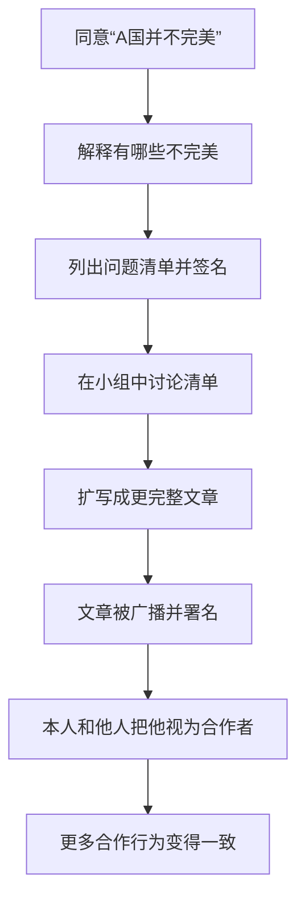

每一步与前一步相连，增量看似不大；累积结果却可能远离最初立场。

### 12.5 一袋大米与同伴告发

调查负责人之一埃德加·沙因（Edgar Schein）报告，若有人逃跑，管理者只需用一袋大米奖励告发者，往往便能找到逃跑者。据称，几乎所有 A 国战俘都曾以某种方式合作。

这个陈述描述的是广义合作，不应误读为几乎所有人都自觉接受敌方意识形态。

### 12.6 标签怎样反过来改变人

一旦文章署名播出，战俘面对一个新事实：“我已经公开帮助了对方。”若他不能把行为归因于明显胁迫，就更可能调整自我形象以符合行为：

$$
{\text{我做了合作行为}}
\rightarrow \text{我或许是某种合作者}
\rightarrow \text{更多合作与新形象一致}.
$$

### 12.7 以小积大的关键不是每步都强迫

如果每一步都由明显暴力造成，战俘可以把行为解释成“我只是被迫”，自我形象不必改变。策略的精细之处，是让每一步看起来足够温和、主动、可辩护。

### 12.8 伦理边界

这是高控制、战争囚禁环境中的心理操纵案例。解释技术不等于认可做法。战俘的自由选择受到拘禁、审查、资源匮乏和权力不对称严重限制，不能把结果简单归因于普通日常承诺。

---

## 13. 从小订单到“登门槛”：承诺怎样逐级扩大

### 13.1 商业中的小订单

销售组织常把利润很低的小订单视为重要起点。购买者一旦签单，就从“潜在客户”变成“真正客户”。后续销售不再面对完全陌生的人，而面对一个已经用行动确认过关系的人。

### 13.2 定义

**登门槛技巧（foot-in-the-door technique）**是先让目标答应一个小请求，形成承诺或自我认知，再提出较大的请求。

### 13.3 与第二章拒绝—后撤的区别

| 技巧 | 顺序 | 第一请求的结果 | 主要机制 |
| --- | --- | --- | --- |
| 登门槛 | 小 → 大 | 第一请求被接受 | 承诺、自我形象、一致性 |
| 拒绝—后撤 | 大 → 小 | 第一请求被拒绝 | 互惠式让步、知觉对比 |

两者方向相反，不能只因都有两个请求就混淆。

---

## 14. 弗里德曼—弗雷泽实验：小标牌怎样变成巨型告示牌

### 14.1 1966 年实验的最终请求

乔纳森·弗里德曼（Jonathan Freedman）和斯科特·弗雷泽（Scott Fraser）让研究人员假扮义工，到加利福尼亚居民区请求业主在前院竖起巨大的“小心驾驶”公益告示牌。照片显示，牌子几乎挡住漂亮房屋的正面视线。

直接提出这项荒谬要求时，只有 17% 的业主同意。

### 14.2 相关小承诺条件

另一组业主在约两周前答应过一个极小请求：在院前放置一块约 3 英寸、写有“做一个安全的驾驶员”的小牌。这个请求几乎人人接受。

两周后面对巨型“小心驾驶”牌时，76% 同意。

绝对差异：

$$
76\%-17\%=59\text{ 个百分点}.
$$

也就是说，相关小承诺条件与直接请求条件相差 59 个百分点。

相对比值：

$$
\frac{76\%}{17\%}\approx4.47.
$$

### 14.3 为什么不只是“同一话题逐步加码”

研究者另找一组业主，先请他们签署“保护加州美丽环境”的请愿书。约两周后，新义工请求竖起“小心驾驶”巨牌。两个议题并不相同，将近一半业主仍然同意。

这使简单的“他们已经支持交通安全”解释不够充分。小承诺可能改变了更一般的自我形象：

> 我是有公益精神、愿意配合合理公共请求的好公民。

### 14.4 从具体态度到身份标签

相关小牌主要支持具体一致性：

$$
{\text{我支持安全驾驶}}\rightarrow\text{继续支持安全驾驶}.
$$

环境请愿书则支持身份一致性：

$$
{\text{我参加公益行动}}\rightarrow\text{我是热心公共事务的人}
\rightarrow\text{接受另一公益请求}.
$$

身份层承诺的影响范围更广，也更难被当事人察觉。

### 14.5 为什么业主难以追溯真正原因

第二次请求由新义工提出，间隔约两周，主题还可能不同。业主即使后悔，也更容易归因于自己的公民精神，不会想到先前那份小请愿书。

### 14.6 实验解决了什么

它说明：

1. 小承诺可以提高相关大请求的顺从；
2. 小承诺还可能改变自我认知，影响不直接相关的请求；
3. 行为的影响不依赖请求者始终是同一人；
4. 效果可以跨越数周。

### 14.7 数据边界

原书报告 17%、76% 和“将近一半”，但本章未同时给出样本量、置信区间及所有程序细节。`4.47` 是笔记按报告比例计算的描述性比值，不是跨场景固定效应。

### 14.8 签名本身不是坏事

作者说自己因此对签请愿书更谨慎，不是在否定公民参与。合理做法是：

- 只签真正理解和支持的主张；
- 不因签过一项公益议题，就自动接受所有“公益”请求；
- 对后续请求重新检查成本、事实和相关性。

---

## 15. 小承诺为什么危险：它可能重塑自我形象

### 15.1 行为不只表达身份，也建构身份

通常我们认为：先有态度，再有行为。本章加入反向路径：

$$
{\text{既有态度}}\rightarrow\text{行为},
$$

$$
{\text{观察自己的行为}}\rightarrow\text{推断自己是什么样的人}.
$$

### 15.2 自我知觉的直觉

人判断别人时会看其行为；判断自己时也会使用相似证据。如果我答应陌生人的公益请求、签名并实际行动，我可能推断自己是乐于配合公益的人。

### 15.3 自我形象为何比单项观点更持久

单项观点只约束一个主题；身份标签可以生成一组行为：

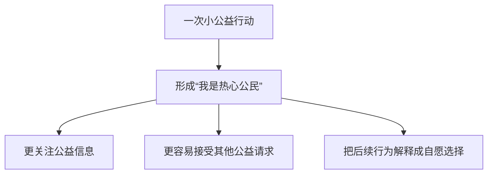

### 15.4 顺从专家真正想要的是什么

最有价值的结果不是拿到一次小签名，而是把潜在客户变成“客户”、把旁观者变成“公仆”、把战俘变成“合作者”。一旦身份设置完成，一系列后续要求会显得自然。

### 15.5 哪些承诺并不会深刻改变人

作者明确指出，不是所有承诺都足以改变自我形象。后续章节逐步筛选出强承诺条件：

- 当事人主动采取行动；
- 承诺留下书面或行为证据；
- 承诺公开、为他人所知；
- 为承诺付出努力；
- 行为看起来是自由选择，而非强大外部压力所迫。

这些条件不是简单相加的分数，而是共同增加“这件事真正代表我”的归因。

### 15.6 战后评估显示管理者至少暂时追求自我与信念改变

战后，心理评估负责人亨利·西格尔（Henry Segal）考察获释战俘，报告其战争信念和政治态度受到显著影响。按他的总结，C 国项目追求的不只是零散情报，而是让战俘出现变节、不忠、态度与信仰变化、军纪和士气下降，以及对 A 国战争角色的怀疑。

这说明“小合作”的项目目标，是至少暂时性地修正战俘的自我形象和解释系统。评估发生在战俘获释后，原文并未据此证明变化能长期持续。与此同时，战俘处于拘禁与信息控制环境，不能把这些结果等同于普通自由市场中的自愿态度改变。

---

## 16. “奇妙的行为”：人会根据自己的行动推断信念

### 16.1 为什么行为比口头想法更有分量

口头说法容易随口、遗忘或否认；实际行为留下更强证据。人观察自己“做了什么”，往往据此判断自己的价值观和态度。

### 16.2 战俘营为什么不断要求写下来

C 国管理者不满足于战俘安静听讲或口头附和，而要求他们：

- 抄写问题；
- 自己写出支持 C 国的答案；
- 列清单并签名；
- 写文章或家信；
- 参加政治征文。

即使只是从笔记中摘抄，看似无害，也会产生本人亲手完成的行为证据。

### 16.3 书面承诺的第一项力量：不可否认的物证

口头发言可能被遗忘、误传或解释为随口应付；亲笔文字一直存在。看到自己的笔迹，人更难说“我从没做过”。

$$
{\text{书面行为物证}}
\rightarrow \text{否认空间缩小}
\rightarrow \text{自我形象向行为靠拢}.
$$

### 16.4 第二项力量：可以被别人看见

书面声明容易张贴、传阅、朗读和广播。它不仅告诉本人“我做过”，还告诉别人“他相信这个”。外界评价再反过来塑造本人。

### 16.5 主动行为与被迫行为的区别

如果人明确认为“我是在枪口下写的”，行为更容易归因于外部压力，自我形象不必改变。管理者因此尽量用小奖励、邮件机会和竞赛等方式，让写作显得是本人选择。

---

## 17. 琼斯—哈里斯实验：明知文章受命而写，读者仍推断作者真心相信

### 17.1 实验问题

心理学家爱德华·琼斯（Edward Jones）和詹姆斯·哈里斯（James Harris）让受试者阅读一篇支持菲德尔·卡斯特罗的文章，并判断作者真实态度。

### 17.2 两种来源条件

- 一部分受试者得知作者自愿选择支持立场；
- 另一部分明确得知作者被要求、缺乏自由选择。

### 17.3 结果与含义

即使知道作者是被迫写支持文章，读者仍倾向认为作者对卡斯特罗抱有一定好感。声明内容会自动被当作态度线索，情境约束没有被充分扣除。

### 17.4 归因错误背景

作为补充背景，这与人低估情境、过度从行为推断人格的倾向相近。看到文章时，内容非常显眼；“这是角色要求”虽已知，却未被充分用于修正判断。

### 17.5 对战俘的双重压力

战俘写下声明后：

1. 内部看到自己的行为，调整自我形象；
2. 外部他人把声明当成真实态度；
3. 他人以后以“你就是这样的人”对待作者；
4. 作者再向外界形象靠拢。

### 17.6 纽黑文家庭主妇案例

一群康涅狄格州纽黑文家庭主妇得知别人认为她们乐善好施。一周后，多发性硬化症协会募捐员上门，她们的捐赠果然更慷慨。

这个案例说明，别人赋予我们的正面标签也会形成一致性压力。原书没有在此报告具体金额和对照比例，应保留方向性结论。

### 17.7 边界

文章或标签并不总能永久改变身份。强反证、清楚的角色约束、本人公开否认和新行为都能修正判断。实验揭示的是一种倾向，不是“写什么就必然信什么”。

---

## 18. 书面承诺在战俘营与商业中的应用

### 18.1 家信审查：用通信机会换取公开文字

战俘迫切想向家人报平安，却知道邮件会被审查。为提高寄出机会，有人会在信中加入和平呼吁、对营地生活的正面描述，或对 B、C 两国人民的同情。

管理者因此同时获得：

- 可用于对外宣传的 A 国军人文字；
- 战俘本人写下并署名的公开承诺。

### 18.2 政治征文为什么只给小奖品

战俘营举办政治征文，奖品只是香烟和水果。获奖文章通常支持 C 国，但管理者也让整体支持 A 国、只在一两点附和 C 国的文章获奖。

这套设计降低第一次参与门槛：战俘不必立即写彻底宣传文，只需略作让步。为了下次提高获奖概率，文章可能逐渐向 C 国立场移动。

### 18.3 小奖品为何比大奖更适合改变态度

大奖能提高参与，却给作者留下完整外部解释：“我只是为了奖品。”小奖仍可推动行为，又不足以完全解释立场，因此更容易产生内在归因。

这一点会在后文“内心的抉择”中正式展开。

### 18.4 安利的书面销售目标

安利要求销售人员亲手写下个人销售目标。书写使目标具体、可见，也形成本人行为证据。达到目标后再写下一个，借一致性推动持续行动。

### 18.5 “冷静期”法律与手写销售协议

一些地区允许消费者在上门购买后的数日内取消交易并全额退款。高压销售公司原本因此遭遇大量退单。

后来，部分公司要求消费者本人而非销售员填写销售协议。合同的法律内容可能没变，但亲手书写让购买更像本人主动承诺，取消交易的心理阻力随之增加。

### 18.6 这里的伦理问题

冷静期旨在保护受高压影响的消费者。企业若利用书写强化承诺，形式上未必违法，却可能削弱法律想恢复的反思空间。消费者应把取消权理解为合同的一部分，而不是“不守承诺”。

### 18.7 宝洁与通用食品的短文比赛

宝洁、通用食品等公司举办 25、50 或 100 字短文比赛，要求以“我喜欢某产品，因为……”开头赞美商品。参赛者无需购买，但为了争取奖金，会主动寻找产品优点并写下来。

商业价值不只是一篇广告素材，而是让大量消费者亲手生产支持产品的书面论据：

$$
{\text{寻找优点}}\rightarrow\text{写下优点}
\rightarrow\text{书面承诺}\rightarrow\text{更相信自己的表述}.
$$

### 18.8 与战俘征文的结构相似与伦理差异

两者都用小奖励吸引主动写作，并借书面承诺影响态度；但战俘处于拘禁和审查环境，自由度远低于消费者。结构相似不意味着伦理严重程度相同。

---

## 19. “众目睽睽”：公开承诺为什么更顽固

### 19.1 公开承诺增加什么

私下承诺主要面对内在自洽；公开承诺还要维护他人眼中的稳定形象。改变立场可能被解释为软弱、摇摆或不可靠。

$$
P_{\text{公开承诺}}
=P_{\text{内在一致}}+P_{\text{社会观感}}+P_{\text{声誉损失}}.
$$

这是笔记的解释式，不是原书量表。

### 19.2 战俘声明怎样被公开

C 国管理者会：

- 把声明张贴在营地；
- 让作者在讨论小组中朗读；
- 通过广播传播；
- 把姓名与文章一同播出。

知道的人越多，作者撤回立场的外部成本越高。

### 19.3 多伊奇—杰拉德直线判断实验

心理学家莫顿·多伊奇（Morton Deutsch）和哈罗德·杰拉德（Harold Gerard）让大学生估计直线长度，并设置三种最初判断条件：

| 条件 | 最初判断怎样保存 | 承诺强度 |
| --- | --- | --- |
| 无承诺 | 只在脑中记住 | 最弱 |
| 私下书写 | 写在可擦的磁性书写板上，不给别人看 | 中等 |
| 公开书写 | 写下、签名并交给实验人员 | 最强 |

之后，研究者提供新证据，暗示原判断错误，让受试者有机会修改。

### 19.4 结果梯度

- 无承诺者最容易依据新证据调整；
- 私下写过者更抗拒改变；
- 公开写下并签名者最顽固。

这形成承诺强度梯度：

$$
{\text{无承诺}}<\text{私下书写}<\text{公开签名}.
$$

### 19.5 为什么准确任务也会受影响

直线长度判断有客观正确答案，准确本应比形象重要；公开承诺仍降低修正意愿。这表明社会一致性可以渗入本应按证据更新的判断。

### 19.6 陪审团投票方式

6 至 12 人陪审团研究发现，相较不记名投票，举手公开表达最初意见后，陪审员更容易固执己见。

实践含义：若目标是先收集独立判断、减少过早立场锁定，可以先匿名投票，再讨论理由，最后重新表决。

### 19.7 减肥诊所怎样利用公开目标

一些减肥诊所要求客户写下近期目标，并给尽可能多的亲友、邻居看。诱惑出现时，违约不只影响私人计划，还可能损害公开形象。

公开承诺可帮助自愿改变习惯，但应避免羞辱、过高目标和隐私侵犯，否则失败成本过大，反而可能逃避记录或放弃。

### 19.8 戒烟承诺卡

圣迭戈一名女性多次戒烟失败后，列出自己特别希望得到尊重的人，为每个人写并签名一张“我保证不再抽烟”的卡片，寄给父亲、哥哥、老板、朋友、前夫和正在约会的人。

她每次想吸烟时，都会想象这些人知道自己违约后的评价。公开声誉压力帮助她最终不再吸烟。

### 19.9 正当使用的条件

公开承诺适合用于本人自愿、目标健康、标准合理、可以获得支持的改变。它不应被用于：

- 强迫公开敏感信息；
- 用羞辱代替支持；
- 把合理调整目标说成道德失败；
- 阻止人根据新证据改变看法。

### 19.10 公开与正确之间的制度设计

需要独立判断的组织，可在初期减少公开锚定：匿名意见、先写理由后看他人答案、允许正式修订。需要坚持健康行为时，则可在本人自愿前提下适度公开目标。

---

## 20. 有效承诺的条件：不是所有“答应”都一样

### 20.1 作者逐步筛选出的条件

到这里，本章已显示承诺有强弱差异。能深入改变自我形象并长期影响行为的承诺，通常具有四类特征：

1. **主动行动**：不只是被动听见，而是本人说、写或做；
2. **公开可见**：立场会被他人知道；
3. **付出努力**：承诺需要时间、劳动、金钱、痛苦或声誉成本；
4. **内在负责**：本人认为行为是自由选择，而不是强大威胁或大奖逼出来的。

### 20.2 为什么四类条件指向同一核心

它们都提高一种归因：

> 这项行为真正代表我，而不是偶然、随口、秘密尝试或外力产物。

可用解释性关系表示：

$$
C_{\text{内化}}
=f(A,P,E,R),
$$

其中 $A$ 为主动性，$P$ 为公开性，$E$ 为努力，$R$ 为内在责任。它不是原书的可计算函数，也不表示四项必须同时达到固定阈值。

### 20.3 条件之间并非完全独立

书写既是主动行为，也需要努力，还容易公开；艰苦仪式既投入努力，也留下难以否认的行为事实。分析具体策略时，应指出哪条路径起作用，而不要把四个词当作机械清单。

---

## 21. “额外的努力”：为什么费力承诺更能束缚人

### 21.1 基本命题

作者提出：为一项承诺付出的努力越多，它对承诺者的影响往往越大。原因不是痛苦本身神奇，而是人需要解释：

> 如果这件事不重要、不值得，我为什么愿意付出这么多？

### 21.2 努力正当化

作为补充背景，**努力正当化（effort justification）**指人提高目标价值，以使高投入显得合理：

$$
{\text{高努力}}+\text{低价值目标}
\rightarrow \text{心理冲突},
$$

$$
{\text{提高目标评价}}
\rightarrow \text{冲突减轻}.
$$

### 21.3 与沉没成本的区别

| 努力正当化 | 沉没成本效应 |
| --- | --- |
| 提高对已经获得目标的评价 | 因过去投入而继续投入未来资源 |
| 核心是“它值得我受苦” | 核心是“不继续就浪费过去成本” |
| 可在加入团体后表现为更喜欢团体 | 可表现为继续留在低价值团体 |

两者可同时出现，但不是同义词。

### 21.4 为什么努力条件易被组织利用

严格筛选、昂贵训练和困难认证可以传递能力，也可能纯粹增加承诺。组织若刻意让进入过程痛苦，新成员会更难承认“我为一个普通团体受了无意义的苦”。

---

## 22. 汤加成年仪式：三个月考验怎样制造成员身份

### 22.1 仪式背景

非洲南部汤加（Thonga）部落要求约 10 至 16 岁男孩进入“割礼学校”，完成复杂成年仪式后才被正式承认为男人。学校约每 4 至 5 年举办一次，考验持续约 3 个月。

### 22.2 人类学记录来源

人类学家怀丁（Whiting）、克拉克洪（Kluckhohn）和安东尼（Anthony）把仪式概括为六类考验：

| 考验 | 原书记载的形式 |
| --- | --- |
| 挨打 | 入场时穿过持棍成年男子，日后也可能受打 |
| 挨冻 | 冬季睡觉不得覆盖保暖物 |
| 挨渴 | 原书转述为“三个月里不准喝一丁点儿的水” |
| 恶心食物 | 食物覆盖羚羊胃中半消化物 |
| 受罚 | 违规会遭疼痛惩罚 |
| 死亡威胁 | 被告知逃跑或泄密者会被杀死 |

此外还有剃发、隔离和割礼等过程。

“三个月滴水不饮”是原书对早期人类学材料的字面转述。从现代生理常识看，若理解为完全不摄入任何水分，显然难以持续；也可能涉及仪式性措辞、通过食物摄水或转述压缩。本笔记保留原文而不擅自弱化，但不把该细节视为已经独立核实的生理事实。

### 22.3 原书为什么提供这些细节

作者不是为了猎奇，而是要建立“加入资格需要巨大努力”的极端样本。若高努力会提高团体价值，严苛仪式应当增强身份承诺和群体凝聚力。

### 22.4 方法与伦理边界

跨文化仪式不能脱离历史与本地语境简单评价；同时，文化传统也不能自动正当化对儿童的伤害。本章解释仪式可能发挥的承诺功能，不构成伦理认可或实践建议。

---

## 23. 兄弟会“地狱周”：六类考验为何跨场景重复

### 23.1 与部落仪式的结构相似

大学和学校兄弟会的入会“地狱周”，也要求申请者经受生理、心理和社交压力，只有坚持到底者才能成为正式成员。

原书逐类给出现实事故，用来显示六种考验并非只存在于远方部落。

### 23.2 挨打：迈克尔·卡罗格里斯

14 岁的迈克尔·卡罗格里斯参加高中兄弟会“地狱之夜”时，腹部遭集体殴打，内伤住院约 3 周。

### 23.3 挨冻：弗雷德里克·布朗纳

加利福尼亚一名大学新生弗雷德里克·布朗纳在冬夜被留在国家森林深处约 10 英里、海拔约 3 000 英尺的山上，只穿单薄衣物。他跌入溪谷受伤，最终冻死。

### 23.4 挨渴：俄亥俄州立大学新生

一批新生因违反爬行进入餐厅的规定，被关近两天，只能吃咸菜，没有正常饮水。

### 23.5 难以下咽的食物：理查德·斯旺森

南加州大学兄弟会要求 11 名新成员每人吞下一块四分之一磅重的生肝。理查德·斯旺森反复尝试后，食物堵塞喉咙，最终窒息死亡。

### 23.6 受罚：威斯康星州案例

一名申请者因忘记仪式咒语，被要求把脚放在折叠椅后腿下，再让体重很大的成员坐上椅子，导致双腿骨折。

### 23.7 死亡威胁：泽塔—贝塔—滔案例

一名申请者被带到海滩挖“自己的坟墓”并躺入坑中，坑壁坍塌将其活埋，获救时已无呼吸。

### 23.8 为什么必须明确伦理结论

这些事故展示高努力与承诺的心理机制，也直接证明仪式会造成严重伤害。能提高凝聚力不等于可接受：

$$
{\text{心理效果存在}}\not\Rightarrow\text{行为合乎伦理或法律}.
$$

任何组织都应以安全、自愿、可退出且与能力相关的挑战替代羞辱、暴力和危险。

---

## 24. 为什么危险仪式难以消失

### 24.1 外部取缔屡次失败

殖民政府、大学管理部门和法律机构曾采用威胁、禁令、监管、流放、收买和社会压力，试图取消危险仪式。结果常是短期收敛，随后转入地下并更加秘密。

### 24.2 “帮助周”为何没有取代“地狱周”

一些学校希望用社区服务“帮助周”替代折磨。兄弟会通常愿意独立开展公益活动，却拒绝把它纳入入会程序。

这说明入会仪式追求的不是一般劳动或组织贡献，而是**无法用高尚外部理由解释的个人苦难**。这个线索会在“内心的抉择”中变得关键。

### 24.3 不能用成员人格异常简单解释

研究并未发现兄弟会成员普遍比其他学生心理更不健康；他们还经常参与公益。残酷行为集中出现在入会情境，提示控制变量可能是制度化仪式，而非每个成员都是虐待狂。

### 24.4 仪式对组织的潜在功能

组织可能从中获得：

- 新成员对资格的珍视；
- 对团体的忠诚和奉献；
- 共同秘密和共同经历；
- “我们经过考验”的优越感；
- 更低的退出概率。

功能解释帮助理解制度为何顽固，不为制度免责。

### 24.5 南加州大学的监管尝试

理查德·斯旺森死亡后，南加州大学校长要求入会仪式事先经校方批准，举行时还须有成年辅导员在场。新规引发强烈、甚至暴力性的抵制，令其他学校管理者对直接取消“地狱周”更加犹豫。

华盛顿大学对兄弟会章程的调查还发现，许多组织同时保留社区“帮助周”，但几乎不把它与入会仪式直接合并。这进一步支持：组织执意保留的不是任何艰苦劳动，而是能让新成员把努力归因于加入团体本身的仪式。

---

## 25. 阿伦森—米尔斯实验：费尽周折会让平庸团体显得更好

### 25.1 1959 年研究问题

艾略特·阿伦森（Elliot Aronson）和贾德森·米尔斯（Judson Mills）检验：经历更困难的入会程序后，人是否会更喜欢加入的团体。

### 25.2 实验设计

女大学生经过不同强度的入会程序，加入一个性学讨论小组。研究者故意安排组内讨论极其无聊乏味。

| 条件 | 入会经历 | 后续团体评价 |
| --- | --- | --- |
| 严格 | 令人高度尴尬的程序 | 更积极 |
| 温和 | 较轻程序 | 较低 |
| 无入会 | 直接加入 | 觉得小组没意思 |

### 25.3 为什么要让讨论故意无聊

如果小组本身很精彩，严格组更喜欢它可能源于真实质量。把内容固定成无聊，才能观察入会努力是否改变主观评价。

### 25.4 推导

严格组面对冲突：

$$
{\text{我忍受了巨大尴尬}}
\quad+\quad
{\text{小组其实很无聊}}.
$$

已发生的努力无法撤销，提高小组价值可以让受苦显得合理。

### 25.5 电击版本的进一步证据

后续研究让参与者承受不同程度痛苦。入会时被电击得越痛，之后越容易评价小组有趣、聪明、值得加入。这形成努力强度与目标评价之间的梯度证据。

### 25.6 证据边界

实验支持努力正当化，但不能推出“越痛苦越能打造好组织”。主观评价提高不代表团体客观质量、成员福祉或长期绩效提高。

### 25.7 与兄弟会仪式的联系

严苛入会可能让新成员更珍视团体，从而提高凝聚力和存续。原书还提到，对 54 种部落文化的研究发现，内部最团结的部落往往具有最严格、戏剧化的成年仪式。

这是跨文化相关性，不能单独证明仪式严酷造成凝聚力；高度凝聚的文化也可能更有能力维持仪式，或存在其他共同原因。

---

## 26. 军训、西点与团体为何要求成员也施加考验

### 26.1 海军陆战队新兵训练

作家威廉·斯蒂伦（William Styron）描述自己在海军陆战队新兵营经历严酷训练、羞辱和身心压力，同时认为坚持下来者变得更坚韧，并形成荣誉与友爱纽带。

训练可能具有真实能力建设，也可能含有无关羞辱。分析时要区分：

- 与任务能力直接相关、风险受控的艰苦训练；
- 只为制造痛苦和服从的仪式性伤害。

### 26.2 1988 年西点军校约翰·爱德华兹事件

西点军校学生约翰·爱德华兹成绩优秀，在全校 1 000 多名学生中名列前茅，却因涉嫌没有按高年级指示用自己认为荒谬、不人道的方式折磨新生而遭开除。

案例显示，团体不只要求成员曾经忍受仪式，还可能要求他们向下一代复制仪式。拒绝施加痛苦会威胁制度连续性，因此被视为不忠。

### 26.3 代际复制怎样强化制度

这是一种自我维护循环。改革需要让成员保留荣誉与身份，同时明确否定伤害，不然改革会被体验成“过去的牺牲毫无意义”。

---

## 27. “内心的抉择”：为什么强奖赏和强威胁反而削弱内化

### 27.1 更重要的第四项条件

主动、公开和努力都能增强承诺，但作者认为更关键的是：当事人必须把行为归因于自己，发自内心地负责。

### 27.2 两桩“怪事”提供线索

1. 兄弟会愿意做公益，却拒绝把艰苦公益纳入入会仪式；
2. C 国希望战俘参赛，却只提供香烟、水果等小奖，不给保暖衣物、通信特权或更大自由。

兄弟会拒绝合并公益与入会仪式，即使这样做本可改善糟糕的公众形象。原书引用的调查称，报纸每刊登 1 则有关“地狱周”的正面报道，大约会出现 5 则负面报道，正负报道约为 $1:5$。

若目标只是在行为层面增加努力和参与，更大的奖赏、更有意义的公益劳动理应更有效。组织却刻意避开它们，说明它们追求的是内在归因。

### 27.3 为什么公益活动会提供“借口”

若申请者辛苦修缮房屋、帮助医院，他可以解释：“我受累是为了帮助别人，不是因为兄弟会值得。”团体价值无需提高。

纯粹、无明显外部价值的仪式则减少这种解释，迫使参与者说服自己：“我愿意承受，是因为加入这个团体很重要。”

### 27.4 为什么大奖会提供“借口”

战俘若为巨大特权写文章，可以说“我只是为了奖励”。小奖足以推动参赛，却不够成为完整解释，写作者更可能把内容部分归因于自身观点。

### 27.5 外部压力与内在责任的关系

$$
{\text{强外部压力}}
\rightarrow \text{行为容易发生}
\rightarrow \text{行为可归因于外力}
\rightarrow \text{内在承诺较弱}.
$$

$$
{\text{刚好足够的外部理由}}
\rightarrow \text{行为发生}
\rightarrow \text{仍需内部解释}
\rightarrow \text{自我形象可能改变}.
$$

### 27.6 顺从与内化的区别

| 暂时顺从 | 内化承诺 |
| --- | --- |
| 外部压力在场时照做 | 即使压力消失仍照做 |
| 理由是避免惩罚或获得大奖 | 理由被理解成自己的价值和选择 |
| 换环境后容易消失 | 跨情境、持续时间更长 |

### 27.7 规范性警告

“减少外部压力可增强内化”不是操纵他人的许可证。真正的自由选择需要信息充分、可退出、无隐蔽威胁，而不是把压力隐藏得更巧妙。

---

## 28. 弗里德曼机器人实验：威胁为何只能带来短期服从

### 28.1 研究问题

乔纳森·弗里德曼想知道：成人禁止儿童玩一个很诱人的玩具，怎样才能让孩子在成人离开数周后仍自觉遵守？

### 28.2 五件玩具

参与者是小学二至四年级（2 至 4 年级）、约 7 至 9 岁男孩。房间有五件玩具：

- 昂贵的电池机器人，吸引力最大；
- 便宜塑料潜水艇；
- 没有球的儿童棒球手套；
- 未装子弹的玩具来复枪；
- 玩具拖拉机。

### 28.3 强威胁组的初始阶段

弗里德曼告诉男孩玩机器人不对，并警告若偷玩会非常生气、后果会令他们难受。随后离开几分钟，通过单向玻璃观察。

22 名男孩中有 21 名没有碰机器人。强威胁在成人可能回来惩罚时非常有效。

### 28.4 六周后的测试

约 6 周后，一名看似与弗里德曼无关的年轻女性把孩子逐一带回同一房间，进行画画测试，并允许他们随便玩任何玩具。

在实际选择玩具的孩子中，强威胁组有 77% 选择先前被禁的机器人。外部惩罚者消失后，禁令几乎没有内化。

### 28.5 温和理由组

另 22 名男孩只被告知玩机器人“不对”，没有严重惩罚威胁。弗里德曼短暂离开时，同样只有 1 人碰机器人。

六周后，没有威胁组只有 33% 选择机器人，尽管它仍是五件玩具中最吸引人的。

### 28.6 两组结果怎样解释

| 条件 | 成人短暂离开时 | 六周后选机器人 | 儿童可用的行为解释 |
| --- | --- | ---: | --- |
| 强威胁 | 21/22 不碰 | 77% | 我不玩是怕惩罚 |
| 温和理由 | 21/22 不碰 | 33% | 没有强威胁，只能更多归因于自己不想玩 |

两种方法都带来即时服从，只有较弱外压更可能形成长期自我约束。

### 28.7 为什么不能把 77% 和 33% 理解成全部儿童比例

原文说的是后来实际选择玩具的儿童中，分别有该比例选择机器人。若有人没有玩任何玩具，分母可能不同。本章未提供完整原始数据，应避免进一步推算人数。

### 28.8 研究的核心结论

$$
{\text{强威胁}}\rightarrow\text{短期服从强、内化弱},
$$

$$
{\text{足够但不过强的理由}}\rightarrow\text{短期服从仍在、内化更强}.
$$

### 28.9 伦理与方法边界

儿童研究必须遵守现代伦理要求。原书没有在本章展开伦理审批、同意和事后说明。结果也来自特定年龄男孩和特定玩具，不应不加检验推广到所有儿童、规则和文化。

---

## 29. 教育应用：怎样让规则成为孩子自己的理由

### 29.1 目标不是“我在场时不犯规”

若家长只想让孩子在监视下不说谎，严厉惩罚可以有效；若希望孩子在无人监督时仍诚实，就需要形成内部理由。

### 29.2 “刚好足够”的理由

作者建议根据孩子特点选择足以带来初次遵守、但又不强到完全解释行为的理由，例如：

- 对一些孩子，说明“说谎不对，我希望你诚实”已足够；
- 对另一些，可说明说谎会让父母失望；
- 还有些需要适度、明确且合理的后果。

### 29.3 这不等于取消规则与后果

孩子需要边界、安全保护和可预测后果。关键不是“越弱越好”，而是：

- 后果与行为相称；
- 解释规则为何重要；
- 给孩子一定选择和修正机会；
- 不用恐惧取代道德理解；
- 不让奖励或惩罚成为唯一行为理由。

### 29.4 个体差异

同一理由对不同年龄、气质和理解能力的孩子效果不同。家长必须找到能实际阻止不当行为、又保留内在归因空间的强度。

### 29.5 短期服从与长期承诺

教育设计应分别检查：

1. 成人在场时是否遵守；
2. 成人离开后是否遵守；
3. 数周后是否仍遵守；
4. 孩子能否说出自己的理由；
5. 规则迁移到新情境时是否仍成立。

只测第一项，容易把恐惧造成的暂时顺从误认为价值内化。

---

## 30. 承诺怎样“长出腿来”：新理由让选择脱离最初诱因

### 30.1 内在改变的两种属性

一旦承诺改变自我形象，变化具有：

- **跨情境性**：不只在最初请求中起作用；
- **持久性**：最初请求者或环境消失后仍起作用。

### 30.2 人会主动生成支持论据

认为自己是热心公民后，人会：

- 注意以前忽略的公益信息；
- 更重视支持公益的论点；
- 回忆与新身份一致的经历；
- 用更多理由证明选择正确；
- 自愿采取后续一致行为。

### 30.3 “长腿”模型

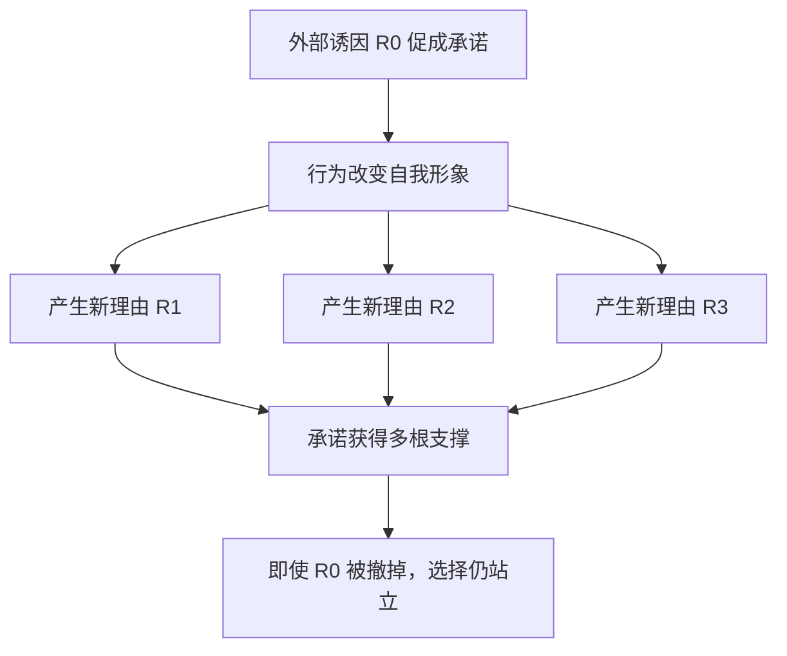

### 30.4 为什么这对顺从专家特别有价值

顺从专家只需提供最初诱因并促成决定，之后可撤走诱因。目标自己生成的新理由会维持承诺，甚至让他觉得选择越来越正确。

### 30.5 新理由不一定全是虚构

决定后发现的优点可能真实。危险在于：

- 若没有最初承诺，人是否会给这些优点同样权重？
- 新理由是否足以单独支持选择？
- 是否系统忽略相反证据？

防御不是否定所有新理由，而是做反事实复核。

### 30.6 与后文抛低球的连接

**抛低球（low-ball）**正是先用诱人的条件促成承诺，等待决定长出新支撑，再撤掉最初条件。下一节将用汽车销售、亲密关系和节能实验完整检验这一机制。

---

## 31. 抛低球：先用甜头促成决定，再撤走甜头

### 31.1 定义

**抛低球（low-ball technique）**是先提供一个极具吸引力但不会最终兑现的条件，诱使目标作出决定并建立承诺；等目标为选择投入、公开或生成新理由后，再撤掉原始优惠。

### 31.2 标准流程

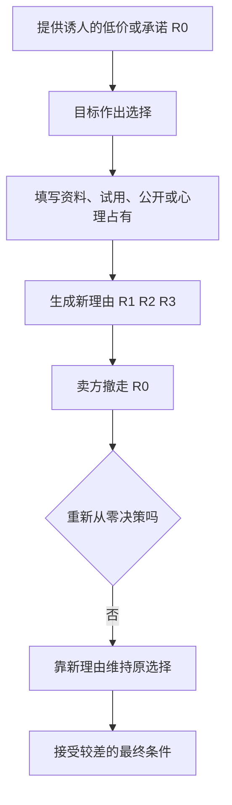

### 31.3 与诱饵定价、拒绝—后撤的区别

| 技巧 | 第一阶段 | 后续变化 | 核心机制 |
| --- | --- | --- | --- |
| 抛低球 | 目标先接受一个优厚条件 | 优厚条件被撤回 | 承诺已长出新理由 |
| 拒绝—后撤 | 目标拒绝大要求 | 请求者退到小要求 | 互惠与对比 |
| 普通涨价 | 尚无承诺也可发生 | 价格直接改变 | 新价格的成本收益 |

抛低球的关键是**先得到决定，再让交易变差**。

### 31.4 为什么撤走诱因后决定不倒

在决定形成到最终签约之间，目标可能：

- 想象拥有后的生活；
- 告诉亲友自己的选择；
- 填表、申请贷款、投入时间；
- 比较并记住产品优点；
- 把自己看成已经拥有它的人。

这些新支撑不依赖最初诱因。撤走一根“腿”，决定仍由其余理由站立。

### 31.5 成立条件

抛低球更容易在以下条件生效：

- 最初条件足以促成明确选择；
- 撤回发生在目标投入之后；
- 变化相对总交易显得不大；
- 最终方案仍勉强可接受；
- 目标可为继续选择找到新理由；
- 退出需要重新搜索、承认错误或损失面子。

---

## 32. 汽车经销商：400 美元怎样被拿走而不摧毁交易

### 32.1 作者的现场来源

作者曾在当地雪佛兰经销商接受销售训练，并旁观正式销售员。他看到抛低球已成为一些车行的标准手法。

### 32.2 第一种做法：低报价格后“发现计算错误”

经销商先给出比竞争者低约 400 美元的优惠价格，让客户决定在这里购买。客户开始填表、安排贷款，甚至试驾整天并向同事、邻居展示。

接近成交时，销售员声称计算有误，例如忘记把空调计入成本，需要把 400 美元加回去。有些车行会让银行贷款人员“发现”错误，以降低销售员故意操纵的嫌疑。

### 32.3 第二种做法：老板否决

销售员把交易交给老板，老板扮演坏人，称按该价格出售会亏损，必须恢复正常价格。客户已经选择具体车辆，多出的 400 美元相对于数千或上万美元总价显得不大。

### 32.4 第三种做法：虚高旧车估价

销售员先故意高估客户旧车的折价金额，使换购方案异常诱人；临签约时，二手车经理把估价调回正常水平，等于撤回约 400 美元优惠。

客户可能认为最终价格仍“公平”，甚至因自己先前想占便宜而向销售员道歉。此时真正受操纵者反而承担道德愧疚。

### 32.5 为什么 400 美元显得不值得退出

客户不是只比较最初报价和最终报价，还面对新的退出成本：

$$
C_{\text{退出}}
=C_{\text{重新搜索}}+C_{\text{手续}}+C_{\text{心理占有}}+C_{\text{承认错误}}.
$$

这是笔记的解释模型。卖方让价格恶化幅度小于目标主观退出成本，交易便可能维持。

### 32.6 “最终价格仍公平”为何不构成辩护

即使最终价格接近市场价，决策过程仍可能不公平：客户是在虚假信息下投入和承诺的。评价不能只问最终价格，还要问最初条件是否真实、重大变化是否及时披露、客户是否有无摩擦退出权。

### 32.7 防御

- 把所有价格、配置和折价写入总价；
- 在条件最终确认前不把决定当成完成；
- 任何优惠撤回后，重新从零比较；
- 不让表格、试驾和公开展示替代价格判断；
- 必要时离场，另日决定。

---

## 33. 莎拉与蒂姆：亲密关系中的低球闭环

### 33.1 最初甜头

蒂姆以结婚和戒酒承诺换取莎拉取消婚礼并复合。这个承诺相当于汽车交易中的优惠条件 $R_0$。

### 33.2 撤回与新支撑

复合后，蒂姆撤回戒酒和结婚承诺；莎拉却已作出高成本选择，并发现或生成新理由：他更关心她、会做食物、自己真正最爱的是他。

### 33.3 为什么她主观上可能真的更幸福

自我说服不必是有意识撒谎。新理由进入真实体验后，人可能真诚地感到满意。这正使抛低球难以识别：受害者不是一直痛苦地服从，而可能主动维护选择。

### 33.4 关系判断的正确问题

不应问“我已经为他放弃多少”，而应问：

> 如果今天第一次知道这些现实条件，没有先前承诺和牺牲，我还会选择同样关系吗？

这不是鼓励轻率分手，而是把当前选择与历史自我辩护分开。

### 33.5 关系边界

亲密关系比销售交易复杂，包含情感、共同生活和成长，不应仅凭一个心理标签诊断他人。抛低球解释的是“先许诺改变、取得复合后撤回承诺”的结构，不能替代对安全、信任和长期行为的全面评估。

---

## 34. 艾奥瓦节能研究：撤掉表彰后，承诺为何反而更强

### 34.1 第一组：信息和口头意愿不够

艾奥瓦州初冬，研究人员访问使用天然气取暖的家庭，提供节能建议，并请住户今后节约。所有人都答应尝试。

一个月及冬季结束后的气表比较显示，这些住户与随机抽选、未接受宣传的家庭用气量没有差异。良好意图和信息没有自动改变习惯。

### 34.2 第二组：增加登报表彰

另一组收到同样建议和请求，还被告知姓名会登在本地报纸上，表彰其公益精神和环保态度。

一个月后，这组家庭平均每户节省 422 立方英尺天然气，约合 12 立方米。

### 34.3 抛出低球：取消登报

研究者随后写信通知，因故无法刊登姓名。若行为只由表彰驱动，节能应当下降；结果却相反：

| 阶段 | 天然气节省比例 |
| --- | ---: |
| 仍以为会登报的第一个月 | 12.2% |
| 得知不会登报后的其余冬季月份 | 15.5% |

绝对提高：

$$
15.5\%-12.2\%=3.3\text{ 个百分点}.
$$

也就是说，取消登报后，报告的节能比例反而提高了 3.3 个百分点。

### 34.4 为什么撤掉外部因素后反而上升

作者偏爱的解释是：在实践节能过程中，住户形成多条内部理由：

- 新节能习惯；
- 更低燃气费；
- 对自我克制的自豪；
- 减少外国能源依赖；
- “我是有节能意识、关心公益的人”的新形象。

最初的登报表彰反而妨碍完全内化，因为人可以说“我只是想上报”。表彰取消后，外部解释消失，住户更容易把行为归因于自身价值。

### 34.5 图 3-2 的“桌腿”模型

原图把节能承诺画成桌面：

1. 起初只有“登报表彰”一条腿；
2. 实践中长出自尊、新自我形象、节省气费、减少石油依赖等新腿；
3. 研究者撤走登报腿，桌面仍被其他腿支撑。

这正是“决定长出腿来”的视觉表达。

### 34.6 夏季重复研究

研究团队在居民使用中央空调的夏季重复程序：

| 月份与条件 | 相对同类居民的用电减少 |
| --- | ---: |
| 7 月，仍期待登报 | 27.8% |
| 8 月，得知取消登报 | 41.6% |

撤掉表彰后，节电幅度进一步增加。两轮季节研究让“撤掉诱因仍持续”不再只是一次偶然观察。

### 34.7 研究说明什么

它支持：

- 单纯意愿不一定改变习惯；
- 诱因可促成首次行动；
- 实际行动会生成身份和新理由；
- 最初诱因消失后，行为可能持续甚至增强。

### 34.8 不能推出什么

- 任何奖励撤掉后都会提高行为；
- 欺骗参与者总是正当；
- 公开奖励一定妨碍内在动机；
- 所有节能项目都会复制同样百分比。

### 34.9 善用与滥用

作者指出抛低球既可服务商业操纵，也可推动公益行为。伦理评价仍需检查知情、欺骗、退出权和目标利益。好结果不能自动免除对研究方法和自主性的审查。

---

## 35. “如何拒绝”：保留一致性的价值，拒绝死脑筋

### 35.1 爱默生名言为何常被误引

人们常把爱默生《自立》中的话缩成“保持一致愚不可及”，这会把一致性本身说成缺点。原文关键限定是“死脑筋地保持一致”。作者注还给出更长语境，批评的是卑鄙政客、哲学家和传教士最崇拜的僵化一致。

作者注用另一个熟悉例子说明引文会在流传中失真：《圣经》并非说“金钱”是万恶之源，而是说“爱钱”才是。两个例子共同提醒读者，删掉限定语会把原意改得面目全非。

### 35.2 防御目标

我们不能彻底抛弃自动一致，因为它让生活、计划和关系可管理。正确目标是识别：

$$
{\text{当前坚持是在维护有效原则}}
\quad\text{还是}\quad
{\text{只是在维护旧承诺}}.
$$

### 35.3 两类身体信号

作者提出两个不同信号：

1. **肠胃警报**：操纵很明显，自己清楚不想答应，却被先前言行逼迫；
2. **心灵深处的第一感觉**：自我辩护已经长出许多理由，表面上感觉选择正确，只能用反事实问题捕捉更早的真实反应。

两者应对不同难度的陷阱。

---

## 36. 第一种信号：肠胃警报与娱乐套餐陷阱

### 36.1 调查怎样建立自我描述

一名外表吸引人的年轻女性上门，称调查城市居民娱乐习惯。作者为留下好印象，夸大自己：

- 每周多次去高档餐馆；
- 只点进口酒；
- 喜爱带字幕的外国文艺片；
- 常听交响乐和高档流行乐；
- 喜爱芭蕾，机会合适就去看。

这些回答共同塑造出“经常参与高雅社交娱乐的人”。

### 36.2 真正请求

调查者随后说，根据这些习惯，加入“美国俱乐部”每年可节省 1 200 美元，只需支付少量会员费。若作者拒绝，会显得：

- 刚才夸大事实，是骗子；
- 或真有这些习惯却放弃巨大优惠，是傻瓜。

他明知不想要，胃部已经紧缩警告，仍为了保持一致购买套餐。

### 36.3 技巧结构

### 36.4 作者后来的反击

识别肠胃警报后，作者选择直接说破：

- 这不是中性调查，而是在制造公开承诺；
- 为保持先前说辞而购买不需要的东西是愚蠢一致；
- 他实际不想购买，因此拒绝。

把结构说出口会打断自动播放，也让请求者难以继续把拒绝包装成前后矛盾。

### 36.5 防御模板

> 我先前的回答不构成购买承诺。即使它们完全准确，我仍可根据当前产品、价格和需要独立决定。

### 36.6 肠胃信号的局限

身体紧张可能来自社交焦虑、陌生情境或其他原因，不能单独证明对方操纵。它应当是“暂停并检查”的信号，而不是有罪判决。

---

## 37. 第二种信号：心灵深处、反事实问题与加油站案例

### 37.1 为什么肠胃有时不报警

莎拉已为选择生成许多新理由，主观上真觉得幸福。她没有清楚体验“我正在做不想做的事”，肠胃自然不会发出明显警告。

### 37.2 关键反事实问题

作者建议问：

> 知道我现在掌握的一切，如果时间倒流、还没作出最初承诺，我会不会作出同样选择？

这个问题暂时移除承诺历史，只保留当前事实。

### 37.3 为什么关注第一瞬间的感觉

作者认为，感觉往往先出现，随后理性化才开始。提问后的短暂第一反应，可能比稍后生成的解释更少受一致性辩护污染。

作者注同时限定：这不表示情感总比理性可靠，也不表示感觉总与信念相反；在涉及承诺可能生成合理化、尤其是情感关系时，第一感觉可能提供有价值的校准信号。

### 37.4 加油站事件

作者停在自助加油站，因为路牌价格比本地其他站每加仑低 2 美分。拿起油枪后才发现，泵上价格又比广告牌高 2 美分。老板解释价格刚调整、未来得及改牌，作者不太相信。

### 37.5 决定后生成的理由

他脑中出现多个留下加油的理由：

- 汽油快没了；
- 油泵空着，自己赶时间；
- 这个品牌可能更适合车辆。

这些理由可能都不是完全虚假，但关键是：它们究竟在停站前就足以促成选择，还是拿起油枪后才为旧决定服务？

### 37.6 反事实测试的结果

他问自己：“若一开始就知道真实价格，我还会停吗？”第一反应很明确：会直接开走。由此可知，其他理由不是决定源头，而是决定后的支撑。

### 37.7 最终行动

老板又以粗暴态度回应质疑，要求他不满意就离开。作者放回油枪、驾车离去。这次离开与新判断一致，因此“改变旧决定”并不等于不一致；它是在根据完整事实维护更高层原则。

### 37.8 反事实算法

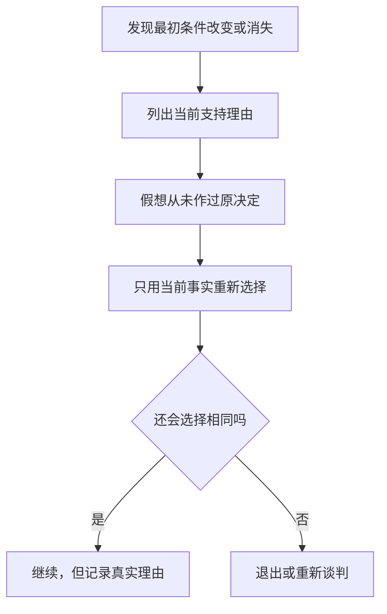

### 37.9 适用边界

第一感觉不是预言器。高风险决定仍要核查数据、咨询独立意见和考虑长期后果。它的作用是发现理性化，不能取代系统分析。

---

## 38. 读者报告：一个吻怎样变成杂志订单

### 38.1 事件经过

一名住在俄勒冈州波特兰的女性在市中心被友好年轻男子拦住。男子称参加比赛，需要陌生女性亲一下脸颊得分。她怀疑说法，却因对方坚持、自己赶时间而亲了他一下。

男子随即说，真正比赛是订杂志，并称她一定是很主动的人，问她喜欢哪些杂志。她最终支付 5 美元预订费，订了一本自己从未计划订阅的滑雪杂志。

### 38.2 为什么第一次小行动很关键

亲吻是一次明显、公开、反常的主动行为。之后直接拒绝会让她面对问题：“如果我对这人毫无好感、也不愿帮助，刚才为什么亲他？”

### 38.3 作者点评中的两条一致性路径

作者认为男子从两方面利用一致性：

1. 她已经帮过一次忙，继续帮忙符合“我是愿意帮助他的人”；
2. 她对男子印象似乎好到愿意亲吻，再帮一次看起来与这份好感一致。

第一点不是互惠，因为男子此前没有给她恩惠；它更接近行为连续性与“乐于帮助”的自我形象。

### 38.4 肠胃信号

她事后回想仍感到反胃。这个身体信号提示：第二次答应并非真实需要，而是被第一次承诺推着走。

### 38.5 正确退出

完成一个小请求不产生继续帮助的义务。可直接回应：

> 我刚才只同意那个请求，不代表我想购买或订阅任何东西。

### 38.6 读者报告的证据边界

这是个人回忆，容易受事后解释影响，不能独自证明因果或估计发生率。其价值在于展示承诺策略如何出现在街头推销，并帮助识别“无关小请求 → 身份标签 → 真正销售”的结构。

---

## 39. 核心概念的关系与区别

### 39.1 承诺与一致性

| 概念 | 角色 | 示例 |
| --- | --- | --- |
| 承诺 | 确定一个立场，启动后续压力 | 下注、签名、答应看管、写目标 |
| 一致性 | 使后续信念与行为匹配该立场 | 更相信赛马会赢、阻止偷窃、维持购买 |

承诺是按钮，一致性是按钮启动的程序。

### 39.2 健康一致性与死脑筋一致性

| 健康一致性 | 死脑筋一致性 |
| --- | --- |
| 维持可靠原则与责任 | 只维护旧表态 |
| 接受重大新证据 | 压制反证 |
| 允许透明修订 | 把改口等同人格失败 |
| 按当前未来价值行动 | 被历史投入和形象绑架 |

稳定不等于僵化。根据新事实改变具体方案，可以与“诚实、求真、保护利益”的更高原则保持一致。

### 39.3 一致性、认知失调与自我知觉

| 概念 | 关注的问题 | 典型路径 |
| --- | --- | --- |
| 一致性压力 | 如何让当前立场匹配过去行为 | 选择后继续照做 |
| 认知失调 | 冲突认知怎样产生不适并被化解 | 提高所选对象评价 |
| 自我知觉 | 人怎样从自己的行为推断态度和身份 | 签公益请愿后认为自己有公民精神 |

三者能共同解释同一现象，但不是互相替代的标签。作者在不同案例中强调的证据路径不同。

### 39.4 承诺与服从

**服从**可以完全来自外部命令；**承诺**要求行为被一定程度归属于自己。强威胁能制造服从，却常给人一个清楚的外部解释，因而不易形成长期内化。

### 39.5 公开承诺与正确判断

公开能提高坚持，却不提高命题真实性。直线长度和陪审团案例显示，公开立场甚至可能阻碍证据更新。

所以，应按任务选择设计：

- 健康习惯执行需要坚持时，可自愿公开；
- 事实判断需要准确时，应先匿名独立评估。

### 39.6 书面承诺与知情同意

亲笔书写会增强心理承诺，但不自动证明理解充分、自愿或条件公平。高压销售中的手写合同仍可能缺乏真正知情同意。

### 39.7 努力与价值

努力可能：

- 真正提升技能或产品质量；
- 传递稀缺性和筛选标准；
- 也可能仅让人主观提高目标评价。

不能从“我为它很辛苦”直接推出“它客观上很好”。

### 39.8 外部激励与内部动机

外部奖励并非总是有害。它可以启动行为、补偿成本和认可贡献。问题在于奖励是否成为行为的唯一解释，以及撤掉后是否留下技能、习惯、价值认同和自主理由。

### 39.9 登门槛、拒绝—后撤与抛低球

| 技巧 | 顺序 | 第一阶段是否成功 | 后续机制 |
| --- | --- | --- | --- |
| 登门槛 | 小请求 → 大请求 | 小请求被接受 | 自我形象与一致性 |
| 拒绝—后撤 | 大请求 → 小请求 | 大请求被拒绝 | 互惠式让步与对比 |
| 抛低球 | 优厚条件 → 较差条件 | 优厚方案先被接受 | 决定长出新理由后撤回诱因 |

### 39.10 抛低球与诱饵转换

两者都可能先用吸引条件获客。抛低球强调**先建立个人承诺，再撤走诱因**的心理过程；诱饵转换更广泛地指广告诱饵不可得、转推其他商品。实际销售中可以重叠。

### 39.11 一致性与沉没成本

沉没成本关注不可收回投入怎样污染未来决策；一致性还包含无需大量物质投入的立场维护。沙滩实验中的一句承诺几乎没有沉没成本，却显著改变行为。

### 39.12 责任、身份与自主性

有效承诺需要“这是我做的”这一归因，但操纵者也可能通过隐藏压力制造虚假自主感。真正自主性还需要：

- 重要信息透明；
- 没有欺骗和不当威胁；
- 有现实退出机会；
- 能够修订选择；
- 不因拒绝遭不合理惩罚。

---

## 40. 作者如何一步步形成解释

### 40.1 从选择后的反常变化出发

赌客下注后无新信息却更自信，莎拉在承诺落空后反而更投入。作者先抓住“行为已经改变信念”的反常方向，而不是把坚持简单归因于偏好强。

### 40.2 用现场实验把承诺变成可操纵变量

沙滩实验只增加一句看管承诺，阻止偷窃由 4/20 变成 19/20。它把复杂人格解释收窄到一个具体控制变量。

### 40.3 先解释一致性的正常社会功能

作者不把一致性直接写成缺陷，而先说明它如何支持可靠、稳定、逻辑和认知效率。这样才能解释规则为什么强、为什么不应被完全消除。

### 40.4 区分省思考与逃避痛苦事实

一致性既能减少重复计算，也能保护希望和自尊。超自然冥想讲座说明，有时人不是没看见反证，而是因反证太有力而赶紧承诺。

### 40.5 找到启动键：承诺

玩具案例展示商业利用后，作者提出更一般问题：什么启动一致性？随后以调查预测、客套回答和小行动证明，承诺门槛可以很低。

### 40.6 从小承诺推进到自我形象

战俘案例提供递进过程，弗里德曼—弗雷泽实验则用相关和不相关公益请求区分“具体态度”与“广义身份”解释。

### 40.7 逐项拆分强承诺条件

作者没有停在“承诺越大越有效”，而是依次研究：

1. 行为和书写；
2. 公开可见；
3. 付出努力；
4. 缺少强外部解释、内在负责。

每一步都由不同实验或制度案例支撑。

### 40.8 用极端案例揭示结构，再以实验检验

战俘营、成年礼和危险入会仪式把机制放大；琼斯—哈里斯、多伊奇—杰拉德、阿伦森—米尔斯和弗里德曼儿童实验则提供更受控证据。

### 40.9 解释承诺如何脱离原始原因

“长腿”模型连接前半章和抛低球：决定后的新理由使原始诱因可被撤走。汽车、莎拉和艾奥瓦节能分别展示商业、关系和公益场景。

### 40.10 防御从明显陷阱推进到隐蔽自欺

肠胃信号适合“我明知不想要却被迫一致”；反事实问题适合“我已真诚相信新理由”。两级方法与陷阱深度匹配。

### 40.11 作者方法的完整链条

---

## 41. 证据结构、论证强度与局限

### 41.1 本章证据地图

| 证据类型 | 代表材料 | 主要支持 | 主要局限 |
| --- | --- | --- | --- |
| 前后观察 | 赛马下注前后 | 选择后信心提高 | 本章未给样本量与完整方法 |
| 现场实验 | 沙滩收音机 | 简短承诺显著改变介入 | 特定场景与风险 |
| 电话实验 | 霍华德募捐 | 本人公开回答比友好陈述更有效 | 请求类型与时期有限 |
| 现场/历史资料 | 战俘营 | 小步、书写、公开和小奖励的组合 | 高控制环境、多机制并存 |
| 对照实验 | 弗里德曼—弗雷泽 | 小承诺影响大请求和自我形象 | 本章未呈现全部统计细节 |
| 实验室实验 | 琼斯—哈里斯、多伊奇—杰拉德 | 行为归因与公开承诺顽固性 | 简化任务与现实差异 |
| 实验室实验 | 阿伦森—米尔斯 | 努力提高团体主观评价 | 不证明客观质量提高 |
| 延迟行为实验 | 儿童机器人 | 强威胁服从不等于长期内化 | 特定年龄、性别与任务 |
| 现场干预 | 艾奥瓦节能 | 撤掉诱因后行为仍可持续 | 机制解释并非唯一 |
| 参与式观察 | 汽车经销商 | 抛低球真实销售流程 | 无随机比较、行业差异 |
| 个人故事 | 莎拉、加油站、杂志推销 | 迁移与识别线索 | 不能单独证明因果 |

### 41.2 哪些结论证据相对直接

- 作出看管承诺与更高干预率同时出现；
- 公开书面承诺比私下或无承诺更难改变；
- 小请求可显著提高后续大请求同意率；
- 严格入会可提高对平庸小组的评价；
- 强威胁的即时服从不必转化为延迟内化；
- 艾奥瓦干预中，撤掉表彰后节能没有下降。

### 41.3 哪些解释需要更谨慎

- 玩具公司是否普遍“故意”制造节前缺货；
- 莎拉的幸福有多少来自一致性而非真实关系变化；
- 危险仪式与群体凝聚的因果方向；
- 节能增加是否完全源于外部理由消失；
- 第一感觉是否总比后续分析准确。

### 41.4 实验数字的口径

- `19/20` 与 `4/20` 是阻止偷窃的次数；
- `89%` 是先答应上门者中的实际购买比例；
- `76%` 与 `17%` 是巨型告示牌同意率；
- `77%` 与 `33%` 是六周后实际选择玩具者中选机器人的比例；
- `12.2%/15.5%` 是天然气节省比例；
- `27.8%/41.6%` 是夏季用电减少比例。

不同分母不能直接拼接成同一种效应。

### 41.5 文化与时代边界

本章材料跨越战争、部落、美国大学、家庭和商业，说明结构具有广泛性；具体强度仍受文化中的守信观、公开羞耻、权威关系、市场监管和数字媒介影响。

### 41.6 因果与伦理必须分开

一个程序能增强承诺，不代表应当使用：

- 强迫战俘写作涉及拘禁和权力压迫；
- 危险入会造成伤亡；
- 汽车抛低球依赖误导；
- 儿童内化不能成为隐藏控制的借口。

### 41.7 作者补充模型的边界

本笔记用条件函数、成本分解和流程图帮助理解，但原书没有提供统一参数模型。现实中的承诺效果不是四项条件机械相加，也不能据公式精确预测个体。

---

## 42. 一套可执行的承诺审查流程

### 42.1 第一步：识别当前承诺

列出自己已经做过什么：

- 说过什么；
- 签过什么；
- 买过什么；
- 向谁公开；
- 投入多少努力；
- 接受了什么身份标签。

### 42.2 第二步：恢复原始条件

记录作决定时的关键依据 $R_0$：价格、承诺、功能、关系变化、奖励或风险。不要只列决定后新增的优点。

### 42.3 第三步：检查条件漂移

问：

- 原价格是否改变？
- 对方承诺是否兑现？
- 环境是否变化？
- 新证据是否推翻原判断？
- 最初诱因是否被撤走？

### 42.4 第四步：识别承诺放大器

当前决定是否已经：

- 亲手写下；
- 对外公开；
- 投入大量努力；
- 与身份标签绑定；
- 在没有明显外压的情况下作出；
- 通过一连串小步骤逐渐扩大？

放大器越多，越需要独立复核，而不是越应坚持。

### 42.5 第五步：区分原始理由与新理由

把理由分成两栏：

| 决定前已存在 | 决定后才发现或产生 |
| --- | --- |
| 真正促成最初选择 | 可能真实，也可能是自我辩护 |

再问：若没有原始承诺，新增理由是否足以单独支持同样决定？

### 42.6 第六步：做反事实重置

> 如果今天第一次面对当前全部事实，而且没人知道我过去的选择，我会怎么做？

这个问题同时移除公开面子和历史承诺。

### 42.7 第七步：先捕捉身体信号，再做系统分析

记录第一瞬间的紧张、抗拒或轻松，但不要立即服从感觉。随后检查事实、替代方案、未来成本和独立意见。

### 42.8 第八步：按未来而不是过去决策

$$
{\text{当前选择标准}}
=\text{未来收益}-\text{未来成本}-\text{未来风险}.
$$

已无法收回的投入只用于吸取经验，不应用来抬高继续投入的价值。

### 42.9 第九步：使用退出语言

- “我之前的回答不代表接受当前方案。”
- “条件变了，我需要重新决定。”
- “公开过目标不妨碍我根据新证据修订。”
- “我同意的是第一项小请求，不是后续请求。”
- “最终价格与最初报价不同，因此原决定作废。”

### 42.10 第十步：记录修订理由

把改变决定的依据写下来，避免把合理更新体验成失败。良好的决策系统应奖励“及时纠错”，而不只奖励“始终不改口”。

### 42.11 完整流程

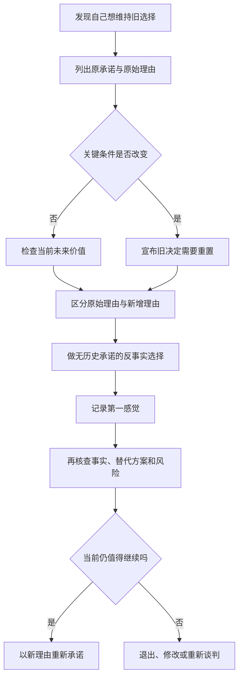

---

## 43. 组织与个人怎样正当使用承诺

### 43.1 正当目标

承诺可以用于自愿形成健康习惯、学习计划、公共服务和节能行为。关键是帮助人执行自己的目标，而不是让其维护请求者的隐藏利益。

### 43.2 透明

说明为何要写下、公开或追踪目标；不把调查伪装成销售，不隐瞒最终价格，也不以虚假缺货和撤回优惠制造承诺。

### 43.3 可修订

建立正式复盘点，让人根据健康、证据和环境调整目标。公开承诺应包括一句：“若关键条件变化，我会透明修订。”

### 43.4 适度公开

只向支持者公开必要信息，避免广泛羞辱压力。公开对象应帮助执行，而不是惩罚失败。

### 43.5 努力必须与能力相关

训练和筛选的困难应服务真实技能、安全和任务需求。无关羞辱、痛苦和危险不因能增强凝聚力而正当。

### 43.6 奖励与自主并存

合理奖励补偿成本，但同时解释行动本身的价值，并让参与者自由退出。不要刻意用“刚好看不见的压力”伪造自主性。

### 43.7 决策组织的反一致性制度

- 重要意见先匿名收集；
- 由未参与原决定的人独立复核；
- 记录原始假设和退出条件；
- 定期做预先验尸与反方评审；
- 奖励发现错误和及时止损；
- 最终条款变化时重新获取同意；
- 把试点承诺与全面推广分开审批。

### 43.8 数字产品中的应用

账户创建、连续签到、公开徽章和小额试用都可能形成承诺。产品设计应：

- 不把免费试用悄悄变成高价续费；
- 清楚显示最终条件；
- 允许轻松取消；
- 不用羞辱性连续天数阻止合理休息；
- 不把一次点击扩展成未经同意的身份标签。

---

## 44. 容易混淆的概念与常见误区

### 44.1 误区一：前后一致永远是美德

一致在条件稳定时有价值；重大事实变化后仍不调整，才是爱默生批评的死脑筋。

### 44.2 误区二：改变主意说明人格不可靠

隐瞒、随意反复会损害可靠性；基于新证据透明修订，反而体现更高层的一致与责任。

### 44.3 误区三：承诺只指正式誓言或合同

一句客套回答、小签名、一次亲吻、试驾或小订单都可能形成心理承诺。

### 44.4 误区四：只有相关小请求才会影响大请求

保护环境签名也提高了“小心驾驶”巨牌的同意率，说明小行动可通过广义公益自我形象跨主题影响行为。

### 44.5 误区五：写下来就证明真心相信

琼斯—哈里斯实验恰恰说明旁观者会高估文字代表的真实态度。书写可能出于角色、胁迫或奖励。

### 44.6 误区六：公开承诺使判断更准确

公开提高的是坚持动机，不是真实性。事实判断中，它可能增加顽固。

### 44.7 误区七：付出越多，目标客观价值越高

努力能提高主观评价；阿伦森—米尔斯故意让小组无聊，正是为了显示评价变化不来自客观质量。

### 44.8 误区八：危险入会仪式是凝聚团体所必需

机制解释不等于唯一方案。共同训练、互助任务和真实技能挑战也能形成身份，无需羞辱和伤害。

### 44.9 误区九：强威胁最能让规则深入人心

强威胁擅长即时服从，却给孩子留下外部解释；威胁消失后，规则可能不再有效。

### 44.10 误区十：外部奖励总会破坏动机

奖励影响取决于大小、意义、持续时间和自主感。它可启动好行为，也可能成为唯一解释。本章不是“所有奖励有害”的证明。

### 44.11 误区十一：登门槛就是拒绝—后撤

前者先小后大且第一项成功；后者先大后小且第一项被拒绝。机制不同。

### 44.12 误区十二：抛低球只是普通涨价

普通涨价可发生在承诺前；抛低球先用优惠锁定决定，再撤回优惠，利用的是已形成承诺。

### 44.13 误区十三：抛低球只在销售中出现

莎拉案例显示它可出现在关系承诺，艾奥瓦研究显示相似结构也可用于公益行为。

### 44.14 误区十四：最初诱因消失后必须立刻反向选择

新增理由可能真实且足以支持选择。正确方法是从零复核，而不是机械反转。

### 44.15 误区十五：决定后的所有理由都是虚构

它们可能真实；风险在权重偏移和选择性注意。要问没有原承诺时是否仍足够重要。

### 44.16 误区十六：一致性就是沉没成本

两者可重叠，但一句无成本承诺也会引发一致行为。沉没成本只是更广承诺机制中的一种可能投入。

### 44.17 误区十七：肠胃不舒服就证明对方在操纵

身体感觉只是暂停信号，还需核查事实、条件和替代解释。

### 44.18 误区十八：第一感觉永远比理性准确

作者注明确否认这种绝对化。第一感觉用于捕捉合理化前信号，之后仍需系统分析。

### 44.19 误区十九：知道技巧名称就能免疫

作者识破玩具策略后仍难退货，因为承诺已经与教育价值绑定。防御需要在第一次表态前设置检查点，并允许条件变化时重置。

### 44.20 误区二十：顺从专家必须有恶意，机制才会生效

童子军式小请求、公开目标和组织仪式可能在无明确恶意下仍触发一致性。机制、意图和伦理要分别判断。

### 44.21 误区二十一：任何“自由选择”都是真正自主

战俘、儿童和高压销售中的选择受权力、信息与环境限制。缺少显眼强迫不等于充分自主。

---

## 45. 本章总结：知识结构、核心结论与一般方法

### 45.1 知识结构

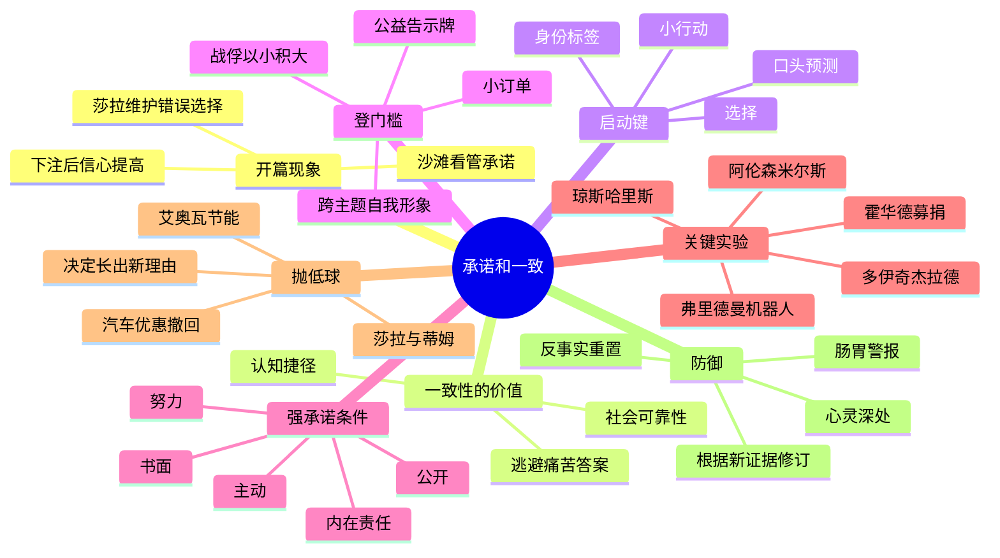

### 45.2 十五条核心结论

1. **作出选择会反过来改变信念。** 赛马客下注后，没有新信息却更相信所选马会赢。
2. **一致性同时来自内部自洽和外部观感。** 人既想稳定，也想显得可靠。
3. **一致性通常有社会和认知价值。** 它支持守信、计划、合作，并减少重复决策。
4. **自动一致性有两种诱惑。** 它既省思考，也能帮助逃避不愿面对的事实。
5. **承诺是一致性程序的启动键。** 一句预测、小签名或行动都可能确定立场。
6. **小承诺可通过自我形象放大。** 人不只维持具体观点，还会成为“做这类事的人”。
7. **登门槛从小到大。** 第一项小请求成功后，后续大请求更容易与新身份一致。
8. **书面承诺留下行为物证，并易于公开。** 它比模糊想法更难否认。
9. **公开承诺提高坚持，却可能降低更新意愿。** 公开不是准确性的保证。
10. **努力会提高目标的主观价值。** 这是努力正当化，不证明目标客观更好。
11. **内化依赖本人对行为负责。** 强威胁和大奖可制造短期行为，却提供外部归因。
12. **真正持久的承诺会生成新的支撑理由。** 它因而能跨情境、跨时间延续。
13. **抛低球先促成决定，再撤走最初诱因。** 决定已有其他“腿”，所以不易倒塌。
14. **识别明显操纵可听取肠胃警报。** 但身体信号只是暂停提示，不是最终证据。
15. **识别深层自我辩护要做反事实重置。** 问自己若今天从零面对当前事实，是否仍作同样选择。

### 45.3 全章完整因果链

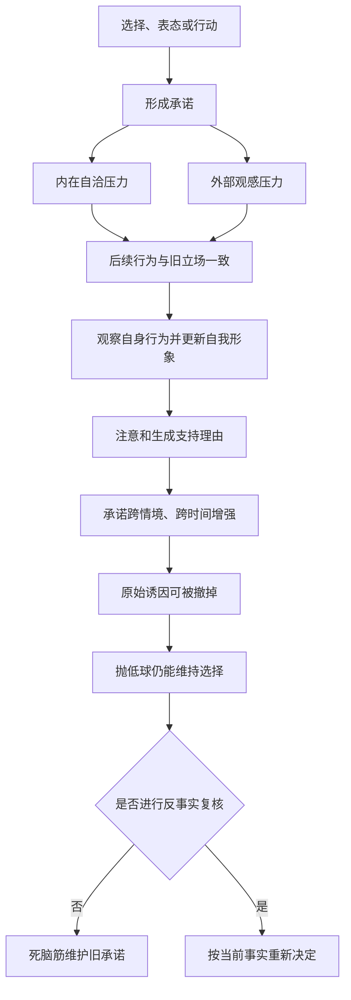

### 45.4 作者解决问题的一般思路

本章示范了一套可迁移的研究方法：

1. 从“行为后态度改变”的反常现象提出问题；
2. 用现场实验只改变一个简短承诺，检查行为差异；
3. 先解释规则的正常价值，再分析滥用；
4. 找出可操作启动点，而非停留在抽象人格；
5. 用小步升级研究局部行为怎样改变广义身份；
6. 分别操纵书写、公开、努力和外部压力，寻找强承诺条件；
7. 用历史、田野和实验材料相互补充；
8. 测试最初诱因消失后行为是否仍维持；
9. 区分明显外部操纵与内在自我辩护；
10. 设计保留一致性优点、只切断机械坚持的防御。

可以压缩为：

$$
{\text{反常现象}}
\rightarrow\text{因果操纵}
\rightarrow\text{社会功能}
\rightarrow\text{启动承诺}
\rightarrow\text{自我形象}
\rightarrow\text{强化条件}
\rightarrow\text{诱因撤回}
\rightarrow\text{两级防御}.
$$

### 45.5 最终理解

本章并不劝人轻视承诺。没有一致性，长期关系、学习、组织和社会信用都难以维持。真正的风险是把“我曾经这样选择”误当成“今天仍有充分理由这样选择”。

成熟的一致性不是永不改口，而是始终忠于更高层的原则：根据真实信息行动、兑现仍然合理的责任，并在关键条件变化时坦然重置决定。这样，承诺会成为执行正确选择的力量，而不是困住自己的脑中怪物。
