> **书名**：《影响力（珍藏版）》<br>
> **作者**：罗伯特·B. 西奥迪尼（Robert B. Cialdini）<br>
> **阅读范围**：第4章“社会认同”<br>
> **原文章节顺序**：罐头笑声悖论 → “社会认同原理” → 儿童示范与预言失败 → “死亡原因：不确定” → 多元无知与旁观者救助 → “有样学样” → 相似性与模仿传播 → 琼斯敦 → “如何拒绝” → 跑马场读者报告<br>
> **阅读目标**：理解他人的行为为什么能成为通常有效的判断证据，社会认同在不确定性与相似性条件下为何增强，错误社会证据怎样形成群体级联，以及怎样既保留群体信息的价值，又避免被伪造或失准的数据带偏。

---

## 0. 导读：第四章要解决的核心问题

前三章依次说明：人会响应关键线索，会回报他人的给予，也会维护自己已经作出的承诺。第四章把信息来源从“环境线索”和“自己的过去行为”转向**其他人的当前行为**：

> 当我不知道什么是正确、合适或安全的做法时，观察别人怎样做，能否替我提供答案？

作者沿一条不断扩大风险的路线展开：从情景喜剧的笑声开始，经过广告、募捐和儿童恐惧治疗，再进入预言失败、旁观者不作为、模仿自杀与集体死亡，最后回到两类错误输入和防御方法。

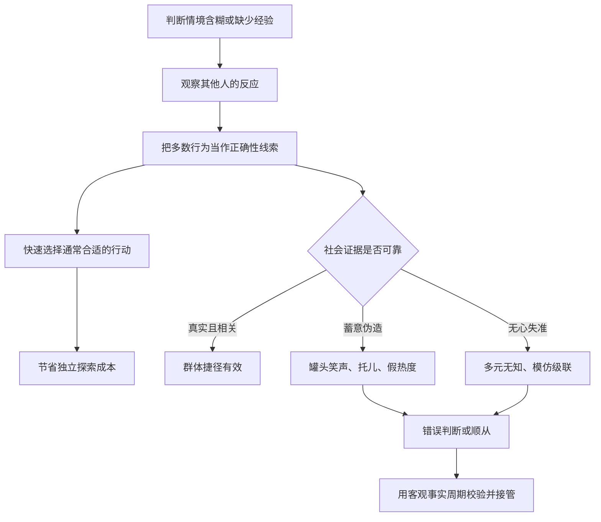

本章的中心张力是：

> 社会认同之所以危险，恰恰因为它通常有用。若多数人的行为从独立、真实、相关的信息中产生，它能汇聚经验；若大家都在模仿别人，或证据被人为布置，人数只会放大同一个错误。

原书没有给出统一的数学公式或算法。下文的概率式、权重模型和操作流程均是笔记的解释性整理，不是原书的可计算模型；原书报告的实验时长、比例和人数会明确区分。

### 0.1 章名“脑子里的怪物”怎样理解

社会认同往往以自己的判断出现：“大家都这样，应该没错。”真正驱动判断的却可能是群体线索。它既能帮助人学会安全行为，也能让一群彼此观察的人共同误判。

所谓“怪物”不是群体本身，而是未经核查的自动推论：

$$
{\text{很多人这样做}}
\quad\not\Rightarrow\quad
\text{这件事必然正确}.
$$

### 0.2 章首李普曼引语的作用

沃尔特·李普曼说：“在人人想法都差不多的地方，没人会想得太多。”它预告了独立性问题：表面上有很多人作出同一判断，背后却可能只有一个原始判断，其余人都在复制。

有效群体信息依赖一定程度的独立观察；若独立性消失，人数与证据量便不再等价。

---

## 1. 罐头笑声悖论：人人讨厌，为什么电视台仍坚持使用

### 1.1 作者的小调查

作者询问来办公室的学生、两名电话修理工、若干大学教授和保安，所有人都批评罐头笑声，称其愚蠢、虚假、肤浅。

样本很小，也不是随机抽样，不能估计公众总体态度；它的作用是建立一个反差：观众主观上讨厌，电视台高层和创作者也知道观众反感，却仍持续使用。

### 1.2 什么是罐头笑声

作者注 `[14]` 说明，罐头笑声是电视台播放情景喜剧时，在“观众应该笑”的位置插入的预录笑声。

它并非现场观众对当前笑话的自然反应，而是后期制作的行为线索。

### 1.3 高层面临的选择

许多导演、编剧和演员要求取消笑声音轨，往往遭到电视台管理层拒绝。若高层只在乎观众口头喜好，他们理应撤掉；若他们掌握了行为效果数据，坚持使用就可能有商业理性。

### 1.4 研究发现

原书概括实验结果：加入罐头笑声会让观众：

- 笑得更久；
- 笑得更频繁；
- 认为节目更有趣；
- 对原书所说的“糟糕的笑话”，效果尤其明显。

原书在此没有给出样本量、具体百分比和实验材料，因而不能从本章计算效应大小。

### 1.5 为什么“观众讨厌”与“它有效”可以同时成立

主观评价和即时行为是不同结果变量：

| 结果 | 可能表现 |
| --- | --- |
| 对制作手法的态度 | 讨厌、觉得虚假 |
| 当下笑的行为 | 更久、更频繁 |
| 对节目的判断 | 感觉更有趣 |

人可以厌恶一种影响技术，却仍在自动层面受它影响。问卷态度不能替代行为测量。

### 1.6 真正的谜题如何转移

电视台使用它是因为数据表明有效，因此管理层行为不再神秘。新的问题变成：观众明知笑声是假的，为什么仍把它当作幽默证据？

这个问题促使作者引入社会认同原理，而不是停在“电视台品味差”的道德批评。

---

## 2. 三个基础概念：社会认同、社会证据与模仿

### 2.1 什么是社会认同原理

**社会认同原理（social proof）**指：在判断什么是正确或合适时，人会把其他人的看法和行为当作证据；尤其在判断“此刻该怎样行动”时，我们倾向认为很多人正在做的行为是恰当的。

最简结构是：

$$
{\text{观察到他人采取行动 }a}
\rightarrow \text{提高“}a\text{ 合适”的判断}
\rightarrow \text{自己更可能采取 }a.
$$

### 2.2 什么是社会证据

**社会证据**是支持社会认同判断的可观察信息，例如：

- 有多少人在笑、捐款、排队或购买；
- 与自己相似的人怎样选择；
- 同龄人是否能完成某项行为；
- 旁观者是否表现出紧张和行动；
- 某种行为是否被公开报道为常见。

社会认同是判断规则，社会证据是该规则使用的输入。

### 2.3 什么是模仿

**模仿**是观察他人后复制其行为。社会认同不一定每次都产生完全相同的动作，它也可能改变态度、风险判断和是否介入；模仿则是其中最直观的行为结果。

### 2.4 描述性规范与命令性规范

作为补充背景，可以区分：

| 规范 | 回答的问题 | 示例 |
| --- | --- | --- |
| 描述性规范 | 大多数人实际上怎样做 | 多数客人会给小费 |
| 命令性规范 | 大多数人赞同应该怎样做 | 社会认为应给服务者合理小费 |

本章多数案例使用的是描述性线索。看到很多人捐钱，不等于这些人经过独立道德判断，也不自动证明“应当捐”。

### 2.5 社会认同与从众

从众强调个体行为与群体保持一致；社会认同进一步解释其中一条原因：个体把群体行为当作有关正确性的证据。

人也可能因害怕排斥而从众，即使明知群体错误。因此：

$$
{\text{从众行为}}
=\text{信息性影响}+\text{规范性压力}+\text{其他关系因素}.
$$

这个分解是背景模型，不是原书量化公式。

### 2.6 什么时候群体行为真有信息价值

群体证据较可靠时，通常具备：

- 多人根据各自信息独立行动；
- 行为真实而非演员或脚本；
- 观察者与示范者处境相关；
- 选择没有被同一错误来源统一操纵；
- 人数、比例和样本范围没有被选择性展示。

### 2.7 什么时候人数只是在重复一个错误

若甲模仿乙、乙又模仿丙，三个人的一致行为可能只包含丙的一份信息。可用解释性的“有效独立证据量”表示：

$$
N_{\text{有效}}
\leq N_{\text{观察人数}}.
$$

相关性越高、共同来源越强，两者差距越大。

---

## 3. “社会认同原理”：罐头笑声怎样启动自动反应

### 3.1 日常判断规则

现场有多人自然发笑时，笑声通常意味着：

- 其他人注意到可笑之处；
- 当前内容符合共享幽默规则；
- 自己可能漏掉了一层含义。

参考他人反应常比独自分析每个笑点更快，所以“听见大家笑 → 这大概好笑”通常有用。

### 3.2 伪造输入怎样利用规则

罐头笑声保留了“很多人在笑”这一表面特征，却切断了它与当前内容的真实因果关系：

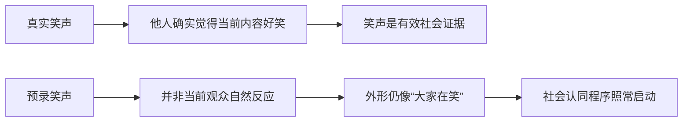

### 3.3 为什么明知是假的仍可能生效

识别“这是录音”与抑制自动反应不是同一过程。声音出现后，情绪感染、注意分配和“此处应笑”的群体线索可能先起作用；理性识别随后才批评其虚假。

### 3.4 与火鸡“叽叽”声的结构类比

第一章中，雌火鸡把“叽叽”声当作幼鸟线索，连装有录音机的臭鼬玩具也能启动母性反应。罐头笑声同样复制关键触发特征：

| 火鸡案例 | 罐头笑声 |
| --- | --- |
| “叽叽”通常来自幼鸟 | 笑声通常来自觉得好笑的人 |
| 录音保留声音、替换对象 | 音轨保留笑声、脱离真实反应 |
| 母性程序被错误启动 | 幽默判断与发笑被推动 |

这是结构类比，不表示人类反应与动物固定行为模式同样僵硬。

### 3.5 为什么糟糕笑话上效果更明显

内容本身越弱，观众越缺少清楚的内部证据，就越可能依赖外部线索。可用解释性权重模型表示：

$$
J_{\text{幽默}}
=w_cE_{\text{内容}}+w_sE_{\text{社会}},
$$

当内容证据 $E_{\text{内容}}$ 模糊或弱时，社会证据 $E_{\text{社会}}$ 的相对权重可能上升。公式不是原书实验模型。

### 3.6 原理的优点与弱点是同一件事

- **优点**：快速汇聚他人的判断，减少独立分析成本；
- **弱点**：接收系统若只识别人数和行为外形，就会响应偏颇或伪造证据。

---

## 4. 人为布置社会证据：从小费罐到虚假排队

### 4.1 小费罐预放纸币

调酒师营业前在小费罐里放几张纸币，让首批顾客看到“别人通常会给小费”。这些钱不是先前客人的独立选择，而是经营者设置的初始状态。

### 4.2 募款箱预放现金

教会募款员先在箱中放钱，制造已有许多人捐赠的印象。初始几张纸币可启动后续真实捐款，真实捐款又进一步加强社会证据。

### 4.3 传教活动中的托儿

传教士在听众中安排托儿，在特定时刻上台见证或捐款。目标不是只得到托儿的一次行动，而是让其成为其他听众判断“现在该行动”的示范。

### 4.4 “增长最快”与“销量最大”

广告不必直接证明产品优质，只需说大量消费者已选择它。这里必须拆开：

- 销量是关于他人购买的证据；
- 质量是关于产品性能的结论；
- 两者可能相关，却不是逻辑等价。

### 4.5 电视慈善认捐名单

节目持续播出已经认捐者姓名，既表示活动真实，也向未行动者传递“很多人认为捐款正确”。若只展示支持者而不展示观看总人数，观众无法知道真实参与比例。

### 4.6 夜总会门外长队

有些夜总会即使内部空旷，也故意控制入场，使门口排长队。路人把等待人数误读成场所受欢迎和质量高的证据。

### 4.7 销售员列举已有客户

“很多客户已经购买”可降低陌生选择的不确定性。信息若真实且客户与自己需求相近，具有参考价值；若只挑选少数成功案例、虚构人数或隐藏退款率，就成为失真证据。

### 4.8 卡维特·罗伯特的总结

销售和励志顾问卡维特·罗伯特（Cavett Robert）称，95% 的人喜欢模仿，只有 5% 会率先行动，因此别人的行动比其他说服证据更有效。

这是一句销售修辞，不是本章报告的严谨人口比例。其理论含义是：多数人更愿意跟随已发生的选择，而不是成为第一个承担不确定性的人。

### 4.9 社会证据怎样形成滚雪球

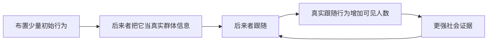

起点可以是假的，后续行为却是真的；这使来源越来越难追溯。

---

## 5. 班杜拉的怕狗儿童研究：社会示范也能用于治疗

### 5.1 为什么引入正向应用

前面的案例多是商业利用。作者接着说明，社会认同本身中性：若示范行为真实、安全且有益，同一机制可以帮助人克服恐惧。

### 5.2 基本程序

心理学家艾伯特·班杜拉（Albert Bandura）及同事选择极度怕狗的学龄儿童，让他们观看一个男孩愉快地与狗玩耍：

- 每天观看约 20 分钟；
- 连续观察数日；
- 示范者是年龄接近的儿童；
- 目标行为是安全接近和互动。

### 5.3 四天后的结果

仅过 4 天，67% 的儿童愿意爬进围栏与狗玩耍；其他人离开房间后，他们仍继续抚摸、逗弄狗。

独处时仍互动很重要：变化不只是在成人观察下表演顺从，而可能是真实恐惧降低。

### 5.4 一个月后的保持

约 1 个月后再次测试，改善没有消退，孩子反而比之前更愿与狗互动。研究因此同时观察了即时变化和延迟保持。

### 5.5 为什么示范可能有效

孩子从相似榜样身上获得多类信息：

- 狗未造成预期伤害；
- 同龄人能够应对；
- 接近狗是可行、正常的行为；
- 玩耍还可能带来愉快结果。

### 5.6 不能从比例推出什么

原书没有在这里给出总样本量、诊断标准和对照组数据，不能仅凭 67% 精确估计所有儿童的治疗成功率。涉及动物恐惧时还需评估真实安全，不能用未经训练的动物强迫暴露。

---

## 6. 影片与多重榜样：真实在场不是必要条件

### 6.1 影片同样有效

另一组怕狗儿童研究发现，不需要同龄榜样在现场，播放榜样与狗互动的影片也能产生效果。这说明社会证据可以通过媒介传播。

### 6.2 多个榜样效果更好

影片中若有多个儿童与狗互动，效果最好。多重示范提供：

- 更高人数线索；
- 不同个体都成功的重复证据；
- 降低“那个孩子只是特例”的解释。

### 6.3 人数增加何时真能加强证据

多个榜样若真是不同儿童的独立安全经历，确实比一个榜样更有信息量；若多个画面都由同一脚本选择性剪辑，人数增加未必等于独立验证。

### 6.4 图 4-1 的功能

原书图 4-1 用群体追随的幽默画面强调：同一行为的参与者越多，它越容易显得有意义、正确。图像是概念说明，不是额外实验数据。

### 6.5 正当应用原则

- 榜样行为必须安全；
- 说明示范不是保证；
- 选择与受众相似但真实的榜样；
- 不伪造人数和结果；
- 给观察者自主尝试和退出空间。

---

## 7. 奥康纳的 23 分钟影片：孤僻行为怎样被新范例打断

### 7.1 研究问题

心理学家罗伯特·奥康纳（Robert O'Connor）关注极度害羞、总在集体活动边缘独处的学龄前儿童。他担心这种模式会延续为长期社交适应困难。

原书译文称其为“自闭儿童”，但所描述的是严重社交退缩；这不能与现代临床意义上的自闭症谱系诊断直接等同。

### 7.2 影片设计

奥康纳制作一部包含幼儿园 11 种场景的影片。每个场景都遵循同一叙事：

1. 一个孤僻儿童先在旁观看集体活动；
2. 儿童随后主动加入；
3. 参与得到正常、积极的结果。

### 7.3 参与者与干预

研究者从 4 家幼儿园挑选社交退缩最严重的儿童，让他们观看这部约 23 分钟的影片。

### 7.4 即时结果

观看后，目标儿童立即增加与同龄人的互动，行为接近幼儿园普通儿童。

### 7.5 六周后的结果

约 6 周后：

- 未看影片的退缩儿童仍然孤僻；
- 看过影片的儿童不仅保持改善，还会主动发起部分社交活动。

一次短片对应的改变跨越数周，说明示范可能重塑“像我这样的孩子能否加入”的行为预期。

### 7.6 为什么影片可能产生持久变化


影片可能只负责启动第一次尝试，真实同伴互动再巩固改变。

### 7.7 证据与临床边界

原书没有在此报告样本人数、行为编码、效应量和长期随访。不能把一部影片视为适用于所有社交困难或临床障碍的通用治疗。儿童支持应由合格专业人员依据个体需要设计。

---

## 8. 注释中的补充证据：抬头、媒体暴力与快餐规范

### 8.1 一个人抬头与五个人抬头

作者注 `[15]` 描述纽约研究：一个人在人行道上仰望空处约 1 分钟时，几乎没人停下；若带 4 名朋友，共 5 人一起抬头，60 秒内会有一群路人跟随。即使不停下，也有人短暂抬头；报告称约 80% 路人会一起看向空处。

人数改变了“这里是否值得注意”的社会证据。

### 8.2 影视攻击行为的模仿

作者注 `[16]` 提到，对 28 个实验的分析发现，相较观看非攻击样本，观看影片中攻击行为的儿童和青少年，现实行为也会更具攻击性。

原注同时强调，媒体暴力与现实攻击的因果关系并不像简单口号那样直接。内容、年龄、家庭环境和情境都会调节结果。

### 8.3 快餐广告怎样改变“大家都这样”的感觉

针对亚裔、拉美裔、非裔和白人儿童家庭的研究显示，看到快餐广告越多，家庭快餐消费越多。原注提出的机制不是家长态度变得更喜欢快餐，而是他们觉得快餐消费在社区里更普遍。

### 8.4 态度改变与规范知觉改变的区别

广告可能不让人相信“快餐更健康”，却让人相信“周围人常这样吃”。行为可以因描述性规范变化而改变，无须产品评价同步改变。

### 8.5 媒体示范的两面性

| 正向示范 | 负向示范 |
| --- | --- |
| 同龄儿童安全接近狗 | 攻击行为成为可模仿脚本 |
| 退缩儿童加入集体 | 不健康消费显得普遍 |
| 展示求助和干预方法 | 放大危险行为的可见性 |

媒介责任不只在“表达什么观点”，还在“让哪种行为看起来常见、可行和受认可”。

---

## 9. 基础部分总结：社会认同为什么既能治疗，也能操纵

### 9.1 共同机制

罐头笑声、预放小费和儿童示范共享结构：观察者把别人的行为当作当前正确行动的证据。

### 9.2 区别在输入质量

| 案例 | 社会证据质量 | 结果 |
| --- | --- | --- |
| 班杜拉影片 | 安全、相关的同龄榜样 | 降低恐惧、促进尝试 |
| 奥康纳影片 | 相似儿童成功参与 | 改善社交退缩 |
| 罐头笑声 | 与当前笑话脱节的预录反应 | 高估幽默、自动发笑 |
| 托儿与假排队 | 有意制造人数与行为 | 推动捐款、排队或购买 |

### 9.3 不能简单得出“跟随群体就是错”

正确问题是：

1. 这些人是否真实存在？
2. 他们是否独立行动？
3. 他们是否掌握相关信息？
4. 他们与我的处境是否相似？
5. 是否只展示了支持某一行为的人？
6. 有无客观结果可以交叉验证？

下一部分将进入社会认同的第一个放大条件：**不确定性**。当所有人都不确定并相互观察时，原本有用的群体信息会怎样变成多元无知。

---

## 10. 预言失败悖论：核心信念破产后，为何反而更狂热

### 10.1 反常历史模式

宗教和末日教派曾多次预言某日发生世界性灾难或信徒获救。预言落空后，直觉预测是成员离散、信仰下降；历史记录却常见另一模式：部分成员信得更坚定，公开传教和招募反而增加。

原书列举：

- 公元 2 世纪土耳其的孟他努教派；
- 16 世纪荷兰再洗礼教派；
- 17 世纪伊兹密尔沙巴泰教派；
- 19 世纪美国米勒教派。

### 10.2 为什么这构成理论难题

预言是教义的可检验核心。结果与预言相反，本应降低信念：

$$
{\text{明确预测}}+\text{预测失败}
\rightarrow \text{信念可信度下降}.
$$

若信念反而强化，就必须解释现实反证怎样被另一种证据取代。

### 10.3 三名研究者

明尼苏达大学的利昂·费斯廷格（Leon Festinger）、亨利·里肯（Henry Riecken）和斯坦利·沙克特（Stanley Schachter）得知芝加哥附近一个当代末日教派，决定观察预言前后变化。

### 10.4 为什么采用参与式观察

研究者改名、假扮新信徒加入组织，并另外安排观察人员。这样能获得：

- 预言前的真实准备；
- 成员在关键夜晚的即时反应；
- 公开说法与私下行为的差异；
- 危机后招募策略的转变。

随机制造一个对成员意义重大的末日预言既不现实也不合伦理，参与式观察因而能接近自然发生过程。

### 10.5 方法边界

参与式观察缺少随机分组，研究者潜入也涉及知情同意和研究伦理。成员少、情境极端，结果不应直接推广到所有宗教信仰或一般预测失败。

---

## 11. 芝加哥小教派：飞碟、洪水与高成本信念

### 11.1 组织规模与两名核心人物

教派成员从未超过 30 人。研究发表时为保护身份，把两名中年领导者称为托马斯·阿姆斯特朗医生和玛丽安·基奇夫人。

- 阿姆斯特朗在大学学生健康中心任职，长期关注神秘主义、超自然和飞碟，是受尊敬的权威；
- 基奇是活动中心，自称通过“自动书写”接收外星“守护神”信息。

### 11.2 核心预言

信息预言：一场始于西半球的大洪水将淹没世界；信奉教义者会在灾难前由太空人乘飞碟接走，送往安全地点。

### 11.3 登飞碟准备

信徒排练口令，包括“我把帽子留在家里了”“我就是自己的挑夫”等；还要拆除衣服上的金属配件，因为他们相信金属会危及飞行。

### 11.4 高投入与不可逆行动

预言日前，成员作出大量高成本承诺：

- 与反对信仰的亲友疏远；
- 面临被宣告精神异常的法律威胁；
- 有人失去或放弃工作、学业；
- 有人送掉或丢弃财产；
- 阿姆斯特朗因宗教活动被大学医疗中心开除；
- 家庭和监护关系受到冲击。

投入越大，承认教义错误的个人代价越高。

### 11.5 预言前反而很少招募

教派虽深信教义，却不热衷劝说外人：

- 多余教义复印件被烧掉；
- 使用密码和秘密手势；
- 拒绝或无视记者；
- 对主动来访者也很冷淡；
- 私人录音甚至不让老成员做笔记。

### 11.6 为什么高信心阶段不需要别人相信

预言尚未失败时，成员把即将发生的洪水与飞碟当作即将到来的客观证明。既然事实很快会替他们证明，无须通过招募外人制造正确感。

### 11.7 两个前置条件

后续信仰强化需要至少两个条件：

1. 成员已为信念付出大量、不可逆成本；
2. 教义仍可通过他人的接受获得一种替代性证明。

没有高承诺，成员可轻易离开；没有可招募对象，社会证据也难以修复信念。

---

## 12. 洪水之夜：从确定等待到公开崩溃

### 12.1 最后准备

预定飞碟到达前，成员拆除鞋扣、胸罩金属撑架、裤链和皮带金属件。一名研究者忘了拆裤子拉链，众人恐慌地把他推进房间，用刀片和钳子拆除。

### 12.2 时钟与午夜

最后 10 分钟，成员安静坐着。屋内两座钟相差 10 分钟，成员认定较慢、下午校准过的钟准确。

午夜前最后 4 分钟在沉默中流逝。时钟敲响 12 下，没有飞碟出现。

### 12.3 预言失败后的最初反应

成员呆坐、沉默、面无表情，随后反复检查信息并提出解释。到了凌晨约 4 点，基奇哭泣，成员颤抖、接近崩溃；约 4 点 30 分，许多人公开承认飞碟没有到来。

### 12.4 为什么没有立即解散

现实证据已否定预言，但成员同时面对：

$$
{\text{教义错误}}
\rightarrow \text{工作、财产、关系和声誉牺牲可能毫无意义}.
$$

放弃信仰不只更新一个观点，还要重新解释过去所有高成本行动。

### 12.5 时间线的价值

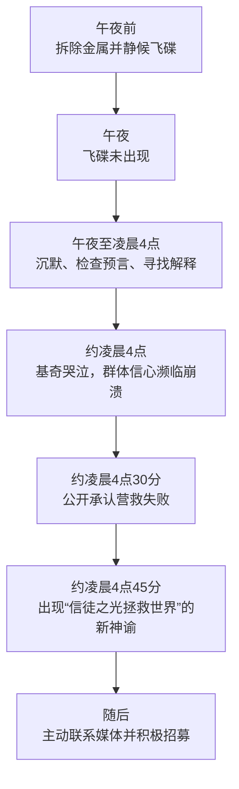

---

## 13. 凌晨 4:45 的新解释：事实证据怎样被改写

### 13.1 自动书写的新神谕

约 4 点 45 分（凌晨），基奇开始“自动书写”，宣称小教团整夜散发的光芒使上帝拯救了世界，因此洪水才没有发生。

### 13.2 解释怎样反转失败

原本的逻辑是：

$$
{\text{洪水不来}}\rightarrow\text{预言错误}.
$$

新解释改成：

$$
{\text{洪水不来}}\rightarrow\text{信徒虔诚成功阻止灾难}.
$$

同一观察结果被重新解释成信仰正确的证明。

### 13.3 为什么新解释本身还不够

一名成员听完后仍穿衣离开，再未返回。仅靠内部新叙事无法完全恢复信心，因为它缺乏独立、可见的外部支持。

### 13.4 第二项转折：要求公诸于世

新的信息很快要求基奇公开神谕。她第一次主动给报社打电话，其他成员也联系报纸、通讯社、电台和全国性杂志。

### 13.5 从保密到曝光的 180 度变化

几小时前，成员还驱赶记者、拒绝新人；预言失败后，他们：

- 接待来访者；
- 回答问题；
- 主动联系媒体；
- 热衷说服怀疑者；
- 抓住所有招募机会。

这种行为反转是本案例最关键的待解释结果。

---

## 14. 为什么怀疑反而推动传教：从事实证明转向社会证明

### 14.1 驱动力不是信心，而是信心危机

预言前，成员确信事实会证明自己，无须招募；预言后，事实证据破产，才迫切需要其他人相信。

### 14.2 高承诺使退出成本极高

一名带幼儿的女性表示，自己花光钱、辞职、退学，因此“不能不信”。阿姆斯特朗也说自己切断关系、拆掉回头的桥，只能相信。

这些陈述体现承诺和一致性压力：承认错误意味着承认巨大牺牲没有依据。

### 14.3 社会认同成为替代证据

若事实无法改变，成员仍可尝试改变社会证据：


### 14.4 “你能说服别人，自己也必然信服”

招募不只是传播既有信仰，也是自我修复。每一名新信徒都成为一条支持原成员的社会证据。

### 14.5 承诺和一致与社会认同如何配合

| 原理 | 在案例中的作用 |
| --- | --- |
| 承诺和一致 | 高投入使成员难以承认教义错误 |
| 社会认同 | 争取他人赞同，为受威胁信仰制造替代证明 |

前者解释为何必须保住信仰，后者解释为何突然积极传教。

### 14.6 这不是所有失败预测的必然结果

预言失败也可能导致退出。是否强化取决于：

- 承诺是否足够高；
- 失败是否能被重新解释；
- 群体是否仍能互相支持；
- 是否可以招募新成员；
- 成员是否接触独立信息和退出支持。

---

## 15. 注释 `[17]`：招募若失败，信仰修复也可能失败

### 15.1 芝加哥教派后续

作者注 `[17]` 补充：该教派的招募努力彻底失败，没有拉到愿意皈依的新成员。预言落空后不到 3 周，组织便解体，只剩成员间零星联系。

### 15.2 这为什么是关键反证

若预言失败必然使信仰更强，组织不应迅速解散。真实结果说明，社会认同修复需要成功取得外部支持；只有努力、没有新证据，无法无限维持体系。

### 15.3 荷兰再洗礼教派的对照

荷兰再洗礼教派预言 1533 年世界毁灭，预言失败后却大力招募。作者注称，一位有感染力的传教士雅各布·冯·康朋一天内为 100 人施洗，荷兰大城市中一度约三分之二人口成为追随者。

### 15.4 对照逻辑

| 预言失败后 | 社会证据结果 | 组织结果 |
| --- | --- | --- |
| 芝加哥小教派招募失败 | 无新皈依者支持 | 很快解体 |
| 再洗礼教派招募成功 | 新成员形成滚雪球 | 信仰得到强化和扩张 |

这不是严格控制实验，但为“社会认同是信仰修复的关键中介”提供了比较材料。

### 15.5 历史数字边界

一天 100 人和城市三分之二人口来自原书注释中的历史叙述，未在本章呈现档案来源和估计方法，应视为作者引用的历史材料，不作精确人口学统计使用。

---

## 16. 预言失败案例的方法、结论与边界

### 16.1 作者如何分析反常现象

1. 先确认预言前承诺程度；
2. 记录成员原本不招募的行为；
3. 观察预言失败后的即时情绪；
4. 记录新解释形成的时间；
5. 比较失败前后的媒体与招募态度；
6. 用承诺危机与社会证据需求解释行为反转；
7. 用后续招募成败检查组织能否维持。

### 16.2 最重要的结论

> 当客观证据否定一项高承诺信念时，成员可能转向社会证据；让更多人相信，能暂时降低自己对错误的怀疑。

### 16.3 适用范围

类似结构可能出现在：

- 高投入团体；
- 公开预测失败；
- 投资、创业或政治立场受挫；
- 身份与某种理论深度绑定；
- 群体能通过招募或点赞制造支持感。

### 16.4 不能过度外推

- 信仰强化不等于所有宗教经验都由社会认同造成；
- 高承诺者不一定拒绝事实；
- 招募增加可能还有组织生存、资源等动机；
- 单一小团体无法估计普遍发生率；
- 参与式观察提供过程证据，不是随机因果证明。

### 16.5 实践防御

- 在作重大承诺前写明可证伪条件；
- 失败后先检查原预测，不急着招募支持者；
- 区分“很多人相信”和“事实得到验证”；
- 给退出者保留关系与尊严，降低承认错误的代价；
- 寻找独立、能接触原始证据的评估者。

---

## 17. “死亡原因：不确定”：社会认同的第一个放大条件

### 17.1 核心条件

社会认同在以下情况下尤其有力：

- 自己不确定；
- 情境含糊、难以分类；
- 事件突然、意外；
- 缺少个人经验；
- 后果重要，却没有明确行动脚本。

### 17.2 为什么不确定会提高群体权重

人在信息不足时，会把他人反应当作额外传感器：

$$
w_{\text{社会证据}}
\uparrow
\quad\text{当}\quad
E_{\text{个人证据}}\downarrow.
$$

这是笔记的方向性模型，不是原书估计的函数。

### 17.3 芝加哥教派提供的线索

预言失败使成员无法判断教义是否仍可信，社会证据需求随之上升。一般化以后，问题不只发生在信仰：任何含糊紧急事件、陌生市场或新环境都可能触发同样过程。

### 17.4 不确定性不等于无知或愚蠢

不确定是信息状态，而不是人格缺陷。紧急事件本来就可能含糊：倒地者是醉酒、睡着还是心脏病发？隔壁声音是争吵还是暴力？观察他人是合理动作，危险来自所有人都把彼此的迟疑误当成信息。

---

## 18. 多元无知：每个人都在观察，却误以为别人知道答案

### 18.1 定义

**多元无知（pluralistic ignorance）**指：群体成员私下都不确定、担忧或不认同，却因观察到其他人表面镇定或沉默，误以为别人认为没有问题，于是自己也不行动。

### 18.2 形成步骤

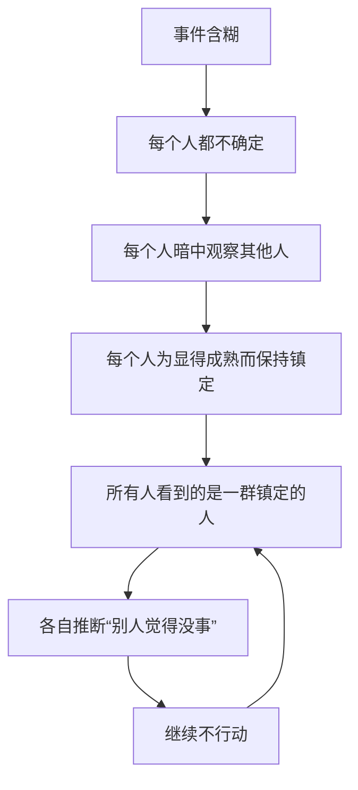

### 18.3 私人状态与公开表现的错位

| 层次 | 实际情况 |
| --- | --- |
| 私人感受 | 很多人担心、拿不准 |
| 公开行为 | 大家不动声色、没有行动 |
| 个体推断 | “只有我担心，其他人知道没事” |
| 群体结果 | 真实危险被集体低估 |

### 18.4 与多数真实共识的区别

真实共识是多人独立评估后得出相同结论；多元无知中，外表一致来自相互观察，而不是独立信息。

### 18.5 为什么陌生人群体更危险

陌生人更希望表现从容，也更难读懂彼此细微担忧。熟人能直接询问、理解表情和协调分工，因此多元无知在互不相识的人群中通常更突出。

---

## 19. 吉诺维斯事件：从“冷漠城市”道德故事转向机制问题

### 19.1 原书采用的经典叙述

原书依据当时广为流传的新闻版本讲述：1964 年 3 月，20 多岁的凯瑟琳·吉诺维斯在纽约皇后区深夜回家时遇害；攻击持续约 35 分钟，凶手三次接近，38 名邻居从窗户看到或听到，却无人及时报警。

### 19.2 新闻如何形成全国性谜题

《纽约时报》都市版编辑 A. M. 罗森塔尔（A. M. Rosenthal）从警方负责人处得知案件，随后派记者调查并刊登头版长文。报道把焦点放在“38 个好人为何不报警”。

### 19.3 当时流行的解释

媒体和评论者把不作为归因于：

- 城市居民冷漠；
- 现代社会自私、麻木；
- 都市人格解体；
- 人与群体疏远；
- 暴力媒体使人失去同情。

这些解释把结果归因于旁观者人格或城市道德，却缺少能区分竞争机制的实验。

### 19.4 为什么“害怕卷入”不够

即使不愿直接介入，匿名报警的个人风险和时间成本也较低。因此，单纯害怕无法完整解释没有快速求助。

### 19.5 史料边界

后来的历史调查对“38 人完整目睹全过程且无人报警”这一新闻叙事提出了重要质疑，包括可见范围、目击程度和报警时间等细节。故本笔记把它视为促成旁观者研究的历史入口，而不是一组干净、已经核实的实验数据。

这不削弱后续随机或模拟实验关于责任分散和多元无知的证据，反而提醒我们不要把一个复杂案件道德化后代替机制研究。

### 19.6 作者注 `[18]` 的另一则报道

作者注还引用一则芝加哥报道：23 岁女大学生李·亚历克西斯·威尔森在热门旅游景点附近白天遇害；警方认为有数千人经过，一名男子约下午 2 点听到尖叫，却因似乎没有其他人注意而未继续查看。

这同样是新闻案例，适合展示“他人没反应 → 我也判断无需行动”的可能路径，不等于控制实验。

---

## 20. 拉坦纳与达利的两机制解释

### 20.1 两名研究者

纽约社会心理学家比布·拉坦纳（Bibb Latane）和约翰·达利（John Darley）提出一个违反直觉的假设：帮助减少可能不是尽管有很多人在场，而是**因为**有很多人在场。

### 20.2 第一机制：责任分散

旁观者越多，个体越容易认为：

- 别人会处理；
- 别人已报警；
- 更有资格的人会行动；
- 自己只承担总责任的一小部分。

解释模型是：

$$
R_i\approx\frac{R_{\text{总}}}{N},
$$

其中 $R_i$ 是个体主观责任，$N$ 是旁观者数量。这不是原书的精确公式，只用于表达责任可能被人数稀释。

### 20.3 第二机制：多元无知

若事件是否紧急尚不明确，个体先看别人；别人也在看人群。所有人表面平静，使每个人都把事件归为不紧急。

### 20.4 两种机制分别回答什么

| 机制 | 核心疑问 | 典型内心语言 |
| --- | --- | --- |
| 责任分散 | 谁应该做？ | “别人会报警。” |
| 多元无知 | 到底是不是紧急情况？ | “别人都不急，应该没事。” |

明确求救必须同时回答“这是紧急事件”和“具体由你做什么”。

### 20.5 可检验预测

若理论正确：

- 单独旁观者更常帮助；
- 其他人表现冷静会降低行动；
- 事件越明确，群体人数的负面作用越弱；
- 直接指定责任人会提高帮助概率。

这让道德批评转化成可实验检验的机制。

---

## 21. 癫痫发作实验：焦点旁观者在独自负责时更常报告

### 21.1 实验程序

拉坦纳、达利及同事通过隔离的交流情境模拟一名纽约大学生癫痫发作，让每名真实受试者以为自己是唯一旁观者，或以为另有多人同时知情。其他“旁观者”是焦点受试者相信存在的人，不是五名真实受试者在同一空间共同决定是否救助。

### 21.2 结果

| 焦点受试者感知的条件 | 焦点受试者报告发作、寻求帮助的比例 |
| --- | ---: |
| 相信自己是唯一旁观者 | 85% |
| 相信现场共有五名旁观者 | 31% |

绝对差异：

$$
85\%-31\%=54\text{ 个百分点}.
$$

也就是说，两种条件下焦点受试者的报告率相差 54 个百分点。

相对而言，唯一旁观条件下焦点受试者的报告率约为五名旁观者条件的：

$$
\frac{85\%}{31\%}\approx2.74
$$

倍。

### 21.3 结果反驳什么

85% 的唯一旁观条件受试者报告了发作，不符合“现代人普遍冷漠”的简单人格解释。焦点受试者相信另有多人知情时更少行动，说明感知到的情境结构具有重要作用。

### 21.4 数据边界

本章未给出样本量、求助延迟和所有程序细节。31% 不是“五人群体中至少一人救助”的群体概率，`2.74` 也只是两种条件下焦点受试者报告率的描述性比值；它们不能直接推算真实癫痫事件中的救助概率。

---

## 22. 烟雾与多伦多实验：他人镇定本身就是强信号

### 22.1 纽约烟雾实验

受试者看到门缝冒出烟雾：

| 条件 | 统计单位 | 报告烟雾的结果 |
| --- | --- | ---: |
| 单独一人 | 单个受试者 | 75% |
| 三名不知情受试者共同在场 | 至少一人报告的小组 | 38% |
| 一名焦点受试者与两名装作无事的研究同谋 | 焦点受试者 | 10% |

三行的统计单位并不完全相同：75% 和 10% 是个体比例，38% 是三人小组中至少一人报告的小组比例，不能把三者当成同一分母直接计算个体效应。

### 22.2 为什么两名同谋使比例最低

三名不知情受试者可能彼此观察，产生迟疑；两名受指示的同谋则持续表现镇定，为焦点受试者提供一致但错误的社会证据：“这不是紧急情况。”

### 22.3 多伦多实验

类似研究中：

| 条件 | 提供紧急帮助的比例 |
| --- | ---: |
| 单独旁观 | 90% |
| 身旁有两名不动声色的旁观者 | 16% |

两地结果共同显示，降低帮助的不只是人数，还包括其他人公开表现出的无动于衷。

### 22.4 不能把不行动直接解释为内心冷漠

受试者可能私下担心，却因同伴镇定而重新分类事件。公开不行动是判断输入，不是可靠的内心态度测量。

---

## 23. 佛罗里达实验：紧急情况明确时，群体效应大幅减弱

### 23.1 四次独立研究

研究者让一名维修工出演事故：

- 两次研究中，他明显受伤、清楚需要帮助；
- 另两次中，提供帮助可能有触电风险。

### 23.2 结果

- 明确受伤时，100% 旁观者帮助；
- 有潜在触电风险时，仍有约 90% 帮助；
- 无论单独还是群体旁观，帮助率都很高。

### 23.3 理论含义

若城市人天生冷漠，明确紧急情况也不应有如此高帮助率。结果更支持：**含糊性和责任不明确是关键变量。**

### 23.4 风险边界

帮助不等于直接进入危险区。现实中有触电、火灾、交通等风险时，应先联系专业救援、切断危险源并遵循安全指引，避免增加受害者。

---

## 24. 城市为何更容易出现旁观者不作为

### 24.1 三个环境特征

作者把实验条件与城市环境对应：

1. **混乱和变化快**：噪声、刺激和信息使事件更难分类；
2. **人口多**：紧急事件更可能被多人共同目击，责任更容易分散；
3. **陌生人多**：旁观者不熟悉彼此，难以沟通和解释表情。

### 24.2 不需要假设“城市人格冷漠”

这三个情境变量足以形成低帮助条件，无须断言城市居民在道德上更麻木。

### 24.3 机制模型

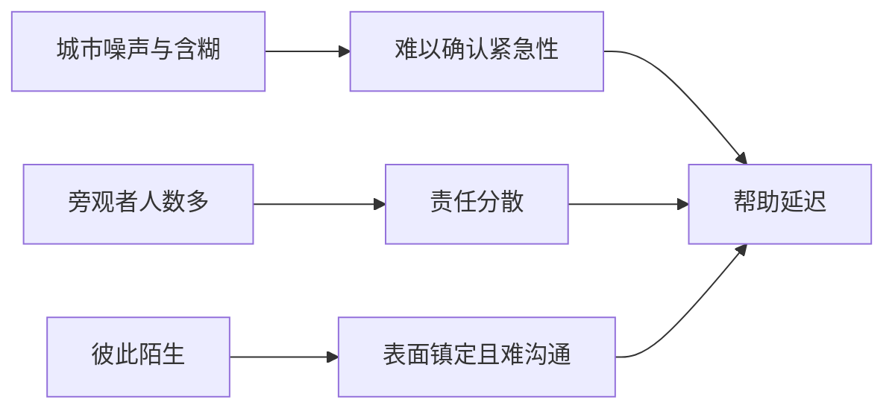

### 24.4 避免生态谬误

城市层面的事件比例不能直接推断每个城市居民人格。乡村也可能存在不作为，城市居民在紧急性明确时同样高度愿意帮助。

### 24.5 作者关于城市化的时代判断

原书预计世界人口会加速向城市集中，并称未来十年将有一半人类生活在城市。这个数字属于原书写作时期的预测；本笔记保留其论证功能，不把它当作 2026 年的新人口统计。

---

## 25. 受害者怎样减少不确定性：定向求救算法

### 25.1 公园中风情境

作者设想：音乐会散场时，一人出现手臂麻木、手部僵硬、半边脸异常、协调和语言能力下降，怀疑中风。路人看到他靠树坐下，却可能误以为只是休息、醉酒或其他非紧急情况。

### 25.2 只呻吟为什么不够

呻吟和含糊喊叫能吸引注意，却未回答：

- 这是否真是紧急情况；
- 需要什么帮助；
- 谁应该行动；
- 是否已有别人报警。

### 25.3 第一步：明确说“救命”

直接说出这是紧急情况，降低事件分类的不确定性。此时不应因害怕尴尬而弱化表达；重大健康风险下，误报的尴尬远小于延误代价。

### 25.4 第二步：指定一个可识别的人

不要只向人群喊“谁来帮忙”，而应看着并指出一个人，例如：

> 穿蓝夹克的先生，请帮我叫救护车。

这把匿名旁观者变成明确责任人。

### 25.5 第三步：给出具体任务

说明需要报警、呼叫急救、取自动体外除颤器或请专业人员。任务越清楚，旁观者越少花时间判断“我能做什么”。

### 25.6 完整流程

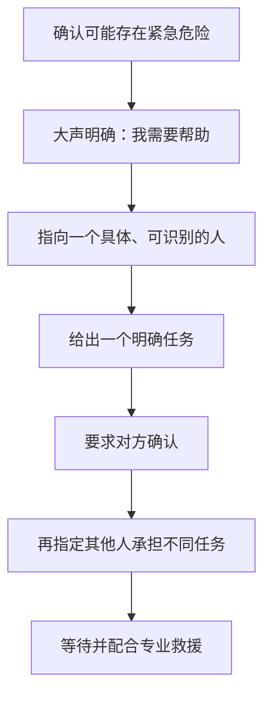

### 25.7 医疗边界

这不是医疗诊断算法。疑似中风、心脏病或严重伤害应尽快联系当地紧急服务；旁观者应在自身安全和能力范围内行动，遵循急救调度员指示。

### 25.8 概率而非保证

原书说这种做法应带来快速有效帮助，但现实中没有任何话术保证成功。它的作用是同时削弱多元无知和责任分散，提高行动概率。

---

## 26. 作者车祸：明确分配责任后，帮助怎样滚雪球

### 26.1 事故现场

作者在十字路口遭遇严重车祸：另一名司机伏在方向盘上失去意识，作者受伤流血、步伐不稳。周围车辆减速观看，却没有停车。

### 26.2 作者怎样应用研究

他意识到司机们可能不确定，便站直让人看清，并逐辆指定任务：

- 指向第一辆车司机：“打电话报警。”
- 指向第二、第三辆车司机：“停车，我们需要帮助。”

### 26.3 结果

被指定者迅速行动；更多司机看到已经有人帮助后，也自发停车。社会认同从抑制帮助转为促进帮助。

### 26.4 反向滚雪球


### 26.5 核心启示

社会认同不是只能制造冷漠。只要有人打破含糊状态、率先行动，同一群体机制会放大救助。

---

## 27. 旁观者研究的完整结论与常见误读

### 27.1 不是“人越多，帮助一定越少”

群体负效应主要出现在：

- 情况含糊；
- 责任未指定；
- 旁观者互不相识；
- 别人表现镇定；
- 每个人都以为他人会行动。

紧急性明确时，群体人数影响可以很小。

### 27.2 不是“旁观者都没有同情心”

单独旁观和明确伤害条件下的高帮助率，说明很多人愿意救助。低帮助可能来自错误判断和协调失败。

### 27.3 责任分散与多元无知不能混同

一个解决“谁来做”，另一个解决“是否需要做”。只明确事件紧急却不分配任务，仍可能人人等待；只指定某人但未说明紧急性，对方也可能犹豫。

### 27.4 新闻案例不是实验结果

吉诺维斯和威尔森报道提出问题，却包含叙事选择和史实争议。机制结论主要应建立在模拟实验和可重复比较上。

### 27.5 最实用的结论

> 紧急求助时，明确说明危险、点名具体个人、交代具体任务，并让对方确认。

这一做法不是操纵，而是在群体协调失败时提供清楚信息。

---

## 28. “有样学样”：相似性是社会认同的第二个放大条件

### 28.1 核心命题

人不只是看“有多少人这样做”，还会看“这些人是否像我”。与自己相似者的行为更能回答：

> 像我这样、处在类似条件下的人，怎样做才合适？

### 28.2 为什么相似者更有信息价值

若示范者与观察者共享年龄、能力、风险、身份或处境，其结果更容易迁移。例如，三岁儿童成功游泳，对另一名三岁儿童的可行性判断，比成年教练示范更直接。

### 28.3 相似性不是一个固定属性

人可以在某些维度相似、另一些维度不同：

- 年龄相同，经验不同；
- 职业相同，目标不同；
- 都是消费者，预算和需求不同；
- 同一文化，风险条件不同。

真正相关的是与当前决定有关的维度。

### 28.4 主观相似也会被制造

广告可用服装、口音、家庭场景和身份标签让演员显得“像普通人”。观众应问：这种相似是否真实、是否与产品效果有关。

### 28.5 组合模型

可以用解释性关系概括社会认同强度：

$$
I_{\text{社会认同}}
=f(N,U,S,V),
$$

其中 $N$ 是可见人数，$U$ 是不确定性，$S$ 是相似性，$V$ 是证据可信度。原书没有提供这个函数，也不能直接赋值计算。

---

## 29. “普通人”广告：为何相似的推荐比名人更像使用证据

### 29.1 广告趋势

作者观察到，电视广告越来越常让普通人称赞软饮料、止痛药、洗衣粉等日用品。目标受众也是普通消费者，示范者因而显得与他们相似。

这种普通人广告的关键资产不是名气，而是“他与我属于同类”的感觉。

### 29.2 两条可能路径

- **产品证言路径**：像我的人实际使用后满意，产品也可能适合我；
- **描述性规范路径**：周围普通人都在用，这是一种正常选择。

### 29.3 真实性问题

“普通人形象”不等于真实随机用户。演员、筛选后的满意顾客、脚本对白都可能制造相似感。

### 29.4 如何核查

- 是否明确标注演员或付费关系；
- 推荐者是否真实使用；
- 是否披露典型结果而非最佳个案；
- 相似维度是否与产品功能相关；
- 是否存在独立评测和总体数据。

---

## 30. 曼哈顿钱包实验：相似示范使归还率从 33% 升到 70%

### 30.1 实验设置

哥伦比亚大学心理学家把钱包放在曼哈顿市中心不同地点。每个钱包内有：

- 2 美元现金；
- 一张 26.30 美元的支票；
- “钱包主人”的姓名和地址资料；
- 一封已经写好、准备寄给失主的信。

### 30.2 “钱包掉了两次”的设计

信件来自一个虚构的第一拾得者。他说自己很高兴能助人，正准备把钱包寄回，却在去邮局途中再次遗失。真正发现钱包的人由此看到一个先前行为榜样：另一个人已经决定归还。

### 30.3 相似性操纵

研究者只改变信件写作者形象：

| 条件 | 信件特征 | 对当前曼哈顿拾得者的相似感 |
| --- | --- | --- |
| 普通美国人 | 标准英语 | 较高 |
| 新到美国的外国人 | 蹩脚英语并自称新移民 | 较低 |

### 30.4 结果

| 虚构第一拾得者 | 钱包被归还比例 |
| --- | ---: |
| 外国人 | 33% |
| 相似的普通美国人 | 70% |

绝对差异：

$$
70\%-33\%=37\text{ 个百分点}.
$$

也就是说，相似榜样与外国人榜样条件的归还率相差 37 个百分点。

相对比值约为：

$$
\frac{70\%}{33\%}\approx2.12.
$$

### 30.5 结果说明什么

两组都看到“前一个人打算归还”的社会证据；相似榜样条件的影响更大。它支持：行为证据的权重受示范者与观察者相似性调节。

### 30.6 不能误读成外国人榜样没有作用

33% 归还率并非零，也没有无信件基线可供本章比较。实验直接支持的是两类榜样之间的差异，而不是外国人示范完全无效。

### 30.7 历史与伦理边界

语言流利度被用来操纵国籍和相似感，也可能同时改变可信度、教育程度或社会身份判断。实验不能证明国籍本身是唯一机制，更不能为排外偏见辩护。

---

## 31. 同龄人示范：反吸烟、看牙与克里斯学游泳

### 31.1 反吸烟项目

健康研究发现，学校反吸烟活动由同龄儿童中的意见领袖以身作则时，更容易产生持久效果。成人说教的权威性较高，同龄榜样却更能回答“像我这样的孩子实际会怎样做”。

### 31.2 看牙影片

儿童观看同龄孩子主动去看牙医的影片后，看牙时的焦虑明显降低。榜样不仅展示“不害怕”，还提供进入诊室、接受程序的行为脚本。

### 31.3 图 4-3 的含义

原书提醒：青少年对家长可能显得叛逆独立，在同龄群体中却仍会依赖社会认同。反抗成人规范与摆脱所有群体影响不是一回事。

### 31.4 克里斯与游泳圈

作者住在亚利桑那州，担心后院泳池溺水风险，想尽早教儿子克里斯游泳。克里斯喜欢水，却拒绝不带游泳圈下水。

作者劝说、哄劝甚至羞他约 2 个月，没有进展；一名曾任救生员和游泳教练、身高约 6 英尺 2 英寸的研究生也失败。

### 31.5 三岁汤米为何比成年教练有效

一次营地活动后，作者看到克里斯从跳板跃入深水并游到池边。克里斯解释：“我都 3 岁了，汤米也 3 岁。既然汤米可以不用游泳圈，我想我也可以。”

### 31.6 机制

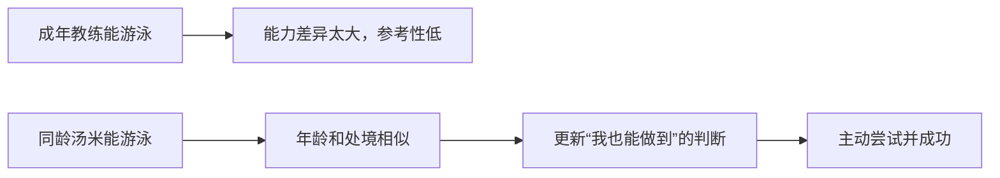

### 31.7 安全边界

儿童水上活动必须有合格成人监护和安全措施。相似榜样可以降低恐惧，不代表儿童已具备独立游泳能力；不能把故事当成放松泳池安全的依据。

---

## 32. 不确定性与相似性如何相乘

### 32.1 两个条件各自做什么

- **不确定性**提高“我需要看别人”的程度；
- **相似性**提高“这个人的行为适用于我”的程度。

### 32.2 组合风险

当人既痛苦迷茫，又看到与自己相似者采取极端行动时，社会证据可能特别有力：

$$
U\uparrow,\;S\uparrow
\quad\Rightarrow\quad
I_{\text{社会认同}}\uparrow.
$$

这是方向性整理，不是乘法效应的统计估计。

### 32.3 正向应用

- 用相似康复者展示安全求助；
- 用同龄榜样推广健康行为；
- 在陌生任务中提供多个真实、独立示范；
- 让榜样说明过程和失败，而不只展示成功。

### 32.4 负向风险

- 选择性报道相似者的危险行为；
- 用演员伪装普通用户；
- 把少数极端个案包装成同类人的普遍选择；
- 算法反复推送与用户身份相近的危险示范。

### 32.5 过渡到下一部分

作者接下来用维特效应检验一个极端问题：当自我伤害行为被广泛报道时，处境或年龄相似者会不会把它视为可行答案？这部分涉及相关性与因果推断，必须比普通广告案例更谨慎地阅读。

---

## 33. 自杀新闻后的事故异常：作者从什么数据谜题出发

### 33.1 原书报告的反常联系

作者称，每当自杀事件成为高曝光新闻，随后一段时间内：

- 自杀人数增加；
- 致命车祸增加；
- 飞机事故死亡增加；
- 原书甚至称商业客机坠毁死亡人数可激增 10 倍。

这些是原书依据大卫·菲利普斯等人历史统计所作的概括，不是本章重新分析的原始数据。

### 33.2 为什么普通相关性不够

“新闻之后事故增加”可能有多种原因：

- 共同社会压力同时导致两者；
- 知名人物死亡使公众悲痛分心；
- 媒体报道诱发模仿；
- 统计波动或选择性时间窗口；
- 其他同期事件。

作者没有直接接受模仿解释，而是依次比较竞争假设。

### 33.3 需要解释的五种模式

一个好理论必须同时解释：

1. 为什么增加集中在报道地区；
2. 为什么曝光越大，增幅越大；
3. 为什么单人死亡报道后多为单人事故；
4. 为什么多人死亡报道后多为多人事故；
5. 为什么死者年龄与报道对象年龄相似。

能只解释总量、却解释不了针对性模式的理论不够完整。

---

## 34. 两个竞争解释为何不足：社会条件论与丧亲说

### 34.1 社会条件论

第一种解释认为，经济衰退、犯罪、国际紧张等社会压力：

- 使一些人自杀；
- 使另一些驾驶者焦躁、分心或冒险；
- 因而同时推高自杀和事故。

### 34.2 地区曝光怎样反驳它

原书称，事故增加仅出现在自杀新闻广为报道的地区；类似社会条件存在但未广泛报道的地区，没有同样增幅。报道曝光越大，后续事故增幅越大。

若共同社会条件是充分解释，结果不应如此依赖媒体传播边界。

### 34.3 丧亲说

第二种解释认为，头条自杀常涉及知名人物，公众悲痛、震惊和分神，驾驶或操作交通工具时更容易出错。

### 34.4 事故规模的针对性怎样反驳它

原书报告：

- 单人自杀报道后，增加的主要是单人死亡事故；
- 自杀并导致多人死亡的报道后，增加的主要是多人死亡事故。

一般悲痛和分心可以解释事故增加，却难以解释事故人数结构跟随新闻范例。

### 34.5 排除竞争解释的推理价值

作者不是因为模仿故事生动就接受它，而是看哪种理论能解释更多细粒度预测。这是一种“竞争假设 + 差异化预测”的方法。

### 34.6 仍不能宣称完全排除所有混杂

历史媒体数据不是随机实验。地区差异、报道选择和事故分类仍可能影响结果。原书的论证提高了模仿解释的可信度，不等于完成绝对因果证明。

---

## 35. 维特效应：他人的自我伤害如何成为危险社会证据

### 35.1 名称来源

**维特效应（Werther effect）**得名于歌德小说《少年维特的烦恼》。小说以主人公自杀告终，出版后欧洲出现模仿浪潮，部分国家一度禁书。

### 35.2 大卫·菲利普斯的解释

加利福尼亚大学圣地亚哥分校社会学家大卫·菲利普斯（David Phillips）认为，高曝光自杀报道会给处于痛苦中的相似者提供一条行为范例，使原本模糊的念头显得更可行或更被“证明”。

### 35.3 社会认同路径


### 35.4 这不是说报道对象“鼓励”模仿

社会证据效应不要求当事人有劝说意图。媒体的呈现方式、重复程度、细节和浪漫化可能无意中提高行为可见性。

### 35.5 现代预防含义

负责任报道应避免耸动、浪漫化、重复呈现和不必要细节，提供求助资源、康复叙事与替代应对方式。这里关注的是降低传播风险，不是压制对心理健康和公共事件的讨论。

---

## 36. 1947—1968 年数据：头版报道后两个月平均多 58 人

### 36.1 原书报告

菲利普斯分析美国 1947 至 1968 年自杀统计，发现自杀新闻登上头版后，其后约 2 个月内，自杀人数平均比通常多 58 人。

图 4-4 呈现的是自杀人数序列：初始猛增后虽有所下降，但在图示的后续期间并未回到传统基线。这个约 2 个月的窗口与后文图 4-5 的事故死亡时间模式不是同一统计序列。

### 36.2 曝光剂量关系

报道越广、曝光越高，后续增加越大；效应主要集中在报道覆盖地区。

### 36.3 为什么剂量关系有意义

若媒体曝光参与传播，接触人数和强度增加应对应更大结果。这与模仿假设方向一致。

### 36.4 “每条新闻杀掉 58 人”应谨慎理解

原书用强烈修辞说每条报道杀掉 58 个本来能活的人。统计上的“平均超额人数”不等于每一案例都能逐人追踪到单条新闻，也不表示所有报道方式风险相同。

更严谨的表述是：在所分析历史数据中，高曝光报道与随后约 58 人的平均超额自杀相关，作者将其解释为传播效应。

### 36.5 媒介范围

原书还称，新闻、专题、信息节目和虚构影视中的自杀呈现都可能伴随模仿增加，青少年等易感群体风险尤其值得重视。

### 36.6 伦理阅读

这些数字用于说明公共传播责任，不应用来责备个体、家属或简单禁止报道。预防应聚焦报道规范、可及支持和早期干预。

---

## 37. “隐性事故”解释：为什么事故的结构会复制报道

### 37.1 菲利普斯的进一步假设

原书转述：部分模仿者可能因声誉、家庭影响或保险等原因，让死亡看起来像事故。因此，某些新闻后的车祸或坠机增量可能包含被伪装的自杀。

### 37.2 解释力

这一假设能统一解释：

- 自杀与事故总量同时上升；
- 单人范例对应单人事故；
- 多人死亡范例对应多人事故；
- 报道越广，增量越大。

### 37.3 避免操作化细节

原书列举了若干制造事故的方式。本笔记不复述这些可操作细节，因为理解因果假设不需要学习实施方法。核心只在于：事故分类可能掩盖真实意图。

### 37.4 证据边界

隐藏意图难以从事故记录直接确认。模式一致性支持假设，却不能证明每起异常事故都是故意行为。

---

## 38. 预测检验：严重度、时间和年龄相似性

### 38.1 严重度预测

若异常事故含有蓄意模仿，后果应比普通事故更致命。原书报告：

- 高曝光自杀新闻后一周的商业航班事故，平均死亡人数约为新闻前一周同类事故的 3 倍；
- 新闻后的车祸更致命，原书称受害者“死亡速度”约为通常的 4 倍。

“死亡速度”是译文表述，宜理解为事故致死性显著提高，而不是生理过程的精确速度量。

### 38.2 事故死亡的时间模式

图 4-5 所示的是自杀新闻之后的事故死亡或乘客风险序列：

- 报道后第 3 至 4 天最危险；
- 短暂回落后，约一周出现第二个高峰；
- 到第 11 天，这条事故死亡序列中的报告效应消失。

这里的约 11 天事故窗口，不与第 36 节“其后约 2 个月的自杀人数增加”矛盾；两者的结果变量和图表不同。

### 38.3 年龄相似性预测

若相似者示范更有力：

- 详细报道年轻人自杀后，年轻司机的单车单人致命事故应增加；
- 报道老年人自杀后，年龄较长司机的相应事故应增加。

菲利普斯报告数据与这一预测一致。

### 38.4 为什么新预测比事后解释更强

一个理论若能在查看数据前预测严重度和年龄匹配，再从独立记录中得到符合结果，证据价值高于只对已知总量编故事。

### 38.5 作者的个人应对不等于普遍建议

作者说自己在头条自杀新闻后减少长途飞行、购买更多航空保险。现代读者不应仅凭本章历史统计机械改变出行，因为交通安全、报道环境和研究估计会变化。

更稳妥的实践重点是媒体传播规范、心理支持和对自身情绪反应的觉察。

---

## 39. 拳击报道与暴力模仿：相似性也可能指向他人

### 39.1 1973—1978 年重量级比赛数据

原书称，电视晚间新闻报道重量级拳击冠军赛后，美国凶杀率出现针对性变化：

- 黑人拳手输掉比赛后的 10 天内，黑人男青年死于凶杀的比率上升；
- 白人拳手输掉比赛后的 10 天内，白人男青年死于暴力的比率上升。

### 39.2 与维特效应的共同点

被模仿的不一定是对自己的暴力，也可能是对相似他人的暴力。媒体范例中的身份与后续受害者身份相匹配，符合相似性条件。

### 39.3 相关性边界

体育赛事、媒体日程、地区和其他社会事件可能形成混杂。原书把模式解释为模仿暴力，但不能据此把个体犯罪归因于某一场比赛。

### 39.4 媒体责任

报道暴力时，应避免把伤害塑造成荣耀或身份脚本，减少不必要重复，强调后果、受害者和非暴力替代方式。

---

## 40. 怎样严谨阅读维特效应材料

### 40.1 证据链的强项

- 地区效应随报道覆盖而变；
- 曝光越高，增幅越大；
- 单人/多人事故结构匹配；
- 严重度出现理论预测的变化；
- 年龄相似性符合社会认同预测；
- 时间效应有集中窗口。

### 40.2 证据链的局限

- 多为历史观察与准实验，而非随机暴露；
- 自杀和事故分类可能有误；
- 媒体选择报道哪些事件并非随机；
- 社会环境可能同时影响报道和行为；
- 早期研究数字不应未经更新直接用于当前风险预测。

### 40.3 不能把群体风险当成个体宿命

平均风险增加不表示看到报道的人都会模仿，也不能预测具体个体。风险集中在部分易感、痛苦和认同度高的人群。

### 40.4 保护性社会认同

社会认同也能用于预防：展示求助、治疗、幸存、恢复和同伴支持，让相似者看到替代路径同样常见且可行。

### 40.5 若内容引发个人痛苦

应停止继续接触相关刺激，联系可信任的人和专业支持；若存在即时危险，联系当地紧急服务。阅读社会科学结论不能替代个体危机干预。

---

## 41. 琼斯敦背景：为什么既有解释仍不够

### 41.1 人民圣殿教迁移

人民圣殿教原以旧金山为基地，成员主要来自贫困群体。1977 年，领袖吉姆·琼斯带大部分成员迁往南美洲圭亚那丛林。

### 41.2 1978 年 11 月 18 日

原书记载，众议员利奥·瑞安率领调查小组来访，离开时调查组有成员遭杀害。琼斯预期自己将被捕、组织将解散，随后命令全体成员集体死亡。

### 41.3 原书描述的第一名响应者

原书称，一名年轻女性先给孩子和自己服下带草莓味的毒物，随后其他人依次效法。

### 41.4 死亡规模

原书采用 910 名死者的数字，并依据幸存者叙述称多数人秩序井然地走向死亡，也提到少数人逃跑或抵抗。

### 41.5 必须保留的历史伦理边界

“集体自杀”与“心甘情愿”会掩盖儿童无法同意、武装强迫、长期控制和谋杀因素。不同史料对人数和过程细节也可能有修订。社会认同只能解释其中部分群体行为，不能把惨剧简化成自由个体的普通从众选择。

---

## 42. 三种常见解释：魅力、成员处境与绝对忠诚

### 42.1 领袖魅力

琼斯被描述为让信徒像爱救世主、父亲和帝王一样追随的煽动者。个人权威显然重要。

### 42.2 成员的社会处境

成员多为贫困、教育机会有限、寻求安全归属的人。这可能提高对组织资源和领导决策的依赖。

### 42.3 准宗教绝对忠诚

组织要求对领袖不容怀疑的效忠，长期训练和隔离会削弱独立判断。

### 42.4 为什么作者认为仍不够

世界上存在其他魅力领袖、高控制组织和脆弱成员，却极少发生同规模惨剧。解释必须指出琼斯敦特有的条件。

### 42.5 多因果框架

社会认同不是替代权威、强迫和隔离，而是与它们叠加：

$$
{\text{惨剧风险}}
=f(\text{权威控制},\text{隔离},\text{强迫},\text{不确定性},\text{相似群体证据}).
$$

公式是笔记的多因果提醒，不是原书统计模型。

---

## 43. 搬到圭亚那：不确定性与相似性同时被放大

### 43.1 路易斯·乔利恩·韦斯特的判断

加州大学洛杉矶分校精神病学与生物行为学专家路易斯·乔利恩·韦斯特（Louis Jolyon West）在惨剧前观察人民圣殿教约 8 年。他认为，这件事不会发生在加利福尼亚；圭亚那的敌对、陌生和丛林隔离是关键。

### 43.2 陌生环境提高不确定性

从旧金山搬到南美热带雨林后，成员失去熟悉的自然、制度和社会参照，不知道怎样判断风险、规范和现实。

### 43.3 可参考的相似者被缩小到教内

在圭亚那，当地居民、文化和环境与成员不同；对“像我这样的人该怎么做”，成员只能观察其他教徒。

### 43.4 信息生态闭合

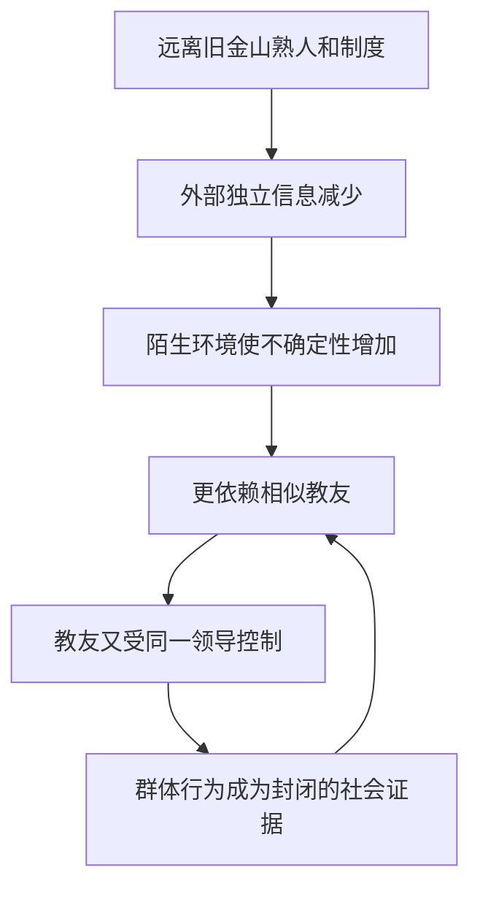

### 43.5 迁移的心理后果

领导者不必逐个说服 900 多人。只需控制部分核心成员和信息环境，社会认同便可把局部服从扩散为群体规范。

---

## 44. 两条同向社会证据：先行者与整个人群

### 44.1 第一条：立即行动的少数人

收到死亡命令后，一些高度忠诚者率先行动。他们可能事先得到指示，也可能本来最顺从；无论原因如何，其他成员看到的是：与自己相似的人已经把命令当作正确行动。

### 44.2 第二条：人群表面的平静

其他人可能也在恐惧和观察，却尽量保持镇定。每个人看到周围都秩序井然，便推断“大家都接受了，这是正确做法”，形成大规模多元无知。

### 44.3 级联过程

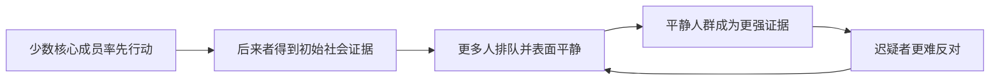

### 44.4 可信但错误的解读

个体看到的行为是真的：有人确实行动、队伍确实平静；错误在于把行为解释成所有人自由、知情地认同，而忽略恐惧、监控、强迫和彼此观察。

### 44.5 为什么“秩序井然”不能证明自愿

高控制环境中的整齐行为可能来自武力、儿童依赖、长期灌输、无处可逃和群体压力。外在秩序不是内心同意的可靠指标。

---

## 45. 领导者怎样借群体力量：不必亲自说服每个人

### 45.1 个人说服的上限

一个领导者很难单靠魅力同时控制上千人的每个判断。更高效的方法是先说服或控制相当一部分成员，再让其行为成为剩余成员的证据。

### 45.2 社会柔道


领导者施加初始推力，群体内部机制完成放大。

### 45.3 组织风险信号

- 主动切断外部关系；
- 搬到隔离地点；
- 限制独立媒体和信息；
- 只允许内部榜样；
- 把少数核心成员行动包装成全体共识；
- 不允许匿名异议和安全退出；
- 把表面平静解释成真实同意。

### 45.4 保护机制

- 保持外部沟通和独立信息源；
- 允许私密、无报复的异议；
- 重大决定先匿名收集意见；
- 防止领导者控制全部社会参照；
- 给成员现实退出渠道与支持；
- 儿童和脆弱者的安全由外部制度监督。

---

## 46. 琼斯敦案例的适用范围与局限

### 46.1 本章能解释什么

社会认同有助于解释：

- 陌生隔离环境为何提高跟随需求；
- 相似教友为何比外界更有参考性；
- 少数先行者如何启动群体级联；
- 表面平静怎样制造多元无知；
- 领导者为何只需影响部分成员。

### 46.2 不能解释全部

还必须考虑：

- 领袖权威与长期控制；
- 武装威胁与暴力；
- 儿童无法同意；
- 地理隔离和资源依赖；
- 信息封锁；
- 恐惧、创伤和逃生困难。

### 46.3 不能用普通“从众”淡化责任

解释群体心理不是责怪受害者，也不是减轻组织领导者和实施暴力者责任。操纵环境是权力行为，受控者的选择空间并不对等。

### 46.4 与旁观者效应的共同结构

两者都包含：

- 情境高度不确定；
- 个体观察他人；
- 他人也在观察群体；
- 表面不行动或平静被误读；
- 初始行为被滚雪球放大。

### 46.5 最重要的预防原则

在高风险群体决策中，必须在公开行动前获取独立判断，并保留外部事实校验、匿名异议和安全退出。仅看群体是否整齐、平静或人数众多，不能证明决定正确。

---

## 47. “如何拒绝”：把社会认同当作可接管的自动导航

### 47.1 为什么不能彻底关闭社会认同

他人行为通常是有价值的信息。若每次都独立试验餐厅、产品、路线和社会规则，成本过高。完全不参考别人，会失去集体经验。

### 47.2 自动导航比喻

作者把社会认同比作飞机自动导航：

- 正确输入下，它高效地维持航线；
- 错误输入下，它会稳定地把人带偏；
- 飞行员不必永远手动，却必须能检查并接管。

### 47.3 防御目标

$$
{\text{防御}}
\neq\text{拒绝多数意见},
$$

$$
{\text{防御}}
=\text{识别错误输入}+\text{必要时独立接管}.
$$

### 47.4 两类坏输入

| 类型 | 来源 | 典型案例 |
| --- | --- | --- |
| 蓄意伪造 | 有人刻意制造“大家都这样” | 罐头笑声、托儿、假街访、假热度 |
| 无心失准 | 群体成员互相模仿、误差滚大 | 多元无知、高速变道、信息级联 |

两类问题的防御不同：前者要查来源和动机，后者要查独立性与客观事实。

---

## 48. 第一类错误输入：蓄意伪造的社会证据

### 48.1 伪造的核心

请求者让观察者相信很多人独立选择了某行为，实际上：

- 行为由付费演员完成；
- 初始人数由经营者布置；
- 只展示支持者；
- 数量或比例被虚构；
- 多个账号来自同一控制者。

### 48.2 为什么明显造假仍有效

罐头笑声和歌剧捧场并不隐蔽。利用者依赖的是自动反应先发生，而非观察者永远识别不出假象。

### 48.3 最小核查

问三个问题：

1. 这些行为者真实存在吗？
2. 他们是独立选择，还是受雇、受控或同源？
3. 展示的是总体比例，还是挑选后的支持案例？

---

## 49. 歌剧“捧场”：付费掌声怎样成为一门公开生意

### 49.1 起源

原书称，1820 年巴黎歌剧院常客索通和波奇尔首创商业化捧场，成立“歌剧演出成功保险公司”，向歌手和剧院经理出售预先安排的观众反应。

### 49.2 扩张

他们用少量付费者先鼓掌、喝彩或表现激动，带动真实观众。到 1830 年，捧场制度进入全盛时期，并成为歌剧界惯例。

### 49.3 专业分工

行业逐渐出现：

- 负责领头的首席喝彩员；
- 能按要求哭泣的“哭娘”；
- 高喊“再来一个”的喝彩者；
- 以感染性笑声带动观众的“笑匠”。

### 49.4 公开性

捧场者多年坐在固定位置，交易也不隐蔽；一百多年后，伦敦《音乐时代》读者仍能看到意大利式捧场费率广告。

### 49.5 罗伯特·萨宾的历史说明

音乐史学家罗伯特·萨宾（Robert Sabin）指出，这种白天收钱、晚上鼓掌的制度快速蔓延。案例说明，社会证据即使来源可疑，也能借真实观众的后续反应变得越来越像自然共识。

### 49.6 与罐头笑声的同构

| 歌剧捧场 | 罐头笑声 |
| --- | --- |
| 付费者现场制造掌声 | 录音制造笑声 |
| 带动真实观众喝彩 | 带动真实观众发笑 |
| 初始社会证据由经营者购买 | 初始社会证据由制作方插入 |

---

## 50. 假街访与“火星消费者”：识别后怎样反击

### 50.1 选择性真实街访

广告即使访问真实路人，也可能只播出喜欢产品的人。观众看到一连串正面评价，却不知道：

- 一共采访了多少人；
- 有多少负面评价被剪掉；
- 问题怎样引导；
- 片段是否具有代表性。

### 50.2 演员伪装街访

更严重的做法是直接雇演员扮普通消费者，布置背景、编写台词，再包装成未经排练的即兴采访。

### 50.3 戴夫·巴里的“火星消费者”

幽默作家戴夫·巴里把这类明显不自然的路人称为“来自火星的消费者”。这个标签能提醒观察者：画面中的人未必代表与自己相似的真实用户。

### 50.4 作者主张的主动反击

作者不只建议忽略虚假社会证据，还主张：

- 不购买使用虚假街访广告的产品；
- 向制造商投诉；
- 要求更换或约束广告机构。

### 50.5 反击边界

合理反击应基于可核实事实，采用不购买、投诉、举报和公开纠错等合法方式；不应骚扰演员、普通员工或传播未经证实的指控。

### 50.6 数字平台中的对应物

- 购买虚假评论；
- 机器人点赞；
- 刷榜和刷量；
- 伪造下载人数；
- 用同一组织控制多个“独立”账号；
- 隐藏付费推广关系。

### 50.7 平台核查清单

- 评论时间是否异常集中；
- 文案是否高度相似；
- 是否有“已验证购买”仍需谨慎解释；
- 评分是否披露总样本和分布；
- 是否能查看中差评与退款；
- 推荐者是否披露利益关系。

---

## 51. 第二类错误输入：无心错误怎样滚成群体级联

### 51.1 与造假的区别

无心级联中，没有人必须撒谎。每个人都真实地看到前人行动，也真诚地跟随；错误在于把“前人行动”误当成“前人掌握了独立信息”。

### 51.2 信息级联

作为补充背景，**信息级联（information cascade）**指个体忽略或降低自己掌握的信息，转而跟随先前公开行为；后续人再根据这个行为继续跟随。

### 51.3 级联为何脆弱

一两个偶然动作就可能决定方向；后来人数再多，也只是在重复早期误差。

$$
{\text{可见一致人数增加}}
\quad\not\Rightarrow\quad
{\text{独立信息增加}}.
$$

---

## 52. 高速公路变道：两辆车怎样制造错误路况共识

### 52.1 巡警观察到的事故

作者一名学生是高速公路巡警。他描述交通高峰期的反常事故：所有车道原本缓慢但畅通，两辆前车恰巧同时打灯变道，后车却推断原车道前方有故障或施工。

### 52.2 滚雪球过程

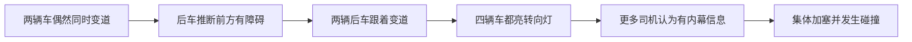

### 52.3 为什么司机不看畅通道路

社会证据达到一定规模后，司机把“这么多人不会都错”当成充分理由，停止检查眼前客观路况。

### 52.4 核心教训

人群可能全都基于前一辆车行动，而前一辆车并没有有关障碍的信息。群体行为真实性与群体判断正确性是两回事。

### 52.5 驾驶安全边界

现实驾驶中应遵守交通规则、保持车距、查看道路和盲区，不应为了验证群体是否错误而作突然动作。笔记分析的是信息级联，不是驾驶操作指南。

---

## 53. 北美野牛：只看旁边、不看前方的极端比喻

### 53.1 原书描述

作者讲述部分北美原住民猎野牛的方法：野牛眼睛位于头部两侧，奔跑时低头，不易看清正前方。猎人把牛群赶向悬崖，群体会跟随邻近个体继续前进。

### 53.2 群体动力

原书引用观察称，领头野牛可能被后方牛群挤下悬崖，其他野牛则继续跟随跃下。

### 53.3 比喻意义

“只看旁边，不看前方”对应：

- 只看他人行为；
- 不查看客观环境；
- 群体惯性迫使前方个体继续；
- 后来者把前方移动误认成有方向的信息。

### 53.4 文化表述边界

原书使用概括性历史叙述。阅读时应避免把多样的原住民族群简化成单一形象；本案例的理论功能是自动跟随比喻，不是完整民族志。

---

## 54. 自动导航的周期校验：什么时候该抬头看路

### 54.1 不是每次都全面调查

防御无需永久关闭社会认同，只需周期性快速核查：

- 眼前客观事实是否支持群体行为；
- 群体成员是否可能互相模仿；
- 是否有共同信息源；
- 是否存在独立专家或原始数据；
- 自己是否因不确定而过度加权人数。

### 54.2 三角校验

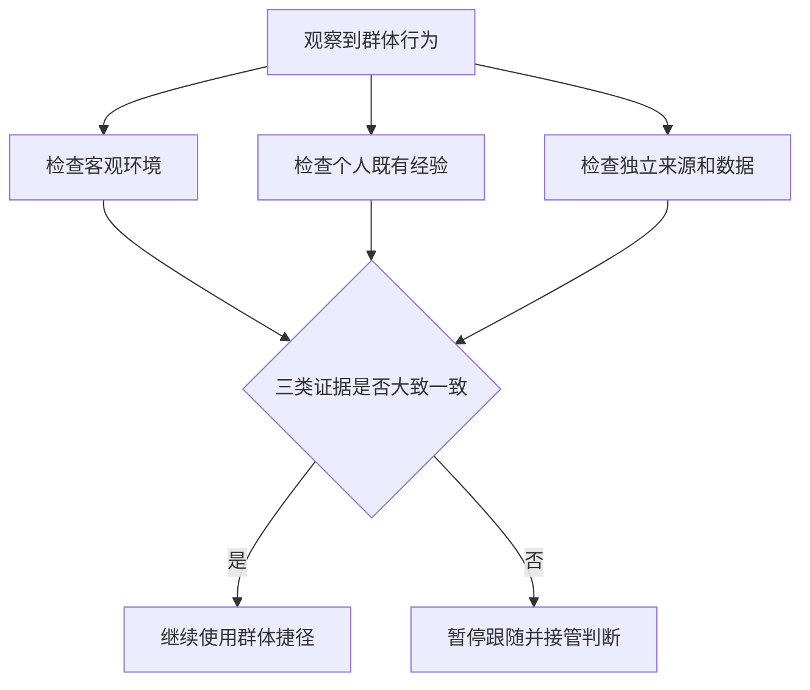

### 54.3 重要决定提高核查强度

低风险、可逆选择可适度依赖人群；涉及健康、安全、重大资金、法律和不可逆行动时，应要求更强的独立证据。

### 54.4 少数与多数都可能错

反向跟随少数同样不是独立思考。正确做法不是“多数说东我就向西”，而是根据证据质量决定。

---

## 55. 跑马场读者报告：怎样制造一匹“热门马”

### 55.1 赔率与公众判断

一名前跑马场雇员说明，赛马赔率随投注资金变化：某匹马获得的下注越多，显示赔率越低。缺乏赛马知识者会把低赔率和热门状态当作“别人掌握内幕”的社会证据。

### 55.2 原书描述的操纵结构

有经验的投注者可能先在一匹获胜希望很低、初始赔率约 15:1 的马身上投入 100 美元，使早期显示赔率短时降到约 2:1，制造它很受欢迎的印象。

不确定的公众随后跟注，形成滚雪球；操纵者再在真正看好的马匹上下注，并利用后者被人群忽视后的较高赔率。

### 55.3 作者不把它当作投注技巧

这个案例用于识别虚假热门和社会证据操纵，不构成赌博建议。赌博存在显著财务和成瘾风险，所谓“老手”也无法保证获利。

### 55.4 读者亲历

报告者曾看到有人给赛前赔率 10:1 的马下注 100 美元，使其成为初期热门。赛场传言最早下注者有内幕消息，众人包括报告者跟注。该马最终跑到最后并受伤，公众亏损，而真正操纵者身份未知。

### 55.5 关键条件

作者点评指出：在不熟悉、拿不准的环境里，人最容易观察周围寻找行动证据。跑马场同时具备：

- 信息不对称；
- 快速变化的公开数字；
- 决策时间短；
- 从众可见；
- 金钱诱因强。

### 55.6 防御

- 不把短时热门等同独立内幕信息；
- 检查市场深度和早期小样本波动；
- 不追逐自己无法评估的下注；
- 设定不可突破的财务边界；
- 把“不懂”视为不参与的理由，而不是跟随多数的理由。

### 55.7 证据边界

这是个人报告，不是受控研究。赔率变化还受市场规则、投注规模和时点影响；案例说明机制可能存在，不能估计发生频率。

---

## 56. 核心概念的关系与区别

### 56.1 社会认同与事实真伪

社会认同回答“别人怎样判断或行动”，事实核查回答“世界实际怎样”。前者可以提供证据，不能替代后者。

### 56.2 人数与独立证据数

一千人转发同一错误来源，仍可能只有一份原始证据。评估应关注来源独立性，不只看可见人数。

### 56.3 不确定性与相似性

不确定性提高参考他人的需求，相似性提高特定榜样的相关权重。两者可以同时放大影响。

### 56.4 社会认同与权威

| 社会认同 | 权威 |
| --- | --- |
| 依据多数或同类人的行为 | 依据专家、职位或制度角色 |
| 线索是“很多人这样做” | 线索是“有资格的人这样说” |
| 可在同伴群体中最强 | 可在专业不对称中最强 |

多数人和专家都可能错，也可能相互独立地提供有价值信息。

### 56.5 社会认同与喜好

相似者既可能更有参考性，也可能更讨人喜欢。钱包实验主要按榜样行为的相关性解释；下一章喜好则关注因为喜欢请求者而顺从。

### 56.6 多元无知与责任分散

前者是事件分类错误，后者是行动责任稀释。紧急求救要分别解决。

### 56.7 伪造证据与无心级联

| 伪造 | 无心级联 |
| --- | --- |
| 起点有人故意制造假象 | 起点可只是偶然动作或误判 |
| 重点查利益与真实性 | 重点查独立性与客观环境 |
| 例：演员假街访 | 例：高速公路集体变道 |

### 56.8 模仿与学习

模仿可带来首次行为，真实反馈随后决定是否形成学习。儿童影片之所以可能持久，是因为尝试后获得安全、成功的现实经验。

### 56.9 流行与正确

流行度可能反映质量、网络效应、可得性、广告或从众。它是需要解释的结果，不是质量定义。

### 56.10 社会认同与群体极化

社会认同关注他人行为怎样指导个体；群体极化通常指讨论后群体平均立场变得更极端。二者可能互动，但本章不是群体极化理论的完整论述。

---

## 57. 作者如何一步步分析问题

### 57.1 从人人讨厌却持续使用的技术提出问题

罐头笑声把“态度讨厌”与“行为有效”分开，迫使作者寻找自动机制，而不是只批评电视台。

### 57.2 从伪造线索反推正常规则

笑声能伪造，正因为真实笑声通常提供幽默信息。作者先解释规则为何有用，再解释漏洞。

### 57.3 用正向干预证明机制不是纯缺陷

班杜拉和奥康纳研究显示，真实、相关榜样能降低恐惧和退缩。社会认同本身不邪恶，输入质量决定方向。

### 57.4 用参与式观察捕捉信念危机的时间过程

预言失败案例记录成员从不招募到狂热宣传的小时级变化，使“事实证据崩塌后寻找社会证据”的推理可见。

### 57.5 从极端个案抽取最佳适用条件

教派信心动摇指向“不确定性”；钱包、同龄儿童和事故年龄匹配指向“相似性”。

### 57.6 把道德解释改写成情境假设

旁观者不作为原被称作城市冷漠；拉坦纳和达利提出责任分散与多元无知，再用人数和同谋行为实验检验。

### 57.7 比较竞争理论而非只讲一个故事

维特效应部分依次比较社会条件论、丧亲说和模仿解释，并用地区、曝光、人数结构、严重度和年龄作差异化预测。

### 57.8 在防御中保留规则价值

作者没有要求拒绝群体信息，而是识别两类错误输入、周期校验并在必要时接管。

### 57.9 完整方法链


---

## 58. 证据结构、适用范围与局限

### 58.1 证据地图

| 证据类型 | 代表材料 | 主要支持 | 主要局限 |
| --- | --- | --- | --- |
| 实验综述式概括 | 罐头笑声 | 群体笑声改变行为与评价 | 本章未给完整样本和效应量 |
| 行为干预 | 怕狗儿童、退缩儿童 | 真实榜样可改变行为并保持 | 样本信息有限、临床外推谨慎 |
| 参与式观察 | 预言失败教派 | 高承诺危机后的招募转向 | 小样本、伦理和观察者影响 |
| 模拟紧急实验 | 癫痫、烟雾、维修工 | 人数、他人镇定与含糊性的作用 | 人工情境与真实危险不同 |
| 现场实验 | 曼哈顿钱包 | 相似榜样提高行为影响 | 相似性操纵可能伴随其他判断 |
| 历史准实验 | 维特效应、事故、拳赛 | 曝光、严重度和相似性模式 | 非随机报道、分类与混杂问题 |
| 历史案例 | 琼斯敦 | 隔离、不确定与内部社会证据 | 多重强迫机制，不能单因化 |
| 读者报告 | 跑马场热门操纵 | 虚假社会证据的现实结构 | 个人回忆、无法估计频率 |

### 58.2 强结论与谨慎结论

较直接的实验结论：

- 他人笑声和示范可改变评价或行为；
- 不确定情况下，他人公开镇定会抑制报警；
- 单独旁观者通常比含糊情境中的群体更常帮助；
- 相似榜样比不相似榜样影响更大。

需要更谨慎的历史解释：

- 某一事故增量具体有多少属于隐藏自杀；
- 某拳赛报道造成多少凶杀；
- 琼斯敦多数成员的内心意愿；
- 一项旧媒体效应在 2026 年平台环境中的精确大小。

### 58.3 相关不等于因果，但模式可以增强推断

地区边界、曝光剂量、时间顺序和年龄匹配让简单相关更有解释力，却仍不能像随机实验一样排除所有混杂。

### 58.4 跨文化与媒介变化

社会认同是广泛机制，具体线索随媒介变化：电视笑声、报纸头条、现场队伍、评分榜、点赞数和推荐算法都可能成为输入。

### 58.5 数量指标需要分母

“很多人购买”必须配合：

- 总访问人数；
- 观察时间窗；
- 退款或退出人数；
- 样本来源；
- 是否付费或重复账号；
- 人群与当前用户的相关性。

### 58.6 伦理边界

真实示范可促进健康，伪造群体行为则侵犯知情选择。涉及自伤、暴力和危机的传播，还要优先考虑易感者安全与负责任报道。

---

## 59. 一套可执行的社会证据审查流程

### 59.1 第一步：识别自己为何在看别人

问：我是否因陌生、匆忙、信息不足或害怕成为第一个而跟随？承认不确定性可以防止它暗中放大群体权重。

### 59.2 第二步：确定社会证据是什么

- 人数；
- 排队；
- 销量；
- 评分；
- 专门展示的案例；
- 相似者行为；
- 他人的沉默或镇定。

### 59.3 第三步：验证真实性

证据是否来自真人、真实行为、真实交易？是否存在演员、机器人、托儿、预放资金或付费评论？

### 59.4 第四步：检查独立性

这些人是否各自掌握信息，还是都在模仿同一早期行为、同一媒体或同一推荐算法？

### 59.5 第五步：检查相关相似性

榜样是否在影响结果的关键维度上与自己相似，而不只是穿着、口音或标签相似？

### 59.6 第六步：恢复分母和基线

不要只看 1 000 个好评，还要看总用户、差评、退款和未行动者；不要只看认捐名单，还要看总观众。

### 59.7 第七步：寻找客观事实

查看道路、合同、实验结果、产品性能、权威数据和直接风险，不让人数替代事实。

### 59.8 第八步：按风险决定核查强度

低风险可逆选择可用群体捷径；高风险、不可逆或涉及健康安全时，要求独立来源与专业意见。

### 59.9 第九步：紧急情境改用定向求救

若自己需要帮助：明确危险、指定个人、给出任务。若自己是旁观者：不要把他人平静当作安全证明，主动询问和报警。

### 59.10 第十步：决定是否接管

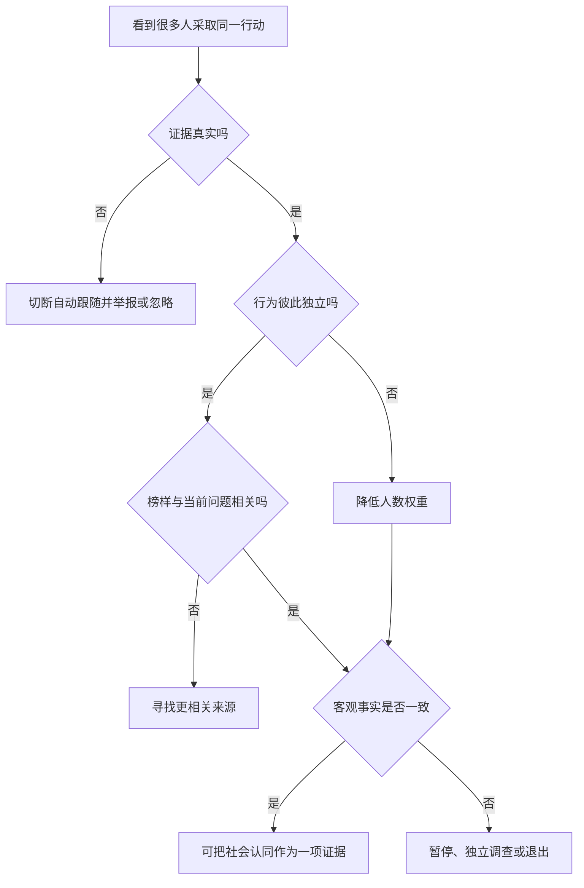

---

## 60. 正当使用社会认同的原则

### 60.1 使用真实数据

不虚构用户、排队、点赞和购买；清楚披露付费推荐、演员和赞助关系。

### 60.2 展示分母与代表性

同时给出样本量、比例、时间窗和人群来源，不用少数精选成功者冒充典型结果。

### 60.3 保护独立判断

组织决策可先匿名收集意见，再公开讨论，防止最早发言者制造级联。

### 60.4 用相似榜样促进安全行为

可以展示同龄人求助、治疗、学习和康复，但不能脚本化假经历；应呈现过程、困难和多种可行路径。

### 60.5 危机传播遵守安全规范

避免耸动和不必要细节，提供求助资源、恢复故事及专业信息，不把危险行为塑造成常见、浪漫或有效的解决方式。

### 60.6 给异议留空间

允许成员私下表达担忧、查看外部信息和安全退出，避免“人人看似同意”成为自我实现的假共识。

---

## 61. 容易混淆的概念与常见误区

### 61.1 误区一：多数人做的事一定正确

多数行为通常有参考价值，不提供逻辑保证。关键是独立性、相关性和事实校验。

### 61.2 误区二：既然群体会错，就应该永远反多数

反向从众仍由群体决定。成熟判断按证据质量，而非固定跟随或反对。

### 61.3 误区三：社会认同就是害怕被排斥

害怕排斥是规范性压力；本章主要强调信息性路径，即把别人行为当作正确性证据。

### 61.4 误区四：知道罐头笑声是假的就完全不受影响

识别造假与抑制自动反应是不同过程。明确知道可降低信任，不保证即时行为零影响。

### 61.5 误区五：销量最高等于质量最好

销量还受价格、渠道、广告、先发优势和网络效应影响。它可以是线索，不是质量定义。

### 61.6 误区六：示范学习等于盲目从众

班杜拉和奥康纳案例中，榜样提供真实安全信息，孩子尝试后还有现实反馈。有效学习不必否定观察他人。

### 61.7 误区七：人越多，紧急事件中越危险

只有在含糊、责任未分配等条件下，群体才更可能抑制帮助。紧急性明确时帮助率很高。

### 61.8 误区八：旁观者不行动证明其冷漠

不行动可能来自误判紧急性、责任分散和协调失败。人格结论需要更多证据。

### 61.9 误区九：多元无知与责任分散是一回事

前者误判“是否有事”，后者不确定“谁来处理”。

### 61.10 误区十：吉诺维斯“38 人”就是旁观者效应的实验数据

它是有史料争议的新闻案例。机制证据来自后续模拟和控制实验。

### 61.11 误区十一：相似者一定比专家可靠

相似者更能说明适用性，专家更可能掌握专业知识。二者解决不同信息问题。

### 61.12 误区十二：相似只看年龄或身份标签

相关相似性取决于当前任务。年龄相同不代表健康、经验和风险相同。

### 61.13 误区十三：媒体报道后风险增加意味着每位观众都会模仿

群体平均风险不预测个体，影响集中于部分易感者。绝大多数人不会采取危险行为。

### 61.14 误区十四：维特效应已证明每起事故的真实意图

事故记录难以确认隐藏意图。统计模式支持假设，不等于逐案证明。

### 61.15 误区十五：避免报道就能解决问题

公共讨论、教育和求助信息很重要。目标是负责任报道，而非沉默和污名化。

### 61.16 误区十六：琼斯敦只是集体从众

权威、隔离、长期控制、强迫、儿童受害和暴力同样关键。社会认同只解释部分放大机制。

### 61.17 误区十七：表面平静代表自愿同意

高控制群体和紧急事件中，平静可能来自恐惧、观察他人或缺少退出。

### 61.18 误区十八：伪造社会证据必须很逼真才有效

罐头笑声和公开捧场都很假，却仍可能启动自动反应。

### 61.19 误区十九：真实人群行为就不会误导

高速变道中的行为都是真实的，判断却由无心级联造成。

### 61.20 误区二十：点赞越多，独立证据越多

账号可能同源，人也可能因已有点赞跟随。可见数量不等于独立观察数。

### 61.21 误区二十一：跑马场案例是一种获利算法

它是社会证据操纵警示，不是可靠投注技巧。赌博结果高度不确定且有成瘾风险。

---

## 62. 本章总结：知识结构、核心结论与一般方法

### 62.1 知识结构

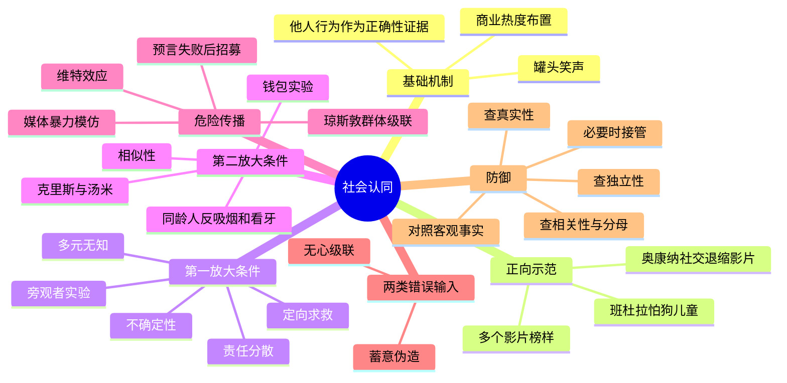

### 62.2 十六条核心结论

1. **社会认同把他人行为当作正确性线索。** 它尤其指导“当前该怎样做”。
2. **规则通常有用。** 多人真实、独立、相关的行为能汇聚经验并节省探索成本。
3. **同一优点造成同一弱点。** 系统若响应行为外形，就会被伪造笑声、托儿和假热度利用。
4. **真实示范可以带来长期益处。** 同龄榜样能帮助儿童降低恐惧和社交退缩。
5. **人数只有在相对独立时才增加证据量。** 互相模仿的人群可能只重复一个错误。
6. **不确定性是第一放大条件。** 自己越拿不准，越依赖他人。
7. **多元无知来自私人担忧与公开镇定的错位。** 每个人都误把别人的沉默当作“没事”。
8. **责任分散与多元无知不同。** 前者问谁来做，后者问是否需要做。
9. **紧急求助要降低两种不确定。** 明确危险、点名个人、指定任务。
10. **相似性是第二放大条件。** 像自己的人提供更相关的行为证据。
11. **不确定与相似叠加时，危险模仿可能增强。** 媒体和平台应保护易感群体。
12. **预言失败后招募可用于修复受威胁信念。** 事实证据破产时，成员试图制造社会证据。
13. **琼斯敦涉及社会认同，但绝非只有从众。** 隔离、权威、暴力和强迫不可省略。
14. **社会证据会以两种方式失准。** 一种是蓄意伪造，另一种是无心级联。
15. **流行不等于正确，真实行为也不等于独立判断。** 核查来源、分母和相关性。
16. **最佳防御不是关闭自动导航，而是周期校验。** 输入失真时接管，恢复后继续利用群体信息。

### 62.3 全章完整因果链

```mermaid
flowchart TD
        A[个人证据不足] --> B[观察他人行为]
        B --> C{社会证据真实独立相关吗}
        C -- 是 --> D[降低不确定并选择通常合适行为]
        C -- 否：蓄意伪造 --> E[被假人数、托儿或演员误导]
        C -- 否：无心级联 --> F[群体互相模仿同一错误]
        D --> G[社会认同成为高效学习机制]
        E --> H[错误顺从]
        F --> H
        H --> I{是否周期核查客观事实}
        I -- 否 --> J[错误滚雪球]
        I -- 是 --> K[接管判断并纠正航线]
```

### 62.4 作者解决问题的一般思路

1. 从“人人看不惯但技术仍有效”的悖论开始；
2. 区分主观态度与真实行为；
3. 从伪造线索反推通常可靠的心理规则；
4. 用正向干预显示规则的适应价值；
5. 在极端自然案例中发现不确定性条件；
6. 把道德批评转成可检验的情境机制；
7. 用控制实验比较人数、同谋和明确程度；
8. 通过钱包和同龄榜样识别相似性条件；
9. 对历史统计提出竞争解释和新预测；
10. 把错误输入分成伪造与无心级联；
11. 设计保留群体智慧、只在失准时接管的防御。

可以压缩为：

$$
{\text{反常现象}}
\rightarrow\text{心理规则}
\rightarrow\text{适应价值}
\rightarrow\text{最佳条件}
\rightarrow\text{机制实验}
\rightarrow\text{极端后果}
\rightarrow\text{错误输入分类}
\rightarrow\text{周期校验}.
$$

### 62.5 最终理解

社会认同不是把思考交给人群，而是把人群当作一项证据。成熟判断既不迷信多数，也不崇拜孤立的“独立思考”：它关心这些行为是否真实、彼此独立、与当前处境相关，并且是否得到客观事实支持。

只要保留这几项检查，社会认同就能继续充当高效导航；一旦证据被伪造、相互复制或与事实冲突，我们也能及时抬头看路、接管方向。
