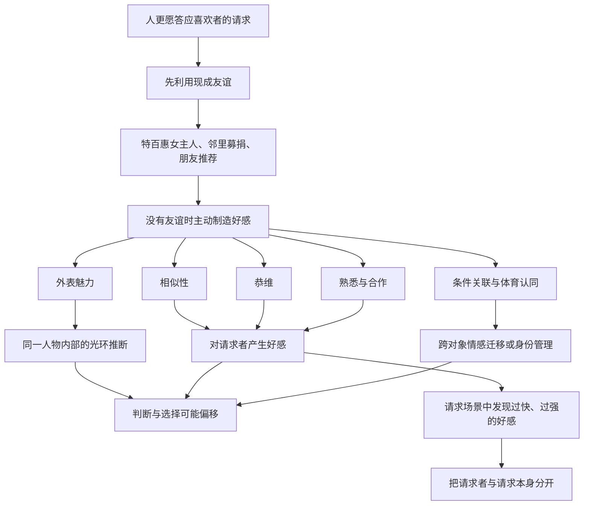
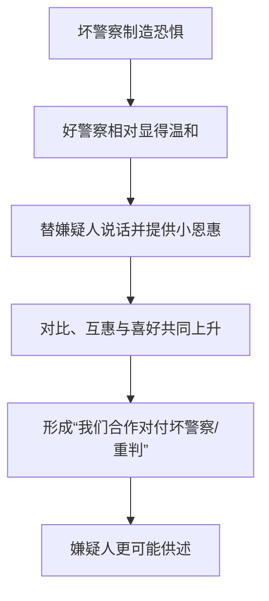
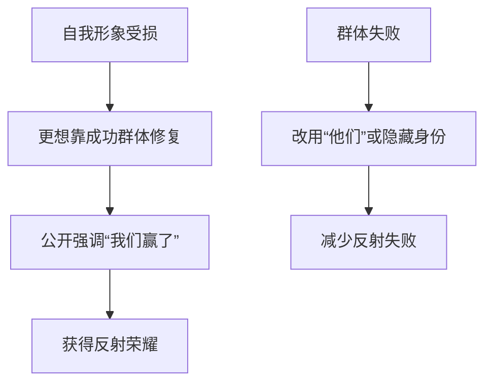
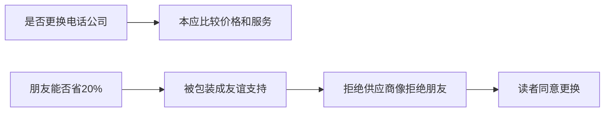
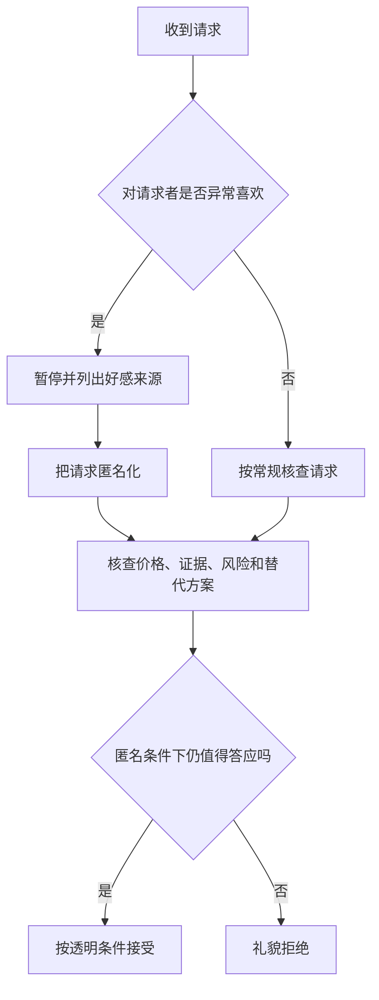
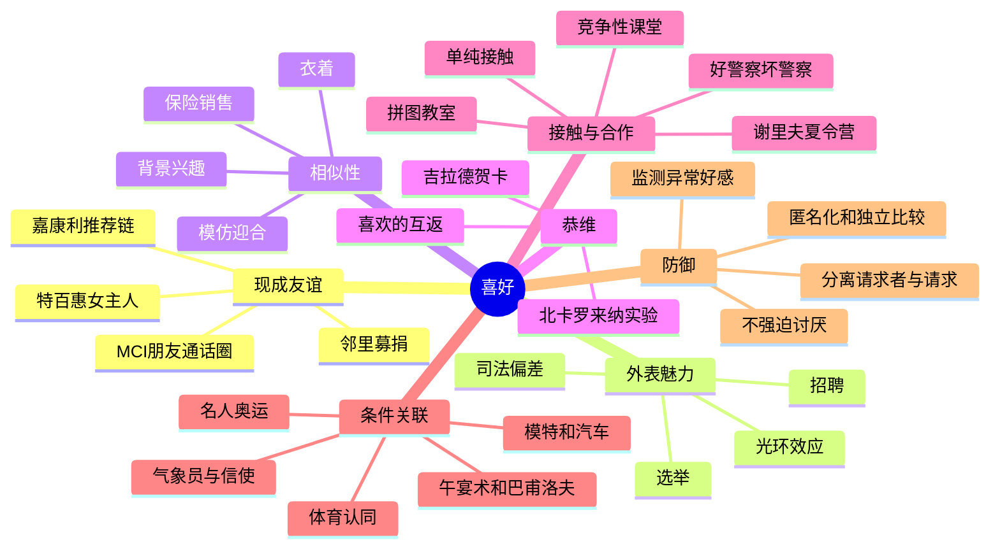
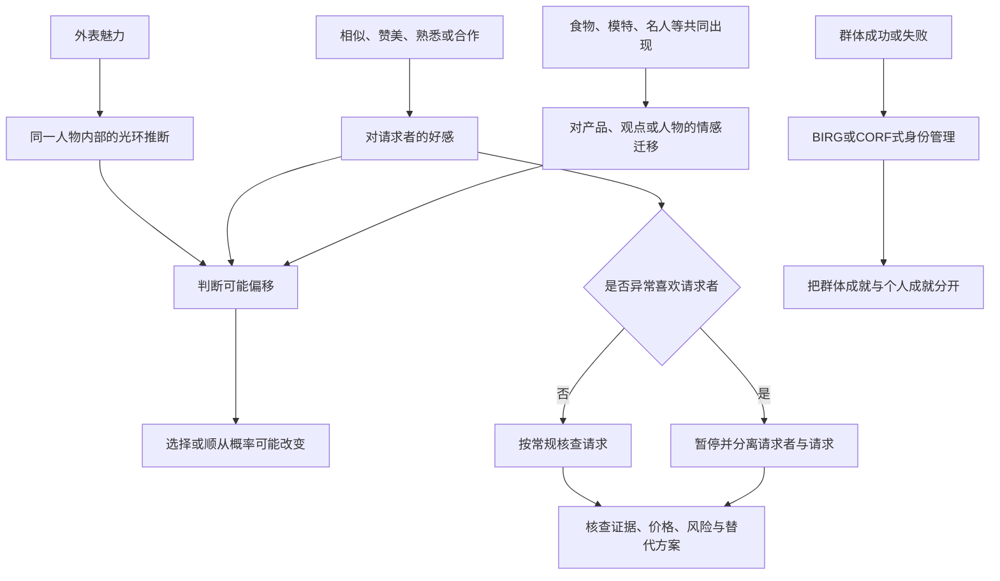

> **书名**：《影响力（珍藏版）》 
> **作者**：罗伯特·B. 西奥迪尼（Robert B. Cialdini） 
> **阅读范围**：第5章“喜好：友好的窃贼” 
> **原文章节顺序**：友谊压力与特百惠 → 推荐链与乔·吉拉德 → “我喜欢你的理由” → 外表魅力 → 相似性 → 恭维 → 接触与合作 → 条件反射和关联 → 体育认同 → “如何拒绝” → MCI 读者报告 
> **阅读目标**：理解人为什么更容易答应喜欢者的请求，好感如何从请求者迁移到产品和交易，外表、相似、赞美、熟悉、合作与关联各自怎样起作用，以及怎样在不必压抑正常好感的前提下独立评价请求。

---

## 0. 导读：第五章要解决的核心问题

“我们更愿意答应认识和喜欢的人”并不令人意外。真正值得研究的是：**陌生的顺从专家怎样快速制造、借用或转移好感，使一项原本需要按事实判断的请求，搭上人与人之间的温情？**

作者按以下路径推进：

本章的中心张力是：

> 喜欢一个人本来有助于信任和合作，但“此人讨我喜欢”与“此请求符合我的利益”是两个不同判断。顺从专家获利的空间，正来自我们把两者合并。

原书没有提供统一的喜好公式或可计算算法。下文的权重模型、流程与比例换算均是笔记的解释性整理；原书报告的数字、研究结论和案例会明确区分。

### 0.1 章名“友好的窃贼”怎样理解

“窃贼”不是说友好本身虚假，而是说好感可能悄悄偷走判断边界：我们原本应评价产品、价格、证据或法律事实，却转而响应请求者的外表、相似、赞美和温情。

可以把风险写成：

$$
{\text{对人的喜好}}
\rightarrow \text{对请求的额外正面权重}
\rightarrow \text{忽略不相关的成本或证据}.
$$

### 0.2 章首克拉伦斯·达罗引语

著名辩护律师克拉伦斯·达罗说，辩护律师的主要任务是让陪审团喜欢自己的客户。引语故意把法律判断中的证据问题改写成喜好问题，预告本章最危险的迁移：

$$
\text{被告讨人喜欢}
\quad\not\Rightarrow\quad
\text{被告无罪或损害更小}.
$$

律师当然还须处理事实与法律；这句话强调的是，在应当按证据判断的制度里，好感仍可能左右结果。

---

## 1. 喜好原理：为什么喜欢请求者会提高顺从

### 1.1 基本定义

**喜好原理（liking principle）**指：其他条件相近时，人更愿意答应自己认识、喜欢或感到亲近的人提出的请求。

典型结果包括：

- 更愿意购买对方推荐的产品；
- 更愿意捐款、帮忙或提供信息；
- 更容易接受其观点；
- 更愿意给对方解释空间和信任。

### 1.2 从好感到顺从的一条可能路径

下面是帮助理解“喜欢请求者”情境的笔记模型，不是本章某一项实验完整检验过的统一中介链。其中“更愿给予善意解释或帮助”是可能路径，而非喜好必然提高信任的定律。

本章后半部分还会出现不同路径：光环效应改变对同一人的特质推断，关联原理可直接改变对产品或观点的态度，BIRG/CORF 则服务于自我形象管理，不能全部压进这条链。

### 1.3 好感为什么通常有用

喜欢往往来自熟悉、共同经历、善意和合作，这些因素确实可能与可信度相关。与长期朋友交换信息，通常比面对完全陌生人更高效。

### 1.4 好感为什么会误导

好感线索可能与当前请求无关：

- 长得好看不等于产品更好；
- 来自同一故乡不等于报价公平；
- 称赞我不等于建议可靠；
- 一起吃饭不等于政治主张正确；
- 喜欢销售员不等于应该买车。

### 1.5 请求者与请求是两个评价对象

可用解释性模型表示：

$$
V_{\text{答应}}
=V_{\text{请求本身}}+w_L L,
$$

其中 $L$ 是对请求者的好感，$w_L$ 是好感进入决策的权重。高风险决策中，若好感与请求质量无关，合理目标不是让 $L=0$，而是让 $w_L$ 接近零。

该模型不是原书公式，也不能直接测量个人顺从概率。

### 1.6 喜好与信任不完全相同

| 喜好 | 信任 |
| --- | --- |
| 我是否喜欢与此人相处 | 我是否相信其诚实、能力和承诺 |
| 可由外表、相似和赞美迅速产生 | 通常需要相关证据或长期记录 |
| 可能与当前任务无关 | 必须区分诚信信任与能力信任 |

人可以喜欢一个不懂投资的朋友，也可以不喜欢但合理信任一个严格的专业人员。

### 1.7 喜好与其他影响力武器怎样组合

喜好很少单独出现。朋友可以先送礼形成互惠，公开让我们称赞产品形成承诺，现场购买形成社会认同。第五章先用特百惠展示多种原则怎样围绕喜好叠加。

---

## 2. 特百惠聚会：把多种影响力武器放进朋友家里

### 2.1 什么是特百惠聚会

特百惠家庭聚会由一位女主人邀请朋友到家中，销售代表展示塑料容器并接受订单。作者注 `[19]` 说明，特百惠是一家生产、销售塑料保鲜器皿的直销公司。

环境看似是朋友聚会，实际同时是一套商业销售流程。

### 2.2 互惠如何进入

参与者先玩游戏赢奖品；没中奖的人也可从袋中摸取奖品。于是所有人在尚未购买前都得到礼物。

$$
\text{先收礼}
\rightarrow \text{回报压力}
\rightarrow \text{购买更容易显得合适}.
$$

### 2.3 承诺和一致如何进入

参与者要当众说明自己发现特百惠器皿有什么用途和好处。亲口表扬产品后，完全不购买可能显得与刚才观点不一致。

### 2.4 社会认同如何进入

交易开始后，每一笔公开订单都给其他相似参与者提供证据：“朋友们也想要，它大概不错。”较早订单可能启动购买滚雪球。

### 2.5 喜好才是最关键的安排

陌生销售代表可以介绍和收单，但真正对参与者施加购买压力的是女主人：

- 她是大家共同的朋友；
- 她邀请客人到自己家；
- 她端茶、聊天并维持温暖气氛；
- 每卖出一件商品，她都会获得分成；
- 所有人都知道朋友会从自己的购买中受益。

交易因此不再只是“我是否需要容器”，还变成“我是否愿意支持朋友”。

### 2.6 四种武器的分工

| 原理 | 现场线索 | 推动的问题 |
| --- | --- | --- |
| 互惠 | 每个人先得到奖品 | 我是否该回报？ |
| 承诺和一致 | 公开讲产品优点 | 我是否应照自己所说行动？ |
| 社会认同 | 其他朋友陆续下单 | 像我的人是否都在买？ |
| 喜好 | 女主人是朋友且有收益 | 我能否不给朋友面子？ |

### 2.7 为什么家庭比零售店更有力

家庭环境把商业请求包裹在：

- 友谊；
- 温情；
- 安全感；
- 主客义务；
- 群体气氛。

拒绝商品容易被主观体验成拒绝朋友，而不是普通消费选择。

---

## 3. 社会纽带为什么可能压过产品偏好

### 3.1 消费研究结论

原书称，家庭聚会研究比较了女主人与参加者的社会纽带，以及参加者对产品本身的好恶。决定是否购买时，社会纽带的影响是产品偏好的两倍。

### 3.2 应怎样理解“两倍”

原书未在此给出样本量、变量尺度和统计模型，因此不能把“两倍”直接解释为购买概率翻倍。它表示研究中社会关系对购买决定的预测影响明显强于产品喜好。

### 3.3 结果揭示的错位

合理消费标准本应优先包括：

- 是否需要；
- 产品质量；
- 价格；
- 替代品牌；
- 售后和使用成本。

若社会纽带权重更高，购买结果便可能偏离产品价值。

### 3.4 朋友有收益并不必然不正当

朋友推荐好产品并公开佣金，可以是透明合作。问题在于：

- 利益关系是否清楚；
- 参与者能否无尴尬地不买；
- 聚会是否把友谊当成隐含债务；
- 产品是否经得起独立比较。

### 3.5 防御的早期版本

在聚会前设定规则：

> 我可以出席并支持朋友，但只有确有需要且价格合适时才购买；不购买不等于拒绝友谊。

---

## 4. 特百惠的规模与渠道选择：为何宁可放弃畅销零售

### 4.1 原书报告的规模

原书给出的估计包括：

- 特百惠日销售额超过 250 万美元；
- 全球每 2.7 秒举办一次特百惠聚会；
- 北美销售量已不到全球总销售量的四分之一。

这些数字属于原书出版时期的报告，不应当作 2026 年最新经营数据。

### 4.2 跨文化扩张

特百惠把家庭聚会推广到欧洲、拉丁美洲和亚洲。作者认为，在朋友和家庭关系网地位更重要的文化环境中，友谊压力尤其有商业价值。

这是一种解释性概括。跨文化销售还受收入、渠道、品牌、城市化和零售基础设施影响，不能把增长只归因于喜好。

### 4.3 2003 年终止与塔吉特合作

特百惠产品在零售商塔吉特（Target）销售过于成功，反而威胁家庭聚会次数。2003 年，公司中止合作，保护家庭聚会渠道。

### 4.4 为什么这看似违反商业常识

零售销量通常是好事；但若零售让顾客无需面对女主人和朋友群体，销售虽然方便，却失去最强的关系杠杆。

### 4.5 渠道不只是物流，也会设计心理环境

同一产品通过商店、电商、朋友聚会销售，会调用不同社会机制。渠道策略不仅决定成本和覆盖，也决定谁提出请求、谁在场、购买是否公开。

---

## 5. 参与者明知有压力，为什么仍难拒绝

### 5.1 原书中的顾客自述

一位女性说自己已经有各种所需容器，也知道商店里有更便宜的品牌，却仍痛恨收到聚会邀请：

- 朋友邀请，她觉得必须去；
- 到场后，又觉得必须买点东西；
- 她知道压力来自朋友，却不知道怎样退出。

### 5.2 识别影响不等于解除影响

她并未误以为聚会纯属社交，也清楚朋友受益。困难在于，拒绝会产生关系成本和内疚。

### 5.3 两个决定被错误捆绑

| 决定 | 正确标准 |
| --- | --- |
| 是否参加朋友聚会 | 时间、关系、个人意愿 |
| 是否购买产品 | 需要、质量、价格、替代方案 |

参加并不蕴含购买承诺。把两个决定分开，是防御喜好压力的第一步。

### 5.4 可用的回应

- “我很愿意见大家，但今天不准备购物。”
- “我会按需要比较，不会因为聚会而下单。”
- “我支持你，但不需要通过购买来证明。”
- 若不愿参加，直接礼貌拒绝邀请。

### 5.5 组织伦理

直销组织应允许无购买参与、清楚披露佣金、避免现场点名和羞辱，并提供冷静期和便利退货。

---

## 6. 朋友不在场也能施压：邻里募捐与无穷链推荐

### 6.1 邻里慈善募捐

越来越多慈善组织让志愿者在自家附近募捐，因为人很难拒绝邻居或朋友提出的慈善请求。

正当公益也应让捐赠基于机构用途、透明度和个人能力，而非只靠关系压力。

### 6.2 嘉康利的“无穷链”

家居产品直销公司嘉康利（Shaklee）建议销售员：

1. 顾客表示喜欢产品；
2. 请顾客列出可能也喜欢的朋友；
3. 销售员拜访这些朋友；
4. 再从新顾客取得更多名字；
5. 推荐链不断延伸。

### 6.3 朋友名字的功能

销售员上门时会说：“您的朋友建议我来找您。”即使朋友不在场，其名字也把陌生销售变成一项关系请求。

### 6.4 为什么公司称它“进门前成功一半”

拒绝销售员容易被体验成拒绝朋友的判断或好意。潜在客户还可能担心朋友知道自己不配合。

### 6.5 推荐不等于背书

朋友提供姓名可能只是为了摆脱销售员，或只认为产品“也许适合”。销售人员不应把一次推荐夸大为质量保证。

### 6.6 隐私与同意边界

不应未经本人同意分享朋友联系方式。更正当的方式是：推荐人先询问朋友是否愿意被联系，再由朋友主动选择。

### 6.7 无穷链的网络效应

每一跳都借用已有关系，但信息质量可能随链条变长而下降。

---

## 7. 乔·吉拉德：没有现成友谊时，先让顾客喜欢销售员

### 7.1 业绩背景

底特律雪佛兰基层销售员乔·吉拉德（Joe Girard）：

- 连续 12 年获得“头号汽车销售员”称号；
- 平均每天卖出约 5 辆汽车和皮卡；
- 被《吉尼斯世界纪录》称为世界上“最伟大的汽车销售员”；
- 年收入达到数十万美元。

### 7.2 他的两项原则

吉拉德把成功概括为：

1. 公平、优惠的价格；
2. 顾客愿意向其购买的、讨人喜欢的销售员。

### 7.3 两项因素共同作用

吉拉德的经验判断是，公平价格与讨人喜欢共同帮助成交。只有好感、报价很差，交易未必可持续；只有公道价格、销售关系令人不安，顾客也可能离开。这说明两项因素可以共同作用，不证明它们在每笔交易中都缺一不可。

$$
{\text{成交吸引力}}
=\text{交易价值}+\text{关系体验}.
$$

这是解释式，不是原书公式。

### 7.4 吉拉德的回答留下什么问题

他说“找个他们喜欢的推销员”，却没有说明人为什么喜欢某人。作者由此从个案转向一般问题：

> 哪些因素可靠地制造好感，顺从专家又怎样系统使用它们？

### 7.5 为什么要转向社会科学研究

单个明星销售员的经验可能混入价格、品牌、地区和个人天赋。社会心理学研究能把外表、相似、赞美、熟悉、合作和关联分别操纵，检查各自作用与边界。

---

## 8. 从个案到一般框架：“我喜欢你的理由”

### 8.1 作者接下来的分类

原书依次讨论五组主要来源：

1. 外表魅力；
2. 相似性；
3. 恭维；
4. 接触与合作；
5. 条件反射和关联。

### 8.2 它们改变的是不同环节

| 因素 | 核心路径 |
| --- | --- |
| 外表魅力 | 一个正面特征扩散成整体好印象 |
| 相似性 | 同类感转化为亲近、信任和喜欢 |
| 恭维 | “对方喜欢我”促使我回以好感 |
| 熟悉 | 重复接触降低陌生感、提高流畅性 |
| 合作 | 共同目标把对方从竞争者变成伙伴 |
| 关联 | 与愉快事物同时出现，借来正面情感 |

### 8.3 多因素通常同时出现

汽车销售员可能长相整洁、模仿顾客语气、赞美其选择、提供咖啡、假装一起对付经理，并让成交与愉快体验关联。防御若逐项封堵，会非常繁琐。

### 8.4 分析时要问的共同问题

- 好感来自与请求相关的证据吗？
- 好感是否过快、过强？
- 对方是否从好感中直接获益？
- 若换成不讨喜的陌生人，我还会答应同一请求吗？
- 请求本身经得起独立比较吗？

下一部分按原书顺序进入第一项因素：外表魅力及其光环效应。

---

## 9. “我喜欢你的理由”：为什么要拆分好感来源

### 9.1 研究问题

乔·吉拉德说明“讨人喜欢”很重要，却没有告诉我们怎样产生好感。若只把成功归为个人魅力，就无法检验、迁移或防御。

### 9.2 作者的分析策略

作者转向几十年的社会心理学研究，把好感拆成若干可观察因素，并逐一检查：

1. 因素是否可靠地提高喜欢；
2. 当事人是否意识到影响；
3. 好感是否迁移到请求和判断；
4. 顺从专家是否系统利用；
5. 哪些条件会限制或反转效果。

### 9.3 为什么“喜欢”不能只靠自我报告

外貌研究中，选民和面试官会否认影响；恭维研究中，人即使知道对方讨好自己仍更喜欢他。主观解释可能低估自动影响，因此要同时观察投票、聘用、判决、帮助和购买行为。

---

## 10. 外表魅力与光环效应：一个正面特征怎样覆盖整体判断

### 10.1 什么是光环效应

**光环效应（halo effect）**指：一个显著的正面特征主导对某人的整体评价，并使观察者自动赋予其其他正面属性。

外表魅力常成为这种光环。人会更容易把好看者判断为：

- 有才华；
- 善良；
- 诚实；
- 聪明；
- 值得信赖或帮助。

### 10.2 从外表到无关特质的迁移

### 10.3 为什么人难以觉察

观察者通常会为结论找到内容理由，例如“候选人更有领导力”“应聘者更专业”。外表先改变整体印象，后续理由再显得自然。

### 10.4 “好看等于好”不是逻辑关系

$$
{\text{外表魅力}}
\quad\not\Rightarrow\quad
{\text{能力、诚信、善意或无罪}}.
$$

外貌可影响社交体验，却不能替代与任务相关的证据。

### 10.5 反向光环与角效应

作为补充背景，一个显著负面特征也可能污染整体判断，常称“角效应”。本章重点讨论正面外貌光环，但防御原则相同：把每项属性单独评价。

---

## 11. 加拿大联邦选举：外表偏好与主观否认

### 11.1 原书报告

针对加拿大联邦选举的研究发现，有外表魅力的候选人所得选票，是缺乏外表吸引力候选人的约 2.5 倍。

### 11.2 选民的自我报告

受访者中：

- 73% 强烈否认外表会影响自己的投票；
- 只有 14% 承认这种影响可能存在。

### 11.3 数据揭示的双层问题

第一层是结果偏差：外表与票数相关。第二层是元认知偏差：人没有准确认识外表对自己的作用。

### 11.4 为什么不能从研究断言“外表导致全部票差”

候选人外表还可能与媒体曝光、年龄、资源、在任地位和竞选质量相关。本章概述的研究支持显著影响，却未给出完整控制变量和因果识别方法。

### 11.5 制度防御

- 用政策、履历和事实核查表评价候选人；
- 先阅读书面主张，再观看形象传播；
- 警惕把“看起来像领导”当成能力证据；
- 承认自己也可能受影响，而不是只认为别人肤浅。

---

## 12. 招聘中的外貌：打扮可能压过资历

### 12.1 模拟面试结果

一项模拟招聘研究发现，能否获聘受到打扮是否得体的显著影响，甚至比工作资历权重更大；面试官却只承认外表有轻微作用。

### 12.2 两类信息为何容易混淆

打扮有时传递准备程度和情境理解，这是与工作可能相关的信号；面部、体型或与岗位无关的美貌则不应成为能力代理。

### 12.3 结构化招聘怎样降低偏差

- 预先定义岗位能力；
- 对所有候选人问相同问题；
- 独立评分后再讨论；
- 技能样本尽量盲评；
- 将与岗位无关的外貌因素排除；
- 记录每项判断对应的具体证据。

### 12.4 不能把“仪表”完全等同歧视

某些岗位有真实安全、卫生或着装要求，但标准应与任务直接相关、对所有人一致，而不是以模糊的“形象好”替代能力。

---

## 13. 司法判断中的外貌偏差

### 13.1 宾夕法尼亚州 74 名男被告研究

研究者在开庭前给 74 名男性被告的外表魅力评分，之后核对判决记录。原书报告：有魅力被告避免入狱的概率，是缺乏魅力被告的 2 倍。

### 13.2 模拟过失案件的赔偿额

| 外貌相对关系 | 平均赔偿额 |
| --- | ---: |
| 被告比受害原告好看 | 5 623 美元 |
| 受害原告比被告好看 | 10 051 美元 |

差额为：

$$
10051-5623=4428\text{ 美元}.
$$

两种外貌相对关系对应的平均赔偿额相差 4 428 美元。

男女陪审员都表现出外貌偏差。

### 13.3 为什么这是制度性风险

司法目标是按证据、责任和损害裁判；外貌与这些标准通常无关。偏差若发生，个人印象会侵入事实判断和处罚尺度。

### 13.4 不能从群体统计预测个案

研究显示平均倾向，不表示每位好看被告都受优待，也不表示某个判决一定因外貌错误。个案判断需要完整案情。

### 13.5 可能的制度措施

- 标准化量刑和损害计算；
- 明确要求说明证据理由；
- 法官向陪审员提示无关偏差；
- 能盲化的材料尽量盲化；
- 对量刑差异做系统审计。

---

## 14. 作者注 `[20]`：整容、再入狱与错误因果解释

### 14.1 原书注释中的纽约研究

纽约市部分面部有缺陷的在押者接受整容手术，另一些未接受；两组中又有部分人接受咨询、训练等重返社会服务。释放约 1 年后，做过整容手术者重新入狱概率明显较低，海洛因成瘾者除外。原书特别指出，无论是否接受传统训导服务，都观察到了这一较低再入狱率；正是这一分层结果促使一些人提出下面的政策解释。

### 14.2 初步政策解释

有人据此主张，对外貌有缺陷的在押者，整容可能与传统服务效果相近且成本更低。

### 14.3 后续外貌偏差证据为何改变解释

原书正文提醒：较低再入狱率不一定说明整容减少再犯，也可能说明变得好看后，即使犯案，也更少被判入狱。

$$
{\text{再入狱率下降}}
\quad\not\Rightarrow\quad
{\text{再犯率必然下降}}.
$$

### 14.4 结果指标不能混淆

| 指标 | 含义 |
| --- | --- |
| 再犯率 | 是否再次实施违法行为 |
| 再逮捕率 | 是否被警方发现并逮捕 |
| 再定罪率 | 是否被法院判定有罪 |
| 再入狱率 | 是否最终被判监禁 |

外貌可能影响后面多个制度环节，因此再入狱不是纯粹行为结果。

### 14.5 伦理边界

整容可由本人自愿用于医疗和生活质量，不应成为以外貌换取公平司法的必要条件。正确目标是减少制度偏差，而不是要求受偏差者改变长相。

---

## 15. 外貌光环还影响帮助、说服和儿童评价

### 15.1 帮助行为

研究显示，有吸引力的男性和女性更容易获得帮助，同性帮助者也会表现这一倾向。

### 15.2 说服力

外貌有吸引力者更容易改变听众意见。好感可能被误当成观点质量或可信度。

### 15.3 竞争例外

当好看者被视为直接竞争者，尤其是情感竞争者时，正面效应可能减弱或反转。喜好因素始终受目标和关系情境调节。

### 15.4 小学儿童

原书称，成年人对好看儿童的攻击行为评价更宽容，教师也更容易相信好看儿童更聪明。外貌光环因此会从早期教育开始累积机会差异。

### 15.5 顺从专家怎样利用

- 销售训练强调打扮；
- 时尚商家选择好看销售员；
- 骗子可能利用外貌降低戒备；
- 广告把有魅力人物与产品绑定。

### 15.6 防御核心

面对外貌产生的好感，问：

> 如果只看到匿名的产品参数、政策文本或证据，我会作同样判断吗？

---

## 16. 相似性：我们为什么喜欢“像自己的人”

### 16.1 基本命题

人更容易喜欢在以下方面与自己相似者：

- 观点；
- 个性；
- 背景；
- 生活方式；
- 年龄、信仰或政治立场；
- 穿着、姿态和语言风格。

### 16.2 相似为什么可能有用

相似者更可能共享经验、规范和沟通方式，互动成本较低。它也可能提示对方理解自己的需要。

### 16.3 相似为何容易被利用

许多相似点容易伪造或选择性强调。请求者只需找到一个共同标签，就可能借来“自己人”的信任。

### 16.4 相似不等于能力或利益一致

来自同乡的销售员不必报价更好；政治观点相似的理财顾问不必更专业；穿着相似的人不必更诚实。

### 16.5 喜好中的相似性与社会认同中的相似性

| 第四章社会认同 | 第五章喜好 |
| --- | --- |
| 相似者行为更像适用于我的信息 | 相似者本人更令我亲近、喜欢 |
| 重点是“我该怎么做” | 重点是“我愿不愿答应他” |

同一相似线索可同时调用两条原理。

---

## 17. 穿着实验与反战请愿：微小相似也能启动帮助

### 17.1 一毛钱电话费实验

20 世纪 70 年代初，年轻人常分为“嬉皮”与“传统”穿着。实验者分别采用两种装束，在校园向大学生索要 1 角钱打电话。

| 实验者与学生穿着 | 请求获满足比例 |
| --- | ---: |
| 风格相同 | 约三分之二 |
| 风格不同 | 不到一半 |

原书没有给出精确分母和后者百分比，不能进一步计算固定效应。

### 17.2 为什么衣着能发挥作用

衣着是快速群体标签。观察者可能推断：

- 他与我是同类；
- 我们有共同价值；
- 帮助他相当于帮助自己人。

### 17.3 反战请愿实验

参加反战示威的人更愿签署衣着与自己相似者递来的请愿书，而且经常不读内容便签名。

### 17.4 风险

相似外观让请求绕过内容审查。签名是对文本的承诺，不应只因请求者看起来“自己人”就作出。

### 17.5 防御

- 先读完整内容；
- 不把群体服装当成授权；
- 确认组织、用途和后续影响；
- 给自己延迟决定的时间。

---

## 18. 背景相似、保险销售与“模仿迎合”

### 18.1 汽车销售员怎样寻找线索

销售培训会要求观察客户旧车：

- 有野营器材，就谈自己喜欢郊外；
- 有高尔夫球具，就说下班后要打 18 洞；
- 车辆来自外州，就声称自己或配偶也来自那里。

这些共同点可能真实，也可能临场编造。

### 18.2 保险销售记录

一项保险销售记录研究发现，当销售员与顾客在年龄、宗教、政治立场、吸烟习惯等方面相似时，顾客更可能购买保险。

原书未报告具体概率和统计控制，结论应保留为方向性关联。

### 18.3 模仿和迎合

销售项目还会训练学员模仿顾客：

- 身体姿态；
- 语气；
- 说话节奏；
- 口头表达风格。

自然同步可提高沟通舒适度；刻意机械模仿则可能构成操纵，也可能被察觉后损害信任。

### 18.4 作者注 `[21]`

注释补充：面对与我们相似的顺从专家尤其要谨慎，因为人通常会低估相似性对喜好的影响程度。

### 18.5 真实性检查

- 共同点是否由对方先观察再声称？
- 对方是否在不同顾客面前反复改变背景故事？
- 相似点是否与请求质量相关？
- 若没有共同点，方案是否仍值得接受？

### 18.6 不应反向歧视相似者

发现相似不代表对方撒谎。防御是降低不相关相似性的决策权重，而不是预设所有亲近感都虚假。

---

## 19. 恭维：对方说喜欢我，为何我会回以好感

### 19.1 麦克莱恩·史蒂文森的玩笑

演员麦克莱恩·史蒂文森（McLean Stevenson）说，妻子“骗”他结婚的方法是：“她说她喜欢我。”笑话点出一条互返倾向：知道别人喜欢自己，会提高自己对对方的喜欢。

### 19.2 实验直接支持到哪里

北卡罗来纳实验直接测得的是对评价者的喜欢，而且这种效果不要求赞美准确，也未被明显讨好动机消除。它没有直接检验“自尊上升”“信任提高”等中介，也没有直接测量最终顺从；从喜欢推广到顺从属于本章一般原理的推断。

### 19.3 乔·吉拉德的月度贺卡

吉拉德每月给 13 000 多名老客户寄节日卡：

- 每年寄 12 次；
- 节日名称随月份变化；
- 核心信息始终是“我喜欢你”；
- 卡片几乎没有其他内容，只署他的名字。

这种表达明显批量化、商业化，他仍认为有效。

### 19.4 为什么批量恭维仍可能起作用

人可以同时知道“这是一张群发卡”，又从正面评价中获得轻微愉悦。自动好感不要求完全相信对方对自己有独特深情。

### 19.5 不能把吉拉德成功全归因于卡片

他的价格、售后、客户积累、品牌和个人技巧也可能重要。贺卡案例说明他系统重视好感，不是单变量因果实验。

---

## 20. 北卡罗来纳恭维实验：动机明显、内容不准仍可能有效

### 20.1 实验设计

北卡罗来纳州一项男性受试者实验，让参与者听到另一名需要他们帮助的人对自己的评价。评价分三类：

- 只有积极评论；
- 只有消极评论；
- 好坏评论混合。

### 20.2 三项结果

1. 只给赞美者最受喜欢；
2. 即使受试者知道对方为了讨好、有求于自己，仍最喜欢赞美者；
3. 单纯赞美不必准确，真或假都能产生相近好感。

### 20.3 为什么动机识别没有完全消除效果

识别策略属于认知判断，听到正面评价带来的自尊和情绪反应可以并行发生。知道“他在拍马屁”不保证情绪零响应。

### 20.4 实验支持到什么程度

它支持赞美在特定帮助情境中提高对评论者的喜欢；原书没有给出样本量、效应值和实际帮助比例，不能据此声称任何谎言式赞美都能换来顺从。

### 20.5 赞美的正当使用

真诚、具体、有依据的肯定能改善关系。问题不在赞美本身，而在：

- 是否为了操纵而捏造；
- 是否紧接利益请求；
- 是否让受赞美者觉得必须回报；
- 是否用泛化赞美替代事实。

### 20.6 防御

面对赞美后立即出现的请求，先感谢，再单独问：

> 即使对方没有说这些好话，我会答应吗？

下一部分进入熟悉与合作。重复接触通常提高好感，但若接触发生在冲突和竞争中，效果可能完全相反。

---

## 21. 接触与熟悉：重复出现为什么通常提高好感

### 21.1 基本命题

多数时候，人会更喜欢自己熟悉的人和事物。重复接触降低陌生性，提高处理流畅感，也可能减少对未知风险的警觉。

### 21.2 单纯接触效应

作为补充背景，**单纯接触效应（mere exposure effect）**指：在没有明显负面结果时，重复接触某刺激常会提高对它的好感。

### 21.3 为什么熟悉可能有适应价值

熟悉对象通常：

- 更容易预测；
- 认知处理更流畅；
- 已多次出现却没有造成伤害；
- 与已有经验和身份相连。

### 21.4 熟悉不等于优秀

$$
{\text{我见过很多次}}
\quad\not\Rightarrow\quad
{\text{它质量更高或观点更正确}}.
$$

熟悉可以来自广告预算、重复曝光和先发优势，而非实质价值。

### 21.5 接触效果的关键边界

接触并不总能提高好感。若每次接触伴随冲突、挫折、羞辱或零和竞争，重复会强化负面联结。

---

## 22. 镜像照片实验：自己与朋友为何喜欢不同版本的脸

### 22.1 实验思路

一张正脸底片可冲洗成：

- 他人平时看到的正常脸；
- 左右反转、类似镜中自我的版本。

研究者让本人和朋友分别选择更喜欢哪张。

### 22.2 密尔沃基女性研究结果

原书称，密尔沃基一组女性表现出稳定差异：

- 朋友更喜欢正常正脸照片；
- 本人更喜欢左右反转的镜像照片。

### 22.3 解释

双方都偏好自己更熟悉的版本：朋友平时看到正常脸，本人每天在镜中看到反转脸。

### 22.4 研究说明什么

物理对象几乎相同，只改变左右方向；偏好仍随接触历史变化。这让“熟悉提高喜欢”比单纯自述更具体。

### 22.5 边界

原书没有给出样本量和偏好比例。脸部左右不对称程度也会影响差异，不能假定每个人必然更喜欢镜像版本。

---

## 23. 名字熟悉与无意识面孔曝光

### 23.1 俄亥俄州“布朗”选举

一名原本胜选希望很低的州检察长候选人在选举前改姓“布朗”，这是俄亥俄州政治望族常见的姓氏，最终获胜。

作者把部分结果归因于选民对熟悉名字的潜意识好感。

### 23.2 案例边界

这是政治轶事，姓名改变之外还可能有竞选、党派和媒体因素，不能独自证明改名造成胜选。

### 23.3 快速闪现面孔实验

实验让面孔在屏幕上快速闪现，速度快到受试者事后不记得见过。某张脸出现次数越多，受试者之后真正与该人互动时越喜欢他，其观点也越有说服力。

### 23.4 意识不到不等于没有影响

受试者没有可报告的记忆，重复曝光仍可能增加加工流畅性和熟悉感。人会把“看起来顺眼”误当成对方本身更可信。

### 23.5 数字平台对应

候选人头像、品牌标志、创作者面孔和短视频重复推送，都可能积累熟悉优势。曝光频率不应替代内容质量。

---

## 24. 为什么“让不同群体多接触”并不自动减少偏见

### 24.1 朴素接触假设

有人认为，只要不同种族或族群学生进入同一学校，反复接触会增加熟悉，从而自然降低偏见。

### 24.2 原书报告的反向结果

作者称，对学校融合教育的考察并未发现偏见自然下降，部分环境中反而恶化。

### 24.3 第一原因：同校不等于真实互动

学校取消制度隔离后，学生仍可能主要与本族群同伴交往。共享建筑并不代表建立平等、深入关系。

### 24.4 第二原因：接触环境带有竞争与挫折

即使接触增加，若发生在：

- 争夺教师关注；
- 排名与考试竞争；
- 被嘲笑和羞辱；
- 群体地位不平等；
- 冲突和失败归因；

熟悉会与负面体验绑定，反而降低好感。

### 24.5 接触不是充分条件

更准确的关系是：

$$
{\text{接触效果}}
=f(\text{地位},\text{合作},\text{共同目标},\text{制度支持},\text{接触体验}).
$$

这是笔记的解释模型，不是原书公式。

### 24.6 历史语境与边界

原书讨论美国学校种族融合的历史研究。制度融合具有平等教育和法律价值，不能因早期课堂偏见未自动消失就否定融合；问题是必须同时改变互动结构。

---

## 25. 传统课堂怎样把同学变成竞争对手

### 25.1 阿伦森的课堂描述

心理学家艾略特·阿伦森应得克萨斯州奥斯汀学校管理部门邀请，分析课堂关系：

- 教师提出问题；
- 6 至 10 名学生争先举手；
- 知道答案者争夺教师赞许；
- 不知道者希望不被点名；
- 他人答错会给竞争者展示机会；
- 成功者和失败者互相贬低。

### 25.2 零和奖励结构

若教师关注与表扬稀缺，一人的成功意味着另一人失去机会：

$$
{\text{同学表现好}}
\rightarrow \text{我的展示机会减少}.
$$

这种结构训练学生把同伴视为障碍，而不是信息和帮助来源。

### 25.3 跨群体接触为何恶化

学生在自己族群内获得友谊和愉快互动，却主要在竞争课堂中接触其他族群，负面关联自然加深。

### 25.4 不应把竞争本身完全否定

竞争可以激发努力、自我测量和卓越。问题是竞争垄断全部课堂互动，学生没有机会体验跨群体合作成功。

---

## 26. 融合教育的收益与需要修复的互动结构

### 26.1 学业收益

原书称，学校融合后：

- 白人学生成绩保持稳定；
- 少数族裔学生中，90% 的人成绩显著提高。

该数字来自原书概述，未在本章给出样本和测量细节，应作为作者报告的研究结论阅读。

### 26.2 为什么不能“倒洗澡水连孩子一起倒掉”

融合有学业和公平收益，不能因竞争性课堂加剧偏见就恢复隔离。正确问题是保留制度融合，同时改造互动方式。

### 26.3 设计目标

- 不取消多样接触；
- 降低零和竞争的垄断；
- 增加跨群体相互依赖；
- 让共同成功成为积极关联来源。

---

## 27. 谢里夫夏令营：分组和竞争怎样迅速制造敌意

### 27.1 研究者与场景

出生于土耳其的社会心理学家穆扎费尔·谢里夫（Muzafer Sherif）及同事在男生夏令营研究群体冲突。孩子不知道自己参与实验，研究者系统改变社会环境并观察关系。

### 27.2 仅仅分组

男孩被分进两个宿舍，便出现“我们对他们”的意识。给团队命名为“老鹰”和“响尾蛇”后，群体身份进一步强化。

### 27.3 加入竞争

寻宝、拔河和体育比赛使敌意升级：

- 互骂“骗子”“小偷”“讨厌鬼”；
- 翻抄对方宿舍；
- 偷走或烧毁旗帜；
- 张贴威胁字条；
- 就餐时冲突打斗。

### 27.4 因果链

### 27.5 单纯愉快接触为何失败

研究者先让两组看电影、社交、野餐。旧竞争结构仍在，活动变成争食、吵闹、排队推搡；单纯混在一起没有消除敌意。

---

## 28. 超级目标：只有合作才能完成时，敌人怎样变成队友

### 28.1 设计原则

研究者安排**共同的、上位目标（superordinate goals）**：任何一组都无法独立完成，继续竞争会让所有人受损。

### 28.2 卡车故障

郊游时，唯一能进城采购食物的卡车“坏掉”，两组男孩必须一起推拉，才能恢复交通。

### 28.3 供水中断

营地水管故障，男孩们面对共同危机，组织合作并在夜晚前修好管道。

### 28.4 合租电影

一部大家都想看的电影租金太高，单组无法承担；两组整合资金，才共同观看。

### 28.5 结果

经过一段时间：

- 辱骂减少；
- 排队不再推搡；
- 就餐开始混坐；
- 好朋友名单出现另一组成员；
- 男孩主动要求乘同一辆公车；
- 一组用剩下的 5 美元公费买奶昔款待另一组。

### 28.6 为什么共同目标有效

合作改变对方的功能角色：

$$
{\text{对方从“阻碍我成功的人”}}
\rightarrow \text{“我成功所必需的伙伴”}.
$$

共同成功再把愉快结果与伙伴关联，敌意逐渐被新的经验覆盖。

### 28.7 不是一次团建就能解决冲突

原书明确说效果经过一段时间才显现。在谢里夫案例中，超级目标要求双方合作，重复取得共同成功也为关系改变积累了新经验。由此可合理推测，真实共同任务通常比一次表面游戏或强迫合影更有希望；但原书没有把“反复”和“贡献可见”确立为所有合作产生好感的必要条件。

---

## 29. 拼图教室：把相互依赖嵌入学习任务

### 29.1 方法来源

艾略特·阿伦森及同事在得克萨斯州和加利福尼亚州发展**拼图教室（jigsaw classroom）**。

### 29.2 基本算法

1. 把学生分成多元合作小组；
2. 将完整学习材料拆成若干部分；
3. 每位学生只掌握其中一块；
4. 考试需要全部知识；
5. 学生必须互相讲解、倾听和帮助；
6. 小组成员从竞争者变成不可替代的信息来源。

### 29.3 原书报告的效果

与同校传统竞争课堂相比，拼图学习对应：

- 跨族群友谊增加；
- 偏见减少；
- 少数族裔学生自尊、学校好感和考试成绩提高；
- 白人学生自尊和学校好感提高；
- 白人学生成绩至少不低于传统课堂。

### 29.4 为什么不是简单“多接触”

拼图法改变的是利益结构：每个人都需要其他人提供信息。合作不再是教师口号，而是完成任务的必要条件。

---

## 30. 卡洛斯案例：同伴为何从嘲笑者变成倾听者

### 30.1 背景

卡洛斯是美籍墨西哥裔男孩，英语是第二语言，过去发言时常受嘲笑，于是长期沉默。教师为避免他尴尬也少点名，反而让同学和卡洛斯自己推断他不值得关注、能力差。

### 30.2 拼图任务

卡洛斯负责学习约瑟夫·普利策（Joseph Pulitzer）的中年经历，并向队友讲解；全组很快要参加关于普利策生平的考试。

### 30.3 初始困难

他结巴、迟疑、紧张；同伴沿用旧习惯嘲笑他。旁观研究者提醒：取笑无法让他们获得考试所需信息。

### 30.4 激励结构变化

过去：卡洛斯答不好，其他人获得相对优势。现在：卡洛斯讲不出来，所有人都缺失关键知识。

### 30.5 行为变化

- 同伴学会提出容易回答的问题；
- 认真倾听并帮助他表达；
- 卡洛斯放松，表达改善；
- 同学发现他并不笨；
- 双方好感增加；
- 卡洛斯更喜欢学校，也把白人同学视为朋友。

### 30.6 机制闭环

### 30.7 不把个案当全部证明

卡洛斯故事解释机制，项目整体比较才支持一般效果。单个成功个案不能替代系统评估。

---

## 31. 合作学习的局限：不能把拼图法当万能药

### 31.1 作者主动提出的问题与笔记延伸

作者明确留下的问题包括：

- 多久使用一次最合适？
- 小组规模多大？
- 适合哪些年龄？
- 适合哪些群体？
- 愿意采用的教师应通过何种最佳途径实施？

在此基础上，实际实施还可继续追问：

- 适合哪些科目？
- 教师需要怎样的培训和支持？
- 如何处理学生教学不准确？
- 怎样保留教师必要指导？

后三类是笔记延伸的实施问题，不是原书问题清单的逐字复述。

### 31.2 教师角色变化

拼图法把部分传授工作交给学生，可能让习惯主导课堂的教师感到角色受威胁。实施需要课程设计、监测和支持。

### 31.3 竞争仍有价值

作者不主张消灭竞争。适度竞争可激发努力和自我意识；目标是打破竞争垄断，定期加入合作成功。

### 31.4 合作失败的可能

- 一人承担全部工作；
- 地位高者垄断发言；
- 少数学生被工具化；
- 信息块难度不均；
- 评分仍只奖励个人排名；
- 表面合作、实际竞争。

### 31.5 实施原则

对拼图教室及类似合作学习，可把共同目标、个人贡献、平等发言、教师支持、共享成果与个体学习检查作为设计检查项。它们有助于避免表面合作和搭便车，但本章没有证明这些条件必须同时存在，或构成合作产生好感的充分必要条件。

---

## 32. 合作怎样制造喜好：从功能依赖到积极关联

### 32.1 合作的两条路径

1. **重新分类**：对方从竞争者变成伙伴；
2. **成功关联**：共同完成目标的愉悦与伙伴绑定。

### 32.2 群际合作案例中的有利设计条件

- 有共同目标；
- 至少在部分关键环节相互依赖；
- 各方有机会作出并识别真实贡献；
- 成果对各方都有价值；
- 尽量减少同时奖励背叛或零和竞争的制度安排。

这是从谢里夫夏令营和拼图教室归纳出的有利条件，不是对“合作”的普遍定义。汽车销售员与好警察案例还说明，即便没有真实合作，只要成功制造“站在同一边”的知觉，也可能提高好感。

### 32.3 合作不等于无分歧

伙伴可以在方案上争论。关键是最终利益和任务相连，而不是要求表面和谐。

### 32.4 喜好与能力判断仍要分开

合作成功会让人喜欢队友，但不表示队友在所有领域都专业，也不代表其后续商业请求合理。

---

## 33. 顺从专家怎样制造“我们站在同一边”

### 33.1 商业中的共同敌人

销售员常把自己塑造成顾客盟友，一起对付：

- 销售经理；
- 公司定价制度；
- 银行审批人员；
- 库存或总部限制。

### 33.2 “替你向老板争取”

销售员离开座位，回来后称为顾客争取到特殊价格。顾客会把他视为冒险帮助自己的伙伴，并更愿回报合作。

### 33.3 作者注 `[22]` 揭示的后台

作者在汽车经销店卧底时观察到，销售员通常早已知道最低报价。他进入经理办公室后，可能只是喝饮料或抽烟，经理照常工作；过一段时间，销售员松开领带、装出疲惫，带着原本就准备好的价格回来。

### 33.4 合作是否真实的检查

- 销售员是否真的放弃佣金或承担成本？
- 优惠能否书面验证？
- 所谓老板是否实际参与？
- 同一报价是否也给其他顾客？
- 总价是否在其他项目中补回？

### 33.5 不必因表演虚假就拒绝好价格

即使“替你争取”是戏剧，只要最终合同、价格和产品确实最佳，仍可接受。应移除虚假合作带来的好感，再评价交易。

---

## 34. 好警察/坏警察：多种影响力武器怎样叠加

### 34.1 基本结构

两名审讯者分工：

- 坏警察威胁、辱骂并强调最严厉后果；
- 好警察逐渐劝阻同伴、替嫌疑人说话；
- 坏警察离开后，好警察提出合作方案；
- 嫌疑人把好警察视为唯一站在自己一边的人。

### 34.2 恐惧

坏警察让嫌疑人害怕长期监禁，缩小注意范围并提高寻找保护者的需求。

### 34.3 知觉对比

与极端粗暴的坏警察相比，好警察稍微正常的行为也显得特别善良、讲理。

### 34.4 互惠

好警察为嫌疑人说话、买咖啡、缓和威胁，制造回报其善意的压力。

### 34.5 合作与喜好

最关键的是“我们一起解决问题”的氛围。好警察把自己从审讯方重新定位成嫌疑人盟友，进而成为值得信赖的倾诉对象。

### 34.6 原书为何把合作视为主要原因

正常环境中，站在自己一边的人就容易受喜欢；在高压力和孤立情境中，这种盟友价值更大。好警察由“帮助者”变成“告解对象”。

### 34.7 法律与伦理边界

供述可靠性与自愿性不能由技巧有效性保证。欺骗、威胁、疲劳、权利理解不足和虚假承诺都可能造成错误供述。现代审讯必须遵守法律、律师权利、录音记录和反强迫规范。

### 34.8 对日常谈判的启示

当一方制造敌人，再自称唯一盟友时，应检查敌人和合作是否真实。不要因为对方替你“挡住更坏结果”就自动接受其方案。

下一部分进入第五类来源：条件反射与关联。它不必让请求者具备任何真实优点，只需让请求者、产品或观点与我们已经喜欢的事物同时出现。

---

## 35. 条件反射与关联：喜欢和厌恶怎样被“借”给旁边的对象

### 35.1 关联原理

**关联原理（association principle）**指：一个人、产品或观念与正面或负面事物发生联系或共同出现时，后者的情感可能部分迁移到前者。原书明确指出，偶然联系也足以影响感觉；重复或强烈配对可能增强效果，但不是广义关联发生的必要条件。巴甫洛夫经典条件作用中的反复配对，是后文用来解释该原理的一种更具体结构。

### 35.2 基本结构

$$
{\text{中性对象}}+\text{正面刺激}
\rightarrow \text{对中性对象的正面反应增加},
$$

$$
{\text{中性对象}}+\text{负面刺激}
\rightarrow \text{对中性对象的负面反应增加}.
$$

### 35.3 与光环效应的区别

| 光环效应 | 关联原理 |
| --- | --- |
| 某人的一个正面特征扩散到其其他特质 | 两个不同对象共同出现，情感跨对象迁移 |
| 好看者被推断更聪明 | 好看模特让旁边汽车显得更好 |

### 35.4 关联不等于因果

天气预报员不制造天气，名人不一定懂产品，球队胜利也不是观众个人成就。心理反应却可能把“同时出现”误当成价值共享。

---

## 36. 气象播报员与古波斯信使：坏消息为什么污染报信人

### 36.1 气象员的困惑

凤凰城一名电视气象播报员向作者求助。他在洪水和恶劣天气时收到仇恨邮件，甚至有人威胁若不让雨停就伤害他；电视台同事也会因热浪嘘他。

所有人理性上都知道他只预报天气，不控制天气，负面情绪仍会附着到他身上。

### 36.2 古波斯信使

古波斯帝国信使承担传递军情的任务，因此希望己方获胜：

- 带来捷报，能享受英雄待遇和美食美酒；
- 带来败报，可能立即被杀。

报信人不是战果原因，却因与消息共同出现而被奖赏或惩罚。

### 36.3 正负关联对称

凤凰城每年约 300 天阳光充足，气象员也会因好天气获得正面联结。他庆幸自己不在天气更糟的水牛城工作。

### 36.4 防御

- 分清信息来源与事件原因；
- 不迁怒传递坏消息者；
- 奖励及时、准确报告坏消息；
- 组织避免“报忧者受罚”，否则会失去风险信息。

### 36.5 组织管理意义

若员工因上报问题受罚，未来会隐瞒缺陷。安全文化应把“发现坏消息”视为贡献，而不是把发现者与问题绑定。

---

## 37. “近朱者赤，近墨者黑”：人与群体的负面关联

### 37.1 早期社会教育

父母常告诫孩子不要与“坏孩子”来往，因为邻居可能不区分谁实施坏行为，只凭交往关系判断“他们是一伙的”。

### 37.2 关联的社会功能

伙伴关系有时确实提供价值和行为线索；选择与谁合作也会反映判断。问题是旁观者容易把弱联系、偶然同场或亲属关系当成共同责任。

### 37.3 避免连坐思维

$$
{\text{与某人有联系}}
\quad\not\Rightarrow\quad
{\text{认同或参与其全部行为}}.
$$

### 37.4 正当评价

检查关联的性质：主动合作、长期支持、利益共享，还是偶然合影、同场和单次接触。责任必须落到可观察行为。

---

## 38. 模特与汽车：正面特征怎样投射到产品

### 38.1 广告设计

汽车广告常把产品与有吸引力的女模特同时展示，希望模特的漂亮和性感迁移到车辆。

### 38.2 对照研究

研究比较同一款汽车的两则广告：

- 一则有性感女模特；
- 一则没有。

男性更容易把有模特广告里的同一辆车评为：

- 速度更快；
- 更讨人喜欢；
- 更名贵；
- 设计更精致。

### 38.3 当事人的否认

事后询问时，男性否认模特影响判断。汽车广告体现的是模特与汽车之间的跨对象关联；选举、招聘研究体现的是同一人物内部的外貌光环。三类材料共同说明，无关线索可以在当事人缺乏自觉时改变评价，但不应统称为关联效应。

### 38.4 评价错位

模特不会改变发动机、制动、耐久性和价格。防御方法是把广告情绪移除，查看独立参数与试驾结果。

### 38.5 性别与物化边界

原书描述特定年代广告。把女性身体当作产品情绪工具涉及物化和刻板印象；现代营销应避免用与产品无关的性化形象替代信息。

---

## 39. 文化热潮、名人与政治关联

### 39.1 文化热潮

产品会主动贴近流行概念：

- 美国首次登月时，饮料、除臭剂等都与太空计划关联；
- 奥运年份，发胶、纸巾等宣称与体育代表团有关；
- 20 世纪 70 年代，“自然”成为大量产品的营销标签，哪怕联系牵强。

### 39.2 名人代言

企业让运动员代言：

- 与专长相关的运动鞋、球拍和球杆；
- 与专长无关的饮料、爆米花、连裤袜。

广告商要的是正面联系，不要求名人具备相关专业知识。

### 39.3 流行艺人与政治人物

制造商购买艺人关联；政治候选人也邀请与政治无关的名人参与造势或借出姓名。选民可能把对名人的好感迁移到政策判断。

### 39.4 公共项目“抢先认领”

议员会主动宣布给家乡带来就业和利益的联邦项目，哪怕自己没有推动，甚至曾投反对票。通过率先建立关联，他可以分享项目荣誉。

### 39.5 加州公投轶事

一名洛杉矶女性面对公共场所吸烟限制公投感到矛盾，因为支持与反对阵营都有明星。案例显示名人关联可能取代政策证据。

### 39.6 专长相关性检查

> 代言者在哪个领域有可验证专长？这种专长是否覆盖当前产品或政策？

名气不是跨领域权威。

---

## 40. 作者注 `[23]`：奥运赞助为何值得巨额投入

### 40.1 赞助成本

作者注称，企业会花数百万美元争夺奥运赞助权；为宣传产品与奥运关系所花的费用更高，数百万美元可能只占很小部分。

### 40.2 消费者调查

《广告时代》调查中，约三分之一受访消费者表示，更愿购买与奥运会有关的产品。

### 40.3 不能如何理解

三分之一是自我报告购买意愿，不等于实际销量提升三分之一，也不证明所有赞助都盈利。

### 40.4 关联的商业价值

赞助购买的是把品牌放进荣耀、国家认同、竞技精神和庆典情绪中的权利。产品功能可以不变，情感环境发生变化。

### 40.5 透明边界

应清楚区分“官方赞助”“运动员个人使用”“广告合作”和“产品经过性能认证”，避免把商业关联包装成质量证明。

---

## 41. 食物与“午宴术”：愉快生理状态怎样迁移到观点

### 41.1 政治宴请

白宫会用午餐、早餐或晚宴争取摇摆议员；政治筹款演讲常安排在进餐中或餐后。

互惠是一条路径：宾客接受款待后可能想回报。作者还强调另一条较少被注意的路径：食物带来的愉悦与现场观点关联。

### 41.2 格雷戈里·拉茨兰

20 世纪 30 年代心理学家格雷戈里·拉茨兰（Gregory Razran）把这种方法称为**午宴术**。

### 41.3 政治声明实验

研究者先知道受试者批评哪些政治声明，再在不同条件展示。实验后，受试者只对就餐时接触的部分声明变得更喜欢。

### 41.4 无意识特征

受试者甚至不记得哪些声明是在吃饭时看到的，说明态度变化不要求有意识地说“因为我吃得开心，所以赞同它”。

### 41.5 为什么食物可能有效

进食通常伴随满足、舒适和正面情绪；与观点共同出现后，正面反应可能迁移。

### 41.6 边界

午宴环境不能证明观点正确。高风险谈判应在餐后重新阅读条款，避免在愉快款待中即时决定。

---

## 42. 巴甫洛夫条件作用：关联原理的实验背景

### 42.1 伊万·巴甫洛夫

伊万·巴甫洛夫因消化系统研究获得诺贝尔奖，也以经典条件作用实验闻名。拉茨兰曾翻译俄罗斯心理学资料，作者据此解释其研究灵感。

### 42.2 经典示范

食物自然引起狗分泌唾液；若送食物时反复伴随铃声，之后单独铃声也能引起唾液反应。

### 42.3 术语

| 角色 | 示例 |
| --- | --- |
| 无条件刺激 | 食物 |
| 无条件反应 | 对食物分泌唾液 |
| 条件刺激 | 与食物配对后的铃声 |
| 条件反应 | 听铃声分泌唾液 |

### 42.4 从唾液到态度

拉茨兰推断，与食物相伴的反应不只唾液，还有舒适和赞许。政治声明与进餐配对，便可能获得积极态度。

### 42.5 人类关联比简单实验更复杂

人会解释、反思和抵抗，态度也受价值、证据和身份影响。巴甫洛夫提供基本结构，不能把所有人类好感等同于动物唾液条件反射。

---

## 43. 特百惠游戏与佐治亚消息传递实验

### 43.1 “疯狂农场”游戏

特百惠聚会的参与者冲到房间中央拿奖品时，不喊“中奖啦”，而喊“特百惠啦”。公司让品牌与中奖、兴奋和奖励同步出现。

玩家得到奖品，品牌得到正面情绪关联。

### 43.2 人也会主动管理自身关联

人不是只被动受条件作用影响，也知道：

- 与好消息站在一起可获得好感；
- 与坏消息站在一起可能遭厌恶。

### 43.3 佐治亚大学实验

学生受命通知另一名同学有重要电话，一半电话带来好消息，一半带来坏消息。

### 43.4 传递方式差异

- 好消息：传话者主动说“你有好消息”，把自己与正面内容联系；
- 坏消息：只说“有电话找你”，让对方去问实验负责人，避免自己与负面内容绑定。

### 43.5 结论

人会有意识地展示正面联系、隐藏负面联系，即使自己并非消息原因。

---

## 44. 体育迷：球队为何不只是“他们”

### 44.1 体育关联的个人化

球迷把球队当作自我延伸：球队胜利提高自我价值，失败则威胁身份。比赛因而不只是一场表演。

### 44.2 秘鲁体育场暴乱

原书图 5-4 说明，一场足球比赛裁判判阿根廷队获胜后，秘鲁体育场陷入混乱，造成 318 人死亡、400 多人受伤，多数伤亡来自踩踏和窒息。

这是体育身份与群体事件的严重后果，不应浪漫化为“热情”。

### 44.3 沉默老兵

一名二战退伍老兵回到巴尔干家乡后停止说话，医学检查未见语言器官损伤。他在退伍军人医院沉默约 30 年。

某天收音机播放家乡球队对宿敌的比赛，裁判在关键时刻作出不利判罚，老兵突然起身辱骂裁判，成为 30 年来第一次说话；之后又回归沉默。

### 44.4 案例意义与边界

故事显示家乡球队能触发高度个人化情绪，但它是轶事，不构成临床语言障碍的诊断或治疗证据。

### 44.5 1980 年冬奥会冰球胜利

美国队击败夺冠热门苏联队后：

- 守门员吉姆·克雷格（Jim Craig）终身不饮酒的父亲喝下一整瓶酒；
- 现场球迷拥抱、唱歌、在雪地打滚；
- 北卡罗来纳州罗列市一场游泳比赛暂停，众人高喊“美利坚”；
- 马萨诸塞州剑桥市一家安静超市突然狂欢，员工和经理也加入。

胜利通过国家和群体关联，改变与比赛无直接关系者的行为。

---

## 45. “它赢了，所以我赢了”：体育认同的心理结构

### 45.1 阿西莫夫的解释

作家艾萨克·阿西莫夫（Isaac Asimov）指出，人会支持与自己同一性别、文化或地区的队伍，因为球队代表了自己；它赢，自己也像赢了。

### 45.2 身份关联

### 45.3 为什么胜负引发强烈情绪

如果球队只是娱乐对象，输球不应威胁个人。身份绑定让失败像公开贬低自己所属群体，成功则像个人荣耀。

### 45.4 关联不是贡献

观众没有上场得分，球队胜利也不证明观众个人优秀。情绪分享可以正常，不能把间接荣耀替代自身成就。

---

## 46. 失败后的攻击：弗兰克·雷登为什么辞职

### 46.1 球迷对失败的反应

同一批人会在胜利时崇拜球队，在失败时辱骂球员、教练和官员，因为负面结果也通过关联威胁自我。

### 46.2 犹他爵士教练

NBA 犹他爵士教练弗兰克·雷登（Frank Layden）带队成绩良好、个性幽默且参与慈善，却因球迷输球后的持续攻击辞职。

### 46.3 原书报告的骚扰

- 有球迷输球后等一个多小时专门辱骂；
- 有人向他吐口水；
- 有人挑衅他动手，以便提告。

### 46.4 伦理边界

批评表现与骚扰、威胁不同。球队失败不赋予球迷侵犯他人的权利。

---

## 47. 沾染荣耀：胜利后为什么更多学生穿校队服

### 47.1 七所大学研究

研究者统计 7 所大学学生周一穿校队服装的情况：

- 亚利桑那州立大学；
- 路易斯安那州立大学；
- 圣母大学；
- 密歇根大学；
- 俄亥俄大学；
- 匹兹堡大学；
- 南加州大学。

### 47.2 结果

- 校队周六获胜后，周一穿队服者更多；
- 获胜分差越大，穿队服的人越多。

### 47.3 BIRG

作为补充术语，这种公开连接成功者、分享反射荣耀的行为常称 **BIRG（basking in reflected glory，沾染反射的荣耀）**。

### 47.4 为什么大胜更能推动展示

胜利越压倒性，优越感越清楚，公开关联带来的自我与社会形象收益越高。

### 47.5 限制

穿队服也可能因庆祝传统、校园活动或天气变化。研究模式与关联解释一致，不表示每名学生都为修补自尊而穿。

---

## 48. 切割失败：纸袋、代词“我们”与自尊修复

### 48.1 新奥尔良圣徒队纸袋

1980 年赛季，新奥尔良圣徒队持续失利，季票球迷用棕色纸袋蒙脸，隐藏与失败球队的公开联系；当球队明显可能获胜时，又摘掉纸袋露脸。

这种远离失败关联的行为可补充称为 **CORF（cutting off reflected failure，切割反射的失败）**。

### 48.2 “我们赢了”与“他们输了”

胜利时，球迷用“我们”拉近距离；失败时，改用“他们”疏远。

### 48.3 费城胜利游行

费城队时隔多年赢得世界职业棒球冠军后，全城约 150 万居民中有约 110 万走上街头，高喊“我们是第一”。

### 48.4 亚利桑那州立大学代词实验

作者与阿夫里尔·索恩（Avril Thorne）让学生描述数周前校队比赛：

- 胜利时更常说“我们打败了……”；
- 失败时更常说“他们输给了……”；
- 有学生说“亚利桑那输了……他们断送了我们夺冠的机会”，一句话同时切割失败、保留受害者身份。

### 48.5 自我形象操纵

研究者先用经过设计的综合知识测试，让一部分学生感觉成绩糟糕，另一部分感觉成绩很好。

低分、形象受损者：

| 比赛结果 | 使用“我们”的比例 |
| --- | ---: |
| 校队输 | 17% |
| 校队赢 | 41% |

高分者在胜负条件中使用“我们”的概率没有明显差异。

### 48.6 推论

在这项实验中，刚收到负面测试反馈、形象暂时受损的学生，更倾向借校队胜利修复自己；刚收到正面反馈者对胜负使用“我们”的概率没有明显差异。这支持情境性自我形象受损会增强反射荣耀需求，却不足以证明“自我评价稳定”这种长期人格特征必然降低依赖。作者随后对长期低自我价值者的解释属于进一步推测。

### 48.7 1980 年美国背景

作者把冬奥会后的全国狂热与当时美国集体声望受挫联系：伊朗人质危机、苏联入侵阿富汗，而政府显得无力。冰球队战胜苏联提供了身份修复机会。

比赛后，场外黄牛的剩票据称可卖到 50 美元一张。

### 48.8 关联与自尊的双向关系

### 48.9 防御

- 允许享受团队归属，但不把胜负当个人价值证明；
- 失败时不迁怒无关者；
- 自尊受损后延迟涉及身份的消费和争论；
- 评价个人成就时使用自己的行为和价值。

---

## 49. 当反射荣耀取代自身成就：名人套近乎、星妈与医生家庭

### 49.1 哪类人更依赖间接荣耀

作者推测，自我价值感较低、难以从自身成就获得荣誉的人，更可能夸大与成功者的关系，以恢复尊严。

这是方向性心理解释，不应用来给具体球迷或名人粉丝作临床人格诊断。

### 49.2 名人套近乎

典型表现是反复提及与名人有接触，故意让旁人以为关系亲密。联系本身成为身份资本。

### 49.3 原书提到的“骨肉皮”“果儿”

原书以带有特定时代色彩的词描述部分摇滚明星追随者：她们通过亲密关系换取与明星相连的可炫耀身份。现代阅读应避免用污名化标签评判个人；理论关注的是把他人成就当作自我价值来源。

### 49.4 “星妈”与替代性成就

有些父母竭力推动孩子成名，不只是为孩子利益，也把孩子成功当成自己的荣耀。儿童目标和福祉可能被父母身份需求覆盖。

### 49.5 艾奥瓦州妇产科医生

一名妇产科医生停止为三名学校官员的妻子提供服务，其中一人已怀孕 8 个月；据报道，原因是医生儿子在校篮球比赛中没有得到足够上场时间。

若报道准确，孩子体育挫折通过家庭和职业关联迁移到无关患者，显然违反医疗职责。它是轶事，不用于推断医生群体行为。

### 49.6 《全美最佳医生》与医生妻子

约翰·派克南（John Pekkanen）写作《全美最佳医生》时，许多抗议名单的人不是未上榜医生，而是其妻子。

一名妻子寄来丈夫理应上榜的“证据”：丈夫与著名主持人梅尔夫·格里芬（Merv Griffin）的合影。合影只证明两人同框，不证明医疗能力。

### 49.7 核心风险

$$
{\text{与成功者有联系}}
\quad\not\Rightarrow\quad
{\text{自己具备同等成就或能力}}.
$$

### 49.8 健康归属与替代成就的区别

为家庭、学校和球队高兴是正常社会情感。问题出现在：

- 必须靠别人胜利来维持自尊；
- 失败时攻击相关人员；
- 夸大联系误导他人；
- 牺牲孩子、患者或职责来保护反射荣耀。

---

## 50. “如何拒绝”：为什么不用逐项抵抗所有好感因素

### 50.1 逐项防御为何不现实

好感来源太多：外表、相似、赞美、熟悉、合作、食物、名人、群体身份。许多作用又在意识之外发生。逐一监控会耗尽注意，并可能破坏正常关系。

### 50.2 作者的通用策略

不必在每次互动中阻止好感产生，而要关注最终效果：

> 我是否在当前场合，以异常快、异常强烈的方式喜欢上了这个有所求的人？

### 50.3 为什么监测结果比追查原因容易

你可能说不清是外表、相似、恭维还是合作感造成喜欢，但能察觉“认识才十几分钟，我怎么已经如此信任他”。

### 50.4 异常好感是警报，不是有罪判决

它只触发暂停和分离判断：

$$
L_{\text{当前}}
\gg L_{\text{该情境正常}}
\rightarrow \text{暂停、核查、分离}.
$$

这是笔记的方向性表示，不需要真的给好感打分。

### 50.5 为什么不应强迫自己讨厌对方

对方可能天然友好，交易也可能很好。为了防御而主动讨厌他：

- 对人不公平；
- 增加不必要冲突；
- 可能错过真正有利交易；
- 仍未评价请求本身。

正确做法是保留好感，但取消它在当前决策中的投票权。

---

## 51. 把交易者与交易分开：汽车销售员丹

### 51.1 情境

作者设想与汽车交易员丹谈判。相识约 25 分钟后，丹准备促成成交。

### 51.2 可能制造好感的动作

- 提供咖啡和甜甜圈；
- 赞美顾客选择的颜色和配置；
- 逗顾客发笑；
- 表现对个人兴趣有共鸣；
- 声称与顾客家乡有关；
- 假装与顾客一起对付销售经理；
- “争取”更优惠价格。

### 51.3 关键问题

> 认识这个人不过 25 分钟，我是不是有点超乎预期地喜欢他？

若答案是肯定的，不必先找出每个成因，直接进入分离程序。

### 51.4 分离两个对象

| 对象 | 评价标准 |
| --- | --- |
| 丹 | 是否友好、有趣、讨喜 |
| 车辆与交易 | 总价、配置、可靠性、融资、保修、替代报价 |

把车开走、承担还款和维修的人是顾客，不是丹。

### 51.5 反事实测试

> 如果完全相同的合同由一个不讨喜的陌生人递来，我会签吗？

若答案改变，好感正在替交易增加不相关价值。

### 51.6 可执行动作

- 索取书面总价；
- 离开社交现场再比较；
- 删除赠品、故事和口头承诺；
- 与其他报价并排；
- 让另一名未见过销售员的人独立审核；
- 次日再决定。

### 51.7 分离不等于忽视诚信记录

销售员是否诚实、是否兑现承诺与交易相关；纯粹好看、会聊天则通常无关。要区分相关的人格证据与不相关的个人魅力。

---

## 52. MCI“朋友和家人通话圈”：朋友名字如何改变供应商选择

### 52.1 读者报告

一名芝加哥男子接到 MCI 长途电话公司推销电话。销售员说，他从小一起长大的朋友布拉德搬到新泽西后，把他的名字加入“朋友和家人通话圈”。

### 52.2 商业条件

布拉德给通话圈成员打电话可节省 20% 费用，但名单成员必须也是 MCI 用户。销售员请读者改用 MCI。

### 52.3 真正打动他的不是产品

读者对当前长途电话公司很满意，也不关心 MCI 服务优势；他担心拒绝加入会让布拉德觉得受伤，仿佛自己不愿帮朋友省钱。

### 52.4 决策捆绑

### 52.5 作者点评与成功率

《消费者报告》调查该做法时，受访 MCI 销售人员称“十次有九次都能成功”。这是销售人员的经验性说法，不是本章给出的独立 90% 转化率研究。

### 52.6 防御

- 直接询问朋友是否真的在意；
- 比较全套资费、服务和解约条件；
- 允许以其他方式帮助朋友；
- 告诉销售员，友谊不构成供应商选择理由。

### 52.7 隐私边界

朋友不应未经同意把联系方式交给营销组织。推荐系统应采用双向同意和清晰退出。

---

## 53. 核心概念的关系与区别

### 53.1 喜好与互惠

| 喜好 | 互惠 |
| --- | --- |
| 因为喜欢对方而答应 | 因为欠了对方而回报 |
| 特百惠女主人带来喜好压力 | 聚会奖品带来互惠压力 |

两者可叠加，但感受不同：一个是“我愿意帮朋友”，另一个是“我应该还人情”。

### 53.2 喜好与社会认同

朋友购买既可能让人喜欢和支持朋友，也可能让人判断“像我的人都在买”。前者是关系，后者是行为证据。

### 53.3 喜好与权威

喜欢不代表专业，专业也不要求讨喜。医疗、法律和工程决策要分别检查相关资格。

### 53.4 光环效应与关联

光环效应在一个对象内部扩散特质；关联在不同对象之间迁移情感。漂亮销售员的整体评价属于前者，漂亮模特影响汽车属于后者。

### 53.5 相似性与熟悉

- 相似：对方像我；
- 熟悉：我以前见过对方；

重复看到一个不相似的人也会熟悉；第一次见到同乡也会相似。

### 53.6 接触与合作

接触只提供相遇机会；合作改变利益结构和角色。竞争性接触可能降低喜欢，真实合作更可能提高喜欢。

### 53.7 恭维与真实反馈

恭维的功能是提高好感；真实反馈的功能是提供可行动信息。两者可重合，但泛化赞美不能替代具体证据。

### 53.8 关联与因果

同时出现、来自同一地区或合影，不能证明因果、能力和贡献。情感关联与事实关系必须分开。

### 53.9 BIRG 与社会认同

BIRG 是主动展示与成功者的关系以提升自我；社会认同则把他人行为当作正确性证据。球迷既可能沾光，也可能因看到众人庆祝而跟随，两条机制可以并存。

### 53.10 喜好与知情同意

愿意帮助喜欢的人，不等于已充分理解交易。合同、医疗和供述仍需信息、自由、能力和退出条件。

---

## 54. 作者如何一步步分析问题

### 54.1 从简单常识发现复杂利用

作者不花篇幅证明“人喜欢朋友”，而问陌生人如何借用现成友谊或快速成为被喜欢者。

### 54.2 用特百惠展示多机制真实环境

先从聚会看互惠、承诺、社会认同和喜好叠加，再用研究指出社会纽带可能压过产品偏好。

### 54.3 从明星销售员转向可分解因素

乔·吉拉德个案提出一般问题，社会心理学实验再把外表、相似、恭维、熟悉、合作和关联逐项拆开。

### 54.4 用行为结果纠正主观否认

选民、面试官和汽车广告受试者都低估外表影响。作者因此不只依赖“你觉得自己受影响吗”。

### 54.5 同时寻找边界和反例

- 外貌在直接竞争时可能反转；
- 熟悉在冲突接触中会降低喜欢；
- 竞争有积极作用，不应全盘取消；
- 合作学习有年龄、规模和教师角色限制。

### 54.6 从简单接触推进到结构性合作

学校融合的反例否定“同处一室就会喜欢”；谢里夫和拼图教室说明共同目标与相互依赖才是关键。

### 54.7 从被动情感迁移推进到主动身份管理

天气预报员展示被动负面关联；广告展示主动制造正面关联；体育迷进一步主动靠近成功、远离失败。

### 54.8 用统一防御收束多种成因

好感来源过多且常无意识，作者不逐项反击，而监测“异常强烈好感”这一共同结果，再把人和请求分离。

### 54.9 方法链

---

## 55. 证据结构、适用范围与局限

### 55.1 证据地图

| 证据类型 | 代表材料 | 主要支持 | 主要局限 |
| --- | --- | --- | --- |
| 消费研究 | 特百惠社会纽带 | 友谊影响购买 | 原书未给完整模型和样本 |
| 选举与档案研究 | 候选人、被告、保险销售 | 外貌和相似与真实结果相关 | 观察性混杂 |
| 模拟实验 | 招聘、赔偿、汽车广告 | 可控制部分无关线索 | 模拟与现实差异 |
| 实验室实验 | 恭维、面孔曝光、午宴术 | 好感可在无意识中迁移 | 场景简化、效应量未全给 |
| 田野实验 | 衣着求助、课堂项目 | 相似与合作影响行为 | 文化和时期限制 |
| 观察性/现场比较 | 学校融合、体育服装 | 接触条件与身份关联 | 原书未交代足以确认因果识别的设计细节 |
| 参与式观察 | 作者卧底汽车经销店 | 伪装合作怎样部署 | 单一经销店，代表性有限 |
| 技巧描述 | 好警察/坏警察 | 多种影响原理可组合使用 | 本章未提供控制实验 |
| 轶事与读者报告 | 气象员、老兵、MCI | 机制迁移与可识别结构 | 不能估计普遍性 |

### 55.2 本章材料共同指向什么

以下是本章不同材料反复支持或共同指向的方向性结论，不等于笔记另行完成了现代系统综述：

- 外表吸引力会产生无关正面推断；
- 相似和赞美通常提高喜欢；
- 熟悉效果受接触情境调节；
- 共同目标和相互依赖可改善群际关系；
- 正负关联能迁移情感；
- 人会靠近成功关联、远离失败关联；
- 当事人往往低估这些影响。

### 55.3 哪些数字不应直接推广

- 加拿大候选人约 2.5 倍票数；
- 被告避免入狱概率 2 倍；
- 赔偿额 5 623 对 10 051 美元；
- 特百惠当年日销售和聚会频率；
- 秘鲁体育场历史伤亡；
- “十次有九次”的 MCI 销售说法。

它们属于特定时期、样本和制度，说明效应可能很大，不是 2026 年所有场景的固定参数。

### 55.4 相关与因果

档案研究中的外貌、相似和销售结果可能受其他变量影响；随机或模拟实验更适合识别机制。笔记在各节已分别标明。

### 55.5 文化边界

家庭关系、恭维规范、外表标准、族群身份和体育认同都随文化变化。底层情感迁移可能广泛存在，具体线索和强度不能假定相同。

### 55.6 伦理边界

利用喜好不必然不道德。真诚友好、真实共同点和透明推荐有助于合作；伪造身份、隐瞒佣金、制造假合作、以友谊羞迫购买则损害自主性。

---

## 56. 一套可执行的喜好审查流程

### 56.1 第一步：识别请求者是否获益

对方会从购买、签名、供述、捐款、推荐或投票中得到什么？利益存在不等于恶意，但决定了好感需要与请求分离。

### 56.2 第二步：监测好感速度和强度

问：认识多久？在这种场合，我通常会这么快信任或喜欢一个人吗？

### 56.3 第三步：列出好感来源

- 外表；
- 相似；
- 赞美；
- 反复接触；
- 食物或礼物；
- 共同敌人和合作表演；
- 名人或成功群体关联。

不必全部找全；列举的目的只是确认好感可能与请求质量无关。

### 56.4 第四步：检查真实性

- 共同背景是真的吗？
- 恭维有具体依据吗？
- 推荐人知情吗？
- 合作是否承担真实成本？
- 佣金和赞助是否披露？

### 56.5 第五步：做“匿名请求测试”

把请求改写成匿名文本，删除姓名、照片、共同点、赞美和故事：

> 只看条款和证据，我还会答应吗？

### 56.6 第六步：检查相关性

保留与请求有关的人格证据，例如长期诚信记录；排除外表、家乡、球队和无关名气。

### 56.7 第七步：恢复替代方案

好感会让当前关系显得唯一。主动比较其他产品、专家、慈善组织和候选人。

### 56.8 第八步：移出社交现场

离开聚会、餐桌、销售厅或群体气氛，再审阅书面信息。愉快关联减弱后，判断更容易独立。

### 56.9 第九步：按实质决定

### 56.10 第十步：保留关系而拒绝请求

- “我很喜欢你，但这项产品不适合我。”
- “我愿支持友谊，不通过购买证明。”
- “谢谢推荐，我会独立比较。”
- “这次不答应，不影响我们关系。”

---

## 57. 正当使用喜好原理的原则

### 57.1 真诚友好

可以有温暖、幽默和尊重，但不伪造背景、兴趣和私人关系。

### 57.2 披露利益

推荐、赞助、佣金、女主人分成和付费代言应透明。

### 57.3 不把关系当债务

朋友和邻居可以提出请求，但应明确允许拒绝，不用内疚、羞辱或关系威胁施压。

### 57.4 合作必须真实

若自称站在客户一边，应提供可验证的让利和信息，不编造老板阻挠、虚假争取过程。

### 57.5 赞美要具体真实

反馈应帮助对方认识优点，不把虚假恭维当成交工具。

### 57.6 关联不能冒充证明

名人、奥运、食物和漂亮形象可以用于创意表达，但不能暗示未存在的性能认证和专业背书。

### 57.7 保护冷静决策

重大交易提供书面条款、比较时间、取消权和独立咨询，不要求在聚会或餐桌上即时成交。

---

## 58. 容易混淆的概念与常见误区

### 58.1 误区一：喜欢一个人说明他的请求可靠

好感与请求质量是不同变量。只有相关诚信和能力记录才应进入实质判断。

### 58.2 误区二：既然喜好会偏置，就应主动讨厌销售员

反向情绪同样会污染判断。应移除情绪权重，而不是制造负面偏见。

### 58.3 误区三：外表魅力只是浅薄者才受影响

选民、面试官和陪审员常否认影响。自认理性不能提供免疫。

### 58.4 误区四：好看的人一定获得所有优势

效果是平均倾向；直接竞争、情境规范和个体证据可减弱或反转。

### 58.5 误区五：整容降低再入狱证明它减少犯罪

再入狱受逮捕、定罪和量刑影响。外貌偏差可能改变制度处理，而非行为本身。

### 58.6 误区六：相似者天然更诚实

相似提高亲近，不提供诚信证明。它还很容易被编造。

### 58.7 误区七：社会认同中的相似与喜好中的相似完全一样

前者提高行为证据的适用性，后者提高对请求者的亲近感。两者可同时发生。

### 58.8 误区八：知道对方在拍马屁就不会受影响

北卡罗来纳实验显示，识别讨好动机后，赞美者仍更受喜欢。

### 58.9 误区九：熟悉等于可信

重复广告和曝光可以制造熟悉，却不产生事实记录。

### 58.10 误区十：接触越多，偏见越少

冲突、竞争和地位不平等中的接触可能恶化关系。接触条件比次数更重要。

### 58.11 误区十一：合作就是让双方坐在一起

在本章的群际冲突与课堂案例中，共同目标和相互依赖是改善关系的有效设计条件；单纯让双方同处一室而不改变竞争结构，可能继续加深敌意。这不是对一切合作的必要条件定义：销售员和好警察案例还表明，哪怕只是制造“站在同一边”的知觉，也可能提高好感。

### 58.12 误区十二：拼图教室能单独解决所有教育不平等

作者明确保留年龄、规模、教师实施和竞争作用等问题。它是一种有证据的工具，不是万能方案。

### 58.13 误区十三：好警察真的是嫌疑人的盟友

角色由同一审讯团队设计。相对温和、买咖啡和帮忙说话不等于利益一致。

### 58.14 误区十四：天气预报员带来坏天气

信息传递者与事件原因不同。迁怒会破坏信息系统。

### 58.15 误区十五：名人代言就是专业权威

运动员对球鞋可能有经验，对爆米花、政治或医疗产品未必有相关专长。

### 58.16 误区十六：在饭桌上觉得某观点顺耳，说明它更有道理

愉快进食会形成正面关联。餐后应重新审查论证。

### 58.17 误区十七：球队赢了就是“我赢了”

归属感可以共享情绪，不能把团队成绩当作个人能力证明。

### 58.18 误区十八：体育迷的所有热情都源于低自尊

群体归属、娱乐和文化传统也重要。低自尊只用于解释部分极端反射荣耀行为。

### 58.19 误区十九：朋友推荐就等于朋友保证

推荐可能只是同意被联系、礼貌应付或认为值得了解。必须核实推荐含义。

### 58.20 误区二十：异常好感证明对方是骗子

异常好感是暂停信号，不是人格定罪。最终仍按事实决定。

### 58.21 误区二十一：只要交易划算，关系操纵就无所谓

好交易可接受，但虚假身份、隐瞒佣金和高压仍损害知情选择，应被纠正。

---

## 59. 本章总结：知识结构、核心结论与一般方法

### 59.1 知识结构

### 59.2 十六条核心结论

1. **人更容易答应喜欢者的请求。** 陌生顺从专家会借用现成友谊或快速制造好感。
2. **多种武器可围绕喜好叠加。** 特百惠同时使用互惠、承诺、社会认同和朋友压力。
3. **社会纽带可压过产品偏好。** 关系有时比产品本身更能预测购买。
4. **外表魅力会产生光环效应。** 人自动推断能力、善意和诚信，却常否认外貌影响。
5. **外貌偏差可侵入选举、招聘与司法。** 制度应结构化评价并审计差异。
6. **相似性提高亲近和顺从。** 很小的衣着、背景和语言相似也可能有效，并容易伪造。
7. **恭维即使不准、动机明显，也可能提高好感。** 认知识破不等于情绪免疫。
8. **熟悉通常提高喜欢，但接触环境决定方向。** 冲突和竞争中的重复接触会加深敌意。
9. **在本章群际冲突和课堂案例中，结构化合作比单纯接触更能改善关系。** 共同目标和相互依赖把竞争者变成伙伴。
10. **拼图教室用任务结构制造真实合作。** 每个人的贡献成为全组成功所必需。
11. **顺从专家会伪造合作。** “我替你对付老板”与好警察角色都可制造盟友感。
12. **关联会把好坏情感迁移到无关对象。** 报信者、产品、观点和名人代言都会受影响。
13. **体育认同让人沾染荣耀、切割失败。** 自我形象受损时，这种需求可能更强。
14. **好感来源众多且常无意识。** 逐项抵抗既困难又会破坏正常关系。
15. **异常快速、强烈的好感是通用警报。** 它提示暂停，不证明对方有罪。
16. **最佳防御是把请求者和请求分开。** 保留对人的喜欢，只按交易、证据和风险作决定。

### 59.3 全章多路径机制图

本章不是一条“所有线索都先让人喜欢请求者”的单一因果链。至少应区分四条路径：同一人物内部的光环推断、对请求者的好感、跨对象情感关联，以及围绕群体胜负的自我形象管理。

### 59.4 作者解决问题的一般思路

1. 从“喜欢的人更易获准”这一常识出发；
2. 研究陌生请求者怎样借用现成友谊；
3. 用真实销售环境观察多种原理叠加；
4. 从成功个案提出一般好感来源问题；
5. 逐项结合实验、档案和现场材料；
6. 比较当事人自我报告与真实行为；
7. 主动寻找反例和适用条件；
8. 从个体好感扩展到群际合作和条件关联；
9. 观察人怎样主动管理成功与失败的关联；
10. 用共同结果“异常好感”建立统一防御。

可以压缩为：

$$
{\text{友谊压力}}
\rightarrow\text{好感来源分解}
\rightarrow\text{行为证据}
\rightarrow\text{边界与组合}
\rightarrow\text{情感迁移}
\rightarrow\text{异常好感警报}
\rightarrow\text{人事分离}.
$$

### 59.5 最终理解

第五章不是让人怀疑所有友善、赞美和共同点。喜好让关系更顺畅，也能支持真正合作。风险在于，我们把“我喜欢这个人”偷换成“他的产品、观点或请求一定值得接受”。

成熟的做法是允许自己喜欢人，同时坚持对事另作判断。一个销售员可以很讨喜，一项交易仍可拒绝；一个朋友值得珍惜，其推荐仍应核实；一次愉快合作可以保留，但未来合同仍要按条款决定。这样，好感就不会成为偷走判断力的“友好窃贼”。

---

## 60. 快速复习清单

### 60.1 六类好感来源

1. 现成友谊；
2. 外表魅力；
3. 相似性；
4. 恭维；
5. 熟悉与合作；
6. 条件反射和关联。

### 60.2 三个高风险信号

1. 相识很短，却异常喜欢或信任；
2. 对方的好感技巧与其经济利益紧密相连；
3. 你说不出请求本身为何值得答应，只能说“他人很好”。

### 60.3 三步防御

1. **暂停**：把过度好感当成提醒；
2. **分离**：请求者归请求者，请求归请求；
3. **核查**：匿名化条款，比较证据、价格、风险和替代方案。
