> **书名**：《影响力（珍藏版）》
> **作者**：罗伯特·B. 西奥迪尼（Robert B. Cialdini）
> **阅读范围**：第6章“权威：教化下的敬重”
> **原文章节顺序**：米尔格拉姆实验情境 → 权威高压的力量 → 布莱恩·威尔逊事件 → 盲目服从的诱惑和危险 → 医疗层级与桑卡广告 → “内涵不是内容” → 头衔、衣着、身份标志 → “如何拒绝” → 文森特餐厅案例 → 二手车读者报告
> **阅读目标**：理解权威为何既是高效社会捷径又可能成为危险的自动反应，学会区分真正专家与权威符号、相关专业与无关地位、知识能力与诚实可信，并把服从重新变成可审查的判断。

---

## 0. 导读：第六章要解决的核心问题

### 0.1 章名中的双重含义

“教化下的敬重”指出，服从权威并非临时形成的偏好。家庭、学校、宗教、法律、军队和组织从小训练人们尊重规则与等级。这样的训练使复杂社会成为可能，也让人容易在权威出现时停止独立判断。

### 0.2 本章不是反对所有权威

作者面对的是一个两难：

- 如果事事拒绝专家，人会失去知识分工带来的效率；
- 如果见到头衔、制服或高地位就服从，人又可能执行明显错误甚至有害的指令。

因此，本章真正的问题不是“服从还是反抗”，而是：

> 什么时候权威提供了值得采用的信息，什么时候只是触发了未经审查的自动服从？

### 0.3 原书的论证路线

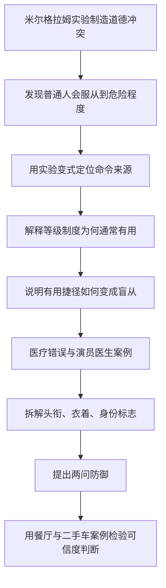

### 0.4 本章涉及的四个不同对象

| 对象 | 要问的问题 |
| --- | --- |
| 权威人物 | 他是否真的有资格发出相关判断？ |
| 权威制度 | 这套等级为何存在，允许怎样的纠错？ |
| 权威符号 | 头衔、制服、豪车是否只是外观？ |
| 具体指令 | 它是否合法、合理、安全且有证据？ |

把四者混在一起，容易把“制度承认这个角色”偷换成“此人的每句话都正确”。

### 0.5 证据阅读边界

本章混合使用实验、实验变式、跨国重复、历史背景、真实事件、医疗案例、作者观察和读者报告。笔记会分别标明：

- 哪些数据来自控制实验；
- 哪些是作者对机制的解释；
- 哪些只是说明性案例；
- 哪些模型和流程是为便于理解而做的笔记整理。

### 0.6 维吉尔题词

章首引用维吉尔的短句：“跟着权威走。”它既概括权威捷径的日常合理性，也为全章反问埋下伏笔：跟随之前，是否核查过权威是谁、懂什么、为何这样说？

---

## 1. 从“学生”视角进入实验：为什么作者先让读者感受恐惧

### 1.1 报纸上的“记忆研究”

原章先让读者设想看到一则本地报纸广告：附近大学心理学系招募志愿者参加一小时的记忆实验。负责人是斯坦利·米尔格拉姆（Stanley Milgram）教授。

表面主题是“惩罚怎样影响学习和记忆”，真正研究问题暂时被隐藏。

### 1.2 实验室里的三种角色

1. **研究员**：穿灰色实验室大褂，手持记录板，解释程序并发出指令；
2. **“老师”**：测试单词记忆，答错一次就提高一次电击强度；
3. **“学生”**：被固定在椅子上，负责学习成对单词并承受惩罚。

在真实实验中，“老师”才是不知情的真正受试者，“学生”是按脚本行动的同谋演员。

### 1.3 抽签为何看似公平

程序让两名“志愿者”抽签决定角色，使受试者以为分工由偶然决定。实际上，安排会让真正受试者始终成为“老师”。

这种设计解决了一个研究难点：若直接告诉受试者“我们要测试你会不会伤害陌生人”，受试者会根据研究目的修饰行为。

### 1.4 为什么作者先把读者放在“学生”位置

作者没有一开始就公布结果，而是让读者想象被绑住、呼救和失去回应。这样做有三层作用：

- 让电击的道德代价变得具体；
- 防止“450伏”只被看成抽象数字；
- 让后面“普通人仍继续操作”的结果真正构成认知冲突。

这是一种叙事方法，不是实验本身的额外证据。

### 1.5 表面自愿与情境压力

受试者原则上可以离开，但大学环境、教授身份、既定程序和“已经答应参加”的承诺共同提高退出难度。形式上的退出权不等于人在高压情境中能轻松使用它。

---

## 2. 电击程序：伤害怎样被拆成连续的小步骤

### 2.1 每次只增加 15 伏

“老师”每遇到一次错误，就把电击提高 15 伏。共设 30 挡，最高 450 伏。

用笔记模型表示，第 $k$ 次惩罚的标称电压为：

$$
V_k=15k\ {\text{伏}},\qquad k=1,2,\ldots,30.
$$

这是对原书程序的数学重写，不是原书公式。

### 2.2 递增结构为什么重要

受试者不是一开始就被要求选择“是否施加450伏”，而是连续面对：

> 已经按到这一挡，下一挡只比它高 15 伏，要不要继续？

每一步看起来只是局部增加，但累积结果极端严重。这与第3章“承诺和一致”中的渐进承诺可以相互强化：过去的每次服从都让下一次停止显得像在否定自己此前的选择。

本章把核心原因放在权威命令上；渐进升级是可能增强服从的情境结构，不能取代权威解释。

### 2.3 受害者信号逐步升级

原书叙述的节点包括：

- 75、90、105 伏：开始痛苦呻吟；
- 120 伏：明确说电击很痛；
- 150 伏：要求退出；
- 随后：尖叫、踢墙、恳求停止；
- 300 伏：表示不再回答；
- 更高阶段：逐渐不再发声和挣扎；
- 400 伏以上：“老师”仍可能继续照程序操作。

### 2.4 沉默为何仍被算作错误

实验规则把不回答视为答错。于是受害者试图撤回参与，也不能自动中止程序；解释规则的权力掌握在研究员手里。

这里暴露出权威控制的一项关键资源：谁有权定义情境，谁就能把“拒绝继续”重新解释为“应继续惩罚的错误”。

### 2.5 微小步骤不等于微小责任

在现实组织中，危险也常被拆成填写表格、转发命令、批准局部步骤和“只是执行流程”。判断责任时必须重新合并整条行动链。

---

## 3. 真正的研究问题：人会在权威命令下伤害无辜者到什么程度

### 3.1 “记忆研究”只是掩护

实验并不研究惩罚能否改善记忆，而是研究：

> 普通人在履行被赋予的职责时，愿意对完全无辜的人施加多大痛苦？

### 3.2 哪个变量才是核心结果

核心行为结果不是受试者口头赞不赞成实验，而是他在受害者抗议后继续到哪一挡，是否在研究员要求下按到最高电压。

这一区分十分重要：

$$
{\text{道德态度或痛苦}}
\quad\not\Rightarrow\quad
{\text{实际停止服从}}.
$$

### 3.3 “学生”没有真的受电击

演员按预先设计的脚本呻吟、抗议和沉默，没有真实电流施加在他身上。真正承受实验压力的是以为自己正在伤人的“老师”。

### 3.4 没有真实电击不代表实验没有伦理成本

受试者经历了欺骗、强烈焦虑和对自我道德形象的冲击。原书用颤抖、流汗、咬嘴唇和紧张大笑展示这种压力。

现代阅读应同时保留两点：实验揭示了重要行为现象；其欺骗和心理压力也构成严重伦理争议，后来研究不能简单照搬全部程序。

### 3.5 为什么观察行为比询问态度更有辨别力

如果只问“你会不会在陌生人哀求时继续电击”，人会依据自我形象作答。真实情境同时包含权威、程序、时间压力和逐步升级，才暴露态度与行动之间的落差。

---

## 4. 基本实验结果：三分之二服从到 450 伏

### 4.1 最高挡与开关数量

控制台共有 30 挡，每挡增加 15 伏，最后一挡是 450 伏。研究员在受试者按完全部开关后结束实验。

### 4.2 原书报告的比例

基本情境中，约三分之二的“老师”一直服从到最高挡。他们没有因为“学生”要求退出、惨叫或最终沉默而自行停止。

### 4.3 另一个行为终点：早期抗议几乎没有让人主动退出

原书还单独指出，在最初研究的 40 名受试者中，从“学生”首次要求离开，到后来哀求并发出尖叫，几乎所有人都没有主动放弃“老师”职责。这个结果与“三分之二按到 450 伏”不是同一终点：前者说明早期抗议很少立即终止服从，后者说明仍有约三分之二一路到达最高挡；其余受试者是在中途某处停止。

### 4.4 样本口径

原书在描述最初研究时提到 40 名受试者，并以“三分之二”概括按到最后的比例。笔记保留原书口径，不把它误写成所有米尔格拉姆变式、所有国家或所有人群的固定比例。

### 4.5 “服从到底”不等于乐于伤害

许多受试者表现出明显痛苦，恳求研究员允许停止。结果证明的是：他们最终让权威命令压过了停止行动；它不证明他们享受伤害。

### 4.6 结果的直觉冲击

大众容易把严重伤害归因于少数邪恶人格。实验却把危险移到普通人与普通制度的结合处：

$$
{\text{普通人}}+{\text{正统权威}}+{\text{渐进程序}}
\rightarrow {\text{可能出现极端服从}}.
$$

这是解释性结构，不意味着三个条件足以机械决定每个人的行为。

---

## 5. 预测与行为的巨大落差：人为什么低估权威压力

### 5.1 同事和学生的预测

实验开始前，米尔格拉姆让同事、研究生和耶鲁大学心理学专业学生阅读程序并预测结果。他们普遍估计只有约 1%～2% 的人会按到 450 伏。

### 5.2 精神科医生的预测

39 名精神科医生独立预测：每 1 000 人大约只有 1 人会服从到底，即约 0.1%。

### 5.3 预测落差

将原书数值并列：

| 判断来源 | 预测服从到底 | 实验观察 |
| --- | ---: | ---: |
| 同事、研究生、心理学学生 | 约 1%～2% | 约三分之二 |
| 39 名精神科医生 | 约 0.1% | 约三分之二 |

这些预测来自不同群体，不能当作同一统计模型的误差条；它们共同显示人严重低估情境和权威。

### 5.4 为什么直觉预测失准

预测者通常想象的是一个孤立道德选择：“我愿不愿伤害他？”真实受试者面对的则是：

- 耶鲁大学实验室的合法感；
- 穿实验服的研究员；
- 已经接受的“老师”职责；
- 每次仅增加 15 伏；
- 研究员对退出请求的持续反驳；
- 不确定自己是否有权中止实验。

忽略情境、只按人格预测，是本章反复纠正的错误。

### 5.5 元认知风险

权威原理危险的一部分，不只是它有影响力，还在于人相信自己不会受它影响。低估会阻止人预先设置核查、暂停和异议程序。

---

## 6. 排除三个直觉解释：不是男性、无知或虐待狂就能解释

### 6.1 解释一：男性天生更有攻击性

最初样本中的受试者是男性，容易让人把结果归因于性别。后续实验让女性担任“老师”，她们服从到高电压的可能性与男性相近。

这项比较削弱“只是男性攻击性”的解释，但不意味着所有性别在所有权威情境中必然完全相同。

### 6.2 解释二：受试者不知道电击危险

后续版本让“学生”明确说明自己患有心脏病，并在电击增强时说心脏难受、拒绝继续。即使风险被说得更直接，原书报告仍有 65% 的受试者按到最大挡。

因此，单纯“不知道可能受伤”不足以解释服从。

### 6.3 解释三：参加者都是虐待狂

参加者来自不同年龄、职业和教育背景，实验后人格测验没有显示他们是一群心理扭曲的虐待狂。观察到的紧张和抗议也与“享受折磨”不一致。

### 6.4 排除法怎样推进论证

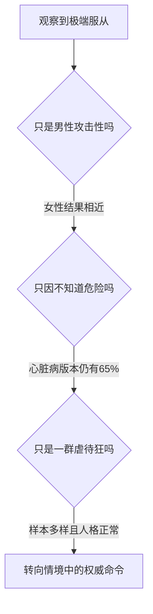

### 6.5 排除替代解释不等于证明唯一原因

这些材料增强“权威命令很关键”的解释，却没有证明所有服从只来自单一机制。渐进升级、承诺、制度合法性、责任转移、对实验真实性的理解和退出成本都可能参与。

本章转述的米尔格拉姆核心解释是权威；严谨阅读应把它称为得到变式强力支持的主要机制，而非排除一切其他机制后的唯一真因。

---

## 7. 权威解释：良知痛苦为何没有自动变成停止行动

### 7.1 命令来源

研究员穿着实验室大褂，代表大学和科学程序，并不断要求“老师”履行职责。米尔格拉姆认为，受试者无法公然违抗这个被承认为上级的人，是实验服从的关键；西奥迪尼在本章转述并据此展开权威原理。

### 7.2 行为与情绪分离

原书记录的反应包括：

- 颤抖和大量出汗；
- 结巴着抗议；
- 请求放掉受害者；
- 指甲掐进皮肉；
- 咬破嘴唇；
- 托住头部或敲打自己；
- 无法控制地紧张发笑。

这些反应说明受试者并未失去道德感受。真正失败的是把道德感受转化为中止行动。

### 7.3 “我反对”不等于“我拒绝执行”

组织里常见三种层次：

1. 内心觉得不对；
2. 口头表达异议；
3. 拒绝执行并触发复核。

米尔格拉姆情境里，很多人完成前两层，却没有进入第三层。有效制度不能把“允许抱怨”误当成“允许停止危险行为”。

### 7.4 责任感如何被重新分配

当行动被定义为“执行研究员的程序”，受试者可能把自己看成操作环节，而把后果责任交给命令者。

本章正文强调对上级的责任心。相关背景概念常被称为**代理状态（agentic state）**：行动者把自己理解为权威意志的代理人。这个术语用于帮助理解米尔格拉姆理论，不应当被当作无需证据就能免除个人责任的法律结论。

### 7.5 道德冲突模型

$$
{\text{停止伤害的良知压力}}
\quad\leftrightarrow\quad
{\text{履行权威命令的责任压力}}.
$$

基本实验显示，在特定制度化场景中，后者常赢得行为控制权，即便前者仍造成强烈痛苦。

---

## 8. 三组实验变式：怎样证明关键是“谁在发命令”

### 8.1 变式一：研究员说停，“学生”说继续

研究员指示中止电击，而扮演“学生”的另一名受试者勇敢地要求继续。原书报告，100% 的“老师”拒绝继续按电闸。

这说明受试者不是单纯服从“现场任何人说继续”，也不是不可遏制地想电击。

### 8.2 变式二：研究员成为受害者

研究员被绑在椅子上，另一名同伴要求“老师”不顾研究员抗议继续电击。结果仍然没有受试者继续提高电压。

权威的停止命令胜过普通同伴的继续要求，角色地位比“有人提出请求”更有解释力。

### 8.3 变式三：两个研究员发出矛盾指令

一名研究员要求停止，另一名要求继续。受试者努力判断谁的级别更高；无法确定后，所有人都停止电击。

这组结果尤其重要：权威若不能提供一致命令，自动服从程序便失去明确输入，个体重新取得行动控制。

### 8.4 三组变式的比较逻辑

| 情境 | 谁要求继续 | 谁要求停止 | 结果 |
| --- | --- | --- | --- |
| 研究员停止、学生继续 | 普通同伴 | 权威研究员 | 100% 拒绝继续 |
| 研究员受电击 | 普通同伴 | 权威研究员 | 无人提高电压 |
| 两名研究员冲突 | 一名权威 | 另一名权威 | 所有人停止 |

### 8.5 为什么这是强辨别性证据

如果受试者主要是虐待狂，那么更换台词或让权威成为受害者不应让服从骤然消失。结果随命令者身份和权威一致性改变，支持“权威结构控制行为”的解释。

### 8.6 可迁移的制度启示

建立独立复核者、双重签署或“任何人可暂停”的规则，不只是增加意见数量；它会打破单一权威命令的垄断，让自动执行重新变成需要判断的选择。

---

## 9. 作者注 `[24]`–`[25]`、编者注 `[26]` 与实验的历史、跨文化和伦理边界

### 9.1 作者注 `[24]`：实验资料来源

作者说明，基本实验及上述改编版本收录在米尔格拉姆的《服从权威》中。这是进一步核对实验程序与原始论述的入口。

### 9.2 作者注 `[25]`：最初的问题背景

米尔格拉姆最初想理解：纳粹统治时期，普通德国公民为什么会参与大规模迫害。他原计划先在美国测试程序，再到德国研究；美国首轮实验已经出现大量服从，使他认为无需以“德国民族特殊性”解释现象。

这个历史动机不能推出实验室行为与历史暴行完全等同。两者在时间、意识形态、组织规模、后果真实性和退出条件上有巨大差异。实验的意义是挑战“只有某个民族或少数恶人才会服从”的简单解释。

### 9.3 跨国重复

原书称，类似基本程序后来在荷兰、德国、西班牙、意大利、澳大利亚和约旦等地重复，结果相差不大；数十年后的仿效研究也没有发现与原样本明显不同的总体模式。

这支持现象并非只属于20世纪美国，但不能据此假定每个文化、组织和实验变式都有相同百分比。

### 9.4 编者注 `[26]`

编者推荐托马斯·布拉斯所著《电醒人心》，用于进一步了解米尔格拉姆实验及其人生经历。

### 9.5 伦理边界

经典实验涉及欺骗和显著心理压力。现代研究伦理通常要求：

- 预先审查风险；
- 明确且可实际使用的退出权；
- 将伤害降到最低；
- 事后充分解释和支持；
- 必要时采用不推进到极端终点的替代程序。

### 9.6 方法学边界

读者应避免三个过度结论：

1. 不能把约三分之二当作跨场景常数；
2. 不能从实验推出所有参与者都相信每一处情节；
3. 不能把权威解释当成否定承诺升级、制度认同等其他机制。

原书要建立的是权威压力的强度和普遍风险，而不是一个能精确预测任意个人的封闭定律。

---

## 10. 布莱恩·威尔逊事件：真实制度中的“服从命令”

### 10.1 事件背景

1987 年 9 月 1 日，布莱恩·威尔逊（Brian Willson）与另外两名男子在加利福尼亚州康科德海军兵站的铁轨上抗议美国向尼加拉瓜运输军事装备。他们提前三天向海军和铁路官员说明行动。

### 10.2 列车没有停车

原书称，非军方司乘人员接到“不能停车”的命令。列车人员在约 600 英尺外看到抗议者，却没有减速。两人及时离开铁轨，威尔逊未能及时离开，双腿膝盖以下被压断。

### 10.3 救治延迟

现场海军医护人员拒绝治疗，也没有用军方救护车送医。围观者和威尔逊家人先行止血，约 45 分钟后私立医院救护车到达。

### 10.4 威尔逊的解释

威尔逊曾在越南服役四年。他没有把责任只归给列车人员或医护兵，而是批评让人盲目执行疯狂政策的制度，认为执行者也是制度压力的受害者。

### 10.5 司乘人员的诉讼

原书最令人错愕的细节是，司乘班组反过来控诉威尔逊，要求赔偿他们因“不压断他的腿就无法执行命令”而承受的羞辱、精神痛苦和身体压力。

### 10.6 这是什么类型的证据

这是原书引用的真实事件叙述，用来说明良知与命令冲突可能出现在实验室之外。它不是随机实验，不能单独估计权威导致事故的概率，也不能仅凭本章叙述裁定所有个人和机构的法律责任。

### 10.7 “执行者也是受害者”不等于免责

制度压力可以解释行为，也可以说明改革为什么不能只靠惩罚个体；但解释不自动取消行动者的注意义务、拒绝非法命令的责任或救助义务。

### 10.8 系统责任与个人责任可以同时成立

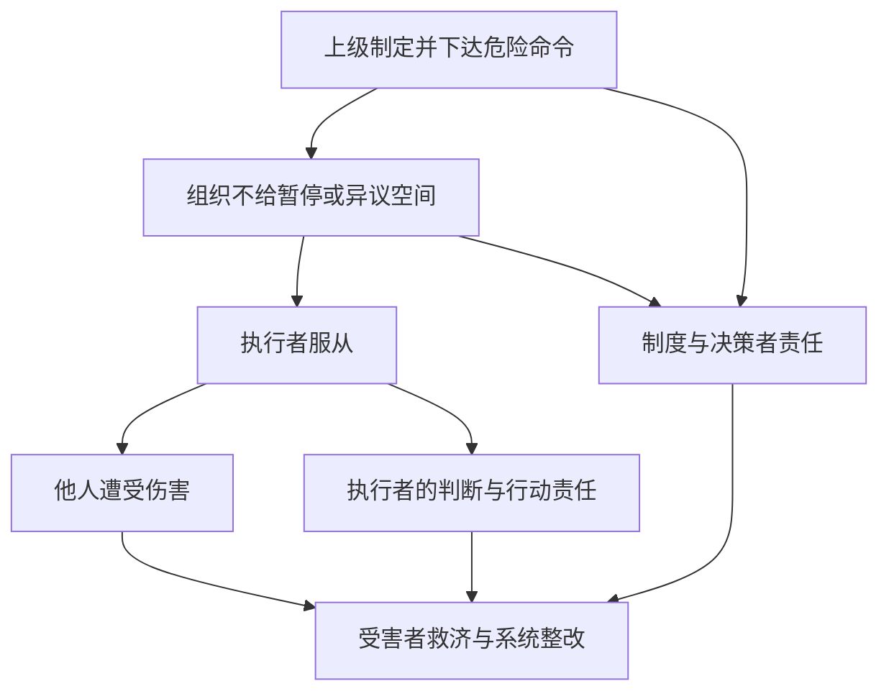

---

## 11. 第一阶段结论：权威解释解决了什么难题

### 11.1 从“坏人问题”转成“情境问题”

米尔格拉姆实验迫使读者停止只问“什么样的坏人才会伤害别人”，转而问：

- 谁被承认为有权发命令？
- 行动怎样被拆成小步骤？
- 谁定义退出和错误？
- 异议能否真正暂停流程？
- 责任被分配给谁？

### 11.2 作者的推理链

1. 先制造普通道德直觉与真实行为的冲突；
2. 用预测数据证明人低估服从；
3. 排除性别、危险无知和虐待人格等直觉解释；
4. 用命令者互换和权威冲突变式定位关键变量；
5. 用跨国重复和真实事件扩展问题范围；
6. 下一步再解释：为什么社会会培养这样强的服从倾向。

### 11.3 当前可以下的结论

在具有合法外观、清晰等级、渐进任务和持续命令的情境中，普通人可能一边强烈痛苦，一边继续执行伤害性行为。命令来源的权威身份是原书用实验变式重点支持的关键因素。

### 11.4 当前不能下的结论

- 所有人都会服从到底；
- 服从比例永远是 65% 或三分之二；
- 服从者没有良知；
- 任何等级制度都邪恶；
- 只要说“奉命行事”就没有个人责任；
- 米尔格拉姆实验足以解释所有历史暴行。

下一部分进入原书“盲目服从的诱惑和危险”：权威为什么通常值得听从，以及一条有用捷径怎样蜕变成机械反应。

---

## 12. “盲目服从的诱惑和危险”：权威体制为什么会存在

### 12.1 作者先解释功能，而不是先作道德谴责

面对一种强力行为倾向，作者惯用的第一步是问：它为何会在社会中长期存在？如果服从毫无用处，人类不会投入家庭、学校、宗教和法律资源持续培养它。

### 12.2 多层级权威带来的协调优势

原书列举的社会能力包括：

- 组织资源生产；
- 开展贸易；
- 进行国防和扩张；
- 维持社会控制；
- 形成成熟的大规模协作结构。

复杂任务需要分工、决策权和责任边界。每个人都重新审议每项公共规则，协调成本会急剧增加。

### 12.3 霍布斯的无政府状态

作者引用托马斯·霍布斯（Thomas Hobbes）的著名判断：缺乏共同权威的生活会变得“孤独、贫乏、污秽、粗野和短暂”。这里的作用是说明秩序需求，不是证明任何现存命令天然正当。

### 12.4 权威制度解决的基本问题

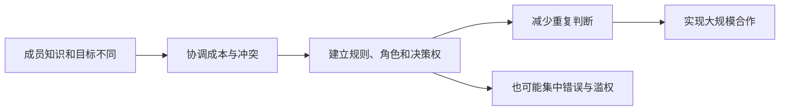

权威是一种协调基础设施。它的价值和危险来自同一特性：让很多人不必逐项重做判断，就按统一方向行动。

### 12.5 权威、权力、专业和合法性不是一回事

| 概念 | 核心问题 | 可能来源 |
| --- | --- | --- |
| 权威 | 人们是否承认他有资格发出指引或命令 | 制度、传统、专业、程序 |
| 权力 | 他能否改变他人的收益、机会或处境 | 奖励、惩罚、资源控制 |
| 专业知识 | 他是否掌握相关事实和方法 | 训练、经验、研究 |
| 合法性 | 其地位和命令是否符合可接受规则 | 法律、授权、正当程序 |

一个人可能有权力但无专业知识，也可能是专家却无权强迫别人。成熟判断不能用其中一个词替代其余三个。

---

## 13. 教化怎样把服从变成默认反应

### 13.1 从出生开始的训练

父母、教师、故事、儿歌、法律、军队和政治制度都反复传达：服从正当权威是正确的，违抗会带来风险或惩罚。

这种教育通常有现实理由。儿童不知道交通、药物和公共安全规则，先听从有经验者往往比独自试错更安全。

### 13.2 宗教叙事中的至高权威

作者用《圣经》中的两个故事展示文化如何赋予服从道德意义：

- 亚当和夏娃因违抗至高权威而失去乐园；
- 亚伯拉罕因上帝命令，准备牺牲自己的儿子，即使命令没有给出通常意义上的理由。

### 13.3 亚伯拉罕与米尔格拉姆受试者的结构相似

两者都面对：

$$
{\text{一般道德判断}}
\quad\text{与}\quad
{\text{更高权威的命令}}
$$

之间的冲突。原书借此说明，文化故事会把“服从本身”塑造成评价行为正确与否的标准。

### 13.4 描述文化机制不等于认可伤害

作者在分析服从的来源，而不是让读者把宗教故事机械用于现代伦理。现实中的合法命令仍应受法律、权利、比例原则和避免伤害等边界约束。

### 13.5 教化为何容易被迁移

人最初学到的是“父母和教师通常知道更多”，后来可能把反应扩展为“任何拥有头衔、制服或上级位置的人都值得服从”。危险发生在有效训练被过度概括时。

---

## 14. 权威作为信息捷径：合理服从怎样滑向机械服从

### 14.1 家长和教师为什么通常值得听

他们往往：

- 比儿童掌握更多知识；
- 能预见儿童看不到的后果；
- 对行为拥有奖励和惩罚能力；
- 承担照护和教学责任。

采纳建议既可能带来更正确的行动，也能避免制度惩罚。

### 14.2 成年后的权威

成年后，老板、法官、政府领导者、医生和其他专家接替部分权威角色。他们通常能接触更完整的信息，并拥有正式授权。

### 14.3 服从何时是理性的

可以用一个笔记检查式表示：

$$
{\text{合理遵循}}
\approx
{\text{真实资格}}
\cdot {\text{主题相关}}
\cdot {\text{可信信息}}
\cdot {\text{合法安全}}.
$$

这不是原书公式，也不是可计算概率。乘法形式只强调：任何关键门槛为零，都不应仅凭其余优势自动服从。

### 14.4 自动化的收益

- 节省搜集和解释信息的时间；
- 利用社会分工；
- 在紧急情况下迅速协调；
- 避免每个人都重复成为临时专家。

### 14.5 自动化的代价

一旦反应从“因为他在这件事上更懂”缩短为“因为他是权威”，内容核查就被符号识别取代：

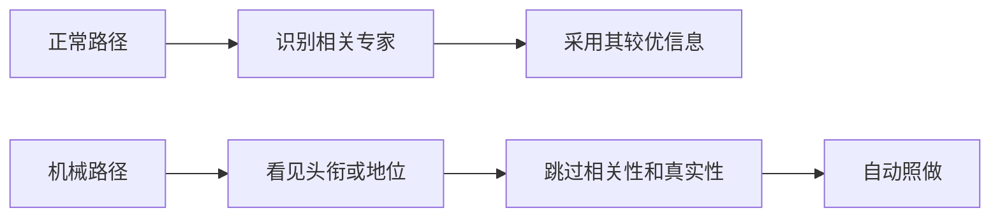

### 14.6 问题不在捷径本身，而在适用条件消失

大多数影响力武器都源于通常有用的经验规则。权威原理失灵时，人保留了“服从”这个输出，却没有继续检查使服从合理的资格、相关性、诚信和安全前提。

---

## 15. 医疗领域：高专业性与严格层级为何同时提高收益和风险

### 15.1 医生权威的合理基础

健康决策复杂、后果重大，医生接受长期专业训练，患者和其他医务人员通常有充分理由重视其意见。

### 15.2 医院的等级结构

医院中不同职业和资历拥有明确分工。原书指出，医生位于传统医疗权威结构的高层，除非另一名级别更高的医生介入，其他人员很少驳回其病例判断。

### 15.3 自动服从怎样浪费团队专业能力

医生也会误读、写错、算错或遗漏信息。护士和药剂师本应提供独立核查；如果一见医嘱便停止思考，多专业团队就退化为单一判断的执行链。

### 15.4 原书引用的用药失误背景

原书引用当时为美国国会提供医疗政策咨询的机构，原文表述为“就诊的病患每天至少会碰到一次用药失当”；又引用迈克尔·科恩（Michael Cohen）和内尔·戴维斯（Neil Davis），强调患者、护士、药剂师等未质疑处方，是许多错误的重要原因。

这是书中所引的历史统计与归因，但原书未在本章交代“就诊病患”的具体范围、统计分母和研究时期，不能直接当作 2026 年所有国家、医院和患者的当前发生率。它在本章中的功能是说明：高权威环境若缺少复核，会把单点错误放大。

### 15.5 高可靠组织需要“双重专业”

正确目标不是削弱医生专业，而是让医生与护士、药剂师的知识同时发挥作用：

$$
{\text{团队安全}}
\neq {\text{最高头衔者单独正确}},
$$

$$
{\text{团队安全}}
={\text{专业分工}}+{\text{独立核查}}+{\text{可暂停流程}}.
$$

上式是笔记的制度化表达。

---

## 16. “肛门耳痛”案例：明显荒谬为何仍没有触发质疑

### 16.1 缩写歧义

患者右耳感染，医生开具滴耳剂，但没有完整写出英文 `right ear`，而以容易被理解为 `rear`（后部、臀部）的形式缩写。值班护士据此把药液滴入患者肛门。

### 16.2 常识警报为何失效

耳朵发炎与肛门给药明显不匹配。患者和护士却都没有暂停，说明处方上的医生权威压过了：

- 病变位置；
- 药物用途；
- 给药路径常识；
- 患者本人的感受和提问权。

### 16.3 作者要说明的不是“护士缺乏常识”

重点是，当正统权威给出指令，人可能只响应“这是医嘱”，不再整体审视情境。换言之，专业训练没有被调用，并非从未具备。

### 16.4 个案证据的边界

这是说明性医疗案例，能直观展示机制，却不能估计此类错误的普遍比例。后面的 22 个护士站电话实验才更系统地检验“医生”头衔是否足以压过多项警讯。

### 16.5 系统改进

- 禁止危险缩写；
- 采用结构化电子处方；
- 对剂量、途径和适应证做自动校验；
- 要求口头或电话医嘱回读；
- 明确赋予护士、药剂师和患者暂停权；
- 把提出疑问视为履职，不视为不敬。

---

## 17. 罗伯特·扬与桑卡咖啡：扮过医生的人为什么能借到医生权威

### 17.1 广告内容

演员罗伯特·扬（Robert Young）在广告中提醒公众注意咖啡因，并推荐不含咖啡因的桑卡牌咖啡。广告成功推动产品畅销，并被制作成多个版本长期播放。

### 17.2 作者注 `[27]`

罗伯特·扬是美国资深演员，曾在20世纪70年代电视剧《仁心仁术》中扮演马库斯医生。公众熟悉的是他的医生角色，而不是医学资格。

### 17.3 广告借用了什么

观众理性上知道他是演员，但熟悉角色触发“医生在给健康建议”的感觉。广告没有提供真正医学权威，只借用了外观和联想。

### 17.4 这里同时涉及两章机制

| 机制 | 在广告中的表现 |
| --- | --- |
| 权威 | 医生角色像专业资格，触发服从 |
| 关联 | 演员与长期扮演的医生形象相连 |
| 喜好/熟悉 | 观众对熟悉电视人物可能更亲近 |

最终结果相同，不代表机制相同。权威问题的核心是：观众误把角色符号当作相关专业证据。

### 17.5 代言不等于证据

演员可以真实喜欢某种咖啡，但其推荐不能替代成分、剂量、健康效果和独立研究。对产品主张，应问“证据是什么”，而不只问“是谁说的”。

---

## 18. “内涵不是内容”：权威符号怎样取代真正资格

### 18.1 标题的含义

原书所谓“内涵不是内容”，指人在自动模式下响应的是权威的含义、外观或象征，而不是这个人实际具备的知识和资格。

### 18.2 三类核心符号

1. **头衔**：医生、教授、法官、专员；
2. **衣着**：白大褂、制服、神职服装、笔挺西装；
3. **身份标志**：珠宝、豪华汽车和昂贵装饰。

### 18.3 符号为何有用

在正常情况下，这些符号与训练、职位或资源存在一定相关性。人不可能每次都重新调查陌生人的完整履历，符号便提供快速分类。

### 18.4 符号为何容易伪造

取得真正专业资格可能需要多年，印一张名片、买一套制服或租一辆豪车却容易得多。顺从专业人士利用的是**信号成本与真实能力成本不对称**。

### 18.5 认证信号与装饰信号

| 信号 | 可核查内容 | 风险 |
| --- | --- | --- |
| 执业注册 | 发证机构、编号、有效期、范围 | 仍需检查是否与当前问题相关 |
| 单位工牌 | 身份、组织和岗位 | 可能仿造，且不证明每项主张正确 |
| 自称头衔 | 只有口头陈述 | 验证成本低，伪造成本也低 |
| 豪车与珠宝 | 主要表示消费或财富外观 | 几乎不证明专业和诚信 |

---

## 19. 头衔的第一种作用：让交流对象变得顺从

### 19.1 教授朋友的经历

作者一位在美国东部知名大学任教的朋友经常旅行，与陌生人在酒吧、餐馆和机场聊天。他发现，一旦透露自己是教授，原本自然、有争论的交流就会变得拘谨和恭顺。

### 19.2 同一个人，为何气氛突然变化

对方已经与他交谈约 30 分钟，人格、知识和说话内容并未瞬间改变；改变的是“教授”标签。标签重新定义了地位关系，使人减少挑战、增加附和。

### 19.3 过度服从也会损害专家

教授本人觉得这种交流乏味，于是选择隐瞒头衔。这个细节说明：自动恭顺不仅让追随者失去判断，也会让真正专家失去纠错信息和高质量讨论。

### 19.4 组织中的对应风险

- 下属只报告领导想听的消息；
- 学生不质疑教师错误；
- 初级工程师发现安全问题却不敢阻止发布；
- 会议把职级当作证据强度。

头衔可以决定最终责任，不应决定事实是否成立。

---

## 20. 头衔的第二种作用：地位会改变对身高的知觉

### 20.1 五个班级的身份操纵

一名来自英国剑桥大学的访客出现在澳大利亚一所大学的 5 个班级。研究人员在不同班级分别把他介绍为：

1. 学生；
2. 助教；
3. 讲师；
4. 高级讲师；
5. 教授。

访客离开后，学生估计他的身高。

### 20.2 原书报告

地位每提高一级，估计身高平均增加约半英寸；被介绍为教授时，估计身高比被介绍为学生时高出 6 厘米以上。

### 20.3 数值阅读提醒

五种身份之间有四次升级。若机械按每级半英寸线性换算，总差约 2 英寸，即约 5.08 厘米，与“6厘米以上”并不严格一致。可能原因包括原书使用概略数、平均值并非简单线性累加，或转述/换算差异。

严谨做法是保留原书两个报告，同时不把它们拼成精密公式。关键结论是身份标签系统性改变身高估计。

### 20.4 选举后的身高印象

原书还提到，政治家获胜后，在公众眼里会显得更高大。这说明因果方向不只可能是“高大带来地位”，地位变化也会反过来影响体格知觉。

### 20.5 不能推出什么

该实验不说明教授真的长高，也不说明人有意识说谎。它说明价值和地位会渗入看似客观的知觉估计。

---

## 21. “重要的东西看起来更大”：纸牌、动物展示与身高政治

### 21.1 儿童对硬币大小的判断

作者先提到，儿童会高估面值较大硬币的物理大小。价值判断影响尺寸知觉。

### 21.2 从 -3 到 3 元的纸牌实验

大学生从一叠大小相同的纸牌中抽牌，牌面数值从 -3 到 3：正数代表赢钱，负数代表输钱。之后让他们排列纸牌大小。

受试者倾向认为绝对数值较大的牌更大，无论它代表获得 3 元还是损失 3 元。

### 21.3 为什么负数结果重要

如果只是“喜欢的东西显得更大”，负 3 元不应产生同方向效果。正负极值都被高估，更支持“重要性或后果强度改变知觉”。

### 21.4 动物怎样伪造体格

在许多动物群体中，体格与支配地位有关。为避免真正打斗，动物会通过：

- 拱背、竖毛；
- 张开鳍、鼓起身体；
- 展开并拍动翅膀；

让自己看起来更大，以迫使对手退让。

### 21.5 人类符号与动物展示的共同结构

相似的是信号机制，不是说人类社会地位完全等同动物支配。

### 21.6 增高鞋与伪造权威

作者由此提出两点：体格可被伪造来营造地位；更一般地，权力和权威的外部象征都可能由假材料构成。

### 21.7 作者注 `[28]`

作者注称，自 1900 年以来的美国总统选举中，约 90% 由更高的候选人胜出。该数字属于特定历史样本的相关性描述：

- 不能证明身高单独造成胜选；
- 不宜外推到所有国家、时期和选举制度；
- 候选人界定、身高资料和统计截止时间会影响比例。

它在本章中用于说明体格与地位的文化联系，不是普适选举定律。

---

## 22. 电话“医生”实验：只剩一个头衔时，护士还会服从吗

### 22.1 研究要回答的三个递进问题

由医生和护士组成的研究团队关注护士机械服从医嘱，进一步追问：

1. “肛门耳痛”只是孤立个案，还是普遍风险？
2. 当药物未经批准且剂量危险时，是否仍会服从？
3. 当权威不在现场，只是电话里自称医生的陌生人时，是否仍会服从？

### 22.2 研究场景

研究人员向外科、内科、儿科和精神科等 22 个护士站分别打电话，自称是医院医生，要求接电话的护士给指定患者使用 20 毫克某药物。

### 22.3 四个明确警讯

护士至少有四项理由暂停：

1. 电话处方违反医院政策；
2. 药物未获批准，也不在病房常规药物清单；
3. 容器标明每日最大剂量为 10 毫克，命令剂量 20 毫克，是上限的两倍；
4. 下令者是护士从未见过、也从未交谈过的陌生人。

### 22.4 设计为什么有辨别力

实验把真正权威的证据降到很低，只留下电话中的自称头衔；同时把内容错误做得很明显。如果护士仍服从，就很难说她们只是经过专业权衡后赞同治疗方案。

### 22.5 风险控制

观察员在护士取药、准备前往病房时立即阻止并解释实验。原书报告的是“准备给药”，不是药物真的进入患者体内。

---

## 23. 95% 与 2%：真实行为和自我预测为何几乎相反

### 23.1 行为结果

原书报告，95% 的护士径直去取相应剂量，准备给患者使用，直到观察员阻止。

### 23.2 专业知识被暂时关闭

若知识正常参与决策，任何一项警讯都足以触发核查。结果表明，“医生”头衔启动自动模式后，护士自身训练没有发挥应有的安全屏障作用。

### 23.3 不是“护士没有专业”，而是专业没有进入决策

研究者的结论是，理论上医生和护士两种专业应结合保护患者；实验中，护士专业实际上没有生效。

### 23.4 作者注 `[29]`：预测研究

研究人员另访谈 33 名护士和实习护士，问她们在同样情境中会怎么做。只有 2% 认为自己会按电话命令给药。

这里忠实保留原书的“33 名”和“2%”，但 $33\times2\%=0.66$，无法还原为整数答题人数。原书未给原始计数，这一组合可能涉及取整、转述或不同统计口径，因此 2% 应视为原书报告的概略比例，而非可由 33 人精确复算的频数。

| 指标 | 比例 |
| --- | ---: |
| 实际准备执行命令 | 95% |
| 预测自己会执行 | 2% |

两者不是同一批人的前后测，不能作个体级差值解释；它们揭示群体层面严重低估头衔影响。

### 23.5 与米尔格拉姆实验的共同结构

- 参与者具有停止的能力；
- 指令内容包含越来越明显的危险；
- 权威身份让参与者忽略其他信息；
- 当事人事前严重低估自己或他人的服从；
- 实际行为而非口头态度暴露机制。

### 23.6 医疗安全中的对应措施

- 任何超剂量必须二次确认；
- 未批准药物自动拦截；
- 电话医嘱验证姓名、科室和回拨号码；
- 用封闭式沟通重复药名、剂量、患者和途径；
- 设置不受职级惩罚的“停止线”；
- 复盘系统如何容许错误，不把责任简化为个别护士粗心。

---

## 24. 衣着：第二类容易伪造的权威象征

### 24.1 制服的分类功能

白大褂、神职黑袍、军装和警服能快速指示角色。正常情况下，它们帮助公众识别应向谁求医、求助或接受现场指挥。

### 24.2 诈骗者为何爱换装

制服易于获得，却能借用整个制度积累的可信度。诈骗档案中，骗子会根据场景更换医院、宗教、军队或警察服装。

### 24.3 衣服证明什么，不证明什么

制服最多提供一个需要验证的身份线索，不自动证明：

- 穿着者确属该机构；
- 其当前要求属于岗位权限；
- 命令合法；
- 说法真实；
- 收款或索取信息合理。

### 24.4 西装的间接地位含义

剪裁合体的西装不像制服那样对应明确职位，却能暗示财富、职业成功和社会地位。这种含义更模糊，也更容易让人把一般地位误用到无关任务。

---

## 25. 比克曼制服实验：请求者离开后，制服影响仍在

### 25.1 基本程序

社会心理学家伦纳德·比克曼（Leonard Bickman）让一名年轻男子在街头提出古怪要求，例如让行人捡起纸袋，或站到公交站牌背面。

有时请求者穿普通衣服，有时穿警卫制服。穿制服时，更多行人服从。

### 25.2 停车计费器版本

请求者指向约 50 英尺外站在计费器旁的人，请行人给那个“停车超时又没有零钱”的人一角钱。说完后，请求者转过街角，在行人走到计费器前已经离开视线。

### 25.3 实际结果

| 请求者衣着 | 行人实际服从率 |
| --- | ---: |
| 普通便服 | 42% |
| 警卫制服 | 92% |

制服影响在请求者离开后仍延续，说明服从不只来自当面害怕冲突。

### 25.4 大学生的预测

| 请求者衣着 | 大学生预测 |
| --- | ---: |
| 普通便服 | 50% |
| 警卫制服 | 63% |

学生对便服条件估计较接近，却把制服条件低估了 29 个百分点。这个差距再次说明，人会注意到制服有作用，却低估作用大小。

### 25.5 不能直接外推

该实验属于特定年代和地点的街头研究。警卫制服在不同文化、治安环境和任务中含义不同。稳妥结论是制服可能显著提高服从，具体比例不是常数。

---

## 26. 西装与闯红灯：领域无关的地位为何也能带人越界

### 26.1 得克萨斯州现场研究

一名 31 岁男子在多个地点违反交通规则、闯红灯横穿马路。有时他穿笔挺西装并打领带，有时穿工装衬衫和长裤。

### 26.2 结果

男子穿西装时，跟随他违规过街的人数是穿便装时的约 3.5 倍。

### 26.3 相关性错误

即使西装真实表示商业成就，它也不提供当前路口是否安全、交通信号是否失效等相关知识。行人把一般地位误当作交通判断资格。

### 26.4 与社会认同的关系

这里可能同时存在两条路径：

- **社会认同**：有人先过，暗示“也许可以过”；
- **权威符号**：领头者穿西装，使其行为看起来更值得跟随。

对照条件中领头者行为相同、衣着不同，3.5 倍差异支持权威外观在共同跟随效应之外增加了影响。

### 26.5 日常防御

不要问“这个人看起来成功吗”，要问“他是否拥有当前安全判断所需的信息”。路况、信号和视野应直接检查。

---

## 27. “银行核查员方案”：西装与制服如何组合成完整骗局

### 27.1 目标选择

原书描述一种历史骗局，骗子偏好独居老人，尤其是可能在银行被盯上并尾随回家的丧偶女性。这是犯罪者利用孤立与信任条件，不应被理解为所有老年人判断力不足。

### 27.2 第一名骗子：体面的“核查员”

男子穿保守的三件套西装、浆挺白衬衫和亮皮鞋，自称银行专业核查员。他声称正在调查银行内部人员篡改账户，需要受害者取出全部存款，帮助设置陷阱。

### 27.3 为什么故事可能降低核实意愿：笔记分析

- 西装营造专业和地位；
- “审计异常”被包装成需要内部专业人员处理的问题；
- 请求被包装成帮助银行抓坏人；
- 自称掌握内部信息；
- 两个相互配合的角色强化了银行调查的表面真实性。

以上是笔记对骗局结构的分析。原书只记载受害者没有想到拨打电话核实，并未直接检验究竟是哪一项心理机制导致她未核实。

### 27.4 第二名骗子：制服“警卫”

银行关门后，一名穿制服的同伙出现，声称账户没有问题，愿意替受害者把现金送回金库。“核查员”与“警卫”互相确认角色，让两个伪造符号形成表面一致的制度场景。

### 27.5 骗局的组合结构

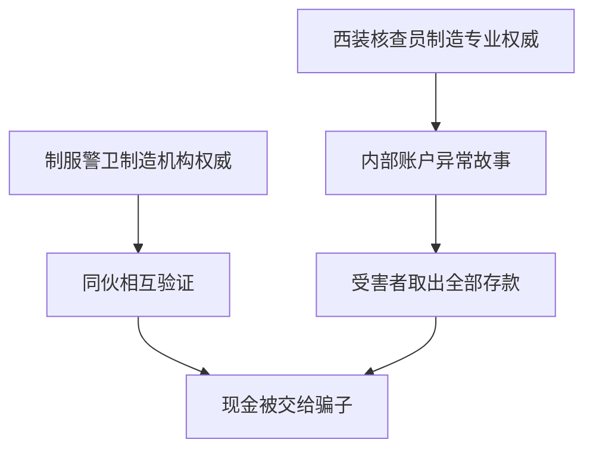

### 27.6 笔记扩展：正确核验流程

- 不使用来访者提供的电话号码；
- 自行查找银行官方号码；
- 不在来访者注视下通话；
- 银行不会要求客户把现金交给上门人员“核查”；
- 涉及全部存款时暂停并联系可信亲友或警方；
- 让对方离开，不在来访者施压下完成取款或交付。

---

## 28. 身份标志：豪华汽车为何能换来额外耐心

### 28.1 地位装饰

昂贵服装、珠宝和汽车不对应特定法定职位，却能承载财富、成功和高地位的光环。美国汽车文化使车辆成为尤其醒目的身份标志。

### 28.2 旧金山湾区现场研究

研究让一辆车停在绿灯已经亮起的路口，观察后方驾驶员何时按喇叭。条件分别是：

- 崭新的豪华车；
- 旧款经济型轿车。

### 28.3 对经济型车的反应

原书称，几乎所有后车都按了喇叭，大多数不只按一次；有两次，后车甚至顶上前车后保险杠。

### 28.4 对豪华车的反应

驾驶员等待更久。约 50% 的人一直等到豪车开动也没有按喇叭。

### 28.5 结果的含义

豪车没有交通优先权，也没有使堵路行为更合理。身份标志却让同样的违规获得更多宽容。

### 28.6 大学生再次低估影响

学生预测自己面对豪车的等待时间时低估了实际延迟；男学生甚至认为自己会更快对豪车按喇叭，方向与现场结果相反。

### 28.7 不把驾驶行为过度解释成人格

现场反应还会受距离、车辆可见性、交通密度等影响。本章材料支持地位标志改变群体平均行为，不足以诊断某个未按喇叭者“崇拜财富”。

---

## 29. 权威影响的隐蔽优势：我们反复低估它

### 29.1 四组预测落差

| 场景 | 人们的预测 | 行为观察 |
| --- | --- | --- |
| 米尔格拉姆实验 | 约 0.1% 或 1%～2% 到底 | 约三分之二到底 |
| 电话医生实验 | 仅 2% 认为会服从 | 95% 准备给药 |
| 警卫制服实验 | 预测 63% 服从 | 实际 92% |
| 豪车堵路 | 认为自己等待较短，部分人预测会更快鸣笛 | 实际等待更久 |

### 29.2 为什么“我不会受影响”本身构成风险

若人知道自己容易受权威影响，就会主动核验身份、保留复核和设置停机线。低估使这些防护看起来多余。

### 29.3 符号越容易识别，内容越容易被忽略

自动反应只需回答一个简单问题：“像不像权威？”真正审查则需要多个问题：资格是否真实、主题是否相关、主张是否有证据、利益是否冲突、命令是否安全。

### 29.4 本段的阶段性结论

头衔、衣着和身份标志之所以危险，不是它们永远毫无信息，而是人在看到它们后往往高估其证明力，又低估它们对自己的行为影响。

下一部分进入原书“如何拒绝”：目标不是消灭专家影响，而是以最低认知成本恢复两项关键检查。

---

## 30. “如何拒绝”：防御权威为什么不能靠全面反抗

### 30.1 第一步是承认自己会低估影响

人容易把顺从想成经过深思熟虑的决定，却可能只因头衔、制服或高地位外观改变行为。提前知道这种倾向，才能在权威出现前设置检查。

### 30.2 只提高警惕仍然不够

“警惕权威”听起来简单，但过度警惕会造成另一种错误：拒绝真正专家。现代知识分工使个人不可能独立掌握医疗、法律、工程、金融等全部专业。

### 30.3 防御目标

不是从：

> 权威说什么，我都照做。

跳到：

> 权威说什么，我都反对。

而是恢复一条有条件的路径：

### 30.4 为什么作者只设计两个核心问题

自动服从往往发生在时间紧、信息多的环境。过长清单不容易被真正使用。作者先用两问抓住最关键的两类错误：

1. **他是真的相关专家吗？**
2. **这个专家在当前情境中说真话吗？**

实际高风险决策还应增加合法性、安全和证据核查；两问是最低成本的启动器，不是完整尽调的终点。

---

## 31. 第一问：“这个权威是真正的专家吗？”

### 31.1 第一层：资格是否真实

核查：

- 教育、训练和执业资格；
- 发证或任命机构；
- 身份是否可独立验证；
- 资格是否有效、是否受限制；
- 是否有可追溯的相关工作记录。

不要使用对方自己提供的唯一验证渠道。

### 31.2 第二层：资格是否与当前主题相关

真实专家也有边界：

- 演员罗伯特·扬熟悉表演，不是医学专家；
- 商业成功者可能不懂交通安全；
- 心脏科医生不自动成为所有药物、法律或投资问题的专家；
- 高级管理者不自动掌握一线系统的全部技术细节。

### 31.3 “有头衔”与“有相关证据”之间的桥梁

可以依次问：

1. 这个头衔是真的吗？
2. 头衔覆盖什么范围？
3. 当前主张落在这个范围内吗？
4. 他是否掌握当前个案所需信息？
5. 其他同领域专家是否能复核？

### 31.4 用桑卡广告重做判断

自动反应：

> 我认识这张“医生”的脸，所以健康建议可信。

审查后：

> 这是扮演医生的演员；演员资格与咖啡因健康主张不相关，应查看独立证据。

### 31.5 用西装闯红灯重做判断

即使男子真是商业专家，他也没有因穿西装就获得交通信号豁免或特殊路况知识。第一问会把“一般地位”降回“当前领域的普通行人”。

### 31.6 资格相关性矩阵

| 资格真实性 | 主题相关性 | 建议 |
| --- | --- | --- |
| 未核实 | 任意 | 先验证身份，不交钱、不执行高风险要求 |
| 真实 | 无关 | 把他当普通意见来源 |
| 真实 | 部分相关 | 明确边界，补充第二专家 |
| 真实 | 高度相关 | 进入第二问：是否可信、是否有利益冲突 |

### 31.7 真专家也必须允许提问

真正专业通常能说明依据、适用条件和不确定性。以头衔阻止核查、要求秘密、制造无法验证的紧迫感，本身就是风险信号。

---

## 32. 第二问：“这个专家说的是真话吗？”

### 32.1 专业能力与诚实是两个维度

一个人可能：

- 懂得很多且诚实；
- 懂得很多但选择性披露；
- 不够专业却真诚相信自己；
- 既不专业也不诚实。

资格核查只能处理“是否懂”，不能自动解决“是否如实说”。

### 32.2 检查利益关系

问：如果我服从，他会获得什么？

- 销售佣金；
- 小费；
- 晋升和绩效；
- 政治支持；
- 流量或广告费；
- 降低自己的责任；
- 隐藏错误或冲突。

利益存在不证明主张为假，只意味着需要更多独立证据。

### 32.3 公正感为何提高说服力

人更愿意接受看似中立的专家，因为其信息不容易被个人收益扭曲。原书指出，这种偏好在不同地区普遍存在，连小学二年级儿童也会考虑说话者是否因说服自己获利。

### 32.4 真实性检查

- 对方是否给出可核实事实？
- 是否披露不确定性和替代方案？
- 是否同时说明不利证据？
- 推荐是否与独立来源一致？
- 是否把事实、推测和价值判断分开？
- 是否愿意把承诺写入合同？

### 32.5 利益冲突不是自动否决

医生获得工资、服务员获得小费、顾问收取费用，并不使其所有建议失真。正确做法是披露、校验和比较，而不是用“有利益”直接推出“在撒谎”。

### 32.6 两问的关系

$$
{\text{值得依赖的建议}}
\Rightarrow
{\text{相关能力}}+{\text{当前可信度}}.
$$

这只是必要条件提示，不表示两项存在就足以保证建议正确。事实证据和风险仍需审查。

---

## 33. “有违自身利益”的话术：为什么承认小缺点能换来大信任

### 33.1 策略结构

顺从专业人士偶尔主动承认一个对自己不利的小事实，让听众推断：

> 他连缺点都肯说，后面的优点应该也可信。

### 33.2 原书广告例子

- 阿维斯：我们是第二，但我们更努力；
- 欧莱雅：我们价格高，但你值得拥有。

先承认排名或价格上的弱点，再把弱点转化为努力或价值的铺垫。

### 33.3 为什么它像可信度信号

说服者似乎牺牲了眼前利益，因此陈述显得有成本。听众会把“愿意自损”当成诚实证据。

### 33.4 小让步可能服务于更大利益

真正要计算的不是这句话是否局部不利，而是完整交易：

$$
{\text{表面小损失}}
<{\text{由信任带来的后续收益}}
$$

时，承认小缺点完全可能是利润最大化策略。

### 33.5 “缺点”可能经过精心选择

常见模式是：

- 承认人人已知、无法隐藏的问题；
- 承认无关紧要的弱点；
- 把缺点重构为优点；
- 避开真正影响安全、价格或性能的风险；
- 先让一点小利，再引导更大消费。

### 33.6 防御

不要只问“他是否说了不利信息”，还要问：

- 这是最重要的不利信息吗？
- 是否可以独立验证？
- 与后续收益相比，他真正牺牲了多少？
- 未披露的风险是什么？

---

## 34. 文森特餐厅案例：作者怎样观察顺从专家

### 34.1 观察位置

作者为了了解高级餐厅服务员的做法，应聘到一家高档餐厅。因缺乏经验，他只能做杂役，却获得了近距离观察服务员与顾客互动的位置。

### 34.2 文森特为何值得研究

文森特负责的餐桌账单金额高，小费也丰厚，其他服务员的周薪比不过他。作者把他当作成功顺从实践者，观察其可重复手法。

### 34.3 他会先识别顾客类型

| 顾客类型 | 文森特采用的风格 |
| --- | --- |
| 一家人 | 活泼、略带滑稽，同时招呼成人和孩子 |
| 年轻约会男女 | 彬彬有礼，对男方略显强势，只与男方谈点餐 |
| 年长夫妇 | 保持礼貌、降低姿态，尊重双方 |
| 独自就餐者 | 诚恳、健谈、热情友好 |

### 34.4 历史与伦理边界

原书记录的是特定年代餐厅的性别角色脚本，例如只向约会中的男性说话并刺激其点大餐。笔记保留案例以解释影响策略，不把性别刻板印象当作现代服务建议。

### 34.5 适应沟通与操纵的分界

根据顾客需要调整表达本身可以提高服务质量。问题在于是否：

- 隐瞒经济动机；
- 利用身份焦虑迫使消费；
- 假装掌握并不存在的信息；
- 把建立的信任用于推销更贵选项。

---

## 35. 八至十二人聚餐：先推荐便宜菜，再卖昂贵酒

### 35.1 保留节目何时出现

面对 8～12 人的大桌，文森特会使用“看似有违自身利益”的脚本。通常在第一名顾客、原书说往往是女性，报出菜品时启动。

### 35.2 表演步骤

1. 不管顾客选什么，他都皱眉；
2. 手在点菜单上打转；
3. 快速查看经理是否在附近；
4. 向桌边倾身，压低声音但让全桌听见；
5. 声称今晚那道菜不太好；
6. 推荐两道当晚不错、且稍微便宜的菜。

### 35.3 第一层效果：互惠

顾客觉得他冒着得罪餐厅的风险提供内部信息，帮大家避开不好的菜。顾客产生回报帮助的倾向，小费比例可能提高。

### 35.4 第二层效果：建立相关权威

他似乎熟悉当晚厨房真实状况，成为“哪道菜今天好”的内部专家。与演员医生不同，这个身份至少表面上与餐厅选择相关。

### 35.5 第三层效果：建立可信度

服务员的小费通常随账单增加。推荐更便宜菜看似减少个人收益，因而让顾客认为他把顾客利益放在前面。

### 35.6 后续红酒推荐

等所有人点完菜，文森特询问是否愿意让他选择搭配红酒。顾客已经把他看成见多识广、诚实又站在自己一边的内线，通常点头同意。

原书指出，他推荐的酒品质好，同时也很贵。

### 35.7 甜点阶段

他再生动描述火焰冰激凌和巧克力慕斯，使原本不打算点甜点或准备共享一份的人增加消费。

### 35.8 最终经济效果

- 略便宜主菜提供有限让利；
- 昂贵酒和更多甜点扩大总账单；
- 互惠与可信度提高小费比例；
- 总账单与小费率同时上升。

---

## 36. 文森特为何有效：四条影响路径怎样叠加

### 36.1 完整机制图

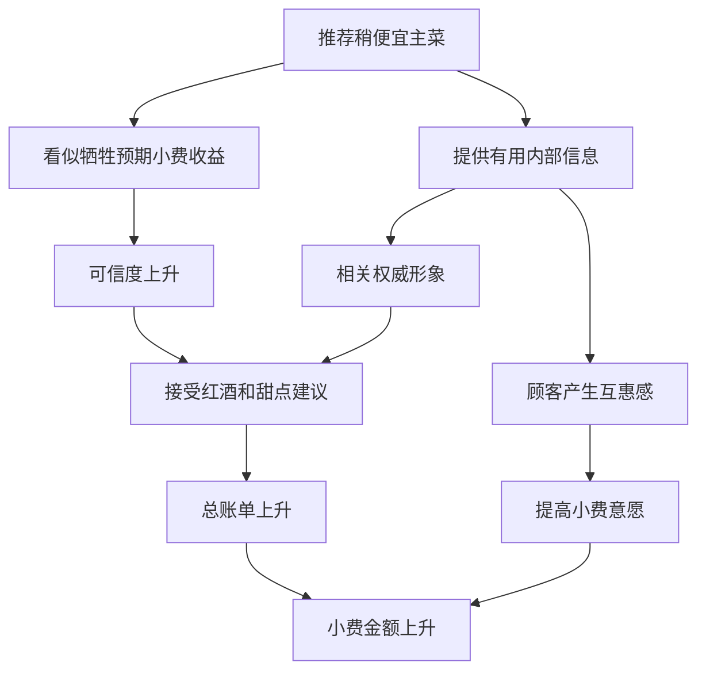

### 36.2 权威与互惠不是同一机制

- **权威**回答：“他似乎知道什么值得点。”
- **互惠**回答：“他帮了我，我愿意回报。”
- **可信度**回答：“他似乎没有只顾自己利益。”
- **喜好**也可能因热情和个性化服务参与。

同一行为能同时启动多条影响路径。

### 36.3 为什么先便宜后昂贵

若一开始直接推荐贵酒，顾客会警惕加价动机。先作一个可见的小让步，改变顾客对后续建议来源的解释：贵酒不再只是推销，而像可信专家的搭配意见。

### 36.4 关键事实仍需核实

原书没有独立核查文森特所说“今晚这道菜不太好”每次是否真实。即使菜的判断真实，也不能自动证明昂贵酒是最佳性价比选择。

### 36.5 顾客的实用防御

- 在听推荐前确定预算；
- 询问价格和替代品；
- 区分“搭配好”与“必须选更贵”；
- 检查主菜让利是否被酒水和甜点抵消；
- 按实际服务决定小费，不因内疚追加消费。

### 36.6 正当服务的标准

如果服务员如实披露当晚质量、尊重预算，并给出不同价位选择，相关专业能改善体验。问题不在推荐本身，而在利用假牺牲掩盖后续经济目标。

---

## 37. 二手车读者报告：先把价格抬高，再一轮轮降 200 美元

### 37.1 初始情境

一名年轻商人买了新车，准备出售旧车。他看到二手车行招牌写着“我们能帮你把车卖得更贵些”，便进店咨询。

### 37.2 第一个价格

读者希望旧车卖 3 000 美元。店主却说至少值 3 500 美元，建议提高要价。

在寄卖模式下，车主到手价格越高，车行从最终售价中保留的空间似乎越小。建议 3 500 美元看起来是在主动让出自身利益。

### 37.3 信任建立

读者因此相信车行真心站在自己一边，把车留下并定价 3 500 美元。这个信任不是来自独立估价或合同，而来自“对方提出了更有利于我的价格”。

### 37.4 第一次降价

几天后，车行称有买家感兴趣，只觉得价格略高，请读者降 200 美元。读者同意。第二天，车行又说买家资金困难，交易失败。

### 37.5 后两次降价

接下来两周，车行又打来两次电话，每次都以潜在买家为由要求再降 200 美元。读者因为仍信任车行，两次都同意，但交易每次都落空。

### 37.6 价格路径

按原书叙述进行笔记计算：

| 阶段 | 车主接受的价格 |
| --- | ---: |
| 店主建议的初始挂牌 | 3 500 美元 |
| 第一次降低 200 | 3 300 美元 |
| 第二次降低 200 | 3 100 美元 |
| 第三次降低 200 | 2 900 美元 |

这些中间总价是按三次已同意的 200 美元降幅推得，原书没有逐项列成表格。

### 37.7 朋友揭示模式

读者起疑后询问一位有家人在车行工作的朋友。朋友说这是常见套路：先让卖家信任车行，再不断压低车主所得价格，以便车行最终保留更大利润。

### 37.8 取回车辆与第四次请求

读者前往车行取车。离开时，车行仍劝他留下，并声称只要再降 200 美元，就有一名“很有希望的顾客”。若接受，价格将从 2 900 美元降至 2 700 美元；这是笔记按原书金额推导的结果。

### 37.9 证据类型

这是读者报告与作者点评，不是对二手车行业的代表性抽样。它用于展示一套可识别的影响结构，不能证明所有寄卖车行都使用该骗局。

---

## 38. 作者点评：对比原理与“首要利益”形象怎样互相增强

### 38.1 3 500 美元成为参照点

一旦初始价格确定为 3 500 美元，每次 200 美元只占约 $200/3500\approx5.7\%$，单次看起来不大。

### 38.2 局部小降掩盖累计变化

三次已接受降价累计 600 美元：

$$
600/3500\approx17.1\%.
$$

若再接受第四次，总降幅 800 美元，约为：

$$
800/3500\approx22.9\%.
$$

百分比是笔记按原书金额计算，用来展示局部变化与累计变化的区别。

### 38.3 “首要利益原理”的语境

作者点评把案例概括为对比原理与“首要利益原理”结合。就本段上下文而言，后者指车行先表现得把车主利益放在首位，从而建立可信权威形象；它不是本书另设的一章独立影响力武器。

### 38.4 两条路径如何配合

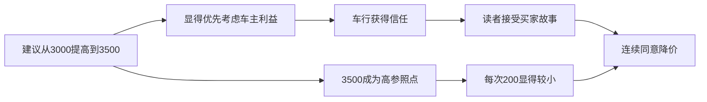

### 38.5 防御

- 先取得独立市场估价；
- 写清车主最低净得价和车行佣金；
- 要求潜在报价可验证；
- 记录累计降幅，不只看单次变化；
- 不因首次建议有利就永久授予信任；
- 每次新请求都重新检查利益关系。

### 38.6 原章正文的收束

从米尔格拉姆到二手车，作者逐步把“权威”从强制命令扩展到可信建议。危险不只发生在上级说“必须做”时，也发生在一个看似懂行、诚实、站在你一边的人说“最好这样做”时。

---

## 39. 核心概念辨析：围绕“权威”最容易混淆的十二组概念

### 39.1 权威与权力

**权威**依赖被承认的资格或正当性；**权力**是改变他人处境的能力。法官兼具法定权威和制裁权力，优秀学者可能有学术权威却不能强迫公众服从。

### 39.2 权威与专业知识

权威是社会关系中的认可，专业知识是对特定领域的掌握。制度职位可能授予决策权，却不能保证任职者对每个技术细节都最懂。

### 39.3 身份合法与命令合法

真正警察也可能提出超越权限的要求；真正老板也可能要求违法操作。验证身份只是第一步，具体命令仍需独立检查。

### 39.4 资格真实与主题相关

罗伯特·扬确实是成功演员，但这个真实资格与健康建议不相关。真实头衔若跨领域使用，仍会制造伪权威效果。

### 39.5 能力与可信度

能力回答“他知不知道”，可信度回答“他有没有如实告诉我”。专家可能受佣金、组织压力或声誉保护影响而选择性披露。

### 39.6 服从与说服

**服从**通常包含角色等级和命令感；**说服**通过理由、信息或情感改变判断。文森特更像可信建议者，米尔格拉姆研究员更像命令权威，两者都可借权威原理提高顺从。

### 39.7 尊重与取消判断

尊重专家意味着认真听取并给予其证据较高权重，不意味着把自己的核查权、拒绝权和责任全部交出。

### 39.8 授权与责任转移

组织可以授权某人决策，却不能让每个执行者完全免除发现明显危险时的停止义务。授权解决“谁作决定”，不自动解决“错误后谁负责”。

### 39.9 权威符号与权威证据

白大褂、制服、头衔和豪车是线索；执业注册、正式授权、相关业绩和可复核论证才是较强证据。线索应触发验证，不应直接触发服从。

### 39.10 专家意见与事实

专家能更好地解释证据，但其陈述仍可能是数据、模型、推断或价值选择。要问结论依据、置信程度和替代解释，而非把“专家说”当成事实定义。

### 39.11 合法命令与道德正确

法律、组织规则和道德可能重合，也可能冲突。米尔格拉姆实验的冲击就在于，程序中的“职责”能压过参与者对伤害的判断。

### 39.12 解释服从与为服从免责

权威压力解释人为何难以拒绝，有助于设计制度防护；它不把所有后果归零，也不把“只是执行命令”变成通用免责理由。

---

## 40. 权威原理与其他影响力武器的关系

### 40.1 与社会认同

| 权威 | 社会认同 |
| --- | --- |
| 因为有资格或地位的人这样说而行动 | 因为许多人或相似者这样做而行动 |
| “医生建议如此” | “大多数患者都这样选” |

广告可以同时展示专家和销量，让两条捷径叠加。

### 40.2 与喜好

喜好来自亲近、外表、相似或合作；权威来自专业或地位。一个人可以讨喜但不懂，也可以专业却不讨喜。罗伯特·扬广告同时借熟悉人物与医生角色。

### 40.3 与互惠

文森特先提供“内部建议”，顾客既把他当相关权威，也觉得欠了帮助。权威提高建议可信度，互惠提高回报意愿。

### 40.4 与承诺和一致

米尔格拉姆程序每次只加 15 伏。服从第一步后，人可能为保持“完成实验”的角色一致性继续；权威命令与渐进承诺互相增强。

### 40.5 与对比原理

好警察因坏警察显得温和；二手车每次降 200 美元因 3 500 美元参照显得较小。权威或可信形象能让人接受比较框架，对比再改变具体数值感受。

### 40.6 与关联原理

演员与医生角色的长期关联，让医生权威迁移到演员；豪车与成功地位的关联，让车主获得额外尊重。关联解释符号如何获得情感和意义，权威解释符号为何提高服从。

### 40.7 多机制组合为何更难察觉

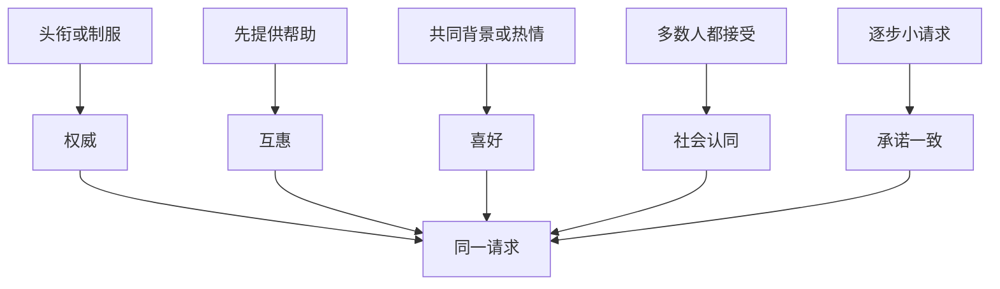

现实中不应执着于给每个行为只贴一个标签，应检查多条路径如何共同把审查成本推高。

---

## 41. 作者如何分析问题：从反直觉结果到可执行防御

### 41.1 先让读者进入受害者视角

作者用“学生”的恐惧建立道德基线，避免读者只把电压当作实验数字。

### 41.2 再揭示真正受试者

叙事翻转后，读者发现研究对象不是疼痛承受，而是普通“老师”怎样执行伤害。这一步把问题从记忆研究改写为服从研究。

### 41.3 用真实行为挑战自我想象

同事、学生和精神科医生预测极低，真实服从却约为三分之二。预测落差证明仅靠“我觉得自己会怎样”无法理解权威。

### 41.4 排除最方便的人格解释

女性实验、心脏病版本和人格资料依次削弱“男性攻击”“不知道危险”“都是虐待狂”等解释。

### 41.5 用变式而非口号定位机制

改变谁下令、谁受电击，以及是否存在权威冲突。行为随权威结构改变，为因果解释提供比单次结果更强的支持。

### 41.6 解释机制为何会存在

作者不把服从简单视为缺陷，而从社会协调、知识和奖惩说明它通常有效。这样才能解释为何人会形成强烈默认反应。

### 41.7 从真实权威推进到权威符号

医疗层级展示正统权威的风险；桑卡广告、头衔、制服和豪车进一步证明，自动反应甚至不要求真实权威。

### 41.8 用预测落差贯穿全章

米尔格拉姆、护士、制服和豪车研究都出现低估。作者借重复模式说明：危险不仅是受影响，还包括不知道自己受影响。

### 41.9 用两个问题压缩防御成本

权威通常有用，不能每次全面拒绝。作者将防御压缩为资格/相关性和真实性/利益两问，再用文森特证明第二问也可能被策略性操纵。

---

## 42. 本章问题的难点，以及解决思路如何形成

### 42.1 难点一：结果与人格直觉冲突

人倾向把伤害行为归因于坏人格。解决办法是招募普通样本、观察其痛苦，并改变性别和风险信息，展示人格解释不足。

### 42.2 难点二：权威通常确实有用

若把结论写成“不要相信权威”，既不现实也不正确。作者先解释权威的社会功能，再寻找有条件使用捷径的方法。

### 42.3 难点三：真正变量藏在角色里

实验同时有大学、白大褂、程序、电压和受害者。作者依赖角色互换与冲突命令，让“谁有权发令”成为可辨别变量。

### 42.4 难点四：符号与本质高度相关但并不等同

头衔和制服平时确实提供有用信息，完全忽略也不理性。解决思路是把符号降为验证起点，而非结论。

### 42.5 难点五：真专家也可能不诚实

只验资质仍会落入利益冲突。作者因此增加第二问，并专门分析“主动承认小缺点”如何伪造公正感。

### 42.6 难点六：当事人低估自己

事后教育若只说“下次聪明一点”作用有限。解决办法是事前设置暂停、复核、回拨、剂量拦截等制度，不把防护押在临场勇气上。

### 42.7 形成的最终方法

---

## 43. 证据结构：不同材料分别能支持什么

### 43.1 证据地图

| 证据类型 | 代表材料 | 主要支持 | 主要局限 |
| --- | --- | --- | --- |
| 控制实验与变式 | 米尔格拉姆基本实验、角色互换、权威冲突 | 命令来源和权威结构显著影响服从 | 欺骗与伦理争议，实验室不等于全部现实 |
| 后续比较 | 女性“老师”、心脏病版本 | 性别与危险无知不足以解释结果 | 仍处于相似实验框架 |
| 跨国与年代重复 | 多国基本程序、后来的仿效研究 | 现象不限于最初美国样本 | 原书未逐项给样本和效应量 |
| 课堂控制比较 | 身份头衔与身高估计、纸牌大小 | 地位和重要性可改变知觉 | 简化任务，数值有转述与换算问题 |
| 医院现场实验 | 22 个护士站电话命令 | “医生”头衔可压过多项安全警讯 | 观察到准备给药，不是实际伤害率 |
| 街头现场实验 | 制服请求、西装闯红灯 | 衣着可提高现实服从和跟随 | 特定时代、地点与文化 |
| 交通现场比较 | 豪车与经济车堵路 | 身份标志改变宽容和鸣笛行为 | 具体环境变量可能参与 |
| 真实事件与案例 | 布莱恩·威尔逊、肛门耳痛 | 展示制度命令和医疗盲从的现实形态 | 个案不能估计普遍性或单独证明因果 |
| 广告案例 | 罗伯特·扬与桑卡 | 权威角色可被商业借用 | 销售成功还可能有熟悉、广告频次等因素 |
| 作者参与式观察 | 文森特餐厅 | 多种影响策略怎样组合部署 | 单一餐厅，未做控制与独立核实 |
| 读者报告 | 二手车寄卖 | 假装优先客户利益与逐步降价的结构 | 自述，不能代表整个行业 |

### 43.2 最强的机制证据

米尔格拉姆角色变式和权威冲突最具辨别力，因为它们有针对性地改变命令来源；护士电话实验则把真实权威证据降到只剩自称头衔，检验符号效果。

### 43.3 现场证据的价值

制服、西装和豪车研究把行为从实验室问卷带到街头交通，说明影响不只存在于语言态度。代价是现实环境更难完全控制。

### 43.4 案例的价值与限制

案例适合展示机制怎样嵌入具体流程，并帮助识别风险信号；它不能给出发生率，也不能排除未记录的替代解释。

### 43.5 自我报告为何只能作辅助

人反复低估自己会服从。预测和访谈有助于研究元认知偏差，但不能替代行为观察。

### 43.6 数字阅读原则

每个百分比必须带上：谁、在哪个条件、做到了哪一步、分母是什么。特别注意：

- 三分之二对应基本米尔格拉姆情境；
- 65% 对应原书的心脏病版本；
- 95% 是护士准备执行；
- 2% 是另一访谈样本的自我预测；
- 92% 与 42% 是制服和便服条件；
- 90% 是作者注中的历史选举相关描述。

---

## 44. 适用范围与局限：哪些结论不能无限外推

### 44.1 服从比例不是人性常数

距离、机构声望、同伴异议、命令一致性、受害者可见性和退出程序都会改变结果。不能把 65% 或三分之二套到任意组织。

### 44.2 权威不是唯一机制

渐进承诺、责任转移、制度认同、礼貌规范和对实验目的的理解都可能参与。原书以权威为主轴，不等于其余因素为零。

### 44.3 实验室伤害与真实伤害不同

受试者相信电击真实，但实验最终没有让“学生”承受电流。历史暴行和真实组织事故包含长期意识形态、群体关系、职业风险与实际后果，不能与实验一一等同。

### 44.4 经典研究存在伦理争议

欺骗、巨大压力、退出是否足够自由，都是现代研究伦理必须严肃处理的问题。研究发现重要，不会自动使方法正当。

### 44.5 历史和文化边界

制服、教授、医生、豪车和性别角色的含义会随社会与年代变化。底层符号反应可能持续，具体线索和比例需要重新测量。

### 44.6 旧统计不能冒充当前事实

用药失误、总统身高和广告效果均来自原书所处年代或更早研究。笔记保留其论证功能，不把它们标成 2026 年实时统计。

### 44.7 相关性不能当因果

较高候选人更常胜选，可能与提名、媒体、知名度等因素共同相关；作者的课堂身份操纵比选举统计更能说明地位影响知觉，但不能证明身高决定政治成功。

### 44.8 规范问题不能只靠心理实验回答

实验能说明人何时服从，不能单独决定法律上的命令是否有效、何种不服从正当、责任怎样分配。这些还需要法律、伦理和制度分析。

---

## 45. 个人层面的权威审查算法

以下算法是以原书“两问防御”为核心，并结合前文案例整理出的笔记扩展，不是原书逐项给出的十一阶段程序。

### 45.1 第一步：识别触发器

注意头衔、制服、机构名称、豪华外观、专业术语、命令语气和“内部消息”。它们不是罪证，只是提醒进入审查模式。

### 45.2 第二步：判断风险等级

| 风险 | 示例 | 审查强度 |
| --- | --- | --- |
| 低 | 一般餐饮推荐 | 快速问价格和偏好即可 |
| 中 | 购买、订阅、投资建议 | 核验身份、利益和替代方案 |
| 高 | 医疗、法律、资金转移、安全操作 | 暂停、独立验证、第二意见和书面记录 |

### 45.3 第三步：验证身份

使用独立官方渠道核对姓名、机构、职位、执业编号和联系信息。不用对方发来的链接或号码完成唯一验证。

### 45.4 第四步：检查主题相关性

把主张写成一句具体问题，再问该资格是否覆盖这个问题。不要让一般声望扩散到无关领域。

### 45.5 第五步：索取依据

要求数据、规则、诊断逻辑、合同条款或可复核来源。真正紧急时可先执行低风险、可逆措施，再补核查。

### 45.6 第六步：检查利益和激励

列出对方从你服从中获得的金钱、权力、声誉和责任减免。利益冲突提高证据要求，不自动判假。

### 45.7 第七步：识别“承认小缺点”

问主动披露的缺点是否重要、是否可验证，以及后续收益是否远大于这点让利。

### 45.8 第八步：检查合法性和安全性

即使身份、专业和诚信都通过，也要问具体指令是否符合权限、法律、伦理和安全上限。

### 45.9 第九步：寻找独立复核

找不受同一利益影响的第二专家、同事、药剂师、官方客服或书面标准。权威之间若意见冲突，不要只按头衔高低，比较依据。

### 45.10 第十步：恢复替代方案

列出“暂不决定”“采取可逆步骤”“换供应商”“取得第二意见”等选择。伪权威常把服从包装成唯一选项。

### 45.11 第十一步：明确决定与责任

记录自己为什么遵循或拒绝。不能只写“领导要求”，应写事实依据、风险评估和复核结果。

### 45.12 完整流程

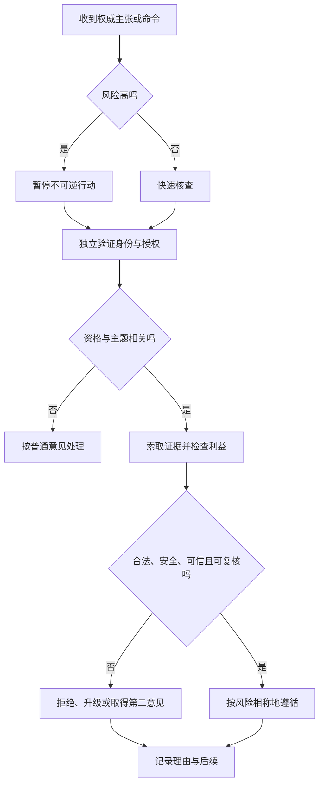

---

## 46. 制度层面的防护：不要把拒绝危险命令押在个人勇气上

本节是把本章实验和案例迁移到组织设计后的笔记建议，不是西奥迪尼在本章明确列出的制度方案。

### 46.1 明确停止权

任何接近危险的人都应能暂停流程，不因职级低而受惩罚。停止只是触发复核，不等于最终否决。

### 46.2 强制独立核查

高风险药物、资金转移、生产发布和安全操作可要求两人核对。第二人必须真正独立，不能只机械签字。

### 46.3 把异议写进流程

会议在批准前固定询问反对理由、替代方案和最坏情形；指定“反方角色”可削弱权威一致性造成的自动执行。

### 46.4 让命令可追溯

口头指令回读并记录，关键决定写明授权者、依据、范围和时间。匿名电话头衔不能直接越过系统控制。

### 46.5 用技术拦截明显错误

- 超剂量报警；
- 禁用危险缩写；
- 权限最小化；
- 高风险操作多因素确认；
- 不可逆操作延时和撤销窗口。

### 46.6 保护提出坏消息的人

如果挑战权威会损害晋升和声誉，制度会筛除真实信息。匿名渠道、反报复政策和独立调查能降低异议成本。

### 46.7 领导主动降低地位压力

领导应先听一线意见、最后发言，公开承认不确定性，并奖励纠错。仅口头说“欢迎挑战”却惩罚反对，不会改变行为。

### 46.8 系统防护链

---

## 47. 现代场景中的应用

以下内容是基于本章原理的笔记迁移，不是原书逐项讨论。

### 47.1 医疗

患者可询问药名、剂量、用途和替代方案；医护人员用回读、药剂师复核和第二意见保护患者。提问不等于不尊重医生。

### 47.2 软件与工程

高级工程师或管理者要求跳过测试、关闭告警时，应依据变更风险和发布规则，而非职级。高风险系统设置独立审批和回滚方案。

### 47.3 企业管理

“老板已经决定”不能替代客户证据和合规审查。决策记录应区分负责人拥有最终选择权，与技术事实由谁提供最佳证据。

### 47.4 金融与电信诈骗

自称银行、警方、税务或平台客服并要求转账、共享验证码时，立即挂断，通过官方渠道回拨。制服、工牌照片和来电显示都可伪造。

### 47.5 网络健康与投资内容

粉丝数、认证标志、豪华生活方式和“博士”称号不等于相关资格。检查发证机构、专业范围、原始证据和赞助关系。

### 47.6 生成式人工智能

流畅语气、引用格式和自信表达会制造类似权威感。模型不是因“说得像专家”就自动具备最新事实或专业责任；高风险输出必须核对原始来源和真实专业人员。

### 47.7 教育

教师可以保留课堂责任，同时鼓励学生要求依据、指出错误和比较解释。权威最好的用途是帮助学生形成判断，而不是让质疑消失。

### 47.8 紧急场景

火灾、急救和疏散需要快速服从已验证现场指挥。防御不应导致危险拖延；制度应提前让身份标志清晰、指令简短、权限明确，并在事后复核。

---

## 48. 正当使用权威原理的伦理原则

以下原则是依据本章机制与案例作出的规范性笔记整理；原书的明确防御重点仍是核查专家的资格、相关性、真实性和利益关系。

### 48.1 只声称真实资格

不用模糊头衔、白大褂或租来的豪华外观暗示不存在的专业能力。

### 48.2 明确专业范围

专家主动说明“我在哪些方面有资格、哪些方面需要另一位专家”，比全能姿态更可靠。

### 48.3 给出依据和不确定性

解释结论如何得到、证据强弱、适用前提和可能错误，不要求仅凭身份接受。

### 48.4 披露利益关系

佣金、赞助、绩效目标、组织立场和潜在收益应在建议前说明。

### 48.5 不把小让利伪装成全面公正

可以真诚指出产品缺点，但不能用无关小缺点掩盖关键风险，也不能虚构“牺牲自身利益”。

### 48.6 保留拒绝和复核空间

重大决定允许提问、第二意见和冷静期，不把核查描述为冒犯或不忠。

### 48.7 承担命令后果

权威不能只拥有下令权，把风险和责任完全下放给执行者。授权、资源和问责应匹配。

### 48.8 把异议当作系统资源

真正稳健的权威不靠压制挑战证明地位，而靠经得住证据审查提高决策质量。

---

## 49. 常见误区与容易犯的推理错误

### 49.1 误区一：本章证明所有权威都不可信

作者明确认为权威大多提供有价值的专家捷径。问题是自动、无条件和与主题无关的服从。

### 49.2 误区二：尊重专家就不能提问

要求依据、边界和第二意见是负责任地使用专业，不是拒绝专业。

### 49.3 误区三：真正专家说的每句话都属于其专业

专业高度领域化。真实资格不能跨领域无限扩张。

### 49.4 误区四：身份真实就表示命令合法

真实机构人员也可能越权、出错或被冒用账户。具体请求必须另验。

### 49.5 误区五：穿制服的人一定有法定权限

制服是身份线索，不是权限证明；银行核查员骗局正是利用符号组合。

### 49.6 误区六：豪车和昂贵服装证明能力

它们最多暗示消费能力或地位外观，与当前知识、诚信和合法性没有必然关系。

### 49.7 误区七：米尔格拉姆受试者都是虐待狂

他们普遍痛苦，变式也显示权威停止命令会让电击停止。实验支持情境解释，不支持简单人格标签。

### 49.8 误区八：受试者感到痛苦，所以已经抵抗

情绪抗议与行为停止不同。制度需要允许并要求在危险阈值真正暂停。

### 49.9 误区九：约三分之二是所有人的固定服从率

它属于基本实验条件。变式、场景和人群改变，结果也会改变。

### 49.10 误区十：心脏病版本证明 65% 的人总会伤害心脏病患者

它说明明确风险仍未消除实验中的服从，不是现实伤害概率。

### 49.11 误区十一：女性不会像男性那样服从

原书报告女性“老师”的总体服从可能性与男性相近，削弱性别攻击性解释。

### 49.12 误区十二：护士实验真的给患者用了双倍药

观察员在护士准备给药时阻止。95% 的结果是准备执行，不是实际用药或伤害率。

### 49.13 误区十三：95% 和 2% 是同一批护士前后矛盾

95% 来自 22 个护士站的行为实验，2% 来自另行访谈的 33 名护士和实习护士。

### 49.14 误区十四：护士实验证明护士没有专业能力

研究者的重点恰恰是专业能力被自动服从暂时关闭。解决方案是让独立专业核查真正进入流程。

### 49.15 误区十五：只要奉命行事，就没有个人责任

权威压力能解释困难，却不自动免除对明显违法、有害命令的拒绝和报告责任。

### 49.16 误区十六：有利益冲突的人说什么都是假的

利益冲突提高核查需求，不直接决定命题真假。应检查证据和替代来源。

### 49.17 误区十七：主动承认一个缺点就证明诚实

缺点可能很小、已知或被设计成优点。要检查关键风险是否披露，以及后续收益。

### 49.18 误区十八：文森特推荐便宜菜，所以没有经济动机

便宜主菜可能换来昂贵酒、甜点和更高小费。应比较完整交易，而不是单一步骤。

### 49.19 误区十九：每次只降 200 美元，损失就很小

局部变化需要累计。二手车案例中，三次已接受降价合计 600 美元。

### 49.20 误区二十：质疑权威等于逢权威必反

机械反抗与机械服从都放弃了证据。目标是有条件采纳。

### 49.21 误区二十一：两个权威意见不一时，只听头衔更高者

先比较双方相关性、数据、利益和权限。米尔格拉姆冲突变式说明权威分歧会打断自动服从，正好应恢复判断。

### 49.22 误区二十二：知道权威偏差后就能免疫

各研究最稳定的提醒之一是人低估影响。知识需要转化为回拨、复核、暂停和记录等行为设计。

---

## 50. 全章知识结构

### 50.1 知识图谱

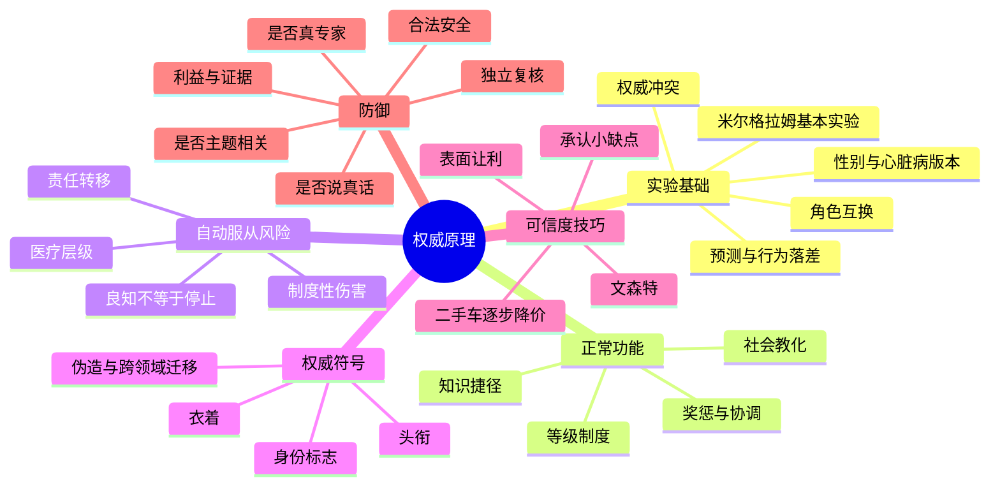

### 50.2 从输入到输出的机制

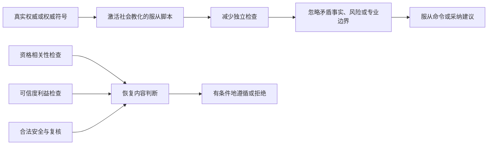

### 50.3 三个层次

1. **个人心理层**：头衔与符号触发自动反应；
2. **互动策略层**：顺从专业人士组合权威、互惠、对比和可信度；
3. **制度设计层**：等级、复核、暂停权和问责决定错误能否被阻止。

### 50.4 全章中心矛盾

权威越能高效传递专业和协调行动，社会越会训练人迅速服从；训练越成功，虚假、无关或失真的权威就越容易借用同一通道。

---

## 51. 核心结论

### 51.1 十七条原书核心结论

1. **普通人可能在正统权威命令下执行其相信会造成严重伤害的操作。** “学生”没有真的受电击，但米尔格拉姆实验把受试者自以为正在伤人的服从行为，从异常人格问题转向普通人与制度情境。
2. **服从者的痛苦不等于行为抵抗。** 很多人抗议、颤抖，却仍继续操作。
3. **人严重低估权威影响。** 专家预测、护士自我预测、制服预测和豪车预测反复失准。
4. **性别、危险无知和虐待人格不足以解释结果。** 后续比较削弱这些直觉解释。
5. **谁发命令是关键变量。** 研究员要求停止时无人继续，权威冲突时所有人停止。
6. **权威体制具有真实社会价值。** 它利用知识分工、奖惩和统一协调降低决策成本。
7. **有用捷径会在适用条件消失后继续运行。** 人可能保留服从，却不再检查资格、相关性和内容。
8. **医疗层级既保护患者，也可能放大单点错误。** 团队专业必须通过独立核查共同发挥作用。
9. **真正权威不是自动服从的必要条件。** 头衔、制服和地位标志已足以触发反应。
10. **头衔会改变行为，甚至改变知觉。** 教授标签增加恭顺，也会提高身高估计。
11. **制服能在请求者离场后继续影响行为。** 比克曼实验显示符号作用不只是面对面压力。
12. **一般地位不等于当前领域的专业。** 西装和豪车不能提供交通判断资格。
13. **第一项防御是核查真实资格与主题相关性。** 真实专家也有明确边界。
14. **第二项防御是核查真实性和利益。** 能力不保证诚实，利益冲突也不自动证明虚假。
15. **承认小缺点可能是可信度策略。** 表面让利应放入完整交易计算。
16. **多种影响原理会叠加。** 原书明确总结文森特结合了互惠、可信权威和看似有违自身利益的说辞；其他可能路径属于笔记分析。
17. **小幅逐步变化会隐藏累计损失。** 二手车案例把高参照点、信任和连续降价结合。

### 51.2 一条笔记延伸结论

**高风险场景的防御不应只靠个人临场勇气。** 结合本章实验作制度迁移，可用暂停权、独立复核、技术拦截和反报复机制把判断嵌入流程；这是笔记扩展，不是原书直接列出的第三项防御原则。

### 51.3 一句话压缩

> 尊重真正、相关、可信的专家，但不要把头衔、地位或服从习惯当作具体主张正确的替代证据。

### 51.4 最终理解

权威本身不是“坏影响力”，而是高价值、高风险的社会接口。它把他人的知识迅速接入我们的行动，也可能让错误、私利和伪装绕过审查。成熟的服从不是取消判断，而是在验证资格、相关性、诚信、证据和安全之后，明白自己为什么愿意遵循。

---

## 52. 笔记归纳：本章叙述与所引研究形成的一般方法

### 52.1 十步方法链

1. 用具体极端情境暴露常识无法解释的现象；
2. 比较真实行为与事前预测，确认直觉偏差；
3. 列出最常见的替代解释；
4. 引用米尔格拉姆的实验变式逐项削弱替代解释；
5. 找出随条件变化而改变行为的关键变量；
6. 解释该心理机制在正常环境中的适应价值；
7. 研究捷径怎样被外部符号和专业操作者劫持；
8. 用实验、现场案例和观察跨场景检验；
9. 提炼低成本、可记忆的防御问题；
10. 用复杂真实案例检验防御是否还会被绕过。

### 52.2 可迁移的方法图

### 52.3 对其他问题的启示

研究一种“非理性”行为时，不要止于责怪个体：先找它通常解决什么问题，再找环境何时改变而规则没有更新；随后用能区分竞争解释的比较，而不是只收集支持故事；最后把结论转成个人与制度都能执行的防护。

---

## 53. 快速复习清单

### 53.1 三类权威来源

1. 真实角色与制度授权；
2. 相关专业知识；
3. 头衔、衣着和身份标志等外部符号。

三者可能重合，也可能完全分离。

### 53.2 两个原书核心问题

1. 这个权威是真正的、与当前主题相关的专家吗？
2. 即使他是专家，在当前利益结构下说的是真话吗？

### 53.3 高风险场景再加三问

1. 依据能否独立复核？
2. 具体命令是否合法且安全？
3. 我能否暂停、取得第二意见或选择可逆方案？

### 53.4 最短行动口诀

> 先验身份，再看相关；再查利益，最后核证；高风险命令必须能暂停、能复核、能追责。
