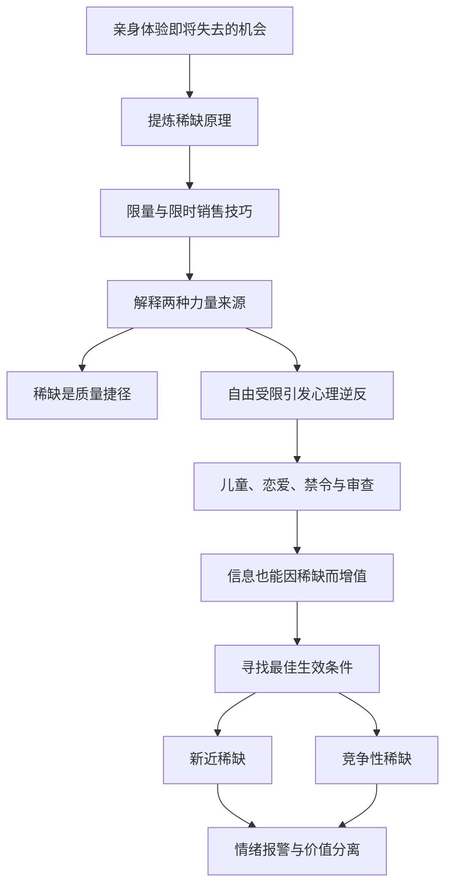
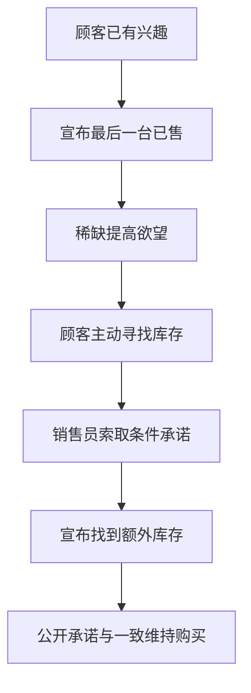
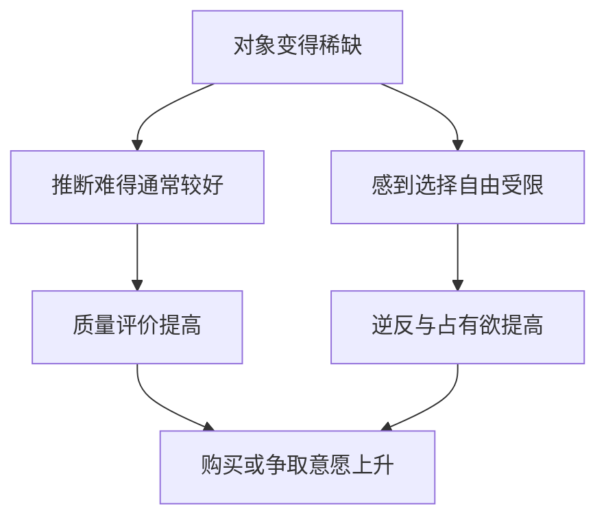
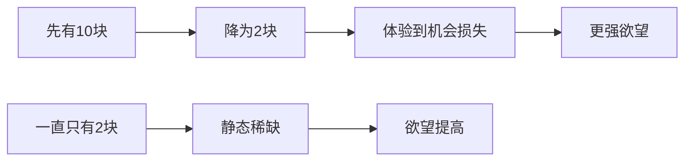
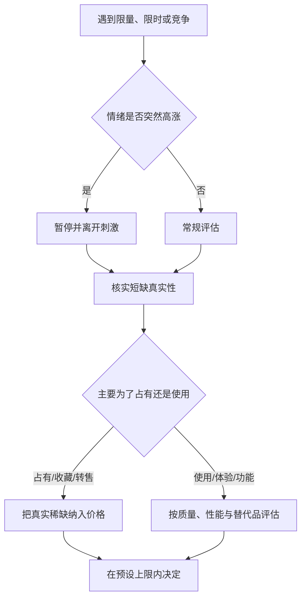
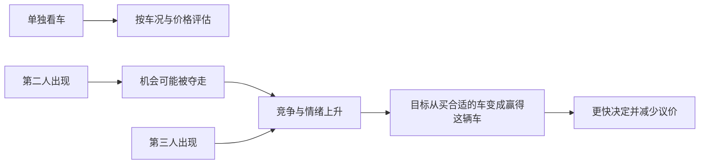
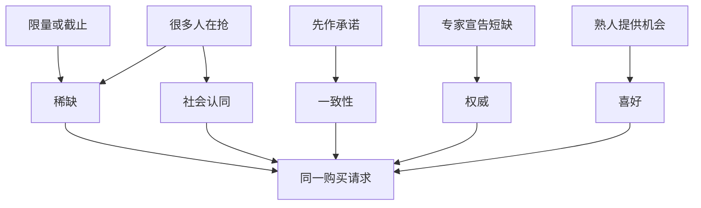
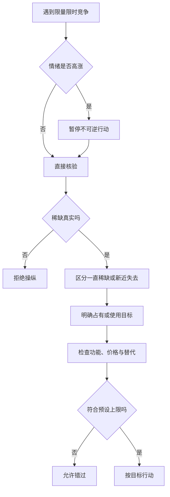
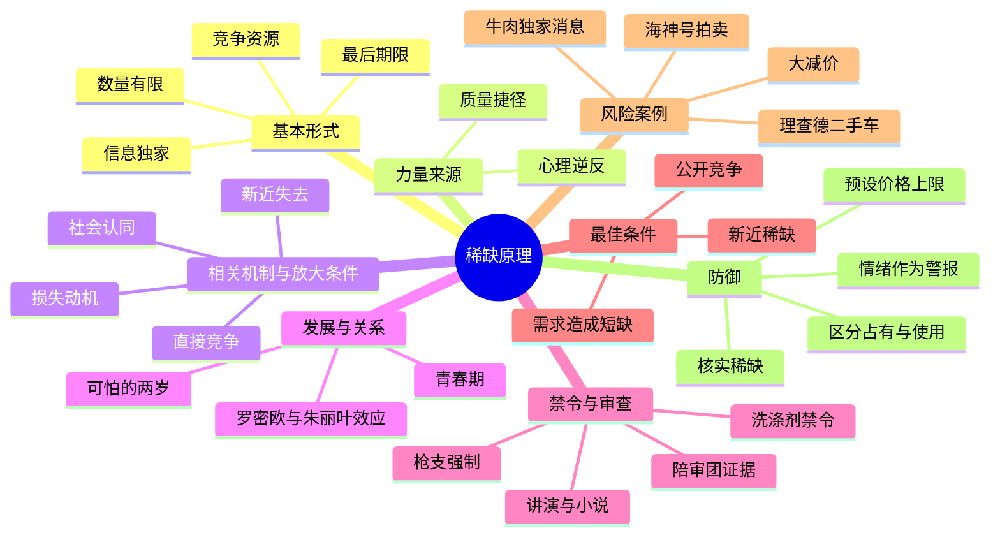
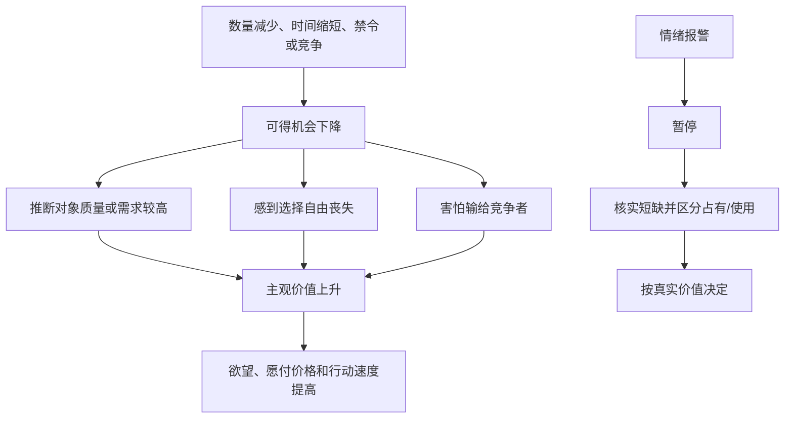

> **书名**：《影响力（珍藏版）》
> **作者**：罗伯特·B. 西奥迪尼（Robert B. Cialdini）
> **阅读范围**：第7章“稀缺：数量少的说了算”
> **原文章节顺序**：梅萨摩门教堂 → “物以稀为贵” → 限量与最后期限 → “逆反心理” → 两岁与青春期 → 禁令和信息审查 → 独家牛肉消息 → “最佳条件” → 新近稀缺与政治动荡 → 竞争性稀缺 → 海神号拍卖 → “如何拒绝” → 理查德二手车 → 读者报告
> **阅读目标**：理解数量、时间、自由和竞争为什么会改变主观价值；区分稀缺提供的真实信息与稀缺诱发的情绪放大；掌握在限量、限时、审查、拍卖和人际干涉中恢复独立判断的方法。

---

## 0. 导读：第七章要解决的核心问题

### 0.1 章名中的判断捷径

“数量少的说了算”概括了一条常见经验规则：机会越少、东西越难获得，人越容易认为它宝贵，并更快采取行动。

这条规则经常有效，因为真正稀有的资源可能生产困难、需求旺盛或无法替代；但它也可能被人为制造，令“难得到”取代“是否值得”。

### 0.2 切斯特顿题词

章首引用 G. K. 切斯特顿：

> 不管是什么东西，只要你晓得会失去它，自然就会爱上它了。

题词把本章重点从静态的“数量很少”推进到动态的“即将失去”。后来饼干实验会进一步说明，新近失去的机会比从来没有的机会更能激起欲望。

### 0.3 本章的三个核心问题

1. 稀缺为什么能提高价值判断？
2. 哪些条件会把稀缺效应放大到最强？
3. 怎样保留稀缺所含的真实信息，又不让占有欲替代使用价值？

### 0.4 原书论证路线

### 0.5 四种不同的“价值”

| 价值 | 含义 | 例子 |
| --- | --- | --- |
| 使用价值 | 使用时能带来什么功能 | 饼干口味、汽车性能 |
| 占有价值 | 拥有本身带来的满足 | 收藏、身份、控制感 |
| 交换价值 | 转售或资源配置中的价格 | 稀有邮票、限量商品 |
| 自由价值 | 保有选择权本身的意义 | 能否阅读、购买、恋爱 |

稀缺可能真实提高交换价值和占有价值，却不必提高使用价值。心理逆反还会把失去选择自由的痛苦附加到对象上。

### 0.6 证据阅读边界

本章同时使用个人经历、控制实验、现场销售观察、历史统计、政策案例、作者家庭案例和读者报告。笔记会分别标明证据类型，不用单个轶事推断普遍发生率，也不把笔记模型写成原书公式。

---

## 1. 梅萨摩门教堂：本来不感兴趣的东西为何突然迷人

### 1.1 场景

亚利桑那州梅萨市属于凤凰城地区，摩门教徒人数很多，仅次于盐湖城。市中心有一座宏伟的摩门教堂。

作者过去只从远处看过建筑，对摩门教、宗教建筑和进入教堂都没有特别兴趣。

### 1.2 特别暗室

作者从报纸得知，摩门教堂内有一处暗室，平时只有虔诚信徒可以进入，连准备皈依的人也不能参观。

### 1.3 短暂开放窗口

教堂新建后会在最初几天向公众开放全部区域。梅萨教堂刚翻修，而教会把翻修视同“新建”，因此非摩门教徒也能在未来几天进入暗室；窗口结束后，机会就消失。

### 1.4 兴趣为何突然发生

作者立刻决定参观，并打电话邀请朋友。朋友问他为何如此急切，他才意识到：

- 自己没有宗教问题要寻找答案；
- 并不喜欢参观宗教建筑；
- 不期待那里比其他教堂更精彩；
- 唯一的新信息是“现在不看，以后看不到”。

### 1.5 自我觉察打断了反应

在向朋友解释时，作者识别出欲望来源，随后放弃参观。这为全章防御方法预演了一次：不是证明暗室没有价值，而是区分原有兴趣与因即将失去而突然增加的兴趣。

### 1.6 因果链

### 1.7 案例能说明什么

这是作者的自我观察，能提出问题并直观展示机制，不能单独证明普遍规律。后面的实验和现场研究才提供更系统的支持。

---

## 2. 稀缺原理：机会越少，主观价值似乎越高

### 2.1 基本定义

**稀缺原理（scarcity principle）**指：当某种商品、机会或信息数量有限、获取时间缩短，或可得性下降时，人往往提高对它的评价，并增强立即获取的意愿。

### 2.2 它解决了什么日常问题

人无法全面评估每件物品的生产成本、质量、需求和未来供应。可得性提供一个快速线索：难得到的东西有时确实更优、更受欢迎或更难复制。

### 2.3 一个解释性笔记模型

设 $V_u$ 为使用价值，$V_o$ 为占有价值，$V_f$ 为保住选择自由带来的价值，$V_c$ 为竞争唤起的额外欲望，则主观价值可方向性表示为：

$$
V_{subjective}=V_u+V_o+V_f+V_c.
$$

稀缺刺激可能主要提高后三项，并不自动提高 $V_u$。这不是原书公式，也不是可以直接估计的加法模型，只用于展示价值来源可能不同。

### 2.4 客观稀缺与感知稀缺

| 类型 | 例子 | 判断重点 |
| --- | --- | --- |
| 客观稀缺 | 停产零件、唯一原稿 | 数量是否可验证 |
| 人为稀缺 | 故意限量、排他发行 | 限制是否有正当成本 |
| 虚假稀缺 | 捏造“最后一件” | 是否能独立核实 |
| 时间稀缺 | 截止日期、开放窗口 | 截止是否真实且必要 |
| 信息稀缺 | 独家消息、受禁内容 | 稀缺是否提高真实性 |

### 2.5 稀缺不等于高质量

稀缺有时与质量相关，有时只意味着供应少、生产失败或人为限制。判断必须从“它难得到”再走一步，检查“为什么难得到”。

---

## 3. 电话铃：正在消失的机会为何抢走注意力

### 3.1 面对面交谈与未知来电

作者常会中断一场有趣、重要的面对面交谈，去接一通未知来电。现实中，许多电话并不重要，眼前客人的信息价值反而更高。

### 3.2 来电的特殊优势

眼前的人不会在下一秒消失，电话却可能因未接而失去。铃声每响一次，接通机会似乎就减少一分。

### 3.3 紧迫性不等于重要性

### 3.4 笔记扩展：现代对应

倒计时通知、阅后即焚消息、限时直播和弹窗也会用“现在不处理就失去”夺取注意力。是否及时回应，应按真实后果而非界面紧迫感决定。

### 3.5 防御问题

> 如果这个机会不会在下一分钟消失，我还会认为它比当前任务重要吗？

这个反事实问题能把“内容价值”和“消失速度”分开。

---

## 4. 损失为何比同等获得更能推动行动

### 4.1 原书的方向性结论

对失去某物的恐惧，往往比获得同一事物的愿望更能推动行动。大学生想象恋爱关系或考试中的损失时，情绪波动比想象相应获得时更强。

### 4.2 风险与不确定性

原书特别指出，在风险和不确定条件下，潜在损失威胁会强烈影响决策。因为未来结果难以判断，人更不愿让现有机会从手中消失。

### 4.3 与“损失厌恶”的关系

行为决策研究常用**损失厌恶（loss aversion）**描述同等数量的损失比收益带来更大心理权重。本章没有建立完整的前景理论模型，而是把“害怕失去”作为稀缺原理的一项现实表现。

二者相关但不完全等同：

- 损失厌恶比较收益与损失的心理权重；
- 稀缺原理关注可得机会减少怎样提高价值和行动意愿；
- 心理逆反关注自由受限如何激起反抗。

### 4.4 不能推出什么

损失框架更有推动力，不代表它提供的信息更准确，也不代表任何决策都应优先避免损失。过度避损可能让人持有失败项目、追高稀缺商品或接受不合理条件。

---

## 5. 健康传播：什么时候强调“不做会失去什么”

### 5.1 研究者与问题

健康研究人员亚历山大·罗斯曼（Alexander Rothman）和彼得·沙洛维（Peter Salovey）把损失框架用于医疗检查宣传。

### 5.2 检查行为的特殊性

乳房肿瘤 X 光检查、艾滋病毒筛查和癌症自检用于发现疾病。检查可能带来坏消息，发现后也不保证完全可治，因此人可能回避。

### 5.3 原书案例

鼓励年轻女性进行乳腺癌自检的小册子，如果强调“不检查可能失去什么”，比强调“检查能获得什么”更有效。

### 5.4 管理决策与大脑研究

紧接健康宣传案例，原书又概括两类材料：商业研究发现，管理者对潜在损失比潜在收益看得更重；有关大脑决策的研究则被作者解释为，大脑似乎更善于保护人免遭损失，阻挠基于损失作出的明智决定，比阻挠基于收益的决定更困难。

本章没有给出这些研究的样本、任务、神经指标或效应量，因此它们只能支持方向性概括，不能据此建立精确的管理模型或神经机制。

### 5.5 为什么这种框架可能有效

损失表述把不行动重新定义为有代价的选择：不检查并非保持现状，而是放弃早期发现机会。

### 5.6 适用边界

- 必须提供真实、可执行的检查建议；
- 不应夸大风险制造恐慌；
- 检查收益、误报、漏报和后续治疗需透明；
- 不同健康行为对收益框架和损失框架的反应未必相同；
- 本章例子不能替代当前临床指南。

### 5.7 笔记扩展：伦理使用

损失框架应帮助人看见被忽略的真实后果，而不是用死亡恐惧压迫知情同意。

---

## 6. “珍贵的错误”：瑕疵为什么可能让收藏品升值

### 6.1 收藏市场中的稀缺

棒球卡、古董、邮票和硬币的收藏者熟悉一条规律：越少见或越来越少见的对象，交换价值通常越高。

### 6.2 瑕疵品悖论

模糊邮票、冲压错误硬币等瑕疵品，本来在功能或美观上更差，却可能因存世量小而更昂贵。原书用“三只眼的乔治·华盛顿”说明：解剖和审美错误不妨碍收藏稀缺性。

### 6.3 图 7-1 的 1 美元错版钞票

巴里·芬缇齐花 400 美元从银行出纳员处买下一张标称面额为 1 美元的钞票。该钞票没有序列号，也没有政府印章，市场价值超过 400 美元。原书只给出中文译名，笔记不补写未经指定来源确认的英文拼写。

### 6.4 为什么不是所有错误都值钱

交换价值还取决于：

- 错误是否真实；
- 存世数量；
- 收藏者需求；
- 来源和鉴定；
- 保存状态；
- 市场是否愿意交易。

“有瑕疵”本身不等于“稀有且有人要”。

### 6.5 使用价值与交换价值分离

这张错版钞票标称面额为 1 美元，收藏市场价格却超过 400 美元。稀缺提高的是收藏和交换价值；原书没有说明它是否仍具有法偿资格或实际支付功能，不能据此断言它可按 1 美元正常流通。

---

## 7. “数量有限”策略：卖家如何把供应信息变成价值判断

### 7.1 基本做法

销售者告诉顾客某商品供不应求，未必随时可买。原书列举：

- 某州使用特定发动机的敞篷车不到 5 辆，车型已停产；
- 楼盘只剩两个角落，其中另一个朝向较差；
- 工厂忙不过来，不知何时再进货，建议多买一箱。

### 7.2 信息可能真，也可能假

真实短缺可以帮助顾客安排购买；虚假短缺则是人为操纵。两者都试图让“供应少”提高主观价值，但伦理性质完全不同。

### 7.3 三个必须核查的问题

1. 数量由谁统计，能否验证？
2. 短缺原因是什么，是否会很快补货？
3. 即使只剩一件，它是否符合原本需求和价格上限？

### 7.4 供应少与需求高不是同一回事

商品可能因没人生产而少，也可能因很多人购买而少。前者不提供社会认同，后者才可能同时反映需求。

### 7.5 数量有限与独特性

只剩一件不代表它不可替代。防御时应扩大类别：即使这个型号稀缺，其他品牌、二手市场、租赁或延迟购买可能满足同一功能。

---

## 8. 家电商场加强版：在商品“已经卖掉”时索取承诺

### 8.1 作者的观察位置

作者在暗访不同组织、研究顺从策略时，观察到一家家电商场熟练运用稀缺。店内约 30%～50% 的存货以降价名义出售。

### 8.2 识别兴趣

销售员等待一对夫妇表现出较高兴趣：近看电器、翻说明书、在商品前讨论，却尚未主动找销售员。

### 8.3 宣布“最后一台刚卖掉”

销售员先肯定商品质量和价格，再遗憾地说约 20 分钟前已卖给另一对夫妇，而且这似乎是最后一台。

### 8.4 不可得性提高吸引力

顾客原本还在评估，得知买不到后反而失望，并主动询问仓库或其他分店是否有货。

### 8.5 在最稀缺时索取公开承诺

销售员答应查库存前先问：

> 如果能按这个价格找到一台，你们愿意买吗？

顾客在商品“最不可得”的时刻作出购买承诺。

### 8.6 “总能找到”的库存

销售员带着好消息、笔和合同回来，声称找到额外库存。商品恢复可得后吸引力可能下降，但顾客已经当众作出决定，承诺与一致倾向开始维持交易。

### 8.7 多机制组合

### 8.8 为什么它比单纯说“库存少”更强

它先让顾客体验完全失去，再突然恢复机会；同时把承诺安排在欲望峰值。稀缺负责促成决定，承诺一致负责在稀缺解除后固定决定。

### 8.9 防御

- 查库存前不作购买承诺；
- 恢复可得后重新评估；
- 把“找到货”视为新信息，不把先前承诺视为债务；
- 要求书面库存和退货条件；
- 离店比较同类产品。

---

## 9. “最后期限”战术：时间怎样制造机会稀缺

### 9.1 基本定义

**最后期限（deadline）战术**给获取产品、价格或机会设定时间边界，让人因“过时不候”立即行动。

### 9.2 电影宣传

原书看到一张电影院传单，在一句话中三次强调稀缺：“专场放映，座位有限，预订从速，过时不候。”

### 9.3 健身俱乐部与汽车

高压销售员声称当前优惠只此一次，若顾客离开，之后价格会提高或根本买不到。

### 9.4 儿童肖像照片

摄影公司告诉家长，存储空间有限，孩子未购买的照片会在 24 小时内销毁，以不可逆损失压缩选择时间。

### 9.5 杂志与上门推销

杂志推销员声称只在当地停留一天；吸尘器公司训练销售员说每户只来一次，以后即使顾客想买也不能返回。

### 9.6 原书揭示的真实目的

吸尘器公司的“不能再来”并非日程事实。销售经理承认，目的是阻止潜在顾客思考，让他们相信现在不买以后便失去机会。

### 9.7 真实期限与操纵期限

| 期限 | 例子 | 应对 |
| --- | --- | --- |
| 真实外部期限 | 法律申报、航班起飞 | 提前计划并核查后果 |
| 容量期限 | 座位确实有限 | 核查余量和候补方案 |
| 商家自定期限 | 促销结束 | 问是否经常延长或重开 |
| 虚假期限 | 声称永不再来 | 离开后用其他渠道验证 |

### 9.8 限时不改变产品性能

截止时间可以改变是否还能购买，却不会改变汽车可靠性、健身服务质量或吸尘器性能。评价机会和评价对象应分开。

### 9.9 图 7-2“稀缺骗局”：电话怎样逐轮压缩思考

源文图注指出，在一则名为“稀缺骗局”的案例中，第二通和第三通电话使用稀缺原理，催促居尔班先生“别想太多尽快买”。指定正文没有展开图中每通电话的完整内容，因此笔记只保留图注明确支持的结论：重复来电可以逐轮强化“再想就会失去”的压力，以减少独立思考时间。

---

## 10. “逆反心理”：稀缺力量的两种来源

### 10.1 第一种来源：质量捷径

难得到的东西通常更好或更受欢迎，因此可得性常是质量的有用替代指标。这使稀缺规则大多数时候能快速产生较合理判断。

### 10.2 第二种来源：选择自由受损

机会减少不仅传递供应信息，还意味着原本可以选择的事物即将不可选。人厌恶失去既有自由，因此会更想恢复它。

### 10.3 两条路径不能混为一谈

质量捷径依赖稀缺与品质的经验相关；逆反路径即使对象质量未变，也会因自由受限提高欲望。

### 10.4 为什么第二条路径独特

社会认同、权威等捷径主要用外部线索推断正确性；心理逆反直接保护自主和既得选择。越像“你不许拥有”，越容易触发“我偏要拥有”。

### 10.5 稀缺、损失厌恶与心理逆反

| 概念 | 关注点 | 典型问题 |
| --- | --- | --- |
| 稀缺原理 | 可得性下降提高价值 | “以后还能得到吗？” |
| 损失厌恶 | 损失心理权重大于收益 | “失去比得到更痛吗？” |
| 心理逆反 | 自由受限激起恢复动机 | “谁在剥夺我的选择？” |

同一场景可同时启动三者，但概念边界不同。

---

## 11. 杰克·布雷姆的心理逆反理论

### 11.1 理论提出者

心理学家杰克·布雷姆（Jack Brehm）提出**心理逆反理论（psychological reactance theory）**，解释个人控制和选择自由受威胁时的反应。

### 11.2 基本命题

当人认为自己本来拥有某项自由，而该自由受到限制或威胁时，会产生恢复自由的动机。被限制的选项及其相关对象因此变得更吸引人。

### 11.3 一个方向性模型

设 $F_0$ 为原有自由，$F_1$ 为受限后的自由，若 $\Delta F$ 表示自由损失，则逆反强度 $R$ 可方向性写为：

$$
\Delta F=F_0-F_1,\qquad \Delta F\uparrow\Longrightarrow R\uparrow.
$$

这是笔记模型，不是布雷姆或本章给出的定量公式。逆反还受自由重要性、限制合法性、替代选项和人格情境影响，不能只由一个差值决定。

### 11.4 稀缺怎样触发逆反

当数量、时间、禁令或竞争使对象更难得到，人可能把它体验为“有人或环境正在拿走我的机会”，于是更努力争取。

### 11.5 逆反不等于理性反对

反对限制有时保护正当自由，有时却使人选择原本不需要、甚至有害的对象。判断逆反是否合理，必须分别评估限制正当性和对象价值。

### 11.6 逆反也不等于一般叛逆人格

它是对具体自由威胁的情境反应。一个平时合作的人，也可能在重要选择被强制剥夺时出现强烈反抗。

---

## 12. “可怕的两岁”：自由意识何时开始明显表现

### 12.1 日常观察

两岁儿童常出现更多逆反：让他这样做，他偏做相反；给一个玩具，他想另一个；抱起来要下去，放下又要抱。

### 12.2 弗吉尼亚州屏障实验

男孩与母亲进入房间，房内有两件同样有趣的玩具：一件放在透明有机玻璃屏障旁，另一件放在屏障后。

### 12.3 两种屏障

- **一英尺高**：儿童可轻松翻过，不构成真正障碍；
- **两英尺高**：足以阻挡直接拿取，儿童必须绕行。

### 12.4 低屏障条件

屏障不真正限制自由时，男孩对两件玩具没有明显偏好，接触旁边和后面玩具的平均速度相近。

### 12.5 高屏障条件

屏障成为实际限制时，男孩立即奔向被挡住的玩具，接触它的速度是接触未受阻玩具的 3 倍。

### 12.6 设计为什么有辨别力

两件玩具同样有趣，改变的是障碍是否真正限制获取。若孩子只偏爱远处玩具，低屏障条件也应出现差异；偏好只在高屏障时增强，支持自由限制触发逆反。

### 12.7 作者对发展阶段的推测

作者用“或许”提出解释：两岁左右，儿童可能开始更清楚地把自己视为独立个体，形成“我能选择”的自主意识。他们或许通过挑战限制探索：

- 自己能控制什么；
- 父母能控制什么；
- 自由边界在哪里；
- 违反边界会发生什么。

### 12.8 作者注 `[30]`：性别与限制类型

作者注说明，本次实验中，两岁女孩面对较高物理屏障没有表现出与男孩相同的逆反。但其他研究表明，女孩并非不反抗自由限制，而是更主要地反抗来自他人的限制，对物理障碍的逆反较弱。

这意味着不能从单个屏障实验推出“女孩没有心理逆反”；限制来源和表现方式很重要。

### 12.9 教养启示的边界

理解儿童在探索自主，不等于取消所有规则。安全、一致、能解释的边界与任意、反复变化的控制不同。原书稍后会用作者注 `[33]` 讨论前后不一的规则为何最易激起反叛。

---

## 13. 青春期：第二个逆反特别强烈的自主转折期

### 13.1 从儿童角色走向成人角色

青春期与两岁阶段有一个共同点：自我和自主意识发生显著变化。青少年开始摆脱儿童角色及相伴的家长控制，争取成人身份拥有的权利和选择。

### 13.2 权利与义务的不对称关注

原书指出，青少年往往更关注年轻成年人应有的权利，对成人义务关注较少。因此，父母直接加强控制时，容易遇到阳奉阴违或公开对抗。

### 13.3 邻居的玩笑

作者邻居说，如果非常希望一件事完成，可以：

1. 自己做；
2. 花大价钱请人做；
3. 故意禁止十几岁的孩子去做。

玩笑揭示的是逆反方向，不是可取的教养技巧。故意操纵孩子的反抗可能破坏信任，也不能保证任务安全完成。

### 13.4 控制方式比关切本身更关键

父母有责任提供安全和经验判断；问题是把建议表达为理由、协商和边界，还是表达为不容置疑的身份控制。后者更容易让“反抗父母”取代“评估事情本身”。

---

## 14. “罗密欧与朱丽叶效应”：外部阻碍如何强化恋爱

### 14.1 文学原型

莎士比亚笔下，罗密欧·蒙特鸠与朱丽叶·凯普莱特来自世仇家族。双方家庭阻止恋情，两人最终以自杀殉情维护选择自由。

### 14.2 作者提出的反事实问题

两人年轻、相识时间短，感情为何迅速强到压过家族和生命？浪漫解释强调理想爱情；逆反解释则问：如果家庭不设巨大障碍，感情是否仍会发展到同等强度？

### 14.3 文学故事不能检验因果

罗密欧与朱丽叶是虚构人物，无法观察“家长不干涉”的平行世界。作者明确把这一解释视作假设，随后转向现实情侣研究。

### 14.4 逆反路径

### 14.5 爱情与逆反可以同时存在

逆反解释不等于感情全是假的。真实好感可能先存在，外部阻碍再放大感情强度和维持意愿。要区分关系本身的质量与“共同对抗阻碍”带来的凝聚。

---

## 15. 科罗拉多 140 对少年情侣：干涉同时增加问题与爱情感

### 15.1 研究问题

研究者考察 140 对少年情侣，询问父母干涉是否会让关系更坚定、感情更深。

### 15.2 干涉带来的关系问题

家长干涉增加时：

- 一方更挑剔地评价另一方；
- 双方报告更多伴侣负面行为。

这说明干涉并没有让关系所有方面都改善。

### 15.3 干涉带来的逆反性强化

与此同时，情侣报告：

- 感觉彼此更相爱；
- 更想结婚；
- 干涉增加时浪漫体验增强；
- 干涉减少时浪漫感觉逐渐冷却。

### 15.4 为什么两个结果不矛盾

情侣可以更清楚看见彼此缺点，却因选择自由受威胁而更想维持关系。关系质量判断与捍卫关系的动机是两个维度。

### 15.5 因果边界

原书将研究作为罗密欧与朱丽叶效应的现实支持，但本章没有提供完整设计、测量和控制变量。干涉也可能因父母先观察到关系问题而增加，存在反向因果。稳妥结论是干涉与更强恋爱/结婚意愿共同变化，并与逆反解释相符。

### 15.6 作者注 `[31]`：不是要求父母放弃指导

作者明确说，罗密欧与朱丽叶效应不意味着父母必须接受所有青春期恋爱。年轻人可能经验不足，成年人指导有价值。

作者进一步指出，青少年认为自己已经成年，面对传统的家长—孩子式控制往往反应不佳；在择偶问题上，成年人的影响力方式，也就是偏好和劝说，通常比禁止和惩罚更有效。

### 15.7 笔记扩展：把原则转成沟通动作

- 把青少年视为正在进入成人角色的人；
- 讨论具体理由和可核实信息；
- 少用单纯禁止、惩罚和铁腕控制；
- 把安全边界与人格否定分开。

### 15.8 最重要的教养问题

不是“管还是不管”二选一，而是：怎样提供真实信息和边界，又不让控制方式本身把一段不稳定关系塑造成捍卫自由的象征。

---

## 16. 弗吉尼亚细长女士卷烟：自由话语也能服务于有害产品

### 16.1 广告主题

弗吉尼亚细长女士卷烟长期宣传：现代女性已摆脱“软弱、文雅、顺从”的旧规范，不应继续受男性沙文主义和过时限制约束。

### 16.2 原书引用的统计

在该广告活动推广的十多年里，原书称全美国只有一个群体的吸烟者比例增长，即青春期少女。

### 16.3 广告怎样利用逆反

产品被包装成：

- 对旧性别规范的反抗；
- 独立身份的证明；
- 成年权利的象征；
- 拒绝他人控制的行动。

于是“是否吸烟有益”被置换成“是否敢于自主”。

### 16.4 相关不等于单一因果

这是一项历史期间的群体统计。青少年吸烟还可能受同伴、价格、渠道、其他广告和社会变化影响。本章材料没有提供足以把增长完全归因于该广告的控制设计。

### 16.5 现代识别法

当营销把购买包装成自由、叛逆、身份解放时，问：

> 我获得的是实际自主，还是按品牌设计的方式证明自主？

真正自由包括不购买的自由。

---

## 17. 肯内索持枪法：强制“拥有”为什么也会剥夺自由

### 17.1 法律内容

佐治亚州肯内索镇规定，所有成年居民必须拥有枪支和弹药；违反者可能入狱 6 个月，并罚款 200 美元。

### 17.2 为什么逆反理论预测抵抗

持枪通常被表述为“有权拥有”，法律却把权利改成义务，取消“不持枪”的选择。地方议会通过法律时又没有广泛动员公众参与。

### 17.3 表面反例

全镇有约 5 400 名成年居民。法律通过后的 3～4 周，枪支销售十分火爆，看起来好像居民广泛服从。

### 17.4 检查真正购买者

商店访谈显示，大多数购买者来自镇外，是被新闻吸引的游客。商店经营者唐纳·格林说，按法律要求来买枪的本地人只有两三个。

### 17.5 正确解释

- **当地居民**：自由受到强制，主要以消极不服从回应；
- **外地游客**：自由未受该法限制，枪支因事件曝光和象征意义变得吸引人。

总销量不能回答目标群体是否服从。必须检查行为者身份和分母。

### 17.6 方法启示

看到政策后销量上涨，不能直接说政策得到支持。游客购买与居民合规是不同结果变量。

---

## 18. 戴德县磷酸盐洗涤剂禁令：欲望怎样伪装成质量判断

### 18.1 政策背景

佛罗里达州戴德县为保护环境，禁止使用和拥有含磷酸盐的洗衣剂或清洁剂。

### 18.2 第一种反应：走私与囤积

不少迈阿密居民与邻居、朋友结成车队，到邻县大量购买磷酸盐洗涤剂。有人宣称库存足够使用 20 年。

### 18.3 第二种反应：产品评价提高

与不受禁令约束的坦帕居民相比，迈阿密消费者更倾向认为磷酸盐洗涤剂：

- 更温和；
- 冷水效果更好；
- 增白更佳；
- 能整旧如新；
- 去污更强；
- 甚至更容易从瓶中倒出。

### 18.4 禁令没有改变物理性能

化学配方并未因政策突然改善。逆反先提高获取欲望，人再为这股欲望寻找理由，把更想要解释为“质量更好”。

### 18.5 机制链

### 18.6 笔记扩展：政策含义

环境政策的事实目标可能正当，但实施方式会影响接受度。解释危害、提供有效替代、安排过渡和公众参与，有助于减少对象被逆反性美化。

### 18.7 不能由案例推出什么

逆反存在不说明禁令必然错误，也不证明被禁产品安全。政策应同时评估公共危害、替代方案和行为反弹。

---

## 19. 信息稀缺：为什么被禁止的观点更想看、也更容易信

### 19.1 稀缺对象从商品扩展到信息

在信息社会，获取、存储和管理信息影响财富和权力。限制新闻、政治言论、色情材料或教育内容，也会触发对选择自由的保护。

### 19.2 两种不同结果

研究一致指向：信息被禁止后，人们可能：

1. **更想接触它**；
2. **在尚未接触内容前，就对它评价更有利。**

第二点更值得警惕，因为审查不只提高注意，还可能提高赞同。

### 19.3 为什么会发生评价迁移

人体验到“有人不让我知道”，便把恢复知情自由的动机附着到内容上。随后可能推断：

- 它一定很重要，否则不会被禁；
- 审查者一定害怕它；
- 被压制者可能掌握真相。

这些推断有时正确，有时完全错误。审查事实不能替代内容证据。

### 19.4 策略性“遭封杀”

作者提出，一些观点薄弱或不受欢迎的团体可能故意制造受禁事件，再向公众宣传自己被封杀，从逆反中获得同情。

### 19.5 言论自由的心理功能

作者认为，美国宪法第一修正案保护言论自由，不仅体现自由主义，也减少新观点仅因遭官方压制而通过非理性逆反获得支持的概率。

### 19.6 不审查不等于不批评

开放讨论仍可标注虚假、提供反证、限制直接伤害并执行透明规则。关键是避免让不必要的封禁替代内容反驳。

---

## 20. 北卡罗来纳讲演实验：没听内容，态度也会向被禁立场移动

### 20.1 实验场景

北卡罗来纳大学生得知，一场反对男女混住宿舍的讲演被禁止。

### 20.2 结果

学生没有听到讲演，却对男女混住变得更加反对，即更支持和同情遭禁讲演的立场。

### 20.3 结果变量不是“更想听”而已

该材料的重点是态度方向发生改变。若只记录好奇心，会低估审查的影响。

### 20.4 论证意义

内容没有新增，唯一新增信息是“官方不让你听”。态度变化因此与对信息自由受限的逆反解释相符。

### 20.5 边界

本章未给样本、效应量和完整程序。应把它视为原书转述的实验方向，不据此断言任何禁令都会使所有受众转向被禁立场。

---

## 21. 普渡大学“21岁以上”实验：年龄限制提高想读和预期喜欢

### 21.1 材料

普渡大学本科生看到同一本小说的广告：

- 一半广告写“本书仅限 21 岁以上的成人阅读”；
- 另一半没有年龄限制。

### 21.2 结果

看到年龄限制的学生：

- 更想阅读；
- 预期自己会更喜欢该书。

### 21.3 为什么预期喜欢很关键

参与者尚未真正阅读小说，限制不可能改善文本。它改变的是预期评价，说明“被禁止”本身为对象增加了心理价值。

### 21.4 对学校审查的启示

正式取缔性内容可能增加学生好奇和偏好，无法仅凭“禁止”实现减少兴趣的目标。

### 21.5 不能推出什么

- 想读不等于实际阅读；
- 预期喜欢不等于读后喜欢；
- 大学生结果不能直接等同所有年龄儿童；
- 审查政策还涉及发展阶段、内容伤害和家长权利等规范问题。

---

## 22. 蒙大拿气候讲演：作者的推测与事件反应要分开

### 22.1 事件

蒙大拿州乔托的督学凯文·约翰（Kevin St. John）取消史蒂夫·朗宁（Steve Running）面向高中生的讲演。朗宁因气候变化研究与其他人共同获得 2007 年诺贝尔和平奖。

### 22.2 取消理由

部分校董要求同时找一位反方演讲者，担心朗宁关于全球变暖的观点会被视为反对农业。督学把取消称为“中立的选择”。

### 22.3 作者的判断

作者推测，取消反而为支持气候变化威胁的一方增加优势，因为官方审查会激起学生和社区逆反。

### 22.4 事件后的公开反应

原书引用一名学生和另一名写作者的愤怒意见：他们把取消理解为剥夺了解地球未来重要信息的机会，或“不让学生知悉真相”。

### 22.5 证据边界

这些反应证明至少有人把事件理解为信息剥夺；本章没有提供乔托学生或居民前后态度调查。因此“绝大多数人后来支持朗宁”是作者基于逆反原理的推测，不是已测得比例。

### 22.6 中立不等于让双方都沉默

教育中的平衡可通过公开证据、说明共识与争议、安排质询实现。取消一方不必然产生中立，反而可能提升其象征价值。

---

## 23. 法官要求“忽略证据”：事后审查为何可能适得其反

### 23.1 法庭中的特殊审查

律师已向陪审团提出某项证据或证词，法官随后裁定无效，要求陪审员不得使用。信息无法从记忆中删除，命令只能限制其合法用途。

### 23.2 芝加哥大学法学院陪审团项目

参与者是真正履行过陪审义务的人，并组成实验陪审团，听取过去案件的证据录音并认真审议。

### 23.3 交通伤害案件

30 名陪审员审理一名女性被男性司机驾车撞伤的案件。实验改变是否提到司机有责任保险，以及法官是否要求忽略保险信息。

### 23.4 三种金额

| 条件 | 平均赔偿额 |
| --- | ---: |
| 未提司机有保险 | 3.3 万美元 |
| 提到司机有保险 | 3.7 万美元 |
| 提到保险且法官要求忽略 | 4.6 万美元 |

### 23.5 两个差额

- 知道有保险，比未提保险高 4 000 美元；
- 知道有保险且被要求忽略，比未提保险高 1.3 万美元。

法官的排除指令不仅未消除保险影响，平均金额反而更高。

### 23.6 为什么可能反弹

陪审员可能认为自己有权考虑已经听到的信息，禁止使用引发逆反，使受禁证据获得更多注意和价值。

### 23.7 笔记扩展：不能简单得出的结论

不能由此说法官永远不应排除证据。证据规则保护公平审判，具体司法制度可使用审前排除、替代说明和更精细指引。本实验说明事后要求“不要想”可能失败，并非解决全部证据法问题。

### 23.8 分母提醒

原书只说项目中的这一研究有 30 名陪审员，没有在本章交代三种条件各有多少人。不能把每个均值误写成 30 人各自的结果。

---

## 24. 信息的“商品分析”：独家消息为何更有说服力

### 24.1 从物品稀缺到信息稀缺

信息也可以被视为有可得性和独占程度的资源。它不必完全被禁止，只要让人相信“别处得不到”，主观价值就会上升。

### 24.2 理论提出者

心理学家蒂莫西·布罗克（Timothy Brock）和霍华德·弗罗姆金（Howard Fromkin）提出说服力的“商品分析”理论，核心命题是：**独家信息最能说服人。**

### 24.3 稀缺为什么可能被误当成证据

接收者可能推断：

- 信息渠道特殊，所以内容更可靠；
- 知道的人少，所以自己拥有优势；
- 机会短暂，必须立即行动；
- 别人尚未行动，潜在收益仍可获得。

但独家只描述分发范围，不自动证明真实性。

### 24.4 信息稀缺与产品稀缺可以叠加

当消息说“产品将短缺”，产品本身稀缺；当消息又被称为内部专线所得，消息也稀缺。接收者面对双重稀缺。

---

## 25. 进口牛肉现场实验：标准、短缺与双重稀缺

### 25.1 研究背景

作者一名曾经的学生经营成功的牛肉进口公司，回校学习市场营销。他决定让公司销售员在正常业务中检验信息稀缺。

### 25.2 三种销售条件

销售员向超市和其他食品零售客户打电话，在下单前分别使用：

1. **标准陈述**：只作平常销售介绍；
2. **短缺陈述**：标准介绍外，告知未来几个月进口牛肉可能短缺；
3. **双重稀缺陈述**：再说明短缺消息来自公司独有的专门渠道。

### 25.3 结果

以标准组订货量 $Q_0$ 为基准：

$$
Q_{shortage}\approx2Q_0,\qquad Q_{exclusive}\approx6Q_0.
$$

原书报告的是购买牛肉的数量倍数，不是客户人数、转化率或利润倍数。

### 25.4 为什么第三组最强

第三组同时获得：

- 产品供应将减少的信息；
- 自己掌握少数人才知道消息的感觉；
- 抢在其他买家之前行动的潜在优势；
- 消息可能很快失去价值的紧迫感。

### 25.5 作者注 `[32]`：信息真实

作者特别说明，出于伦理原因，销售员提供的消息是真的：进口牛肉确实将短缺，公司也确实通过独家渠道获得消息。

这排除了“必须撒谎才能产生效果”，但不说明真实消息可以不披露不确定性或无限放大。

### 25.6 研究设计边界

这是企业现场实验，行为结果是真实订货，生态效度较高；但本章未给客户分组方式、样本量、统计检验和长期退货/消耗结果。6 倍说明方向和潜在强度，不能自动推广到所有产品。

### 25.7 笔记扩展：商业应用与伦理边界

正当做法：

- 消息真实且来源可核查；
- 说明预测不确定性；
- 不伪造独家渠道；
- 不把“内部消息”用于违法交易；
- 帮助客户按真实用量评估，而非诱导过量囤积。

### 25.8 防御

问四个问题：

1. 消息本身有证据吗？
2. “独家”与真假有什么关系？
3. 即使短缺，我实际需要多少？
4. 现在多买的仓储、损耗和资金成本是多少？

---

## 26. “最佳条件”：稀缺在什么时候最有力量

### 26.1 为什么要找边界条件

知道稀缺有效还不够。防御需要识别它何时最容易让判断失控。原书借斯蒂芬·沃切尔（Stephen Worchel）及同事的巧克力饼干实验寻找放大条件。

### 26.2 三层问题

1. 少量是否比充足更受喜欢？
2. 新近从充足变少，是否比一直很少更有吸引力？
3. 因他人需求而变少，是否比因偶然错误变少更有吸引力？

### 26.3 为什么同一组实验适合回答

饼干本身保持相同，研究者只改变罐中数量、数量变化历史和短缺原因。这样能把产品差异与稀缺情境尽量分开。

---

## 27. 饼干实验第一层：两块比十块显得更好

### 27.1 基本程序

参与者参加消费者偏好研究，从罐中拿一块巧克力饼干并评分：

- 一半看到罐里有 10 块；
- 一半看到罐里只有 2 块。

参与者吃到的饼干相同，变化的是剩余供应。

### 27.2 结果

中文版源文在此处写，两块条件中的饼干被评价为：

- 更美味；
- 更有吸引力；
- 更昂贵。

但原章“如何拒绝”稍后又写，参与者明显更想要稀缺饼干、愿意多付钱，却“不认为它比供应充足的饼干更美味”。指定源文没有解释两处是否对应不同测量、不同子实验或转述误差，因此笔记保留这一内部不一致，不擅自把它们解释成不同结果指标。若要消解矛盾，需要另查英文原文或沃切尔等人的原始论文。

### 27.3 第一层结论

静态稀缺本身足以提高多项主观评价，即使对象没有不同。

### 27.4 不应把结果扩大成什么

实验说明群体平均评价变化，不表示每个参与者都更喜欢稀缺饼干，也不能证明所有食品、价格和文化都出现相同效应量。

---

## 28. 饼干实验第二层：新近失去比一直没有更让人想要

### 28.1 两种稀缺历史

- **一贯稀缺**：参与者从开始就看到 2 块饼干；
- **新近稀缺**：先看到 10 块，之后研究者换成只有 2 块的罐子。

最终数量同为 2 块，差别只在是否经历从充足到短缺。

### 28.2 结果

参与者对新近变得短缺的饼干反应更积极，胜过一直就短缺的饼干。

### 28.3 为什么新近稀缺更强

一直没有的东西只是不可得；刚刚失去的东西还包含：

- 与过去充足状态的对比；
- 既得机会被拿走；
- 恢复原有自由的逆反；
- “再不行动会继续失去”的紧迫感。

### 28.4 状态变化模型

### 28.5 参照点的重要性

人不只评价当前有多少，还把当前状态与刚才拥有多少比较。由 10 到 2 的变化制造损失，单看最终“2块”会漏掉关键心理变量。

---

## 29. 戴维斯的政治动荡理论：进步后的倒退为何危险

### 29.1 理论提出者

社会科学家詹姆斯·戴维斯（James Davies）认为，一个国家在经济和社会条件长期改善后，如果短期内急剧逆转，最容易出现革命和暴乱。

### 29.2 谁最可能反抗

不是从未体验改善、已把贫困看作自然秩序的人，而是已经品尝并习惯更好生活，随后发现进步突然不可得的人。

### 29.3 心理结构

### 29.4 与绝对贫困理论的区别

绝对贫困关注“现在有多差”；戴维斯关注“从什么状态跌下来、期待如何被打断”。同样的当前条件，若历史轨迹不同，反应可能不同。

### 29.5 历史材料

原书称戴维斯收集了法国、俄国和埃及革命、19世纪罗得岛多尔叛乱、美国南北战争以及20世纪60年代城市黑人反抗等案例，看到较长发展后出现倒退并最终发生暴力冲突的模式。

### 29.6 美国独立战争例子

原书引用历史学家托马斯·弗莱明（Thomas Fleming）：当时北美移民生活标准在西方世界很高、纳税较低；英国后来试图通过加税分享繁荣，推动了反抗。

### 29.7 理论边界

历史冲突由制度、组织、意识形态、领导、国家暴力和国际环境共同塑造。发展后倒退是一种风险模式，不是革命的充分或必要条件，不能由时间顺序单独证明因果。

---

## 30. 20世纪60年代美国城市种族冲突：改善为何没有消除反抗

### 30.1 表面疑问

美国黑人长期承受奴役、贫困和隔离，为何大规模反抗在社会进步显著的20世纪60年代爆发？

### 30.2 第二次世界大战后的进步

原书称：

- 1940 年，住房、交通和教育存在严格法律限制；
- 同等教育程度下，黑人家庭平均收入只有白人家庭的一半多一点；
- 15 年后，联邦立法废除学校、居民区、公共场所和工作环境中的正式及非正式隔离；
- 黑人家庭收入提高到同等教育白人家庭的 56%～80%。

### 30.3 法律胜利与现实落差

进步立法后，许多社区、岗位和学校仍排斥黑人。1954 年最高法院要求公立学校取消隔离，此后 4 年却发生 530 起针对黑人、用于阻挠融合的暴力事件，包括爆炸、纵火和直接威胁儿童与家长。

### 30.4 私刑历史参照

原书说，第二次世界大战前平均每年约有 78 起针对黑人的私刑；随后原文又写，到60年代，黑人群体“第一次担心起家人的基本安全”。“第一次”与前一句战前私刑史存在明显语义张力，但当前工作区缺少对应原页图片，无法确认是原译措辞还是转写问题；笔记保留原词并标注疑点，不静默改成“再次”。

这里不能把不同定义、时期的暴力事件简单相加。原书用它们说明进步后的安全期待受到挫败。

### 30.5 经济倒退

1962 年，黑人家庭平均收入降至同等教育白人家庭的 74%。从战后长期看，74% 比早期“一半多一点”高；但与50年代中期繁荣峰值相比，它被体验为短期倒退。

### 30.6 后续冲突

原书将 1963 年伯明翰骚乱、后续反暴力示威及瓦茨、纽瓦克和底特律的大规模冲突放在这一“进步受阻”轨迹中解释。

### 30.7 严谨表述

戴维斯理论解释的是相对剥夺和期待落差怎样增加反抗动机。它不能抹去种族压迫本身的作用，也不能把参与者对权利与安全的诉求贬为非理性逆反。

### 30.8 政策启示

给予权利后再撤回，比从未承诺更容易激起强烈反抗。改革需要稳定实施、保护兑现和清晰预期，而不是把初步自由作为可任意收回的恩赐。

---

## 31. 家庭中的新近稀缺：规则前后不一为何最容易引发反叛

### 31.1 从政治自由回到家庭自由

孩子一旦长期享有某种选择，会把它视为正常权利。父母随后突然禁止，孩子体验的不是“从未拥有”，而是“被夺走”。

### 31.2 零食例子

父母有时禁止饭后零食、有时不管，孩子会把吃零食形成既得自由。后来严格禁止便更难执行。

### 31.3 作者注 `[33]`

作者说明，避免逆反不要求父母对规则毫不通融。例如孩子经常错过午餐，晚餐前提供一份饭前点心可以被解释为合理例外，不必建立随时吃零食的自由。

真正危险的是：

- 有时允许、有时禁止；
- 没有可理解的理由；
- 让孩子先形成自由预期；
- 再武断收回。

### 31.4 一致不等于僵化

一致的核心是规则依据可预测，而非所有情境一刀切。明确说明例外条件，能减少孩子把临时许可理解为永久权利。

### 31.5 家庭应用

- 在自由形成前说清边界；
- 修改规则时解释原因；
- 提供过渡和替代；
- 不用随机奖惩维持控制；
- 允许孩子在安全范围内参与制定规则。

以上是基于作者注的笔记应用，不是原书逐项清单。

---

## 32. 饼干实验第三层：因他人需求而短缺时最受欢迎

### 32.1 两种“从10块变2块”的原因

实验者都先展示 10 块，再换成 2 块，但解释不同：

- **需求短缺**：其余饼干要拿给其他参与者，满足研究需求；
- **意外短缺**：研究人员拿错了罐子，需要纠正错误。

### 32.2 结果

需求导致的短缺比偶然错误导致的短缺获得更高喜爱；因社会需求变得稀缺的饼干，是整项研究中最受喜欢的。

### 32.3 为什么竞争进一步放大

需求短缺意味着其他人也想要同一资源：

- 提供社会认同：“别人认为它好”；
- 降低剩余机会：“别人会把它拿走”；
- 激活竞争：“我要先于别人获得”；
- 把犹豫变成可能失败的风险。

### 32.4 社会认同与竞争性稀缺的区别

| 社会认同 | 竞争性稀缺 |
| --- | --- |
| 别人想要，说明它可能不错 | 别人想要，会减少我得到它的机会 |
| 主要提供质量线索 | 主要提高紧迫和占有欲 |

同一“大众抢购”画面可以同时触发二者。

### 32.5 最强组合

本章材料指向：

$$
{\text{从充足到短缺}}+{\text{他人竞争}}
\rightarrow {\text{特别强的主观吸引力}}.
$$

这是方向性总结，不是原书给出的可计算公式。

---

## 33. “赶鸭子下架”：销售者如何制造竞争者

### 33.1 恋爱中的竞争

原书提到，态度平淡的恋人听说出现新追求者后可能突然热情。有些人会透露或编造爱慕者，制造竞争。

### 33.2 房地产销售

房地产经纪面对犹豫客户，可能声称另一名富有外地买家或刚搬来的医生夫妇很喜欢房子，次日就来谈条款。这个竞争者可能完全虚构。

### 33.3 为什么客户突然决定

房屋本身没有变化，但“继续考虑”的成本改变：等待不再只是多花时间，而可能让别人买走唯一对象。

### 33.4 真实性核查

- 是否存在书面报价；
- 对方是否真的预约复看；
- 销售者能否在保护隐私下说明可验证事实；
- 即使竞争真实，价格是否仍在预算和估值内；
- 是否可以放弃这套房，选择同类替代。

### 33.5 伦理边界

告知真实竞争可以帮助买家评估机会；捏造竞争者则以虚假事实操纵决策，不能因“销售惯例”合理化。

---

## 34. 大减价“狂喂滥吃”：竞争为何让人忘记原始目标

### 34.1 商场中的狂热

停业抛售或大幅降价会吸引人群。现场竞争让顾客争夺平时并不想买的东西，甚至不看鞋码便抢鞋。

### 34.2 捕鱼类比

商业渔民向鱼群撒大量碎饵，使鱼进入争食状态。鱼开始吞食任何东西，渔民再投下没有鱼饵的裸钩，也能轻易钓起。

### 34.3 商家的对应操作

- 用少量特别优惠商品吸引人群；
- 让顾客看见他人争抢；
- 竞争提高生理唤醒和紧迫感；
- 顾客不再检查自己原来要什么；
- 普通商品也在狂热中售出。

### 34.4 目标替换

### 34.5 社会认同与稀缺组合

人群既告诉顾客“大家都想要”，也意味着“你再慢就没有”。认知线索和机会威胁同时作用。

### 34.6 防御

- 进场前写清品类、规格和最高价；
- 不因有人争抢改变用途要求；
- 被推挤、计时或哄抢时先离场；
- 比较退货条件和完整价格；
- 问“没人抢时我会买吗”。

---

## 35. 《海神号历险记》拍卖：经验丰富的高管也会被竞争推离估值

### 35.1 交易背景

1973 年，ABC 黄金时段节目负责人巴里·迪勒（Barry Diller）为电影《海神号历险记》（The Poseidon Adventure）支付 330 万美元的一次性电视播放费。

### 35.2 历史参照和预期损失

- 此前最高纪录是《巴顿将军》的 200 万美元；
- ABC 估计这笔交易会亏损 100 万美元。

### 35.3 关键情境：首次公开拍卖

这是电影播放权第一次以公开拍卖方式出售，ABC、CBS 和 NBC 三大电视网被迫直接竞争同一项稀缺资源。

### 35.4 拍卖设计者

公开拍卖由制片人欧文·艾伦（Irwin Allen）和20世纪福克斯副总裁威廉·塞尔夫（William Self）设计。

### 35.5 CBS 总裁罗伯特·伍德的出价轨迹

罗伯特·伍德回忆：

- 各方开始时按预期利润设定价格和少量余地；
- ABC 出 200 万美元；
- CBS 出 240 万美元；
- ABC 提至 280 万美元；
- CBS 最终提到 320 万美元；
- ABC 再加价并以 330 万美元成交。

伍德在 320 万美元时已经担心自己真的中标，ABC 加价后反而松了一口气。

### 35.6 胜者为何像输家

ABC 获得播放权，却预计亏损 100 万美元；CBS 输掉拍卖，却避免超价购买。迪勒后来规定 ABC 不再参加播放权拍卖。

### 35.7 胜者诅咒背景

拍卖理论常把赢家因估值最高而更可能高估共同价值对象的风险称为**胜者诅咒（winner's curse）**。原书没有使用这一术语，但海神号案例与它相近：竞争和稀缺把出价推过独立利润估值。

### 35.8 为什么不能只怪电影质量

参与者言论表明，他们开始有理性估值，进入竞价后“脑袋发热”。这支持拍卖形式和竞争升级发挥重要作用，但单个案例不能精确分离电影预期、战略价值和竞争情绪各自贡献。

### 35.9 拍卖防御

- 竞价前完成独立估值；
- 设定不可现场上调的最高价；
- 把沉没的竞价时间归零；
- 指定不参与竞价的人监督；
- 关注赢得对象后的净收益，不把击败对手当目标；
- 若输家松了一口气，重新检查赢家是否过付。

### 35.10 一般结论

当尘埃落定后，输家看起来像赢家、赢家像输家，应检查是否存在稀缺与直接竞争的组合，而不是自动赞美“拿下交易”。

---

## 36. “如何拒绝”：为什么知道原理仍然不够

### 36.1 认知防御会在情绪高涨时失效

面对稀缺，尤其是直接竞争时，人会身体亢奋、视野变窄、情绪激昂。CBS 总裁罗伯特·伍德形容，竞拍中完全陷入狂热，“逻辑早就飞到了爪哇国”。

### 36.2 本章防御的难点

一般建议是“多想一想”，但稀缺战术恰恰削弱深入分析能力。知道心理机制属于认知，生理和情绪冲动却可能先接管行动。

### 36.3 作者的柔道策略

既然无法保证高涨时立刻完成复杂分析，就把情绪高涨本身当成警报：

> 在顺从场景中突然焦躁、急切、害怕输给别人，可能意味着稀缺压力正在改变判断。

### 36.4 情绪不是命令

警报的作用是暂停，不是证明卖家撒谎，也不是要求必然放弃。真实短缺同样会引起紧张，暂停后仍需核实供应和价值。

### 36.5 第一步只能恢复思考条件

冷静本身不能告诉人该不该买。它只是让人重新获得检查目标、价格、替代品和用途的能力。第二步必须回答“我为什么想要它”。

---

## 37. 饼干实验的关键反差：更想要，不等于更好吃

### 37.1 三类结果要分开

中文版源文在防御段称，稀缺饼干使参与者：

- 更想在未来得到更多；
- 愿意支付更高价格；
- 却不认为它比供应充足的饼干更好吃。

这与第 27.2 节所引“更美味”构成源文内部矛盾。以下占有/使用价值分析遵循作者在防御段明确提出的论证，但不能倒推前一处结果必然测量了不同指标。

### 37.2 为什么这点比“稀缺提高评价”更重要

它揭示欲望的增加可能来自占有和机会，而非消费体验改善。稀缺能提高“我要拿到它”，却不能改变味觉。

### 37.3 占有价值与使用价值

| 目标 | 稀缺可能相关吗 | 例子 |
| --- | --- | --- |
| 收藏和炫耀 | 高度相关 | 限量艺术品、错版钞票 |
| 转售 | 可能相关 | 真实稀缺且市场有需求 |
| 保留选择权 | 相关 | 绝版资料、最后申请窗口 |
| 食用、驾驶、居住 | 通常不改善功能 | 口味、性能、维护、空间 |

### 37.4 关键问题

> 我想要的是拥有它，还是使用它？

若主要追求占有、收藏或转售，稀缺本身可能是价值构成；若为了功能，就必须按功能证据评价。

### 37.5 稀缺也不自动保证投资价值

稀有但无人需要的对象可能毫无转售市场；人为限量也可能不断推出新系列。即便目标是占有或投资，仍需检查真实性、流动性和需求。

---

## 38. 原书两步应对法：先用情绪报警，再按目的估值

### 38.1 第一步：把情绪波动当作暂停信号

一旦在短缺或竞争中高度兴奋、恐慌、急迫：

- 不继续加价；
- 不立即签字；
- 不因倒计时放弃核查；
- 尽可能离开竞争现场；
- 等生理唤醒下降。

前四项是对原书“冷静下来”的可执行展开。

### 38.2 第二步：问自己为什么想要

若目标是占有带来的社会、经济或心理收益，可以把真实稀缺纳入愿付价格；若目标是功能，则忽略稀缺造成的额外欲望，重新看功能。

### 38.3 两步流程

### 38.4 稀缺能影响合理价格的条件

只有当：

- 稀缺真实；
- 来源可验证；
- 需求持续存在；
- 对象可交易或占有本身有价值；
- 替代品不能提供同等占有收益；

稀缺才可能合理提高愿付价格。

### 38.5 功能目标的重估清单

- 性能是否改变？
- 质量是否改变？
- 使用频率多高？
- 维护和持有成本怎样？
- 替代方案有哪些？
- 没人竞争时最高愿付多少？

### 38.6 一句话防御

> 稀缺可以说明机会正在减少，却不能单独说明使用体验正在改善。

---

## 39. 理查德的二手车生意：怎样人为制造竞争现场

### 39.1 生意模式

作者哥哥理查德周末根据报纸信息买入私人二手车，清洗后在下个周末登广告转卖。每周只工作几小时，收入足以支付学费。

### 39.2 三项能力

原书说他必须：

1. 了解汽车，以蓝皮书价格底线买入，并在合法范围内以较高价卖出；
2. 写出能吸引潜在买家的报纸广告；
3. 运用稀缺，让买家产生高于车辆实际价值的欲望。

### 39.3 统一预约

星期天广告带来多通电话。理查德把所有看车者约在同一时间，例如 6 个人全部约在下午 2 点。

预约冲突不是偶然，而是刻意创建“多人竞争一辆车”的可见环境。

### 39.4 竞争出现前

第一名买家通常从容检查车辆、指出缺点、询问能否议价。此时注意力仍在汽车质量和价格。

### 39.5 第二名买家出现

第一名买家意识到车辆可能被别人买走，开始主张“我先来的”。若他不说，理查德会替他建立优先权，让第二人到对面等待，并说明第一人不要或不能决定后才轮到他。

### 39.6 第一名买家的变化

同一辆车突然从待评估商品变成竞争资源：

- 检查时间缩短；
- 议价意愿下降；
- 害怕败给旁观者；
- 更可能按理查德要价成交。

### 39.7 第二名买家的变化

等待者看到别人拥有优先机会，也感到资源可能失去，在路旁焦急踱步。一号若退出，二号立刻接手，但又受到后来者压力。

### 39.8 第三名买家到达

第三人使竞争进一步可见。原书说，此时累积压力常迫使第一人要么按价购买，要么立刻离开；若第一人离开，第二人虽松口气，也马上感到第三人威胁。

### 39.9 机制图

### 39.10 伦理边界

真实地同时安排买家仍可能利用竞争压力；若谎称不存在的买家，问题更严重。透明做法应说明预约安排，允许独立检测和合理决策时间。

---

## 40. 为什么买家忽略了“车的功能并未变化”

### 40.1 原书给出的两个原因

1. 理查德设计的环境制造强烈情绪，买家无法清醒思考；
2. 买家没有停下来问，买车是为了使用，而非单纯占有。

### 40.2 稀缺只改变获得概率

第二、第三位买家出现，不会改变：

- 发动机状况；
- 事故记录；
- 维修成本；
- 油耗；
- 市场公允价格；
- 是否适合买家的生活。

### 40.3 竞争溢价

可把现场愿付价方向性拆成：

$$
P_{scene}=P_{use}+P_{ownership}+P_{competition}.
$$

若买车主要为使用，$P_{competition}$ 是应被识别并尽量剔除的情绪溢价。这是笔记模型，不是原书公式。

### 40.4 反事实检查

> 如果另外两名买家突然离开，我仍愿以同样价格购买吗？

答案若明显改变，当前价格判断受竞争而非车辆价值驱动。

### 40.5 实用防御

- 看车前查市场价和历史记录；
- 预先设最高总价；
- 要求独立机械检测；
- 不在陌生买家注视下做不可撤销决定；
- 接受“错过这辆车”是正常选择；
- 比较同类车辆，不把单辆车想成唯一资源。

---

## 41. 布莱克斯堡读者报告：家人反对把五个月关系延长

### 41.1 故事

一名来自弗吉尼亚州布莱克斯堡的女士回忆，19 岁时在圣诞节遇到一名 27 岁男子。对方本不是她喜欢的类型，她最初约会可能只是觉得与年长男子交往有面子。

### 41.2 家庭干涉后的变化

家人对年龄差提出异议，越干涉，她越觉得爱他。关系最终持续 5 个月；她认为若父母不反对，能持续 1 个月就不错。

### 41.3 作者点评

作者把它视为现代罗密欧与朱丽叶效应：家庭干涉使一段原本吸引力有限的关系成为捍卫自主的对象。

### 41.4 证据边界

这是读者事后自述：

- 无法观察没有干涉的反事实；
- “一个月”是回顾性判断；
- 关系持续还可能受其他因素影响；
- 不能据此评价年龄差关系本身。

它用于帮助识别结构，不用于估计效应大小。

### 41.5 对家庭沟通的启示

若家人担忧一段关系，可以：

- 讨论具体行为和安全风险；
- 避免把伴侣贬低成禁忌；
- 保持支持渠道；
- 允许当事人表达理由；
- 区分提供建议与控制选择。

这些是基于本章原理的笔记扩展，不是读者报告给出的因果证明。

---

## 42. 原章正文结论：两类最危险条件与两步防御

### 42.1 两类最佳条件

稀缺尤其容易放大判断时：

1. **对象从充足突然变为短缺**，使人体验既得机会丧失；
2. **短缺由他人竞争造成**，同时启动社会认同、机会威胁和胜负动机。

### 42.2 两步防御

1. 把短缺场景中的情绪高涨当作暂停信号；
2. 冷静后区分想要的是占有价值还是使用价值。

### 42.3 原书最终提醒

稀缺饼干并没有变得更好吃。数量、截止时间和竞争可以改变主观欲望，却不能代替对对象本身的质量判断。

### 42.4 这一防御为何选择“情绪”作为入口

稀缺最强时，复杂理性分析难以启动；情绪高涨却容易被感觉到。作者用机制的副作用作为报警器，再在冷静后恢复内容判断。

### 42.5 笔记扩展：这一防御的局限

- 人可能来不及离开现场；
- 情绪信号也可能来自真实需求；
- 收藏和投资中稀缺确实可能构成价值；
- 期限真实时拖延也会造成损失；
- 因此暂停后仍需核实，不能机械反向拒绝。

---

## 43. 核心概念辨析：最容易混淆的十四组关系

### 43.1 稀缺与稀有

**稀有**描述数量少；**稀缺**还包含相对于需求不够用。只有一件但无人想要，可以稀有却不构成经济稀缺。

### 43.2 稀缺与高质量

稀缺有时提供质量线索，但不构成质量定义。错版、停产和人为限量都可能稀缺，功能却不更好。

### 43.3 客观稀缺与主观稀缺

客观稀缺可由库存、时间和供应链验证；主观稀缺是人相信机会少。销售操纵只需改变后者，就可能先改变行为。

### 43.4 自然稀缺与人为限量

自然稀缺来自资源和生产约束；人为限量是组织主动控制供应。人为限量不必不道德，但应透明，不伪装成不可避免的自然事实。

### 43.5 稀缺与紧迫

稀缺回答“机会有多少”，紧迫回答“多久必须行动”。限量制造数量压力，最后期限制造时间压力，两者可叠加。

### 43.6 稀缺与损失厌恶

稀缺关注可得性；损失厌恶关注损失相对收益的心理权重。由充足变短缺同时构成机会稀缺和参照点损失。

### 43.7 稀缺与心理逆反

稀缺可以只提供信息，例如真正停产；逆反则要求人体验到自由受到限制。一个人从未想买的停产零件可能稀缺，却不触发明显逆反。

### 43.8 心理逆反与理性维权

逆反是恢复自由的动机，可能推动正当抗争，也可能把无价值对象美化。理性维权还需判断限制是否违法、不公或有害。

### 43.9 新近稀缺与一贯稀缺

两者当前数量相同，前者包含失去参照状态和既得自由，因此通常反应更强。

### 43.10 竞争性稀缺与社会认同

社会认同用他人行为推断对象好；竞争性稀缺强调他人会夺走机会。大众抢购画面同时传递“它好”和“它快没了”。

### 43.11 信息稀缺与信息真实

独家、内部、受禁只描述传播范围，不证明内容正确。牛肉实验中的消息碰巧真实，不能把“独家”当作真实性规则。

### 43.12 审查与反驳

审查限制接触，可能激起逆反；反驳保留接触并提供证据。减少错误观点影响，通常需要内容回应，而非只靠封禁制造神秘感。

### 43.13 占有价值与使用价值

收藏者可能为稀缺本身付费；使用者应按功能付费。两种目标都合理，错误在于把一个目标的价值偷换到另一个目标。

### 43.14 价格上涨与价值上涨

竞争能抬高成交价，却不自动增加对象能产生的收益。海神号拍卖中，支付价格上升而预计经济价值不足。

---

## 44. 稀缺与前六章影响力武器的关系

### 44.1 与互惠

卖家先赠送试用或优惠，再声称优惠即将结束，会让顾客同时感到欠情和怕失去。互惠推动回报，稀缺压缩时间。

### 44.2 与承诺和一致

家电商场在“最后一台已售”时索取承诺，库存恢复后用一致性维持购买。稀缺启动决定，承诺固定决定。

### 44.3 与社会认同

“大家都在抢”既说明受欢迎，又说明库存会被夺走。应分别检查：别人购买是否提供质量信息，以及竞争是否只制造紧迫。

### 44.4 与喜好

喜欢的人推荐限量机会，会降低核查；恋爱关系受阻时，对伴侣的好感又可能被逆反放大。

### 44.5 与权威

权威可以宣布“供应将短缺”或“信息不得接触”。真实专业提高消息可信度，权威限制也可能激起逆反。身份不能替代供应证据。

### 44.6 与对比原理

从 10 块降到 2 块比一直 2 块更有冲击，因为当前状态与先前充足状态对比。新近稀缺把对比和损失结合。

### 44.7 组合图

---

## 45. 笔记归纳：作者如何一步步分析稀缺

### 45.1 从自身失控开始

作者用梅萨教堂案例承认自己也会受影响，先建立现象，不把稀缺归为“别人不理性”。

### 45.2 从日常注意力扩展到损失动机

电话铃说明消失机会会压过内容重要性；健康宣传材料说明损失框架可能比收益框架更有效。原书没有交代该材料测量的是态度、意向还是实际自检行为，不能把“效果更好”直接升级为已经观察到实际行为改变。

### 45.3 用收藏和销售展示价值变化

错版钞票说明稀缺可真实构成收藏价值；限量和最后期限说明同一规律也能被销售者制造。

### 45.4 再追问力量从哪里来

作者不是停在“少就值钱”，而提出两条来源：质量捷径与自由受限，后者由布雷姆逆反理论解释。

### 45.5 用发展阶段和政策案例扩展机制

两岁、青春期、恋爱、枪支法和洗涤剂禁令把逆反从消费扩展到自主、法律和社会行为。

### 45.6 把对象从商品推进到信息

审查研究说明人不仅想得到受禁信息，还可能在未接触前更赞同它；独家牛肉消息则展示信息稀缺可增强商业说服。

### 45.7 用同一饼干实验定位边界条件

通过改变数量、变化历史和短缺原因，原书识别静态稀缺、新近稀缺与竞争性稀缺三个层次。

### 45.8 用历史和拍卖展示高风险后果

戴维斯理论处理政治倒退，海神号处理专业高管竞价，说明经验和地位不能免疫稀缺竞争。

### 45.9 用实验中的反常细节形成防御

“更想要却不更好吃”提供了解法：情绪报警后，区分占有与使用。防御不是否认稀缺，而是把稀缺放回正确价值维度。

### 45.10 方法链

---

## 46. 本章问题的难点与解决思路

### 46.1 难点一：稀缺有时真的代表高价值

不能简单教人忽略稀缺。解决办法是拆分使用、占有、交换和自由价值，判断稀缺影响的是哪一项。

### 46.2 难点二：同一反应有两种来源

人可能因推断质量而想要，也可能因自由受限而想要。作者用逆反理论补充单纯质量捷径。

### 46.3 难点三：欲望会伪装成质量判断

戴德县居民并不只囤积，还觉得洗涤剂性能更好。解决思路是找功能未变的对照，揭示评价合理化。

### 46.4 难点四：信息不能像商品一样直接检验

受禁信息甚至未被阅读，态度已改变。作者用讲演和小说广告实验分离内容与可得性。

### 46.5 难点五：历史冲突不能做控制实验

戴维斯依赖跨历史模式，解释力强但因果识别有限。笔记需保留政治、制度和组织等替代因素。

### 46.6 难点六：情绪高涨会关闭认知防御

复杂清单在拍卖和抢购中难以执行。作者选择可感知的情绪作为第一报警器，再等冷静后分析。

### 46.7 难点七：竞争会把目标从价值换成胜负

海神号与二手车案例都显示“赢过别人”替代“对象是否值得”。解决办法是在竞争前设价格和需求标准。

---

## 47. 证据结构：每类材料分别支持什么

### 47.1 证据地图

| 类型 | 代表材料 | 主要支持 | 主要局限 |
| --- | --- | --- | --- |
| 作者自我观察 | 梅萨教堂、接电话 | 即将失去可迅速提高欲望 | 不能估计普遍性 |
| 偏好控制实验 | 饼干数量、变化和原因 | 静态、新近、竞争性稀缺的相对效果 | 简化食品场景，原书未给样本和效应量 |
| 儿童实验 | 一/两英尺屏障 | 真正物理限制可改变男孩接近行为 | 性别和限制类型边界见 `[30]` |
| 青少年关系研究 | 140 对情侣 | 干涉与更强恋爱、结婚意愿共同变化 | 可能有反向因果，设计细节未给 |
| 政策自然案例 | 肯内索、戴德县 | 强制和禁令伴随不服从、囤积与评价变化 | 非随机，政策环境复杂 |
| 信息实验 | 禁止讲演、21岁小说广告 | 限制提高接触欲望或立场好感 | 本章未给完整样本与效应量 |
| 模拟陪审研究 | 30 名陪审员 | 事后排除指令可能放大受禁证据影响 | 条件分配人数未交代 |
| 企业现场实验 | 进口牛肉 | 产品与消息双重稀缺显著增加真实订货量 | 样本、随机化和长期结果未给 |
| 历史模式分析 | 戴维斯革命理论 | 改善后倒退与动荡风险相关 | 多因素、难以建立单一因果 |
| 商业案例 | 海神号拍卖、理查德卖车 | 竞争会推高出价、缩短判断 | 单案与作者家庭观察，不给发生率 |
| 读者报告 | 布莱克斯堡恋情 | 家庭干涉可被体验为自由威胁 | 回顾性反事实不可验证 |

### 47.2 最具辨别力的实验结构

饼干实验保持对象相同，只改变供应状态和原因；两岁实验保持玩具相近，只改变障碍是否真正限制自由。它们比单纯销量相关更能区分机制。

### 47.3 行为终点必须说清

- 牛肉结果是订货**数量**倍数；
- 普渡结果是想读和预期喜欢，不是读后评价；
- 陪审团结果是平均赔偿金额，不是定罪率；
- 肯内索销量主要来自外地游客，不是居民合规率；
- 饼干防御关键是想要和愿付提高，口味未提高。

### 47.4 历史案例应怎样读

历史材料能提出跨场景模式和机制解释，但没有随机对照。应说“与理论一致”“可能增加风险”，不写“稀缺必然导致革命”。

### 47.5 原书数字的时代边界

广告、政策、收入、拍卖和市场数据属于特定年代。它们说明机制如何显现，不是 2026 年现状统计。

---

## 48. 适用范围与局限

### 48.1 稀缺可能是真实信息

停产、容量、自然资源和截止日期确实影响机会成本。防御不是一律等待，而是验证并按目标行动。

### 48.2 有替代品时稀缺效应应降低

单个型号最后一件，不代表功能类别稀缺。扩大搜索范围能恢复选择自由。

### 48.3 收藏、体验和必需品不同

收藏品的稀缺可以直接创造价值；日用品主要看功能；救命资源还涉及分配伦理，不能只按竞价。

### 48.4 逆反受限制正当性影响

任意、突然和不透明限制更容易引起反抗；经参与、解释且稳定实施的安全规则可能较易接受。

### 48.5 个体与文化差异

自主价值、风险偏好、年龄、资源和制度信任都会改变反应。单项儿童或美国政策研究不能代表所有人群。

### 48.6 情绪报警可能误报

紧张也可能来自真实时间压力、重要需求或一般焦虑。警报只要求核查，不直接决定接受或拒绝。

### 48.7 竞争不总是坏事

真实拍卖能发现价格、有效配置资源；问题在于参与者是否有独立估值、退出纪律和对共同价值不确定性的认识。

### 48.8 审查问题涉及规范权衡

逆反只是一个心理后果。政策还要处理儿童保护、隐私、直接煽动、知识自由和程序正义，不能由单一实验决定。

### 48.9 历史倒退不是唯一革命原因

组织能力、政治机会、国家镇压、意识形态和领导都重要。戴维斯模式提供一条解释，不是完整政治理论。

---

## 49. 笔记扩展：个人稀缺决策算法

本节以原书两步防御为核心，加入可执行核验步骤；它不是原书逐项列出的完整算法。

### 49.1 第一步：识别稀缺触发器

注意“最后一个”“仅限今天”“独家”“别人也在看”“即将删除”“错过不再有”等表述。

### 49.2 第二步：观察身体和情绪

突然心跳加快、急躁、怕输、想立即付款时，标记为警报，不在峰值时扩大承诺。

### 49.3 第三步：暂停不可逆行动

停止加价、签约、转账和超量囤积；能离开现场就离开，至少进行几分钟不受销售者干扰的独立检查。

### 49.4 第四步：验证稀缺

- 库存是否可查询？
- 截止由什么造成？
- 是否反复延长？
- 竞争者是否真实？
- 信息来源是否独立？

### 49.5 第五步：识别稀缺历史

问它一直少，还是刚从充足变少。若是后者，承认自己正在经历损失和对比放大。

### 49.6 第六步：识别竞争

区分别人提供的质量信息与别人造成的机会威胁。竞争只能改变获得概率，不能直接改变功能。

### 49.7 第七步：明确目标

写下主要目标：使用、收藏、转售、身份、保留选择，还是击败对手。若答案是“不能输”，暂停更久。

### 49.8 第八步：按目标估值

- 使用：看性能、成本和替代；
- 收藏：看真伪、存量、来源和需求；
- 转售：看流动性、费用和退出；
- 选择权：看未来使用概率和持有成本。

### 49.9 第九步：恢复替代方案

寻找其他型号、时间、供应商、租赁、二手或放弃。选择越多，逆反造成的“唯一机会”感越弱。

### 49.10 第十步：使用预设上限

竞拍和抢购前设价格、数量和规格底线，现场不因对手出现而上调。

### 49.11 第十一步：执行或放弃

只有稀缺真实、目标匹配、价格在上限内且证据充分时行动。允许错过是防御的一部分。

### 49.12 流程图

---

## 50. 笔记扩展：组织和产品设计如何减少稀缺操纵

本节是由原书机制推导的制度建议，不是西奥迪尼在本章直接给出的清单。

### 50.1 真实显示库存

库存数字应来自系统且说明更新时点，避免永久显示“仅剩1件”。

### 50.2 期限透明

说明促销结束原因、时区、是否可能延长；延期后不要仍宣称最后机会。

### 50.3 禁止虚构竞争

房产、招聘、拍卖和销售不得捏造其他买家、候选人或报价。

### 50.4 提供冷静期

高额、高风险交易允许撤销、复核和第二意见，避免只在情绪峰值锁定承诺。

### 50.5 分开热度与质量

界面可显示销量和库存，但应同时展示规格、总成本、退货和独立评价，让竞争不淹没功能信息。

### 50.6 政策过渡

取消既有自由或福利前说明理由、安排过渡、提供替代并让受影响者参与，减少突然倒退造成的逆反。

### 50.7 审查替代

能用分级、标签、反驳、媒介素养和透明程序解决的问题，不轻易使用神秘化内容的全面封禁。

### 50.8 拍卖治理

组织预先估值、设硬上限、分离使用部门与竞价人员，并在共同价值不确定时调整胜者诅咒风险。

---

## 51. 笔记扩展：正当使用稀缺原理的伦理原则

### 51.1 信息必须真实

不虚报库存、截止、停产、竞争者或独家来源。

### 51.2 说明稀缺原因

让客户知道是自然容量、生产限制、营销限量还是法规期限。

### 51.3 不阻止比较

不以倒计时、围堵和多人施压剥夺基本核查时间。

### 51.4 不把稀缺冒充质量

可以说数量有限，不能暗示数量少自动证明性能更好。

### 51.5 不制造不必要的自由威胁

政策和家庭规则要有正当目的、稳定边界、解释与合理例外。

### 51.6 保护脆弱群体

面对儿童、病患、经济困难者和认知脆弱者，不利用恐惧失去基本需求推动不利交易。

### 51.7 允许退出

高压销售、拍卖和订阅应保留清晰退出与撤销路径。

### 51.8 独家信息不等于特权欺骗

真实独家消息仍要依法披露、说明不确定性，不利用信息不对称诱导超量决策。

---

## 52. 现代场景应用

以下是基于本章原理的笔记迁移，不是原书逐项讨论。

### 52.1 电商倒计时

刷新后重新开始的倒计时是虚假期限信号。记录页面、换设备或隔日检查，可验证期限是否真实。

### 52.2 抢票与限量鞋

真实容量使机会稀缺，但不改变座位体验或鞋子合脚程度。预设预算与规格，接受未抢到。

### 52.3 软件订阅

“终身优惠最后一天”若反复出现，应按长期总成本、迁移成本和实际使用判断，不按折扣损失感判断。

### 52.4 招聘和录用

雇主或候选人声称有其他机会时，核实合理时间线；不要因竞争跳过薪酬、职责和文化评估。

### 52.5 房地产

“还有多人出价”可能真实。坚持独立估值、验房和贷款上限，不因害怕失去取消关键条件。

### 52.6 社交媒体信息

“被删除前快看”结合信息稀缺和紧迫感。先保存证据、核查来源，不因遭删除就提高真实性评价。

### 52.7 人际关系

第三者竞争和家庭禁令会放大占有欲。评价长期尊重、价值观、安全和相处质量，而非只看对抗强度。

### 52.8 产品发布

小批量测试可合理控制风险；若限量只为制造恐慌，应透明说明。真正用户需求不应由抢购截图替代。

---

## 53. 常见误区与推理错误

### 53.1 误区一：稀缺的东西一定更好

稀缺有时是质量线索，不是质量保证。功能需独立检查。

### 53.2 误区二：数量少就一定有人要

经济价值同时需要需求。无人需要的唯一物品仍可能没有市场价值。

### 53.3 误区三：价格高证明稀缺价值高

竞争能推高价格，海神号案例说明成交价可超过经济收益。

### 53.4 误区四：最后期限一定是假的

期限可能真实。应核实来源和后果，而非机械忽略。

### 53.5 误区五：真实短缺就应该立刻购买

真实短缺只说明机会成本，仍要检查需求、预算和替代品。

### 53.6 误区六：损失厌恶、稀缺和逆反完全相同

三者分别关注损失权重、可得性和自由威胁，可叠加但不等同。

### 53.7 误区七：逆反就是坏脾气

逆反是情境性恢复自由动机，不是固定人格诊断。

### 53.8 误区八：两岁女孩没有逆反

作者注 `[30]` 只说她们在该物理屏障条件下未表现同样反应，其他研究显示对人际限制的逆反。

### 53.9 误区九：家长越不干涉，恋爱一定越健康

逆反效应不取消安全指导。作者注 `[31]` 主张改进方式，不是放弃责任。

### 53.10 误区十：干涉让情侣更相爱，说明关系更好

140 对情侣同时报告更多负面行为。捍卫关系的动机与关系质量不同。

### 53.11 误区十一：肯内索枪支销量证明居民拥护法律

销量主要来自镇外游客，本地合规购买只有两三个。行为者分母不同。

### 53.12 误区十二：被禁止的东西一定有真相

禁令会提高欲望和赞同，但内容仍可能错误、有害或平庸。

### 53.13 误区十三：反对审查就不能管理有害内容

可使用透明规则、分级、反驳和程序保障。心理反弹只是政策设计的一项后果。

### 53.14 误区十四：普渡实验测得学生读后更喜欢小说

它测得想读和预期喜欢，参与者尚未因限制而真正读过内容。

### 53.15 误区十五：30 名陪审员每人经历了三种条件

原书没有这样说，也未交代各条件人数。金额是条件均值。

### 53.16 误区十六：独家信息比公开信息更真实

独家只提高稀缺感。牛肉消息真实是作者注特别确认的实验条件，不是普遍规律。

### 53.17 误区十七：牛肉实验中客户数量增加六倍

原书报告的是订货量为标准组的六倍，不是客户人数或转化率。

### 53.18 误区十八：新近稀缺只是最终数量更少

饼干最终都是两块，差别在是否从十块降到两块。

### 53.19 误区十九：竞争只提供社会认同

竞争还直接减少个人机会，激活胜负和逆反。

### 53.20 误区二十：赢得拍卖就是交易成功

应按赢得后的净价值评价。赢家可能过付，输家可能避免损失。

### 53.21 误区二十一：情绪高涨证明卖家在骗人

真实短缺也会引起紧张。情绪是暂停和核验信号，不是欺诈判决。

### 53.22 误区二十二：稀缺饼干被认为更美味，所以功能真的改善

中文版源文的基本比较写“更美味”，防御段却写“不认为更美味”，而且没有解释两者为何不同。这是源文内部不一致；在未核对英文原文或原始论文前，不能擅自用“不同实验比较或结果指标”消解。无论哪种转述准确，稀缺都不会改变饼干配方，功能判断仍需独立证据。

### 53.23 误区二十三：只要想拥有，就可以无限加价

占有目标让稀缺相关，却仍受真伪、预算、流动性和替代品约束。

### 53.24 误区二十四：知道稀缺原理就能免疫

高唤醒会削弱认知。必须预设上限、暂停和退出，而不只记住概念。

---

## 54. 全章知识结构

### 54.1 知识图谱

### 54.2 机制总图

### 54.3 三个分析层次

1. **信息层**：稀缺是否真的反映质量、需求或机会成本；
2. **动机层**：损失、自由和竞争怎样提高欲望；
3. **决策层**：欲望是否与使用、占有或交换目标匹配。

### 54.4 全章中心矛盾

稀缺既可能是值得迅速行动的重要信息，也可能只是让人失去思考的情绪放大器。成熟决策不是消除紧迫感，而是确认紧迫感究竟与什么价值相关。

---

## 55. 原书核心结论与笔记延伸

### 55.1 十九条原书核心结论

1. **机会越少见，主观价值通常越高。** 梅萨教堂从无兴趣变得迷人。
2. **失去的威胁常比同等获得更能推动行动。** 尤其在风险和不确定中。
3. **稀缺有时真实构成交换价值。** 收藏市场会为罕见错误支付溢价。
4. **限量与最后期限是系统化销售武器。** 它们既可传递事实，也可被捏造。
5. **稀缺力量的一部分来自质量捷径。** 难得到的对象有时确实较好。
6. **另一部分来自心理逆反。** 选择自由受限时，人更想恢复它。
7. **逆反在两岁和青春期尤其明显。** 作者推测，这可能与两个阶段的自主意识变化有关。
8. **家长阻止可能放大恋爱承诺。** 干涉与更强爱情和结婚意愿共同变化。
9. **禁令可提高对象欲望和主观质量。** 戴德县居民囤积并美化洗涤剂。
10. **信息限制会改变不同类型的结果。** 北卡罗来纳讲演禁令使学生更支持被禁立场；普渡年龄限制提高想读和预期喜欢；陪审团排除指令提高平均赔偿额。三者不能统称为同一种“赞同”。
11. **独家信息更有说服力。** 牛肉产品与消息双重稀缺带来最大订货量。
12. **新近稀缺比一贯稀缺更强。** 从十块降到两块胜过一直两块。
13. **自由给了再拿走，比从未给予更危险。** 政治倒退和家庭规则都体现既得自由。
14. **因他人需求造成的短缺最具吸引力。** 竞争加入社会认同与机会威胁。
15. **竞争会让目标从价值转成胜负。** 抢购、拍卖和二手车场景均如此。
16. **经验丰富者也无法自动免疫。** 电视网高管在拍卖中超出理性估值。
17. **稀缺最强时，理性分析最难启动。** 生理和情绪亢奋会缩窄视野。
18. **高涨情绪可反过来成为警报。** 先冷静，再决定。
19. **更想要不等于更好用。** 作者在防御段以“稀缺饼干并不更好吃”说明必须区分占有与使用；中文版前文的“更美味”与此矛盾，仍需保留校勘疑点。

### 55.2 三条笔记延伸

1. **预设上限比临场自控更可靠。** 在拍卖、抢购前写定价格、数量和规格。
2. **制度应避免虚假稀缺并保留冷静期。** 真实库存、透明期限和可撤销流程能保护判断。
3. **现代信息稀缺需要双重核验。** “即将删除”“内部渠道”既要验来源，也要验内容。

### 55.3 一句话压缩

> 当“再不行动就会失去”让你突然更想要时，先暂停，再问稀缺改变的是获得机会，还是对象本身的价值。

### 55.4 最终理解

稀缺并非虚假信号。它可能真实反映机会成本、收藏价值和未来可得性；问题在于人会把这些价值扩散到口味、性能、关系质量和观点真实性。最关键的能力是把“它快没了”与“它适合我”拆成两个问题。

---

## 56. 笔记归纳：解决此类问题的一般方法

### 56.1 十一步方法链

1. 从自己突然改变欲望的时刻识别现象；
2. 区分对象内容与机会可得性；
3. 找出经验规则通常有效的原因；
4. 再寻找规则独特的情绪来源；
5. 用控制实验保持对象不变、只改变限制；
6. 把机制扩展到年龄、关系、政策和信息；
7. 比较静态状态与动态变化；
8. 检查第三方竞争是否进一步放大；
9. 在高风险真实案例中观察目标替换；
10. 从“欲望与体验分离”的结果提炼防御；
11. 把个人警报转化为预设上限和制度透明。

### 56.2 可迁移方法图

### 56.3 一般问题求解启示

面对任何强烈决策线索，不要只问它是否有效，还要问：它通常为什么有用、在什么条件下失真、改变了哪个心理变量、有没有保持对象不变的比较，以及怎样把副作用变成报警器。

---

## 57. 快速复习清单

### 57.1 四类稀缺触发

1. 数量有限；
2. 最后期限；
3. 信息独家或受禁；
4. 他人直接竞争。

### 57.2 两种力量来源

1. 难得之物通常较好的经验捷径；
2. 选择自由受威胁后的心理逆反。

### 57.3 两个最强条件

1. 从充足新近变为短缺；
2. 因其他人竞争而短缺。

### 57.4 原书两步防御

1. 把情绪高涨当作暂停信号；
2. 问自己追求占有价值还是使用价值。

### 57.5 最短行动口诀

> 先停，再验；分清占有与使用；不因别人争抢改变功能标准，不因机会将失就突破预设上限。
