> **原书标记**：尾声“即时的影响力：自动化时代的原始顺从”
> **原书位置**：第7章之后的尾声，不计入正文章号
> **书名**：《影响力（珍藏版）》
> **作者**：罗伯特·B. 西奥迪尼（Robert B. Cialdini）
> **阅读范围**：尾声“即时的影响力：自动化时代的原始顺从”
> **原文顺序**：库埃与西奥迪尼题词 → 乔·派因与弗兰克·扎帕 → “自动反应” → 动物触发特征 → 人类六类顺从捷径 → 认知资源不足 → 知识与生活加速 → 技术扩展信息能力 → “捷径应受尊重” → 真实社会认同与虚假信号 → 反制操纵、捍卫捷径
> **阅读目标**：理解自动判断为什么不是理性的反面，而是复杂世界里的必要认知基础设施；掌握区分真实快捷线索与伪造触发信号的方法，并把前七章的影响力原理整合成一套可治理的决策系统。

---

## 0. 导读：为什么单独整理原书尾声

### 0.1 形式上的说明

原书正文只正式编号到第7章，随后进入“尾声”。本文件单独整理尾声内容，但不赋予其章号；尾声之后的出版社附录“湛庐，与思想有关……”不纳入笔记范围。

### 0.2 尾声不是简单复述

前七章分别分析互惠、承诺和一致、社会认同、喜好、权威、稀缺等机制；尾声追问更高一层的问题：

> 为什么这些单一线索在现代生活中越来越不可避免？我们应当反对捷径本身，还是保护捷径的可靠性？

### 0.3 两条平行主题

1. **风险主题**：只凭一个显眼特征判断，容易犯荒谬错误，也容易被顺从专业人士利用。
2. **必要性主题**：人的时间、精力和认知容量有限，复杂社会又迫使人越来越依赖快捷规则。

真正的结论不是“停止自动反应”，而是区分何时可以信任线索、何时线索已被伪造。

### 0.4 原书论证路线

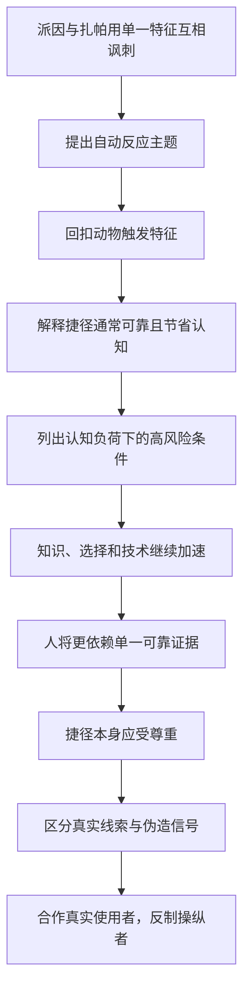

### 0.5 本章的核心判断对象

| 对象 | 不应只问 | 更关键的问题 |
| --- | --- | --- |
| 捷径 | 它会不会出错？ | 长期来看是否节省成本且多数时候可靠？ |
| 单一线索 | 它是否显眼？ | 它与当前结论是否真实相关？ |
| 信息提供者 | 他是否获利？ | 他是否如实呈现线索，还是伪造、歪曲线索？ |
| 防御方式 | 是否全面怀疑？ | 能否保护可靠捷径，同时惩罚欺骗？ |

### 0.6 证据边界

尾声主要是全书综合论证，使用轶事、前文动物案例、历史性知识增长数字、技术预测和商业例子，而不是重新提供一组控制实验。笔记会把原书事实、作者概括和现代延伸分开。

---

## 1. 两句题词：从“越来越好”到“越来越忙”

### 1.1 埃米尔·库埃的句子

法国心理学家埃米尔·库埃（Émile Coué）说：“每时每刻，我都变得更好了。”这句话代表一种进步叙事：知识和能力不断增长，人似乎应能作出更好的选择。

### 1.2 西奥迪尼的改写

作者紧接着说：“每时每刻，我都变得更忙了。”改写把重点从能力提升转向认知负荷：信息越多、节奏越快，拥有更强大脑并不意味着每项决定都能投入更多分析。

### 1.3 两句题词共同提出的悖论

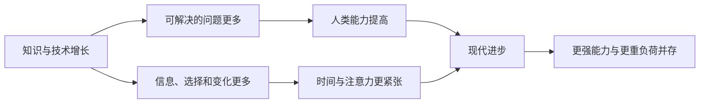

### 1.4 直觉含义

现代人不是因为比过去更笨才依赖捷径，而是因为可处理的信息增长速度超过了单个决策者逐项分析的能力。

---

## 2. 乔·派因的节目：怎样让嘉宾在压力中露出破绽

### 2.1 节目背景

20世纪60年代，乔·派因（Joe Pyne）主持一档在加利福尼亚广泛播出的脱口秀。嘉宾多是寻求曝光的娱乐从业者、新人，以及边缘政治或社会组织代表。

### 2.2 主持策略

派因以刻薄、挑衅著称。他会在介绍嘉宾时攻击其信仰、才能或外貌，试图：

- 激怒对方；
- 诱发争论；
- 让对方慌乱；
- 迫使对方承认尴尬事实；
- 最终让嘉宾显得愚蠢。

### 2.3 关于其性格的两种传闻

有人把派因的尖刻归因于他失去一条腿后的生活经历，也有人认为他只是天性刻薄。原书并未验证哪种解释正确；它们只是背景传闻，不应作为心理因果结论。

### 2.4 为什么压力有利于单一线索判断

遭到突然攻击的人需要同时管理情绪、形象、语言和事实，认知资源被占用，更容易抓住对方最显眼的一个特征反击，而不是完成全面论证。

这项认知资源解释是笔记对尾声主线的连接，不是原书对派因节目所做的控制研究。

---

## 3. 弗兰克·扎帕的反击：同一种错误如何被镜像呈现

### 3.1 对话

摇滚歌手弗兰克·扎帕（Frank Zappa）留着当时颇有争议的长发。派因不等他落座便说：

> “我猜，你的头发这么长，肯定是个姑娘。”

扎帕回答：

> “我猜，你有条木头腿，肯定是张桌子。”

### 3.2 派因的推理结构

$$
{\text{长发}}\rightarrow{\text{女性}}.
$$

他抓住一个外貌特征，把文化刻板印象当作完整身份判断。

### 3.3 扎帕的镜像结构

$$
{\text{木质假腿}}\rightarrow{\text{桌子}}.
$$

扎帕并不是认真声称派因是桌子，而是把同样荒谬的推理形式原样返还：拥有某个典型部件，不等于属于与该部件相关的类别。

### 3.4 为什么这个开场有效

短对话把抽象认识论问题变得可见：

- 显眼特征容易抢占注意；
- 分类规则可能长期有一定相关性；
- 但单一特征永远不是完整对象；
- 对方可以利用同一漏洞制造错误结论。

### 3.5 讽刺与证据的区别

扎帕的妙答揭示逻辑缺陷，却不是统计证据。作者用它引入主题，后续再用动物触发模式和现代信息负荷解释这种错误为何反复出现。

---

## 4. “自动反应”：只凭最具代表性的一条信息作决定

### 4.1 基本定义

本章所说的**自动反应**，是人在没有整合全部相关信息时，依据一个最显眼、最典型或通常可靠的特征，迅速启动一整套判断和行为。

### 4.2 结构

### 4.3 为什么会正确

代表性线索通常不是随机选择的。价格常与质量相关，多数人的做法常提供可行性信息，专家身份常与知识相关，供应减少常意味着机会成本提高。

### 4.4 为什么会犯愚蠢错误

线索和结论只是概率相关，不是逻辑等价。长发不等于女性，医生外观不等于医学资格，排队不等于店内拥挤，昂贵不等于优质。

### 4.5 为什么容易被利用

操纵者不必改变对象真实质量，只需制造会触发规则的外观：假销量、假权威、假短缺、假友谊、假承诺环境。

### 4.6 “自动”不等于完全无意识

有时人知道自己在使用规则，例如“没时间了，就选销量最高的”；有时只是直接感到可信或紧迫。关键特征是没有重新审查全部证据，而非必须毫无意识。

---

## 5. 回到第1章：动物的固定行为模式

### 5.1 尾声为何回到动物

第1章以动物固定行为模式说明“按一下就播放”，尾声重新引用它，是为了把全书六类影响力原理放回同一个认知框架。

### 5.2 雌火鸡与“叽叽”声

正常情况下，健康小火鸡会发出特殊“叽叽”声，声音因此是值得依赖的母性线索。雌火鸡听到声音便启动照料行为。

福克斯实验把录音机装进臭鼬模型：播放“叽叽”声时，雌火鸡接纳天敌模型；关闭声音后，又立即攻击。

### 5.3 红色胸羽

雄性知更鸟保护领地时，对一撮红色胸羽猛烈攻击，却可能忽略没有红色胸羽的逼真雄鸟模型。颜色是高效但不完整的入侵者信号。

### 5.4 特定闪光序列

尾声还提到特定序列的闪光可以触发完整行为。其共同点不是声音、颜色或光本身，而是某个小特征承载了通常可靠的环境意义。

### 5.5 固定行为模式的结构

### 5.6 动物为何必须依赖单一特征

动物认知容量有限，无法记录和处理环境中的所有信息。进化让它们对高预测力特征特别敏感，从而以较低脑力成本作出多数时候正确的反应。

### 5.7 错误不是系统无用的证明

臭鼬录音实验看起来荒谬，是因为研究者人为拆开了通常同时出现的线索。自然环境中，“叽叽”声多数来自健康幼鸟，所以规则总体有效。

---

## 6. 人类与动物：相似的是资源约束，不是能力相同

### 6.1 人类的优势

人类能同时考虑更多变量、形成抽象模型、检验反事实并修正规则。这种信息处理优势是人类成为支配物种的重要条件。

### 6.2 人类仍有上限

更强能力不等于无限能力。一天之内遇到的人、商品、消息和请求远超逐项全面分析所需的时间与精力。

### 6.3 为什么强大脑也会采用原始策略

全面分析的边际收益有时小于认知成本。若一条线索长期准确，依赖它可以把资源留给更重要、更陌生或后果更大的任务。

### 6.4 关键区别

| 动物固定模式 | 人类快捷规则 |
| --- | --- |
| 更多由进化预设 | 同时来自进化、学习、文化与制度 |
| 通常较难口头说明 | 人可在事后解释或主动选择 |
| 触发后序列较固定 | 人可暂停、核查、切换到分析模式 |
| 环境变化也会误导 | 还可被商业和组织蓄意伪造 |

### 6.5 不应得出的结论

作者的类比不是说人和火鸡同样愚笨，而是说任何有限处理系统都需要压缩信息；压缩规则一旦遇到假信号，就会产生系统性错误。

---

## 7. “单一可靠证据”法：尾声对六类原理的统一解释

### 7.1 基本思想

人在无法全面分析时，会寻找一个通常可靠的证据，借它判断答应请求是否比拒绝更合适。

### 7.2 六类顺从线索

| 原理 | 单一线索 | 通常为何有用 | 典型滥用或伪造 |
| --- | --- | --- | --- |
| 互惠 | 对方先给予 | 回报维持合作交换 | 故意塞礼后索取高回报 |
| 承诺和一致 | 我已公开选择 | 一致减少反复决策和失信 | 先骗取小承诺再升级 |
| 社会认同 | 相似者或多数人这样做 | 他人行为提供环境信息 | 假评论、假销量、假排队 |
| 喜好 | 我喜欢或认同请求者 | 亲近者往往更合作 | 假相似、恭维、伪装盟友 |
| 权威 | 相关专家这样说 | 专业分工节省学习成本 | 假头衔、制服和身份标志 |
| 稀缺 | 机会即将减少 | 可得性反映机会成本 | 假库存、假期限、假竞争 |

### 7.3 为什么没有单列第1章

第1章提供总框架“影响力的武器”和自动化机制；尾声明确列举的是随后六种常用顺从线索。本笔记沿用原书列表，不把第1章误写成第七种并列原则。

### 7.4 “可靠”是概率概念

可用一个笔记模型比较快捷判断与全面分析。设两种方法作出正确决定的概率分别为 $p_s$、$p_a$，正确收益为 $B$，错误代价为 $C_e$，两种方法自身的认知成本分别为 $C_s$、$C_a$：

$$
\begin{aligned}
EU_s &= p_sB-(1-p_s)C_e-C_s,\\
EU_a &= p_aB-(1-p_a)C_e-C_a.
\end{aligned}
$$

当 $EU_s\ge EU_a$ 时，采用捷径可能更合算。全面分析通常提高正确率，却也有更高的 $C_a$；捷径通常更快，却可能有更高误判概率。这不是原书公式，只用于说明：线索可靠度、错误后果、捷径成本和全面分析成本要放在同一比较中。

### 7.5 低风险与高风险不同

选择普通牙膏时，用销量作线索可能合理；决定重大医疗、法律或财务事项时，误判代价高，即使线索通常可靠，也应增加核查。

---

## 8. 何时最容易退回单一线索

### 8.1 原书列出的资源不足

人在以下情况下最容易依赖孤立线索：

- 没有意愿全面分析；
- 没有时间；
- 没有精力；
- 缺乏认知资源。

### 8.2 原书列出的具体状态

- 赶时间；
- 压力大；
- 不确定；
- 不在乎；
- 心烦意乱；
- 心力憔悴。

### 8.3 为什么“不在乎”也会触发捷径

不只困难和疲惫会减少分析。若结果无关紧要，人理性上也不愿投入大量认知成本，因此会选择够用的规则。

### 8.4 为什么“不确定”会增加依赖

自己缺少标准时，社会认同、权威和熟悉线索更有吸引力。它们替代了尚未形成的内部判断依据。

### 8.5 认知负荷链

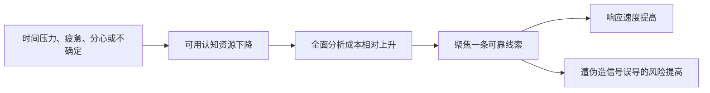

### 8.6 操纵者为何制造紧迫和混乱

假期限、复杂合同、同时说话、情绪刺激和不断催促，不只传达内容，还会削弱核查能力，使目标更依赖显眼线索。

这项策略归纳来自全书机制的笔记整合；尾声明确列出高负荷状态，但没有给出上述每种销售手法的统一实验。

---

## 9. 文明悖论：精密大脑创造复杂世界，又被迫采用原始反应

### 9.1 作者的不安结论

人类靠成熟大脑创造信息繁多、节奏快速的复杂世界；这个世界反过来超过个人处理容量，使人更依赖与动物相似的单一特征反应。

### 9.2 不是智力退化

问题不是人类大脑变差，而是任务规模增长。若处理能力增长较慢、输入增长更快，单位决策可投入的注意力仍会下降。

### 9.3 一个方向性笔记模型

设信息与选择负荷为 $L$，可用认知资源为 $R$。当 $L/R$ 上升时，对快捷规则的依赖 $H$ 往往上升：

$$
\frac{L}{R}\uparrow\quad\Longrightarrow\quad H\uparrow.
$$

这是对作者论点的方向性表达，不是原书公式，也不意味着存在统一阈值。

### 9.4 “原始”不等于“低劣”

单一线索响应之所以古老，是因为它计算成本低、速度快。复杂系统同样需要缓存、索引和默认值；问题在默认值被恶意输入污染时出现。

### 9.5 真正的治理目标

不是要求每个人对所有事情进行全盘分析，而是：

- 让可靠线索保持真实；
- 在高风险决策中增加核查；
- 在认知资源低谷推迟不可逆选择；
- 识别谁有能力伪造触发信号。

---

## 10. 约翰·斯图亚特·穆勒：为什么“掌握全部知识”已不可能

### 10.1 人物与原书时间口径

约翰·斯图亚特·穆勒（John Stuart Mill）是英国经济学家、政治思想家和科学哲学家，1873年去世。原书写他“离世距今有142年”，这是版本写作时的相对时间，不应更新为2026年的实时年数。

### 10.2 “最后一个掌握全部知识的人”

作者称穆勒是最后一个享有“掌握世上已知的一切知识”美誉的人。它用于说明知识总量已超出单人覆盖范围，不宜当作可严格验证的历史排名。

### 10.3 专业化的必然性

知识增长后，个体必须依赖专家、制度、摘要、声誉、同行评审和其他代理线索。权威与社会认同因此不只是心理偏差，也成为知识协作的基础。

### 10.4 风险随之产生

人越无法直接验证全部内容，就越依赖“谁说的”“多少人同意”“是否来自知名机构”；这些代理信号也越有商业和政治价值，因而越值得伪造。

---

## 11. 知识爆炸：尾声给出的历史性数字

### 11.1 信息年龄

原书称，当时世界上大部分信息存在时间不超过 15 年。这是作者所处版本的概括，不是2026年可直接沿用的测量结果。

### 11.2 物理学知识翻倍

原书说，在物理等某些科学领域，据称知识数量每 8 年翻一倍。“据说”的措辞和缺少测量定义意味着它应被视为时代性说明，而非精确增长定律。

### 11.3 科学期刊数量

作者称研究者在全球 40 多万份科学期刊上发布新发现。原书没有在尾声给出统计来源、期刊定义或时间点，不能作为当前期刊数。

### 11.4 这些数字共同支持什么

它们并不用于精确预测知识增长，而是支持一个稳健方向：任何个人直接掌握全部知识的目标已经不可实现，筛选和代理判断不可避免。

### 11.5 不能推出什么

- 新信息不一定全是可靠知识；
- 数量翻倍不等于理解翻倍；
- 期刊增加不等于每项研究都值得采用；
- 信息可访问不等于人有能力评估。

---

## 12. 日常生活同样加速：新颖、短暂、多元化、速度惊人

### 12.1 公众议题

作者引用盖洛普年度民意调查的方向性观察：公众关心的事件越来越多元，但对单一事件持续关注的时间越来越短。

### 12.2 出行与居住

人出行更频繁、速度更快，也更常搬迁；住宅建设和拆迁速度加快，使环境持续变化。

### 12.3 人际关系

人接触更多对象，但许多联系持续更短。判断陌生人的机会增加，深入了解每个人的时间减少，喜好、相似和权威线索更容易承担筛选功能。

### 12.4 商品选择

超市、汽车展厅和购物中心不断出现新产品，上一年不存在的产品可能下一年又消失。消费者难以为每个选项积累长期经验。

### 12.5 四个概括词

原书用四个词描述当代文明：

1. 新颖；
2. 短暂；
3. 多元化；
4. 速度惊人。

### 12.6 四者怎样共同提高捷径依赖

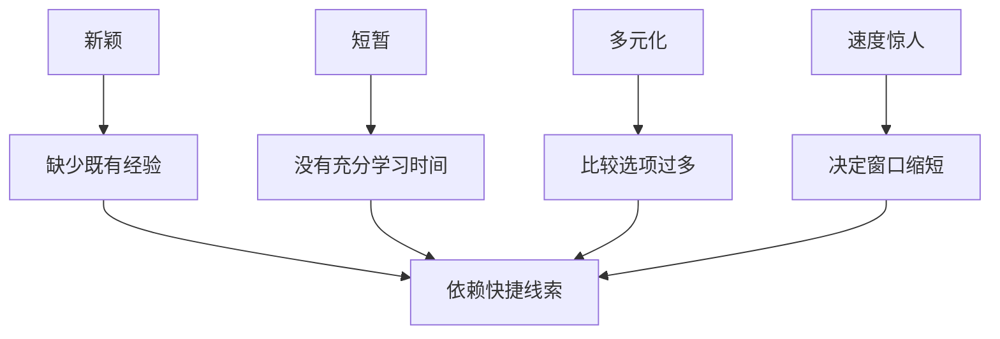

---

## 13. 第一阶段结论：自动化判断为什么不可避免

### 13.1 作者形成的论证链

1. 人会因单一显眼特征犯荒谬错误；
2. 动物和人类都用高预测力线索压缩复杂环境；
3. 六类影响力原理通常能提供可靠的“答应”信号；
4. 时间、压力、疲惫和不确定会减少分析资源；
5. 知识、选择和变化速度持续上升；
6. 因此，对捷径的依赖不会消失，反而会增加。

### 13.2 笔记重述：当前可以下的结论

自动判断是一种有限理性策略：它牺牲逐次最优，换取长期效率与及时行动。在多数低风险、重复和线索可靠的场景，这种交换可能合理。

### 13.3 当前不能下的结论

- 人类无法进行深思熟虑；
- 所有直觉都来自六类影响力原理；
- 单一线索在所有场景都比分析更好；
- 信息越多，人一定越不理性；
- 历史增长数字仍代表2026年现状；
- 自动化错误只来自个人懒惰。

### 13.4 下一步问题

既然捷径不可取消，尾声后半部分必须回答：应怎样区分帮助我们高效决策的人，与故意破坏线索可靠性的人？

---

## 14. 技术进步：信息洪流为什么是人类自己创造的

### 14.1 四项基础能力

作者把信息和选择激增首先归因于技术提升了：

1. 收集信息；
2. 存储信息；
3. 检索信息；
4. 传递信息。

### 14.2 从大型组织开始

早期只有政府机关和大型企业有资源建设大规模信息系统。它们可以跨地域汇总数据，把决策建立在远超个人记忆容量的信息上。

### 14.3 沃尔特·瑞斯顿的描述

花旗集团前董事长沃尔特·瑞斯顿（Walter Wriston）形容其公司已经连接全球数据库，能够把世界任何时间发生的任何事情告诉任何人。

这是一句企业能力的修辞性描述，不应理解为数据库真的全知、实时且无误。它在原书中的作用是展示组织信息能力的雄心与规模。

### 14.4 技术收益与个人负荷并存

信息技术降低访问成本，却也增加可选信息总量。搜索更容易，不代表判断来源质量、相关性和冲突证据更容易。

### 14.5 技术不是单向问题来源

同一技术也能提供核查工具、比较平台和自动过滤。尾声强调的是输入增长会压迫天然处理能力，不是主张放弃技术。

---

## 15. 从有线电视到个人电脑：信息能力怎样进入普通家庭

### 15.1 电子通信

电子通信和计算机技术发展后，大规模信息不再只属于大型组织。个人开始接触此前难以获得的数据和观点。

### 15.2 有线与卫星系统

有线电视和卫星系统成为信息进入家庭的重要渠道，扩大节目、新闻和选择数量。

### 15.3 个人电脑

个人电脑成为另一条主要渠道。它不仅展示信息，还允许普通人检索、计算和分析。

### 15.4 选择扩张的双重后果

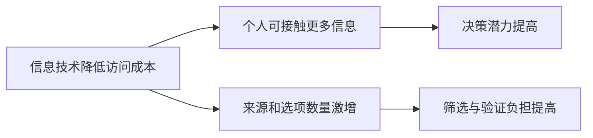

### 15.5 为什么工具增强没有消除捷径

工具能提高处理速度，但人的目标设定、信任判断和注意力分配仍有限。技术还会创造新的内容和选择，因此供给扩张可能抵消处理效率提升。

---

## 16. 诺曼·麦克雷的1972年预测

### 16.1 预测者

1972年，《经济学人》编辑诺曼·麦克雷（Norman Macrae）展望：人们最终可以在实验室、办公室、公共图书馆或家中，通过电脑终端接入大规模数据库。

### 16.2 信息海洋

他预想普通人能够在难以想象的信息海洋中穿梭，不再受单一本地档案或个人藏书限制。

### 16.3 爱因斯坦比较

原书转引麦克雷的说法：即使爱因斯坦的大脑，在电脑终端的机械集中和计算能力面前也不及万分之一。

这是一种强调机器计算规模的修辞，不是对人脑与计算机通用智能的可比测量。机器集中计算强，不等于理解、价值判断和创造力全面超过人。

### 16.4 预测为什么切中尾声主题

电脑让个人拥有前所未有的信息，但“可访问”与“可消化”之间的距离扩大。人更需要搜索排序、来源声誉和默认推荐等二级捷径。

---

## 17. 十年后的“年度机器”与达特茅斯新生

### 17.1 原书时间线

原书说，麦克雷预测仅 10 年后，《时代周刊》便把个人电脑这台机器评为“年度人物”，以消费者蜂拥购买小型电脑为理由，宣告世界已不同于过去。

通常更准确的历史称呼是《时代》1982年的“年度机器（Machine of the Year）”；本笔记在转述原书时保留其意思，不把“机器”误认为真实人物。

### 17.2 数百万普通用户

作者写道，数以百万计的普通人已经坐在电脑前，显示和分析足以“淹死爱因斯坦”的数据。

### 17.3 图 e-1

图 e-1 展示达特茅斯学院新生与机器，图注说刚入学的新生已掌握“足以淹死爱因斯坦”的力量。它表达工具普及，不证明每位学生都能正确解释所有数据。

### 17.4 信息民主化与判断民主化不同

- 更多人能获取数据；
- 不代表数据质量一致；
- 不代表每个人具备领域方法；
- 不代表推荐和排序没有偏差；
- 因而可靠的认证、同行评价和来源线索更重要。

### 17.5 历史数字的边界

这些段落描述原书成书版本所处的技术阶段。2026年的设备、网络和信息规模已不同，但笔记不把原书数字静默更新成当前统计。

---

## 18. “捷径应受尊重”：为什么全面回避是错误答案

### 18.1 技术进化快于天然处理能力

技术与环境变化速度远快于生物认知能力演化。个人越来越常面对无法全盘考虑的局面。

### 18.2 人类的“作茧自缚”

低等动物一直受认知容量限制；人类的新困境是自己创造了超出个人处理能力的复杂世界。

### 18.3 分析瘫痪

如果每项选择都要求收集全部数据、验证所有来源、模拟所有后果，行动会因分析成本过高而停止。作者称需要依赖单一特征来解决这种“分析瘫痪”。

### 18.4 快捷决策没有根本错误

前提是线索确实可靠。高质量捷径可以：

- 降低时间成本；
- 节省注意力；
- 利用社会分工；
- 在机会窗口关闭前行动；
- 把精力留给异常和高风险问题。

### 18.5 错误不只来自污染：概率规则本身也有误差

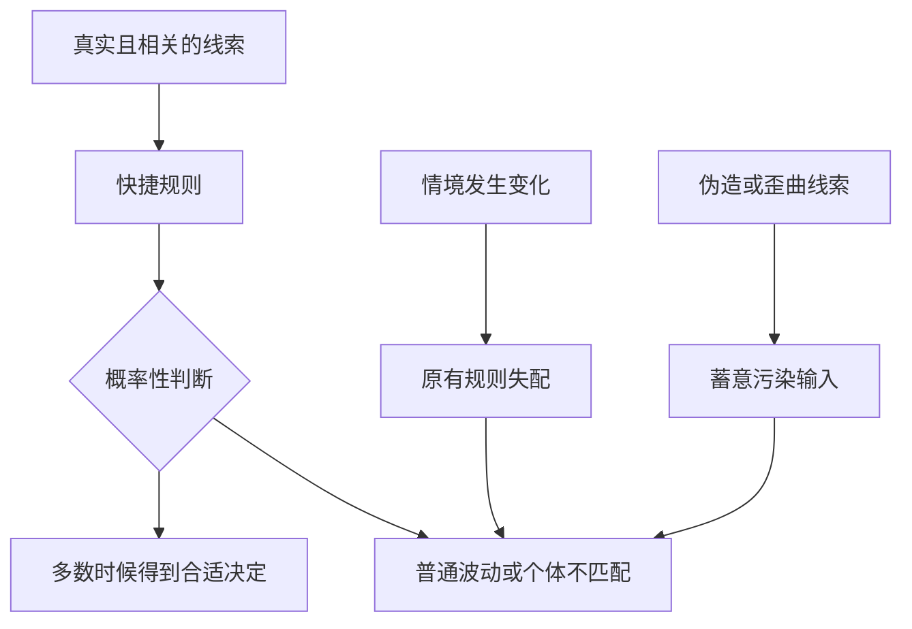

即使输入真实，概率线索也不可能次次正确；普通波动、个体差异和情境变化都可能造成错误。伪造线索并不是唯一误差来源，但它具有特殊伦理性质：有人蓄意让可靠规则朝有利于自己的方向失灵，因此才是作者要求强硬反制的对象。

---

## 19. 自动规则的有效前提

### 19.1 线索与结论有稳定关系

例如，在特定市场和时期，真实销量可能与产品可接受性相关；经过验证的医学资格通常与专业训练相关。

### 19.2 当前场景与经验场景相似

在常规消费中好用的规则，不一定适合高风险投资；熟人在社交帮助中可信，不代表其医学建议专业。

### 19.3 信号真实、相关且未被伪造或歪曲

提供者可以有意展示真实销量、真实资格或真实库存来影响决定；原书甚至把如实展示牙膏销量的广告商视为盟友。判断标准不是“是否有意影响”，而是线索是否真实、与主张相关，并且没有被伪造、歪曲或脱离必要上下文。

### 19.4 错误成本可承受

若选错牙膏损失很小，快捷规则足够；若错误可能造成重大健康、法律和财务损害，应升级验证。

### 19.5 规则可以被纠正

有退货、撤销、复核和反馈的环境，更适合快捷试错；不可逆选择需要更高证据门槛。

### 19.6 一个笔记检查式

$$
{\text{捷径适用性}}
\uparrow
\quad\text{当}\quad
{\text{线索真实度}}\uparrow,
{\text{相关性}}\uparrow,
{\text{错误成本}}\downarrow.
$$

这是方向性总结，不是原书公式。

---

## 20. 复杂性越高，操纵捷径的诱因越强

### 20.1 作者的预测

现代生活越快、越复杂，人使用快捷响应越频繁；顺从专业人士利用这些响应的频率也会提高。

### 20.2 为什么操纵成本低

改变真实产品可能昂贵，制造一个信号可能便宜：

- 雇演员假装普通顾客；
- 预先往小费罐放钱；
- 把顾客留在门外排队；
- 伪造评论、库存或头衔。

### 20.3 为什么收益高

一个信号可同时影响大量人，而每个受众因时间有限不会逐项调查。规模化传播使伪造线索有高杠杆。

### 20.4 正反馈风险

若不约束虚假信号，社会会进入“更依赖线索—线索更值得伪造—验证更困难”的循环。

---

## 21. 防御对象：公平利用捷径的人不是敌人

### 21.1 作者设置的先决条件

反制前必须区分使用方式。若商家公平、准确地提供可靠线索，它帮助消费者高效决策，是合作伙伴而非敌人。

### 21.2 盈利不是原罪

作者明确说，问题不在商家想赚钱，因为人人都希望获得利益；原文针对的是弄虚作假、伪造或歪曲证据。笔记据此进一步概括：若提供者选择性隐瞒足以改变判断的关键条件，同样会损害快捷线索的可靠性。

### 21.3 合作型信息提供者

这类提供者：

- 真实呈现销量、资格、库存和条件；
- 不把线索夸大成逻辑保证；
- 允许核查；
- 对错误及时纠正；
- 让消费者节省合理的搜索成本。

其中后四项是笔记对“公平公正”原则的展开，不是原书逐项清单。

### 21.4 对抗型信息提供者

这类提供者通过弄虚作假、伪造或歪曲证据，刻意触发自动反应。伤害不只是一笔交易，还污染了所有人依赖的信号系统。

---

## 22. 真实牙膏销量：社会认同如何成为有效盟友

### 22.1 原书例子

假设消费者正在寻找优质牙膏，广告商用真实可靠的数据说明某品牌销量最大。

### 22.2 为什么销量有信息价值

许多消费者重复购买，可能说明：

- 产品基本可用；
- 价格和渠道可接受；
- 大量用户没有立即淘汰它；
- 与普通需求有一定匹配。

原书更简洁地说，众人认可的行为往往管用且恰当，因此销量线索指向正确方向的概率高于出错。

### 22.3 销量仍不是质量证明

高销量还可能来自低价、铺货、广告和惯性。若消费者有特殊过敏、牙科需求或伦理偏好，仍需查看相关信息。

### 22.4 为什么广告商是盟友

只要数据真实且表述不过度，广告商替消费者提供了昂贵的市场汇总信息，消费者可节省认知资源处理其他决定。

### 22.5 合理依赖的形式

不是“销量第一，所以必然最好”，而是：

> 在需求普通、风险较低、没有相反证据时，真实销量可以提高候选产品的优先级。

---

## 23. 演员假扮随机受访者：虚假信号为何构成背叛

### 23.1 伪造方式

广告制作一系列看似街头随机采访的画面，让演员假扮普通市民，称赞产品，以营造广泛受欢迎的印象。

### 23.2 被伪造的不是观点，而是证据来源

演员可以说出真实台词，但广告暗示这些评价来自独立、随机的普通用户。伪造的是：

- 评价者身份；
- 抽样方式；
- 自发性；
- 普遍程度；
- 与商家的利益关系。

### 23.3 为什么比普通夸张更严重

它利用的是消费者无法逐项调查而必须依赖的社会认同机制。消费者以为自己在观察市场，实际看到的是商家编排的输入。

### 23.4 作者的立场

作者把这种广告商称为敌人，并重申前文建议：不要购买以虚假“随机访谈”宣传的产品。

### 23.5 证据边界

尾声以规范性案例说明真假信号的区别，没有在此提供广告效果实验或抵制效果统计。

---

## 24. 四类反制案例：从拒绝观看到公开说明原因

### 24.1 虚假随机访谈

作者建议：

- 不购买相应产品；
- 写信向制造商投诉；
- 建议制造商撤换广告代理公司。

### 24.2 罐头笑声

若电视节目用预录笑声伪造观众社会认同，作者建议拒绝观看。

### 24.3 预先填钱的小费罐

酒保先放一两块钱，制造“其他顾客都给小费”的假象，作者建议不给小费。

这里针对的是故意伪造既有社会规范的行为，不是反对顾客基于真实服务自愿给小费。

### 24.4 夜总会假排队

若门外长队只是为了制造生意兴隆，店内其实有大量空位，作者建议立即离开，并把原因告诉仍在排队的人。

### 24.5 行动的共同结构

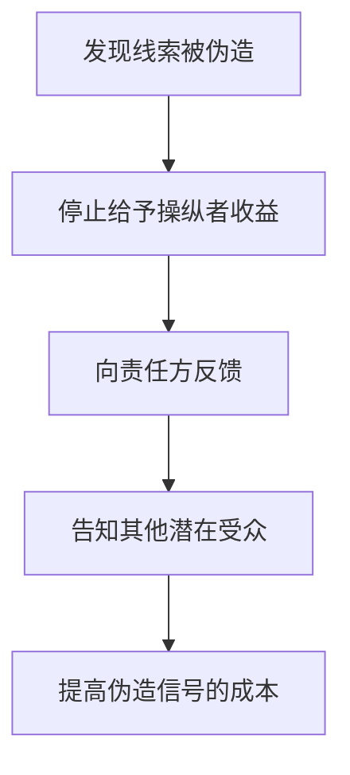

### 24.6 原书“威胁”一词的边界

原书概括可采取“抵制、威胁、对峙、谴责、抗议”等合理方法。现代应用中，“威胁”应理解为合法表达将投诉、抵制或采取法律行动，绝不包括暴力、骚扰或非法报复。

---

## 25. 为什么作者主张强硬还击

### 25.1 作者承认自己并非天生好斗

强硬立场不是出于个人喜好，而是因为伪造者破坏了一项所有人都必须依赖的认知资源。

### 25.2 损害一：当前交易

消费者可能买到不合适的产品、支付不合理价格或作出错误承诺。

### 25.3 损害二：规则可靠性

更深层的损害是，真实销量、真实权威、真实稀缺等线索变得不再可信。每个人都被迫增加验证成本。

### 25.4 损害三：捷径可能被弃用

若操纵普遍存在，人们可能全面不信任评论、销量、推荐和资格。失去快捷规则后，日常大量选择更难完成。

### 25.5 公地结构

可靠信号类似公共基础设施：每个诚实参与者都从中受益，单个操纵者却有动机通过造假攫取短期利益，并把长期成本转嫁给所有人。

“信号公地”是笔记用于解释作者规范立场的概念，不是原书术语。

---

## 26. 捷径不是奢侈品，而是认知基础设施

### 26.1 作者的最终理由

现代生活繁忙，可靠的捷径和首选规则是不折不扣的必需品。生活越快，它们越重要。

### 26.2 为什么不能全面弃用

全面弃用意味着每次都要：

- 重建产品评价；
- 独立验证所有专家；
- 调查每位推荐者；
- 重新计算每个社会规范；
- 检查每个库存和期限。

个人无法承担这种成本。

### 26.3 为什么应保护而非盲信

基础设施重要，不表示每次输出都正确。保护包括真实披露、独立审计、纠错、惩罚造假和高风险复核。

### 26.4 可靠性模型

可用笔记模型表示社会捷径的有效可靠度：

$$
R_{effective}=R_{base}\cdot(1-M),
$$

其中 $R_{base}$ 是线索在自然、诚实环境中的基础可靠度，$M$ 是操纵和污染程度。$M$ 越高，所有使用者从捷径获得的价值越低。这不是原书公式。

### 26.5 最终赌注

作者所谓“这一仗，胜败的赌注太高了”，指的不是某一品牌得失，而是社会能否继续低成本使用真实信息完成无数日常决策。

---

## 27. 原书尾声结论与笔记重述

### 27.1 原书明确不反对什么

- 自动响应本身；
- 商家获利本身；
- 真实销量等可靠线索；
- 公平公正地帮助人使用快捷规则的顺从业者。

### 27.2 原书明确反对什么

- 弄虚作假；
- 伪造证据；
- 歪曲线索；
- 刻意利用假信号触发机械反应。

### 27.3 原书明确要求捍卫什么

- 可靠而合理的捷径和首选规则；
- 这些规则尽可能保持有效；
- 不因投机者的习惯性操纵而被迫弃用捷径；
- 以合理方式还击刺激快捷反应的虚假信号。

### 27.4 笔记重述：系统层面的含义

从上述原书主张可以进一步推导：个人应保留核查和退出能力，平台应提高造假成本，评论、资格和销量等可靠规则具有认知公共资源的性质。这些是笔记的制度化重述，不是原书在尾声逐项使用的术语。

### 27.5 尾声如何闭合全书

第1章从火鸡、绿宝石和“按一下就播放”开始，尾声回到同一机制，却给出更成熟结论：我们不能摆脱自动化，也不应嘲笑它；应把注意力转向触发信息是否真实，以及谁在从伪造中获利。

---

## 28. 核心概念辨析：最容易混淆的十四组关系

### 28.1 自动反应与非理性

自动反应是低成本、快速调用规则；非理性是相对于目标和证据表现不佳。自动规则多数时候有效，不能因偶尔出错就等同非理性。

### 28.2 捷径与偏差

**捷径**是决策方法；**误差**泛指判断与结果的偏离；**偏差**则是相对合理基准稳定、方向性的系统误差。即使输入真实，概率规则也会因普通随机波动或个体不匹配偶尔出错；环境变化可造成稳定失配，信号伪造则可蓄意制造方向性偏离。伪造的特殊之处在于它是应受反制的人为误差来源。

### 28.3 触发特征与完整证据

触发特征是对象的一小部分，完整证据包含更多相关变量。红色胸羽可以提示入侵者，却不能描述整只鸟。

### 28.4 线索显著性与线索有效性

显著性指容易注意，在线广告、制服和倒计时中很高；有效性指它与结论真实相关。最醒目的线索未必预测力最高。

### 28.5 线索相关性与线索真实性

销量可能与产品接受度相关，但广告给出的销量可能虚假。相关性解决“如果是真的，有没有用”，真实性解决“它到底是不是真的”。

### 28.6 真实信号与诚实解释

真实数据也可被选择性呈现。例如销量第一可能真实，却不代表最适合特殊需求。诚实使用还要避免把概率线索夸成必然结论。

### 28.7 说服与操纵

说服可以提供真实、相关、可核查的信息；操纵则利用认知弱点，隐藏关键条件或伪造输入。双方利益不一致不是操纵的充分条件。

### 28.8 利润与欺骗

盈利说明激励存在，不证明信息虚假。作者反对的是靠破坏信号可靠性盈利，而不是交易和利润本身。

### 28.9 社会认同与从众

社会认同是利用他人行为获取环境信息；从众更广，可包括规范压力和害怕排斥。真实销量例子主要使用信息性社会认同。

### 28.10 认知负荷与能力不足

认知负荷高表示当前可用资源被占用，不等于一个人长期智力低。专家在疲惫、赶时间或跨领域时同样会依赖捷径。

### 28.11 信息丰富与知识充分

信息丰富只表示输入多；知识充分还要求来源可靠、方法正确、能解释冲突并与问题相关。电脑提高前者，不自动保证后者。

### 28.12 分析瘫痪与谨慎

谨慎按风险分配核查；分析瘫痪是不顾边际收益地持续搜集，错过行动。尾声主张可靠捷径，正是为了避免后者。

### 28.13 个人防御与信号治理

个人防御核查一笔决定；信号治理让评论、销量、资格和库存更难伪造。复杂社会不能只依赖每个消费者单独侦查。

### 28.14 怀疑与犬儒

合理怀疑要求证据并允许线索通过验证；犬儒则预设所有人都在撒谎。全面犬儒会摧毁捷径的合作价值。

---

## 29. 六类影响力原理的统一架构

### 29.1 共同结构

六类原则都可以表示为：

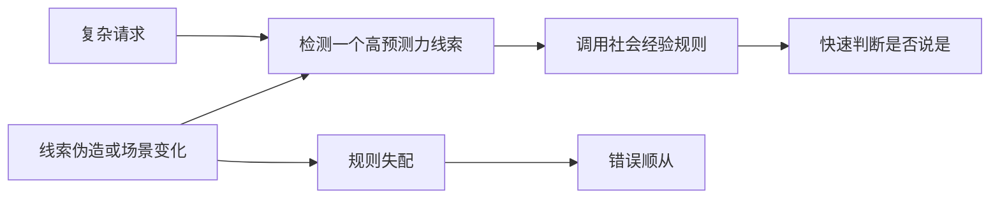

### 29.2 各原则回答的不同问题

| 原理 | 快捷问题 |
| --- | --- |
| 互惠 | 对方先给了我什么，我是否该回报？ |
| 承诺和一致 | 这是否符合我此前的选择和身份？ |
| 社会认同 | 其他人，尤其相似者，怎样做？ |
| 喜好 | 我是否愿意帮助这个我喜欢的人？ |
| 权威 | 相关专家怎样判断？ |
| 稀缺 | 这个机会是否即将失去？ |

### 29.3 它们不是互斥算法

特百惠聚会同时使用友谊、互惠、社会认同和承诺；销售员还可叠加权威与稀缺。现实请求通常由多条线索共同推动。

### 29.4 多线索不一定等于独立证据

若所有线索来自同一操纵者，它们可能高度相关：商家伪造销量，再声称库存不足，并雇演员推荐，看似三重证据，实为一个来源。

### 29.5 独立性检查

> 这些证据是否来自彼此独立、利益不同的来源？

独立来源比重复同一营销信息更能提高可信度。

---

## 30. 背景知识：有限理性与“够用”决策

本节是帮助理解尾声的理论背景，不是原书在尾声使用的术语体系。

### 30.1 有限理性

赫伯特·西蒙等研究者用**有限理性（bounded rationality）**说明：决策者受信息、时间和计算能力限制，不可能始终求得全局最优。

### 30.2 满意化

**满意化（satisficing）**是寻找满足关键条件的可接受方案，而非比较完所有方案。它与尾声的快捷规则相通。

### 30.3 为什么“够用”可能比“最优”更理性

若继续搜索的成本超过改进收益，停止搜索是合理的。决策质量应把分析成本和错过时机算进去。

### 30.4 与西奥迪尼论点的关系

尾声从社会影响角度补充：有限理性不仅导致个体使用捷径，也创造了操纵者攻击这些捷径的机会。

### 30.5 不应混淆

有限理性不表示人注定被操纵。规则可通过经验更新，环境可通过制度治理，高风险事项也能分配更多分析资源。

---

## 31. 作者如何分析问题：从笑话到认知公共资源

### 31.1 用一段对话暴露形式错误

派因和扎帕的互讽让“用一个部件定义整体”的荒谬立即可见。

### 31.2 回扣全书起点

作者返回火鸡、胸羽和闪光序列，将人的顺从与一般有限处理系统联系起来。

### 31.3 为捷径恢复合理性

他没有停在嘲笑自动化，而是说明动物线索和六类影响力原则通常可靠，能节省稀缺认知资源。

### 31.4 列举失守条件

赶时间、压力、不确定、分心、冷漠和疲惫说明何时全面分析最难发生，也说明何时操纵风险最高。

### 31.5 从个体容量转到历史趋势

穆勒、知识增长、民调、迁移、商品和技术预测共同建立一个趋势判断：环境复杂度继续增加，捷径需求不会减少。

### 31.6 提出规范分界

作者没有按“是否使用影响力”划分敌友，而按“线索是否真实可靠”划分。这一步避免把所有广告、销售和说服都道德化为欺骗。

### 31.7 用同一社会认同原理作对照

真实销量和演员假访谈只差输入真实性，却导向完全不同的伦理评价，形成最清楚的辨别实验式论证。

### 31.8 从个人损失上升到系统损失

结尾说伪造会迫使人弃用捷径，指出欺骗的外部性：它破坏了所有人的决策基础设施。

### 31.9 方法链

---

## 32. 本章问题的难点与解决思路

### 32.1 难点一：捷径既有用又危险

只讲危险会得出“全面分析一切”的不可行建议；只讲效率又会纵容操纵。作者用输入真实性作为分界。

### 32.2 难点二：相关线索不是逻辑保证

销量、权威和稀缺都只提供概率信息。解决办法不是要求零错误，而是评估长期可靠度、当前相关性和错误成本。

### 32.3 难点三：复杂性同时提高工具和负担

电脑让信息更易获得，也让选择更多。作者用技术史说明单纯“给更多信息”无法消除有限注意力。

### 32.4 难点四：真假信号外观相同

真实普通用户与演员、真实队伍与假队伍、真实小费与预置钱在表面上相似。解决需要来源、生成过程和利益披露，而非只看内容。

### 32.5 难点五：个人核查无法无限扩张

如果所有信号都须独立调查，捷径失去意义。作者明确主张以拒购、投诉、离场和告知等方式还击虚假信号；笔记据此进一步概括，其系统作用是提高欺骗成本、保护整个信号环境，而不只是训练个体怀疑。

### 32.6 难点六：强硬反制可能越界

原书使用“宣战”“威胁”等语言。现代应用必须限制在合法、非暴力、与证据相称的投诉、抵制、纠正和监管行动。

---

## 33. 证据结构：尾声使用了哪些材料

### 33.1 证据地图

| 类型 | 代表材料 | 主要功能 | 主要局限 |
| --- | --- | --- | --- |
| 轶事与机智对话 | 派因与扎帕 | 直观展示单特征推理 | 不提供普遍发生率 |
| 前文动物实验 | 火鸡与臭鼬模型、胸羽 | 展示触发特征与固定模式 | 动物机制不能直接等同全部人类判断 |
| 前七章研究综合 | 六类影响力原理 | 说明人类快捷线索的可靠性与风险 | 尾声不重述各研究细节 |
| 条件枚举 | 赶时间、压力、疲惫等 | 提出捷径使用的高风险环境 | 尾声未给统一实验和效应量 |
| 历史性统计与概括 | 15年、8年、40多万期刊 | 展示信息增长方向 | 来源、定义和时期未详述 |
| 人物引语与预测 | 穆勒、瑞斯顿、麦克雷 | 建立知识与技术叙事 | 修辞与预测不是控制证据 |
| 商业对照案例 | 真销量与假访谈 | 区分公平使用与伪造信号 | 未在尾声量化效果 |
| 规范论证 | 抵制、投诉、捍卫捷径 | 说明作者伦理立场 | 行动效果和边界需另行评估 |

### 33.2 最强的全书支持来自哪里

尾声的核心不是某一个新实验，而是前七章大量实验、现场研究和案例共同显示：单一线索通常有效，但能被系统化利用。

### 33.3 历史数字应怎样读

把它们当作作者成书时代对“信息加速”的证据，不应将142年、15年、8年和40多万直接更新或外推为2026年事实。

### 33.4 规范主张与经验结论分开

“伪造信号会误导”是经验判断；“因此应抵制和投诉”是规范选择。后者还需考虑比例、法律和副作用。

### 33.5 尾声没有给出的内容

- 各高负荷状态对每条原理的精确效应量；
- 信息量与捷径依赖的统一函数；
- 反制行动能降低多少欺骗；
- 哪种监管方案最有效；
- 自动与分析模式的神经机制。

笔记中的公式和算法因此都明确属于解释性扩展。

---

## 34. 适用范围与局限

### 34.1 低风险重复决策最适合捷径

商品可退、错误成本低、环境稳定且反馈快速时，快捷规则能高效学习和纠错。

### 34.2 高风险不可逆决策需要升级

医疗、法律、重大投资、安全操作和长期合同的误判代价高，不应只依赖销量、喜欢或头衔。

### 34.3 专业领域可能必须依赖代理

非专家无法复现全部研究，但可检查专业资格、共识、方法透明和独立复核。升级分析不等于亲自成为专家。

### 34.4 线索可靠性会随环境变化

线下口碑在小社区可能可靠，匿名网络评分可能受机器人和购买评价影响。规则必须随生成机制更新。

### 34.5 更多信息有时能减少而非增加负担

结构化摘要、可信筛选和自动验证可以降低复杂性。尾声的趋势不应被读成技术必然让每个人更无助。

### 34.6 自动反应也有个体和文化差异

经验、动机、制度信任和文化规范会改变人对权威、互惠和社会认同的权重。六类线索不是固定常数。

### 34.7 真实线索也可能不适合个人

销量第一是真实社会认同，却不保证满足过敏、预算或价值观等特殊约束。

### 34.8 反制必须证据相称

误差、过时和蓄意欺骗不同。应先核实，再选择纠正、投诉、退出或监管，避免把普通错误公开定性为诈骗。

---

## 35. 笔记扩展：个人的风险分层决策算法

本节由尾声“尊重可靠捷径、反制虚假信号”推导，不是原书逐项给出的算法。

### 35.1 第一步：判断风险和可逆性

| 风险 | 示例 | 默认模式 |
| --- | --- | --- |
| 低且可逆 | 普通牙膏、日常餐饮 | 可用一两条可靠捷径 |
| 中等 | 订阅、耐用品、工作选择 | 快捷筛选后比较关键条款 |
| 高且不可逆 | 医疗、法律、大额投资、安全 | 多来源核查和专业复核 |

### 35.2 第二步：检查当前认知状态

问自己是否赶时间、疲惫、分心、情绪化、不确定或根本不在乎。若高风险且状态差，应推迟决定。

### 35.3 第三步：识别正在触发的线索

是礼物、已有承诺、多数人、相似与好感、专家身份，还是短缺？把隐含触发器说出来，自动反应便更容易被审查。

### 35.4 第四步：写出线索支持的具体命题

例如“销量高”最多支持“很多人购买”，不直接支持“最适合我”或“医学效果最好”。

### 35.5 第五步：检查真实性

- 数据由谁生成？
- 身份可否验证？
- 评论是否真实用户？
- 库存是否动态可查？
- 推荐关系是否披露？

### 35.6 第六步：检查相关性

即便线索真实，它是否与当前问题相关？演员的知名度不等于医学能力，排队人数不等于食物质量。

### 35.7 第七步：检查来源独立性

多个网站是否只是复制同一新闻稿？多个评价是否由同一机构付费？不要把重复信息误作独立验证。

### 35.8 第八步：寻找一个反证

主动问“什么事实会推翻当前快捷结论”，并寻找最便宜的反例检查，例如查看店内空位、验证执照或刷新倒计时。

### 35.9 第九步：按风险增加证据

低风险可继续；中风险比较替代方案；高风险要求原始资料、第二专家和书面条款。

### 35.10 第十步：决定、推迟或退出

不要把“暂不决定”误当失败。若对方不允许核查，这本身就是有关可信度的新证据。

### 35.11 第十一步：保留反馈

记录结果，让规则能更新。若高销量产品多次不适合自己，应降低该线索在个人场景中的权重。

### 35.12 流程图

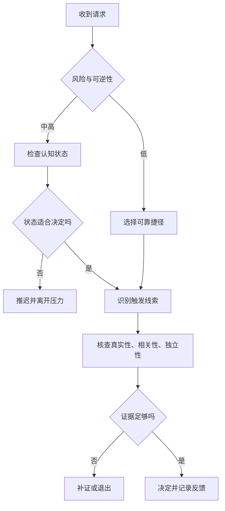

---

## 36. 笔记扩展：真假线索的审查矩阵

### 36.1 三个维度

1. **真实性**：线索是否真实存在；
2. **相关性**：线索是否能支持当前结论；
3. **完整性**：是否隐藏会改变判断的关键条件。

### 36.2 八种组合中的关键四类

| 真实性 | 相关性 | 完整性 | 判断 |
| --- | --- | --- | --- |
| 高 | 高 | 高 | 可合理依赖 |
| 高 | 高 | 低 | 选择性真实，需补上下文 |
| 高 | 低 | 任意 | 真实但无关，不应触发结论 |
| 低 | 任意 | 任意 | 伪造输入，应反制 |

### 36.3 真实但误导的例子

广告真实说“销量第一”，却隐藏主要来自极低价格；若主张只是“很多人购买”，它真实，若暗示“临床效果最佳”，便跨越相关边界。

### 36.4 完整性为什么重要

尾声重点强调伪造和歪曲。歪曲不一定虚构数字，也可以选择时间窗口、遗漏分母或把相关性说成因果。

---

## 37. 笔记扩展：平台和组织如何保护信号可靠性

本节是现代信号治理建议，不是西奥迪尼在尾声逐项列出的方案。

### 37.1 记录来源

销量、评论、推荐和证书应附生成时间、样本、验证方式和利益关系。

### 37.2 防止虚假身份

对评论者、专家和商家做与风险相称的身份验证，同时避免不必要地暴露隐私。

### 37.3 抵抗女巫攻击

平台需识别一个操纵者控制大量账号制造社会认同的情况。仅数账号数量不足以证明独立人数。

### 37.4 披露付费关系

演员、网红、推荐人和排名机构应清楚标注赞助、佣金和样品关系。

### 37.5 区分销量与质量

界面可以显示销量，但不应自动标为“最佳”；还应提供适用人群、退货率、质量指标和评价分布。

### 37.6 保存纠错记录

错误数据被更正后保留变更说明，避免使用者继续按旧信号决定。

### 37.7 对高风险决定增加摩擦

转账、医疗和不可逆操作应要求二次确认、冷静期或独立复核，防止单一触发器直接执行。

### 37.8 惩罚伪造而非流行

治理对象应是虚假生成和误导呈现，而不是一个观点或产品真的受欢迎。

---

## 38. 笔记扩展：生成式人工智能时代的“即时影响力”

### 38.1 流畅度会成为权威线索

模型回答结构完整、语气自信，容易让人把表达质量当作事实可靠性。流畅是真实特征，却与正确性不等价。

### 38.2 引用外观可能触发自动信任

看似精确的论文名、链接和数字会模拟专业证据。用户应检查引用是否存在、是否支持主张，而非只看格式。

### 38.3 多模型一致不一定独立

不同系统可能训练于相同资料、使用相同搜索结果或彼此生成内容。一致性不能自动当作独立社会认同。

### 38.4 个性化会叠加喜好

模型模仿用户语言、记住偏好并表现友善，能提高亲近感。关系体验不应替代高风险专业验证。

### 38.5 速度会压缩核查

即时生成大量答案，让获取成本趋近于零，验证却仍需时间；信息供给与验证能力之间的差距正重现尾声悖论。

### 38.6 使用原则

- 用模型做候选生成和解释；
- 对关键事实查原始来源；
- 高风险事项交由有责任边界的专业人员复核；
- 区分模型信心语气与证据强度；
- 保留不确定和拒答空间。

---

## 39. 正当使用影响力捷径的伦理原则

以下是依据尾声“公平使用是盟友、伪造信号是敌人”整理的笔记扩展。

### 39.1 信号真实

不伪造销量、评论、资格、稀缺、关系或已有承诺。

### 39.2 主张相称

只得出线索能够支持的结论，不把“受欢迎”写成“最好”，不把“专家代言”写成“科学证明”。

### 39.3 来源透明

披露谁生成信息、如何抽样、是否付费、何时更新。

### 39.4 允许验证

不以紧迫、保密或身份压制合理核查。

### 39.5 风险相称

低风险可简化，高风险提供完整条款、替代方案和冷静时间。

### 39.6 及时纠错

发现信号错误后主动更正，不继续从已知误导中获利。

### 39.7 不惩罚合理拒绝

客户拒绝、员工质疑和用户退出不应被包装成忘恩、不忠或不合群。

### 39.8 保护共同信任

把评论、资格和推荐视为公共信息资源，避免以短期转化换取长期犬儒。

---

## 40. 如何合法、有效地反制虚假信号

本节把作者的强硬主张转成现代可执行的笔记流程。

### 40.1 先保存证据

记录广告、页面、时间、承诺和实际情况，避免仅凭记忆公开指控。

### 40.2 先区分错误与欺骗

询问是否数据过时、系统故障或表达不清；重复、蓄意、获利性伪造需要更强反制。

### 40.3 停止提供收益

在合理情况下取消购买、退出服务或拒绝小费，使操纵不再有利可图。

### 40.4 向直接责任方反馈

要求纠正信息、退款、撤下广告或说明来源。

### 40.5 使用平台和监管渠道

通过消费者保护、广告监管、行业协会、应用商店和支付争议等合法渠道处理。

### 40.6 告知他人时保持准确

只陈述可验证事实，区分观察与推测，避免诽谤、骚扰和人肉搜索。

### 40.7 选择比例相称的行动

普通错误适合纠正，系统欺骗适合投诉与抵制，违法行为交给执法和司法程序。

### 40.8 不使用暴力威胁

原书的战斗隐喻不能被解读为伤害许可。有效反制依靠证据、退出、公开纠错和制度成本。

---

## 41. 常见误区与推理错误

### 41.1 误区一：自动反应就是愚蠢

它通常是对资源约束的高效适应。愚蠢结果常来自失配或伪造输入。

### 41.2 误区二：理性的人从不使用捷径

把分析成本算入后，选择可靠捷径本身可以是理性行为。

### 41.3 误区三：信息越多，决定一定越好

过量、冲突和低质量信息会提高筛选负担，也可能造成分析瘫痪。

### 41.4 误区四：电脑会替人消除认知限制

电脑提高存取和计算能力，却不会自动决定目标、价值和来源可信度。

### 41.5 误区五：尾声说人类和火鸡一样聪明

类比关注有限系统依赖触发特征，人类仍拥有更强整合、反思和纠错能力。

### 41.6 误区六：一个特征绝不能使用

低风险、稳定环境中，一个高质量线索可能足够。关键是线索可靠度与错误成本。

### 41.7 误区七：六种影响力原理本质上都是骗局

它们源于通常可靠的社会规律；骗局在于伪造或歪曲触发证据。

### 41.8 误区八：商家获利就必然操纵

真实信息能同时帮助交易双方。利益冲突要求披露和核查，不自动证明欺骗。

### 41.9 误区九：销量第一等于质量第一

真实销量有信息价值，却还受价格、渠道和营销影响；它只是候选线索。

### 41.10 误区十：演员说真话就不算虚假访谈

若广告假称演员是随机独立用户，评价来源和普遍性仍被伪造。

### 41.11 误区十一：排队就证明场所受欢迎

队伍可能真实，也可能被容量控制人为制造；应看内部情况和生成方式。

### 41.12 误区十二：小费罐有钱就证明人人给小费

钱可能由酒保预置。观察结果必须结合来源。

### 41.13 误区十三：知道偏差名称就能免疫

赶时间、疲惫和分心时，概念记忆未必能阻止反应。需要预设流程和环境保护。

### 41.14 误区十四：全面怀疑最安全

全面怀疑使每项交易成本过高，也会错过真实专家和真实社会信息。

### 41.15 误区十五：多个相同结论就是独立证据

它们可能复制同一来源或由同一操纵者生成。必须检查独立性。

### 41.16 误区十六：高风险决策也可只看一个可靠线索

即使线索真实，错误后果高时也应增加证据和复核。

### 41.17 误区十七：作者主张对所有说服者宣战

作者把公平使用捷径的人视为盟友，反制对象仅是伪造、歪曲证据者。

### 41.18 误区十八：原书鼓励暴力威胁

“宣战”和“威胁”是强硬修辞。正当行动必须合法、非暴力、证据相称。

### 41.19 误区十九：历史数字仍是当前统计

142年、15年、8年和40多万期刊属于成书时代口径，不能直接标为2026年数据。

### 41.20 误区二十：穆勒确实是最后一个知道全部知识的人

这是原书用于说明知识规模的历史美誉和修辞，不是可严格证明的排名。

### 41.21 误区二十一：快捷规则一旦被利用就应永久弃用

作者恰恰担心弃用。应提高造假成本、修正规则和改善信号环境。

### 41.22 误区二十二：只要信号真实，表达就一定诚实

真实数据仍可缺分母、选时间窗或跨越相关边界。还要检查完整性。

### 41.23 误区二十三：反制只保护当前消费者

反制还保护评论、销量、资格等信号未来对所有人的可用性。

### 41.24 误区二十四：现代复杂性注定让人失去自主

复杂性增加风险，但验证技术、制度治理和风险分层也能增强自主。

---

## 42. 全章知识结构

### 42.1 知识图谱

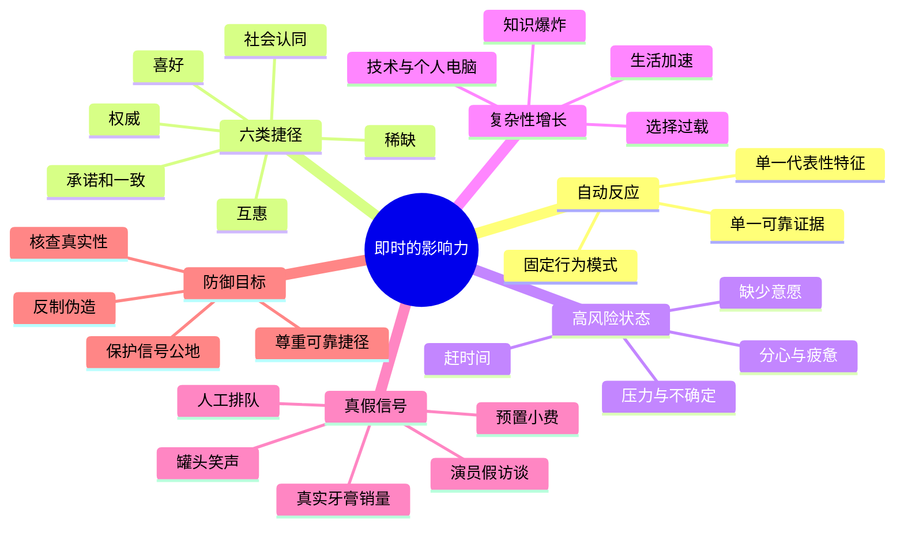

### 42.2 总机制图

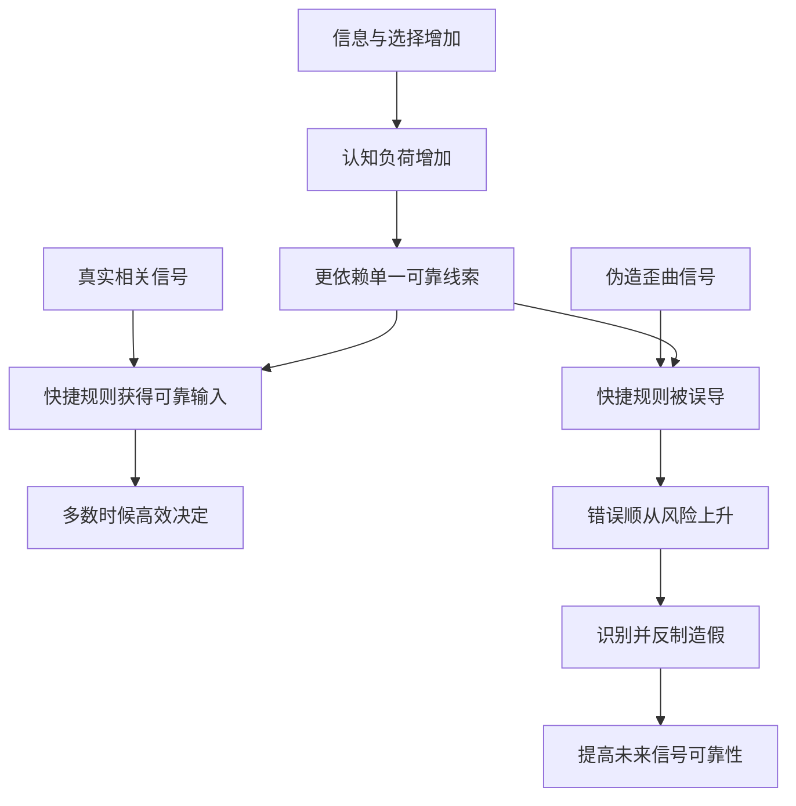

### 42.3 三个分析层次

1. **认知层**：有限资源为何需要信息压缩；
2. **互动层**：顺从专业人士怎样提供或伪造触发线索；
3. **制度层**：怎样让真实信号容易验证、虚假信号付出成本。

### 42.4 全书闭环

第1章解释“按一下就播放”，第2—7章拆解六类按钮，尾声说明按钮不可取消，因此最终任务是维护按钮与真实世界之间的可靠连接。

---

## 43. 原书核心结论与笔记延伸

### 43.1 十八条原书核心结论

1. **人经常只凭最具代表性的一条信息判断。** 派因与扎帕以荒谬对话展示这一点。
2. **单一特征规则通常能正确引导行为。** 正因多数时候有效，它们才会被保留。
3. **动物依赖触发特征是认知容量有限的适应。** 火鸡、胸羽和闪光序列体现固定模式。
4. **人类处理能力更强，却仍然有限。** 效率需求使人也采用简单响应。
5. **六类影响力原理是常用的可靠顺从线索。** 它们通常提示何时说“是”更合适。
6. **意愿、时间、精力和认知资源不足时，捷径使用增加。** 赶时间、压力、不确定、冷漠、分心和疲惫尤其重要。
7. **现代复杂性由人类自身创造。** 精密大脑创造的世界反过来迫使人使用原始策略。
8. **知识总量已超出个人全面掌握的可能。** 穆勒故事和增长数字服务于这一判断。
9. **日常生活变得更新、更短暂、更多元、更快速。** 判断窗口不断缩短。
10. **技术把海量信息带给组织和个人。** 数据访问能力与筛选负担同时增长。
11. **未来对快捷规则的依赖会增加。** 天然处理能力难以跟上环境复杂度。
12. **分析瘫痪使单一特征决策成为必要。** 捷径不是可有可无的奢侈品。
13. **公平使用可靠线索的人是盟友。** 真实销量可帮助消费者高效筛选。
14. **伪造、虚构或歪曲线索的人是反制对象。** 假随机访谈破坏社会认同。
15. **作者主张以具体行动还击虚假信号。** 包括拒购、投诉、拒看、不给小费、离场并告知仍在排队的人。
16. **反制原因不是反对盈利。** 真正问题是盈利方式背叛了捷径可靠性。
17. **虚假信号会造成系统性损害。** 人若被迫弃用捷径，便难以处理日常选择。
18. **作者认为可靠捷径不可或缺，且捍卫它们的赌注很高。** 现代生活越快，这些规则越重要。

### 43.2 四条笔记延伸

1. **决策应按风险分层。** 低风险允许快捷试错，高风险增加独立验证。
2. **线索审查至少包括真实性、相关性、完整性和来源独立性。** 真实数据也可能被误导性呈现。
3. **平台应治理信号生成过程。** 身份验证、赞助披露、反虚假账号和纠错记录能保护信号公地。
4. **生成式人工智能放大了尾声悖论。** 内容生成极快，验证仍昂贵，因此流畅度和引用外观不能替代事实核查。

### 43.3 一句话压缩

> 我们无法停止使用捷径；真正要做的是让真实线索值得依赖，让伪造线索不再有利可图。

### 43.4 最终理解

这篇尾声不是一封反直觉、反广告或反技术的檄文，而是一套认知生态观：个体依赖快捷规则，诚实提供者帮助规则运行，操纵者污染输入，反制则恢复信号可靠性。保护捷径，实质上是在保护有限的人能够继续在复杂世界中自主行动的条件。

---

## 44. 笔记归纳：解决这类问题的一般方法

### 44.1 十二步方法链

1. 用极短个案暴露错误推理形式；
2. 找到与人类行为同构的简单系统；
3. 解释规则为何在正常环境中有效；
4. 区分规则、输入和输出错误；
5. 列出资源不足时的失守条件；
6. 观察环境复杂度是否正在上升；
7. 判断规则能否现实地被取消；
8. 若不能取消，转向保护输入可靠性；
9. 用同一规则下的真假案例做对照；
10. 区分公平获利与欺骗获利；
11. 设计个人退出和系统惩罚；
12. 评估反制是否维护长期公共能力。

### 44.2 方法图

### 44.3 一般问题求解启示

面对任何会出错的快捷系统，不要立刻删除系统。先问它解决了什么资源约束、错误来自算法还是输入、正常收益是否大于成本，以及能否通过来源验证、风险分层和反馈机制修复。

---

## 45. 快速复习清单

### 45.1 一个核心悖论

人类创造的世界越复杂，越需要依赖看似原始的单一线索反应。

### 45.2 六类常用线索

1. 互惠；
2. 承诺和一致；
3. 社会认同；
4. 喜好；
5. 权威；
6. 稀缺。

### 45.3 六种高风险状态

1. 赶时间；
2. 压力大；
3. 不确定；
4. 不在乎；
5. 心烦意乱；
6. 心力憔悴。

### 45.4 三项线索检查

1. 它是真的吗？
2. 它与当前结论相关吗？
3. 是否隐藏了会改变判断的条件？

### 45.5 最短行动口诀

> 低风险用捷径，高风险查来源；尊重真实线索，拒绝伪造输入；反制欺骗，是为了让所有人继续高效判断。
