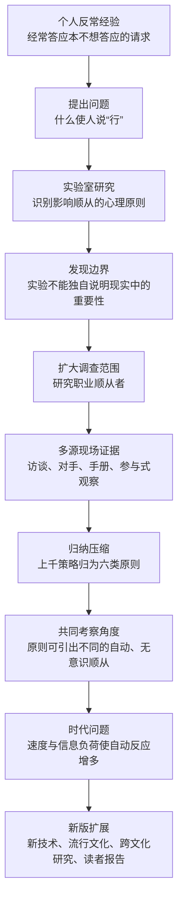
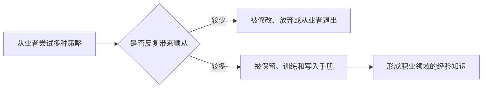
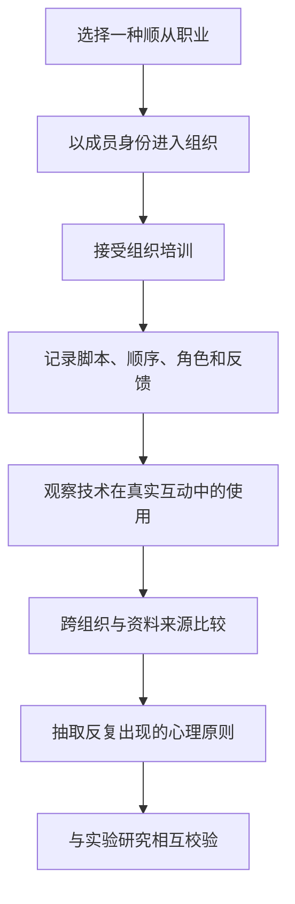
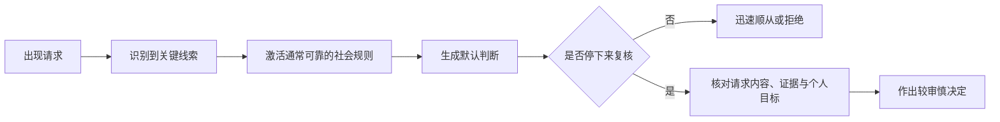
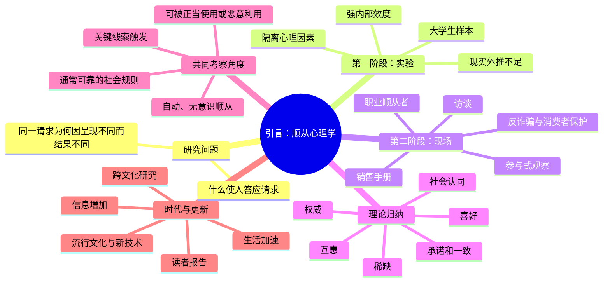

> **书名**：《影响力（珍藏版）》 
> **作者**：罗伯特·B. 西奥迪尼（Robert B. Cialdini） 
> **阅读范围**：《影响力（珍藏版）》引言 
> **阅读目标**：还原作者从个人困惑到实验研究、再到职业现场调查和六原则框架的完整思路，理解“自动、无意识顺从”为什么是全书的统一问题，并辨清各类证据能够支持什么、不能支持什么。

---

## 0. 导读：这篇引言完成了什么

引言很短，却不是普通的内容预告。它同时完成了五项任务：

1. **提出研究问题**：为什么同一个请求，换一种表达或安排方式，就可能从遭拒变成获准？
2. **交代研究路线**：作者先在实验室研究大学生，后来因现实解释力不足，转向职业顺从者的真实世界。
3. **说明资料来源**：访谈从业者、调查其对手、查阅行业资料，并以伪装身份进行参与式观察。
4. **给出全书框架**：上千种顺从策略大多可以归入互惠、承诺和一致、社会认同、喜好、权威、稀缺六类。
5. **提出统一命题**：六类原则都可能触发一种不经充分思考便答应请求的自动、无意识顺从；信息增多和生活加速会使它越来越重要。

全篇的推理顺序如下：

引言没有给出数学公式，也没有提供可计算的说服算法。下文出现的公式、流程和示例是为了把作者的逻辑形式化，均不是原书原有公式或实验结果。它们的作用是帮助理解和检查推理，而不是预测某个人一定会不会顺从。

引言的中心命题可以先压缩成一句话：

> 人并不是逐项比较所有信息后才答应请求；职业顺从者常把具有社会功能的心理原则嵌入请求情境，使人依据少量关键线索迅速说“是”。要理解这种力量，既要知道原则在受控条件下能否起作用，也要知道它在真实世界中怎样被反复使用。

---

## 1. 从“容易上当”到一个可研究的问题

### 1.1 作者为什么从自己的窘迫经历写起

作者先承认自己长期是小贩、筹款人和各种运营者眼中的理想目标：他会订购并不想看的杂志，也会买下本来不需要的活动门票。这段自嘲并不是为了证明某种心理规律，而是给研究提供了一个清晰的反常现象：

$$
\text{事前并不想要} \quad + \quad \text{仍然答应请求}.
$$

如果一个人本来就想买杂志，那么购买行为无须用特殊的影响过程解释。真正值得研究的是：**请求的实际结果为什么会偏离当事人原先的偏好？**

作者还特别区分了请求者的动机。有些人可能不诚实，但慈善机构代表也可能追求正当目标。因此，研究对象不是“坏人如何骗人”，而是一个更一般的问题：**不论目的善恶，一方如何提高另一方答应请求的概率？**

这个区分很重要。若一开始就把所有影响都定义成欺骗，研究会犯两个错误：

- 看不见家庭、朋友、公益活动和正常商业中同样存在的影响过程；
- 把“技术是否有效”和“使用是否正当”混成一个问题，无法分别检验。

### 1.2 三个逐步收紧的研究问题

作者的困惑可以拆成三层：

1. **因素问题**：哪些因素会提高一个人答应另一个人请求的倾向？
2. **技术问题**：请求者可以怎样安排这些因素，使它们更有效？
3. **对照问题**：请求内容大体相同，为什么一种说法会被拒绝，稍作改变后却顺利通过？

第三问最关键，因为它把注意力从“请求本身好不好”转移到“请求如何被呈现”。可以用下面的解释模型表示：

$$
P(Y=1)=f(Q,F,S,R,C),
$$

其中：

- $Y=1$ 表示接受请求；
- $Q$ 是请求的实质内容，例如价格、行动和风险；
- $F$ 是请求的表达、顺序和情境安排；
- $S$ 是请求者及其呈现出来的身份特征；
- $R$ 是接受者的需要、经验和当前状态；
- $C$ 是社会环境，例如他人的行为、时间压力和可选项。

作者所关注的反事实是：在 $Q$ 基本不变时，改变 $F$、$S$ 或 $C$，$P(Y=1)$ 是否显著变化。公式只表示“顺从由多类条件共同影响”，不是原书给出的函数，也不能直接代入数值计算。

### 1.3 什么是“顺从”

在这篇引言中，**顺从（compliance）**指一个人响应另一个人的请求，作出购买、捐赠、让步、投票、赞成等行为。它关注的是“请求之后是否照做”，不要求接受者内心长期改变信念。

例如：

- 某人答应捐款，但未必认同该机构的全部主张；
- 顾客买下商品，但未必从此真心喜欢该品牌；
- 谈判者作出让步，但未必认为对方在道理上正确。

这也解释了作者为什么研究“说行”而不是笼统研究“态度变化”。顺从是一个相对可观察的行为结果，能在实验和现场中加以比较。

### 1.4 问题为什么难

现实中的一次答应通常有多个可能原因：请求本身有价值、请求者讨人喜欢、周围人都接受、时间有限、接受者怕失去机会，或者几项因素同时存在。只看到“使用了某个技巧”与“对方答应”先后发生，并不能证明前者造成后者。

作者因此面对三个难点：

- **因果识别**：究竟是哪一项变化促成顺从？
- **现实重要性**：实验中有效的因素，在日常交易里是否仍然重要？
- **表面多样性**：职业人士有上千套话术，怎样找到其背后的共同机制？

后续研究路线正是围绕这三个难点形成的。

---

## 2. 第一阶段：用实验社会心理学寻找因果原则

### 2.1 为什么先做实验

作者成为实验社会心理学家，最初主要在实验室中以大学生为研究对象。他要识别的是：哪些心理原则会改变人顺从请求的倾向，以及这些原则怎样发挥作用。

实验方法适合解决第一项难题，也就是因果识别。其一般逻辑是：

1. 保持请求内容和其他条件尽可能一致；
2. 只改变一个候选因素，例如请求的表达或请求者呈现的线索；
3. 比较不同条件下的顺从比例；
4. 检查行为差异能否稳定地随该因素变化。

假设有实验组 $T$ 和对照组 $C$，两组顺从率分别是

$$
\hat p_T=\frac{y_T}{n_T},\qquad
\hat p_C=\frac{y_C}{n_C},
$$

那么最直观的效应描述是

$$
\Delta \hat p=\hat p_T-\hat p_C.
$$

$n$ 是各组人数，$y$ 是答应请求的人数。若两组除目标因素外足够可比，$\Delta \hat p$ 才可能帮助判断该因素的影响。引言并未报告某项具体实验、样本量或上述公式；这里展示的是作者所选择的实验路线通常怎样回答因果问题。

### 2.2 实验解决了什么问题

实验的核心贡献不是制造一个与现实完全相同的场景，而是**隔离变量**。现实销售中，请求者的相貌、语气、价格、时机和客户状态一起变化，很难知道哪个因素有效；实验通过控制其他条件，检查某项心理原则是否具有独立影响。

这给研究带来较强的**内部效度**：在被研究的条件内，结果是否真由候选因素引起，而不是由另一个同时变化的因素造成。

### 2.3 为什么选择大学生既合理又有限

从一般研究方法看，大学生便于招募，实验环境容易控制，也适合在研究早期快速比较不同条件。若目标是发现候选心理机制，这类样本可以成为合理起点。这里是对样本选择的补充分析，不是引言明说的选择理由。

但大学生并不代表所有人：

- 年龄、收入、职业经验和文化背景可能不同；
- 实验中的低风险选择不等于现实中的高价购买或长期承诺；
- 知道自己在参加研究，可能改变行为；
- 校园环境中的请求关系不等于商业、政治或家庭关系。

所以，“在大学生实验中观察到效应”不自动推出“所有人在所有真实情境中都会如此”。作者明确给出的转向理由更集中：仅靠校园内的实验，无法判断这些原则在校园之外的真实世界究竟有多重要。

---

## 3. 为什么实验必要却不够：从内部效度走向外部效度

### 3.1 作者发现了什么缺口

实验可以说明某个原则在受控条件下是否可能影响顺从，却不能仅凭自身回答：这个原则走出校园后有多常见、多强、能持续多久，又会怎样与其他因素组合。

这属于**外部效度**问题：研究结论能否推广到不同人群、场景、请求类型和时期。

| 问题 | 实验室较擅长回答 | 仅靠实验室较难回答 |
| --- | --- | --- |
| 因果性 | 改变某项因素是否引起行为差异 | 复杂现实中哪项因素实际占主导 |
| 控制 | 排除许多混杂变量 | 保留真实交易的压力、关系和利害 |
| 频率 | 某机制能否出现 | 从业者日常究竟多常使用 |
| 组合 | 可逐项检验单一因素 | 多项原则怎样嵌入完整流程 |
| 推广 | 在特定样本和任务中成立 | 是否适用于其他文化、人群和渠道 |

作者没有因这些局限而否定实验。他的判断是“必要，但不够”。这意味着解决方案不是从实验转向故事，而是增加与实验互补的现场证据。

### 3.2 为什么把职业顺从者当作信息源

作者先指出，普通人在与邻居、朋友、爱人和家人的日常交往中，也会使用这些原则，或成为它们的作用对象；但普通人的认识往往模糊而零散，以促成顺从为业的专家则掌握得更多。这个对比直接解释了研究对象的选择：若要知道哪些原则最管用，职业顺从者是更丰富、密度更高的信息源。

作者因而决定观察销售员、筹款人员和广告从业者等职业老手。这些人的收入和职业生存依赖请求成功，长期竞争会不断筛除无效做法，保留较有效的策略。

这是一种近似的实践筛选过程：

作者由此推断，职业顺从者的世界是寻找高效原则的丰富资料库。他们不一定能用心理学术语解释策略，但其训练、脚本和工作流程保存了大量经过现实反馈筛选的知识。

### 3.3 这一推理的力量与风险

职业生存为策略有效性提供了有价值的线索，却不是严格证明：

- 一个从业者可能因品牌、市场地位或运气成功，而不是话术有效；
- 行业可能流传无效但听起来合理的传统；
- 失败者退出后不易被观察，形成幸存者偏差；
- 高转化率不说明每个客户都受同一机制影响；
- 有效不等于诚实、合法或符合接受者利益。

因此，职业实践适合发现技术、判断现实相关性和研究组合方式；因果判断仍需实验或更严格的现场比较。作者把两类方法结合起来，正好让各自补足对方。

---

## 4. 第二阶段：系统进入职业顺从者的真实世界

### 4.1 调查范围如何扩大

作者把实验研究与一项持续近三年的现场项目结合起来，系统进入销售、筹款、广告、公共关系等职业环境。他的目的不是收集几句精彩话术，而是从内部观察从业者**最常用且效果最好**的技术和策略。

“系统化”体现在三点：

1. 研究不局限于一个行业，而是比较多个以争取同意为核心的职业；
2. 资料不只来自从业者自述，而是来自多个立场和多种载体；
3. 研究重点不是孤立案例，而是跨场景反复出现的共同原则。

### 4.2 四类资料来源

引言交代了四条主要证据渠道：

| 资料来源 | 能看到什么 | 主要价值 | 主要局限 |
| --- | --- | --- | --- |
| 访问顺从从业者 | 他们如何理解和描述自己的做法 | 获得规则、经验与职业语言 | 可能美化、隐瞒或事后合理化 |
| 调访从业者的“天敌” | 反诈骗调查人员、消费者保护机构看到的滥用模式 | 得到对抗性视角和失败案例 | 更容易接触有问题的极端案例 |
| 检验书面资料 | 销售手册等代际传承的脚本与训练内容 | 观察可复制、制度化的技术 | 手册写法不一定等于实际执行 |
| 参与式观察 | 训练、现场流程、语言与组合策略 | 接近真实实践和隐性知识 | 成本高，解释受研究者位置影响 |

四类资料形成了初步的**三角互证**：若从业者所说、手册所写、现场所做和监管者所见相互吻合，对“这种策略确实存在并被反复使用”的判断就更可靠。

但互证主要增强的是存在性和现实相关性。它仍不能替代对效果大小、因果机制和适用人群的定量检验。

### 4.3 为什么还要研究警方和消费者保护机构

只听从业者介绍会产生单边视角。销售组织可能只讲成功故事，不讲投诉、误导或失败；反诈骗和消费者保护人员则能揭示技术怎样被滥用、哪些群体容易受损，以及普通人在哪些环节难以识别影响。

这项安排有两层作用：

- **方法作用**：用敌对或监督立场检查从业者自述；
- **伦理作用**：把“促成顺从”与“保护接受者自主利益”同时放进研究视野。

### 4.4 为什么销售手册特别重要

个人可能说不清自己为什么有效，组织手册却会把可教、可复制的步骤保存下来。某种技术若能在多代从业者之间传承，至少说明行业认为它值得投入训练资源。

不过，手册是规范性材料，回答的是“组织要求员工怎样做”；现场观察回答的才是“员工实际上怎样做”。两者一致时证据更强，不一致本身也很有信息价值。

---

## 5. 核心现场方法：参与式观察

### 5.1 什么是参与式观察

引言把 **参与式观察（participant observation）**解释为：研究者以伪装身份和预设意图进入目标环境，成为被调查群体中的实际成员，从内部观察其活动。

作者会应征报纸上的销售实习职位，让销售组织直接训练自己。他进入过百科全书、真空吸尘器、肖像摄影、舞蹈课程等销售体系，也渗入广告、公共关系和筹款机构。书中的许多材料因而来自他扮演顺从专业人士或 aspiring practitioner 时的亲身经历。

### 5.2 为什么不能只做公开访谈

顺从技术常包含三类难以通过访谈获得的知识：

- **隐性知识**：从业者会做，却未必能准确说出动作、时机和语气；
- **敏感知识**：组织不愿向外部研究者公开的策略；
- **情境知识**：一个步骤只有放在完整互动顺序中，才能看出作用。

例如，单看一句销售话术可能很普通，但它若安排在赠礼、建立好感或制造时间压力之后，功能便完全不同。参与式观察能看到策略的时序和组合，而不只是从业者事后的概括。

### 5.3 参与式观察的一般工作链

作者没有在引言中提供正式操作手册，但其描述可以整理为下面的研究链：

### 5.4 这种方法解决了什么

参与式观察提高了研究的生态真实性：策略面对的是真实客户、真实目标和真实组织压力。它尤其适合回答：

- 从业者真正使用什么，而不只是声称使用什么；
- 策略以什么顺序出现；
- 单个原则怎样被包装进完整请求；
- 哪些做法已成为组织训练和职业惯例；
- 接受者难以察觉的影响发生在哪里。

### 5.5 方法的边界与伦理问题

参与式观察并不等于无偏的“现场录像”。至少要注意以下局限：

1. **研究者解释偏差**：同一互动可能有多种解释。
2. **选择偏差**：进入的组织未必代表整个行业。
3. **可重复性有限**：不同组织、时期和研究者可能看到不同实践。
4. **因果控制较弱**：多个因素同时变化，难以单独估计某项技术的效果。
5. **隐蔽研究伦理**：伪装身份涉及知情同意、隐私和对参与者的潜在影响。

引言主要说明这种方法如何帮助作者获得资料，没有详细讨论研究伦理程序。今天评价类似研究，仍需依据所在机构的伦理审查、风险控制和隐私规范，不能因为研究目的正当就默认任何潜入方式都可接受。

---

## 6. 从上千种策略归纳出六类基本原则

### 6.1 分类的关键不是话术表面，而是心理功能

三年调查中最有启发性的发现是：职业顺从者虽使用上千种策略，绝大部分却能归入六种基本类型。每一类型都源自一种指导人类行为的基本心理原则，策略的力量也来自对该原则的调用。

这意味着下面两句话可能表面不同，却具有同一种功能：

- “我先为你做了这件事，现在请你帮一个忙。”
- “请收下这份免费礼物，再考虑是否支持我们。”

二者都可能先建立“已经得到他人给予”的情境，再提出回报请求。分类时真正要问的不是用了哪个词，而是：**请求前增加了什么心理线索，这条线索调用了哪一种日常行为规则？**

### 6.2 从原则到顺从策略的完整链条

六类策略共享一条一般结构：

原则之所以有力量，不只是因为人“容易犯错”，更因为这些规则在多数普通情境中有用。例如，参考群体行为能减少不确定性，听取可信专家能节省重复验证成本。职业顺从者借用的是人类社会协调所需要的规则。

### 6.3 作者是怎样完成归纳的

引言没有公布编码表、策略总数、分类者一致性或统计聚类过程，所以不能把“六类”理解成某个数学算法自动算出的唯一答案。更准确地说，这是一种由实验知识和现场比较共同支持的理论归纳：

1. 收集跨行业的具体策略；
2. 忽略行业术语和表面话术；
3. 识别策略试图制造的关键心理条件；
4. 将功能相似的策略归在一起；
5. 用已有社会心理学研究解释其行为力量；
6. 选择最重要、最普遍的六类组织全书。

实践中可用以下检查程序分析一项新策略，但它只是阅读工具，不是原书算法：

1. 写下策略出现前后的实际请求，确认请求内容是否改变；
2. 找出新增线索，如赠予、公开承诺、他人选择、亲近感、专家身份或机会限制；
3. 问这条线索在正常社会生活中帮助人解决什么问题；
4. 做反事实检查：拿掉线索而保留请求，接受者的判断可能怎样变化；
5. 将策略归入最直接的原则，必要时标记多个原则共同作用；
6. 另行判断线索是真实信息还是人为伪造，避免把“有效性”和“正当性”混为一谈。

### 6.4 “六类”不等于“世界上只有六种影响因素”

作者的措辞是绝大部分策略可分为六个基本类型，并说本书讨论其中最重要的一些原则。这是一套高度压缩、便于解释的框架，不是对一切人类动机的穷尽清单。

请求内容本身、利益、惩罚、情绪、习惯、身份、关系和制度都可能影响行为。六原则的特殊之处在于，它们广泛存在于社会生活中，又经常被顺从专家嵌入请求，以触发迅速的判断。

---

## 7. 六大原则导览：它们分别解决什么社会问题

引言只列出六原则及全书安排，没有在此完整展开各章证据。所以下面的定义是阅读全书所需的导读性定位，详细机制、案例和防御方法仍应以后续章节为准。

| 原则 | 基本规则 | 原本解决的社会问题 | 嵌入请求的典型方向 | 容易出现的误判 |
| --- | --- | --- | --- | --- |
| 互惠 | 接受他人给予后，应当有所回报 | 让帮助与交换能够启动并持续 | 先赠予、先帮忙、先让步，再提出请求 | 把未经请求的给予也当成必须偿还的债 |
| 承诺和一致 | 已作出选择后，倾向让后续行为与之相符 | 维持行为可预测性、自我认同和长期协作 | 先获得小承诺、公开立场或主动选择 | 为了表面一致而忽视新证据和成本变化 |
| 社会认同 | 不确定时参考他人的做法 | 借群体经验降低独立探索成本 | 展示销量、支持人数、同类人的选择 | 把人数当成真理，或相信被伪造的热度 |
| 喜好 | 更愿意答应喜欢、熟悉或有联结的人 | 降低合作摩擦，优先可信关系 | 建立相似感、赞美、合作感或熟悉度 | 用对人的好感替代对请求本身的判断 |
| 权威 | 重视被认可专家或合法角色的意见 | 利用社会分工和专业知识高效决策 | 呈现头衔、资历、制服或专业身份 | 把权威符号当成真实能力，或越界采信 |
| 稀缺 | 难以获得或正在减少的机会更受重视 | 提醒资源约束、竞争和机会成本 | 限量、限时、独家信息或即将失去 | 把难得到直接等同于高质量和高价值 |

### 7.1 互惠：让合作能够跨越“谁先付出”的难题

若每个人都坚持对方先付出，合作便难以开始。互惠规则使一个人可以先给予，并合理期待未来回报，从而支持交换、互助和信任。

职业顺从者可以先制造“我已经为你做了什么”的情境，再提出购买、捐赠或让步要求。此时接受者不只评估请求本身，还感受到恢复关系平衡的压力。

关键边界是：**收到东西不等于已自由同意一项债务。** 给予若被刻意强加，回报要求又远超原始价值，互惠就可能从合作规则变成操控工具。

### 7.2 承诺和一致：让行为保持可预测

个人和社会都受益于一定程度的一致性。承诺使他人能规划协作，也帮助个人维持稳定的自我认识，避免每次都从零决策。

顺从策略常先争取一个较小、较容易接受的立场，再让后续请求显得是原承诺的自然延伸。真正起作用的不是“说过一句话就永远不能变”，而是人通常不愿显得前后矛盾，也会据先前行动推断自己是什么样的人。

一致性是手段，不是最高价值。当事实、成本或道德条件变化时，修正承诺可能比机械坚持更理性。

### 7.3 社会认同：用他人的选择处理不确定性

个人不可能亲自测试每个选项。在情况不明确时，观察他人尤其是相似他人的行为，通常能提供有价值的信息。

职业顺从者会把“许多人已经这样做”放进请求。它可能是真实信息，也可能是虚假销量、安排好的排队或选择性展示。社会认同说明的是某种行为在群体中常见，不自动证明它真实、正确或适合当前个人。

### 7.4 喜好：把关系评价迁移到请求上

人与喜欢、熟悉或感觉相似的人合作，往往更轻松。这条倾向有利于建立关系，却也会使人把对请求者的好感迁移到商品、观点或交易条件上。

分析时要拆开两个问题：

1. 我是否喜欢这个人？
2. 即使请求来自一个陌生人，这件事本身是否仍值得答应？

若第二问的答案明显改变，就说明好感可能正在替代实质判断。

### 7.5 权威：借助专业分工节省验证成本

现代社会依赖高度分工。患者参考医生、当事人参考律师、工程团队参考领域专家，通常比每个人从头学习全部知识更有效率。

问题在于，人可能响应头衔、服装、机构名称等权威符号，而没有核对对方是否真有专长、专长是否覆盖当前问题、意见是否存在利益冲突。

正确问题不是“要不要听权威”，而是：**这个权威是否真实、相关、可信，并且其意见有没有越出专业边界？**

### 7.6 稀缺：把注意力集中到可能失去的机会

资源确实有限时，稀缺性提供了机会成本信息：拖延可能导致永远失去选择。它帮助人在竞争和时间约束下行动。

职业顺从者可以强调数量少、时间短或获取受限，使“会不会失去”压过“是否需要”。但稀缺只描述可获得性，不直接描述质量：

$$
\text{稀缺} \not\Rightarrow \text{优质},\qquad
\text{稀缺} \not\Rightarrow \text{适合我}.
$$

### 7.7 六原则的共同点与差别

六原则并不是六套互不相干的话术。它们都把一种通常有用的社会判断规则转化成请求线索，但所借用的信息来源不同：

| 信息来源 | 对应原则 | 快速判断所回答的问题 |
| --- | --- | --- |
| 双方过去的给予 | 互惠 | 我是否应当回报？ |
| 自己过去的选择 | 承诺和一致 | 我怎样做才与原有立场一致？ |
| 他人的行为 | 社会认同 | 类似的人通常怎样做？ |
| 对请求者的关系评价 | 喜好 | 我是否愿意与这个人合作？ |
| 专家或制度角色 | 权威 | 谁更有资格判断？ |
| 机会的可获得性 | 稀缺 | 再不行动是否会失去？ |

真实请求经常组合多个原则。例如，一项销售请求可能同时呈现熟人推荐、专家背书、热销数据和限时库存。不能因最后出现的是“限时”就把整个过程只归为稀缺；应分别识别每条线索，再判断哪一条最直接地改变了决定。

---

## 8. 共同考察角度：自动、无意识的顺从

### 8.1 “自动、无意识”究竟是什么意思

引言把它解释为一种**不先进行充分思考便答应的意愿**。它不是说人完全失去意识，也不是说原则像按钮一样对所有人必然生效。更准确的理解是：

- 决策依赖少数显著线索，而不是系统检查全部信息；
- 熟悉的社会规则被迅速调用；
- 当事人可能意识到自己在答应，却没有意识到哪条线索改变了权重；
- 反应是概率性的，同一线索对不同人和情境效果不同。

一个简化过程是：

### 8.2 为什么自动反应通常有效

若每次决定都重新调查所有事实，人会付出巨大的时间和认知成本。六原则提供的是经验上常常可靠的压缩信息：

- 得到帮助后回报，有利于长期合作；
- 保持承诺，降低协调成本；
- 参考同类人的行为，减少不确定性；
- 与喜欢和熟悉的人合作，常能降低关系风险；
- 听取相关专家，提高判断效率；
- 注意真实稀缺，避免错过不可逆机会。

因此，自动反应不是简单的认知缺陷，而是效率与精确性之间的折中。可以用一个解释性决策条件表示：

$$
\text{采用快捷规则，当}
\quad C_{\text{全面分析}} > E[L_{\text{快捷误差}}],
$$

其中 $C_{\text{全面分析}}$ 是搜集和处理全部信息的成本，$E[L_{\text{快捷误差}}]$ 是依赖快捷规则可能造成的预期损失。人不会真的计算这两个量；公式只是说明，低风险、熟悉或时间紧的情境更容易让快捷判断显得划算。

### 8.3 顺从策略为什么能借到原则的力量

顺从专家通常不需要创造新的欲望，只需让请求与一条现成规则相连：先给予再请求，让行为看起来是回报；展示支持人数，让行为看起来是跟随可靠群体信息；强调即将售罄，让不行动看起来会造成损失。

可以把接受请求的主观吸引力写成：

$$
V_{\text{感知}}
=V_{\text{请求本身}}
+\sum_{k=1}^{6} w_k s_k
-R,
$$

其中：

- $V_{\text{请求本身}}$ 是商品、主张或行动本身的价值；
- $s_k$ 是第 $k$ 项原则线索的强度；
- $w_k$ 是当事人在当前情境中对该线索的敏感度；
- $R$ 是感知风险、成本和反对理由。

这不是可估计的原书模型。它只提醒读者：请求内容没有变时，附加线索仍可能改变感知价值；不同人因 $w_k$ 不同，也不会作出完全相同的反应。

### 8.4 可靠线索与被操纵线索

原则本身通常有社会价值。风险的一种重要来源，是线索与事实脱节：

- 真实专家意见与只穿着专业制服不同；
- 真实销量与伪造热度不同；
- 真实库存限制与人为倒计时不同；
- 自愿给予与强塞礼物后索取高额回报不同。

所以，防御的重点不是永远反着六原则做，而是检查触发线索是否真实、相关，是否足以支持当前请求。

---

## 9. 为什么现代社会会放大自动顺从

### 9.1 作者的时代判断

引言提出，现代社会的节奏越来越快，信息量不断增加，自动、无意识的顺从将变得更普遍。其逻辑是：

$$
\text{信息与选择增加}
\rightarrow \text{处理负担上升}
\rightarrow \text{逐项分析更昂贵}
\rightarrow \text{更多依赖快捷线索}.
$$

这不是说信息越多，人必然越愚蠢，而是说人的注意力、工作记忆和时间有限。当请求数量和信息复杂度增长得比认知资源更快时，人会更频繁地使用压缩规则。

### 9.2 哪些状态会加强快捷判断

引言只给出速度和信息冲击这一总判断。结合其逻辑，可以进一步识别几类高风险条件：

- 时间紧，无法核对来源；
- 同时处理多个任务，注意力被切分；
- 请求内容陌生，只能依赖身份或群体线索；
- 决策次数多，逐项比较造成疲劳；
- 页面或谈话刻意突出倒计时、热度、头衔等单一信息。

这些是从作者命题推导出的应用条件，不是引言逐项列出的实验结论。

### 9.3 新技术为何既改变渠道，又放大规模

新技术不一定创造全新的基本心理原则，却能改变原则出现的速度、精度和覆盖面。数字系统可以快速展示销量、评分、关注人数、专家标识和库存提示，也可以针对不同用户选择最可能有效的线索。

于是，研究不能只记住传统推销场景中的固定话术，而要识别其功能结构：

$$
\text{媒介与话术会变化，底层心理功能可能保持稳定。}
$$

这正是新版增加新技术和流行文化材料的必要性。

---

## 10. 新版本为何增加流行文化、新技术与跨文化研究

### 10.1 更新不只是换几个新案例

距上次出版已有一段时间，作者据新的说服、顺从和改变研究更新全书，并特别增加流行文化、新技术和跨文化社会影响力材料。

这反映出一套理论要持续回答三种变化：

1. **知识变化**：新的研究会修正我们对机制、条件和效果的认识；
2. **环境变化**：技术和文化改变了线索的呈现方式与传播规模；
3. **人群变化**：原则在不同文化中的表现可能相似，也可能因规范和关系结构不同而改变。

### 10.2 跨文化研究要区分三个层次

“某原则跨文化存在”不等于“它在所有文化中同样强、以同样方式出现”。至少要分别检查：

下面的三层划分是笔记为理解跨文化边界所作的解释性整理，不是引言给出的正式研究模型。

| 层次 | 要问的问题 | 可能结果 |
| --- | --- | --- |
| 原则是否存在 | 人是否会参考回报、承诺、他人、关系、权威或稀缺信息 | 多种文化都可能存在 |
| 线索如何定义 | 谁算权威、同类人、内群体，什么承诺具有约束力 | 随文化和制度变化 |
| 权重有多大 | 当前情境中哪条原则更能影响决定 | 不同文化、人群和任务可能不同 |

跨文化材料因此既能检验普遍性，也能界定边界。正确读法不是在“人性完全相同”和“文化之间毫无共同规律”中二选一，而是研究稳定机制如何受具体规范调节。

### 10.3 流行文化材料的作用

流行文化案例让抽象原则更容易识别，也能显示影响技术如何进入广告、媒体和公共叙事。但案例的传播度不等于证据强度。一个令人印象深刻的故事可以帮助理解机制，不能单独证明机制普遍存在或估计其效果大小。

---

## 11. “读者报告”：从研究框架回到日常生活

### 11.1 为什么新增这一环节

先前读者读完本书后，会来信描述某项原则如何在特定情境中“对自己”或“为自己”发挥作用。作者据此在各章加入“读者报告”，并邀请新读者继续提供案例。

“对”与“为”值得注意：影响力原则既可能被别人施加在我们身上，也可能被我们用于正当沟通、合作和自我保护。读者不只是潜在受害者，也是观察者和行动者。

作者认为，这些描述说明了人们在日常生活中多么容易、又多么频繁地成为影响过程的“受害者”。这是引言对读者报告作用的原始表述；若把“频繁”理解为可量化的发生率，还需要下文所说的更系统证据。

### 11.2 读者报告能证明什么

它的主要价值包括：

- 展示原则怎样出现在普通生活而不只在实验室；
- 帮助读者把抽象概念迁移到新场景；
- 发现研究者尚未覆盖的应用方式；
- 生成可供后续研究检验的新假设；
- 暴露多个原则组合时的真实复杂性。

### 11.3 读者报告不能证明什么

个案通常没有对照条件，也容易受记忆、选择性报告和事后解释影响。读者学过六原则后，可能倾向于用框架重新解释任何一次购买。因此，一封来信不能单独证明某原则导致了行为，也不能说明该原则在人群中的平均效果。

可以把证据功能区分如下：

| 证据 | 最适合支持的判断 | 不宜单独支持的判断 |
| --- | --- | --- |
| 实验 | 在特定条件下的因果效应 | 现实中使用频率和完整流程 |
| 参与式观察 | 技术在真实组织中如何使用 | 单一因素的精确因果效应 |
| 手册与访谈 | 行业怎样编码和理解技术 | 实际执行及客观效果 |
| 监管与反诈骗资料 | 滥用方式、损害和对抗视角 | 正常行业实践的总体比例 |
| 读者报告 | 现实例证、迁移和假设生成 | 普遍性、发生率和效果大小 |

### 11.4 怎样严谨阅读一则读者报告

面对后续章节中的案例，可以依次问：

1. 原始请求是什么？
2. 请求前增加了哪条关键线索？
3. 它可能调用哪项原则？
4. 是否还有价格、关系、需求等替代解释？
5. 若移除该线索，结果是否可能改变？
6. 线索是真实信息、选择性呈现，还是伪造信息？
7. 该案例是在说明“机制可能存在”，还是在声称“机制已经得到因果证明”？

引言最后列出既有贡献者并邀请新读者来信。姓名和出版时的通信地址属于致谢及征集信息，不构成理论内容；其方法论意义在于，全书把读者经验作为持续更新案例库的一部分。

---

## 12. 作者分析问题的完整路径

### 12.1 第一步：从反常经验出发，而不是先发明理论

作者没有从“人都是非理性的”这一宏大判断开始，而是抓住一个具体差异：本来不想接受，却实际答应；同一请求换种方式，结果不同。这使问题能够转化为可比较条件。

### 12.2 第二步：把道德判断暂时拆开

请求者可能善意也可能恶意。作者先问技术为什么有效，再问它怎样被不同主体使用。这样既避免把所有影响污名化，也避免因目的高尚就忽略影响过程。

### 12.3 第三步：用实验隔离因果变量

面对现实中的多重原因，先在受控条件下改变候选因素，识别基本心理原则。这一步优先解决内部效度问题。

### 12.4 第四步：主动寻找自己方法的失败边界

作者意识到大学生实验不能独自说明原则在现实中的重要性。这个转折非常关键：好的研究不只是累积支持证据，还要问现有证据在哪些问题上没有发言权。

### 12.5 第五步：选择拥有高密度实践知识的人群

职业顺从者靠促成同意谋生，长期竞争使其环境集中保存了大量实践策略。研究这类“极端或专业使用者”，能比随机观察日常对话更快发现成熟技术。

### 12.6 第六步：采用多方法、多立场资料

作者没有只信销售员，也调查反诈骗人员和消费者保护机构；没有只看手册，也进入现场。不同资料的偏差方向不同，交叉比较有助于发现共同部分。

### 12.7 第七步：从表面策略抽取底层功能

若按行业、句式或商品分类，策略会无限增殖。作者改按“它调用了哪项基本心理原则”分类，于是把上千种技术压缩为六种类型。

### 12.8 第八步：回到原则的社会功能

作者不把原则描述成毫无意义的漏洞，而要讨论每项原则原本怎样指导行为。只有先理解它为什么通常有用，才能解释人为什么会稳定地响应，也才能区分正常使用和滥用。

### 12.9 第九步：从自动顺从这一角度考察六类现象

六原则内容不同，并会产生不同形式的自动顺从，却都可能让人依据关键线索迅速答应。自动、无意识顺从由此成为贯穿全书的共同结果形态和考察角度，而不是六原则共享的唯一因果机制。

### 12.10 第十步：随环境与证据更新理论

新版纳入新的研究、新技术、流行文化、跨文化材料和读者报告，说明理论不应被冻结在首次出版时的案例中。稳定原则需要不断接受新渠道、新人群和新证据的检验。

整条问题解决路径可以概括为：

$$
\text{异常经验}
\rightarrow \text{可检验问题}
\rightarrow \text{实验识别机制}
\rightarrow \text{发现外推缺口}
\rightarrow \text{现场补证}
\rightarrow \text{跨情境归纳}
\rightarrow \text{统一解释}
\rightarrow \text{持续更新边界}.
$$

---

## 13. 证据结构、适用范围与局限

### 13.1 最有力量之处：让不同方法承担不同任务

作者的方法并非简单地把实验和故事堆在一起，而是让它们回答不同问题：

- 实验检验候选原则是否可能造成行为变化；
- 职业现场显示原则怎样进入真实请求；
- 手册说明技术怎样被组织化和传承；
- 对抗性机构揭示滥用与伤害；
- 读者报告展示日常迁移并生成新问题；
- 跨文化研究检查机制的普遍性和文化调节。

这种组合同时追求因果解释、生态真实性和可迁移性，比只依赖单一来源更有说服力。

### 13.2 引言尚未提供的证据

引言主要交代研究计划和结论框架，并没有在此展示：

- 每项原则的具体实验数据、样本量和统计不确定性；
- 上千种策略的完整样本框、编码标准和分类一致性；
- 六类相对于其他分类方案的比较；
- 各原则的平均效果大小及相互作用；
- 哪类人、文化和请求最容易或最不容易受影响；
- 参与式观察的伦理审批和详细记录程序。

所以，引言足以说明作者为什么这样研究、全书准备怎样论证，却不能独立完成六原则的全部证明。评价具体原则时，仍要阅读对应章节的实验、案例和限制。

### 13.3 适用范围

这套框架特别适合分析具有明确请求者、接受者和目标行为的情境，例如：

- 购买、订阅和捐赠；
- 谈判中的让步；
- 选举、投票和公开赞成；
- 工作协作与组织倡议；
- 广告、公共关系和数字产品转化。

它也能帮助分析家庭和朋友之间的请求，但亲密关系还有长期情感、权力和义务，不能把全部行为都还原为一次顺从技巧。

### 13.4 不应过度外推的地方

六原则框架主要解释请求情境中的行为影响，不等于完整的人格理论、政治理论或消费理论。以下结论都超出了引言能够支持的范围：

- 任何顺从都由六原则之一单独造成；
- 只要识别原则，就能准确预测个人选择；
- 所有文化中的原则强度完全相同；
- 使用原则必然操控他人；
- 了解原则后便不会再受影响；
- 成功促成行为就代表沟通真实且符合伦理。

### 13.5 有效性与伦理必须分别检查

一项技术可以有效但不诚实，也可以诚实但效果有限。评价时至少要使用两个维度：

下面的二维矩阵是笔记据此作出的分析工具，不是引言原有的伦理分类。

| | 线索真实、相关 | 线索虚假、失真 |
| --- | --- | --- |
| 尊重自主选择 | 正当提醒、真实证明、透明沟通 | 表面留有选择，实质以假信息误导 |
| 强制或不当施压 | 即使事实真实，也可能因权力和压力不当 | 欺骗与胁迫叠加，风险最高 |

“六原则在发挥作用”只是机制判断，不是伦理判决。还要检查真实性、利益冲突、撤回选择的可能性、压力是否适度，以及接受者是否承担不成比例的损失。

---

## 14. 容易混淆的概念与常见误区

### 14.1 顺从、说服、服从和从众不是同义词

| 概念 | 核心触发 | 主要观察对象 | 与本书引言的关系 |
| --- | --- | --- | --- |
| 顺从 | 他人的请求 | 是否按请求行动 | 引言的直接研究对象 |
| 说服 | 信息传播与论证 | 态度、信念或行为改变 | 范围更广，可能导致顺从 |
| 服从 | 被认可的命令或权力关系 | 是否执行命令 | 与权威有关，但命令不等于请求 |
| 从众 | 群体规范或多数行为 | 是否与群体保持一致 | 与社会认同有关，但不一定有人明确请求 |
| 强迫 | 威胁、剥夺或无法自由拒绝 | 被迫行动 | 不能与利用心理线索的顺从混同 |

### 14.2 “自动”不等于“完全没有意识”

当事人可能清楚自己点了购买按钮，却没有充分检查是什么让自己立刻行动。自动描述的是加工方式较快、依赖线索、缺少完整审查，不是昏迷、催眠或绝对失去控制。

### 14.3 “无意识顺从”不等于“愚蠢”

快捷规则通常能节省认知成本，并依赖真实社会规律。问题不是使用规则本身，而是在高风险场景中未经核对，或有人伪造了触发线索。

### 14.4 实验研究与现场研究不是二选一

实验较擅长隔离因果，现场研究较擅长还原真实流程。作者扩大调查范围不是承认实验无效，而是承认一个方法不能回答所有问题。

### 14.5 职业顺从者不等于诈骗者

销售、筹款、广告和公共关系都有正当用途。作者还专门研究反诈骗与消费者保护机构，是为了同时看见正常影响和恶意利用，而不是把所有促成同意的职业定性为欺骗。

### 14.6 原则不等于策略

**原则**是指导行为的一般心理规则；**策略**是在具体请求中制造或突出相关线索的方法。同一原则能产生多种策略，同一策略流程也能同时调用多项原则。

### 14.7 “常用”不等于“已证明最强”

从业者频繁使用某技术说明它具有现实相关性，但频率可能受传统、成本和可教性影响。若要比较效果强弱，还需要对照研究，而不能只数手册里出现多少次。

### 14.8 六原则不是互斥标签

一次请求可能同时利用互惠、喜好和稀缺。分类的目的在于识别机制，不是强迫每个案例只能放进一个抽屉。

### 14.9 社会原则通常有用，不代表每次都可靠

“通常可靠”是概率判断。多数人的选择可能错，专家可能越界，稀缺物可能无价值，喜欢的人也可能提出不合理请求。原则提高决策效率，但不能提供逻辑保证。

### 14.10 知道原则名称不等于获得免疫

人在时间压力、注意力分散或情绪激动时，仍可能自动响应。有效防御需要把知识转化为暂停、核对和分离判断的程序，而不只是背出六个词。

### 14.11 读者故事不是实验结论

“我遇到过类似事情”能说明概念容易迁移，也能提出研究问题，却不能排除替代解释或估计普遍程度。故事与实验各有角色，不应相互冒充。

### 14.12 跨文化差异不意味着毫无共同机制

文化可以改变谁算权威、何种给予要求回报、哪些人构成参照群体，也可以改变各原则的权重。差异调节原则的表现，不必然否定底层心理功能；相似表现也不意味着文化无关紧要。

---

## 15. 实践方法、知识结构与核心结论

### 15.1 面对请求时的八步检查法

引言没有给出一套正式防御算法，但可依据其框架形成以下操作程序：

1. **还原请求**：对方究竟要我购买、捐赠、让步、投票还是公开赞成什么？
2. **分离包装**：若拿掉赠品、好感、热度、头衔和倒计时，请求本身还值得接受吗？
3. **识别线索**：当前最显著的是回报压力、原有承诺、他人行为、关系好感、权威身份还是机会稀缺？
4. **检查真实性**：销量是否可核验，专家是否相关，库存是否真的有限，赠予是否附带隐含要求？
5. **寻找替代解释**：我答应是因为确有需要，还是仅因不想尴尬、怕显得矛盾或担心错过？
6. **按风险增加摩擦**：金额大、不可逆或影响长期时，延迟决定并获取独立信息。
7. **回到个人目标**：根据自己的利益、价值和约束重新评估，而不是只对线索作反应。
8. **明确回应**：接受、拒绝或提出条件；不把“暂不决定”误认为必须立即说“是”。

这套程序的核心不是逢请求必拒，而是把自动响应恢复成有条件的选择。

### 15.2 一个具体示例：赠品之后的捐款请求

设筹款人员先递给路人一件小礼物，随后请求一笔捐款。

按引言框架分析：

1. **请求本身**：是否向该机构捐款以及捐多少；
2. **新增线索**：路人已收到一件东西；
3. **候选原则**：互惠规则；
4. **可能机制**：拒绝后续请求会带来欠情或失礼感；
5. **反事实问题**：若没有赠品，自己是否仍愿意支持同样金额；
6. **证据检查**：机构是否真实、资金用途是否透明；
7. **伦理边界**：礼物若明确无条件且捐赠自由，可能是正当沟通；若利用强塞礼物迫使高额回报，则具有操控性；
8. **理性行动**：可以把赠品和捐款分开判断，按机构价值决定，而非按即时亏欠感决定。

这个例子说明，识别原则不是为了猜测请求者内心，而是为了把被捆绑的判断重新拆开。

### 15.3 把作者方法用于分析新的影响技术

面对直播销售、社交媒体、应用内提示或其他新技术，不必先问它属于哪个年代的话术，可以沿作者的研究思路分析：

1. 比较请求内容相同而呈现方式不同的结果；
2. 找出被突出或新增的单一线索；
3. 用对照测试判断线索是否造成行为差异；
4. 到真实环境观察线索怎样与流程、关系和时间压力组合；
5. 比较平台说明、从业者做法、监管资料和用户报告；
6. 将表面不同的技术归到共同心理功能；
7. 检查人群、文化、媒介和风险条件是否改变效果；
8. 分别评价有效性、真实性和伦理正当性。

### 15.4 全章知识结构

### 15.5 核心结论

1. **顺从不仅取决于请求内容，也取决于请求怎样被组织和呈现。** 同样的要求可能因情境线索不同而得到不同结果。
2. **实验与现场研究解决不同问题。** 前者帮助识别因果原则，后者显示原则在职业实践中的重要性、组合方式和现实边界。
3. **职业顺从者是高密度的实践知识来源，但职业成功不是严格因果证明。** 需要把从业经验与实验、对抗性资料和真实观察相互校验。
4. **上千种表面策略可以按底层心理功能压缩为六类：互惠、承诺和一致、社会认同、喜好、权威、稀缺。** 六类是本书选取的核心框架，不是人类影响因素的穷尽清单。
5. **六原则之所以有力量，是因为它们原本承担有益的社会功能。** 人依赖它们并非单纯愚蠢，而是在有限时间和认知资源下提高决策效率。
6. **共同风险是自动、无意识的顺从。** 人可能根据一条线索迅速答应，没有充分审查请求本身、证据真伪和个人目标。
7. **现代社会的信息增长与节奏加快，会提高快捷判断的使用频率。** 新技术改变的是线索呈现、传播和定向的方式，底层原则可能保持稳定。
8. **文化既可能保留共同原则，也会改变线索含义和原则权重。** 跨文化研究的任务是找出稳定机制与情境调节的边界。
9. **案例有助于理解和迁移，但不能替代因果证据。** 读者报告适合说明现实可能性、发现新情境，不适合单独估计普遍性和效果大小。
10. **识别影响力不是为了拒绝一切影响。** 真正目标是区分真实而有用的社会信息与伪造、失真或不当施压的线索，恢复自主判断。

### 15.6 从引言提炼的一般问题解决思路

作者提供的不只是一张影响技巧清单，还示范了一套可迁移的研究方法：

> 从具体反常现象提出可比较的问题；先用受控研究识别候选机制，再主动寻找外推边界；进入拥有密集实践知识的真实环境，从多种立场收集证据；穿透表面做法，按底层功能归纳；最后用新技术、新文化和新案例持续检验适用范围。

这套方法的价值在于，它同时抵抗两种诱惑：既不因一个生动故事就匆忙下结论，也不因实验环境整洁就假定结论已经解释全部现实。引言由此为全书建立了清楚的阅读任务：后续每一章都要回答某项原则为什么通常有效、顺从专家怎样调用它、何时会转化为自动反应，以及人在不放弃高效判断的前提下怎样避免被误导。
